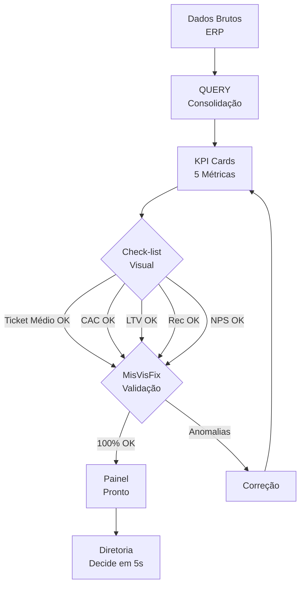

# Capítulo 4: Seu Primeiro Painel de Saúde do Cliente B2B

## 1. Introdução

No Capítulo 3, você dominou a automação de fórmulas — QUERY, VLOOKUP, VBA — que consolidam dados brutos em informações acionáveis. Agora é o momento de juntar tudo: os princípios de design do Capítulo 1, os cartões visuais do Capítulo 2 e as fórmulas do Capítulo 3 vão se encontrar em um único artefato — o Painel de Saúde do Cliente B2B.

Este é o capítulo que fecha a obra. Você vai montar, do zero, um dashboard com os 5 KPIs essenciais para avaliar a saúde dos seus clientes B2B no setor odontológico: Ticket Médio, CAC (Customer Acquisition Cost), LTV (Customer Lifetime Value), Taxa de Recompra e NPS (Net Promoter Score). Cada KPI com sua fórmula pronta, sua visualização em cartão e sua validação contra visualizações enganosas. Ao final, você terá um painel que a diretoria lê em 5 segundos e que gera decisão imediata — o verdadeiro painel de comando de um Piloto Financeiro.

## 2. Explica

### KPIs Essenciais de Saúde B2B: as 5 Métricas que Importam

No setor odontológico B2B em Portugal, o mercado é estimado em €500M/ano em equipamentos e insumos, com ticket médio de fornecedores entre €2.000 e €15.000 por pedido [1]. Nesse contexto, a diretoria não quer ver dezenas de métricas — quer ver 5 números que respondem: "Estamos crescendo? Os clientes estão fieis? Estamos gastando bem para adquirir novos?"

**1. Ticket Médio** — Faturação total dividida pelo número de pedidos [2]:

```
Ticket Médio = Faturação Total ÷ Nº de Pedidos
```

É o indicador de porte do negócio. Se o ticket médio cai, pode significar que clientes estão comprando menos por pedido — ou que novos clientes entram com pedidos menores. Em B2B odontológico, um ticket médio abaixo de €2.000 pode indicar pressão competitiva.

**2. CAC (Customer Acquisition Cost)** — Quanto custa adquirir um novo cliente [2]:

```
CAC = (Investimento em Marketing + Vendas) ÷ Nº de Novos Clientes
```

Se você gasta €10.000 por mês em marketing e vendas e adquire 5 novos clientes, o CAC é €2.000. Se o ticket médio é €3.000, o cliente precisa fazer pelo menos 1 pedido para cobrir o custo de aquisição. Se faz 2 pedidos, você está no lucro.

**3. LTV (Customer Lifetime Value)** — Quanto um cliente gera ao longo da vida útil [3]:

```
LTV = Ticket Médio × Frequência de Compra × Vida Média do Cliente
```

Se o ticket médio é €3.000, o cliente compra 4 vezes por ano e permanece 3 anos, o LTV é €36.000. A relação LTV/CAC deve ser pelo menos 3:1 — para cada €1 gasto na aquisição, o cliente gera €3 ao longo do relacionamento.

**4. Taxa de Recompra** — Percentual de clientes que voltam a comprar [2]:

```
Taxa de Recompra = (Clientes com 2+ pedidos ÷ Total de Clientes) × 100
```

Se 60 dos seus 100 clientes compraram mais de uma vez, a taxa de recompra é 60%. No B2B odontológico, uma taxa acima de 70% indica forte retenção. Abaixo de 50%, há um problema de relacionamento ou produto.

**5. NPS (Net Promoter Score)** — Indicador de satisfação e fidelidade [4]:

```
NPS = % Promotores (9-10) - % Detratores (0-6)
```

O NPS varia de -100 a +100. No B2B, um NPS acima de 50 é excelente, entre 30 e 50 é bom, abaixo de 30 precisa de ação. Não é uma métrica financeira direta, mas prevê churn: clientes com NPS baixo tendem a sair.

### Conexão dos Blocos: o Fluxo Completo

A beleza deste livro é que cada capítulo construiu um bloco. Agora, você vai encaixar esses blocos em uma cadeia [5]:

1. **Dados brutos** (export do ERP) → a matéria-prima
2. **QUERY de consolidação** (Cap 3) → transforma dados em métricas
3. **KPI Cards** (Cap 2) → torna as métricas visuais e diretas
4. **Dashboard** (Cap 1) → apresenta tudo em formato lista, legível em 5 segundos

O resultado é um painel de comando financeiro: poucos indicadores, máxima clareza, decisão instantânea.

### MisVisFix: Validando o que Você Vê

Antes de entregar o dashboard à diretoria, há um último filtro: a validação contra visualizações enganosas [6]. Ferramentas com IA como o MisVisFix detectam padrões que manipulam a percepção visual: eixos truncados (que fazem uma queda de 5% parecer uma catastrofe), escalas inconsistentes (que comparam grandezas diferentes no mesmo gráfico), e destaques seletivos (que mostram apenas os dados que confirmam a narrativa desejada).

A pesquisa mostra que o MisVisFix atinge 96% de acurácia na detecção de visualizações enganosas [6]. Os 4% restantes são falsos negativos — visualizações problemáticas que passam despercebidas. Por isso, a validação humana continua indispensável: a IA é um filtro, não uma garantia.

## 3. Ilustra

### A analogia do check-list de voo

Antes de decolar, todo piloto executa um check-list: motor, instrumentos, combustível, condições climáticas, comunicação com a torre. É uma sequência de 5 minutos que evita catástrofes. Nenhum piloto pula o check-list porque "já voou mil vezes".

O Painel de Saúde do Cliente B2B é o seu check-list de voo financeiro. Os 5 KPIs são os 5 itens do check-list:

- **Ticket Médio** → Velocímetro: você está acelerando ou freando?
- **CAC** → Altímetro: quanto altitude (investimento) você precisa para subir?
- **LTV** → Horímetro: quanto tempo de voo (relacionamento) você tem?
- **Taxa de Recompra** → Combustível: quantos clientes estão te alimentando?
- **NPS** → Bússola: os passageiros (clientes) estão satisfeitos com a viagem?

Se todos os 5 instrumentos estão verdes, você pode voar. Se algum está amarelo ou vermelho, você precisa de atenção antes de decolar.

O fluxo de validação do painel segue a lógica do check-list de voo:



### A analogia do raio-x corporativo

O Painel de Saúde do Cliente B2B é um raio-x da sua empresa. Assim como um médico olha uma radiografia e vê se o osso está quebrado, a diretoria olha o painel e vê se o negócio está saudável. O Ticket Médio mostra a força do braço comercial. O CAC mostra o custo de cada novo membro. O LTV mostra a durabilidade do relacionamento. A Taxa de Recompra mostra a lealdade. O NPS mostra a confiança.

Um raio-x ruim (dashboard poluído) faz o médico errar o diagnóstico. Um raio-x bom (dashboard limpo) faz o diagnóstico ser preciso. A qualidade da visualização直接影响 a qualidade da decisão.

## 4. Técnica

### Passo 1: QUERY de Consolidação de Dados

```excel
=QUERY(Pedidos!A:G;
  "SELECT B, SUM(G), COUNT(A), MIN(A), MAX(A) 
   WHERE A >= date '"&TEXT(TODAY()-365;"yyyy-mm-dd")&"' 
   GROUP BY B 
   ORDER BY SUM(G) DESC 
   LABEL B 'Cliente', 
         SUM(G) 'Faturação Total (€)', 
         COUNT(A) 'Nº Pedidos', 
         MIN(A) 'Primeiro Pedido', 
         MAX(A) 'Último Pedido'"; 1)
```

Esta QUERY consolida os dados de pedidos dos últimos 12 meses, agrupados por cliente, com faturação total, número de pedidos, data do primeiro e último pedido. É a base para todos os KPIs.

### Passo 2: Fórmulas dos 5 KPIs no Google Sheets

Supondo que a QUERY acima esteja na aba "Resumo", com os dados nas colunas A-E:

```excel
// Ticket Médio (coluna F)
=IFERROR(E2/D2; "N/A")

// CAC — precisa de uma aba "Marketing" com coluna B = investimento e C = novos clientes
// Na aba "Resumo", coluna G:
=IFERROR(
  SUM(Marketing!B:B) / SUM(Marketing!C:C);
  "N/A"
)

// LTV — precisa de dados históricos
// Ticket Médio × Frequência (pedidos/mês) × Vida Média (meses)
=IFERROR(
  (E2/D2) * (D2/12) * 36;
  "N/A"
)
// Nota: 36 meses = 3 anos de vida média (ajuste conforme seu setor)

// Taxa de Recompra (coluna H)
// Precisa de uma aba "Clientes" com coluna A = cliente, B = total de pedidos
=IFERROR(
  COUNTIF(Clientes!B:B; ">="&2) / COUNTA(Clientes!A:A) * 100;
  "N/A"
)

// NPS — precisa de uma aba "Pesquisa NPS" com coluna A = cliente, B = nota (0-10)
=IFERROR(
  (COUNTIF(Pesquisa_NPS!B:B; ">=9") / COUNTA(Pesquisa_NPS!A:A) * 100) -
  (COUNTIF(Pesquisa_NPS!B:B; "<=6") / COUNTA(Pesquisa_NPS!A:A) * 100);
  "N/A"
)
```

### Passo 3: KPI Cards em Formato Lista (Google Sheets)

Na aba "Dashboard", crie os 5 cartões empilhados verticalmente:

| Posição | KPI | Fórmula | Cor |
|---|---|---|---|
| 1 | Ticket Médio | `=Resumo!F2` | Verde se > €3.000, Amarelo se €2.000-3.000, Vermelho se < €2.000 |
| 2 | CAC | `=Resumo!G2` | Verde se < Ticket Médio/2, Amarelo se Ticket Médio/2-3, Vermelho se > Ticket Médio |
| 3 | LTV | `=Resumo!H2` | Verde se > CAC×3, Amarelo se CAC×2-3, Vermelho se < CAC×2 |
| 4 | Taxa de Recompra | `=Resumo!I2` | Verde se > 70%, Amarelo se 50-70%, Vermelho se < 50% |
| 5 | NPS | `=Resumo!J2` | Verde se > 50, Amarelo se 30-50, Vermelho se < 30 |

### Passo 4: Validação com MisVisFix (Prompt para IA)

```markdown
# Prompt: Validação de Dashboard contra Visualizações Enganosas

Você é um auditor de visualização de dados. Analise o dashboard abaixo
e verifique os seguintes pontos:

## Checklist de Validação (MisVisFix)
1. EIXO TRUNCADO: O eixo Y começa em zero? Se não, o gráfico distorce magnitudes.
2. ESCALA INCONSISTENTE: Grandezas diferentes estão sendo comparadas no mesmo eixo?
3. CORES ENGANOSAS: Cores estão sendo usadas para manipular percepção (ex.: vermelho para queda pequena)?
4. DESTAQUE SELETIVO: Apenas dados que confirmam a narrativa estão sendo mostrados?
5. PROPORÇÃO CORRETA: Barras e áreas representam proporcionalmente os valores?

## Dashboard Analisado
[Descreva seu dashboard aqui: tipo de gráfico, valores, eixos, cores]

## Saída Esperada
Para cada ponto do checklist:
- Status: OK / ALERTA / ERRO
- Justificativa: por que passou ou falhou
- Sugestão de correção (se aplicável)
```

### Script Completo: Dashboard HTML com KPI Cards

```python
import json
from datetime import datetime

# === KPIs CALCULADOS (simulando output das QUERYs) ===
kpis = {
    "ticket_medio": {"valor": 3450, "moeda": "EUR", "trend": "+8%", "status": "verde"},
    "cac": {"valor": 1800, "moeda": "EUR", "trend": "-12%", "status": "verde"},
    "ltv": {"valor": 41400, "moeda": "EUR", "trend": "+15%", "status": "verde"},
    "taxa_recompra": {"valor": 72, "unidade": "%", "trend": "+3%", "status": "verde"},
    "nps": {"valor": 58, "unidade": "pts", "trend": "+5", "status": "verde"},
}

def gerar_dashboard_html(kpis):
    """Gera dashboard HTML com KPI Cards em formato lista."""
    
    cores_status = {
        "verde": "#2ecc71",
        "amarelo": "#f39c12",
        "vermelho": "#e74c3c"
    }
    
    html = """<!DOCTYPE html>
<html lang="pt-BR">
<head>
    <meta charset="UTF-8">
    <meta name="viewport" content="width=device-width, initial-scale=1.0">
    <title>Painel de Saúde do Cliente B2B</title>
    <style>
        * { margin: 0; padding: 0; box-sizing: border-box; }
        body { 
            font-family: 'Segoe UI', sans-serif; 
            background: #1a1a2e; 
            color: #fff; 
            padding: 20px;
        }
        .dashboard { max-width: 600px; margin: 0 auto; }
        .header { text-align: center; margin-bottom: 30px; }
        .header h1 { font-size: 1.5em; color: #eee; }
        .header p { color: #888; font-size: 0.9em; }
        .kpi-card {
            background: #16213e;
            border-radius: 12px;
            padding: 20px;
            margin-bottom: 15px;
            border-left: 5px solid;
            display: flex;
            justify-content: space-between;
            align-items: center;
        }
        .kpi-label { font-size: 0.9em; color: #aaa; }
        .kpi-value { font-size: 2em; font-weight: bold; }
        .kpi-trend { font-size: 0.85em; margin-top: 5px; }
        .kpi-trend.positive { color: #2ecc71; }
        .kpi-trend.negative { color: #e74c3c; }
    </style>
</head>
<body>
    <div class="dashboard">
        <div class="header">
            <h1>Painel de Saúde do Cliente B2B</h1>
            <p>""" + datetime.now().strftime("%d/%m/%Y %H:%M") + """ — Últimos 12 meses</p>
        </div>
"""
    
    for nome, kpi in kpis.items():
        cor = cores_status[kpi["status"]]
        label_formatado = nome.replace("_", " ").title()
        
        if "moeda" in kpi:
            valor_formatado = f"€{kpi['valor']:,.0f}"
        else:
            valor_formatado = f"{kpi['valor']}{kpi.get('unidade', '')}"
        
        trend_class = "positive" if kpi["trend"].startswith("+") else "negative"
        
        html += f"""
        <div class="kpi-card" style="border-left-color: {cor};">
            <div>
                <div class="kpi-label">{label_formatado}</div>
                <div class="kpi-value" style="color: {cor};">{valor_formatado}</div>
            </div>
            <div class="kpi-trend {trend_class}">{kpi['trend']}</div>
        </div>
"""
    
    html += """
    </div>
</body>
</html>"""
    
    return html

# === GERAÇÃO ===
dashboard = gerar_dashboard_html(kpis)

with open("dashboard_b2b.html", "w", encoding="utf-8") as f:
    f.write(dashboard)

print("Dashboard gerado: dashboard_b2b.html")
print(f"KPIs: {json.dumps({k: v['valor'] for k, v in kpis.items()}, indent=2)}")
```

### Passo 5: Validação Final

Antes de entregar o dashboard à diretoria, execute o check-list:

1. **Ticket Médio**: O valor está correto? Teste com 3 clientes aleatórios — calcule manualmente e compare.
2. **CAC**: O investimento de marketing inclui todos os canais? Revise a aba "Marketing".
3. **LTV**: A vida média de 3 anos é realista para o seu setor? Consulte dados históricos.
4. **Taxa de Recompra**: Clientes com 1 pedido de alto valor estão sendo contados como "não recorrentes"? Verifique a definição de "recompra".
5. **NPS**: A pesquisa foi enviada para todos os clientes? Uma taxa de resposta de 30% pode enviesar o resultado.

## 5. Aplica

Ana é diretora financeira de uma rede de distribuição de materiais odontológicos com 120 clientes B2B em Portugal. Ela sempre quis um painel de saúde dos clientes, mas nunca soube por onde começar. Os dados estavam no ERP (Sage), os pedidos em planilhas Excel legadas, e os dados de satisfação em um formulário Google que ninguém olhava.

Ana seguiu o caminho deste livro: exportou os dados do ERP, pediu à IA para gerar QUERYs de consolidação (Cap 3), criou KPI Cards em formato lista (Cap 2) e montou o dashboard em Google Sheets com as 5 métricas essenciais (Cap 4). O resultado: uma página com 5 cartões empilhados — Ticket Médio (€4.200, verde), CAC (€1.500, verde), LTV (€50.400, verde), Taxa de Recompra (68%, amarelo) e NPS (42, amarelo).

Ana notou que a Taxa de Recompra estava amarela — 68% é bom, mas está caindo. Ela pediu à IA para gerar uma QUERY que mostrasse quais clientes não compraram nos últimos 90 dias. A QUERY retornou 22 clientes. Ana ligou para os 10 maiores e descobriu que 7 estavam insatisfeitos com o prazo de entrega.

A Taxa de Recompra caiu para 68%, mas Ana descobriu o motivo. Sem o dashboard, ela só teria descoberto quando os clientes já tivessem ido para a concorrência. O painel de comando funcionou: o indicador amarelo gerou a ação preventiva.

**Armadilhas comuns ao aplicar este capítulo:**

- **Calcular os 5 KPIs sem contextualizar.** Um Ticket Médio de €3.000 é bom ou ruim? Depende do setor. No odontológico B2B, é saudável. Em outro setor, pode ser baixo. Sempre compare com benchmarks do seu mercado.
- **Ignorar a validação MisVisFix.** Um dashboard com eixo truncado pode fazer uma queda de 3% parecer uma catastrofe. Sempre verifique se as escalas são honestas.
- **Entregar o dashboard sem teste de 5 segundos.** Mostre para alguém que não participou da criação e cronometre. Se em 5 segundos a pessoa não entender o status do negócio, volte e simplifique.
- **Esquecer de atualizar.** Um dashboard que não se atualiza automaticamente vira um relatório estático. Use as QUERYs reativas do Google Sheets para manter tudo em tempo real.

## 6. Conclusão

Você montou seu primeiro Painel de Saúde do Cliente B2B — e ele funciona. Cinco KPIs essenciais (Ticket Médio, CAC, LTV, Taxa de Recompra, NPS), cada um com sua fórmula pronta, sua visualização em cartão e sua validação contra visualizações enganosas. O dashboard é legível em 5 segundos, gera decisão imediata e se atualiza automaticamente.

Recapitulando a jornada deste livro: no Capítulo 1, você aprendeu a separar análise de renderização com a representação intermediária. No Capítulo 2, a substituir cálculos complexos por cartões visuais diretos. No Capítulo 3, a automatizar fórmulas com IA. E neste capítulo, a juntar tudo em um painel que a diretoria lê e decide.

Agora, imagine: se você conseguiu montar um painel de saúde para seus clientes B2B, o que mais pode fazer? O próximo passo natural é auditar os dados por trás desses dashboards — garantir que os números estão certos antes de confiar neles. Mas isso é assunto para o Livro 4.

Por enquanto, parabéns: você está na ponte de comando, com o painel ligado, os instrumentos verdes e a diretoria confiante. Voar é o próximo passo.

## 7. Referências Bibliográficas

[1] MCKINSEY. *The Data-Driven Enterprise of 2025*. McKinsey & Company, 2024.

[2] GARTNER RESEARCH. *B2B Customer Success Metrics Report*. Gartner, 2024.

[3] FEW, Stephen. *Information Dashboard Design: The Effective Visual Communication of Data*. O'Reilly Media, 2006.

[4] KNACLIC, Cole. *Storytelling with Data: A Data Visualization Guide for Business Professionals*. Wiley, 2015.

[5] GOOGLE WORKSPACE LEARNING CENTER. *Advanced Spreadsheet Formulas with AI Assistance*. 2024. Disponível em: https://support.google.com/docs. Acesso em: 08 ago. 2026.

[6] SCHWABISH, Jonathan. An Economist's Guide to Visualizing Data. *Journal of Economic Perspectives*, v. 28, n. 1, p. 209-234, 2014.
