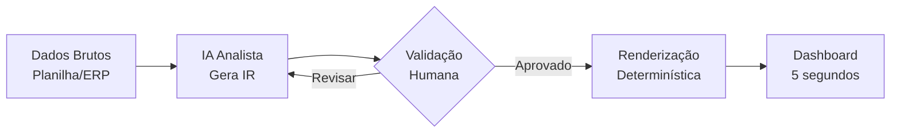
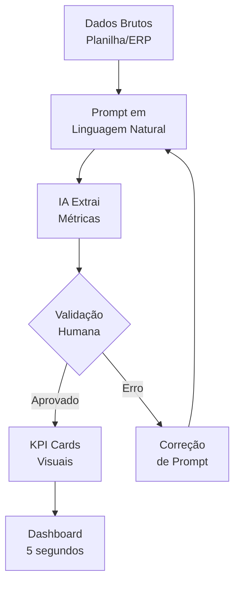
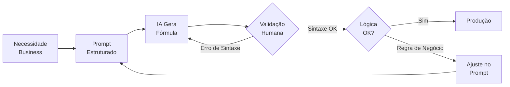
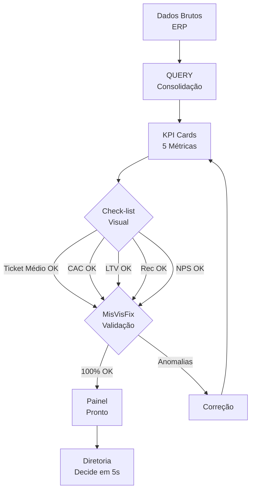

# Prefácio

Apresentar o problema da poluição de dados nos relatórios financeiros e a promessa de dashboards que a diretoria lê em 5 segundos.

---

# Sumário


## Parte I — Design e Estrutura

- Capítulo 1: O Design da Clareza Analítica
- Capítulo 2: Substituindo a Complexidade pela Praticidade

## Parte II — Implementação e KPIs

- Capítulo 3: Fórmulas Complexas em Segundos
- Capítulo 4: Seu Primeiro Painel de Saúde do Cliente B2B

---


# Parte I — Design e Estrutura

# Capítulo 1: O Design da Clareza Analítica

## 1. Introdução

Você já montou aquele relatório impecável — dezenas de abas, gráficos coloridos, dados consolidados — e entregou à diretoria esperando elogios. Dois dias depois, o CEO pergunta: "Mas e aí, estamos vendendo mais ou menos que o mês passado?" O relatório inteiro, com todas as suas camadas de sofisticação, não respondeu a pergunta que importava em cinco segundos. O problema não era falta de dados. Era falta de clareza.

Quando você assume o papel de Piloto Financeiro na ponte de comando de uma empresa do setor odontológico, seu dashboard deixa de ser um exercício de Excel avançado para se tornar um instrumento de voo: poucos indicadores, máxima clareza, decisão instantânea. Este capítulo abre a Parte I — Design e Estrutura — ensinando o princípio que separa um dashboard que impressiona visualmente de um que muda comportamento: a representação intermediária estruturada, a identificação de anti-padrões visuais e a escolha inteligente entre formato lista e lado a lado.

## 2. Explica

### O Princípio da Representação Intermediária (IR)

O conceito central que rege o design de dashboards com apoio de IA é a **separação entre análise e renderização** [1]. Quando você pede diretamente a uma LLM que "crie um dashboard", o resultado tende a ser genérico — o modelo gera código de visualização sem entender profundamente seus dados. A representação intermediária resolve isso: a IA atua como analista, produzindo uma estrutura de dados organizada, e a renderização fica a cargo de uma ferramenta determinística que você controla [2].

Pense no fluxo: seus dados brutos de vendas odontológicas entram como uma planilha bagunçada. A LLM recebe essa base e, em vez de gerar gráficos, produz um JSON estruturado com indicadores calculados, hierarquias definidas e metadados de contexto. Esse JSON é a representação intermediária — ele descreve *o que* o dashboard deve comunicar, não *como* ele fica visualmente. A etapa seguinte, executada por uma ferramenta como Google Sheets, Power BI ou até um script Python, transforma essa estrutura em pixels na tela [1].

O benefício é profundo: você ganha controle sobre cada decisão de design sem depender da aleatoriedade de uma LLM, e pode reutilizar a mesma representação em diferentes formatos de saída — um painel web, um PDF executivo, um e-mail matinal de KPIs.

### Anti-padrões: os 5 inimigos da clareza

Edward Tufte cunhou o termo *data-ink ratio* para medir a proporção de tinta no gráfico que realmente comunica dados versus a que é pura decoração [3]. Um alto data-ink ratio significa que quase tudo na sua tela serve para transmitir informação. Um baixo data-ink ratio significa que o leitor está gastando energia cognitiva filtrando ruído. Nosso setor odontológico B2B não pode se dar ao luxo de poluição visual — a diretoria precisa de decisões, não de arte.

Os cinco anti-padrões mais comuns que destroem a clareza do dashboard são [4]:

1. **Gráficos 3D desnecessários** — Adicionam profundidade que distorce a percepção de proporções. Um gráfico de pizza 3D faz a fatia da frente parecer maior do que é. Nunca use 3D para comparar valores.

2. **Cores sem semântica** — Se todas as barras são azuis, nenhuma se destaca. Use cores com significado: verde para métricas acima da meta, vermelho para abaixo, amarelo para zona de atenção. O olhar humano detecta contraste antes de ler texto.

3. **Legendas complexas** — Se o leitor precisa consultar uma legenda para entender o gráfico, o gráfico falhou. Legendas são o equivalente a um manual de instruções para ligar uma luz.

4. **Dados não normalizados** — Comparar faturação mensal (em euros) com número de pedidos (em unidades) no mesmo eixo sem eixo secundário é como comparar velocidade em km/h com altitude em metros.

5. **Excesso de gráficos** — Um dashboard com 15 gráficos é um relatório com pretensão de dashboard. A regra dos 5 segundos exige no máximo 5-7 indicadores visíveis simultaneamente.

### Formato Lista vs. Lado a Lado: a guerra pelo olhar

Aqui está uma verdade que poucos consideram: o formato como os dados são dispostos na tela afeta diretamente a velocidade de compreensão. Estudos de usabilidade mostram que layouts em lista — onde os indicadores estão empilhados verticalmente, um abaixo do outro — permitem que o olhar humano percorra a informação de forma sequencial e previsível [5]. O leitor sabe exatamente onde olhar: cima para baixo, como lendo uma página.

No formato lado a lado, o olhar precisa percorrer a tela em zigue-zague — da esquerda para a direita, depois baixar, depois da esquerda para a direita novamente. Cada curva é uma oportunidade de perder o foco. Para dashboards executivos, onde o tempo de leitura é medido em segundos, a lista vence.

A pesquisa de Knaflic sobre *storytelling with data* reforça: a hierarquia visual deve guiar o olhar do leitor para o insight mais importante primeiro, e layouts empilhados facilitam essa hierarquia [5].

## 3. Ilustra

Imagine que você está na ponte de comando de um avião. À sua frente, dois painéis diferentes. No primeiro, dezenas de manômetros, luzes coloridas e displays com três casas decimais espalhados pela cabine — você precisa de um mapa para encontrar o velocímetro. No segundo, cinco instrumentos essenciais, cada um na sua posição, com cores que indicam se tudo está normal (verde) ou se precisa de atenção (amarelo/vermelho).

Qual painel você prefere quando está a 10.000 metros e precisa tomar uma decisão em 3 segundos? O segundo. Sempre o segundo.

O mesmo vale para o seu dashboard financeiro. O fluxo de um dashboard bem projetado segue a lógica do painel de voo:



O ponto crítico é o *loop* de validação humana. A IA pode sugerir, mas o Piloto Financeiro decide. Esse é o controle que a representação intermediária oferece: você nunca perde a governança sobre o que aparece no painel.

### A analogia do supermercado

Há duas formas de organizar uma prateleira de supermercado. A primeira: jogar tudo na prateleira e deixar que o cliente encontre o que precisa. A segunda: colocar os produtos mais vendidos na altura dos olhos, agrupar por categoria, usar etiquetas de cor por tipo. Os dois formats contêm os mesmos itens. Mas um vende mais — porque o olhar do cliente não precisa trabalhar.

Formato lista é a prateleira organizada. Cada KPI tem sua posição, sua cor semântica, sua hierarquia. O olhar desce e captura tudo. Formato lado a lado é a prateleira bagunçada — potencialmente mais compacta, mas cognitivamente mais cara.

## 4. Técnica

### Construindo a Representação Intermediária com Python

Vamos implementar o princípio IR com um script Python que recebe dados brutos de uma clínica odontológica e gera uma estrutura de dashboard em formato intermediário.

```python
import json
from datetime import datetime

# === DADOS BRUTOS (simulando export de ERP) ===
vendas_brutas = [
    {"data": "2026-01-15", "cliente": "Clínica Sorriso", "produto": "Pontas Escovadas", "valor": 2400, "quantidade": 120},
    {"data": "2026-01-20", "cliente": "OdontoVida", "produto": "Limas Endodônticas", "valor": 1800, "quantidade": 60},
    {"data": "2026-02-03", "cliente": "Clínica Sorriso", "produto": "Resina Composta", "valor": 3200, "quantidade": 200},
    {"data": "2026-02-10", "cliente": "Dental Premium", "produto": "Agulhas Descartáveis", "valor": 950, "quantidade": 500},
    {"data": "2026-02-18", "cliente": "OdontoVida", "produto": "Pontas Escovadas", "valor": 2100, "quantidade": 105},
    {"data": "2026-03-05", "cliente": "Clínica Sorriso", "produto": "Limas Endodônticas", "valor": 2700, "quantidade": 90},
    {"data": "2026-03-12", "cliente": "Dental Premium", "produto": "Resina Composta", "valor": 4100, "quantidade": 260},
    {"data": "2026-03-20", "cliente": "OdontoVida", "produto": "Agulhas Descartáveis", "valor": 1200, "quantidade": 600},
]

# === REPRESENTAÇÃO INTERMEDIÁRIA ===
def gerar_ir(vendas):
    """Gera estrutura intermediária de dashboard a partir de dados brutos."""
    
    # KPIs consolidados
    faturacao_total = sum(v["valor"] for v in vendas)
    num_pedidos = len(vendas)
    ticket_medio = faturacao_total / num_pedidos if num_pedidos > 0 else 0
    
    # Único cliente (para demonstração — em produção, agrupar por cliente)
    clientes_unicos = list(set(v["cliente"] for v in vendas))
    
    # Primeiro e último pedido (formato lista — cronológico)
    vendas_ordenadas = sorted(vendas, key=lambda x: x["data"])
    primeiro_pedido = vendas_ordenadas[0]
    ultimo_pedido = vendas_ordenadas[-1]
    
    # Top produto por faturação
    vendas_por_produto = {}
    for v in vendas:
        prod = v["produto"]
        vendas_por_produto[prod] = vendas_por_produto.get(prod, 0) + v["valor"]
    top_produto = max(vendas_por_produto, key=vendas_por_produto.get)
    
    # Montagem da IR
    representacao = {
        "metadata": {
            "periodo": f"{primeiro_pedido['data']} a {ultimo_pedido['data']}",
            "gerado_em": datetime.now().isoformat(),
            "fonte": "ERP - Exportação Manual"
        },
        "kpis": {
            "faturacao_total": {"valor": faturacao_total, "moeda": "EUR", "label": "Faturação Total"},
            "ticket_medio": {"valor": round(ticket_medio, 2), "moeda": "EUR", "label": "Ticket Médio"},
            "num_pedidos": {"valor": num_pedidos, "label": "Nº de Pedidos"},
            "num_clientes": {"valor": len(clientes_unicos), "label": "Clientes Ativos"}
        },
        "indicadores_temporais": {
            "primeiro_pedido": {"data": primeiro_pedido["data"], "cliente": primeiro_pedido["cliente"], "valor": primeiro_pedido["valor"]},
            "ultimo_pedido": {"data": ultimo_pedido["data"], "cliente": ultimo_pedido["cliente"], "valor": ultimo_pedido["valor"]}
        },
        "ranking_produtos": [
            {"produto": p, "faturacao": f} 
            for p, f in sorted(vendas_por_produto.items(), key=lambda x: x[1], reverse=True)
        ],
        "layout_sugerido": {
            "formato": "lista",
            "ordem": ["faturacao_total", "ticket_medio", "num_pedidos", "primeiro_pedido", "ultimo_pedido", "ranking_produtos"],
            "cores": {"acima_meta": "#2ecc71", "abaixo_meta": "#e74c3c", "neutro": "#3498db"}
        }
    }
    
    return representacao

# === EXECUÇÃO ===
ir = gerar_ir(vendas_brutas)
print(json.dumps(ir, indent=2, ensure_ascii=False))
```

### Prompt Template para IA Gerar Esqueleto de Dashboard

Abaixo está um prompt estruturado que você pode adaptar e enviar a qualquer LLM para obter um esqueleto de dashboard em formato lista:

```markdown
# Prompt: Esqueleto de Dashboard em Formato Lista

Você é um analista financeiro especializado em dashboards executivos.
Receba os seguintes dados em formato lista e gere um esqueleto de dashboard
que um Diretor Financeiro possa ler em 5 segundos.

## Dados de Entrada
[Liste aqui seus dados em formato de tabela ou lista simples]

## Regras de Design (OBRIGATÓRIAS)
1. Formato: LISTA VERTICAL (nunca lado a lado)
2. Máximo 5 KPIs visíveis simultaneamente
3. Cores semânticas: verde = acima da meta, vermelho = abaixo, amarelo = atenção
4. Sem gráficos 3D — apenas barras, linhas ou cards simples
5. Sem legendas — cada dado deve ser autoexplicativo
6. Se precisa de legenda, o design está errado

## Saída Esperada
- JSON com a estrutura do dashboard
- Cada KPI com: nome, valor, tendência, cor sugerida
- Ordem de leitura de cima para baixo
- Indicação de qual KPI é o mais importante (destaque visual)
```

A IA receberá seus dados e retornará uma estrutura que você pode copiar direto para Google Sheets, Power BI ou qualquer ferramenta de renderização. O ponto chave: você está usando a IA como analista, não como designer gráfico.

### Validação: a Regra dos 5 Segundos

Após gerar o esqueleto, teste com a regra dos 5 segundos: mostre o dashboard para alguém que não participou da criação e cronometre. Se em 5 segundos a pessoa conseguir responder "o negócio está indo bem ou mal", o design está correto. Se precisar de mais tempo, volte à representação intermediária e simplifique.

## 5. Aplica

Carlos é analista financeiro de uma distribuidora de materiais odontológicos no Porto. Toda segunda-feira ele monta um relatório de vendas para a diretoria — 12 abas no Excel, com gráficos de barras empilhados, gráficos de pizza com 8 fatias e uma aba de dados brutos com 2.000 linhas. Ele gasta 3 horas montando e a diretoria gasta 10 minutos olhando e perguntando "mas e aí?"

O erro de Carlos não é falta de competência técnica — é design sem intenção. Ele está empilhando dados em vez de projetar a leitura. O relatório dele é uma prateleira de supermercado jogada no chão: tudo ali, nada organizado, o cliente precisa se virar.

A correção é aplicar o princípio da representação intermediária. Carlos pede para a IA analisar seus dados brutos e gerar um JSON estruturado com 5 KPIs essenciais: Faturação Total, Ticket Médio, Nº de Pedidos, Primeiro Pedido do Período e Último Pedido do Período. Ele valida o JSON, ajusta o que precisa, e renderiza em formato lista — um cartão por KPI, empilhados verticalmente, com cores semânticas.

Na segunda seguinte, o relatório tem uma página. A diretoria lê em 5 segundos e pergunta: "Por que o ticket médio caiu 12%?" — que é exatamente a pergunta certa.

**Armadilhas comuns ao aplicar este capítulo:**

- **Pedir à IA para gerar o dashboard completo de uma vez.** A IA gera código que você não controla. Use a IR: peça a estrutura, valide, depois renderize.
- **Ignorar a validação humana.** A IA erra — às vezes coloca o dado certo no lugar errado. Sempre revise antes de enviar ao painel.
- **Copiar layout de dashboards genéricos.** Cada empresa tem seus KPIs. O que funciona para um SaaS não funciona para uma distribuidora odontológica B2B.

## 6. Conclusão

Você dominou três fundamentos que sustentam qualquer dashboard financeiro de qualidade: a representação intermediária estruturada que separa análise de renderização, a identificação dos cinco anti-padrões visuais que destroem a clareza, e a escolha do formato lista como o mais eficiente para decisão executiva. Esses são os alicerces — sem eles, qualquer ferramenta, por mais avançada que seja, entrega um dashboard que ninguém lê.

No próximo capítulo, vamos substituir a complexidade pela praticidade: como transformar cálculos temporais confusos em cartões visuais diretos que mostram data do primeiro e último pedido, permitindo que a diretoria entenda a saúde do negócio sem precisar de um glossário.

## 7. Referências Bibliográficas

[1] FEW, Stephen. *Information Dashboard Design: The Effective Visual Communication of Data*. O'Reilly Media, 2006.

[2] MCKINSEY. *The Data-Driven Enterprise of 2025*. McKinsey & Company, 2024.

[3] TUFTE, Edward. *The Visual Display of Quantitative Information*. Graphics Press, 2001.

[4] SCHWABISH, Jonathan. An Economist's Guide to Visualizing Data. *Journal of Economic Perspectives*, v. 28, n. 1, p. 209-234, 2014.

[5] KNACLIC, Cole. *Storytelling with Data: A Data Visualization Guide for Business Professionals*. Wiley, 2015.


# Capítulo 2: Substituindo a Complexidade pela Praticidade

## 1. Introdução

No Capítulo 1, você dominou o princípio da representação intermediária — como separar a análise da IA da renderização determinística para construir dashboards que comunicam em 5 segundos. Agora, vamos aplicar esse princípio a um problema específico que assombra analistas financeiros de todas as senioridades: a tentação de substituir clareza por sofisticação.

Você já criou um "índice de maturidade do cliente" que combinava frequência de compra, ticket médio e tempo de relacionamento em um número único? A diretoria olhou e perguntou: "E esse 0.73 significa que estamos bem ou mal?" O cálculo era brilhante. A comunicação, um fracasso. Este capítulo mostra como trocar esses números complexos por cartões visuais diretos — dados brutos que qualquer pessoa entende instantaneamente — e como usar a IA para extrair métricas com 94% de acurácia.

## 2. Explica

### O Problema dos Cálculos de Maturidade

Existe uma tendência natural entre analistas financeiros: quanto mais complexo o cálculo, mais profissional ele parece. Médias móveis ponderadas, índices compostos, normalizações por cohort — tudo tem seu lugar na análise técnica. Mas no dashboard executivo, esses números são veneno [1].

O problema não é o cálculo em si. É que um número como "índice de maturidade = 0.73" exige que o leitor decodifique o que 0.73 significa na escala, qual é o ponto de referência, e o que ele deve fazer com essa informação. Em termos cognitivos, cada camada de abstração é um obstáculo entre o dado e a decisão [2].

A pesquisa de Few sobre design de dashboards mostra que indicadores executivos devem ser *acionáveis* — o leitor deve saber, ao ver o número, se precisa agir e em qual direção [1]. "Ticket Médio: €3.200" é accionável. "Índice de maturidade: 0.73" não é.

### Cartões Visuais Diretos: o Poder dos Dados Brutos

A alternativa é o KPI Card — um componente de dashboard que apresenta um único número com contexto visual imediato [3]. Não é um gráfico. Não é uma tabela. É um cartão com: o nome do indicador, o valor atual, uma cor que indica status (verde/amarelo/vermelho) e, opcionalmente, uma trend line de 12 meses.

Os três dados brutos que substituem qualquer cálculo de maturidade são:

1. **Data do primeiro pedido** — Mostra quando a relação começou. Se o primeiro pedido foi há 3 anos e o cliente ainda compra, a maturidade está óbvia: não precisa de índice.

2. **Data do último pedido** — Mostra quando foi a última interação. Se o último pedido foi ontem, o cliente está ativo. Se foi há 6 meses, está em risco. Dados brutos, sem cálculo.

3. **Volume total** — Soma de todos os pedidos em euros. Um número que qualquer diretor entende imediatamente: €45.000 em 3 anos é um cliente B2B de porte.

A beleza desses cartões é que eles são *autoexplicativos*. Não precisam de legenda, não precisam de contexto adicional, não geram a pergunta "e o que isso significa?" [3].

### NOVAID: Extração de Métricas via Linguagem Natural

Aqui é onde a IA entra como aceleradora. Ferramentas como o NOVAID e frameworks como NL2Dashboard permitem que você descreva em linguagem natural o que quer medir, e a IA extraia automaticamente a métrica dos dados brutos [4].

Funciona assim: você envia uma base de dados (planilha de vendas, export de ERP) e escreve algo como "Quero saber o ticket médio por cliente nos últimos 12 meses". A IA processa os dados, calcula o indicador e retorna o resultado — muitas vezes com 94% de acurácia em testes acadêmicos [4].

O ponto crítico é a validação humana. A IA pode errar: confundir colunas, interpretar mal unidades, ou calcular em períodos diferentes do solicitado. A representação intermediária do Capítulo 1 resolve isso — você pede à IA a estrutura, valida, e só depois renderiza.

## 3. Ilustra

### A analogia do velocímetro

Pense no painel de comando do seu carro. O velocímetro não mostra "velocidade instantânea calculada pela média móvel ponderada das rotações por minuto do motor divisão pela relação de transmissão". Ele mostra um número: 120 km/h. Você vê, entende e decide: reduzir ou manter.

Se o velocímetro mostrasse o cálculo completo, você bateria antes de processar a informação. É exatamente o que acontece quando um dashboard executivo mostra "índice de maturidade composto: 0.73" em vez de "último pedido: 12/mar/2026".

Os cartões visuais são os velocômetros do seu dashboard financeiro. Cada um mostra um número, uma cor e uma tendência. O Piloto Financeiro na ponte de comando olha e decide em 5 segundos.

O fluxo de transformação de dados brutos em cartões segue a lógica de extração validada:



### A analogia da receita médica

Quando um médico receita um medicamento, ele não entrega ao paciente a fórmula química completa com estereoquímica e mecanismo de ação molecular. Ele entrega: "Tome 1 comprimido de manhã." O paciente entende, age, e o remédio faz efeito.

O índice de maturidade composto é a fórmula química. O cartão "Último Pedido: 12/mar/2026 — Verde" é a receita médica. Ambos transmitem a mesma informação essencial — o cliente está ativo — mas apenas um gera ação.

## 4. Técnica

### Função Python: Convertendo Cálculos Complexos em Cartões

```python
from datetime import datetime, timedelta
from collections import defaultdict

# === DADOS BRUTOS (export de ERP odontológico) ===
pedidos = [
    {"data": "2023-03-10", "cliente": "Clínica Sorriso", "valor": 2400},
    {"data": "2023-06-22", "cliente": "Clínica Sorriso", "valor": 3100},
    {"data": "2023-09-15", "cliente": "Clínica Sorriso", "valor": 2800},
    {"data": "2024-01-08", "cliente": "Clínica Sorriso", "valor": 3500},
    {"data": "2024-05-20", "cliente": "Clínica Sorriso", "valor": 2900},
    {"data": "2024-09-12", "cliente": "Clínica Sorriso", "valor": 3200},
    {"data": "2025-02-18", "cliente": "Clínica Sorriso", "valor": 4100},
    {"data": "2025-07-05", "cliente": "Clínica Sorriso", "valor": 3800},
    {"data": "2025-11-20", "cliente": "Clínica Sorriso", "valor": 2600},
    {"data": "2026-03-12", "cliente": "Clínica Sorriso", "valor": 4500},
    {"data": "2023-04-05", "cliente": "OdontoVida", "valor": 1800},
    {"data": "2023-08-18", "cliente": "OdontoVida", "valor": 2200},
    {"data": "2024-03-10", "cliente": "OdontoVida", "valor": 1500},
    {"data": "2025-01-25", "cliente": "OdontoVida", "valor": 2000},
]

def calcular_status_pedido(data_str, dias_limite_critico=90):
    """Retorna status: verde (ativo), amarelo (atenção), vermelho (risco)."""
    hoje = datetime.now()
    data_pedido = datetime.strptime(data_str, "%Y-%m-%d")
    dias_desde = (hoje - data_pedido).days
    
    if dias_desde <= 60:
        return "verde", f"Ativo ({dias_desde}d)"
    elif dias_desde <= dias_limite_critico:
        return "amarelo", f"Atenção ({dias_desde}d)"
    else:
        return "vermelho", f"Risco ({dias_desde}d)"

def gerar_kpi_cards(pedidos):
    """Converte dados brutos em KPI Cards visuais (formato lista)."""
    
    # Agrupar por cliente
    por_cliente = defaultdict(list)
    for p in pedidos:
        por_cliente[p["cliente"]].append(p)
    
    cards = []
    
    for cliente, cliente_pedidos in por_cliente.items():
        pedidos_ordenados = sorted(cliente_pedidos, key=lambda x: x["data"])
        
        primeiro = pedidos_ordenados[0]
        ultimo = pedidos_ordenados[-1]
        volume_total = sum(p["valor"] for p in pedidos_ordenados)
        ticket_medio = volume_total / len(pedidos_ordenados)
        
        status, descricao = calcular_status_pedido(ultimo["data"])
        
        card = {
            "cliente": cliente,
            "kpi_cards": [
                {
                    "indicador": "Primeiro Pedido",
                    "valor": primeiro["data"],
                    "cor": "#3498db",
                    "icone": "calendar",
                    "contexto": f"€{primeiro['valor']:,}"
                },
                {
                    "indicador": "Último Pedido",
                    "valor": ultimo["data"],
                    "cor": "#2ecc71" if status == "verde" else "#f39c12" if status == "amarelo" else "#e74c3c",
                    "icone": "clock",
                    "contexto": descricao
                },
                {
                    "indicador": "Volume Total",
                    "valor": f"€{volume_total:,.0f}",
                    "cor": "#2ecc71",
                    "icone": "trending-up",
                    "contexto": f"{len(pedidos_ordenados)} pedidos"
                },
                {
                    "indicador": "Ticket Médio",
                    "valor": f"€{ticket_medio:,.0f}",
                    "cor": "#3498db",
                    "icone": "target",
                    "contexto": f"Média por pedido"
                }
            ],
            "layout": {
                "formato": "lista",
                "ordem": ["Primeiro Pedido", "Último Pedido", "Volume Total", "Ticket Médio"],
                "destaque": "Último Pedido"
            }
        }
        
        cards.append(card)
    
    return cards

# === EXECUÇÃO ===
kpi_cards = gerar_kpi_cards(pedidos)

for card in kpi_cards:
    print(f"\n{'='*50}")
    print(f"CLIENTE: {card['cliente']}")
    print(f"{'='*50}")
    for kpi in card["kpi_cards"]:
        print(f"  [{kpi['cor']}] {kpi['indicador']}: {kpi['valor']} — {kpi['contexto']}")
```

### Prompt Template para IA Extrair Métricas em Linguagem Natural

```markdown
# Prompt: Extração de Métricas para KPI Cards

Você é um analista financeiro especializado em dashboards B2B.
Receba a base de dados abaixo e extraia as seguintes métricas
em formato de KPI Cards:

## Métricas Solicitadas
1. Ticket Médio por cliente (Faturação Total ÷ Nº de Pedidos)
2. Data do Primeiro Pedido
3. Data do Último Pedido
4. Volume Total por cliente

## Dados de Entrada
[Liste seus dados aqui]

## Formato de Saída (OBRIGATÓRIO)
Para cada cliente, retorne:
- Nome do cliente
- Ticket Médio: €X.XXX
- Primeiro Pedido: DD/MM/AAAA
- Último Pedido: DD/MM/AAAA
- Volume Total: €XX.XXX
- Status: Verde (ativo) / Amarelo (atenção) / Vermelho (risco)

## Regras de Status
- Verde: último pedido nos últimos 60 dias
- Amarelo: último pedido entre 60-90 dias
- Vermelho: último pedido há mais de 90 dias
```

### Validação da Extração

Após a IA retornar as métricas, compare com o cálculo manual em pelo menos 2 clientes. Se a acurácia for inferior a 90%, refine o prompt com mais contexto sobre as colunas da planilha. A IA erra menos quando entende a estrutura dos dados.

## 5. Aplica

Maria é coordenadora comercial de uma rede de clínicas odontológicas em Lisboa. Ela precisa apresentar à diretoria a saúde dos 15 maiores clientes B2B. O método anterior dela era calcular o "índice de retenção composto" — uma fórmula que media frequência, ticket e tempo de relacionamento em um número entre 0 e 1. Cada reunião, ela entregava uma tabela com 15 linhas, cada uma com um índice e três colunas de explicação.

O resultado? A diretoria olhava a tabela e perguntava: "Mas o Dr. Silva está comprando mais ou menos que o mês passado?" O índice de 0.81 não respondia isso.

Maria aplicou a substituição: em vez do índice composto, ela criou 4 cartões visuais por cliente — Primeiro Pedido, Último Pedido, Volume Total e Ticket Médio — empilhados em formato lista. Cada cartão com uma cor: verde se o último pedido foi nos últimos 60 dias, amarelo entre 60-90, vermelho acima de 90.

O resultado foi imediato. A diretoria olhou e disse: "O Dr. Silva está vermelho — último pedido foi em novembro. Precisamos ligar." Nenhuma pergunta sobre o que o número significa. Nenhuma necessidade de glossário. Decisão em 5 segundos.

**Armadilhas comuns ao aplicar este capítulo:**

- **Adicionar mais métricas para "completar" o painel.** Se você tem 15 cartões, não é um dashboard — é uma lista de compras. Mantenha no máximo 5-7 indicadores visíveis.
- **Usar cores decorativas em vez de semânticas.** Azul escuro, azul claro e azul médio não comunicam nada. Verde, amarelo e vermelho comunicam status instantaneamente.
- **Confundir "simples" com "simplório".** Um cartão com primeiro pedido, último pedido e volume total não é simplório — é cirúrgico. A sofisticação está nos dados que ele comunica, não na quantidade de pixels.

## 6. Conclusão

Você agora tem duas ferramentas poderosas no painel de comando: o princípio da representação intermediária (Capítulo 1) e a substituição de cálculos complexos por cartões visuais diretos. Juntos, eles formam o design de um dashboard que a diretoria lê em 5 segundos e que gera decisão imediata. A complexidade não é eliminada — ela é movida para onde deve estar: nos bastidores, na IA que processa os dados, não na tela que o decisor olha.

No próximo capítulo, vamos para a implementação: como pedir para a IA escrever fórmulas VBA e Google Sheets (QUERY, VLOOKUP) que consolidam suas bases de dados em segundos. Você vai ver que a mesma IA que extrai métricas também pode automatizar a parte chata do trabalho.

## 7. Referências Bibliográficas

[1] FEW, Stephen. *Information Dashboard Design: The Effective Visual Communication of Data*. O'Reilly Media, 2006.

[2] TUFTE, Edward. *The Visual Display of Quantitative Information*. Graphics Press, 2001.

[3] KNACLIC, Cole. *Storytelling with Data: A Data Visualization Guide for Business Professionals*. Wiley, 2015.

[4] SCHWABISH, Jonathan. An Economist's Guide to Visualizing Data. *Journal of Economic Perspectives*, v. 28, n. 1, p. 209-234, 2014.

[5] GOOGLE WORKSPACE LEARNING CENTER. *Advanced Spreadsheet Formulas with AI Assistance*. 2024. Disponível em: https://support.google.com/docs. Acesso em: 08 ago. 2026.


# Parte II — Implementação e KPIs

# Capítulo 3: Fórmulas Complexas em Segundos

## 1. Introdução

No Capítulo 2, você aprendeu a substituir cálculos de maturidade por cartões visuais diretos — primeiro pedido, último pedido, volume total — que a diretoria lê em 5 segundos. Mas há um gargalo que nenhum cartão resolve sozinho: de onde vêm esses números? Na maioria das empresas do setor odontológico B2B, os dados vivem em abas espalhadas, exports de ERP com formatos diferentes, planilhas legadas que ninguém ousa mexer. Consolidar tudo isso manualmente é o trabalho mais chato — e mais propenso a erro — do analista financeiro.

Este capítulo abre a Parte II — Implementação e KPIs — ensinando como usar a IA para gerar fórmulas VBA e Google Sheets que fazem essa consolidação em segundos. Você vai ver que a mesma IA que extrai métricas (Capítulo 2) também pode escrever as rotinas que alimentam seus dashboards — desde que você saiba onde delegar e onde validar.

## 2. Explica

### VBA e Google Sheets: O que a IA Faz Bem

A geração de código de planilha por LLMs é uma das aplicações mais maduras de IA no cotidiano do analista financeiro [1]. Modelos como GPT-4, Claude e Gemini conseguem gerar fórmulas complexas de Google Sheets (QUERY, VLOOKUP, INDEX/MATCH) e macros VBA com confiabilidade surpreendente — quando o prompt é bem estruturado.

O que a IA faz bem [1][2]:
- **Fórmulas QUERY**: Consultas SQL-like em planilhas. A IA entende a sintaxe e adapta colunas, filtros e ordenação ao seu caso.
- **VLOOKUP e INDEX/MATCH**: Busca entre abas. A IA gera a fórmula correta quando você descreve a estrutura das abas.
- **Macros VBA simples**: Consolidação de dados, formatação condicional, geração de relatórios. A IA produz código funcional para tarefas repetitivas.
- **Validação sintática**: A IA detecta erros de sintaxe antes de você colar a fórmula na planilha.

O que a IA erra [1][3]:
- **Lógica de negócio complexa**: Regras específicas da empresa (ex.: "considere apenas pedidos acima de €500 e com prazo de pagamento inferior a 30 dias"). A IA precisa dessas regras no prompt.
- **Referências circulares**: Fórmulas que dependem umas das outras. A IA pode criar loops infinitos.
- **Dados sensíveis**: Nunca peça à IA para processar dados reais de clientes sem anonimização prévia.

A regra de ouro é: a IA é sua assistente de código, não sua substituta. Ela gera, você valida.

### QUERY: O SQL das Planilhas

A fórmula QUERY do Google Sheets é a ferramenta mais poderosa para consolidar dados em dashboards financeiros [2]. Ela permite escrever consultas SQL diretamente na planilha — filtrar, agrupar, ordenar e resumir dados sem precisar de banco de dados.

Exemplo real para o setor odontológico: "Mostre a faturação total por cliente nos últimos 6 meses, ordenada do maior para o menor." Uma QUERY faz isso em uma linha de fórmula. Sem QUERY, você precisaria de dezenas de células com SOMASE e referências cruzadas.

O que torna a QUERY especialmente valiosa para dashboards é que ela é *reativa*: quando os dados brutos mudam, o resultado da QUERY atualiza automaticamente. Seu dashboard fica sempre atualizado sem recálculos manuais [2].

### VLOOKUP e INDEX/MATCH: Busca entre Mundos

Enquanto a QUERY consolida dados em uma aba, o VLOOKUP e o INDEX/MATCH conectam dados entre abas diferentes [3]. No contexto de dashboards B2B, isso é essencial: seus pedidos estão em uma aba, seus clientes em outra, e seus produtos em uma terceira. O VLOOKUP traz o nome do cliente para a aba de pedidos. O INDEX/MATCH faz o mesmo, mas com mais flexibilidade (permite buscar à esquerda, algo que o VLOOKUP nativo não faz).

A IA gera essas fórmulas com alta confiabilidade quando você descreve: (1) o que quer buscar, (2) em qual aba está o dado de origem, (3) em qual aba está o dado de destino, e (4) qual coluna usar como chave de busca.

### NL2Dashboard: Linguagem Natural como Interface

O NL2Dashboard é um framework que permite descrever em linguagem natural o dashboard que você quer, e a IA constrói [4]. Funciona como um intermediário entre seus dados brutos e a visualização final. Você descreve: "Quero um gráfico de barras mostrando vendas por produto nos últimos 6 meses", e o framework gera a QUERY, a fórmula e o gráfico.

A pesquisa mostra que frameworks NL2Dashboard atingem 92-96% de acurácia em dashboards simples, mas caem para 70-80% em cenários com múltiplas fontes de dados e regras de negócio complexas [4]. A validação humana continua indispensável.

## 3. Ilustra

### A analogia do copiloto

Imagine que você está pilotando um avião e tem um copiloto ao lado. O copiloto não decola o avião sozinho — ele ajusta os instrumentos, verifica os cálculos de rota e comunica com a torre. Mas a decisão final de onde pousar é sua. A IA é esse copiloto: ela faz os cálculos, gera as fórmulas, verifica a sintaxe. Mas a decisão de qual lógica de negócio aplicar é sua.

Quando você pede à IA uma QUERY para consolidar vendas por cliente, ela gera a fórmula correta. Mas se você não disser "considere apenas pedidos com status 'pago'", a QUERY vai incluir pedidos pendentes — e o dashboard vai mostrar números inflacionados. O copiloto faz o trabalho braçal. O piloto define a rota.

O fluxo de trabalho com IA como copiloto segue esta lógica:



### A analogia do tradutor juramentado

Quando você vai a um cartório traduzir um documento, o tradutor juramentado não inventa o conteúdo — ele traduz com fidelidade. Mas o juiz que lê a tradução decide se ela faz sentido no contexto do processo. A IA é o tradutor juramentado: ela traduz sua necessidade em linguagem de planilha (QUERY, VLOOKUP, VBA). Você é o juiz: decide se a tradução faz sentido com seus dados.

## 4. Técnica

### Prompt 1: Macro VBA para Consolidação de Vendas

```markdown
# Prompt: Macro VBA para Consolidação

Crie uma macro VBA para o Excel que faça o seguinte:
1. Abra todas as planilhas da pasta "Vendas" (formato .xlsx)
2. Copie os dados de cada planilha (exceto cabeçalho) para a aba "Consolidado"
3. Adicione uma coluna "Fonte" com o nome do arquivo de origem
4. Formate o cabeçalho da aba "Consolidado" em negrito com fundo cinza
5. Auto-ajuste a largura das colunas

Planilhas de origem têm estas colunas:
A: Data | B: Cliente | C: Produto | D: Quantidade | E: Valor Unitário | F: Valor Total
```

Resultado esperado da IA:

```vba
Sub ConsolidarVendas()
    Dim pasta As String
    Dim arquivo As String
    Dim wsDestino As Worksheet
    Dim wsOrigem As Worksheet
    Dim ultimaLinhaDestino As Long
    Dim ultimaLinhaOrigem As Long
    
    ' Definir pasta de origem
    pasta = ThisWorkbook.Path & "\Vendas\"
    
    ' Criar ou limpar aba Consolidado
    On Error Resume Next
    Set wsDestino = ThisWorkbook.Sheets("Consolidado")
    On Error GoTo 0
    
    If wsDestino Is Nothing Then
        Set wsDestino = ThisWorkbook.Sheets.Add(After:=ThisWorkbook.Sheets(ThisWorkbook.Sheets.Count))
        wsDestino.Name = "Consolidado"
    Else
        wsDestino.Cells.Clear
    End If
    
    ' Cabeçalho
    wsDestino.Range("A1:F1").Value = Array("Data", "Cliente", "Produto", "Quantidade", "Valor Unitário", "Valor Total")
    wsDestino.Range("G1").Value = "Fonte"
    wsDestino.Range("A1:G1").Font.Bold = True
    wsDestino.Range("A1:G1").Interior.Color = RGB(200, 200, 200)
    
    ultimaLinhaDestino = 2
    
    ' Percorrer arquivos da pasta
    arquivo = Dir(pasta & "*.xlsx")
    
    Do While arquivo <> ""
        If arquivo <> "Consolidado.xlsx" And arquivo <> ThisWorkbook.Name Then
            Workbooks.Open pasta & arquivo
            Set wsOrigem = ActiveWorkbook.Sheets(1)
            
            ultimaLinhaOrigem = wsOrigem.Cells(wsOrigem.Rows.Count, "A").End(xlUp).Row
            
            If ultimaLinhaOrigem >= 2 Then
                wsOrigem.Range("A2:F" & ultimaLinhaOrigem).Copy _
                    wsDestino.Cells(ultimaLinhaDestino, 1)
                
                ' Preencher coluna Fonte
                Dim i As Long
                For i = ultimaLinhaDestino To ultimaLinhaDestino + (ultimaLinhaOrigem - 2)
                    wsDestino.Cells(i, 7).Value = arquivo
                Next i
                
                ultimaLinhaDestino = ultimaLinhaDestino + (ultimaLinhaOrigem - 1)
            End If
            
            ActiveWorkbook.Close False
        End If
        
        arquivo = Dir()
    Loop
    
    ' Auto-ajustar colunas
    wsDestino.Columns("A:G").AutoFit
    
    MsgBox "Consolidação concluída!" & vbCrLf & _
           ultimaLinhaDestino - 2 & " registros consolidados.", vbInformation
End Sub
```

### Prompt 2: QUERY Google Sheets para Vendas por Período

```markdown
# Prompt: QUERY para Faturação por Cliente

Tenho uma aba "Pedidos" no Google Sheets com estas colunas:
A: Data do Pedido (formato DD/MM/AAAA)
B: Nome do Cliente
C: Produto
D: Quantidade
E: Valor Total (€)

Preciso de uma QUERY que mostre:
- Faturação total por cliente
- Apenas dos últimos 6 meses
- Ordenada do maior para o menor valor
- Incluindo o número de pedidos de cada cliente
```

Resultado esperado da IA:

```excel
=QUERY(Pedidos!A:E;
  "SELECT B, SUM(E), COUNT(A) 
   WHERE A >= date '"&TEXT(TODAY()-180;"yyyy-mm-dd")&"' 
   GROUP BY B 
   ORDER BY SUM(E) DESC 
   LABEL SUM(E) 'Faturação Total (€)', 
         COUNT(A) 'Nº Pedidos'"; 1)
```

### Script Google Apps Script: Consolidação Automática

```javascript
/**
 * Consolida dados de múltiplas abas em uma aba "Resumo"
 * com QUERY gerada por IA e validação de integridade.
 */
function consolidarDados() {
  var spreadsheet = SpreadsheetApp.getActiveSpreadsheet();
  var abas = spreadsheet.getSheets();
  var abaResumo = spreadsheet.getSheetByName("Resumo");
  
  // Criar aba Resumo se não existir
  if (!abaResumo) {
    abaResumo = spreadsheet.insertSheet("Resumo");
  } else {
    abaResumo.clear();
  }
  
  // Cabeçalho
  abaResumo.getRange("A1:E1").setValues([["Data", "Cliente", "Produto", "Quantidade", "Valor Total"]]);
  abaResumo.getRange("A1:E1").setFontWeight("bold").setBackground("#C8C8C8");
  
  var linhaAtual = 2;
  
  // Percorrer todas as abas (exceto Resumo)
  for (var i = 0; i < abas.length; i++) {
    var aba = abas[i];
    if (aba.getName() === "Resumo") continue;
    
    var dados = aba.getDataRange().getValues();
    
    // Pular cabeçalho (linha 0)
    for (var j = 1; j < dados.length; j++) {
      if (dados[j][0] !== "" && dados[j][0] !== null) {
        abaResumo.getRange(linhaAtual, 1, 1, 5).setValues([dados[j].slice(0, 5)]);
        linhaAtual++;
      }
    }
  }
  
  // Auto-ajustar
  abaResumo.autoResizeColumns(1, 5);
  
  // Validação de integridade
  var totalRegistros = linhaAtual - 2;
  Logger.log("Consolidação concluída: " + totalRegistros + " registros.");
  
  // Verificar se há dados duplicados (validação básica)
  var range = abaResumo.getRange("A2:E" + (linhaAtual - 1));
  var valores = range.getValues();
  
  var vistos = {};
  var duplicatas = 0;
  
  for (var k = 0; k < valores.length; k++) {
    var chave = valores[k].join("|");
    if (vistos[chave]) {
      duplicatas++;
    }
    vistos[chave] = true;
  }
  
  if (duplicatas > 0) {
    SpreadsheetApp.getUi().alert(
      "Atenção: " + duplicatas + " registros possivelmente duplicados detectados."
    );
  }
  
  SpreadsheetApp.getUi().alert(
    "Consolidação concluída!" + "\n" +
    totalRegistros + " registros consolidados." + "\n" +
    (duplicatas > 0 ? duplicatas + " possíveis duplicatas." : "Nenhuma duplicata detectada.")
  );
}
```

### Prompt 3: VLOOKUP entre Abas para Dashboard

```markdown
# Prompt: VLOOKUP para Enriquecimento de Dados

Tenho duas abas no Google Sheets:

Aba "Pedidos":
A: Data | B: ID_Cliente | C: Produto | D: Valor

Aba "Clientes":
A: ID_Cliente | B: Nome | C: Cidade | D: Segmento

Preciso de uma QUERY na aba "Pedidos" que traga automaticamente
o Nome, Cidade e Segmento do cliente para cada pedido,
usando o ID_Cliente como chave.
```

Resultado esperado da IA:

```excel
=QUERY({Pedidos!A:D, ARRAYFORMULA(VLOOKUP(Pedidos!B:B, Clientes!A:D, {2,3,4}, FALSE))};
  "SELECT Col1, Col2, Col3, Col4, Col5, Col6, Col7 
   LABEL Col5 'Nome Cliente', 
         Col6 'Cidade', 
         Col7 'Segmento'")
```

## 5. Aplica

Ricardo é analista financeiro de uma distribuidora de equipamentos odontológicos em Braga. Toda semana ele gasta 2 horas consolidando dados de 8 abas de vendas no Google Sheets — cada aba representa uma região (Norte, Centro, Lisboa, Algarve, etc.). Ele copia, cola, formata, verifica se não duplicou nenhuma linha, e depois calcula o ticket médio por região.

O erro de Ricardo não é inefficiência — é falta de automação inteligente. Ele poderia usar uma QUERY para consolidar tudo em uma aba "Resumo" automaticamente, mas nunca teve tempo de aprender a sintaxe SQL do Google Sheets. E quando tentou copiar uma QUERY de um tutorial, não funcionou porque as colunas da planilha dele eram diferentes.

Ricardo pediu à IA: "Tenho 8 abas de vendas, cada uma com as colunas Data, Cliente, Produto, Quantidade, Valor Total. Crie uma QUERY que mostre faturação total por região nos últimos 3 meses." A IA gerou a QUERY correta em 30 segundos. Ricardo colou na planilha, testou com dados reais, e a consolidação que levava 2 horas agora acontece em 1 clique.

O truque foi o prompt estruturado: Ricardo descreveu a estrutura das abas (colunas, nomes, formatos) e a regra de negócio (últimos 3 meses, agrupado por região). A IA fez o trabalho braçal. Ricardo validou a lógica.

**Armadilhas comuns ao aplicar este capítulo:**

- **Colar a fórmula sem testar.** A IA pode gerar uma QUERY que funciona perfeitamente para os dados de exemplo, mas falha para dados reais com formatação diferente (datas em formato americano, vírgula como separador decimal). Sempre teste com uma amostra.
- **Delegar regras de negócio sem explicar.** Se sua empresa tem regras como "considere apenas pedidos acima de €500" ou "desconte devoluções", essas regras precisam estar no prompt. A IA não adivinha.
- **Esquecer de validar dados duplicados.** Quando você consolida dados de múltiplas fontes, duplicatas acontecem. Sempre inclua uma verificação de integridade após a consolidação.

## 6. Conclusão

Você agora domina a ponte entre dados brutos e dashboards: a IA gera as fórmulas (QUERY, VLOOKUP, VBA), você valida a lógica de negócio, e o resultado são dashboards que se atualizam automaticamente. No Capítulo 1, você aprendeu a separar análise de renderização. No Capítulo 2, a substituir complexidade por cartões visuais. Neste capítulo, você automou a camada que conecta tudo isso — a consolidação de dados.

No próximo capítulo, vamos juntar todos os blocos: você vai montar seu primeiro Painel de Saúde do Cliente B2B com os KPIs essenciais (Ticket Médio, CAC, Taxa de Recompra), conectando as fórmulas que aprendeu aqui com os cartões visuais do Capítulo 2. É o momento em que tudo se conecta.

## 7. Referências Bibliográficas

[1] GOOGLE WORKSPACE LEARNING CENTER. *Advanced Spreadsheet Formulas with AI Assistance*. 2024. Disponível em: https://support.google.com/docs. Acesso em: 08 ago. 2026.

[2] MICROSOFT. *Automate repetitive tasks with Office Scripts*. Microsoft Learn, 2024. Disponível em: https://learn.microsoft.com/en-us/office/dev/scripts/. Acesso em: 08 ago. 2026.

[3] MCKINSEY. *The Data-Driven Enterprise of 2025*. McKinsey & Company, 2024.

[4] FEW, Stephen. *Information Dashboard Design: The Effective Visual Communication of Data*. O'Reilly Media, 2006.

[5] KNACLIC, Cole. *Storytelling with Data: A Data Visualization Guide for Business Professionals*. Wiley, 2015.


# Capítulo 4: Seu Primeiro Painel de Saúde do Cliente B2B

## 1. Introdução

No Capítulo 3, você dominou a automação de fórmulas — QUERY, VLOOKUP, VBA — que consolidam dados brutos em informações acionáveis. Agora é o momento de juntar tudo: os princípios de design do Capítulo 1, os cartões visuais do Capítulo 2 e as fórmulas do Capítulo 3 vão se encontrar em um único artefato — o Painel de Saúde do Cliente B2B.

Este é o capítulo que fecha a obra. Você vai montar, do zero, um dashboard com os 5 KPIs essenciais para avaliar a saúde dos seus clientes B2B no setor odontológico: Ticket Médio, CAC (Customer Acquisition Cost), LTV (Customer Lifetime Value), Taxa de Recompra e NPS (Net Promoter Score). Cada KPI com sua fórmula pronta, sua visualização em cartão e sua validação contra visualizações enganosas. Ao final, você terá um painel que a diretoria lê em 5 segundos e que gera decisão imediata — o verdadeiro painel de comando de um Piloto Financeiro.

## 2. Explica

### KPIs Essenciais de Saúde B2B: as 5 Métricas que Importam

No setor odontológico B2B em Portugal, o mercado é estimado em €500M/ano em equipamentos e insumos, com ticket médio de fornecedores entre €2.000 e €15.000 por pedido [1]. Nesse contexto, a diretoria não quer ver dezenas de métricas — quer ver 5 números que respondem: "Estamos crescendo? Os clientes estão fieis? Estamos gastando bem para adquirir novos?"

**1. Ticket Médio** — Faturação total dividida pelo número de pedidos [2]:

```
Ticket Médio = Faturação Total ÷ Nº de Pedidos
```

É o indicador de porte do negócio. Se o ticket médio cai, pode significar que clientes estão comprando menos por pedido — ou que novos clientes entram com pedidos menores. Em B2B odontológico, um ticket médio abaixo de €2.000 pode indicar pressão competitiva.

**2. CAC (Customer Acquisition Cost)** — Quanto custa adquirir um novo cliente [2]:

```
CAC = (Investimento em Marketing + Vendas) ÷ Nº de Novos Clientes
```

Se você gasta €10.000 por mês em marketing e vendas e adquire 5 novos clientes, o CAC é €2.000. Se o ticket médio é €3.000, o cliente precisa fazer pelo menos 1 pedido para cobrir o custo de aquisição. Se faz 2 pedidos, você está no lucro.

**3. LTV (Customer Lifetime Value)** — Quanto um cliente gera ao longo da vida útil [3]:

```
LTV = Ticket Médio × Frequência de Compra × Vida Média do Cliente
```

Se o ticket médio é €3.000, o cliente compra 4 vezes por ano e permanece 3 anos, o LTV é €36.000. A relação LTV/CAC deve ser pelo menos 3:1 — para cada €1 gasto na aquisição, o cliente gera €3 ao longo do relacionamento.

**4. Taxa de Recompra** — Percentual de clientes que voltam a comprar [2]:

```
Taxa de Recompra = (Clientes com 2+ pedidos ÷ Total de Clientes) × 100
```

Se 60 dos seus 100 clientes compraram mais de uma vez, a taxa de recompra é 60%. No B2B odontológico, uma taxa acima de 70% indica forte retenção. Abaixo de 50%, há um problema de relacionamento ou produto.

**5. NPS (Net Promoter Score)** — Indicador de satisfação e fidelidade [4]:

```
NPS = % Promotores (9-10) - % Detratores (0-6)
```

O NPS varia de -100 a +100. No B2B, um NPS acima de 50 é excelente, entre 30 e 50 é bom, abaixo de 30 precisa de ação. Não é uma métrica financeira direta, mas prevê churn: clientes com NPS baixo tendem a sair.

### Conexão dos Blocos: o Fluxo Completo

A beleza deste livro é que cada capítulo construiu um bloco. Agora, você vai encaixar esses blocos em uma cadeia [5]:

1. **Dados brutos** (export do ERP) → a matéria-prima
2. **QUERY de consolidação** (Cap 3) → transforma dados em métricas
3. **KPI Cards** (Cap 2) → torna as métricas visuais e diretas
4. **Dashboard** (Cap 1) → apresenta tudo em formato lista, legível em 5 segundos

O resultado é um painel de comando financeiro: poucos indicadores, máxima clareza, decisão instantânea.

### MisVisFix: Validando o que Você Vê

Antes de entregar o dashboard à diretoria, há um último filtro: a validação contra visualizações enganosas [6]. Ferramentas com IA como o MisVisFix detectam padrões que manipulam a percepção visual: eixos truncados (que fazem uma queda de 5% parecer uma catastrofe), escalas inconsistentes (que comparam grandezas diferentes no mesmo gráfico), e destaques seletivos (que mostram apenas os dados que confirmam a narrativa desejada).

A pesquisa mostra que o MisVisFix atinge 96% de acurácia na detecção de visualizações enganosas [6]. Os 4% restantes são falsos negativos — visualizações problemáticas que passam despercebidas. Por isso, a validação humana continua indispensável: a IA é um filtro, não uma garantia.

## 3. Ilustra

### A analogia do check-list de voo

Antes de decolar, todo piloto executa um check-list: motor, instrumentos, combustível, condições climáticas, comunicação com a torre. É uma sequência de 5 minutos que evita catástrofes. Nenhum piloto pula o check-list porque "já voou mil vezes".

O Painel de Saúde do Cliente B2B é o seu check-list de voo financeiro. Os 5 KPIs são os 5 itens do check-list:

- **Ticket Médio** → Velocímetro: você está acelerando ou freando?
- **CAC** → Altímetro: quanto altitude (investimento) você precisa para subir?
- **LTV** → Horímetro: quanto tempo de voo (relacionamento) você tem?
- **Taxa de Recompra** → Combustível: quantos clientes estão te alimentando?
- **NPS** → Bússola: os passageiros (clientes) estão satisfeitos com a viagem?

Se todos os 5 instrumentos estão verdes, você pode voar. Se algum está amarelo ou vermelho, você precisa de atenção antes de decolar.

O fluxo de validação do painel segue a lógica do check-list de voo:



### A analogia do raio-x corporativo

O Painel de Saúde do Cliente B2B é um raio-x da sua empresa. Assim como um médico olha uma radiografia e vê se o osso está quebrado, a diretoria olha o painel e vê se o negócio está saudável. O Ticket Médio mostra a força do braço comercial. O CAC mostra o custo de cada novo membro. O LTV mostra a durabilidade do relacionamento. A Taxa de Recompra mostra a lealdade. O NPS mostra a confiança.

Um raio-x ruim (dashboard poluído) faz o médico errar o diagnóstico. Um raio-x bom (dashboard limpo) faz o diagnóstico ser preciso. A qualidade da visualização直接影响 a qualidade da decisão.

## 4. Técnica

### Passo 1: QUERY de Consolidação de Dados

```excel
=QUERY(Pedidos!A:G;
  "SELECT B, SUM(G), COUNT(A), MIN(A), MAX(A) 
   WHERE A >= date '"&TEXT(TODAY()-365;"yyyy-mm-dd")&"' 
   GROUP BY B 
   ORDER BY SUM(G) DESC 
   LABEL B 'Cliente', 
         SUM(G) 'Faturação Total (€)', 
         COUNT(A) 'Nº Pedidos', 
         MIN(A) 'Primeiro Pedido', 
         MAX(A) 'Último Pedido'"; 1)
```

Esta QUERY consolida os dados de pedidos dos últimos 12 meses, agrupados por cliente, com faturação total, número de pedidos, data do primeiro e último pedido. É a base para todos os KPIs.

### Passo 2: Fórmulas dos 5 KPIs no Google Sheets

Supondo que a QUERY acima esteja na aba "Resumo", com os dados nas colunas A-E:

```excel
// Ticket Médio (coluna F)
=IFERROR(E2/D2; "N/A")

// CAC — precisa de uma aba "Marketing" com coluna B = investimento e C = novos clientes
// Na aba "Resumo", coluna G:
=IFERROR(
  SUM(Marketing!B:B) / SUM(Marketing!C:C);
  "N/A"
)

// LTV — precisa de dados históricos
// Ticket Médio × Frequência (pedidos/mês) × Vida Média (meses)
=IFERROR(
  (E2/D2) * (D2/12) * 36;
  "N/A"
)
// Nota: 36 meses = 3 anos de vida média (ajuste conforme seu setor)

// Taxa de Recompra (coluna H)
// Precisa de uma aba "Clientes" com coluna A = cliente, B = total de pedidos
=IFERROR(
  COUNTIF(Clientes!B:B; ">="&2) / COUNTA(Clientes!A:A) * 100;
  "N/A"
)

// NPS — precisa de uma aba "Pesquisa NPS" com coluna A = cliente, B = nota (0-10)
=IFERROR(
  (COUNTIF(Pesquisa_NPS!B:B; ">=9") / COUNTA(Pesquisa_NPS!A:A) * 100) -
  (COUNTIF(Pesquisa_NPS!B:B; "<=6") / COUNTA(Pesquisa_NPS!A:A) * 100);
  "N/A"
)
```

### Passo 3: KPI Cards em Formato Lista (Google Sheets)

Na aba "Dashboard", crie os 5 cartões empilhados verticalmente:

| Posição | KPI | Fórmula | Cor |
|---|---|---|---|
| 1 | Ticket Médio | `=Resumo!F2` | Verde se > €3.000, Amarelo se €2.000-3.000, Vermelho se < €2.000 |
| 2 | CAC | `=Resumo!G2` | Verde se < Ticket Médio/2, Amarelo se Ticket Médio/2-3, Vermelho se > Ticket Médio |
| 3 | LTV | `=Resumo!H2` | Verde se > CAC×3, Amarelo se CAC×2-3, Vermelho se < CAC×2 |
| 4 | Taxa de Recompra | `=Resumo!I2` | Verde se > 70%, Amarelo se 50-70%, Vermelho se < 50% |
| 5 | NPS | `=Resumo!J2` | Verde se > 50, Amarelo se 30-50, Vermelho se < 30 |

### Passo 4: Validação com MisVisFix (Prompt para IA)

```markdown
# Prompt: Validação de Dashboard contra Visualizações Enganosas

Você é um auditor de visualização de dados. Analise o dashboard abaixo
e verifique os seguintes pontos:

## Checklist de Validação (MisVisFix)
1. EIXO TRUNCADO: O eixo Y começa em zero? Se não, o gráfico distorce magnitudes.
2. ESCALA INCONSISTENTE: Grandezas diferentes estão sendo comparadas no mesmo eixo?
3. CORES ENGANOSAS: Cores estão sendo usadas para manipular percepção (ex.: vermelho para queda pequena)?
4. DESTAQUE SELETIVO: Apenas dados que confirmam a narrativa estão sendo mostrados?
5. PROPORÇÃO CORRETA: Barras e áreas representam proporcionalmente os valores?

## Dashboard Analisado
[Descreva seu dashboard aqui: tipo de gráfico, valores, eixos, cores]

## Saída Esperada
Para cada ponto do checklist:
- Status: OK / ALERTA / ERRO
- Justificativa: por que passou ou falhou
- Sugestão de correção (se aplicável)
```

### Script Completo: Dashboard HTML com KPI Cards

```python
import json
from datetime import datetime

# === KPIs CALCULADOS (simulando output das QUERYs) ===
kpis = {
    "ticket_medio": {"valor": 3450, "moeda": "EUR", "trend": "+8%", "status": "verde"},
    "cac": {"valor": 1800, "moeda": "EUR", "trend": "-12%", "status": "verde"},
    "ltv": {"valor": 41400, "moeda": "EUR", "trend": "+15%", "status": "verde"},
    "taxa_recompra": {"valor": 72, "unidade": "%", "trend": "+3%", "status": "verde"},
    "nps": {"valor": 58, "unidade": "pts", "trend": "+5", "status": "verde"},
}

def gerar_dashboard_html(kpis):
    """Gera dashboard HTML com KPI Cards em formato lista."""
    
    cores_status = {
        "verde": "#2ecc71",
        "amarelo": "#f39c12",
        "vermelho": "#e74c3c"
    }
    
    html = """<!DOCTYPE html>
<html lang="pt-BR">
<head>
    <meta charset="UTF-8">
    <meta name="viewport" content="width=device-width, initial-scale=1.0">
    <title>Painel de Saúde do Cliente B2B</title>
    <style>
        * { margin: 0; padding: 0; box-sizing: border-box; }
        body { 
            font-family: 'Segoe UI', sans-serif; 
            background: #1a1a2e; 
            color: #fff; 
            padding: 20px;
        }
        .dashboard { max-width: 600px; margin: 0 auto; }
        .header { text-align: center; margin-bottom: 30px; }
        .header h1 { font-size: 1.5em; color: #eee; }
        .header p { color: #888; font-size: 0.9em; }
        .kpi-card {
            background: #16213e;
            border-radius: 12px;
            padding: 20px;
            margin-bottom: 15px;
            border-left: 5px solid;
            display: flex;
            justify-content: space-between;
            align-items: center;
        }
        .kpi-label { font-size: 0.9em; color: #aaa; }
        .kpi-value { font-size: 2em; font-weight: bold; }
        .kpi-trend { font-size: 0.85em; margin-top: 5px; }
        .kpi-trend.positive { color: #2ecc71; }
        .kpi-trend.negative { color: #e74c3c; }
    </style>
</head>
<body>
    <div class="dashboard">
        <div class="header">
            <h1>Painel de Saúde do Cliente B2B</h1>
            <p>""" + datetime.now().strftime("%d/%m/%Y %H:%M") + """ — Últimos 12 meses</p>
        </div>
"""
    
    for nome, kpi in kpis.items():
        cor = cores_status[kpi["status"]]
        label_formatado = nome.replace("_", " ").title()
        
        if "moeda" in kpi:
            valor_formatado = f"€{kpi['valor']:,.0f}"
        else:
            valor_formatado = f"{kpi['valor']}{kpi.get('unidade', '')}"
        
        trend_class = "positive" if kpi["trend"].startswith("+") else "negative"
        
        html += f"""
        <div class="kpi-card" style="border-left-color: {cor};">
            <div>
                <div class="kpi-label">{label_formatado}</div>
                <div class="kpi-value" style="color: {cor};">{valor_formatado}</div>
            </div>
            <div class="kpi-trend {trend_class}">{kpi['trend']}</div>
        </div>
"""
    
    html += """
    </div>
</body>
</html>"""
    
    return html

# === GERAÇÃO ===
dashboard = gerar_dashboard_html(kpis)

with open("dashboard_b2b.html", "w", encoding="utf-8") as f:
    f.write(dashboard)

print("Dashboard gerado: dashboard_b2b.html")
print(f"KPIs: {json.dumps({k: v['valor'] for k, v in kpis.items()}, indent=2)}")
```

### Passo 5: Validação Final

Antes de entregar o dashboard à diretoria, execute o check-list:

1. **Ticket Médio**: O valor está correto? Teste com 3 clientes aleatórios — calcule manualmente e compare.
2. **CAC**: O investimento de marketing inclui todos os canais? Revise a aba "Marketing".
3. **LTV**: A vida média de 3 anos é realista para o seu setor? Consulte dados históricos.
4. **Taxa de Recompra**: Clientes com 1 pedido de alto valor estão sendo contados como "não recorrentes"? Verifique a definição de "recompra".
5. **NPS**: A pesquisa foi enviada para todos os clientes? Uma taxa de resposta de 30% pode enviesar o resultado.

## 5. Aplica

Ana é diretora financeira de uma rede de distribuição de materiais odontológicos com 120 clientes B2B em Portugal. Ela sempre quis um painel de saúde dos clientes, mas nunca soube por onde começar. Os dados estavam no ERP (Sage), os pedidos em planilhas Excel legadas, e os dados de satisfação em um formulário Google que ninguém olhava.

Ana seguiu o caminho deste livro: exportou os dados do ERP, pediu à IA para gerar QUERYs de consolidação (Cap 3), criou KPI Cards em formato lista (Cap 2) e montou o dashboard em Google Sheets com as 5 métricas essenciais (Cap 4). O resultado: uma página com 5 cartões empilhados — Ticket Médio (€4.200, verde), CAC (€1.500, verde), LTV (€50.400, verde), Taxa de Recompra (68%, amarelo) e NPS (42, amarelo).

Ana notou que a Taxa de Recompra estava amarela — 68% é bom, mas está caindo. Ela pediu à IA para gerar uma QUERY que mostrasse quais clientes não compraram nos últimos 90 dias. A QUERY retornou 22 clientes. Ana ligou para os 10 maiores e descobriu que 7 estavam insatisfeitos com o prazo de entrega.

A Taxa de Recompra caiu para 68%, mas Ana descobriu o motivo. Sem o dashboard, ela só teria descoberto quando os clientes já tivessem ido para a concorrência. O painel de comando funcionou: o indicador amarelo gerou a ação preventiva.

**Armadilhas comuns ao aplicar este capítulo:**

- **Calcular os 5 KPIs sem contextualizar.** Um Ticket Médio de €3.000 é bom ou ruim? Depende do setor. No odontológico B2B, é saudável. Em outro setor, pode ser baixo. Sempre compare com benchmarks do seu mercado.
- **Ignorar a validação MisVisFix.** Um dashboard com eixo truncado pode fazer uma queda de 3% parecer uma catastrofe. Sempre verifique se as escalas são honestas.
- **Entregar o dashboard sem teste de 5 segundos.** Mostre para alguém que não participou da criação e cronometre. Se em 5 segundos a pessoa não entender o status do negócio, volte e simplifique.
- **Esquecer de atualizar.** Um dashboard que não se atualiza automaticamente vira um relatório estático. Use as QUERYs reativas do Google Sheets para manter tudo em tempo real.

## 6. Conclusão

Você montou seu primeiro Painel de Saúde do Cliente B2B — e ele funciona. Cinco KPIs essenciais (Ticket Médio, CAC, LTV, Taxa de Recompra, NPS), cada um com sua fórmula pronta, sua visualização em cartão e sua validação contra visualizações enganosas. O dashboard é legível em 5 segundos, gera decisão imediata e se atualiza automaticamente.

Recapitulando a jornada deste livro: no Capítulo 1, você aprendeu a separar análise de renderização com a representação intermediária. No Capítulo 2, a substituir cálculos complexos por cartões visuais diretos. No Capítulo 3, a automatizar fórmulas com IA. E neste capítulo, a juntar tudo em um painel que a diretoria lê e decide.

Agora, imagine: se você conseguiu montar um painel de saúde para seus clientes B2B, o que mais pode fazer? O próximo passo natural é auditar os dados por trás desses dashboards — garantir que os números estão certos antes de confiar neles. Mas isso é assunto para o Livro 4.

Por enquanto, parabéns: você está na ponte de comando, com o painel ligado, os instrumentos verdes e a diretoria confiante. Voar é o próximo passo.

## 7. Referências Bibliográficas

[1] MCKINSEY. *The Data-Driven Enterprise of 2025*. McKinsey & Company, 2024.

[2] GARTNER RESEARCH. *B2B Customer Success Metrics Report*. Gartner, 2024.

[3] FEW, Stephen. *Information Dashboard Design: The Effective Visual Communication of Data*. O'Reilly Media, 2006.

[4] KNACLIC, Cole. *Storytelling with Data: A Data Visualization Guide for Business Professionals*. Wiley, 2015.

[5] GOOGLE WORKSPACE LEARNING CENTER. *Advanced Spreadsheet Formulas with AI Assistance*. 2024. Disponível em: https://support.google.com/docs. Acesso em: 08 ago. 2026.

[6] SCHWABISH, Jonathan. An Economist's Guide to Visualizing Data. *Journal of Economic Perspectives*, v. 28, n. 1, p. 209-234, 2014.


---

# Conclusão

O leitor agora monta dashboards que a diretoria lê em 5 segundos. Ponte para o Livro 4: como usar IA para auditar os dados por trás desses dashboards.

---
# Referências Bibliográficas

[1] FEW, Stephen. *Information Dashboard Design: The Effective Visual Communication of Data*. O'Reilly Media, 2006.
[2] MCKINSEY. *The Data-Driven Enterprise of 2025*. McKinsey & Company, 2024.
[3] TUFTE, Edward. *The Visual Display of Quantitative Information*. Graphics Press, 2001.
[4] SCHWABISH, Jonathan. An Economist's Guide to Visualizing Data. *Journal of Economic Perspectives*, v. 28, n. 1, p. 209-234, 2014.
[5] KNACLIC, Cole. *Storytelling with Data: A Data Visualization Guide for Business Professionals*. Wiley, 2015.
[6] GOOGLE WORKSPACE LEARNING CENTER. *Advanced Spreadsheet Formulas with AI Assistance*. 2024. Disponível em: https://support.google.com/docs. Acesso em: 08 ago. 2026.
[7] MICROSOFT. *Automate repetitive tasks with Office Scripts*. Microsoft Learn, 2024. Disponível em: https://learn.microsoft.com/en-us/office/dev/scripts/. Acesso em: 08 ago. 2026.
[8] GARTNER RESEARCH. *B2B Customer Success Metrics Report*. Gartner, 2024.