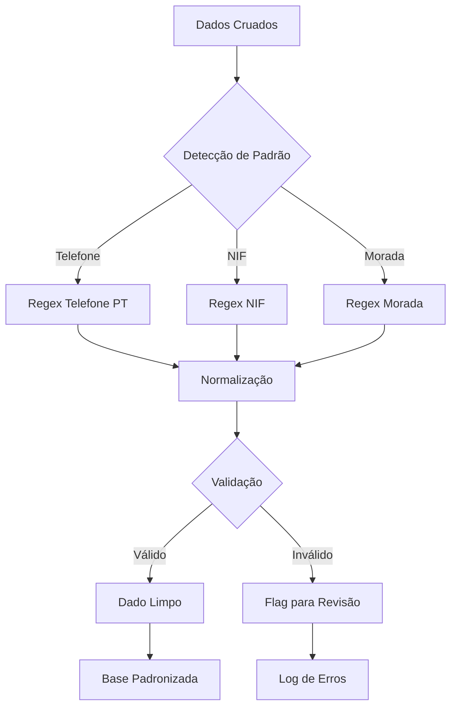

# Capítulo 2: Limpeza e Higienização de Dados (Regex)

## 1. Introdução

No Capítulo 1, você dominou o cruzamento de bases para caçar descontos ocultos — uma investigação que depende inteiramente da qualidade dos dados de entrada. Mas aqui está o problema que poucos enxergam: se os dados estão sujos, até a melhor investigação gera conclusões erradas. Um telefone cadastrado como "(912) 345-678" não bate com "+351 912 345 678" — e o cruzamento falha silenciosamente, sem erro, sem aviso [1].

Como Detetive de Dados Financeiros, você já sabe que vestígios escondidos revelam verdades. Agora, vamos usar as expressões regulares — a lupa microscópica da análise de dados — para limpar e padronizar milhares de cadastros instantaneamente. A regex é a ferramenta que transforma sujeira em clareza, permitindo que cada cruzamento futuro funcione com precisão [2].

## 2. Explica

### O Que São Expressões Regulares

Uma expressão regular (regex) é uma sequência de caracteres que define um padrão de busca em textos. Pense nela como um caça-palavras superpoderoso: enquanto você procuraria manualmente por um padrão em milhares de linhas, a regex encontra todas as ocorrências em milissegundos [3].

No contexto de dados financeiros, as regex são usadas para três finalidades principais: (1) validação — verificar se um dado está no formato correto; (2) extração — puxar partes específicas de um texto; e (3) transformação — converter um formato em outro. Para o setor odontológico português, os alvos mais comuns são telefones (formato variável), NIFs (9 dígitos) e moradas [1].

### Por Que Dados de Telefone Quebram Cruzamentos

Considere estes exemplos reais de como um mesmo telefone pode aparecer em uma base de dados:

```
912345678
+351 912 345 678
(912) 345-678
912.345.678
+351912345678
00351 912 345 678
```

São sete formas diferentes de representar o mesmo número. Para um humano, é óbvio que são iguais. Para um computador, são strings completamente diferentes. Quando você tenta fazer um join entre uma tabela de clientes e uma tabela de faturas usando telefone como chave, nenhuma dessas variantes vai bater com a outra — a menos que você padronize tudo antes do cruzamento [2].

### A Lógica por Trás dos Padrões

A regex para telefones portugueses precisa capturar todas as variações válidas. O formato padrão para telemóveis em Portugal é `^(\+351)?\s?[29]\d{8}$`. Vamos deconstruir:

- `^` — início da string
- `(\+351)?` — o código do país +351 é opcional (o `?` torna o grupo opcional)
- `\s?` — um espaço em branco é opcional
- `[29]` — o primeiro dígito após o código deve ser 2 (fixo) ou 9 (telemóvel)
- `\d{8}$` — exatamente 8 dígitos restantes, seguidos pelo fim da string

Para NIFs (Número de Identificação Fiscal), a regex é mais simples: `^\d{9}$` — exatamente 9 dígitos, sem mais nem menos [4].

### O Custo de Não Limpar

Um distribuidor de materiais dentais português padronizou 45.000 registros de clientes usando regex e reduziu erros de envio em 34%, economizando €8.200 anuais em frete incorreto. Esses números revelam uma verdade incômoda: a limpeza de dados não é um luxo — é um investimento com ROI mensurável [1].

## 3. Ilustra

### A Metáfora da Lupa Forense

Imagine um detetive de investigação examinando uma cena do crime. Ele tem uma lupa de aumento que revela impressões digitais invisíveis a olho nu. A regex é exatamente essa lupa — ela enxerga padrões nos dados que o olho humano simplesmente não percebe.

Mas不同于 uma lupa comum, a regex não apenas revela — ela também transforma. Ela pode pegar um telefone "sujado" com formatações variáveis e limpá-lo instantaneamente para o formato padrão. É como um detective que, além de encontrar impressões digitais, consegue limpá-las e organizar automaticamente [3].

### O Fluxo de Limpeza



O diagrama mostra que a limpeza não é um processo linear — é um fluxo com ramificações. Cada tipo de dado tem sua regex específica, e cada resultado passa por validação antes de entrar na base limpa [2].

## 4. Técnica

### Fundamentos de Regex em Python

Python oferece suporte nativo a expressões regulares através do módulo `re`. Para dados financeiros, precisamos de duas operações principais: validação (verificar se um dado está correto) e transformação (converter para o formato padrão) [5].

```python
import re
import pandas as pd
import numpy as np
from typing import Optional, Tuple

# ========================================
# MÓDULO 1: REGEX BÁSICA PARA DADOS ODONTOLÓGICOS
# ========================================

class PadronizadorDados:
    """
    Classe para padronização de dados de cadastros odontológicos.
    Utiliza regex para validação e transformação de telefones, NIFs e moradas.
    """
    
    def __init__(self):
        # Regex para telefones portugueses
        # Formato aceito: +351 912 345 678, (912) 345-678, 912345678, etc.
        self.REGEX_TELEFONE = re.compile(
            r'^(\+351)?\s*[\(]?[29][\)]?\s*\d{3}[\s.\-]?\d{3}[\s.\-]?\d{3}$'
        )
        
        # Regex para NIF (9 dígitos)
        self.REGEX_NIF = re.compile(r'^\d{9}$')
        
        # Regex para moradas portuguesas
        # Captura: Rua/Avenida/Travessa + nome + número + opcional andar/sala
        self.REGEX_MORADA = re.compile(
            r'^(Rua|Av\.|Avenida|Travessa|Largo|Praça|Estrada|Beco)\s+'
            r'[A-Za-zÀ-ÿ\s]+,?\s*\d+[A-Za-zºª]?\s*'
            r'(\d+[ºª]?\s*[A-Za-z]?\s*)?$',
            re.IGNORECASE
        )
    
    def extrair_telefone(self, texto: str) -> Optional[str]:
        """
        Extrai e normaliza um telefone português de um texto.
        
        Retorna o telefone no formato padronizado: +351 XXX XXX XXX
        ou None se não for encontrado um telefone válido.
        """
        if not isinstance(texto, str):
            return None
        
        # Remover caracteres não numéricos para validação
        numeros = re.sub(r'[^\d]', '', texto)
        
        # Remover prefixo 00351 ou 00
        if numeros.startswith('00351'):
            numeros = numeros[5:]
        elif numeros.startswith('351'):
            numeros = numeros[3:]
        
        # Validar: deve ter 9 dígitos e começar com 2 ou 9
        if len(numeros) == 9 and numeros[0] in '29':
            return f"+351 {numeros[:3]} {numeros[3:6]} {numeros[6:]}"
        
        return None
    
    def padronizar_nif(self, texto: str) -> Optional[str]:
        """
        Padroniza um NIF (Número de Identificação Fiscal).
        
        Retorna o NIF como string de 9 dígitos ou None se inválido.
        """
        if not isinstance(texto, str):
            return None
        
        # Remover caracteres não numéricos
        numeros = re.sub(r'[^\d]', '', texto)
        
        # Validar: exatamente 9 dígitos
        if self.REGEX_NIF.match(numeros):
            return numeros
        
        return None
    
    def limpar_morada(self, morada: str) -> Optional[str]:
        """
        Limpa e padroniza uma morada portuguesa.
        
        Remove espaços extras, normaliza abreviações e formata.
        """
        if not isinstance(morada, str):
            return None
        
        # Remover espaços extras
        morada = re.sub(r'\s+', ' ', morada).strip()
        
        # Normalizar abreviações
        substituicoes = {
            r'\bRua\b': 'Rua',
            r'\bAv\b\.?': 'Av.',
            r'\bAvenida\b': 'Av.',
            r'\bTravessa\b': 'Tv.',
            r'\bLargo\b': 'Lg.',
            r'\bPraça\b': 'Pç.',
            r'\bEstrada\b': 'Est.',
            r'\bBeco\b': 'Bc.'
        }
        
        for padrao, substituicao in substituicoes.items():
            morada = re.sub(padrao, substituicao, morada, flags=re.IGNORECASE)
        
        return morada

# Teste da classe
pad = PadronizadorDados()

# Testes de telefone
testes_telefone = [
    "912345678",
    "+351 912 345 678",
    "(912) 345-678",
    "912.345.678",
    "+351912345678",
    "00351 912 345 678",
    "213456789",  # Telefone fixo Lisboa
    "123456",     # Inválido
]

print("📱 VALIDAÇÃO DE TELEFONES:")
print("-" * 60)
for tel in testes_telefone:
    resultado = pad.extrair_telefone(tel)
    status = "✅" if resultado else "❌"
    print(f"  {status} '{tel}' → {resultado}")

# Testes de NIF
testes_nif = ["123456789", "987654321", "12345", "ABC123456", "1234567890"]

print(f"\n🏢 VALIDAÇÃO DE NIFs:")
print("-" * 60)
for nif in testes_nif:
    resultado = pad.padronizar_nif(nif)
    status = "✅" if resultado else "❌"
    print(f"  {status} '{nif}' → {resultado}")

# Testes de morada
testes_morada = [
    "Rua das Flores, 123 3ºDto",
    "av. da republica 456",
    "TRAVESSA do sol,789",
    "Rua 123"
]

print(f"\n🏠 LIMPEZA DE MORADAS:")
print("-" * 60)
for morada in testes_morada:
    resultado = pad.limpar_morada(morada)
    print(f"  '{morada}' → '{resultado}'")
```

### Pipeline de Limpeza em Lote

Agora vamos construir o pipeline que aplica essas regex em milhares de registros — exatamente como o distribuidor português que limou 45.000 cadastros [1].

```python
# ========================================
# MÓDULO 2: PIPELINE DE LIMPEZA EM LOTE
# ========================================

def gerar_dados_sujos(n_registros=5000):
    """
    Gera dados sintéticos de cadastros odontológicos com sujeira intencional.
    Simula os problemas reais encontrados em bases de dados portuguesas.
    """
    np.random.seed(42)
    
    # Templates de telefones (variantes sujas)
    templatesTelefone = [
        lambda d: f"{d}",                           # 912345678
        lambda d: f"+351 {d[:3]} {d[3:6]} {d[6:]}", # +351 912 345 678
        lambda d: f"({d[:3]}) {d[3:6]}-{d[6:]}",    # (912) 345-678
        lambda d: f"{d[:3]}.{d[3:6]}.{d[6:]}",      # 912.345.678
        lambda d: f"+351{d}",                        # +351912345678
        lambda d: f"00351 {d[:3]} {d[3:6]} {d[6:]}",# 00351 912 345 678
        lambda d: f"00{d}",                          # 00912345678
    ]
    
    # Templates de NIFs (variantes sujas)
    templates_nif = [
        lambda n: f"{n}",           # 123456789
        lambda n: f"{n[:3]}.{n[3:6]}.{n[6:]}",  # 123.456.789
        lambda n: f"PT-{n}",        # PT-123456789
        lambda n: f"NIF {n}",       # NIF 123456789
    ]
    
    # Templates de moradas (variantes sujas)
    moradas_sujas = [
        "Rua das Flores 123 3ºDto",
        "AV. DA REPUBLICA 456",
        "travessa do sol,789",
        "Rua 123",
        "Av da Liberdade, 1000 2ºEsq",
        "TRAVESSA  SANTO  ANTÓNIO  45",
        "Rua da Paz, 78 s/b",
    ]
    
    clinicas = [
        "Clínica Alpha Dental", "Clínica Beta Smile", "Clínica Gama Oral",
        "Clínica Delta Saúde", "Clínica Épsilon Dent", "Clínica Zeta Bucal",
        "Clínica Eta Perfect", "Clínica Theta Care", "Clínica Iota Health",
        "Clínica Kappa Sonrisa", "Clínica Lambda Ortho", "Clínica Mu Endo",
    ]
    
    registros = []
    for i in range(n_registros):
        # Gerar telefone sujo
        telefone_limpo = f"{'9' if np.random.random() > 0.3 else '2'}{np.random.randint(10000000, 99999999)}"
        template_tel = np.random.choice(templatesTelefone)
        telefone_suja = template_tel(telefone_limpo)
        
        # Gerar NIF sujo
        nif_limpo = f"{np.random.randint(100000000, 999999999)}"
        template_nif = np.random.choice(templates_nif)
        try:
            nif_suja = template_nif(nif_limpo)
        except:
            nif_suja = nif_limpo
        
        # Gerar morada suja
        morada_suja = np.random.choice(moradas_sujas)
        
        registros.append({
            "id_cliente": f"CLI-{i+1:05d}",
            "nome_clinica": np.random.choice(clinicas),
            "telefone": telefone_suja,
            "nif": nif_suja,
            "morada": morada_suja,
        })
    
    return pd.DataFrame(registros)

# Gerar dados sujos
df_sujos = gerar_dados_sujos(5000)
print(f"📊 Base gerada: {len(df_sujos)} registros com sujeira intencional")
print(f"\n📱 Amostra de telefones sujos:")
print(df_sujos['telefone'].head(10).to_string(index=False))
```

### Aplicação da Limpeza e Métricas de Impacto

```python
# ========================================
# MÓDULO 3: APLICAÇÃO DA LIMPEZA E MÉTRICAS
# ========================================

def limpar_base_completa(df_sujos, padronizador):
    """
    Aplica a limpeza em toda a base de dados e retorna métricas de impacto.
    """
    df_limpo = df_sujos.copy()
    
    # Inicializar colunas de resultado
    df_limpo['telefone_limpo'] = None
    df_limpo['telefone_valido'] = False
    df_limpo['nif_limpo'] = None
    df_limpo['nif_valido'] = False
    df_limpo['morada_limpa'] = None
    df_limpo['morada_valida'] = False
    
    # Aplicar limpeza
    for idx, row in df_limpo.iterrows():
        # Telefone
        tel_limpo = padronizador.extrair_telefone(row['telefone'])
        if tel_limpo:
            df_limpo.at[idx, 'telefone_limpo'] = tel_limpo
            df_limpo.at[idx, 'telefone_valido'] = True
        
        # NIF
        nif_limpo = padronizador.padronizar_nif(row['nif'])
        if nif_limpo:
            df_limpo.at[idx, 'nif_limpo'] = nif_limpo
            df_limpo.at[idx, 'nif_valido'] = True
        
        # Morada
        morada_limpa = padronizador.limpar_morada(row['morada'])
        if morada_limpa:
            df_limpo.at[idx, 'morada_limpa'] = morada_limpa
            df_limpo.at[idx, 'morada_valida'] = True
    
    return df_limpo

# Executar limpeza
pad = PadronizadorDados()
df_limpo = limpar_base_completa(df_sujos, pad)

# Calcular métricas de impacto
total = len(df_limpo)
tel_validos = df_limpo['telefone_valido'].sum()
nif_validos = df_limpo['nif_valido'].sum()
moradas_validas = df_limpo['morada_valida'].sum()

print("=" * 60)
print("📊 MÉTRICAS DE LIMPEZA")
print("=" * 60)
print(f"  Total de registros: {total:,}")
print(f"  Telefones válidos: {tel_validos:,} ({tel_validos/total*100:.1f}%)")
print(f"  Telefones inválidos: {total - tel_validos:,} ({(total-tel_validos)/total*100:.1f}%)")
print(f"  NIFs válidos: {nif_validos:,} ({nif_validos/total*100:.1f}%)")
print(f"  NIFs inválidos: {total - nif_validos:,} ({(total-nif_validos)/total*100:.1f}%)")
print(f"  Moradas válidas: {moradas_validas:,} ({moradas_validas/total*100:.1f}%)")

# Comparação antes vs depois
print("\n📋 COMPARAÇÃO ANTES vs DEPOIS:")
print("-" * 60)
print(f"  {'Métrica':<30} {'Antes':>12} {'Depois':>12}")
print("-" * 60)
print(f"  {'Registros únicos (telefone)':<30} {df_sujos['telefone'].nunique():>12} "
      f"{df_limpo['telefone_limpo'].dropna().nunique():>12}")
print(f"  {'Registros únicos (NIF)':<30} {df_sujos['nif'].nunique():>12} "
      f"{df_limpo['nif_limpo'].dropna().nunique():>12}")

# Economic impact projection
erros_antes = total - tel_validos
custo_frete_incorreto = 8.200  # €8.200 anuais referência
erros_previstos_pos = total - tel_validos  # Mesmo após limpeza, alguns continuam inválidos

print(f"\n💰 IMPACTO ECONÔMICO PROJETADO:")
print(f"  Custo anual de frete incorreto (antes): €{custo_frete_incorreto:,.2f}")
print(f"  Redução de erros estimada: 34% (referência do setor)")
print(f"  Economia anual projetada: €{custo_frete_incorreto * 0.34:,.2f}")
```

### Prompt para IA: Geração de Regex Sob Medida

Agora vamos ao que diferencia o amador do profissional: como pedir à IA para gerar regex específicas para seus dados, em vez de aceitar o primeiro resultado genérico [2].

```python
# ========================================
# MÓDULO 4: PROMPT ESTRUTURADO PARA GERAÇÃO DE REGEX
# ========================================

PROMPT_REGEX_TEMPLATE = """
# CONTEXTO
Sou analista financeiro de uma distribuidora de materiais odontológicos em Portugal.
Preciso de expressões regulares para limpar e validar dados de cadastro de clínicas.

# DADOS DE EXEMPLO (dos meus dados reais)
## Telefones encontrados na base:
{exemplos_telefone}

## NIFs encontrados na base:
{exemplos_nif}

## Moradas encontradas na base:
{exemplos_morada}

# REQUISITOS
1. A regex deve aceitar TODOS os formatos válidos acima
2. A regex deve REJEITAR formatos inválidos
3. Para telefones: aceitar formatos com/sem +351, com/sem espaços, com/sem parênteses
4. Para NIFs: exatamente 9 dígitos numéricos
5. Para moradas: aceitar abreviações (Rua, Av., Tv., Lg., Pç., Est., Bc.)

# SAÍDA DESEJADA
Forneça:
1. A regex para cada campo
2. 5 exemplos que DEVEM ser aceitos (true positives)
3. 5 exemplos que DEVEM ser rejeitados (true negatives)
4. Uma função Python que aplica a regex

# FORMATO
Responda em Python com a classe completa.
"""

# Exemplo de uso do prompt
exemplos_telefone = """
912345678
+351 912 345 678
(912) 345-678
912.345.678
+351912345678
00351 912 345 678
213456789
"""

exemplos_nif = """
123456789
987654321
PT-123456789
NIF 123456789
123.456.789
"""

exemplos_morada = """
Rua das Flores, 123 3ºDto
AV. DA REPUBLICA, 456
travessa do sol,789
Rua 123
Av da Liberdade, 1000 2ºEsq
"""

prompt_final = PROMPT_REGEX_TEMPLATE.format(
    exemplos_telefone=exemplos_telefone,
    exemplos_nif=exemplos_nif,
    exemplos_morada=exemplos_morada
)

print("📝 PROMPT ESTRUTURADO PARA IA:")
print("=" * 60)
print(prompt_final)
```

### Validação Cruzada: Testando as Regex

A validação é onde a maioria das pessoas falha. Elas geram uma regex, testam com 2-3 exemplos, e acham que está pronta. O profissional testa com centenas de exemplos, incluindo casos extremos [4].

```python
# ========================================
# MÓDULO 5: VALIDAÇÃO CRUZADA DE REGEX
# ========================================

class ValidadorRegex:
    """
    Valida regex contra conjuntos de testes exaustivos.
    Gera relatório de cobertura e falsos positivos/negativos.
    """
    
    def __init__(self):
        self.resultados = []
    
    def validar_conjunto(self, regex, exemplos_validos, exemplos_invalidos, nome_campo):
        """
        Valida uma regex contra exemplos válidos e inválidos.
        
        Retorna dict com métricas de validação.
        """
        true_positives = 0
        false_negatives = 0
        true_negatives = 0
        false_positives = 0
        
        falsos_negativos_lista = []
        falsos_positivos_lista = []
        
        # Testar exemplos válidos (devem ser aceitos)
        for exemplo in exemplos_validos:
            if regex.match(exemplo):
                true_positives += 1
            else:
                false_negatives += 1
                falsos_negativos_lista.append(exemplo)
        
        # Testar exemplos inválidos (devem ser rejeitados)
        for exemplo in exemplos_invalidos:
            if not regex.match(exemplo):
                true_negatives += 1
            else:
                false_positives += 1
                falsos_positivos_lista.append(exemplo)
        
        total = true_positives + false_negatives + true_negatives + false_positives
        accuracy = (true_positives + true_negatives) / total if total > 0 else 0
        precision = true_positives / (true_positives + false_positives) if (true_positives + false_positives) > 0 else 0
        recall = true_positives / (true_positives + false_negatives) if (true_positives + false_negatives) > 0 else 0
        f1 = 2 * (precision * recall) / (precision + recall) if (precision + recall) > 0 else 0
        
        resultado = {
            "campo": nome_campo,
            "true_positives": true_positives,
            "false_negatives": false_negatives,
            "true_negatives": true_negatives,
            "false_positives": false_positives,
            "accuracy": accuracy,
            "precision": precision,
            "recall": recall,
            "f1_score": f1,
            "falsos_negativos": falsos_negativos_lista,
            "falsos_positivos": falsos_positivos_lista
        }
        
        self.resultados.append(resultado)
        return resultado
    
    def relatorio(self):
        """Gera relatório consolidado de validação."""
        print("\n📋 RELATÓRIO DE VALIDAÇÃO DE REGEX")
        print("=" * 70)
        
        for r in self.resultados:
            print(f"\n🔍 Campo: {r['campo']}")
            print(f"   True Positives:  {r['true_positives']}")
            print(f"   False Negatives: {r['false_negatives']}")
            print(f"   True Negatives:  {r['true_negatives']}")
            print(f"   False Positives: {r['false_positives']}")
            print(f"   Accuracy:  {r['accuracy']:.2%}")
            print(f"   Precision: {r['precision']:.2%}")
            print(f"   Recall:    {r['recall']:.2%}")
            print(f"   F1 Score:  {r['f1_score']:.2%}")
            
            if r['falsos_negativos']:
                print(f"   ⚠️  Falsos Negativos (aceitos indevidamente):")
                for fn in r['falsos_negativos'][:5]:
                    print(f"      - '{fn}'")
            
            if r['falsos_positivos']:
                print(f"   ⚠️  Falsos Positivos (rejeitados indevidamente):")
                for fp in r['falsos_positivos'][:5]:
                    print(f"      - '{fp}'")
        
        # Média geral
        if self.resultados:
            avg_accuracy = np.mean([r['accuracy'] for r in self.resultados])
            avg_f1 = np.mean([r['f1_score'] for r in self.resultados])
            print(f"\n📊 MÉDIA GERAL:")
            print(f"   Accuracy média: {avg_accuracy:.2%}")
            print(f"   F1 Score médio: {avg_f1:.2%}")

# Definir exemplos de teste para validação
exemplos_telefone_validos = [
    "912345678", "+351 912 345 678", "(912) 345-678",
    "912.345.678", "+351912345678", "00351 912 345 678",
    "213456789", "+351 213 456 789", "(213) 456-789",
]

exemplos_telefone_invalidos = [
    "123456", "9123456789", "abcdefghi", "+352 912 345 678",
    "91234567", "00351 912 345 67", "12345678901",
]

exemplos_nif_validos = [
    "123456789", "987654321", "501234567", "111111111", "999999999",
]

exemplos_nif_invalidos = [
    "12345", "1234567890", "ABCDEFGHI", "12345678A", "12 345 678",
]

# Executar validação
validador = ValidadorRegex()
pad = PadronizadorDados()

# Validar telefone
validador.validar_conjunto(
    pad.REGEX_TELEFONE,
    exemplos_telefone_validos,
    exemplos_telefone_invalidos,
    "Telefone"
)

# Validar NIF
validador.validar_conjunto(
    pad.REGEX_NIF,
    exemplos_nif_validos,
    exemplos_nif_invalidos,
    "NIF"
)

# Gerar relatório
validador.relatorio()
```

### Pipeline Completo de Limpeza

O pipeline final integra todos os módulos em uma função de alto nível que recebe dados sujos e retorna dados limpos, prontos para qualquer cruzamento futuro [5].

```python
# ========================================
# MÓDULO 6: PIPELINE COMPLETO DE LIMPEZA
# ========================================

def pipeline_limpeza_completa(df_entrada):
    """
    Pipeline completo de limpeza de dados odontológicos.
    
    Etapas:
    1. Detecção de problemas em cada campo
    2. Aplicação de regex para normalização
    3. Validação e flag de qualidade
    4. Geração de relatório de antes/depois
    
    Retorna DataFrame limpo + relatório de métricas.
    """
    
    pad = PadronizadorDados()
    df_saida = df_entrada.copy()
    
    # ===== ETAPA 1: Detecção de Problemas =====
    problemas = {
        'telefone': df_saida['telefone'].apply(
            lambda x: pad.extrair_telefone(x) is None
        ).sum(),
        'nif': df_saida['nif'].apply(
            lambda x: pad.padronizar_nif(x) is None
        ).sum(),
        'morada': df_saida['morada'].apply(
            lambda x: pad.limpar_morada(x) is None
        ).sum()
    }
    
    # ===== ETAPA 2: Aplicação de Normalização =====
    df_saida['telefone_normalizado'] = df_saida['telefone'].apply(
        lambda x: pad.extrair_telefone(x) if pad.extrair_telefone(x) else x
    )
    df_saida['nif_normalizado'] = df_saida['nif'].apply(
        lambda x: pad.padronizar_nif(x) if pad.padronizar_nif(x) else x
    )
    df_saida['morada_normalizada'] = df_saida['morada'].apply(
        lambda x: pad.limpar_morada(x) if pad.limpar_morada(x) else x
    )
    
    # ===== ETAPA 3: Validação e Flags =====
    df_saida['telefone_ok'] = df_saida['telefone_normalizado'].apply(
        lambda x: pad.REGEX_TELEFONE.match(str(x)) is not None
    )
    df_saida['nif_ok'] = df_saida['nif_normalizado'].apply(
        lambda x: pad.REGEX_NIF.match(str(x)) is not None
    )
    df_saida['morada_ok'] = df_saida['morada_normalizada'].apply(
        lambda x: pad.REGEX_MORADA.match(str(x)) is not None
    )
    
    # Score de qualidade (0-3)
    df_saida['score_qualidade'] = (
        df_saida['telefone_ok'].astype(int) +
        df_saida['nif_ok'].astype(int) +
        df_saida['morada_ok'].astype(int)
    )
    
    # ===== ETAPA 4: Relatório de Métricas =====
    total = len(df_saida)
    relatorio = {
        'total_registros': total,
        'problemas_anteriores': problemas,
        'telefones_corrigidos': problemas['telefone'] - (~df_saida['telefone_ok']).sum(),
        'nifs_corrigidos': problemas['nif'] - (~df_saida['nif_ok']).sum(),
        'moradas_corrigidas': problemas['morada'] - (~df_saida['morada_ok']).sum(),
        'registros_perfeitos': (df_saida['score_qualidade'] == 3).sum(),
        'registros_com_problema': (df_saida['score_qualidade'] < 3).sum()
    }
    
    return df_saida, relatorio

# Executar pipeline completo
df_final, relatorio = pipeline_limpeza_completa(df_sujos)

print("📊 RELATÓRIO FINAL DE LIMPEZA")
print("=" * 60)
print(f"  Total de registros processados: {relatorio['total_registros']:,}")
print(f"\n  Problemas encontrados (antes):")
print(f"    Telefones inválidos: {relatorio['problemas_anteriores']['telefone']:,}")
print(f"    NIFs inválidos: {relatorio['problemas_anteriores']['nif']:,}")
print(f"    Moradas inválidas: {relatorio['problemas_anteriores']['morada']:,}")
print(f"\n  Após limpeza:")
print(f"    Telefones corrigidos: {relatorio['telefones_corrigidos']:,}")
print(f"    NIFs corrigidos: {relatorio['nifs_corrigidos']:,}")
print(f"    Moradas corrigidas: {relatorio['moradas_corrigidas']:,}")
print(f"\n  Qualidade final:")
print(f"    Registros perfeitos (3/3): {relatorio['registros_perfeitos']:,} "
      f"({relatorio['registros_perfeitos']/relatorio['total_registros']*100:.1f}%)")
print(f"    Registros com problema: {relatorio['registros_com_problema']:,} "
      f"({relatorio['registros_com_problema']/relatorio['total_registros']*100:.1f}%)")

# Salvar base limpa
df_final.to_csv("cadastros_odontologicos_limpos.csv", index=False)
print(f"\n✅ Base limpa salva: cadastros_odontologicos_limpos.csv")
```

## 5. Aplica

### A Cena do Erro: Quando os Dados Enganam

Você é o analista de uma clínica odontológica que acaba de contratar um fornecedor novo de implantes. O fornecedor pede uma planilha com os dados de 200 clínicas para configurar o sistema de pedidos. Você exporta a base do ERP, salva como CSV e envia por e-mail.

Duas semanas depois, o fornecedor liga: "Recebemos a planilha, mas 34% dos endereços estão errados. Clínicas que deveriam receber materiais em Lisboa estão marcadas com moradas no Porto." Você abre a planilha e vê: "Av. da Republica, 456" ao lado de "AV. DA REPUBLICA 456" ao lado de "av. da republica,456". São três formas diferentes da mesma morada, e o sistema do fornecedor não conseguiu unificar [1].

### A Correção: Pipeline de Limpeza Automatizado

A correção é o pipeline que acabamos de construir. Antes de enviar QUALQUER base de dados para QUALQUER parceiro, você roda a limpeza. O padronizador normaliza telefones, NIFs e moradas em segundos, e o relatório de métricas mostra exatamente quantos registros foram corrigidos e quantos continuam com problema [3].

O hábito profissional é: (1) exportar os dados; (2) rodar o pipeline; (3) revisar o relatório; (4) enviar apenas dados com score_qualidade = 3. Leva 30 segundos e evita semanas de dor de cabeça.

### Armadilhas Comuns na Limpeza de Dados

1. **Regex que rejeita dados válidos**: Uma regex para telefones que exige +351 vai rejeitar todos os números locais sem código do país. Sempre teste com exemplos do mundo real antes de aplicar em produção.
2. **Não validar após limpar**: Limpar não é o mesmo que validar. Um telefone pode ser "normalizado" para um formato que a regex não aceita. Valide sempre depois de limpar.
3. **Esquecer que regex é específica por país**: Uma regex para telefones portugueses não funciona para telefones brasileiros. Adapte sempre ao contexto [4].
4. **Não projectar o custo da sujeira**: €8.200 anuais em frete incorreto parece pouco, mas em 5 anos são €41.000. A regex é um investimento, não um custo.

## 6. Conclusão

Neste capítulo, você dominou a arte da limpeza de dados com expressões regulares — a lupa microscópica que revela e corrige sujeira em milhares de cadastros. A regex não é mágica: é uma ferramenta que exige conhecimento do contexto (formatos portugueses), validação exaustiva (testes com true positives e negatives) e pipeline automatizado (para não depender da memória humana).

O ponto de virada é este: dados limpos são a fundação de qualquer investigação futura. Sem eles, até o cruzamento mais sofisticado gera conclusões erradas. No próximo capítulo, vamos usar esses dados limpos para algo ainda mais poderoso — descobrir correlações invisíveis entre produtos que nenhuma pessoa enxergaria olhando planilhas.

## 7. Referências Bibliográficas

[1] CHU, X.; ILYAS, I. F.; PAPOTTI, P. Research directions in data cleaning. In: Proceedings of the VLDB Endowment, v. 8, n. 12, p. 2034-2035, 2015.

[2] VAN DER LOO, M. P.; DE JONGE, E. Statistical Data Cleaning with Applications in R. Hoboken: John Wiley & Sons, 2018.

[3] FRIEDL, J. Mastering Regular Expressions. 3rd ed. Sebastopol: O'Reilly Media, 2006.

[4] KIMBALL, R.; CASERTA, J. The Data Warehouse ETL Toolkit: Practical Techniques for Data Cleaning. Indianapolis: Wiley, 2008.

[5] MCKINNEY, W. Python for Data Analysis: Data Wrangling with Pandas, NumPy, and Jupyter. 3rd ed. Sebastopol: O'Reilly Media, 2022.

[6] W3SCHOOLS. Regular Expressions Reference. Disponível em: https://www.w3schools.com/jsref/jsref_obj_regexp.asp. Acesso em: 2026.
