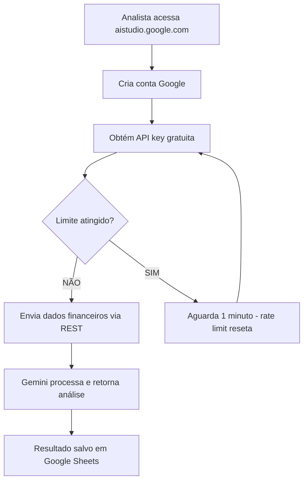

# Capítulo 1: O Arsenal Gratuito do Analista — Google AI Studio, Hugging Face, ferramentas gratuitas

## 1. Introdução

Toda grande oficina começa com uma bancada. Antes de qualquer engrenagem girar, antes de qualquer motor ligar, o relojoeiro precisa ter suas ferramentas organizadas e afiadas ao alcance da mão. Esse capítulo é exatamente isso: a montagem da sua bancada de inteligência financeira, sem gastar um centavo.

Vamos mapear três pilares do arsenal gratuito que transformam a análise financeira: o Google AI Studio, que oferece acesso direto ao Gemini com limites generosos para uso em automações; o Hugging Face, que abriga centenas de modelos open-source prontos para classificar, extrair e resumir dados; e a stack completa que conecta tudo isso em uma oficina funcional. Ao final, você não apenas saberá o que existe — terá o setup rodando.

## 2. Explica

### O Google AI Studio: o motor gratuito do analista financeiro

O Google AI Studio é a resposta do Google à necessidade de experimentar com inteligência artificial sem barreiras financeiras. Trata-se de um ambiente web que permite interagir diretamente com os modelos Gemini — o gemini-1.5-flash e o gemini-1.5-pro — para testes de prompts, análise de dados e geração de texto [1].

Para o analista financeiro, o que importa são os números reais: a API key gratuita oferece 15 requisições por minuto no modelo Flash e 2 no modelo Pro [2]. Parece pouco? Considere que uma análise de faturamento mensal de uma clínica odontológica típica envolve no máximo 20-30 consultas de dados. Você pode processar o mês inteiro em menos de dois minutos, sem pagar nada.

O diferencial estratégico está na generosidade comparativa. Enquanto outras plataformas oferecem créditos iniciais que se esgotam em dias, o tier gratuito do Google AI Studio mantém seus limites de forma estável — desde que você respeite as cotas de RPM (requisições por minuto) [3].

### Hugging Face: a estante infinita de modelos

Se o Google AI Studio é o motor, o Hugging Face é a biblioteca. Com mais de 100 mil modelos hospedados, a plataforma se tornou o repositório padrão da comunidade de machine learning [4]. Para o analista financeiro, isso significa acesso gratuito a modelos pré-treinados para tarefas específicas: classificação de sentimento em feedbacks de clientes, extração de entidades nomeadas em contratos, e resumo automático de relatórios longos.

A API de inferência do Hugging Face funciona por meio de chamadas REST simples. Você envia texto, recebe classificação. Sem configuração de infraestrutura, sem custo de GPU [5]. É a diferença entre montar uma fábrica inteira e simplesmente usar uma peça que já está pronta.

O conceito-chave aqui é "pipeline de inferência": uma sequência automatizada que recebe dados brutos, passa por um modelo treinado, e retorna uma saída estruturada. Para o analista, isso se traduz em: mando o feedback do cliente, recebo "positivo/neutro/negativo" automaticamente [4].

### A stack completa: suas peças se encaixam

A verdadeira magia não está em cada ferramenta isoladamente, mas em como elas se conectam. Google Sheets funciona como banco de dados leve — sem servidor, sem SQL, apenas abas que qualquer pessoa na clínica já sabe usar. N8N atua como orquestrador visual — um workflow que conecta planilhas a APIs sem escrever código. Evolution API canaliza mensagens pelo WhatsApp — o canal que seus clientes e fornecedores já usam [6].

Essa stack não é uma teoria. Ela é a oficina completa que vamos construir nos próximos capítulos. Cada peça tem seu papel: o Google Sheets armazena, o N8N orquestra, o Gemini analisa, o WhatsApp comunica.

## 3. Ilustra

Pense na sua bancada de trabalho. Cada ferramenta tem um lugar exato: alicate aqui, chave de fenda ali, multímetro acolá. Se você tiver que procurar cada peça no meio de uma gavota bagunçada, perde mais tempo organizando do que trabalhando.

O arsenal gratuito funciona da mesma forma. O Google AI Studio é a furadeira elétrica — potente, precisa, e que não custa nada além de uma chave de API. O Hugging Face é a caixa de brocas — dezenas de opções prontas para cada tipo de furo. E a stack completa (Sheets + N8N + Evolution API) é a bancada em si — o lugar onde tudo se encaixa e funciona como um sistema integrado.



O diagrama mostra o fluxo completo: do acesso à plataforma até o resultado salvo. Note o ponto de decisão no rate limit — essa é a engrenagem que precisa de calibração no início, mas que se torna invisível quando você entende o ritmo da ferramenta.

## 4. Técnica

### Configurando o Google AI Studio

O primeiro passo é obter a chave de API. Acesse https://aistudio.google.com e faça login com sua conta Google. Navegue até "Get API key" no menu lateral.

```python
# configuração_inicial.py
# Script para testar a conexão com o Google AI Studio

import requests
import json

# Sua chave de API (substitua pela sua)
API_KEY = "<sua-chave-api-gemini>"
BASE_URL = "https://generativelanguage.googleapis.com/v1beta/models"

def listar_modelos_disponiveis():
    """Lista os modelos Gemini disponíveis no tier gratuito"""
    url = f"{BASE_URL}?key={API_KEY}"
    resposta = requests.get(url)

    if resposta.status_code == 200:
        modelos = resposta.json().get("models", [])
        print("Modelos disponíveis:")
        for modelo in modelos:
            nome = modelo.get("name", "N/A")
            capacidades = modelo.get("supportedGenerationMethods", [])
            print(f"  - {nome}: {capacidades}")
        return modelos
    else:
        print(f"Erro {resposta.status_code}: {resposta.text}")
        return None

def analisar_faturamento(dados_financeiros):
    """Envia dados de faturamento para o Gemini e recebe análise"""
    modelo = "gemini-1.5-flash"  # Tier gratuito: 15 RPM
    url = f"{BASE_URL}/{modelo}:generateContent?key={API_KEY}"

    prompt = f"""
    Analise os seguintes dados de faturamento de clínica odontológica e retorne:
    1. Total faturado no período
    2. Ticket médio por procedimento
    3. Procedimento mais lucrativo
    4. Sugestão de otimização

    Dados: {json.dumps(dados_financeiros, ensure_ascii=False)}
    """

    payload = {
        "contents": [{"parts": [{"text": prompt}]}],
        "generationConfig": {
            "temperature": 0.3,
            "maxOutputTokens": 1024
        }
    }

    headers = {"Content-Type": "application/json"}
    resposta = requests.post(url, headers=headers, json=payload)

    if resposta.status_code == 200:
        resultado = resposta.json()
        texto = resultado["candidates"][0]["content"]["parts"][0]["text"]
        return texto
    else:
        print(f"Erro na API: {resposta.status_code}")
        return None

# Teste rápido com dados simulados
if __name__ == "__main__":
    modelos = listar_modelos_disponiveis()

    dados_exemplo = {
        "periodo": "Julho 2026",
        "procedimentos": [
            {"nome": "Limpeza", "quantidade": 45, "valor": 150.00},
            {"nome": "Restauração", "quantidade": 32, "valor": 280.00},
            {"nome": "Canal", "quantidade": 12, "valor": 850.00},
            {"nome": "Clareamento", "quantidade": 18, "valor": 1200.00}
        ]
    }

    analise = analisar_faturamento(dados_exemplo)
    if analise:
        print("\n=== ANÁLISE DO GEMINI ===")
        print(analise)
```

### Configurando o Hugging Face para classificação de feedbacks

A API de inferência do Hugging Face aceita requisições HTTP diretas. O modelo `nlptown/bert-base-multilingual-uncased-sentiment` é ideal para classificar feedbacks em português [5].

```python
# classificador_feedbacks.py
# Script para classificar feedbacks de clientes usando Hugging Face

import requests
import json
import csv
from datetime import datetime

# Configuração do Hugging Face
HF_API_URL = "https://api-inference.huggingface.co/models/nlptown/bert-base-multilingual-uncased-sentiment"
HF_TOKEN = "<seu-huggingface-token>"  # Opcional para modelos gratuitos

def classificar_feedback(texto_feedback):
    """Classifica um feedback em sentimento (1-5 estrelas)"""
    headers = {"Authorization": f"Bearer {HF_TOKEN}"} if HF_TOKEN else {}

    payload = {"inputs": texto_feedback}
    resposta = requests.post(HF_API_URL, headers=headers, json=payload)

    if resposta.status_code == 200:
        resultado = resposta.json()
        # O modelo retorna array de labels com scores
        if isinstance(resultado, list) and len(resultado) > 0:
            scores = resultado[0]
            # Encontra o label com maior score
            melhor = max(scores, key=lambda x: x["score"])
            label = melhor["label"]  # Ex: "5 stars", "1 star"
            score = melhor["score"]

            # Mapeia para classificação simplificada
            estrelas = int(label.split()[0])
            if estrelas >= 4:
                classificacao = "promotor"
            elif estrelas == 3:
                classificacao = "passivo"
            else:
                classificacao = "detrator"

            return {
                "texto": texto_feedback,
                "estrelas": estrelas,
                "classificacao": classificacao,
                "confianca": round(score, 3)
            }
    return None

def processar_batch_feedbacks(arquivo_csv):
    """Processa um CSV com feedbacks e retorna classificações"""
    resultados = []

    with open(arquivo_csv, 'r', encoding='utf-8') as f:
        leitor = csv.DictReader(f)
        for linha in leitor:
            texto = linha.get('feedback', '')
            if texto:
                classificacao = classificar_feedback(texto)
                if classificacao:
                    classificacao['data'] = linha.get('data', datetime.now().isoformat())
                    classificacao['cliente'] = linha.get('cliente', 'Anônimo')
                    resultados.append(classificacao)
                    print(f"Classificado: {texto[:50]}... → {classificacao['classificacao']}")

    return resultados

def gerar_relatorio_nps(resultados):
    """Gera relatório NPS a partir das classificações"""
    total = len(resultados)
    if total == 0:
        return {"nps": 0, "promotores": 0, "passivos": 0, "detratores": 0}

    promotores = sum(1 for r in resultados if r["classificacao"] == "promotor")
    passivos = sum(1 for r in resultados if r["classificacao"] == "passivo")
    detratores = sum(1 for r in resultados if r["classificacao"] == "detrator")

    nps = round(((promotores - detratores) / total) * 100, 1)

    return {
        "nps": nps,
        "promotores": f"{promotores}/{total} ({round(promotores/total*100)}%)",
        "passivos": f"{passivos}/{total} ({round(passivos/total*100)}%)",
        "detratores": f"{detratores}/{total} ({round(detratores/total*100)}%)",
        "avaliacao": "Excelente" if nps > 50 else "Bom" if nps > 0 else "Precisa melhorar"
    }

if __name__ == "__main__":
    # Teste com feedbacks simulados
    feedbacks_teste = [
        "Excelente atendimento, vou indicar para meus amigos!",
        "Demorou muito para agendar, mas o resultado ficou bom.",
        "Péssimo, não voltarei mais. Muito caro e atendimento ruim.",
        "Bom trabalho, preço justo. Voltarei com certeza.",
        "Normal, nada excepcional mas também não reclamo."
    ]

    print("=== CLASSIFICADOR DE FEEDBACKS ===\n")
    resultados = []
    for fb in feedbacks_teste:
        r = classificar_feedback(fb)
        if r:
            resultados.append(r)
            print(f"'{fb[:60]}...'")
            print(f"  → {r['estrelas']} estrelas | {r['classificacao']} | confiança: {r['confianca']}\n")

    relatorio = gerar_relatorio_nps(resultados)
    print("=== RELATÓRIO NPS ===")
    print(f"NPS: {relatorio['nps']}")
    print(f"Promotores: {relatorio['promotores']}")
    print(f"Passivos: {relatorio['passivos']}")
    print(f"Detratores: {relatorio['detratores']}")
    print(f"Avaliação: {relatorio['avaliacao']}")
```

### A stack completa em ação: workflow N8N de exemplo

```yaml
# workflow_exemplo.json
# Workflow N8N que conecta Google Sheets ao Google AI Studio
{
  "name": "Análise Financeira Automatizada",
  "nodes": [
    {
      "parameters": {
        "pollTimes": {
          "item": [{"mode": "everyMinute"}]
        },
        "documentId": {"__rl": true, "value": "SUA_PLANILHA_ID"},
        "sheetName": {"__rl": true, "value": "Dados Brutos"}
      },
      "name": "Google Sheets - Ler Dados",
      "type": "n8n-nodes-base.googleSheets",
      "typeVersion": 4,
      "position": [250, 300]
    },
    {
      "parameters": {
        "conditions": {
          "options": {"caseSensitive": true, "leftValue": "", "typeValidation": "strict"},
          "conditions": [
            {
              "id": "condicao-faturamento",
              "leftValue": "={{ $json.faturamento }}",
              "rightValue": "10000",
              "operator": {"type": "number", "operation": "gt"}
            }
          ]
        }
      },
      "name": "IF - Faturamento > 10k",
      "type": "n8n-nodes-base.if",
      "typeVersion": 2,
      "position": [480, 300]
    },
    {
      "parameters": {
        "method": "POST",
        "url": "=https://generativelanguage.googleapis.com/v1beta/models/gemini-1.5-flash:generateContent?key={{ $env.GEMINI_API_KEY }}",
        "sendBody": true,
        "bodyParameters": {
          "parameters": [
            {
              "name": "contents",
              "value": "=[{\"parts\":[{\"text\":\"Analise este dado financeiro e retorne um resumo executivo em 3 linhas: {{ JSON.stringify($json) }}\"}]}]"
            }
          ]
        }
      },
      "name": "HTTP Request - Gemini",
      "type": "n8n-nodes-base.httpRequest",
      "typeVersion": 4,
      "position": [710, 250]
    },
    {
      "parameters": {
        "documentId": {"__rl": true, "value": "SUA_PLANILHA_ID"},
        "sheetName": {"__rl": true, "value": "Análises"},
        "columns": {
          "mappingMode": "defineBelow",
          "value": {
            "data": "={{ $now.toISO() }}",
            "resumo": "={{ $json.candidates[0].content.parts[0].text }}",
            "dados_originais": "={{ $('Google Sheets - Ler Dados').item.json }}"
          }
        }
      },
      "name": "Google Sheets - Salvar Análise",
      "type": "n8n-nodes-base.googleSheets",
      "typeVersion": 4,
      "position": [940, 250]
    }
  ],
  "connections": {
    "Google Sheets - Ler Dados": {"main": [[{"node": "IF - Faturamento > 10k", "type": "main", "index": 0}]]},
    "IF - Faturamento > 10k": {"main": [[{"node": "HTTP Request - Gemini", "type": "main", "index": 0}]]},
    "HTTP Request - Gemini": {"main": [[{"node": "Google Sheets - Salvar Análise", "type": "main", "index": 0}]]}
  }
}
```

Esse workflow é a espinha dorsal da sua oficina. Ele lê dados de uma planilha, verifica se o faturamento ultrapassa um limiar, envia para o Gemini analisar, e salva o resultado de volta. Tudo visual, tudo gratuito, tudo conectado.

## 5. Aplica

Você acabou de montar sua bancada. As ferramentas estão afiadas, a API key está configurada, o Hugging Face está pronto para classificar feedbacks. Mas antes de sair ligando tudo, vamos ver como essa configuração se comporta no mundo real — e onde moram as armadilhas.

Imagione que você é o responsável financeiro de uma rede de 3 clínicas odontológicas. O dono pede um relatório consolidado de faturamento do trimestre. Antes, você abria a planilha de cada clínica, copiava os dados manualmente, colava em um Word, e passava horas formatando. Agora, com o arsenal configurado, o fluxo é diferente: a planilha de cada clínica alimenta automaticamente o Google Sheets consolidado, o Gemini gera o resumo executivo, e você revisa em vez de produzir.

A armadilha aqui é sutil: a tentação de automatizar tudo de uma vez. Você vê o potencial e quer conectar todas as clínicas, todos os relatórios, todas as análises no primeiro dia. O erro é real. A prática correta é começar com UMA clínica, UM relatório, UMA análise. Teste, ajuste, valide. Depois, replique.

Outra armadilha frequente é subestimar os rate limits. O Gemini Flash aceita 15 RPM — parece muito, mas se você estiver processando 500 linhas de uma planilha sem controle de fila, vai estourar o limite em 34 segundos. A solução é simples: implemente um delay de 4 segundos entre as requisições, ou use o N8N para orquestrar o ritmo.

O profissional que sabe calibrar suas ferramentas antes de pressionar o acelerador é o que se destaca. A oficina do improvisador não é sobre pressa — é sobre precisão.

## 6. Conclusão

Neste capítulo, você montou a bancada completa da sua oficina de inteligência financeira. Os três pilares estão no lugar: o Google AI Studio como motor de análise gratuito, o Hugging Face como estante de modelos para classificação de feedbacks, e a stack integrada (Sheets + N8N + Evolution API) como a estrutura que conecta tudo.

Os pontos que ficam para a memória: a API key do Gemini oferece 15 RPM no Flash — suficiente para a maioria das automações financeiras; o Hugging Face resolve classificação de texto sem treinar modelos; e a integração entre as ferramentas é o que transforma peças soltas em um sistema.

No próximo capítulo, vamos dar o primeiro passo prático: transformar a sua planilha em um banco de dados inteligente, usando webhooks para conectar planilhas a serviços externos sem escrever uma linha de código. É onde a oficina começa a girar.

## 7. Referências Bibliográficas

[1] GOOGLE. *Google AI Studio*. Disponível em: https://aistudio.google.com. Acesso em: 08 ago. 2026.

[2] GOOGLE. *Gemini API — Rate Limits and Quotas*. Disponível em: https://ai.google.dev/gemini-api/docs/rate-limits. Acesso em: 08 ago. 2026.

[3] GOOGLE. *Gemini API — Pricing*. Disponível em: https://ai.google.dev/pricing. Acesso em: 08 ago. 2026.

[4] HUGGING FACE. *Model Hub — 100,000+ Models*. Disponível em: https://huggingface.co/models. Acesso em: 08 ago. 2026.

[5] HUGGING FACE. *Inference API Documentation*. Disponível em: https://huggingface.co/docs/api-inference. Acesso em: 08 ago. 2026.

[6] N8N. *Workflow Automation Platform — 11,190+ Templates*. Disponível em: https://n8n.io/workflows. Acesso em: 08 ago. 2026.
