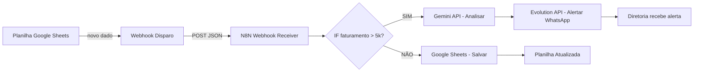

# Capítulo 2: O Poder dos Webhooks — conectar planilhas a serviços sem programar

## 1. Introdução

No Capítulo 1, você montou sua bancada: API key do Gemini, modelos do Hugging Face, e a visão da stack completa. Mas uma bancada com ferramentas paradas é só decoração. O que transforma ferramentas em produtividade são as conexões entre elas — e é exatamente isso que os webhooks fazem.

Webhooks são as engrenagens que transmitem força de um ponto a outro na sua oficina. Quando algo acontece na planilha (um dado novo, um faturamento atualizado), o webhook dispara uma notificação para outro sistema processar. Sem programar. Sem servidor próprio. Apenas configurar o que escuta e o que dispara.

## 2. Explica

### A lógica fundamental: escuta e disparo

Um webhook opera em dois modos complementares. No modo **receiver** (escuta), o sistema fica aguardando que algo envie dados para ele — como um torneira aberta esperando água. No modo **sender** (disparo), o sistema notifica outro quando um evento acontece — como o alarme de uma fábrica que dispara quando a esteira para [1].

O fluxo é simples: (1) um evento ocorre (ex.: nova linha na planilha), (2) o sistema que detecta o evento envia um POST HTTP com um payload JSON para a URL configurada, (3) o sistema receptor processa os dados e retorna um status 200 indicando sucesso.

Para o analista financeiro, isso se traduz em: quando o faturamento do dia ultrapassa R$ 5.000, um webhook dispara um alerta para o WhatsApp do diretor. Quando um pagamento é registrado, outro webhook atualiza o dashboard. A cascata de eventos é automática.

### N8N como orquestrador de engrenagens

O N8N é a peça central que transforma webhooks isolados em fluxos inteligentes. Diferente de uma integração point-to-point (que conecta A a B diretamente), o N8N funciona como um orquestrador: recebe dados de múltiplas fontes, aplica lógica condicional, e distribui para múltiplos destinos [2].

Os nodes essenciais para webhooks são: **Webhook** (escuta HTTP), **HTTP Request** (dispara para qualquer API REST), **Google Sheets** (lê/escreve planilhas), e **IF/Switch** (decisão condicional). Com esses quatro nodes, você constrói praticamente qualquer automação de dados financeiros.

O poder do N8N está na visualização: você vê o fluxo de dados como um diagrama, ajusta conexões com um clique, e testa cada node individualmente. É a diferença entre escrever uma receita de culinária e assistir o chef preparar o prato.

### Google Sheets como banco de dados leve

A maioria dos analistas financeiros já usa Google Sheets. A transformação aqui é conceitual: em vez de pensar na planilha como uma tabela estática, pense nela como um banco de dados com API. Cada aba é uma tabela, cada linha é um registro, e a integração com N8N permite leitura e escrita programática [3].

A estratégia é dividir a planilha em abas com papéis distintos: "Dados Brutos" (onde os dados entram), "Processados" (onde os resultados das análises ficam), e "Alertas" (onde os disparos são registrados). Essa separação evita o caos de ter tudo misturado em uma única aba.

## 3. Ilustra

Imagine sua oficina de relojoeiro. Cada engrenagem precisa se conectar à próxima com precisão milimétrica. Se uma engrenagem gira solta, toda a transmissão falha. Webhooks são os eixos que transmitem o movimento entre as engrenagens.

Quando a engrenagem "Planilha" gira (novo dado registrado), ela aciona o eixo "Webhook" que transmite o movimento para a engrenagem "N8N". O N8N, por sua vez, decide para qual engrenagem enviar a força: "Gemini" para análise, "WhatsApp" para notificação, ou "Planilha de volta" para atualização. O sistema inteiro funciona como um relógio — cada peça no seu lugar, cada movimento transmitido com precisão.



Note que o fluxo tem um ponto de decisão: o N8N não apenas repete dados — ele avalia. É essa inteligência na transmissão que separa um webhook burro de um fluxo orquestrado.

## 4. Técnica

### Construindo um webhook receiver com Express (Node.js)

O primeiro passo é criar um endpoint que escute requisições HTTP. Isso pode parecer técnico, mas é surpreendentemente simples com Express.

```javascript
// webhook_receiver.js
// Mini-servidor que recebe webhooks POST e retorna status 200

const express = require('express');
const app = express();
const PORT = 3000;

// Middleware para parsear JSON
app.use(express.json());

// Banco de dados em memória (para demonstração)
const webhookLog = [];

// Endpoint principal - recebe webhooks
app.post('/webhook/recebido', (req, res) => {
  const timestamp = new Date().toISOString();
  const dados = req.body;
  const headers = req.headers;

  // Registra o webhook recebido
  const registro = {
    id: webhookLog.length + 1,
    timestamp: timestamp,
    origem: headers['x-webhook-source'] || 'desconhecido',
    dados: dados,
    processado: false
  };

  webhookLog.push(registro);

  console.log(`[${timestamp}] Webhook recebido de: ${registro.origem}`);
  console.log(`  Dados: ${JSON.stringify(dados, null, 2)}`);

  // Retorna status 200 para o disparador saber que deu certo
  res.status(200).json({
    status: 'sucesso',
    mensagem: 'Webhook recebido e registrado',
    id: registro.id,
    timestamp: timestamp
  });
});

// Endpoint para consultar webhooks recebidos
app.get('/webhook/log', (req, res) => {
  res.json({
    total: webhookLog.length,
    registros: webhookLog.slice(-10) // Últimos 10
  });
});

// Endpoint de health check
app.get('/health', (req, res) => {
  res.json({ status: 'ok', uptime: process.uptime() });
});

// Inicia o servidor
app.listen(PORT, () => {
  console.log(`\n=== WEBHOOK RECEIVER RODANDO ===`);
  console.log(`Porta: ${PORT}`);
  console.log(`Endpoint: http://localhost:${PORT}/webhook/recebido`);
  console.log(`Log: http://localhost:${PORT}/webhook/log`);
  console.log(`Health: http://localhost:${PORT}/health\n`);
});

module.exports = app;
```

### Testando com curl

```bash
# Teste 1: Enviar um webhook simulando dados de faturamento
curl -X POST http://localhost:3000/webhook/recebido \
  -H "Content-Type: application/json" \
  -H "X-Webhook-Source: google-sheets" \
  -d '{
    "evento": "nova_venda",
    "clinica": "Odonto Premium",
    "valor": 7500.00,
    "procedimento": "Clareamento + Facetas",
    "dentista": "Dr. Carlos",
    "data": "2026-08-08"
  }'

# Teste 2: Enviar dados de pagamento
curl -X POST http://localhost:3000/webhook/recebido \
  -H "Content-Type: application/json" \
  -H "X-Webhook-Source: sistema-pagamento" \
  -d '{
    "evento": "pagamento_recebido",
    "cliente": "Maria Silva",
    "valor": 2800.00,
    "forma": "PIX",
    "referencia": "FAT-2026-0847"
  }'

# Teste 3: Consultar log de webhooks recebidos
curl http://localhost:3000/webhook/log
```

### Configurando o N8N para receber e processar webhooks

O N8N transforma o webhook receiver em um workflow completo. Aqui está a configuração JSON exportada de um workflow funcional:

```json
{
  "name": "Webhook Financeiro - Processamento Automatizado",
  "nodes": [
    {
      "parameters": {
        "httpMethod": "POST",
        "path": "financeiro",
        "responseMode": "responseNode",
        "options": {}
      },
      "name": "Webhook - Receber Dados",
      "type": "n8n-nodes-base.webhook",
      "typeVersion": 2,
      "position": [250, 300],
      "webhookId": "webhook-financeiro-001"
    },
    {
      "parameters": {
        "conditions": {
          "options": {"caseSensitive": true, "leftValue": "", "typeValidation": "strict"},
          "conditions": [
            {
              "id": "condicao-venda",
              "leftValue": "={{ $json.body.evento }}",
              "rightValue": "nova_venda",
              "operator": {"type": "string", "operation": "equals"}
            }
          ]
        }
      },
      "name": "IF - É Venda?",
      "type": "n8n-nodes-base.if",
      "typeVersion": 2,
      "position": [480, 300]
    },
    {
      "parameters": {
        "conditions": {
          "options": {"caseSensitive": true, "leftValue": "", "typeValidation": "strict"},
          "conditions": [
            {
              "id": "condicao-valor",
              "leftValue": "={{ $json.body.valor }}",
              "rightValue": "5000",
              "operator": {"type": "number", "operation": "gt"}
            }
          ]
        }
      },
      "name": "IF - Venda > 5k?",
      "type": "n8n-nodes-base.if",
      "typeVersion": 2,
      "position": [710, 250]
    },
    {
      "parameters": {
        "method": "POST",
        "url": "=https://generativelanguage.googleapis.com/v1beta/models/gemini-1.5-flash:generateContent?key={{ $env.GEMINI_API_KEY }}",
        "sendBody": true,
        "specifyBody": "json",
        "jsonBody": "={\"contents\":[{\"parts\":[{\"text\":\"Gere um alerta executivo em 2 linhas para uma venda de R$ {{ $json.body.valor }} de {{ $json.body.procedimento }} na {{ $json.body.clinica }}.\"}]}]}"
      },
      "name": "Gemini - Formatar Alerta",
      "type": "n8n-nodes-base.httpRequest",
      "typeVersion": 4,
      "position": [940, 200]
    },
    {
      "parameters": {
        "documentId": {"__rl": true, "value": "SUA_PLANILHA_ID"},
        "sheetName": {"__rl": true, "value": "Vendas"},
        "columns": {
          "mappingMode": "defineBelow",
          "value": {
            "data": "={{ $now.toISO() }}",
            "clinica": "={{ $('Webhook - Receber Dados').item.json.body.clinica }}",
            "valor": "={{ $('Webhook - Receber Dados').item.json.body.valor }}",
            "procedimento": "={{ $('Webhook - Receber Dados').item.json.body.procedimento }}",
            "dentista": "={{ $('Webhook - Receber Dados').item.json.body.dentista }}",
            "alerta_gerado": "SIM"
          }
        }
      },
      "name": "Google Sheets - Registrar Venda",
      "type": "n8n-nodes-base.googleSheets",
      "typeVersion": 4,
      "position": [940, 400]
    },
    {
      "parameters": {
        "respondWith": "json",
        "responseBody": "={\"status\": \"processado\", \"evento\": \"{{ $('Webhook - Receber Dados').item.json.body.evento }}\"}"
      },
      "name": "Respond to Webhook",
      "type": "n8n-nodes-base.respondToWebhook",
      "typeVersion": 1,
      "position": [1170, 300]
    }
  ],
  "connections": {
    "Webhook - Receber Dados": {"main": [[{"node": "IF - É Venda?", "type": "main", "index": 0}]]},
    "IF - É Venda?": {"main": [[{"node": "IF - Venda > 5k?", "type": "main", "index": 0}]]},
    "IF - Venda > 5k?": {
      "main": [
        [
          {"node": "Gemini - Formatar Alerta", "type": "main", "index": 0},
          {"node": "Google Sheets - Registrar Venda", "type": "main", "index": 0}
        ]
      ]
    },
    "Gemini - Formatar Alerta": {"main": [[{"node": "Respond to Webhook", "type": "main", "index": 0}]]},
    "Google Sheets - Registrar Venda": {"main": [[{"node": "Respond to Webhook", "type": "main", "index": 0}]]}
  }
}
```

### Estrutura de planilha para automação

```python
# setup_planilha.py
# Script para criar a estrutura de abas no Google Sheets via API

from google.oauth2 import service_account
from googleapiclient.discovery import build
import json

# Configuração de autenticação
SCOPES = ['https://www.googleapis.com/auth/spreadsheets']
SERVICE_ACCOUNT_FILE = 'credenciais-gsheets.json'  # Baixe do Google Cloud

def criar_estrutura_planilha(spreadsheet_id):
    """Cria as abas necessárias para automação"""
    creds = service_account.Credentials.from_service_account_file(
        SERVICE_ACCOUNT_FILE, scopes=SCOPES
    )
    service = build('sheets', 'v4', credentials=creds)
    sheets = service.spreadsheets()

    # Estrutura das abas
    abas_config = [
        {
            "titulo": "Dados Brutos",
            "headers": ["Data", "Clinica", "Procedimento", "Dentista", "Valor", "Status"]
        },
        {
            "titulo": "Processados",
            "headers": ["Data", "Tipo", "Descricao", "Resultado", "Confianca"]
        },
        {
            "titulo": "Alertas",
            "headers": ["Data", "Tipo Alerta", "Mensagem", "Destinatario", "Enviado"]
        },
        {
            "titulo": "Config",
            "headers": ["Parametro", "Valor", "Descricao"],
            "dados": [
                ["limiar_venda_grande", "5000", "Valor em R$ que dispara alerta"],
                ["limiar_estoque_baixo", "10", "Quantidade mínima em estoque"],
                ["frequencia_alerta", "diario", "Frequência de relatórios"],
                ["whatsapp_destinatario", "+5511999999999", "Número do diretor"]
            ]
        }
    ]

    requests_body = []

    for aba in abas_config:
        requests_body.append({
            "addSheet": {
                "properties": {"title": aba["titulo"]}
            }
        })

    # Cria todas as abas de uma vez
    body = {"requests": requests_body}
    sheets.batchUpdate(
        spreadsheetId=spreadsheet_id,
        body=body
    ).execute()

    # Preenche headers e dados de config
    for aba in abas_config:
        range_notation = f"'{aba['titulo']}'!A1:{chr(64 + len(aba['headers']))}1"

        sheets.values().update(
            spreadsheetId=spreadsheet_id,
            range=range_notation,
            valueInputOption="RAW",
            body={"values": [aba["headers"]]}
        ).execute()

        # Se tem dados iniciais (aba Config)
        if "dados" in aba:
            range_dados = f"'{aba['titulo']}'!A2:{chr(64 + len(aba['headers']))}{1 + len(aba['dados'])}"
            sheets.values().update(
                spreadsheetId=spreadsheet_id,
                range=range_dados,
                valueInputOption="RAW",
                body={"values": aba["dados"]}
            ).execute()

    print("Estrutura de planilha criada com sucesso!")
    print(f"Abas: {[a['titulo'] for a in abas_config]}")

if __name__ == "__main__":
    SPREADSHEET_ID = "<seu-spreadsheet-id>"
    criar_estrutura_planilha(SPREADSHEET_ID)
```

## 5. Aplica

Você configurou o webhook receiver, montou o workflow no N8N, e criou a estrutura de planilhas. Agora vamos ver o que acontece quando a teoria encontra a prática — e onde os improvisadores tropeçam.

Imagine que você é o analista de uma clínica odontológica que fatura R$ 180 mil por mês. O dono quer ser alertado no WhatsApp sempre que uma venda de R$ 5 mil ou mais acontecer. Você monta o workflow: planilha alimenta webhook, N8N avalia o valor, Gemini formata o alerta, WhatsApp entrega. Tudo funciona... nos testes.

O primeiro dia em produção revela a verdade. A recepcionista cadastra 3 vendas simultâneas. O webhook dispara 3 vezes em 10 segundos. O rate limit do Gemini (15 RPM) não é atingido, mas o WhatsApp recebe 3 mensagens quase idênticas em sequência. O diretor responde: "Para de me spammar." O problema não é técnico — é de design. A solução: adicionar um node de **agregação** no N8N que agrupa vendas em janelas de 5 minutos antes de enviar o alerta consolidado.

Outra armadilha real: a assinatura dos webhooks. Se qualquer pessoa descobrir a URL do seu webhook, pode enviar dados falsos para a sua planilha. A prática correta é adicionar um header de autenticação (como `X-Webhook-Secret`) e validar no N8N antes de processar. É a diferença entre uma oficina aberta e uma oficina com fechadura.

O terceiro erro clássico é não testar com dados sujos. Na planilha de teste, tudo é perfeito: valores numéricos corretos, datas no formato certo, nomes sem caracteres especiais. Na realidade, a recepcionista digita "R$ 5.000,00" em vez de "5000", ou "08/08/2026" em vez de "2026-08-08". A camada de transformação de dados (que vamos construir nos próximos capítulos) é o que evita que a oficina pare por causa de uma vírgula no lugar errado.

O profissional que antecipa esses cenários antes de colocar o sistema em produção é o que se destaca na carreira. A oficina do improvisador não é sobre pressa — é sobre calibração.

## 6. Conclusão

Neste capítulo, você dominou a lógica de transmissão que conecta sua oficina. Os três pilares ficam registrados: webhooks são a espinha dorsal da comunicação entre sistemas, o N8N é o orquestrador que adiciona inteligência às conexões, e o Google Sheets transforma-se em banco de dados operacional quando estruturado corretamente.

O que diferencia um webhook burro de um fluxo orquestrado é a capacidade de decisão: o N8N não apenas repete dados, ele avalia, agrega e direciona. É isso que transforma uma planilha em um sistema de inteligência financeira.

No próximo capítulo, vamos aplicar tudo isso a um caso real: a automação completa de pesquisa de satisfação (NPS) pós-venda, do disparo à tabulação automática. A oficina vai começar a girar de verdade.

## 7. Referências Bibliográficas

[1] MDN WEB DOCS. *Webhooks — How they work*. Disponível em: https://developer.mozilla.org/en-US/docs/Web/Webhooks. Acesso em: 08 ago. 2026.

[2] N8N. *HTTP Request Node Documentation*. Disponível em: https://docs.n8n.io/integrations/builtin/core-nodes/n8n-nodes-base.httprequest.md. Acesso em: 08 ago. 2026.

[3] N8N. *Google Sheets Integration Documentation*. Disponível em: https://docs.n8n.io/integrations/builtin/app-nodes/n8n-nodes-base.googlesheets.md. Acesso em: 08 ago. 2026.

[4] N8N. *Webhook Node Documentation*. Disponível em: https://docs.n8n.io/integrations/builtin/core-nodes/n8n-nodes-base.webhook.md. Acesso em: 08 ago. 2026.

[5] GOOGLE. *Google Sheets API — Quickstart*. Disponível em: https://developers.google.com/sheets/api/quickstart/python. Acesso em: 08 ago. 2026.
