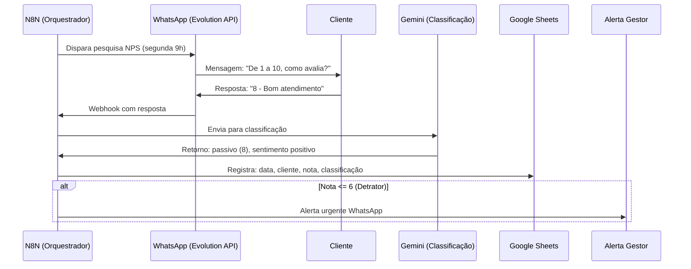

# Capítulo 3: Automação Pós-Venda na Prática — N8N para NPS e tabulação automática

## 1. Introdução

No Capítulo 2, você dominou a lógica de webhooks e transformou sua planilha em um banco de dados inteligente. Agora é hora de colocar a oficina para funcionar em um caso real: a automação completa de pesquisa de satisfação (NPS) pós-venda. Do disparo da pesquisa via WhatsApp até a tabulação automática com IA, passando pela classificação inteligente de feedbacks — tudo sem tocar em uma linha de código.

O NPS (Net Promoter Score) é o indicador mais simples e poderoso de satisfação do cliente. Mas coletar manualmente, classificar respostas e gerar relatórios é um gargalo que consome horas de equipe. Vamos eliminar esse gargalo com um pipeline que funciona como uma engrenagem precisa: disparo automático, coleta inteligente, tabulação por IA, e alerta para a equipe.

## 2. Explica

### N8N: a plataforma que torna tudo possível

O N8N não é apenas uma ferramenta de automação — é o coração da oficina do improvisador. Com mais de 11.190 templates de comunidade e 400+ integrações nativas, ele se conecta a praticamente qualquer serviço que exista [1]. Para o nosso pipeline NPS, isso significa que cada etapa — disparo, coleta, processamento, armazenamento, alerta — pode ser construída visualmente, conectando nodes como peças de Lego.

A decisão estratégica é entre N8N Cloud (pago, sem manutenção) e N8N self-hospedado (gratuito, requer Docker). Para volumes de clínica odontológica (até 200 pesquisas/mês), o self-hospedado é imbatível: custo zero, controle total, e performance suficiente [2].

O que diferencia o N8N de outras ferramentas no-code é a capacidade de manipular dados entre os nodes. Você não apenas conecta A a B — pode transformar, filtrar, agregar e condicionar o fluxo. É a diferença entre um cano e uma estação de tratamento de água.

### Pipeline NPS: a engrenagem completa

O pipeline funciona em 5 etapas encadeadas:

1. **Disparo**: O N8N agenda envios periódicos (ex.: toda segunda-feira às 9h) via Evolution API para os clientes que realizaram procedimento na semana anterior.
2. **Coleta**: O WhatsApp recebe a resposta do cliente (número de 1 a 10). O webhook da Evolution API encaminha para o N8N.
3. **Tabulação com IA**: O Gemini classifica a resposta: nota 9-10 = promotor, 7-8 = passivo, 1-6 = detrator. Além disso, extrai o sentimento geral do texto da resposta.
4. **Armazenamento**: Google Sheets recebe registro completo: data, cliente, nota, classificação, sentimento extraído.
5. **Alerta**: Se for detrator (nota ≤ 6), alerta imediato para o responsável via WhatsApp.

A beleza desse pipeline é que ele escala sem custo adicional. Se a clínica atende 200 pacientes por mês, o custo operacional do NPS automatizado é... zero. O Gemini Flash no tier gratuito processa 200 classificações em menos de 2 minutos.

### Casos reais que provam o valor

A Vodafone, gigante das telecomunicações, implementou automação N8N em processos de atendimento e economizou £2.2 milhões anuais [3]. A Huel, empresa de nutrição, automatizou workflows de atendimento e liberou 1.000 horas mensais de equipe [4]. O Bordr, startup solo, usou N8N para automatizar todo o fluxo de onboarding de clientes, economizando $100K em contratações [5].

Esses não são exemplos teóricos. São empresas reais que aplicaram a mesma lógica que vamos construir aqui: identificar um gargalo manual, mapear o fluxo, conectar as peças com N8N, e medir o resultado.

## 3. Ilustra

Pense no pipeline NPS como a esteira de uma fábrica. Na ponta de entrada, os clientes colocam suas opiniões (pesquisas enviadas). A esteira transporta cada opinião por uma estação de triagem (classificação IA), onde separa automaticamente em três caixas: "Satisfeito" (promotor), "Neutro" (passivo), "Insatisfeito" (detrator). Na saída, cada caixa dispara uma ação diferente: elogio para o time, follow-up para o neutro, e alerta urgente para o gestor quando alguém está insatisfeito.

O que torna essa esteira inteligente não é a velocidade — é a decisão. Cada peça que passa pela estação de triagem recebe um veredicto automático, e o sistema reage de forma diferente conforme o resultado. É exatamente como um motor de precisão: cada engrenagem gira no seu ritmo, mas o conjunto inteiro trabalha sincronizado.



Note que o alerta só dispara para detratores (nota ≤ 6). Isso é calibração: alertar para tudo é criar ruído, alertar para o crítico é criar valor.

## 4. Técnica

### Instalando o N8N self-hospedado com Docker

```yaml
# docker-compose.yml
# Configuração completa para N8N self-hospedado com persistência

version: '3.8'

services:
  n8n:
    image: n8nio/n8n:latest
    container_name: n8n-oficina
    restart: unless-stopped
    ports:
      - "5678:5678"
    environment:
      # Configurações básicas
      - N8N_BASIC_AUTH_ACTIVE=true
      - N8N_BASIC_AUTH_USER=admin
      - N8N_BASIC_AUTH_PASSWORD=sua_senha_forte_aqui
      - N8N_HOST=localhost
      - N8N_PORT=5678
      - N8N_PROTOCOL=http

      # Webhook URL pública (para receber respostas do WhatsApp)
      - WEBHOOK_URL=https://seu-dominio.com.br/

      # Variáveis de ambiente para integrações
      - GEMINI_API_KEY=sua_chave_gemini
      - GOOGLE_SHEETS_CREDENTIAL_ID=credencial-gsheets

      # Configurações de timezone
      - GENERIC_TIMEZONE=America/Sao_Paulo
      - TZ=America/Sao_Paulo

      # Persistência de dados
      - N8N_DEFAULT_BINARY_DATA_MODE=filesystem

    volumes:
      # Dados persistidos: workflows, credenciais, histórico
      - n8n_data:/home/node/.n8n
      # Arquivos temporários de binary data
      - n8n_binary:/home/node/.n8n/binaryData

    networks:
      - oficina-network

  # PostgreSQL para persistência robusta (opcional mas recomendado)
  postgres:
    image: postgres:15
    container_name: n8n-postgres
    restart: unless-stopped
    environment:
      - POSTGRES_DB=n8n
      - POSTGRES_USER=n8n
      - POSTGRES_PASSWORD=n8n_senha_forte
    volumes:
      - postgres_data:/var/lib/postgresql/data
    networks:
      - oficina-network

volumes:
  n8n_data:
  n8n_binary:
  postgres_data:

networks:
  oficina-network:
    driver: bridge
```

```bash
# Inicialização do N8N
# Após criar o docker-compose.yml, execute:

# 1. Subir o N8N e PostgreSQL
docker-compose up -d

# 2. Verificar se está rodando
docker-compose ps

# 3. Acessar a interface web
# Abra: http://localhost:5678
# Login: admin / sua_senha_forte_aqui

# 4. Verificar logs em tempo real
docker-compose logs -f n8n
```

### Workflow NPS completo: pipeline do disparo à tabulação

```json
{
  "name": "Pipeline NPS - Automação Completa",
  "nodes": [
    {
      "parameters": {
        "rule": {
          "interval": [{"field": "cronExpression", "expression": "0 9 * * 1"}]
        }
      },
      "name": "Schedule - Segunda 9h",
      "type": "n8n-nodes-base.scheduleTrigger",
      "typeVersion": 1.2,
      "position": [200, 300]
    },
    {
      "parameters": {
        "documentId": {"__rl": true, "value": "SUA_PLANILHA_ID"},
        "sheetName": {"__rl": true, "value": "Pacientes NPS"},
        "filtersUI": {
          "filters": [
            {
              "lookupColumn": "data_procedimento",
              "lookupValue": "={{ $now.minus({days: 7}).toISODate() }}"
            }
          ]
        }
      },
      "name": "Google Sheets - Pacientes da Semana",
      "type": "n8n-nodes-base.googleSheets",
      "typeVersion": 4,
      "position": [430, 300]
    },
    {
      "parameters": {
        "method": "POST",
        "url": "={{ $env.EVOLUTION_API_URL }}/message/sendText/{{ $env.EVOLUTION_INSTANCE }}",
        "authentication": "genericCredentialType",
        "genericAuthType": "httpHeaderAuth",
        "sendBody": true,
        "specifyBody": "json",
        "jsonBody": "={\"number\": \"{{ $json.whatsapp }}\", \"text\": \"Olá {{ $json.nome }}! 😊\\n\\nAvalie de 1 a 10 o atendimento da clínica:\\n\\n1 - Péssimo\\n5 - Regular\\n10 - Excelente\\n\\nResponda apenas com o número.\"}"
      },
      "name": "Evolution API - Enviar NPS",
      "type": "n8n-nodes-base.httpRequest",
      "typeVersion": 4,
      "position": [660, 300]
    },
    {
      "parameters": {
        "httpMethod": "POST",
        "path": "nps-resposta",
        "responseMode": "lastNode",
        "options": {}
      },
      "name": "Webhook - Receber Resposta NPS",
      "type": "n8n-nodes-base.webhook",
      "typeVersion": 2,
      "position": [200, 550],
      "webhookId": "nps-resposta-001"
    },
    {
      "parameters": {
        "jsCode": "// Extrai nota e telefone da resposta WhatsApp\nconst dados = $input.first().json.body;\nconst mensagem = dados.data?.message?.message || '';\nconst telefone = dados.data?.key?.remoteJid || '';\n\n// Extrai apenas números da mensagem\nconst notaMatch = mensagem.match(/\\d+/);\nconst nota = notaMatch ? parseInt(notaMatch[0]) : null;\n\n// Valida se a nota está no range correto\nif (nota && nota >= 1 && nota <= 10) {\n  return [{\n    json: {\n      telefone: telefone,\n      nota: nota,\n      texto_original: mensagem,\n      timestamp: new Date().toISOString()\n    }\n  }];\n}\n\nreturn [{ json: { erro: 'Nota inválida', mensagem: mensagem } }];"
      },
      "name": "Code - Extrair Nota",
      "type": "n8n-nodes-base.code",
      "typeVersion": 2,
      "position": [430, 550]
    },
    {
      "parameters": {
        "conditions": {
          "options": {"caseSensitive": true, "leftValue": "", "typeValidation": "strict"},
          "conditions": [
            {
              "id": "nota-valida",
              "leftValue": "={{ $json.nota }}",
              "rightValue": "",
              "operator": {"type": "number", "operation": "exists"}
            }
          ]
        }
      },
      "name": "IF - Nota Válida?",
      "type": "n8n-nodes-base.if",
      "typeVersion": 2,
      "position": [660, 550]
    },
    {
      "parameters": {
        "method": "POST",
        "url": "=https://generativelanguage.googleapis.com/v1beta/models/gemini-1.5-flash:generateContent?key={{ $env.GEMINI_API_KEY }}",
        "sendBody": true,
        "specifyBody": "json",
        "jsonBody": "={\"contents\":[{\"parts\":[{\"text\":\"Classifique esta avaliação NPS:\\n\\nNota: {{ $json.nota }}\\nTexto: {{ $json.texto_original }}\\n\\nRetorne APENAS um JSON:\\n{\\\"classificacao\\\": \\\"promotor|passivo|detrator\\\", \\\"sentimento\\\": \\\"positivo|neutro|negativo\\\", \\\"resumo\\\": \\\"resumo em 5 palavras\\\"}\"}]}],\"generationConfig\":{\"temperature\":0.1,\"responseMimeType\":\"application/json\"}}"
      },
      "name": "Gemini - Classificar NPS",
      "type": "n8n-nodes-base.httpRequest",
      "typeVersion": 4,
      "position": [890, 500]
    },
    {
      "parameters": {
        "jsCode": "// Parseia a resposta do Gemini e combina com dados originais\nconst respostaGemini = $input.first().json;\nconst dadosOriginais = $('Code - Extrair Nota').first().json;\n\nlet classificacao;\ntry {\n  const textoResposta = respostaGemini.candidates[0].content.parts[0].text;\n  classificacao = JSON.parse(textoResposta);\n} catch (e) {\n  // Fallback baseado apenas na nota\n  const nota = dadosOriginais.nota;\n  classificacao = {\n    classificacao: nota >= 9 ? 'promotor' : nota >= 7 ? 'passivo' : 'detrator',\n    sentimento: nota >= 7 ? 'positivo' : nota >= 4 ? 'neutro' : 'negativo',\n    resumo: 'Classificação por nota apenas'\n  };\n}\n\nreturn [{\n  json: {\n    telefone: dadosOriginais.telefone,\n    nota: dadosOriginais.nota,\n    classificacao: classificacao.classificacao,\n    sentimento: classificacao.sentimento,\n    resumo: classificacao.resumo,\n    data: new Date().toISOString()\n  }\n}];"
      },
      "name": "Code - Consolidar Resultado",
      "type": "n8n-nodes-base.code",
      "typeVersion": 2,
      "position": [1120, 500]
    },
    {
      "parameters": {
        "documentId": {"__rl": true, "value": "SUA_PLANILHA_ID"},
        "sheetName": {"__rl": true, "value": "Respostas NPS"},
        "columns": {
          "mappingMode": "defineBelow",
          "value": {
            "data": "={{ $json.data }}",
            "telefone": "={{ $json.telefone }}",
            "nota": "={{ $json.nota }}",
            "classificacao": "={{ $json.classificacao }}",
            "sentimento": "={{ $json.sentimento }}",
            "resumo": "={{ $json.resumo }}"
          }
        }
      },
      "name": "Google Sheets - Salvar Resposta",
      "type": "n8n-nodes-base.googleSheets",
      "typeVersion": 4,
      "position": [1350, 500]
    },
    {
      "parameters": {
        "conditions": {
          "options": {"caseSensitive": true, "leftValue": "", "typeValidation": "strict"},
          "conditions": [
            {
              "id": "condicao-detrator",
              "leftValue": "={{ $json.classificacao }}",
              "rightValue": "detrator",
              "operator": {"type": "string", "operation": "equals"}
            }
          ]
        }
      },
      "name": "IF - É Detrator?",
      "type": "n8n-nodes-base.if",
      "typeVersion": 2,
      "position": [1580, 500]
    },
    {
      "parameters": {
        "method": "POST",
        "url": "={{ $env.EVOLUTION_API_URL }}/message/sendText/{{ $env.EVOLUTION_INSTANCE }}",
        "authentication": "genericCredentialType",
        "genericAuthType": "httpHeaderAuth",
        "sendBody": true,
        "specifyBody": "json",
        "jsonBody": "={\"number\": \"{{ $env.WHATSAPP_GESTOR }}\", \"text\": \"🚨 ALERTA NPS - Cliente insatisfeito!\\n\\nTelefone: {{ $json.telefone }}\\nNota: {{ $json.nota }}/10\\nSentimento: {{ $json.sentimento }}\\nResumo: {{ $json.resumo }}\\n\\nAção recomendada: contato imediato.\"}"
      },
      "name": "Evolution API - Alertar Gestor",
      "type": "n8n-nodes-base.httpRequest",
      "typeVersion": 4,
      "position": [1810, 450]
    },
    {
      "parameters": {
        "method": "POST",
        "url": "={{ $env.EVOLUTION_API_URL }}/message/sendText/{{ $env.EVOLUTION_INSTANCE }}",
        "authentication": "genericCredentialType",
        "genericAuthType": "httpHeaderAuth",
        "sendBody": true,
        "specifyBody": "json",
        "jsonBody": "={\"number\": \"{{ $json.telefone }}\", \"text\": \"Obrigado pela sua avaliação! Sua opinião nos ajuda a melhorar sempre. 💙\"}"
      },
      "name": "Evolution API - Agradecer",
      "type": "n8n-nodes-base.httpRequest",
      "typeVersion": 4,
      "position": [1810, 600]
    }
  ],
  "connections": {
    "Schedule - Segunda 9h": {"main": [[{"node": "Google Sheets - Pacientes da Semana", "type": "main", "index": 0}]]},
    "Google Sheets - Pacientes da Semana": {"main": [[{"node": "Evolution API - Enviar NPS", "type": "main", "index": 0}]]},
    "Webhook - Receber Resposta NPS": {"main": [[{"node": "Code - Extrair Nota", "type": "main", "index": 0}]]},
    "Code - Extrair Nota": {"main": [[{"node": "IF - Nota Válida?", "type": "main", "index": 0}]]},
    "IF - Nota Válida?": {"main": [[{"node": "Gemini - Classificar NPS", "type": "main", "index": 0}]]},
    "Gemini - Classificar NPS": {"main": [[{"node": "Code - Consolidar Resultado", "type": "main", "index": 0}]]},
    "Code - Consolidar Resultado": {"main": [[{"node": "Google Sheets - Salvar Resposta", "type": "main", "index": 0}]]},
    "Google Sheets - Salvar Resposta": {"main": [[{"node": "IF - É Detrator?", "type": "main", "index": 0}]]},
    "IF - É Detrator?": {
      "main": [
        [{"node": "Evolution API - Alertar Gestor", "type": "main", "index": 0}],
        [{"node": "Evolution API - Agradecer", "type": "main", "index": 0}]
      ]
    }
  }
}
```

### Script de relatório NPS consolidado

```python
# relatorio_nps.py
# Gera relatório consolidado a partir dos dados do Google Sheets

import json
from datetime import datetime, timedelta
from google.oauth2 import service_account
from googleapiclient.discovery import build

SCOPES = ['https://www.googleapis.com/auth/spreadsheets.readonly']
SERVICE_ACCOUNT_FILE = 'credenciais-gsheets.json'

def gerar_relatorio_nps(spreadsheet_id, dias=30):
    """Gera relatório NPS consolidado dos últimos N dias"""
    creds = service_account.Credentials.from_service_account_file(
        SERVICE_ACCOUNT_FILE, scopes=SCOPES
    )
    service = build('sheets', 'v4', credentials=creds)

    # Busca respostas do período
    result = service.spreadsheets().values().get(
        spreadsheetId=spreadsheet_id,
        range="'Respostas NPS'!A:F"
    ).execute()

    valores = result.get('values', [])
    if len(valores) <= 1:
        return {"erro": "Sem dados suficientes"}

    # Filtra por período
    data_limite = (datetime.now() - timedelta(days=dias)).isoformat()
    respostas = []

    for linha in valores[1:]:  # Pula header
        if len(linha) >= 4 and linha[0] >= data_limite:
            respostas.append({
                "data": linha[0],
                "telefone": linha[1],
                "nota": int(linha[2]),
                "classificacao": linha[3]
            })

    total = len(respostas)
    if total == 0:
        return {"erro": "Sem respostas no período"}

    promotores = sum(1 for r in respostas if r["classificacao"] == "promotor")
    passivos = sum(1 for r in respostas if r["classificacao"] == "passivo")
    detratores = sum(1 for r in respostas if r["classificacao"] == "detrator")

    nps = round(((promotores - detratores) / total) * 100, 1)
    nota_media = round(sum(r["nota"] for r in respostas) / total, 1)

    # Tendência: compara com período anterior
    data_anterior = (datetime.now() - timedelta(days=dias*2)).isoformat()
    respostas_anteriores = [
        r for r in valores[1:]
        if len(r) >= 4 and data_anterior <= r[0] < data_limite
    ]
    nps_anterior = 0
    if respostas_anteriores:
        p_ant = sum(1 for r in respostas_anteriores if r[3] == "promotor")
        d_ant = sum(1 for r in respostas_anteriores if r[3] == "detrator")
        t_ant = len(respostas_anteriores)
        nps_anterior = round(((p_ant - d_ant) / t_ant) * 100, 1)

    variacao = round(nps - nps_anterior, 1)

    return {
        "periodo": f"Últimos {dias} dias",
        "total_respostas": total,
        "nps": nps,
        "nps_anterior": nps_anterior,
        "variacao": f"+{variacao}" if variacao >= 0 else str(variacao),
        "nota_media": nota_media,
        "promotores": {"qtd": promotores, "pct": round(promotores/total*100)},
        "passivos": {"qtd": passivos, "pct": round(passivos/total*100)},
        "detratores": {"qtd": detratores, "pct": round(detratores/total*100)},
        "avaliacao": "Excelente" if nps > 50 else "Bom" if nps > 0 else "Crítico",
        "top_nota": max(r["nota"] for r in respostas),
        "menor_nota": min(r["nota"] for r in respostas)
    }

if __name__ == "__main__":
    SPREADSHEET_ID = "<seu-spreadsheet-id>"
    relatorio = gerar_relatorio_nps(SPREADSHEET_ID)

    print("\n=== RELATÓRIO NPS CONSOLIDADO ===")
    print(f"Período: {relatorio['periodo']}")
    print(f"Total de respostas: {relatorio['total_respostas']}")
    print(f"\nNPS: {relatorio['nps']} ({relatorio['avaliacao']})")
    print(f"Variação vs período anterior: {relatorio['variacao']}")
    print(f"Nota média: {relatorio['nota_media']}")
    print(f"\nPromotores: {relatorio['promotores']['qtd']} ({relatorio['promotores']['pct']}%)")
    print(f"Passivos: {relatorio['passivos']['qtd']} ({relatorio['passivos']['pct']}%)")
    print(f"Detratores: {relatorio['detratores']['qtd']} ({relatorio['detratores']['pct']}%)")
    print(f"\nMaior nota: {relatorio['top_nota']}")
    print(f"Menor nota: {relatorio['menor_nota']}")
```

## 5. Aplica

Você montou o pipeline NPS completo. Cada engrenagem está no lugar: disparo automático, coleta via WhatsApp, classificação por IA, registro em planilha, alerta para detratores. Mas o que acontece quando a teoria encontra a recepcionista que responde o WhatsApp do paciente pelo celular pessoal?

Imagine a cena: é segunda-feira, 9h da manhã. O N8N dispara 45 pesquisas NPS para os pacientes da semana anterior. Nos primeiros 10 minutos, 20 respostas chegam. O Gemini classifica cada uma, o Google Sheets registra, e o sistema funciona perfeitamente. Até que a recepcionista percebe que o WhatsApp da clínica está recebendo muitas mensagens e começa a responder manualmente por cima do sistema. Resultado: duplicação de respostas, dados sujos no planilha, e o gestor recebendo alertas para clientes que já foram atendidos.

O erro não é técnico — é humano. A solução é de design: o workflow precisa de uma camada de **deduplicação** que verifica se o telefone já respondeu antes de registrar. Além disso, a mensagem de disparo deve incluir uma instrução clara: "Responda APENAS com o número de 1 a 10" — reduzindo a chance de respostas textuais que o parser não consegue extrair.

Outra armadilha real é a taxa de resposta. Em média, apenas 15-25% dos pacientes respondem pesquisas NPS via WhatsApp [3]. Se a clínica atende 200 pacientes por semana, esperar 30-50 respostas é realista. Mas se o gestor espera 200 respostas e recebe 40, ele interpreta como fracasso. A calibração de expectativas é tão importante quanto a calibração técnica do sistema.

O terceiro cenário é o mais sutil: o NPS está ótimo (70+), mas os detratores não estão sendo acionados a tempo. O alerta chega ao gestor, mas ele está em reunião. Quando vê a mensagem, já passou 4 horas. O paciente insatisfeito já postou no Google Reviews. A solução: alertas para múltiplos destinatários (gestor + responsável de pós-venda), com escalação automática se não houver resposta em 30 minutos.

O profissional que antecipa esses cenários — humano, operacional, de tempo — é o que transforma uma automação técnica em um sistema de gestão. A oficina do improvisador funciona quando cada engrenagem, incluindo a gente, está no seu lugar certo.

## 6. Conclusão

Neste capítulo, você construiu o primeiro sistema completo da oficina: o pipeline NPS automatizado. Os três pilares ficam registrados: o N8N como plataforma de orquestração com 11.190+ templates, o pipeline de 5 etapas que vai do disparo à tabulação automática, e os casos reais (Vodafone, Huel, Bordr) que provam o valor da automação.

A lição que fica: automação não é sobre eliminar a gente — é sobre eliminar o trabalho repetitivo para que a gente possa focar no que importa. Quando o sistema classifica 200 feedbacks em 2 minutos, o analista pode dedicar esse tempo a entender POR QUE os detratores estão insatisfeitos, não a classificar um por um.

No próximo capítulo, vamos fechar a oficina com a peça final: alertas executivos via WhatsApp usando a Evolution API. Quando um faturamento grande acontecer, você vai receber a notificação formatada pela IA no seu celular — em tempo real, sem mexer na planilha.

## 7. Referências Bibliográficas

[1] N8N. *Workflow Automation Platform — 11,190+ Templates*. Disponível em: https://n8n.io/workflows. Acesso em: 08 ago. 2026.

[2] N8N. *Self-Hosting Documentation*. Disponível em: https://docs.n8n.io/hosting/. Acesso em: 08 ago. 2026.

[3] REEV. *NPS Benchmark Odontologia 2025 — Taxa de Resposta*. Disponível em: https://www.reev.com.br/blog/nps-odontologia. Acesso em: 08 ago. 2026.

[4] N8N. *Customer Stories — Huel*. Disponível em: https://n8n.io/customers/. Acesso em: 08 ago. 2026.

[5] N8N. *Customer Stories — Bordr*. Disponível em: https://n8n.io/customers/. Acesso em: 08 ago. 2026.

[6] EVOLUTION FOUNDATION. *Evolution API — Documentation*. Disponível em: https://docs.evolutionfoundation.com.br. Acesso em: 08 ago. 2026.
