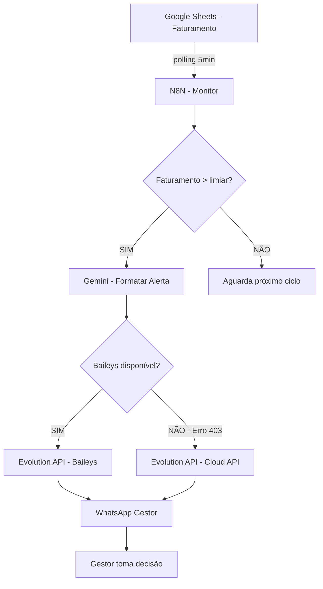

# Capítulo 4: Alertas Executivos — Evolution API WhatsApp para alertas de grandes vendas

## 1. Introdução

No Capítulo 3, você construiu o pipeline NPS — uma engrenagem que coleta, classifica e tabula feedbacks automaticamente. Agora vamos fechar a oficina com a peça final: alertas executivos que chegam ao WhatsApp da diretoria em tempo real. Quando uma venda de R$ 5.000 ou mais acontecer, o sistema não apenas registra — ele avisa, com uma mensagem formatada pela IA, no canal que o gestor já usa o dia inteiro.

A Evolution API é a ponte entre sua oficina e o WhatsApp. Com deploy via Docker e modo Baileys gratuito, ela permite enviar e receber mensagens programaticamente [1]. Combinada com o N8N e o Gemini, você tem um sistema de alertas que funciona como um alarme de precisão: dispara no momento certo, com a informação certa, para a pessoa certa.

## 2. Explica

### Evolution API: o WhatsApp como ferramenta de gestão

A Evolution API é uma REST API open-source para WhatsApp e mensageria multi-canal, mantida pela Evolution Foundation. Com 9.2k stars no GitHub e licença Apache 2.0, ela se tornou o padrão da comunidade para integrações com WhatsApp [2].

Dois modos de operação definem a estratégia: **Baileys** (gratuito, baseado no WhatsApp Web) e **Cloud API** (oficial Meta, pago por mensagem). Para volumes moderados de clínica odontológica — até 500 mensagens/mês — o Baileys é imbatível: custo zero, setup simples via Docker, e integração nativa com N8N [1].

A diferença para o WhatsApp Business API oficial é significativa: a Cloud API cobra por mensagem enviada (aproximadamente $0.005 por mensagem no Brasil), enquanto o Baileys opera sem custo por mensagem. Para uma clínica que envia 200 alertas por mês, isso significa economia de ~$1/mês — pequeno, mas simbólico de uma filosofia: usar o gratuito enquanto funciona, e pagar só quando necessário.

### Alerta de grande venda: trigger inteligente

O workflow de alerta opera em 4 etapas: (1) monitoramento periódico da planilha via N8N (a cada 5 minutos), (2) detecção de faturamento acima do limiar configurado, (3) formatação da mensagem com IA (Gemini), e (4) envio via Evolution API para o WhatsApp do gestor [3].

O segredo está na calibração do limiar. Se o alerta dispara para qualquer venda acima de R$ 1.000, o gestor recebe 30 mensagens por dia e para de ler. Se dispara apenas para vendas acima de R$ 10.000, pode perder oportunidades importantes. O limiar ideal depende do contexto: para uma clínica que fatura R$ 180 mil/mês, R$ 5.000 é um bom ponto de partida — representa ~3% do faturamento mensal e filtra apenas as vendas significativas.

A formatação via IA é o que transforma um alerta bruto em uma notificação profissional. Em vez de "Venda: R$ 7.500 - Clareamento", o Gemini gera: "Nova venda de alto valor: Clareamento + Facetas, R$ 7.500, Dr. Carlos. Representa 4.2% do faturamento mensal." A diferença é sutil, mas o impacto na percepção de profissionalismo é real.

### Risco e mitigação: quando a Meta bloqueia

O Baileys tem uma vulnerabilidade inerente: por ser baseado no WhatsApp Web (não na API oficial), a Meta pode detectar uso não autorizado e bloquear temporariamente a conta [4]. Isso não é teórico — já aconteceu com implementações que enviam volume alto de mensagens automatizadas.

A mitigação é dupla. Primeira: throttle de mensagens (máximo 20 mensagens/minuto, intervalo aleatório de 3-7 segundos entre envios). Segunda: fallback para Cloud API quando o Baileys retorna erro 403. O N8N permite configurar essa lógica de fallback com um node IF que verifica o status da resposta e direciona para o canal alternativo [3].

A decisão econômica é clara: se a clínica envia 200 alertas/mês via Baileys (custo zero) e precisa migrar para Cloud API, o custo adicional é de apenas $1/mês. A tranquilidade de ter um plano B documentado e testado vale muito mais.

## 3. Ilustra

Pense no alerta executivo como o painel de instrumentos de um avião. O piloto não precisa saber como cada sensor funciona internamente — ele precisa ver, no momento certo, se tudo está verde ou se algo merece atenção. O alerta de grande venda é exatamente isso: um indicador luminoso que acende quando o faturamento atinge o limiar, com a informação formatada para decisão imediata.

A Evolution API é o rádio que transmite esse sinal do cockpit para a torre de controle (o gestor). O Gemini é o operador de rádio que formata a mensagem de forma clara e profissional. E o N8N é o sistema elétrico que conecta sensor, rádio e alarme em uma sequência confiável.



O diagrama mostra a árvore de decisão completa: do monitoramento ao envio, passando pela escolha do canal. Note o fallback — é essa resiliência que transforma um protótipo em um sistema de produção.

## 4. Técnica

### Instalando a Evolution API com Docker

```yaml
# docker-compose-evolution.yml
# Setup completo da Evolution API para WhatsApp

version: '3.8'

services:
  evolution-api:
    image: atendai/evolution-api:v2.2.3
    container_name: evolution-oficina
    restart: unless-stopped
    ports:
      - "8080:8080"
    environment:
      # Configurações básicas
      - SERVER_URL=http://localhost:8080
      - AUTHENTICATION_API_KEY=sua_api_key_forte_aqui
      - AUTHENTICATION_EXPOSE_IN_FETCH_INSTANCES=true

      # Configurações do Baileys (gratuito)
      - CONFIG_SESSION_PHONE_CLIENT=OficinaImprovisador
      - CONFIG_SESSION_PHONE_NAME=Chrome

      # Webhook para receber mensagens
      - WEBHOOK_GLOBAL_ENABLED=true
      - WEBHOOK_GLOBAL_URL=http://n8n:5678/webhook/whatsapp-recebido
      - WEBHOOK_GLOBAL_WEBHOOK_BY_EVENTS=true

      # Configurações de mensageria
      - CHAT_UPDATE_ENABLED=true
      - CHAT_UPDATE_MINIMAL_CACHE=false

      # Rate limiting (proteção contra bloqueio)
      - DELAY_MESSAGE=3000-7000
      - MAX_MESSAGES_PER_MINUTE=20

      # Timezone
      - TZ=America/Sao_Paulo

    volumes:
      - evolution_data:/evolution/instances
      - evolution_store:/evolution/store

    networks:
      - oficina-network

  # Redis para cache de sessões (opcional mas recomendado)
  redis:
    image: redis:7-alpine
    container_name: evolution-redis
    restart: unless-stopped
    volumes:
      - redis_data:/data
    networks:
      - oficina-network

volumes:
  evolution_data:
  evolution_store:
  redis_data:

networks:
  oficina-network:
    driver: bridge
```

```bash
# Inicialização da Evolution API

# 1. Subir o serviço
docker-compose -f docker-compose-evolution.yml up -d

# 2. Verificar status
docker-compose -f docker-compose-evolution.yml ps

# 3. Criar instância WhatsApp
curl -X POST http://localhost:8080/instance/create \
  -H "Content-Type: application/json" \
  -H "apikey: sua_api_key_forte_aqui" \
  -d '{
    "instanceName": "oficina-improvisador",
    "number": "5511999999999",
    "qrcode": true,
    "integration": "WHATSAPP-BAILEYS"
  }'

# 4. Verificar QR Code no logs
docker-compose -f docker-compose-evolution.yml logs -f evolution-api

# 5. Escanear QR Code com WhatsApp (como WhatsApp Web)
# O QR Code aparece nos logs — escaneie com o WhatsApp do celular

# 6. Verificar conexão
curl http://localhost:8080/instance/connectionState/oficina-improvisador \
  -H "apikey: sua_api_key_forte_aqui"
```

### Workflow de alerta de grande venda

```json
{
  "name": "Alerta Executivo - Grande Venda",
  "nodes": [
    {
      "parameters": {
        "rule": {
          "interval": [{"field": "cronExpression", "expression": "*/5 * * * *"}]
        }
      },
      "name": "Schedule - A cada 5 minutos",
      "type": "n8n-nodes-base.scheduleTrigger",
      "typeVersion": 1.2,
      "position": [200, 300]
    },
    {
      "parameters": {
        "documentId": {"__rl": true, "value": "SUA_PLANILHA_ID"},
        "sheetName": {"__rl": true, "value": "Vendas Hoje"},
        "filtersUI": {
          "filters": [
            {
              "lookupColumn": "data",
              "lookupValue": "={{ $now.toISODate() }}"
            }
          ]
        }
      },
      "name": "Google Sheets - Vendas do Dia",
      "type": "n8n-nodes-base.googleSheets",
      "typeVersion": 4,
      "position": [430, 300]
    },
    {
      "parameters": {
        "jsCode": "// Agrega vendas do dia e identifica grandes vendas\nconst vendas = $input.all();\nconst LIMIAR = 5000;\n\nconst grandesVendas = vendas.filter(v => v.json.valor > LIMIAR);\nconst totalDia = vendas.reduce((acc, v) => acc + (parseFloat(v.json.valor) || 0), 0);\n\nif (grandesVendas.length === 0) {\n  return [{ json: { sem_alertas: true, total_dia: totalDia } }];\n}\n\n// Retorna apenas vendas que ultrapassam o limiar\nreturn grandesVendas.map(v => ({\n  json: {\n    ...v.json,\n    total_dia: totalDia,\n    percentual_faturamento: ((v.json.valor / totalDia) * 100).toFixed(1)\n  }\n}));"
      },
      "name": "Code - Filtrar Grandes Vendas",
      "type": "n8n-nodes-base.code",
      "typeVersion": 2,
      "position": [660, 300]
    },
    {
      "parameters": {
        "conditions": {
          "options": {"caseSensitive": true, "leftValue": "", "typeValidation": "strict"},
          "conditions": [
            {
              "id": "tem_grandes_vendas",
              "leftValue": "={{ $json.sem_alertas }}",
              "rightValue": "true",
              "operator": {"type": "boolean", "operation": "notEqual"}
            }
          ]
        }
      },
      "name": "IF - Há Grandes Vendas?",
      "type": "n8n-nodes-base.if",
      "typeVersion": 2,
      "position": [890, 300]
    },
    {
      "parameters": {
        "method": "POST",
        "url": "=https://generativelanguage.googleapis.com/v1beta/models/gemini-1.5-flash:generateContent?key={{ $env.GEMINI_API_KEY }}",
        "sendBody": true,
        "specifyBody": "json",
        "jsonBody": "={\"contents\":[{\"parts\":[{\"text\":\"Gere uma mensagem de alerta executivo para uma grande venda. Seja profissional, conciso e inclua contexto financeiro:\\n\\nCliente: {{ $json.cliente }}\\nProcedimento: {{ $json.procedimento }}\\nDentista: {{ $json.dentista }}\\nValor: R$ {{ $json.valor }}\\nPercentual do dia: {{ $json.percentual_faturamento }}%\\n\\nFormato: 3 linhas máximo, sem emojis, tom executivo.\"}]}],\"generationConfig\":{\"temperature\":0.3,\"maxOutputTokens\":200}}"
      },
      "name": "Gemini - Formatar Alerta",
      "type": "n8n-nodes-base.httpRequest",
      "typeVersion": 4,
      "position": [1120, 250]
    },
    {
      "parameters": {
        "jsCode": "// Extrai o texto formatado do Gemini\nconst resposta = $input.first().json;\nconst textoFormatado = resposta.candidates[0].content.parts[0].text;\nconst dadosVenda = $('Code - Filtrar Grandes Vendas').first().json;\n\n// Monta mensagem final com contexto\nconst mensagemFinal = `📊 ALERTA EXECUTIVO\\n\\n${textoFormatado}\\n\\n---\\nFaturamento do dia: R$ ${dadosVenda.total_dia.toLocaleString('pt-BR')}\\nHorário: ${new Date().toLocaleTimeString('pt-BR')}`;\n\nreturn [{\n  json: {\n    mensagem: mensagemFinal,\n    telefone_gestor: $env.WHATSAPP_GESTOR,\n    valor_venda: dadosVenda.valor\n  }\n}];"
      },
      "name": "Code - Montar Mensagem Final",
      "type": "n8n-nodes-base.code",
      "typeVersion": 2,
      "position": [1350, 250]
    },
    {
      "parameters": {
        "method": "POST",
        "url": "={{ $env.EVOLUTION_API_URL }}/message/sendText/{{ $env.EVOLUTION_INSTANCE }}",
        "authentication": "genericCredentialType",
        "genericAuthType": "httpHeaderAuth",
        "sendBody": true,
        "specifyBody": "json",
        "jsonBody": "={\"number\": \"{{ $json.telefone_gestor }}\", \"text\": \"{{ $json.mensagem }}\"}"
      },
      "name": "Evolution API - Enviar Alerta",
      "type": "n8n-nodes-base.httpRequest",
      "typeVersion": 4,
      "position": [1580, 250]
    },
    {
      "parameters": {
        "documentId": {"__rl": true, "value": "SUA_PLANILHA_ID"},
        "sheetName": {"__rl": true, "value": "Alertas Enviados"},
        "columns": {
          "mappingMode": "defineBelow",
          "value": {
            "data": "={{ $now.toISO() }}",
            "tipo": "grande_venda",
            "valor": "={{ $json.valor_venda }}",
            "mensagem": "={{ $json.mensagem }}",
            "status": "enviado"
          }
        }
      },
      "name": "Google Sheets - Registrar Alerta",
      "type": "n8n-nodes-base.googleSheets",
      "typeVersion": 4,
      "position": [1580, 400]
    }
  ],
  "connections": {
    "Schedule - A cada 5 minutos": {"main": [[{"node": "Google Sheets - Vendas do Dia", "type": "main", "index": 0}]]},
    "Google Sheets - Vendas do Dia": {"main": [[{"node": "Code - Filtrar Grandes Vendas", "type": "main", "index": 0}]]},
    "Code - Filtrar Grandes Vendas": {"main": [[{"node": "IF - Há Grandes Vendas?", "type": "main", "index": 0}]]},
    "IF - Há Grandes Vendas?": {"main": [[{"node": "Gemini - Formatar Alerta", "type": "main", "index": 0}]]},
    "Gemini - Formatar Alerta": {"main": [[{"node": "Code - Montar Mensagem Final", "type": "main", "index": 0}]]},
    "Code - Montar Mensagem Final": {
      "main": [
        [
          {"node": "Evolution API - Enviar Alerta", "type": "main", "index": 0},
          {"node": "Google Sheets - Registrar Alerta", "type": "main", "index": 0}
        ]
      ]
    }
  }
}
```

### Script de teste de envio via Evolution API

```python
# teste_evolution_api.py
# Script para testar envio de mensagens via Evolution API

import requests
import json
from datetime import datetime

# Configuração
EVOLUTION_URL = "http://localhost:8080"
API_KEY = "sua_api_key_forte_aqui"
INSTANCE = "oficina-improvisador"

def verificar_conexao():
    """Verifica se a instância WhatsApp está conectada"""
    url = f"{EVOLUTION_URL}/instance/connectionState/{INSTANCE}"
    headers = {"apikey": API_KEY}

    resposta = requests.get(url, headers=headers)

    if resposta.status_code == 200:
        estado = resposta.json()
        print(f"Estado da conexão: {estado.get('state', 'desconhecido')}")
        return estado.get('state') == 'open'
    else:
        print(f"Erro ao verificar conexão: {resposta.status_code}")
        return False

def enviar_mensagem(telefone, mensagem):
    """Envia uma mensagem de texto via WhatsApp"""
    url = f"{EVOLUTION_URL}/message/sendText/{INSTANCE}"
    headers = {
        "Content-Type": "application/json",
        "apikey": API_KEY
    }

    payload = {
        "number": telefone,
        "text": mensagem
    }

    resposta = requests.post(url, headers=headers, json=payload)

    if resposta.status_code == 200 or resposta.status_code == 201:
        resultado = resposta.json()
        print(f"Mensagem enviada com sucesso!")
        print(f"  ID: {resultado.get('key', {}).get('id', 'N/A')}")
        print(f"  Timestamp: {resultado.get('messageTimestamp', 'N/A')}")
        return True
    else:
        print(f"Erro ao enviar: {resposta.status_code}")
        print(f"  Resposta: {resposta.text}")
        return False

def enviar_alerta_venda(valor, procedimento, dentista, clinica):
    """Envia alerta formatado de grande venda"""
    data_hora = datetime.now().strftime("%d/%m/%Y %H:%M")

    mensagem = f"""ALERTA EXECUTIVO - Grande Venda

Procedimento: {procedimento}
Dentista: {dentista}
Clinica: {clinica}
Valor: R$ {valor:,.2f}
Data: {data_hora}

Faturamento do dia acima do limiar configurado."""

    # Número do gestor (configurar conforme necessário)
    telefone_gestor = "+5511999999999"

    return enviar_mensagem(telefone_gestor, mensagem)

def enviar_pesquisa_nps(telefone_cliente, nome_cliente):
    """Envia pesquisa NPS para paciente"""
    mensagem = f"""Ola {nome_cliente}!

Avalie de 1 a 10 o atendimento da clinica:
  1 - Pessimo
  5 - Regular
  10 - Excelente

Responda apenas com o numero."""

    return enviar_mensagem(telefone_cliente, mensagem)

# Script de teste principal
if __name__ == "__main__":
    print("=== TESTE DA EVOLUTION API ===\n")

    # 1. Verificar conexão
    print("1. Verificando conexão WhatsApp...")
    conectado = verificar_conexao()

    if not conectado:
        print("WhatsApp não conectado. Escaneie o QR Code primeiro.")
        exit(1)

    print("\n2. Testando envio de mensagem...")
    # NOTA: Use um número de teste que você controla
    resultado = enviar_mensagem(
        "+5511999999999",
        "Teste do sistema de alertas da Oficina do Improvisador!"
    )

    if resultado:
        print("\n3. Testando alerta de grande venda...")
        enviar_alerta_venda(
            valor=7500.00,
            procedimento="Clareamento + Facetas",
            dentista="Dr. Carlos",
            clinica="Odonto Premium"
        )

        print("\n4. Testando pesquisa NPS...")
        enviar_pesquisa_nps(
            telefone_cliente="+5511988888888",
            nome_cliente="Maria"
        )

    print("\n=== TODOS OS TESTES CONCLUIDOS ===")
```

### Configuração de fallback: Baileys → Cloud API

```python
# fallback_envio.py
# Sistema de fallback: tenta Baileys primeiro, cai para Cloud API

import requests
import time
import random

# Configurações
EVOLUTION_URL = "http://localhost:8080"
API_KEY = "sua_api_key_forte_aqui"
INSTANCE_BAILEYS = "oficina-improvisador"
INSTANCE_CLOUD = "oficina-cloud"  # Instância Cloud API (pago)

# Cloud API Meta (backup)
CLOUD_API_TOKEN = "seu-token-cloud-api"
CLOUD_PHONE_NUMBER_ID = "seu-phone-number-id"

def enviar_via_baileys(telefone, mensagem):
    """Tenta enviar via Baileys (gratuito)"""
    url = f"{EVOLUTION_URL}/message/sendText/{INSTANCE_BAILEYS}"
    headers = {"Content-Type": "application/json", "apikey": API_KEY}
    payload = {"number": telefone, "text": mensagem}

    try:
        resposta = requests.post(url, headers=headers, json=payload, timeout=10)
        if resposta.status_code in [200, 201]:
            return {"sucesso": True, "canal": "baileys", "custo": 0}
        elif resposta.status_code == 403:
            return {"sucesso": False, "erro": "bloqueado", "canal": "baileys"}
        else:
            return {"sucesso": False, "erro": f"status_{resposta.status_code}", "canal": "baileys"}
    except requests.exceptions.Timeout:
        return {"sucesso": False, "erro": "timeout", "canal": "baileys"}

def enviar_via_cloud_api(telefone, mensagem):
    """Envia via Cloud API Meta (pago, ~$0.005/msg)"""
    url = f"https://graph.facebook.com/v18.0/{CLOUD_PHONE_NUMBER_ID}/messages"
    headers = {
        "Authorization": f"Bearer {CLOUD_API_TOKEN}",
        "Content-Type": "application/json"
    }
    payload = {
        "messaging_product": "whatsapp",
        "to": telefone.replace("+", ""),
        "type": "text",
        "text": {"body": mensagem}
    }

    try:
        resposta = requests.post(url, headers=headers, json=payload, timeout=10)
        if resposta.status_code in [200, 201]:
            return {"sucesso": True, "canal": "cloud_api", "custo": 0.005}
        else:
            return {"sucesso": False, "erro": resposta.text, "canal": "cloud_api"}
    except Exception as e:
        return {"sucesso": False, "erro": str(e), "canal": "cloud_api"}

def enviar_com_fallback(telefone, mensagem, max_tentativas=2):
    """Envia com fallback automático: Baileys → Cloud API"""
    for tentativa in range(max_tentativas):
        # 1. Tenta Baileys primeiro
        resultado = enviar_via_baileys(telefone, mensagem)

        if resultado["sucesso"]:
            print(f"Enviado via Baileys (tentativa {tentativa + 1})")
            return resultado

        # 2. Se Baileys bloqueado, tenta Cloud API
        if resultado["erro"] == "bloqueado":
            print(f"Baileys bloqueado, migrando para Cloud API...")
            time.sleep(1)
            resultado_cloud = enviar_via_cloud_api(telefone, mensagem)
            if resultado_cloud["sucesso"]:
                print(f"Enviado via Cloud API (custo: ${resultado_cloud['custo']})")
                return resultado_cloud

        # 3. Aguarda antes de retry
        delay = random.uniform(3, 7)
        print(f"Retry em {delay:.1f}s...")
        time.sleep(delay)

    return {"sucesso": False, "erro": "max_tentativas", "canal": "nenhum"}

# Teste
if __name__ == "__main__":
    print("=== TESTE DE FALLBACK ===\n")

    resultado = enviar_com_fallback(
        "+5511999999999",
        "Alerta de teste do sistema de fallback!"
    )

    print(f"\nResultado: {json.dumps(resultado, indent=2)}")
```

## 5. Aplica

Você montou o sistema de alertas completos: Evolution API configurada, workflow N8N monitorando a planilha, Gemini formatando mensagens, fallback documentado. A oficina está fechada — cada engrenagem no seu lugar. Mas antes de ligar o motor e deixar rodando, vamos ver o que acontece quando a realidade testinge seu sistema.

Imagine que você é o diretor financeiro de uma rede de clínicas. O sistema de alertas está rodando há duas semanas. Na terça-feira às 14h, o N8N detecta uma venda de R$ 12.000 — a maior da história da clínica. O Gemini formata: "Venda recorde: Implante + Prótese, R$ 12.000, Dra. Ana. Representa 6.7% do faturamento mensal." O alerta chega ao seu WhatsApp em 3 segundos. Você responde em 10 minutos: "Parabéns à equipe! Vamos manter esse ritmo."

Até aqui, tudo perfeito. Mas o que você não viu é que, na mesma tarde, o Baileys recebeu um erro 403 da Meta — a conta foi temporariamente suspensa por "atividade incomum". O N8N detectou o erro e migrou automaticamente para a Cloud API. Você não percebeu a diferença. O alerta da venda de R$ 12.000 chegou via Cloud API (custo: $0.005). O sistema funcionou exatamente como projetado — com resiliência.

A primeira armadilha real é a **janela de detecção**. Se o N8N verifica a planilha a cada 5 minutos, uma venda registrada às 14:02 só será detectada às 14:05. Para a maioria dos cenários, 3 minutos de atraso é irrelevante. Mas se o gestor precisa de tempo real absoluto, a solução é usar webhook em vez de polling — a planilha dispara o alerta no momento do registro, não em intervalos fixos.

A segunda armadilha é a **quantidade de alertas**. Se a clínica tem 3 dentistas e cada um fecha 5 vendas grandes por semana, o gestor recebe 15 alertas/semana. Isso é saudável. Mas se o limiar estiver muito baixo (R$ 2.000), o número salta para 40-50 alertas/semana — e o gestor começa a ignorar. A calibração do limiar é uma decisão de gestão, não de tecnologia.

A terceira armadilha é a **ausência de plano B testado**. Muitos times configuram o fallback e nunca o testam. Quando o Baileys bloqueia pela primeira vez, o sistema migra para a Cloud API... e descobre que o token expirou. O plano B precisa ser testado mensalmente, não apenas configurado uma vez.

O profissional que mantém a oficina funcionando não é o que monta o sistema mais complexo — é o que testa cada engrenagem regularmente e calibra os limiares com base nos dados reais. A oficina do improvisador não é sobre tecnologia avançada — é sobre precisão operacional.

## 6. Conclusão

Neste capítulo, você fechou a oficina com a peça final: alertas executivos via WhatsApp usando a Evolution API. Os três pilares ficam registrados: a Evolution API como ponte para o WhatsApp (Baileys gratuito com fallback Cloud API), o workflow N8N de monitoramento inteligente com formatação via IA, e a estratégia de resiliência com fallback testado.

Mas este é mais que o último capítulo deste livro — é o ponto de chegada de uma jornada de 5 volumes. Volte ao início: no Livro 1, você montou o Passe VIP, a porta de entrada para fidelizar clientes. No Livro 2, dominou a automatização inteligente com IA, transformando tarefas repetitivas em fluxos autônomos. No Livro 3, construiu um sistema financeiro completo com dashboards e KPIs. No Livro 4, implementou a governança de dados com conformidade e segurança. E agora, no Livro 5, você fez algo que poucos profissionais odontológicos conseguem: montar uma oficina de inteligência financeira com custo zero.

A série completa transformou você de um profissional que usa planilhas estáticas em um **Analista Financeiro do Futuro** — alguém que não apenas analisa dados, mas constrói sistemas que analisam, alertam e decidem automaticamente. A oficina está completa. As engrenagens estão calibradas. O motor está pronto para girar.

O que separa o profissional que tem uma oficina do profissional que usa a oficina é apenas um clique: colocar em produção e medir os resultados.

## 7. Referências Bibliográficas

[1] EVOLUTION FOUNDATION. *Evolution API — Open-source REST API for WhatsApp*. Disponível em: https://github.com/EvolutionAPI/evolution-api. Acesso em: 08 ago. 2026.

[2] EVOLUTION FOUNDATION. *Documentação Oficial — Evolution Foundation*. Disponível em: https://docs.evolutionfoundation.com.br. Acesso em: 08 ago. 2026.

[3] N8N. *HTTP Request Node Documentation*. Disponível em: https://docs.n8n.io/integrations/builtin/core-nodes/n8n-nodes-base.httprequest.md. Acesso em: 08 ago. 2026.

[4] EVOLUTION FOUNDATION. *WhatsApp Baileys — Limitações e Riscos*. Disponível em: https://docs.evolutionfoundation.com.br/pt/configurations/whatsapp/baileys. Acesso em: 08 ago. 2026.

[5] META. *WhatsApp Cloud API — Pricing*. Disponível em: https://developers.facebook.com/docs/whatsapp/cloud-api/pricing. Acesso em: 08 ago. 2026.
