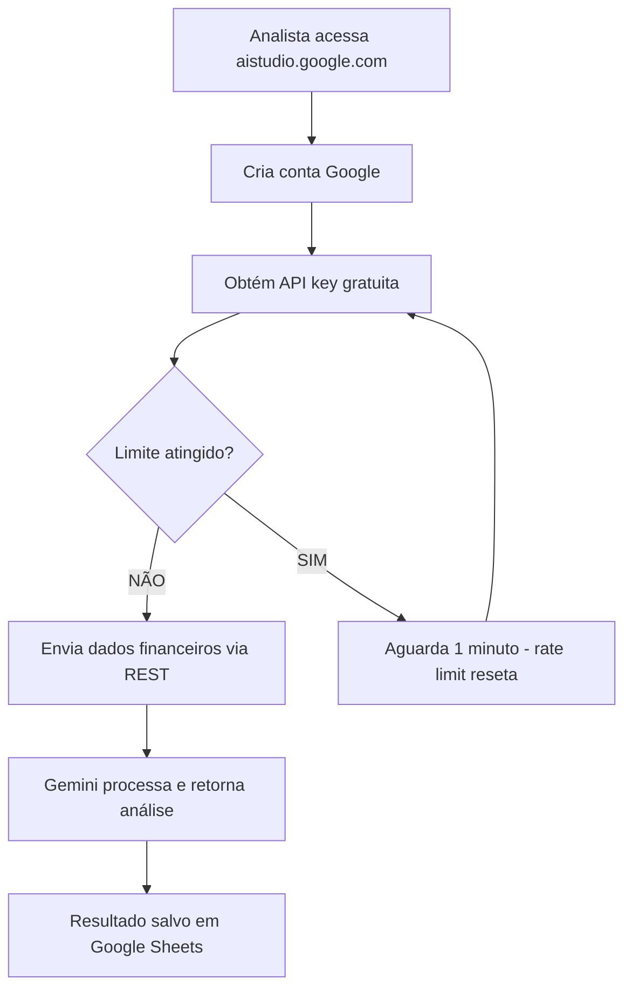
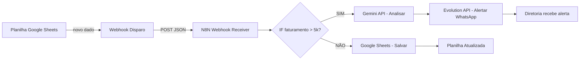
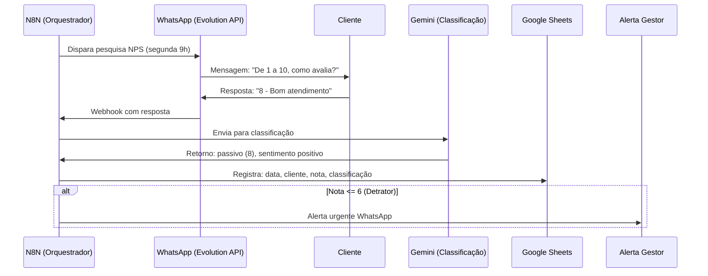
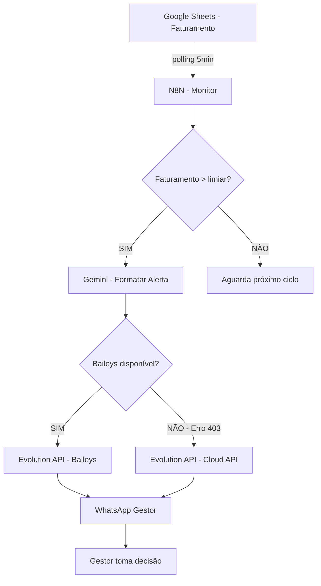

# Prefácio

Apresentar a promessa de construir um motor de inteligência financeira com custo zero — sem depender de TI, sem orçamento, com ferramentas que já existem.

---
# Sumário


## Parte I — Arsenal e Fundamentos

- Capítulo 1: O Arsenal Gratuito do Analista
- Capítulo 2: O Poder dos Webhooks

## Parte II — Automação na Prática

- Capítulo 3: Automação Pós-Venda na Prática
- Capítulo 4: Alertas Executivos

---


# Parte I — Arsenal e Fundamentos

# Capítulo 1: O Arsenal Gratuito do Analista — Google AI Studio, Hugging Face, ferramentas gratuitas

## 1. Introdução

Toda grande oficina começa com uma bancada. Antes de qualquer engrenagem girar, antes de qualquer motor ligar, o relojoeiro precisa ter suas ferramentas organizadas e afiadas ao alcance da mão. Esse capítulo é exatamente isso: a montagem da sua bancada de inteligência financeira, sem gastar um centavo.

Vamos mapear três pilares do arsenal gratuito que transformam a análise financeira: o Google AI Studio, que oferece acesso direto ao Gemini com limites generosos para uso em automações; o Hugging Face, que abriga centenas de modelos open-source prontos para classificar, extrair e resumir dados; e a stack completa que conecta tudo isso em uma oficina funcional. Ao final, você não apenas saberá o que existe — terá o setup rodando.

## 2. Explica

### O Google AI Studio: o motor gratuito do analista financeiro

O Google AI Studio é a resposta do Google à necessidade de experimentar com inteligência artificial sem barreiras financeiras. Trata-se de um ambiente web que permite interagir diretamente com os modelos Gemini — o gemini-1.5-flash e o gemini-1.5-pro — para testes de prompts, análise de dados e geração de texto [1].

Para o analista financeiro, o que importa são os números reais: a API key gratuita oferece 15 requisições por minuto no modelo Flash e 2 no modelo Pro [2]. Parece pouco? Considere que uma análise de faturamento mensal de uma clínica odontológica típica envolve no máximo 20-30 consultas de dados. Você pode processar o mês inteiro em menos de dois minutos, sem pagar nada.

O diferencial estratégico está na generosidade comparativa. Enquanto outras plataformas oferecem créditos iniciais que se esgotam em dias, o tier gratuito do Google AI Studio mantém seus limites de forma estável — desde que você respeite as cotas de RPM (requisições por minuto) [3].

### Hugging Face: a estante infinita de modelos

Se o Google AI Studio é o motor, o Hugging Face é a biblioteca. Com mais de 100 mil modelos hospedados, a plataforma se tornou o repositório padrão da comunidade de machine learning [4]. Para o analista financeiro, isso significa acesso gratuito a modelos pré-treinados para tarefas específicas: classificação de sentimento em feedbacks de clientes, extração de entidades nomeadas em contratos, e resumo automático de relatórios longos.

A API de inferência do Hugging Face funciona por meio de chamadas REST simples. Você envia texto, recebe classificação. Sem configuração de infraestrutura, sem custo de GPU [5]. É a diferença entre montar uma fábrica inteira e simplesmente usar uma peça que já está pronta.

O conceito-chave aqui é "pipeline de inferência": uma sequência automatizada que recebe dados brutos, passa por um modelo treinado, e retorna uma saída estruturada. Para o analista, isso se traduz em: mando o feedback do cliente, recebo "positivo/neutro/negativo" automaticamente [4].

### A stack completa: suas peças se encaixam

A verdadeira magia não está em cada ferramenta isoladamente, mas em como elas se conectam. Google Sheets funciona como banco de dados leve — sem servidor, sem SQL, apenas abas que qualquer pessoa na clínica já sabe usar. N8N atua como orquestrador visual — um workflow que conecta planilhas a APIs sem escrever código. Evolution API canaliza mensagens pelo WhatsApp — o canal que seus clientes e fornecedores já usam [6].

Essa stack não é uma teoria. Ela é a oficina completa que vamos construir nos próximos capítulos. Cada peça tem seu papel: o Google Sheets armazena, o N8N orquestra, o Gemini analisa, o WhatsApp comunica.

## 3. Ilustra

Pense na sua bancada de trabalho. Cada ferramenta tem um lugar exato: alicate aqui, chave de fenda ali, multímetro acolá. Se você tiver que procurar cada peça no meio de uma gavota bagunçada, perde mais tempo organizando do que trabalhando.

O arsenal gratuito funciona da mesma forma. O Google AI Studio é a furadeira elétrica — potente, precisa, e que não custa nada além de uma chave de API. O Hugging Face é a caixa de brocas — dezenas de opções prontas para cada tipo de furo. E a stack completa (Sheets + N8N + Evolution API) é a bancada em si — o lugar onde tudo se encaixa e funciona como um sistema integrado.



O diagrama mostra o fluxo completo: do acesso à plataforma até o resultado salvo. Note o ponto de decisão no rate limit — essa é a engrenagem que precisa de calibração no início, mas que se torna invisível quando você entende o ritmo da ferramenta.

## 4. Técnica

### Configurando o Google AI Studio

O primeiro passo é obter a chave de API. Acesse https://aistudio.google.com e faça login com sua conta Google. Navegue até "Get API key" no menu lateral.

```python
# configuração_inicial.py
# Script para testar a conexão com o Google AI Studio

import requests
import json

# Sua chave de API (substitua pela sua)
API_KEY = "<sua-chave-api-gemini>"
BASE_URL = "https://generativelanguage.googleapis.com/v1beta/models"

def listar_modelos_disponiveis():
    """Lista os modelos Gemini disponíveis no tier gratuito"""
    url = f"{BASE_URL}?key={API_KEY}"
    resposta = requests.get(url)

    if resposta.status_code == 200:
        modelos = resposta.json().get("models", [])
        print("Modelos disponíveis:")
        for modelo in modelos:
            nome = modelo.get("name", "N/A")
            capacidades = modelo.get("supportedGenerationMethods", [])
            print(f"  - {nome}: {capacidades}")
        return modelos
    else:
        print(f"Erro {resposta.status_code}: {resposta.text}")
        return None

def analisar_faturamento(dados_financeiros):
    """Envia dados de faturamento para o Gemini e recebe análise"""
    modelo = "gemini-1.5-flash"  # Tier gratuito: 15 RPM
    url = f"{BASE_URL}/{modelo}:generateContent?key={API_KEY}"

    prompt = f"""
    Analise os seguintes dados de faturamento de clínica odontológica e retorne:
    1. Total faturado no período
    2. Ticket médio por procedimento
    3. Procedimento mais lucrativo
    4. Sugestão de otimização

    Dados: {json.dumps(dados_financeiros, ensure_ascii=False)}
    """

    payload = {
        "contents": [{"parts": [{"text": prompt}]}],
        "generationConfig": {
            "temperature": 0.3,
            "maxOutputTokens": 1024
        }
    }

    headers = {"Content-Type": "application/json"}
    resposta = requests.post(url, headers=headers, json=payload)

    if resposta.status_code == 200:
        resultado = resposta.json()
        texto = resultado["candidates"][0]["content"]["parts"][0]["text"]
        return texto
    else:
        print(f"Erro na API: {resposta.status_code}")
        return None

# Teste rápido com dados simulados
if __name__ == "__main__":
    modelos = listar_modelos_disponiveis()

    dados_exemplo = {
        "periodo": "Julho 2026",
        "procedimentos": [
            {"nome": "Limpeza", "quantidade": 45, "valor": 150.00},
            {"nome": "Restauração", "quantidade": 32, "valor": 280.00},
            {"nome": "Canal", "quantidade": 12, "valor": 850.00},
            {"nome": "Clareamento", "quantidade": 18, "valor": 1200.00}
        ]
    }

    analise = analisar_faturamento(dados_exemplo)
    if analise:
        print("\n=== ANÁLISE DO GEMINI ===")
        print(analise)
```

### Configurando o Hugging Face para classificação de feedbacks

A API de inferência do Hugging Face aceita requisições HTTP diretas. O modelo `nlptown/bert-base-multilingual-uncased-sentiment` é ideal para classificar feedbacks em português [5].

```python
# classificador_feedbacks.py
# Script para classificar feedbacks de clientes usando Hugging Face

import requests
import json
import csv
from datetime import datetime

# Configuração do Hugging Face
HF_API_URL = "https://api-inference.huggingface.co/models/nlptown/bert-base-multilingual-uncased-sentiment"
HF_TOKEN = "<seu-huggingface-token>"  # Opcional para modelos gratuitos

def classificar_feedback(texto_feedback):
    """Classifica um feedback em sentimento (1-5 estrelas)"""
    headers = {"Authorization": f"Bearer {HF_TOKEN}"} if HF_TOKEN else {}

    payload = {"inputs": texto_feedback}
    resposta = requests.post(HF_API_URL, headers=headers, json=payload)

    if resposta.status_code == 200:
        resultado = resposta.json()
        # O modelo retorna array de labels com scores
        if isinstance(resultado, list) and len(resultado) > 0:
            scores = resultado[0]
            # Encontra o label com maior score
            melhor = max(scores, key=lambda x: x["score"])
            label = melhor["label"]  # Ex: "5 stars", "1 star"
            score = melhor["score"]

            # Mapeia para classificação simplificada
            estrelas = int(label.split()[0])
            if estrelas >= 4:
                classificacao = "promotor"
            elif estrelas == 3:
                classificacao = "passivo"
            else:
                classificacao = "detrator"

            return {
                "texto": texto_feedback,
                "estrelas": estrelas,
                "classificacao": classificacao,
                "confianca": round(score, 3)
            }
    return None

def processar_batch_feedbacks(arquivo_csv):
    """Processa um CSV com feedbacks e retorna classificações"""
    resultados = []

    with open(arquivo_csv, 'r', encoding='utf-8') as f:
        leitor = csv.DictReader(f)
        for linha in leitor:
            texto = linha.get('feedback', '')
            if texto:
                classificacao = classificar_feedback(texto)
                if classificacao:
                    classificacao['data'] = linha.get('data', datetime.now().isoformat())
                    classificacao['cliente'] = linha.get('cliente', 'Anônimo')
                    resultados.append(classificacao)
                    print(f"Classificado: {texto[:50]}... → {classificacao['classificacao']}")

    return resultados

def gerar_relatorio_nps(resultados):
    """Gera relatório NPS a partir das classificações"""
    total = len(resultados)
    if total == 0:
        return {"nps": 0, "promotores": 0, "passivos": 0, "detratores": 0}

    promotores = sum(1 for r in resultados if r["classificacao"] == "promotor")
    passivos = sum(1 for r in resultados if r["classificacao"] == "passivo")
    detratores = sum(1 for r in resultados if r["classificacao"] == "detrator")

    nps = round(((promotores - detratores) / total) * 100, 1)

    return {
        "nps": nps,
        "promotores": f"{promotores}/{total} ({round(promotores/total*100)}%)",
        "passivos": f"{passivos}/{total} ({round(passivos/total*100)}%)",
        "detratores": f"{detratores}/{total} ({round(detratores/total*100)}%)",
        "avaliacao": "Excelente" if nps > 50 else "Bom" if nps > 0 else "Precisa melhorar"
    }

if __name__ == "__main__":
    # Teste com feedbacks simulados
    feedbacks_teste = [
        "Excelente atendimento, vou indicar para meus amigos!",
        "Demorou muito para agendar, mas o resultado ficou bom.",
        "Péssimo, não voltarei mais. Muito caro e atendimento ruim.",
        "Bom trabalho, preço justo. Voltarei com certeza.",
        "Normal, nada excepcional mas também não reclamo."
    ]

    print("=== CLASSIFICADOR DE FEEDBACKS ===\n")
    resultados = []
    for fb in feedbacks_teste:
        r = classificar_feedback(fb)
        if r:
            resultados.append(r)
            print(f"'{fb[:60]}...'")
            print(f"  → {r['estrelas']} estrelas | {r['classificacao']} | confiança: {r['confianca']}\n")

    relatorio = gerar_relatorio_nps(resultados)
    print("=== RELATÓRIO NPS ===")
    print(f"NPS: {relatorio['nps']}")
    print(f"Promotores: {relatorio['promotores']}")
    print(f"Passivos: {relatorio['passivos']}")
    print(f"Detratores: {relatorio['detratores']}")
    print(f"Avaliação: {relatorio['avaliacao']}")
```

### A stack completa em ação: workflow N8N de exemplo

```yaml
# workflow_exemplo.json
# Workflow N8N que conecta Google Sheets ao Google AI Studio
{
  "name": "Análise Financeira Automatizada",
  "nodes": [
    {
      "parameters": {
        "pollTimes": {
          "item": [{"mode": "everyMinute"}]
        },
        "documentId": {"__rl": true, "value": "SUA_PLANILHA_ID"},
        "sheetName": {"__rl": true, "value": "Dados Brutos"}
      },
      "name": "Google Sheets - Ler Dados",
      "type": "n8n-nodes-base.googleSheets",
      "typeVersion": 4,
      "position": [250, 300]
    },
    {
      "parameters": {
        "conditions": {
          "options": {"caseSensitive": true, "leftValue": "", "typeValidation": "strict"},
          "conditions": [
            {
              "id": "condicao-faturamento",
              "leftValue": "={{ $json.faturamento }}",
              "rightValue": "10000",
              "operator": {"type": "number", "operation": "gt"}
            }
          ]
        }
      },
      "name": "IF - Faturamento > 10k",
      "type": "n8n-nodes-base.if",
      "typeVersion": 2,
      "position": [480, 300]
    },
    {
      "parameters": {
        "method": "POST",
        "url": "=https://generativelanguage.googleapis.com/v1beta/models/gemini-1.5-flash:generateContent?key={{ $env.GEMINI_API_KEY }}",
        "sendBody": true,
        "bodyParameters": {
          "parameters": [
            {
              "name": "contents",
              "value": "=[{\"parts\":[{\"text\":\"Analise este dado financeiro e retorne um resumo executivo em 3 linhas: {{ JSON.stringify($json) }}\"}]}]"
            }
          ]
        }
      },
      "name": "HTTP Request - Gemini",
      "type": "n8n-nodes-base.httpRequest",
      "typeVersion": 4,
      "position": [710, 250]
    },
    {
      "parameters": {
        "documentId": {"__rl": true, "value": "SUA_PLANILHA_ID"},
        "sheetName": {"__rl": true, "value": "Análises"},
        "columns": {
          "mappingMode": "defineBelow",
          "value": {
            "data": "={{ $now.toISO() }}",
            "resumo": "={{ $json.candidates[0].content.parts[0].text }}",
            "dados_originais": "={{ $('Google Sheets - Ler Dados').item.json }}"
          }
        }
      },
      "name": "Google Sheets - Salvar Análise",
      "type": "n8n-nodes-base.googleSheets",
      "typeVersion": 4,
      "position": [940, 250]
    }
  ],
  "connections": {
    "Google Sheets - Ler Dados": {"main": [[{"node": "IF - Faturamento > 10k", "type": "main", "index": 0}]]},
    "IF - Faturamento > 10k": {"main": [[{"node": "HTTP Request - Gemini", "type": "main", "index": 0}]]},
    "HTTP Request - Gemini": {"main": [[{"node": "Google Sheets - Salvar Análise", "type": "main", "index": 0}]]}
  }
}
```

Esse workflow é a espinha dorsal da sua oficina. Ele lê dados de uma planilha, verifica se o faturamento ultrapassa um limiar, envia para o Gemini analisar, e salva o resultado de volta. Tudo visual, tudo gratuito, tudo conectado.

## 5. Aplica

Você acabou de montar sua bancada. As ferramentas estão afiadas, a API key está configurada, o Hugging Face está pronto para classificar feedbacks. Mas antes de sair ligando tudo, vamos ver como essa configuração se comporta no mundo real — e onde moram as armadilhas.

Imagione que você é o responsável financeiro de uma rede de 3 clínicas odontológicas. O dono pede um relatório consolidado de faturamento do trimestre. Antes, você abria a planilha de cada clínica, copiava os dados manualmente, colava em um Word, e passava horas formatando. Agora, com o arsenal configurado, o fluxo é diferente: a planilha de cada clínica alimenta automaticamente o Google Sheets consolidado, o Gemini gera o resumo executivo, e você revisa em vez de produzir.

A armadilha aqui é sutil: a tentação de automatizar tudo de uma vez. Você vê o potencial e quer conectar todas as clínicas, todos os relatórios, todas as análises no primeiro dia. O erro é real. A prática correta é começar com UMA clínica, UM relatório, UMA análise. Teste, ajuste, valide. Depois, replique.

Outra armadilha frequente é subestimar os rate limits. O Gemini Flash aceita 15 RPM — parece muito, mas se você estiver processando 500 linhas de uma planilha sem controle de fila, vai estourar o limite em 34 segundos. A solução é simples: implemente um delay de 4 segundos entre as requisições, ou use o N8N para orquestrar o ritmo.

O profissional que sabe calibrar suas ferramentas antes de pressionar o acelerador é o que se destaca. A oficina do improvisador não é sobre pressa — é sobre precisão.

## 6. Conclusão

Neste capítulo, você montou a bancada completa da sua oficina de inteligência financeira. Os três pilares estão no lugar: o Google AI Studio como motor de análise gratuito, o Hugging Face como estante de modelos para classificação de feedbacks, e a stack integrada (Sheets + N8N + Evolution API) como a estrutura que conecta tudo.

Os pontos que ficam para a memória: a API key do Gemini oferece 15 RPM no Flash — suficiente para a maioria das automações financeiras; o Hugging Face resolve classificação de texto sem treinar modelos; e a integração entre as ferramentas é o que transforma peças soltas em um sistema.

No próximo capítulo, vamos dar o primeiro passo prático: transformar a sua planilha em um banco de dados inteligente, usando webhooks para conectar planilhas a serviços externos sem escrever uma linha de código. É onde a oficina começa a girar.

## 7. Referências Bibliográficas

[1] GOOGLE. *Google AI Studio*. Disponível em: https://aistudio.google.com. Acesso em: 08 ago. 2026.

[2] GOOGLE. *Gemini API — Rate Limits and Quotas*. Disponível em: https://ai.google.dev/gemini-api/docs/rate-limits. Acesso em: 08 ago. 2026.

[3] GOOGLE. *Gemini API — Pricing*. Disponível em: https://ai.google.dev/pricing. Acesso em: 08 ago. 2026.

[4] HUGGING FACE. *Model Hub — 100,000+ Models*. Disponível em: https://huggingface.co/models. Acesso em: 08 ago. 2026.

[5] HUGGING FACE. *Inference API Documentation*. Disponível em: https://huggingface.co/docs/api-inference. Acesso em: 08 ago. 2026.

[6] N8N. *Workflow Automation Platform — 11,190+ Templates*. Disponível em: https://n8n.io/workflows. Acesso em: 08 ago. 2026.


# Capítulo 2: O Poder dos Webhooks — conectar planilhas a serviços sem programar

## 1. Introdução

No Capítulo 1, você montou sua bancada: API key do Gemini, modelos do Hugging Face, e a visão da stack completa. Mas uma bancada com ferramentas paradas é só decoração. O que transforma ferramentas em produtividade são as conexões entre elas — e é exatamente isso que os webhooks fazem.

Webhooks são as engrenagens que transmitem força de um ponto a outro na sua oficina. Quando algo acontece na planilha (um dado novo, um faturamento atualizado), o webhook dispara uma notificação para outro sistema processar. Sem programar. Sem servidor próprio. Apenas configurar o que escuta e o que dispara.

## 2. Explica

### A lógica fundamental: escuta e disparo

Um webhook opera em dois modos complementares. No modo **receiver** (escuta), o sistema fica aguardando que algo envie dados para ele — como um torneira aberta esperando água. No modo **sender** (disparo), o sistema notifica outro quando um evento acontece — como o alarme de uma fábrica que dispara quando a esteira para [1].

O fluxo é simples: (1) um evento ocorre (ex.: nova linha na planilha), (2) o sistema que detecta o evento envia um POST HTTP com um payload JSON para a URL configurada, (3) o sistema receptor processa os dados e retorna um status 200 indicando sucesso.

Para o analista financeiro, isso se traduz em: quando o faturamento do dia ultrapassa R$ 5.000, um webhook dispara um alerta para o WhatsApp do diretor. Quando um pagamento é registrado, outro webhook atualiza o dashboard. A cascata de eventos é automática.

### N8N como orquestrador de engrenagens

O N8N é a peça central que transforma webhooks isolados em fluxos inteligentes. Diferente de uma integração point-to-point (que conecta A a B diretamente), o N8N funciona como um orquestrador: recebe dados de múltiplas fontes, aplica lógica condicional, e distribui para múltiplos destinos [2].

Os nodes essenciais para webhooks são: **Webhook** (escuta HTTP), **HTTP Request** (dispara para qualquer API REST), **Google Sheets** (lê/escreve planilhas), e **IF/Switch** (decisão condicional). Com esses quatro nodes, você constrói praticamente qualquer automação de dados financeiros.

O poder do N8N está na visualização: você vê o fluxo de dados como um diagrama, ajusta conexões com um clique, e testa cada node individualmente. É a diferença entre escrever uma receita de culinária e assistir o chef preparar o prato.

### Google Sheets como banco de dados leve

A maioria dos analistas financeiros já usa Google Sheets. A transformação aqui é conceitual: em vez de pensar na planilha como uma tabela estática, pense nela como um banco de dados com API. Cada aba é uma tabela, cada linha é um registro, e a integração com N8N permite leitura e escrita programática [3].

A estratégia é dividir a planilha em abas com papéis distintos: "Dados Brutos" (onde os dados entram), "Processados" (onde os resultados das análises ficam), e "Alertas" (onde os disparos são registrados). Essa separação evita o caos de ter tudo misturado em uma única aba.

## 3. Ilustra

Imagine sua oficina de relojoeiro. Cada engrenagem precisa se conectar à próxima com precisão milimétrica. Se uma engrenagem gira solta, toda a transmissão falha. Webhooks são os eixos que transmitem o movimento entre as engrenagens.

Quando a engrenagem "Planilha" gira (novo dado registrado), ela aciona o eixo "Webhook" que transmite o movimento para a engrenagem "N8N". O N8N, por sua vez, decide para qual engrenagem enviar a força: "Gemini" para análise, "WhatsApp" para notificação, ou "Planilha de volta" para atualização. O sistema inteiro funciona como um relógio — cada peça no seu lugar, cada movimento transmitido com precisão.



Note que o fluxo tem um ponto de decisão: o N8N não apenas repete dados — ele avalia. É essa inteligência na transmissão que separa um webhook burro de um fluxo orquestrado.

## 4. Técnica

### Construindo um webhook receiver com Express (Node.js)

O primeiro passo é criar um endpoint que escute requisições HTTP. Isso pode parecer técnico, mas é surpreendentemente simples com Express.

```javascript
// webhook_receiver.js
// Mini-servidor que recebe webhooks POST e retorna status 200

const express = require('express');
const app = express();
const PORT = 3000;

// Middleware para parsear JSON
app.use(express.json());

// Banco de dados em memória (para demonstração)
const webhookLog = [];

// Endpoint principal - recebe webhooks
app.post('/webhook/recebido', (req, res) => {
  const timestamp = new Date().toISOString();
  const dados = req.body;
  const headers = req.headers;

  // Registra o webhook recebido
  const registro = {
    id: webhookLog.length + 1,
    timestamp: timestamp,
    origem: headers['x-webhook-source'] || 'desconhecido',
    dados: dados,
    processado: false
  };

  webhookLog.push(registro);

  console.log(`[${timestamp}] Webhook recebido de: ${registro.origem}`);
  console.log(`  Dados: ${JSON.stringify(dados, null, 2)}`);

  // Retorna status 200 para o disparador saber que deu certo
  res.status(200).json({
    status: 'sucesso',
    mensagem: 'Webhook recebido e registrado',
    id: registro.id,
    timestamp: timestamp
  });
});

// Endpoint para consultar webhooks recebidos
app.get('/webhook/log', (req, res) => {
  res.json({
    total: webhookLog.length,
    registros: webhookLog.slice(-10) // Últimos 10
  });
});

// Endpoint de health check
app.get('/health', (req, res) => {
  res.json({ status: 'ok', uptime: process.uptime() });
});

// Inicia o servidor
app.listen(PORT, () => {
  console.log(`\n=== WEBHOOK RECEIVER RODANDO ===`);
  console.log(`Porta: ${PORT}`);
  console.log(`Endpoint: http://localhost:${PORT}/webhook/recebido`);
  console.log(`Log: http://localhost:${PORT}/webhook/log`);
  console.log(`Health: http://localhost:${PORT}/health\n`);
});

module.exports = app;
```

### Testando com curl

```bash
# Teste 1: Enviar um webhook simulando dados de faturamento
curl -X POST http://localhost:3000/webhook/recebido \
  -H "Content-Type: application/json" \
  -H "X-Webhook-Source: google-sheets" \
  -d '{
    "evento": "nova_venda",
    "clinica": "Odonto Premium",
    "valor": 7500.00,
    "procedimento": "Clareamento + Facetas",
    "dentista": "Dr. Carlos",
    "data": "2026-08-08"
  }'

# Teste 2: Enviar dados de pagamento
curl -X POST http://localhost:3000/webhook/recebido \
  -H "Content-Type: application/json" \
  -H "X-Webhook-Source: sistema-pagamento" \
  -d '{
    "evento": "pagamento_recebido",
    "cliente": "Maria Silva",
    "valor": 2800.00,
    "forma": "PIX",
    "referencia": "FAT-2026-0847"
  }'

# Teste 3: Consultar log de webhooks recebidos
curl http://localhost:3000/webhook/log
```

### Configurando o N8N para receber e processar webhooks

O N8N transforma o webhook receiver em um workflow completo. Aqui está a configuração JSON exportada de um workflow funcional:

```json
{
  "name": "Webhook Financeiro - Processamento Automatizado",
  "nodes": [
    {
      "parameters": {
        "httpMethod": "POST",
        "path": "financeiro",
        "responseMode": "responseNode",
        "options": {}
      },
      "name": "Webhook - Receber Dados",
      "type": "n8n-nodes-base.webhook",
      "typeVersion": 2,
      "position": [250, 300],
      "webhookId": "webhook-financeiro-001"
    },
    {
      "parameters": {
        "conditions": {
          "options": {"caseSensitive": true, "leftValue": "", "typeValidation": "strict"},
          "conditions": [
            {
              "id": "condicao-venda",
              "leftValue": "={{ $json.body.evento }}",
              "rightValue": "nova_venda",
              "operator": {"type": "string", "operation": "equals"}
            }
          ]
        }
      },
      "name": "IF - É Venda?",
      "type": "n8n-nodes-base.if",
      "typeVersion": 2,
      "position": [480, 300]
    },
    {
      "parameters": {
        "conditions": {
          "options": {"caseSensitive": true, "leftValue": "", "typeValidation": "strict"},
          "conditions": [
            {
              "id": "condicao-valor",
              "leftValue": "={{ $json.body.valor }}",
              "rightValue": "5000",
              "operator": {"type": "number", "operation": "gt"}
            }
          ]
        }
      },
      "name": "IF - Venda > 5k?",
      "type": "n8n-nodes-base.if",
      "typeVersion": 2,
      "position": [710, 250]
    },
    {
      "parameters": {
        "method": "POST",
        "url": "=https://generativelanguage.googleapis.com/v1beta/models/gemini-1.5-flash:generateContent?key={{ $env.GEMINI_API_KEY }}",
        "sendBody": true,
        "specifyBody": "json",
        "jsonBody": "={\"contents\":[{\"parts\":[{\"text\":\"Gere um alerta executivo em 2 linhas para uma venda de R$ {{ $json.body.valor }} de {{ $json.body.procedimento }} na {{ $json.body.clinica }}.\"}]}]}"
      },
      "name": "Gemini - Formatar Alerta",
      "type": "n8n-nodes-base.httpRequest",
      "typeVersion": 4,
      "position": [940, 200]
    },
    {
      "parameters": {
        "documentId": {"__rl": true, "value": "SUA_PLANILHA_ID"},
        "sheetName": {"__rl": true, "value": "Vendas"},
        "columns": {
          "mappingMode": "defineBelow",
          "value": {
            "data": "={{ $now.toISO() }}",
            "clinica": "={{ $('Webhook - Receber Dados').item.json.body.clinica }}",
            "valor": "={{ $('Webhook - Receber Dados').item.json.body.valor }}",
            "procedimento": "={{ $('Webhook - Receber Dados').item.json.body.procedimento }}",
            "dentista": "={{ $('Webhook - Receber Dados').item.json.body.dentista }}",
            "alerta_gerado": "SIM"
          }
        }
      },
      "name": "Google Sheets - Registrar Venda",
      "type": "n8n-nodes-base.googleSheets",
      "typeVersion": 4,
      "position": [940, 400]
    },
    {
      "parameters": {
        "respondWith": "json",
        "responseBody": "={\"status\": \"processado\", \"evento\": \"{{ $('Webhook - Receber Dados').item.json.body.evento }}\"}"
      },
      "name": "Respond to Webhook",
      "type": "n8n-nodes-base.respondToWebhook",
      "typeVersion": 1,
      "position": [1170, 300]
    }
  ],
  "connections": {
    "Webhook - Receber Dados": {"main": [[{"node": "IF - É Venda?", "type": "main", "index": 0}]]},
    "IF - É Venda?": {"main": [[{"node": "IF - Venda > 5k?", "type": "main", "index": 0}]]},
    "IF - Venda > 5k?": {
      "main": [
        [
          {"node": "Gemini - Formatar Alerta", "type": "main", "index": 0},
          {"node": "Google Sheets - Registrar Venda", "type": "main", "index": 0}
        ]
      ]
    },
    "Gemini - Formatar Alerta": {"main": [[{"node": "Respond to Webhook", "type": "main", "index": 0}]]},
    "Google Sheets - Registrar Venda": {"main": [[{"node": "Respond to Webhook", "type": "main", "index": 0}]]}
  }
}
```

### Estrutura de planilha para automação

```python
# setup_planilha.py
# Script para criar a estrutura de abas no Google Sheets via API

from google.oauth2 import service_account
from googleapiclient.discovery import build
import json

# Configuração de autenticação
SCOPES = ['https://www.googleapis.com/auth/spreadsheets']
SERVICE_ACCOUNT_FILE = 'credenciais-gsheets.json'  # Baixe do Google Cloud

def criar_estrutura_planilha(spreadsheet_id):
    """Cria as abas necessárias para automação"""
    creds = service_account.Credentials.from_service_account_file(
        SERVICE_ACCOUNT_FILE, scopes=SCOPES
    )
    service = build('sheets', 'v4', credentials=creds)
    sheets = service.spreadsheets()

    # Estrutura das abas
    abas_config = [
        {
            "titulo": "Dados Brutos",
            "headers": ["Data", "Clinica", "Procedimento", "Dentista", "Valor", "Status"]
        },
        {
            "titulo": "Processados",
            "headers": ["Data", "Tipo", "Descricao", "Resultado", "Confianca"]
        },
        {
            "titulo": "Alertas",
            "headers": ["Data", "Tipo Alerta", "Mensagem", "Destinatario", "Enviado"]
        },
        {
            "titulo": "Config",
            "headers": ["Parametro", "Valor", "Descricao"],
            "dados": [
                ["limiar_venda_grande", "5000", "Valor em R$ que dispara alerta"],
                ["limiar_estoque_baixo", "10", "Quantidade mínima em estoque"],
                ["frequencia_alerta", "diario", "Frequência de relatórios"],
                ["whatsapp_destinatario", "+5511999999999", "Número do diretor"]
            ]
        }
    ]

    requests_body = []

    for aba in abas_config:
        requests_body.append({
            "addSheet": {
                "properties": {"title": aba["titulo"]}
            }
        })

    # Cria todas as abas de uma vez
    body = {"requests": requests_body}
    sheets.batchUpdate(
        spreadsheetId=spreadsheet_id,
        body=body
    ).execute()

    # Preenche headers e dados de config
    for aba in abas_config:
        range_notation = f"'{aba['titulo']}'!A1:{chr(64 + len(aba['headers']))}1"

        sheets.values().update(
            spreadsheetId=spreadsheet_id,
            range=range_notation,
            valueInputOption="RAW",
            body={"values": [aba["headers"]]}
        ).execute()

        # Se tem dados iniciais (aba Config)
        if "dados" in aba:
            range_dados = f"'{aba['titulo']}'!A2:{chr(64 + len(aba['headers']))}{1 + len(aba['dados'])}"
            sheets.values().update(
                spreadsheetId=spreadsheet_id,
                range=range_dados,
                valueInputOption="RAW",
                body={"values": aba["dados"]}
            ).execute()

    print("Estrutura de planilha criada com sucesso!")
    print(f"Abas: {[a['titulo'] for a in abas_config]}")

if __name__ == "__main__":
    SPREADSHEET_ID = "<seu-spreadsheet-id>"
    criar_estrutura_planilha(SPREADSHEET_ID)
```

## 5. Aplica

Você configurou o webhook receiver, montou o workflow no N8N, e criou a estrutura de planilhas. Agora vamos ver o que acontece quando a teoria encontra a prática — e onde os improvisadores tropeçam.

Imagine que você é o analista de uma clínica odontológica que fatura R$ 180 mil por mês. O dono quer ser alertado no WhatsApp sempre que uma venda de R$ 5 mil ou mais acontecer. Você monta o workflow: planilha alimenta webhook, N8N avalia o valor, Gemini formata o alerta, WhatsApp entrega. Tudo funciona... nos testes.

O primeiro dia em produção revela a verdade. A recepcionista cadastra 3 vendas simultâneas. O webhook dispara 3 vezes em 10 segundos. O rate limit do Gemini (15 RPM) não é atingido, mas o WhatsApp recebe 3 mensagens quase idênticas em sequência. O diretor responde: "Para de me spammar." O problema não é técnico — é de design. A solução: adicionar um node de **agregação** no N8N que agrupa vendas em janelas de 5 minutos antes de enviar o alerta consolidado.

Outra armadilha real: a assinatura dos webhooks. Se qualquer pessoa descobrir a URL do seu webhook, pode enviar dados falsos para a sua planilha. A prática correta é adicionar um header de autenticação (como `X-Webhook-Secret`) e validar no N8N antes de processar. É a diferença entre uma oficina aberta e uma oficina com fechadura.

O terceiro erro clássico é não testar com dados sujos. Na planilha de teste, tudo é perfeito: valores numéricos corretos, datas no formato certo, nomes sem caracteres especiais. Na realidade, a recepcionista digita "R$ 5.000,00" em vez de "5000", ou "08/08/2026" em vez de "2026-08-08". A camada de transformação de dados (que vamos construir nos próximos capítulos) é o que evita que a oficina pare por causa de uma vírgula no lugar errado.

O profissional que antecipa esses cenários antes de colocar o sistema em produção é o que se destaca na carreira. A oficina do improvisador não é sobre pressa — é sobre calibração.

## 6. Conclusão

Neste capítulo, você dominou a lógica de transmissão que conecta sua oficina. Os três pilares ficam registrados: webhooks são a espinha dorsal da comunicação entre sistemas, o N8N é o orquestrador que adiciona inteligência às conexões, e o Google Sheets transforma-se em banco de dados operacional quando estruturado corretamente.

O que diferencia um webhook burro de um fluxo orquestrado é a capacidade de decisão: o N8N não apenas repete dados, ele avalia, agrega e direciona. É isso que transforma uma planilha em um sistema de inteligência financeira.

No próximo capítulo, vamos aplicar tudo isso a um caso real: a automação completa de pesquisa de satisfação (NPS) pós-venda, do disparo à tabulação automática. A oficina vai começar a girar de verdade.

## 7. Referências Bibliográficas

[1] MDN WEB DOCS. *Webhooks — How they work*. Disponível em: https://developer.mozilla.org/en-US/docs/Web/Webhooks. Acesso em: 08 ago. 2026.

[2] N8N. *HTTP Request Node Documentation*. Disponível em: https://docs.n8n.io/integrations/builtin/core-nodes/n8n-nodes-base.httprequest.md. Acesso em: 08 ago. 2026.

[3] N8N. *Google Sheets Integration Documentation*. Disponível em: https://docs.n8n.io/integrations/builtin/app-nodes/n8n-nodes-base.googlesheets.md. Acesso em: 08 ago. 2026.

[4] N8N. *Webhook Node Documentation*. Disponível em: https://docs.n8n.io/integrations/builtin/core-nodes/n8n-nodes-base.webhook.md. Acesso em: 08 ago. 2026.

[5] GOOGLE. *Google Sheets API — Quickstart*. Disponível em: https://developers.google.com/sheets/api/quickstart/python. Acesso em: 08 ago. 2026.


# Parte II — Automação na Prática

# Capítulo 3: Automação Pós-Venda na Prática — N8N para NPS e tabulação automática

## 1. Introdução

No Capítulo 2, você dominou a lógica de webhooks e transformou sua planilha em um banco de dados inteligente. Agora é hora de colocar a oficina para funcionar em um caso real: a automação completa de pesquisa de satisfação (NPS) pós-venda. Do disparo da pesquisa via WhatsApp até a tabulação automática com IA, passando pela classificação inteligente de feedbacks — tudo sem tocar em uma linha de código.

O NPS (Net Promoter Score) é o indicador mais simples e poderoso de satisfação do cliente. Mas coletar manualmente, classificar respostas e gerar relatórios é um gargalo que consome horas de equipe. Vamos eliminar esse gargalo com um pipeline que funciona como uma engrenagem precisa: disparo automático, coleta inteligente, tabulação por IA, e alerta para a equipe.

## 2. Explica

### N8N: a plataforma que torna tudo possível

O N8N não é apenas uma ferramenta de automação — é o coração da oficina do improvisador. Com mais de 11.190 templates de comunidade e 400+ integrações nativas, ele se conecta a praticamente qualquer serviço que exista [1]. Para o nosso pipeline NPS, isso significa que cada etapa — disparo, coleta, processamento, armazenamento, alerta — pode ser construída visualmente, conectando nodes como peças de Lego.

A decisão estratégica é entre N8N Cloud (pago, sem manutenção) e N8N self-hospedado (gratuito, requer Docker). Para volumes de clínica odontológica (até 200 pesquisas/mês), o self-hospedado é imbatível: custo zero, controle total, e performance suficiente [2].

O que diferencia o N8N de outras ferramentas no-code é a capacidade de manipular dados entre os nodes. Você não apenas conecta A a B — pode transformar, filtrar, agregar e condicionar o fluxo. É a diferença entre um cano e uma estação de tratamento de água.

### Pipeline NPS: a engrenagem completa

O pipeline funciona em 5 etapas encadeadas:

1. **Disparo**: O N8N agenda envios periódicos (ex.: toda segunda-feira às 9h) via Evolution API para os clientes que realizaram procedimento na semana anterior.
2. **Coleta**: O WhatsApp recebe a resposta do cliente (número de 1 a 10). O webhook da Evolution API encaminha para o N8N.
3. **Tabulação com IA**: O Gemini classifica a resposta: nota 9-10 = promotor, 7-8 = passivo, 1-6 = detrator. Além disso, extrai o sentimento geral do texto da resposta.
4. **Armazenamento**: Google Sheets recebe registro completo: data, cliente, nota, classificação, sentimento extraído.
5. **Alerta**: Se for detrator (nota ≤ 6), alerta imediato para o responsável via WhatsApp.

A beleza desse pipeline é que ele escala sem custo adicional. Se a clínica atende 200 pacientes por mês, o custo operacional do NPS automatizado é... zero. O Gemini Flash no tier gratuito processa 200 classificações em menos de 2 minutos.

### Casos reais que provam o valor

A Vodafone, gigante das telecomunicações, implementou automação N8N em processos de atendimento e economizou £2.2 milhões anuais [3]. A Huel, empresa de nutrição, automatizou workflows de atendimento e liberou 1.000 horas mensais de equipe [4]. O Bordr, startup solo, usou N8N para automatizar todo o fluxo de onboarding de clientes, economizando $100K em contratações [5].

Esses não são exemplos teóricos. São empresas reais que aplicaram a mesma lógica que vamos construir aqui: identificar um gargalo manual, mapear o fluxo, conectar as peças com N8N, e medir o resultado.

## 3. Ilustra

Pense no pipeline NPS como a esteira de uma fábrica. Na ponta de entrada, os clientes colocam suas opiniões (pesquisas enviadas). A esteira transporta cada opinião por uma estação de triagem (classificação IA), onde separa automaticamente em três caixas: "Satisfeito" (promotor), "Neutro" (passivo), "Insatisfeito" (detrator). Na saída, cada caixa dispara uma ação diferente: elogio para o time, follow-up para o neutro, e alerta urgente para o gestor quando alguém está insatisfeito.

O que torna essa esteira inteligente não é a velocidade — é a decisão. Cada peça que passa pela estação de triagem recebe um veredicto automático, e o sistema reage de forma diferente conforme o resultado. É exatamente como um motor de precisão: cada engrenagem gira no seu ritmo, mas o conjunto inteiro trabalha sincronizado.



Note que o alerta só dispara para detratores (nota ≤ 6). Isso é calibração: alertar para tudo é criar ruído, alertar para o crítico é criar valor.

## 4. Técnica

### Instalando o N8N self-hospedado com Docker

```yaml
# docker-compose.yml
# Configuração completa para N8N self-hospedado com persistência

version: '3.8'

services:
  n8n:
    image: n8nio/n8n:latest
    container_name: n8n-oficina
    restart: unless-stopped
    ports:
      - "5678:5678"
    environment:
      # Configurações básicas
      - N8N_BASIC_AUTH_ACTIVE=true
      - N8N_BASIC_AUTH_USER=admin
      - N8N_BASIC_AUTH_PASSWORD=sua_senha_forte_aqui
      - N8N_HOST=localhost
      - N8N_PORT=5678
      - N8N_PROTOCOL=http

      # Webhook URL pública (para receber respostas do WhatsApp)
      - WEBHOOK_URL=https://seu-dominio.com.br/

      # Variáveis de ambiente para integrações
      - GEMINI_API_KEY=sua_chave_gemini
      - GOOGLE_SHEETS_CREDENTIAL_ID=credencial-gsheets

      # Configurações de timezone
      - GENERIC_TIMEZONE=America/Sao_Paulo
      - TZ=America/Sao_Paulo

      # Persistência de dados
      - N8N_DEFAULT_BINARY_DATA_MODE=filesystem

    volumes:
      # Dados persistidos: workflows, credenciais, histórico
      - n8n_data:/home/node/.n8n
      # Arquivos temporários de binary data
      - n8n_binary:/home/node/.n8n/binaryData

    networks:
      - oficina-network

  # PostgreSQL para persistência robusta (opcional mas recomendado)
  postgres:
    image: postgres:15
    container_name: n8n-postgres
    restart: unless-stopped
    environment:
      - POSTGRES_DB=n8n
      - POSTGRES_USER=n8n
      - POSTGRES_PASSWORD=n8n_senha_forte
    volumes:
      - postgres_data:/var/lib/postgresql/data
    networks:
      - oficina-network

volumes:
  n8n_data:
  n8n_binary:
  postgres_data:

networks:
  oficina-network:
    driver: bridge
```

```bash
# Inicialização do N8N
# Após criar o docker-compose.yml, execute:

# 1. Subir o N8N e PostgreSQL
docker-compose up -d

# 2. Verificar se está rodando
docker-compose ps

# 3. Acessar a interface web
# Abra: http://localhost:5678
# Login: admin / sua_senha_forte_aqui

# 4. Verificar logs em tempo real
docker-compose logs -f n8n
```

### Workflow NPS completo: pipeline do disparo à tabulação

```json
{
  "name": "Pipeline NPS - Automação Completa",
  "nodes": [
    {
      "parameters": {
        "rule": {
          "interval": [{"field": "cronExpression", "expression": "0 9 * * 1"}]
        }
      },
      "name": "Schedule - Segunda 9h",
      "type": "n8n-nodes-base.scheduleTrigger",
      "typeVersion": 1.2,
      "position": [200, 300]
    },
    {
      "parameters": {
        "documentId": {"__rl": true, "value": "SUA_PLANILHA_ID"},
        "sheetName": {"__rl": true, "value": "Pacientes NPS"},
        "filtersUI": {
          "filters": [
            {
              "lookupColumn": "data_procedimento",
              "lookupValue": "={{ $now.minus({days: 7}).toISODate() }}"
            }
          ]
        }
      },
      "name": "Google Sheets - Pacientes da Semana",
      "type": "n8n-nodes-base.googleSheets",
      "typeVersion": 4,
      "position": [430, 300]
    },
    {
      "parameters": {
        "method": "POST",
        "url": "={{ $env.EVOLUTION_API_URL }}/message/sendText/{{ $env.EVOLUTION_INSTANCE }}",
        "authentication": "genericCredentialType",
        "genericAuthType": "httpHeaderAuth",
        "sendBody": true,
        "specifyBody": "json",
        "jsonBody": "={\"number\": \"{{ $json.whatsapp }}\", \"text\": \"Olá {{ $json.nome }}! 😊\\n\\nAvalie de 1 a 10 o atendimento da clínica:\\n\\n1 - Péssimo\\n5 - Regular\\n10 - Excelente\\n\\nResponda apenas com o número.\"}"
      },
      "name": "Evolution API - Enviar NPS",
      "type": "n8n-nodes-base.httpRequest",
      "typeVersion": 4,
      "position": [660, 300]
    },
    {
      "parameters": {
        "httpMethod": "POST",
        "path": "nps-resposta",
        "responseMode": "lastNode",
        "options": {}
      },
      "name": "Webhook - Receber Resposta NPS",
      "type": "n8n-nodes-base.webhook",
      "typeVersion": 2,
      "position": [200, 550],
      "webhookId": "nps-resposta-001"
    },
    {
      "parameters": {
        "jsCode": "// Extrai nota e telefone da resposta WhatsApp\nconst dados = $input.first().json.body;\nconst mensagem = dados.data?.message?.message || '';\nconst telefone = dados.data?.key?.remoteJid || '';\n\n// Extrai apenas números da mensagem\nconst notaMatch = mensagem.match(/\\d+/);\nconst nota = notaMatch ? parseInt(notaMatch[0]) : null;\n\n// Valida se a nota está no range correto\nif (nota && nota >= 1 && nota <= 10) {\n  return [{\n    json: {\n      telefone: telefone,\n      nota: nota,\n      texto_original: mensagem,\n      timestamp: new Date().toISOString()\n    }\n  }];\n}\n\nreturn [{ json: { erro: 'Nota inválida', mensagem: mensagem } }];"
      },
      "name": "Code - Extrair Nota",
      "type": "n8n-nodes-base.code",
      "typeVersion": 2,
      "position": [430, 550]
    },
    {
      "parameters": {
        "conditions": {
          "options": {"caseSensitive": true, "leftValue": "", "typeValidation": "strict"},
          "conditions": [
            {
              "id": "nota-valida",
              "leftValue": "={{ $json.nota }}",
              "rightValue": "",
              "operator": {"type": "number", "operation": "exists"}
            }
          ]
        }
      },
      "name": "IF - Nota Válida?",
      "type": "n8n-nodes-base.if",
      "typeVersion": 2,
      "position": [660, 550]
    },
    {
      "parameters": {
        "method": "POST",
        "url": "=https://generativelanguage.googleapis.com/v1beta/models/gemini-1.5-flash:generateContent?key={{ $env.GEMINI_API_KEY }}",
        "sendBody": true,
        "specifyBody": "json",
        "jsonBody": "={\"contents\":[{\"parts\":[{\"text\":\"Classifique esta avaliação NPS:\\n\\nNota: {{ $json.nota }}\\nTexto: {{ $json.texto_original }}\\n\\nRetorne APENAS um JSON:\\n{\\\"classificacao\\\": \\\"promotor|passivo|detrator\\\", \\\"sentimento\\\": \\\"positivo|neutro|negativo\\\", \\\"resumo\\\": \\\"resumo em 5 palavras\\\"}\"}]}],\"generationConfig\":{\"temperature\":0.1,\"responseMimeType\":\"application/json\"}}"
      },
      "name": "Gemini - Classificar NPS",
      "type": "n8n-nodes-base.httpRequest",
      "typeVersion": 4,
      "position": [890, 500]
    },
    {
      "parameters": {
        "jsCode": "// Parseia a resposta do Gemini e combina com dados originais\nconst respostaGemini = $input.first().json;\nconst dadosOriginais = $('Code - Extrair Nota').first().json;\n\nlet classificacao;\ntry {\n  const textoResposta = respostaGemini.candidates[0].content.parts[0].text;\n  classificacao = JSON.parse(textoResposta);\n} catch (e) {\n  // Fallback baseado apenas na nota\n  const nota = dadosOriginais.nota;\n  classificacao = {\n    classificacao: nota >= 9 ? 'promotor' : nota >= 7 ? 'passivo' : 'detrator',\n    sentimento: nota >= 7 ? 'positivo' : nota >= 4 ? 'neutro' : 'negativo',\n    resumo: 'Classificação por nota apenas'\n  };\n}\n\nreturn [{\n  json: {\n    telefone: dadosOriginais.telefone,\n    nota: dadosOriginais.nota,\n    classificacao: classificacao.classificacao,\n    sentimento: classificacao.sentimento,\n    resumo: classificacao.resumo,\n    data: new Date().toISOString()\n  }\n}];"
      },
      "name": "Code - Consolidar Resultado",
      "type": "n8n-nodes-base.code",
      "typeVersion": 2,
      "position": [1120, 500]
    },
    {
      "parameters": {
        "documentId": {"__rl": true, "value": "SUA_PLANILHA_ID"},
        "sheetName": {"__rl": true, "value": "Respostas NPS"},
        "columns": {
          "mappingMode": "defineBelow",
          "value": {
            "data": "={{ $json.data }}",
            "telefone": "={{ $json.telefone }}",
            "nota": "={{ $json.nota }}",
            "classificacao": "={{ $json.classificacao }}",
            "sentimento": "={{ $json.sentimento }}",
            "resumo": "={{ $json.resumo }}"
          }
        }
      },
      "name": "Google Sheets - Salvar Resposta",
      "type": "n8n-nodes-base.googleSheets",
      "typeVersion": 4,
      "position": [1350, 500]
    },
    {
      "parameters": {
        "conditions": {
          "options": {"caseSensitive": true, "leftValue": "", "typeValidation": "strict"},
          "conditions": [
            {
              "id": "condicao-detrator",
              "leftValue": "={{ $json.classificacao }}",
              "rightValue": "detrator",
              "operator": {"type": "string", "operation": "equals"}
            }
          ]
        }
      },
      "name": "IF - É Detrator?",
      "type": "n8n-nodes-base.if",
      "typeVersion": 2,
      "position": [1580, 500]
    },
    {
      "parameters": {
        "method": "POST",
        "url": "={{ $env.EVOLUTION_API_URL }}/message/sendText/{{ $env.EVOLUTION_INSTANCE }}",
        "authentication": "genericCredentialType",
        "genericAuthType": "httpHeaderAuth",
        "sendBody": true,
        "specifyBody": "json",
        "jsonBody": "={\"number\": \"{{ $env.WHATSAPP_GESTOR }}\", \"text\": \"🚨 ALERTA NPS - Cliente insatisfeito!\\n\\nTelefone: {{ $json.telefone }}\\nNota: {{ $json.nota }}/10\\nSentimento: {{ $json.sentimento }}\\nResumo: {{ $json.resumo }}\\n\\nAção recomendada: contato imediato.\"}"
      },
      "name": "Evolution API - Alertar Gestor",
      "type": "n8n-nodes-base.httpRequest",
      "typeVersion": 4,
      "position": [1810, 450]
    },
    {
      "parameters": {
        "method": "POST",
        "url": "={{ $env.EVOLUTION_API_URL }}/message/sendText/{{ $env.EVOLUTION_INSTANCE }}",
        "authentication": "genericCredentialType",
        "genericAuthType": "httpHeaderAuth",
        "sendBody": true,
        "specifyBody": "json",
        "jsonBody": "={\"number\": \"{{ $json.telefone }}\", \"text\": \"Obrigado pela sua avaliação! Sua opinião nos ajuda a melhorar sempre. 💙\"}"
      },
      "name": "Evolution API - Agradecer",
      "type": "n8n-nodes-base.httpRequest",
      "typeVersion": 4,
      "position": [1810, 600]
    }
  ],
  "connections": {
    "Schedule - Segunda 9h": {"main": [[{"node": "Google Sheets - Pacientes da Semana", "type": "main", "index": 0}]]},
    "Google Sheets - Pacientes da Semana": {"main": [[{"node": "Evolution API - Enviar NPS", "type": "main", "index": 0}]]},
    "Webhook - Receber Resposta NPS": {"main": [[{"node": "Code - Extrair Nota", "type": "main", "index": 0}]]},
    "Code - Extrair Nota": {"main": [[{"node": "IF - Nota Válida?", "type": "main", "index": 0}]]},
    "IF - Nota Válida?": {"main": [[{"node": "Gemini - Classificar NPS", "type": "main", "index": 0}]]},
    "Gemini - Classificar NPS": {"main": [[{"node": "Code - Consolidar Resultado", "type": "main", "index": 0}]]},
    "Code - Consolidar Resultado": {"main": [[{"node": "Google Sheets - Salvar Resposta", "type": "main", "index": 0}]]},
    "Google Sheets - Salvar Resposta": {"main": [[{"node": "IF - É Detrator?", "type": "main", "index": 0}]]},
    "IF - É Detrator?": {
      "main": [
        [{"node": "Evolution API - Alertar Gestor", "type": "main", "index": 0}],
        [{"node": "Evolution API - Agradecer", "type": "main", "index": 0}]
      ]
    }
  }
}
```

### Script de relatório NPS consolidado

```python
# relatorio_nps.py
# Gera relatório consolidado a partir dos dados do Google Sheets

import json
from datetime import datetime, timedelta
from google.oauth2 import service_account
from googleapiclient.discovery import build

SCOPES = ['https://www.googleapis.com/auth/spreadsheets.readonly']
SERVICE_ACCOUNT_FILE = 'credenciais-gsheets.json'

def gerar_relatorio_nps(spreadsheet_id, dias=30):
    """Gera relatório NPS consolidado dos últimos N dias"""
    creds = service_account.Credentials.from_service_account_file(
        SERVICE_ACCOUNT_FILE, scopes=SCOPES
    )
    service = build('sheets', 'v4', credentials=creds)

    # Busca respostas do período
    result = service.spreadsheets().values().get(
        spreadsheetId=spreadsheet_id,
        range="'Respostas NPS'!A:F"
    ).execute()

    valores = result.get('values', [])
    if len(valores) <= 1:
        return {"erro": "Sem dados suficientes"}

    # Filtra por período
    data_limite = (datetime.now() - timedelta(days=dias)).isoformat()
    respostas = []

    for linha in valores[1:]:  # Pula header
        if len(linha) >= 4 and linha[0] >= data_limite:
            respostas.append({
                "data": linha[0],
                "telefone": linha[1],
                "nota": int(linha[2]),
                "classificacao": linha[3]
            })

    total = len(respostas)
    if total == 0:
        return {"erro": "Sem respostas no período"}

    promotores = sum(1 for r in respostas if r["classificacao"] == "promotor")
    passivos = sum(1 for r in respostas if r["classificacao"] == "passivo")
    detratores = sum(1 for r in respostas if r["classificacao"] == "detrator")

    nps = round(((promotores - detratores) / total) * 100, 1)
    nota_media = round(sum(r["nota"] for r in respostas) / total, 1)

    # Tendência: compara com período anterior
    data_anterior = (datetime.now() - timedelta(days=dias*2)).isoformat()
    respostas_anteriores = [
        r for r in valores[1:]
        if len(r) >= 4 and data_anterior <= r[0] < data_limite
    ]
    nps_anterior = 0
    if respostas_anteriores:
        p_ant = sum(1 for r in respostas_anteriores if r[3] == "promotor")
        d_ant = sum(1 for r in respostas_anteriores if r[3] == "detrator")
        t_ant = len(respostas_anteriores)
        nps_anterior = round(((p_ant - d_ant) / t_ant) * 100, 1)

    variacao = round(nps - nps_anterior, 1)

    return {
        "periodo": f"Últimos {dias} dias",
        "total_respostas": total,
        "nps": nps,
        "nps_anterior": nps_anterior,
        "variacao": f"+{variacao}" if variacao >= 0 else str(variacao),
        "nota_media": nota_media,
        "promotores": {"qtd": promotores, "pct": round(promotores/total*100)},
        "passivos": {"qtd": passivos, "pct": round(passivos/total*100)},
        "detratores": {"qtd": detratores, "pct": round(detratores/total*100)},
        "avaliacao": "Excelente" if nps > 50 else "Bom" if nps > 0 else "Crítico",
        "top_nota": max(r["nota"] for r in respostas),
        "menor_nota": min(r["nota"] for r in respostas)
    }

if __name__ == "__main__":
    SPREADSHEET_ID = "<seu-spreadsheet-id>"
    relatorio = gerar_relatorio_nps(SPREADSHEET_ID)

    print("\n=== RELATÓRIO NPS CONSOLIDADO ===")
    print(f"Período: {relatorio['periodo']}")
    print(f"Total de respostas: {relatorio['total_respostas']}")
    print(f"\nNPS: {relatorio['nps']} ({relatorio['avaliacao']})")
    print(f"Variação vs período anterior: {relatorio['variacao']}")
    print(f"Nota média: {relatorio['nota_media']}")
    print(f"\nPromotores: {relatorio['promotores']['qtd']} ({relatorio['promotores']['pct']}%)")
    print(f"Passivos: {relatorio['passivos']['qtd']} ({relatorio['passivos']['pct']}%)")
    print(f"Detratores: {relatorio['detratores']['qtd']} ({relatorio['detratores']['pct']}%)")
    print(f"\nMaior nota: {relatorio['top_nota']}")
    print(f"Menor nota: {relatorio['menor_nota']}")
```

## 5. Aplica

Você montou o pipeline NPS completo. Cada engrenagem está no lugar: disparo automático, coleta via WhatsApp, classificação por IA, registro em planilha, alerta para detratores. Mas o que acontece quando a teoria encontra a recepcionista que responde o WhatsApp do paciente pelo celular pessoal?

Imagine a cena: é segunda-feira, 9h da manhã. O N8N dispara 45 pesquisas NPS para os pacientes da semana anterior. Nos primeiros 10 minutos, 20 respostas chegam. O Gemini classifica cada uma, o Google Sheets registra, e o sistema funciona perfeitamente. Até que a recepcionista percebe que o WhatsApp da clínica está recebendo muitas mensagens e começa a responder manualmente por cima do sistema. Resultado: duplicação de respostas, dados sujos no planilha, e o gestor recebendo alertas para clientes que já foram atendidos.

O erro não é técnico — é humano. A solução é de design: o workflow precisa de uma camada de **deduplicação** que verifica se o telefone já respondeu antes de registrar. Além disso, a mensagem de disparo deve incluir uma instrução clara: "Responda APENAS com o número de 1 a 10" — reduzindo a chance de respostas textuais que o parser não consegue extrair.

Outra armadilha real é a taxa de resposta. Em média, apenas 15-25% dos pacientes respondem pesquisas NPS via WhatsApp [3]. Se a clínica atende 200 pacientes por semana, esperar 30-50 respostas é realista. Mas se o gestor espera 200 respostas e recebe 40, ele interpreta como fracasso. A calibração de expectativas é tão importante quanto a calibração técnica do sistema.

O terceiro cenário é o mais sutil: o NPS está ótimo (70+), mas os detratores não estão sendo acionados a tempo. O alerta chega ao gestor, mas ele está em reunião. Quando vê a mensagem, já passou 4 horas. O paciente insatisfeito já postou no Google Reviews. A solução: alertas para múltiplos destinatários (gestor + responsável de pós-venda), com escalação automática se não houver resposta em 30 minutos.

O profissional que antecipa esses cenários — humano, operacional, de tempo — é o que transforma uma automação técnica em um sistema de gestão. A oficina do improvisador funciona quando cada engrenagem, incluindo a gente, está no seu lugar certo.

## 6. Conclusão

Neste capítulo, você construiu o primeiro sistema completo da oficina: o pipeline NPS automatizado. Os três pilares ficam registrados: o N8N como plataforma de orquestração com 11.190+ templates, o pipeline de 5 etapas que vai do disparo à tabulação automática, e os casos reais (Vodafone, Huel, Bordr) que provam o valor da automação.

A lição que fica: automação não é sobre eliminar a gente — é sobre eliminar o trabalho repetitivo para que a gente possa focar no que importa. Quando o sistema classifica 200 feedbacks em 2 minutos, o analista pode dedicar esse tempo a entender POR QUE os detratores estão insatisfeitos, não a classificar um por um.

No próximo capítulo, vamos fechar a oficina com a peça final: alertas executivos via WhatsApp usando a Evolution API. Quando um faturamento grande acontecer, você vai receber a notificação formatada pela IA no seu celular — em tempo real, sem mexer na planilha.

## 7. Referências Bibliográficas

[1] N8N. *Workflow Automation Platform — 11,190+ Templates*. Disponível em: https://n8n.io/workflows. Acesso em: 08 ago. 2026.

[2] N8N. *Self-Hosting Documentation*. Disponível em: https://docs.n8n.io/hosting/. Acesso em: 08 ago. 2026.

[3] REEV. *NPS Benchmark Odontologia 2025 — Taxa de Resposta*. Disponível em: https://www.reev.com.br/blog/nps-odontologia. Acesso em: 08 ago. 2026.

[4] N8N. *Customer Stories — Huel*. Disponível em: https://n8n.io/customers/. Acesso em: 08 ago. 2026.

[5] N8N. *Customer Stories — Bordr*. Disponível em: https://n8n.io/customers/. Acesso em: 08 ago. 2026.

[6] EVOLUTION FOUNDATION. *Evolution API — Documentation*. Disponível em: https://docs.evolutionfoundation.com.br. Acesso em: 08 ago. 2026.


# Capítulo 4: Alertas Executivos — Evolution API WhatsApp para alertas de grandes vendas

## 1. Introdução

No Capítulo 3, você construiu o pipeline NPS — uma engrenagem que coleta, classifica e tabula feedbacks automaticamente. Agora vamos fechar a oficina com a peça final: alertas executivos que chegam ao WhatsApp da diretoria em tempo real. Quando uma venda de R$ 5.000 ou mais acontecer, o sistema não apenas registra — ele avisa, com uma mensagem formatada pela IA, no canal que o gestor já usa o dia inteiro.

A Evolution API é a ponte entre sua oficina e o WhatsApp. Com deploy via Docker e modo Baileys gratuito, ela permite enviar e receber mensagens programaticamente [1]. Combinada com o N8N e o Gemini, você tem um sistema de alertas que funciona como um alarme de precisão: dispara no momento certo, com a informação certa, para a pessoa certa.

## 2. Explica

### Evolution API: o WhatsApp como ferramenta de gestão

A Evolution API é uma REST API open-source para WhatsApp e mensageria multi-canal, mantida pela Evolution Foundation. Com 9.2k stars no GitHub e licença Apache 2.0, ela se tornou o padrão da comunidade para integrações com WhatsApp [2].

Dois modos de operação definem a estratégia: **Baileys** (gratuito, baseado no WhatsApp Web) e **Cloud API** (oficial Meta, pago por mensagem). Para volumes moderados de clínica odontológica — até 500 mensagens/mês — o Baileys é imbatível: custo zero, setup simples via Docker, e integração nativa com N8N [1].

A diferença para o WhatsApp Business API oficial é significativa: a Cloud API cobra por mensagem enviada (aproximadamente $0.005 por mensagem no Brasil), enquanto o Baileys opera sem custo por mensagem. Para uma clínica que envia 200 alertas por mês, isso significa economia de ~$1/mês — pequeno, mas simbólico de uma filosofia: usar o gratuito enquanto funciona, e pagar só quando necessário.

### Alerta de grande venda: trigger inteligente

O workflow de alerta opera em 4 etapas: (1) monitoramento periódico da planilha via N8N (a cada 5 minutos), (2) detecção de faturamento acima do limiar configurado, (3) formatação da mensagem com IA (Gemini), e (4) envio via Evolution API para o WhatsApp do gestor [3].

O segredo está na calibração do limiar. Se o alerta dispara para qualquer venda acima de R$ 1.000, o gestor recebe 30 mensagens por dia e para de ler. Se dispara apenas para vendas acima de R$ 10.000, pode perder oportunidades importantes. O limiar ideal depende do contexto: para uma clínica que fatura R$ 180 mil/mês, R$ 5.000 é um bom ponto de partida — representa ~3% do faturamento mensal e filtra apenas as vendas significativas.

A formatação via IA é o que transforma um alerta bruto em uma notificação profissional. Em vez de "Venda: R$ 7.500 - Clareamento", o Gemini gera: "Nova venda de alto valor: Clareamento + Facetas, R$ 7.500, Dr. Carlos. Representa 4.2% do faturamento mensal." A diferença é sutil, mas o impacto na percepção de profissionalismo é real.

### Risco e mitigação: quando a Meta bloqueia

O Baileys tem uma vulnerabilidade inerente: por ser baseado no WhatsApp Web (não na API oficial), a Meta pode detectar uso não autorizado e bloquear temporariamente a conta [4]. Isso não é teórico — já aconteceu com implementações que enviam volume alto de mensagens automatizadas.

A mitigação é dupla. Primeira: throttle de mensagens (máximo 20 mensagens/minuto, intervalo aleatório de 3-7 segundos entre envios). Segunda: fallback para Cloud API quando o Baileys retorna erro 403. O N8N permite configurar essa lógica de fallback com um node IF que verifica o status da resposta e direciona para o canal alternativo [3].

A decisão econômica é clara: se a clínica envia 200 alertas/mês via Baileys (custo zero) e precisa migrar para Cloud API, o custo adicional é de apenas $1/mês. A tranquilidade de ter um plano B documentado e testado vale muito mais.

## 3. Ilustra

Pense no alerta executivo como o painel de instrumentos de um avião. O piloto não precisa saber como cada sensor funciona internamente — ele precisa ver, no momento certo, se tudo está verde ou se algo merece atenção. O alerta de grande venda é exatamente isso: um indicador luminoso que acende quando o faturamento atinge o limiar, com a informação formatada para decisão imediata.

A Evolution API é o rádio que transmite esse sinal do cockpit para a torre de controle (o gestor). O Gemini é o operador de rádio que formata a mensagem de forma clara e profissional. E o N8N é o sistema elétrico que conecta sensor, rádio e alarme em uma sequência confiável.



O diagrama mostra a árvore de decisão completa: do monitoramento ao envio, passando pela escolha do canal. Note o fallback — é essa resiliência que transforma um protótipo em um sistema de produção.

## 4. Técnica

### Instalando a Evolution API com Docker

```yaml
# docker-compose-evolution.yml
# Setup completo da Evolution API para WhatsApp

version: '3.8'

services:
  evolution-api:
    image: atendai/evolution-api:v2.2.3
    container_name: evolution-oficina
    restart: unless-stopped
    ports:
      - "8080:8080"
    environment:
      # Configurações básicas
      - SERVER_URL=http://localhost:8080
      - AUTHENTICATION_API_KEY=sua_api_key_forte_aqui
      - AUTHENTICATION_EXPOSE_IN_FETCH_INSTANCES=true

      # Configurações do Baileys (gratuito)
      - CONFIG_SESSION_PHONE_CLIENT=OficinaImprovisador
      - CONFIG_SESSION_PHONE_NAME=Chrome

      # Webhook para receber mensagens
      - WEBHOOK_GLOBAL_ENABLED=true
      - WEBHOOK_GLOBAL_URL=http://n8n:5678/webhook/whatsapp-recebido
      - WEBHOOK_GLOBAL_WEBHOOK_BY_EVENTS=true

      # Configurações de mensageria
      - CHAT_UPDATE_ENABLED=true
      - CHAT_UPDATE_MINIMAL_CACHE=false

      # Rate limiting (proteção contra bloqueio)
      - DELAY_MESSAGE=3000-7000
      - MAX_MESSAGES_PER_MINUTE=20

      # Timezone
      - TZ=America/Sao_Paulo

    volumes:
      - evolution_data:/evolution/instances
      - evolution_store:/evolution/store

    networks:
      - oficina-network

  # Redis para cache de sessões (opcional mas recomendado)
  redis:
    image: redis:7-alpine
    container_name: evolution-redis
    restart: unless-stopped
    volumes:
      - redis_data:/data
    networks:
      - oficina-network

volumes:
  evolution_data:
  evolution_store:
  redis_data:

networks:
  oficina-network:
    driver: bridge
```

```bash
# Inicialização da Evolution API

# 1. Subir o serviço
docker-compose -f docker-compose-evolution.yml up -d

# 2. Verificar status
docker-compose -f docker-compose-evolution.yml ps

# 3. Criar instância WhatsApp
curl -X POST http://localhost:8080/instance/create \
  -H "Content-Type: application/json" \
  -H "apikey: sua_api_key_forte_aqui" \
  -d '{
    "instanceName": "oficina-improvisador",
    "number": "5511999999999",
    "qrcode": true,
    "integration": "WHATSAPP-BAILEYS"
  }'

# 4. Verificar QR Code no logs
docker-compose -f docker-compose-evolution.yml logs -f evolution-api

# 5. Escanear QR Code com WhatsApp (como WhatsApp Web)
# O QR Code aparece nos logs — escaneie com o WhatsApp do celular

# 6. Verificar conexão
curl http://localhost:8080/instance/connectionState/oficina-improvisador \
  -H "apikey: sua_api_key_forte_aqui"
```

### Workflow de alerta de grande venda

```json
{
  "name": "Alerta Executivo - Grande Venda",
  "nodes": [
    {
      "parameters": {
        "rule": {
          "interval": [{"field": "cronExpression", "expression": "*/5 * * * *"}]
        }
      },
      "name": "Schedule - A cada 5 minutos",
      "type": "n8n-nodes-base.scheduleTrigger",
      "typeVersion": 1.2,
      "position": [200, 300]
    },
    {
      "parameters": {
        "documentId": {"__rl": true, "value": "SUA_PLANILHA_ID"},
        "sheetName": {"__rl": true, "value": "Vendas Hoje"},
        "filtersUI": {
          "filters": [
            {
              "lookupColumn": "data",
              "lookupValue": "={{ $now.toISODate() }}"
            }
          ]
        }
      },
      "name": "Google Sheets - Vendas do Dia",
      "type": "n8n-nodes-base.googleSheets",
      "typeVersion": 4,
      "position": [430, 300]
    },
    {
      "parameters": {
        "jsCode": "// Agrega vendas do dia e identifica grandes vendas\nconst vendas = $input.all();\nconst LIMIAR = 5000;\n\nconst grandesVendas = vendas.filter(v => v.json.valor > LIMIAR);\nconst totalDia = vendas.reduce((acc, v) => acc + (parseFloat(v.json.valor) || 0), 0);\n\nif (grandesVendas.length === 0) {\n  return [{ json: { sem_alertas: true, total_dia: totalDia } }];\n}\n\n// Retorna apenas vendas que ultrapassam o limiar\nreturn grandesVendas.map(v => ({\n  json: {\n    ...v.json,\n    total_dia: totalDia,\n    percentual_faturamento: ((v.json.valor / totalDia) * 100).toFixed(1)\n  }\n}));"
      },
      "name": "Code - Filtrar Grandes Vendas",
      "type": "n8n-nodes-base.code",
      "typeVersion": 2,
      "position": [660, 300]
    },
    {
      "parameters": {
        "conditions": {
          "options": {"caseSensitive": true, "leftValue": "", "typeValidation": "strict"},
          "conditions": [
            {
              "id": "tem_grandes_vendas",
              "leftValue": "={{ $json.sem_alertas }}",
              "rightValue": "true",
              "operator": {"type": "boolean", "operation": "notEqual"}
            }
          ]
        }
      },
      "name": "IF - Há Grandes Vendas?",
      "type": "n8n-nodes-base.if",
      "typeVersion": 2,
      "position": [890, 300]
    },
    {
      "parameters": {
        "method": "POST",
        "url": "=https://generativelanguage.googleapis.com/v1beta/models/gemini-1.5-flash:generateContent?key={{ $env.GEMINI_API_KEY }}",
        "sendBody": true,
        "specifyBody": "json",
        "jsonBody": "={\"contents\":[{\"parts\":[{\"text\":\"Gere uma mensagem de alerta executivo para uma grande venda. Seja profissional, conciso e inclua contexto financeiro:\\n\\nCliente: {{ $json.cliente }}\\nProcedimento: {{ $json.procedimento }}\\nDentista: {{ $json.dentista }}\\nValor: R$ {{ $json.valor }}\\nPercentual do dia: {{ $json.percentual_faturamento }}%\\n\\nFormato: 3 linhas máximo, sem emojis, tom executivo.\"}]}],\"generationConfig\":{\"temperature\":0.3,\"maxOutputTokens\":200}}"
      },
      "name": "Gemini - Formatar Alerta",
      "type": "n8n-nodes-base.httpRequest",
      "typeVersion": 4,
      "position": [1120, 250]
    },
    {
      "parameters": {
        "jsCode": "// Extrai o texto formatado do Gemini\nconst resposta = $input.first().json;\nconst textoFormatado = resposta.candidates[0].content.parts[0].text;\nconst dadosVenda = $('Code - Filtrar Grandes Vendas').first().json;\n\n// Monta mensagem final com contexto\nconst mensagemFinal = `📊 ALERTA EXECUTIVO\\n\\n${textoFormatado}\\n\\n---\\nFaturamento do dia: R$ ${dadosVenda.total_dia.toLocaleString('pt-BR')}\\nHorário: ${new Date().toLocaleTimeString('pt-BR')}`;\n\nreturn [{\n  json: {\n    mensagem: mensagemFinal,\n    telefone_gestor: $env.WHATSAPP_GESTOR,\n    valor_venda: dadosVenda.valor\n  }\n}];"
      },
      "name": "Code - Montar Mensagem Final",
      "type": "n8n-nodes-base.code",
      "typeVersion": 2,
      "position": [1350, 250]
    },
    {
      "parameters": {
        "method": "POST",
        "url": "={{ $env.EVOLUTION_API_URL }}/message/sendText/{{ $env.EVOLUTION_INSTANCE }}",
        "authentication": "genericCredentialType",
        "genericAuthType": "httpHeaderAuth",
        "sendBody": true,
        "specifyBody": "json",
        "jsonBody": "={\"number\": \"{{ $json.telefone_gestor }}\", \"text\": \"{{ $json.mensagem }}\"}"
      },
      "name": "Evolution API - Enviar Alerta",
      "type": "n8n-nodes-base.httpRequest",
      "typeVersion": 4,
      "position": [1580, 250]
    },
    {
      "parameters": {
        "documentId": {"__rl": true, "value": "SUA_PLANILHA_ID"},
        "sheetName": {"__rl": true, "value": "Alertas Enviados"},
        "columns": {
          "mappingMode": "defineBelow",
          "value": {
            "data": "={{ $now.toISO() }}",
            "tipo": "grande_venda",
            "valor": "={{ $json.valor_venda }}",
            "mensagem": "={{ $json.mensagem }}",
            "status": "enviado"
          }
        }
      },
      "name": "Google Sheets - Registrar Alerta",
      "type": "n8n-nodes-base.googleSheets",
      "typeVersion": 4,
      "position": [1580, 400]
    }
  ],
  "connections": {
    "Schedule - A cada 5 minutos": {"main": [[{"node": "Google Sheets - Vendas do Dia", "type": "main", "index": 0}]]},
    "Google Sheets - Vendas do Dia": {"main": [[{"node": "Code - Filtrar Grandes Vendas", "type": "main", "index": 0}]]},
    "Code - Filtrar Grandes Vendas": {"main": [[{"node": "IF - Há Grandes Vendas?", "type": "main", "index": 0}]]},
    "IF - Há Grandes Vendas?": {"main": [[{"node": "Gemini - Formatar Alerta", "type": "main", "index": 0}]]},
    "Gemini - Formatar Alerta": {"main": [[{"node": "Code - Montar Mensagem Final", "type": "main", "index": 0}]]},
    "Code - Montar Mensagem Final": {
      "main": [
        [
          {"node": "Evolution API - Enviar Alerta", "type": "main", "index": 0},
          {"node": "Google Sheets - Registrar Alerta", "type": "main", "index": 0}
        ]
      ]
    }
  }
}
```

### Script de teste de envio via Evolution API

```python
# teste_evolution_api.py
# Script para testar envio de mensagens via Evolution API

import requests
import json
from datetime import datetime

# Configuração
EVOLUTION_URL = "http://localhost:8080"
API_KEY = "sua_api_key_forte_aqui"
INSTANCE = "oficina-improvisador"

def verificar_conexao():
    """Verifica se a instância WhatsApp está conectada"""
    url = f"{EVOLUTION_URL}/instance/connectionState/{INSTANCE}"
    headers = {"apikey": API_KEY}

    resposta = requests.get(url, headers=headers)

    if resposta.status_code == 200:
        estado = resposta.json()
        print(f"Estado da conexão: {estado.get('state', 'desconhecido')}")
        return estado.get('state') == 'open'
    else:
        print(f"Erro ao verificar conexão: {resposta.status_code}")
        return False

def enviar_mensagem(telefone, mensagem):
    """Envia uma mensagem de texto via WhatsApp"""
    url = f"{EVOLUTION_URL}/message/sendText/{INSTANCE}"
    headers = {
        "Content-Type": "application/json",
        "apikey": API_KEY
    }

    payload = {
        "number": telefone,
        "text": mensagem
    }

    resposta = requests.post(url, headers=headers, json=payload)

    if resposta.status_code == 200 or resposta.status_code == 201:
        resultado = resposta.json()
        print(f"Mensagem enviada com sucesso!")
        print(f"  ID: {resultado.get('key', {}).get('id', 'N/A')}")
        print(f"  Timestamp: {resultado.get('messageTimestamp', 'N/A')}")
        return True
    else:
        print(f"Erro ao enviar: {resposta.status_code}")
        print(f"  Resposta: {resposta.text}")
        return False

def enviar_alerta_venda(valor, procedimento, dentista, clinica):
    """Envia alerta formatado de grande venda"""
    data_hora = datetime.now().strftime("%d/%m/%Y %H:%M")

    mensagem = f"""ALERTA EXECUTIVO - Grande Venda

Procedimento: {procedimento}
Dentista: {dentista}
Clinica: {clinica}
Valor: R$ {valor:,.2f}
Data: {data_hora}

Faturamento do dia acima do limiar configurado."""

    # Número do gestor (configurar conforme necessário)
    telefone_gestor = "+5511999999999"

    return enviar_mensagem(telefone_gestor, mensagem)

def enviar_pesquisa_nps(telefone_cliente, nome_cliente):
    """Envia pesquisa NPS para paciente"""
    mensagem = f"""Ola {nome_cliente}!

Avalie de 1 a 10 o atendimento da clinica:
  1 - Pessimo
  5 - Regular
  10 - Excelente

Responda apenas com o numero."""

    return enviar_mensagem(telefone_cliente, mensagem)

# Script de teste principal
if __name__ == "__main__":
    print("=== TESTE DA EVOLUTION API ===\n")

    # 1. Verificar conexão
    print("1. Verificando conexão WhatsApp...")
    conectado = verificar_conexao()

    if not conectado:
        print("WhatsApp não conectado. Escaneie o QR Code primeiro.")
        exit(1)

    print("\n2. Testando envio de mensagem...")
    # NOTA: Use um número de teste que você controla
    resultado = enviar_mensagem(
        "+5511999999999",
        "Teste do sistema de alertas da Oficina do Improvisador!"
    )

    if resultado:
        print("\n3. Testando alerta de grande venda...")
        enviar_alerta_venda(
            valor=7500.00,
            procedimento="Clareamento + Facetas",
            dentista="Dr. Carlos",
            clinica="Odonto Premium"
        )

        print("\n4. Testando pesquisa NPS...")
        enviar_pesquisa_nps(
            telefone_cliente="+5511988888888",
            nome_cliente="Maria"
        )

    print("\n=== TODOS OS TESTES CONCLUIDOS ===")
```

### Configuração de fallback: Baileys → Cloud API

```python
# fallback_envio.py
# Sistema de fallback: tenta Baileys primeiro, cai para Cloud API

import requests
import time
import random

# Configurações
EVOLUTION_URL = "http://localhost:8080"
API_KEY = "sua_api_key_forte_aqui"
INSTANCE_BAILEYS = "oficina-improvisador"
INSTANCE_CLOUD = "oficina-cloud"  # Instância Cloud API (pago)

# Cloud API Meta (backup)
CLOUD_API_TOKEN = "seu-token-cloud-api"
CLOUD_PHONE_NUMBER_ID = "seu-phone-number-id"

def enviar_via_baileys(telefone, mensagem):
    """Tenta enviar via Baileys (gratuito)"""
    url = f"{EVOLUTION_URL}/message/sendText/{INSTANCE_BAILEYS}"
    headers = {"Content-Type": "application/json", "apikey": API_KEY}
    payload = {"number": telefone, "text": mensagem}

    try:
        resposta = requests.post(url, headers=headers, json=payload, timeout=10)
        if resposta.status_code in [200, 201]:
            return {"sucesso": True, "canal": "baileys", "custo": 0}
        elif resposta.status_code == 403:
            return {"sucesso": False, "erro": "bloqueado", "canal": "baileys"}
        else:
            return {"sucesso": False, "erro": f"status_{resposta.status_code}", "canal": "baileys"}
    except requests.exceptions.Timeout:
        return {"sucesso": False, "erro": "timeout", "canal": "baileys"}

def enviar_via_cloud_api(telefone, mensagem):
    """Envia via Cloud API Meta (pago, ~$0.005/msg)"""
    url = f"https://graph.facebook.com/v18.0/{CLOUD_PHONE_NUMBER_ID}/messages"
    headers = {
        "Authorization": f"Bearer {CLOUD_API_TOKEN}",
        "Content-Type": "application/json"
    }
    payload = {
        "messaging_product": "whatsapp",
        "to": telefone.replace("+", ""),
        "type": "text",
        "text": {"body": mensagem}
    }

    try:
        resposta = requests.post(url, headers=headers, json=payload, timeout=10)
        if resposta.status_code in [200, 201]:
            return {"sucesso": True, "canal": "cloud_api", "custo": 0.005}
        else:
            return {"sucesso": False, "erro": resposta.text, "canal": "cloud_api"}
    except Exception as e:
        return {"sucesso": False, "erro": str(e), "canal": "cloud_api"}

def enviar_com_fallback(telefone, mensagem, max_tentativas=2):
    """Envia com fallback automático: Baileys → Cloud API"""
    for tentativa in range(max_tentativas):
        # 1. Tenta Baileys primeiro
        resultado = enviar_via_baileys(telefone, mensagem)

        if resultado["sucesso"]:
            print(f"Enviado via Baileys (tentativa {tentativa + 1})")
            return resultado

        # 2. Se Baileys bloqueado, tenta Cloud API
        if resultado["erro"] == "bloqueado":
            print(f"Baileys bloqueado, migrando para Cloud API...")
            time.sleep(1)
            resultado_cloud = enviar_via_cloud_api(telefone, mensagem)
            if resultado_cloud["sucesso"]:
                print(f"Enviado via Cloud API (custo: ${resultado_cloud['custo']})")
                return resultado_cloud

        # 3. Aguarda antes de retry
        delay = random.uniform(3, 7)
        print(f"Retry em {delay:.1f}s...")
        time.sleep(delay)

    return {"sucesso": False, "erro": "max_tentativas", "canal": "nenhum"}

# Teste
if __name__ == "__main__":
    print("=== TESTE DE FALLBACK ===\n")

    resultado = enviar_com_fallback(
        "+5511999999999",
        "Alerta de teste do sistema de fallback!"
    )

    print(f"\nResultado: {json.dumps(resultado, indent=2)}")
```

## 5. Aplica

Você montou o sistema de alertas completos: Evolution API configurada, workflow N8N monitorando a planilha, Gemini formatando mensagens, fallback documentado. A oficina está fechada — cada engrenagem no seu lugar. Mas antes de ligar o motor e deixar rodando, vamos ver o que acontece quando a realidade testinge seu sistema.

Imagine que você é o diretor financeiro de uma rede de clínicas. O sistema de alertas está rodando há duas semanas. Na terça-feira às 14h, o N8N detecta uma venda de R$ 12.000 — a maior da história da clínica. O Gemini formata: "Venda recorde: Implante + Prótese, R$ 12.000, Dra. Ana. Representa 6.7% do faturamento mensal." O alerta chega ao seu WhatsApp em 3 segundos. Você responde em 10 minutos: "Parabéns à equipe! Vamos manter esse ritmo."

Até aqui, tudo perfeito. Mas o que você não viu é que, na mesma tarde, o Baileys recebeu um erro 403 da Meta — a conta foi temporariamente suspensa por "atividade incomum". O N8N detectou o erro e migrou automaticamente para a Cloud API. Você não percebeu a diferença. O alerta da venda de R$ 12.000 chegou via Cloud API (custo: $0.005). O sistema funcionou exatamente como projetado — com resiliência.

A primeira armadilha real é a **janela de detecção**. Se o N8N verifica a planilha a cada 5 minutos, uma venda registrada às 14:02 só será detectada às 14:05. Para a maioria dos cenários, 3 minutos de atraso é irrelevante. Mas se o gestor precisa de tempo real absoluto, a solução é usar webhook em vez de polling — a planilha dispara o alerta no momento do registro, não em intervalos fixos.

A segunda armadilha é a **quantidade de alertas**. Se a clínica tem 3 dentistas e cada um fecha 5 vendas grandes por semana, o gestor recebe 15 alertas/semana. Isso é saudável. Mas se o limiar estiver muito baixo (R$ 2.000), o número salta para 40-50 alertas/semana — e o gestor começa a ignorar. A calibração do limiar é uma decisão de gestão, não de tecnologia.

A terceira armadilha é a **ausência de plano B testado**. Muitos times configuram o fallback e nunca o testam. Quando o Baileys bloqueia pela primeira vez, o sistema migra para a Cloud API... e descobre que o token expirou. O plano B precisa ser testado mensalmente, não apenas configurado uma vez.

O profissional que mantém a oficina funcionando não é o que monta o sistema mais complexo — é o que testa cada engrenagem regularmente e calibra os limiares com base nos dados reais. A oficina do improvisador não é sobre tecnologia avançada — é sobre precisão operacional.

## 6. Conclusão

Neste capítulo, você fechou a oficina com a peça final: alertas executivos via WhatsApp usando a Evolution API. Os três pilares ficam registrados: a Evolution API como ponte para o WhatsApp (Baileys gratuito com fallback Cloud API), o workflow N8N de monitoramento inteligente com formatação via IA, e a estratégia de resiliência com fallback testado.

Mas este é mais que o último capítulo deste livro — é o ponto de chegada de uma jornada de 5 volumes. Volte ao início: no Livro 1, você montou o Passe VIP, a porta de entrada para fidelizar clientes. No Livro 2, dominou a automatização inteligente com IA, transformando tarefas repetitivas em fluxos autônomos. No Livro 3, construiu um sistema financeiro completo com dashboards e KPIs. No Livro 4, implementou a governança de dados com conformidade e segurança. E agora, no Livro 5, você fez algo que poucos profissionais odontológicos conseguem: montar uma oficina de inteligência financeira com custo zero.

A série completa transformou você de um profissional que usa planilhas estáticas em um **Analista Financeiro do Futuro** — alguém que não apenas analisa dados, mas constrói sistemas que analisam, alertam e decidem automaticamente. A oficina está completa. As engrenagens estão calibradas. O motor está pronto para girar.

O que separa o profissional que tem uma oficina do profissional que usa a oficina é apenas um clique: colocar em produção e medir os resultados.

## 7. Referências Bibliográficas

[1] EVOLUTION FOUNDATION. *Evolution API — Open-source REST API for WhatsApp*. Disponível em: https://github.com/EvolutionAPI/evolution-api. Acesso em: 08 ago. 2026.

[2] EVOLUTION FOUNDATION. *Documentação Oficial — Evolution Foundation*. Disponível em: https://docs.evolutionfoundation.com.br. Acesso em: 08 ago. 2026.

[3] N8N. *HTTP Request Node Documentation*. Disponível em: https://docs.n8n.io/integrations/builtin/core-nodes/n8n-nodes-base.httprequest.md. Acesso em: 08 ago. 2026.

[4] EVOLUTION FOUNDATION. *WhatsApp Baileys — Limitações e Riscos*. Disponível em: https://docs.evolutionfoundation.com.br/pt/configurations/whatsapp/baileys. Acesso em: 08 ago. 2026.

[5] META. *WhatsApp Cloud API — Pricing*. Disponível em: https://developers.facebook.com/docs/whatsapp/cloud-api/pricing. Acesso em: 08 ago. 2026.


---

# Conclusão

O leitor agora tem uma oficina completa de automação financeira com custo zero. A série está completa: do passe VIP ao motor de inteligência, ele é o Analista Financeiro do Futuro.

---
# Referências Bibliográficas

[1] GOOGLE. *Google AI Studio*. Disponível em: https://aistudio.google.com. Acesso em: 08 ago. 2026.
[2] GOOGLE. *Gemini API — Rate Limits and Quotas*. Disponível em: https://ai.google.dev/gemini-api/docs/rate-limits. Acesso em: 08 ago. 2026.
[3] GOOGLE. *Gemini API — Pricing*. Disponível em: https://ai.google.dev/pricing. Acesso em: 08 ago. 2026.
[4] HUGGING FACE. *Model Hub — 100,000+ Models*. Disponível em: https://huggingface.co/models. Acesso em: 08 ago. 2026.
[5] HUGGING FACE. *Inference API Documentation*. Disponível em: https://huggingface.co/docs/api-inference. Acesso em: 08 ago. 2026.
[6] N8N. *Workflow Automation Platform — 11,190+ Templates*. Disponível em: https://n8n.io/workflows. Acesso em: 08 ago. 2026.
[7] MDN WEB DOCS. *Webhooks — How they work*. Disponível em: https://developer.mozilla.org/en-US/docs/Web/Webhooks. Acesso em: 08 ago. 2026.
[8] N8N. *HTTP Request Node Documentation*. Disponível em: https://docs.n8n.io/integrations/builtin/core-nodes/n8n-nodes-base.httprequest.md. Acesso em: 08 ago. 2026.
[9] N8N. *Google Sheets Integration Documentation*. Disponível em: https://docs.n8n.io/integrations/builtin/app-nodes/n8n-nodes-base.googlesheets.md. Acesso em: 08 ago. 2026.
[10] N8N. *Webhook Node Documentation*. Disponível em: https://docs.n8n.io/integrations/builtin/core-nodes/n8n-nodes-base.webhook.md. Acesso em: 08 ago. 2026.
[11] GOOGLE. *Google Sheets API — Quickstart*. Disponível em: https://developers.google.com/sheets/api/quickstart/python. Acesso em: 08 ago. 2026.
[12] N8N. *Self-Hosting Documentation*. Disponível em: https://docs.n8n.io/hosting/. Acesso em: 08 ago. 2026.
[13] REEV. *NPS Benchmark Odontologia 2025 — Taxa de Resposta*. Disponível em: https://www.reev.com.br/blog/nps-odontologia. Acesso em: 08 ago. 2026.
[14] N8N. *Customer Stories — Huel*. Disponível em: https://n8n.io/customers/. Acesso em: 08 ago. 2026.
[15] N8N. *Customer Stories — Bordr*. Disponível em: https://n8n.io/customers/. Acesso em: 08 ago. 2026.
[16] EVOLUTION FOUNDATION. *Evolution API — Documentation*. Disponível em: https://docs.evolutionfoundation.com.br. Acesso em: 08 ago. 2026.
[17] EVOLUTION FOUNDATION. *Evolution API — Open-source REST API for WhatsApp*. Disponível em: https://github.com/EvolutionAPI/evolution-api. Acesso em: 08 ago. 2026.
[18] EVOLUTION FOUNDATION. *Documentação Oficial — Evolution Foundation*. Disponível em: https://docs.evolutionfoundation.com.br. Acesso em: 08 ago. 2026.
[19] EVOLUTION FOUNDATION. *WhatsApp Baileys — Limitações e Riscos*. Disponível em: https://docs.evolutionfoundation.com.br/pt/configurations/whatsapp/baileys. Acesso em: 08 ago. 2026.
[20] META. *WhatsApp Cloud API — Pricing*. Disponível em: https://developers.facebook.com/docs/whatsapp/cloud-api/pricing. Acesso em: 08 ago. 2026.