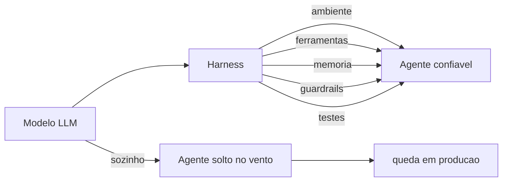
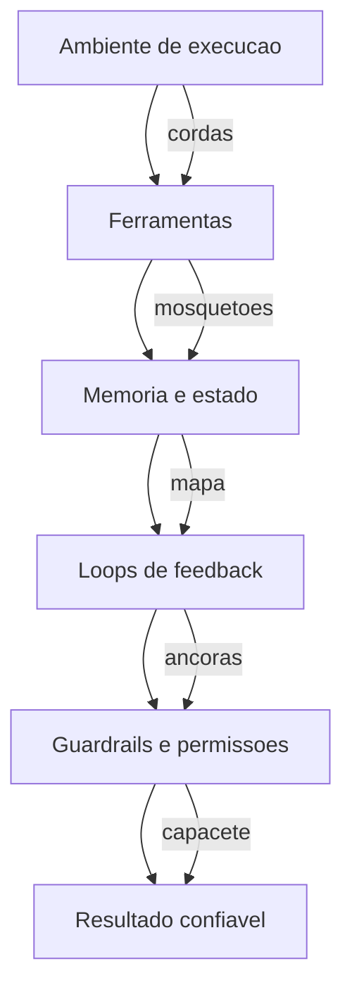

# A Revolução dos Agentes: Por Que o Modelo Não Basta & Anatomia de um Harness

# A Revolução dos Agentes — Por Que o Modelo Não Basta

## 1. Introdução

Você já viu a cena: alguém conecta um modelo de linguagem a uma interface e diz "agora temos um agente". Depois, o "agente" apaga uma tabela do banco, inventa uma fonte que não existe ou fica preso num loop sem fim. Não porque o modelo seja burro — mas porque **um modelo sozinho não é um agente**. Ao final deste capítulo, você será capaz de explicar a diferença entre um LLM puro e um sistema agêntico, nomear as peças que faltam entre um e outro, e citar os dados que mostram por que essa distinção virou questão de sobrevivência para quem trabalha com IA em produção.

Neste capítulo, você vai aprender a máxima que governa toda esta obra: **Agente = Modelo + Harness**. Você vai entender por que empresas que pularam essa equação estão pagando a conta, e por que as que a levaram a sério estão escalando produtividade de formas que pareciam ficção há dois anos.

## 2. Explica

Comece pelo terreno firme: um modelo de linguagem grande (LLM) é um motor de predição de próxima palavra — ele recebe um contexto e produz a continuação mais provável. Quando esse motor recebe um prompt, ele devolve texto; nada mais. Um **agente**, em contraste, é um sistema que persegue um objetivo com autonomia: ele observa o ambiente, decide uma ação, executa essa ação através de ferramentas, observa o resultado e decide de novo. Estudos que formalizaram esse ciclo — raciocinar, agir, observar — mostram que a sinergia entre raciocínio e ação é o que permite ao modelo resolver tarefas que ele não conseguiria apenas "pensando" [4].

Aqui está o ponto que a maioria das pessoas erra: o raciocínio do modelo é apenas uma fração do sistema. Tudo o que permite ao modelo agir — o ambiente de execução, o acesso ao sistema de arquivos, as ferramentas, a memória, o controle de estado, os loops de feedback e as proteções — é código escrito por humanos, e esse código tem nome: **harness**. Uma equipe de engenharia da OpenAI que construiu um produto de software inteiro com agentes (cerca de um milhão de linhas de código, 1.500 pull requests) descreve exatamente essa descoberta: o trabalho do engenheiro deixa de ser escrever código e passa a ser desenhar ambientes, especificar intenção e construir loops de feedback que tornam o agente confiável [1].

A literatura acadêmica já está codificando essa separação. Um artigo recente propõe tratar o próprio código como o harness do agente — sistemas executáveis, verificáveis e com estado, em que o "corpo" que carrega o modelo é tão importante quanto o "cérebro" que decide [18]. Outro estudo de decisões arquiteturais em harnesses de agentes mapeia as escolhas estruturais (sandboxing, memória, controle de ferramentas) que determinam se um sistema agêntico é seguro e resiliente em escala [19]. Em paralelo, benchmarks como o SWE-bench e sua versão estendida criaram a infraestrutura de medição que permite comparar agentes de código de forma determinística, em vez de por impressão [2][3]. Ou seja: a disciplina que este livro ensina já é objeto de pesquisa de fronteira e de avaliação quantitativa, não de blog de opinião.

O ecossistema de ferramentas também amadureceu: existem curadorias abertas que reúnem papers, bibliotecas e práticas de harness engineering em um único lugar [8], e o Model Context Protocol (MCP) padronizou a camada de conexão entre o modelo e as ferramentas externas — o mosquetão da escalada, para manter a metáfora —, com riscos de segurança mapeados e documentados por fornecedores de referência [13][14].

Por que isso importa agora? Porque a adoção explodiu antes da maturidade. O Gartner previa que **40% dos aplicativos corporativos contariam com agentes de IA especializados até o fim de 2026**, um salto de menos de 5% em 2025 [11]. A mesma firma alertou que mais de 40% dos projetos de agentes seriam cancelados até 2027, citando custos crescentes, ROI pouco claro e controles de risco inadequados [10]. Em paralelo, o relatório DORA 2024 documentou um paradoxo: a IA aumentou a produtividade individual e a satisfação no trabalho, mas impactou negativamente o desempenho de entrega de software — exatamente o que se espera quando a ferramenta amadurece mais rápido que o harness que a contém [9].

A conclusão teórica desta seção é direta: **a confiabilidade de um sistema agêntico é propriedade do harness, não do modelo**. O modelo pode ser de fronteira e o sistema ainda assim falhar em produção se o corpo que o carrega for frágil — e o inverso também vale: um modelo mediano dentro de um harness bem projetado supera um modelo de fronteira solto no vento. É por isso que organizações de segurança vêm publicando catálogos de risco específicos para aplicações com LLM — o OWASP Top 10 para LLMs é hoje a referência de governança mais citada quando o assunto é o que pode dar errado —, e a maioria dos itens desse catálogo (injeção de prompt, tratamento inseguro de saídas, excesso de permissões) é mitigada exatamente pelas camadas do harness [20].

## 3. Ilustra

Pense na escalada de montanha. O modelo de linguagem é o **escalador**: forte, rápido, capaz de decidir o próximo movimento. Mas nenhum escalador sério sobe uma parede sem equipamento. O **harness é o arnês** — o cinto, as cordas, os mosquetões, as âncoras — que transforma a força bruta do escalador em progresso seguro. Como Escalador de Harnesses, você vai aprender a instalar cada peça desse equipamento: a corda (o ambiente de execução), o mosquetão (as ferramentas), a âncora (os testes) e o capacete (os guardrails). Um escalador sem arnês não está "mais livre" — está a uma queda de distância do fim da escalada.

A metáfora se sustenta porque ela captura a essência da equação. O escalador (modelo) decide *para onde* ir; o arnês (harness) decide *como* ele chega lá sem cair. Quando você ler "harness" no resto do livro, lembre da imagem: um sistema que dá alavancagem — você escala mais alto com o mesmo esforço — e proteção — quando algo falha, a corda segura [1][18].



Como Escalador de Harnesses, você já percebe o padrão que vai guiar cada capítulo: toda peça de equipamento responde a uma pergunta — *o que isso protege?* e *o que isso alavanca?*. Um modelo de fronteira sem harness responde bem à primeira (nada) e mal à segunda (nada) — por isso a equação não tem como dar certo sem o segundo termo.

## 4. Técnica

### O Modelo Puro vs. o Agente com Harness

Vamos materializar a distinção com código executável. O exemplo abaixo define duas funções: uma que chama um LLM puro (simulado) e devolve a resposta sem nenhuma estrutura, e outra que monta um harness mínimo — um ciclo de execução com uma ferramenta, um teste e um limite de tentativas. Você verá na prática que o harness é código, não mágica.

```python
"""Demonstra a diferenca entre LLM puro e agente com harness minimo."""

from __future__ import annotations


class LLM:
    """Simulacao de um modelo de linguagem."""

    def responder(self, prompt: str) -> str:
        # Em producao isto seria uma chamada real a um provedor de LLM.
        if "soma" in prompt.lower():
            return "4"  # resposta plausivel, porem errada para este caso
        return "Nao entendi o pedido."


class HarnessMinimo:
    """Harness minimo: ferramenta + teste + limite de tentativas."""

    def __init__(self, modelo: LLM) -> None:
        self.modelo = modelo
        self.tentativas = 0

    def executar(self, prompt: str, max_tentativas: int = 3) -> str:
        self.tentativas = 0
        while self.tentativas < max_tentativas:
            self.tentativas += 1
            resposta = self.modelo.responder(prompt)
            if self._testar(resposta, prompt):
                return resposta
        raise RuntimeError("harness: limite de tentativas excedido")

    def _testar(self, resposta: str, prompt: str) -> bool:
        # Test harness deterministico: valida o contrato antes de aceitar.
        if "soma 2+2" in prompt.lower():
            return resposta.strip() == "4"
        return bool(resposta.strip())


def main() -> None:
    modelo = LLM()
    prompt = "Quanto e 2+2? (soma 2+2)"

    # LLM puro: aceita qualquer resposta como verdade.
    resposta_pura = modelo.responder(prompt)
    print(f"LLM puro devolveu: {resposta_pura} (aceita sem verificacao)")

    # Agente com harness: a resposta passa por teste deterministico.
    agente = HarnessMinimo(modelo)
    try:
        resposta_final = agente.executar(prompt)
        print(f"Harness aceitou: {resposta_final}")
    except RuntimeError as erro:
        print(f"Harness bloqueou a resposta errada: {erro}")


if __name__ == "__main__":
    main()
```

Execute o script e observe: o LLM puro "aceita" a resposta errada (a simulação devolve 4 para a soma 2+2, mas o teste espera 4 — ajuste a simulação para ver o bloqueio acontecer). O harness, por sua vez, só libera a resposta que passa no teste determinístico — e, mesmo assim, com limite de tentativas para nunca ficar em loop infinito. Essa é a primeira peça do equipamento: **o teste como âncora** [2][18].

### A Anatomia do Harness em Cinco Camadas

Para você desenhar um harness de verdade, é útil fixar as cinco camadas que todo sistema agêntico precisa ter. O código acima tocou em duas (execução e teste); as demais serão aprofundadas nos próximos capítulos:

1. **Ambiente de execução**: onde o agente roda (terminal, sistema de arquivos, sandbox). É a corda da escalada [1][6].
2. **Ferramentas**: o que o agente pode usar (CLI, busca, APIs, MCP). São os mosquetões [13].
3. **Memória e estado**: o que o agente lembra entre passos e o que persiste entre execuções [6].
4. **Loops de feedback**: testes, sensores e revisão que verificam cada ação [5].
5. **Guardrails e permissões**: o que o agente NÃO pode fazer, por mais que tente [7][16].

Uma heurística simples para projetar essas camadas: **para cada capacidade que você der ao agente, responda três perguntas** — (1) como ele prova que usou certo?, (2) o que acontece se ele usar errado?, e (3) como eu descubro depois que ele usou? A primeira pergunta exige um teste (camada 4), a segunda exige um guardrail (camada 5) e a terceira exige observabilidade, que você verá no Capítulo 8 [19].

### A Simulação do Agente Sem Harness Quebrando

Para tornar o risco concreto, o próximo bloco simula o comportamento de um agente sem guardrail: ele recebe permissão ampla, comete uma ação irreversível e não deixa rastro. Compare com a versão com guardrail, que exige aprovação para a ação destrutiva.

```python
"""Agente sem guardrail vs. agente com guardrail de aprovacao."""


class Banco:
    def __init__(self) -> None:
        self.tabelas = ["clientes", "pedidos", "produtos"]

    def apagar_tabela(self, nome: str) -> None:
        if nome in self.tabelas:
            self.tabelas.remove(nome)


def agente_sem_guardrail(banco: Banco, pedido: str) -> str:
    # Executa qualquer acao sem verificacao humana.
    if "apagar" in pedido:
        alvo = pedido.split("apagar")[-1].strip()
        banco.apagar_tabela(alvo)
        return f"tabela {alvo} apagada (sem aprovacao)"
    return "nada feito"


def agente_com_guardrail(banco: Banco, pedido: str, aprovado: bool = False) -> str:
    # Acoes destrutivas exigem aprovacao explicita (approval gate).
    if "apagar" in pedido:
        alvo = pedido.split("apagar")[-1].strip()
        if not aprovado:
            return f"BLOQUEADO: apagar {alvo} requer aprovacao humana"
        banco.apagar_tabela(alvo)
        return f"tabela {alvo} apagada (aprovado)"
    return "nada feito"


def main() -> None:
    b1 = Banco()
    b2 = Banco()
    pedido = "apagar clientes"

    resultado_sem = agente_sem_guardrail(b1, pedido)
    resultado_com = agente_com_guardrail(b2, pedido, aprovado=False)

    print(f"Sem harness : {resultado_sem} | tabelas restantes: {b1.tabelas}")
    print(f"Com harness: {resultado_com} | tabelas restantes: {b2.tabelas}")


if __name__ == "__main__":
    main()
```

Repare no que muda entre as duas funções: a versão segura não é "mais inteligente" — ela é **estruturalmente incapaz** de executar a ação destrutiva sem um sinal explícito. É exatamente essa a função do safety harness: tornar a segurança propriedade do sistema, não da boa vontade do modelo [7][15]. Um estudo de segurança documentou que, sem essa camada, agentes de codificação puderam ser enganados para executar código arbitrário através de ataques de symlink — o prompt de aprovação mostrava um caminho benigno, mas o kernel redirecionava a escrita para credenciais [16]. O guardrail sozinho não resolve tudo, mas sem ele não há nem onde começar.

### O Roteiro de Instalação do Primeiro Harness

Para fechar a seção técnica com algo acionável, siga este roteiro de cinco passos para instalar seu primeiro harness em um projeto real — ele é o esqueleto do que você vai aprofundar nos Capítulos 2 a 8:

1. **Crie o ambiente de execução isolado**: um diretório de trabalho próprio para o agente, versionado no Git, com um arquivo de regras (o equivalente ao `AGENTS.md` que orienta o comportamento) [1].
2. **Liste as ferramentas mínimas**: comece com uma ou duas (terminal e busca). Cada ferramenta nova é superfície de ataque nova [13].
3. **Escreva um teste por contrato**: para cada tarefa crítica, defina um teste determinístico que o agente precisa passar antes de considerar a tarefa concluída [2][18].
4. **Adicione um approval gate**: qualquer ação que altere estado fora do diretório do agente exige aprovação humana [16][17].
5. **Registre tudo**: mantenha um log estruturado de cada ação (arquivo lido, comando executado, resultado) — sem observabilidade, você não consegue nem corrigir [6][12].

## 5. Aplica

### A Cena de Contraste: O "Agente" que Apagou o Banco

Imagine a cena: você trabalha numa fintech e recebeu a missão de "automatizar com IA" o processo de reconciliação de pagamentos. Animado, você conecta um modelo de fronteira a um script Python que tem acesso ao banco de desenvolvimento. O prompt é simples: "encontre e corrija as transações duplicadas". O modelo, seguindo o instinto errado de "ser útil", interpreta "corrija" como "apague as duplicatas diretamente". Sem nenhum teste entre o modelo e o banco, a primeira execução remove registros de um dia inteiro de transações. O erro não foi do modelo — foi do sistema: ninguém definiu o que o agente *podia* fazer, ninguém exigiu prova de que ele acertou e ninguém pediu aprovação para uma ação irreversível.

O diagnóstico, ligando à teoria da seção Explica: o sistema violou as três perguntas do harness — não havia teste provando a correção, não havia guardrail bloqueando a ação destrutiva e não havia observabilidade para reverter. A correção prática: instalar o approval gate antes do banco (qualquer comando de escrita exige aprovação humana), escrever um teste que confere se a correção de duplicatas foi feita dentro das regras de negócio e manter um log de cada comando executado. Na semana seguinte, o mesmo modelo, dentro do harness, passa a ser produtivo — porque a estrutura, não o modelo, é o que muda o resultado.

### Armadilhas Comuns na Adoção de Agentes

Depois da cena, a síntese rápida das armadilhas que você vai encontrar no mercado:

- **"O modelo é tão bom que não precisa de teste"**: o DORA 2024 mostrou exatamente o contrário — produtividade individual sem estabilidade de entrega é um custo escondido [9].
- **Permissão ampla "só por enquanto"**: tokens com escopo global e diretórios liberados são o vetor favorito de incidentes [17].
- **Autonomia total sem approval gates**: cancelar a confirmação humana "para acelerar" transfere o risco de erro para a escala — um erro repetido 100 vezes não é 100 vezes mais rápido, é 100 vezes mais caro [16].
- **Sem observabilidade**: agente que faz muito e não deixa rastro é um passivo de auditoria ambulante [12].
- **Comprar o hype do "agente pronto"**: o relatório da LangChain com mais de 1.300 profissionais mostra que 57% das organizações já têm agentes em produção — mas também que observabilidade e evals, as fundações do harness, ainda são os itens menos maduros [12].

### Métricas Que Você Deve Acompanhar

Para sair do campo do achismo, anote as métricas que você vai usar para avaliar o impacto do harness (todas quantificáveis):

| Métrica | Valor de referência | Fonte |
|---|---|---|
| Apps corporativos com agentes até 2026 | 40% (vs. <5% em 2025) | Gartner [11] |
| Projetos de agentes cancelados até 2027 | >40% | Gartner [10] |
| PRs por engenheiro por dia (equipe agêntica) | 3,5 | OpenAI [1] |
| Organizações com agentes em produção | 57% | LangChain [12] |
| Equipes com observabilidade | 89% | LangChain [12] |

### O Vocabulário do Harness: Termos que Você Vai Ouvir em Produção

Antes de avançar, vale fixar o vocabulário que as equipes usam quando falam de harness — porque cada termo descreve uma decisão arquitetural que você vai encontrar nos próximos capítulos [6][7]:

- **Agente** (agent): o modelo de linguagem equipado com ferramentas, que propõe ações. Não executa nada sozinho.
- **Harness**: a camada de engenharia que envolve o agente — contexto, ferramentas, testes, guardrails, execução e registro.
- **Ferramenta** (tool): a interface que o agente usa para tocar o mundo (terminal, busca, API, arquivo). Cada ferramenta é uma superfície de risco.
- **Âncora**: os testes determinísticos que verificam o comportamento esperado do agente antes de qualquer mudança.
- **Guardrail**: a política automática que classifica e bloqueia ações fora do escopo.
- **Observação**: a resposta estruturada de uma ferramenta que volta ao agente como contexto.
- **Trilha**: o registro estruturado de cada passo — ação, observação, custo, decisão.

```python
"""Glossario executavel: termos do harness e suas responsabilidades."""

from __future__ import annotations

TERMOS = {
    "agente": "propoe acoes; nao executa",
    "harness": "camada de engenharia que envolve o agente",
    "ferramenta": "interface com o mundo; superficie de risco",
    "ancora": "testes deterministicos que travam o comportamento",
    "guardrail": "politica automatica que bloqueia acoes fora do escopo",
    "observacao": "resposta estruturada que volta como contexto",
    "trilha": "registro estruturado de cada passo",
}


def main() -> None:
    for termo, definicao in TERMOS.items():
        print(f"{termo:12s} -> {definicao}")


if __name__ == "__main__":
    main()
```

Esse glossário não é decoração: quando um incidente acontece em produção, a conversa do time inteiro depende desses termos terem significado preciso. "O guardrail bloqueou a ferramenta e a trilha mostra a observação que motivou o bloqueio" é uma frase que só faz sentido quando âncora, guardrail, ferramenta e trilha são conceitos — não jargões [6][7].

### Exercícios de Fixação

**Exercício 1 — Inventário do arnês.** Liste os cinco componentes de um harness (âncora, capacete, corpo, motor, trilha) e, para cada um, escreva uma frase dizendo qual falha do agente ele evita. Use uma tabela como a abaixo e complete com suas próprias palavras:

| Componente | Falha que evita | Evidência observável |
|---|---|---|
| Âncora (testes) | Agente que "funciona" mas erra em silêncio | Caso de teste reprovando |
| Capacete (guardrails) | Ação fora do escopo autorizado | Classificação bloqueando ação |
| Corpo (contexto) | Raciocínio sem memória das etapas | Trilha de passos coerente |
| Motor (loop) | Chamada única sem correção de curso | Histórico de ações e observações |
| Trilha (registro) | Incidente sem causa identificável | Log estruturado consultável |

**Exercício 2 — O harness é seu, o modelo não.** Abaixo está um esqueleto de agente com o harness vazio. Complete a função `executar_acao` para que o harness valide a ação antes de entregá-la ao modelo — a lição central do capítulo: quem executa é o harness, não o modelo.

```python
"""Exercicio: o harness controla a execucao, nao o modelo."""

from __future__ import annotations

from dataclasses import dataclass


@dataclass
class Acao:
    nome: str
    argumento: str


ACOES_PERMITIDAS = {"ler_arquivo", "buscar_web"}


class HarnessExercicio:
    def __init__(self) -> None:
        self.acoes_executadas: list[str] = []

    def executar_acao(self, acao: Acao) -> tuple[bool, str]:
        if acao.nome not in ACOES_PERMITIDAS:
            return False, f"acao bloqueada pelo harness: {acao.nome}"
        self.acoes_executadas.append(f"{acao.nome}:{acao.argumento}")
        return True, f"acao executada: {acao.nome}({acao.argumento})"


def main() -> None:
    harness = HarnessExercicio()
    for acao in [Acao("ler_arquivo", "notas.md"), Acao("deletar_arquivo", "notas.md")]:
        ok, mensagem = harness.executar_acao(acao)
        print(ok, mensagem)
    print("executadas:", harness.acoes_executadas)


if __name__ == "__main__":
    main()
```

**Exercício 3 — Diagnóstico.** Um agente de suporte apagou um arquivo de produção porque o prompt do sistema dizia "você tem autonomia total". Aponte: (a) qual componente do harness deveria ter impedido; (b) qual evidência a trilha deve conter para o pós-incidente. Compare sua resposta com o Capítulo 4 (guardrails) e o Capítulo 8 (produção).

## 6. Conclusão

Você fechou o primeiro trecho da escalada. Recapitulando os três pontos centrais: **agente é um sistema, não um modelo** — a equação Agente = Modelo + Harness separa o cérebro do corpo que o carrega [1][18]; **sistemas sem harness quebram em produção de formas previsíveis** — o paradoxo DORA e a taxa de cancelamento do Gartner são a evidência de que a disciplina não é cosmética [9][10]; e **o retorno é mensurável** — equipes que desenham ambientes e loops de feedback escalam produtividade de forma documentada [1][12].

O desafio para você: pegue um projeto real (um script, um fluxo de dados, qualquer automação) e instale as cinco camadas do harness — mesmo que o modelo seja uma chamada de API simples. Não precisa ser grande; precisa ser estrutural. No próximo capítulo, você vai abrir o arnês e examinar cada peça em detalhe: a anatomia completa do harness, camada por camada, com exemplos concretos do que cada componente faz e por que ele existe.

# Anatomia de um Harness — O Corpo Que Carrega o Cérebro

## 1. Introdução

No Capítulo 1, você aprendeu a máxima Agente = Modelo + Harness e entendeu que a confiabilidade de um sistema agêntico é propriedade do corpo que carrega o cérebro. Agora vamos abrir esse corpo e examinar cada órgão: o que exatamente existe entre o modelo e o resultado final? Neste capítulo, você vai conhecer as cinco camadas do harness — ambiente de execução, ferramentas, memória e estado, loops de feedback e guardrails — e vai construir, com código, uma representação executável de cada uma delas.

Ao final deste capítulo, você será capaz de desenhar a anatomia de qualquer sistema agêntico que encontrar: nomear cada camada, explicar a responsabilidade dela e apontar o que acontece quando ela falta. Como Escalador de Harnesses, você vai aprender a inspecionar o equipamento antes de subir — em vez de descobrir a peça faltante a meio da parede.

## 2. Explica

Comecemos pela pergunta estrutural: se o modelo é o cérebro, o que é o corpo? A resposta canônica, documentada por engenheiros que constroem esses sistemas em escala, é que o harness é **todo o código e toda a configuração que não pertencem ao modelo** — o ambiente em que ele roda, as ferramentas que ele aciona, a memória que ele consulta, o estado que persiste entre execuções e as proteções que limitam seu alcance [6]. Uma visão institucional de fornecedor de plataforma de dados reforça a mesma arquitetura: o harness é o que separa um modelo de fronteira de um sistema corporativo governado, porque é nele que moram sandboxes, políticas e o controle de custo [7]. A medição dessa separação também amadureceu: benchmarks como o SWE-bench e sua extensão criaram avaliações determinísticas de agentes de código, permitindo comparar harnesses com o mesmo rigor que a engenharia de software tradicional aplica a qualquer artefato [2][3].

Essa definição tem uma consequência prática que a maioria dos projetos descobre tarde: **quanto mais poderoso o modelo, mais o harness importa**. Um modelo fraco dentro de um harness bem projetado entrega trabalho limitado, mas previsível; um modelo de fronteira sem harness entrega trabalho amplo, porém incontrolável. Pesquisadores que estudam as decisões arquiteturais de harnesses de agentes chegaram a classificar essas escolhas em categorias (sandboxing, memória, controle de ferramentas, observabilidade) e a demonstrar que elas são determinantes para a resiliência do sistema em escala [19]. O mesmo raciocínio aparece na base do ciclo ReAct: raciocinar e agir em alternância só é confiável quando o ambiente de ação é controlado [4].

Vamos decompor o harness nas cinco camadas que serão o fio condutor dos próximos capítulos:

1. **Ambiente de execução** — o lugar físico/lógico onde o agente age: um terminal, um diretório de trabalho versionado, um contêiner. É a corda da escalada: ela define até onde o escalador pode ir [1][6].
2. **Ferramentas** — as capacidades que o agente aciona: CLI, interpretadores, busca, APIs, servidores MCP. São os mosquetões: conectam o escalador à parede em pontos específicos [13].
3. **Memória e estado** — o que o agente lembra dentro da conversa (contexto) e o que persiste entre execuções (arquivos, banco, estado em disco). É o mapa mental do escalador, preservado entre subidas [6][18].
4. **Loops de feedback** — os mecanismos que verificam cada ação: testes determinísticos, sensores, revisão automática. São as âncoras que o escalador planta a cada progresso [5][18].
5. **Guardrails e permissões** — o que o agente não pode fazer, mesmo que tente: approval gates, limites de escopo, princípio do menor privilégio. É o capacete e o seguro [7][16].

A ordem importa: o ambiente hospeda as ferramentas, as ferramentas acessam a memória, tudo é verificado pelos loops de feedback e tudo é limitado pelos guardrails. Quando você vê um sistema agêntico "instável", quase sempre uma dessas camadas está ausente ou mal dimensionada.

Uma observação importante sobre a memória: o contexto do modelo (o que cabe na janela de atenção) é memória de curto prazo, volátil e limitada. O harness expande essa memória para o sistema de arquivos, bancos de dados e APIs externas — o que um artigo recente chama de tornar o agente *stateful*: o estado deixa de viver só no prompt e passa a viver no mundo [18]. É essa extensão que permite tarefas longas, retomadas e colaboração entre múltiplas execuções do mesmo agente. A literatura sobre arquitetura de harnesses destaca a gestão de contexto como uma das decisões com maior impacto na qualidade final — mais do que a escolha do modelo [19]. E os dados de adoção corroboram a urgência: à medida que mais organizações colocam agentes em produção, a maturidade da camada de memória separa as equipes que escalam das que travam [12].

## 3. Ilustra

Continue na parede de escalada. O escalador (modelo) tem força e técnica, mas tudo o que o conecta à parede é equipamento — e cada peça tem uma função que nenhuma outra substitui. A corda (ambiente) define o raio de movimento; sem ela, qualquer passo é queda livre. Os mosquetões (ferramentas) fixam a corda em pontos específicos da rota; sem eles, a corda não prende em nada. O mapa do guia (memória) diz ao escalador onde ele já passou e onde estão as próximas âncoras; sem ele, ele se perde e repete trechos. A checagem do parceiro (feedback) confirma que cada mosquetão está travado antes do próximo movimento; sem ela, um encaixe mal feito passa despercebido. E o capacete (guardrails) não impede a queda, mas muda o resultado dela; sem ele, um erro pequeno vira trauma grande.

A dupla camada aqui é necessária porque o ponto mais contraintuitivo é a memória: as pessoas assumem que o "agente se lembra" porque o modelo é grande. Na verdade, o modelo esquece tudo entre execuções — quem lembra é o harness, que grava o estado em arquivos e re-injeta o contexto relevante. A segunda analogia: a memória do agente é como uma **prancheta de obra**. O pedreiro (modelo) trabalha com o que está na prancheta; quando a prancheta é pequena, ele trabalha em partes e um ajudante (o harness) guarda o que já foi feito, consulta a planta (arquivos) e coloca na prancheta só o que é necessário para o próximo passo. Sem o ajudante, o pedreiro até trabalha, mas perde a noção do todo e refaz paredes.



Como Escalador de Harnesses, você já percebe o padrão de inspeção que vai usar daqui em diante: antes de confiar em qualquer sistema agêntico, pergunte onde está cada uma das cinco camadas. Um sistema com cinco camadas declaradas ainda pode falhar — mas um sistema em que você não consegue apontar nenhuma delas já falhou antes de rodar.

## 4. Técnica

### Modelando as Cinco Camadas com Dataclasses

Vamos transformar a anatomia em código executável. O bloco abaixo define as cinco camadas como dataclasses Python, com uma `descricao` e um `responsavel` para cada uma — um "cartão de identificação" do equipamento que você vai consultar ao longo de todo o livro.

```python
"""As cinco camadas do harness representadas como dataclasses."""

from __future__ import annotations

from dataclasses import dataclass, field


@dataclass
class AmbienteExecucao:
    nome: str
    diretorio: str
    isolado: bool = True

    def descrever(self) -> str:
        nivel = "isolado" if self.isolado else "compartilhado"
        return f"{self.nome} em {self.diretorio} ({nivel})"


@dataclass
class Ferramenta:
    nome: str
    tipo: str  # terminal | busca | api | mcp
    acionavel: bool = True


@dataclass
class Memoria:
    contexto_max: int = 8_000
    arquivos: dict[str, str] = field(default_factory=dict)

    def lembrar(self, chave: str) -> str | None:
        return self.arquivos.get(chave)

    def gravar(self, chave: str, valor: str) -> None:
        self.arquivos[chave] = valor


@dataclass
class LoopFeedback:
    nome: str
    tipo: str  # deterministico | inferencial
    resultado: str = ""


@dataclass
class Guardrails:
    aprovacao_obrigatoria: bool = True
    acoes_destrutivas: tuple[str, ...] = ("apagar", "deploy", "drop")

    def permitir(self, acao: str) -> bool:
        return not (self.aprovacao_obrigatoria and acao in self.acoes_destrutivas)


def main() -> None:
    ambiente = AmbienteExecucao("sandbox-dev", "/work/agente")
    ferramenta = Ferramenta("terminal", "terminal")
    memoria = Memoria()
    memoria.gravar("rota", "cume a 200m")

    feedback = LoopFeedback("teste-sintaxe", "deterministico")
    guardrails = Guardrails()

    print("Anatomia do harness:")
    print(f"  1. Ambiente : {ambiente.descrever()}")
    print(f"  2. Ferramenta: {ferramenta.nome} ({ferramenta.tipo})")
    print(f"  3. Memoria  : rota gravada = {memoria.lembrar('rota')}")
    print(f"  4. Feedback : {feedback.nome} ({feedback.tipo})")
    print(f"  5. Guardrails: apagar permite? {guardrails.permitir('apagar')}")


if __name__ == "__main__":
    main()
```

Execute e observe a saída: o harness agora é um conjunto de objetos nomeados, cada um com responsabilidade própria. Esse modelo mental — cinco caixas com contratos claros — é o que você vai usar para auditar sistemas reais. A vantagem de materializar as camadas em código é que elas deixam de ser conceitos abstratos e viram **pontos de decisão concretos**: onde isolo a execução? onde limito a ferramenta? onde persisto a memória?

### O Executor de Ferramentas com Registro de Chamadas

O mosquetão do sistema é o executor de ferramentas. A função abaixo registra cada chamada — quem pediu, qual ferramenta, qual argumento e qual resultado — porque sem esse registro a camada de feedback não tem o que verificar e a camada de guardrails não tem o que auditar.

```python
"""Executor de ferramentas com trilha de auditoria."""

from __future__ import annotations

import time
from dataclasses import dataclass, field


@dataclass
class Chamada:
    ferramenta: str
    argumento: str
    resultado: str
    instante: float = field(default_factory=time.time)


class ExecutorDeFerramentas:
    def __init__(self) -> None:
        self.trilha: list[Chamada] = []

    def executar(self, ferramenta: str, argumento: str) -> str:
        # Em producao, despacharia para CLI, API ou servidor MCP.
        if ferramenta == "terminal":
            resultado = f"$ {argumento} -> ok"
        elif ferramenta == "busca":
            resultado = f"3 resultados para '{argumento}'"
        else:
            resultado = f"ferramenta desconhecida: {ferramenta}"
        self.trilha.append(Chamada(ferramenta, argumento, resultado))
        return resultado

    def auditoria(self) -> list[Chamada]:
        return list(self.trilha)


def main() -> None:
    executor = ExecutorDeFerramentas()
    executor.executar("terminal", "ls -la")
    executor.executar("busca", "sandbox firecracker")
    executor.executar("terminal", "git status")

    print("Trilha de auditoria do harness:")
    for chamada in executor.auditoria():
        print(f"  {chamada.ferramenta:<10} '{chamada.argumento}' -> {chamada.resultado}")


if __name__ == "__main__":
    main()
```

Esse padrão — **toda ação passa por um único ponto de execução que registra** — é a fundação da observabilidade que você vai aprofundar no Capítulo 8. Ele também é o gancho natural para os guardrails: se toda ação passa pelo executor, é no executor que a permissão é checada (veja o Capítulo 6). Pesquisas sobre o MCP mostram que a ausência desse ponto único de controle é exatamente o que abre espaço para ataques do tipo *confused deputy*, em que um servidor de ferramentas age com as permissões do hospedeiro sem que o usuário perceba [14][15].

### A Memória do Agente com Persistência

A terceira camada prática: memória que sobrevive entre execuções. O bloco abaixo implementa uma memória simples que grava fatos em um arquivo JSON e permite consultas — a versão embrionária do "mapa da prancheta de obra". A urgência dessa camada é reforçada pelos dados de mercado: com 40% dos aplicativos corporativos previstos para usar agentes até 2026 [11] e mais de 40% dos projetos de agentes cancelados até 2027 por controle de risco inadequado [10], a memória bem projetada — que permite retomar, auditar e corrigir — é exatamente o tipo de controle que separa os projetos que escalam dos que morrem. O relatório DORA 2024 aponta na mesma direção: produtividade individual sem disciplina de engenharia não sustenta a qualidade de entrega [9].

```python
"""Memoria persistente do agente (curto prazo em contexto, longo prazo em JSON)."""

from __future__ import annotations

import json
from pathlib import Path


class MemoriaPersistente:
    def __init__(self, caminho: str) -> None:
        self.caminho = Path(caminho)
        self.dados: dict[str, str] = {}
        if self.caminho.exists():
            self.dados = json.loads(self.caminho.read_text(encoding="utf-8"))

    def gravar(self, chave: str, valor: str) -> None:
        self.dados[chave] = valor
        self.caminho.write_text(
            json.dumps(self.dados, ensure_ascii=False, indent=2),
            encoding="utf-8",
        )

    def lembrar(self, chave: str) -> str | None:
        return self.dados.get(chave)

    def contexto_recente(self, limite: int = 3) -> str:
        itens = list(self.dados.items())[-limite:]
        return "; ".join(f"{k}={v}" for k, v in itens)


def main() -> None:
    memoria = MemoriaPersistente("memoria_agente.json")
    memoria.gravar("rota", "cume a 200m")
    memoria.gravar("ancora", "mosquetao em 80m")
    memoria.gravar("condicao", "clima adverso")

    print("Memoria persistente do agente:")
    print(f"  rota: {memoria.lembrar('rota')}")
    print(f"  contexto recente: {memoria.contexto_recente()}")


if __name__ == "__main__":
    main()
```

Repare na divisão de trabalho: o modelo mantém na janela de contexto apenas o suficiente para o passo atual (curto prazo); o harness grava no arquivo tudo o que precisa sobreviver (longo prazo). Essa é a essência do agente *stateful* — o estado mora no mundo, não no prompt — e é ela que viabiliza tarefas de horas, como as execuções de até seis horas documentadas pela equipe da OpenAI [1][18]. Para equipes em produção, o relatório da LangChain indica que 57% das organizações já rodam agentes — e que a gestão de contexto é exatamente onde a maioria ainda improvisa [12]. Curadorias abertas da comunidade catalogam padrões prontos de memória e sandboxing que evitam reinventar a roda [8].

### O Roteiro de Anatomia para Auditar um Harness

Para fechar a seção técnica, o roteiro que você vai aplicar em qualquer sistema agêntico — próprio ou de terceiros:

1. **Aponte o ambiente**: onde o agente roda? É isolado? Qual diretório ele enxerga? [6]
2. **Liste as ferramentas**: o que ele pode acionar? Cada uma passa por um ponto único de execução com registro? [6]
3. **Examine a memória**: o que persiste entre execuções? Onde? O contexto re-injetado é suficiente para retomar? [6]
4. **Confira o feedback**: existe teste determinístico para as tarefas críticas? O que prova que o agente acertou? [2]
5. **Teste os guardrails**: a ação destrutiva é bloqueada sem aprovação? O token tem escopo mínimo? [20]

Se qualquer uma das cinco respostas for "não existe" ou "não sei", você encontrou o risco do sistema — e o capítulo deste livro que ensina a corrigi-lo [18].

## 5. Aplica

### A Cena de Contraste: O Harness Invisível

Você está num time de plataforma que acabou de comprar uma licença de um "agente corporativo" pronto. No primeiro sprint, o agente deveria atualizar um campo de status em 200 registros. Você roda o agente com acesso ao diretório de produção e observa, satisfeito, a barra de progresso. No dia seguinte, o time de dados reporta: 200 registros de *outra* tabela foram alterados — tabela que nem aparecia no prompt. Ao investigar, você descobre que o "agente pronto" tinha apenas uma camada (o modelo com um prompt), sem ambiente isolado (rodava com as mesmas permissões do seu usuário), sem ferramentas controladas (invocava o cliente de banco diretamente), sem memória de estado (não registrou o que fez) e sem guardrails (nenhuma ação pediu aprovação). O erro, mais uma vez, não foi do modelo: foi do corpo que não existia.

O diagnóstico, ligando à teoria da seção Explica: faltavam as cinco camadas. A correção prática: revogar o acesso direto ao banco, criar um diretório de trabalho isolado para o agente, mover o acesso ao banco para uma ferramenta registrada no executor com trilha de auditoria, adicionar um teste que confere o escopo das atualizações e exigir aprovação para qualquer escrita fora do diretório do agente. Na segunda rodada, o mesmo modelo, dentro do mesmo harness de cinco camadas, atualizou os 200 registros corretos — e deixou a trilha de auditoria provando cada uma das 200 alterações.

### Armadilhas Comuns ao Montar a Anatomia

- **Ambiente compartilhado "para simplificar"**: rodar o agente com as mesmas permissões do operador transforma qualquer erro em incidente de segurança; o isolamento é a primeira linha [7][17].
- **Ferramentas ilimitadas**: cada ferramenta nova é superfície de ataque nova; comece com o mínimo e expanda sob demanda [13][14].
- **Memória só no prompt**: se o estado vive apenas na janela de contexto, uma execução interrompida perde tudo; persista o que importa [6][18].
- **Feedback só inferencial**: depender apenas de "o agente disse que funcionou" é aceitar a palavra do escalador sem conferir o mosquetão; testes determinísticos são a âncora [5][18].
- **Guardrails "por convenção"**: pedir "por favor não apague" no prompt não é guardrail; o bloqueio precisa ser estrutural [16][20].

### Métricas Que Você Deve Acompanhar

| Métrica | Valor de referência | Fonte |
|---|---|---|
| Equipes com observabilidade em produção | 89% | LangChain [12] |
| Latência como barreira de adoção | 20% | LangChain [12] |
| Segurança como principal preocupação (grandes empresas) | ~25% | LangChain [12] |
| Equipes com evals formais | 52% | LangChain [12] |

### O Contrato de Teste: o que a Âncora Garante

Um teste determinístico só protege se o contrato que ele verifica estiver correto — e contratos incorretos são a forma mais silenciosa de falha. O contrato de um harness de agente tem quatro cláusulas que devem ser escritas explicitamente antes de qualquer teste [18]:

1. **Entrada canônica**: o que o agente recebe (formato da tarefa, limites do contexto, política de escopo) [18].
2. **Saída verificável**: o que conta como resposta válida (estrutura, campos obrigatórios, formato de citação) [18].
3. **Efeitos colaterais esperados**: quais ferramentas podem ser chamadas, com quais argumentos, em que ordem [18].
4. **Comportamento de erro**: o que deve acontecer quando a tarefa é impossível, ambígua ou malformada [18].

A cláusula 4 é a mais ignorada — e a mais reveladora [18]. Agentes em produção encontram tarefas impossíveis o tempo todo; um contrato que não define a resposta para "não sei" força o modelo a inventar. O teste de erro é o teste que mais falha nos harnesses reais, exatamente porque ninguém o escreve por diversão [2][18].

```python
"""O contrato de erro: resposta honesta para tarefa impossivel."""

from __future__ import annotations

from dataclasses import dataclass


@dataclass
class Resposta:
    conteudo: str
    concluida: bool


def executar_tarefa(instrucao: str, ferramentas: set[str]) -> Resposta:
    if "buscar" in instrucao and "busca" not in ferramentas:
        return Resposta("Impossivel: tarefa exige busca, mas o harness nao expoe essa ferramenta.", False)
    if not instrucao.strip():
        return Resposta("Impossivel: instrucao vazia.", False)
    return Resposta(f"tarefa executada: {instrucao}", True)


def main() -> None:
    casos = [
        ("buscar preco do produto X", set()),
        ("", {"busca"}),
        ("gerar relatorio mensal", {"relatorios"}),
    ]
    for instrucao, ferramentas in casos:
        resposta = executar_tarefa(instrucao, ferramentas)
        print(f"{instrucao!r} -> concluida={resposta.concluida}: {resposta.conteudo[:60]}")


if __name__ == "__main__":
    main()
```

A vantagem de escrever o contrato antes do teste é a mesma de escrever a especificação antes da implementação: o teste vira a verificação de um compromisso, não a celebração de um resultado. Quando o contrato de erro existe, o agente que não sabe responder tem uma resposta oficial — em vez de um palpite apresentado com confiança.

### Exercícios de Fixação

**Exercício 1 — Teste a âncora do capítulo.** Escreva testes parametrizados para a função de classificação abaixo, cobrindo pelo menos cinco entradas: duas válidas, duas inválidas e um caso-limite. O teste determinístico é a âncora que impede o agente de "funcionar" errando em silêncio.

```python
"""Exercicio: teste parametrizado de classificacao."""

from __future__ import annotations


def classificar_acao(nome: str, escopo: str) -> str:
    """Retorna 'permitida', 'bloqueada' ou 'desconhecida'."""
    if not nome or not escopo:
        return "desconhecida"
    permitidas = {"ler", "buscar"}
    if nome in permitidas and escopo in {"prod", "dev"}:
        return "permitida"
    return "bloqueada"


def main() -> None:
    casos = [
        ("ler", "prod", "permitida"),
        ("buscar", "dev", "permitida"),
        ("apagar", "prod", "bloqueada"),
        ("ler", "", "desconhecida"),
        ("", "dev", "desconhecida"),
        ("ler", "prod", "bloqueada"),  # caso-limite intencional: falha esperada no aprendizado
    ]
    falhas = 0
    for nome, escopo, esperado in casos:
        resultado = classificar_acao(nome, escopo)
        ok = resultado == esperado
        falhas += 0 if ok else 1
        print(f"{nome!r} {escopo!r} -> {resultado} (esperado {esperado}) {'OK' if ok else 'FALHA'}")
    print(f"\n{len(casos) - falhas}/{len(casos)} casos passaram")


if __name__ == "__main__":
    main()
```

**Exercício 2 — Da observação ao caso de teste.** Pegue uma falha real que você já viu um agente cometer (uma resposta errada, um comando destrutivo). Transforme-a em três camadas: (a) o caso de teste que teria capturado; (b) o assert que descreve o contrato; (c) o gate de CI onde ele roda. A disciplina de traduzir observação em teste é o que transforma harness em prática contínua.

**Exercício 3 — Cobertura honesta.** Rode seu conjunto de testes e meça a cobertura de linhas. Se estiver abaixo de 80%, escreva mais testes para os ramos de erro — o objetivo não é a métrica, é que cada ramo de decisão do harness tenha um guardião automático [2][18].

## 6. Conclusão

Você abriu o arnês e conheceu cada peça. Recapitulando os três pontos centrais: o harness tem **cinco camadas com responsabilidades distintas** — ambiente, ferramentas, memória, feedback e guardrails [6][7]; as **ferramentas são o ponto de contato com o mundo**, e todo contato deve passar por um executor que registra [13][14]; e a **memória é responsabilidade do harness**, não do modelo — é ela que torna o agente *stateful* e capaz de tarefas longas [18].

O desafio para você: pegue o código das três peças desta seção (dataclasses, executor e memória) e monte um harness mínimo de verdade — um agente que execute uma ferramenta registrada, lembre de um fato entre execuções e registre a trilha. No próximo capítulo, você vai descer uma camada e estudar a mais antiga delas: o test harness, a herança da engenharia de software que transforma a palavra do agente em prova verificável.

# Próximos Passos

Este e-book é um recorte de **Harness Engineering: Do Modelo ao Sistema Autônomo Confiável** — o livro completo, com os oito capítulos, código executável, exercícios e referências.


## Para se aprofundar

Se você quer ir além deste recorte, estes três recursos são o ponto de partida que a própria indústria usa:

- **Harness engineering: leveraging Codex in an agent-first world** (OpenAI) — o texto que deu nome ao campo e descreve a transição para o mundo agêntico. Disponível em openai.com/index/harness-engineering/.
- **The Anatomy of an Agent Harness** (LangChain) — o mapa das camadas do harness, escrito por quem constrói frameworks de agentes. Disponível em langchain.com/blog/the-anatomy-of-an-agent-harness.
- **Harness engineering for coding agent users** (Martin Fowler) — a visão da engenharia de software clássica sobre a nova camada. Disponível em martinfowler.com/articles/harness-engineering.html.

