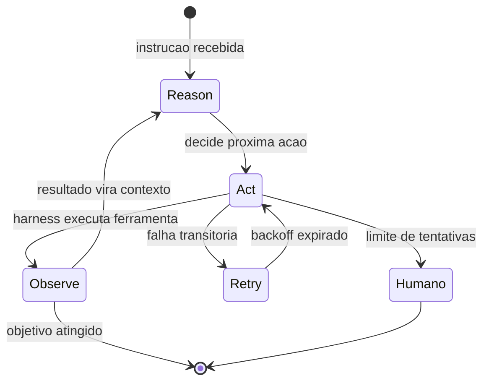
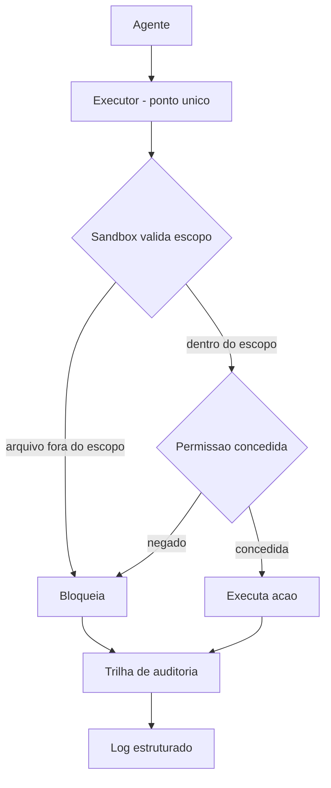

# O Ciclo ReAct e os Loops de Execução & Sandboxes, Permissões e o Controle de Execução


## Para quem é este e-book

Você já viu um agente "travar": repete a mesma ação, esperando resultado diferente, ou desiste da tarefa na primeira falha transitória. A diferença entre um agente que termina a tarefa e um que morre no meio da parede raramente está no modelo — está no loop de execução.

Este e-book é para você se:
- você quer entender como agentes realmente executam tarefas de ponta a ponta;
- você já viu um loop infinito queimando tokens (ou quer evitar o primeiro);
- você precisa explicar para o seu time o que é um harness e por que ele controla a execução.

O primeiro capítulo apresenta o ciclo ReAct — raciocinar, agir, observar, repetir — e a política de retentativa que separa a falha transitória da permanente. O segundo capítulo é sobre isolamento: sandboxes, permissões e as três zonas de execução que permitem ao agente fazer muito sem poder fazer qualquer coisa.

## O que você vai levar

Ao terminar, você será capaz de:
- desenhar o loop de execução de um agente com observação estruturada;
- configurar retry com backoff, limite e escalação para humano;
- declarar zonas de execução na configuração — não na conversa;
- explicar por que a separação entre intenção do modelo e declaração do engenheiro é a defesa contra golpes de prompt.

Nada aqui é teoria de salão: cada conceito nasce de decisões reais de engenharia, documentadas por quem opera agentes em produção.


# O Ciclo ReAct e os Loops de Execução

## 1. Introdução

Nos quatro primeiros capítulos, você montou as duas primeiras peças do arnês — a âncora (testes determinísticos) e o capacete (guardrails) — e entendeu a anatomia do corpo que carrega o cérebro. Mas até aqui o agente ainda é uma peça de museu: nada que você construiu executa uma tarefa real de ponta a ponta. Neste capítulo, a escalada começa de verdade: você vai construir o **loop de execução** que transforma um modelo estático em um agente que age, observa e decide de novo.

Ao final deste capítulo, você será capaz de implementar um loop ReAct completo — Reason, Act, Observe — com execução de ferramentas, tratamento de erro e política de retentativa. Você vai entender por que o loop, e não a chamada única, é a unidade fundamental do trabalho agêntico, e por que a qualidade do harness no tratamento de erros decide se o agente termina a tarefa ou morre no meio da parede.

## 2. Explica

O ciclo **ReAct** — raciocinar, agir, observar — é o padrão canônico de execução agêntica, formalizado por Yao e colaboradores em 2022: em vez de o modelo apenas raciocinar sobre o problema (como em cadeias de pensamento puras) ou apenas agir (como em sistemas baseados em regras), o agente **alterna raciocínio e ação**, usando as observações do ambiente como novo contexto para o próximo raciocínio [4]. O paper demonstrou que essa sinergia supera ambos os modos isolados em tarefas que exigem conhecimento externo e raciocínio de múltiplos passos — a fundação empírica de praticamente todos os agentes modernos.

A estrutura do loop é enganosamente simples, e é exatamente aí que mora o perigo de subestimá-la. Em cada iteração, o agente: (1) recebe o contexto atual (instrução + histórico de ações e observações); (2) decide o próximo passo — raciocinar sobre o problema ou invocar uma ferramenta; (3) o harness executa a ação escolhida no mundo real (terminal, busca, API, arquivo); (4) o resultado da execução volta como observação; e (5) o ciclo repete até o objetivo ser atingido ou um limite ser alcançado [4][18]. O que parece um detalhe de implementação é, na verdade, a decisão arquitetural central: **quem executa a ação não é o modelo — é o harness**. O modelo propõe; o harness executa e devolve a realidade [18].

Por que a separação importa? Porque a execução é onde o modelo encontra o mundo — e o mundo não é determinístico. A ferramenta pode falhar, o arquivo pode não existir, a API pode retornar um erro. O harness precisa capturar essas observações de forma estruturada (sucesso ou falha, com o resultado bruto) e devolvê-las ao modelo como contexto. É essa realimentação que permite ao agente **corrigir o curso**: um agente que observa a falha da ferramenta e ajusta a próxima ação é qualitativamente diferente de um que repete a mesma ação esperando outro resultado — a diferença entre um loop e um beco sem saída [1][5].

O tratamento de erro merece destaque porque é o teste real do harness. Sem política de retentativa, uma falha transitória (timeout, servidor ocupado) mata a tarefa inteira; com retry infinito, uma falha permanente vira loop eterno de tokens. O design maduro combina três coisas: **retry com backoff** para falhas transitórias, **limite de tentativas** para nunca gastar sem teto, e **escalação para humano** quando o limite é atingido — a mesma filosofia de um time de produção, aplicada ao agente [19]. Equipes que rodam agentes em escala relatam execuções únicas de até seis horas; sem uma política de erro robusta, nenhuma execução longa sobrevive [1].

Uma observação sobre escala: 57% das organizações já têm agentes em produção, segundo pesquisa com mais de 1.300 profissionais — e o principal diferencial entre as que prosperam e as que estagnam não é o modelo, mas exatamente essa camada de execução: quem trata erro, quem observa de verdade e quem registra o que aconteceu [12]. O loop é simples; a engenharia do loop é que é difícil.

## 3. Ilustra

Volte à parede de escalada. O ciclo ReAct é o **ritmo do movimento do escalador**: ele olha a parede (Reason — decide o próximo apoio), move a mão ou o pé (Act — executa), sente o resultado (Observe — o apoio segura ou cede?) e repete. Nenhum escalador sobe uma parede com um único movimento calculado do chão — a parede é viva, cada apoio é diferente do que parecia à distância, e é a observação de cada resultado que informa o próximo movimento. O agente que tenta resolver a tarefa em uma única chamada é como o escalador que tenta pular a parede inteira de uma vez: só funciona em paredes que não existem [4].

A dupla camada aqui é necessária porque o ponto mais contraintuitivo é o tratamento de erro: as pessoas veem a falha como anomalia a ser evitada; na verdade, a falha é **combustível do loop**. A segunda analogia — o **piloto em voo por instrumentos**: o piloto (agente) segue o plano de voo (instrução), mas lê os instrumentos (observações) a cada instante. Quando um instrumento acusa desvio, o piloto não "continua no plano" — ele corrige a rota com base na leitura. E quando o instrumento falha, o protocolo manda tentar o procedimento alternativo, depois escalar para o copiloto (humano) — nunca simplesmente repetir a mesma ação esperando leitura diferente. O voo não é a sequência planejada no chão; é a sequência corrigida no ar. O mesmo vale para o agente: a tarefa não é o plano inicial; é o loop corrigido pela observação [4][5][18].



Como Escalador de Harnesses, você já percebe a pergunta de diagnóstico que vai usar: **o que acontece quando a ferramenta falha?** Se a resposta for "o agente tenta de novo para sempre" ou "a tarefa morre", o loop está mal construído. A resposta certa combina observação estruturada, retry com limite e escalação — e é exatamente isso que você vai implementar na próxima seção.

## 4. Técnica

### O Loop ReAct Completo com Ferramenta

Vamos construir o coração do agente: um loop ReAct com uma ferramenta (uma calculadora) e observação estruturada. O modelo é simulado com regras simples — mas a arquitetura do loop é idêntica à de produção: proponha, execute, observe, repita.

```python
"""Loop ReAct completo com ferramenta de calculadora e observacao estruturada."""

from __future__ import annotations

from dataclasses import dataclass
from typing import Callable


@dataclass
class Observacao:
    ok: bool
    conteudo: str
    origem: str


class ModeloSimulado:
    """Substituto do LLM: decide a acao pela instrucao (sem raciocinio real)."""

    def raciocinar(self, contexto: str) -> str:
        # Em producao: chamada ao LLM. Aqui, regra simples: chama a calculadora.
        if "quanto e 2+3*4" in contexto:
            return "usar_calculadora:2+3*4"
        if "quanto e 10-7" in contexto:
            return "usar_calculadora:10-7"
        return "finalizar"


class HarnessReAct:
    def __init__(self, modelo: ModeloSimulado, max_iteracoes: int = 10) -> None:
        self.modelo = modelo
        self.max_iteracoes = max_iteracoes
        self.historico: list[str] = []
        self.ferramentas: dict[str, Callable[[str], Observacao]] = {
            "calculadora": self._calculadora,
        }

    def _calculadora(self, expressao: str) -> Observacao:
        try:
            resultado = eval(expressao, {"__builtins__": {}}, {})  # noqa: S307 — exemplo didatico
            return Observacao(True, str(resultado), "calculadora")
        except Exception as exc:  # noqa: BLE001
            return Observacao(False, str(exc), "calculadora")

    def executar_ferramenta(self, nome: str, argumento: str) -> Observacao:
        ferramenta = self.ferramentas.get(nome)
        if ferramenta is None:
            return Observacao(False, f"ferramenta desconhecida: {nome}", "harness")
        return ferramenta(argumento)

    def rodar(self, instrucao: str) -> str:
        contexto = f"instrucao: {instrucao}"
        for _ in range(self.max_iteracoes):
            acao = self.modelo.raciocinar(contexto)
            if acao == "finalizar":
                return "objetivo atingido"
            if acao.startswith("usar_"):
                _, nome, argumento = acao.partition(":")
                observacao = self.executar_ferramenta(nome, argumento)
                self.historico.append(f"{nome}({argumento}) -> {observacao.conteudo}")
                contexto += f" | obs: {observacao.conteudo}"
        return "limite de iteracoes atingido"


def main() -> None:
    harness = HarnessReAct(ModeloSimulado())
    resultado = harness.rodar("Quanto e 2+3*4 e depois quanto e 10-7?")
    print(f"Resultado: {resultado}")
    print("Historico de execucao:")
    for passo in harness.historico:
        print(f"  {passo}")


if __name__ == "__main__":
    main()
```

Execute e observe a essência do loop: cada resposta da ferramenta vira contexto para a próxima decisão — o agente não "lembra" da resposta, o harness a injeta no contexto. Essa é a diferença entre uma chamada única e um sistema agêntico [4][18].

### O Executor de Ferramentas com Resultado Estruturado

A execução de ferramentas precisa de um contrato claro: entrada (nome + argumento) e saída (sucesso + conteúdo). O bloco abaixo mostra por que o resultado estruturado importa — ele permite ao loop distinguir "a ferramenta respondeu 5" de "a ferramenta quebrou" [19].

```python
"""Executor de ferramentas com contrato estruturado de saida."""

from __future__ import annotations

from dataclasses import dataclass


@dataclass
class ResultadoFerramenta:
    sucesso: bool
    dados: str
    erro: str = ""


class Executor:
    def __init__(self) -> None:
        self.registros: list[str] = []

    def executar(self, nome: str, argumento: str) -> ResultadoFerramenta:
        self.registros.append(f"{nome} {argumento}")
        if nome == "terminal":
            # Simula um comando que pode falhar (arquivo inexistente).
            if argumento.startswith("cat"):
                return ResultadoFerramenta(False, "", f"arquivo nao encontrado: {argumento}")
            return ResultadoFerramenta(True, f"$ {argumento} -> ok")
        if nome == "busca":
            return ResultadoFerramenta(True, f"3 resultados para '{argumento}'")
        return ResultadoFerramenta(False, "", f"ferramenta desconhecida: {nome}")


def main() -> None:
    executor = Executor()

    for nome, argumento in [("terminal", "ls"), ("terminal", "cat inexistente"), ("busca", "harness")]:
        resultado = executor.executar(nome, argumento)
        estado = "OK" if resultado.sucesso else f"ERRO: {resultado.erro}"
        print(f"  {nome}({argumento}) -> {estado}")

    print(f"\nRegistros: {len(executor.registros)} chamada(s) executada(s)")


if __name__ == "__main__":
    main()
```

O resultado estruturado (sucesso/erro separados dos dados) é o que permite ao loop tomar decisões: falha transitória → retry; falha permanente → escalar; sucesso → seguir. Sem essa estrutura, o agente não consegue distinguir "a resposta é vazia" de "a ferramenta quebrou" — e essa distinção é a diferença entre corrigir o curso e repetir o erro [5][19].

### O Retry com Backoff e Limite de Tentativas

A política de retentativa é o que separa um loop que sobrevive de um que queima tokens. O bloco abaixo implementa retry com backoff exponencial, limite de tentativas e escalação para humano.

```python
"""Politica de retry: backoff exponencial, limite e escalacao humana."""

from __future__ import annotations

import time


def chamada_instavel(tentativa: int) -> str:
    """Simula uma API que falha nas duas primeiras tentativas."""
    if tentativa <= 2:
        raise TimeoutError("servidor ocupado")
    return "resposta_ok"


def executar_com_retry(
    funcao: object,  # noqa: ARG001 — recebida por clareza didatica
    max_tentativas: int = 4,
    backoff_base: float = 0.5,
) -> str:
    import inspect
    for tentativa in range(1, max_tentativas + 1):
        try:
            # `funcao` e ignorado: usamos a chamada instavel diretamente
            # para manter o exemplo autossuficiente e executavel.
            return chamada_instavel(tentativa)
        except TimeoutError as exc:
            espera = backoff_base * (2 ** (tentativa - 1))
            print(f"  tentativa {tentativa} falhou ({exc}); aguardando {espera}s")
            time.sleep(espera)
    raise RuntimeError("escalar para humano: limite de tentativas atingido")


def main() -> None:
    try:
        resultado = executar_com_retry(chamada_instavel)
        print(f"Resultado final: {resultado}")
    except RuntimeError as erro:
        print(f"Escalacao: {erro}")


if __name__ == "__main__":
    main()
```

Repare nos três componentes da política: o **backoff exponencial** (espera dobra a cada tentativa, respeitando o servidor), o **limite** (nunca tenta sem teto) e a **escalação** (o harness diz explicitamente "preciso de humano" em vez de falhar em silêncio). É essa combinação que permite a um agente trabalhar por horas — como as execuções de até seis horas relatadas em produção [1] — sem morrer na primeira falha transitória e sem queimar tokens em falha permanente [19].

### O Roteiro de Instalação do Loop

1. **Defina o contrato da ferramenta**: entrada (nome + argumento) e saída (sucesso + dados + erro) [19].
2. **Implemente o ciclo completo**: Reason → Act → Observe, com observação injetada no contexto a cada iteração [4].
3. **Adicione a política de retry**: backoff exponencial, limite de tentativas e escalação para humano [1][19].
4. **Registre o histórico**: cada ação e observação na trilha, para auditoria e depuração [12].
5. **Conecte guardrails do Capítulo 4**: o ponto de execução é o mesmo ponto de classificação de ações permitidas.

## 5. Aplica

### A Cena de Contraste: O Loop Que Nunca Termina

Você colocou um agente para consolidar relatórios mensais: ele deve buscar dados de três fontes, cruzar e gerar um resumo. Na primeira execução, o agente tenta buscar na fonte A — a API responde 503 (servidor ocupado). O agente, sem política de retry, registra o erro como "dados ausentes" e segue para a fonte B, gerando um relatório incompleto que ninguém percebe até a reunião de fechamento. Na segunda execução, você adiciona retry infinito para "resolver" — e o agente passa seis horas tentando a mesma chamada à fonte A a cada segundo, queimando tokens sem nenhuma observação nova. Os dois erros são o mesmo erro visto de lados opostos: **sem política de erro, o harness não sabe distinguir falha transitória de falha permanente** — e, sem essa distinção, ou o agente desiste cedo demais ou insiste para sempre.

O diagnóstico, ligando à teoria: faltava a política de retentativa. A correção prática: backoff exponencial (0,5s, 1s, 2s...) com limite de 4 tentativas, distinção entre timeout (retry) e erro permanente (escalar), e escalação para humano com o contexto da falha. Na terceira execução, a fonte A respondeu na terceira tentativa, o relatório saiu completo em minutos — e o log mostrava exatamente o que tinha acontecido [1][19].

### Armadilhas Comuns no Loop de Execução

- **Chamada única "direta ao modelo"**: sem loop, sem observação, sem correção de curso — o agente é um LLM com prompt bonito [4].
- **Retry infinito**: falha permanente vira gasto infinito; sempre limite + backoff [19].
- **Erro tratado como dado**: registrar "503" como conteúdo da resposta faz o agente raciocinar sobre um erro como se fosse fato [5].
- **Sem registro do histórico**: quando o agente erra, não há como saber o que ele viu; a trilha é a memória de auditoria [12].
- **Executar sem guardrails**: o ponto de execução do loop deve ser o mesmo ponto de classificação de ações do Capítulo 4 — senão o loop foge do capacete [16][20].

### Métricas Que Você Deve Acompanhar

| Métrica | Valor de referência | Fonte |
|---|---|---|
| Execuções únicas de longa duração | até 6 horas | OpenAI [1] |
| Organizações com agentes em produção | 57% | LangChain [12] |
| Equipes com observabilidade | 89% | LangChain [12] |

### Exercícios de Fixação

**Exercício 1 — Loop com ferramenta real.** Substitua a calculadora do `HarnessReAct` deste capítulo por uma ferramenta que lê um arquivo JSON de configuração. A observação deve voltar estruturada: sucesso, conteúdo ou erro — nunca um texto ambíguo que o modelo precise adivinhar [5][19].

```python
"""Exercicio: ferramenta de leitura de arquivo com observacao estruturada."""

from __future__ import annotations

import json
from dataclasses import dataclass
from pathlib import Path


@dataclass
class Observacao:
    ok: bool
    conteudo: str
    origem: str


class FerramentaArquivo:
    def ler_json(self, caminho: str) -> Observacao:
        try:
            dados = json.loads(Path(caminho).read_text(encoding="utf-8"))
            return Observacao(True, json.dumps(dados, ensure_ascii=False), caminho)
        except FileNotFoundError:
            return Observacao(False, f"arquivo nao encontrado: {caminho}", caminho)
        except json.JSONDecodeError as exc:
            return Observacao(False, f"json invalido: {exc}", caminho)


def main() -> None:
    ferramenta = FerramentaArquivo()
    for caminho in ["config_ok.json", "config_ausente.json"]:
        obs = ferramenta.ler_json(caminho)
        print(f"{caminho}: {'OK' if obs.ok else 'ERRO'} -> {obs.conteudo[:60]}")


if __name__ == "__main__":
    main()
```

**Exercício 2 — O ciclo completo.** Expanda o loop do capítulo para usar a ferramenta do Exercício 1 e rode três execuções: uma com arquivo válido, uma com arquivo ausente e uma com JSON malformado. Registre o histórico e descreva como o agente corrigiria o curso em cada caso.

**Exercício 3 — Limite e escalação.** Configure o loop com `max_iteracoes=3` e uma ferramenta que sempre falha. Observe o comportamento: o loop deve terminar com "limite de iteracoes atingido" ou escalar — nunca girar para sempre. Documente o custo de tokens economizado em relação a um retry infinito [1][19].

## 6. Conclusão

Você instalou o motor da escalada. Recapitulando os três pontos centrais: o **loop ReAct é a unidade fundamental do trabalho agêntico** — raciocinar, agir, observar, repetir, com a observação realimentando o contexto [4][18]; a **execução de ferramentas tem contrato estruturado** — sucesso/erro separados, para o loop decidir com informação [19]; e a **política de retry com limite e escalação** é o que permite execuções longas sem morrer na falha transitória nem queimar tokens na permanente [1][19].

O desafio para você: conecte o loop deste capítulo aos guardrails do Capítulo 4 — a execução deve passar pela classificação de ações — e adicione uma ferramenta real (ler um arquivo, por exemplo) com retry e trilha. No próximo capítulo, você vai isolar o motor: sandboxes, permissões e o controle fino de execução que permitem ao agente fazer muito sem poder fazer qualquer coisa.

# Sandboxes, Permissões e o Controle de Execução

## 1. Introdução

No Capítulo 5, você colocou o motor em funcionamento: o loop ReAct que executa ferramentas, observa resultados e corrige o curso. Mas o motor está solto no chão da oficina — e um motor solto é perigoso. Neste capítulo, você vai construir o **berço de contenção** do agente: o isolamento de execução que garante que, aconteça o que acontecer dentro do loop, o estrago nunca ultrapasse um limite desenhado por você.

Ao final deste capítulo, você será capaz de isolar a execução do agente em uma sandbox com escopo de arquivos e rede, conceder permissões mínimas por tarefa (nada de token global) e manter uma trilha de auditoria estruturada de cada ação. Você vai entender por que "o agente roda na minha máquina" é uma frase de risco, e por que o isolamento é a diferença entre um erro que se aprende e um incidente que se apaga.

## 2. Explica

O isolamento de execução parte de uma pergunta simples: **qual é o maior estrago que uma única ação errada do agente pode causar?** Se a resposta é "apagar arquivos do servidor", "acessar credenciais" ou "enviar dados para fora", o agente está rodando sem contenção — cada execução é uma roleta. A sandbox existe para tornar essa resposta pequena e previsível por construção: o agente executa em um ambiente descartável, com acesso restrito a arquivos, rede e recursos, e qualquer dano fica contido nesse ambiente [7][19].

As tecnologias de isolamento formam um espectro de rigidez crescente. No nível mais leve, um **diretório de trabalho dedicado** limita o escopo de arquivos. Acima dele, **contêineres** (Docker) isolam processos, arquivos e rede com overhead moderado — o padrão de facto para rodar agentes de código em CI. No topo, **microVMs** (Firecracker, gVisor) isolam no nível de kernel virtualizado, com o maior isolamento por processo — usadas quando o agente executa código arbitrário ou não confiável [17][19]. A escolha não é "o melhor", é "o suficiente para o seu risco": o que importa é que a execução do agente **não compartilhe o ambiente do operador**.

A segunda peça do controle é a **política de permissões**: o princípio do menor privilégio aplicado a agentes. Um agente não deve herdar as permissões de quem o invoca — deve receber um token escopado, com acesso mínimo aos recursos da tarefa. A pesquisa de segurança sobre agentes de codificação é categórica sobre o custo de ignorar isso: agentes com privilégios amplos são o vetor favorito de incidentes, e o escopo restrito de tokens por sessão é uma das defesas fundamentais [17]. Na prática, isso significa: nenhum token global, nenhum diretório liberado, nenhum modo autônomo irrestrito em produção [17][20].

A terceira peça é a **trilha de auditoria**: o registro estruturado de cada ação do agente — que arquivo leu, que comando executou, que API chamou, com timestamp e resultado. A trilha serve a dois propósitos complementares: a **correção** (quando algo dá errado, você reconstrói exatamente o que aconteceu) e a **conformidade** (auditores e reguladores perguntam "o que o sistema fez?", e a resposta precisa existir) [12]. A pesquisa de mercado mostra que 89% das organizações já têm observabilidade em produção — a trilha é a fundação dela [12]. E o relatório DORA 2024 conecta o ponto: times que aceleram sem visibilidade da entrega perdem estabilidade; a auditoria é o que transforma velocidade em velocidade segura [9].

Há uma consequência arquitetural importante: as três peças se **conectam no mesmo ponto de execução** que você construiu no Capítulo 5. Toda ação do loop passa pelo executor — é ali que a sandbox valida o escopo, que a política de permissão concede ou nega, e que a trilha registra o evento. Um harness com isolamento, permissões e auditoria no ponto de execução é qualitativamente diferente de um que aplica as três peças como enfeites separados: a contenção precisa ser **no caminho crítico da ação**, não ao redor dela.

## 3. Ilustra

Volte à escalada. A sandbox é a **via fechada com rede de proteção lateral**: o escalador (agente) treina em um trecho de parede cercado por telas que limitam a queda a poucos metros, em vez de um precipício aberto. A rede não limita a técnica — limita a consequência do erro. O escalador pode tentar movimentos novos (ações novas), falhar, e o custo da falha é sempre o mesmo e pequeno. Sem a via fechada, cada tentativa arriscada é potencialmente a última: você não ousa tentar, e não tenta, não aprende. A sandbox é o que permite ao agente **ser ousado com segurança** — tentar mais, porque errar é barato [7][17].

A dupla camada aqui é necessária porque o ponto mais contraintuitivo é a relação entre permissões e produtividade: as pessoas assumem que restringir o agente o torna menos capaz. A segunda analogia — o **cartão de acesso do data center**: o técnico (agente) entra no prédio (sistema) com um cartão que libera apenas as salas do seu trabalho — não a sala dos servidores de produção, não a sala de backups, não a central de credenciais. O cartão não torna o técnico menos competente; torna o prédio mais seguro sem custar nada à produtividade dele nas salas que importam. E, se algo der errado, o registro de catraca (trilha de auditoria) mostra exatamente por onde ele passou. O agente com token global é o técnico com chave-mestra: eficiente em tudo, responsável por nada [17][20].



Como Escalador de Harnesses, você já percebe a pergunta de inspeção: **qual é o cartão de acesso do agente?** Se ele roda com as mesmas permissões de quem o invoca, o cartão é a chave-mestra — e o "prédio" inteiro está em risco a cada execução.

## 4. Técnica

### A Sandbox de Escopo de Arquivos e Rede

Vamos construir a contenção. O primeiro bloco implementa uma sandbox que restringe o acesso a arquivos (com resolução de caminhos, como no Capítulo 4) e bloqueia operações de rede sensíveis — a versão embrionária do ambiente descartável.

```python
"""Sandbox: isola arquivos e rede do agente em um escopo desenhado."""

from __future__ import annotations

from pathlib import Path


class Sandbox:
    def __init__(self, raiz: Path, rede_permitida: set[str] | None = None) -> None:
        self.raiz = raiz.resolve()
        self.raiz.mkdir(parents=True, exist_ok=True)
        self.rede_permitida = rede_permitida or set()

    def _dentro_do_escopo(self, caminho: Path) -> bool:
        try:
            resolvido = (self.raiz / caminho).resolve()
        except OSError:
            return False
        return self.raiz in resolvido.parents or resolvido == self.raiz

    def ler(self, caminho: str) -> str:
        alvo = Path(caminho)
        if not self._dentro_do_escopo(alvo):
            return "BLOQUEADO (arquivo fora da sandbox)"
        return f"LIDO: {caminho}"

    def escrever(self, caminho: str, conteudo: str) -> str:
        alvo = Path(caminho)
        if not self._dentro_do_escopo(alvo):
            return "BLOQUEADO (escrita fora da sandbox)"
        (self.raiz / alvo).write_text(conteudo, encoding="utf-8")
        return f"ESCRITO: {caminho}"

    def acessar_rede(self, host: str) -> str:
        if host not in self.rede_permitida:
            return f"BLOQUEADO (rede nao permitida: {host})"
        return f"CONECTADO: {host}"


def main() -> None:
    sandbox = Sandbox(Path("sandbox_agente"), rede_permitida={"api.tarefa.com"})

    print(sandbox.escrever("nota.txt", "dados"))
    print(sandbox.escrever("../fora.txt", "vazamento"))
    print(sandbox.ler("/etc/passwd"))
    print(sandbox.acessar_rede("api.tarefa.com"))
    print(sandbox.acessar_rede("api.evil.com"))


if __name__ == "__main__":
    main()
```

Execute e observe o padrão deny by default aplicado à rede: só os hosts da lista são alcançáveis; tudo o mais é bloqueado por construção. Essa é a essência da sandbox — **permitir o mínimo, bloquear o resto** — e é o que mantém o blast radius pequeno mesmo quando o agente tenta o que não deveria [7][19].

### O Gerenciador de Permissões por Tarefa

O cartão de acesso do agente: permissões concedidas por tarefa, nunca globais. O bloco abaixo implementa um gerenciador que concede acesso mínimo a recursos nomeados e nega qualquer coisa fora da lista.

```python
"""Gerenciador de permissoes: menor privilegio por tarefa."""

from __future__ import annotations

from dataclasses import dataclass, field


@dataclass
class Tarefa:
    nome: str
    recursos_permitidos: set[str] = field(default_factory=set)


class GerenciadorPermissoes:
    def __init__(self) -> None:
        self.tarefas: dict[str, Tarefa] = {}

    def registrar(self, tarefa: Tarefa) -> None:
        self.tarefas[tarefa.nome] = tarefa

    def conceder(self, tarefa_nome: str, recurso: str) -> bool:
        tarefa = self.tarefas.get(tarefa_nome)
        if tarefa is None:
            return False
        return recurso in tarefa.recursos_permitidos

    def token_escopado(self, tarefa_nome: str) -> str:
        # Em producao: token JWT com claims limitados a tarefa_nome.
        recursos = self.tarefas.get(tarefa_nome, Tarefa(tarefa_nome)).recursos_permitidos
        return f"token:{tarefa_nome}:{','.join(sorted(recursos))}"


def main() -> None:
    gerente = GerenciadorPermissoes()
    gerente.registrar(Tarefa("consolidar-relatorio", {"ler:relatorios", "api:bi"}))

    for recurso in ["ler:relatorios", "api:bi", "deletar:banco"]:
        print(f"  conceder('consolidar-relatorio', '{recurso}') -> "
              f"{gerente.conceder('consolidar-relatorio', recurso)}")

    print(f"\nToken escopado: {gerente.token_escopado('consolidar-relatorio')}")


if __name__ == "__main__":
    main()
```

Repare no token escopado: ele carrega *apenas* os recursos da tarefa — se vazar, o estrago é limitado a "ler relatórios" e "chamar a API de BI". Essa é a defesa central contra o vetor mais comum de incidentes: o token global que, uma vez comprometido, compromete tudo [17][20].

### A Trilha de Auditoria Estruturada

A memória de auditoria do agente: eventos estruturados em JSON, prontos para consulta, revisão e conformidade. O bloco abaixo registra cada ação com timestamp, recurso e resultado.

```python
"""Trilha de auditoria: eventos estruturados de cada acao do agente."""

from __future__ import annotations

import json
import time
from dataclasses import asdict, dataclass, field


@dataclass
class EventoAuditoria:
    acao: str
    recurso: str
    resultado: str
    tarefa: str
    instante: float = field(default_factory=time.time)


class TrilhaDeAuditoria:
    def __init__(self) -> None:
        self.eventos: list[EventoAuditoria] = []

    def registrar(self, evento: EventoAuditoria) -> None:
        self.eventos.append(evento)

    def exportar(self, caminho: str) -> None:
        with open(caminho, "w", encoding="utf-8") as arquivo:
            json.dump([asdict(e) for e in self.eventos], arquivo, ensure_ascii=False, indent=2)

    def resumo(self) -> str:
        return f"{len(self.eventos)} evento(s) registrado(s)"


def main() -> None:
    trilha = TrilhaDeAuditoria()
    trilha.registrar(EventoAuditoria("ler", "relatorios/julho.json", "ok", "consolidar-relatorio"))
    trilha.registrar(EventoAuditoria("api", "bi", "ok", "consolidar-relatorio"))
    trilha.registrar(EventoAuditoria("deletar", "banco", "BLOQUEADO", "consolidar-relatorio"))

    trilha.exportar("trilha_auditoria.json")
    print(trilha.resumo())
    print("Trilha exportada com cada acao, recurso, resultado e tarefa.")


if __name__ == "__main__":
    main()
```

A trilha é o que torna o agente **auditável e corrigível**: quando algo der errado, você reconstrói a sequência exata; quando um auditor perguntar, a resposta existe em formato estruturado [12][19]. Sem ela, "o agente fez algo" é uma afirmação sem prova — e sem prova não há correção possível.

### O Roteiro de Contenção do Agente

1. **Escolha o nível de isolamento**: diretório dedicado, contêiner ou microVM, conforme o risco da tarefa [19].
2. **Aplique deny by default em tudo**: arquivos, rede, ferramentas — o não-listado é bloqueado [20].
3. **Escope o token por tarefa**: claims mínimos, revogáveis, sem escopo global [17].
4. **Registre tudo no ponto de execução**: a trilha vive no mesmo executor do loop do Capítulo 5 [12].
5. **Teste a contenção**: tente escapar — escrever fora, acessar host proibido — e confirme o bloqueio.

## 5. Aplica

### A Cena de Contraste: O Agente com a Chave-Mestra

Sua empresa adotou um agente de automação de testes. Na configuração inicial, "para simplificar", o agente roda com as credenciais do CI — que têm acesso a praticamente tudo: repositórios, deploys, variáveis de ambiente com chaves de API. Na segunda semana, um teste mal escrito faz o agente executar um comando que apaga um bucket de armazenamento de um ambiente de homologação. A perda é recuperável, mas o pânico revela o problema real: ninguém sabia o que o agente *podia* fazer, e o que ele *tinha feito* — a trilha era um log de texto corrido que ninguém lia. O incidente não foi causado pelo comando errado; foi causado pelo cartão de acesso certo demais.

O diagnóstico, ligando à teoria: o agente rodava com permissões amplas (chave-mestra), sem sandbox de escopo e sem trilha estruturada. A correção prática: mover a execução para um contêiner efêmero com escopo de arquivos do workspace, criar um token por tarefa com acesso mínimo ao bucket certo e ativar a trilha estruturada no executor. Na semana seguinte, um comando destrutivo foi bloqueado pela sandbox, o evento apareceu na trilha com tarefa e resultado, e a equipe soube — em segundos, não em dias — o que o agente tinha tentado [17][20].

### Armadilhas Comuns no Controle de Execução

- **Credenciais do operador**: o agente com as permissões de quem o invoca é o incidente mais previsível do harness [17].
- **Sandbox de mentira**: restringir arquivos mas liberar rede (ou vice-versa) é contenção parcial; o escopo precisa cobrir todas as dimensões [19].
- **Token global "para o agente fazer tudo"**: a conveniência de hoje é o vazamento de amanhã; escopo por tarefa [17].
- **Trilha que ninguém lê**: log sem estrutura não é auditoria; eventos em JSON consultáveis é que são [12].
- **Isolar depois**: adicionar a sandbox após o incidente é aprender no caro; a contenção entra na primeira versão [20].

### Métricas Que Você Deve Acompanhar

| Métrica | Valor de referência | Fonte |
|---|---|---|
| Segurança como principal preocupação (grandes empresas) | ~25% | LangChain [12] |
| Equipes com observabilidade | 89% | LangChain [12] |
| Projetos de agentes cancelados até 2027 (risco) | >40% | Gartner [10] |

### O Dilema do Escopo: o Agente Que Precisa de Tudo

Um dos debates mais frequentes na operação de harnesses é a tensão entre **isolamento rígido** e **utilidade real**. O agente de suporte precisa ler o banco; o agente de deploy precisa tocar produção; o agente de marketing precisa publicar. Se o sandbox isola demais, o agente não faz o trabalho; se isola de menos, o risco volta. A resolução não é um meio-termo difuso — é a separação em três zonas que o arquiteto de harness usa na prática [6][19]:

- **Zona segura**: tudo pode ser executado sem aprovação (leitura de dados públicos, testes em ambiente de desenvolvimento, geração de conteúdo). É aqui que o agente trabalha a maior parte do tempo [19].
- **Zona controlada**: execução condicionada a políticas automáticas (escopo, horário, limiar de custo, classificação da ação pelo guardrail do Capítulo 4) [19].
- **Zona sensível**: qualquer toque exige aprovação humana explícita e registrada (produção, dados pessoais, exclusões, deploys) [16][19].

```python
"""Tres zonas de execucao: segura, controlada e sensivel."""

from __future__ import annotations

from dataclasses import dataclass


@dataclass
class Acao:
    nome: str
    zona: str


ZONAS = {"segura": "executar sem aprovacao", "controlada": "exigir politica", "sensivel": "exigir humano"}


def rotear(acao: Acao) -> str:
    if acao.zona not in ZONAS:
        return "zona desconhecida: bloquear"
    if acao.zona == "controlada":
        return f"{acao.nome}: aplicar politica automatica antes de executar"
    if acao.zona == "sensivel":
        return f"{acao.nome}: aguardar aprovacao humana registrada"
    return f"{acao.nome}: executar em sandbox"


def main() -> None:
    acoes = [Acao("ler_dados_publicos", "segura"), Acao("atualizar_dev", "controlada"), Acao("deploy_prod", "sensivel")]
    for acao in acoes:
        print(rotear(acao))


if __name__ == "__main__":
    main()
```

A beleza do modelo de zonas é que ele muda a pergunta. Em vez de "o agente pode ou não tocar produção?" — que não tem resposta única — a pergunta vira "qual zona esta ação ocupa, e qual é a política dessa zona?". O harness não precisa julgar intenção; ele precisa classificar e aplicar política. É essa mudança de julgamento para classificação que torna o controle de execução auditável e automatizável [6][19].

Um detalhe prático que separa os harnesses maduros dos improvisados: a zona não é decidida na hora, pela frase do prompt — ela é **declarada na ferramenta**, antes da execução. O arquivo de configuração do harness lista cada ferramenta com sua zona e sua política (sandbox, controlada ou sensível). Quando o agente pede para executar, o harness olha a declaração, não o contexto da conversa. É essa separação entre a intenção do modelo e a declaração do engenheiro que impede o golpe de prompt: mesmo que o agente seja convencido a "fazer o deploy", a ferramenta de deploy nasceu declarada como zona sensível — e a declaração não muda por persuasão [14][16][19]. Quem ignora essa separação acaba com a zona decidida na conversa — e a conversa é exatamente o que o adversário sabe manipular.

### Exercícios de Fixação

**Exercício 1 — Sandbox mínimo por política.** Implemente um sandbox conceitual que decide, por política, se uma ação é executada dentro do ambiente isolado ou bloqueada por exigir ambiente real. A separação política/execução é a lição central: o sandbox não decide o que é certo — ele aplica o que foi decidido [19].

```python
"""Exercicio: sandbox por politica (permitir no sandbox, bloquear no real)."""

from __future__ import annotations

from dataclasses import dataclass


@dataclass
class Acao:
    comando: str
    alvo: str


class PoliticaIsolamento:
    def __init__(self) -> None:
        self.sandbox: set[str] = {"build", "test"}
        self.reais: set[str] = {"deploy", "rm"}

    def decidir(self, acao: Acao) -> str:
        if acao.comando in self.sandbox:
            return "sandbox"
        if acao.comando in self.reais:
            return "bloqueado"
        return "aprovacao_humana"


def main() -> None:
    politica = PoliticaIsolamento()
    acoes = [Acao("build", "app"), Acao("deploy", "app"), Acao("diagnostico", "app")]
    for acao in acoes:
        print(f"{acao.comando} {acao.alvo} -> {politica.decidir(acao)}")


if __name__ == "__main__":
    main()
```

**Exercício 2 — Inventário de superfície.** Liste as ferramentas do seu agente e classifique cada uma em: (a) pode rodar em sandbox; (b) exige ambiente real com aprovação; (c) nunca deve ser oferecida ao agente. Você terá a base do arquivo de política do seu harness.

**Exercício 3 — Demonstração de dano.** Escolha uma ferramenta perigosa (por exemplo, um comando de exclusão) e escreva um cenário em que ela causaria dano se executada fora do sandbox. Documente qual controle — isolamento, permissão ou aprovação humana — o impediria, e teste o controle de fato [16][20].

## 6. Conclusão

Você construiu o berço de contenção. Recapitulando os três pontos centrais: o **isolamento em sandbox limita o blast radius por construção** — arquivos, rede e recursos restritos a um escopo desenhado [7][19]; as **permissões mínimas por tarefa** — o cartão de acesso, não a chave-mestra — são a defesa central contra o vetor mais comum de incidentes [17][20]; e a **trilha de auditoria estruturada** é o que torna o agente auditável e corrigível [12][19].

O desafio para você: mova a execução do seu agente (o do Capítulo 5) para dentro de uma sandbox com escopo de arquivos e rede, crie um token por tarefa e ative a trilha no executor. Depois, tente escapar — e confirme os três bloqueios. Com o motor isolado, o próximo passo da escalada é mental: no Capítulo 7, você vai ensinar o agente a manter o foco em tarefas longas, combatendo a degradação de contexto que derruba os loops que sobrevivem à falha mas morrem na confusão.

# Próximos Passos

Este e-book é um recorte de **Harness Engineering: Do Modelo ao Sistema Autônomo Confiável** — o livro completo, com os oito capítulos, código executável, exercícios e referências.


## Resumo Executivo

O motor e o isolamento resolvem a mesma tensão em duas frentes: como fazer o agente trabalhar — e como impedir que ele faça o que não deve.

O loop ReAct dá movimento: raciocinar, agir, observar, repetir, com a observação realimentando o contexto. A política de retentativa garante que o movimento continue: backoff para falha transitória, limite para falha permanente, escalação para humano.

As zonas de execução dão limite: segura (livre), controlada (política automática) e sensível (aprovação humana). E o detalhe que separa os harnesses maduros dos improvisados: a zona é declarada na ferramenta, antes da execução — não na conversa.

Os pontos que você deve lembrar:

1. **Quem executa é o harness**: o modelo propõe; o executor decide e age.
2. **Observação estruturada**: sucesso, dados e erro separados — nunca erro tratado como dado.
3. **Retry com teto**: backoff exponencial, limite de tentativas e escalação para humano.
4. **Zona declarada**: cada ferramenta com sua zona na configuração, imutável por persuasão.

Experimente esta semana: liste as ferramentas do seu agente e declare a zona de cada uma. Depois tente convencer o agente a mudar uma zona pela conversa — a declaração deve resistir.


## Para se aprofundar

Três recursos para quem quer dominar o motor e o isolamento:

- **ReAct: Synergizing Reasoning and Acting in Language Models** — o paper fundacional do ciclo de raciocínio e ação. Disponível em arxiv.org/abs/2210.03629.
- **Model Context Protocol: Understanding security risks and controls** (Red Hat) — a análise de riscos do padrão de conexão de ferramentas, essencial para quem expõe ferramentas a agentes. Disponível em redhat.com/en/blog/model-context-protocol-mcp-understanding-security-risks-and-controls.
- **OWASP Top 10 for LLM Applications** — o mapa dos riscos de segurança, com o controle inadequado de ações entre os principais. Disponível em owasp.org/www-project-top-10-for-large-language-model-applications/.


## O caso do loop que queimou uma noite de processamento

Uma equipe de dados configurou um agente para enriquecer 10 mil registros com informações de uma API externa. A tarefa era longa por natureza: cada chamada levava segundos, e o total passaria de horas.

O primeiro deploy não tinha política de retentativa. Na terceira hora, a API começou a devolver 429 (muitas requisições). O agente tratava o erro como "dados ausentes" e registrava o registro como vazio — 3 mil registros saíram incompletos, e ninguém percebeu até a entrega.

O segundo deploy — apressado para "consertar" — removeu o limite de tentativas. Agora o agente repetia a chamada que falhava indefinidamente. O custo da API disparou, a fila travou e a execução precisou ser abortada manualmente às 4h da manhã.

A correção final tinha as três peças que este capítulo ensina: backoff exponencial (1s, 2s, 4s...) para falhas transitórias como o 429, limite de 4 tentativas para falhas permanentes, e escalação para humano quando o limite era atingido — com o contexto da falha registrado na trilha.

Na terceira execução, a API respondeu dentro do backoff, a tarefa terminou em horas — e o log mostrava exatamente o que tinha acontecido em cada registro.

A lição: sem política de erro, o harness não sabe distinguir falha transitória de permanente — e, sem essa distinção, ou o agente desiste cedo demais (registro vazio) ou insiste para sempre (custo infinito).

