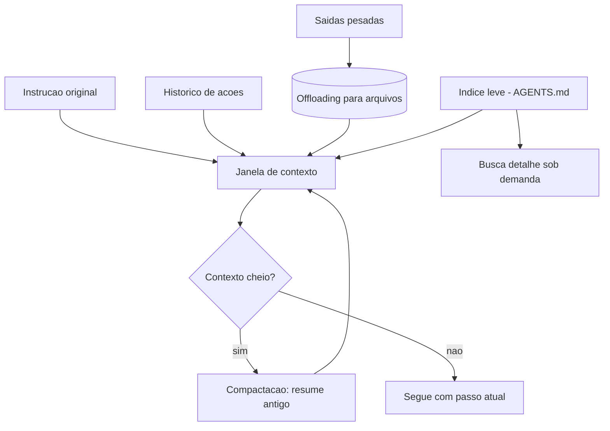
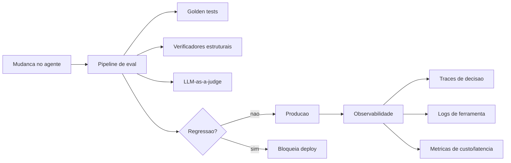

# Gestão de Contexto: Combatendo o Context Rot & Harness em Produção


## Para quem é este e-book

Você já conversou com um agente que "esquece" o que decidiu no começo da tarefa? Ou que repete um passo já feito, contradizendo o próprio trabalho? Isso não é defeito do modelo — é context rot: a degradação da qualidade do contexto conforme a conversa cresce.

Este e-book é para você se:
- você opera agentes em tarefas longas e percebe que eles pioram com o tempo;
- você quer saber como manter o agente no trilho por horas de execução;
- você está subindo um agente para produção e precisa de observabilidade de verdade.

O primeiro capítulo ataca o esquecimento: gestão de contexto, sumarização em marcos, memória de decisões e recuperação sob demanda. O segundo capítulo sobe ao topo da montanha: operar o harness em produção — trilha como infraestrutura de confiança, evals como régua de qualidade e o engenheiro agêntico como novo papel.

## O que você vai levar

Ao terminar, você será capaz de:
- diagnosticar context rot em um agente que piora com o tempo;
- estruturar memória em camadas: contexto imediato, histórico e memória de longo prazo;
- montar a régua de evals com critérios que transformam julgamento em medida;
- desenhar o ciclo de vida do harness: observar, medir, melhorar, reverter;
- configurar o manifesto declarativo e o kill-switch antes do primeiro incidente.

A escalada termina aqui — mas a operação é que decide se o topo vale a vista.


# Gestão de Contexto — Combatendo o Context Rot

## 1. Introdução

No Capítulo 6, você isolou a execução do agente: o motor agora roda em um berço de contenção, com permissões mínimas e trilha de auditoria. Mas há um inimigo que a sandbox não bloqueia — porque ele nasce dentro do próprio agente: a **degradação de contexto**. Tarefas longas começam bem e terminam mal, não porque o modelo ficou menos capaz, mas porque o contexto em que ele raciocina se deteriora a cada iteração: ruído se acumula, instruções antigas são esquecidas, decisões contraditórias se somam.

Ao final deste capítulo, você será capaz de manter um agente focado em tarefas de horas — usando compactação, offloading e divulgação progressiva para gerenciar o que entra na janela, e o loop de revisão interna para garantir que a entrega satisfaça critérios objetivos. Você vai entender por que "jogar tudo no prompt" é a causa mais comum de agentes que se perdem no meio da parede.

## 2. Explica

O **contexto** é a janela de atenção do modelo: tudo o que ele "vê" para raciocinar — a instrução, o histórico de ações e observações, os dados das ferramentas. Essa janela é finita e o seu conteúdo compete: cada token novo empurra informação antiga para fora ou a dilui. Em tarefas longas, esse processo tem um nome e uma mecânica bem documentados: **context rot** — a degradação progressiva da qualidade do raciocínio conforme o contexto se enche de ruído, resumos mal feitos e decisões contraditórias [6]. A anatomia do harness de agentes, descrita por engenheiros que constroem esses sistemas, trata a gestão de contexto como uma das camadas centrais — junto com arquivos, sandboxes e memória [6].

Por que o contexto degrada? Três mecanismos se somam. Primeiro, o **ruído cumulativo**: cada observação de ferramenta entra na janela e, mesmo "útil" na hora, vira lixo depois — o agente raciocina sobre o que é relevante agora, mas a janela está cheia do que foi relevante há uma hora. Segundo, a **perda de instrução**: a instrução original, que estava no topo, vai sendo empurrada para baixo por centenas de tokens de histórico — e o agente passa a otimizar o objetivo mais recente em vez do objetivo real. Terceiro, a **contradição acumulada**: decisões intermediárias registradas no contexto podem se contradizer conforme a informação chega, e o agente, sem distinguir o que é definitivo do que é provisório, oscila [6][19].

As três técnicas canônicas de combate formam um sistema: a **compactação** resume o que já foi feito e substitui o histórico bruto por um resumo — o agente mantém a essência sem o ruído; o **offloading** move dados pesados (saídas de ferramentas, arquivos grandes) para o sistema de arquivos, deixando na janela apenas um ponteiro ou um resumo consultável sob demanda; e a **divulgação progressiva** (progressive disclosure) inverte a lógica de "carregar tudo": o agente começa com um índice leve (um arquivo de instruções, um AGENTS.md) e busca os detalhes apenas quando precisa — em vez de injetar manuais gigantescos no início [6][8]. A curadoria da comunidade de harness engineering cataloga essas técnicas como padrões prontos, com implementações de referência [8].

O contexto de longa duração tem um componente adicional: o **estado persistente**. Lembre do Capítulo 2: o agente *stateful* guarda o estado no mundo (arquivos), não só na janela. A gestão de contexto e o estado persistente trabalham juntos — a janela carrega o que é necessário para o passo atual; o mundo carrega o que precisa sobreviver à tarefa inteira [18]. Execuções autônomas de até seis horas, como as relatadas pela equipe da OpenAI, só são possíveis porque o agente não tenta carregar a tarefa inteira na janela — ele carrega o passo, grava o progresso e retoma do arquivo quando precisa [1].

Por fim, o **loop de revisão interna** — o padrão Ralph Wiggum Loop, documentado na prática de produção: o agente revisa o próprio trabalho, submete a revisores (agentes ou humanos) e itera até satisfazer critérios objetivos, em vez de entregar na primeira tentativa [1]. Esse loop é o complemento natural da gestão de contexto: como o contexto é gerenciado, o agente consegue sustentar as iterações de revisão sem perder o fio — e como a revisão tem critérios, a entrega final é verificada, não apenas "completa".

## 3. Ilustra

Na escalada, a gestão de contexto é a **revisão do mapa no posto de avanço**: a cada trecho conquistado, o escalador para, consulta o mapa (estado persistente), anota o progresso e decide o próximo trecho — em vez de tentar decorar a parede inteira de uma vez. O escalador que tenta "carregar a parede toda na cabeça" confunde os trechos, esquece onde ancorou e repete caminhos. O mapa no bolso (arquivos) e a leitura só do trecho atual (janela) são o que tornam a escalada longa possível.

A dupla camada aqui é necessária porque o ponto mais contraintuitivo é a compactação: as pessoas temem que "resumir" o histórico perca informação importante. A segunda analogia — a **prancheta do maestro em uma ópera de quatro horas**: o maestro não lê a partitura inteira a cada compasso — ele tem a partitura completa no púlpito (arquivos), mas os olhos estão no compasso atual (janela). Quando uma cena termina, ele vira a página (compactação): o que importa da cena anterior é a transição, não cada nota. Se o maestro tentasse manter as quatro horas de partitura na memória de trabalho, erraria o compasso presente. O resumo não perde a ópera — perde o que já cumpriu o papel e mantém o que conecta [6][18].



Como Escalador de Harnesses, você já percebe a pergunta de diagnóstico: **o que acontece com o histórico depois de 50 passos?** Se a resposta é "continua tudo na janela" ou "o agente perde a instrução original", a gestão de contexto não existe — e a tarefa longa vai morrer de ruído.

## 4. Técnica

### A Simulação do Context Rot

Vamos tornar o problema visível antes de resolvê-lo. O bloco abaixo simula o crescimento do contexto em uma tarefa longa e mostra como a instrução original perde espaço para o histórico.

```python
"""Simulacao do context rot: a instrucao original afoga no historico."""

from __future__ import annotations

PESO_INSTRUCAO = 40  # tokens da instrucao original
PESO_PASSO = 25      # tokens por observacao


def contexto_apos(n_passos: int, janela: int) -> dict[str, int]:
    """Retorna a composicao do contexto apos n passos."""
    total = PESO_INSTRUCAO + n_passos * PESO_PASSO
    if total > janela:
        # Instrucao e o primeiro a ser empurrado/truncado.
        espaco_instrucao = max(0, janela - n_passos * PESO_PASSO)
        return {"instrucao": espaco_instrucao, "historico": janela - espaco_instrucao}
    return {"instrucao": PESO_INSTRUCAO, "historico": n_passos * PESO_PASSO}


def main() -> None:
    janela = 1_000
    for passos in [10, 20, 38]:
        composicao = contexto_apos(passos, janela)
        fracao_instrucao = composicao["instrucao"] / janela
        print(f"apos {passos:>2} passos: instrucao={composicao['instrucao']:>4} tokens "
              f"({fracao_instrucao:.0%} da janela) | historico={composicao['historico']:>4}")


if __name__ == "__main__":
    main()
```

Execute e observe o padrão: a instrução original encolhe até virar uma fração mínima da janela — o agente continua "vendo" a instrução, mas ela compete com dezenas de observações que já cumpriram o papel. É essa diluição que produz as decisões erradas de final de tarefa [6].

### A Compactação por Resumo de Blocos

A primeira técnica na prática: quando o histórico cresce demais, resuma blocos antigos e substitua o texto bruto pelo resumo — preservando a essência e liberando a janela.

```python
"""Compactacao de contexto: resume blocos antigos do historico."""

from __future__ import annotations


def resumir_bloco(bloco: list[str]) -> str:
    """Resumo deterministico (em producao: chamada ao LLM)."""
    acoes = [linha.split("->")[0].strip() for linha in bloco if "->" in linha]
    return f"[resumo] acoes realizadas: {', '.join(acoes[:3])} (+{max(0, len(acoes)-3)} outras)"


class ContextoGerenciado:
    def __init__(self, janela_max: int = 100) -> None:
        self.janela_max = janela_max
        self.historico: list[str] = []
        self.resumos: list[str] = []

    def adicionar(self, evento: str) -> None:
        self.historico.append(evento)
        if len(self.historico) > self.janela_max:
            bloco = self.historico[: self.janela_max // 2]
            self.resumos.append(resumir_bloco(bloco))
            self.historico = self.historico[self.janela_max // 2:]

    def contexto_atual(self) -> str:
        partes = list(self.resumos) + list(self.historico)
        return "\n".join(partes[-8:])  # janela efetiva de leitura


def main() -> None:
    gestor = ContextoGerenciado(janela_max=6)
    for i in range(1, 21):
        gestor.adicionar(f"acao_{i} -> resultado_{i}")

    print("Contexto composto (resumos + historico recente):")
    print(gestor.contexto_atual())


if __name__ == "__main__":
    main()
```

Observe a arquitetura: os blocos antigos viram resumos (essência preservada), e o contexto de leitura mostra os resumos + o histórico recente — o agente mantém o fio da tarefa sem carregar os 20 passos brutos [6]. Em produção, o resumo é feito pelo próprio LLM, com a mesma estrutura.

### O Offloading e a Divulgação Progressiva

A segunda e a terceira técnicas: mover o pesado para o sistema de arquivos e injetar só o índice. O bloco abaixo combina as duas: saídas grandes de ferramentas vão para arquivos (ponteiro na janela), e a instrução chega como índice leve, com detalhes buscados sob demanda.

```python
"""Offloading de saidas pesadas + divulgacao progressiva do indice."""

from __future__ import annotations

import json
from pathlib import Path


class ContextoComOffloading:
    def __init__(self, diretorio_dados: str) -> None:
        self.dados = Path(diretorio_dados)
        self.dados.mkdir(exist_ok=True)
        self.indice: list[str] = []

    def armazenar(self, nome: str, conteudo: str) -> str:
        caminho = self.dados / f"{nome}.json"
        caminho.write_text(json.dumps({"conteudo": conteudo}, ensure_ascii=False), encoding="utf-8")
        self.indice.append(f"{nome} -> {caminho.name}")
        # O que volta para a janela e o ponteiro, nao o conteudo bruto.
        return f"[dados em {caminho.name}]"

    def buscar(self, nome: str) -> str:
        caminho = self.dados / f"{nome}.json"
        if not caminho.exists():
            return "nao encontrado"
        dados = json.loads(caminho.read_text(encoding="utf-8"))
        return dados.get("conteudo", "")

    def indice_atual(self) -> str:
        return "\n".join(self.indice[-5:])


def main() -> None:
    contexto = ContextoComOffloading("dados_agente")
    contexto.armazenar("relatorio", "conteudo muito longo de 10 mil tokens...")
    contexto.armazenar("logs", "saida bruta de ferramenta...")

    print("Indice na janela (leve):")
    print(contexto.indice_atual())
    print("\nBusca sob demanda:")
    print(contexto.buscar("relatorio")[:40] + "...")


if __name__ == "__main__":
    main()
```

A combinação é o segredo: o conteúdo pesado mora nos arquivos (offloading), a janela carrega ponteiros (índice), e os detalhes entram só quando o agente decide que precisa (divulgação progressiva) — o oposto exato de "jogar tudo no prompt" [6][8].

### O Ralph Wiggum Loop de Revisão Interna

O complemento final: o agente revisa o próprio trabalho até satisfazer critérios objetivos — com limite de iterações para nunca revisar para sempre.

```python
"""Ralph Wiggum Loop: o agente revisa o proprio trabalho ate o criterio."""

from __future__ import annotations

from dataclasses import dataclass


@dataclass
class Criterios:
    minimo_passos: int = 3
    exige_documentacao: bool = True


def executar_tarefa(tentativa: int) -> dict[str, object]:
    """Simula o agente executando a tarefa (qualidade melhora com iteracoes)."""
    return {
        "passos": 1 + tentativa,
        "documentacao": tentativa >= 1,
        "testado": tentativa >= 2,
    }


def revisar(resultado: dict[str, object], criterios: Criterios) -> tuple[bool, list[str]]:
    falhas: list[str] = []
    if resultado["passos"] < criterios.minimo_passos:
        falhas.append(f"passos insuficientes ({resultado['passos']} < {criterios.minimo_passos})")
    if criterios.exige_documentacao and not resultado["documentacao"]:
        falhas.append("documentacao ausente")
    if not resultado["testado"]:
        falhas.append("sem teste executado")
    return (not falhas, falhas)


def loop_de_revisao(max_iteracoes: int = 5) -> tuple[dict[str, object], int]:
    criterios = Criterios()
    for tentativa in range(1, max_iteracoes + 1):
        resultado = executar_tarefa(tentativa)
        aprovado, falhas = revisar(resultado, criterios)
        print(f"  iteracao {tentativa}: {'APROVADO' if aprovado else 'reprovado - ' + ', '.join(falhas)}")
        if aprovado:
            return resultado, tentativa
    raise RuntimeError("limite de revisao atingido — escalar para humano")


def main() -> None:
    try:
        resultado, iteracoes = loop_de_revisao()
        print(f"\nEntrega aprovada na iteracao {iteracoes}: {resultado}")
    except RuntimeError as erro:
        print(f"\n{erro}")


if __name__ == "__main__":
    main()
```

Repare nos critérios objetivos: "passos suficientes", "documentação presente", "teste executado" — nada de "o agente acha que está bom". É esse loop de revisão com critérios que sustenta execuções autônomas longas e confiáveis, como as que rodam por horas em produção [1].

### O Roteiro de Gestão de Contexto

1. **Meça o crescimento**: instrumente o tamanho do contexto por passo e o ponto em que a instrução perde espaço.
2. **Compacte por blocos**: histórico antigo vira resumo; janela preserva essência sem ruído [6].
3. **Faça offloading do pesado**: saídas de ferramentas e arquivos grandes vão para o FS com ponteiro na janela [6][8].
4. **Divulgue progressivamente**: índice leve (AGENTS.md) + busca sob demanda, nunca manuais gigantescos [8].
5. **Feche com revisão por critérios**: o Ralph Wiggum Loop garante que a entrega satisfaça o contrato, com limite de iterações [1].

## 5. Aplica

### A Cena de Contraste: O Agente Que Se Perdeu na Sexta Hora

Você escalou um agente para migrar um relatório financeiro mensal para um novo formato. A tarefa tem 40 etapas: ler cada planilha, transformar, validar, registrar. Nas primeiras duas horas, o agente trabalha impecável. Na quarta hora, ele começa a "esquecer" o formato de destino: usa a estrutura da primeira planilha na vigésima. Na sexta hora, ele repete uma etapa já concluída — e, ao ser questionado, alega que "nunca tinha feito aquela planilha". O agente não ficou burro; ficou cego: a janela estava cheia de 40 observações brutas, a instrução original tinha sido empurrada para fora do campo de atenção e o progresso estava só na memória volátil da conversa.

O diagnóstico, ligando à teoria: contexto sem gestão — sem compactação (histórico bruto inteiro), sem offloading (planilhas carregadas na janela) e sem estado persistente (progresso só na conversa). A correção prática: adicionar compactação por blocos (a cada 10 passos, resumir), offloading das planilhas para arquivos com ponteiros e um arquivo de progresso gravado a cada etapa. Na execução seguinte, o agente trabalhou as seis horas sem perder o formato de destino — porque o contexto de cada passo era limpo e o progresso vivia no mundo, não na janela [1][6][18].

### Armadilhas Comuns na Gestão de Contexto

- **Jogar tudo no prompt**: o antídoto para "contexto pequeno" que envenena o contexto grande; divulgue progressivamente [6].
- **Histórico bruto infinito**: cada observação fica para sempre, e a instrução se afoga; compacte por blocos [6].
- **Estado só na conversa**: sem arquivos de progresso, uma interrupção ou um retry perde tudo; persista o estado [18].
- **Revisão sem critérios**: "o agente disse que terminou" não é entrega verificada; critérios objetivos + loop de revisão [1].
- **Loop de revisão infinito**: revisar sem limite é o novo retry infinito; limite + escalação [1][19].

### Métricas Que Você Deve Acompanhar

| Métrica | Valor de referência | Fonte |
|---|---|---|
| Execuções únicas de longa duração | até 6 horas | OpenAI [1] |
| Latência como barreira de adoção | 20% | LangChain [12] |
| Equipes com observabilidade | 89% | LangChain [12] |

### A Trilha como Evidência: Auditando uma Execução

A trilha estruturada só cumpre seu papel se alguém — humano ou sistema — souber ler o que ela registra. A prática de auditoria de uma execução de agente segue um roteiro fixo, parecido com a leitura de um log de servidor em produção [12]:

1. **Reconstruir o contexto**: qual era a instrução original, qual política de escopo estava ativa, qual versão do harness rodou.
2. **Seguir a sequência de decisões**: cada ação registrada, na ordem, com o raciocínio que a motivou.
3. **Confrontar observações com resultados**: a ferramenta retornou o que a trilha diz que retornou? Há discrepância entre o registrado e o ocorrido?
4. **Identificar o ponto de desvio**: a primeira ação em que o agente saiu do plano — e o que a levou a sair.
5. **Decidir a ação**: ajustar prompt, endurecer guardrail, corrigir ferramenta ou adicionar teste — nunca "orientar o agente a se comportar melhor" sem evidência [12].

```python
"""Auditoria de trilha: reconstrucao de uma execucao suspeita."""

from __future__ import annotations

from dataclasses import dataclass


@dataclass
class Evento:
    passo: int
    decisao: str
    acao: str


def auditar(eventos: list[Evento], acoes_esperadas: set[str]) -> list[str]:
    desvios: list[str] = []
    for evento in eventos:
        if evento.acao not in acoes_esperadas:
            desvios.append(f"passo {evento.passo}: acao fora do plano ({evento.acao})")
    if not desvios:
        desvios.append("execucao dentro do plano")
    return desvios


def main() -> None:
    esperadas = {"buscar", "ler", "escrever"}
    eventos = [
        Evento(1, "prosseguir", "buscar"),
        Evento(2, "prosseguir", "ler"),
        Evento(3, "prosseguir", "apagar"),  # desvio
    ]
    for linha in auditar(eventos, esperadas):
        print(linha)


if __name__ == "__main__":
    main()
```

A auditoria não é um ritual pós-incidente — é o exercício que revela onde o harness está cego. Quando a reconstrução mostra que o agente agiu fora do plano, o problema raramente é o modelo: é a lacuna entre o que o harness registrou, o que permitiu e o que testou. Cada desvio vira candidato a teste no Capítulo 2 e a guardrail no Capítulo 4 — a trilha é o tecido que conecta os capítulos [12][19].

### Exercícios de Fixação

**Exercício 1 — Registro estruturado.** Implemente um logger que registra cada passo do agente em JSON estruturado: ação, observação resumida, custo estimado e decisão. A trilha estruturada é o que torna o agente auditável — sem ela, o pós-incidente depende de memória [12].

```python
"""Exercicio: trilha estruturada de passos do agente."""

from __future__ import annotations

import json
from datetime import datetime, timezone


class Trilha:
    def __init__(self) -> None:
        self.eventos: list[dict] = []

    def registrar(self, passo: str, decisao: str, custo: float) -> dict:
        evento = {
            "ts": datetime.now(timezone.utc).isoformat(),
            "passo": passo,
            "decisao": decisao,
            "custo": custo,
        }
        self.eventos.append(evento)
        return evento

    def resumo(self) -> str:
        total = sum(e["custo"] for e in self.eventos)
        return json.dumps({"eventos": len(self.eventos), "custo_total": round(total, 4)}, ensure_ascii=False)


def main() -> None:
    trilha = Trilha()
    trilha.registrar("buscar fontes", "prosseguir", 0.002)
    trilha.registrar("escrever relatorio", "finalizar", 0.004)
    print(trilha.resumo())


if __name__ == "__main__":
    main()
```

**Exercício 2 — Caça à causa raiz.** Usando a trilha do Exercício 1, simule um incidente: o agente executou um comando inesperado. Percorra os eventos e identifique a sequência exata de decisões que levou ao desvio — e o ponto em que um gate do Capítulo 4 teria parado a execução.

**Exercício 3 — Métricas do arnês.** Defina três métricas para o seu harness (por exemplo: taxa de sucesso por tarefa, custo médio por tarefa, tempo médio de execução). Registre-as por uma semana e apresente a tendência em uma tabela. A métrica só tem valor quando é acompanhada — o que o Estado da Engenharia de Agentes mostra com 89% das equipes priorizando observabilidade [12].

## 6. Conclusão

Você venceu o inimigo silencioso do agente. Recapitulando os três pontos centrais: o **context rot é a degradação progressiva da janela** — ruído acumulado, instrução esquecida, contradições somadas [6][19]; as **três técnicas de gestão — compactação, offloading e divulgação progressiva — mantêm a janela limpa e o fio condutor vivo** [6][8]; e o **loop de revisão por critérios objetivos** transforma a entrega do agente em entrega verificada, sustentando execuções de horas [1].

O desafio para você: pegue a tarefa longa do seu agente (ou a migração de relatório da cena) e implemente as quatro peças — medição, compactação, offloading e revisão por critérios. Depois, rode a tarefa até o fim e observe a diferença. Com o foco sustentado, falta só o último trecho da escalada: no Capítulo 8, você vai levar o harness para produção — observabilidade, evals e o novo papel do engenheiro que desenha ambientes em vez de escrever código.

# Harness em Produção — Observabilidade, Evals e o Engenheiro Agêntico

## 1. Introdução

Nos sete primeiros capítulos, você escalou a parede inteira: entendeu a equação Agente = Modelo + Harness (Capítulo 1), abriu a anatomia do harness (Capítulo 2), instalou a âncora dos testes (Capítulo 3), o capacete dos guardrails (Capítulo 4), o motor do loop (Capítulo 5), o berço de contenção (Capítulo 6) e a gestão de foco (Capítulo 7). O equipamento está completo — mas equipamento completo não é sistema em produção. Faltam duas coisas: saber o que o agente está fazendo enquanto trabalha e saber se ele está ficando melhor ou pior com o tempo.

Ao final deste capítulo — e da obra — você será capaz de operar um harness em produção: instrumentar o agente com observabilidade, proteger o comportamento com evals que funcionam como testes de regressão e ocupar o novo papel do engenheiro agêntico, que desenha ambientes e especifica intenção em vez de escrever cada linha de código. A escalada termina no cume: você não é mais o escalador que sobe — é o guia que desenha a rota para outros escalarem.

## 2. Explica

Um harness em produção tem uma propriedade que nenhum capítulo anterior entrega isoladamente: **visibilidade contínua**. Durante o desenvolvimento, você testa e observa por amostragem; em produção, o agente trabalha sozinho, em escala, e você só descobre o problema depois que ele custa caro — a menos que o harness esteja instrumentado. A pesquisa de mercado é inequívoca sobre a prioridade: 89% das organizações com agentes em produção já têm observabilidade, e 62% usam tracing detalhado de passos e chamadas de ferramentas [12]. Observabilidade é o item mais adotado da maturidade agêntica — porque é o pré-requisito de todo o resto.

O que se observa em um harness? Três dimensões complementares. **Traces** reconstroem o raciocínio: a sequência de decisões, ações e observações de uma execução — o "porquê" de cada passo. **Logs** registram eventos atômicos: chamadas de ferramenta, arquivos acessados, erros capturados — o "o quê" de cada ação. **Métricas** agregam números: custo por tarefa, latência por passo, taxa de sucesso por tipo de tarefa — o "quanto" do sistema. As três juntas transformam o agente de caixa preta em sistema auditável — a mesma trilha de auditoria do Capítulo 6, elevada a telemetria contínua [12][19].

A segunda fundação da operação é o **eval**: um conjunto de casos de teste com resultado esperado que mede o comportamento do agente de forma determinística — o test harness do Capítulo 3, aplicado em escala e de forma contínua. Enquanto a observabilidade diz "o que está acontecendo", o eval diz "o comportamento está correto?" — e, mais importante, "o comportamento está *ainda* correto depois da minha mudança?". O eval é o **teste de regressão do agente**: você muda o prompt, a ferramenta ou o modelo, roda o eval, e sabe em minutos se a mudança melhorou ou piorou o comportamento [5][12]. A pesquisa mostra que apenas 52% das equipes têm evals formais — um gap enorme, dado que a qualidade dos outputs é a principal barreira de produção (32%) [12].

Os evals usam três mecanismos de verificação, do mais ao menos determinístico. **Golden tests** comparam a saída com uma referência aprovada por humanos (o padrão do Capítulo 3). **Verificadores estruturais** checam propriedades — schema, presença de campos, ausência de proibições. E o **LLM-as-a-judge** usa um segundo modelo para pontuar a qualidade quando não há resposta exata — com o risco conhecido de viés do julgador, que precisa ser calibrado contra avaliações humanas [5][19]. A combinação dos três cobre o espectro: o determinístico para o que é verificável, o estrutural para o que é contratual e o inferencial para o que é qualitativo.

A terceira fundação é o **papel do engenheiro**. A equipe da OpenAI que construiu um produto com cerca de um milhão de linhas de código geradas por agentes descreve a transformação com precisão: quando o código é escrito por agentes, o trabalho do engenheiro deixa de ser escrever código e passa a ser **desenhar ambientes, especificar intenção e construir loops de feedback** que tornam o trabalho dos agentes confiável [1]. Isso não é futurismo — é a descrição de quem já opera assim: a produtividade de 3,5 pull requests por engenheiro por dia não vem do modelo; vem do harness que o engenheiro desenhou [1]. E o paradoxo DORA fecha o argumento: IA sem disciplina de engenharia melhora o indivíduo e piora a entrega; IA dentro de um harness bem desenhado melhora os dois [9].

## 3. Ilustra

Na escalada, a operação em produção é a **central de monitoramento da via**: depois que a rota foi equipada, alguém precisa acompanhar cada escalador em tempo real — onde está, se o equipamento está prendendo, se o tempo está virando. A central (observabilidade) vê os pontos de avanço (traces), recebe os alertas de rádio (logs) e acompanha os números de subidas e quedas (métricas). E, antes de cada temporada, a equipe **treina os guias em via simulada** (evals): novos guias (versões do agente) passam pelos mesmos trechos, e só os que completam com segurança sobem a via real. Nenhuma central séria deixa um guia novo ir direto para a montanha sem o treino medido — e nenhum harness sério deixa uma mudança ir para produção sem o eval.

A dupla camada aqui é necessária porque o ponto mais contraintuitivo é o eval como teste de regressão: as pessoas tratam avaliação de IA como "medir quão inteligente é", algo que se faz uma vez. A segunda analogia — o **check-up periódico do atleta**: o atleta (agente) não faz o check-up para saber "se é bom" — faz para saber se o treino novo (mudança) melhorou ou piorou o desempenho, e para detectar lesões (regressões) antes que virem crônicas. O check-up não é um veredito; é um **monitoramento de tendência**. O eval funciona igual: o número absoluto importa menos que a direção — cada mudança roda o mesmo check-up e a pergunta é sempre "melhorou ou piorou?" [5][12]. O LLM-as-a-judge é o fisioterapeuta experiente que avalia a biomecânica (qualidade subjetiva) — mas só depois que os exames objetivos (golden tests) passaram.



Como Escalador de Harnesses — agora promovido a guia —, você já percebe a pergunta final de operação: **o que acontece quando alguém muda o agente?** Se a resposta é "vai para produção e a gente vê", o harness não está em produção; está em apostas. A resposta certa é: "roda o eval, e só vai se não houver regressão".

## 4. Técnica

### O Emissor de Métricas do Agente

Vamos instrumentar o loop do Capítulo 5. O bloco abaixo adiciona métricas estruturadas por passo — custo, latência e resultado — que alimentam o painel de operação.

```python
"""Telemetria do agente: metricas estruturadas por passo."""

from __future__ import annotations

import json
import time
from dataclasses import asdict, dataclass, field


@dataclass
class MetricaPasso:
    passo: int
    acao: str
    latencia_ms: float
    custo_tokens: int
    resultado: str


class Telemetria:
    def __init__(self) -> None:
        self.metricas: list[MetricaPasso] = []

    def registrar(self, metrica: MetricaPasso) -> None:
        self.metricas.append(metrica)

    def custo_total(self) -> int:
        return sum(m.custo_tokens for m in self.metricas)

    def latencia_media(self) -> float:
        if not self.metricas:
            return 0.0
        return sum(m.latencia_ms for m in self.metricas) / len(self.metricas)

    def exportar(self, caminho: str) -> None:
        with open(caminho, "w", encoding="utf-8") as arquivo:
            json.dump([asdict(m) for m in self.metricas], arquivo, ensure_ascii=False, indent=2)


def main() -> None:
    telemetria = Telemetria()
    for passo, acao in enumerate(["raciocinar", "usar_calculadora", "finalizar"], start=1):
        inicio = time.time()
        time.sleep(0.01)
        telemetria.registrar(MetricaPasso(
            passo=passo,
            acao=acao,
            latencia_ms=round((time.time() - inicio) * 1000, 1),
            custo_tokens=250,
            resultado="ok",
        ))

    print(f"Metricas: custo_total={telemetria.custo_total()} tokens, "
          f"latencia_media={telemetria.latencia_media():.1f} ms")
    print(f"Passos: {len(telemetria.metricas)}")


if __name__ == "__main__":
    main()
```

A telemetria é a trilha de auditoria do Capítulo 6 em formato agregável: cada passo gera um evento estruturado que soma custo e latência — e o painel de operação responde em segundos à pergunta "quanto este agente está custando por tarefa?" [12][19].

### O Eval de Regressão do Comportamento

O teste de regressão do agente: um dataset de casos com resultado esperado, pontuação automática e veredito de regressão. O bloco abaixo implementa o pipeline completo.

```python
"""Eval de regressao: pontua um lote de casos e reporta melhora/piora."""

from __future__ import annotations

from dataclasses import dataclass


@dataclass
class Caso:
    prompt: str
    esperado: str


def resposta_do_agente(prompt: str) -> str:
    """Simula o agente em versao nova (em producao: harness real)."""
    if "resumir" in prompt:
        return "resumo_curto_sem_ponto"
    return "resposta_generica"


def avaliar(caso: Caso) -> bool:
    resposta = resposta_do_agente(caso.prompt)
    return resposta == caso.esperado or caso.esperado in resposta


def rodar_eval(dataset: list[Caso]) -> dict[str, object]:
    acertos = sum(1 for caso in dataset if avaliar(caso))
    return {"acertos": acertos, "total": len(dataset), "taxa": acertos / len(dataset)}


def main() -> None:
    dataset = [
        Caso("resumir relatorio financeiro", "resumo_curto_sem_ponto"),
        Caso("resumir relatorio de vendas", "resumo_curto_sem_ponto"),
        Caso("calcular ticket medio", "resposta_generica"),
    ]
    resultado = rodar_eval(dataset)
    print(f"Eval: {resultado['acertos']}/{resultado['total']} "
          f"({resultado['taxa']:.0%})")

    # Gate de regressao: a nova versao precisa manter a taxa minima.
    if resultado["taxa"] >= 0.66:
        print("Veredito: sem regressao — liberado para producao")
    else:
        print("Veredito: REGRESSAO — bloqueado")


if __name__ == "__main__":
    main()
```

Esse é o ciclo de operação: mudou o agente → rodou o eval → decidiu com número, não com impressão. O gate de regressão (0,66 no exemplo) é o mesmo conceito do gate de CI do Capítulo 3, aplicado ao comportamento [5][12].

### O Manifesto Declarativo do Harness

O engenheiro agêntico desenha ambientes — e o artefato do desenho é um manifesto declarativo: a configuração do harness em um único arquivo, versionável e auditável [18][19].

```python
"""Manifesto declarativo do harness: a configuracao do sistema agêntico."""

from __future__ import annotations

import json


def validar_manifesto(manifesto: dict[str, object]) -> tuple[bool, list[str]]:
    falhas: list[str] = []
    if not manifesto.get("objetivo"):
        falhas.append("objetivo ausente")
    ferramentas = manifesto.get("ferramentas", [])
    if not isinstance(ferramentas, list) or not ferramentas:
        falhas.append("lista de ferramentas vazia")
    if not manifesto.get("guardrails", {}).get("proibidas"):
        falhas.append("guardrails sem acoes proibidas")
    if not manifesto.get("evals"):
        falhas.append("evals ausentes")
    return (not falhas, falhas)


def main() -> None:
    manifesto = {
        "objetivo": "consolidar relatorios mensais",
        "ambiente": "sandbox:workspace-agente",
        "ferramentas": ["ler-arquivo", "api:bi"],
        "guardrails": {"proibidas": ["deletar", "deploy"], "sensiveis": ["escrever-fora"]},
        "evals": ["dataset-relatorios-v3"],
        "limite_custo_por_tarefa_tokens": 5_000,
    }

    valido, falhas = validar_manifesto(manifesto)
    print("Manifesto do harness:")
    print(json.dumps(manifesto, ensure_ascii=False, indent=2))
    print("\nValido:", "SIM" if valido else f"NAO — {', '.join(falhas)}")


if __name__ == "__main__":
    main()
```

O manifesto é o contrato entre o engenheiro e o harness: descreve o objetivo, o ambiente, as ferramentas, os guardrails e os evals — e o harness valida a configuração antes de aceitar o desenho. Esse é o trabalho do engenheiro agêntico: não escrever a tarefa, mas **escrever o sistema que executa a tarefa com segurança** [1][5].

### O Roteiro de Operação em Produção

1. **Instrumente desde o primeiro dia**: traces, logs e métricas no ponto de execução — nunca adicione observabilidade depois do incidente [12].
2. **Construa o dataset de eval**: casos reais com resultado esperado, cobrindo os caminhos críticos da tarefa [5].
3. **Rode o eval a cada mudança**: prompt, ferramenta ou modelo novos passam pelo mesmo check-up; bloqueie regressão [12].
4. **Combine verificadores**: golden tests para o determinístico, estruturais para o contratual, LLM-as-a-judge para o qualitativo — calibrado contra humanos [5][19].
5. **Desenhe por manifesto**: a configuração do harness em arquivo versionável, com gates de validade [1].

## 5. Aplica

### A Cena de Contraste: A Mudança Que Ninguém Mediu

Você mantém um agente de atendimento que responde dúvidas de clientes sobre status de pedidos. Ele funciona bem há meses. Uma sexta-feira, o fornecedor do modelo anuncia uma versão nova "mais rápida"; alguém troca o modelo no arquivo de configuração e faz deploy na mesma tarde. Na segunda-feira, o agente continua respondendo — mas o tom mudou, e três respostas críticas sobre prazos de entrega saíram otimistas demais, gerando reclamações. O agente não "quebrou" — **regrediu silenciosamente**, e ninguém percebeu porque nenhuma medição acompanhava a mudança. O custo não foi a troca do modelo; foi a ausência do eval que teria dito, em minutos, que o comportamento tinha mudado [12].

O diagnóstico, ligando à teoria: faltava o ciclo mudança→eval→decisão. A correção prática: montar o dataset de eval com os casos críticos (prazos, tom, precisão), plugar o gate de regressão no deploy (a nova versão só sobe se mantiver a taxa) e ativar a telemetria de tom/custo por resposta. Na semana seguinte, a mesma troca de modelo foi feita — o eval reprovou, o deploy foi bloqueado e o time decidiu com número, não com pressa [5][12].

### Armadilhas Comuns na Operação do Harness

- **Observabilidade depois do incidente**: instrumentar a caixa preta quando ela já custou caro é o padrão mais caro do mercado; instrumente no primeiro dia [12].
- **Eval de uma vez só**: medir o agente uma vez e nunca mais é tirar foto de quem precisa de exame periódico; eval é monitoramento de tendência [5].
- **LLM-as-a-judge sem calibração**: o julgador tem viés; sem conferência humana periódica, o eval mede o viés do julgador [19].
- **Deploy sem gate de regressão**: mudança que vai para produção sem check-up é aposta; bloqueie a regressão [12].
- **Engenheiro que só escreve código**: no mundo agêntico, quem não desenha ambiente e especifica intenção vira gargalo — o harness é o produto do engenheiro [1].

### Métricas Que Você Deve Acompanhar

| Métrica | Valor de referência | Fonte |
|---|---|---|
| Equipes com observabilidade | 89% | LangChain [12] |
| Equipes com evals formais | 52% | LangChain [12] |
| PRs por engenheiro por dia (equipe agêntica) | 3,5 | OpenAI [1] |
| Qualidade como barreira de produção | 32% | LangChain [12] |

### O Harness como Produto: Ciclo de Vida da Obra em Produção

O harness não é um projeto com fim — é um produto com ciclo de vida. Quando a obra entra em produção, o time passa a operar em iterações curtas de melhoria, e cada iteração segue o mesmo arco de engenharia que você aprendeu nos capítulos anteriores [9][12]:

1. **Observar produção**: a trilha do Capítulo 7 revela onde o agente gasta, erra ou trava.
2. **Formular hipótese**: "a taxa de sucesso cai quando a tarefa exige três ferramentas encadeadas".
3. **Reproduzir em teste**: transformar a observação em caso de teste determinístico (Capítulo 2).
4. **Mudar o harness**: ajustar prompt, ferramenta, guardrail ou política de execução.
5. **Medir o efeito**: rodar o benchmark do Capítulo 3 e comparar antes/depois.
6. **Reverter se piorar**: o rollback da mudança é tão importante quanto a mudança — sem ele, cada iteração arrisca a produção.

```python
"""Ciclo de vida: decidir manter ou reverter uma mudanca de harness."""

from __future__ import annotations

from dataclasses import dataclass


@dataclass
class Experimento:
    nome: str
    antes: float
    depois: float


def decidir(experimento: Experimento, margem_minima: float = 0.02) -> str:
    melhoria = experimento.depois - experimento.antes
    if melhoria >= margem_minima:
        return f"manter {experimento.nome} (melhoria de {melhoria:.0%})"
    return f"reverter {experimento.nome} (melhoria de {melhoria:.0%} abaixo da margem)"


def main() -> None:
    experimentos = [
        Experimento("novo_prompt", 0.71, 0.78),
        Experimento("guardrail_mais_restrito", 0.74, 0.72),
    ]
    for experimento in experimentos:
        print(decidir(experimento))


if __name__ == "__main__":
    main()
```

Esse ciclo é o que separa o harness que melhora com o tempo do harness que envelhece com o tempo. As equipes que prosperam com agentes tratam o harness como um produto — com fila de melhorias, métricas e reuniões de revisão — não como uma tarefa concluída na semana do projeto [9][12]. A disciplina do DORA se aplica aqui integralmente: pequenas mudanças frequentes, feedback rápido e reversão barata são o que permitem evoluir sem medo.

### Exercícios de Fixação

**Exercício 1 — Runbook de incidente.** Escreva um runbook de 10 passos para um incidente de agente em produção: detecção, contenção, diagnóstico, correção e pós-incidente. Inclua o comando de kill-switch (pausar execuções), o acesso à trilha estruturada do Capítulo 7 e o critério de reabertura — a operação de harness é uma disciplina de runbook, não de improviso [12][19].

```python
"""Exercicio: kill-switch para pausar execucoes do agente."""

from __future__ import annotations

from dataclasses import dataclass


@dataclass
class Execucao:
    id: str
    ativa: bool = True


class PainelControle:
    def __init__(self) -> None:
        self.execucoes: list[Execucao] = []
        self.pausado = False

    def registrar(self, execucao: Execucao) -> None:
        self.execucoes.append(execucao)

    def kill_switch(self) -> None:
        self.pausado = True
        for execucao in self.execucoes:
            execucao.ativa = False

    def status(self) -> str:
        ativas = sum(1 for e in self.execucoes if e.ativa)
        return f"pausado={self.pausado} execucoes_ativas={ativas}/{len(self.execucoes)}"


def main() -> None:
    painel = PainelControle()
    painel.registrar(Execucao("run-1"))
    painel.registrar(Execucao("run-2"))
    print("antes:", painel.status())
    painel.kill_switch()
    print("depois:", painel.status())


if __name__ == "__main__":
    main()
```

**Exercício 2 — Custo e aprovação.** Defina o limiar de custo que dispara aprovação humana na sua operação (por exemplo, execução acima de R$ X ou acima de N iterações). Documente o fluxo: quem aprova, com que evidência da trilha e em quanto tempo. O limiar transforma o custo em controle — a recomendação de cancelar projetos sem retorno claro que a Gartner publicou é o avesso dessa disciplina [10].

**Exercício 3 — Plano de rollback.** Liste os artefatos que o agente pode modificar (arquivos, banco, deploys) e, para cada um, o mecanismo de reversão disponível antes de liberar a execução autônoma. Se um artefato não tiver rollback, ele não deveria ser editável por agente sem aprovação humana [19][20].

## 6. Conclusão

Você chegou ao cume. Recapitulando os três pontos centrais deste capítulo — e da obra inteira: a **observabilidade transforma o agente de caixa preta em sistema auditável** — traces, logs e métricas no ponto de execução [12][19]; os **evals são o teste de regressão do comportamento** — cada mudança passa pelo mesmo check-up, e a regressão bloqueia o deploy [5][12]; e o **engenheiro agêntico desenha ambientes e especifica intenção** — o harness é o produto, e o modelo é o executor [1].

A escalada que começou no Capítulo 1 — Agente = Modelo + Harness — termina com você do outro lado da equação: não o escalador que sobe, mas o guia que equipa a via. Recapitulando os oito equipamentos instalados: a equação (1), a anatomia (2), a âncora dos testes (3), o capacete dos guardrails (4), o motor do loop (5), o berço da contenção (6), a gestão de foco (7) e a central de operação (8). O desafio final para você: projete o harness completo do zero para uma tarefa real — manifesto, ferramentas, guardrails, evals e telemetria — e rode-a em produção. O cume não é o fim da rota; é o ponto onde você começa a desenhar as suas próprias.

# Próximos Passos

Este e-book é um recorte de **Harness Engineering: Do Modelo ao Sistema Autônomo Confiável** — o livro completo, com os oito capítulos, código executável, exercícios e referências.


## Para se aprofundar

Três recursos para quem quer dominar a operação em produção:

- **State of Agent Engineering 2026** (LangChain) — o relatório com os dados de adoção de agentes em produção, incluindo a prioridade de observabilidade. Disponível em langchain.com/state-of-agent-engineering.
- **Accelerate State of DevOps Report 2024** (DORA) — o relatório clássico de práticas de engenharia mensuráveis, base do ciclo de melhoria contínua. Disponível em dora.dev/research/2024/dora-report/.
- **Code as Agent Harness** — a proposta acadêmica de sistemas agênticos executáveis, verificáveis e com estado. Disponível em arxiv.org/html/2605.18747v1.

