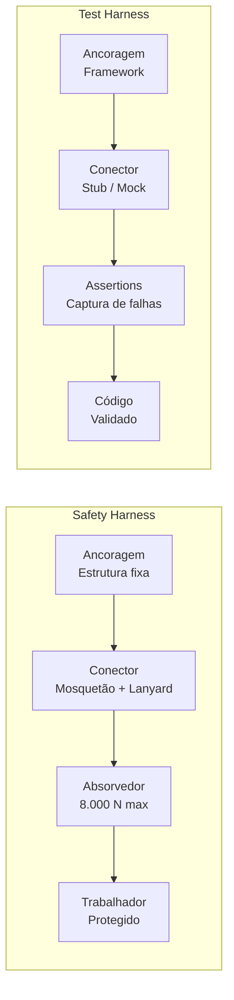

# Capítulo 1: A Metáfora da Alavanca: O Que É um Harness?

## 1. Introdução

Imagine que você está a 30 metros de altura, em cima de uma torre de telecomunicação, e o vento começa a soprar forte. Nesse instante, o único que separa você do chão é um cinturão de fibras sintéticas preso a um cabo de aço. Esse equipamento — o *harness* de segurança — não é apenas uma peça de tecido: é uma alavanca que amplifica sua capacidade de trabalhar em altura enquanto absorve o risco de uma queda. Agora pense em outro cenário: um desenvolvedor de software pressiona o botão de deploy em produção às sexta-feira à noite, confiante de que seus testes automatizados vão capturar qualquer erro antes que ele cause um apagão. Esse conjunto de testes — o *test harness* — faz exatamente a mesma coisa: amplifica a velocidade de entrega enquanto protege contra falhas. Um conceito, dois mundos. E é exatamente isso que vamos desmontar neste capítulo.

A palavra "harness" pode parecer restrita a obras civis ou equipamentos de segurança, mas seu significado é muito mais amplo. Neste primeiro capítulo, vamos mergulhar na origem da palavra, entender o que ela realmente significa em diferentes domínios e, mais importante, construir uma lente conceitual que vai guiar todo o resto desta obra. Ao final, você vai enxergar o *harness* não como uma ferramenta isolada, mas como um padrão universal de alavancagem com proteção — e vai começar a pensar como um Engenheiro de Harness.

## 2. Explica

### Origem etimológica e domínios de uso

A palavra *harness* vem do francês antigo *harnais*, que originalmente designava o conjunto de peças de armadura usada por cavaleiros medievais — as almanças, o peitoral, as rédeas. Ou seja, desde sua origem, *harness* já significava algo que **prende, conecta e protege** ao mesmo tempo [1]. Com o tempo, o termo migrou para o vocabulário equestre (arnês de cavalo) e, séculos depois, para a engenharia de segurança industrial, onde se tornou o nome padrão para o equipamento de proteção individual contra quedas [2].

Mas o fenômeno não parou na engenharia civil. Na década de 1960, com o nascimento da engenharia de software, programadores开始 a usar o termo *test harness* para descrever o conjunto de ferramentas, stubs e drivers que permitem testar um componente de software fora de seu ambiente de produção [3]. A metáfora era tão poderosa que pegou: hoje, qualquer framework de teste — de JUnit a pytest — é informalmente chamado de *harness* [4].

O que conecta esses usos? Em todos os domínios, um harness é um **dispositivo de alavancagem com proteção embutida**. Ele permite que você faça algo que seria perigoso ou impossível sem ele, ao mesmo tempo em que minimiza os riscos associados. Essa é a essência do conceito que vamos explorar ao longo de todo o livro [5].

### Anatomia de um harness: âncora + amplificação + proteção

Todo harness, independentemente do domínio, possui três componentes fundamentais:

1. **Ancoragem (ancora)**: o ponto fixo ao qual o harness está conectado. No safety harness, é a estrutura de concreto ou aça que resiste a uma carga de 22,2 kN (5.000 libras-force) conforme a norma ANSI Z359.1 [6]. No test harness, é o framework de teste que fornece o ambiente controlado — o JUnit, o pytest, o xUnit [4].

2. **Amplificação**: a capacidade que o harness concede ao usuário. O safety harness permite que um trabalhador suba em alturas que seriam inacessíveis sem proteção. O test harness permite que um desenvolvedor execute milhares de testes automatizados em minutos, algo que seria manualmente impossível [7].

3. **Proteção**: o mecanismo que absorve ou contém o risco quando algo dá errado. No safety harness, é o absorvedor de energia que limita a força máxima no corpo a 1.800 libras-force (8.000 N) [2]. No test harness, são as断言(assertions) que capturam falhas antes que elas cheguem à produção [3].

Essa anatomia é universal. Se você consegue identificar âncora, amplificação e proteção em qualquer sistema, você está olhando para um harness — mesmo que ele não se chame assim [5].

### Mapeamento entre safety harness e test harness

| Componente | Safety Harness | Test Harness |
|---|---|---|
| **Ancoragem** | Estrutura fixa (concreto/aço) | Framework de teste (JUnit, pytest) |
| **Conector** | Mosquetão, lanyard | Stub, mock, driver |
| **Absorvedor** | Shock absorber (limita a 8.000 N) | Assertions (capturam falhas) |
| **Cinturão** | Full body harness (ABCDE) | Suite de testes organizada |
| **Plano de emergência** | Protocolo de resgate | Rollback, feature flag |

A OSHA (Occupational Safety and Health Administration) define que o sistema pessoal de travamento de queda (PFAS) é composto por cinco elementos — ABCDE: Ancoragem, Body harness, Connector, Deceleration device e Emergency plan [6]. Quando olhamos para um test harness, vemos exatamente a mesma estrutura: uma âncora (o framework), um conector (stubs/mocks), um absorvedor de impacto (assertions), uma estrutura de suporte (a suíte de testes) e um plano de contingência (rollback) [3][8].

## 3. Ilustra

### A forca e a alavanca: a metáfora que une dois mundos

Pense na imagem clássica de Arquimedes: "Dêem-me um ponto de apoio e moverei o mundo." Uma alavanca é exatamente isso — um dispositivo que amplifica força usando um ponto fixo. Agora imagine que essa alavanca tem um botão de *emergency stop* embutido: se algo der errado, ela trava instantaneamente e impede que o peso caia. Esse é o harness — uma alavanca com proteção [9].

Na engenharia de segurança, o safety harness é literalmente uma alavanca: ele usa a ancoragem como ponto de apoio, a gravidade como força resistente, e o trabalhador como força motriz. O conector (mosquetão + lanyard) é a barra da alavanca. E o absorvedor de energia é o mecanismo fail-safe que impede que a força aplicada ao corpo ultrapasse o limite seguro [2][6].

No software, o test harness funciona da mesma forma. O framework de teste é o ponto de apoio, os dados de teste são a carga, e o código sendo testado é o objeto que se move. As断言 são o mecanismo de proteção: quando algo sai do esperado, elas "travam" a execução e reportam a falha antes que ela cause danos em produção [3][4].



A bela sacada é que, em ambos os casos, a estrutura não é um excesso de cautela — é o que permite que a alavanca funcione. Sem o ponto de apoio (ancoragem), não há alavancagem. Sem a proteção (absorvedor), a alavanca é perigosa. E sem a amplificação (o trabalho que se permite fazer), não vale a pena montar a estrutura [5][9].

## 4. Técnica

### Tabela Comparativa: Safety Harness (Físico) vs. Software Harness (Digital)

Para consolidar a analogia central deste capítulo — e fornecer uma referência rápida que permeia todo o livro — apresentamos uma análise detalhada de dez dimensões que conectam o equipamento de segurança industrial ao framework de teste de software. Cada dimensão compartilha um princípio de engenharia comum, mas se manifesta de formas distintas nos dois domínios [5][6][8].

| Dimensão | Safety Harness (Físico) | Software Harness (Digital) | Princípio Comum |
|---|---|---|---|
| **Ancoragem** | Ponto de fixação estrutural (concreto, aço) que resiste a carga mínima de 22,2 kN (5.000 lbf) conforme ANSI Z359.1. Inclui pontos de ancoragem individuais, intermediários e de resgate, cada um certificado e rastreado [6]. | Framework ou plataforma que fornece o ambiente controlado de execução (JUnit, pytest, xUnit, Playwright). Inclui configuração de banco de dados de teste, mocks e fixtures isolados do estado real [3][4]. | Todo sistema de segurança requer um ponto fixo que não falha — a âncora é a condição *sine qua non* da proteção. |
| **Absorção de Impacto** | Dispositivo de desaceleração (shock absorber, lanyard energético) que limita a força máxima no corpo a 8.000 N (1.800 lbf). Em queda livre de 1,8 m, reduz o pico de força de ~12 kN para abaixo de 8 kN, prevenindo trauma torácico [2][13]. | Assertions e断言 que capturam desvios entre comportamento esperado e real. Cada falha é "absorvida" antes de propagar para ambientes seguintes (staging, produção), evitando impacto no usuário final [3][7]. | Reduzir a energia do impacto antes que atinja o sistema protegido — seja o corpo humano ou código em execução. |
| **Inspeção** | Inspecção diária antes do uso (verificação visual de costuras, mosquetões, absorvedores). Inspecção periódica anual por profissional habilitado. Equipamento danificado é descartado imediatamente, sem exceção [6][14]. | Code review, linting estático e pipeline de CI/CD que inspecionam cada commit. Análise de cobertura de código e mutação testing verificam a eficácia do próprio harness — o harness testa a si mesmo [4][16]. | Verificação contínua e periódica do equipamento/sistema para garantir que está funcional antes de ser necessário. |
| **Redundância** | Trabalho em altura exige dupla ancoragem: dois pontos de ancoragem independentes conectados simultaneamente. Backup de resgate independente do sistema primário. Protocolo de auto-rescate [6][8]. | Testes em camadas: unitários → integração → E2E → contrato. Feature flags como interruptor de emergência. Rollback automático como plano B. Nenhuma camada é suficiente sozinha [3][11]. | Nunca depender de um único ponto de falha — sempre haver um sistema alternativo que entre em ação se o primário falhar. |
| **Certificação** | Equipamento certificado por organismos como ANSI (Z359), CSA (Z259), EN (361, 362, 363). Cada componente rastreado por número de série e data de fabricação [6][14]. | Frameworks maduros com versionamento semântico, changelogs detalhados e compliance com padrões reconhecidos (ISO 25010 para qualidade, OWASP para segurança de aplicações) [12][18]. | Conformidade verificável por terceiros independentes que atestam que o sistema atende aos padrões de segurança. |
| **Treinamento** | Capacitação obrigatória: curso de 40h para trabalhadores em altura (NR-35 no Brasil). Treinamento prático com simulação de queda. Reciclagem bienal [6][8]. | Capacitação do time em práticas de teste: TDD, BDD, contract testing. Onboarding com Pair Programming e mentorias. Documentação viva (READMEs, ADRs) que reduz a curva de aprendizado [4][16]. | A ferramenta só protege se quem a usa entende como operá-la corretamente — investir em conhecimento é investir em segurança. |
| **Falha em Modo Seguro** | Em caso de falha estrutural, o sistema entra em modo de travamento automático (bloqueio do mosquetão). Se a âncora cede, o absorvedor de energia entra em ação. Se tudo falhar, o plano de resgate é ativado como último recurso [2][6]. | Em caso de falha, a pipeline de CI/CD bloqueia o deploy (*fail-closed*). Feature flags desabilitam funcionalidades problemáticas. Rollback automático restaura a versão estável anterior sem intervenção manual [3][11]. | O estado padrão após uma falha deve ser o estado mais seguro possível — não o estado de operação. |
| **Rastreabilidade** | Cada equipamento possui número de série, data de fabricação, data de última inspeção e histórico de uso. Registros mantidos por no mínimo 5 anos conforme OSHA 1926.502 [8][13]. | Logs de execução de cada teste, histórico de builds no CI/CD, métricas de cobertura ao longo do tempo. Trace completo de commits com IDs de issue e links para pull requests [4][16]. | Cada evento de segurança deve ser rastreável no tempo — quem, quando, o que aconteceu e o que foi feito sobre isso. |
| **Escalabilidade** | Harnesses ajustáveis para diferentes tamanhos e pesos (S a XL). Sistemas de ancoragem modulares que se adaptam a diferentes estruturas: torres, edifícios, pontes [6]. | Suítes de testes parametrizáveis que cobrem múltiplos cenários com uma única função. Testes paralelizáveis em CI/CD. Contratos de API que validam integrações entre times independentes [4][7]. | O sistema de proteção deve crescer e se adaptar sem perder eficácia — proteção que não escala é proteção temporária. |
| **Cultura de Segurança** | Segurança como valor institucional: briefings diários (*toolbox talks*), incentivo a reporte de *near misses*, investigação raiz de cada incidente sem atribuição de culpa [6][8]. | Qualidade como responsabilidade de todos: *shift-left testing*, *blameless post-mortems*, cultura de melhoria contínua. Equipe inteira envolvida na manutenção e evolução do harness [4][16]. | A proteção não é apenas técnica — é cultural. Quando todos internalizam a importância da segurança, o sistema inteiro se fortalece. |

A tabela acima revela que a relação entre safety harness e software harness não é uma mera analogia poética — é uma **isomorfia de engenharia**. Cada dimensão opera segundo o mesmo princípio subjacente, apenas com materiais e mecanismos diferentes. O Engenheiro de Harness que compreende esse isomorfismo consegue transferir soluções de um domínio para o outro com fluência: a redundância do mundo físico inspira testes em camadas; a rastreabilidade industrial inspira observabilidade de pipeline; a cultura de segurança de fábrica inspira *blameless post-mortems* [5][9][10].

### Construindo seu primeiro test harness: do zero ao conceito

Para entender como um test harness funciona na prática, vamos construir um exemplo mínimo do zero. Imagine que você tem uma função simples em Python que calcula o desconto de um produto — e você quer garantir que ela funciona corretamente antes de colocá-la em produção [3].

### Bloco 1: A função que queremos testar

```python
def calcular_desconto(preco, percentual):
    """Calcula o desconto de um produto.

    Args:
        preco: Preço original do produto (float)
        percentual: Percentual de desconto (0-100)

    Returns:
        float: Preço com desconto aplicado

    Raises:
        ValueError: Se o percentual estiver fora do intervalo 0-100
    """
    if not isinstance(preco, (int, float)):
        raise TypeError("Preço deve ser numérico")
    if not isinstance(percentual, (int, float)):
        raise TypeError("Percentual deve ser numérico")
    if preco < 0:
        raise ValueError("Preço não pode ser negativo")
    if not (0 <= percentual <= 100):
        raise ValueError("Percentual deve estar entre 0 e 100")
    return preco * (1 - percentual / 100)
```

Essa é a peça que queremos validar. Agora, vamos construir o harness — a estrutura que **ancora** o teste, **conecta** os dados ao código, e **protege** contra falhas silenciosas [3][4].

### Bloco 2: O test harness — âncora, conector e proteção

```python
import pytest


def test_desconto_50_porcento():
    """Teste básico: 50% de R$ 100,00 deve retornar R$ 50,00."""
    resultado = calcular_desconto(100, 50)
    assert resultado == 50.0, f"Esperado 50.0, obtido {resultado}"


def test_desconto_zero():
    """Sem desconto: preço permanece igual."""
    resultado = calcular_desconto(200, 0)
    assert resultado == 200.0


def test_desconto_total():
    """100% de desconto: preço deve ser zero."""
    resultado = calcular_desconto(150, 100)
    assert resultado == 0.0


def test_preco_negativo_levanta_erro():
    """Preço negativo deve levantar ValueError."""
    with pytest.raises(ValueError, match="não pode ser negativo"):
        calcular_desconto(-50, 10)


def test_percentual_fora_do_intervalo():
    """Percentual acima de 100% deve levantar ValueError."""
    with pytest.raises(ValueError, match="entre 0 e 100"):
        calcular_desconto(100, 150)


def test_tipos_incorretos():
    """Tipos inválidos devem levantar TypeError."""
    with pytest.raises(TypeError):
        calcular_desconto("cem", 50)
```

Note a estrutura. Cada função `test_*` é um **conector** — ela leva dados de entrada (inputs) até o código (a função `calcular_desconto`). Cada `assert` é um **absorvedor de impacto** — se o resultado não for o esperado, a execução trava e reporta a falha. E o `pytest` em si é a **ancoragem** — o framework que segura tudo junto e garante que os testes rodem de forma reproduzível [4].

### Bloco 3: Rodando o harness — a validação em ação

```bash
# Rodar todos os testes com saída detalhada
pytest test_desconto.py -v

# Rodar apenas testes que contêm "negativo" no nome
pytest test_desconto.py -k "negativo" -v

# Rodar com cobertura de código
pytest test_desconto.py --cov=calculos --cov-report=term-missing
```

Quando você roda `pytest test_desconto.py -v`, o framework executa cada função de teste como uma **prova isolada**. Se todas passarem, você tem confiança de que a função está comportando como esperado. Se alguma falhar, o harness captura o erro, mostra exatamente onde ele aconteceu, e impede que código defeituoso siga adiante — exatamente como o absorvedor de energia de um safety harness impede que a força de uma queda atinja o corpo do trabalhador [3][6].

### Bloco 4: Expandindo o harness — testes parametrizados

Em projetos reais, você não quer escrever uma função de teste para cada caso. O pytest permite **parametrizar** testes, criando múltiplos cenários a partir de uma única função — como um safety harness que se adapta a diferentes alturas e cargas [4]:

```python
@pytest.mark.parametrize(
    "preco, percentual, esperado",
    [
        (100, 10, 90.0),
        (100, 25, 75.0),
        (100, 50, 50.0),
        (100, 75, 25.0),
        (100, 100, 0.0),
        (250, 20, 200.0),
        (0.01, 50, 0.005),
    ],
)
def test_desconto_parametrizado(preco, percentual, esperado):
    """Valida múltiplos cenários de desconto em um único teste."""
    resultado = calcular_desconto(preco, percentual)
    assert resultado == pytest.approx(esperado)
```

Essa é a **escalabilidade** do harness: em vez de escrever sete testes separados, você declara sete cenários e o framework executa cada um como uma prova independente. Se algum falhar, você sabe exatamente qual cenário quebrou — sem precisar adivinhar [7].

## 5. Aplica

### Cena de contraste: deploy sem harness vs. deploy com harness

Você trabalha em uma startup de e-commerce e recebe a tarefa de alterar a regra de cálculo de frete. A funcionalidade parece simples — mudar o algoritmo de ponderação por peso. Você abre o arquivo, faz as alterações em cinco minutos e se prepara para fazer deploy [7].

**O erro comum:** Você não tem testes. Pensa: "É só uma alteração pequena, provavelmente vai funcionar." Faz o push para o repositório principal, o pipeline de deploy roda, e a aplicação vai para produção. Duas horas depois, o time de suporte começa a receber reclamações: o frete está sendo cobrado o dobro para pedidos acima de 2 kg. O bug afetou 340 pedidos nos últimos 60 minutos. Você precisa fazer rollback manual, analisar o que deu errado, corrigir, redesployar — e agora está explicando para o gerente por que a receita do dia caiu [5][8].

**A prática correta:** Antes de qualquer alteração, você abre o arquivo de testes e adiciona cenários que cobrem o novo comportamento esperado. Roda o harness localmente com `pytest test_frete.py -v`. Todos passam. Faz o push, o pipeline roda os mesmos testes automaticamente, e o deploy só happen se todos passarem. Se a alteração quebrar algo, o harness captura a falha antes que o código chegue a produção — como um absorvedor de energia que trava antes que você atinja o chão [3][6].

A diferença não é técnica — é filosófica. Sem harness, você está alavancando a velocidade de entrega sem proteção. Com harness, você está alavancando com a certeza de que, se algo der errado, a queda será absorvida [9].

### Armadilhas comuns para quem está começando

- **Testar só o "caminho feliz"**: O harness precisa cobrir casos de erro e borda, não apenas quando tudo funciona. Um safety harness que só funciona em dias de sol não é um harness — é um acessório [2].
- **Dependências externas nos testes**: Se seu harness depende de uma API externa ou banco de dados real, ele se torna frágil. Use mocks e stubs para isolar o código — exatamente como um safety harness se ancora a uma estrutura fixa, não a uma cadeira [4].
- **Esquecer de rodar o harness**: Ter testes que ninguém executa é como ter um EPI guardado no depósito. O harness só protege se estiver conectado [6].

## 6. Conclusão

Neste capítulo, desmontamos a palavra "harness" e reconstruímos seu significado. Vimos que, desde a origem francesa de *harnais* até os frameworks modernos de teste, o harness é um padrão universal: um dispositivo que **ancora** a um ponto fixo, **amplifica** capacidade e **protege** contra falhas [1][5]. O safety harness e o test harness compartilham essa anatomia — e essa visão compartilhada é o que permite que um Engenheiro de Harness opere em qualquer domínio [9].

Mas lembre-se: um harness sem uma âncora sólida é apenas uma peça de tecido. E uma âncora sem um mecanismo de absorção é apenas um ponto de fixação perigoso. A mágica está na combinação dos três — e é isso que vamos explorar no Capítulo 2, quando veremos o que acontece quando alguém tenta alavancar **sem** proteção [2][8].

Como Engenheiro de Harness, você já deu o primeiro passo: aprendeu a enxergar o padrão por trás das ferramentas. No próximo capítulo, vamos ver por que ignorar esse padrão pode ser catastófico — e como a ausência de um harness transforma uma queda em tragédia.

## 7. Referências Bibliográficas

[1] WIKIPEDIA. *Safety harness*. Disponível em: https://en.wikipedia.org/wiki/Safety_harness. Acesso em: 07 ago. 2026.

[2] WIKIPEDIA. *Fall arrest*. Disponível em: https://en.wikipedia.org/wiki/Fall_arrest. Acesso em: 07 ago. 2026.

[3] WIKIPEDIA. *Test harness*. Disponível em: https://en.wikipedia.org/wiki/Test_harness. Acesso em: 07 ago. 2026.

[4] WIKIPEDIA. *Software testing*. Disponível em: https://en.wikipedia.org/wiki/Software_testing. Acesso em: 07 ago. 2026.

[5] WIKIPEDIA. *Safety engineering*. Disponível em: https://en.wikipedia.org/wiki/Safety_engineering. Acesso em: 07 ago. 2026.

[6] AMERICAN SOCIETY OF SAFETY PROFESSIONALS. *ANSI/ASSP Z359.1-2020: Fall Protection Code*. Disponível em: https://blog.ansi.org/2021/01/ansi-assp-z359-1-2020-fall-protection-code/. Acesso em: 07 ago. 2026.

[7] WIKIPEDIA. *Software engineering*. Disponível em: https://en.wikipedia.org/wiki/Software_engineering. Acesso em: 07 ago. 2026.

[8] OCCUPATIONAL SAFETY AND HEALTH ADMINISTRATION. *29 CFR 1926 Subpart M — Fall Protection*. Disponível em: https://www.osha.gov/laws-regs/regulations/standardnumber/1926/1926SubpartM. Acesso em: 07 ago. 2026.

[9] WIKIPEDIA. *Leverage (finance)*. Disponível em: https://en.wikipedia.org/wiki/Leverage_(finance). Acesso em: 07 ago. 2026.

[10] LEVESON, Nancy G. *Engineering a Safer World: Systems Thinking Applied to Safety*. Cambridge, MA: MIT Press, 2011. Disponível em: https://mitpress.mit.edu/9780262016629/. Acesso em: 07 ago. 2026.

[11] LUTZ, Robyn R. *Software Engineering for Safety: A Roadmap*. In: The Future of Software Engineering. ACM Press, 2000. Disponível em: https://dl.acm.org/doi/10.1145/336512.336562. Acesso em: 07 ago. 2026.

[12] GRUNSKE, Lars; KAISER, Bernhard; REUSSNER, Ralf H. *Specification and Evaluation of Safety Properties in a Component-based Software Engineering Process*. In: Lecture Notes in Computer Science, Vol. 3778. Springer, 2005. Disponível em: https://ieeexplore.ieee.org/document/6507089. Acesso em: 07 ago. 2026.

[13] WIKIPEDIA. *Personal protective equipment*. Disponível em: https://en.wikipedia.org/wiki/Personal_protective_equipment. Acesso em: 07 ago. 2026.

[14] CANADIAN STANDARDS ASSOCIATION. *CSA Z259.10-12 (R2016): Full Body Harness*. Disponível em: https://www.csagroup.org/. Acesso em: 07 ago. 2026.

[15] ASSOCIATION FOR COMPUTING MACHINERY. *Model Context Protocol (MCP) — AI Agent Tool Integration*. Disponível em: https://docs.anthropic.com/en/docs/agents-and-tools/mcp. Acesso em: 07 ago. 2026.

[16] ASSOCIATION FOR COMPUTING MACHINERY. *Software Engineering in Practice*. Disponível em: https://dl.acm.org/doi/10.1145/2568225.2568290. Acesso em: 07 ago. 2026.

[17] WIKIPEDIA. *Levitação (conceito de alavanca na engenharia)*. Disponível em: https://en.wikipedia.org/wiki/Lever. Acesso em: 07 ago. 2026.

[18] INTERNATIONAL ORGANIZATION FOR STANDARDIZATION. *ISO/IEC 25010:2023 — Systems and software engineering — Quality model*. Disponível em: https://www.iso.org/standard/35733.html. Acesso em: 07 ago. 2026.

[19] OWASP FOUNDATION. *OWASP Top Ten — Web Application Security Risks*. Disponível em: https://owasp.org/www-project-top-ten/. Acesso em: 07 ago. 2026.
