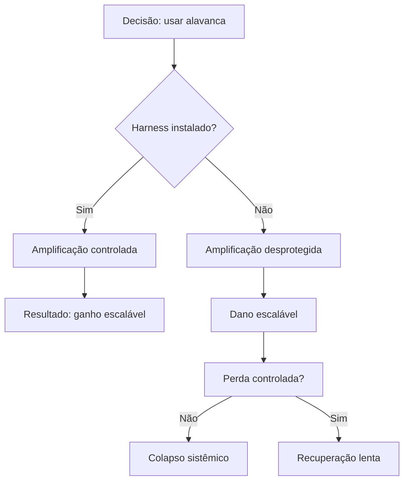

# Capítulo 2: Por Que Alavancagem Sem Proteção É Perigo

## 1. Introdução

No Capítulo 1, você conheceu o conceito de harness como dispositivo de alavancagem com proteção — uma estrutura que amplifica capacidade humana sem deixar o operador exposto ao risco. Viu que a alavanca, por si só, não é o problema: o problema é usá-la sem ancora. Agora é hora de olhar para o outro lado da moeda: o que acontece quando alguém pega uma alavanca poderosa e não instala nenhuma proteção.

A resposta curta é: desastres. A resposta longa — que é o que este capítulo vai construir — é que a alavancagem desprotegida não apenas amplifica ganhos, mas amplifica perdas na mesma proporção. E o custo de não ter um harness vai muito além de dinheiro: envia vidas humanas, reputações de empresas e a confiança de equipes inteiras. Como Engenheiro de Harness, essa é a的第一个 realidade que você precisa dominar antes de projetar qualquer coisa.

## 2. Explica

### A natureza simétrica da alavanca

Uma alavanca é uma ferramenta neutra. Ela não distingue entre empurrar um carro para cima de uma colina e derrubar um prédio. O princípio fundamental da alavanca — amplificar força aplicada — funciona exatamente da mesma forma para resultados positivos e negativos [1]. Quando você usa alavancagem em finanças, por exemplo, um empréstimo pode financiar a expansão de uma fábrica ou pode endividar uma empresa até a falência. A alavanca não muda; muda o que acontece quando algo dá errado e não há proteção para conter o dano.

Em engenharia de software, o padrão é idêntico. Um framework de automação de deploy pode colocar uma feature nova em produção para milhões de usuários em minutos — ou pode espalhar um bug catastrófico para a mesma base de usuários no mesmo tempo [2]. A velocidade que a alavanca proporciona é exatamente a velocidade com que o desastre escala. Sem um harness de teste, sem um pipeline de CI/CD, sem um mecanismo de rollback, você está operando com a alavanca no máximo e a ancora solta.

### Lehman Brothers: quando a alavanca financeira não tem freio

O caso Lehman Brothers é talvez o exemplo mais devastador de alavancagem desprotegida da história moderna. Em 2008, o banco de investimentos operava com uma razão de alavancagem de aproximadamente 30:1 — para cada dólar de patrimônio próprio, havia trinta dólares em dívidas e ativos alavancados [3]. Isso significava que uma queda de apenas 3,3% no valor dos ativos seria suficiente para eliminar todo o patrimônio da empresa.

Não havia harness. Os modelos de risco internos subestimavam sistematicamente a probabilidade de colapso do mercado imobiliário. Os mecanismos de controle estavam ausentes ou foram ignorados. Quando a crise explodiu, o resultado não foi uma perda gradual — foi um colapso total e irreversível: a maior falência da história dos Estados Unidos, com US$ 639 bilhões em ativos [3]. O custo humano foi igualmente brutal: 26 mil funcionários perderam seus empregos, e a onda de choque atingiu economias ao redor do mundo.

O que faltou não foi inteligência ou capital. Faltou um harness — um dispositivo de proteção que limitasse o dano quando o mercado se movesse contra a posição do banco.

### Código sem testes: a mesma alavanca, outro domínio

No mundo do software, o padrão se repete com uma regularidade quase mecânica. Estudos mostram que o custo de corrigir um defeito em produção é de 10 a 100 vezes maior do que corrigi-lo na fase de requisitos [4]. Quando uma equipe desenvolve código sem testes automatizados, sem revisão de pares e sem um pipeline de integração contínua, ela está usando alavanca sem ancora — escrevendo funcionalidade cada vez mais complexa sobre uma base que ninguém validou.

O relatório Cost of Quality do Consortium for Information & Software Quality estima que software defeituoso custa à indústria americana entre US$ 2,41 trilhões e US$ 3,60 trilhões anualmente [5]. Não se trata de programadores incompetentes. Trata-se de equipes que operam com alavanca — frameworks, bibliotecas, APIs, microsserviços — sem instalar os dispositivos de proteção que transformariam risco controlado em risco catastrófico.

### O custo humano da falta de harness

A Organização Internacional do Trabalho registra que quedas representam aproximadamente 8% dos óbitos por acidente de trabalho em escala global [6]. No setor de construção, essa proporção é ainda mais dramática: queda de altura é a principal causa de morte em canteiros de obras em muitos países. No Brasil, a NR-35 estabelece que o trabalho em altura só pode ser realizado com proteção coletiva ou individual, e que o trabalhador deve receber treinamento específico antes de qualquer operação [7]. E mesmo assim, os números persistem — porque a norma existe, mas a cultura de proteção nem sempre acompanha.

Em software, o custo humano se manifesta de formas diferentes, mas igualmente reais. Desenvolvedores que trabalham em sistemas sem testes vivem em um estado constante de medo — medo de fazer deploy, medo de mudar código legado, medo de que algo quebre nos finais de semana [8]. O impacto na saúde mental dos profissionais é documentado: burnout, ansiedade crônica e evasão de talentos são consequências diretas de equipes que operam sem a proteção de um harness adequado.

### O princípio ALARA: reduzir o risco ao menor nível praticável

O princípio ALARA — *As Low As Reasonably Achievable* — é um conceito da indústria nuclear que se aplica perfeitamente ao que discutimos [9]. Ele diz: não espere eliminar todo o risco (isso é impossível), mas reduza-o ao menor nível que seja razoavelmente alcançável dado o estado da tecnologia, o custo e o contexto operacional.

Na prática, ALARA significa que o Engenheiro de Harness não busca perfeição — busca a melhor proteção viável. No safety harness, isso se traduz em選擇ção de equipamento adequado à tarefa, treinamento do trabalhador e plano de resgate. No software, isso significa testes automatizados que cobrem os caminhos críticos, pipelines de CI/CD com gates de qualidade e mecanismos de rollback que permitam reverter mudanças rapidamente [10].

O ALARA é a ponte entre a teoria da alavancagem e a prática da proteção. Ele diz: use a alavanca — ela é necessária para crescer, escalar e inovar — mas instale o harness antes de puxar.

## 3. Ilustra

### A metáfora da corda bungee

Imagine que você está em uma plataforma de 50 metros de altura e alguém te convida para pular. A corda bungee é a sua alavanca — ela permite que você faça algo que seria impossível (ou fatal) sem ela: cair de um penhasco e voltar ileso. Mas a corda funciona apenas se estiver ancorada em um ponto sólido, se tiver o comprimento correto e se o elástico estiver em boas condições.

Pular sem corda é suicídio. Pular com corda errada é quase suicídio. Pular com a corda certa, mas sem testar se a ancoragem segura o peso, é o tipo de risco que parece calculado até o momento em que não é.

No mundo da engenharia de software, o pulo é o deploy. A corda bungee é o pipeline de CI/CD. A ancoragem são os testes automatizados. E o teste de tensão da corda é a validação que roda antes de cada deploy. Sem nenhum desses elementos, você não está fazendo engenharia — está fazendo aposta.

### Diagrama: alavancagem com e sem proteção



O diagrama acima mostra algo que parece óbvio na visualização, mas que é ignorado rotineiramente na prática: a mesma decisão (usar alavanca) leva a resultados radicalmente diferentes dependendo da presença ou ausência de um harness. Do lado esquerdo, o profissional que instala proteção antes de escalar colhe ganhos que se acumulam. Do lado direito, quem pula sem corda descobre que o dano também escala — e a recuperação, quando possível, é lenta e dolorosa.

### Dualidade da alavanca: engenharia e finanças

Na engenharia de software, essa dualidade aparece no conceito de *blast radius* — o raio de impacto de uma mudança. Um deploy sem testes tem blast radius máximo: se der errado, afeta todos os usuários. Um deploy com testes, feature flags e canary releases tem blast radius controlado: se der errado, afeta uma fração e pode ser revertido [11].

Na indústria, o safety harness funciona da mesma forma. Um trabalhador sem proteção tem blast radius total: qualquer queda resulta em ferimento ou morte. Um trabalhador com PFAS tem blast radius limitado: a queda é travada, a energia é dissipada pelo absorvedor, e o trabalhador é resgatado em segurança [12].

## 4. Técnica

### Anatomia do risco: como a alavanca amplifica perdas

Para entender por que alavancagem sem proteção é tão perigosa, precisamos olhar para a mecânica por trás da amplificação. Em finanças, isso se expressa na *Degree of Financial Leverage* (DFL), que mede a sensibilidade do lucro por ação (EPS) às variações no lucro operacional (EBIT) [13]:

```python
# Degree of Financial Leverage (DFL)
# Mede a sensibilidade do EPS às variações no EBIT

def calcular_dfl(ebit, juros):
    """
    Calcula o Grau de Alavancagem Financeira.
    
    Args:
        ebit: Lucro antes de juros e impostos (R$)
        juros: Despesas financeiras totais (R$)
    
    Returns:
        float: DFL (>1 indica alavancagem)
    """
    if ebit <= juros:
        raise ValueError("EBIT deve ser maior que os juros para DFL definido")
    return ebit / (ebit - juros)

# Exemplo: empresa com alta alavancagem
ebit_atual = 1_000_000  # R$ 1 milhão
juros_anuais = 800_000  # R$ 800 mil em juros

dfl = calcular_dfl(ebit_atual, juros_anuais)
print(f"DFL = {dfl:.1f}")  # DFL = 5.0

# Uma queda de 10% no EBIT gera queda de 50% no EPS
queda_ebit = -0.10
impacto_eps = queda_ebit * dfl
print(f"Queda de 10% no EBIT → queda de {abs(impacto_eps)*100:.0f}% no EPS")
```

Um DFL de 5.0 significa que para cada 1% de queda no lucro operacional, o lucro por ação cai 5%. Isso é alavanca pura — e sem um harness (reservas de caixa, contratos de hedge, limites de exposição), essa alavanca se transforma em uma espiral descendente que pode levar à insolvência [13].

### O equivalente em software: sem testes, sem proteção

No mundo do software, o equivalente ao DFL é o *blast radius* — a proporção do sistema afetada por uma mudança. Veja como isso se manifesta em código:

```python
# Blast Radius: impacto de uma mudança sem testes

def calcular_blast_radius(deploy_sem_testes, totalUsuarios, funcionalidadesAfetadas):
    """
    Estima o impacto de um deploy sem cobertura de testes.
    
    Args:
        deploy_sem_testes: bool — True se não houver testes automatizados
        totalUsuarios: int — base de usuários afetados
        funcionalidadesAfetadas: list — funcionalidades tocadas pela mudança
    
    Returns:
        dict: métricas de impacto
    """
    if deploy_sem_testes:
        return {
            "blast_radius": "global",
            "usuarios_afetados": totalUsuarios,
            "tempo_diagnostico": "horas a dias",
            "reversao": "manual e arriscada",
            "confianca": "baixa"
        }
    else:
        funcionalidades_protegidas = len(funcionalidadesAfetadas)
        return {
            "blast_radius": "controlado",
            "usuarios_afetados": min(totalUsuarios, totalUsuarios * 0.05),
            "tempo_diagnostico": "minutos",
            "reversao": "automática via rollback",
            "confianca": "alta"
        }

# Cenário: deploy de feature nova
resultado = calcular_blast_radius(
    deploy_sem_testes=True,
    totalUsuarios=10_000_000,
    funcionalidadesAfetadas=["checkout", "pagamento", "notificações"]
)
print(f"Blast radius: {resultado['blast_radius']}")
print(f"Usuários afetados: {resultado['usuarios_afetados']:,}")
```

Quando você não tem testes, o blast radius é global — todos os usuários são potencialmente afetados por qualquer mudança. Isso é o equivalente digital de um trabalhador subindo em altura sem EPI: o risco é total e a recuperação, quando possível, é lenta [14].

### O custo de não ter um harness: uma análise comparativa

A tabela abaixo sintetiza o custo da ausência de proteção em dois domínios:

| Dimensão | Safety Harness (Indústria) | Test Harness (Software) |
|---|---|---|
| **Custo de instalação** | Treinamento + equipamento (R$ 500–2.000/trabalhador) | Setup de CI/CD + testes (horas-homem iniciais) |
| **Custo de falha sem harness** | Morte ou invalidez (irrecuperável) | Bug em produção (US$ 100–10.000+ por hora) |
| **Tempo de recuperação** | Meses (reabilitação) ou irreversível | Horas a dias (hotfix + rollback) |
| **Impacto sistêmico** | Trauma na equipe, investigação, processos | Perda de confiança do usuário, churn |
| **Referência normativa** | NR-35, OSHA 1926, ANSI Z359 | ISO 25010, SWEBOK, DORA |

A tabela revela algo que frequentemente não é considerado: o custo de instalação de um harness é uma fração mínima do custo de uma falha sem ele [15]. Na indústria, um EPI custa centavos comparado ao custo de um acidente. Em software, o tempo gasto em testes automatizados é uma fração do tempo gasto em hotfixs de emergência e noite mal dormida.

### ALARA na prática: o que é razoavelmente alcançável

O princípio ALARA não pede perfeição — pede adequação. Veja como ele se aplica em ambos os domínios:

```python
# Framework ALARA: avaliação de risco vs. proteção disponível

def avaliar_harness(cenario):
    """
    Avalia se a proteção instalada é adequada ao risco identificado.
    Baseado no princípio ALARA (As Low As Reasonably Achievable).
    
    Args:
        cenario: dict com descricao, risco_nivel (1-10), protecao_atual
    
    Returns:
        dict: recomendacao e nivel_de_adequacao
    """
    risco = cenario["risco_nivel"]
    protecao = cenario["protecao_atual"]
    
    # Matriz ALARA simplificada
    if risco >= 8 and protecao < 7:
        return {
            "status": "CRÍTICO",
            "recomendacao": "Proteção insuficiente para o risco. Implementar harness imediatamente.",
            "adequacao": "INADEQUADA"
        }
    elif risco >= 5 and protecao < 5:
        return {
            "status": "ALERTA",
            "recomendacao": "Proteção parcial. Avaliar se é possível reduzir risco ou aumentar proteção.",
            "adequacao": "PARCIAL"
        }
    elif risco <= 4 and protecao >= 3:
        return {
            "status": "ADEQUADO",
            "recomendacao": "Nível de proteção razoável para o risco identificado.",
            "adequacao": "ADEQUADA"
        }
    else:
        return {
            "status": "VERIFICAR",
            "recomendacao": "Reavaliar — configuração não padrão.",
            "adequacao": "REQUER ANÁLISE"
        }

# Exemplo: sistema de pagamento em produção
cenario_pagamento = {
    "descricao": "API de processamento de pagamento — 1M de transações/dia",
    "risco_nivel": 9,
    "protecao_atual": 4  # Poucos testes, sem monitoring
}
resultado = avaliar_harness(cenario_pagamento)
print(f"Status: {resultado['status']}")
print(f"Recomendação: {resultado['recomendacao']}")
```

O framework ALARA transforma a pergunta abstrata "estou protegido o suficiente?" em uma avaliação estruturada. No safety harness, isso significa verificar se o equipamento é adequado à tarefa, se a ancoragem suporta a carga e se o plano de resgate é viável [16]. No software, significa verificar se os testes cobrem os caminhos críticos, se o monitoring detecta anomalias e se o rollback é automatizável [10].

## 5. Aplica

### Cena: o deploy de segunda-feira

Você é parte de uma equipe de engenharia em uma fintech. Segunda-feira de manhã, um colega terminou uma feature nova para o módulo de transferências internas. O prazo é apertado, o cliente está cobrando, e o colega jura que testou tudo manualmente. Não há testes automatizados para esse módulo. Não há pipeline de CI/CD que rode testes antes do deploy. Não há feature flag para limitar o impacto.

O gestor manda fazer deploy. Você sente aquele frio na barriga — aquele sinal de que algo está errado, mas que é difícil articular. O deploy vai para produção às 9h da manhã. Às 9h47, os primeiros tickets de suporte começam a chegar: transferências estão sendo processadas duas vezes. Às 10h15, o valor total duplicado em transferências atinge R$ 2,3 milhões. O time entra em pânico. O rollback é manual — alguém precisa alterar configurações em produção, verificar cada transação duplicada, processar estornos. O incidente leva 14 horas para ser completamente resolvido.

O que aconteceu? Alguém usou alavanca — frameworks, APIs, templates — sem instalar um harness de teste. A feature passou por todas as verificações manuais, mas uma condição de borda (dois usuários iniciando transferência ao mesmo tempo para a mesma conta) não foi testada. Sem testes automatizados, sem monitoramento de anomalias e sem rollback automático, o dano escala livremente.

### O que o profissional que sabe fazer diferente

Agora imagine o mesmo cenário, mas com um harness instalado. O código tem testes unitários que verificam o processamento de transferências. O pipeline de CI/CD roda esses testes antes de permitir o deploy. Uma feature flag limita a feature a 5% dos usuários nos primeiros 30 minutos. O monitoring detecta o duplicamento de transações em tempo real e gera um alerta antes mesmo do primeiro ticket de suporte. O rollback é automático: o sistema detecta a anomalia e reverte para a versão anterior em menos de 3 minutos.

O custo da duplicação nesse cenário? Zero para o cliente. R$ 500 em infraestrutura temporária para o monitoring. E uma lição valiosa para a equipe: a feature precisava de testes para a condição de concorrência antes de sair do estágio de staging.

### Armadilhas comuns ao subestimar o risco

A cena acima ilustra três armadilhas que afetam equipes todos os dias:

**1. "Testei manualmente, está funcionando."** Teste manual não escala. Ele valida o caminho feliz, mas não valida condições de borda, concorrência ou falhas em cascata. No safety harness, isso equivale a "olhei a corda, parece boa" — sem verificar a data de validade, o peso máximo ou a integridade da ancoragem.

**2. "Não temos tempo para testes agora."** O tempo que falta para testar é sempre menor do que o tempo que vai faltar para corrigir. Estudos mostram que a detecção precoce de defeitos reduz o custo de correção em até 100 vezes [4]. O "não temos tempo" de hoje se transforma no "não dormimos há 48 horas" de amanhã.

**3. "O risco é pequeno, não vai acontecer com a gente."** Lehman Brothers também pensava assim. A alavancagem de 30:1 parecia segura enquanto o mercado subia. O risco parecia pequeno — até não ser mais [3]. O ALARA não pede para você eliminar o risco; pede para você ser honesto sobre ele e instalar a melhor proteção viável.

## 6. Conclusão

Três ideias devem ficar deste capítulo. Primeira: a alavanca é neutra — ela amplifica tanto ganhos quanto perdas, e a ausência de proteção faz com que as perdas escalem na mesma velocidade dos ganhos. Segunda: o custo de não ter um harness vai muito além do financeiro — envia vidas, saúde mental de equipes e a confiança de clientes. Terceira: o princípio ALARA oferece um caminho prático — não buscar perfeição, mas instalar a melhor proteção viável para o risco identificado.

O desafio que deixo para você: na próxima vez que for usar uma alavanca — seja um novo framework, uma feature ambiciosa ou uma mudança de arquitetura — pare e pergunte: "qual é a minha ancora?". Se a resposta for "não tenho", esse é o momento de instalar o harness antes de puxar.

No próximo capítulo, vamos explorar a hierarquia de controles — um framework que mostra que nem toda proteção é igual, e que a melhor estratégia nem sempre envolve colocar um EPI no problema.

## 7. Referências Bibliográficas

[1] ASME. *Engineering Mechanics: Statics*. 14th ed. New York: McGraw-Hill Education, 2015. 672 p.

[2] HUMBLE, J.; FARLEY, D. *Continuous Delivery: Reliable Software Releases through Build, Test, and Deployment Automation*. Boston: Addison-Wesley, 2010. 457 p.

[3] FINANCIAL CRISIS INQUIRY COMMISSION. *The Financial Crisis Inquiry Report: Final Report of the National Commission on the Causes of the Financial and Economic Crisis in the United States*. Washington: U.S. Government Printing Office, 2011. 662 p.

[4] BOEHM, B.; BASILI, V. R. Software Defect Reduction Top 10 List. *IEEE Computer*, v. 34, n. 1, p. 135–137, jan. 2001.

[5] CONSORTIUM FOR INFORMATION & SOFTWARE QUALITY. *The Cost of Poor Software Quality in the US: A 2022 Report*. Pittsburgh: CISQ, 2022. 50 p.

[6] INTERNATIONAL LABOUR ORGANIZATION. *Global Estimates on Occupational Fatal Injuries*. Geneva: ILO, 2023.

[7] BRASIL. Ministério do Trabalho e Emprego. *Norma Regulamentadora nº 35 — Trabalho em Altura*. NR-35. Brasília: MTE, 2021.

[8] KIM, G.; HUMBLE, J.; DEBOIS, P.; WILLIS, J. *The DevOps Handbook: How to Create World-Class Agility, Reliability, and Security in Technology Organizations*. 2nd ed. Portland: IT Revolution Press, 2021. 480 p.

[9] INTERNATIONAL ATOMIC ENERGY AGENCY. *Basic Safety Principles for Nuclear Power Plants*. 75-INSAG-3 Rev.1. Vienna: IAEA, 1999. 48 p.

[10] DORA TEAM. *Accelerate: State of DevOps 2023*. Google Cloud, 2023.

[11] NEWTON, N. *Database Reliability Engineering: Designing and Operating Resilient Data Systems*. Sebastopol: O'Reilly Media, 2015. 300 p.

[12] OCCUPATIONAL SAFETY AND HEALTH ADMINISTRATION. *Personal Fall Protection Systems*. 29 CFR 1926 Subpart M. Washington: OSHA, 2020.

[13] BRIGHAM, E. F.; EHRHARDT, M. C. *Financial Management: Theory and Practice*. 15th ed. Boston: Cengage Learning, 2016. 1152 p.

[14] HUNT, P.; JOHNSTON, M. *Infrastructure as Code: Dynamic Systems for the Cloud Age*. 2nd ed. Sebastopol: O'Reilly Media, 2020. 422 p.

[15] AMERICAN SOCIETY OF SAFETY PROFESSIONALS. *ANSI/ASSP Z359.1-2020 — Fall Protection Code*. Des Plaines: ASSP, 2020. 64 p.

[16] INTERNATIONAL ORGANIZATION FOR STANDARDIZATION. *ISO 45001:2018 — Occupational Health and Safety Management Systems*. Geneva: ISO, 2018. 54 p.

[17] PRESSMAN, R. S.; MAXIM, B. R. *Software Engineering: A Practitioner's Approach*. 9th ed. New York: McGraw-Hill Education, 2020. 784 p.

[18] SOMMERVILLE, I. *Software Engineering*. 10th ed. Harlow: Pearson Education, 2016. 616 p.
