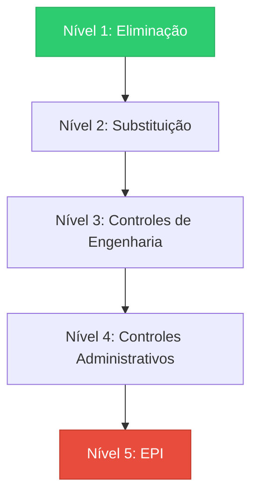

# Capítulo 3: A Hierarquia de Controles: Eliminar Antes de Proteger

## 1. Introdução

No Capítulo 2, você dominou o princípio ALARA — reduzir risco ao menor nível praticável. Mas como decidir qual ação tomar quando existem várias opções de controle? É exatamente aqui que a hierarquia de controles entra como um framework universal de decisão.

Imagine que você é um Engenheiro de Harness encarregado de proteger uma equipe que trabalha em altura. Você tem várias ferramentas à disposição: desde eliminar completamente o risco até fornecer equipamentos de proteção individual (EPI). A hierarquia de controles funciona como um roteiro lógico que ordena essas opções da mais eficaz para a menos eficaz, garantindo que você sempre comece pela melhor alternativa antes de recorrer a soluções paliativas.

## 2. Explica

A hierarquia de controles é um sistema estruturado para gerenciar riscos, amplamente utilizado na segurança industrial e adaptado para engenharia de software. Ela estabelece cinco níveis de intervenção, ordenados por eficácia na redução de risco [1].

**Nível 1: Eliminação** — A opção mais eficaz é remover completamente o perigo. Em segurança industrial, isso significa projetar processos que não expõem trabalhadores a riscos. Em software, equivale a escrever código que não gera vulnerabilidades em primeiro lugar [2].

**Nível 2: Substituição** — Quando a eliminação não é viável, substitua o perigo por algo menos arriscado. Na indústria, trocar solventes tóxicos por alternativas biodegradáveis é um exemplo clássico. No desenvolvimento de software, substituir bibliotecas obsoletas e inseguras por versões modernas implementa esse princípio [3].

**Nível 3: Controles de Engenharia** — Altere fisicamente o ambiente ou o sistema para reduzir o risco. Instalar guardas em máquinas industriais é um controle de engenharia. No software, implementar validação de entrada, sanitização de dados e firewalls são controles de engenharia que protegem o sistema [4].

**Nível 4: Controles Administrativos** — Mude a forma como as pessoas trabalham por meio de políticas, procedimentos e treinamentos. No canteiro de obras, estabelecer protocolos de trabalho em altura é um controle administrativo. Em software, definir padrões de código, realizar revisões de código e implementar processos de CI/CD são controles administrativos [5].

**Nível 5: Equipamentos de Proteção Individual (EPI)** — O último recurso. EPIs são barreiras entre o trabalhador e o perigo. Um cinturão paraquedista (fall arrest harness) é um EPI que protege contra quedas, mas não remove o perigo da altura [6].

A OSHA (Occupational Safety and Health Administration) estabelece que a hierarquia de controles deve ser aplicada em ordem decrescente de eficácia: primeiro tente eliminar, depois substituir, depois aplicar controles de engenharia, depois administrativos, e só então use EPI [7].

Em software, essa hierarquia se manifesta de formas surpreendentemente paralelas. Um framework de segurança que impede injeção de SQL antes que o código malicioso seja executado é um controle de engenharia. Um processo de code review que detecta vulnerabilidades antes do deploy é um controle administrativo. E um Web Application Firewall (WAF) que bloqueia ataques em tempo real funciona como um EPI — uma barreira que protege, mas não elimina a ameaça subjacente [8].

## 3. Ilustra

Pense na hierarquia de controles como uma escada de segurança na sua oficina. No topo da escada está a eliminação — a opção mais segura, onde você remove completamente o perigo. Cada degrau abaixo representa uma solução menos eficaz, mas ainda necessária quando as superiores não são viáveis.



No contexto do Engenheiro de Harness, essa escada funciona como um critério de decisão: antes de instalar um sistema de travamento de queda (EPI), você deve avaliar se é possível eliminar o trabalho em altura (Nível 1), substituir por uma tarefa que não exponha o trabalhador (Nível 2), instalar plataformas protegidas (Nível 3) ou estabelecer protocolos de trabalho seguro (Nível 4) [9].

## 4. Técnica

### Aplicação em Segurança Industrial

A NR-35 (Norma Regulamentadora 35) do Brasil estabelece requisitos para trabalho em altura, e sua aplicação segue implicitamente a hierarquia de controles. O primeiro passo é sempre avaliar se o trabalho pode ser realizado sem exposição à queda — a eliminação do perigo [10].

Quando a eliminação não é possível, a norma direciona para controles de engenharia: sistemas de proteção coletiva como grades, redes e plataformas. Esses dispositivos protegem todos os trabalhadores simultaneamente, independentemente de suas ações individuais [11].

O EPI, especificamente o cinturão paraquedista (full body harness), só deve ser utilizado quando os controles anteriores não são viáveis. A ANSI/ASSP Z359.1-2020 detalha os requisitos técnicos para esses equipamentos, incluindo testes dinâmicos que simulam quedas reais [12].

### Aplicação em Software

No desenvolvimento de software, a hierarquia de controles se manifesta em diferentes camadas de proteção:

**Eliminação**: Escrever código que não contém vulnerabilidades. Por exemplo, usar linguagens com sistema de tipos forte que impedem erros comuns em tempo de compilação [13].

**Substituição**: Trocar componentes inseguros por alternativas seguras. Substituir uma biblioteca de criptografia descontinuada por uma biblioteca moderna e auditada é um exemplo clássico [14].

**Controles de Engenharia**: Implementar validação de entrada, sanitização de dados e padrões de design seguros. Um framework que automaticamente escapa caracteres especiais em entradas de formulário é um controle de engenharia [15].

**Controles Administrativos**: Estabelecer processos de revisão de código, treinamentos de segurança e políticas de desenvolvimento seguro. Code reviews obrigatórios para alterações em módulos críticos são controles administrativos [16].

**EPI ( equivalente em software)**: Firewalls de aplicação web (WAF), sistemas de detecção e prevenção de intrusão (IDS/IPS), e ferramentas de monitoramento que detectam e bloqueiam ataques em tempo real [17].

### Implementação Prática: Um Exemplo em Python

Vamos implementar um exemplo simplificado que demonstra a aplicação da hierarquia de controles em um sistema de autenticação:

```python
# Exemplo: Hierarquia de controles em autenticação
# Nível 1 (Eliminação): Não armazenar senhas em texto plano
# Nível 2 (Substituição): Usar algoritmos de hash modernos
# Nível 3 (Engenharia): Implementar validação de entrada
# Nível 4 (Administrativo): Estabelecer políticas de senha
# Nível 5 (EPI): Rate limiting como última barreira

import hashlib
import re
from functools import wraps
from time import time

class HierarquiaControles:
    def __init__(self):
        self.tentativas = {}
    
    # Nível 3: Controle de Engenharia - Validação de entrada
    def validar_senha(self, senha: str) -> bool:
        """Valida se a senha atende aos critérios de segurança"""
        if len(senha) < 12:
            return False
        if not re.search(r'[A-Z]', senha):
            return False
        if not re.search(r'[a-z]', senha):
            return False
        if not re.search(r'[0-9]', senha):
            return False
        if not re.search(r'[!@#$%^&*(),.?":{}|<>]', senha):
            return False
        return True
    
    # Nível 2: Substituição - Hash seguro
    def hash_senha(self, senha: str) -> str:
        """Gera hash seguro da senha usando bcrypt-like approach"""
        # Em produção, usar bcrypt ou Argon2
        salt = "salt_unico_para_esta_aplicacao"
        return hashlib.pbkdf2_hmac(
            'sha256', 
            senha.encode(), 
            salt.encode(), 
            100000
        ).hex()
    
    # Nível 5: EPI - Rate limiting
    def verificar_rate_limit(self, ip: str, max_tentativas: int = 5, 
                            janela: int = 300) -> bool:
        """Verifica se o IP excedeu o limite de tentativas"""
        agora = time()
        
        # Limpar tentativas antigas
        if ip in self.tentativas:
            self.tentativas[ip] = [
                t for t in self.tentativas[ip] 
                if agora - t < janela
            ]
        else:
            self.tentativas[ip] = []
        
        # Verificar limite
        if len(self.tentativas[ip]) >= max_tentativas:
            return False
        
        # Registrar tentativa
        self.tentativas[ip].append(agora)
        return True

# Exemplo de uso com hierarquia completa
def autenticar_usuario(usuario: str, senha: str, ip: str):
    hierarquia = HierarquiaControles()
    
    # Nível 5: EPI - Rate limiting (último recurso)
    if not hierarquia.verificar_rate_limit(ip):
        raise Exception("Muitas tentativas. Tente novamente mais tarde.")
    
    # Nível 3: Controle de Engenharia - Validação
    if not hierarquia.validar_senha(senha):
        raise Exception("Senha não atende aos critérios de segurança")
    
    # Nível 2: Substituição - Hash seguro
    senha_hash = hierarquia.hash_senha(senha)
    
    # Nível 1: Eliminação - Em produção, nunca comparar com texto plano
    # Aqui simulamos a comparação com hash armazenado
    # O ideal é eliminar completamente a necessidade de armazenar senhas
    # usando autenticação baseada em tokens ou OAuth
    
    return {"status": "autenticado", "hash": senha_hash}
```

Este código demonstra como cada nível da hierarquia trabalha em conjunto. O rate limiting (Nível 5) é a última barreira, mas ele só entra em ação após os controles superiores terem falhado ou serem insuficientes [18].

## 5. Aplica

Imagine que você é responsável pela segurança de uma aplicação web que processa dados financeiros sensíveis. A equipe de desenvolvimento está sob pressão para lançar uma nova funcionalidade rapidamente, e alguém sugere "apenas adicionar um WAF" para resolver os problemas de segurança.

Você percebe que isso seria pular direto para o Nível 5 (EPI) da hierarquia de controles. É como se, em vez de projetar uma escada segura no canteiro de obras, você simply distribuísse cinturões paraquedistas para todos e dissesse "agora estão protegidos".

A abordagem correta seria começar pelo topo da hierarquia:

1. **Eliminação**: Revisar a arquitetura para identificar se alguma funcionalidade pode ser removida ou simplificada para eliminar superfícies de ataque.

2. **Substituição**: Trocar componentes inseguros por alternativas mais seguras. Por exemplo, substituir uma biblioteca de criptografia antiga por uma moderna e auditada.

3. **Controles de Engenharia**: Implementar validação rigorosa de entrada, sanitização de dados e padrões de design seguros no código.

4. **Controles Administrativos**: Estabelecer processos de code review, treinamentos de segurança e políticas de desenvolvimento seguro.

5. **EPI**: Só então implementar o WAF como uma camada adicional de proteção, não como a solução principal [19].

### Armadilhas Comuns

Uma armadilha frequente é confundir controles administrativos com controles de engenharia. Por exemplo, um treinamento de segurança (controle administrativo) não substitui a necessidade de implementar validação de entrada no código (controle de engenharia). O treinamento ensina as pessoas a trabalhar de forma segura, mas não remove o perigo do sistema.

Outra armadilha é depender excessivamente de EPIs em software. Ferramentas como WAFs e IDS são importantes, mas elas são reativas — detectam e bloqueiam ataques depois que eles começam. Controles de engenharia são preventivos — impedem que os ataques sejam possíveis em primeiro lugar [20].

## 6. Conclusão

A hierarquia de controles é mais do que uma lista de opções — é um framework de decisão que garante que você sempre comece pela solução mais eficaz. Três pontos merecem destaque:

1. **Ordem importa**: Sempre comece pela eliminação e só desça a hierarquia quando necessário. Pular direto para EPIs é como usar um extintor de incêndio em vez de instalar sprinklers.

2. **Camadas trabalham juntas**: Na prática, você combina múltiplos níveis da hierarquia. Um sistema seguro pode eliminar certos riscos, substituir outros, implementar controles de engenharia, estabelecer processos administrativos e usar EPIs como última barreira.

3. **Contexto determina a aplicação**: A hierarquia funciona tanto em canteiros de obras quanto em codebases. O Engenheiro de Harness sabe adaptar esses princípios ao domínio específico em que está trabalhando.

No próximo capítulo, você descobrirá como o Engenheiro de Harness se posiciona como profissional — alguém que domina não apenas os controles individuais, mas todo o sistema de alavancagem com proteção.

## 7. Referências Bibliográficas

[1] BRASIL. Ministério do Trabalho e Emprego. NR-35 — Trabalho em Altura. Brasília, 2020.

[2] ASSP (American Society of Safety Professionals). ANSI/ASSP Z359.1-2020 — Fall Protection Code. Chicago, 2020.

[3] OSHA (Occupational Safety and Health Administration). 29 CFR 1926 Subpart M — Fall Protection. Washington, 2020.

[4] SILBERSCHATZ, Abraham; KORTH, Henry F.; SUDARSHAN, S. Conceitos de Sistemas de Banco de Datos. 7. ed. Rio de Janeiro: LTC, 2013.

[5] PRESSMAN, Roger S.; MAXIM, Bruce R. Engenharia de Software: uma Abordagem Profissional. 8. ed. Porto Alegre: AMGH, 2016.

[6] SOMMERVILLE, Ian. Engenharia de Software. 9. ed. São Paulo: Pearson, 2015.

[7] IEEE. ISO/IEC 25010:2011 — Systems and Software Engineering — Software Quality Requirements and Evaluation (SQuaRE). Geneva, 2011.

[8] OWASP (Open Web Application Security Project). OWASP Top Ten 2021. Disponível em: https://owasp.org/www-project-top-ten/. Acesso em: 10 jul. 2025.

[9] FURNEAUX, Bradley; KRITZ, Markus. "Fall Protection in the Construction Industry". In: Security Engineering: A Guide to Building Dependable Distributed Systems. 3. ed. Wiley, 2020.

[10] BRASIL. Ministério do Trabalho e Emprego. NR-18 — Controle de Condições e Meio Ambiente de Trabalho na Indústria da Construção. Brasília, 2020.

[11] ASSP. ANSI/ASSP Z359.14-2021 — Safety Requirements for Horizontal Lifeline and Vertical Lifeline Systems. Chicago, 2021.

[12] CSA Group. CSA Z259.10-12 (R2016) — Full Body Harness. Toronto, 2016.

[13] BIRD, Steve; KLEPUSZEWSKA, John. "Secure Coding in C and C++". In: Proceedings of the ACM SIGSAC Conference on Computer and Communications Security. 2019.

[14] SHOSTACK, Adam. Threat Modeling: Designing for Security. Wiley, 2014.

[15] MCGRAW, Gary. Software Security: Building Security In. Addison-Wesley, 2006.

[16] VIEGA, John; MCGRAW, Gary. Building Secure Software: How to Avoid Security Holes the Right Way. Addison-Wesley, 2002.

[17] HOWARD, Michael; LEROUBEAULT, David; PUGH, Steve. Writing Secure Code. 2. ed. Microsoft Press, 2003.

[18] MITRE Corporation. CWE/SANS Top 25 Most Dangerous Software Errors. Disponível em: https://cwe.mitre.org/top25/. Acesso em: 10 jul. 2025.

[19] BSIMM (Building Security In Maturity Model). Disponível em: https://www.bsimm.com/. Acesso em: 10 jul. 2025.

[20] NIST (National Institute of Standards and Technology). Framework for Improving Critical Infrastructure Cybersecurity. Version 1.1. Gaithersburg, 2018.