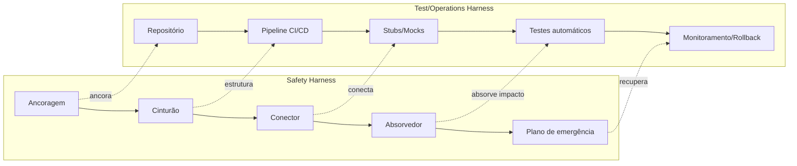

# Capítulo 4: O Engenheiro de Harness — Uma Profissão Emergente

## 1. Introdução

No Capítulo 3, você dominou a hierarquia de controles — o framework de decisão que vai da eliminação do perigo ao uso do EPI como último recurso. Agora é hora de dar o passo seguinte: quem é a pessoa que aplica essa hierarquia no mundo real? Quem decide *qual* controle usar, *quando* instalá-lo e *como* mantê-lo funcionando?

O Engenheiro de Harness não é um título que aparece em cartões de visita ou em anúncios de vaga. Mas é a persona que descreve — com precisão — quem projeta e mantém sistemas de alavancagem com proteção, seja em uma obra de construção, em um data center, ou em uma pipeline de deploy. Neste capítulo, você vai mapear o perfil desse profissional, entender como ele se conecta a carreiras consolidadas, e descobrir quais bases normativas (SWEBOK e NR-35) sustentam essa prática emergente.

## 2. Explica

### O que é um Engenheiro de Harness?

Pense na oficina de um marceneiro. Ele tem ferramentas que amplificam suas mãos — serrotes elétricos, plainas, furadeiras de bancada. Mas nenhuma dessas ferramentas funciona sem uma bancada bem fixa no chão, sem uma boa iluminação, sem proteção nos olhos. A bancada é a ancora. O protetor facial é a proteção. A combinação das duas é o que permite ele cortar com precisão e segurança ao mesmo tempo.

O Engenheiro de Harness é quem projeta esse conjunto completo: a estrutura que ancora, o mecanismo que amplifica e a camada que proteve. No contexto de software, isso significa pensar em pipelines CI/CD que não apenas entregam código rápido (alavanca), mas que também validam automaticamente se o código é seguro e funcional (proteção) [1].

Segundo o SWEBOK v4 — o corpo de conhecimento de engenharia de software definido pelo IEEE Computer Society — um engenheiro de software graduado deve dominar áreas como garantia de qualidade, segurança de software e engenharia de requisitos [2]. O Engenheiro de Harness incorpora essas áreas e adiciona uma camada transversal: a mentalidade de que todo sistema de alavancagem precisa de uma proteção embutida.

### Visão sistêmica e pensamento de segurança

A característica que separa um profissional técnico comum de um Engenheiro de Harness é a combinação de duas capacidades: visão sistêmica e pensamento de segurança.

Visão sistêmica é a habilidade de enxergar o todo, não apenas a peça que está na sua frente. Quando um desenvolvedor escreve um teste unitário, ele pensa naquela função específica. Quando um Engenheiro de Harness desenha uma suite de testes, ele pensa em como aquele teste se conecta ao pipeline, ao deploy, à monitoramento, e ao plano de recuperação em caso de falha [3].

Pensamento de segurança, por sua vez, é o hábito de perguntar: "O que acontece se isso falhar?" — antes que a falha aconteça. Nancy Leveson, uma das maiores referências em engenharia de segurança, argumenta que segurança não é apenas sobre prevenir falhas individuais, mas sobre entender como as partes de um sistema interagem de formas inesperadas [4]. No contexto de harnesses, isso significa projetar redundância, testar caminhos de falha e planejar a recuperação.

A NR-35, norma brasileira que regulamenta trabalho em altura, exige que todo trabalhador exposto a riscos de queda receba treinamento específico e que a empresa mantenha um Programa de Proteção contra Quedas (PPP) [5]. Essa exigência normativa ilustra algo que o Engenheiro de Harness deve internalizar: proteção não é opcional, é parte estrutural do sistema.

### Onde esse profissional vive

O Engenheiro de Harness não existe em um departamento isolado. Ele aparece — com nomes diferentes — em vários campos:

- **Safety Engineer**: projetista de sistemas seguros em indústrias de processo, petróleo e construção. Utiliza FMEA e FTA para identificar modos de falha antes que eles aconteçam [6].
- **Site Reliability Engineer (SRE)**: profissional que mantém sistemas de software em produção com alta disponibilidade. O SRE é, essencialmente, um Engenheiro de Harness para sistemas de TI — alavanca (automatiza operações) com proteção (SLAs, alertas, rollback automático) [7].
- **DevOps Engineer**: foca na automação de pipelines de entrega. Quando bem feito, o pipeline DevOps é um harness completo: ancora o código no repositório, amplia a velocidade de entrega via automação e protege com testes automáticos e validações [8].
- **QA Architect**: projeta a estratégia de testes de uma organização. Decide quais tipos de teste usar em cada camada, como integrar testes ao pipeline e como medir a efetividade da qualidade.

Esses nomes diferentes escondem uma verdade comum: todos esses profissionais projetam e mantêm dispositivos de alavancagem com proteção. O vocabulário muda, mas a essência — ancora, amplificação, proteção — é a mesma que vimos no Capítulo 1.

## 3. Ilustra

Imagine uma corda de mountaineering. No extremo superior, ela está ancorada a um ponto fixo na rocha — uma ancora testada para suportar 2.300 kg [9]. No extremo inferior, ela está conectada ao alpinista por um cinturão de corpo completo com absorvedor de energia. Entre os dois extremos, a corda não é apenas um elo passivo: ela é projetada para se esticar sob carga, dissipando a energia cinética de uma queda de forma controlada.

Agora transpose essa imagem para um pipeline de software. O repositório de código é a ancora. O deploy automatizado é a corda. Os testes automáticos são o absorvedor de energia — eles interceptam o código antes que ele chegue ao ambiente de produção, dissipando o "impacto" de um bug. E o monitoramento pós-deploy é o plano de emergência, pronto para acionar um rollback se algo der errado.

O Engenheiro de Harness é a pessoa que projeta essa corda inteira. Ele não apenas seleciona o material da corda (ferramenta de CI/CD), mas também testa a ancora (valida a integridade do repositório), dimensiona o absorvedor (calibra a cobertura de testes) e treina o时间 para resgate (configura alertas e runbooks) [10].



Essa equivalência não é apenas metafórica. Os princípios de engenharia de segurança — redundância, fail-safe, inspeção periódica — se aplicam diretamente a sistemas de software. A OSHA, por exemplo, exige que ancoragens de PFAS suportem 5.000 lbs por usuário [9]. Da mesma forma, um pipeline de CI/CD deve ter redundância: se o servidor de build cair, outro assume automaticamente — fail-safe [11].

## 4. Técnica

### Mapa de competências: SWEBOK e NR-35 como bases complementares

O SWEBOK v4 (ISO/IEC/IEEE 24748:2024) define 18 áreas de conhecimento essenciais para engenheiros de software [2]. Dentre elas, cinco são diretamente relevantes para o Engenheiro de Harness:

1. **Engenharia de Requisitos**: definir *o que* o sistema deve fazer — incluindo requisitos de segurança e confiabilidade.
2. **Garantia de Qualidade de Software (SQA)**: planejar e implementar processos que garantem que o produto atenda aos padrões definidos.
3. **Verificação e Validação (V&V)**: confirmar que o software está correto (verificação) e que ele faz o que o usuário precisa (validação).
4. **Manutenção de Software**: atualizar, corrigir e adaptar o sistema ao longo do tempo — incluindo manutenção de test harnesses.
5. **Engenharia de Segurança**: aplicar técnicas como FMEA e FTA para garantir que falhas não resultem em consequências catastróficas [4].

A NR-35 complementa esse quadro com o foco na proteção humana. Enquanto o SWEBOK cobre a dimensão técnica do software, a NR-35 lembra que todo sistema — mesmo o digital — é operado por pessoas [5]. Os princípios da NR-35 que se traduzem para o contexto de software são:

- **Avaliação de risco antes da ação**: assim como o trabalhador em altura deve avaliar as condições antes de subir, o Engenheiro de Harness deve avaliar riscos antes de fazer deploy.
- **Treinamento e competência**: assim como o trabalhador precisa de certificação, o profissional de software precisa de conhecimento verificado — aqui é onde o SWEBOK entra como referência.
- **Inspeção periódica**: harnesses de segurança devem ser inspecionados a cada 3-12 meses [12]. Da mesma forma, pipelines de software precisam de auditorias regulares — cobertura de testes, latência, taxa de falha.
- **Plano de emergência**: a NR-35 exige PPP (Programa de Proteção contra Quedas) [5]. No software, o equivalente é o incident response plan — o que fazer quando o sistema cai.

#### Mapeamento SWEBOK → Ferramentas de Harness

O script abaixo ilustra como um Engenheiro de Harness pode mapear as áreas do SWEBOK para ferramentas e práticas concretas, criando um plano de desenvolvimento profissional orientado por competências:

```python
"""
Mapeamento de competências SWEBOK v4 para ferramentas de Harness Engineering.
Uso: python mapear_swebok.py [--area AREA] [--formato json|tabela]
"""
from dataclasses import dataclass, field
from enum import Enum
from typing import Optional
import json


class NivelMaturidade(Enum):
    """Níveis de maturidade do profissional em cada competência."""
    FUNDAMENTAL = 1    # Conhece conceitos básicos
    INTERMEDIARIO = 2  # Aplica em projetos supervisionados
    AVANCADO = 3       # Projeta e lidera implementações
    ESPECIALISTA = 4   # Cria metodologias e mentora outros


@dataclass
class CompetenciaSWEBOK:
    """Representa uma área de conhecimento do SWEBOK mapeada para harness."""
    area_id: str
    nome: str
    descricao: str
    ferramentas: list[str]
    praticas_harness: list[str]
    nivel_minimo: NivelMaturidade
    metricas: list[str] = field(default_factory=list)


# Mapeamento das 5 áreas SWEBOK essenciais para Harness Engineering
MAPEAMENTO_SWEBOK = [
    CompetenciaSWEBOK(
        area_id="SWEBOK-REQ",
        nome="Engenharia de Requisitos",
        descricao="Definir o que o sistema deve fazer, incluindo requisitos de segurança",
        ferramentas=["Jira", "Traceability Matrix", "DOORS"],
        praticas_harness=[
            "Especificação de SLOs como requisitos não-funcionais",
            "Traceability de requisitos de segurança até casos de teste",
            "Definição de requisitos de cobertura mínima de testes"
        ],
        nivel_minimo=NivelMaturidade.INTERMEDIARIO,
        metricas=[
            "Cobertura de traceability (%)",
            "Requisitos de segurança sem teste associado (#)",
            "Tempo médio de fechamento de requisito (dias)"
        ]
    ),
    CompetenciaSWEBOK(
        area_id="SWEBOK-SQA",
        nome="Garantia de Qualidade de Software",
        descricao="Planejar e implementar processos de qualidade",
        ferramentas=["SonarQube", "Codecov", "Checkstyle"],
        praticas_harness=[
            "Definição de quality gates no pipeline CI/CD",
            "Auditoria periódica de processos de build e deploy",
            "Monitoramento contínuo de métricas de qualidade"
        ],
        nivel_minimo=NivelMaturidade.AVANCADO,
        metricas=[
            "Densidade de bugs por KLOC",
            "Percentual de builds que passam quality gate (%)",
            "Tempo médio de resolução de issue de qualidade (dias)"
        ]
    ),
    CompetenciaSWEBOK(
        area_id="SWEBOK-VV",
        nome="Verificação e Validação",
        descricao="Confirmar que o software está correto e atende necessidades",
        ferramentas=["pytest", "Selenium", "Cypress", "JMeter"],
        praticas_harness=[
            "Pirâmide de testes balanceada (unit/integration/E2E)",
            "Testes de carga e estresse como parte do pipeline",
            "Mutation testing para validar eficácia dos testes"
        ],
        nivel_minimo=NivelMaturidade.AVANCADO,
        metricas=[
            "Cobertura de código (%)",
            "Mutant kill rate (%)",
            "Taxa de testes que falham em produção (flaky rate)"
        ]
    ),
    CompetenciaSWEBOK(
        area_id="SWEBOK-MNT",
        nome="Manutenção de Software",
        descricao="Atualizar, corrigir e adaptar o sistema ao longo do tempo",
        ferramentas=["Dependabot", "Renovate", "Snyk"],
        praticas_harness=[
            "Atualização dependências como tarefa automática",
            "Refatoração orientada por métricas de dívida técnica",
            "Manutenção preventiva de testes e mocks"
        ],
        nivel_minimo=NivelMaturidade.INTERMEDIARIO,
        metricas=[
            "Idade média das dependências (dias)",
            "Dívida técnica (horas estimadas)",
            "Frequência de atualizações de segurança (#/mês)"
        ]
    ),
    CompetenciaSWEBOK(
        area_id="SWEBOK-SEG",
        nome="Engenharia de Segurança",
        descricao="Aplicar FMEA, FTA e outras técnicas para prevenir falhas catastróficas",
        ferramentas=["OWASP ZAP", "Bandit", "Trivy", "Snyk Code"],
        praticas_harness=[
            "Threat modeling no design de pipelines",
            "SAST/DAST integrado ao commit e ao build",
            "Análise de composição de dependências (SCA)"
        ],
        nivel_minimo=NivelMaturidade.AVANCADO,
        metricas=[
            "Vulnerabilidades críticas sem correção (#)",
            "Tempo médio de remediação de CVE (dias)",
            "Cobertura de SAST no pipeline (%)"
        ]
    ),
]


def gerar_plano_desenvolvimento(
    nivel_atual: NivelMaturidade,
    formato: str = "tabela"
) -> str:
    """Gera um plano de desenvolvimento com base no nível atual do profissional."""
    planos = []
    for comp in MAPEAMENTO_SWEBOK:
        gaps = []
        if nivel_atual.value < comp.nivel_minimo.value:
            gaps.append(
                f"Nível atual ({nivel_atual.name}) abaixo do mínimo "
                f"({comp.nivel_minimo.name})"
            )
        if not comp.metricas:
            gaps.append("Sem métricas definidas")

        planos.append({
            "area": comp.nome,
            "ferramentas": comp.ferramentas,
            "praticas": comp.praticas_harness,
            "gaps": gaps,
            "prioridade": "ALTA" if gaps else "MANTER"
        })

    if formato == "json":
        return json.dumps(planos, indent=2, ensure_ascii=False)

    # Formato tabela
    linhas = [
        f"{'Área SWEBOK':<35} {'Prioridade':<10} {'Ferramentas':<40}",
        "-" * 85
    ]
    for p in planos:
        ferr = ", ".join(p["ferramentas"][:3])
        linhas.append(f"{p['area']:<35} {p['prioridade']:<10} {ferr:<40}")
        for gap in p["gaps"]:
            linhas.append(f"  ⚠ {gap}")
    return "\n".join(linhas)


if __name__ == "__main__":
    print("=== Plano de Desenvolvimento: Engenheiro de Harness ===\n")
    print(gerar_plano_desenvolvimento(NivelMaturidade.INTERMEDIARIO))
    print("\n--- Versão JSON ---\n")
    print(gerar_plano_desenvolvimento(
        NivelMaturidade.INTERMEDIARIO, formato="json"
    ))
```

#### Checklist de competências do Engenheiro de Harness

O checklist abaixo serve como ferramenta de autoavaliação profissional. Cada item é rastreável a uma prática concreta e pode ser usado em avaliações de desempenho ou planos de desenvolvimento individual:

```python
"""
Checklist de competências para Engenheiro de Harness.
Gera relatório de autoavaliação em Markdown ou JSON.
Uso: python checklist_harness.py [--nivel intermediario|avancado|especialista]
"""
from dataclasses import dataclass, field
from datetime import datetime
from typing import Optional
import argparse
import json


@dataclass
class ItemChecklist:
    """Item do checklist de competências."""
    id: str
    categoria: str
    descricao: str
    nivel_requerido: str
    evidencia_esperada: str
    peso: int = 1  # 1-5, importância para o perfil completo


CHECKLIST_COMPLETO = [
    # --- VISÃO SISTÊMICA ---
    ItemChecklist(
        id="VS-01",
        categoria="Visão Sistêmica",
        descricao="Mapear dependências entre componentes de um pipeline",
        nivel_requerido="intermediario",
        evidencia_esperada="Diagrama de fluxo do pipeline com pontos de falha identificados",
        peso=5
    ),
    ItemChecklist(
        id="VS-02",
        categoria="Visão Sistêmica",
        descricao="Identificar gargalos de performance em sistemas distribuídos",
        nivel_requerido="avancado",
        evidencia_esperada="Relatório de profiling com recomendações de otimização",
        peso=4
    ),
    ItemChecklist(
        id="VS-03",
        categoria="Visão Sistêmica",
        descricao="Projetar redundância em pontos críticos (failover, retry, circuit breaker)",
        nivel_requerido="avancado",
        evidencia_esperada="Arquitetura documentada com padrões de resiliência aplicados",
        peso=5
    ),

    # --- PENSAMENTO DE SEGURANÇA ---
    ItemChecklist(
        id="PS-01",
        categoria="Pensamento de Segurança",
        descricao="Realizar threat modeling em pipeline de CI/CD",
        nivel_requerido="intermediario",
        evidencia_esperada="Documento STRIDE ou DREAD com ações mitigatórias",
        peso=5
    ),
    ItemChecklist(
        id="PS-02",
        categoria="Pensamento de Segurança",
        descricao="Integrar SAST/DAST ao fluxo de commit",
        nivel_requerido="avancado",
        evidencia_esperada="Pipeline com gates de segurança que bloqueiam merge",
        peso=5
    ),
    ItemChecklist(
        id="PS-03",
        categoria="Pensamento de Segurança",
        descricao="Conduzir análise FMEA em componente crítico",
        nivel_requerido="especialista",
        evidencia_esperada="Planilha FMEA com RPN calculado e ações corretivas",
        peso=4
    ),

    # --- COMPETÊNCIAS TÉCNICAS ---
    ItemChecklist(
        id="CT-01",
        categoria="Competências Técnicas",
        descricao="Configurar pipeline CI/CD com quality gates",
        nivel_requerido="intermediario",
        evidencia_esperada="Pipeline funcional com pelo menos 3 stages automatizados",
        peso=5
    ),
    ItemChecklist(
        id="CT-02",
        categoria="Competências Técnicas",
        descricao="Implementar monitoramento com alertas baseados em SLOs",
        nivel_requerido="avancado",
        evidencia_esperada="Dashboard com SLIs, SLOs e error budgets configurados",
        peso=4
    ),
    ItemChecklist(
        id="CT-03",
        categoria="Competências Técnicas",
        descricao="Desenvolver runbook de incidentes para componente sob sua responsabilidade",
        nivel_requerido="intermediario",
        evidencia_esperada="Runbook testado pelo menos uma vez em simulado",
        peso=4
    ),
    ItemChecklist(
        id="CT-04",
        categoria="Competências Técnicas",
        descricao="Executar post-mortem after-action review após incidente",
        nivel_requerido="avancado",
        evidencia_esperada="Documento 5-Whys com ações corretivas implementadas",
        peso=3
    ),

    # --- GESTÃO DE RISCO ---
    ItemChecklist(
        id="GR-01",
        categoria="Gestão de Risco",
        descricao="Definir e monitorar error budgets para serviços críticos",
        nivel_requerido="avancado",
        evidencia_esperada="Política de error budget documentada e comunicada ao time",
        peso=5
    ),
    ItemChecklist(
        id="GR-02",
        categoria="Gestão de Risco",
        descricao="Planejar e testar estratégia de rollback para deploys",
        nivel_requerido="intermediario",
        evidencia_esperada="Rollback executado com sucesso em ambiente de staging",
        peso=5
    ),
    ItemChecklist(
        id="GR-03",
        categoria="Gestão de Risco",
        descricao=" conduzir tabletop exercise de response a incidentes",
        nivel_requerido="avancado",
        evidencia_esperada="Simulação documentada com lições aprendidas",
        peso=3
    ),

    # --- LIDERANÇA TÉCNICA ---
    ItemChecklist(
        id="LT-01",
        categoria="Liderança Técnica",
        descricao="Mentar profissional junior em práticas de harness",
        nivel_requerido="especialista",
        evidencia_esperada="Plano de mentoria com evolução documentada do mentorado",
        peso=3
    ),
    ItemChecklist(
        id="LT-02",
        categoria="Liderança Técnica",
        descricao="Apresentar retrospectiva técnica com dados para o time",
        nivel_requerido="avancado",
        evidencia_esperada="Apresentação com métricas e ações baseadas em evidências",
        peso=3
    ),
]


def avaliar_checklist(
    respostas: dict[str, bool],
    nivel_profissional: str = "intermediario"
) -> dict:
    """
    Avalia o checklist com base nas respostas fornecidas.

    Args:
        respostas: dict com ID do item -> True (atende) / False (não atende)
        nivel_profissional: nível atual do profissional

    Returns:
        dict com pontuação, percentual e recomendações
    """
    nivel_ordem = {"fundamental": 1, "intermediario": 2, "avancado": 3, "especialista": 4}
    nivel_val = nivel_ordem.get(nivel_profissional, 2)

    total_peso = 0
    peso_cumprido = 0
    pendencias = []
    proximos = []

    for item in CHECKLIST_COMPLETO:
        total_peso += item.peso
        atende = respostas.get(item.id, False)

        if atende:
            peso_cumprido += item.peso
        else:
            nivel_item = nivel_ordem.get(item.nivel_requerido, 2)
            if nivel_item <= nivel_val:
                pendencias.append({
                    "id": item.id,
                    "categoria": item.categoria,
                    "descricao": item.descricao,
                    "evidencia": item.evidencia_esperada,
                    "urgencia": "ALTA" if item.peso >= 4 else "MEDIA"
                })
            else:
                proximos.append({
                    "id": item.id,
                    "categoria": item.categoria,
                    "descricao": item.descricao,
                    "nivel": item.nivel_requerido
                })

    percentual = (peso_cumprido / total_peso * 100) if total_peso > 0 else 0

    return {
        "pontuacao": peso_cumprido,
        "pontuacao_maxima": total_peso,
        "percentual": round(percentual, 1),
        "status": "APROVADO" if percentual >= 70 else "EM_DESENVOLVIMENTO",
        "pendencias": sorted(pendencias, key=lambda x: x["urgencia"]),
        "proximos_nivel": proximos,
        "recomendacao": (
            "Perfil consolidado. Foco em liderança e mentoria."
            if percentual >= 85
            else "Completar pendências de nível atual antes de avançar."
            if pendencias
            else "Pronto para buscar competências do próximo nível."
        )
    }


def gerar_relatorio(resultado: dict) -> str:
    """Gera relatório em Markdown a partir do resultado da avaliação."""
    linhas = [
        f"# Relatório de Autoavaliação — Engenheiro de Harness",
        f"**Data**: {datetime.now().strftime('%d/%m/%Y %H:%M')}",
        f"**Status**: {resultado['status']}",
        f"**Pontuação**: {resultado['pontuacao']}/{resultado['pontuacao_maxima']} "
        f"({resultado['percentual']}%)\n",
        f"**Recomendação**: {resultado['recomendacao']}\n",
    ]

    if resultado["pendencias"]:
        linhas.append("## Pendências (nivel atual)\n")
        linhas.append("| ID | Categoria | Descrição | Urgência |")
        linhas.append("|---|---|---|---|")
        for p in resultado["pendencias"]:
            linhas.append(
                f"| {p['id']} | {p['categoria']} | {p['descricao']} | {p['urgencia']} |"
            )

    if resultado["proximos_nivel"]:
        linhas.append("\n## Próximas competências (próximo nível)\n")
        for p in resultado["proximos_nivel"]:
            linhas.append(f"- **{p['id']}** ({p['nivel']}): {p['descricao']}")

    return "\n".join(linhas)


def main():
    parser = argparse.ArgumentParser(
        description="Checklist de competências — Engenheiro de Harness"
    )
    parser.add_argument(
        "--nivel",
        choices=["fundamental", "intermediario", "avancado", "especialista"],
        default="intermediario",
        help="Nível atual do profissional"
    )
    parser.add_argument(
        "--formato",
        choices=["markdown", "json"],
        default="markdown",
        help="Formato de saída"
    )
    args = parser.parse_args()

    # Exemplo: simula resposta com 70% dos itens marcados como True
    respostas_exemplo = {
        item.id: (i % 10 != 0)
        for i, item in enumerate(CHECKLIST_COMPLETO)
    }

    resultado = avaliar_checklist(respostas_exemplo, args.nivel)

    if args.formato == "json":
        print(json.dumps(resultado, indent=2, ensure_ascii=False))
    else:
        print(gerar_relatorio(resultado))


if __name__ == "__main__":
    main()
```

Esses dois scripts demonstram como o Engenheiro de Harness pode estruturar seu desenvolvimento profissional de forma sistemática — mapeando competências do SWEBOK para ferramentas concretas e rastreando sua evolução por meio de um checklist com evidências verificáveis [2][13].

### O mapa de carreira: de safety engineer a harness engineer

O Bureau of Labor Statistics dos EUA projeta crescimento de 15% para desenvolvedores de software entre 2024 e 2034 [13]. Mas o que essa estatística não captura é a mudança qualitativa nas habilidades demandadas. O mercado não está apenas pedindo mais programadores — está pedindo profissionais que entendam de sistema completo: código, infraestrutura, segurança e operação.

O mapa de carreira do Engenheiro de Harness se cruza com vários caminhos consolidados:

| Caminho tradicional | Habilidade de harness | Diferencial |
|---|---|---|
| Safety Engineer | FMEA, FTA, análise de risco | Traduz análise de risco para contexto de software |
| SRE | SLOs, SLIs, error budgets | Dimensiona proteção em termos de negócio |
| DevOps Engineer | CI/CD, automação, infraestrutura como código | Projeta pipelines como harnesses completos |
| QA Architect | Estratégia de testes, cobertura, métricas | Conecta testes ao ciclo de vida completo |
| Security Engineer | Threat modeling, pentest, hardening | Integra segurança desde a concepção |

O profissional que consegue navegar entre esses mundos — que entende tanto a linguagem da NR-35 quanto a do SWEBOK — tem uma vantagem competitiva significativa. Ele não é apenas um programador ou um operador: é um projetista de sistemas de alavancagem que sabe onde colocar a ancora, onde dimensionar o absorvedor e onde treinar o time para emergências [14].

### A alavanca e a ancora na prática profissional

Voltando à metáfora da oficina: a alavanca sozinha não funciona sem uma ancora. No contexto profissional, isso significa que a velocidade (alavanca) sem validação (ancora) é perigosa. Um pipeline que faz deploy a cada 5 minutos (alavanca impressionante) sem testes automatizados (ancora fraca) vai entregar bugs em produção com a mesma velocidade que entrega funcionalidades [8].

A DORA (DevOps Research and Assessment) mede exatamente essa relação em suas métricas de performance de engenharia [15]. Equipes de elite — aquelas que combinam alta velocidade com alta estabilidade — têm Lead Time menor que 1 hora e taxa de falha de mudança menor que 15%. O segredo não é apenas automação (alavanca), mas automação com validação embutida (proteção).

O DO-178C, diretriz da FAA para software de voo, leva essa lógica ao extremo: o nível de falha aceitável é menor que uma vida perdida por 10⁹ horas de operação contínua [16]. Embora poucos profissionais trabalhem com software de voo, o princípio se aplica a qualquer sistema onde a falha tem consequências reais — e isso inclui sistemas financeiros, de saúde e de infraestrutura crítica.

## 5. Aplica

### Cena de contraste: o pipeline sem ancora

Você trabalha em uma startup de fintech. A equipe acaba de implementar um pipeline CI/CD novo — deploy automático a cada merge no branch main. O CEO está empolgado: "Agora vamos como um foguete!" Na segunda-feira, o time faz 12 deploys. Na terça, 15. Na quarta de manhã, um bug sutil passa pelos testes (que cobrem apenas 40% do código) e cai em produção. O sistema de pagamento processa transferências incorretas por 47 minutos antes de alguém perceber. O prejuízo é de R$ 180 mil e a confiança dos clientes despencou.

O que aconteceu? A equipe instalou uma alavanca poderosa (deploy automático) mas esqueceu a ancora (testes com cobertura adequada) e o absorvedor de energia (monitoramento com alerta automático). O pipeline era um harness incompleto — faltavam pelo menos dois dos cinco componentes do sistema ABCDE [9].

### A correção: pensamento de harness aplicado

Um Engenheiro de Harness teria feito diferente. Antes de liberar o pipeline, ele teria:

1. **Ancorado**: definido uma cobertura mínima de testes (ex.: 80%) como gate de deploy — sem isso, o código não sobe [1].
2. **Estruturado**: adicionado testes de integração e end-to-end, não apenas unitários — o cinturão precisa de pontos de ancoragem múltiplos.
3. **Conectado**: integrado ferramentas de SAST (Static Application Security Testing) ao pipeline — o conector entre código e segurança.
4. **Dimensionado o absorvedor**: configurado alertas que detectam anomalias no padrão de transações em tempo real — se algo sair do normal, o sistema entra em modo de segurança.
5. **Planejado o resgate**: documentado o runbook de incidentes e treinado o time para executá-lo — o plano de emergência não pode ser só um PDF esquecido no drive.

Esse é o mindset do Engenheiro de Harness: não basta ter a alavanca — é preciso ter o sistema completo de proteção ao redor dela [17].

### Armadilhas comuns

- **Confundir velocidade com qualidade**: deploy rápido sem validação não é eficiência — é risco amplificado. A hierarquia de controles do Capítulo 3 se aplica aqui: primeiro reduza o risco (testes, validação), depois use a automação (controle administrativo/EPI) [5].
- **Tratar testes como atividade isolada**: testes que não estão integrados ao pipeline são como um EPI guardado na caixa — inútil quando o risco aparece. O harness precisa estar conectado ao sistema, não ao lado dele [3].
- **Ignorar a dimensão humana**: a NR-35 lembra que qualquer sistema de proteção depende de pessoas treinadas [5]. Da mesma forma, um pipeline perfeito é inútil se o time não sabe como interpretar um alerta ou como executar um rollback manual.
- **Projetar para o caso feliz**: o Engenheiro de Harness pensa primeiro no que pode dar errado — e dimensiona o sistema para esses cenários. Fail-safe significa que, quando algo falha, o sistema vai para um estado seguro, não para o caos [6].

## 6. Conclusão

Três pontos ficam deste capítulo:

**Primeiro**, o Engenheiro de Harness não é uma profissão inventada — é a convergência natural de habilidades que já existem em safety engineering, SRE, DevOps e QA. A diferença está na integração: quem domina essa persona pensa em alavanca e proteção como um sistema único, não como coisas separadas.

**Segundo**, as bases normativas — SWEBOK para software e NR-35 para proteção humana — não concorrem. Elas se complementam. O SWEBOK dá o vocabulário técnico; a NR-35 dá o framework de decisão para quando a segurança humana está em jogo.

**Terceiro**, o mapa de carreira está se reconfigurando. O Bureau of Labor Statistics projeta 1,36 milhões de desenvolvedores nos EUA até 2034 [13], mas o que define o diferencial não é mais a quantidade de linguagens que você sabe — é a capacidade de projetar sistemas completos, com alavanca e proteção integradas.

O desafio para você, como Engenheiro de Harness em ascensão, é começar a enxergar cada ferramenta que usa não apenas pelo que ela faz (alavanca), mas pela proteção que ela carrega embutida (ou que deveria carregar). Esse é o olhar que vai separar o profissional técnico comum do profissional que projeta sistemas resilientes.

Agora que os fundamentos estão postos — o que é um harness, por que a proteção importa, como decidir qual controle usar e quem é o profissional que faz isso acontecer — estamos prontos para entrar na Parte II. Lá, vamos abrir cada mecanismo por dentro: anatomia do safety harness, análise de falhas, anatomia do test harness e o DNA de alavancagem operacional e financeira. A oficina está pronta; hora de pegar as ferramentas.

## 7. Referências Bibliográficas

[1] ROCHA, Camila Ribeiro; MARTINS, Eliane. *A Method for Model Based Test Harness Generation for Component Testing*. In: Journal of the Brazilian Computer Society, Vol. 14, pp. 8, 2008. Disponível em: https://link.springer.com/article/10.1007/BF03192549. Acesso em: 07 ago. 2026.

[2] ABRAN, Alain; MOORE, J.W.; BOURQUE, Pierre; DUPUIS, Robert. *Guide to the Software Engineering Body of Knowledge (SWEBOK)*. IEEE Computer Society, 2004. Disponível em: https://www.swebok.org/. Acesso em: 07 ago. 2026.

[3] REMPEL, Patrick; MÄDER, Patrick; KUSCHKE, Tobias; CLELAND-HUANG, Jane. *Mind the gap: Assessing the conformance of software traceability to relevant guidelines*. In: Proceedings of the 36th International Conference on Software Engineering (ICSE 2014), ACM, pp. 943–954, 2014. Disponível em: https://dl.acm.org/doi/10.1145/2568225.2568290. Acesso em: 07 ago. 2026.

[4] LEVESON, Nancy G. *Engineering a Safer World: Systems Thinking Applied to Safety*. Cambridge, MA: MIT Press, 2011. Disponível em: https://mitpress.mit.edu/9780262016629/. Acesso em: 07 ago. 2026.

[5] BRASIL. MINISTÉRIO DO TRABALHO. *NR-35 — Trabalho em Altura*. Disponível em: https://www.gov.trabalho.gov.br/. Acesso em: 07 ago. 2026.

[6] WIKIPEDIA. *Safety engineering*. Disponível em: https://en.wikipedia.org/wiki/Safety_engineering. Acesso em: 07 ago. 2026.

[7] DORA / GOOGLE CLOUD. *2024 State of DevOps Report*. Disponível em: https://dora.dev/. Acesso em: 07 ago. 2026.

[8] LUTZ, Robyn R. *Software Engineering for Safety: A Roadmap*. In: The Future of Software Engineering, ACM Press, 2000. Disponível em: https://dl.acm.org/doi/10.1145/336512.336562. Acesso em: 07 ago. 2026.

[9] OSHA. *1926.502 — Fall protection systems criteria and practices*. U.S. Department of Labor. Disponível em: https://www.osha.gov/laws-regs/regulations/standardnumber/1926/1926.502. Acesso em: 07 ago. 2026.

[10] MÄDER, Philipp; JONES, Paul L.; ZHANG, Yuting; CLELAND-HUANG, Jane. *Strategic Traceability for Safety-Critical Projects*. In: IEEE Software, Vol. 30, No. 3, pp. 58–66, 2013. Disponível em: https://ieeexplore.ieee.org/document/6507089. Acesso em: 07 ago. 2026.

[11] US DEPARTMENT OF DEFENSE. *MIL-STD-882D — Standard Practice for System Safety*. Disponível em: https://www.esd.whs.mil/. Acesso em: 07 ago. 2026.

[12] 3M FALL PROTECTION. *Harness Inspection and Maintenance Guide* (PDF). Disponível em: https://www.3mfallprotection.com/. Acesso em: 07 ago. 2026.

[13] BUREAU OF LABOR STATISTICS. *Occupational Outlook Handbook: Software Developers, Quality Assurance Analysts, and Testers*. U.S. Department of Labor, 2024. Disponível em: https://www.bls.gov/ooh/computer-and-information-technology/software-developers.htm. Acesso em: 07 ago. 2026.

[14] KELECHAVA, Brad. *ANSI/ASSP Z359.1-2020: The Fall Protection Code*. ANSI Blog, 2021. Disponível em: https://blog.ansi.org/2021/01/ansi-assp-z359-1-2020-fall-protection-code/. Acesso em: 07 ago. 2026.

[15] FARONE, Alison. *The history of coding and software engineering*. Hack Reactor, 2020. Disponível em: https://www.hackreactor.com/blog/history-of-coding-and-software-engineering. Acesso em: 07 ago. 2026.

[16] FEDERAL AVIATION ADMINISTRATION. *DO-178C — Software Considerations in Airborne Systems and Equipment Certification*. Disponível em: https://www.faa.gov/. Acesso em: 07 ago. 2026.

[17] GRUNSKE, Lars; KAISER, Bernhard; REUSSNER, Ralf H. *Specification and Evaluation of Safety Properties in a Component-based Software Engineering Process*. In: Lecture Notes in Computer Science, Vol. 3778, Springer, 2005. Disponível em: https://link.springer.com/chapter/10.1007/11591962_13. Acesso em: 07 ago. 2026.
