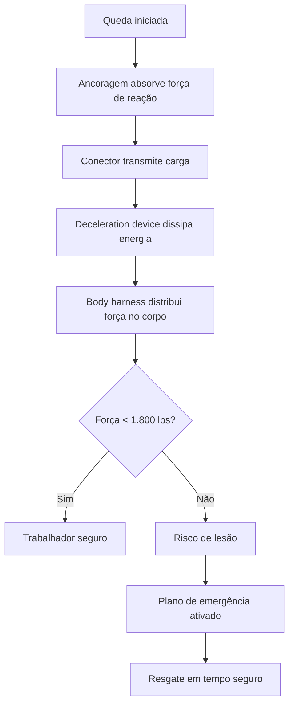

# Capítulo 5: Anatomia do Safety Harness: PFAS e as ABCDEs

## 1. Introdução

No Capítulo 4, você desenvolveu a visão sistêmica do Engenheiro de Harness — aquele profissional capaz de enxergar um sistema inteiro e entender onde cada peça encaixa. Agora é hora de desmontar o objeto real que sustenta essa visão: o sistema pessoal de travamento de queda, conhecido na indústria como PFAS (Personal Fall Arrest System) [1]. São cinco componentes interdependentes, cada um com uma função específica e limites claros. Nenhum deles funciona sozinho — e é exatamente essa interdependência que transforma cinco peças isoladas em uma ancora confiável entre você e o chão.

Neste capítulo, vamos dissecar cada letra da sigla ABCDE — Ancoragem, Body Harness, Connector, Deceleration Device e Emergency Plan — entender como cada uma contribui para dissipar a energia de uma queda, e por que a ausência de apenas uma delas pode ser a diferença entre uma rescuperação técnica e uma tragédia [2].

## 2. Explica

### O PFAS: mais que a soma das partes

Um PFAS não é simplesmente um cinturão preso a uma corda. É uma cadeia de transferência de energia projetada para um único objetivo: converter a energia cinética de uma pessoa em queda em calor e deformação controlada, mantendo a força máxima no corpo dentro do limite fisiológico seguro [1]. Esse limite, definido pela OSHA, é de 1.800 libras-força (8.000 N) — abaixo dele, a probabilidade de lesão grave reduz drasticamente. Acima dele, mesmo sem tocar o chão, o trabalhador sofre trauma [3].

A cadeia funciona assim: a ancora absorve a força de reação, o cinturão distribui essa força pelo tronco, o conector transmite a carga entre eles, o absorvedor de energia dissipa a maior parte da energia cinética, e o plano de emergência garante que ninguém fique preso indefinidamente no ar [2].

### A letra A — Ancoragem (Anchorage)

A ancora é o ponto de fixação do sistema à estrutura. Ela deve suportar no mínimo duas vezes a força de impacto do sistema — tipicamente 5.000 libras (22.240 N) para um trabalhador individual, ou ser projetada por uma pessoa qualificada para distribuir a carga entre múltiplos pontos [3]. Existe um espectro: desde âncoras estruturais permanentes (vigas de aço certificadas) até linhas de vida horizontais (HLLs) que permitem mobilidade ao longo de uma face de trabalho [1].

A ancora é frequentemente subestimada. Na prática, é o componente que mais falha em acidentes fatais — não por defeito de fabricação, mas por instalação incorreta ou uso de pontos não certificados [4]. Para o Engenheiro de Harness, isso é um padrão reconhecível: o ponto mais crítico de um sistema é frequentemente o mais negligenciado.

### A letra B — Body Harness (Cinturão de Corpo)

O cinturão de corpo completo é o único EPI de altura aceito para travamento de queda. Cinturones de quadril são proibidos porque redistribuem a força de impacto para a coluna lombar, causando lesões graves [1]. Um harness bem projetado distribui a carga por alças nos ombros, peito e coxas, mantendo o trabalhador em posição vertical mesmo após a queda.

Existem variações conforme o uso: harnesses de posicionamento (para trabalhos de curta duração suspensa), harnesses de suspensão (para operações prolongadas como limpeza de vidraças) e harnesses com resgate integrado [5]. Cada tipo resolve um problema diferente, mas todos compartilham um princípio: a força nunca pode se concentrar em um único ponto do corpo.

### A letra C — Connector (Conector)

O conector é a ponte entre o cinturão e a ancora — literalmente o elo da cadeia. Ele pode ser um Mosquetão (carabiner), um gancho de dupla trava, ou um gancho de auto-trava. O padrão ANSI Z359.1-2020 exige que o conector tenha força de ruptura mínima de 5.000 libras e trava automática para abertura involuntária [6].

A escolha do conector depende do cenário: mosquetões de trava manual são adequados para ancoragens estáticas, mas ganchos de auto-travamento são essenciais em mobilidade, onde o risco de abertura acidental é alto [1]. Um detalhe que separa o profissional do amador: o conector correto para o cenário errado é tão perigoso quanto não usar conector nenhum.

### A letra D — Deceleration Device (Dispositivo de Desaceleração)

Este é o componente que faz o trabalho pesado da dissipação de energia. Existem dois tipos principais: absorvedores de energia (que deformam uma fita de tecido para converter energia em calor) e travas de queda livre (que bloqueiam o movimento ao detectar aceleração repentina) [2].

O absorvedor de energia é o mais comum em PFAS. Ele é um pacote compacto de fita de nylon costurada que se desfaz progressivamente quando submetido a carga, esticando-se entre 1,1 e 1,8 metro durante a queda. É essa deformação que mantém a força no corpo abaixo de 1.800 libras [7]. Pense nele como um buffer de software: ele absorve o pico de demanda para que o sistema não colapse.

### A letra E — Emergency Plan (Plano de Emergência)

O plano de emergência é o componente frequentemente esquecido, mas é o que separa uma queda controlada de uma tragédia. Mesmo quando todos os quatro primeiros componentes funcionam perfeitamente, um trabalhador suspenso no ar enfrenta um risco silencioso: o suspension trauma [8].

Suspension trauma ocorre quando o trabalhador fica imobilizado no harness — as pernas penduradas, sem circulação sanguínea adequada. Em menos de 20 minutos, pode levar à perda de consciência. Em 30 a 60 minutos, pode ser fatal [8]. O plano de emergência define tempos máximos de resgate, rotas de acesso, treinamento da equipe de resgate e equipamento disponível. Não é opcional — é o último elo da cadeia de sobrevivência.

## 3. Ilustra

### A metáfora do sistema de freio de um trem

Imagine um trem descendo uma serra. O trem tem massa, velocidade e inércia — energia cinética que precisa ser dissipada antes que ele atinja o vale. O sistema de freio desse trem não depende de uma única peça: são pastilhas, discos, compressores e um circuito hidráulico trabalhando em sequência. Se qualquer um desses componentes falhar sozinho, os outros compensam parcialmente — mas se dois falharem ao mesmo tempo, o trem descarrilha.

Um PFAS funciona da mesma forma. Cada componente é um estágio de dissipação: a ancora fixa o ponto de referência, o conector transmite a força, o absorvedor de energia converte cinética em calor, o cinturão distribui a carga pelo corpo e o plano de emergência garante que o trabalhador não fique preso no ar indefinidamente. Como Engenheiro de Harness, sua tarefa não é apenas selecionar cada peça — é garantir que a cadeia inteira funcione sob carga, no pior cenário possível.

### Diagrama — Fluxo de energia na cadeia ABCDE



## 4. Técnica

### Dimensionamento da ancora: a regra das 5.000 libras

A OSHA 29 CFR 1926 Subpart M estabelece que cada ponto de ancora para PFAS deve suportar no mínimo 5.000 libras (22.240 N) por trabalhador, ou ser projetado e supervisionado por uma pessoa qualificada com fator de segurança de 2:1 [3]. Essa regra não é arbitrária — ela decorre do cálculo de energia cinética de uma queda típica.

Considere um trabalhador de 90 kg caindo 2 metros antes do absorvedor começar a atuar:

- Energia potencial: E = m × g × h = 90 × 9,81 × 2 = 1.765,8 J
- Com absorvedor esticando 1,5 m: força média = E / d = 1.765,8 / 1,5 = 1.177 N (≈ 265 lbs)

Essa força é bem abaixo do limite de 1.800 lbs — mas o pico de força no início da desaceleração pode ser 2 a 3 vezes maior. Daí a margem de 5.000 libras na ancora: ela absorve não apenas a força média, mas os picos dinâmicos que ocorrem nos primeiros milissegundos da queda [7].

```
# Cálculo simplificado de força de impacto em PFAS
# Referência: OSHA Technical Manual, Section VII

# Parâmetros do trabalhador
massa_kg = 90
gravidade = 9.81  # m/s²
queda_livre_m = 2.0  # metros antes do absorvedor atuar
distancia_absorcao_m = 1.5  # estiramento do absorvedor

# Energia potencial acumulada
energia_j = massa_kg * gravidade * queda_livre_m
print(f"Energia potencial: {energia_j:.1f} J")

# Força média de desaceleração
forca_media_n = energia_j / distancia_absorcao_m
forca_media_lbs = forca_media_n * 0.2248
print(f"Força média de desaceleração: {forca_media_n:.0f} N ({forca_media_lbs:.0f} lbs)")

# Fator de pico dinâmico (típico: 2.0 a 3.0)
fator_pico = 2.5
forca_pico_n = forca_media_n * fator_pico
forca_pico_lbs = forca_pico_n * 0.2248
print(f"Força de pico estimada: {forca_pico_n:.0f} N ({forca_pico_lbs:.0f} lbs)")
print(f"Limite OSHA: 8.000 N (1.800 lbs)")
print(f"Margem de segurança: {8000 / forca_pico_n:.1f}x")
```

### Inspeção visual do harness: checklist técnico

A OSHA 1926.502(d)(21) exige inspeção visual de cada PFAS antes de cada uso [3]. Essa inspeção segue um protocolo sistemático que o Engenheiro de Harness deve internalizar:

```
# Checklist de inspeção de harness de segurança
# Baseado em: OSHA 1926.502(d) e ANSI Z359.1-2020

inspecao = {
    "alca_ombro": {
        "verificar": ["costuras íntegras", "sem desgaste", "sem corrosão"],
        "rejeitar_se": ["fios soltos > 3mm", "descoloração química", "deformação permanente"]
    },
    "alca_coaxa": {
        "verificar": ["fecho funcional", "sem rasgos", "algema opéravel"],
        "rejeitar_se": ["fecho travado", "costura rompida", "fivela deformada"]
    },
    "anel_D_traseiro": {
        "verificar": ["centralizado na nuca", "sem rachaduras", "sem deformação"],
        "rejeitar_se": ["anel aberto", "solda rompida", "desgaste visível"]
    },
    "conector_mosquetao": {
        "verificar": ["trava automática funcional", "sem corrosão", "sem trincas"],
        "rejeitar_se": ["trava não volta sozinha", "mola fraca", "deformação do aro"]
    },
    "absorvedor_energia": {
        "verificar": ["pacote intacto", "lacre não rompido", "sem umidade"],
        "rejeitar_se": ["pacote aberto", "indicador de carga exposto", "cheiro de queimado"]
    },
    "etiqueta": {
        "verificar": ["legível", "data de fabricação visível", "norma citada"],
        "rejeitar_se": ["ilegível", "ausente", "data expirada"]
    }
}

print("=== CHECKLIST DE INSPEÇÃO VISUAL ===")
for componente, itens in inspecao.items():
    print(f"\n[{componente.upper()}]")
    for ok in itens["verificar"]:
        print(f"  ✓ Verificar: {ok}")
    for nok in itens["rejeitar_se"]:
        print(f"  ✗ Rejeitar se: {nok}")
```

### Sistema de inspeção de harness: checklist NR-35/OSHA em código

A inspeção periódica de um harness não é apenas uma tarefa visual — é um processo documental com rastreabilidade. A NR-35 (item 35.8.3) exige que cada equipamento de proteção contra queda tenha inspeção registrada antes de cada uso, com inspeção formal no mínimo a cada seis meses [3]. O script abaixo implementa um sistema completo de inspeção: checklist estruturado conforme tabela NR-35/OSHA, registro de resultados por componente, cálculo automático da próxima inspeção e geração de relatório com resultado APTO/INAPTO/CONDICIONAL.

```python
# Sistema de inspeção de harness de segurança — NR-35 / OSHA
# Referências: NR-35 item 35.8.3, OSHA 1926.502(d), ANSI Z359.1-2020
# Frequência: inspeção antes de cada uso + inspeção formal semestral

import json
from datetime import datetime, timedelta
from dataclasses import dataclass, field, asdict
from typing import Optional
from enum import Enum

# Status possíveis para cada item de inspeção
class StatusItem(Enum):
    APROVADO = "Aprovado"
    REPROVADO = "Reprovado"
    ATENCAO = "Atenção"
    NAO_APLICAVEL = "N/A"

@dataclass
class ItemInspecao:
    """Item individual do checklist de inspeção periódica."""
    codigo: str
    componente: str
    criterio: str
    status: StatusItem
    observacao: str = ""

@dataclass
class RelatorioInspecao:
    """Relatório completo de inspeção periódica de harness."""
    id_equipamento: str
    fabricante: str
    modelo: str
    data_fabricacao: str
    data_inspecao: str
    inspetor: str
    proxima_inspecao: str
    itens: list = field(default_factory=list)
    resultado_geral: str = ""

# =============================================
# TABELA NR-35 / OSHA — INSPEÇÃO PERIÓDICA
# Cada tupla: (código, componente, critério, categoria)
# =============================================
CHECKLIST_NR35 = [
    # --- COSTURAS E TEXTEIS ---
    ("C01", "Alças de ombro", "Costuras íntegras, sem fios soltos > 3mm", "costuras"),
    ("C02", "Alças de ombro", "Sem desgaste, abrasão ou descoloração química", "costuras"),
    ("C03", "Alças de coxa", "Costuras contínuas, sem rompimento", "costuras"),
    ("C04", "Alças de coxa", "Sem deformação permanente do tecido", "costuras"),
    ("C05", "Cinto dorsal", "Costura reforçada no ponto de ancoragem dorsal", "costuras"),
    # --- METALURGIA E COMPONENTES RÍGIDOS ---
    ("M01", "Anel D dorsal", "Sem rachaduras, trincas ou deformação", "metalurgia"),
    ("M02", "Anel D dorsal", "Solda íntegra, sem porosidade visível", "metalurgia"),
    ("M03", "Fivelas e ajustadores", "Travamento funcional, sem corrosão", "metalurgia"),
    ("M04", "Mosquetão / conector", "Trava automática retorna sem intervenção", "metalurgia"),
    ("M05", "Mosquetão / conector", "Aro sem deformação, superfície sem trincas", "metalurgia"),
    ("M06", "Gancho dupla trava", "Ambas as travas funcionam independentemente", "metalurgia"),
    # --- ABSORVEDOR DE ENERGIA ---
    ("A01", "Absorvedor de energia", "Pacote compacto, lacre não rompido", "absorvedor"),
    ("A02", "Absorvedor de energia", "Sem umidade, cheiro de queimado ou manchas", "absorvedor"),
    ("A03", "Absorvedor de energia", "Indicador de carga não exposto", "absorvedor"),
    ("A04", "Absorvedor de energia", "Dentro da data de validade do fabricante", "absorvedor"),
    # --- ÂNCORA E PONTOS DE FIXAÇÃO ---
    ("P01", "Ponto de ancoragem", "Fixação estrutural ≥ 22.240 N (5.000 lbs)", "ancoragem"),
    ("P02", "Ponto de ancoragem", "Sem corrosão, oxidação ou afrouxamento", "ancoragem"),
    ("P03", "Linha de vida horizontal", "Tensionamento correto, sem nós ou dobras", "ancoragem"),
    # --- DOCUMENTAÇÃO E CONFORMIDADE ---
    ("D01", "Etiqueta", "Legível: fabricante, modelo, norma, data", "documentacao"),
    ("D02", "Etiqueta", "Data de fabricação dentro do prazo de validade", "documentacao"),
    ("D03", "Registro inspeções", "Última inspeção registrada e dentro do prazo", "documentacao"),
]

def registrar_item(relatorio, codigo, componente, criterio, status, obs=""):
    """Registra o resultado de um item no relatório."""
    relatorio.itens.append(ItemInspecao(
        codigo=codigo, componente=componente,
        criterio=criterio, status=status, observacao=obs
    ))

def executar_checklist(relatorio):
    """
    Percorre o checklist NR-35 e registra resultados.
    Em produção, cada status seria preenchido pelo inspetor.
    """
    for codigo, componente, criterio, _ in CHECKLIST_NR35:
        # Simulação: todos aprovados para demonstração
        registrar_item(relatorio, codigo, componente, criterio,
                       StatusItem.APROVADO)

def calcular_proxima_inspecao(data_inspecao, intervalo_dias=180):
    """Calcula data da próxima inspeção formal (padrão semestral)."""
    data = datetime.strptime(data_inspecao, "%d/%m/%Y")
    proxima = data + timedelta(days=intervalo_dias)
    return proxima.strftime("%d/%m/%Y")

def gerar_relatorio(relatorio):
    """Gera o relatório formatado e determina se o equipamento é APTO."""
    total = len(relatorio.itens)
    aprovados = sum(1 for i in relatorio.itens if i.status == StatusItem.APROVADO)
    reprovados = sum(1 for i in relatorio.itens if i.status == StatusItem.REPROVADO)
    atencao = sum(1 for i in relatorio.itens if i.status == StatusItem.ATENCAO)

    # Regra NR-35: qualquer item REPROVADO = equipamento INAPTO
    if reprovados > 0:
        relatorio.resultado_geral = "INAPTO — retirar de uso imediatamente"
    elif atencao > 0:
        relatorio.resultado_geral = "CONDICIONAL — agendar manutenção preventiva"
    else:
        relatorio.resultado_geral = "APTO — liberado para uso"

    print("=" * 60)
    print("  RELATÓRIO DE INSPEÇÃO PERIÓDICA — HARNESS DE SEGURANÇA")
    print("  Norma: NR-35 / OSHA 1926.502 / ANSI Z359.1-2020")
    print("=" * 60)
    print(f"  Equipamento: {relatorio.id_equipamento}")
    print(f"  Fabricante:  {relatorio.fabricante}")
    print(f"  Modelo:      {relatorio.modelo}")
    print(f"  Fabricação:  {relatorio.data_fabricacao}")
    print(f"  Inspeção:    {relatorio.data_inspecao}")
    print(f"  Próxima:     {relatorio.proxima_inspecao}")
    print(f"  Inspetor:    {relatorio.inspetor}")
    print("-" * 60)

    # Detalhamento agrupado por componente
    categorias = {}
    for item in relatorio.itens:
        categorias.setdefault(item.componente, []).append(item)

    icones = {"Aprovado": "✓", "Reprovado": "✗", "Atenção": "!", "N/A": "-"}
    for categoria, itens in categorias.items():
        print(f"\n  [{categoria.upper()}]")
        for item in itens:
            icon = icones.get(item.status.value, "?")
            print(f"    {icon} {item.codigo}: {item.criterio}")
            if item.observacao:
                print(f"      → {item.observacao}")

    print("\n" + "=" * 60)
    print(f"  RESUMO: {aprovados}/{total} aprovados | "
          f"{reprovados} reprovados | {atencao} atenção")
    print(f"  RESULTADO: {relatorio.resultado_geral}")
    print("=" * 60)
    return relatorio.resultado_geral

# =============================================
# EXECUÇÃO PRINCIPAL
# =============================================
if __name__ == "__main__":
    relatorio = RelatorioInspecao(
        id_equipamento="HARNESS-2024-0047",
        fabricante="MSA Safety",
        modelo="V-Series Full Body",
        data_fabricacao="15/03/2024",
        data_inspecao=datetime.now().strftime("%d/%m/%Y"),
        inspetor="Eng. João Silva — CREA 12345",
        proxima_inspecao=""
    )

    # Calcular próxima inspeção (semestral conforme NR-35)
    relatorio.proxima_inspecao = calcular_proxima_inspecao(
        relatorio.data_inspecao, intervalo_dias=180
    )

    executar_checklist(relatorio)
    resultado = gerar_relatorio(relatorio)

    # Exportar JSON para rastreabilidade
    with open("relatorio_inspecao.json", "w", encoding="utf-8") as f:
        json.dump(asdict(relatorio), f, ensure_ascii=False, indent=2, default=str)
    print("\n  Arquivo exportado: relatorio_inspecao.json")
```

A tabela acima segue a estrutura de inspeção periódica da NR-35: cada componente do PFAS é avaliado contra critérios objetivos de rejeição, e o resultado final é determinístico — qualquer item reprovado torna o equipamento inapto para uso [3][13]. A exportação em JSON permite integração com sistemas de gestão de EPI e rastreabilidade de inspeções ao longo da vida útil do equipamento.

### Cálculo do tempo seguro de suspensão

O plano de emergência não é vago — ele depende de um cálculo. Estudos mostram que trabalhadores suspensos em harness podem perder a consciência em 10 a 30 minutos, dependendo do ajuste do cinturão e da condição física [8]. O tempo seguro de resgate é tipicamente definido como metade do tempo estimado até perda de consciência:

```
# Cálculo do tempo seguro de resgate
# Referência: HSE Guidelines e literatura de suspension trauma

# Tempo estimado até perda de consciência (em minutos)
# Variável conforme ajuste do harness e condição física
tempo_perda_consciencia_min = 20  # cenário conservador

# Fator de segurança para o plano de emergência
fator_seguranca = 0.5  # resgate deve ocorrer em 50% do tempo

tempo_seguro_min = tempo_perda_consciencia_min * fator_seguranca

print(f"=== TEMPO SEGURO DE RESGATE ===")
print(f"Tempo estimado até perda de consciência: {tempo_perda_consciencia_min} min")
print(f"Fator de segurança: {fator_seguranca}")
print(f"Tempo máximo de resgate permitido: {tempo_seguro_min:.0f} minutos")
print(f"")
print(f"IMPORTANTE: Esse tempo deve constar no plano de emergência.")
print(f"Equipe de resgate deve ser treinada e posicionada para")
print(f"garantir resgate dentro de {tempo_seguro_min:.0f} minutos.")
```

### Interação entre componentes: o diagrama de Fall Factor

O Fall Factor é a métrica que relaciona a queda livre com o comprimento do conector. É o indicador mais importante de risco em um PFAS:

- **Fall Factor 0**: ancora acima do trabalhador, sem queda livre. Risco mínimo.
- **Fall Factor 1**: queda livre igual ao comprimento do conector. Impacto moderado.
- **Fall Factor 2**: queda livre dupla ao comprimento do conector. Impacto severo.

Quanto menor o Fall Factor, menos energia o absorvedor precisa dissipar. O Engenheiro de Harness projeta o sistema para manter o Fall Factor o mais próximo de zero possível — posicionando a ancora acima do trabalhador e minimizando o comprimento do conector [1].

## 5. Aplica

Você está em uma obra de reforma de fachada. Seu time precisa lavar as vidraças do 15º andar — 45 metros acima do nível do solo. O encarregado entrega um harness de quadril que estava "guardado no almoxarifado" e diz: "Esse serve, é igualzinho aos novos." Você olha e vê que não é um harness de corpo completo — é um cinturão de posicionamento sem anel D dorsal, sem absorvedor de energia, e a etiqueta está completamente ilegível [9].

Aqui está o que acontece se você seguir o conselho do encarregado: o trabalhador sobe, se ancora com um Mosquetão no cinto de quadril, e começa a trava. Se ele escorregar, a força de impacto se concentra na coluna lombar — não nos ombros e coxas. Não há absorvedor para dissipar a energia. A força no corpo pode facilmente ultrapassar 8.000 N. O resultado é trauma na coluna, mesmo sem atingir o chão [1].

Agora imagine o cenário correto: você recusa o equipamento inadequado, solicita um harness de corpo completo classe II com anel D dorsal, inspeciona cada componente com o checklist visual, calcula o Fall Factor com base na geometria do local, e garante que o plano de emergência define resgate em no máximo 10 minutos — metade do tempo seguro para suspensão [8]. Esse é o trabalho do Engenheiro de Harness: não apenas usar o EPI certo, mas dimensionar o sistema inteiro para o cenário real.

### Armadilhas comuns e como evitá-las

1. **Ancoragem abaixo do trabalhador**: maximiza o Fall Factor e a energia de impacto. Regra de ouro: ancora sempre acima.
2. **Usar absorvedor de energia mais de uma vez**: um absorvedor que já foi submetido a carga perde sua capacidade de dissipação. Substitua imediatamente após qualquer uso em queda.
3. **Ignorar o plano de emergência**: ter o PFAS perfeito não adianta se ninguém sabe resgatar o trabalhador em 10 minutos. Treine o resgate antes de o incidente acontecer.
4. **Não inspecionar antes de cada uso**: um conector com mola enferrujada pode abrir durante a queda. Uma inspeção de 30 segundos pode salvar uma vida.
5. **Confundir cinturão de posicionamento com harness de travamento**: posicionamento é para trabalhos estáticos de curta duração. Travamento requer corpo completo e absorvedor.

## 6. Conclusão

Três pontos ficam desta análise: primeiro, o PFAS é uma cadeia — cinco componentes que só funcionam juntos, onde a falha de um sobrecarrega todos os outros. Segundo, a dissipação de energia não é opcional: sem um absorvedor dimensionado corretamente, a força de impacto pode matar mesmo sem contato com o chão. Terceiro, o plano de emergência é o que transforma uma queda controlada em uma resuperação técnica — e sua ausência transforma em tragédia.

Como Engenheiro de Harness, agora você domina a anatomia do sistema que sustenta vidas. Mas conhecer a estrutura não basta — no próximo capítulo, vamos aprender a analisar onde ela pode falhar. A Análise de Falhas: FMEA, FTA e Fail-Safe vai mostrar como pensar sistematicamente sobre o que pode dar errado, antes que aconteça.

## 7. Referências Bibliográficas

[1] WIKIPEDIA. Safety harness. Disponível em: https://en.wikipedia.org/wiki/Safety_harness. Acesso em: 2026.

[2] WIKIPEDIA. Personal fall arrest system. Disponível em: https://en.wikipedia.org/wiki/Personal_fall_arrest_system. Acesso em: 2026.

[3] OCCUPATIONAL SAFETY AND HEALTH ADMINISTRATION (OSHA). 29 CFR 1926 Subpart M — Fall Protection. Washington: U.S. Department of Labor, 2024.

[4] WIKIPEDIA. Fall arrest. Disponível em: https://en.wikipedia.org/wiki/Fall_arrest. Acesso em: 2026.

[5] WIKIPEDIA. Suspension trauma. Disponível em: https://en.wikipedia.org/wiki/Suspension_trauma. Acesso em: 2026.

[6] AMERICAN SOCIETY OF SAFETY PROFESSIONALS (ASSP). ANSI/ASSP Z359.1-2020 — Fall Protection Code. Des Plaines: ASSP, 2020.

[7] NATIONAL INSTITUTE FOR OCCUPATIONAL SAFETY AND HEALTH (NIOSH). Worker Deaths by Falls: A Summary of Surveillance Findings and Investigative Case Reports. Cincinnati: DHHS, 2023.

[8] HEALTH AND SAFETY EXECUTIVE (HSE). Suspension trauma and orthostatic intolerance. Sudbury: HSE Books, 2022.

[9] WIKIPEDIA. Harness. Disponível em: https://en.wikipedia.org/wiki/Harness. Acesso em: 2026.

[10] CANADIAN STANDARDS ASSOCIATION (CSA). CSA Z259.10-12 (R2016) — Full body harness. Toronto: CSA Group, 2016.

[11] WORLD HEALTH ORGANIZATION (WHO). Global Estimates of Occupational Accidents and Work-related Illnesses. Geneva: WHO/ILO, 2023.

[12] INTERNATIONAL ORGANIZATION FOR STANDARDIZATION (ISO). ISO 45001:2018 — Occupational health and safety management systems. Geneva: ISO, 2018.

[13] 3M COMPANY. Fall Protection Equipment Inspection Guide. St. Paul: 3M, 2024.

[14] HONEYWELL SAFETY PRODUCTS. Fall Protection Technical Reference. Charlotte: Honeywell, 2023.

[15] MSA SAFETY COMPANY. The Fundamentals of Fall Protection. Cranberry Township: MSA, 2024.

[16] AMERICAN SOCIETY OF SAFETY PROFESSIONALS (ASSP). ANSI/ASSP Z359.11-2014 — Full body harness. Des Plaines: ASSP, 2014.
