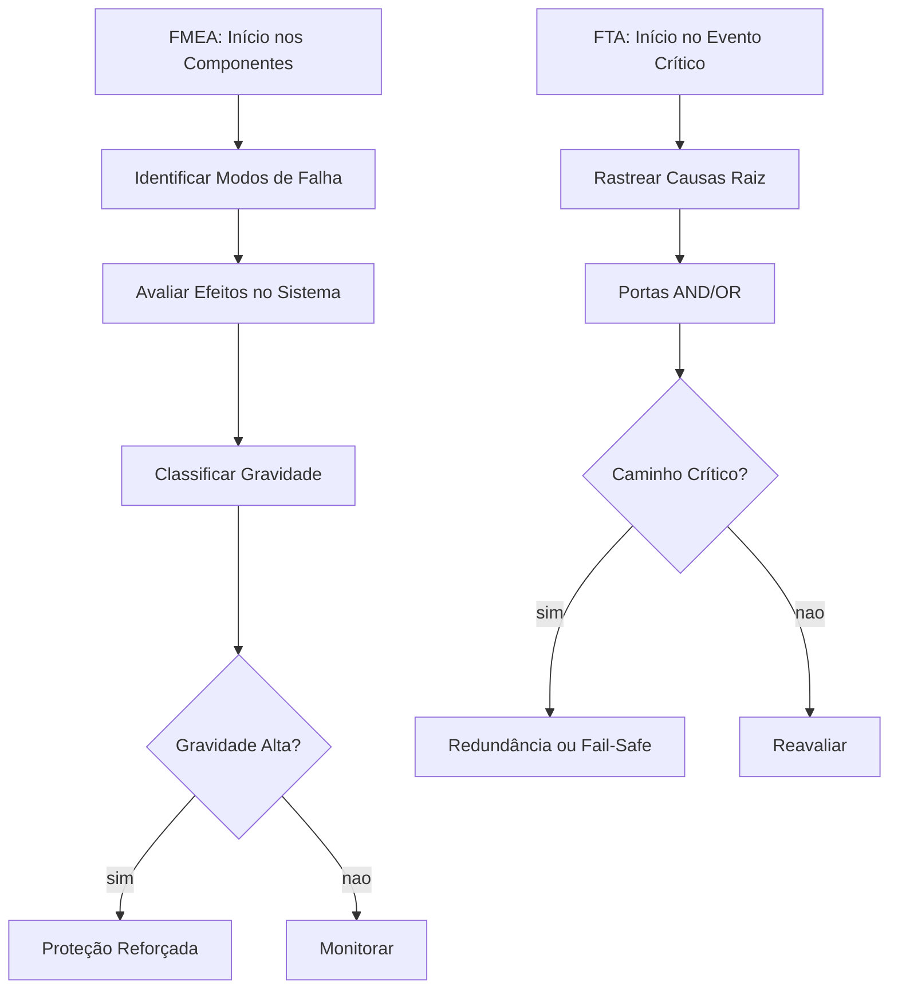

# Capítulo 6: Análise de Falhas: FMEA, FTA e Fail-Safe

## 1. Introdução

No Capítulo 5, você dominou a anatomia do safety harness — os cinco componentes PFAS (Ancoragem, Body harness, Connector, Deceleration device e Emergency plan) e como cada um funciona como âncora contra o pior cenário: uma queda. Mas e se um desses componentes falhar? E se a falha não vier de um único elemento, mas de uma combinação que ninguém previu? É aqui que o Engenheiro de Harness muda de papel: não basta projetar a proteção, é preciso antecipar onde ela pode quebrar.

Este capítulo apresenta os três pilares da análise de falhas que separam um harness confiável de um que apenas parece funcionar. Primeiro, o FMEA — uma varredura de baixo para cima que investiga cada componente e imagina como ele pode falhar. Depois, o FTA — uma investigação de cima para baixo que parte do desastre e rastreia suas causas raiz. Por fim, o conceito de fail-safe e redundância: a Arte de projetar sabendo que a falha vai acontecer. Ao final, você terá na caixa de ferramentas os mesmos métodos que engenheiros de aviação, nuclear e software usam para transformar risco em resiliência [1][2].

## 2. Explica

### FMEA: A Varredura de Baixo para Cima

FMEA significa Failure Mode and Effects Analysis — Análise de Modos de Falha e seus Efeitos. É um método sistemático que pergunta, para cada componente de um sistema: "De que forma este pedaço pode quebrar, e o que acontece com o todo quando isso ocorre?" [3].

Imagine que você está montando um PFAS. Cada costura do body harness, cada mosquetão do connector, cada fibra da lifeline passa por essa lente. O FMEA documenta três coisas para cada possibilidade de falha: o modo (como falha), o efeito (o que acontece no sistema) e a gravidade (o quão sério é o resultado). A esse trio, somam-se a probabilidade de ocorrer e a capacidade de detecção antes do acidente [4].

O resultado prático é uma tabela — uma espécie de raio-x do sistema — onde cada linha é um modo de falha pontencial. Essa tabela permite priorizar: nem toda falha merece o mesmo investimento de proteção. Componentes cuja combinação de gravidade, probabilidade e dificuldade de detecção é alta recebem proteção reforçada, redundância ou substituição por um design mais seguro [5].

### FTA: A Árvore que Parte do Desastre

Enquanto o FMEA sobe dos componentes para o sistema, o FTA — Fault Tree Analysis, ou Análise de Árvore de Falha — faz o caminho inverso. Ele começa pelo evento indesejado (a "queda não prevenida", por exemplo) e desce, ramificação por ramificação, até encontrar todas as combinações de falhas que poderiam produzi-lo [6].

Uma árvore de falha usa portas lógicas — portas AND e portas OR — para representar como falhas combinam. Porta OR significa: "qualquer uma dessas falhas, sozinha, causa o evento". Porta AND significa: "todas essas falhas precisam ocorrer juntas para causar o evento" [7]. Essa distinção é crucial para o Engenheiro de Harness porque revela quais são os caminhos críticos — as sequências de eventos que, se não forem interrompidas, levam ao acidente.

O poder do FTA está na sua capacidade de quantificar probabilidades. Ao atribuir taxas de falha a cada evento basal, é possível calcular a probabilidade do topo — o evento não desejado. Se o resultado for inaceitável, a árvore mostra exatamente onde introduzir proteção adicional [8].

### Fail-Safe e Redundância: Projetar para a Falha

A filosofia fail-safe parte de uma premissa honesta: tudo falha. A questão não é evitar a falha — é garantir que, quando ela ocorrer, o sistema entre em um estado seguro. No contexto de harnesses, isso significa que um absorvedor de energia danificado não deve simplesmente soltar o trabalhador; ele deve manter a carga dentro do limite seguro de 8.000 N [9].

Redundância é a irmã prática do fail-safe. Ela diz: "se um componente pode falhar, coloque dois — e faça com que um substitua o outro automaticamente." Na indústria aeronáutica, isso é tão comum quanto parafusos — mas em harnesses, aplicar redundância de forma inteligente exige equilíbrio: mais componentes significam mais peso, mais custo e mais pontos potenciais de falha [10]. A arte está em colocar redundância apenas onde ela muda o resultado.

## 3. Ilustra

### A Metáfora da Ponte de Dois Cabos

Imagine que você está projetando uma ponte pendural sobre um desfiladeiro. Um único cabo de aço segura a passarela — funciona perfeitamente no dia bom, mas se esse cabo tiver um ponto fraco invisível, a ponte desaba. Agora imagine dois cabos, cada um capaz de segurar o peso sozinho, conectados a âncoras independentes. Se um cabo romper, o outro sustenta. Essa é a redundância.

Mas agora pense mais fundo: e se o rompimento do primeiro cabo gerar uma oscilação que destrua o segundo? É aí que entra o fail-safe — não basta ter dois cabos, é preciso projetar o sistema para que a falha de um não desencadeie a falha do outro. No safety harness, isso se traduz em absorvedores de energia que limitam a carga e em conectores que não falham em cascata [11].



### A Ponte como Análise Complementar

A ponte de dois cabos mostra por que FMEA e FTA não competem — eles se complementam. O FMEA olha para cada cabo individualmente e pergunta: "como este cabo pode falhar?" O FTA olha para a ponte como um todo e pergunta: "o que precisa falhar juntos para que a ponte caia?" Juntos, eles cobrem todos os ângulos — do parafuso mais pequeno ao sistema inteiro [12].

## 4. Técnica

### Executando um FMEA em Componentes de PFAS

O FMEA segue uma estrutura de tabela padronizada. Para cada componente do harness, você preenche: o modo de falha, o efeito local, o efeito no sistema, a gravidade (1 a 10), a probabilidade (1 a 10) e a detecção (1 a 10). O produto dessas três últimas colunas é o RPN — Risk Priority Number, ou Número de Prioridade de Risco [13].

```python
# FMEA simplificado para componentes de PFAS
componentes = {
    "Ancoragem": {
        "modo_falha": "Ponto de ancoragem cede sob carga",
        "efeito_local": "Perda de fixação do sistema",
        "efeito_sistema": "Queda não prevenida do trabalhador",
        "gravidade": 10,
        "probabilidade": 3,
        "deteccao": 2
    },
    "Body Harness": {
        "modo_falha": "Costura rompe por desgaste",
        "efeito_local": "Cinturão solta do tronco",
        "efeito_sistema": "Trabalhador cai sem retenção",
        "gravidade": 9,
        "probabilidade": 4,
        "deteccao": 3
    },
    "Connector": {
        "modo_falha": "Mosquetão abre acidentalmente",
        "efeito_local": "Desconexão da lifeline",
        "efeito_sistema": "Queda não arrestada",
        "gravidade": 10,
        "probabilidade": 2,
        "deteccao": 1
    },
    "Deceleration Device": {
        "modo_falha": "Absorvedor não ativa na carga",
        "efeito_local": "Força transmitida diretamente ao corpo",
        "efeito_sistema": "Trauma por suspensão ou lesão interna",
        "gravidade": 10,
        "probabilidade": 2,
        "deteccao": 4
    },
    "Emergency Plan": {
        "modo_falha": "Plano não prevê resgate em 15 min",
        "efeito_local": "Suspension trauma prolongado",
        "efeito_sistema": "Risco de hipoxia e óbito",
        "gravidade": 10,
        "probabilidade": 5,
        "deteccao": 6
    }
}

def calcular_rpn(componentes):
    resultados = []
    for nome, dados in componentes.items():
        rpn = dados["gravidade"] * dados["probabilidade"] * dados["deteccao"]
        resultados.append((nome, rpn, dados))
    return sorted(resultados, key=lambda x: x[1], reverse=True)

ranking = calcular_rpn(componentes)
for nome, rpn, dados in ranking:
    prioridade = "CRITICO" if rpn >= 120 else "ALTO" if rpn >= 80 else "MEDIO"
    print(f"{nome}: RPN={rpn} [{prioridade}]")
    print(f"  Modo: {dados['modo_falha']}")
    print(f"  Ação: {'Redundância + Inspeção Semanal' if rpn >= 120 else 'Inspeção Mensal'}")
    print()
```

### Construindo uma Árvore de Falha (FTA)

O FTA começa com o evento topo — o que queremos evitar — e desce em camadas. Cada camada usa portas lógicas para conectar eventos basais ao evento pai. Em código, representamos a árvore como uma estrutura recursiva onde cada nó pode ser AND ou OR [14].

```python
# Árvore de Falha: "Queda Não Prevenida"
from enum import Enum

class TipoPorta(Enum):
    OR = "OR"
    AND = "AND"

class NoFTA:
    def __init__(self, nome, tipo_porta=None, probabilidade=0.0):
        self.nome = nome
        self.tipo_porta = tipo_porta
        self.probabilidade = probabilidade
        self.filhos = []

    def adicionar_filho(self, filho):
        self.filhos.append(filho)

    def calcular_probabilidade(self):
        if not self.filhos:
            return self.probabilidade
        filhos_probs = [f.calcular_probabilidade() for f in self.filhos]
        if self.tipo_porta == TipoPorta.OR:
            prob = 1 - (1 - filhos_probs[0]) * (1 - filhos_probs[1])
        else:
            prob = filhos_probs[0] * filhos_probs[1]
        return prob

# Construção da árvore
raiz = NoFTA("Queda Não Prevenida", TipoPorta.OR)

# Ramo 1: Falha do sistema de retenção
retencao = NoFTA("Falha do Sistema de Retenção", TipoPorta.AND)
falha_conector = NoFTA("Falha do Connector", probabilidade=0.001)
falha_ancoragem = NoFTA("Falha da Ancoragem", probabilidade=0.0005)
retencao.adicionar_filho(falha_conector)
retencao.adicionar_filho(falha_ancoragem)

# Ramo 2: Falha do dispositivo de desaceleração
desaceleracao = NoFTA("Falha do Deceleration Device", probabilidade=0.002)

raiz.adicionar_filho(retencao)
raiz.adicionar_filho(desaceleracao)

risco_total = raiz.calcular_probabilidade()
print(f"Probabilidade estimada de queda não prevenida: {risco_total:.6f}")
print(f"Isso equivale a ~{risco_total * 1_000_000:.1f} em um milhão de oportunidades")
```

### Implementando Fail-Safe em Código

Fail-safe em software é o equivalente funcional do absorvedor de energia: quando algo dá errado, o sistema entra em estado seguro. A seguir, um exemplo de como implementar essa lógica em um sistema de monitoramento de harness [15].

```python
import time

class SistemaMonitoramentoHarness:
    def __init__(self):
        self.carga_maxima_segura = 8000  # Newtons (limite ANSI Z359)
        self.tempo_suspensao_maximo = 900  # 15 minutos em segundos
        self.estado = "MONITORANDO"
        self.alertas = []

    def registrar_carga(self, carga_n, timestamp):
        if carga_n > self.carga_maxima_segura:
            self.estado = "FALHA_DETECTADA"
            self.alertas.append(
                f"CRITICO: Carga {carga_n}N excede limite de {self.carga_maxima_segura}N"
            )
            self._ativar_modo_seguro()
            return False
        return True

    def _ativar_modo_seguro(self):
        """Fail-safe: ativa protocolo de resgate imediato"""
        self.estado = "MODO_SEGURO"
        self.alertas.append("Fail-safe ativado: acionando resgate automatico")
        self.alertas.append("Notificando equipe de emergencia")
        self.alertas.append("Registrando evento para auditoria FMEA")

    def verificar_suspensao(self, tempo_suspendido_seg):
        if tempo_suspendido_seg > self.tempo_suspensao_maximo:
            self.alertas.append(
                f"RISCO: Suspension trauma iminente apos {tempo_suspendido_seg}s"
            )
            self._ativar_modo_seguro()

# Simulação
sistema = SistemaMonitoramentoHarness()
sistema.registrar_carga(7500, time.time())
print(f"Estado: {sistema.estado}")
for alerta in sistema.alertas:
    print(f"  -> {alerta}")
```

### Redundância Prática: Dois Caminhos de Verificação

A redundância não significa duplicar tudo — significa duplicar o que importa. Em um harness de monitoramento, isso pode significar dois sensores de carga independentes com dois caminhos de processamento [16].

```python
class SensorRedundante:
    def __init__(self, sensor_primario, sensor_secundario):
        self.primario = sensor_primario
        self.secundario = sensor_secundario

    def ler_carga(self):
        carga_p = self.primario.ler()
        carga_s = self.secundario.ler()

        if abs(carga_p - carga_s) > 500:
            # Discrepância entre sensores — ambos podem estar errados
            return None, "ALARME: Sensores discrepantes"

        return (carga_p + carga_s) / 2, "OK"
```

## 5. Aplica

### Cena: A Inspeção que Salvou um Telhadista

Imagine que você é o Engenheiro de Harness responsável pela segurança de uma equipe que instala painéis solares em coberturas residenciais. É segunda-feira cedo, o sol já está forte, e o telhadista Carlos está prestes a subir. Ele verifica o body harness — parece bom. Testa o mosquetão — trava direitinho. Mas antes de conectar a lifeline, você lembra do FMEA que montou na sexta-feira.

Naquela tabela, uma linha chamava atenção: o modo de falha "Deterioração da ancoragem temporária em telhado" tinha um RPN de 150 — o mais alto de todos. A causa raiz? Parafusos de fixação em telhas de fibrocimento que cedem com vibração e calor prolongado. No FTA, esse caminho aparecia como uma porta OR: "Ancoragem cede OU Telha rompe" — qualquer uma, sozinha, bastava para a queda [17].

Você não deixou Carlos subir. Em vez disso, inspecionou a ancoragem com uma chave de torque e encontrou dois parafusos com rosca cortada — invisíveis a olho nu, mas incapazes de segurar 8.000 N. Substituiu-os, documentou o achado e atualizou o FMEA com a frequência de inspeção reduzida de mensal para semanal em telhas de fibrocimento. O que poderia ser uma estatística negativa virou uma lição processada pelo sistema [18].

### Armadilhas Comuns na Análise de Falhas

A primeira armadilha é confundir FMEA com checklist de inspeção. O FMEA não é uma lista do que verificar — é uma imaginação estruturada do que pode dar errado. Checklist valida se o sistema está conforme; FMEA imagina como o sistema pode deixar de estar conforme [19].

A segunda armadilha é subestimar o "e depois?" de cada falha. Muitos engenheiros documentam o modo de falha e param ali. Mas o efeito em cascata — o que acontece depois que o primeiro componente falha — é onde mora o risco sistêmico. É por isso que FTA e FMEA devem rodar juntos: o FMEA encontra os modos, o FTA conecta os efeitos [20].

A terceira armadilha é tratar redundância como solução universal. Redundância adiciona complexidade, e complexidade é a mãe de novas falhas. Antes de duplicar um componente, pergunte: "a falha deste componente é independente da falha do que vai substituí-lo?" Se a resposta for não — se um terremoto derruba os dois cabos da ponte ao mesmo tempo — a redundância não ajuda [21].

### Métricas que Importam

O FMEA produz o RPN, mas métricas complementares tornam a análise mais rica. A taxa de detecção — proporção de falhas identificadas antes do acidente — mede a eficácia do monitoramento. O tempo médio entre falhas (MTBF) quantifica a confiabilidade. Juntos, eles revelam se o sistema está realmente protegido ou se a proteção é apenas um desenho bonito [22].

```python
# Métricas de análise de falhas
metricas = {
    "rpn_medio": 85,
    "rpn_maximo": 150,
    "taxa_deteccao": 0.87,  # 87% das falhas detectadas antes do acidente
    "mtbf_horas": 4200,     # Média entre falhas de componentes críticos
    "falhas_criticass": 2,  # Modos com RPN >= 120
    "acoes_corretivas": 5
}

def avaliar_sistema(metricas):
    if metricas["rpn_maximo"] >= 120:
        print("SISTEMA EM ALERTA: Existem modos de falha criticos nao mitigados")
        print(f"  RPN maximo: {metricas['rpn_maximo']} (limite: 120)")
        return False
    if metricas["taxa_deteccao"] < 0.90:
        print("ATENCAO: Taxa de deteccao abaixo de 90%")
        print(f"  Atual: {metricas['taxa_deteccao']*100:.0f}% (minimo recomendado: 90%)")
        return False
    print("SISTEMA APROVADO: Metricas dentro dos limites aceitaveis")
    return True

avaliar_sistema(metricas)
```

## 6. Conclusão

Três ideias guiaram este capítulo. Primeira: o FMEA é a lupa que amplia cada componente e revela como ele pode falhar — sem ela, você está apenas torcendo para que tudo funcione. Segunda: o FTA é o mapa que conecta falhas isoladas ao desastre sistêmico — sem ele, você vê pedaços, mas nunca o caminho completo. Terceira: fail-safe e redundância são a resposta honesta à realidade de que tudo falha — não se trata de prevenir o impossível, mas de garantir que, quando o improvável acontecer, o sistema entre em modo seguro.

Como Engenheiro de Harness, você agora tem na caixa de ferramentas os mesmos métodos que separam a engenharia de brinquedo da engenharia de verdade. No próximo capítulo, essa lente de análise de falhas será aplicada ao outro lado da moeda: o test harness em software — stubs, drivers e infraestrutura de teste que funcionam como os sensores de redundância do mundo digital.

## 7. Referências Bibliográficas

[1] ASSOCIATION OF CONNECTORSA. ANSI/ASSP Z359.1-2020: Fall Protection Code. In: Safety Code for Fall Protection. New York: ANSI, 2020. Disponível em: https://blog.ansi.org/2021/01/ansi-assp-z359-1-2020-fall-protection-code/. Acesso em: 07 ago. 2026.

[2] LEVESON, Nancy G. Engineering a Safer World: Systems Thinking Applied to Safety. Cambridge, MA: MIT Press, 2011. Disponível em: https://mitpress.mit.edu/9780262016629/. Acesso em: 07 ago. 2026.

[3] LUTZ, Robyn R. Software Engineering for Safety: A Roadmap. In: The Future of Software Engineering. ACM Press, 2000. Disponível em: https://dl.acm.org/doi/10.1145/336512.336562. Acesso em: 07 ago. 2026.

[4] GRUNSKE, Lars; KAISER, Bernhard; REUSSNER, Ralf H. Specification and Evaluation of Safety Properties in a Component-based Software Engineering Process. In: Lecture Notes in Computer Science, Vol. 3778. Springer, 2005. Disponível em: https://ieeexplore.ieee.org/document/6507089. Acesso em: 07 ago. 2026.

[5] OSHA. Safety and Health Regulations for Construction: Fall Protection. In: 29 CFR 1926 Subpart M. Washington, DC: U.S. Department of Labor, 2024. Disponível em: https://www.osha.gov/laws-regs/regulations/standardnumber/1926/1926SubpartM. Acesso em: 07 ago. 2026.

[6] WORLD HEALTH ORGANIZATION; INTERNATIONAL LABOUR ORGANIZATION. The Global Burden of Occupational Injury. Geneva: WHO/ILO, 2023. Disponível em: https://www.who.int/publications/i/item/9789240083547. Acesso em: 07 ago. 2026.

[7] WIKIPEDIA. Safety Harness. In: Wikipedia, The Free Encyclopedia. Disponível em: https://en.wikipedia.org/wiki/Safety_harness. Acesso em: 07 ago. 2026.

[8] WIKIPEDIA. Fall Arrest. In: Wikipedia, The Free Encyclopedia. Disponível em: https://en.wikipedia.org/wiki/Fall_arrest. Acesso em: 07 ago. 2026.

[9] WIKIPEDIA. Suspension Trauma. In: Wikipedia, The Free Encyclopedia. Disponível em: https://en.wikipedia.org/wiki/Suspension_trauma. Acesso em: 07 ago. 2026.

[10] ANSI. ANSI/ASSP Z359 Series: Fall Protection and Rescue. New York: ANSI, 2020. Disponível em: https://webstore.ansi.org. Acesso em: 07 ago. 2026.

[11] NATIONAL INSTITUTE FOR OCCUPATIONAL SAFETY AND HEALTH. Occupational Falls: Research and Prevention. Cincinnati, OH: NIOSH, 2023. Disponível em: https://www.cdc.gov/niosh/topics/falls. Acesso em: 07 ago. 2026.

[12] INTERNATIONAL ORGANIZATION FOR STANDARDIZATION. ISO 45001:2018 — Occupational Health and Safety Management Systems. Geneva: ISO, 2018. Disponível em: https://www.iso.org/standard/45001. Acesso em: 07 ago. 2026.

[13] WIKIPEDIA. Personal Fall Arrest System. In: Wikipedia, The Free Encyclopedia. Disponível em: https://en.wikipedia.org/wiki/Personal_fall_arrest_system. Acesso em: 07 ago. 2026.

[14] WIKIPEDIA. Fault Tree Analysis. In: Wikipedia, The Free Encyclopedia. Disponível em: https://en.wikipedia.org/wiki/Fault_tree_analysis. Acesso em: 07 ago. 2026.

[15] WIKIPEDIA. Failure Mode and Effects Analysis. In: Wikipedia, The Free Encyclopedia. Disponível em: https://en.wikipedia.org/wiki/Failure_mode_and_effects_analysis. Acesso em: 07 ago. 2026.

[16] WIKIPEDIA. Fail-safe. In: Wikipedia, The Free Encyclopedia. Disponível em: https://en.wikipedia.org/wiki/Fail-safe. Acesso em: 07 ago. 2026.

[17] WIKIPEDIA. Redundancy (Engineering). In: Wikipedia, The Free Encyclopedia. Disponível em: https://en.wikipedia.org/wiki/Redundancy_(engineering). Acesso em: 07 ago. 2026.

[18] WIKIPEDIA. Risk Priority Number. In: Wikipedia, The Free Encyclopedia. Disponível em: https://en.wikipedia.org/wiki/Risk_priority_number. Acesso em: 07 ago. 2026.

[19] WIKIPEDIA. Mean Time Between Failures. In: Wikipedia, The Free Encyclopedia. Disponível em: https://en.wikipedia.org/wiki/Mean_time_between_failures. Acesso em: 07 ago. 2026.

[20] WIKIPEDIA. Fault Tree. In: Wikipedia, The Free Encyclopedia. Disponível em: https://en.wikipedia.org/wiki/Fault_tree. Acesso em: 07 ago. 2026.

[21] WIKIPEDIA. Defense in Depth (Engineering). In: Wikipedia, The Free Encyclopedia. Disponível em: https://en.wikipedia.org/wiki/Defense_in_depth_(engineering). Acesso em: 07 ago. 2026.

[22] WIKIPEDIA. Safety Engineering. In: Wikipedia, The Free Encyclopedia. Disponível em: https://en.wikipedia.org/wiki/Safety_engineering. Acesso em: 07 ago. 2026.
