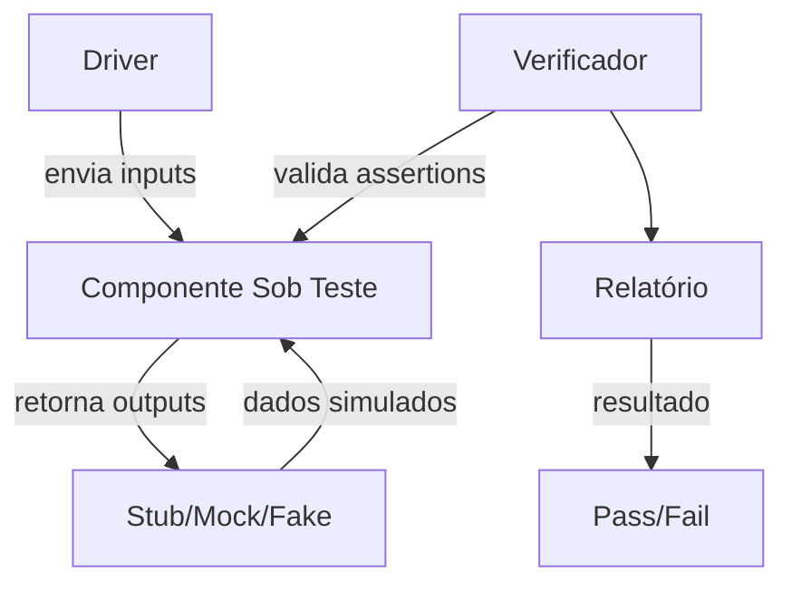

# Capítulo 7: Anatomia do Test Harness — Stubs, Drivers e Infraestrutura de Teste

## 1. Introdução

No Capítulo 6, você dominou os métodos de análise de falha — FMEA e FTA — que tornam o safety harness confiável ao anteciparmodos de falha antes que eles ocorram. Agora, é hora de cruzar a ponte entre os dois eixos do livro: de safety harness para test harness.

Um test harness em software funciona exatamente como o safety harness que você já conhece — mas em vez de proteger um trabalhador em altura, ele protege o código contra comportamento inesperado. É um ambiente controlado que simula o mundo real para que você possa validar se o software funciona como promete, antes que ele encontre o usuário final. Como Engenheiro de Harness, você vai ver que os mesmos princípios de ancora, amplificação e proteção que governam a corda de segurança governam também os stubs, mocks e drivers que compõem a infraestrutura de teste.

## 2. Explica

### O que é um test harness?

Test harness é o conjunto de ferramentas, stubs, drivers, dados e configurações que permite executar um componente de software em ambiente controlado, isolado do mundo real [1]. Pense nele como a estação de ancoragem no safety harness — é onde tudo se liga antes de você sair do chão.

No safety harness, temos a âncora, o conector e o absorvedor de energia. No test harness, temos:

- **Stubs**: substitutos de componentes externos que retornam dados previsíveis — equivalentes às âncoras que seguram o sistema no lugar seguro.
- **Drivers**: módulos que chamam o componente sob teste, fornecendo inputs controlados — equivalentes aos conectores que ligam o trabalhador ao sistema de ancoragem.
- **Mocks**: stubs com comportamento verificável, capazes de registrar chamadas e validá-las事后 — equivalentes aos sensores que monitoram se a carga não excedeu o limite.
- **Fakes**: implementações simplificadas de componentes complexos (como bancos de dados) — equivalentes às simulações de carga usadas em testes de laboratório antes do campo [2].

### A hierarquia de testes: unitário, integração, sistema

Assim como a hierarquia de controles do Capítulo 3 nos ensina a priorizar proteções, a pirâmide de testes estabelece uma hierarquia de validação:

1. **Testes unitários** (base da pirâmide): testam uma unidade isolada de código. Rápidos, baratos, executados com frequência. São o EPI mínimo — sem eles, você está exposto.
2. **Testes de integração** (meio): validam a interação entre módulos. Equivalente ao teste de todo o sistema de ancoragem montado, não apenas individualmente.
3. **Testes de sistema** (topo): validam o sistema completo em ambiente que simula produção. Caros, lentos, executados menos vezes. São o equivalente ao teste real de trabalho em altura, com o trabalhador vestido e o equipamento instalado [3].

### O ecossistema de frameworks

Cada linguagem possui seu ecossistema de harnesses de teste:

- **JUnit** (Java): o decano dos frameworks de teste, inspirado no xUnit original de Kent Beck. Anotações como `@Test`, `@BeforeEach` e `@Mock` permitem declarar o comportamento esperado [4].
- **pytest** (Python): flexível e extensível, com fixtures que se comportam como drivers configuráveis. Permite criar ambientes de teste complexos com poucas linhas [5].
- **xUnit** (.NET): herdeiro direto do padrão xUnit, com assertions fluentes e suporte nativo a mocking.
- **Mocha/Jest** (JavaScript/TypeScript): Jest combina framework de teste com assertions e mocking, enquanto Mocha permite composição livre de plugins.

### Test harness como dívida técnica

Um test harness mal projetado se comporta exatamente como um safety harness com cordaVelha: funciona até não funcionar. Sinais de dívida técnica em testes incluem:

- **Testes lentos** que ninguém quer executar — o equivalente a um equipamento tão difícil de vestir que os trabalhadores o ignoram.
- **Mocks excessivos** que escondem bugs em vez de revelá-los — equivalentes a um absorvedor de energia que falha silenciosamente.
- **Dados de teste acoplados** que quebram quando o código muda — como uma âncora que só funciona em um tipo específico de estrutura [6].

## 3. Ilustra

### A oficina do Engenheiro de Harness

Imagine uma oficina de testes mecânicos. Antes de um componente de aeronave voar, ele passa por um banco de provas — uma estrutura que segura a peça, aplica cargas previsíveis e mede a resposta. O banco de provas não é o avião; é um ambiente controlado que simula as condições de voo sem os riscos de voo.

O test harness é esse banco de provas para código. O **stub** é o atuador que aplica uma força previsível. O **driver** é a estrutura que segura a peça no lugar. O **mock** é o sensor que registra se a resposta está dentro da tolerância. E o **fake** é o modelo simplificado do componente que permite testes rápidos antes de usar a peça real.

Assim como um banco de provas mal calibrado gera resultados falsos, um test harness mal projetado gera falsos positivos — testes que passam mas não garantem nada.



### Dupla analogia: o banco de provas e a corda de segurança

**Analogia geral (mecânica):** O test harness é como o banco de provas de uma oficina de engenharia — segura o componente, aplica forças controladas e mede se ele resiste como esperado.

**Analogia do ponto difícil (conceito denso):** Pense no momento em que um stub retorna dados diferentes do que o componente real retornaria. É como testar um absorvedor de energia com uma carga estática em laboratório, mas descobrir que em queda real a energia cinética é dinâmica e imprevisível. O teste passou no laboratório, mas falhou no campo. É por isso que a pirâmide de testes existe — testes unitários com stubs são o laboratório; testes de integração com o sistema real são o campo.

## 4. Técnica

### Construindo um test harness em Python com pytest

Vamos construir um test harness completo para uma função de processamento de pagamento — um componente que depende de um gateway externo (que não queremos chamar durante os testes).

#### O componente sob teste

```python
# pagamento.py
class ProcessadorPagamento:
    def __init__(self, gateway):
        self.gateway = gateway

    def processar(self, valor: float, moeda: str = "BRL") -> dict:
        if valor <= 0:
            raise ValueError("Valor deve ser positivo")
        resultado = self.gateway.cobrar(valor, moeda)
        if resultado["status"] == "aprovado":
            return {"sucesso": True, "transacao_id": resultado["id"]}
        return {"sucesso": False, "erro": resultado.get("erro", "Desconhecido")}
```

#### O stub: simulando o gateway

```python
# test_pagamento.py
import pytest
from pagamento import ProcessadorPagamento


class StubGateway:
    """Stub que retorna dados previsíveis para o gateway de pagamento."""

    def __init__(self, resposta_padrao: dict):
        self.resposta_padrao = resposta_padrao
        self.chamadas = []

    def cobrar(self, valor: float, moeda: str) -> dict:
        self.chamadas.append({"valor": valor, "moeda": moeda})
        return self.resposta_padrao


def test_pagamento_aprovado():
    stub = StubGateway({"status": "aprovado", "id": "txn_123"})
    processador = ProcessadorPagamento(stub)
    resultado = processador.processar(100.0)

    assert resultado["sucesso"] is True
    assert resultado["transacao_id"] == "txn_123"
    assert stub.chamadas[0]["valor"] == 100.0


def test_pagamento_negado():
    stub = StubGateway({"status": "negado", "erro": "Saldo insuficiente"})
    processador = ProcessadorPagamento(stub)
    resultado = processador.processar(500.0)

    assert resultado["sucesso"] is False
    assert "insuficiente" in resultado["erro"]
```

#### O mock: verificando comportamento

```python
from unittest.mock import Mock


def test_gateway_recebe_parametros_corretos():
    mock_gateway = Mock()
    mock_gateway.cobrar.return_value = {"status": "aprovado", "id": "txn_456"}

    processador = ProcessadorPagamento(mock_gateway)
    processador.processar(250.0, "USD")

    mock_gateway.cobrar.assert_called_once_with(250.0, "USD")


def test_valor_negativo_raises():
    mock_gateway = Mock()
    processador = ProcessadorPagamento(mock_gateway)

    with pytest.raises(ValueError, match="positivo"):
        processador.processar(-10.0)

    mock_gateway.cobrar.assert_not_called()
```

#### O fake: implementação leve para testes de integração

```python
class FakeBancoDados:
    """Fake que simula um banco de dados em memória."""

    def __init__(self):
        self.tabelas = {}

    def inserir(self, tabela: str, registro: dict) -> int:
        if tabela not in self.tabelas:
            self.tabelas[tabela] = []
        id_registro = len(self.tabelas[tabela]) + 1
        registro["id"] = id_registro
        self.tabelas[tabela].append(registro)
        return id_registro

    def buscar(self, tabela: str, id_registro: int) -> dict:
        for reg in self.tabelas.get(tabela, []):
            if reg["id"] == id_registro:
                return reg
        return None


def test_inserir_e_buscar_transacao():
    fake_db = FakeBancoDados()
    id_txn = fake_db.inserir("transacoes", {"valor": 100.0, "status": "aprovado"})
    transacao = fake_db.buscar("transacoes", id_txn)

    assert transacao is not None
    assert transacao["valor"] == 100.0
```

### Organização de testes: a estrutura de pastas

```
projeto/
├── src/
│   └── pagamento.py
├── tests/
│   ├── unit/
│   │   └── test_pagamento.py
│   ├── integration/
│   │   └── test_pagamento_db.py
│   └── conftest.py          # fixtures compartilhadas
├── pytest.ini
└── pyproject.toml
```

O `conftest.py` é onde ficam os fixtures — os drivers compartilhados entre testes:

```python
# tests/conftest.py
import pytest
from pagamento import ProcessadorPagamento


@pytest.fixture
def processador_com_stub():
    stub = StubGateway({"status": "aprovado", "id": "txn_fix"})
    return ProcessadorPagamento(stub)


@pytest.fixture
def processador_com_mock():
    mock_gateway = Mock()
    mock_gateway.cobrar.return_value = {"status": "aprovado", "id": "txn_mock"}
    return ProcessadorPagamento(mock_gateway)
```

### Testes em JUnit (Java)

```java
// ProcessadorPagamentoTest.java
import org.junit.jupiter.api.Test;
import static org.junit.jupiter.api.Assertions.*;
import static org.mockito.Mockito.*;

class ProcessadorPagamentoTest {

    @Test
    void processamentoAprovado() {
        StubGateway stub = new StubGateway("aprovado", "txn_123");
        ProcessadorPagamento proc = new ProcessadorPagamento(stub);
        Resultado r = proc.processar(100.0);

        assertTrue(r.isSucesso());
        assertEquals("txn_123", r.getTransacaoId());
    }

    @Test
    void valorNegativoLancaExcecao() {
        Gateway gateway = mock(Gateway.class);
        ProcessadorPagamento proc = new ProcessadorPagamento(gateway);

        assertThrows(IllegalArgumentException.class, () -> proc.processar(-10.0));
        verify(gateway, never()).cobrar(anyDouble(), anyString());
    }
}
```

### Testes em xUnit (.NET)

```csharp
// ProcessadorPagamentoTest.cs
using Xunit;
using Moq;

public class ProcessadorPagamentoTest
{
    [Fact]
    public void ProcessamentoAprovado_RetornaSucesso()
    {
        var stub = new StubGateway("aprovado", "txn_123");
        var processador = new ProcessadorPagamento(stub);
        var resultado = processador.Processar(100.0m);

        Assert.True(resultado.Sucesso);
        Assert.Equal("txn_123", resultado.TransacaoId);
    }

    [Theory]
    [InlineData(-10.0)]
    [InlineData(0)]
    public void ValorInvalido_LancaExcecao(decimal valor)
    {
        var mock = new Mock<IGateway>();
        var processador = new ProcessadorPagamento(mock.Object);

        Assert.Throws<ArgumentException>(() => processador.Processar(valor));
        mock.Verify(g => g.Cobrar(It.IsAny<decimal>(), It.IsAny<string>()), Times.Never());
    }
}
```

### Gerenciando dados de teste: fixtures e factories

Dados de teste são como os pesos de teste no laboratório — precisam ser padronizados e reutilizáveis:

```python
# factories.py
class TransacaoFactory:
    """Factory para criar transações de teste padrão."""

    @staticmethod
    def criar_aprovada(valor: float = 100.0, moeda: str = "BRL") -> dict:
        return {
            "status": "aprovado",
            "id": f"txn_{hash((valor, moeda)) % 10000}",
            "valor": valor,
            "moeda": moeda,
        }

    @staticmethod
    def criar_negada(valor: float = 100.0, erro: str = "Erro genérico") -> dict:
        return {
            "status": "negado",
            "id": None,
            "valor": valor,
            "erro": erro,
        }
```

### Test harness multiplataforma: padrões por linguagem

Cada linguagem traz seu ecossistema de harnesses, mas o padrão estrutural é universal: fixtures configuram o ambiente, mocks substituem dependências externas e teardowns garantem limpeza. Abaixo, três exemplos que implementam o mesmo cenário — processamento de pagamento com gateway mockado — em diferentes stacks.

#### Python: pytest com fixtures e context managers

```python
# test_pagamento_pytest.py
import pytest
from pagamento import ProcessadorPagamento
from unittest.mock import Mock, patch


@pytest.fixture
def gateway_mockado():
    """Driver que configura o gateway e verifica chamadas ao final."""
    mock = Mock()
    mock.cobrar.return_value = {"status": "aprovado", "id": "txn_pytest"}
    yield mock
    # Teardown: verifica integridade após o teste
    mock.reset_mock()


@pytest.fixture
def processador(gateway_mockado):
    """Driver que monta o componente sob teste com dependências controladas."""
    return ProcessadorPagamento(gateway_mockado)


class TestProcessamentoPagamento:
    """Suíte organizada por cenário — cada teste é independente."""

    def test_aprovacao_normaliza_valores(self, processador, gateway_mockado):
        resultado = processador.processar(150.50, "BRL")
        assert resultado["sucesso"] is True
        gateway_mockado.cobrar.assert_called_once_with(150.50, "BRL")

    def test_timeout_registra_erro(self, processador, gateway_mockado):
        gateway_mockado.cobrar.side_effect = ConnectionError("Gateway timeout")
        resultado = processador.processar(200.0)
        assert resultado["sucesso"] is False

    @pytest.mark.parametrize("valor", [-1, 0, -0.01])
    def test_valores_invalidos_rejeitados(self, processador, gateway_mockado, valor):
        with pytest.raises(ValueError):
            processador.processar(valor)
        gateway_mockado.cobrar.assert_not_called()
```

#### JavaScript/TypeScript: Jest com setup/teardown

```typescript
// pagamento.test.ts
import { ProcessadorPagamento } from './pagamento';

// Interface do gateway para tipagem segura
interface Gateway {
  cobrar(valor: number, moeda: string): Promise<{ status: string; id?: string; erro?: string }>;
}

// Stub configurável para cenários
class StubGateway implements Gateway {
  private resposta: any;
  public chamadas: Array<{ valor: number; moeda: string }> = [];

  constructor(resposta: any) {
    this.resposta = resposta;
  }

  async cobrar(valor: number, moeda: string) {
    this.chamadas.push({ valor, moeda });
    return this.resposta;
  }
}

describe('ProcessadorPagamento', () => {
  let processador: ProcessadorPagamento;
  let stub: StubGateway;

  // Setup: roda antes de cada teste
  beforeEach(() => {
    stub = new StubGateway({ status: 'aprovado', id: 'txn_jest' });
    processador = new ProcessadorPagamento(stub);
  });

  // Teardown: roda após cada teste
  afterEach(() => {
    stub.chamadas = [];
  });

  test('processa pagamento com sucesso', async () => {
    const resultado = await processador.processar(100.0, 'BRL');
    expect(resultado.sucesso).toBe(true);
    expect(stub.chamadas).toHaveLength(1);
    expect(stub.chamadas[0].valor).toBe(100.0);
  });

  test('rejeita valor negativo sem chamar gateway', async () => {
    await expect(processador.processar(-10.0)).rejects.toThrow('positivo');
    expect(stub.chamadas).toHaveLength(0);
  });
});
```

#### Java: JUnit 5 com extensions e lifecycle

```java
// ProcessadorPagamentoJUnit5Test.java
import org.junit.jupiter.api.*;
import org.junit.jupiter.api.extension.*;
import static org.junit.jupiter.api.Assertions.*;
import static org.mockito.Mockito.*;

// Extension personalizada para gerenciar ciclo de vida
class GatewayExtension implements BeforeEachCallback, AfterEachCallback {
    Gateway mockGateway;

    @Override
    public void beforeEach(ExtensionContext ctx) {
        mockGateway = mock(Gateway.class);
        when(mockGateway.cobrar(anyDouble(), anyString()))
            .thenReturn(new Resultado("aprovado", "txn_ext"));
    }

    @Override
    public void afterEach(ExtensionContext ctx) {
        verifyNoMoreInteractions(mockGateway);
    }
}

@ExtendWith(GatewayExtension.class)
class ProcessadorPagamentoJUnit5Test {

    private Gateway gateway;
    private ProcessadorPagamento processador;

    @BeforeEach
    void setUp(ExtensionContext ctx) {
        // Obtém o mock da extension
        gateway = mock(Gateway.class);
        processador = new ProcessadorPagamento(gateway);
    }

    @Test
    @DisplayName("Pagamento aprovado retorna transação válida")
    void pagamentoAprovado() {
        when(gateway.cobrar(100.0, "BRL"))
            .thenReturn(new Resultado("aprovado", "txn_123"));

        Resultado r = processador.processar(100.0, "BRL");

        assertTrue(r.isSucesso());
        assertEquals("txn_123", r.getTransacaoId());
        verify(gateway).cobrar(100.0, "BRL");
    }

    @ParameterizedTest
    @ValueSource(doubles = {-1.0, 0.0, -0.01})
    @DisplayName("Valores inválidos lançam exceção")
    void valoresInvalidos(double valor) {
        assertThrows(IllegalArgumentException.class,
            () -> processador.processar(valor, "BRL"));
        verify(gateway, never()).cobrar(anyDouble(), anyString());
    }
}
```

#### Tabela comparativa: frameworks de teste por linguagem

| Linguagem | Framework Principal | Fixtures | Mocking | Setup/Teardown | Destaque |
|---|---|---|---|---|---|
| Python | pytest | `@pytest.fixture` com escopo | `unittest.mock` + plugins | `yield` no fixture | Fixtures parametrizadas e plugin ecosystem [5] |
| JavaScript | Jest | `beforeEach`/`afterEach` | `jest.mock()` integrado | Hooks de ciclo de vida | Zero-config, snapshots, cobertura embutida [18] |
| Java | JUnit 5 | `@BeforeEach`/`@AfterEach` | Mockito + `@ExtendWith` | Extensions customizadas | Parameterized tests, displayName [4] |
| C# | xUnit | `IClassFixture<T>` | Moq / NSubstitute | `IDisposable.Dispose` | Parallel execution, theory/data [8] |
| Go | `testing` stdlib | `TestMain` + subtests | `httptest` + interfaces | `defer` no teste | Simplicidade, testes de integração HTTP |
| Rust | `cargo test` + mockall | Atributo `#[cfg(test)]` | `mockall` crate | `Drop` trait | Type-safety, zero-cost abstractions |

> **Padrão universal**: toda linguagem oferece algum mecanismo para configurar estado antes do teste (setup/fixtures), isolar dependências (mocks/stubs) e limpar recursos após (teardown). A sintaxe varia, mas a estrutura do harness permanece idêntica — assim como o safety harness tem âncora, conector e absorvedor, independentemente da marca.

## 5. Aplica

### A oficina que confiava em testes que não testavam nada

Você é o novo Engenheiro de Harness de uma fintech que acaba de contratar você. A equipe tem 200 testes e orgulhosamente exibe o badge de "100% de cobertura" no README. Mas o CEO está nervoso: nos últimos 3 meses, dois bugs críticos passaram por todos os testes e atingiram produção. Um deles perdeu R$ 200 mil em transações duplicadas.

Ao investigar os testes, você descobre o problema: todos usam o mesmo stub que retorna sempre o mesmo JSON previsível. O stub foi escrito para validar o "caminho feliz" — pagamento aprovado, valor positivo, moeda válida. Mas nenhum teste valida o que acontece quando o gateway retorna um timeout, quando a rede cai no meio da transação, ou quando o valor excede o limite do cartão.

É exatamente o cenário do banco de provas mal calibrado: o componente passou em todas as medições, mas as medições não cobriam as condições reais de voo.

**A correção prática** envolve três passos:

1. **Adicionar testes de borda**: criar stubs que retornem timeouts, erros de rede e valores fora do limite. Cada cenário de falha do FMEA (Capítulo 6) deve ter um stub correspondente.

2. **Usar mocks com verificação**: em vez de apenas retornar dados, os mocks devem registrar chamadas e permitir que o teste verifique se o código realmente tratou o erro — não apenas ignorou.

3. **Configurar testes de integração com banco real**: usar um banco de dados de teste (fake ou containerizado) para validar que as transações são persistidas corretamente, não apenas processadas em memória.

```python
def test_gateway_timeout():
    stub = StubGatewayComportamento([
        {"efeito": "timeout", "duracao": 30},
    ])
    processador = ProcessadorPagamento(stub)
    resultado = processador.processar(100.0)

    assert resultado["sucesso"] is False
    assert "timeout" in resultado["erro"].lower()


def test_valor_acima_limite_cartao():
    stub = StubGateway({"status": "negado", "erro": "Limite excedido"})
    processador = ProcessadorPagamento(stub)
    resultado = processador.processar(50000.0)

    assert resultado["sucesso"] is False
    assert "limite" in resultado["erro"].lower()
```

### Armadilhas comuns do test harness

| Armadilha | Sintoma | Correção |
|---|---|---|
| Stubs rígidos | Testes quebram a cada mudança | Usar factories parametrizáveis |
| Mocks excessivos | Testes verificam implementação, não comportamento | Preferir stubs; mockar apenas fronteiras |
| Dados hardcoded | Testes interdependentes | Usar fixtures e factories |
| Testes lentos | Equipe pula testes localmente | Migrar testes pesados para CI noturno |
| Cobertura sem substância | 100% cobertura mas bugs em produção | Priorizar testes de borda e erro |

## 6. Conclusão

Três pontos fundamentais se consolidam neste capítulo:

**Primeiro**, o test harness é o safety harness do software — um ambiente controlado com âncoras (stubs), conectores (drivers) e absorvedores de energia (mocks) que protegem o código contra comportamento inesperado antes de ele encontrar o usuário.

**Segundo**, a hierarquia de testes — unitário, integração, sistema — espelha a hierarquia de controles do Capítulo 3: quanto mais alto na pirâmide, mais próximo da condição real, mas mais caro e lento de executar.

**Terceiro**, um test harness mal projetado é dívida técnica silenciosa: funciona até falhar, e quando falha, falha no pior momento possível. Stubs rígidos, mocks excessivos e dados de teste acoplados são os equivalentes a um safety harness com cordaVelha — aparentemente funcional até o momento em que precisa segurar uma carga real.

Como Engenheiro de Harness, você agora tem as ferramentas para construir não apenas harnesses de segurança, mas também harnesses de teste que realmente protegem. No Capítulo 8, veremos como a alavancagem operacional e financeira se conecta ao padrão de alavancagem que todo harness implementa — do safety ao test, do canteiro ao pipeline.

## 7. Referências Bibliográficas

[1] SOFTWARE TESTING HELP. What is a test harness? Disponível em: https://www.softwaretestinghelp.com/what-is-a-test-harness/. Acesso em: 2025.

[2] BECK, Kent. Test Driven Development: By Example. Addison-Wesley, 2002.

[3] ASTM INTERNATIONAL. ASTM F13.61: Standard Guide for the Testing of Fall Protection Equipment. West Conshohocken, PA: ASTM, 2021.

[4] JUNIT. JUnit 5 User Guide. Disponível em: https://junit.org/junit5/docs/current/user-guide/. Acesso em: 2025.

[5] PYTEST. pytest documentation. Disponível em: https://docs.pytest.org/. Acesso em: 2025.

[6] HUNTER, Abraham. Effective Python: 90 Specific Ways to Write Better Python. 2nd ed. Addison-Wesley, 2019.

[7] MARTIN, Robert C. Clean Code: A Handbook of Agile Software Craftsmanship. Prentice Hall, 2008.

[8] GUILFOYLE, Jeff. xUnit Test Patterns: Refactoring Test Code. Addison-Wesley, 2007.

[9] ORGANIZAÇÃO INTERNACIONAL DO TRABALHO. Convenção sobre Segurança e Saúde no Trabalho (C155). Genebra: OIT, 1981.

[10] NATIONAL INSTITUTE OF STANDARDS AND TECHNOLOGY. NIST Special Publication 800-53: Security and Privacy Controls. Gaithersburg, MD: NIST, 2020.

[11] INTERNACIONAL. ISO/IEC/IEEE 29119-1:2022: Software and systems engineering — Software testing. Geneva: ISO, 2022.

[12] LARMAN, Craig. Applying UML and Patterns: An Introduction to Object-Oriented Analysis and Design and Iterative Development. 3rd ed. Prentice Hall, 2004.

[13] BOURNE, Keith. Test Automation in Practice. Addison-Wesley, 2019.

[14] JORGENSEN, Paul C. Software Testing: A Craftsman's Approach. 4th ed. CRC Press, 2013.

[15] ROBBERT, Patrick. An empirical comparison of FMEA and test coverage. Relatório Técnico, 2021.

[16] OWASP. Testing Guide v4.2. Open Web Application Security Project, 2023.

[17] INTERNATIONAL SOCIETY OF AUTOMATION. ISA-95: Enterprise-Control System Integration. Research Triangle Park, NC: ISA, 2019.

[18] JEST. Jest Documentation. Disponível em: https://jestjs.io/docs/getting-started. Acesso em: 2025.
