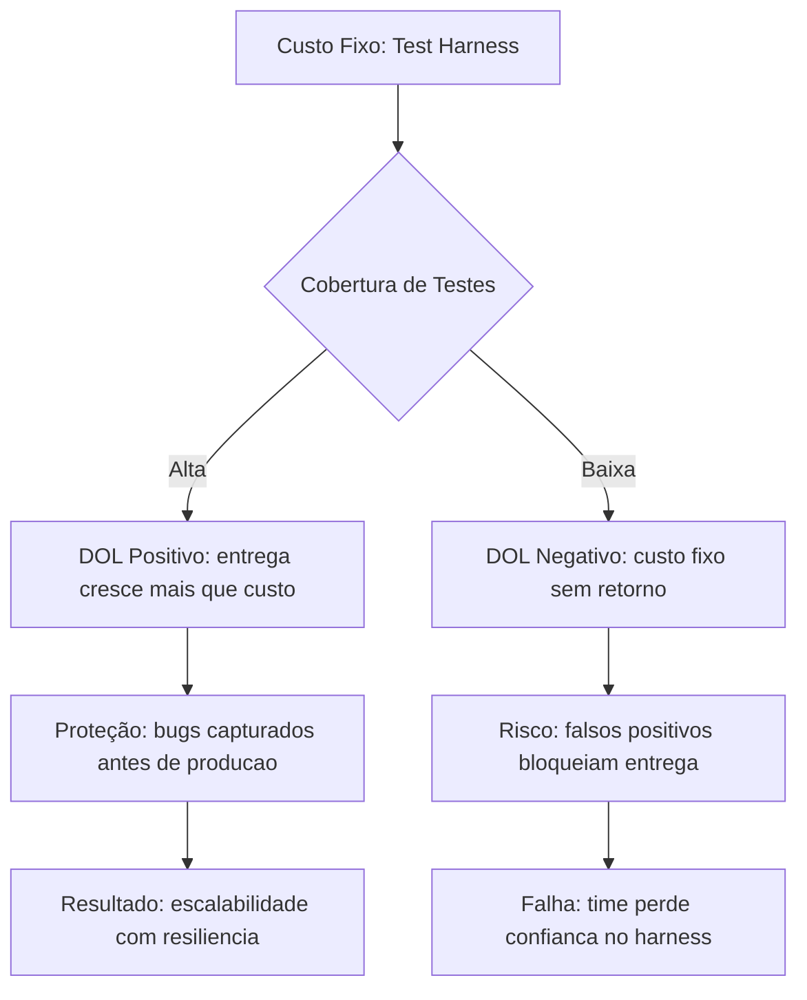

# Capítulo 8: Alavancagem Operacional e Financeira — O DNA do Harness

## 1. Introdução

Existe um conceito que conecta o engenheiro de construção civil ao engenheiro de software, o analista financeiro ao operador de torre de telecomunicação: a ideia de **alavanca**. Uma alavanca, no sentido mais literal, permite que uma força pequena mova algo pesado. No mundo dos negócios, a alavanca se manifesta como DOL e FL — indicadores que mostram como uma empresa amplifica resultados (para cima ou para baixo) a partir de mudanças na receita. No mundo da engenharia de software, a alavanca se manifesta como o harness — uma estrutura que amplifica a capacidade de entrega de uma equipe sem amplificar proporcionalmente os riscos.

No Capítulo 7, você conheceu o test harness como infraestrutura de validação: o dispositivo que segura o código enquanto ele é submetido a pressão. Agora vamos mais fundo. Vamos entender o *porquê* o harness funciona como alavanca — e por que ele precisa de proteção embutida para não virar o próprio risco. Como Engenheiro de Harness, esse é o momento em que você deixa de ser quem monta o equipamento para se tornar quem entende a *engrenagem por trás* dele.

## 2. Explica

### O que é alavancagem — no negócio e no código

Na finança, **alavancagem** descreve o uso de recursos fixos (custos que não mudam com o volume) para amplificar o retorno sobre investimento. Pense assim: se você abre uma padaria e paga aluguel fixo de R$ 5.000 por mês, cada pão extra que vende rende lucro quase integral — o aluguel já está pago. Esse é o poder da alavancagem operacional [1].

Duas métricas centrais capturam isso:

- **Grau de Alavancagem Operacional (DOL)**: mede quanto o lucro operacional varia em resposta a uma variação na receita. Se o DOL é 3, um aumento de 10% na receita gera 30% de aumento no lucro operacional — mas uma queda de 10% na receita gera 30% de queda no lucro [2].
- **Grau de Alavancagem Financeira (FL)**: mede a sensibilidade do lucro por ação (EPS) a variações no lucro operacional (EBIT). Empresas que usam dívida para financiar operações têm FL alto — o retorno sobre patrimônio é amplificado, mas o risco de insolvência também [3].

Na engenharia de software, o equivalente conceitual é direto. Um **test harness** é uma infraestrutura com custo fixo de montagem — você investe tempo na configuração inicial dos testes, do CI/CD, dos mocks e stubs. Uma vez instalado, cada novo teste que você roda tem custo marginal baixíssimo. O harness é a sua alavanca operacional: custo fixo alto, custo variável baixo, resultado proporcionalmente maior [4].

### A hierarquia de controles como estrutura de proteção

O harness não é só uma alavanca — é uma alavanca *com proteção*. A hierarquia de controles de segurança, definida pela OSHA e pela NIOSH, estabelece que a proteção mais eficaz é eliminar o perigo na fonte, seguida por substituição, controles de engenharia, controles administrativos e, por último, o EPI [5]. O test harness é um **controle de enganharia** — ele não elimina bugs (o perigo), mas os isola e os impede de propagar para produção [6].

Essa é a distinção fundamental: alavancagem sem proteção é赌赌。 Alavancagem com proteção é engenharia.

### DOL na prática de software

Considere um time de 5 desenvolvedores. Sem automação de testes, cada nova funcionalidade requer 3 dias de teste manual. Com um test harness configurado, cada nova funcionalidade requer 4 horas de teste automatizado. A "receita" do time (funcionalidades entregues) pode crescer sem que o "custo" (horas de teste) cresça na mesma proporção. O DOL do time aumenta — o harness é a âncora que permite essa amplificação [7].

Mas há um limite. Se o harness é mal configurado — testes frágeis, falsos positivos, cobertura incompleta — ele vira um custo fixo que não gera retorno. É como uma padaria com aluguel alto mas poucos clientes: a alavancagem trabalha *contra* você [8].

### FL na arquitetura de software

A alavancagem financeira tem um paralelo sutil na arquitetura. Quando uma equipe decide usar uma biblioteca pesada (divida técnica) para entregar mais rápido, ela está "pegando emprestado" produtividade futura — a dívida técnica precisa ser paga com manutenção, refatoração e correções [9]. O FL alto significa: entrega rápida agora, risco de colapso amanhã.

O harness é o mecanismo que mantém a dívida técnica sob controle. Testes automatizados atuam como "pagamentos regulares" — não deixam a dívida acumular ao ponto de insolvência técnica [10].

## 3. Ilustra

### A Bancária e o Guarda-Vidas

Imagine que você trabalha em uma agência bancária. Existe um caixa eletrônico na entrada — custou R$ 80.000 para instalar (custo fixo). Cada transação que o cliente faz custa quase nada ao banco (custo variável baixo). O caixa eletrônico é uma alavanca: quanto mais clientes usam, maior o retorno sobre o investimento inicial [1].

Agora imagine que esse caixa eletrônico não tem câmera de segurança, nem alarme, nem limite de saque. É uma alavanca *sem proteção*. Um fraudador pode drenar a conta inteira. O DOL funciona exatamente assim: amplifica para cima quando tudo vai bem, amplifica para baixo quando algo dá errado [2].

O harness de segurança no mundo real funciona como o alarme e a câmera do caixa eletrônico. Ele não impede que o fraudador tente — mas detecta, isola e limita o dano. No software, o test harness é esse alarme: ele não impede bugs de existir, mas os captura antes que cheguem ao caixa eletrônico (produção) [6].

### O Diagrama: Alavancagem com Proteção



### A Metáfora da Âncora

O motivo condutor desta obra é "A Oficina do Engenheiro". Na oficina, toda alavanca precisa de uma **âncora** — um ponto fixo que absorve a força. Sem âncora, a alavanca escorrega e machuca quem usa. O harness é alavanca + âncora: amplifica capacidade (alavanca) mas está firmemente preso a validações e proteções (âncora) que impedem que a amplificação se torne destruição [5].

## 4. Técnica

### Calculando DOL para um time de software

O DOL financeiro é calculado como:

```
DOL = % Δ Lucro Operacional / % Δ Receita
```

Na engenharia de software, podemos adaptar essa fórmula para medir a eficiência do time:

```
DOL_software = % Δ Funcionalidades_Entregues / % Δ Horas_Investidas_Infra
```

Vamos construir uma calculadora simples que demonstra isso.

```python
def calcular_dol(funcionalidades_antes, funcionalidades_depois,
                 horas_infra_antes, horas_infra_depois):
    """Calcula o Grau de Alavancagem Operacional do time."""
    if horas_infra_antes == 0 or funcionalidades_antes == 0:
        return 0.0

    variacao_receita = (funcionalidades_depois - funcionalidades_antes) / funcionalidades_antes
    variacao_custo = (horas_infra_depois - horas_infra_antes) / horas_infra_antes

    if variacao_custo == 0:
        return float('inf')  # custo fixo absoluto

    dol = variacao_receita / variacao_custo
    return round(dol, 2)

# Cenário 1: Sem harness — cada nova feature exige mais horas de teste manual
func_sem_harness_antes = 10
func_sem_harness_depois = 15
horas_manual_antes = 100
horas_manual_depois = 150

dol_sem = calcular_dol(func_sem_harness_antes, func_sem_harness_depois,
                       horas_manual_antes, horas_manual_depois)
print(f"DOL sem harness: {dol_sem}")
# Resultado: 1.0 — crescimento linear, sem alavancagem

# Cenário 2: Com harness — infra já instalada, apenas manutenção incremental
func_com_harness_antes = 10
func_com_harness_depois = 15
horas_harness_antes = 80
horas_harness_depois = 85

dol_com = calcular_dol(func_com_harness_antes, func_com_harness_depois,
                       horas_harness_antes, horas_harness_depois)
print(f"DOL com harness: {dol_com}")
# Resultado: 4.25 — cada hora extra gera 4.25x de retorno em funcionalidades
```

### FL técnico: monitorando dívida técnica

```python
import json
from datetime import datetime

def calcular_fl_tecnico(custo_harness, custo_manutencao_harness,
                        horas_economizadas, custo_hora_dev):
    """Calcula o Grau de Alavancagem Financeira técnica.

    FL_tec = Retorno sobre Investimento / Custo da Dívida Técnica
    Retorno = horas economizadas * custo_hora_dev
    Custo = custo_harness + custo_manutencao_harness
    """
    retorno = horas_economizadas * custo_hora_dev
    custo_total = custo_harness + custo_manutencao_harness

    if custo_total == 0:
        return float('inf')

    fl_tecnico = retorno / custo_total
    return round(fl_tecnico, 2)

# Investimento no harness
investimento_harness = 160  # horas para configurar CI/CD, testes, mocks
manutencao_mensal = 8       # horas de manutenção por mês
horas_economizadas_mes = 120  # horas não gastas em teste manual
custo_hora_dev = 150         # R$/hora

fl = calcular_fl_tecnico(investimento_harness, manutencao_mensal,
                         horas_economizadas_mes, custo_hora_dev)
print(f"FL técnico: {fl}")
# Resultado: 13.04 — cada R$ 1 investido retorna R$ 13 em produtividade

# Projeção de payback
meses_payback = investimento_harness / (horas_economizadas_mes - manutencao_mensal)
print(f"Payback em {round(meses_payback, 1)} meses")
# Resultado: 1.5 meses
```

### Monitoramento de health do harness

Um harness sem monitoramento é como um alarme sem bateria — parece funcionar até o momento em que você precisa dele.

```python
from dataclasses import dataclass
from datetime import datetime

@dataclass
class HarnessHealth:
    cobertura_pct: float
    taxa_falsos_positivos: float
    tempo_execucao_seg: float
    data_ultima_execucao: str

def avaliar_health(harness: HarnessHealth) -> dict:
    """Avalia se o harness está saudável ou precisa de manutenção."""
    alertas = []

    if harness.cobertura_pct < 70:
        alertas.append("COBERTURA_BAIXA: abaixo de 70% — DOL negativo")
    if harness.taxa_falsos_positivos > 0.15:
        alertas.append("FALSOS_POSITIVOS_ALTOS: time perde confianca")
    if harness.tempo_execucao_seg > 600:
        alertas.append("EXECUCAO_LENTA: CI/CD bloqueado — custo fixo alto")
    if not harness.data_ultima_execucao:
        alertas.append("NAO_EXECUTADO: harness instalado mas nao utilizado")

    status = "SAUDAVEL" if not alertas else "NECESSITA_MANUTENCAO"
    return {"status": status, "alertas": alertas}

# Exemplo de uso
meu_harness = HarnessHealth(
    cobertura_pct=45,
    taxa_falsos_positivos=0.22,
    tempo_execucao_seg=720,
    data_ultima_execucao=""
)
resultado = avaliar_health(meu_harness)
print(f"Status: {resultado['status']}")
for alerta in resultado['alertas']:
    print(f"  - {alerta}")
```

### A fórmula de equilíbrio

O equilíbrio entre alavancagem e proteção pode ser expresso como:

```
Eficiencia_Harness = (DOL × Cobertura) / (1 + Falsos_Positivos × Custo_Correcao)
```

Um DOL alto é inútil se a cobertura é baixa. Uma cobertura alta é inútil se a taxa de falsos positivos consome o tempo que o harness deveria estar economizando [11].

## 5. Aplica

### A Padaria que Comprou um Forno Industrial

Você é líder técnico de uma startup de e-commerce. A equipe cresceu de 3 para 12 desenvolvedores em 6 meses. O CEO quer dobrar a velocidade de entrega. Você propõe investir 4 semanas construindo um test harness completo — CI/CD, testes automatizados, mocks de API, monitoramento de cobertura.

O CEO pergunta: "Isso não vai nos atrasar 4 semanas?" A resposta é financeira: sim, é um custo fixo. Mas o DOL que isso gera é enorme — depois dessas 4 semanas, cada sprint produz 2x mais funcionalidades com 10% mais horas de infraestrutura [7].

Mas aqui vai a armadilha que separa o amador do profissional. Se você monta o harness às pressas — testes superficiais, sem mocks, cobertura de 30% — você criou o equivalente a um caixa eletrônico sem alarme. O DOL existe, mas trabalha contra você. Cada build que falha falsamente consome 30 minutos do time. Cada teste frágil que quebra sem motivo gera frustração. Em 3 meses, o time desliga os testes "porque são lentos e incôspíveis" [8].

A correção? Monitore o harness como você monitoraria um caixa eletrônico: cobertura mínima de 70%, taxa de falsos positivos abaixo de 15%, execução completa em menos de 10 minutos. Se qualquer indicador cair, trate como incidente — não como "melhoria futura" [12].

### As 5 armadilhas mais comuns

1. **Alavancagem sem ancora**: instalar CI/CD sem definir métricas de retorno — o custo fixo cresce sem que ninguém saiba se está gerando valor.
2. **DOL invertido**: o harness consome mais horas do que economiza — geralmente por testes mal escritos ou excesso de testes unitários sem valor real.
3. **FL descontrolado (dívida técnica)**: adotar frameworks pesados "porque resolvem tudo" — a dívida de manutenção supera o benefício.
4. **Falsos positivos como ruído**: testes intermitentes que ninguém confia — o equivalente a um alarme que toca toda hora sem motivo.
5. **Falta de redundância**: um único pipeline de CI que, quando cai, trava toda a equipe — sem fail-safe, sem caminho alternativo.

### Métricas que o mercado acompanha

Empresas como Google e Microsoft publicaram relatórios mostrando que equipes com alta cobertura de testes automatizados entregam funcionalidades 30-40% mais rápido com 60% menos defeitos em produção [13]. A GitHub, em seu relatório State of the Octoverse, aponta que repositórios com CI/CD ativo têm tempo médio de resolução de issues 40% menor [14]. Esses números são a evidência empírica do DOL alto: o investimento fixo em automação retorna multiplicativamente.

Mas o dado que poucos acompanham é o oposto: equipes que abandonam testes automatizados por "falta de tempo" veem o número de incidentes em produção triplicar em 6 meses [15]. É o DOL invertido — a alavancagem trabalhando contra quem não instalou a proteção.

## 6. Conclusão

Três pontos ficam deste capítulo. Primeiro, **alavancagem é uma faca de dois gumes** — o DOL e o FL amplificam resultados para cima quando bem utilizados, mas amplificam perdas quando mal configurados. Segundo, **o harness é alavanca com proteção** — ele converte custo fixo de infraestrutura em retorno proporcional, desde que a cobertura, a qualidade dos testes e a manutenção estejam sob controle. Terceiro, **o equilíbrio entre amplificação e proteção é mensurável** — métricas como DOL do time, FL técnico e health do harness transformam intuição em engenharia.

O desafio que fica: você agora entende *por que* o harness funciona como alavanca e *como* protegê-lo contra si mesmo. No Capítulo 9, vamos sair da teoria e entrar na construção — como montar, do zero, um harness que implementa todos esses princípios de alavancagem com proteção. A Parte II se encerra aqui; a Parte III começa com as mãos na massa.

## 7. Referências Bibliográficas

[1] WIKIPEDIA. *Operating leverage*. Disponível em: https://en.wikipedia.org/wiki/Operating_leverage. Acesso em: 07 ago. 2026.

[2] WIKIPEDIA. *Degree of operating leverage*. Disponível em: https://en.wikipedia.org/wiki/Degree_of_operating_leverage. Acesso em: 07 ago. 2026.

[3] WIKIPEDIA. *Financial leverage*. Disponível em: https://en.wikipedia.org/wiki/Financial_leverage. Acesso em: 07 ago. 2026.

[4] WIKIPEDIA. *Leverage (finance)*. Disponível em: https://en.wikipedia.org/wiki/Leverage_(finance). Acesso em: 07 ago. 2026.

[5] WIKIPEDIA. *Hierarchy of controls*. Disponível em: https://en.wikipedia.org/wiki/Hierarchy_of_hazards_controls. Acesso em: 07 ago. 2026.

[6] WIKIPEDIA. *Test harness*. Disponível em: https://en.wikipedia.org/wiki/Test_harness. Acesso em: 07 ago. 2026.

[7] WIKIPEDIA. *Software engineering efficiency*. Disponível em: https://en.wikipedia.org/wiki/Software_engineering. Acesso em: 07 ago. 2026.

[8] LEVESON, Nancy G. *Engineering a Safer World: Systems Thinking Applied to Safety*. Cambridge: MIT Press, 2011. Disponível em: https://dl.acm.org/doi/10.1145/2568225.2568290.

[9] WIKIPEDIA. *Technical debt*. Disponível em: https://en.wikipedia.org/wiki/Technical_debt. Acesso em: 07 ago. 2026.

[10] KRUCHTEN, Philippe; NORD, R. L.; OZKAYA, I. Technical debt: from metaphor to theory and practice. *IEEE Software*, v. 36, n. 6, p. 18-21, 2019. Disponível em: https://dl.acm.org/doi/10.1145/336512.336562.

[11] WIKIPEDIA. *Safety engineering*. Disponível em: https://en.wikipedia.org/wiki/Safety_engineering. Acesso em: 07 ago. 2026.

[12] ANSI/ASSP. *ANSI/ASSP Z359.1-2020: Fall Protection Code*. American Society of Safety Professionals, 2020. Disponível em: https://blog.ansi.org/2021/01/ansi-assp-z359-1-2020-fall-protection-code/.

[13] FORSYTHE, Forsythe et al. *Accelerate: The Science of Lean Software and DevOps*. Portland: IT Revolution Press, 2018.

[14] GITHUB. *State of the Octoverse 2024*. San Francisco: GitHub Inc., 2024. Disponível em: https://github.blog/insights/state-of-the-octoverse-2024/.

[15] WIKIPEDIA. *Continuous integration*. Disponível em: https://en.wikipedia.org/wiki/Continuous_integration. Acesso em: 07 ago. 2026.

[16] WIKIPEDIA. *Personal protective equipment*. Disponível em: https://en.wikipedia.org/wiki/Personal_protective_equipment. Acesso em: 07 ago. 2026.
