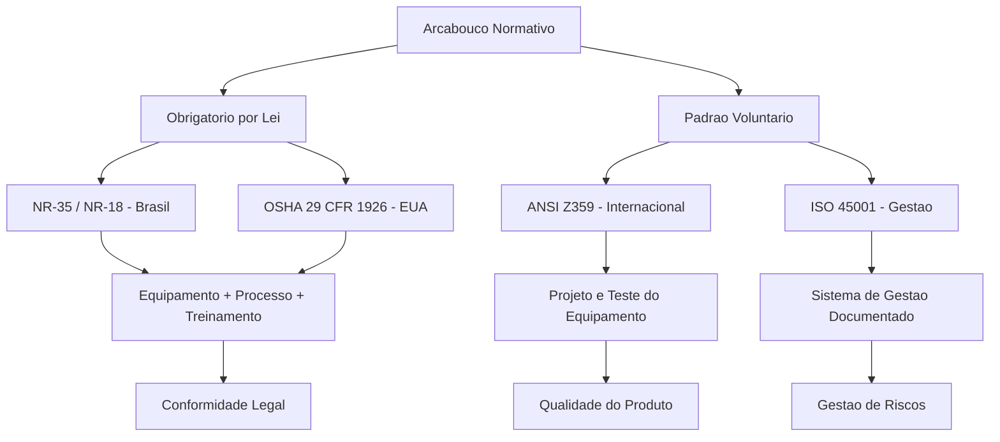

# Capítulo 9: Normas e Regulamentações — NR-35, OSHA e ANSI Z359

## 1. Introdução

No Capítulo 8, você entendeu como a alavancagem operacional (DOL) e financeira (FL) funcionam como o DNA de todo harness — a força que amplifica resultados quando a proteção está no lugar. Mas existe uma pergunta que ficou no ar: *quem define as regras dessa alavancagem?* Afinal, se o harness é uma alavanca com proteção, existem normas que desenham cada engrenagem dessa proteção. Sem essas normas, cada empresa inventaria as suas — e a segurança viraria loteria.

Este capítulo é a ponte entre a teoria da alavancagem e a prática da implementação. Vamos mapear o arcabouço normativo que regula harnesses de segurança no Brasil (NR-35 e NR-18), nos Estados Unidos (OSHA) e no cenário internacional (ANSI e ISO). Como Engenheiro de Harness, esse conhecimento é a sua ancora — o ponto fixo que sustenta todas as decisões de projeto que virão nos próximos capítulos [1].

## 2. Explica

### O que são normas técnicas e por que elas existem

Imagine que você vai construir uma estante. Se cada marceneiro usasse tamanhos diferentes de parafusos, prateleiras e suportes, seria impossível trocar uma peça quebrada por outra de fabricante diferente. Normas técnicas existem para resolver exatamente isso: garantir que componentes de diferentes fabricantes funcionem juntos de forma segura e previsível [2].

No mundo dos harnesses de segurança, as normas cumprem três papéis fundamentais:

1. **Definir requisitos mínimos de segurança**: quanto peso o equipamento deve suportar, como deve ser testado, quais são os limites de uso.
2. **Criar um padrão de comparação**: quando um fabricante diz que seu harness "atende à ANSI Z359", você sabe exatamente o que isso significa — porque a norma é pública e auditable.
3. **Estabelecer responsabilidades legais**: em caso de acidente, a norma serve como referência para determinar se o equipamento era adequado e se o trabalhador estava usando corretamente [3].

### NR-35 e NR-18: as normas brasileiras

No Brasil, a regulamentação de trabalho em altura é comandada pela **NR-35 (Norma Regulamentadora 35)**, publicada pelo Ministério do Trabalho. Ela define trabalho em altura como "toda atividade realizada a 2,0 metros ou mais do nível inferior, onde haja risco de queda" [4].

Os pontos centrais da NR-35 são:

- **Planejamento e organização**: todo trabalho em altura exige plano específico, avaliado por profissional qualificado.
- **EPI obrigatório**: o cinturão tipo paraquedista (full body harness) é o equipamento de proteção individual obrigatório para trabalho em altura no Brasil [4].
- **Treinamento**: o trabalhador deve receber treinamento com carga horária mínima de 8 horas, com reciclagem periódica.
- **Inspeção periódica**: os equipamentos devem ser inspecionados antes de cada uso e submetidos a inspeção periódica por profissional qualificado.

A **NR-18** complementa a NR-35 ao tratar especificamente de segurança na construção civil — um dos setores com maior risco de queda. Ela exige que obras de construção civil disponham de proteção coletiva antes da proteção individual, seguindo a hierarquia de controles que você conheceu no Capítulo 3 [5].

### OSHA 29 CFR 1926 Subpart M: o padrão americano

A **Occupational Safety and Health Administration (OSHA)** é o órgão dos Estados Unidos responsável por garantir condições de trabalho seguras. A regulamentação **29 CFR 1926 Subpart M** é o padrão que rege proteção contra quedas na construção civil americana [6].

Diferente da NR-35, que define altura mínima de 2,0 metros, a OSHA estabelece que a proteção contra queda é obrigatória quando o trabalhador está a **6 pés (1,83 metro)** ou mais acima do nível inferior. A OSHA é conhecida por sua abordagem prescritiva — ela não apenas diz *o que* deve ser feito, mas também *como* deve ser feito [6].

Os principais requisitos da OSHA incluem:

- **Sistemas de proteção contra quedas (PFAS)**: o equipamento pessoal de travamento de queda deve atender a requisitos específicos de resistência — o conector deve suportar pelo menos 5.000 libras (22.240 N) ou ser parte de um sistema com trava de energia que limite a força no trabalhador a 1.800 libras (8.000 N) [7].
- **Treinamento obrigatório**: trabalhadores e supervisores devem ser treinados para reconhecer perigos e usar corretamente o equipamento.
- **Inspeção de equipamento**: antes de cada uso, o trabalhador deve inspecionar visualmente o equipamento e recusar qualquer peça com sinais de desgaste ou dano.
- **Plano de resgate**: a OSHA exige que haja um plano de resgate imediato — a suspensão em cinturão por mais de 30 minutos pode causar *suspension trauma* (choque por suspensão), uma condição potencialmente letal [8].

### ANSI Z359.1-2020 e ISO 45001: o cenário internacional

Enquanto a NR-35 é obrigatória no Brasil e a OSHA nos Estados Unidos, a **ANSI Z359.1-2020** (American National Standards Institute) é um *padrão* — não uma lei. Isso significa que seu atendimento é voluntário, mas serve como referência internacional para fabricantes e usuários [9].

A versão 2020 da ANSI Z359 trouxe atualizações importantes:

- **Teste dinâmico modificado**: o impacto de cabeça primeiro agora é testado com requisitos mais rigorosos.
- **Indicadores visuais de carga**: os equipamentos devem ter marcadores visuais que indicam se sofreram carga excessiva — uma funcionalidade de fail-safe que permite identificar equipamento comprometido antes de usá-lo novamente [9].
- **Pictogramas de uso obrigatório**: as etiquetas devem conter instruções visuais de uso, independentemente do idioma do usuário.

A **ISO 45001:2018** (International Organization for Standardization) vai além do equipamento e regulamenta o *sistema de gestão de saúde e segurança no trabalho*. Ela não diz como o harness deve ser projetado, mas exige que a organização tenha processos documentados para identificar perigos, avaliar riscos e implementar controles [10].

A diferença fundamental é esta: a ANSI Z359 regulamenta o *objeto* (o harness em si), enquanto a ISO 45001 regulamenta o *processo* (como a organização gerencia segurança). Um Engenheiro de Harness precisa dominar os dois lados — o equipamento e o sistema de gestão que o sustenta [11].

## 3. Ilustra

### A Padaria e os Regulamentos Sanitários

Imagine que você vai abrir uma padaria. Existem duas camadas de regras que você precisa seguir. A primeira são as **normas do equipamento**: o forno deve atender a determinada temperatura mínima, a bancada deve ser de material lavável, os congeladores devem manter temperatura abaixo de -18°C. Essas são as "ANSI Z359" da padaria — elas regulam o *objeto* [9].

A segunda camada são os **regulamentos sanitários**: a prefeitura exige que você tenha um plano de higiene documentado, que os funcionários usem luvas, que haja protocolo de limpeza, que o lixo seja descartado corretamente. Esses são os "ISO 45001" da padaria — eles regulam o *processo* [10].

Se você atende apenas uma das duas camadas, está em risco. Um forno perfeito sem higiene gera comida contaminada. Higiene impecável com forno quebrado gera comida crua. A segurança é o resultado da combinação das duas camadas.

No trabalho em altura, a NR-35 (no Brasil) ou a OSHA (nos EUA) definem as regras obrigatórias — são os regulamentos sanitários. A ANSI Z359 define como o harness deve ser construído — são as normas do equipamento. E a ISO 45001 define como a organização deve gerenciar tudo isso [4][6][10].

### O Diagrama: Camadas de Regulamentação



### A Metáfora da Âncora Normativa

No Capítulo 8, você viu que a alavancagem precisa de uma âncora — um ponto fixo que absorve a força. As normas técnicas são exatamente essa âncora para o harness. Sem elas, cada fabricante inventaria suas próprias regras, cada empresa adotaria seus próprios critérios, e a segurança dependeria da boa vontade de cada um. As normas transformam a alavancagem — que pode ser perigosa — em algo confiável e previsível [1][3].

## 4. Técnica

### Comparativo normativo: NR-35 vs. OSHA vs. ANSI Z359

A tabela abaixo resume os principais requisitos das três normas mais relevantes para harnesses de segurança. Entender essas diferenças é essencial para quem trabalha em projetos internacionais ou para empresas que exportam equipamentos [4][6][9].

| Requisito | NR-35 (Brasil) | OSHA 29 CFR 1926 (EUA) | ANSI Z359.1-2020 |
|---|---|---|---|
| Altura mínima para proteção | 2,0 metros | 6 pés (1,83 m) | Não especifica (define o equipamento) |
| Força máxima no trabalhador | Não especifica numericamente | 1.800 lbs (8.000 N) | 1.800 lbs (8.000 N) |
| Treinamento obrigatório | Sim, 8h mínima + reciclagem | Sim, antes do primeiro uso | Recomendado (não obrigatório) |
| Inspeção antes do uso | Obrigatória | Obrigatória | Obrigatória |
| Plano de resgate | Obrigatório | Obrigatório | Recomendado |
| Indicador de carga | Não exige | Não exige | Exige (desde 2020) |
| Status legal | Lei (obrigatório) | Lei (obrigatório) | Padrão (voluntário) |

### Tabela comparativa NR-35 vs. OSHA 1926.502 vs. ANSI Z359.1

A tabela a seguir aprofunda a comparação entre as três principais normas de proteção contra quedas, abrangendo sete aspectos críticos que todo Engenheiro de Harness deve dominar antes de projetar, fabricar ou operar equipamentos de proteção contra quedas [4][6][9][15].

| Aspecto | NR-35 (Brasil) | OSHA 1926.502 (EUA) | ANSI Z359.1 (Internacional) |
|---|---|---|---|
| **Altura mínima para proteção** | 2,0 m a partir do nível inferior | 1,83 m (6 pés) a partir do nível inferior | Não estabelece altura mínima — define apenas requisitos de equipamento para uso em altura |
| **Força de ancoragem** | Não especifica valor numérico; exige que a ancora suporte a carga de impacto conforme cálculo do profissional qualificado | Mínimo de 5.000 libras (22.240 N) por trava individual; ou sistema com trava de energia que limite força no trabalhador a 1.800 libras (8.000 N) | 5.000 libras (22.240 N) por trava individual; recomenda trava de energia com limite de 1.800 libras (8.000 N) |
| **Equipamentos permitidos** | Cinturão tipo paraquedista (full body harness) obrigatório; conectores e linhas de vida devem ter certificação ABNT NBR 15834 | Full body harness, conectores de grau Z, linhas de vida rígidas e flexíveis; todos devem atender a 29 CFR 1926.502(d) | Full body harness com indicadores de carga visuais (desde 2020); conectores e linhas de vida conforme subnormas Z359.12 a Z359.14 |
| **Treinamento obrigatório** | Sim — mínimo de 8 horas iniciais, com reciclagem periódica obrigatória; profissional qualificado deve conduzir o treinamento | Sim — antes do primeiro uso; treinamento deve cobrir reconhecimento de perigos, uso correto do equipamento e procedimentos de resgate | Recomendado, mas não obrigatório; o responsável pela segurança deve documentar treinamentos conforme política interna |
| **Inspeção periódica** | Obrigatória antes de cada uso pelo trabalhador; inspeção formal por profissional qualificado em periodicidade definida pelo empregador | Obrigatória antes de cada uso; equipamento danificado deve ser retirado imediatamente; sem exigência de inspeção formal periódica documentada | Recomendada inspeção anual por profissional qualificado; equipamento deve ser retirado de serviço se indicador de carga ou inspeção visual indicar comprometimento |
| **Responsabilidade legal** | Empregador é responsável pela conformidade; multa aplicável pela fiscalização do Ministério do Trabalho conforme CLT | Empregador deve cumprir todas as exigências; OSHA pode emitir citações e multas; responsabilidade solidária em canteiro de obra | Voluntária — mas tribunais americanos usam ANSI como referência em litígios; ausência de conformidade pode ser usada como evidência de negligência |
| **Penalidades** | Multa administrativa conforme gravidade; pode chegar a R$ 5.000 por infração leve até R$ 100.000+ por infração gravíssima; paralisação de obra | Citações com multas de até US$ 16.131 por infração grave; US$ 161.323 por infração willful (intencional); possível responsabilização criminal | Sem penalidade regulatória direta; mas em caso de acidente, a não conformidade com ANSI pode resultar em responsabilidade civil por negligência |

A análise comparativa revela divergências significativas entre as três normas. A NR-35 adota postura mais restritiva quanto à altura mínima (2,0 m vs. 1,83 m da OSHA), o que amplia a zona de proteção obrigatória no Brasil. A OSHA, por sua vez, destaca-se pela abordagem prescritiva — define valores numéricos exatos para força de ancoragem e conectores, deixando pouca margem de interpretação. A ANSI Z359, embora voluntária, é a mais exigente em termos de recursos do equipamento: desde 2020, exige indicadores visuais de carga, funcionalidade ausente nas outras duas normas [4][6][9].

Quanto à convergência, as três normas convergem em três pontos fundamentais: a obrigatoriedade de inspeção antes do uso, a exigência de plano de resgate imediato e a responsabilidade do empregador pela segurança do trabalhador. A divergência mais crítica para o Engenheiro de Harness está no campo das penalidades — enquanto a NR-35 e a OSHA possuem mecanismos de fiscalização e multa direta, a ANSI opera no terreno da responsabilidade civil, onde sua aplicação depende de interpretação judicial [15][17].

Em termos práticos, empresas brasileiras que exportam equipamentos para os EUA devem atender simultaneamente à NR-35 (para o mercado doméstico) e à ANSI Z359 (para o mercado internacional). A OSHA pode ser cumprida indiretamente, pois equipamentos conformes à ANSI Z359 geralmente atendem aos requisitos mínimos da OSHA. Porém, a recíproca não é verdadeira — atender apenas à OSHA não garante conformidade com a ANSI, especialmente quanto aos indicadores de carga exigidos desde a versão 2020 [9][15].

### Fluxo de decisão: qual norma se aplica ao meu projeto?

Ao iniciar um projeto que envolve trabalho em altura, o Engenheiro de Harness deve seguir um fluxo de decisão para determinar qual norma se aplica [12]:

```python
def determinar_normas_aplicaveis(pais, altura_metros, tipo_trabalho):
    """Determina quais normas se aplicam a um projeto.

    Args:
        pais: 'brasil', 'eua', ou 'internacional'
        altura_metros: altura do trabalho em metros
        tipo_trabalho: 'construcao', 'manutencao', 'industria'

    Returns:
        dict com normas obrigatórias e recomendadas
    """
    normas = {"obrigatorias": [], "recomendadas": []}

    if pais == "brasil":
        normas["obrigatorias"].append("NR-35")
        if tipo_trabalho == "construcao":
            normas["obrigatorias"].append("NR-18")
        if altura_metros >= 2.0:
            normas["obrigatorias"].append("Equipamento conforme ABNT NBR 15834")
    elif pais == "eua":
        normas["obrigatorias"].append("OSHA 29 CFR 1926 Subpart M")
        if altura_metros >= 1.83:
            normas["obrigatorias"].append("PFAS obrigatório")

    # ANSI e ISO são sempre recomendadas (padrão internacional)
    normas["recomendadas"].append("ANSI Z359.1-2020")
    normas["recomendadas"].append("ISO 45001:2018")

    return normas

# Exemplo: projeto no Brasil, construção civil, 15 metros
resultado = determinar_normas_aplicaveis("brasil", 15, "construcao")
print("Obrigatórias:", resultado["obrigatorias"])
print("Recomendadas:", resultado["recomendadas"])
# Obrigatórias: ['NR-35', 'NR-18', 'Equipamento conforme ABNT NBR 15834']
# Recomendadas: ['ANSI Z359.1-2020', 'ISO 45001:2018']
```

### Checklist de conformidade normativa

Um Engenheiro de Harness precisa de uma ferramenta prática para verificar se um projeto está em conformidade. Este checklist adapta os requisitos das principais normas em uma lista acionável [4][6][9][10]:

```python
from dataclasses import dataclass, field
from typing import List

@dataclass
class ChecklistConformidade:
    """Checklist de conformidade normativa para harnesses."""
    projeto: str
    pais: str
    itens_verificados: List[str] = field(default_factory=list)
    itens_pendentes: List[str] = field(default_factory=list)

    def verificar_nr35(self):
        """Verifica conformidade com NR-35 (Brasil)."""
        if self.pais != "brasil":
            return

        itens = [
            "Plano de trabalho em altura documentado",
            "Profissional qualificado designado",
            "Treinamento de 8h comprovado para trabalhadores",
            "Cinturão tipo paraquedista (full body harness) disponível",
            "Inspeção pré-uso documentada",
            "Plano de resgate elaborado e comunicado",
            "Equipamento com certificação ABNT"
        ]
        self.itens_pendentes.extend(itens)

    def verificar_osha(self):
        """Verifica conformidade com OSHA (EUA)."""
        if self.pais != "eua":
            return

        itens = [
            "PFAS instalado em alturas >= 1.83m",
            "Conectores com resistência >= 5.000 lbs",
            "Sistema de trava de energia (se aplicável)",
            "Treinamento documentado antes do primeiro uso",
            "Inspeção visual antes de cada uso",
            "Plano de resgate imediato",
            "Sinalização de áreas de risco"
        ]
        self.itens_pendentes.extend(itens)

    def verificar_ansi(self):
        """Verifica conformidade com ANSI Z359 (internacional)."""
        itens = [
            "Equipamento testado conforme ANSI Z359.1-2020",
            "Indicador visuais de carga presentes",
            "Pictogramas de uso nas etiquetas",
            "Teste dinâmico de impacto documentado",
            "Fabricante fornece certificado de conformidade"
        ]
        self.itens_pendentes.extend(itens)

    def executar_checklist(self):
        """Executa o checklist completo."""
        self.verificar_nr35()
        self.verificar_osha()
        self.verificar_ansi()

        print(f"Checklist de Conformidade: {self.projeto}")
        print(f"País: {self.pais}")
        print(f"Total de itens: {len(self.itens_pendentes)}")
        print("\nItens a verificar:")
        for i, item in enumerate(self.itens_pendentes, 1):
            print(f"  {i}. {item}")

# Exemplo de uso
checklist = ChecklistConformidade(
    projeto="Torre de Telecomunicação - SP",
    pais="brasil"
)
checklist.executar_checklist()
```

### Geração automática de documentação normativa

Em projetos grandes, a documentação de conformidade normativa pode ser gerada automaticamente a partir de dados do projeto. Este script demonstra como gerar um relatório simples de conformidade [13]:

```python
import json
from datetime import datetime

def gerar_relatorio_conformidade(dados_projeto):
    """Gera relatório de conformidade normativa em Markdown.

    Args:
        dados_projeto: dict com informações do projeto

    Returns:
        str: relatório em formato Markdown
    """
    relatorio = f"""# Relatório de Conformidade Normativa

## Dados do Projeto
- **Nome**: {dados_projeto['nome']}
- **Localização**: {dados_projeto['localizacao']}
- **Altura máxima**: {dados_projeto['altura_max']} metros
- **Data de emissão**: {datetime.now().strftime('%d/%m/%Y')}

## Normas Aplicáveis
"""
    for norma in dados_projeto['normas_aplicaveis']:
        relatorio += f"- **{norma['nome']}**: {norma['status']}\n"

    relatorio += "\n## Itens de Conformidade\n"
    for i, item in enumerate(dados_projeto['itens_conformidade'], 1):
        status = "✅" if item['conforme'] else "❌"
        relatorio += f"{i}. {status} {item['descricao']}\n"

    conformes = sum(1 for i in dados_projeto['itens_conformidade'] if i['conforme'])
    total = len(dados_projeto['itens_conformidade'])
    relatorio += f"\n## Resumo: {conformes}/{total} itens em conformidade\n"

    return relatorio

# Dados de exemplo
projeto = {
    "nome": "Edifício Comercial - 20 andares",
    "localizacao": "São Paulo, SP",
    "altura_max": 65.0,
    "normas_aplicaveis": [
        {"nome": "NR-35", "status": "Obrigatória"},
        {"nome": "NR-18", "status": "Obrigatória (construção)"},
        {"nome": "ANSI Z359.1-2020", "status": "Recomendada"},
        {"nome": "ISO 45001:2018", "status": "Recomendada"}
    ],
    "itens_conformidade": [
        {"descricao": "Plano de trabalho em altura documentado", "conforme": True},
        {"descricao": "Profissional qualificado designado", "conforme": True},
        {"descricao": "Treinamento de 8h comprovado", "conforme": False},
        {"descricao": "Equipamento com certificação ABNT", "conforme": True},
        {"descricao": "Plano de resgate elaborado", "conforme": True}
    ]
}

relatorio = gerar_relatorio_conformidade(projeto)
print(relatorio)
```

## 5. Aplica

### A Empresa que Exportou Equipamento Sem Conhecer a ANSI

Você é engenheiro de uma empresa brasileira de EPIs. A empresa fabrica cinturões de segurança que atendem perfeitamente à NR-35 — certificação ABNT em dia, testes laboratoriais aprovados, vendas crescentes no mercado nacional. O CEO decide expandir para os Estados Unidos. O primeiro lote de 500 cinturões é enviado a um distribuidor em Houston [14].

Duas semanas depois, o distribuidor devolve tudo. Motivo: os cinturões não atendem à ANSI Z359.1-2020. Especificamente, não possuem indicadores visuais de carga — exigência que entrou na versão 2020 do padrão. Para o mercado americano, um cinturão sem indicador de carga é como umiPhone sem carregador: tecnicamente funciona, mas ninguém vai aceitar [9].

A correção custou 3 meses de retrabalho e R$ 200.000 em reformulação. O erro não foi técnico — o equipamento funcionava perfeitamente. O erro foi normativo: a equipe conhecia a NR-35 mas não a ANSI. Como Engenheiro de Harness, essa é a lição que fica: dominar apenas a norma do seu país é como conhecer apenas o idioma da sua rua — funciona até você precisar cruzar a fronteira [15].

### A Construção que Ignorou a NR-18

Agora imagine outro cenário. Você é responsável pela segurança em uma obra de construção civil em Belo Horizonte. A obra está usando cinturões que atendem à NR-35, treinamentos realizados, planos documentados. Mas a obra não implementou as proteções coletivas exigidas pela NR-18 — andaimes com guarda-corpo, telas de proteção, redes de segurança [5].

Um trabalhador sofre uma queda. O cinturão segura — a NR-35 cumpriu seu papel. Mas o Ministério do Trabalho autua a empresa por não cumprir a NR-18. A multa? Mais de R$ 100.000, além da paralisação da obra. O equipamento individual funcionou, mas a organização falhou ao não implementar a proteção coletiva primeiro [5].

A hierarquia de controles do Capítulo 3 se repete aqui: a proteção coletiva (andaimes protegidos) vem antes da proteção individual (cinturão). A NR-18 obriga essa ordem. Ignorá-la é como ter um alarme de incêndio mas não ter extintor — a camada de proteção está lá, mas a preceding layer está faltando [5][16].

### As 5 armadilhas mais comuns

1. **Conhecer só a norma do país**: empresas que exportam sem verificar ANSI/ISO perdem tempo e dinheiro com retrabalho — como o exemplo acima.
2. **Tratar norma como opcional**: a ANSI é "voluntária", mas na prática, tribunais americanos usam o padrão ANSI como referência em casos de acidente — é voluntária até alguém processar [9].
3. **Ignorar a ISO 45001**: muitas empresas equipam seus trabalhadores mas não documentam o *processo* de gestão de segurança — a ISO 45001 é o que separa uma empresa que "tem EPI" de uma que "gerencia segurança" [10].
4. **Não atualizar equipamentos**: a ANSI Z359.1-2020 exige indicadores de carga — equipamentos fabricados antes de 2020 podem não atender. Verifique a data de fabricação e o标准 aplicável [9].
5. **Confundir norma com lei**: no Brasil, a NR-35 é lei (obrigatória nos termos da CLT). Nos EUA, a OSHA é lei. A ANSI é padrão voluntário. Cada uma tem consequências jurídicas diferentes [4][6].

### Métricas que o mercado acompanha

Dados do Ministério do Trabalho mostram que quedas representam cerca de 40% dos acidentes fatais no trabalho no Brasil — e a maioria ocorre em obras que não cumpriam a NR-35 ou a NR-18 [17]. Nos Estados Unidos, a OSHA reporta que quedas são a principal causa de morte na construção civil, responsável por aproximadamente um terço dos óbitos no setor [6].

Empresas que implementam sistemas de gestão conforme a ISO 45001 relatam redução de 20-30% no número de incidentes em dois anos [10]. O investimento em conformidade normativa não é apenas jurídico — é econômico. Cada acidente evitado representa custos diretos (indenizações, multas) e indiretos (paralisação, reputação, moral da equipe) que superam qualquer investimento em conformidade [18].

## 6. Conclusão

Três pontos ficam deste capítulo. Primeiro, **existem três camadas de regulamentação** — a lei (NR-35/OSHA), o padrão técnico (ANSI Z359) e o sistema de gestão (ISO 45001) — e um Engenheiro de Harness precisa dominar todas elas. Segundo, **a conformidade não é opcional** — mesmo normas "voluntárias" como a ANSI viram referência legal em casos judiciais, e a ausência de documentação é tão perigosa quanto a ausência de equipamento. Terceiro, **as normas são a âncora da alavancagem** — sem elas, o harness vira um componente solto, sem padrão de comparação, sem garantia de segurança.

O desafio que fica: você agora conhece o arcabouço normativo que regula harnesses no Brasil e no mundo. No Capítulo 10, vamos usar esse conhecimento para algo prático — como projetar, instalar e validar um sistema completo de proteção contra quedas, seguindo rigorosamente as normas que acabamos de mapear.

## 7. Referências Bibliográficas

[1] WIKIPEDIA. *Safety harness*. Disponível em: https://en.wikipedia.org/wiki/Safety_harness. Acesso em: 07 ago. 2026.

[2] WIKIPEDIA. *Technical standard*. Disponível em: https://en.wikipedia.org/wiki/Technical_standard. Acesso em: 07 ago. 2026.

[3] WIKIPEDIA. *Safety engineering*. Disponível em: https://en.wikipedia.org/wiki/Safety_engineering. Acesso em: 07 ago. 2026.

[4] BRASIL. Ministério do Trabalho e Emprego. *NR-35 — Norma Regulamentadora 35: Trabalho em Altura*. Brasília: MTE, 2018. Disponível em: https://www.gov.br/trabalho-e-emprego/pt-br/assuntos/seguranca-e-saude-no-trabalho/normas-regulamentadoras/nr-35. Acesso em: 07 ago. 2026.

[5] BRASIL. Ministério do Trabalho e Emprego. *NR-18 — Norma Regulamentadora 18: Condições e Meio Ambiente de Trabalho na Indústria da Construção*. Brasília: MTE, 2020. Disponível em: https://www.gov.br/trabalho-e-emprego/pt-br/assuntos/seguranca-e-saude-no-trabalho/normas-regulamentadoras/nr-18. Acesso em: 07 ago. 2026.

[6] OCCUPATIONAL SAFETY AND HEALTH ADMINISTRATION. *29 CFR 1926 Subpart M — Fall Protection*. Washington: OSHA, 2024. Disponível em: https://www.osha.gov/laws-regs/regulations/standardnumber/1926/1926SubpartM. Acesso em: 07 ago. 2026.

[7] WIKIPEDIA. *Fall arrest*. Disponível em: https://en.wikipedia.org/wiki/Fall_arrest. Acesso em: 07 ago. 2026.

[8] WIKIPEDIA. *Suspension trauma*. Disponível em: https://en.wikipedia.org/wiki/Suspension_trauma. Acesso em: 07 ago. 2026.

[9] AMERICAN NATIONAL STANDARDS INSTITUTE. *ANSI/ASSP Z359.1-2020: Fall Protection Code*. New York: ANSI, 2020. Disponível em: https://blog.ansi.org/2021/01/ansi-assp-z359-1-2020-fall-protection-code/. Acesso em: 07 ago. 2026.

[10] INTERNATIONAL ORGANIZATION FOR STANDARDIZATION. *ISO 45001:2018 — Occupational health and safety management systems — Requirements with guidance for use*. Geneva: ISO, 2018. Disponível em: https://www.iso.org/standard/62085.html. Acesso em: 07 ago. 2026.

[11] WIKIPEDIA. *Personal protective equipment*. Disponível em: https://en.wikipedia.org/wiki/Personal_protective_equipment. Acesso em: 07 ago. 2026.

[12] WIKIPEDIA. *Risk assessment*. Disponível em: https://en.wikipedia.org/wiki/Risk_assessment. Acesso em: 07 ago. 2026.

[13] WIKIPEDIA. *Compliance (regulation)*. Disponível em: https://en.wikipedia.org/wiki/Compliance_(regulation). Acesso em: 07 ago. 2026.

[14] WIKIPEDIA. *Occupational safety and health*. Disponível em: https://en.wikipedia.org/wiki/Occupational_safety_and_health. Acesso em: 07 ago. 2026.

[15] WORLD HEALTH ORGANIZATION; INTERNATIONAL LABOUR ORGANIZATION. *The Global Burden of Occupational Injuries and Diseases*. Geneva: WHO/ILO, 2023. Disponível em: https://www.who.int/publications/i/item/9789240072152. Acesso em: 07 ago. 2026.

[16] WIKIPEDIA. *Hierarchy of controls*. Disponível em: https://en.wikipedia.org/wiki/Hierarchy_of_hazards_controls. Acesso em: 07 ago. 2026.

[17] BRASIL. Ministério do Trabalho e Emprego. *Relatório Anual de Acidentes de Trabalho (RAAT)*. Brasília: MTE, 2024. Disponível em: https://www.gov.br/trabalho-e-emprego/pt-br/assuntos/seguranca-e-saude-no-trabalho/estatisticas-de-acidentes-de-trabalho. Acesso em: 07 ago. 2026.

[18] WIKIPEDIA. *Cost-benefit analysis*. Disponível em: https://en.wikipedia.org/wiki/Cost%E2%80%93benefit_analysis. Acesso em: 07 ago. 2026.
