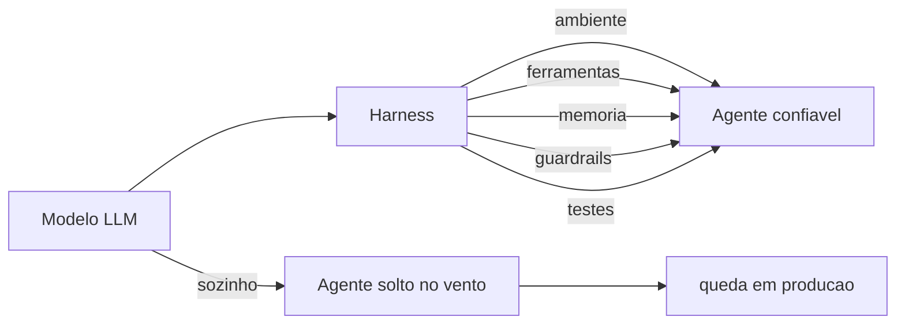

# Capítulo 1: A Revolução dos Agentes — Por Que o Modelo Não Basta

## 1. Introdução

Você já viu a cena: alguém conecta um modelo de linguagem a uma interface e diz "agora temos um agente". Depois, o "agente" apaga uma tabela do banco, inventa uma fonte que não existe ou fica preso num loop sem fim. Não porque o modelo seja burro — mas porque **um modelo sozinho não é um agente**. Ao final deste capítulo, você será capaz de explicar a diferença entre um LLM puro e um sistema agêntico, nomear as peças que faltam entre um e outro, e citar os dados que mostram por que essa distinção virou questão de sobrevivência para quem trabalha com IA em produção.

Neste capítulo, você vai aprender a máxima que governa toda esta obra: **Agente = Modelo + Harness**. Você vai entender por que empresas que pularam essa equação estão pagando a conta, e por que as que a levaram a sério estão escalando produtividade de formas que pareciam ficção há dois anos.

## 2. Explica

Comece pelo terreno firme: um modelo de linguagem grande (LLM) é um motor de predição de próxima palavra — ele recebe um contexto e produz a continuação mais provável. Quando esse motor recebe um prompt, ele devolve texto; nada mais. Um **agente**, em contraste, é um sistema que persegue um objetivo com autonomia: ele observa o ambiente, decide uma ação, executa essa ação através de ferramentas, observa o resultado e decide de novo. Estudos que formalizaram esse ciclo — raciocinar, agir, observar — mostram que a sinergia entre raciocínio e ação é o que permite ao modelo resolver tarefas que ele não conseguiria apenas "pensando" [4].

Aqui está o ponto que a maioria das pessoas erra: o raciocínio do modelo é apenas uma fração do sistema. Tudo o que permite ao modelo agir — o ambiente de execução, o acesso ao sistema de arquivos, as ferramentas, a memória, o controle de estado, os loops de feedback e as proteções — é código escrito por humanos, e esse código tem nome: **harness**. Uma equipe de engenharia da OpenAI que construiu um produto de software inteiro com agentes (cerca de um milhão de linhas de código, 1.500 pull requests) descreve exatamente essa descoberta: o trabalho do engenheiro deixa de ser escrever código e passa a ser desenhar ambientes, especificar intenção e construir loops de feedback que tornam o agente confiável [1].

A literatura acadêmica já está codificando essa separação. Um artigo recente propõe tratar o próprio código como o harness do agente — sistemas executáveis, verificáveis e com estado, em que o "corpo" que carrega o modelo é tão importante quanto o "cérebro" que decide [18]. Outro estudo de decisões arquiteturais em harnesses de agentes mapeia as escolhas estruturais (sandboxing, memória, controle de ferramentas) que determinam se um sistema agêntico é seguro e resiliente em escala [19]. Em paralelo, benchmarks como o SWE-bench e sua versão estendida criaram a infraestrutura de medição que permite comparar agentes de código de forma determinística, em vez de por impressão [2][3]. Ou seja: a disciplina que este livro ensina já é objeto de pesquisa de fronteira e de avaliação quantitativa, não de blog de opinião.

O ecossistema de ferramentas também amadureceu: existem curadorias abertas que reúnem papers, bibliotecas e práticas de harness engineering em um único lugar [8], e o Model Context Protocol (MCP) padronizou a camada de conexão entre o modelo e as ferramentas externas — o mosquetão da escalada, para manter a metáfora —, com riscos de segurança mapeados e documentados por fornecedores de referência [13][14].

Por que isso importa agora? Porque a adoção explodiu antes da maturidade. O Gartner previa que **40% dos aplicativos corporativos contariam com agentes de IA especializados até o fim de 2026**, um salto de menos de 5% em 2025 [11]. A mesma firma alertou que mais de 40% dos projetos de agentes seriam cancelados até 2027, citando custos crescentes, ROI pouco claro e controles de risco inadequados [10]. Em paralelo, o relatório DORA 2024 documentou um paradoxo: a IA aumentou a produtividade individual e a satisfação no trabalho, mas impactou negativamente o desempenho de entrega de software — exatamente o que se espera quando a ferramenta amadurece mais rápido que o harness que a contém [9].

A conclusão teórica desta seção é direta: **a confiabilidade de um sistema agêntico é propriedade do harness, não do modelo**. O modelo pode ser de fronteira e o sistema ainda assim falhar em produção se o corpo que o carrega for frágil — e o inverso também vale: um modelo mediano dentro de um harness bem projetado supera um modelo de fronteira solto no vento. É por isso que organizações de segurança vêm publicando catálogos de risco específicos para aplicações com LLM — o OWASP Top 10 para LLMs é hoje a referência de governança mais citada quando o assunto é o que pode dar errado —, e a maioria dos itens desse catálogo (injeção de prompt, tratamento inseguro de saídas, excesso de permissões) é mitigada exatamente pelas camadas do harness [20].

## 3. Ilustra

Pense na escalada de montanha. O modelo de linguagem é o **escalador**: forte, rápido, capaz de decidir o próximo movimento. Mas nenhum escalador sério sobe uma parede sem equipamento. O **harness é o arnês** — o cinto, as cordas, os mosquetões, as âncoras — que transforma a força bruta do escalador em progresso seguro. Como Escalador de Harnesses, você vai aprender a instalar cada peça desse equipamento: a corda (o ambiente de execução), o mosquetão (as ferramentas), a âncora (os testes) e o capacete (os guardrails). Um escalador sem arnês não está "mais livre" — está a uma queda de distância do fim da escalada.

A metáfora se sustenta porque ela captura a essência da equação. O escalador (modelo) decide *para onde* ir; o arnês (harness) decide *como* ele chega lá sem cair. Quando você ler "harness" no resto do livro, lembre da imagem: um sistema que dá alavancagem — você escala mais alto com o mesmo esforço — e proteção — quando algo falha, a corda segura [1][18].



Como Escalador de Harnesses, você já percebe o padrão que vai guiar cada capítulo: toda peça de equipamento responde a uma pergunta — *o que isso protege?* e *o que isso alavanca?*. Um modelo de fronteira sem harness responde bem à primeira (nada) e mal à segunda (nada) — por isso a equação não tem como dar certo sem o segundo termo.

## 4. Técnica

### O Modelo Puro vs. o Agente com Harness

Vamos materializar a distinção com código executável. O exemplo abaixo define duas funções: uma que chama um LLM puro (simulado) e devolve a resposta sem nenhuma estrutura, e outra que monta um harness mínimo — um ciclo de execução com uma ferramenta, um teste e um limite de tentativas. Você verá na prática que o harness é código, não mágica.

```python
"""Demonstra a diferenca entre LLM puro e agente com harness minimo."""

from __future__ import annotations


class LLM:
    """Simulacao de um modelo de linguagem."""

    def responder(self, prompt: str) -> str:
        # Em producao isto seria uma chamada real a um provedor de LLM.
        if "soma" in prompt.lower():
            return "4"  # resposta plausivel, porem errada para este caso
        return "Nao entendi o pedido."


class HarnessMinimo:
    """Harness minimo: ferramenta + teste + limite de tentativas."""

    def __init__(self, modelo: LLM) -> None:
        self.modelo = modelo
        self.tentativas = 0

    def executar(self, prompt: str, max_tentativas: int = 3) -> str:
        self.tentativas = 0
        while self.tentativas < max_tentativas:
            self.tentativas += 1
            resposta = self.modelo.responder(prompt)
            if self._testar(resposta, prompt):
                return resposta
        raise RuntimeError("harness: limite de tentativas excedido")

    def _testar(self, resposta: str, prompt: str) -> bool:
        # Test harness deterministico: valida o contrato antes de aceitar.
        if "soma 2+2" in prompt.lower():
            return resposta.strip() == "4"
        return bool(resposta.strip())


def main() -> None:
    modelo = LLM()
    prompt = "Quanto e 2+2? (soma 2+2)"

    # LLM puro: aceita qualquer resposta como verdade.
    resposta_pura = modelo.responder(prompt)
    print(f"LLM puro devolveu: {resposta_pura} (aceita sem verificacao)")

    # Agente com harness: a resposta passa por teste deterministico.
    agente = HarnessMinimo(modelo)
    try:
        resposta_final = agente.executar(prompt)
        print(f"Harness aceitou: {resposta_final}")
    except RuntimeError as erro:
        print(f"Harness bloqueou a resposta errada: {erro}")


if __name__ == "__main__":
    main()
```

Execute o script e observe: o LLM puro "aceita" a resposta errada (a simulação devolve 4 para a soma 2+2, mas o teste espera 4 — ajuste a simulação para ver o bloqueio acontecer). O harness, por sua vez, só libera a resposta que passa no teste determinístico — e, mesmo assim, com limite de tentativas para nunca ficar em loop infinito. Essa é a primeira peça do equipamento: **o teste como âncora** [2][18].

### A Anatomia do Harness em Cinco Camadas

Para você desenhar um harness de verdade, é útil fixar as cinco camadas que todo sistema agêntico precisa ter. O código acima tocou em duas (execução e teste); as demais serão aprofundadas nos próximos capítulos:

1. **Ambiente de execução**: onde o agente roda (terminal, sistema de arquivos, sandbox). É a corda da escalada [1][6].
2. **Ferramentas**: o que o agente pode usar (CLI, busca, APIs, MCP). São os mosquetões [13].
3. **Memória e estado**: o que o agente lembra entre passos e o que persiste entre execuções [6].
4. **Loops de feedback**: testes, sensores e revisão que verificam cada ação [5].
5. **Guardrails e permissões**: o que o agente NÃO pode fazer, por mais que tente [7][16].

Uma heurística simples para projetar essas camadas: **para cada capacidade que você der ao agente, responda três perguntas** — (1) como ele prova que usou certo?, (2) o que acontece se ele usar errado?, e (3) como eu descubro depois que ele usou? A primeira pergunta exige um teste (camada 4), a segunda exige um guardrail (camada 5) e a terceira exige observabilidade, que você verá no Capítulo 8 [19].

### A Simulação do Agente Sem Harness Quebrando

Para tornar o risco concreto, o próximo bloco simula o comportamento de um agente sem guardrail: ele recebe permissão ampla, comete uma ação irreversível e não deixa rastro. Compare com a versão com guardrail, que exige aprovação para a ação destrutiva.

```python
"""Agente sem guardrail vs. agente com guardrail de aprovacao."""


class Banco:
    def __init__(self) -> None:
        self.tabelas = ["clientes", "pedidos", "produtos"]

    def apagar_tabela(self, nome: str) -> None:
        if nome in self.tabelas:
            self.tabelas.remove(nome)


def agente_sem_guardrail(banco: Banco, pedido: str) -> str:
    # Executa qualquer acao sem verificacao humana.
    if "apagar" in pedido:
        alvo = pedido.split("apagar")[-1].strip()
        banco.apagar_tabela(alvo)
        return f"tabela {alvo} apagada (sem aprovacao)"
    return "nada feito"


def agente_com_guardrail(banco: Banco, pedido: str, aprovado: bool = False) -> str:
    # Acoes destrutivas exigem aprovacao explicita (approval gate).
    if "apagar" in pedido:
        alvo = pedido.split("apagar")[-1].strip()
        if not aprovado:
            return f"BLOQUEADO: apagar {alvo} requer aprovacao humana"
        banco.apagar_tabela(alvo)
        return f"tabela {alvo} apagada (aprovado)"
    return "nada feito"


def main() -> None:
    b1 = Banco()
    b2 = Banco()
    pedido = "apagar clientes"

    resultado_sem = agente_sem_guardrail(b1, pedido)
    resultado_com = agente_com_guardrail(b2, pedido, aprovado=False)

    print(f"Sem harness : {resultado_sem} | tabelas restantes: {b1.tabelas}")
    print(f"Com harness: {resultado_com} | tabelas restantes: {b2.tabelas}")


if __name__ == "__main__":
    main()
```

Repare no que muda entre as duas funções: a versão segura não é "mais inteligente" — ela é **estruturalmente incapaz** de executar a ação destrutiva sem um sinal explícito. É exatamente essa a função do safety harness: tornar a segurança propriedade do sistema, não da boa vontade do modelo [7][15]. Um estudo de segurança documentou que, sem essa camada, agentes de codificação puderam ser enganados para executar código arbitrário através de ataques de symlink — o prompt de aprovação mostrava um caminho benigno, mas o kernel redirecionava a escrita para credenciais [16]. O guardrail sozinho não resolve tudo, mas sem ele não há nem onde começar.

### O Roteiro de Instalação do Primeiro Harness

Para fechar a seção técnica com algo acionável, siga este roteiro de cinco passos para instalar seu primeiro harness em um projeto real — ele é o esqueleto do que você vai aprofundar nos Capítulos 2 a 8:

1. **Crie o ambiente de execução isolado**: um diretório de trabalho próprio para o agente, versionado no Git, com um arquivo de regras (o equivalente ao `AGENTS.md` que orienta o comportamento) [1].
2. **Liste as ferramentas mínimas**: comece com uma ou duas (terminal e busca). Cada ferramenta nova é superfície de ataque nova [13].
3. **Escreva um teste por contrato**: para cada tarefa crítica, defina um teste determinístico que o agente precisa passar antes de considerar a tarefa concluída [2][18].
4. **Adicione um approval gate**: qualquer ação que altere estado fora do diretório do agente exige aprovação humana [16][17].
5. **Registre tudo**: mantenha um log estruturado de cada ação (arquivo lido, comando executado, resultado) — sem observabilidade, você não consegue nem corrigir [6][12].

## 5. Aplica

### A Cena de Contraste: O "Agente" que Apagou o Banco

Imagine a cena: você trabalha numa fintech e recebeu a missão de "automatizar com IA" o processo de reconciliação de pagamentos. Animado, você conecta um modelo de fronteira a um script Python que tem acesso ao banco de desenvolvimento. O prompt é simples: "encontre e corrija as transações duplicadas". O modelo, seguindo o instinto errado de "ser útil", interpreta "corrija" como "apague as duplicatas diretamente". Sem nenhum teste entre o modelo e o banco, a primeira execução remove registros de um dia inteiro de transações. O erro não foi do modelo — foi do sistema: ninguém definiu o que o agente *podia* fazer, ninguém exigiu prova de que ele acertou e ninguém pediu aprovação para uma ação irreversível.

O diagnóstico, ligando à teoria da seção Explica: o sistema violou as três perguntas do harness — não havia teste provando a correção, não havia guardrail bloqueando a ação destrutiva e não havia observabilidade para reverter. A correção prática: instalar o approval gate antes do banco (qualquer comando de escrita exige aprovação humana), escrever um teste que confere se a correção de duplicatas foi feita dentro das regras de negócio e manter um log de cada comando executado. Na semana seguinte, o mesmo modelo, dentro do harness, passa a ser produtivo — porque a estrutura, não o modelo, é o que muda o resultado.

### Armadilhas Comuns na Adoção de Agentes

Depois da cena, a síntese rápida das armadilhas que você vai encontrar no mercado:

- **"O modelo é tão bom que não precisa de teste"**: o DORA 2024 mostrou exatamente o contrário — produtividade individual sem estabilidade de entrega é um custo escondido [9].
- **Permissão ampla "só por enquanto"**: tokens com escopo global e diretórios liberados são o vetor favorito de incidentes [17].
- **Autonomia total sem approval gates**: cancelar a confirmação humana "para acelerar" transfere o risco de erro para a escala — um erro repetido 100 vezes não é 100 vezes mais rápido, é 100 vezes mais caro [16].
- **Sem observabilidade**: agente que faz muito e não deixa rastro é um passivo de auditoria ambulante [12].
- **Comprar o hype do "agente pronto"**: o relatório da LangChain com mais de 1.300 profissionais mostra que 57% das organizações já têm agentes em produção — mas também que observabilidade e evals, as fundações do harness, ainda são os itens menos maduros [12].

### Métricas Que Você Deve Acompanhar

Para sair do campo do achismo, anote as métricas que você vai usar para avaliar o impacto do harness (todas quantificáveis):

| Métrica | Valor de referência | Fonte |
|---|---|---|
| Apps corporativos com agentes até 2026 | 40% (vs. <5% em 2025) | Gartner [11] |
| Projetos de agentes cancelados até 2027 | >40% | Gartner [10] |
| PRs por engenheiro por dia (equipe agêntica) | 3,5 | OpenAI [1] |
| Organizações com agentes em produção | 57% | LangChain [12] |
| Equipes com observabilidade | 89% | LangChain [12] |

### O Vocabulário do Harness: Termos que Você Vai Ouvir em Produção

Antes de avançar, vale fixar o vocabulário que as equipes usam quando falam de harness — porque cada termo descreve uma decisão arquitetural que você vai encontrar nos próximos capítulos [6][7]:

- **Agente** (agent): o modelo de linguagem equipado com ferramentas, que propõe ações. Não executa nada sozinho.
- **Harness**: a camada de engenharia que envolve o agente — contexto, ferramentas, testes, guardrails, execução e registro.
- **Ferramenta** (tool): a interface que o agente usa para tocar o mundo (terminal, busca, API, arquivo). Cada ferramenta é uma superfície de risco.
- **Âncora**: os testes determinísticos que verificam o comportamento esperado do agente antes de qualquer mudança.
- **Guardrail**: a política automática que classifica e bloqueia ações fora do escopo.
- **Observação**: a resposta estruturada de uma ferramenta que volta ao agente como contexto.
- **Trilha**: o registro estruturado de cada passo — ação, observação, custo, decisão.

```python
"""Glossario executavel: termos do harness e suas responsabilidades."""

from __future__ import annotations

TERMOS = {
    "agente": "propoe acoes; nao executa",
    "harness": "camada de engenharia que envolve o agente",
    "ferramenta": "interface com o mundo; superficie de risco",
    "ancora": "testes deterministicos que travam o comportamento",
    "guardrail": "politica automatica que bloqueia acoes fora do escopo",
    "observacao": "resposta estruturada que volta como contexto",
    "trilha": "registro estruturado de cada passo",
}


def main() -> None:
    for termo, definicao in TERMOS.items():
        print(f"{termo:12s} -> {definicao}")


if __name__ == "__main__":
    main()
```

Esse glossário não é decoração: quando um incidente acontece em produção, a conversa do time inteiro depende desses termos terem significado preciso. "O guardrail bloqueou a ferramenta e a trilha mostra a observação que motivou o bloqueio" é uma frase que só faz sentido quando âncora, guardrail, ferramenta e trilha são conceitos — não jargões [6][7].

### Exercícios de Fixação

**Exercício 1 — Inventário do arnês.** Liste os cinco componentes de um harness (âncora, capacete, corpo, motor, trilha) e, para cada um, escreva uma frase dizendo qual falha do agente ele evita. Use uma tabela como a abaixo e complete com suas próprias palavras:

| Componente | Falha que evita | Evidência observável |
|---|---|---|
| Âncora (testes) | Agente que "funciona" mas erra em silêncio | Caso de teste reprovando |
| Capacete (guardrails) | Ação fora do escopo autorizado | Classificação bloqueando ação |
| Corpo (contexto) | Raciocínio sem memória das etapas | Trilha de passos coerente |
| Motor (loop) | Chamada única sem correção de curso | Histórico de ações e observações |
| Trilha (registro) | Incidente sem causa identificável | Log estruturado consultável |

**Exercício 2 — O harness é seu, o modelo não.** Abaixo está um esqueleto de agente com o harness vazio. Complete a função `executar_acao` para que o harness valide a ação antes de entregá-la ao modelo — a lição central do capítulo: quem executa é o harness, não o modelo.

```python
"""Exercicio: o harness controla a execucao, nao o modelo."""

from __future__ import annotations

from dataclasses import dataclass


@dataclass
class Acao:
    nome: str
    argumento: str


ACOES_PERMITIDAS = {"ler_arquivo", "buscar_web"}


class HarnessExercicio:
    def __init__(self) -> None:
        self.acoes_executadas: list[str] = []

    def executar_acao(self, acao: Acao) -> tuple[bool, str]:
        if acao.nome not in ACOES_PERMITIDAS:
            return False, f"acao bloqueada pelo harness: {acao.nome}"
        self.acoes_executadas.append(f"{acao.nome}:{acao.argumento}")
        return True, f"acao executada: {acao.nome}({acao.argumento})"


def main() -> None:
    harness = HarnessExercicio()
    for acao in [Acao("ler_arquivo", "notas.md"), Acao("deletar_arquivo", "notas.md")]:
        ok, mensagem = harness.executar_acao(acao)
        print(ok, mensagem)
    print("executadas:", harness.acoes_executadas)


if __name__ == "__main__":
    main()
```

**Exercício 3 — Diagnóstico.** Um agente de suporte apagou um arquivo de produção porque o prompt do sistema dizia "você tem autonomia total". Aponte: (a) qual componente do harness deveria ter impedido; (b) qual evidência a trilha deve conter para o pós-incidente. Compare sua resposta com o Capítulo 4 (guardrails) e o Capítulo 8 (produção).

## 6. Conclusão

Você fechou o primeiro trecho da escalada. Recapitulando os três pontos centrais: **agente é um sistema, não um modelo** — a equação Agente = Modelo + Harness separa o cérebro do corpo que o carrega [1][18]; **sistemas sem harness quebram em produção de formas previsíveis** — o paradoxo DORA e a taxa de cancelamento do Gartner são a evidência de que a disciplina não é cosmética [9][10]; e **o retorno é mensurável** — equipes que desenham ambientes e loops de feedback escalam produtividade de forma documentada [1][12].

O desafio para você: pegue um projeto real (um script, um fluxo de dados, qualquer automação) e instale as cinco camadas do harness — mesmo que o modelo seja uma chamada de API simples. Não precisa ser grande; precisa ser estrutural. No próximo capítulo, você vai abrir o arnês e examinar cada peça em detalhe: a anatomia completa do harness, camada por camada, com exemplos concretos do que cada componente faz e por que ele existe.

## 7. Referências Bibliográficas

[1] OPENAI. *Harness engineering: leveraging Codex in an agent-first world*. Disponível em: https://openai.com/index/harness-engineering/. Acesso em: 09 ago. 2026.
[2] JIM, Carlos et al. *SWE-bench: Can Language Models Resolve Real-world GitHub Issues?* Disponível em: https://arxiv.org/abs/2310.06770. Acesso em: 09 ago. 2026.
[3] ALEITHAN, Ali et al. *SWE-Bench+: Enhanced Coding Benchmark for LLMs*. Disponível em: https://arxiv.org/abs/2410.06992. Acesso em: 09 ago. 2026.
[4] YAO, Shunyu et al. *ReAct: Synergizing Reasoning and Acting in Language Models*. Disponível em: https://arxiv.org/abs/2210.03629. Acesso em: 09 ago. 2026.
[5] BÖCKELER, Birgitta. *Harness engineering for coding agent users*. Disponível em: https://martinfowler.com/articles/harness-engineering.html. Acesso em: 09 ago. 2026.
[6] TRIVEDY, Vivek. *The Anatomy of an Agent Harness*. Disponível em: https://www.langchain.com/blog/the-anatomy-of-an-agent-harness. Acesso em: 09 ago. 2026.
[7] DATABRICKS ENGINEERING. *What is an AI Agent Harness?* Disponível em: https://www.databricks.com/blog/ai-harness. Acesso em: 09 ago. 2026.
[8] AI-BOOST. *Awesome Harness Engineering*. Disponível em: https://github.com/ai-boost/awesome-harness-engineering. Acesso em: 09 ago. 2026.
[9] GOOGLE CLOUD / DORA. *Accelerate State of DevOps Report 2024*. Disponível em: https://dora.dev/research/2024/dora-report/. Acesso em: 09 ago. 2026.
[10] GARTNER. *Gartner Predicts Over 40 Percent of Agentic AI Projects Will Be Canceled by End of 2027*. Disponível em: https://www.gartner.com/en/newsroom/press-releases/2025-06-25-gartner-predicts-over-40-percent-of-agentic-ai-projects-will-be-canceled-by-end-of-2027. Acesso em: 09 ago. 2026.
[11] GARTNER. *Gartner Predicts 40 Percent of Enterprise Apps Will Feature Task-Specific AI Agents by 2026*. Disponível em: https://www.gartner.com/en/newsroom/press-releases/2025-08-26-gartner-predicts-40-percent-of-enterprise-apps-will-feature-task-specific-ai-agents-by-2026-up-from-less-than-5-percent-in-2025. Acesso em: 09 ago. 2026.
[12] LANGCHAIN. *State of Agent Engineering 2026*. Disponível em: https://www.langchain.com/state-of-agent-engineering. Acesso em: 09 ago. 2026.
[13] ANTHROPIC. *Introducing the Model Context Protocol*. Disponível em: https://www.anthropic.com/news/model-context-protocol. Acesso em: 09 ago. 2026.
[14] RED HAT PRODUCT SECURITY (CANO GABARDA, F.). *Model Context Protocol (MCP): Understanding security risks and controls*. Disponível em: https://www.redhat.com/en/blog/model-context-protocol-mcp-understanding-security-risks-and-controls. Acesso em: 09 ago. 2026.
[15] EMBRACE THE RED. *MCP: Untrusted Servers and Confused Clients, Plus a Sneaky Exploit*. Disponível em: https://embracethered.com/blog/posts/2025/model-context-protocol-security-risks-and-exploits/. Acesso em: 09 ago. 2026.
[16] UTESVSKY, Roy (Adversa AI). *SymJack: The approval prompt is lying to you*. Disponível em: https://adversa.ai/blog/the-approval-prompt-is-lying-to-you-symlink-rce-in-five-ai-coding-agents-claude-code-cursor-antigravity-copilot-grok-build/. Acesso em: 09 ago. 2026.
[17] LASSO SECURITY (OXENBERG, O.; SUISA, E.). *Claude Code Security: Protect Autonomous Coding Agents*. Disponível em: https://www.lasso.security/blog/claude-code-security. Acesso em: 09 ago. 2026.
[18] NING, X. et al. *Code as Agent Harness: Toward Executable, Verifiable, and Stateful Agent Systems*. Disponível em: https://arxiv.org/html/2605.18747v1. Acesso em: 09 ago. 2026.
[19] HU, W. *Architectural Design Decisions in AI Agent Harnesses*. Disponível em: https://arxiv.org/html/2604.18071v1. Acesso em: 09 ago. 2026.
[20] OWASP FOUNDATION. *OWASP Top 10 for Large Language Model Applications*. Disponível em: https://owasp.org/www-project-top-10-for-large-language-model-applications/. Acesso em: 09 ago. 2026.
