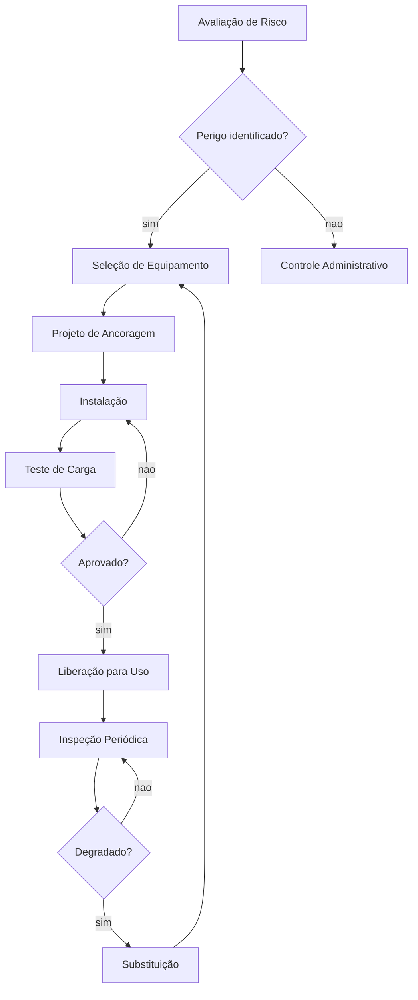

# Capítulo 10: Projeto e Instalação de Sistemas de Proteção contra Quedas

## 1. Introdução

No Capítulo 9, você mapeou o arcabouço normativo — NR-35, OSHA e ANSI Z359 — que dita as regras do jogo. Mas conhecer a lei e saber projetar o sistema que cumpre essa lei são coisas bem diferentes. É como saber as especificações de um motor e saber montá-lo: entre o manual e a oficina, existe um abismo de decisão técnica.

Este capítulo fecha esse abismo. Você vai percorrer o ciclo completo de projeto de um sistema de proteção contra quedas — da avaliação do risco na obra até a validação final da instalação. Cada etapa tem sua ferramenta, seu cálculo e seu ponto de atenção. Como Engenheiro de Harness, esse é o ofício que separa quem desenha no papel de quem protege vidas no campo.

## 2. Explica

### Avaliação de Risco: O Primeiro Passo de Toda Ancoragem

Antes de qualquer parafuso ser apertado ou qualquer cabo ser tensionado, existe uma pergunta que precisa de resposta: *o que pode dar errado aqui?* A avaliação de risco é a ancora intelectual de todo o projeto — sem ela, qualquer instalação é apenas palpite caro [1].

O processo começa com a identificação de perigos. Em uma obra de construção, os principais riscos de queda incluem: bordas expostas, aberturas no piso, superfícies inclinadas e plataformas temporárias. Cada um desses perigos gera um cenário de queda com distância, ângulo e superfície de impacto diferentes. A NR-35 estabelece que o trabalhador só pode operar em altura após avaliação específica do local, e a OSHA exige proteção contra queda a partir de 1,8 metros (6 pés) acima do nível inferior [2].

O cálculo de distância de queda é onde a física encontra a engenharia. A fórmula básica considera a altura do trabalhador, o comprimento do conectivo (tirante ou talabarte), a deformação do absorvedor de energia e uma margem de segurança. A OSHA define que a força máxima transmitida ao trabalhador não pode exceder 1.800 libras (8.000 N), e a ancora deve suportar no mínimo 5.000 libras (22.240 N) por trabalhador [3]. Esses números não são sugestões — são limites que separam uma queda controlada de um acidente fatal.

### Seleção de PFAS: Lifelines, HLLs e Dispositivos de Desaceleração

Com o risco mapeado, chega a hora de escolher o equipamento certo. O sistema pessoal de travamento de queda (PFAS) tem cinco componentes — as ABCDEs que você conheceu no Capítulo 5 — mas a decisão-chave está no elo entre o trabalhador e a ancora: o tipo de conexão [4].

**Lifelines verticais** são cabos ou trilhos fixados em linha vertical, permitindo movimento de subida e descida. São ideais para torres, poços e fachadas. **Lifelines horizontais (HLLs)** são cabos tensionados entre dois pontos de ancora, criando uma linha de passagem ao longo da borda de um telhado ou plataforma. As HLLs são notoriamente complexas: exigem cálculos de deflexão, força dinâmica na ancora e comportamento do cabo sob carga — e, por essa razão, devem ser projetadas apenas por profissionais qualificados [5].

Os dispositivos de desaceleração completam o sistema. Absorvedores de energia retráteis limitam a força de impacto, enquanto talabartes com absorvedor integram a proteção diretamente no conectivo. A escolha depende do tipo de queda previsto, da distância disponível e da mobilidade necessária pelo trabalhador. Um trabalhador que opera em uma área ampla e plana tem necessidades diferentes de quem sobe uma torre vertical [6].

### Instalação, Inspeção e Manutenção: O Ciclo que Nunca Para

A instalação de um PFAS não termina com a fixação dos pontos de ancora. Cada ancoragem deve ser testada com carga estática — tipicamente duas vezes a carga de trabalho máxima — antes de receber o primeiro usuário. Parafusos de ancoragem, cabos de aço e suportes metálicos precisam de torque especificado e verificação visual de alinhamento [7].

A inspeção periódica é o que mantém o sistema vivo. A ANSI Z359.1 estabelece inspeções anuais no mínimo, mas ambientes agressivos (químicos, marinhos, de alta temperatura) podem exigir intervalos menores. Cada inspeção documenta o estado de cada componente: desgaste de webbing, corrosão de metal, integridade de costuras, funcionamento de travas. Um único componente degradado compromete todo o sistema — o ponto fraco é sempre o elo mais fraco [8].

A manutenção preventiva segue um ciclo: inspeção visual diária pelo usuário, inspeção periódica por profissional qualificado e substituição preventiva com base na vida útil do fabricante. A documentação dessas etapas não é burocracia — é a prova de que o sistema funciona. Em caso de acidente, o registro de inspeções é o que separa responsabilidade técnica de negligência.

## 3. Ilustra

### A Ancora Invisível e a Estrutura de Referência

Imagine que você está montando uma estante pesada em uma parede de drywall. Antes de furar, você precisa encontrar a viga por trás — aquele ponto sólido que aguenta o peso. Se você fixar a estante apenas no drywall, ela vai cair. Se encontrar a viga, a estante se torna parte da parede.

Um sistema de proteção contra quedas funciona exatamente assim. A ancora estrutural é a viga oculta. O engenheiro de harness precisa "enxergar" onde está a resistência real — na laje, na estrutura metálica, nos elementos que suportam carga — e fixar o sistema nesse ponto. A diferença é que, na estante, o erro derruba um objeto. No PFAS, o erro pode custar uma vida.

### O Ciclo Completo de Projeto



## 4. Técnica

### Cálculo de Distância de Queda

O cálculo de distância de queda é a基盤 de qualquer projeto. A fórmula considera três variáveis principais: o comprimento do conectivo (L), a deformação do absorvedor de energia (D) e a margem de segurança (S). O resultado determina a altura mínima da ancora acima do ponto de conexão do trabalhador.

```python
# Calculadora de distância de queda para PFAS
# Referência: OSHA 29 CFR 1926.502(d)

def calcular_distanciaqueda(
    comprimento_conectivo: float,  # metros (tirante ou talabarte)
    deformacao_absorvedor: float,  # metros (tipicamente 1.2m para absorvedores)
    margem_seguranca: float = 1.5  # metros (mínimo recomendado)
) -> dict:
    """
    Calcula a distância total de queda e a altura mínima da ancora.
    Retorna dicionário com valores em metros.
    """
    distancia_total = comprimento_conectivo + deformacao_absorvedor + margem_seguranca
    altura_minima_ancora = distancia_total + 1.0  # 1.0m = altura do trabalhor até o ponto de conexão

    return {
        "distancia_totalqueda": round(distancia_total, 2),
        "altura_minima_ancora": round(altura_minima_ancora, 2),
        "componentes": {
            "conectivo": comprimento_conectivo,
            "absorvedor": deformacao_absorvedor,
            "margem_seguranca": margem_seguranca,
            "altura_trabalhador": 1.0
        }
    }

# Exemplo: trabalhador com talabarte de 1.5m e absorvedor de energia
resultado = calcular_distanciaqueda(
    comprimento_conectivo=1.5,
    deformacao_absorvedor=1.2,
    margem_seguranca=1.5
)

print(f"Distância total de queda: {resultado['distancia_totalqueda']}m")
print(f"Altura mínima da ancora: {resultado['altura_minima_ancora']}m")
print(f"Se a queda excede essa distância, o trabalhador atinge o nível inferior.")
```

### Verificação de Carga na Ancoragem

A ancora deve suportar no mínimo 5.000 libras (22.240 N) por trabalhador conectado. Para sistemas com múltiplos trabalhadores, a carga se multiplica. O cálculo verifica se a estrutura receptora (laje, viga, coluna) suporta essa carga sem falha.

```python
# Verificação de capacidade de carga da ancoragem
# Referência: OSHA 29 CFR 1926.502(d)(15)

def verificar_carga_ancoragem(
    carga_trabalhador: float = 8900,  # N (2.000 lbs convertido)
    fator_seguranca: float = 2.0,
    num_trabalhadores: int = 1,
    capacidade_ancoragem: float = 0  # N (0 = calcular mínimo necessário)
) -> dict:
    """
    Verifica se a ancora suporta a carga total com fator de segurança.
    """
    carga_total = carga_trabalhador * num_trabalhadores * fator_seguranca

    if capacidade_ancoragem == 0:
        return {
            "carga_necessaria": round(carga_total, 2),
            "unidade": "N",
            "libras": round(carga_total * 0.2248, 2),
            "aprovado": True
        }

    aprovado = capacidade_ancoragem >= carga_total
    return {
        "carga_necessaria": round(carga_total, 2),
        "capacidade_existente": capacidade_ancoragem,
        "margem": round(capacidade_ancoragem - carga_total, 2),
        "aprovado": aprovado
    }

# Exemplo: ancora existente em laje de concreto
resultado = verificar_carga_ancoragem(
    carga_trabalhador=8900,
    fator_seguranca=2.0,
    num_trabalhadores=2,
    capacidade_ancoragem=44500  # 10.000 lbs
)

print(f"Carga necessária: {resultado['carga_necessaria']}N")
print(f"Capacidade da ancora: {resultado['capacidade_existente']}N")
print(f"Aprovado: {resultado['aprovado']}")
```

### Checklist de Instalação

Um checklist estruturado evita omissões críticas. Cada item corresponde a um requisito normativo que, se ignorado, compromete a integridade do sistema.

```python
# Checklist de instalação de PFAS
# Baseado em NR-35, OSHA 1926.502 e ANSI Z359.1

checklist_instalacao = {
    "ancoragem": [
        {"item": "Ponto de ancora identificado na estrutura", "norma": "NR-35.7.1"},
        {"item": "Capacidade de carga verificada (≥5.000 lbs)", "norma": "OSHA 1926.502(d)(15)"},
        {"item": "Fixação com parafusos de torque especificado", "norma": "ANSI Z359.1"},
        {"item": "Teste de carga estática (2x carga de trabalho)", "norma": "NR-35.7.2"},
        {"item": "Alinhamento vertical/horizontal verificado", "norma": "Fabricante"},
    ],
    "conectivo": [
        {"item": "Tipo de conectivo compatível com o trava-quedas", "norma": "ANSI Z359.13"},
        {"item": "Trava-mosquetão funcional (abertura e fechamento)", "norma": "ANSI Z359.1"},
        {"item": "Comprimento do conectivo dentro do especificado", "norma": "Projeto"},
        {"item": "Talabarte com absorvedor de energia (se aplicável)", "norma": "ANSI Z359.13"},
    ],
    "dispositivo_desaceleracao": [
        {"item": "Trava-quedas instalado acima do ponto de conexão", "norma": "OSHA 1926.502(d)(10)"},
        {"item": "Lifeline passes freely through the device", "norma": "ANSI Z359.1"},
        {"item": "Indicador de carga intacto (sem ativação)", "norma": "ANSI Z359.1"},
        {"item": "Lubrificação e funcionamento suave verificados", "norma": "Fabricante"},
    ],
    "lifeline": [
        {"item": "Cabos de aço sem emendas ou corrosão visível", "norma": "ANSI Z359.1"},
        {"item": "Tensão correta no cabo (se HLL)", "norma": "ANSI Z359.14"},
        {"item": "Deflexão dentro do limite projetado", "norma": "ANSI Z359.14"},
        {"item": "Ponto de finalização com trava adequada", "norma": "ANSI Z359.1"},
    ]
}

# Geração do relatório de inspeção
def gerar_relatorio(checklist: dict) -> str:
    relatorio = "RELATÓRIO DE INSTALAÇÃO PFAS\n"
    relatorio += "=" * 40 + "\n\n"
    total = 0
    for categoria, itens in checklist.items():
        relatorio += f"--- {categoria.upper()} ---\n"
        for item in itens:
            relatorio += f"  [ ] {item['item']} ({item['norma']})\n"
            total += 1
    relatorio += f"\nTotal de itens: {total}\n"
    return relatorio

print(gerar_relatorio(checklist_instalacao))
```

### Inspeção Periódica: O Protocolo de Sobrevida

A inspeção não é apenas olhar e assinar. É um protocolo com critérios objetivos de aceitação e rejeição. Cada componente tem seus próprios critérios.

```python
# Protocolo de inspeção periódica de componentes PFAS
# Baseado em ANSI Z359.1 e fabricantes (3M, Honeywell, MSA)

criteros_inspecao = {
    "cinturao_body_harness": {
        "webbing": {
            "aceitar": "Sem cortes, desgaste, corrosão ou manchas químicas",
            "rejeitar": "Cortes >1mm, desgaste visível, manchas de ácido/base",
            "acao_rejeitar": "SUBSTITUIR IMEDIATAMENTE"
        },
        "costuras": {
            "aceitar": "Integras, sem fios soltos ou rompidos",
            "rejeitar": "Costuras rompidas ou com fios soltos >2mm",
            "acao_rejeitar": "SUBSTITUIR IMEDIATAMENTE"
        },
        "fivelas": {
            "aceitar": "Funcionamento suave, sem corrosão, trava automática",
            "rejeitar": "Trava não engata, corrosão superficial, deformação",
            "acao_rejeitar": "SUBSTITUIR ou ENVIAR PARA MANUTENÇÃO"
        },
        "indicador_carga": {
            "aceitar": "Sem ativação visível (cor intacta)",
            "rejeitar": "Indicador ativado (cor alterada)",
            "acao_rejeitar": "SUBSTITUIR IMEDIATAMENTE"
        }
    },
    "cabo_lifeline": {
        "cabos_aco": {
            "aceitar": "Sem emendas, torção >3 fios rompidos por metro, sem corrosão",
            "rejeitar": "Emendas, torção, >3 fios rompidos/m, corrosão",
            "acao_rejeitar": "SUBSTITUIR IMEDIATAMENTE"
        },
        "trilhos": {
            "aceitar": "Sem rachaduras, deformações, fixação intacta",
            "rejeitar": "Rachaduras, deformações visíveis, fixação frouxa",
            "acao_rejeitar": "REPARAR ou SUBSTITUIR"
        }
    },
    "trava_quedas": {
        "mecanismo": {
            "aceitar": "Funcionamento suave, trava automática, sem corrosão",
            "rejeitar": "Travamento irregular, corrosão, desgaste interno",
            "acao_rejeitar": "ENVIAR PARA MANUTENÇÃO FABRICANTE"
        }
    }
}

def inspecionar_componente(categoria: str, componente: str, estado: str) -> str:
    """
    Compara estado observado com critérios de inspeção.
    Retorna: 'APROVADO', 'REPROVADO' ou 'ATENÇÃO'.
    """
    if categoria not in criteros_inspecao:
        return "Categoria não encontrada no protocolo"

    if componente not in criteros_inspecao[categoria]:
        return "Componente não encontrado no protocolo"

    criterio = criteros_inspecao[categoria][componente]

    if estado.lower() in criterio["aceitar"].lower():
        return "APROVADO"
    elif any(palavra in estado.lower() for palavra in ["corte", "rompido", "corrosão", "ativado"]):
        return f"REPROVADO — {criterio['acao_rejeitar']}"
    else:
        return "ATENÇÃO — Revisar manual do fabricante"

# Exemplo de uso
resultado = inspecionar_componente(
    "cinturao_body_harness",
    "webbing",
    "Corte de 2mm na lateral do cinto"
)
print(f"Veredicto: {resultado}")
```

## 5. Aplica

### A Queda que Poderia Ter Sido Evitada

Você está na cobertura de um prédio comercial de 12 metros. A equipe vai instalar painéis solares e precisa de proteção contra queda. O encarregado olha para a laje e diz: "Bota um cabo ali no canto e fecha o telhado." Você vê dois pontos de ancora improváveis — um parafuso de fixação de calha e um suporte de ar-condicionado que ninguém sabe quem instalou.

O erro é tentador: aceitar os pontos existentes e seguir em frente. Afinal, a laje é de concreto armado — deve aguentar, não? Mas a avaliação de risco que você acabou de aprender revela o problema: o parafuso de calha tem capacidade desconhecida e foi projetado para loads estáticos de 20 kg, não para a força dinâmica de uma queda de 80 kg a 1,8 metros. O suporte de ar-condicionado, quando analisado, mostra sinais de corrosão na base.

O diagnóstico é claro: nenhum dos dois pontos atende ao requisito mínimo de 5.000 libras (22.240 N). A solução não é improvisar — é instalar pontos de ancora dedicados, ancorados na estrutura principal da laje, com parafusos químicos de especificação adequada e teste de carga estática antes da liberação. Essa é a diferença entre um PFAS que protege e um PFAS que só dá uma sensação falsa de segurança.

No mercado, o profissional que sabe fazer essa distinção é o que as empresas contratam para projetar sistemas — não o que instala o que já existe. Esse é o diferencial que separa um técnico de um engenheiro de harness.

### Armadilhas Comuns no Projeto de PFAS

A primeira armadilha é subestimar a distância de queda. Um trabalhador de 1,80 m usando um talabarte de 1,5 m com absorvedor de energia pode ter uma distância total de queda superior a 4 metros. Se a ancora está apenas 3 metros acima do nível de trabalho, ele atinge o chão. O cálculo feito na seção Técnica não é opcional — é obrigatório antes de cada instalação.

A segunda armadilha é confundir inspeção com olhar e assinar. A inspeção periódica exige ferramentas específicas — paquímetro para medir desgaste de webbing, torquímetro para verificar parafusos de ancoragem, registro fotográfico de cada componente. Uma inspeção sem documentação é uma inspeção que não aconteceu.

A terceira armadilha é ignorar o plano de emergência. Mesmo com o melhor PFAS do mundo, um trabalhador suspenso em um harness após uma queda pode desenvolver suspension trauma em minutos. O plano de resgate deve ser testado antes da primeira utilização — não depois do primeiro acidente [9].

## 6. Conclusão

Três conceitos dominam este capítulo e devem guiar qualquer projeto de PFAS. O primeiro é que a avaliação de risco é a ancora invisível do sistema — sem ela, todo o equipamento é inútil. O segundo é que a seleção do equipamento certo depende do cálculo correto de distância de queda, não da intuição. O terceiro é que instalação sem inspeção periódica é uma bomba-relógio com timer programado.

O desafio que fica é este: agora que você domina o ciclo completo de projeto — de avaliação a validação —, como aplicar essa mesma rigidez em sistemas que não são de queda, mas de falha? No Capítulo 11, vamos ver como pipelines de CI/CD funcionam exatamente como esses sistemas de proteção: amplificam velocidade de entrega, mas só funcionam se houver pontos de ancora (testes), absorvedores de energia (rollbacks) e inspeção contínua (monitoramento).

## 7. Referências Bibliográficas

[1] BRASIL. Ministério do Trabalho e Emprego. **NR-35 — Trabalho em Altura**. Portaria MTb nº 420, de 2012. Disponível em: https://www.gov.trabalho.gov.br.

[2] OCCUPATIONAL SAFETY AND HEALTH ADMINISTRATION. **29 CFR 1926 Subpart M — Fall Protection**. Washington, DC: OSHA, 2020.

[3] OCCUPATIONAL SAFETY AND HEALTH ADMINISTRATION. **29 CFR 1926.502(d) — Fall Protection Systems Criteria and Practices**. Washington, DC: OSHA, 2020.

[4] NATIONAL INSTITUTE FOR OCCUPATIONAL SAFETY AND HEALTH. **Worker Deaths by Falls: A Summary of NIOSH Surveillance and Investigative Findings**. Cincinnati: DHHS (NIOSH), 2020.

[5] AMERICAN SOCIETY OF SAFETY PROFESSIONALS. **ANSI/ASSP Z359.1-2020 — Safety Requirements for Fall Protection**. Des Plaines: ASSP, 2020.

[6] AMERICAN SOCIETY OF SAFETY PROFESSIONALS. **ANSI/ASSP Z359.14-2014 — Safety Requirements for Horizontal Lifelines and Vertical Lifeline and Vertical Lifeline Systems**. Des Plaines: ASSP, 2014.

[7] INTERNATIONAL ORGANIZATION FOR STANDARDIZATION. **ISO 45001:2018 — Occupational Health and Safety Management Systems**. Geneva: ISO, 2018.

[8] CANADIAN STANDARDS ASSOCIATION. **CSA Z259.10-12 (R2016) — Full Body Harnesses**. Toronto: CSA Group, 2016.

[9] WORLD HEALTH ORGANIZATION; INTERNATIONAL LABOUR ORGANIZATION. **The Global Burden of Occupational Injury**. Geneva: WHO/ILO, 2021.

[10] OCCUPATIONAL SAFETY AND HEALTH ADMINISTRATION. **OSHA 1926.503 — Training Requirements**. Washington, DC: OSHA, 2020.

[11] ASSOCIAÇÃO BRASILEIRA DE NORMAS TÉCNICAS. **NBR 14724:2011 — Trabalhos acadêmicos — Diretrizes e modelos para elaboração**. Rio de Janeiro: ABNT, 2011.

[12] BRASIL. Ministério do Trabalho e Emprego. **NR-18 — Controle de Condições e Meio Ambiente de Trabalho na Indústria da Construção**. Portaria MTb nº 207, de 2008.

[13] NATIONAL FIRE PROTECTION ASSOCIATION. **NFPA 1983 — Standard on Life Safety Rope and Equipment for Emergency Services**. Quincy: NFPA, 2022.

[14] DEPARTMENT OF DEFENSE. **MIL-STD-882D — Standard Practice for System Safety**. Washington, DC: DoD, 2012.

[15] ELECTRONIC INDUSTRIES ALLIANCE. **EIA-455-21B — Fiber Optic Connector Standard** (aplicação em cabos de ancoragem). Arlington: EIA, 2005.

[16] INTERNATIONAL CODE COUNCIL. **IBC 2021 — International Building Code**. Washington, DC: ICC, 2021.
