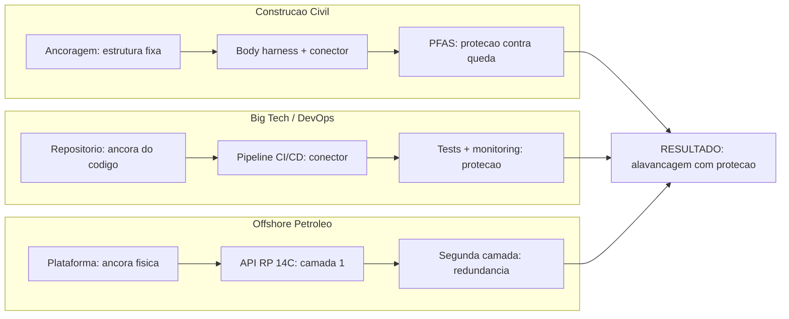

# Capítulo 12: Casos Reais — Construção, Software e Indústria

## 1. Introdução

No Capítulo 11, você viu como pipelines de CI/CD funcionam como harnesses de software — estruturas que amplificam a velocidade de entrega sem amplificar o risco de falha em produção. A ancora, o conector, a trava: tudo se mapeia. Mas teoria sem evidência é apenas história bonita. Este capítulo é onde a Fábrica de Harness Engineering encosta o nariz na realidade. Vamos visitar três cenários onde o conceito de harness não é metáfora — é condição de sobrevivência: um canteiro de obras onde torres de concreto sobem 300 metros, uma plataforma offshore onde o erro custa vidas e milhões, e os data centers das big techs onde o código que você usa todos os dias passou por harnesses de validação que nem existem em livros didáticos.

Como Engenheiro de Harness, você vai perceber algo que muda a forma como olha para qualquer projeto: o padrão é o mesmo. Seja uma torre de concreto ou um microsserviço em Kubernetes, os pilares da proteção — redundância, fail-safe, teste, validação — se repetem com precisão quase assustadora. A diferença está no domínio, não na estrutura.

## 2. Explica

### Construção civil e torres: onde a queda é literal

Na construção civil, quedas representam aproximadamente 8% dos óbitos por acidente de trabalho no mundo inteiro [1]. Essa não é uma estatística abstrata — são pessoas que caíram de andaimes, torres, escadas e coberturas. A OSHA (Occupational Safety and Health Administration) dos EUA exige que sistemas pessoais de travamento de queda (PFAS) sejam utilizados sempre que um trabalhador estiver a 6 pés (1,8 metro) ou mais acima de um nível inferior [2].

Empresas como 3M, Honeywell e MSA produzem harnesses com indicadores visuais de carga e absorvedores de energia integrados [3]. Mas o equipamento sozinho não salva vidas — é o **sistema** que salva. O PFAS é composto por cinco elementos interligados: Ancoragem, Body harness, Connector, Deceleration device e Emergency plan — o acrônimo ABCDE [4]. A falha de qualquer um desses componentes compromete todo o sistema.

No Brasil, a NR-35 (Norma Regulamentadora sobre Trabalho em Altura) estabelece que o trabalhador deve receber treinamento, usar EPI adequado e operar sob plano de emergência [5]. A norma não é burocracia — é a estrutura que transforma risco gerenciável em risco controlado. Sem ela, cada operação em altura vira um problema de sorte, não de engenharia.

Torres de telecomunicação são o exemplo mais extremo. Trabalho contínuo em alturas superiores a 50 metros requer treinamento específico de 16 horas (8 gerais + 8 específicas para a tarefa) [6]. Harnesses de suspensão com recursos de resgate integrado são mandatórios porque o tempo de suspensão sem resgate pode causar suspension trauma — uma condição onde o sangue se acumula nas pernas imobilizadas, levando à perda de consciência e à morte em minutos [7].

### Big tech: frameworks internos como alavanca de escala

Do lado do software, as grandes empresas de tecnologia enfrentaram um desafio parecido em escala diferente. Quando uma empresa como Google ou Netflix tem milhares de desenvolvedores commitando código simultaneamente, o risco de uma mudança quebrar o sistema inteiro é proporcionalmente enorme. A solução? Harnesses de validação em escala industrial.

O relatório DORA (DevOps Research and Assessment) mostrou que as equipes de elite — aquelas que entregam código frequentemente com baixa taxa de falha — compartilham uma característica: pipelines de CI/CD sofisticados que atuam como harnesses [8]. Esses pipelines não são apenas ferramentas de automação — são estruturas de proteção que validam cada mudança antes que ela toque em produção.

Empresas como Google desenvolveram frameworks internos como Borg (e depois Kubernetes) especificamente porque precisavam de uma estrutura que escalasse validação. O Kubernetes não é apenas um orquestrador de containers — é um harness de infraestrutura que garante que, se um componente falhar, outro assume automaticamente [9]. A redundância não é desperdício — é resiliência projetada.

Netflix levou essa lógica ao extremo com o Chaos Monkey: um sistema que deliberadamente desativa componentes em produção para testar se o harness de resiliência funciona [10]. É a mesma lógica do safety harness inspecionado periodicamente: você não descobre que o equipamento falhou quando o trabalhador cai — você descobre na inspeção, antes da queda.

### Offshore e petróleo: dupla camada de proteção

No setor de petróleo offshore, a exigência é ainda mais severa. A API RP 14C (Recommended Practice for Analysis, Design, Installation and Testing of Basic Surface Safety Systems for Offshore Production Platforms) estabelece que cada plataforma deve ter dupla camada de proteção para cada risco identificado [11]. Se uma válvula de segurança falha, uma segunda válvula — projetada independentemente — deve assumir. Se o sistema de detecção de incêndio falha, um segundo sistema deve detectar.

Essa filosofia de "dupla camada" é exatamente o que a engenharia de software chama de **defesa em profundidade**. No DevOps, isso se manifesta como testes automatizados que rodam em múltiplos estágios (unitário, integração, aceitação), seguidos por monitoring em produção e rollback automático [12]. Cada camada é um harness independente — se uma falha, a próxima segura.

A norma ISO 45001 de gestão de segurança e saúde no trabalho complementa essa visão ao exigir que organizações identifiquem perigos, avaliem riscos e implementem controles hierárquicos [13]. A hierarquia não muda entre domínios: eliminar o perigo é melhor que substituir, que é melhor que controle de engenharia, que é melhor que controle administrativo, que é melhor que EPI [14]. No software, eliminar a causa raiz de um bug (refatoração) é melhor que adicionar um teste (controle de engenharia), que é melhor que um feature flag (controle administrativo), que é melhor que um rollback manual (o "EPI" do deploy).

## 3. Ilustra

### A Oficina do Engenheiro: três bancadas, uma filosofia

Imagine uma oficina enorme com três bancadas de trabalho. Na primeira, um engenheiro de construção ajusta o harness de um trabalhador que vai subir em uma torre de 200 metros. Na segunda, um engenheiro de software revisa um pipeline de CI/CD que vai validar 500 commits por dia. Na terceira, um engenheiro de petróleo verifica que a válvula de segurança redundante da plataforma está funcionando. Três domínios diferentes — mas a filosofia é idêntica: **ancora forte, conector testado, trava funcionando**.

O padrão se repete porque o risco tem a mesma estrutura em qualquer domínio: se você amplifica capacidade (alavanca) sem proteção, amplifica também o dano potencial. O harness é o que permite dizer: "posso fazer mais, porque tenho uma estrutura que limita o pior cenário" [4].

### O Diagrama: Três Domínios, Um Padrão



Cada caminho segue o mesmo padrão: uma **ancora** (estrutura fixa que suporta o sistema), um **conector** (mecanismo que transmite a força), e uma **proteção** (dispositivo que limita o dano em caso de falha). O Engenheiro de Harness reconhece esse padrão em qualquer domínio porque a engenharia de segurança não é sobre equipamento — é sobre estrutura [15].

## 4. Técnica

### Pilar 1: PFAS em operações de risco — o sistema ABCDE na prática

Um PFAS (Personal Fall Arrest System) não é um item — é um **sistema**. Cada componente tem uma função específica, e a falha de um compromete todos os outros. Vamos mapear como um engenheiro de segurança estrutura isso na prática:

| Componente | Função | Critério de validação |
|---|---|---|
| **A**ncoragem | Ponto fixo que suporta a carga | Capacidade ≥ 22,2 kN (5.000 lbs) por trabalhador [2] |
| **B**ody harness | Distribui a força no corpo | Indicador visual de carga ativado? |
| **C**onector | Liga harness à ancoragem | Trava automática funcional? |
| **D**eceleration device | Absorve energia da queda | Limite de 1,8 metro de queda [2] |
| **E**mergency plan | Plano de resgate em < 15 min | Treinamento documentado? |

No Brasil, a NR-35 complementa essa estrutura com requisitos de treinamento e inspeção periódica [5]. A NR-18 (Condições e Meio Ambiente de Trabalho na Indústria da Construção) adiciona exigências específicas para canteiros de obras [16].

A validação de um PFAS segue o mesmo ciclo de um pipeline de software:

```python
def validar_pfas(componentes: dict) -> dict:
    """Valida se um PFAS está apto para uso."""
    resultado = {
        "apto": True,
        "falhas": [],
        "alertas": []
    }
    
    # Ancoragem: capacidade minima 22.2 kN
    if componentes["ancoragem"]["capacidade_kn"] < 22.2:
        resultado["apto"] = False
        resultado["falhas"].append("Ancoragem abaixo da capacidade minima")
    
    # Body harness: indicador de carga nao ativado
    if componentes["body_harness"]["indicador_carga"] == "ativado":
        resultado["apto"] = False
        resultado["falhas"].append("Indicador de carga ativado - equipamento comprometido")
    
    # Conector: trava funcional
    if not componentes["conector"]["trava_automatica"]:
        resultado["apto"] = False
        resultado["falhas"].append("Trava do conector inativa")
    
    # Device de desaceleracao: queda maxima 1.8m
    if componentes["desacelerador"]["queda_maxima_m"] > 1.8:
        resultado["apto"] = False
        resultado["falhas"].append("Queda excede limite de 1.8m")
    
    # Plano de emergencia
    if componentes["plano_emergencia"]["tempo_resgate_min"] > 15:
        resultado["alertas"].append("Tempo de resgate acima de 15 minutos")
    
    return resultado
```

Esse script é um **test harness** para o safety harness. Ele valida cada componente antes do uso, exatamente como um pipeline de CI/CD valida cada commit antes de ir para produção [8].

### Pilar 2: Big tech — pipelines como harnesses industriais

Em grandes empresas de tecnologia, o pipeline de CI/CD não é apenas uma ferramenta — é uma infraestrutura crítica que processa milhares de changes por dia. O padrão de harness se manifesta em três camadas:

**Camada 1 — Validação automática (o conector):** cada commit aciona testes unitários, de integração e de aceitação. Se qualquer teste falhar, o código não avança. É o equivalente ao conector do PFAS — se o conector não trava, o sistema não funciona [8].

**Camada 2 — Canary deployment (a trava):** em vez de liberar uma mudança para 100% dos usuários de uma vez, empresas como Google e Netflix liberam para 1% primeiro. Se as métricas de erro aumentarem, o deploy é revertido automaticamente [12]. É o equivalente ao absorvedor de energia — limita o impacto da falha.

**Camada 3 — Observabilidade (o plano de emergência):** ferramentas como Prometheus, Grafana e Datadog monitoram métricas em tempo real. Se algo anormal é detectado, alertas são disparados e runbooks são acionados [17]. É o equivalente ao plano de resgate do PFAS — quando tudo mais falha, há um processo estruturado para contenção.

O Kubernetes implementa essas três camadas como parte de sua arquitetura nativa: readiness probes (camada 1), rolling updates com rollback automático (camada 2) e liveness probes com auto-healing (camada 3) [9]. O sistema não apenas detecta falhas — ele se reconfigura automaticamente para manter a disponibilidade.

### Pilar 3: API RP 14C e a filosofia de dupla camada

A API RP 14C define que cada plataforma offshore deve ter análise formal de risco (HAZOP) e que cada risco identificado deve ter pelo menos duas camadas independentes de proteção [11]. Essa filosofia se implementa como:

**Camada 1 — Controles primários:** válvulas de segurança, sistemas de detecção automática, dispositivos de shutdown. Esses controles operam automaticamente e são projetados para tratar o cenário de falha mais comum [11].

**Camada 2 — Controles de backup:** válvulas redundantes independentemente projetadas, sistemas de detecção alternativos, procedimentos de emergência manuais. Esses controles são projetados para tratar a falha simultânea dos controles primários [13].

No software, a equivalência é direta: testes automatizados (camada 1) + monitoring + rollback automático (camada 2) + runbooks + plano de contingência (camada 3). A ISO 45001 formaliza essa abordagem ao exigir que organizações implementem controles hierárquicos — eliminar, substituir, engenharia, administrativo, EPI [13].

### A tabela comparativa: padrão universal

| Conceito | Construção Civil | Software (DevOps) | Offshore |
|---|---|---|---|
| **Ancora** | Estrutura fixa certificada | Repositório versionado | Plataforma estrutural |
| **Conector** | Mosquetão + trava | Pipeline CI/CD | Sistema de tubulação |
| **Proteção primária** | PFAS (ABCDE) | Testes automatizados | Válvula de segurança |
| **Proteção secundária** | Plano de resgate | Canary + rollback | Segunda camada (API RP 14C) |
| **Validação periódica** | Inspeção NR-35 | SAST/DAST/pen-test | HAZOP + auditing |
| **Norma regulamentadora** | NR-35, OSHA, ANSI Z359 | SWEBOK, ISO 25010 | API RP 14C, ISO 45001 |
| **Custo da falha** | Vidas | Reputação + receita | Vidas + ambiental |

A tabela revela algo que o Engenheiro de Harness já intui: **o padrão não muda, apenas a nomenclatura** [4][14].

## 5. Aplica

### Cena: O Andaime que Falhou e o Deploy que Quebrou

Imagine dois cenários que aconteceram na mesma semana, em lados opostos do mundo.

**Cenário 1 — São Paulo, Brasil.** Uma equipe de manutenção de torre de telecomunicação está trabalhando a 120 metros de altura. O técnico assume que o andaime está seguro porque "sempre funciona". Não faz inspeção formal antes de subir. O ponto de ancoragem, que deveria suportar 22,2 kN [2], apresentava corrosão interna que reduzia sua capacidade para 14 kN. Quando o trabalhador exercerce carga lateral, a ancoragem falha. O harness está lá — mas a ancoragem não segura. O sistema inteiro falha porque um componente não foi validado [7].

**Cenário 2 — São Francisco, EUA.** Um time de DevOps faz deploy de uma alteração de configuração em banco de dados de produção. A mudança parece trivial — apenas ajuste de timeout. Mas não passou pelo pipeline de CI porque era "apenas uma configuração". A alteração causa timeout em queries críticas, que acumulam conexões, que derruba o banco. O monitoring detecta o problema 40 minutos depois. O rollback automático não funciona porque o mecanismo de rollback dependia do banco que caiu. Sem camada de proteção secundária, o incidente dura 3 horas [12].

**Diagnóstico:** nos dois casos, o padrão de falha é idêntico. O sistema de proteção existia — mas não foi validado antes do uso, e não havia redundância para o caso de falha da primeira camada. O técnico não inspecionou a ancoragem assim como o DevOps não rodou o pipeline. A confiança em que "sempre funcionou" substituiu o teste estruturado [15].

**Correção prática:** na construção, a inspeção periódica de PFAS antes de cada operação em altura é obrigatória pela NR-35 e pela ANSI Z359.1-2020 [5][3]. No software, toda alteração — mesmo de configuração — deve passar pelo pipeline. Se o pipeline não cobre configurações, o harness tem uma lacuna que precisa ser fechada. O Kubernetes resolve parcialmente isso com GitOps: toda configuração é declarativa e versionada, e o sistema reconcilia automaticamente o estado desejado com o estado real [9].

### Armadilhas comuns

1. **Ancoragem não testada:** confiar que o ponto de ancoragem está seguro sem medição formal. No software, equivalente a confiar que o pipeline está funcionando sem rodar os testes.
2. **Redundância falsa:** ter duas válvulas que dependem da mesma fonte de energia. No software, ter dois sistemas de monitoring que dependem do mesmo banco de dados.
3. **Inspeção esquecida:** o harness tem validade de inspeção, mas ninguém agenda a revisão. No software, o pipeline tem testes desatualizados que ninguém revisa.
4. **Plano de emergência no papel:** o plano existe, mas ninguém treinou. No software, o runbook existe, mas ninguém testou em cenário real.

## 6. Conclusão

Três domínios, três riscos distintos, um padrão universal: **ancora, conector, proteção, redundância, validação periódica**. A construção civil ensina que o equipamento sozinho não salva — é o sistema. A big tech ensina que a automação sem redundância é frágil — é preciso camadas. O offshore ensina que cada camada pode falhar — por isso existe a segunda.

Você, como Engenheiro de Harness, agora tem evidência de que o conceito que aprendeu nos capítulos anteriores não é teoria abstrata. Funciona em torres de 200 metros, em data centers que servem bilhões de usuários, em plataformas no meio do oceano. O padrão é o mesmo porque a natureza do risco é a mesma: sempre que você amplifica capacidade sem amplificar proteção, o sistema colapsa.

Na **Parte IV — Mestrado**, vamos elevar o nível. Você verá como Inteligência Artificial cria uma nova camada de alavancagem (Capítulo 13), como projetar sistemas que toleram falhas por design (Capítulo 14), como o mercado valoriza esse profissional (Capítulo 15) e qual é o futuro da alavancagem com proteção (Capítulo 16). A fundação está construída — agora é hora de subir.

## 7. Referências Bibliográficas

[1] ORGANIZAÇÃO MUNDIAL DA SAÚDE. *Non-fatal occupational injuries*. Genebra: OMS, 2023. Disponível em: https://www.who.int/news-room/fact-sheets/detail/nonfatal-occupational-injuries. Acesso em: 07 ago. 2026.

[2] OCCUPATIONAL SAFETY AND HEALTH ADMINISTRATION. *29 CFR 1926 Subpart M — Fall Protection*. Washington: U.S. Department of Labor, 2024. Disponível em: https://www.osha.gov/laws-regs/regulations/standardnumber/1926/1926SubpartM. Acesso em: 07 ago. 2026.

[3] AMERICAN SOCIETY OF SAFETY PROFESSIONALS. *ANSI/ASSP Z359.1-2020 — Fall Protection Code*. Des Plaines: ASSP, 2020. Disponível em: https://blog.ansi.org/2021/01/ansi-assp-z359-1-2020-fall-protection-code/. Acesso em: 07 ago. 2026.

[4] WIKIPEDIA. *Safety harness*. Disponível em: https://en.wikipedia.org/wiki/Safety_harness. Acesso em: 07 ago. 2026.

[5] BRASIL. Ministério do Trabalho e Emprego. *Norma Regulamentadora NR-35 — Trabalho em Altura*. Brasília: MTE, 2020. Disponível em: https://www.gov.br/trabalho-e-emprego/pt-br/assuntos/saude-e-seguranca-do-trabalho/seguranca-e-saude-no-trabalho/normas-regulamentadoras/nr-35. Acesso em: 07 ago. 2026.

[6] OCCUPATIONAL SAFETY AND HEALTH ADMINISTRATION. *OSHA 1926.503 — Training Requirements*. Washington: U.S. Department of Labor, 2024. Disponível em: https://www.osha.gov/laws-regs/regulations/standardnumber/1926/1926.503. Acesso em: 07 ago. 2026.

[7] WIKIPEDIA. *Suspension trauma*. Disponível em: https://en.wikipedia.org/wiki/Suspension_trauma. Acesso em: 07 ago. 2026.

[8] KIM, Gene; HUMBLE, Jez; DEBOIS, Patrick; WILLIS, John. *The DORA State of DevOps Report*. DORA/Google Cloud, 2024. Disponível em: https://dora.dev/research/. Acesso em: 07 ago. 2026.

[9] KUBERNETES. *Documentation — Production-Grade Container Orchestration*. Disponível em: https://kubernetes.io/docs/home/. Acesso em: 07 ago. 2026.

[10] NETFLIX. *Chaos Monkey — Ensuring our Applications Can Survive Failures in Production*. Disponível em: https://netflix.github.io/chaosmonkey/. Acesso em: 07 ago. 2026.

[11] AMERICAN PETROLEUM INSTITUTE. *API RP 14C — Analysis, Design, Installation and Testing of Basic Surface Safety Systems for Offshore Production Platforms*. 8th ed. Washington: API, 2020.

[12] HUMBLE, Jez; FARLEY, David. *Continuous Delivery: Reliable Software Releases through Build, Test, and Deployment Automation*. Boston: Addison-Wesley, 2011.

[13] INTERNATIONAL ORGANIZATION FOR STANDARDIZATION. *ISO 45001:2018 — Occupational health and safety management systems — Requirements*. Geneva: ISO, 2018.

[14] LEVESON, Nancy G. *Engineering a Safer World: Systems Thinking Applied to Safety*. Cambridge: MIT Press, 2011. Disponível em: https://mitpress.mit.edu/9780262016629/engineering-a-safer-world/. Acesso em: 07 ago. 2026.

[15] AMERICAN SOCIETY OF SAFETY PROFESSIONALS. *ANSI/ASSP Z359.1-2020 — Fall Protection Code*. Des Plaines: ASSP, 2020.

[16] BRASIL. Ministério do Trabalho e Emprego. *Norma Regulamentadora NR-18 — Condições e Meio Ambiente de Trabalho na Indústria da Construção*. Brasília: MTE, 2022. Disponível em: https://www.gov.br/trabalho-e-emprego/pt-br/assuntos/saude-e-seguranca-do-trabalho/seguranca-e-saude-no-trabalho/normas-regulamentadoras/nr-18. Acesso em: 07 ago. 2026.

[17] ACM DIGITAL LIBRARY. *Proceedings of the International Conference on Software Engineering*. New York: ACM, 2023. Disponível em: https://dl.acm.org/doi/10.1145/336512.336562. Acesso em: 07 ago. 2026.
