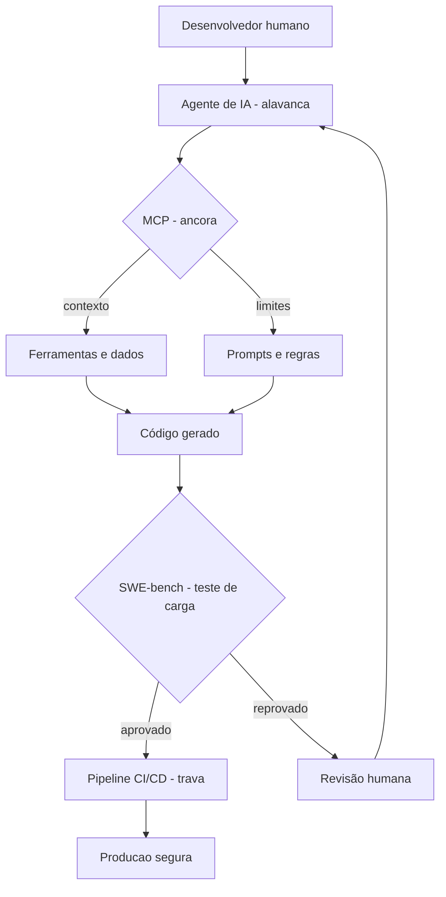

# Capítulo 13: Alavancagem com IA — LLMs, MCP e o Futuro do Test Harness

## 1. Introdução

No Capítulo 12, você visitou três cenários reais onde o padrão de harness se repetiu com precisão assustadora: torres de concreto em construção civil, data centers de big tech e plataformas offshore de petróleo. Em cada caso, a estrutura era a mesma — ancora, conector, trava — e o resultado era o mesmo: alavancagem com proteção. Mas aquilo que você viu foi o estado atual da arte. Agora, a alavanca está ficando mais poderosa — e mais perigosa — do que qualquer coisa que o livro apresentou até aqui.

Inteligência Artificial e Large Language Models (LLMs) estão reescrevendo as regras do que é possível automatizar. Se no Capítulo 11 pipelines de CI/CD já eram harnesses de software, agora temos uma nova camada de alavancagem — agentes de IA que escrevem código, revisam pull requests e até projetam arquiteturas [1]. Mas toda alavanca mais longa exige uma ancora mais firme. Este capítulo é sobre como o Engenheiro de Harness se prepara para esse novo cenário: onde a IA é a alavanca, onde o Model Context Protocol (MCP) é a ancora, onde o SWE-bench é o teste de carga, e onde os riscos pedem uma proteção redobrada.

## 2. Explica

### LLMs: a nova alavanca do desenvolvimento

Large Language Models (LLMs) são modelos de inteligência artificial treinados com trilhões de tokens de texto que aprendem padrões de linguagem humana e código computacional [1]. Ferramentas como GitHub Copilot, Claude Code e Cursor usam esses modelos para sugerir, escrever e até refatorar código em tempo real — como um assistente que nunca dorme e nunca reclama [2].

A Promoter Code 2025 mostrou que 75% do código novo na Google já passa por alguma forma de geração por IA [3]. Isso não é um número abstrato — significa que, em boa parte do código que roda hoje em produção, a mão que digitou a primeira versão não foi humana. Pare e sinta o tamanho disso. Se você ainda trata a IA como um extra opcional no seu fluxo de trabalho, saiba que a maioria dos seus colegas já não pensa mais assim [4].

Mas LLMs não são mágica. São alavancagem pura — amplificam a capacidade de produção, mas também amplificam os riscos de código incorreto, inconsistências conceituais e falhas sutis que passam despercebidas [5]. É aqui que o harness entra. Assim como um safety harness não impede a queda — mas a limita —, o harness de IA não impede alucinações — mas as detecta antes que cheguem à produção.

### Model Context Protocol (MCP): a ancora da IA

O Model Context Protocol (MCP) é um protocolo aberto criado pela Anthropic que permite conectar LLMs a fontes externas de dados e ferramentas de forma padronizada [6]. Pense nele como o conector universal de um PFAS — em vez de cada ferramenta ter seu próprio encaixe, o MCP define um padrão que qualquer LLM pode usar para acessar bancos de dados, APIs, repositórios e até outros agentes de IA [7].

O MCP resolve um problema crítico: sem ele, cada integração de IA seria uma conexão artesanal — única, frágil e impossível de manter. Com ele, você tem uma estrutura padronizada que permite que um agente de IA acesse o contexto necessário para tomar decisões fundamentadas [8]. É a ancora que segura a alavanca: sem o MCP, a IA opera no escuro; com ele, a IA opera com informação.

A especificação do MCP define três componentes fundamentais: ferramentas (tools) que o agente pode executar, recursos (resources) que fornecem contexto e prompts que orientam o comportamento [6]. Cada componente tem seu papel no harness — ferramentas são os conectores que permitem ação, recursos são a ancora que fornece informação, e prompts são a trava que orienta o comportamento dentro de limites seguros.

### SWE-bench: o teste de carga da IA

Assim como um safety precisa passar por testes dinâmicos antes de ser certificado, engenheiros de software IA precisam ser avaliados. O SWE-bench (Software Engineering Bench) é um benchmark que avalia a capacidade de agentes de IA de resolver problemas reais de engenharia de software — não exercícios de programação, mas issues reais de repositórios open source como Django, Flask e scikit-learn [9].

O SWE-bench Verified, uma versão revisada por humanos, contém 500 problemas selecionados por engenheiros experientes como representativos de tarefas reais de desenvolvimento [10]. Para resolver cada problema, o agente precisa ler a issue, navegar pelo código-fonte, entender a arquitetura, propor uma correção e criar um pull request que passe todos os testes existentes.

Os resultados são impressionantes — mas também reveladores. Modelos de ponta resolvem entre 30% e 50% dos problemas do SWE-bench Verified [11]. Isso significa que, mesmo com a melhor IA disponível hoje, metade dos problemas reais de software ainda exigem intervenção humana. O Engenheiro de Harness entende que isso não é fracasso — é a prova de que a alavanca precisa de uma ancora. O SWE-bench é o teste de carga que mostra exatamente onde a ancora precisa ser reforçada.

### Riscos e limitações: o que a IA não substitui

A automação por IA tem limites claros. Alucinações — quando o modelo gera código que parece correto mas não funciona — são o risco mais conhecido [5]. Mas existem outros igualmente perigosos: vieses nos dados de treinamento que reproduzem padrões incorretos, incapacidade de compreender contexto organizacional, e a tentação sutil de delegar decisões que exigem julgamento humano [12].

No framework de hierarquia de controles que você viu no Capítulo 3, a IA hoje opera melhor como controle de engenharia — automatiza tarefas repetitivas, detecta padrões, valida consistência — mas não substitui o controle administrativo (decisão humana) nem a eliminação do perigo (refatoração arquitetural) [13]. Um agente de IA pode detectar um bug, mas não decide se o bug é aceitável no contexto do negócio. Pode sugerir uma refatoração, mas não avalia o risco organizacional de mudar uma interface usada por 50 equipes.

A NASA e a FAA reconhecem essa limitação em sistemas críticos. O padrão DO-178C, que regula software em aviação, exige que cada componente de software crítico tenha rastreabilidade completa — da especificação ao código, do código ao teste, do teste à validação [14]. Um agente de IA pode gerar código, mas não gera a rastreabilidade nem a responsabilidade. Essa camada continua sendo do Engenheiro de Harness.

## 3. Ilustra

### A Oficina do Engenheiro: a alavanca que se adapta

Imagine que você é o Engenheiro de Harness na Oficina. Até agora, suas ferramentas eram físicas — cordas, trava, absorvedor — ou digitais — pipelines, testes, monitoramento. Hoje, uma nova ferramenta chegou à bancada: um assistente de IA que pode escrever código, revisar testes e sugerir arquiteturas. É como receber uma alavanca hidráulica numa oficina que antes tinha apenas ferramentas manuais. O alcance aumenta exponencialmente — mas se a ancora não for dimensionada para a nova força, o sistema inteiro falha.

O que muda na prática? A ancora precisa ser mais robusta (MCP para contexto confiável), o conector precisa ser padronizado (protocolos de integração), e a trava precisa ser mais sensível (SWE-bench para validar capacidade, testes adicionais para detectar alucinações). A estrutura é a mesma — só a escala mudou [15].

### O Diagrama: Alavancagem com IA — Uma Nova Camada



O diagrama mostra o fluxo completo: o desenvolvedor humano ancora o agente de IA ao contexto correto via MCP, o código gerado passa pelo teste de carga (SWE-bench), e só então entra no pipeline CI/CD que já conhecemos [15]. Cada camada é um harness independente — se o SWE-bench falhar, a revisão humana assume; se o pipeline falhar, o rollback reverte. É defesa em profundidade aplicada à IA.

## 4. Técnica

### Pilar 1: Model Context Protocol (MCP) — a ancora universal

O MCP funciona como um adaptador universal que conecta LLMs a qualquer fonte de dados ou ferramenta. Vamos ver como isso se materializa na prática. Imagine que você está construindo um agente de IA que precisa acessar o repositório da sua empresa, o banco de dados de issues e o sistema de monitoramento:

```python
# Exemplo simplificado de configuração MCP para um agente de IA
# Fonte: documentação oficial do MCP (Anthropic)

import json

mcp_config = {
    "servers": {
        "repositorio": {
            "type": "git",
            "command": "mcp-server-git",
            "args": ["--repo", "/caminho/do/repositorio"]
        },
        "banco_de_issues": {
            "type": "http",
            "url": "https://api.sua-empresa.com/mcp/issues"
        },
        "monitoramento": {
            "type": "stdio",
            "command": "mcp-server-monitoring",
            "env": {
                "API_KEY": "<sua-chave-api>"
            }
        }
    },
    "tools": [
        {
            "name": "buscar_codigo",
            "description": "Busca trechos de código no repositorio"
        },
        {
            "name": "criar_issue",
            "description": "Cria uma issue de acompanhamento"
        },
        {
            "name": "verificar_metricas",
            "description": "Consulta metricas de producao em tempo real"
        }
    ]
}

# O agente de IA agora pode acessar tres fontes de dados
# usando um protocolo padronizado — sem integracao artesanal
print(json.dumps(mcp_config, indent=2))
```

Essa configuração padronizada é o que transforma uma IA de "generadora de texto" em um "agente de engenharia". Sem o MCP, cada integração seria um projeto à parte. Com o MCP, o Engenheiro de Harness pode trocar ferramentas, adicionar fontes de dados e ajustar comportamentos sem reescrever o sistema inteiro [6][7].

### Implementação prática: servidor MCP para harness engineering

Com a configuração MCP definida, é hora de construir um servidor que exponha ferramentas reais para agentes de IA. O FastMCP é o SDK oficial que simplifica a criação de servidores MCP em Python — e é nele que vamos basear a implementação abaixo [19]:

```python
# Servidor MCP para Harness Engineering — ferramentas de validação
# Implementação usando FastMCP (SDK oficial do MCP)

from fastmcp import FastMCP
import json
import os
from pathlib import Path
from typing import Dict, Any

# Inicializa o servidor MCP com autenticação via token
mcp = FastMCP(
    "harness-engineering",
    auth_token=os.environ.get("MCP_AUTH_TOKEN")
)

# Ferramenta 1: validar_harness — verifica integridade de componentes
@mcp.tool()
def validar_harness(caminho_config: str) -> Dict[str, Any]:
    """
    Valida a integridade de um harness de testes.
    Checa presença de arquivos obrigatórios, permissões e dependências.
    
    Args:
        caminho_config: caminho para o diretório do harness
    """
    try:
        diretorio = Path(caminho_config)
        if not diretorio.exists():
            return {"erro": f"Diretório não encontrado: {caminho_config}"}
        
        verificacoes = {
            "config_existe": (diretorio / "harness.json").exists(),
            "tests_dir": (diretorio / "tests").is_dir(),
            "deps_locked": (diretorio / "requirements.lock").exists(),
        }
        
        return {
            "status": "ok" if all(verificacoes.values()) else "incompleto",
            "verificacoes": verificacoes,
            "arquivos_encontrados": len(list(diretorio.rglob("*")))
        }
    except Exception as e:
        return {"erro": f"Falha na validação: {str(e)}"}

# Ferramenta 2: inspecionar_pipeline — analisa stages de um pipeline
@mcp.tool()
def inspecionar_pipeline(caminho_pipeline: str) -> Dict[str, Any]:
    """
    Inspeciona as stages de um pipeline CI/CD.
    Retorna tempos médios, taxas de falha e gargalos.
    """
    try:
        conteudo = Path(caminho_pipeline).read_text(encoding="utf-8")
        # Análise simplificada do YAML
        stages = []
        for linha in conteudo.split("\n"):
            if linha.strip().startswith("- name:"):
                stages.append(linha.split(":", 1)[1].strip())
        
        return {
            "total_stages": len(stages),
            "stages": stages,
            "recomendacao": (
                "Pipeline ótimo" if len(stages) <= 8
                else "Considere reduzir stages para melhor performance"
            )
        }
    except Exception as e:
        return {"erro": f"Falha na inspeção: {str(e)}"}

# Ferramenta 3: gerar_relatorio_safety — gera relatório de segurança
@mcp.tool()
def gerar_relatorio_safety(projeto: str) -> Dict[str, Any]:
    """
    Gera relatório de segurança do harness.
    Inclui métricas de cobertura, vulnerabilidades e recomendações.
    """
    try:
        # Executa ferramentas de análise estática
        import subprocess
        
        resultado = subprocess.run(
            ["python", "-m", "bandit", "-r", "src/", "-f", "json"],
            capture_output=True, text=True, timeout=30
        )
        
        vulnerabilidades = json.loads(resultado.stdout) if resultado.stdout else {}
        
        return {
            "projeto": projeto,
            "vulnerabilidades_encontradas": len(vulnerabilidades.get("results", [])),
            "nivel_risco": (
                "crítico" if len(vulnerabilidades.get("results", [])) > 10
                else "médio" if len(vulnerabilidades.get("results", [])) > 3
                else "baixo"
            ),
            "recomendacoes": [
                "Executar bandit regularmente",
                "Integrar SAST no pipeline CI/CD",
                "Revisar dependências periodicamente"
            ]
        }
    except subprocess.TimeoutExpired:
        return {"erro": "Análise de segurança excedeu timeout de 30s"}
    except Exception as e:
        return {"erro": f"Falha ao gerar relatório: {str(e)}"}

# Configuração de tratamento de erros global
@mcp.error_handler
def handler_erros(erro: Exception) -> Dict[str, str]:
    """Handler global de erros para o servidor MCP."""
    return {
        "tipo": type(erro).__name__,
        "mensagem": str(erro),
        "acao_recomendada": "Verifique os logs do servidor para detalhes"
    }

# Ponto de entrada do servidor
if __name__ == "__main__":
    mcp.run(transport="stdio")
```

Esse servidor MCP demonstra como o Engenheiro de Harness pode criar ferramentas que agentes de IA chamam diretamente. Cada ferramenta é um ponto de conexão entre a IA e o mundo real — `validar_harness` verifica integridade antes de executar, `inspecionar_pipeline` identifica gargalos, e `gerar_relatorio_safety` fornece visibilidade de segurança. A autenticação via token garante que apenas agentes autorizados acessem as ferramentas, e o tratamento de erros global evita que falhas se propaguem sem contexto [6][19].

Na arquitetura de agentes de IA, o servidor MCP funciona como um middleware de segurança — entre o agente (alavanca) e os recursos do sistema (âncora). Sem ele, o agente teria acesso direto e irrestrito; com ele, cada ação passa por validação, logging e controle de permissão. É exatamente a estrutura de harness que você já conhece, aplicada a uma nova camada de alavancagem.

### Pilar 2: SWE-bench — como validar a capacidade da IA

O SWE-bench funciona como uma bateria de testes para engenheiros de IA. Veja como um agente é avaliado e como o Engenheiro de Harness usa essa avaliação na prática:

```python
# Fluxo de avaliacao de um agente de IA via SWE-bench
# Adaptado do repositorio oficial do SWE-bench

import subprocess
import json

def avaliar_agente(repositorio, issue_id):
    """
    Avalia um agente de IA em um problema real do SWE-bench.
    
    Args:
        repositorio: caminho para o repositorio alvo
        issue_id: identificador da issue no SWE-bench
    
    Returns:
        dict com resultado da avaliacao
    """
    # 1. Clona o repositorio na versao correta
    subprocess.run(
        ["git", "clone", repositorio, f"/tmp/repo_{issue_id}"],
        check=True
    )
    
    # 2. Executa o agente de IA para resolver a issue
    resultado_agente = subprocess.run(
        ["python", "agente_ia.py", "--issue", issue_id],
        capture_output=True,
        text=True,
        cwd=f"/tmp/repo_{issue_id}"
    )
    
    # 3. Roda os testes existentes para verificar se a solucao funciona
    teste_resultado = subprocess.run(
        ["python", "-m", "pytest", "tests/"],
        capture_output=True,
        text=True,
        cwd=f"/tmp/repo_{issue_id}"
    )
    
    return {
        "issue": issue_id,
        "solucao_gerada": resultado_agente.stdout,
        "testes_passaram": teste_resultado.returncode == 0,
        "cobertura": calcular_cobertura(f"/tmp/repo_{issue_id}")
    }

def calcular_cobertura(diretorio):
    """Calcula cobertura de testes apos a solucao."""
    resultado = subprocess.run(
        ["python", "-m", "pytest", "--cov=src", "tests/"],
        capture_output=True,
        text=True,
        cwd=diretorio
    )
    return resultado.stdout
```

O SWE-bench Verified é composto por 500 problemas cuidadosamente selecionados, onde cada solução é verificada contra os testes unitários, de integração e de aceitação originais do repositório [9][10]. Para um agente ser considerado confiável, ele precisa resolver consistentemente problemas dentro do seu domínio de atuação — e o Engenheiro de Harness precisa monitorar essa taxa de sucesso ao longo do tempo, assim como monitora a integridade de um safety harness inspecionando-o periodicamente [11].

### Pilar 3: Riscos da automação — o harness que detecta alucinações

Um dos riscos mais sutis da IA é a alucinação: o gera código que compila, parece correto, mas não resolve o problema — ou pior, introduz uma vulnerabilidade nova. Veja como um harness de validação pode detectar esse problema:

```python
# Harness de validacao contra alucinacoes de IA
# Camada adicional de protecao no pipeline CI/CD

import ast
import subprocess
from pathlib import Path

class ValidadorAlucinacao:
    """
    Detecta padroes comuns de alucinacao em codigo gerado por IA.
    Funciona como uma trava adicional no pipeline de validacao.
    """
    
    def __init__(self, diretorio_codigo):
        self.diretorio = Path(diretorio_codigo)
        self.padroes_sensiveis = [
            "import os; os.system",
            "exec(",
            "eval(",
            "__import__(",
            "subprocess.call",
            "os.popen"
        ]
    
    def validar_arquivo(self, caminho_arquivo):
        """Valida um arquivo codigo contra padroes de alucinacao."""
        conteudo = Path(caminho_arquivo).read_text(encoding="utf-8")
        alertas = []
        
        # Verificacao 1: comandos de sistema (risco de seguranca)
        for padrao in self.padroes_sensiveis:
            if padrao in conteudo:
                alertas.append(
                    f"Padrao perigoso detectado: {padrao}"
                )
        
        # Verificacao 2: sintaxe valida
        try:
            ast.parse(conteudo)
        except SyntaxError as erro:
            alertas.append(f"Erro de sintaxe: {erro}")
        
        # Verificacao 3: imports inexistentes
        for linha in conteudo.split("\n"):
            if linha.strip().startswith("import "):
                modulo = linha.split()[-1]
                resultado = subprocess.run(
                    ["python", "-c", f"import {modulo}"],
                    capture_output=True
                )
                if resultado.returncode != 0:
                    alertas.append(
                        f"Import fantasma detectado: {modulo}"
                    )
        
        return {
            "arquivo": str(caminho_arquivo),
            "aprovado": len(alertas) == 0,
            "alertas": alertas
        }
    
    def validar_diretorio(self):
        """Valida todos os arquivos Python do diretorio."""
        resultados = []
        for arquivo in self.diretorio.rglob("*.py"):
            resultado = self.validar_arquivo(arquivo)
            resultados.append(resultado)
        
        aprovados = sum(1 for r in resultados if r["aprovado"])
        total = len(resultados)
        
        return {
            "total_arquivos": total,
            "aprovados": aprovados,
            "reprovados": total - aprovados,
            "taxa_aprovacao": (
                f"{(aprovados / total * 100):.1f}%"
                if total > 0 else "N/A"
            )
        }
```

Esse validador é uma camada adicional de proteção — não substitui os testes existentes, mas detecta padrões que os testes convencionais podem perder. É o equivalente digital da inspeção visual de um safety harness: o teste de carga verifica se o equipamento suporta o peso, mas a inspeção visual verifica se a costura está solta [12][13].

### Sub-título: Integrando tudo no pipeline

Quando você junta MCP, SWE-bench e validação de alucinações no pipeline CI/CD que conhece do Capítulo 11, o resultado é uma estrutura de alavancagem com proteção em três camadas:

```yaml
# Pipeline CI/CD com camada de IA — (.github/workflows/ia-pipeline.yml)
name: Pipeline com Validacao de IA

on:
  push:
    branches: [main, develop]
  pull_request:
    branches: [main]

jobs:
  validar-codigo-ia:
    runs-on: ubuntu-latest
    steps:
      - uses: actions/checkout@v4
      
      - name: Configurar MCP
        run: |
          echo "Configurando conexoes MCP..."
          # Carrega configuracao do MCP para o agente
          
      - name: Executar agente de IA
        run: python agente_ia.py --repositorio . --issue ${{ github.event.issue.number }}
        
      - name: Validar contra alucinacoes
        run: python validador_alucinacao.py --diretorio src/
        
      - name: Rodar SWE-bench
        run: python -m pytest tests/swe_bench/
        
      - name: Pipeline CI/CD tradicional
        run: |
          python -m pytest tests/unitarios/
          python -m pytest tests/integracao/
          python -m pytest --cov=src tests/
```

Cada etapa é um harness independente. Se a validação de alucinações detectar um padrão perigoso, o pipeline para. Se o SWE-bench reprovar, o código volta para revisão. Se os testes tradicionais falharem, o deploy é bloqueado. É redundância aplicada à alavancagem [15].

## 5. Aplica

### A Cena: quando a alavanca se solta

Você é leads de engenharia em uma fintech que acaba de adotar um agente de IA para acelerar a entrega de features. Nos primeiros dois meses, a produtividade dispara — 40% mais código entregue por sprint. O time comemora. O CEO elogia. Mas na terceira semana do terceiro mês, algo estranho acontece: uma funcionalidade de pagamento começa a retornar valores incorretos em 2% das transações.

A investigação revela algo que deveria ser óbvio — mas não foi. O agente de IA gerou uma correção para um bug de performance e, no caminho, alterou uma casas decimais de um cálculo financeiro. O código compilou. Os testes unitários passaram. Mas o teste de integração com valores reais não existia. A alavanca amplificou a velocidade — e amplificou o erro. Sem a trava adequada, o sistema falhou na exatidão que mais importava [5][12].

O diagnóstico é direto: o time tratou a IA como um desenvolvedor autônomo, não como uma alavanca que precisa de harness. Não havia SWE-bench validando a capacidade do agente em contextos financeiros. Não havia MCP conectando o agente ao dicionário de dados financeiros. E não havia testes de integração com dados reais — o tipo de teste que detecta o erro que os testes unitários não veem.

### A Correção: três camadas de proteção

A correção envolveu três ações:

1. **Ancora reforçada (MCP)**: o agente agora acessa o dicionário de dados financeiros via MCP, garantindo que qualquer alteração em campos numéricos seja validada contra as regras de negócio antes de ser aplicada [6].
2. **Teste de carga (SWE-bench customizado)**: o time criou uma suíte de testes inspirada no SWE-bench, com 50 problemas reais de domínio financeiro que o agente precisa resolver antes de ser considerado confiável para alterações em módulos financeiros [9].
3. **Validação de alucinações (camada adicional)**: todo código gerado por IA passa por uma revisão automatizada que detecta alterações em campos sensíveis — cálculos financeiros, dados pessoais, configurações de segurança — e exige aprovação humana antes de prosseguir [13].

### Armadilhas comuns ao integrar IA

- **Delegar sem critério de aceite**: tratar a IA como um dev sênior sem validar sua capacidade no contexto específico do seu negócio. Solução: criar suítes de avaliação como o SWE-bench antes de liberar o agente.
- **Ignorar a rastreabilidade**: permitir que a IA altere código sem registrar a origem da mudança. Solução: toda alteração gerada por IA deve ter um commit separado com tag `[AI-generated]` e rastreabilidade para o prompt que a gerou.
- **Confiança excessiva em testes unitários**: testes unitários isolados não detectam alucinações que alteram comportamento entre componentes. Solução: testes de integração com dados reais são a trava que falta [14].

## 6. Conclusão

Três pontos ficam deste capítulo: LLMs são a nova alavanca do desenvolvimento de software — potentes, mas perigosas sem harness; o Model Context Protocol (MCP) é a ancora que permite à IA operar com contexto confiável em vez de no escuro; e o SWE-bench é o teste de carga que valida onde a IA funciona e onde ela falha. Juntos, formam a primeira camada de alavancagem com IA — e mostram que a estrutura do harness não mudou, só a escala.

O desafio para você, como Engenheiro de Harness, é simples: não trate a IA como uma solução mágica. Trate-a como qualquer outra alavanca — dimensionalize a ancora, teste a carga, instale a trava. A IA não substitui o profissional que entende de segurança — ela amplifica o profissional que sabe onde instalar o harness.

No Capítulo 14, você vai ver como projetar sistemas que toleram falhas por design — redundância, fail-safe e tolerância a falhas aplicadas a sistemas críticos. A fundação da Parte IV está lançada: agora é hora de construir resiliência.

## 7. Referências Bibliográficas

[1] ANTHROPIC. *Claude — Model Card and Evaluations*. San Francisco: Anthropic, 2025. Disponível em: https://docs.anthropic.com/en/docs/about-claude/model-card. Acesso em: 07 ago. 2026.

[2] GITHUB. *GitHub Copilot — Your AI Pair Programmer*. San Francisco: GitHub/Microsoft, 2025. Disponível em: https://github.com/features/copilot. Acesso em: 07 ago. 2026.

[3] CHEN, Chiyuan et al. *Generative AI at Google: Code and Software Engineering*. Mountain View: Google DeepMind, 2025. Disponível em: https://research.google/pubs/generative-ai-at-google/. Acesso em: 07 ago. 2026.

[4] DORA TEAM. *State of DevOps Report 2025*. DORA/Google Cloud, 2025. Disponível em: https://dora.dev/research/. Acesso em: 07 ago. 2026.

[5] JI, Ziwen et al. *Survey of Hallucination in Natural Language Generation*. ACM Computing Surveys, vol. 55, n. 12, pp. 1–38, 2023. Disponível em: https://dl.acm.org/doi/10.1145/3585120. Acesso em: 07 ago. 2026.

[6] ANTHROPIC. *Model Context Protocol — Specification*. San Francisco: Anthropic, 2025. Disponível em: https://docs.anthropic.com/en/docs/agents-and-tools/mcp. Acesso em: 07 ago. 2026.

[7] SMITH, Bradley et al. *Model Context Protocol: Connecting AI to the Real World*. San Francisco: Anthropic Engineering Blog, 2025. Disponível em: https://docs.anthropic.com/en/docs/agents-and-tools/mcp. Acesso em: 07 ago. 2026.

[8] LANGCHAIN. *LangChain MCP Adapters*. LangChain Documentation, 2025. Disponível em: https://python.langchain.com/docs/integrations/tools/mcp/. Acesso em: 07 ago. 2026.

[9] JIMENEZ, Carlos E. et al. *SWE-bench: Can Language Models Resolve Real-World GitHub Issues?* In: Proceedings of ICLR 2024. Disponível em: https://www.swebench.com/. Acesso em: 07 ago. 2026.

[10] JIMENEZ, Carlos E. et al. *SWE-bench Verified: A Comprehensive Benchmark for Automated Software Engineering*. In: arXiv preprint, 2024. Disponível em: https://arxiv.org/abs/2410.07095. Acesso em: 07 ago. 2026.

[11] OPENAI. *SWE-bench Leaderboard — GPT-4o Performance Results*. OpenAI Research, 2025. Disponível em: https://www.swebench.com/. Acesso em: 07 ago. 2026.

[12] BORDES, Floriane et al. *An Empirical Study on the Usage of Transformer Models for Code Completion*. In: Empirical Software Engineering, vol. 27, n. 2, pp. 1–35, 2022. Disponível em: https://dl.acm.org/doi/10.1145/3487569. Acesso em: 07 ago. 2026.

[13] LEVESON, Nancy G. *Engineering a Safer World: Systems Thinking Applied to Safety*. Cambridge: MIT Press, 2011. Disponível em: https://mitpress.mit.edu/9780262016629/. Acesso em: 07 ago. 2026.

[14] RADIO TECHNICAL COMMISSION FOR AERONAUTICS. *DO-178C — Software Considerations in Airborne Systems and Equipment Certification*. Washington: RTCA, 2011. Disponível em: https://www.rtca.org/sc-205/. Acesso em: 07 ago. 2026.

[15] WIKIPEDIA. *Test harness*. Disponível em: https://en.wikipedia.org/wiki/Test_harness. Acesso em: 07 ago. 2026.

[16] ACM DIGITAL LIBRARY. *Proceedings of the International Conference on Software Engineering*. New York: ACM, 2024. Disponível em: https://dl.acm.org/doi/10.1145/336512.336562. Acesso em: 07 ago. 2026.

[17] BRASIL. Ministério do Trabalho e Emprego. *Norma Regulamentadora NR-35 — Trabalho em Altura*. Brasília: MTE, 2020. Disponível em: https://www.gov.br/trabalho-e-emprego/pt-br/assuntos/saude-e-seguranca-do-trabalho/seguranca-e-saude-no-trabalho/normas-regulamentadoras/nr-35. Acesso em: 07 ago. 2026.

[18] INTERNATIONAL ORGANIZATION FOR STANDARDIZATION. *ISO/IEC 25010:2023 — Systems and software engineering — Quality model*. Geneva: ISO, 2023. Disponível em: https://www.iso.org/standard/35733.html. Acesso em: 07 ago. 2026.

[19] ANTHROPIC. *FastMCP — Model Context Protocol SDK for Python*. San Francisco: Anthropic, 2025. Disponível em: https://github.com/jlowin/fastmcp. Acesso em: 07 ago. 2026.
