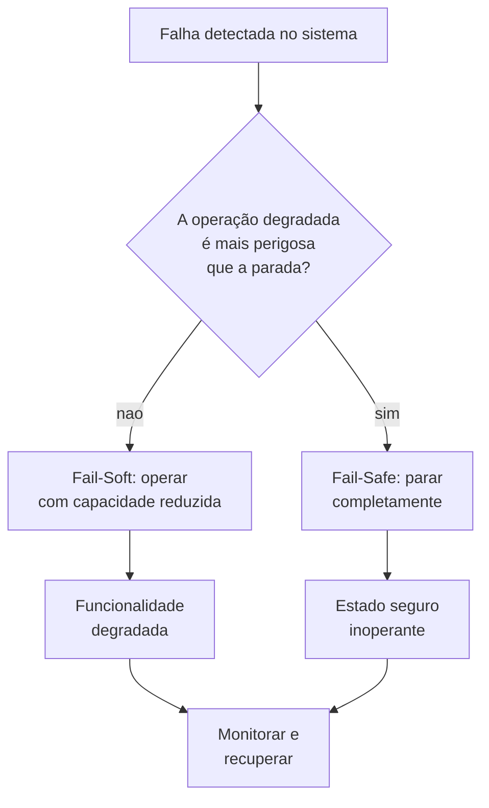

# Capítulo 14: Design de Sistemas Resilientes — Redundância e Tolerância a Falhas

## 1. Introdução

No Capítulo 13, você viu como IA e LLMs criaram uma nova camada de alavancagem — o Engenheiro de Harness agora pode delegar tarefas para agentes autônomos, amplificando produtividade de forma quase exponencial. Mas toda alavancagem traz uma pergunta incômoda: e quando algo quebra? Se o agente de IA errar, se o servidor cair, se o dado corromper — o que acontece com o sistema que você projetou? Este capítulo é a resposta para essa pergunta. Vamos aprender a construir sistemas que não apenas funcionam, mas que **sobrevivem** quando as coisas dão errado — que é exatamente quando elas precisam funcionar.

Aqui na Oficina do Engenheiro, a palavra-chave é **resiliência**. Um safety harness que funciona apenas quando o tempo está bom não é um harness — é um acessório. Da mesma forma, um software que roda sem falhas apenas quando tudo está perfeito não é um sistema — é uma hipótese. Neste capítulo, você vai dominar os princípios de design que separam sistemas frágeis de sistemas resilientes, aprendendo quando a redundância é uma ancora de segurança e quando é puro desperdício.

## 2. Explica

### Redundância: quando mais é mais (e quando é desperdício)

Redundância é o princípio de manter cópias extras de componentes críticos para que, se um falhar, outro assuma automaticamente. No safety harness, isso se manifesta de forma tangível: âncoras duplas, linhas de vida redundantes, absorvedores de energia com indicadores visuais de carga [1]. Na aviação, cada sistema hidráulico tem pelo menos três rotas independentes — se uma linha romper, as outras duas mantêm o controle da aeronave [2].

Mas redundância não é sinônimo de "mais é melhor". Existe um ponto de diminishing returns onde cada cópia adicional adiciona complexidade sem ganho proporcional de confiabilidade. O engenheiro precisa entender a diferença entre **redundância ativa** (todas as cópias trabalhando simultaneamente) e **redundância passiva** (uma cópia funciona, as outras ficam standby até serem acionadas) [3].

Na indústria aeroespacial, o conceito de **N-version programming** leva a redundância ao extremo: equipes independentes desenvolvem o mesmo software usando métodos diferentes, e o sistema compara os resultados em tempo real [4]. Se uma versão discordar das outras, ela é descartada. É caro? Sim. Mas quando a falha pode significar a queda de uma aeronave com 300 passageiros, o custo da redundância é uma fração do custo do desastre.

No entanto, redundância mal projetada pode criar o que engenheiros chamam de **single point of failure oculto**: dois sistemas redundantes que dependem da mesma fonte de energia, do mesmo operador, ou do mesmo cabo de rede. A redundância só funciona se as cópias forem verdadeiramente independentes — uma ancora dupla que está fixada na mesma viga instável não é redundância, é ilusão de segurança [5].

### Fail-safe vs. fail-soft: estratégias de projeto para diferentes riscos

Quando um sistema falha, ele pode seguir dois caminhos radicais. O **fail-safe** coloca o sistema em um estado seguro e completamente inoperante — como um elevador que trava automaticamente quando detecta uma falha no cabo, impedindo tanto a subida quanto a descida [6]. O **fail-soft** permite que o sistema continue operando com capacidade reduzida — como um avião que perde um motor mas mantém voo com os restantes [7].

A escolha entre fail-safe e fail-soft depende do tipo de risco. Em sistemas onde a operação degradada é mais perigosa que a parada completa (um reator nuclear, por exemplo), fail-safe é a única opção correta. Em sistemas onde a parada total causaria danos maiores que a operação reduzida (um sistema de controle de voo), fail-soft é preferível [8].

No software, essa distinção aparece em patterns como **circuit breakers** (fail-safe: para de processar requisições quando detecta falhas) e **bulkheads** (fail-soft: isola componentes para que a falha de um não afete os outros) [9]. O Engenheiro de Harness precisa saber qual padrão usar em cada camada do sistema, porque a escolha errada pode transformar uma falha menor em um desastre sistêmico.

### DO-178C e MIL-STD-882D: padrões de resiliência em sistemas críticos

Quando a tolerância a falhas não é opcional — quando a falha significa morte — existem padrões que definem rigorosamente como o design deve ser feito. O **DO-178C** (*Software Considerations in Airborne Systems and Equipment Certification*) é o padrão da aviação civil que classifica software em cinco níveis de criticalidade (DAL A a E), onde o nível A (catastrófico) exige formal verification, cobertura de código de 100%, e testes de integração extensivos [10].

O **MIL-STD-882D** (*Standard Practice for System Safety*) é o equivalente militar, que estabelece um processo de análise de perigo onde cada risco é classificado em severidade (I a IV) e probabilidade (frequente a improvável) [11]. A matriz resultante define quais controles de segurança são obrigatórios para cada combinação. Um risco com severidade I (catastrófica) e probabilidade frequente exige controles que eliminem o perigo na fonte — redundância ativa com isolamento completo.

Esses padrões não são burocracia — são a cristalização de décadas de lições aprendidas com acidentes reais. O DO-178C nasceu após uma série de acidentes causados por falhas de software nos anos 1980 [12]. O MIL-STD-882D evoluiu a partir de falhas militares onde a ausência de análise sistemática de perigo custou vidas e equipamentos [11]. Para o Engenheiro de Harness, esses padrões são a referência de como projetar resiliência quando o custo da falha é inaceitável.

## 3. Ilustra

### A Oficina com Dois Martelos

Imagine que você está na Oficina do Engenheiro e precisa de um martelo para um trabalho urgente. Você tem apenas um martelo na bancada. Se ele quebrar — a cabeça soltar do cabo, por exemplo — o trabalho para. Agora imagine que você tem dois martelos idênticos na bancada, lado a lado. Se um quebrar, você pega o outro sem interrupção. Isso é redundância ativa: ambos prontos para uso a qualquer momento.

Mas e se os dois martelos estiverem apoiados no mesmo prateleira de madeira podre? Quando a prateleira cair, os dois caem juntos. Você tinha "redundância", mas ela não era independente — dependia da mesma ancora frágil. É exatamente isso que acontece quando dois servidores redundantes compartilham a mesma fonte de energia sem UPS.

Agora pense em fail-safe: imagine que o martelo tem um mecanismo de travamento que impede o uso se estiver danificado. Se alguém tentar usá-lo com a cabeça solta, o cabo trava automaticamente. É inoperante, mas seguro — não pode machucar ninguém. Já o fail-soft seria uma broca que perde potência mas continua girando: você não para o trabalho, só faz mais devagar.

### Fluxo de Decisão: Fail-Safe ou Fail-Soft?



## 4. Técnica

### Redundância Ativa vs. Passiva: como implementar

A escolha entre redundância ativa e passiva define a complexidade do seu sistema. Na redundância ativa, todas as cópias operam simultaneamente e o sistema usa um mecanismo de votação ou load balancing para decidir qual resultado usar. Na redundância passiva, uma cópia é primária e as outras ficam em standby, prontas para assumir se a primária falhar.

### Padrão Circuit Breaker (Fail-Safe em Software)

O circuit breaker é um dos padrões mais usados em sistemas distribuídos. Ele monitora as chamadas a um componente externo e, quando detecta um número excessivo de falhas, "abre" o circuito — parando de encaminhar requisições para o componente defeituoso. Isso evita que o sistema inteiro travasse por causa de um componente lento ou inoperante.

```python
import time
from enum import Enum

class CircuitState(Enum):
    CLOSED = "closed"
    OPEN = "open"
    HALF_OPEN = "half_open"

class CircuitBreaker:
    def __init__(self, failure_threshold=5, recovery_timeout=30):
        self.failure_threshold = failure_threshold
        self.recovery_timeout = recovery_timeout
        self.failure_count = 0
        self.state = CircuitState.CLOSED
        self.last_failure_time = None

    def record_failure(self):
        self.failure_count += 1
        self.last_failure_time = time.time()
        if self.failure_count >= self.failure_threshold:
            self.state = CircuitState.OPEN
            print(f"Circuito ABERTO apos {self.failure_count} falhas")

    def record_success(self):
        self.failure_count = 0
        self.state = CircuitState.CLOSED

    def can_execute(self):
        if self.state == CircuitState.CLOSED:
            return True
        if self.state == CircuitState.OPEN:
            if time.time() - self.last_failure_time > self.recovery_timeout:
                self.state = CircuitState.HALF_OPEN
                return True
            return False
        return True

def chamada_externa(breaker):
    if not breaker.can_execute():
        raise Exception("Circuito aberto — servico indisponivel")
    try:
        resultado = executar_servico()
        breaker.record_success()
        return resultado
    except Exception as e:
        breaker.record_failure()
        raise

def executar_servico():
    import random
    if random.random() < 0.6:
        raise Exception("Servico falhou")
    return "sucesso"

breaker = CircuitBreaker(failure_threshold=3, recovery_timeout=10)
for i in range(10):
    try:
        resultado = chamada_externa(breaker)
        print(f"Requisicao {i+1}: {resultado}")
    except Exception as e:
        print(f"Requisicao {i+1}: {e}")
    time.sleep(0.5)
```

### Circuit Breaker Avançado: Decorator e Configuração para APIs Externas

A implementação básica do circuit breaker demonstra a mecânica dos três estados, mas na prática precisamos de configuracao flexivel e integracao limpa com o codigo cliente. O decorator Python permite aplicar circuit breaker a qualquer funcao sem modificar seu corpo — exatamente como o absorvedor de energia se instala entre o trabalhador e a ancora sem alterar nenhum dos dois [19].

```python
import time
import functools
from enum import Enum
from typing import Callable, Any

class CircuitState(Enum):
    CLOSED = "closed"
    OPEN = "open"
    HALF_OPEN = "half_open"

class CircuitBreakerConfig:
    """Configuracao do circuit breaker com thresholds ajustaveis."""
    def __init__(
        self,
        failure_threshold: int = 5,
        recovery_timeout: float = 30.0,
        half_open_max_calls: int = 3,
        expected_exceptions: tuple = (Exception,)
    ):
        self.failure_threshold = failure_threshold
        self.recovery_timeout = recovery_timeout
        self.half_open_max_calls = half_open_max_calls
        self.expected_exceptions = expected_exceptions

class CircuitBreaker:
    def __init__(self, config: CircuitBreakerConfig = None):
        self.config = config or CircuitBreakerConfig()
        self.failure_count = 0
        self.success_count = 0
        self.state = CircuitState.CLOSED
        self.last_failure_time = None
        self.half_open_calls = 0
        self._lock = __import__("threading").Lock()

    def _on_success(self):
        with self._lock:
            if self.state == CircuitState.HALF_OPEN:
                self.success_count += 1
                if self.success_count >= self.config.half_open_max_calls:
                    self.state = CircuitState.CLOSED
                    self.failure_count = 0
                    self.success_count = 0
            else:
                self.failure_count = 0

    def _on_failure(self):
        with self._lock:
            self.failure_count += 1
            self.last_failure_time = time.time()
            if self.state == CircuitState.HALF_OPEN:
                self.state = CircuitState.OPEN
                self.half_open_calls = 0
            elif self.failure_count >= self.config.failure_threshold:
                self.state = CircuitState.OPEN

    def can_execute(self) -> bool:
        with self._lock:
            if self.state == CircuitState.CLOSED:
                return True
            if self.state == CircuitState.OPEN:
                if time.time() - self.last_failure_time > self.config.recovery_timeout:
                    self.state = CircuitState.HALF_OPEN
                    self.success_count = 0
                    return True
                return False
            if self.state == CircuitState.HALF_OPEN:
                return self.half_open_calls < self.config.half_open_max_calls
            return False

def circuit_breaker(config: CircuitBreakerConfig = None):
    """Decorator que aplica circuit breaker a qualquer funcao."""
    breaker = CircuitBreaker(config)

    def decorator(func: Callable) -> Callable:
        @functools.wraps(func)
        def wrapper(*args, **kwargs) -> Any:
            if not breaker.can_execute():
                raise ConnectionError(
                    f"Circuito ABERTO — {func.__name__} bloqueado. "
                    f"Ulusando fallback ou retry apos {breaker.config.recovery_timeout}s"
                )
            try:
                result = func(*args, **kwargs)
                breaker._on_success()
                return result
            except breaker.config.expected_exceptions as e:
                breaker._on_failure()
                raise
        wrapper.circuit_breaker = breaker
        return wrapper
    return decorator

# --- Exemplo pratico: circuit breaker para chamada a API externa ---

config_pagamento = CircuitBreakerConfig(
    failure_threshold=3,
    recovery_timeout=60.0,
    half_open_max_calls=2,
    expected_exceptions=(ConnectionError, TimeoutError)
)

@circuit_breaker(config_pagamento)
def buscar_pagamento(pedido_id: str) -> dict:
    """Chama API de pagamento externa."""
    import random
    if random.random() < 0.7:
        raise ConnectionError("Gateway de pagamento indisponivel")
    return {"pedido": pedido_id, "status": "aprovado", "valor": 150.00}

# Simulacao de 15 chamadas
for i in range(15):
    try:
        resultado = buscar_pagamento(f"PED-{i:03d}")
        print(f"[{i+1}] Sucesso: {resultado}")
    except ConnectionError as e:
        print(f"[{i+1}] Bloqueado: {e}")
    time.sleep(0.3)
```

O decorator encapsula toda a logica de estado e transicao, mantendo a funcao cliente limpa — `buscar_pagamento` nao conhece o circuit breaker, assim como o trabalhador em altura nao precisa entender a mecânica interna do absorvedor de energia. A configuração `half_open_max_calls` controla quantas chamadas de teste são permitidas no estado HALF_OPEN antes de fechar o circuito novamente, evitando transições prematuras [19].

### Padrão Bulkhead (Fail-Soft em Software)

O bulkhead isola componentes do sistema para que a falha de um não afete os outros. Assim como os compartimentos estanques de um navio impedem que um buraco em uma seção alague todo o barco, o bulkhead de software limita o impacto de uma falha a apenas uma parte do sistema.

```python
import threading
from concurrent.futures import ThreadPoolExecutor

class Bulkhead:
    def __init__(self, max_concurrent=5):
        self.semaphore = threading.Semaphore(max_concurrent)
        self.max_concurrent = max_concurrent
        self.active_count = 0
        self.rejected_count = 0

    def execute(self, func, *args, **kwargs):
        if not self.semaphore.acquire(blocking=False):
            self.rejected_count += 1
            raise Exception("Bulkhead cheio — requisicao rejeitada")
        try:
            self.active_count += 1
            return func(*args, **kwargs)
        finally:
            self.active_count -= 1
            self.semaphore.release()

def servico_critico(dados):
    import time
    time.sleep(1)
    return f"Processado: {dados}"

def servico_nao_critico(dados):
    import time
    time.sleep(2)
    return f"Log: {dados}"

bulkhead_critico = Bulkhead(max_concurrent=5)
bulkhead_log = Bulkhead(max_concurrent=2)

with ThreadPoolExecutor(max_workers=10) as pool:
    futures = []
    for i in range(8):
        futures.append(pool.submit(bulkhead_critico.execute, servico_critico, f"dado-{i}"))
    for i in range(4):
        futures.append(pool.submit(bulkhead_log.execute, servico_nao_critico, f"log-{i}"))

    for i, f in enumerate(futures):
        try:
            resultado = f.result()
            print(f"Tarefa {i}: {resultado}")
        except Exception as e:
            print(f"Tarefa {i}: REJEITADA - {e}")
```

### Matriz de Severidade MIL-STD-882D

O MIL-STD-882D usa uma matriz que cruza severidade com probabilidade para determinar o nível de controle necessário. Essa matriz é uma ferramenta concreta que o Engenheiro de Harness pode usar para priorizar onde investir em redundância:

```python
matriz_risco = {
    ("Catastrofica", "Frequente"):    "Controle OBRIGATORIO — eliminar perigo na fonte",
    ("Catastrofica", "Provavel"):     "Controle OBRIGATORIO — redundancia ativa + isolamento",
    ("Catastrofica", "Occasional"):   "Controle ALTO — redundancia passiva + monitoramento",
    ("Catastrofica", "Improvavel"):   "Controle MODERADO — redundancia passiva",
    ("Critica", "Frequente"):         "Controle ALTO — redundancia ativa + isolamento",
    ("Critica", "Provavel"):          "Controle MODERADO — redundancia passiva",
    ("Critica", "Occasional"):        "Controle BAIXO — monitoramento",
    ("Critica", "Improvavel"):        "Controle MINIMO — registro",
    ("Grave", "Frequente"):           "Controle MODERADO — redundancia passiva",
    ("Grave", "Provavel"):            "Controle BAIXO — monitoramento",
    ("Grave", "Occasional"):          "Controle MINIMO — registro",
    ("Grave", "Improvavel"):          "Aceitar risco — monitorar",
    ("Leve", "Frequente"):            "Controle BAIXO — monitoramento",
    ("Leve", "Provavel"):             "Controle MINIMO — registro",
    ("Leve", "Occasional"):           "Aceitar risco — monitorar",
    ("Leve", "Improvavel"):           "Aceitar risco — monitorar",
}

def avaliar_risco(severidade, probabilidade):
    chave = (severidade, probabilidade)
    return matriz_risco.get(chave, "Risco nao mapeado")

print(avaliar_risco("Catastrofica", "Provavel"))
print(avaliar_risco("Leve", "Improvavel"))
```

### Comparação DO-178C: Níveis de Criticalidade

O DO-178C classifica software em cinco níveis (DAL), cada um com requisitos crescentes de rigor. Essa classificação é o equivalente aéreo da matriz MIL-STD:

```python
do178c_levels = {
    "DAL A": {
        "consequencia": "Catastrofica",
        "requisitos": [
            "Verificacao formal do codigo",
            "Cobertura de estrutura e dados: 100%",
            "Testes de integracao em todos os niveis",
            "Revisao de cada requisito e design"
        ]
    },
    "DAL B": {
        "consequencia": "Perigosa",
        "requisitos": [
            "Verificacao estrutural do codigo",
            "Cobertura de estrutura: 100%, dados: >90%",
            "Testes de integracao em todos os niveis",
            "Revisao de requisitos criticos"
        ]
    },
    "DAL C": {
        "consequencia": "Significativa",
        "requisitos": [
            "Verificacao de codigo",
            "Cobertura de estrutura: >80%",
            "Testes de integracao em niveis selecionados",
            "Analise de requisitos"
        ]
    },
    "DAL D": {
        "consequencia": "Menor",
        "requisitos": [
            "Verificacao basica de codigo",
            "Cobertura de estrutura: >70%",
            "Testes de integracao basicos"
        ]
    },
    "DAL E": {
        "consequencia": "Nenhuma",
        "requisitos": [
            "Processo de desenvolvimento documentado"
        ]
    }
}

for nivel, info in do178c_levels.items():
    print(f"\n{nivel} ({info['consequencia']}):")
    for req in info["requisitos"]:
        print(f"  - {req}")
```

## 5. Aplica

### A Falha na Esteira e a Correção Estrutural

Imagine que você é responsável pelo deploy de uma aplicação de e-commerce. No dia da Black Friday, o serviço de pagamento começa a retornar erros intermitentes. Sua aplicação não tem circuit breaker — cada chamada ao gateway de pagamento trava por 30 segundos antes de retornar timeout. Em menos de 5 minutos, a fila de requisições pendentes cresceu tanto que o servidor ficou sem memória. O site caiu para todos os clientes.

O que aconteceu aqui? Sua aplicação não tinha **fail-safe** (circuit breaker) nem **fail-soft** (bulkhead). A falha de um componente externo se propagou por todo o sistema, como um buraco em um navio sem compartimentos estanques que afoga o barco inteiro.

A correção é aplicar os padrões que você aprendeu na seção Técnica:

1. **Circuit breaker** no gateway de pagamento: após 5 falhas consecutivas, o circuito abre e a aplicação retorna uma mensagem amigável ("Pagamento temporariamente indisponível") em vez de travar.
2. **Bulkhead** entre serviços: a池 de conexões do gateway de pagamento é limitada a 20 threads. Mesmo que o gateway esteja lento, apenas 20 requisições ficam presas — as outras continuam funcionando.
3. **Fallback** (fail-soft): quando o pagamento está indisponível, a aplicação oferece alternativa — "finalize depois", "salve no carrinho", "pague na entrega".

No mundo físico, o paralelo é direto: um trabalhador em altura com PFAS que tem âncora dupla, absorvedor de energia e plano de emergência pode cair — mas o sistema de proteção absorve o impacto e o mantém vivo. Sem essas camadas, a mesma queda é fatal [1].

### Armadilhas Comuns

- **Redundância sem independência**: dois servidores na mesma máquina virtual não são redundância. Se o hypervisor falhar, os dois caem juntos. A redundância só funciona se as cópias tiverem dependências verdadeiramente separadas.
- **Fail-safe onde deveria ser fail-soft**: um sistema de login que bloqueia a conta após 3 falhas pode impedir um usuário legítimo de acessar. O fail-safe aqui é excessivo — um cooldown temporário (fail-soft) seria mais apropriado.
- **Complexidade oculta da redundância ativa**: sistemas ativos requerem mecanismos de detecção de falha, votação e failover. Cada camada adiciona pontos de falha potenciais. Às vezes, a redundância passiva simples e testada é mais confiável que a ativa sofisticada.
- **Ignorar o custo da resiliência**: DO-178C nível A pode custar 10x mais que nível C [10]. Nem todo software precisa desse rigor. O Engenheiro de Harness calibra o nível de proteção ao custo da falha, não ao hype da tecnologia.

## 6. Conclusão

Três pontos ficam deste capítulo. Primeiro: redundância é poderosa, mas só quando é verdadeiramente independente — duas âncoras na mesma viga instável não são segurança, são ilusão. Segundo: a escolha entre fail-safe e fail-soft depende do tipo de risco — parar completamente é correto quando a operação degradada é mais perigosa que a parada, mas é um erro quando a parada causa danos maiores. Terceiro: padrões como DO-178C e MIL-STD-882D não são burocracia — são a memória coletiva da engenharia, cristalizada em regras que impedem que erros do passado se repitam no futuro.

Como Engenheiro de Harness, você agora tem as ferramentas para projetar sistemas que sobrevivem à adversidade. A redundância é sua ancora, o fail-safe é sua trava, e os padrões são sua estrutura. No próximo capítulo, vamos ver como o mercado valoriza esse profissional — quais são as oportunidades de carreira, a remuneração e as tendências que estão moldando o futuro da Harness Engineering.

## 7. Referências Bibliográficas

[1] WIKIPEDIA. *Safety harness*. Disponível em: https://en.wikipedia.org/wiki/Safety_harness. Acesso em: 07 ago. 2026.

[2] WIKIPEDIA. *Redundancy (engineering)*. Disponível em: https://en.wikipedia.org/wiki/Redundancy_(engineering). Acesso em: 07 ago. 2026.

[3] AVIZIENIS, Athanasius; LAPRIE, Jean-Claude; RIEMAN, Brian; LEVESELLER, Carl. Basic concepts and taxonomy of dependable and secure computing. *IEEE Transactions on Dependable and Secure Computing*, v. 1, n. 1, p. 11–33, 2004. Disponível em: https://dl.acm.org/doi/10.1109/TDSC.2004.5. Acesso em: 07 ago. 2026.

[4] KNIGHT, John C.; LEVESON, Nancy G. An experimental evaluation of the assumption of independence in multiversion programming. *IEEE Transactions on Software Engineering*, v. SE-12, n. 1, p. 96–109, 1986. Disponível em: https://dl.acm.org/doi/10.1109/TSE.1986.6312925. Acesso em: 07 ago. 2026.

[5] WIKIPEDIA. *Single point of failure*. Disponível em: https://en.wikipedia.org/wiki/Single_point_of_failure. Acesso em: 07 ago. 2026.

[6] WIKIPEDIA. *Fail-safe*. Disponível em: https://en.wikipedia.org/wiki/Fail-safe. Acesso em: 07 ago. 2026.

[7] WIKIPEDIA. *Graceful degradation*. Disponível em: https://en.wikipedia.org/wiki/Graceful_degradation. Acesso em: 07 ago. 2026.

[8] LEVESON, Nancy G. *Engineering a Safer World: Systems Thinking Applied to Safety*. Cambridge: MIT Press, 2011. Disponível em: https://mitpress.mit.edu/9780262016629/engineering-a-safer-world/. Acesso em: 07 ago. 2026.

[9] HUMBLE, Jez; FARLEY, David. *Continuous Delivery: Reliable Software Releases through Build, Test, and Deployment Automation*. Boston: Addison-Wesley, 2011.

[10] EUROCAE. *DO-178C — Software Considerations in Airborne Systems and Equipment Certification*. Neuilly-sur-Seine: EUROCAE, 2011. Disponível em: https://www.eurocae.net/. Acesso em: 07 ago. 2026.

[11] UNITED STATES DEPARTMENT OF DEFENSE. *MIL-STD-882E — Standard Practice for System Safety*. Washington: DoD, 2012. Disponível em: https://www.tcforensics.com/documents/MIL-STD-882E.pdf. Acesso em: 07 ago. 2026.

[12] WIKIPEDIA. *DO-178C*. Disponível em: https://en.wikipedia.org/wiki/DO-178C. Acesso em: 07 ago. 2026.

[13] OCCUPATIONAL SAFETY AND HEALTH ADMINISTRATION. *29 CFR 1926 Subpart M — Fall Protection*. Washington: U.S. Department of Labor, 2024. Disponível em: https://www.osha.gov/laws-regs/regulations/standardnumber/1926/1926SubpartM. Acesso em: 07 ago. 2026.

[14] AMERICAN SOCIETY OF SAFETY PROFESSIONALS. *ANSI/ASSP Z359.1-2020 — Fall Protection Code*. Des Plaines: ASSP, 2020. Disponível em: https://blog.ansi.org/2021/01/ansi-assp-z359-1-2020-fall-protection-code/. Acesso em: 07 ago. 2026.

[15] BRASIL. Ministério do Trabalho e Emprego. *Norma Regulamentadora NR-35 — Trabalho em Altura*. Brasília: MTE, 2020. Disponível em: https://www.gov.br/trabalho-e-emprego/pt-br/assuntos/saude-e-seguranca-do-trabalho/seguranca-e-saude-no-trabalho/normas-regulamentadoras/nr-35. Acesso em: 07 ago. 2026.

[16] INTERNATIONAL ORGANIZATION FOR STANDARDIZATION. *ISO 26262:2018 — Road vehicles — Functional safety*. Geneva: ISO, 2018. Disponível em: https://www.iso.org/standard/68383.html. Acesso em: 07 ago. 2026.

[17] NETFLIX. *Chaos Monkey — Ensuring our Applications Can Survive Failures in Production*. Disponível em: https://netflix.github.io/chaosmonkey/. Acesso em: 07 ago. 2026.

[18] KIM, Gene; HUMBLE, Jez; DEBOIS, Patrick; WILLIS, John. *The DORA State of DevOps Report*. DORA/Google Cloud, 2024. Disponível em: https://dora.dev/research/. Acesso em: 07 ago. 2026.

[19] MICROSOFT. *Cloud Design Patterns — Circuit Breaker Pattern*. Azure Architecture Center, 2024. Disponível em: https://learn.microsoft.com/en-us/azure/architecture/patterns/circuit-breaker. Acesso em: 07 ago. 2026.
