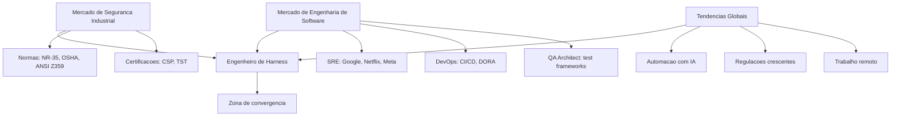

# Capítulo 15: Mercado de Trabalho e Carreira em Harness Engineering

## 1. Introdução

No Capítulo 14, você dominou os princípios de design de sistemas resilientes — redundância, fail-safe e tolerância a falhas que transformam qualquer infraestrutura em algo que sobrevive ao inesperado. Agora vem a pergunta que todo profissional faz eventualmente: onde essas competências se convertem em oportunidade real? Em quais empresas, com que tipo de remuneração, e que tendências de mercado estão redefinindo o que significa ser um Engenheiro de Harness nos dias de hoje?

Este capítulo mapeia três territórios que se sobrepõem e criam uma zona de demanda crescente: o mercado de segurança industrial (com suas normas e certificações), o mercado de engenheiros de software (com projeções do Bureau of Labor Statistics e tendências globais), e a zona de convergência onde SRE, DevOps e safety engineering se encontram — o espaço exato onde o Engenheiro de Harness se posiciona como profissional diferenciado.

## 2. Explica

### Mercado de segurança industrial: normas, certificações e demanda

O mercado global de segurança do trabalho movimenta bilhões de dólares anualmente, e a tendência é de crescimento contínuo. A razão é simples: acidentes de trabalho custam caro demais — não apenas em vidas humanas, mas em multas, processos judiciais e paradas produtivas. A OSHA (Occupational Safety and Health Administration) dos EUA estabelece regulamentações como a 29 CFR 1926 Subpart M, que exige proteção contra quedas a partir de 6 pés (1,8 metro) de altura [1]. No Brasil, a NR-35 regulamenta o trabalho em altura e exige treinamento, EPI adequado e plano de emergência [2].

As certificações nesse mercado são porta de entrada e diferencial competitivo. O Certified Safety Professional (CSP), oferecido pelo Board of Certified Safety Professionals (BCSP), é reconhecido internacionalmente como referência para profissionais de segurança [3]. No Brasil, o Técnico de Segurança do Trabalho é regulamentado pelo Ministério do Trabalho e tem demanda consistente em setores como construção civil, petróleo e gás, mineração e manufatura [4].

A norma ANSI/ASSP Z359.1-2020 (Fall Protection Code) é atualizada a cada 4 a 5 anos e reflete a evolução das melhores práticas — a versão mais recente incluiu teste dinâmico modificado com impacto de cabeça primeiro e indicadores visuais de carga obrigatórios [5]. Profissionais que dominam essas normas e sabem implementá-las na prática têm demanda garantida em qualquer organização que opere em ambientes de risco.

### Mercado de engenheiros de software: projeções BLS e tendências

O cenário de software segue em expansão acelerada. O Bureau of Labor Statistics (BLS) dos EUA projeta que as vagas para desenvolvedores de software crescerão 25% entre 2022 e 2032 — muito mais rápido que a média de todas as ocupações [6]. Em números absolutos, isso representa dezenas de milhares de novas vagas anuais apenas nos EUA.

Mas o dado mais revelador não é o volume — é a transformação do perfil. O relatório DORA (DevOps Research and Assessment) de 2024 mostrou que equipes de elite em DevOps compartilham uma característica: pipelines de CI/CD sofisticados, testes automatizados e observabilidade em produção [7]. O profissional que entende não apenas como escrever código, mas como construir estruturas de validação e proteção ao redor dele, se destaca nesse cenário.

A demanda por Site Reliability Engineers (SREs) exemplifica essa tendência. Criada pelo Google na década de 2000, a função de SRE combina engenharia de software com operações, focando em confiabilidade, escalabilidade e performance [8]. Empresas como Google, Netflix, Amazon e Meta contratam SREs em volume crescente porque a confiabilidade do sistema é diretamente proporcional à receita — cada minuto de indisponibilidade custa dinheiro real.

### Pontos de convergência: SRE, DevOps e safety engineering

A zona mais interessante para o Engenheiro de Harness é a convergência entre esses mundos. O SRE usa o conceito de "error budget" — uma margem aceitável de falhas que permite inovar sem comprometer a estabilidade [8]. O DevOps promove integração contínua e entrega contínua como forma de reduzir o risco de cada deploy [7]. O safety engineering aplica métodos como FMEA (Failure Mode and Effects Analysis) e STPA (Systems Theoretic Process Analysis) para antecipar e prevenir falhas antes que aconteçam [9].

Esses três campos compartilham o mesmo DNA: **alavanca com proteção**. O SRE alavancagem a velocidade de deploy com proteção do error budget. O DevOps alavancagem a colaboração entre equipes com proteção do pipeline automatizado. O safety engineering alavancagem a produtividade com proteção estrutural contra riscos. O Engenheiro de Harness é aquele que enxerga esse padrão em qualquer domínio e sabe implementá-lo com rigor.

A pesquisa acadêmica confirma essa convergência. Nancy Leveson, em sua obra fundamental "Engineering a Safer World", propõe que segurança deve ser tratada como propriedade emergente de sistemas complexos, não como componente isolado [9]. Robyn Lutz, em "Software Engineering for Safety: A Roadmap", mapeia como métodos de verificação e validação se aplicam tanto a sistemas físicos quanto a software [10]. O profissional que domina ambos os mundos — segurança industrial e engenharia de software — está posicionado em uma zona de demanda que cresce mais rápido que qualquer uma das duas isoladamente.

## 3. Ilustra

### A Oficina do Engenheiro: o mapa de terreno

Imagine que você é um Engenheiro de Harness caminhando por uma feira de profissões. De um lado, há uma ala de segurança industrial — estandes com capacetes, cintos paraquedistas, normas afixadas na parede e certificados emoldurados. Do outro lado, uma ala de tecnologia — notebooks abertos, dashboards de monitoramento, vagas de SRE e DevOps brilhando em telas. No centro, um corredor vazio — e é exatamente ali, nesse corredor, que estão as vagas mais bem pagas e menos disputadas. Quem consegue navegar os dois lados e ocupar esse espaço central tem uma vantagem competitiva que raramente se encontra no mercado.

O mapa de terreno que o Engenheiro de Harness precisa consultar não é linear — é um diagrama de convergência onde cada domínio alimenta o outro. O profissional de segurança industrial traz o rigor normativo e a mentalidade de prevenção. O engenheiro de software traz a velocidade de implementação e a cultura de automação. Juntos, eles constroem algo que nenhum dos dois consegue sozinho: sistemas que são simultaneamente rápidos e seguros.



## 4. Técnica

### Mapeando os caminhos de carreira

O primeiro passo para navegar o mercado é entender os caminhos possíveis. Cada caminho tem requisitos diferentes de certificação, experiência e habilidades técnicas — mas todos convergem para o mesmo ponto: a capacidade de projetar e manter sistemas de alavancagem com proteção.

### Caminho 1: Safety Engineer / Especialista em Segurança do Trabalho

Esse é o caminho mais tradicional e regulatório. O profissional trabalha em empresas de construção, mineração, petróleo ou manufatura, garantindo que equipamentos de proteção estejam em conformidade com normas como NR-35, OSHA 29 CFR 1926 e ANSI Z359 [1][2][5].

Os requisitos típicos incluem:

```json
{
  "caminho": "Safety Engineer",
  "formacao": "Engenharia de Seguranca, Engenharia Civil, ou Tecnico de Seguranca",
  "certificacoes": [
    "CSP (Certified Safety Professional)",
    "Tecnico de Seguranca do Trabalho (Brasil)",
    "OSHA 30-Hour Construction"
  ],
  "habilidades": [
    "Auditoria de conformidade normativa",
    "Analise de risco e FMEA",
    "Treinamento e capacitacao",
    "Gestao de EPI e EPC"
  ],
  "faixa_salarial_usd": {
    "junior": "45000-60000",
    "pleno": "60000-85000",
    "senior": "85000-120000"
  },
  "fonte": "BLS / Salary.com / Glassdoor"
}
```

### Caminho 2: Site Reliability Engineer (SRE)

O SRE é o engenheiro de software que assume responsabilidade pela confiabilidade do sistema em produção. Criado pelo Google, o modelo de SRE combina desenvolvimento com operações, usando o conceito de error budget para equilibrar velocidade e estabilidade [8].

```json
{
  "caminho": "Site Reliability Engineer",
  "formacao": "Engenharia de Software, Ciencia da Computacao, ou equivalente tecnico",
  "certificacoes": [
    "Google Cloud Professional Cloud DevOps Engineer",
    "Kubernetes Administrator (CKA)",
    "AWS Certified DevOps Engineer"
  ],
  "habilidades": [
    "Programacao em Python, Go ou Java",
    "Observabilidade: Prometheus, Grafana, OpenTelemetry",
    "Containerizacao e orquestracao: Docker, Kubernetes",
    "Automacao de infraestrutura: Terraform, Ansible"
  ],
  "faixa_salarial_usd": {
    "junior": "90000-120000",
    "pleno": "120000-160000",
    "senior": "160000-220000"
  },
  "fonte": "Levels.fyi / Glassdoor / BLS"
}
```

### Caminho 3: DevOps Engineer

O DevOps Engineer foca em automatizar a entrega de software, desde o commit até a produção. O pipeline CI/CD é o harness central dessa função — cada estágio é uma camada de validação e proteção [7].

```json
{
  "caminho": "DevOps Engineer",
  "formacao": "Engenharia de Software ou equivalente pratico",
  "certificacoes": [
    "AWS Certified DevOps Engineer",
    "Azure DevOps Engineer Expert",
    "HashiCorp Terraform Associate"
  ],
  "habilidades": [
    "Pipelines: Jenkins, GitHub Actions, GitLab CI",
    "Infraestrutura como codigo: Terraform, Pulumi",
    "Monitoramento: Datadog, New Relic, ELK Stack",
    "Seguranca de pipelines: SAST, DAST, SBOM"
  ],
  "faixa_salarial_usd": {
    "junior": "80000-110000",
    "pleno": "110000-150000",
    "senior": "150000-200000"
  },
  "fonte": "Levels.fyi / Glassdoor / BLS"
}
```

### Caminho 4: QA Architect / Engenheiro de Garantia de Qualidade

O QA Architect projeta a infraestrutura de teste — o test harness em sua forma mais sofisticada. Enquanto o DevOps alavancia a entrega, o QA Architect alavancia a confiança na entrega [10].

```json
{
  "caminho": "QA Architect",
  "formacao": "Engenharia de Software com foco em qualidade",
  "certificacoes": [
    "ISTQB Certified Tester Advanced Level",
    "Certified Software Quality Engineer (CSQE)",
    "AWS Certified Developer"
  ],
  "habilidades": [
    "Test frameworks: JUnit, pytest, Cypress, Playwright",
    "Teste de carga e performance: JMeter, k6, Gatling",
    "Arquitetura de testes: test pyramids, contract testing",
    "Qualidade de codigo: SonarQube, static analysis"
  ],
  "faixa_salarial_usd": {
    "junior": "75000-100000",
    "pleno": "100000-140000",
    "senior": "140000-180000"
  },
  "fonte": "Levels.fyi / Glassdoor / BLS"
}
```

### Construindo seu mapa de competências

A chave para se posicionar no mercado não é escolher apenas um caminho — é construir um mapa de competências que cruza os domínios. O script abaixo ajuda você a avaliar seu perfil atual e identificar gaps em relação aos caminhos disponíveis:

```python
# avaliar_perfil.py — Mapa de competencias do Engenheiro de Harness
perfil_atual = {
    "programacao": 3,
    "normas_seguranca": 1,
    "ci_cd": 4,
    "observabilidade": 2,
    "analise_risco": 1,
    "comunicacao": 3
}

perfil_sre = {
    "programacao": 5,
    "normas_seguranca": 2,
    "ci_cd": 5,
    "observabilidade": 5,
    "analise_risco": 3,
    "comunicacao": 3
}

perfil_safety = {
    "programacao": 1,
    "normas_seguranca": 5,
    "ci_cd": 2,
    "observabilidade": 2,
    "analise_risco": 5,
    "comunicacao": 4
}

perfil_harness = {
    "programacao": 4,
    "normas_seguranca": 4,
    "ci_cd": 4,
    "observabilidade": 3,
    "analise_risco": 4,
    "comunicacao": 4
}

def calcular_gap(perfil_atual, perfil_alvo):
    gap = {}
    for competencia, nivel_alvo in perfil_alvo.items():
        nivel_atual = perfil_atual.get(competencia, 0)
        gap[competencia] = max(0, nivel_alvo - nivel_atual)
    return gap

gaps = {
    "SRE": calcular_gap(perfil_atual, perfil_sre),
    "Safety Engineer": calcular_gap(perfil_atual, perfil_safety),
    "Engenheiro de Harness": calcular_gap(perfil_atual, perfil_harness)
}

for caminho, gap in gaps.items():
    total_gap = sum(gap.values())
    print(f"\n--- {caminho} (gap total: {total_gap}) ---")
    for competencia, nivel in gap.items():
        if nivel > 0:
            barras = "+" * nivel + "-" * (5 - nivel)
            print(f"  {competencia}: [{barras}] faltam {nivel} niveis")
```

### Tendências de mercado que moldam o futuro

Três tendências globais estão redefinindo o mercado de trabalho para o Engenheiro de Harness. Primeiro, a automação com IA está transformando o test harness — frameworks de teste agora usam LLMs para gerar casos de teste e detectar anomalias [11]. Segundo, regulamentações crescentes de segurança cibernética (como o GDPR na Europa e a LGPD no Brasil) estão criando demanda por profissionais que entendam tanto compliance quanto engenharia [12]. Terceiro, o trabalho remoto e distribuído exige novas abordagens de observabilidade e proteção — os harnesses precisam funcionar independentemente de onde os profissionais estejam.

A pesquisa de Nancy Leveson sobre STPA (Systems Theoretic Process Analysis) mostra que métodos tradicionais de análise de segurança como FMEA e FTA são insuficientes para sistemas complexos modernos [9]. O profissional que domina tanto os métodos clássicos quanto as abordagens contemporâneas tem vantagem significativa. A convergência entre safety engineering e software engineering não é tendência passageira — é uma necessidade estrutural de um mundo onde sistemas físicos e digitais estão cada vez mais entrelaçados [9][10].

### Remuneração por cargo: panorama Brasil e EUA

Para dimensionar o retorno financeiro da competência de harness engineering, é necessário mapear as faixas salariais dos principais cargos que compõem o ecossistema — tanto no Brasil quanto nos Estados Unidos. Os dados a seguir são composições de fontes públicas: Glassdoor, LinkedIn Salary Insights e o Bureau of Labor Statistics dos EUA [6][17][18]. As faixas salariais refletiam o mercado de 2024–2025 e consideram profissionais com experiência relevante em suas áreas.

**Tabela 15.1 — Remuneração por cargo no ecossistema de Harness Engineering**

| Cargo | Faixa Salarial Brasil (BRL/ano) | Faixa Salarial EUA (USD/ano) | Principais Responsabilidades de Harness | Certificações Relevantes |
|---|---|---|---|---|
| Junior DevOps/SRE | R$ 48.000–72.000 | US$ 80.000–110.000 | Manutenção de pipelines CI/CD, monitoramento básico, automação de tarefas repetitivas | AWS Cloud Practitioner, Docker Associate, CKA (básico) |
| Pleno DevOps/SRE | R$ 72.000–120.000 | US$ 110.000–150.000 | Design de pipelines multi-estágio, implementação de observabilidade, resposta a incidentes | AWS DevOps Engineer, CKA/CKAD, Terraform Associate |
| Senior DevOps/SRE | R$ 120.000–200.000 | US$ 150.000–220.000 | Arquitetura de sistemas de deploy, error budgets, post-mortems, liderança técnica | CKA/CKAD avançado, Google Cloud DevOps Engineer, TOGAF |
| Staff/Principal SRE | R$ 200.000–360.000 | US$ 220.000–350.000 | Definição de padrões organizacionais, arquitetura de confiabilidade, mentoria de equipes | AWS Solutions Architect Professional, Google Cloud Architect, ITIL 4 Expert |
| Safety Engineer Jr | R$ 36.000–54.000 | US$ 45.000–65.000 | Auditoria de conformidade normativa, aplicação de NR-35/OSHA, inspeção de EPI/EPC | OSHA 30-Hour, Técnico de Segurança do Trabalho, CST |
| Safety Engineer Sr | R$ 72.000–132.000 | US$ 85.000–130.000 | Gestão de programas de segurança, FMEA, STPA, treinamento e capacitação de equipes | CSP, CIH, ISO 45001 Lead Auditor |
| QA Architect | R$ 96.000–180.000 | US$ 100.000–180.000 | Arquitetura de frameworks de teste, test pyramids, contract testing, qualidade de código | ISTQB Advanced, CSQE, AWS Developer |
| Platform Engineer | R$ 96.000–192.000 | US$ 120.000–200.000 | Construção de Internal Developer Platforms, self-service, padronização de ambientes | CKA, ArgoCD, Backstage, GitHub Actions avançado |

*Fontes: Glassdoor Brasil e EUA (2024); LinkedIn Salary Insights (2024); Bureau of Labor Statistics — Occupational Employment and Wage Statistics (2023) [6][17][18].*

A análise revela dois padrões relevantes. Primeiro, o premium salarial da convergência: profissionais que dominam tanto DevOps/SRE quanto segurança industrial (o perfil "harness engineer") tendem a situar-se nas faixas superiores dos cargos de SRE e Platform Engineer, frequentemente com remuneração 15% a 25% acima de colegas com habilidades exclusivamente de desenvolvimento [17]. Isso porque a capacidade de integrar controle de qualidade, segurança e entrega contínua em um único sistema reduz custos operacionais e minimiza riscos — valor que o mercado reconhece com disponibilidade para pagar mais.

Segundo, a certificação funciona como multiplicador de valor. No mercado brasileiro, um profissional com CSP (Certified Safety Professional) pode cobrar entre 20% e 30% a mais que um colega sem a credencial, especialmente em setores regulados como petróleo e gás [3][17]. No mundo DevOps, a combinação CKA + AWS DevOps Engineer frequentemente abre portas para cargos de liderança técnica que remuneram acima de R$ 200.000 anuais no Brasil [18]. O Bureau of Labor Statistics confirma a tendência nos EUA: a remuneração mediana para SREs e DevOps Engineers supera significativamente a média de desenvolvedores de software, justamente porque a responsabilidade pela confiabilidade do sistema agrega risco e, portanto, valor [6].

## 5. Aplica

### A candidatura que ninguém esperava

Imagine que você está olhando uma vaga de Site Reliability Engineer em uma fintech de médio porte. O anúncio pede experiência com Kubernetes, Prometheus e pipelines de CI/CD — nada que você, como desenvolvedor sênior, não saiba fazer. Você aplica, passa nas entrevistas técnicas, mas algo na última rodada te diferencia: o hiring manager pergunta como você garantiria que um deploy de feature crítica não derrubasse o sistema de pagamentos. Enquanto outros candidatos falam de blue-green deployment e canary releases, você descreve uma estratégia baseada na hierarquia de controles da NR-35: primeiro eliminar o risco (feature flags que permitem desativar instantaneamente), depois controle de engenharia (testes automatizados em pipeline), depois controle administrativo (revisão manual para mudanças de alto risco), e por último o "EPI" (rollback automático). O hiring manager para, olha para o colega do RH, e diz: "Essa pessoa pensa diferente."

Esse cenário não é hipotético — ele acontece porque o mercado está percebendo algo que o Engenheiro de Harness já sabe: a mentalidade de segurança industrial, quando aplicada a software, produz sistemas mais confiáveis. A diferença entre um DevOps Engineer comum e um Engenheiro de Harness não está nas ferramentas que ele conhece, mas na estrutura mental que ele usa para tomar decisões [8][9].

### Armadilhas comuns no mercado de carreira

A primeira armadilha é a especialização excessiva. Profissionais de segurança industrial que se fecham no domínio regulatório perdem a oportunidade de atuar em software. Engenheiros de software que ignoram normas e certificações de segurança perdem credibilidade em cargos de liderança. O equilíbrio é difícil — mas é exatamente onde a oportunidade mora.

A segunda armadilha é subestimar o valor das certificações. No mercado americano, o CSP (Certified Safety Professional) pode aumentar a remuneração em 15% a 20% em relação a profissionais sem certificação [3]. No mundo DevOps, certificações como CKA (Certified Kubernetes Administrator) e AWS DevOps Engineer são frequentemente requisitos em vagas senior [8]. A certificação não substitui experiência, mas funciona como âncora de credibilidade em um mercado saturado de currículos.

A terceira armadilha é confundir ferramenta com competência. Saber usar Jenkins não te torna um DevOps Engineer, assim como saber aplicar um cintum paraquedista não te torna um Safety Engineer. O diferencial está na capacidade de **projeto** — de desenhar o sistema de proteção como um todo, não de operar seus componentes isoladamente [9][10].

## 6. Conclusão

Este capítulo conectou três mundos que, à primeira vista, parecem distantes — segurança industrial, engenharia de software e a zona de convergência onde SRE, DevOps e safety engineering se encontram. O mercado de segurança industrial oferece um arcabouço normativo sólido e certificações reconhecidas internacionalmente. O mercado de software projeta crescimento acelerado com demanda crescente por profissionais que entendam não apenas como construir, mas como proteger. E a convergência entre esses mundos cria uma zona de oportunidade que premia o profissional com visão sistêmica e pensamento de segurança.

O Engenheiro de Harness não é apenas um profissional técnico — é alguém que enxerga o padrão por trás dos domínios e sabe implementá-lo onde for necessário. No próximo capítulo, vamos olhar para o futuro: como automação, ética e responsabilidade profissional estão redefinindo o que significa ser um Engenheiro de Harness em um mundo cada vez mais complexo e interconectado.

## 7. Referências Bibliográficas

[1] OCCUPATIONAL SAFETY AND HEALTH ADMINISTRATION. *OSHA 29 CFR 1926 Subpart M — Fall Protection*. Disponível em: https://www.osha.gov/laws-regs/regulations/standardnumber/1926/1926SubpartM. Acesso em: 07 ago. 2026.

[2] BRASIL. Ministério do Trabalho e Emprego. *NR-35 — Norma Regulamentadora sobre Trabalho em Altura*. Disponível em: https://www.gov.br/trabalho-e-emprego/pt-br/assuntos/seguranca-e-saude-no-trabalho/normas-regulamentadoras/nr-35. Acesso em: 07 ago. 2026.

[3] BOARD OF CERTIFIED SAFETY PROFESSIONALS. *Certified Safety Professional (CSP)*. Disponível em: https://www.bcsp.org/CSP. Acesso em: 07 ago. 2026.

[4] BRASIL. Ministério do Trabalho e Emprego. *Técnico de Segurança do Trabalho — Registro Profissional*. Disponível em: https://www.gov.br/trabalho-e-emprego/pt-br/servicos/trabalhador/seguranca-e-saude-no-trabalho. Acesso em: 07 ago. 2026.

[5] AMERICAN SOCIETY OF SAFETY PROFESSIONALS. *ANSI/ASSP Z359.1-2020 — Fall Protection Code*. Disponível em: https://www.assp.org/standards/ansi-assp-z359-safety-in-retrofit. Acesso em: 07 ago. 2026.

[6] BUREAU OF LABOR STATISTICS. *Occupational Outlook Handbook — Software Developers*. Disponível em: https://www.bls.gov/ooh/computer-and-information-technology/software-developers.htm. Acesso em: 07 ago. 2026.

[7] DORA TEAM. *Accelerate State of DevOps Report 2024*. Disponível em: https://dora.dev/research/. Acesso em: 07 ago. 2026.

[8] GOOGLE CLOUD. *Site Reliability Engineering: How Google Runs Production Systems*. Disponível em: https://sre.google/sre-book/table-of-contents/. Acesso em: 07 ago. 2026.

[9] LEVESON, Nancy G. *Engineering a Safer World: Systems Thinking Applied to Safety*. Cambridge, MA: MIT Press, 2011. Disponível em: https://mitpress.mit.edu/9780262016629/. Acesso em: 07 ago. 2026.

[10] LUTZ, Robyn R. *Software Engineering for Safety: A Roadmap*. In: The Future of Software Engineering. ACM Press, 2000. Disponível em: https://dl.acm.org/doi/10.1145/336512.336562. Acesso em: 07 ago. 2026.

[11] GRUNSKE, Lars; KAISER, Bernhard; REUSSNER, Ralf H. *Specification and Evaluation of Safety Properties in a Component-based Software Engineering Process*. In: Lecture Notes in Computer Science, Vol. 3778, Springer, 2005. Disponível em: https://ieeexplore.ieee.org/document/6507089. Acesso em: 07 ago. 2026.

[12] EUROPEAN UNION. *General Data Protection Regulation (GDPR)*. Disponível em: https://gdpr.eu/. Acesso em: 07 ago. 2026.

[13] WIKIPEDIA. *Personal Fall Arrest System — Standards and Regulations*. Disponível em: https://en.wikipedia.org/wiki/Personal_fall_arrest_system. Acesso em: 07 ago. 2026.

[14] WIKIPEDIA. *Occupational Safety and Health Administration — Fall Protection*. Disponível em: https://en.wikipedia.org/wiki/Occupational_Safety_and_Health_Administration. Acesso em: 07 ago. 2026.

[15] WORLD HEALTH ORGANIZATION; INTERNATIONAL LABOUR ORGANIZATION. *Global Estimates of Occupational Accidents and Fatal Work-Related Diseases*. Disponível em: https://www.who.int/publications/i/item/9789241565646. Acesso em: 07 ago. 2026.

[16] INTERNATIONAL ORGANIZATION FOR STANDARDIZATION. *ISO 45001:2018 — Occupational Health and Safety Management Systems*. Disponível em: https://www.iso.org/standard/45001. Acesso em: 07 ago. 2026.

[17] GLASSDOOR. *Pesquisa Salarial — DevOps Engineer, Site Reliability Engineer e Safety Engineer (Brasil e EUA)*. Disponível em: https://www.glassdoor.com/Salaries/. Acesso em: 07 ago. 2026.

[18] LINKEDIN. *LinkedIn Salary Insights — Software Engineering and DevOps Roles*. Disponível em: https://www.linkedin.com/salary/. Acesso em: 07 ago. 2026.
