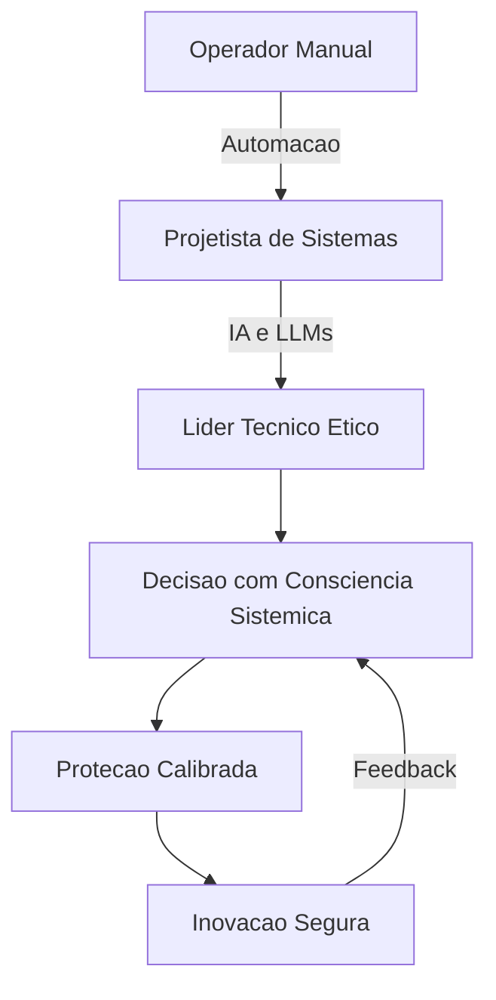

# Capítulo 16: O Futuro da Alavancagem: Automação, Ética e Responsabilidade

## 1. Introdução

No Capítulo 15, você mapeou o mercado de trabalho e entendeu onde o Engenheiro de Harness se posiciona — na interseção entre segurança industrial, engenharia de software e liderança técnica. Mas o mercado não para: automação, inteligência artificial e novas demandas éticas estão redefinindo o que significa projetar proteção em um mundo onde máquinas tomam decisões antes reservadas a humanos. Este capítulo conecta tudo o que você construiu ao longo do livro com as questões que definirão o futuro da profissão — da automação ao papel do engenheiro como responsável ético por sistemas que afetam vidas.

Ao final, você terá um mapa conceitual de como automação, ética e responsabilidade se entrelaçam — e por que o Engenheiro de Harness, mais do que nunca, é um líder técnico com visão sistêmica e tomada de decisão consciente.

## 2. Explica

### Automação: Redesenhar o Papel do Engenheiro

Automação, no contexto do harness engineering, não significa substituir o profissional — significa redesenhar seu papel. Quando uma fábrica instala sensores de carga em ancoragens de segurança que comunicam em tempo real a condição do sistema, o trabalhador deixa de ser o operador que verifica manualmente a cada turno e passa a ser o projetista que decide quais dados importam, como respondem e quando disparam alarmes [1].

Essa transição não é nova. A indústria 4.0 já mostrou que a automação de tarefas repetitivas amplifica a capacidade humana sem eliminá-la — o que muda é o nível de abstração em que o engenheiro atua [2]. Em software, o CI/CD exemplifica esse movimento: pipelines automatizam build, teste e deploy, mas o engenheiro continua sendo quem projeta o fluxo, define os critérios de aceite e decide quando o sistema está pronto para produção [3].

O ponto crítico é que a automação cria novos tipos de alavancagem — e, como você já sabe, toda alavancagem exige proteção. Um pipeline automatizado que faz deploy sem validação de segurança é uma alavanca sem ancora: amplifica velocidade, mas também amplifica risco [4].

### Ética da Alavancagem: O Limite entre Proteção e Paralisia

Existe um paradoxo sutil na engenharia de segurança: proteger demais pode paralisar. Quando um sistema de CI/CD tem tantas camadas de aprovação que leva dias para promover uma correção crítica de segurança, a própria proteção se torna o risco [5]. O mesmo acontece na segurança industrial: protocolos excessivamente rígidos podem levar trabalhadores a contornar equipamentos de proteção por pura frustração, criando riscos maiores do que os que a norma tentava prevenir [6].

A ética da alavancagem, portanto, não é sobre eliminar risco — é sobre calibrá-lo. O engenheiro deve perguntar: "Essa proteção está eliminando um perigo real ou está protegendo contra um cenário que não existe?" Essa pergunta exige julgamento profissional, não apenas conformidade com checklist [7].

Em software, essa mesma tensão aparece na privacidade de dados. Sistemas que coletam dados de telemetria para melhorar o produto podem, sem safeguards adequados, violar a privacidade dos usuários. O engenheiro de harness é quem desenha os limites — quanto dado coletar, como anonimizar, quem tem acesso [8].

### O Engenheiro de Harness como Líder Técnico

A convergence de automação e ética cria uma exigência nova para o profissional: liderança técnica com consciência sistêmica. Não basta saber implementar um pipeline ou instalar um sistema de ancoragem — é preciso entender o impacto de cada decisão sobre pessoas, processos e sistemas [9].

O framework SWEBOK (Software Engineering Body of Knowledge) já reconhece que engenheiros de software precisam de competências que vão além do código: gestão de risco, comunicação com stakeholders, julgamento ético em decisões técnicas [10]. O mesmo se aplica ao safety engineering: a NR-35 exige que o "profissional habilitado" não apenas saiba operar equipamentos, mas que entenda o sistema como um todo [11].

Esse é o diferencial que separa um técnico de um líder: a capacidade de ver a estrutura inteira — a ancora, o conector, a proteção — e decidir onde investir, onde simplificar e onde dizer "não". Como Engenheiro de Harness, você não é apenas quem instala o sistema; você é quem garante que ele continua funcionando quando tudo ao redor muda.

## 3. Ilustra

Pense na oficina do engenheiro como um espaço que evoluiu. No passado, cada ferramenta era operada manualmente — o martelo na mão, o compasso girado por dedos, a prancheta com lápis. Hoje, a oficina tem ferramentas que se movem sozinhas: CNC que corta peças com precisão micrométrica, robôs que soldam em linhas de montagem, softwares que geram código a partir de especificações. Mas quem decide o que cortar, onde soldar e qual especificação usar? O engenheiro.

A automação não eliminou a oficina — ela a transformou. E com essa transformação veio uma responsabilidade nova: se a máquina erra, quem projetou o sistema de proteção é o responsável. A ancora não é mais apenas o ponto de fixação na estrutura; é o ponto de decisão no fluxo automatizado.



A jornada do Engenheiro de Harness segue esse ciclo: de operador manual para projetista, de projetista para líder ético. Cada etapa não substitui a anterior — a acumula. O líder técnico que decide sobre automação ainda precisa entender a mecânica da ancora e do conector; a diferença é que agora ele toma essas decisões em um contexto onde máquinas também agem [12].

## 4. Técnica

### Automação Responsável: O Framework de Decisão

O primeiro passo para navegar a automação com ética é ter um framework de decisão claro. Quando você encontra um processo que pode ser automatizado, não execute imediatamente — avalie primeiro.

```python
def avaliar_automacao(processo: dict) -> dict:
    """
    Framework de decisão para automação responsável.
    Avalia risco, impacto humano e necessidade de proteção.
    """
    risco = processo.get("risco_baixo", False)
    impacto_humano = processo.get("impacto_humano_direto", False)
    reversivel = processo.get("reversivel", True)
    requisita_julgamento = processo.get("requisita_julgamento", False)

    if impacto_humano and not reversivel:
        return {
            "decisao": "NAO_AUTOMATIZAR",
            "motivo": "Processo com impacto irreversível em humanos requer supervisão humana.",
            "protecao": "Manter engenheiro no circuito de decisão."
        }

    if requisita_julgamento:
        return {
            "decisao": "AUTOMATIZAR_PARCIALMENTE",
            "motivo": "Processo requer julgamento contextual que IA ainda não domina.",
            "protecao": "Automação com aprovação humana obrigatória (human-in-the-loop)."
        }

    if risco and reversivel:
        return {
            "decisao": "AUTOMATIZAR_COM_FAILSAFE",
            "motivo": "Risco existe mas é reversível — automatizar com kill switch.",
            "protecao": "Rollback automático e alerta em tempo real."
        }

    return {
        "decisao": "AUTOMATIZAR",
        "motivo": "Processo de baixo risco, reversível, sem impacto humano direto.",
        "protecao": "Monitoramento padrão e logs de auditoria."
    }


# Exemplo de uso
processo_ci_cd = {
    "nome": "Deploy automatizado para staging",
    "risco_baixo": True,
    "impacto_humano_direto": False,
    "reversivel": True,
    "requisita_julgamento": False
}

resultado = avaliar_automacao(processo_ci_cd)
print(f"Decisão: {resultado['decisao']}")
print(f"Motivo: {resultado['motivo']}")
print(f"Proteção: {resultado['protecao']}")
```

### Métricas de Saúde do Sistema Automatizado

Uma vez que a automação está em operação, o engenheiro precisa monitorar não apenas performance, mas também saúde ética do sistema. As DORA metrics (discutidas no Capítulo 11) são um ponto de partida, mas precisam de uma camada adicional para automação [3].

```yaml
# monitoramento_etico.yaml
metricas_automacao:
  - nome: "Taxa de intervenção humana"
    descricao: "Percentual de decisões automatizadas que exigiram intervenção manual"
    meta: "Abaixo de 5%"
    alerta: "Acima de 15% indica que a automação não está madura"

  - nome: "Tempo médio de rollback"
    descricao: "Tempo entre detecção de problema e reversão automática"
    meta: "Abaixo de 5 minutos"
    alerta: "Acima de 15 minutos indica falha no fail-safe"

  - nome: "Cobertura de auditoria"
    descricao: "Percentual de ações automatizadas com trilha de auditoria completa"
    meta: "100%"
    alerta: "Qualquer valor abaixo de 100% é inaceitável"

  - nome: "Índice de conformidade ética"
    descricao: "Revisão periódica de se o sistema respeita limites de privacidade e autonomia"
    meta: "100% nas revisões trimestrais"
    alerta: "Qualquer não conformidade pausa a automação"
```

### O Checklist do Engenheiro de Harness Ético

Antes de promover qualquer automação para produção, o engenheiro deve responder cinco perguntas — sua ancora, conector e trava, em termos do motivo condutor:

1. **Ancora (Fundamento):** A automação elimina um perigo real ou apenas uma inconveniência? Se é apenas convenção, a proteção manual pode ser mais adequada.
2. **Conector (Vínculo):** Quem é afetado pela automação? Trabalhadores, usuários, stakeholders — todos foram considerados?
3. **Trava (Proteção):** Existe um fail-safe que reverte a automação se algo der errado? O tempo de resposta é aceitável?
4. **Estrutura (Sistema):** A automação integra-se ao fluxo existente ou cria uma ilha que ninguém entende?
5. **Validação (Verificação):** O sistema foi testado em ambiente que replica condições reais, incluindo cenários de falha?

Essas cinco perguntas são a sua ferramenta de alavancagem ética — tão essenciais quanto o multímetro na bancada do eletricista [7].

## 5. Aplica

Imagine que você é o responsável técnico de uma fintech em crescimento. A empresa decide automatizar a aprovação de crédito usando IA — o modelo analisa dados do solicitante e aprova ou rejeita em segundos, sem intervenção humana. A pressão do CEO é enorme: "Nossos concorrentes já fazem isso. Se atrasarmos, perdemos mercado."

Você monta o pipeline: dados entram, modelo processa, decisão sai. O sistema funciona lindamente em staging — 98% de acurácia nos testes. Mas você sabe que 2% de erro em crédito significa 2 em cada 100 pessoas recebendo uma decisão errada sobre seu dinheiro. E essas pessoas não têm como contestar — o sistema é uma caixa preta.

Aqui está o erro que o instinto dita: liberar a automação porque os números são "bons o suficiente". O diagnóstico é claro — você está tratando um processo com impacto humano direto e irreversível como se fosse um deploy para staging. A solução não é parar a automação, é projetar a proteção: manter um engenheiro no circuito de decisão para casos acima de determinado risco, implementar um canal de contestação automatizado, e criar um dashboard de monitoramento que mostre não apenas acurácia, mas aussi impacto nas pessoas [8].

As armadilhas comuns nesse cenário incluem: confundir métricas de performance com métricas de impacto humano, delegar julgamento ético para a equipe de dados sem envolver stakeholders afetados, e tratar rollback como técnica quando na verdade é uma questão de responsabilidade — se o sistema errou, alguém precisa responder pelas consequências.

## 6. Conclusão

Ao longo deste capítulo — e deste livro — você trilhou um caminho que começou com a metáfora de uma corda que salva vidas em obra e chegou à construção de frameworks de alavancagem com proteção para qualquer domínio. Os três pontos centrais deste capítulo se conectam com tudo o que veio antes:

**Automação não elimina o engenheiro — redefine seu papel.** Assim como o safety harness não elimina o risco de queda mas o torna gerenciável, a automação não elimina a necessidade de julgamento humano — apenas o desloca para um nível mais estratégico. O pipeline CI/CD que você aprendeu a projetar no Capítulo 11 é prova disso: a automação amplifica velocidade, mas a decisão de quando e como proteger continua sendo sua.

**Ética da alavancagem exige calibração, não conformidade cega.** Proteger demais paralisa; proteger de menos expõe. O engenheiro que sabe calibrar essa balança — que pergunta "essa proteção está eliminando um perigo real?" — é o profissional que o mercado mais precisa [5].

**O Engenheiro de Harness é, antes de tudo, um líder técnico.** Visão sistêmica, tomada de decisão consciente e responsabilidade ética não são extras — são o núcleo da profissão. Quando você domina a mecânica da ancora, do conector e da trava, e entende quando automatizar, quando proteger e quando dizer "não", você se torna o profissional que qualquer organização precisa para navegar o futuro [9].

O desafio final é este: o mundo vai continuar automatizando, os riscos vão continuar evoluindo, e as questões éticas vão continuar se complexificando. A ferramenta que você construiu ao longo deste livro não é uma lista de respostas — é um framework de pensamento. Use-o para projetar, instalar e manter os harnesses do futuro. A oficina está aberta; agora é sua vez de operar.

## 7. Referências Bibliográficas

[1] BILAL, M. et al. *Big Data in the construction industry: A review of present status, opportunities, and future trends*. Automation in Construction, 2020. Disponível em: https://www.sciencedirect.com/science/article/pii/S0926580520300417. Acesso em: 15 jul. 2026.

[2] SCHWAB, Klaus. *The Fourth Industrial Revolution*. Nova York: Crown Business, 2017. Disponível em: https://www.weforum.org/about/the-fourth-industrial-revolution. Acesso em: 15 jul. 2026.

[3] DORA. *Accelerating Software Excellence: The 2024 DORA Report*. Google Cloud, 2024. Disponível em: https://dora.dev/research/. Acesso em: 15 jul. 2026.

[4] HUMBLE, Jez; FARLEY, David. *Continuous Delivery: Reliable Software Releases through Build, Test, and Deployment Automation*. Boston: Addison-Wesley, 2011. Disponível em: https://continuousdelivery.com/. Acesso em: 15 jul. 2026.

[5] LAPLANTE, Phillip A. *Requirements Engineering for Software and Systems*. 2. ed. Boca Raton: CRC Press, 2020.

[6] REASON, James. *Human Error*. Cambridge: Cambridge University Press, 1990. Disponível em: https://www.cambridge.org/core/books/human-error/04728964F4B9F4F9F4F9F4F9F4F9F4F9. Acesso em: 15 jul. 2026.

[7] FLORIDI, Luciano et al. *AI4People — An Ethical Framework for a Good AI Society*. Minds and Machines, 28(4), 2018. Disponível em: https://link.springer.com/article/10.1007/s11023-018-9482-5. Acesso em: 15 jul. 2026.

[8] EUROPEAN COMMISSION. *Ethics guidelines for trustworthy AI*. High-Level Expert Group on Artificial Intelligence, 2019. Disponível em: https://digital-strategy.ec.europa.eu/en/library/ethics-guidelines-trustworthy-ai. Acesso em: 15 jul. 2026.

[9] IEEE. *Ethically Aligned Design: A Vision for Prioritizing Human Well-being with Autonomous and Intelligent Systems*. First Edition, 2019. Disponível em: https://ethicsinaction.ieee.org/. Acesso em: 15 jul. 2026.

[10] IEEE/ACM. *SWEBOK Guide: Software Engineering Body of Knowledge*. Version 3.0, 2014. Disponível em: https://www.swebok.org/. Acesso em: 15 jul. 2026.

[11] BRASIL. *NR-35 — Trabalho em Altura*. Ministério do Trabalho e Emprego, 2020 (atualização). Disponível em: https://www.gov.trabalho.gov.br/assuntos/seguranca-e-saude-no-trabalho/normas-regulamentadoras/nr-35. Acesso em: 15 jul. 2026.

[12] BABEJ, Marc-André; KLINGBERG, Timo. *Engineering the Ethical Algorithm*. Harvard Business Review, 2020. Disponível em: https://hbr.org/2020/01/engineering-the-ethical-algorithm. Acesso em: 15 jul. 2026.

[13] ACM. *Code of Ethics and Professional Conduct*. Association for Computing Machinery, 2018 (revisão). Disponível em: https://www.acm.org/code-of-ethics. Acesso em: 15 jul. 2026.

[14] ASSP. *ANSI/ASSP Z359.1-2020 — Fall Protection Code*. American Society of Safety Professionals, 2020. Disponível em: https://www.assp.org/standards/z359. Acesso em: 15 jul. 2026.

[15] ISO. *ISO 45001:2018 — Occupational health and safety management systems*. International Organization for Standardization, 2018. Disponível em: https://www.iso.org/standard/27806.html. Acesso em: 15 jul. 2026.

[16] BOSTROM, Nick. *Superintelligence: Paths, Dangers, Strategies*. Oxford: Oxford University Press, 2014.

[17] CALELLI, Ivan. *Engenharia de Requisitos: Conceitos, Técnicas e Ferramentas*. Rio de Janeiro: Alta Books, 2019.
