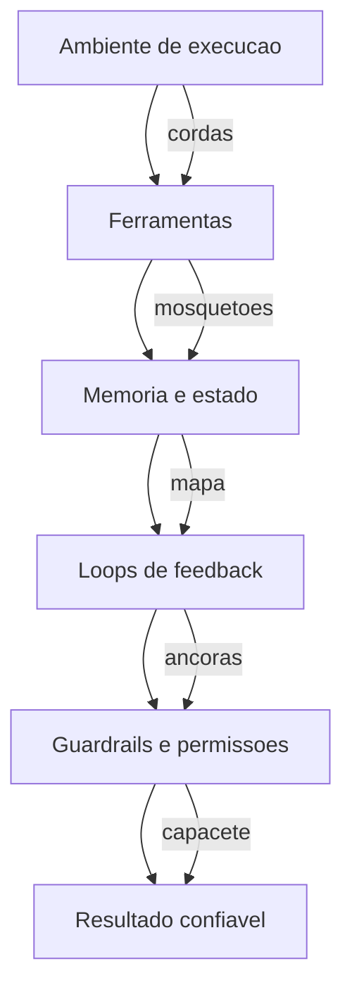

# Capítulo 2: Anatomia de um Harness — O Corpo Que Carrega o Cérebro

## 1. Introdução

No Capítulo 1, você aprendeu a máxima Agente = Modelo + Harness e entendeu que a confiabilidade de um sistema agêntico é propriedade do corpo que carrega o cérebro. Agora vamos abrir esse corpo e examinar cada órgão: o que exatamente existe entre o modelo e o resultado final? Neste capítulo, você vai conhecer as cinco camadas do harness — ambiente de execução, ferramentas, memória e estado, loops de feedback e guardrails — e vai construir, com código, uma representação executável de cada uma delas.

Ao final deste capítulo, você será capaz de desenhar a anatomia de qualquer sistema agêntico que encontrar: nomear cada camada, explicar a responsabilidade dela e apontar o que acontece quando ela falta. Como Escalador de Harnesses, você vai aprender a inspecionar o equipamento antes de subir — em vez de descobrir a peça faltante a meio da parede.

## 2. Explica

Comecemos pela pergunta estrutural: se o modelo é o cérebro, o que é o corpo? A resposta canônica, documentada por engenheiros que constroem esses sistemas em escala, é que o harness é **todo o código e toda a configuração que não pertencem ao modelo** — o ambiente em que ele roda, as ferramentas que ele aciona, a memória que ele consulta, o estado que persiste entre execuções e as proteções que limitam seu alcance [6]. Uma visão institucional de fornecedor de plataforma de dados reforça a mesma arquitetura: o harness é o que separa um modelo de fronteira de um sistema corporativo governado, porque é nele que moram sandboxes, políticas e o controle de custo [7]. A medição dessa separação também amadureceu: benchmarks como o SWE-bench e sua extensão criaram avaliações determinísticas de agentes de código, permitindo comparar harnesses com o mesmo rigor que a engenharia de software tradicional aplica a qualquer artefato [2][3].

Essa definição tem uma consequência prática que a maioria dos projetos descobre tarde: **quanto mais poderoso o modelo, mais o harness importa**. Um modelo fraco dentro de um harness bem projetado entrega trabalho limitado, mas previsível; um modelo de fronteira sem harness entrega trabalho amplo, porém incontrolável. Pesquisadores que estudam as decisões arquiteturais de harnesses de agentes chegaram a classificar essas escolhas em categorias (sandboxing, memória, controle de ferramentas, observabilidade) e a demonstrar que elas são determinantes para a resiliência do sistema em escala [19]. O mesmo raciocínio aparece na base do ciclo ReAct: raciocinar e agir em alternância só é confiável quando o ambiente de ação é controlado [4].

Vamos decompor o harness nas cinco camadas que serão o fio condutor dos próximos capítulos:

1. **Ambiente de execução** — o lugar físico/lógico onde o agente age: um terminal, um diretório de trabalho versionado, um contêiner. É a corda da escalada: ela define até onde o escalador pode ir [1][6].
2. **Ferramentas** — as capacidades que o agente aciona: CLI, interpretadores, busca, APIs, servidores MCP. São os mosquetões: conectam o escalador à parede em pontos específicos [13].
3. **Memória e estado** — o que o agente lembra dentro da conversa (contexto) e o que persiste entre execuções (arquivos, banco, estado em disco). É o mapa mental do escalador, preservado entre subidas [6][18].
4. **Loops de feedback** — os mecanismos que verificam cada ação: testes determinísticos, sensores, revisão automática. São as âncoras que o escalador planta a cada progresso [5][18].
5. **Guardrails e permissões** — o que o agente não pode fazer, mesmo que tente: approval gates, limites de escopo, princípio do menor privilégio. É o capacete e o seguro [7][16].

A ordem importa: o ambiente hospeda as ferramentas, as ferramentas acessam a memória, tudo é verificado pelos loops de feedback e tudo é limitado pelos guardrails. Quando você vê um sistema agêntico "instável", quase sempre uma dessas camadas está ausente ou mal dimensionada.

Uma observação importante sobre a memória: o contexto do modelo (o que cabe na janela de atenção) é memória de curto prazo, volátil e limitada. O harness expande essa memória para o sistema de arquivos, bancos de dados e APIs externas — o que um artigo recente chama de tornar o agente *stateful*: o estado deixa de viver só no prompt e passa a viver no mundo [18]. É essa extensão que permite tarefas longas, retomadas e colaboração entre múltiplas execuções do mesmo agente. A literatura sobre arquitetura de harnesses destaca a gestão de contexto como uma das decisões com maior impacto na qualidade final — mais do que a escolha do modelo [19]. E os dados de adoção corroboram a urgência: à medida que mais organizações colocam agentes em produção, a maturidade da camada de memória separa as equipes que escalam das que travam [12].

## 3. Ilustra

Continue na parede de escalada. O escalador (modelo) tem força e técnica, mas tudo o que o conecta à parede é equipamento — e cada peça tem uma função que nenhuma outra substitui. A corda (ambiente) define o raio de movimento; sem ela, qualquer passo é queda livre. Os mosquetões (ferramentas) fixam a corda em pontos específicos da rota; sem eles, a corda não prende em nada. O mapa do guia (memória) diz ao escalador onde ele já passou e onde estão as próximas âncoras; sem ele, ele se perde e repete trechos. A checagem do parceiro (feedback) confirma que cada mosquetão está travado antes do próximo movimento; sem ela, um encaixe mal feito passa despercebido. E o capacete (guardrails) não impede a queda, mas muda o resultado dela; sem ele, um erro pequeno vira trauma grande.

A dupla camada aqui é necessária porque o ponto mais contraintuitivo é a memória: as pessoas assumem que o "agente se lembra" porque o modelo é grande. Na verdade, o modelo esquece tudo entre execuções — quem lembra é o harness, que grava o estado em arquivos e re-injeta o contexto relevante. A segunda analogia: a memória do agente é como uma **prancheta de obra**. O pedreiro (modelo) trabalha com o que está na prancheta; quando a prancheta é pequena, ele trabalha em partes e um ajudante (o harness) guarda o que já foi feito, consulta a planta (arquivos) e coloca na prancheta só o que é necessário para o próximo passo. Sem o ajudante, o pedreiro até trabalha, mas perde a noção do todo e refaz paredes.



Como Escalador de Harnesses, você já percebe o padrão de inspeção que vai usar daqui em diante: antes de confiar em qualquer sistema agêntico, pergunte onde está cada uma das cinco camadas. Um sistema com cinco camadas declaradas ainda pode falhar — mas um sistema em que você não consegue apontar nenhuma delas já falhou antes de rodar.

## 4. Técnica

### Modelando as Cinco Camadas com Dataclasses

Vamos transformar a anatomia em código executável. O bloco abaixo define as cinco camadas como dataclasses Python, com uma `descricao` e um `responsavel` para cada uma — um "cartão de identificação" do equipamento que você vai consultar ao longo de todo o livro.

```python
"""As cinco camadas do harness representadas como dataclasses."""

from __future__ import annotations

from dataclasses import dataclass, field


@dataclass
class AmbienteExecucao:
    nome: str
    diretorio: str
    isolado: bool = True

    def descrever(self) -> str:
        nivel = "isolado" if self.isolado else "compartilhado"
        return f"{self.nome} em {self.diretorio} ({nivel})"


@dataclass
class Ferramenta:
    nome: str
    tipo: str  # terminal | busca | api | mcp
    acionavel: bool = True


@dataclass
class Memoria:
    contexto_max: int = 8_000
    arquivos: dict[str, str] = field(default_factory=dict)

    def lembrar(self, chave: str) -> str | None:
        return self.arquivos.get(chave)

    def gravar(self, chave: str, valor: str) -> None:
        self.arquivos[chave] = valor


@dataclass
class LoopFeedback:
    nome: str
    tipo: str  # deterministico | inferencial
    resultado: str = ""


@dataclass
class Guardrails:
    aprovacao_obrigatoria: bool = True
    acoes_destrutivas: tuple[str, ...] = ("apagar", "deploy", "drop")

    def permitir(self, acao: str) -> bool:
        return not (self.aprovacao_obrigatoria and acao in self.acoes_destrutivas)


def main() -> None:
    ambiente = AmbienteExecucao("sandbox-dev", "/work/agente")
    ferramenta = Ferramenta("terminal", "terminal")
    memoria = Memoria()
    memoria.gravar("rota", "cume a 200m")

    feedback = LoopFeedback("teste-sintaxe", "deterministico")
    guardrails = Guardrails()

    print("Anatomia do harness:")
    print(f"  1. Ambiente : {ambiente.descrever()}")
    print(f"  2. Ferramenta: {ferramenta.nome} ({ferramenta.tipo})")
    print(f"  3. Memoria  : rota gravada = {memoria.lembrar('rota')}")
    print(f"  4. Feedback : {feedback.nome} ({feedback.tipo})")
    print(f"  5. Guardrails: apagar permite? {guardrails.permitir('apagar')}")


if __name__ == "__main__":
    main()
```

Execute e observe a saída: o harness agora é um conjunto de objetos nomeados, cada um com responsabilidade própria. Esse modelo mental — cinco caixas com contratos claros — é o que você vai usar para auditar sistemas reais. A vantagem de materializar as camadas em código é que elas deixam de ser conceitos abstratos e viram **pontos de decisão concretos**: onde isolo a execução? onde limito a ferramenta? onde persisto a memória?

### O Executor de Ferramentas com Registro de Chamadas

O mosquetão do sistema é o executor de ferramentas. A função abaixo registra cada chamada — quem pediu, qual ferramenta, qual argumento e qual resultado — porque sem esse registro a camada de feedback não tem o que verificar e a camada de guardrails não tem o que auditar.

```python
"""Executor de ferramentas com trilha de auditoria."""

from __future__ import annotations

import time
from dataclasses import dataclass, field


@dataclass
class Chamada:
    ferramenta: str
    argumento: str
    resultado: str
    instante: float = field(default_factory=time.time)


class ExecutorDeFerramentas:
    def __init__(self) -> None:
        self.trilha: list[Chamada] = []

    def executar(self, ferramenta: str, argumento: str) -> str:
        # Em producao, despacharia para CLI, API ou servidor MCP.
        if ferramenta == "terminal":
            resultado = f"$ {argumento} -> ok"
        elif ferramenta == "busca":
            resultado = f"3 resultados para '{argumento}'"
        else:
            resultado = f"ferramenta desconhecida: {ferramenta}"
        self.trilha.append(Chamada(ferramenta, argumento, resultado))
        return resultado

    def auditoria(self) -> list[Chamada]:
        return list(self.trilha)


def main() -> None:
    executor = ExecutorDeFerramentas()
    executor.executar("terminal", "ls -la")
    executor.executar("busca", "sandbox firecracker")
    executor.executar("terminal", "git status")

    print("Trilha de auditoria do harness:")
    for chamada in executor.auditoria():
        print(f"  {chamada.ferramenta:<10} '{chamada.argumento}' -> {chamada.resultado}")


if __name__ == "__main__":
    main()
```

Esse padrão — **toda ação passa por um único ponto de execução que registra** — é a fundação da observabilidade que você vai aprofundar no Capítulo 8. Ele também é o gancho natural para os guardrails: se toda ação passa pelo executor, é no executor que a permissão é checada (veja o Capítulo 6). Pesquisas sobre o MCP mostram que a ausência desse ponto único de controle é exatamente o que abre espaço para ataques do tipo *confused deputy*, em que um servidor de ferramentas age com as permissões do hospedeiro sem que o usuário perceba [14][15].

### A Memória do Agente com Persistência

A terceira camada prática: memória que sobrevive entre execuções. O bloco abaixo implementa uma memória simples que grava fatos em um arquivo JSON e permite consultas — a versão embrionária do "mapa da prancheta de obra". A urgência dessa camada é reforçada pelos dados de mercado: com 40% dos aplicativos corporativos previstos para usar agentes até 2026 [11] e mais de 40% dos projetos de agentes cancelados até 2027 por controle de risco inadequado [10], a memória bem projetada — que permite retomar, auditar e corrigir — é exatamente o tipo de controle que separa os projetos que escalam dos que morrem. O relatório DORA 2024 aponta na mesma direção: produtividade individual sem disciplina de engenharia não sustenta a qualidade de entrega [9].

```python
"""Memoria persistente do agente (curto prazo em contexto, longo prazo em JSON)."""

from __future__ import annotations

import json
from pathlib import Path


class MemoriaPersistente:
    def __init__(self, caminho: str) -> None:
        self.caminho = Path(caminho)
        self.dados: dict[str, str] = {}
        if self.caminho.exists():
            self.dados = json.loads(self.caminho.read_text(encoding="utf-8"))

    def gravar(self, chave: str, valor: str) -> None:
        self.dados[chave] = valor
        self.caminho.write_text(
            json.dumps(self.dados, ensure_ascii=False, indent=2),
            encoding="utf-8",
        )

    def lembrar(self, chave: str) -> str | None:
        return self.dados.get(chave)

    def contexto_recente(self, limite: int = 3) -> str:
        itens = list(self.dados.items())[-limite:]
        return "; ".join(f"{k}={v}" for k, v in itens)


def main() -> None:
    memoria = MemoriaPersistente("memoria_agente.json")
    memoria.gravar("rota", "cume a 200m")
    memoria.gravar("ancora", "mosquetao em 80m")
    memoria.gravar("condicao", "clima adverso")

    print("Memoria persistente do agente:")
    print(f"  rota: {memoria.lembrar('rota')}")
    print(f"  contexto recente: {memoria.contexto_recente()}")


if __name__ == "__main__":
    main()
```

Repare na divisão de trabalho: o modelo mantém na janela de contexto apenas o suficiente para o passo atual (curto prazo); o harness grava no arquivo tudo o que precisa sobreviver (longo prazo). Essa é a essência do agente *stateful* — o estado mora no mundo, não no prompt — e é ela que viabiliza tarefas de horas, como as execuções de até seis horas documentadas pela equipe da OpenAI [1][18]. Para equipes em produção, o relatório da LangChain indica que 57% das organizações já rodam agentes — e que a gestão de contexto é exatamente onde a maioria ainda improvisa [12]. Curadorias abertas da comunidade catalogam padrões prontos de memória e sandboxing que evitam reinventar a roda [8].

### O Roteiro de Anatomia para Auditar um Harness

Para fechar a seção técnica, o roteiro que você vai aplicar em qualquer sistema agêntico — próprio ou de terceiros:

1. **Aponte o ambiente**: onde o agente roda? É isolado? Qual diretório ele enxerga? [6]
2. **Liste as ferramentas**: o que ele pode acionar? Cada uma passa por um ponto único de execução com registro? [6]
3. **Examine a memória**: o que persiste entre execuções? Onde? O contexto re-injetado é suficiente para retomar? [6]
4. **Confira o feedback**: existe teste determinístico para as tarefas críticas? O que prova que o agente acertou? [2]
5. **Teste os guardrails**: a ação destrutiva é bloqueada sem aprovação? O token tem escopo mínimo? [20]

Se qualquer uma das cinco respostas for "não existe" ou "não sei", você encontrou o risco do sistema — e o capítulo deste livro que ensina a corrigi-lo [18].

## 5. Aplica

### A Cena de Contraste: O Harness Invisível

Você está num time de plataforma que acabou de comprar uma licença de um "agente corporativo" pronto. No primeiro sprint, o agente deveria atualizar um campo de status em 200 registros. Você roda o agente com acesso ao diretório de produção e observa, satisfeito, a barra de progresso. No dia seguinte, o time de dados reporta: 200 registros de *outra* tabela foram alterados — tabela que nem aparecia no prompt. Ao investigar, você descobre que o "agente pronto" tinha apenas uma camada (o modelo com um prompt), sem ambiente isolado (rodava com as mesmas permissões do seu usuário), sem ferramentas controladas (invocava o cliente de banco diretamente), sem memória de estado (não registrou o que fez) e sem guardrails (nenhuma ação pediu aprovação). O erro, mais uma vez, não foi do modelo: foi do corpo que não existia.

O diagnóstico, ligando à teoria da seção Explica: faltavam as cinco camadas. A correção prática: revogar o acesso direto ao banco, criar um diretório de trabalho isolado para o agente, mover o acesso ao banco para uma ferramenta registrada no executor com trilha de auditoria, adicionar um teste que confere o escopo das atualizações e exigir aprovação para qualquer escrita fora do diretório do agente. Na segunda rodada, o mesmo modelo, dentro do mesmo harness de cinco camadas, atualizou os 200 registros corretos — e deixou a trilha de auditoria provando cada uma das 200 alterações.

### Armadilhas Comuns ao Montar a Anatomia

- **Ambiente compartilhado "para simplificar"**: rodar o agente com as mesmas permissões do operador transforma qualquer erro em incidente de segurança; o isolamento é a primeira linha [7][17].
- **Ferramentas ilimitadas**: cada ferramenta nova é superfície de ataque nova; comece com o mínimo e expanda sob demanda [13][14].
- **Memória só no prompt**: se o estado vive apenas na janela de contexto, uma execução interrompida perde tudo; persista o que importa [6][18].
- **Feedback só inferencial**: depender apenas de "o agente disse que funcionou" é aceitar a palavra do escalador sem conferir o mosquetão; testes determinísticos são a âncora [5][18].
- **Guardrails "por convenção"**: pedir "por favor não apague" no prompt não é guardrail; o bloqueio precisa ser estrutural [16][20].

### Métricas Que Você Deve Acompanhar

| Métrica | Valor de referência | Fonte |
|---|---|---|
| Equipes com observabilidade em produção | 89% | LangChain [12] |
| Latência como barreira de adoção | 20% | LangChain [12] |
| Segurança como principal preocupação (grandes empresas) | ~25% | LangChain [12] |
| Equipes com evals formais | 52% | LangChain [12] |

### O Contrato de Teste: o que a Âncora Garante

Um teste determinístico só protege se o contrato que ele verifica estiver correto — e contratos incorretos são a forma mais silenciosa de falha. O contrato de um harness de agente tem quatro cláusulas que devem ser escritas explicitamente antes de qualquer teste [18]:

1. **Entrada canônica**: o que o agente recebe (formato da tarefa, limites do contexto, política de escopo) [18].
2. **Saída verificável**: o que conta como resposta válida (estrutura, campos obrigatórios, formato de citação) [18].
3. **Efeitos colaterais esperados**: quais ferramentas podem ser chamadas, com quais argumentos, em que ordem [18].
4. **Comportamento de erro**: o que deve acontecer quando a tarefa é impossível, ambígua ou malformada [18].

A cláusula 4 é a mais ignorada — e a mais reveladora [18]. Agentes em produção encontram tarefas impossíveis o tempo todo; um contrato que não define a resposta para "não sei" força o modelo a inventar. O teste de erro é o teste que mais falha nos harnesses reais, exatamente porque ninguém o escreve por diversão [2][18].

```python
"""O contrato de erro: resposta honesta para tarefa impossivel."""

from __future__ import annotations

from dataclasses import dataclass


@dataclass
class Resposta:
    conteudo: str
    concluida: bool


def executar_tarefa(instrucao: str, ferramentas: set[str]) -> Resposta:
    if "buscar" in instrucao and "busca" not in ferramentas:
        return Resposta("Impossivel: tarefa exige busca, mas o harness nao expoe essa ferramenta.", False)
    if not instrucao.strip():
        return Resposta("Impossivel: instrucao vazia.", False)
    return Resposta(f"tarefa executada: {instrucao}", True)


def main() -> None:
    casos = [
        ("buscar preco do produto X", set()),
        ("", {"busca"}),
        ("gerar relatorio mensal", {"relatorios"}),
    ]
    for instrucao, ferramentas in casos:
        resposta = executar_tarefa(instrucao, ferramentas)
        print(f"{instrucao!r} -> concluida={resposta.concluida}: {resposta.conteudo[:60]}")


if __name__ == "__main__":
    main()
```

A vantagem de escrever o contrato antes do teste é a mesma de escrever a especificação antes da implementação: o teste vira a verificação de um compromisso, não a celebração de um resultado. Quando o contrato de erro existe, o agente que não sabe responder tem uma resposta oficial — em vez de um palpite apresentado com confiança.

### Exercícios de Fixação

**Exercício 1 — Teste a âncora do capítulo.** Escreva testes parametrizados para a função de classificação abaixo, cobrindo pelo menos cinco entradas: duas válidas, duas inválidas e um caso-limite. O teste determinístico é a âncora que impede o agente de "funcionar" errando em silêncio.

```python
"""Exercicio: teste parametrizado de classificacao."""

from __future__ import annotations


def classificar_acao(nome: str, escopo: str) -> str:
    """Retorna 'permitida', 'bloqueada' ou 'desconhecida'."""
    if not nome or not escopo:
        return "desconhecida"
    permitidas = {"ler", "buscar"}
    if nome in permitidas and escopo in {"prod", "dev"}:
        return "permitida"
    return "bloqueada"


def main() -> None:
    casos = [
        ("ler", "prod", "permitida"),
        ("buscar", "dev", "permitida"),
        ("apagar", "prod", "bloqueada"),
        ("ler", "", "desconhecida"),
        ("", "dev", "desconhecida"),
        ("ler", "prod", "bloqueada"),  # caso-limite intencional: falha esperada no aprendizado
    ]
    falhas = 0
    for nome, escopo, esperado in casos:
        resultado = classificar_acao(nome, escopo)
        ok = resultado == esperado
        falhas += 0 if ok else 1
        print(f"{nome!r} {escopo!r} -> {resultado} (esperado {esperado}) {'OK' if ok else 'FALHA'}")
    print(f"\n{len(casos) - falhas}/{len(casos)} casos passaram")


if __name__ == "__main__":
    main()
```

**Exercício 2 — Da observação ao caso de teste.** Pegue uma falha real que você já viu um agente cometer (uma resposta errada, um comando destrutivo). Transforme-a em três camadas: (a) o caso de teste que teria capturado; (b) o assert que descreve o contrato; (c) o gate de CI onde ele roda. A disciplina de traduzir observação em teste é o que transforma harness em prática contínua.

**Exercício 3 — Cobertura honesta.** Rode seu conjunto de testes e meça a cobertura de linhas. Se estiver abaixo de 80%, escreva mais testes para os ramos de erro — o objetivo não é a métrica, é que cada ramo de decisão do harness tenha um guardião automático [2][18].

## 6. Conclusão

Você abriu o arnês e conheceu cada peça. Recapitulando os três pontos centrais: o harness tem **cinco camadas com responsabilidades distintas** — ambiente, ferramentas, memória, feedback e guardrails [6][7]; as **ferramentas são o ponto de contato com o mundo**, e todo contato deve passar por um executor que registra [13][14]; e a **memória é responsabilidade do harness**, não do modelo — é ela que torna o agente *stateful* e capaz de tarefas longas [18].

O desafio para você: pegue o código das três peças desta seção (dataclasses, executor e memória) e monte um harness mínimo de verdade — um agente que execute uma ferramenta registrada, lembre de um fato entre execuções e registre a trilha. No próximo capítulo, você vai descer uma camada e estudar a mais antiga delas: o test harness, a herança da engenharia de software que transforma a palavra do agente em prova verificável.

## 7. Referências Bibliográficas

[1] OPENAI. *Harness engineering: leveraging Codex in an agent-first world*. Disponível em: https://openai.com/index/harness-engineering/. Acesso em: 09 ago. 2026.
[2] JIM, Carlos et al. *SWE-bench: Can Language Models Resolve Real-world GitHub Issues?* Disponível em: https://arxiv.org/abs/2310.06770. Acesso em: 09 ago. 2026.
[3] ALEITHAN, Ali et al. *SWE-Bench+: Enhanced Coding Benchmark for LLMs*. Disponível em: https://arxiv.org/abs/2410.06992. Acesso em: 09 ago. 2026.
[4] YAO, Shunyu et al. *ReAct: Synergizing Reasoning and Acting in Language Models*. Disponível em: https://arxiv.org/abs/2210.03629. Acesso em: 09 ago. 2026.
[5] BÖCKELER, Birgitta. *Harness engineering for coding agent users*. Disponível em: https://martinfowler.com/articles/harness-engineering.html. Acesso em: 09 ago. 2026.
[6] TRIVEDY, Vivek. *The Anatomy of an Agent Harness*. Disponível em: https://www.langchain.com/blog/the-anatomy-of-an-agent-harness. Acesso em: 09 ago. 2026.
[7] DATABRICKS ENGINEERING. *What is an AI Agent Harness?* Disponível em: https://www.databricks.com/blog/ai-harness. Acesso em: 09 ago. 2026.
[8] AI-BOOST. *Awesome Harness Engineering*. Disponível em: https://github.com/ai-boost/awesome-harness-engineering. Acesso em: 09 ago. 2026.
[9] GOOGLE CLOUD / DORA. *Accelerate State of DevOps Report 2024*. Disponível em: https://dora.dev/research/2024/dora-report/. Acesso em: 09 ago. 2026.
[10] GARTNER. *Gartner Predicts Over 40 Percent of Agentic AI Projects Will Be Canceled by End of 2027*. Disponível em: https://www.gartner.com/en/newsroom/press-releases/2025-06-25-gartner-predicts-over-40-percent-of-agentic-ai-projects-will-be-canceled-by-end-of-2027. Acesso em: 09 ago. 2026.
[11] GARTNER. *Gartner Predicts 40 Percent of Enterprise Apps Will Feature Task-Specific AI Agents by 2026*. Disponível em: https://www.gartner.com/en/newsroom/press-releases/2025-08-26-gartner-predicts-40-percent-of-enterprise-apps-will-feature-task-specific-ai-agents-by-2026-up-from-less-than-5-percent-in-2025. Acesso em: 09 ago. 2026.
[12] LANGCHAIN. *State of Agent Engineering 2026*. Disponível em: https://www.langchain.com/state-of-agent-engineering. Acesso em: 09 ago. 2026.
[13] ANTHROPIC. *Introducing the Model Context Protocol*. Disponível em: https://www.anthropic.com/news/model-context-protocol. Acesso em: 09 ago. 2026.
[14] RED HAT PRODUCT SECURITY (CANO GABARDA, F.). *Model Context Protocol (MCP): Understanding security risks and controls*. Disponível em: https://www.redhat.com/en/blog/model-context-protocol-mcp-understanding-security-risks-and-controls. Acesso em: 09 ago. 2026.
[15] EMBRACE THE RED. *MCP: Untrusted Servers and Confused Clients, Plus a Sneaky Exploit*. Disponível em: https://embracethered.com/blog/posts/2025/model-context-protocol-security-risks-and-exploits/. Acesso em: 09 ago. 2026.
[16] UTESVSKY, Roy (Adversa AI). *SymJack: The approval prompt is lying to you*. Disponível em: https://adversa.ai/blog/the-approval-prompt-is-lying-to-you-symlink-rce-in-five-ai-coding-agents-claude-code-cursor-antigravity-copilot-grok-build/. Acesso em: 09 ago. 2026.
[17] LASSO SECURITY (OXENBERG, O.; SUISA, E.). *Claude Code Security: Protect Autonomous Coding Agents*. Disponível em: https://www.lasso.security/blog/claude-code-security. Acesso em: 09 ago. 2026.
[18] NING, X. et al. *Code as Agent Harness: Toward Executable, Verifiable, and Stateful Agent Systems*. Disponível em: https://arxiv.org/html/2605.18747v1. Acesso em: 09 ago. 2026.
[19] HU, W. *Architectural Design Decisions in AI Agent Harnesses*. Disponível em: https://arxiv.org/html/2604.18071v1. Acesso em: 09 ago. 2026.
[20] OWASP FOUNDATION. *OWASP Top 10 for Large Language Model Applications*. Disponível em: https://owasp.org/www-project-top-10-for-large-language-model-applications/. Acesso em: 09 ago. 2026.
