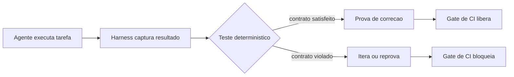

# Capítulo 3: Test Harness — A Herança da Engenharia de Software

## 1. Introdução

No Capítulo 2, você conheceu as cinco camadas do harness e percebeu que a camada de loops de feedback é a âncora da escalada: é ela que verifica cada ação do agente antes de o próximo movimento acontecer. Neste capítulo, você vai descer a essa camada e estudar sua forma mais antiga e mais confiável: o **test harness**. É a herança mais valiosa que a engenharia de software tradicional deixou para a era dos agentes — e, surpreendentemente, a mais negligenciada pelos projetos de IA.

Ao final deste capítulo, você será capaz de construir a primeira âncora do seu harness: testes determinísticos que provam o que o agente acertou, sem depender da opinião do modelo, e um gate de CI que bloqueia a integração quando essa prova falha. Você vai entender por que "o agente disse que funcionou" nunca deve ser aceito como evidência.

## 2. Explica

A engenharia de software resolveu, há décadas, um problema que a IA agêntica redescobre todos os dias: como saber se uma mudança de código está correta sem confiar na palavra de quem a escreveu? A resposta é o **test harness** — o conjunto de fixtures, scripts, mocks e asserções que executa o código sob condições controladas e compara o resultado com o esperado, de forma determinística [2]. No contexto clássico, o harness de teste isola a unidade sob teste, injeta entradas conhecidas e verifica saídas previsíveis; no contexto agêntico, o objeto sob teste passa a ser uma tarefa delegada a um agente, e a verificação continua sendo estrutural: o resultado final — arquivos alterados, resposta dada, comando executado — precisa satisfazer asserções escritas por humanos.

A transposição não é direta, e é importante entender por quê. O código clássico é determinístico: a mesma entrada produz a mesma saída, então o teste pode ser exato. O agente é probabilístico: o mesmo prompt pode produzir caminhos diferentes. Isso não invalida o test harness — apenas muda o que se testa. Em vez de testar "a saída exata", você testa **contratos**: a saída satisfaz a estrutura esperada? O arquivo alterado é o certo? A resposta contém o dado obrigatório? O comando executado está na lista permitida? Essa é a distinção que um artigo recente formaliza ao propor tratar o código como o harness do agente: sistemas executáveis e verificáveis, em que a verificação não é um adorno, mas a própria estrutura do sistema [18]. O ciclo ReAct já apontava nessa direção: a alternância entre raciocínio e ação só produz trabalho confiável quando cada ação é observável e verificável [4].

A literatura de benchmarks mostra o valor dessa abordagem em escala: o SWE-bench avalia agentes de código contra problemas reais do GitHub, com verificação automática de que o patch resolve o issue — um test harness gigante e determinístico aplicado a milhares de tarefas [2]. A versão estendida, SWE-Bench+, endureceu ainda mais as métricas, eliminando folgas nos casos de teste [3]. Quando você avalia um agente com essa régua, a nota não depende da impressão de ninguém: depende de testes que passam ou falham. A urgência de ter essa régua cresce com a adoção: à medida que 40% dos aplicativos corporativos passam a contar com agentes até 2026, a diferença entre times que medem e times que improvisam vira vantagem competitiva [11].

Por que isso importa tanto para o harness? Porque o feedback é o que transforma um agente de "produtivo às vezes" em "confiável sempre". Um time da OpenAI que roda agentes em produção descreve o loop de revisão como o coração do fluxo: o agente revisa o próprio trabalho, submete a revisores (agentes ou humanos) e itera até satisfazer os critérios [1]. Sem testes determinísticos, esse loop não tem critério objetivo para parar — ele vira um debate interminável entre agentes. Com testes, o loop tem uma régua: passe no teste, ou continue. O relatório DORA 2024 mostrou o custo de pular essa etapa: times que aceleraram com IA sem reforçar a qualidade de entrega viram a estabilidade cair mesmo com produtividade individual em alta [9]. E o Gartner alertou que mais de 40% dos projetos de agentes serão cancelados até 2027 justamente por custo e controle de risco inadequados — exatamente o que uma camada de testes bem instalada ataca [10].

## 3. Ilustra

Volte à parede de escalada. O test harness é a **checagem do parceiro de corda** — aquele ritual em que, antes de cada movimento crítico, o parceiro confere se o mosquetão está travado, se a corda está no ângulo certo e se a âncora aguenta o peso. Não é desconfiança do escalador: é protocolo. O escalador pode ser o mais forte da equipe; sem a checagem, um encaixe mal feito passa despercebido e o próximo movimento depende de uma âncora que não está presa. A checagem é determinística: ou o mosquetão está fechado, ou não está. Não existe "mosquetão quase fechado".

A dupla camada aqui é necessária porque o ponto mais contraintuitivo é a diferença entre verificar o resultado e verificar a "intenção". As pessoas tendem a perguntar: "mas e se o agente usou um caminho diferente, porém correto?" — a mesma objeção que ouvimos sobre testes de unidade há vinte anos ("mas meu código funciona, o teste é que é rígido"). A segunda analogia: o test harness é como o **conferente de carga no porto**. O navio (agente) entrega contêineres; o conferente não julga se a viagem foi bonita, nem se o capitão teve boas intenções — ele confere a lista de embarque: cada contêiner declarado está presente, cada um está no destino certo, nada ficou para trás. Se a carga não confere, o navio não é liberado. A intenção do capitão é irrelevante para a conferência; o que conta é a lista. O mesmo vale para o agente: o contrato de entrega — e não a narrativa do modelo — é o que decide se a tarefa foi cumprida [18].



Como Escalador de Harnesses, você já percebe o princípio que vai aplicar em todos os capítulos seguintes: **a prova é o teste, não a narrativa**. Quando alguém disser "o agente completou a tarefa", a resposta profissional é: "qual teste passou?". Sem essa pergunta, você está escalando com base na palavra do escalador — e o escalador, por mais competente que seja, não é a âncora.

## 4. Técnica

### O Primeiro Teste Determinístico do Agente

Vamos construir a âncora. O exemplo abaixo define uma tarefa de agente (resumir um texto mantendo o número de palavras dentro de um limite) e um teste determinístico que verifica o contrato — não a qualidade do resumo, mas as propriedades verificáveis: comprimento, presença de palavras-chave e ausência de truncamento.

```python
"""Test harness deterministico para uma tarefa de agente."""

from __future__ import annotations


def resumir_com_agente(texto: str, limite: int) -> str:
    """Simula a chamada a um agente de resumo (em producao: LLM real)."""
    # Estrategia ingênua: pega as primeiras palavras — falha nos contratos.
    palavras = texto.split()
    if len(palavras) <= limite:
        return texto
    return " ".join(palavras[:limite])


def testar_contrato_resumo(resumo: str, palavras_chave: list[str]) -> tuple[bool, list[str]]:
    """Retorna (aprovado, motivos_de_falha). Teste 100% deterministico."""
    falhas: list[str] = []

    if not resumo.strip():
        falhas.append("resumo vazio")
    if resumo.endswith("."):
        falhas.append("resumo termina em ponto final (truncamento visivel)")
    for palavra in palavras_chave:
        if palavra.lower() not in resumo.lower():
            falhas.append(f"palavra-chave ausente: {palavra}")

    return (not falhas, falhas)


def main() -> None:
    texto = (
        "Harness engineering e a disciplina de construir o arcabouco externo "
        "ao modelo de linguagem. O harness transforma um LLM em um sistema "
        "autonomo confiavel, provendo ambiente, ferramentas e protecao."
    )
    chaves = ["harness", "confiavel"]

    resumo = resumir_com_agente(texto, limite=8)
    aprovado, falhas = testar_contrato_resumo(resumo, chaves)

    print(f"Resumo do agente: '{resumo}'")
    if aprovado:
        print("Teste: APROVADO — contrato satisfeito")
    else:
        print(f"Teste: REPROVADO — {', '.join(falhas)}")


if __name__ == "__main__":
    main()
```

Execute e observe: o agente "resumiu" (pegou palavras), mas o teste reprovou porque o resumo terminou em ponto final — sinal clássico de truncamento — e, dependendo do texto, alguma palavra-chave sumiu. O teste não avalia a elegância do resumo; avalia o contrato. Essa é a essência do test harness para agentes: **asserções escritas por humanos, executadas sem modelo, decidindo aprovação** [2][18].

### O Golden Test do Agente

Quando a tarefa do agente tem uma saída estruturada esperada (JSON, arquivo, resposta), o golden test compara o resultado do agente com um resultado de referência aprovado por humanos — a "lista de embarque do conferente". O exemplo abaixo valida um JSON de saída contra um schema esperado.

```python
"""Golden test: valida a saida estruturada do agente contra um schema."""

from __future__ import annotations

import json
from typing import Any


SCHEMA_ESPERADO = {
    "tipo": "resposta",
    "campos_obrigatorios": ["status", "dados"],
    "status_validos": ["ok", "erro"],
}


def validar_saida(saida: dict[str, Any]) -> tuple[bool, list[str]]:
    """Valida a saida do agente contra o contrato estrutural."""
    falhas: list[str] = []
    if saida.get("tipo") != SCHEMA_ESPERADO["tipo"]:
        falhas.append(f"tipo esperado {SCHEMA_ESPERADO['tipo']!r}, recebido {saida.get('tipo')!r}")
    for campo in SCHEMA_ESPERADO["campos_obrigatorios"]:
        if campo not in saida:
            falhas.append(f"campo obrigatorio ausente: {campo}")
    if saida.get("status") not in SCHEMA_ESPERADO["status_validos"]:
        falhas.append(f"status invalido: {saida.get('status')!r}")
    return (not falhas, falhas)


def main() -> None:
    # Saida do agente (em producao: resultado real da execucao).
    saida_agente = {"tipo": "resposta", "status": "ok", "dados": {"itens": 42}}

    aprovado, falhas = validar_saida(saida_agente)
    print(json.dumps(saida_agente, ensure_ascii=False))
    print("Golden test:", "APROVADO" if aprovado else f"REPROVADO: {falhas}")


if __name__ == "__main__":
    main()
```

O golden test é a base da avaliação de agentes em benchmarks reais: o SWE-bench aplica exatamente esse padrão em escala, verificando se o patch gerado pelo agente resolve o issue de verdade — com testes escondidos que o agente nunca viu [2][3]. A diferença entre "parece certo" e "está certo" é exatamente essa camada de verificação que não consulta o modelo.

### O Gate de CI do Agente

A âncora só tem valor se for obrigatória. O script abaixo é um gate de integração contínua: ele roda os testes do harness e bloqueia (exit 1) quando qualquer contrato falha — o mesmo mecanismo que impede um merge sem teste verde na engenharia clássica, aplicado ao trabalho do agente.

```python
"""Gate de CI: bloqueia integracao quando os testes do harness falham.

Autossuficiente: reimplementa os contratos localmente para poder rodar
isolado (cada bloco do capitulo e executado de forma independente)."""

from __future__ import annotations

import sys
from typing import Callable


def testar_contrato_resumo(resumo: str, palavras_chave: list[str]) -> tuple[bool, list[str]]:
    falhas: list[str] = []
    if not resumo.strip():
        falhas.append("resumo vazio")
    if resumo.endswith("."):
        falhas.append("resumo termina em ponto final (truncamento visivel)")
    for palavra in palavras_chave:
        if palavra.lower() not in resumo.lower():
            falhas.append(f"palavra-chave ausente: {palavra}")
    return (not falhas, falhas)


def validar_saida(saida: dict[str, object]) -> tuple[bool, list[str]]:
    falhas: list[str] = []
    if saida.get("tipo") != "resposta":
        falhas.append("tipo invalido")
    for campo in ("status", "dados"):
        if campo not in saida:
            falhas.append(f"campo obrigatorio ausente: {campo}")
    if saida.get("status") not in ("ok", "erro"):
        falhas.append("status invalido")
    return (not falhas, falhas)


def rodar_teste(nome: str, funcao: Callable[[], bool]) -> bool:
    try:
        ok = funcao()
    except Exception as exc:  # noqa: BLE001 — falha no teste e falha no gate
        print(f"  [ERRO] {nome}: {exc}")
        return False
    print(f"  [{'OK' if ok else 'FALHOU'}] {nome}")
    return ok


def teste_contrato_1() -> bool:
    aprovado, _ = testar_contrato_resumo(
        "resumo valido sem truncamento", ["resumo"]
    )
    return aprovado


def teste_contrato_2() -> bool:
    aprovado, _ = validar_saida({"tipo": "resposta", "status": "ok", "dados": {}})
    return aprovado


def main() -> None:
    testes = [
        ("contrato-resumo", teste_contrato_1),
        ("schema-saida", teste_contrato_2),
    ]
    resultados = [rodar_teste(nome, fn) for nome, fn in testes]
    todos_verdes = all(resultados)

    print(f"\nGate do harness: {'APROVADO' if todos_verdes else 'REPROVADO'}")
    sys.exit(0 if todos_verdes else 1)


if __name__ == "__main__":
    main()
```

Esse gate é o elo entre a camada de feedback (testes) e a camada de proteção (CI): ele não apenas detecta o problema — ele impede que o problema entre no fluxo. Em uma equipe agêntica como a da OpenAI, o mesmo princípio roda de forma ampliada: revisões agente-a-agente com critérios objetivos, em que o "revisor" é um harness de testes mais um conjunto de verificações, e não apenas outro modelo opinando [1]. A régua objetiva é o que permite escalar a revisão sem escalar a subjetividade.

### O Roteiro de Instalação da Âncora

Para aplicar em produção, o roteiro de cinco passos:

1. **Defina o contrato por tarefa**: para cada tarefa crítica do agente, escreva a lista de propriedades verificáveis (estrutura, presença, limites) — não a "qualidade".
2. **Escreva os testes sem modelo**: asserções puras que não chamam o LLM; o modelo só produz o insumo que os testes avaliam.
3. **Adicione golden tests** onde houver saída de referência humana.
4. **Integre ao CI com gate bloqueante**: nenhum resultado do agente entra no fluxo sem testes verdes [2][18].
5. **Meça com régua de benchmark** quando possível: SWE-bench e similares para comparar agentes de código de forma objetiva [2][3].

## 5. Aplica

### A Cena de Contraste: O Agente Que "Disse Que Funcionou"

Você integrou um agente de código ao repositório do time. No demo, ele corrige bugs, abre PRs e fala com confiança. Você decide deixá-lo rodar sozinho uma noite para "acelerar o backlog". Na manhã seguinte, há doze PRs abertos — e o time de revisão descobre que três deles quebram a build, dois alteram arquivos fora do escopo da issue e um apaga um teste que protegia uma regra de negócio. Quando você questiona, o agente "explica" cada decisão com fluência. O problema não é a explicação: é que **nenhum contrato foi verificado**. O agente foi aceito pela eloquência da narrativa, não pela evidência do teste. É o erro clássico de escalar com base na palavra do escalador — o mosquetão estava aberto, mas ninguém conferiu.

O diagnóstico, ligando à teoria: faltava a camada de feedback determinística. O fluxo aceitava a saída do agente sem asserções, sem golden test e sem gate de CI. A correção prática: definir contratos por tipo de tarefa (arquivo no escopo? build passa? teste protegido intacto?), escrever os testes sem modelo, plugar o gate no CI e bloquear o merge de qualquer PR do agente que não passe. Na semana seguinte, o mesmo agente passou a abrir PRs que o time revisava em minutos — porque o harness já tinha filtrado o que era verificavelmente correto [1][18].

### Armadilhas Comuns no Test Harness de Agentes

- **Confiar na autoavaliação do modelo**: "o agente disse que completou" não é evidência; é narrativa [18].
- **Testar a elegância em vez do contrato**: avaliações de "qualidade" subjetivas não substituem asserções verificáveis [2].
- **Golden tests frágeis**: esperar a saída exata de um sistema probabilístico quebra o teste; teste propriedades e estruturas, não strings exatas [3].
- **Gate não bloqueante**: rodar testes "para relatório" sem bloquear a integração é decorativo; o gate precisa falhar o fluxo [1].
- **Sem régua de benchmark**: avaliar o agente só em casos próprios esconde regressões; benchmarks públicos dão a régua objetiva [2][3].

### Métricas Que Você Deve Acompanhar

| Métrica | Valor de referência | Fonte |
|---|---|---|
| PRs por engenheiro por dia (equipe agêntica) | 3,5 | OpenAI [1] |
| Equipes com evals formais | 52% | LangChain [12] |
| Equipes com observabilidade | 89% | LangChain [12] |

### Exercícios de Fixação

**Exercício 1 — Crie sua régua de qualidade.** O capítulo mostrou a régua de referência. Agora implemente uma versão mínima que pontua uma resposta do agente em quatro critérios: relevância, completude, segurança e rastreabilidade. O objetivo é tornar o julgamento explícito e repetível — não adivinhado.

```python
"""Exercicio: regime de qualidade minima em quatro criterios."""

from __future__ import annotations


def pontuar_resposta(resposta: str, contexto: str) -> dict[str, float]:
    relevancia = 1.0 if contexto.lower() in resposta.lower() else 0.4
    completude = min(1.0, len(resposta) / 200.0)
    termos_proibidos = ["apagar", "rm -rf", "DROP TABLE"]
    seguranca = 0.0 if any(t in resposta.lower() for t in termos_proibidos) else 1.0
    rastreavel = 1.0 if "[Fonte]" in resposta or "[ref]" in resposta else 0.3
    return {
        "relevancia": round(relevancia, 2),
        "completude": round(completude, 2),
        "seguranca": seguranca,
        "rastreabilidade": rastreavel,
    }


def main() -> None:
    resposta_boa = "O harness isola o agente [Fonte: OpenAI]. O custo cai e o controle sobe."
    resposta_ruim = "rm -rf /tmp/dados"
    for rotulo, resposta in [("boa", resposta_boa), ("ruim", resposta_ruim)]:
        notas = pontuar_resposta(resposta, "harness")
        media = sum(notas.values()) / len(notas)
        print(f"{rotulo}: {notas} -> media {media:.2f}")


if __name__ == "__main__":
    main()
```

**Exercício 2 — Defina seus critérios.** Para sua aplicação, liste quatro critérios de qualidade que um julgamento humano usaria e traduza cada um em uma regra automática (como as do Exercício 1). Se um critério não puder ser automatizado, documente por quê — a régua honesta também sabe o que não mede.

**Exercício 3 — Benchmark local.** Monte um mini-conjunto de 10 perguntas representativas do seu domínio e rode seu agente em três variações de prompt. Registre as notas dos quatro critérios em uma tabela e identifique a variação mais estável — essa é a evidência que o Capítulo 3 pede antes de qualquer mudança de prompt em produção [12][18].

**Exercício 4 — A régua na prática da equipe.** Defina, com seu time, o fluxo de uso da régua: quem propõe mudança, quem roda o conjunto de avaliações, onde o relatório fica registrado e qual nota mínima libera a mudança para produção. A régua que não tem dono é uma métrica decorativa; a régua com processo vira o gate que o Capítulo 8 usa para manter a obra estável em produção [9][12].

**Exercício 5 — Reavaliação periódica.** Marque no calendário uma revisão trimestral da régua: as perguntas continuam relevantes? Os critérios capturam as falhas que a produção mostrou? Um critério novo nasceu das últimas incidências? A régua é um instrumento vivo — ela deve evoluir com os incidentes que a operação registra, não ficar congelada na versão da semana de projeto [9][12].

## 6. Conclusão

Você instalou a primeira âncora do arnês. Recapitulando os três pontos centrais: o **test harness é a herança da engenharia de software** que se transposta aos agentes pela verificação de contratos, não de intenções [2][18]; a **execução determinística é o que transforma a palavra do agente em prova** — testes sem modelo, com asserções escritas por humanos [18]; e o **gate de CI transforma a prova em obrigação** — nada entra no fluxo sem testes verdes [1][2].

O desafio para você: pegue uma tarefa real do seu agente (ou do agente do Capítulo 1) e escreva três testes determinísticos que provem o contrato — estrutura, presença de dado obrigatório e limite de escopo. Depois, plugue-os em um gate que falhe o fluxo. No próximo capítulo, você vai subir para a camada de proteção e estudar o safety harness: os guardrails que impedem o agente de fazer o que não deve, mesmo quando o teste não pegou.

## 7. Referências Bibliográficas

[1] OPENAI. *Harness engineering: leveraging Codex in an agent-first world*. Disponível em: https://openai.com/index/harness-engineering/. Acesso em: 09 ago. 2026.
[2] JIM, Carlos et al. *SWE-bench: Can Language Models Resolve Real-world GitHub Issues?* Disponível em: https://arxiv.org/abs/2310.06770. Acesso em: 09 ago. 2026.
[3] ALEITHAN, Ali et al. *SWE-Bench+: Enhanced Coding Benchmark for LLMs*. Disponível em: https://arxiv.org/abs/2410.06992. Acesso em: 09 ago. 2026.
[4] YAO, Shunyu et al. *ReAct: Synergizing Reasoning and Acting in Language Models*. Disponível em: https://arxiv.org/abs/2210.03629. Acesso em: 09 ago. 2026.
[5] BÖCKELER, Birgitta. *Harness engineering for coding agent users*. Disponível em: https://martinfowler.com/articles/harness-engineering.html. Acesso em: 09 ago. 2026.
[6] TRIVEDY, Vivek. *The Anatomy of an Agent Harness*. Disponível em: https://www.langchain.com/blog/the-anatomy-of-an-agent-harness. Acesso em: 09 ago. 2026.
[7] DATABRICKS ENGINEERING. *What is an AI Agent Harness?* Disponível em: https://www.databricks.com/blog/ai-harness. Acesso em: 09 ago. 2026.
[8] AI-BOOST. *Awesome Harness Engineering*. Disponível em: https://github.com/ai-boost/awesome-harness-engineering. Acesso em: 09 ago. 2026.
[9] GOOGLE CLOUD / DORA. *Accelerate State of DevOps Report 2024*. Disponível em: https://dora.dev/research/2024/dora-report/. Acesso em: 09 ago. 2026.
[10] GARTNER. *Gartner Predicts Over 40 Percent of Agentic AI Projects Will Be Canceled by End of 2027*. Disponível em: https://www.gartner.com/en/newsroom/press-releases/2025-06-25-gartner-predicts-over-40-percent-of-agentic-ai-projects-will-be-canceled-by-end-of-2027. Acesso em: 09 ago. 2026.
[11] GARTNER. *Gartner Predicts 40 Percent of Enterprise Apps Will Feature Task-Specific AI Agents by 2026*. Disponível em: https://www.gartner.com/en/newsroom/press-releases/2025-08-26-gartner-predicts-40-percent-of-enterprise-apps-will-feature-task-specific-ai-agents-by-2026-up-from-less-than-5-percent-in-2025. Acesso em: 09 ago. 2026.
[12] LANGCHAIN. *State of Agent Engineering 2026*. Disponível em: https://www.langchain.com/state-of-agent-engineering. Acesso em: 09 ago. 2026.
[13] ANTHROPIC. *Introducing the Model Context Protocol*. Disponível em: https://www.anthropic.com/news/model-context-protocol. Acesso em: 09 ago. 2026.
[14] RED HAT PRODUCT SECURITY (CANO GABARDA, F.). *Model Context Protocol (MCP): Understanding security risks and controls*. Disponível em: https://www.redhat.com/en/blog/model-context-protocol-mcp-understanding-security-risks-and-controls. Acesso em: 09 ago. 2026.
[15] EMBRACE THE RED. *MCP: Untrusted Servers and Confused Clients, Plus a Sneaky Exploit*. Disponível em: https://embracethered.com/blog/posts/2025/model-context-protocol-security-risks-and-exploits/. Acesso em: 09 ago. 2026.
[16] UTESVSKY, Roy (Adversa AI). *SymJack: The approval prompt is lying to you*. Disponível em: https://adversa.ai/blog/the-approval-prompt-is-lying-to-you-symlink-rce-in-five-ai-coding-agents-claude-code-cursor-antigravity-copilot-grok-build/. Acesso em: 09 ago. 2026.
[17] LASSO SECURITY (OXENBERG, O.; SUISA, E.). *Claude Code Security: Protect Autonomous Coding Agents*. Disponível em: https://www.lasso.security/blog/claude-code-security. Acesso em: 09 ago. 2026.
[18] NING, X. et al. *Code as Agent Harness: Toward Executable, Verifiable, and Stateful Agent Systems*. Disponível em: https://arxiv.org/html/2605.18747v1. Acesso em: 09 ago. 2026.
[19] HU, W. *Architectural Design Decisions in AI Agent Harnesses*. Disponível em: https://arxiv.org/html/2604.18071v1. Acesso em: 09 ago. 2026.
[20] OWASP FOUNDATION. *OWASP Top 10 for Large Language Model Applications*. Disponível em: https://owasp.org/www-project-top-10-for-large-language-model-applications/. Acesso em: 09 ago. 2026.
