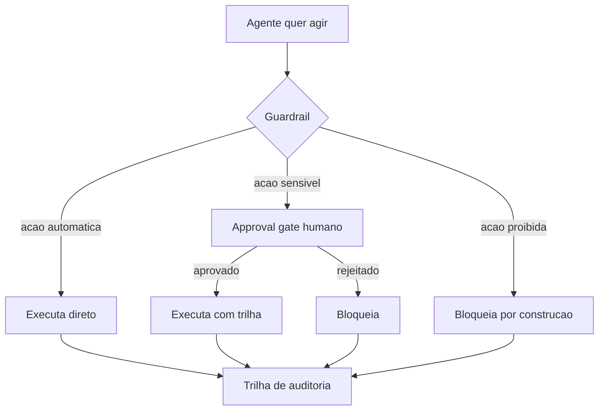

# Capítulo 4: Safety Harness e Guardrails — A Camada Que Impede a Queda

## 1. Introdução

No Capítulo 3, você instalou a âncora: testes determinísticos que provam o que o agente acertou. Mas a âncora só é acionada depois do movimento — ela não impede o primeiro passo errado. Neste capítulo, você vai subir para a camada de proteção do arnês: o **safety harness** e os **guardrails**, o capacete que muda o resultado de qualquer queda.

Ao final deste capítulo, você será capaz de projetar a camada que decide o que o agente *pode* fazer — mesmo quando o modelo quer fazer mais: approval gates que protegem ações destrutivas sem paralisar o fluxo, princípio do menor privilégio que limita o estrago de qualquer erro e sandboxes que isolam a execução. Você vai entender por que "pedir educadamente no prompt" não é segurança, e por que a segurança precisa ser estrutura, não intenção.

## 2. Explica

Comecemos pela definição precisa: o safety harness é a camada do harness que **intercepta ações antes da execução** para bloquear o que é destrutivo, vazante ou crítico. Enquanto o test harness (Capítulo 3) verifica o resultado *depois*, o guardrail verifica a intenção de ação *antes* — é o porteiro que confere a entrada, não o auditor que confere o balanço. Visões institucionais sobre o que é um harness de agente colocam os guardrails como o componente que torna o sistema governável em escala: sandboxes, políticas e controle de custo vivem exatamente nessa camada [7].

O catálogo do que precisa ser interceptado é conhecido e documentado. O OWASP Top 10 para aplicações com LLM lista os riscos mais críticos: injeção de prompt, tratamento inseguro de saídas, excesso de permissões, dependências inseguras e vazamento de dados sensíveis — e a maioria deles é mitigada na camada de guardrails, não no modelo [20]. Um estudo de segurança sobre agentes de codificação documentou na prática o custo de não ter essa camada: múltiplos agentes (Claude Code, Cursor, Codex e outros) puderam ser enganados por ataques de symlink para executar código arbitrário — o usuário aprovava uma operação aparentemente benigna, mas o kernel redirecionava a escrita para arquivos de credenciais [16].

Dois conceitos governam o design dessa camada: **blast radius** e **menor privilégio**. O blast radius é o tamanho do estrago que uma única ação errada pode causar — e o objetivo do safety harness é mantê-lo pequeno por construção: um agente que só pode escrever em um diretório de trabalho isolado tem blast radius de um diretório, não de um servidor. O menor privilégio é o princípio de que todo agente deve rodar com o mínimo de permissão necessário para a tarefa — tokens escopados, diretórios restritos, modos autônomos desativados [17]. Juntos, eles formam a resposta estrutural ao risco que o Gartner quantificou: mais de 40% dos projetos de agentes serão cancelados até 2027 por custos crescentes e controles de risco inadequados [10].

Há uma tensão que você precisa conhecer de antemão: **segurança e fluidez competem**. Cada approval gate adiciona fricção; cada restrição reduz o que o agente pode fazer sozinho. A pesquisa de mercado mostra que a segurança já é a principal preocupação de quase 25% das grandes empresas em produção — acima da latência [12] —, mas a solução não é bloquear tudo: é bloquear o certo. O design maduro separa ações em três classes: as **automáticas** (seguras e reversíveis, sem aprovação), as **sensíveis** (exigem aprovação humana) e as **proibidas** (bloqueadas por construção, sem exceção). A arte do safety harness é classificar bem, não bloquear tudo.

## 3. Ilustra

Na escalada, o safety harness é o **capacete** — e, mais ainda, o **protocolo de segurança da via**. O capacete não impede a queda; muda o resultado dela. O protocolo diz onde você pode pisar, onde a corda prende e qual trecho exige o sinal do parceiro antes de continuar. Nenhum escalador experiente considera o protocolo uma limitação à sua habilidade: é o que permite escalar anos sem virar estatística. O agente sem protocolo não está "mais livre" — está escalando sem rede, e cada erro é potencialmente o último.

A dupla camada aqui é necessária porque o ponto mais contraintuitivo é o approval gate: as pessoas veem a aprovação humana como "freio burocrático" que atrasa o agente. A segunda analogia — o **cirurgião e o anestesista**: o cirurgião (agente) opera com foco total no procedimento; o anestesista (guardrail) monitora sinais vitais e tem o poder — e o dever — de interromper a operação se algo sair do limite seguro. O cirurgião não se sente "limitado" pelo anestesista; o anestesista é o que torna a operação possível em condições seguras. Da mesma forma, o approval gate não atrasa o trabalho produtivo do agente — ele permite que o agente trabalhe em velocidade máxima nas ações seguras, porque as ações perigosas têm um ponto de veto independente. A fricção de 2 segundos de aprovação numa ação destrutiva é o preço da continuidade do resto do fluxo [16][17].



Como Escalador de Harnesses, você já percebe a pergunta que vai fazer a todo sistema: **o que este agente NÃO pode fazer, mesmo tentando?** Se a resposta for "nada" ou "depende do bom senso dele", a camada de proteção não existe — você está escalando sem capacete.

## 4. Técnica

### A Política de Bloqueio por Construção

Vamos construir a camada de proteção. O primeiro bloco implementa a classificação de ações em três classes — automática, sensível e proibida — com bloqueio estrutural para a classe proibida. Note que o bloqueio não consulta o modelo: é uma decisão de código.

```python
"""Guardrail: classifica e intercepta acoes antes da execucao."""

from __future__ import annotations

from dataclasses import dataclass, field


@dataclass
class Guardrail:
    automaticas: set[str] = field(default_factory=set)
    sensiveis: set[str] = field(default_factory=set)
    proibidas: set[str] = field(default_factory=set)

    def classificar(self, acao: str) -> str:
        if acao in self.proibidas:
            return "proibida"
        if acao in self.sensiveis:
            return "sensivel"
        if acao in self.automaticas:
            return "automatica"
        # Toda acao desconhecida e negada por padrao (deny by default).
        return "proibida"

    def executar(self, acao: str, aprovado: bool = False) -> str:
        classe = self.classificar(acao)
        if classe == "proibida":
            return f"BLOQUEADO: {acao} e proibida por construcao"
        if classe == "sensivel":
            if not aprovado:
                return f"PENDENTE: {acao} exige aprovacao humana"
            return f"EXECUTADO (aprovado): {acao}"
        return f"EXECUTADO (automatico): {acao}"


def main() -> None:
    guardrail = Guardrail(
        automaticas={"ler", "buscar", "executar-teste"},
        sensiveis={"escrever-arquivo", "instalar-pacote"},
        proibidas={"apagar", "deploy", "drop"},
    )

    for acao, aprovado in [
        ("ler", False),
        ("escrever-arquivo", False),
        ("escrever-arquivo", True),
        ("apagar", True),  # proibida mesmo aprovado
        ("desconhecida", False),
    ]:
        print(f"  {guardrail.executar(acao, aprovado)}")


if __name__ == "__main__":
    main()
```

Execute e observe a decisão de design mais importante: **deny by default**. A ação desconhecida é tratada como proibida — exatamente o inverso do que a maioria dos sistemas faz (permitir por padrão e bloquear o que se conhece). Essa inversão é a diferença entre um guardrail e um enfeite: o agente que só pode fazer o que está na lista é estruturalmente incapaz do que não está [20].

### O Approval Gate com Whitelist

O approval gate resolve a tensão entre segurança e fluidez: ações sensíveis pedem aprovação humana, mas ações seguras seguem automáticas. O bloco abaixo implementa um gate com whitelist e registro da decisão — inclusive de quem aprovou e quando.

```python
"""Approval gate com whitelist e trilha de decisoes."""

from __future__ import annotations

import time
from dataclasses import dataclass, field


@dataclass
class Decisao:
    acao: str
    aprovado: bool
    responsavel: str
    instante: float = field(default_factory=time.time)


class ApprovalGate:
    def __init__(self, automaticas: set[str]) -> None:
        self.automaticas = automaticas
        self.decisoes: list[Decisao] = []

    def solicitar(self, acao: str, humano: str = "operador") -> bool:
        if acao in self.automaticas:
            self.decisoes.append(Decisao(acao, True, "harness"))
            return True
        # Em producao, aqui abriria uma UI de aprovacao para o humano.
        # Simulamos a decisao humana como 'nao aprovado' por padrao.
        aprovado = humano == "aprovador-confiavel"
        self.decisoes.append(Decisao(acao, aprovado, humano))
        return aprovado

    def trilha(self) -> list[Decisao]:
        return list(self.decisoes)


def main() -> None:
    gate = ApprovalGate(automaticas={"ler", "buscar"})

    for acao, humano in [
        ("ler", "harness"),
        ("escrever-arquivo", "operador"),
        ("escrever-arquivo", "aprovador-confiavel"),
    ]:
        resultado = gate.solicitar(acao, humano)
        print(f"  {acao:<18} -> {'aprovado' if resultado else 'negado'}")

    print("\nTrilha de decisoes:")
    for decisao in gate.trilha():
        print(f"  {decisao.acao:<18} aprovado={decisao.aprovado} por {decisao.responsavel}")


if __name__ == "__main__":
    main()
```

A pesquisa de segurança mostrou por que essa trilha importa: sem registro confiável das decisões, um agente enganado por um ataque de symlink pode fazer o operador "aprovar" uma ação que, na verdade, é outra — o prompt mostrava um caminho benigno, o kernel executava a escrita em credenciais [16]. A defesa madura combina o gate com a **validação de intenção** — o harness confere se a ação executada corresponde ao que foi aprovado — e com a resolução de symlinks antes de exibir os caminhos reais [16][17].

### Menor Privilégio e Escopo de Arquivos

A terceira peça: o executor que valida o escopo antes de agir. Um agente com token global é um incidente esperando para acontecer; um agente com escopo de diretório tem o estrago limitado por construção [17].

```python
"""Executor com menor privilegio: valida escopo antes de qualquer acao."""

from __future__ import annotations

from pathlib import Path


class ExecutorEscopado:
    def __init__(self, raiz_trabalho: Path, escopo: set[str]) -> None:
        self.raiz = raiz_trabalho.resolve()
        self.escopo = escopo

    def permitido(self, caminho: Path) -> bool:
        try:
            resolvido = (self.raiz / caminho).resolve()
        except OSError:
            return False
        # Bloqueia qualquer caminho que escape da raiz (inclui symlinks).
        return self.raiz in resolvido.parents or resolvido == self.raiz

    def ler(self, caminho: str) -> str:
        alvo = Path(caminho)
        if not self.permitido(alvo):
            return "BLOQUEADO: caminho fora do escopo"
        return f"LIDO: {caminho} (dentro do escopo)"

    def escrever(self, caminho: str, conteudo: str) -> str:
        alvo = Path(caminho)
        if not self.permitido(alvo):
            return "BLOQUEADO: escrita fora do escopo"
        (self.raiz / alvo).write_text(conteudo, encoding="utf-8")
        return f"ESCRITO: {caminho}"


def main() -> None:
    raiz = Path("workspace_agente")
    raiz.mkdir(exist_ok=True)
    executor = ExecutorEscopado(raiz, escopo={"arquivos"})

    print(executor.escrever("nota.txt", "conteudo seguro"))
    print(executor.escrever("../segredo.txt", "vazamento"))
    print(executor.ler("nota.txt"))
    print(executor.ler("/etc/passwd"))


if __name__ == "__main__":
    main()
```

Repare que o bloqueio usa resolução de caminhos (`resolve()`), não comparação de strings — exatamente para frustrar ataques que tentam escapar do escopo com `..`, caminhos absolutos ou symlinks. Esse é o mesmo princípio que a pesquisa SymJack mostrou ser indispensável: sem resolução de symlinks, a proteção de escopo é ilusória [16].

### O Roteiro de Instalação do Capacete

1. **Classifique as ações em três classes**: automáticas, sensíveis e proibidas — com deny by default para o desconhecido.
2. **Implemente o gate como ponto único**: toda ação sensível passa pelo mesmo approval gate, com trilha de decisão [16].
3. **Resolva caminhos e symlinks antes de decidir**: nunca confie na string exibida [16][17].
4. **Escope tokens e diretórios**: menor privilégio por tarefa, sem token global [17].
5. **Isole a execução**: sandbox de contêiner para o ambiente do agente [7][19].

## 5. Aplica

### A Cena de Contraste: O Deploy das Três da Manhã

Você escalou um agente de release para automatizar deploys noturnos. O prompt diz: "após os testes passarem, faça o deploy para produção". Na primeira semana, tudo funciona — o agente roda os testes, passa e faz o deploy com sucesso, às 3h da manhã, sem ninguém acordado. Numa segunda-feira, um teste de integração fica instável e passa com um alerta silencioso; o agente, seguindo o prompt "após os testes passarem", interpreta o alerta como aprovação e faz o deploy de uma versão com uma regressão crítica. O incidente custa uma tarde inteira de rollback e recuperação. O erro não foi do modelo — foi da classificação: o deploy foi tratado como ação automática quando deveria ser sensível, exigindo aprovação humana independente do resultado dos testes [16][20].

O diagnóstico, ligando à teoria: a ação destrutiva (deploy) estava na classe errada. O prompt dizia "faça o deploy", mas o prompt não é um guardrail — é uma instrução que o modelo pode interpretar mal. A correção prática: mover "deploy" para a classe sensível, exigir aprovação humana de plantão, manter o rollout em sandbox com rollback automático e registrar a trilha. Na semana seguinte, o deploy só acontece com a aprovação explícita — e um alerta de teste instável agora bloqueia, em vez de acelerar, o release [16][17][20].

### Armadilhas Comuns no Safety Harness

- **Segurança no prompt**: "por favor, não apague nada" não é guardrail; é sugestão [20].
- **Permitir por padrão**: bloquear só o que se conhece deixa o desconhecido livre; inverta para deny by default.
- **Approval gate sem trilha**: aprovação sem registro é indecifrável depois; registre quem, o quê e quando [16].
- **Token global "por conveniência"**: o escopo amplo é o vetor favorito de incidentes; escope por tarefa [17].
- **Confiar no caminho exibido**: symlinks e caminhos relativos podem mentir; resolva antes de decidir [16].
- **Sem sandbox**: agente rodando com as permissões do operador transforma erro em incidente; isole a execução [7].

### Métricas Que Você Deve Acompanhar

| Métrica | Valor de referência | Fonte |
|---|---|---|
| Segurança como principal preocupação (grandes empresas) | ~25% | LangChain [12] |
| Projetos de agentes cancelados até 2027 | >40% | Gartner [10] |
| Apps corporativos com agentes até 2026 | 40% | Gartner [11] |

### Exercícios de Fixação

**Exercício 1 — Classificador de ações com fallback seguro.** Implemente um guardrail mínimo com a filosofia fail-closed: se a classificação não reconhecer a ação, bloqueia. A regra de ouro do safety harness é errar para o lado seguro — nunca "deixar passar porque não sei" [20].

```python
"""Exercicio: guardrail fail-closed para acoes do agente."""

from __future__ import annotations

from dataclasses import dataclass


@dataclass
class Acao:
    tipo: str
    alvo: str


class Guardrail:
    def __init__(self) -> None:
        self.regras: list[tuple[str, set[str]]] = [
            ("ler", {"*.md", "*.txt"}),
            ("buscar", {"web"}),
        ]

    def _classificar(self, acao: Acao) -> tuple[bool, str]:
        for tipo, alvos in self.regras:
            if acao.tipo == tipo:
                for alvo in alvos:
                    if acao.alvo.endswith(alvo.replace("*", "")) or acao.alvo == alvo:
                        return True, f"permitida: {acao.tipo} {acao.alvo}"
        return False, f"bloqueada (fail-closed): {acao.tipo} {acao.alvo}"

    def avaliar(self, acao: Acao) -> tuple[bool, str]:
        permitida, motivo = self._classificar(acao)
        if not permitida:
            return False, f"GUARDRAIL: {motivo}"
        return True, motivo


def main() -> None:
    guardrail = Guardrail()
    acoes = [Acao("ler", "relatorio.md"), Acao("ler", "/etc/passwd"), Acao("apagar", "dados")]
    for acao in acoes:
        permitida, motivo = guardrail.avaliar(acao)
        print(f"{acao.tipo} {acao.alvo}: {'PERMITIDA' if permitida else 'BLOQUEADA'} -> {motivo}")


if __name__ == "__main__":
    main()
```

**Exercício 2 — Quebra do guardrail.** No Exercício 1, encontre uma ação que contorne as regras (por exemplo, um caminho com `../` que fuja da extensão permitida) e adicione uma regra para bloqueá-la. Esse exercício reproduz a classe de vulnerabilidades de traversal que a OWASP destaca [20].

**Exercício 3 — Política de exceção.** Defina o fluxo de exceção do seu guardrail: quem autoriza uma ação bloqueada, com que evidência e quanto tempo dura a autorização. Sem esse fluxo, o fail-closed vira um gargalo humano; com ele, vira um controle auditável [17][19].

## 6. Conclusão

Você instalou o capacete do arnês. Recapitulando os três pontos centrais: os **guardrails interceptam antes da execução** — o porteiro, não o auditor [7][20]; os **approval gates protegem sem paralisar**, quando a classificação em automáticas/sensíveis/proibidas é bem feita — e a fadiga de consentimento é o sintoma de classificação ruim [16][17]; e o **menor privilégio com sandbox limita o estrago por construção** — o blast radius é desenhado, não esperado [17][19].

O desafio para você: classifique as ações do seu agente (o do Capítulo 1 ou um real) em três classes, mova as destrutivas para "sensível" com approval gate e as desconhecidas para "proibida", e escope o token. Depois, tente executar uma ação proibida e observe o bloqueio estrutural. Com o arnês completo nas duas primeiras camadas — âncora (testes) e capacete (guardrails) —, você está pronto para o segundo tempo da escalada: na Parte II, você vai construir o loop de execução e colocar o agente para trabalhar com segurança.

## 7. Referências Bibliográficas

[1] OPENAI. *Harness engineering: leveraging Codex in an agent-first world*. Disponível em: https://openai.com/index/harness-engineering/. Acesso em: 09 ago. 2026.
[2] JIM, Carlos et al. *SWE-bench: Can Language Models Resolve Real-world GitHub Issues?* Disponível em: https://arxiv.org/abs/2310.06770. Acesso em: 09 ago. 2026.
[3] ALEITHAN, Ali et al. *SWE-Bench+: Enhanced Coding Benchmark for LLMs*. Disponível em: https://arxiv.org/abs/2410.06992. Acesso em: 09 ago. 2026.
[4] YAO, Shunyu et al. *ReAct: Synergizing Reasoning and Acting in Language Models*. Disponível em: https://arxiv.org/abs/2210.03629. Acesso em: 09 ago. 2026.
[5] BÖCKELER, Birgitta. *Harness engineering for coding agent users*. Disponível em: https://martinfowler.com/articles/harness-engineering.html. Acesso em: 09 ago. 2026.
[6] TRIVEDY, Vivek. *The Anatomy of an Agent Harness*. Disponível em: https://www.langchain.com/blog/the-anatomy-of-an-agent-harness. Acesso em: 09 ago. 2026.
[7] DATABRICKS ENGINEERING. *What is an AI Agent Harness?* Disponível em: https://www.databricks.com/blog/ai-harness. Acesso em: 09 ago. 2026.
[8] AI-BOOST. *Awesome Harness Engineering*. Disponível em: https://github.com/ai-boost/awesome-harness-engineering. Acesso em: 09 ago. 2026.
[9] GOOGLE CLOUD / DORA. *Accelerate State of DevOps Report 2024*. Disponível em: https://dora.dev/research/2024/dora-report/. Acesso em: 09 ago. 2026.
[10] GARTNER. *Gartner Predicts Over 40 Percent of Agentic AI Projects Will Be Canceled by End of 2027*. Disponível em: https://www.gartner.com/en/newsroom/press-releases/2025-06-25-gartner-predicts-over-40-percent-of-agentic-ai-projects-will-be-canceled-by-end-of-2027. Acesso em: 09 ago. 2026.
[11] GARTNER. *Gartner Predicts 40 Percent of Enterprise Apps Will Feature Task-Specific AI Agents by 2026*. Disponível em: https://www.gartner.com/en/newsroom/press-releases/2025-08-26-gartner-predicts-40-percent-of-enterprise-apps-will-feature-task-specific-ai-agents-by-2026-up-from-less-than-5-percent-in-2025. Acesso em: 09 ago. 2026.
[12] LANGCHAIN. *State of Agent Engineering 2026*. Disponível em: https://www.langchain.com/state-of-agent-engineering. Acesso em: 09 ago. 2026.
[13] ANTHROPIC. *Introducing the Model Context Protocol*. Disponível em: https://www.anthropic.com/news/model-context-protocol. Acesso em: 09 ago. 2026.
[14] RED HAT PRODUCT SECURITY (CANO GABARDA, F.). *Model Context Protocol (MCP): Understanding security risks and controls*. Disponível em: https://www.redhat.com/en/blog/model-context-protocol-mcp-understanding-security-risks-and-controls. Acesso em: 09 ago. 2026.
[15] EMBRACE THE RED. *MCP: Untrusted Servers and Confused Clients, Plus a Sneaky Exploit*. Disponível em: https://embracethered.com/blog/posts/2025/model-context-protocol-security-risks-and-exploits/. Acesso em: 09 ago. 2026.
[16] UTESVSKY, Roy (Adversa AI). *SymJack: The approval prompt is lying to you*. Disponível em: https://adversa.ai/blog/the-approval-prompt-is-lying-to-you-symlink-rce-in-five-ai-coding-agents-claude-code-cursor-antigravity-copilot-grok-build/. Acesso em: 09 ago. 2026.
[17] LASSO SECURITY (OXENBERG, O.; SUISA, E.). *Claude Code Security: Protect Autonomous Coding Agents*. Disponível em: https://www.lasso.security/blog/claude-code-security. Acesso em: 09 ago. 2026.
[18] NING, X. et al. *Code as Agent Harness: Toward Executable, Verifiable, and Stateful Agent Systems*. Disponível em: https://arxiv.org/html/2605.18747v1. Acesso em: 09 ago. 2026.
[19] HU, W. *Architectural Design Decisions in AI Agent Harnesses*. Disponível em: https://arxiv.org/html/2604.18071v1. Acesso em: 09 ago. 2026.
[20] OWASP FOUNDATION. *OWASP Top 10 for Large Language Model Applications*. Disponível em: https://owasp.org/www-project-top-10-for-large-language-model-applications/. Acesso em: 09 ago. 2026.
