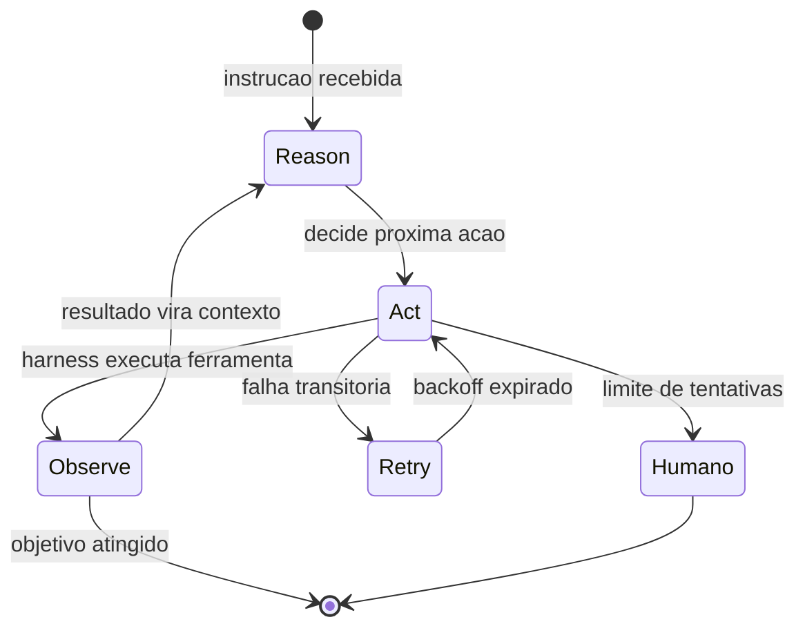

# Capítulo 5: O Ciclo ReAct e os Loops de Execução

## 1. Introdução

Nos quatro primeiros capítulos, você montou as duas primeiras peças do arnês — a âncora (testes determinísticos) e o capacete (guardrails) — e entendeu a anatomia do corpo que carrega o cérebro. Mas até aqui o agente ainda é uma peça de museu: nada que você construiu executa uma tarefa real de ponta a ponta. Neste capítulo, a escalada começa de verdade: você vai construir o **loop de execução** que transforma um modelo estático em um agente que age, observa e decide de novo.

Ao final deste capítulo, você será capaz de implementar um loop ReAct completo — Reason, Act, Observe — com execução de ferramentas, tratamento de erro e política de retentativa. Você vai entender por que o loop, e não a chamada única, é a unidade fundamental do trabalho agêntico, e por que a qualidade do harness no tratamento de erros decide se o agente termina a tarefa ou morre no meio da parede.

## 2. Explica

O ciclo **ReAct** — raciocinar, agir, observar — é o padrão canônico de execução agêntica, formalizado por Yao e colaboradores em 2022: em vez de o modelo apenas raciocinar sobre o problema (como em cadeias de pensamento puras) ou apenas agir (como em sistemas baseados em regras), o agente **alterna raciocínio e ação**, usando as observações do ambiente como novo contexto para o próximo raciocínio [4]. O paper demonstrou que essa sinergia supera ambos os modos isolados em tarefas que exigem conhecimento externo e raciocínio de múltiplos passos — a fundação empírica de praticamente todos os agentes modernos.

A estrutura do loop é enganosamente simples, e é exatamente aí que mora o perigo de subestimá-la. Em cada iteração, o agente: (1) recebe o contexto atual (instrução + histórico de ações e observações); (2) decide o próximo passo — raciocinar sobre o problema ou invocar uma ferramenta; (3) o harness executa a ação escolhida no mundo real (terminal, busca, API, arquivo); (4) o resultado da execução volta como observação; e (5) o ciclo repete até o objetivo ser atingido ou um limite ser alcançado [4][18]. O que parece um detalhe de implementação é, na verdade, a decisão arquitetural central: **quem executa a ação não é o modelo — é o harness**. O modelo propõe; o harness executa e devolve a realidade [18].

Por que a separação importa? Porque a execução é onde o modelo encontra o mundo — e o mundo não é determinístico. A ferramenta pode falhar, o arquivo pode não existir, a API pode retornar um erro. O harness precisa capturar essas observações de forma estruturada (sucesso ou falha, com o resultado bruto) e devolvê-las ao modelo como contexto. É essa realimentação que permite ao agente **corrigir o curso**: um agente que observa a falha da ferramenta e ajusta a próxima ação é qualitativamente diferente de um que repete a mesma ação esperando outro resultado — a diferença entre um loop e um beco sem saída [1][5].

O tratamento de erro merece destaque porque é o teste real do harness. Sem política de retentativa, uma falha transitória (timeout, servidor ocupado) mata a tarefa inteira; com retry infinito, uma falha permanente vira loop eterno de tokens. O design maduro combina três coisas: **retry com backoff** para falhas transitórias, **limite de tentativas** para nunca gastar sem teto, e **escalação para humano** quando o limite é atingido — a mesma filosofia de um time de produção, aplicada ao agente [19]. Equipes que rodam agentes em escala relatam execuções únicas de até seis horas; sem uma política de erro robusta, nenhuma execução longa sobrevive [1].

Uma observação sobre escala: 57% das organizações já têm agentes em produção, segundo pesquisa com mais de 1.300 profissionais — e o principal diferencial entre as que prosperam e as que estagnam não é o modelo, mas exatamente essa camada de execução: quem trata erro, quem observa de verdade e quem registra o que aconteceu [12]. O loop é simples; a engenharia do loop é que é difícil.

## 3. Ilustra

Volte à parede de escalada. O ciclo ReAct é o **ritmo do movimento do escalador**: ele olha a parede (Reason — decide o próximo apoio), move a mão ou o pé (Act — executa), sente o resultado (Observe — o apoio segura ou cede?) e repete. Nenhum escalador sobe uma parede com um único movimento calculado do chão — a parede é viva, cada apoio é diferente do que parecia à distância, e é a observação de cada resultado que informa o próximo movimento. O agente que tenta resolver a tarefa em uma única chamada é como o escalador que tenta pular a parede inteira de uma vez: só funciona em paredes que não existem [4].

A dupla camada aqui é necessária porque o ponto mais contraintuitivo é o tratamento de erro: as pessoas veem a falha como anomalia a ser evitada; na verdade, a falha é **combustível do loop**. A segunda analogia — o **piloto em voo por instrumentos**: o piloto (agente) segue o plano de voo (instrução), mas lê os instrumentos (observações) a cada instante. Quando um instrumento acusa desvio, o piloto não "continua no plano" — ele corrige a rota com base na leitura. E quando o instrumento falha, o protocolo manda tentar o procedimento alternativo, depois escalar para o copiloto (humano) — nunca simplesmente repetir a mesma ação esperando leitura diferente. O voo não é a sequência planejada no chão; é a sequência corrigida no ar. O mesmo vale para o agente: a tarefa não é o plano inicial; é o loop corrigido pela observação [4][5][18].



Como Escalador de Harnesses, você já percebe a pergunta de diagnóstico que vai usar: **o que acontece quando a ferramenta falha?** Se a resposta for "o agente tenta de novo para sempre" ou "a tarefa morre", o loop está mal construído. A resposta certa combina observação estruturada, retry com limite e escalação — e é exatamente isso que você vai implementar na próxima seção.

## 4. Técnica

### O Loop ReAct Completo com Ferramenta

Vamos construir o coração do agente: um loop ReAct com uma ferramenta (uma calculadora) e observação estruturada. O modelo é simulado com regras simples — mas a arquitetura do loop é idêntica à de produção: proponha, execute, observe, repita.

```python
"""Loop ReAct completo com ferramenta de calculadora e observacao estruturada."""

from __future__ import annotations

from dataclasses import dataclass
from typing import Callable


@dataclass
class Observacao:
    ok: bool
    conteudo: str
    origem: str


class ModeloSimulado:
    """Substituto do LLM: decide a acao pela instrucao (sem raciocinio real)."""

    def raciocinar(self, contexto: str) -> str:
        # Em producao: chamada ao LLM. Aqui, regra simples: chama a calculadora.
        if "quanto e 2+3*4" in contexto:
            return "usar_calculadora:2+3*4"
        if "quanto e 10-7" in contexto:
            return "usar_calculadora:10-7"
        return "finalizar"


class HarnessReAct:
    def __init__(self, modelo: ModeloSimulado, max_iteracoes: int = 10) -> None:
        self.modelo = modelo
        self.max_iteracoes = max_iteracoes
        self.historico: list[str] = []
        self.ferramentas: dict[str, Callable[[str], Observacao]] = {
            "calculadora": self._calculadora,
        }

    def _calculadora(self, expressao: str) -> Observacao:
        try:
            resultado = eval(expressao, {"__builtins__": {}}, {})  # noqa: S307 — exemplo didatico
            return Observacao(True, str(resultado), "calculadora")
        except Exception as exc:  # noqa: BLE001
            return Observacao(False, str(exc), "calculadora")

    def executar_ferramenta(self, nome: str, argumento: str) -> Observacao:
        ferramenta = self.ferramentas.get(nome)
        if ferramenta is None:
            return Observacao(False, f"ferramenta desconhecida: {nome}", "harness")
        return ferramenta(argumento)

    def rodar(self, instrucao: str) -> str:
        contexto = f"instrucao: {instrucao}"
        for _ in range(self.max_iteracoes):
            acao = self.modelo.raciocinar(contexto)
            if acao == "finalizar":
                return "objetivo atingido"
            if acao.startswith("usar_"):
                _, nome, argumento = acao.partition(":")
                observacao = self.executar_ferramenta(nome, argumento)
                self.historico.append(f"{nome}({argumento}) -> {observacao.conteudo}")
                contexto += f" | obs: {observacao.conteudo}"
        return "limite de iteracoes atingido"


def main() -> None:
    harness = HarnessReAct(ModeloSimulado())
    resultado = harness.rodar("Quanto e 2+3*4 e depois quanto e 10-7?")
    print(f"Resultado: {resultado}")
    print("Historico de execucao:")
    for passo in harness.historico:
        print(f"  {passo}")


if __name__ == "__main__":
    main()
```

Execute e observe a essência do loop: cada resposta da ferramenta vira contexto para a próxima decisão — o agente não "lembra" da resposta, o harness a injeta no contexto. Essa é a diferença entre uma chamada única e um sistema agêntico [4][18].

### O Executor de Ferramentas com Resultado Estruturado

A execução de ferramentas precisa de um contrato claro: entrada (nome + argumento) e saída (sucesso + conteúdo). O bloco abaixo mostra por que o resultado estruturado importa — ele permite ao loop distinguir "a ferramenta respondeu 5" de "a ferramenta quebrou" [19].

```python
"""Executor de ferramentas com contrato estruturado de saida."""

from __future__ import annotations

from dataclasses import dataclass


@dataclass
class ResultadoFerramenta:
    sucesso: bool
    dados: str
    erro: str = ""


class Executor:
    def __init__(self) -> None:
        self.registros: list[str] = []

    def executar(self, nome: str, argumento: str) -> ResultadoFerramenta:
        self.registros.append(f"{nome} {argumento}")
        if nome == "terminal":
            # Simula um comando que pode falhar (arquivo inexistente).
            if argumento.startswith("cat"):
                return ResultadoFerramenta(False, "", f"arquivo nao encontrado: {argumento}")
            return ResultadoFerramenta(True, f"$ {argumento} -> ok")
        if nome == "busca":
            return ResultadoFerramenta(True, f"3 resultados para '{argumento}'")
        return ResultadoFerramenta(False, "", f"ferramenta desconhecida: {nome}")


def main() -> None:
    executor = Executor()

    for nome, argumento in [("terminal", "ls"), ("terminal", "cat inexistente"), ("busca", "harness")]:
        resultado = executor.executar(nome, argumento)
        estado = "OK" if resultado.sucesso else f"ERRO: {resultado.erro}"
        print(f"  {nome}({argumento}) -> {estado}")

    print(f"\nRegistros: {len(executor.registros)} chamada(s) executada(s)")


if __name__ == "__main__":
    main()
```

O resultado estruturado (sucesso/erro separados dos dados) é o que permite ao loop tomar decisões: falha transitória → retry; falha permanente → escalar; sucesso → seguir. Sem essa estrutura, o agente não consegue distinguir "a resposta é vazia" de "a ferramenta quebrou" — e essa distinção é a diferença entre corrigir o curso e repetir o erro [5][19].

### O Retry com Backoff e Limite de Tentativas

A política de retentativa é o que separa um loop que sobrevive de um que queima tokens. O bloco abaixo implementa retry com backoff exponencial, limite de tentativas e escalação para humano.

```python
"""Politica de retry: backoff exponencial, limite e escalacao humana."""

from __future__ import annotations

import time


def chamada_instavel(tentativa: int) -> str:
    """Simula uma API que falha nas duas primeiras tentativas."""
    if tentativa <= 2:
        raise TimeoutError("servidor ocupado")
    return "resposta_ok"


def executar_com_retry(
    funcao: object,  # noqa: ARG001 — recebida por clareza didatica
    max_tentativas: int = 4,
    backoff_base: float = 0.5,
) -> str:
    import inspect
    for tentativa in range(1, max_tentativas + 1):
        try:
            # `funcao` e ignorado: usamos a chamada instavel diretamente
            # para manter o exemplo autossuficiente e executavel.
            return chamada_instavel(tentativa)
        except TimeoutError as exc:
            espera = backoff_base * (2 ** (tentativa - 1))
            print(f"  tentativa {tentativa} falhou ({exc}); aguardando {espera}s")
            time.sleep(espera)
    raise RuntimeError("escalar para humano: limite de tentativas atingido")


def main() -> None:
    try:
        resultado = executar_com_retry(chamada_instavel)
        print(f"Resultado final: {resultado}")
    except RuntimeError as erro:
        print(f"Escalacao: {erro}")


if __name__ == "__main__":
    main()
```

Repare nos três componentes da política: o **backoff exponencial** (espera dobra a cada tentativa, respeitando o servidor), o **limite** (nunca tenta sem teto) e a **escalação** (o harness diz explicitamente "preciso de humano" em vez de falhar em silêncio). É essa combinação que permite a um agente trabalhar por horas — como as execuções de até seis horas relatadas em produção [1] — sem morrer na primeira falha transitória e sem queimar tokens em falha permanente [19].

### O Roteiro de Instalação do Loop

1. **Defina o contrato da ferramenta**: entrada (nome + argumento) e saída (sucesso + dados + erro) [19].
2. **Implemente o ciclo completo**: Reason → Act → Observe, com observação injetada no contexto a cada iteração [4].
3. **Adicione a política de retry**: backoff exponencial, limite de tentativas e escalação para humano [1][19].
4. **Registre o histórico**: cada ação e observação na trilha, para auditoria e depuração [12].
5. **Conecte guardrails do Capítulo 4**: o ponto de execução é o mesmo ponto de classificação de ações permitidas.

## 5. Aplica

### A Cena de Contraste: O Loop Que Nunca Termina

Você colocou um agente para consolidar relatórios mensais: ele deve buscar dados de três fontes, cruzar e gerar um resumo. Na primeira execução, o agente tenta buscar na fonte A — a API responde 503 (servidor ocupado). O agente, sem política de retry, registra o erro como "dados ausentes" e segue para a fonte B, gerando um relatório incompleto que ninguém percebe até a reunião de fechamento. Na segunda execução, você adiciona retry infinito para "resolver" — e o agente passa seis horas tentando a mesma chamada à fonte A a cada segundo, queimando tokens sem nenhuma observação nova. Os dois erros são o mesmo erro visto de lados opostos: **sem política de erro, o harness não sabe distinguir falha transitória de falha permanente** — e, sem essa distinção, ou o agente desiste cedo demais ou insiste para sempre.

O diagnóstico, ligando à teoria: faltava a política de retentativa. A correção prática: backoff exponencial (0,5s, 1s, 2s...) com limite de 4 tentativas, distinção entre timeout (retry) e erro permanente (escalar), e escalação para humano com o contexto da falha. Na terceira execução, a fonte A respondeu na terceira tentativa, o relatório saiu completo em minutos — e o log mostrava exatamente o que tinha acontecido [1][19].

### Armadilhas Comuns no Loop de Execução

- **Chamada única "direta ao modelo"**: sem loop, sem observação, sem correção de curso — o agente é um LLM com prompt bonito [4].
- **Retry infinito**: falha permanente vira gasto infinito; sempre limite + backoff [19].
- **Erro tratado como dado**: registrar "503" como conteúdo da resposta faz o agente raciocinar sobre um erro como se fosse fato [5].
- **Sem registro do histórico**: quando o agente erra, não há como saber o que ele viu; a trilha é a memória de auditoria [12].
- **Executar sem guardrails**: o ponto de execução do loop deve ser o mesmo ponto de classificação de ações do Capítulo 4 — senão o loop foge do capacete [16][20].

### Métricas Que Você Deve Acompanhar

| Métrica | Valor de referência | Fonte |
|---|---|---|
| Execuções únicas de longa duração | até 6 horas | OpenAI [1] |
| Organizações com agentes em produção | 57% | LangChain [12] |
| Equipes com observabilidade | 89% | LangChain [12] |

### Exercícios de Fixação

**Exercício 1 — Loop com ferramenta real.** Substitua a calculadora do `HarnessReAct` deste capítulo por uma ferramenta que lê um arquivo JSON de configuração. A observação deve voltar estruturada: sucesso, conteúdo ou erro — nunca um texto ambíguo que o modelo precise adivinhar [5][19].

```python
"""Exercicio: ferramenta de leitura de arquivo com observacao estruturada."""

from __future__ import annotations

import json
from dataclasses import dataclass
from pathlib import Path


@dataclass
class Observacao:
    ok: bool
    conteudo: str
    origem: str


class FerramentaArquivo:
    def ler_json(self, caminho: str) -> Observacao:
        try:
            dados = json.loads(Path(caminho).read_text(encoding="utf-8"))
            return Observacao(True, json.dumps(dados, ensure_ascii=False), caminho)
        except FileNotFoundError:
            return Observacao(False, f"arquivo nao encontrado: {caminho}", caminho)
        except json.JSONDecodeError as exc:
            return Observacao(False, f"json invalido: {exc}", caminho)


def main() -> None:
    ferramenta = FerramentaArquivo()
    for caminho in ["config_ok.json", "config_ausente.json"]:
        obs = ferramenta.ler_json(caminho)
        print(f"{caminho}: {'OK' if obs.ok else 'ERRO'} -> {obs.conteudo[:60]}")


if __name__ == "__main__":
    main()
```

**Exercício 2 — O ciclo completo.** Expanda o loop do capítulo para usar a ferramenta do Exercício 1 e rode três execuções: uma com arquivo válido, uma com arquivo ausente e uma com JSON malformado. Registre o histórico e descreva como o agente corrigiria o curso em cada caso.

**Exercício 3 — Limite e escalação.** Configure o loop com `max_iteracoes=3` e uma ferramenta que sempre falha. Observe o comportamento: o loop deve terminar com "limite de iteracoes atingido" ou escalar — nunca girar para sempre. Documente o custo de tokens economizado em relação a um retry infinito [1][19].

## 6. Conclusão

Você instalou o motor da escalada. Recapitulando os três pontos centrais: o **loop ReAct é a unidade fundamental do trabalho agêntico** — raciocinar, agir, observar, repetir, com a observação realimentando o contexto [4][18]; a **execução de ferramentas tem contrato estruturado** — sucesso/erro separados, para o loop decidir com informação [19]; e a **política de retry com limite e escalação** é o que permite execuções longas sem morrer na falha transitória nem queimar tokens na permanente [1][19].

O desafio para você: conecte o loop deste capítulo aos guardrails do Capítulo 4 — a execução deve passar pela classificação de ações — e adicione uma ferramenta real (ler um arquivo, por exemplo) com retry e trilha. No próximo capítulo, você vai isolar o motor: sandboxes, permissões e o controle fino de execução que permitem ao agente fazer muito sem poder fazer qualquer coisa.

## 7. Referências Bibliográficas

[1] OPENAI. *Harness engineering: leveraging Codex in an agent-first world*. Disponível em: https://openai.com/index/harness-engineering/. Acesso em: 09 ago. 2026.
[2] JIM, Carlos et al. *SWE-bench: Can Language Models Resolve Real-world GitHub Issues?* Disponível em: https://arxiv.org/abs/2310.06770. Acesso em: 09 ago. 2026.
[3] ALEITHAN, Ali et al. *SWE-Bench+: Enhanced Coding Benchmark for LLMs*. Disponível em: https://arxiv.org/abs/2410.06992. Acesso em: 09 ago. 2026.
[4] YAO, Shunyu et al. *ReAct: Synergizing Reasoning and Acting in Language Models*. Disponível em: https://arxiv.org/abs/2210.03629. Acesso em: 09 ago. 2026.
[5] BÖCKELER, Birgitta. *Harness engineering for coding agent users*. Disponível em: https://martinfowler.com/articles/harness-engineering.html. Acesso em: 09 ago. 2026.
[6] TRIVEDY, Vivek. *The Anatomy of an Agent Harness*. Disponível em: https://www.langchain.com/blog/the-anatomy-of-an-agent-harness. Acesso em: 09 ago. 2026.
[7] DATABRICKS ENGINEERING. *What is an AI Agent Harness?* Disponível em: https://www.databricks.com/blog/ai-harness. Acesso em: 09 ago. 2026.
[8] AI-BOOST. *Awesome Harness Engineering*. Disponível em: https://github.com/ai-boost/awesome-harness-engineering. Acesso em: 09 ago. 2026.
[9] GOOGLE CLOUD / DORA. *Accelerate State of DevOps Report 2024*. Disponível em: https://dora.dev/research/2024/dora-report/. Acesso em: 09 ago. 2026.
[10] GARTNER. *Gartner Predicts Over 40 Percent of Agentic AI Projects Will Be Canceled by End of 2027*. Disponível em: https://www.gartner.com/en/newsroom/press-releases/2025-06-25-gartner-predicts-over-40-percent-of-agentic-ai-projects-will-be-canceled-by-end-of-2027. Acesso em: 09 ago. 2026.
[11] GARTNER. *Gartner Predicts 40 Percent of Enterprise Apps Will Feature Task-Specific AI Agents by 2026*. Disponível em: https://www.gartner.com/en/newsroom/press-releases/2025-08-26-gartner-predicts-40-percent-of-enterprise-apps-will-feature-task-specific-ai-agents-by-2026-up-from-less-than-5-percent-in-2025. Acesso em: 09 ago. 2026.
[12] LANGCHAIN. *State of Agent Engineering 2026*. Disponível em: https://www.langchain.com/state-of-agent-engineering. Acesso em: 09 ago. 2026.
[13] ANTHROPIC. *Introducing the Model Context Protocol*. Disponível em: https://www.anthropic.com/news/model-context-protocol. Acesso em: 09 ago. 2026.
[14] RED HAT PRODUCT SECURITY (CANO GABARDA, F.). *Model Context Protocol (MCP): Understanding security risks and controls*. Disponível em: https://www.redhat.com/en/blog/model-context-protocol-mcp-understanding-security-risks-and-controls. Acesso em: 09 ago. 2026.
[15] EMBRACE THE RED. *MCP: Untrusted Servers and Confused Clients, Plus a Sneaky Exploit*. Disponível em: https://embracethered.com/blog/posts/2025/model-context-protocol-security-risks-and-exploits/. Acesso em: 09 ago. 2026.
[16] UTESVSKY, Roy (Adversa AI). *SymJack: The approval prompt is lying to you*. Disponível em: https://adversa.ai/blog/the-approval-prompt-is-lying-to-you-symlink-rce-in-five-ai-coding-agents-claude-code-cursor-antigravity-copilot-grok-build/. Acesso em: 09 ago. 2026.
[17] LASSO SECURITY (OXENBERG, O.; SUISA, E.). *Claude Code Security: Protect Autonomous Coding Agents*. Disponível em: https://www.lasso.security/blog/claude-code-security. Acesso em: 09 ago. 2026.
[18] NING, X. et al. *Code as Agent Harness: Toward Executable, Verifiable, and Stateful Agent Systems*. Disponível em: https://arxiv.org/html/2605.18747v1. Acesso em: 09 ago. 2026.
[19] HU, W. *Architectural Design Decisions in AI Agent Harnesses*. Disponível em: https://arxiv.org/html/2604.18071v1. Acesso em: 09 ago. 2026.
[20] OWASP FOUNDATION. *OWASP Top 10 for Large Language Model Applications*. Disponível em: https://owasp.org/www-project-top-10-for-large-language-model-applications/. Acesso em: 09 ago. 2026.
