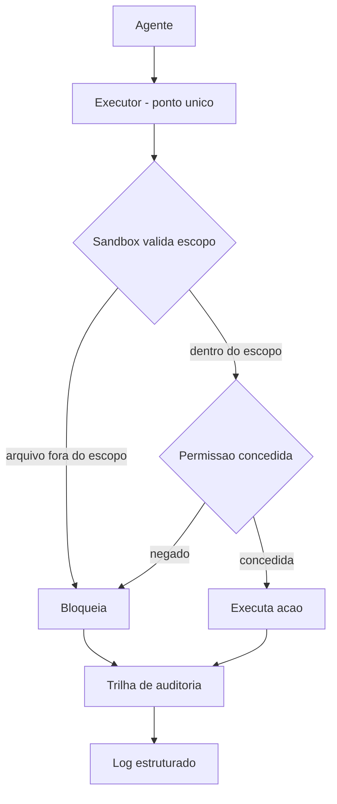

# Capítulo 6: Sandboxes, Permissões e o Controle de Execução

## 1. Introdução

No Capítulo 5, você colocou o motor em funcionamento: o loop ReAct que executa ferramentas, observa resultados e corrige o curso. Mas o motor está solto no chão da oficina — e um motor solto é perigoso. Neste capítulo, você vai construir o **berço de contenção** do agente: o isolamento de execução que garante que, aconteça o que acontecer dentro do loop, o estrago nunca ultrapasse um limite desenhado por você.

Ao final deste capítulo, você será capaz de isolar a execução do agente em uma sandbox com escopo de arquivos e rede, conceder permissões mínimas por tarefa (nada de token global) e manter uma trilha de auditoria estruturada de cada ação. Você vai entender por que "o agente roda na minha máquina" é uma frase de risco, e por que o isolamento é a diferença entre um erro que se aprende e um incidente que se apaga.

## 2. Explica

O isolamento de execução parte de uma pergunta simples: **qual é o maior estrago que uma única ação errada do agente pode causar?** Se a resposta é "apagar arquivos do servidor", "acessar credenciais" ou "enviar dados para fora", o agente está rodando sem contenção — cada execução é uma roleta. A sandbox existe para tornar essa resposta pequena e previsível por construção: o agente executa em um ambiente descartável, com acesso restrito a arquivos, rede e recursos, e qualquer dano fica contido nesse ambiente [7][19].

As tecnologias de isolamento formam um espectro de rigidez crescente. No nível mais leve, um **diretório de trabalho dedicado** limita o escopo de arquivos. Acima dele, **contêineres** (Docker) isolam processos, arquivos e rede com overhead moderado — o padrão de facto para rodar agentes de código em CI. No topo, **microVMs** (Firecracker, gVisor) isolam no nível de kernel virtualizado, com o maior isolamento por processo — usadas quando o agente executa código arbitrário ou não confiável [17][19]. A escolha não é "o melhor", é "o suficiente para o seu risco": o que importa é que a execução do agente **não compartilhe o ambiente do operador**.

A segunda peça do controle é a **política de permissões**: o princípio do menor privilégio aplicado a agentes. Um agente não deve herdar as permissões de quem o invoca — deve receber um token escopado, com acesso mínimo aos recursos da tarefa. A pesquisa de segurança sobre agentes de codificação é categórica sobre o custo de ignorar isso: agentes com privilégios amplos são o vetor favorito de incidentes, e o escopo restrito de tokens por sessão é uma das defesas fundamentais [17]. Na prática, isso significa: nenhum token global, nenhum diretório liberado, nenhum modo autônomo irrestrito em produção [17][20].

A terceira peça é a **trilha de auditoria**: o registro estruturado de cada ação do agente — que arquivo leu, que comando executou, que API chamou, com timestamp e resultado. A trilha serve a dois propósitos complementares: a **correção** (quando algo dá errado, você reconstrói exatamente o que aconteceu) e a **conformidade** (auditores e reguladores perguntam "o que o sistema fez?", e a resposta precisa existir) [12]. A pesquisa de mercado mostra que 89% das organizações já têm observabilidade em produção — a trilha é a fundação dela [12]. E o relatório DORA 2024 conecta o ponto: times que aceleram sem visibilidade da entrega perdem estabilidade; a auditoria é o que transforma velocidade em velocidade segura [9].

Há uma consequência arquitetural importante: as três peças se **conectam no mesmo ponto de execução** que você construiu no Capítulo 5. Toda ação do loop passa pelo executor — é ali que a sandbox valida o escopo, que a política de permissão concede ou nega, e que a trilha registra o evento. Um harness com isolamento, permissões e auditoria no ponto de execução é qualitativamente diferente de um que aplica as três peças como enfeites separados: a contenção precisa ser **no caminho crítico da ação**, não ao redor dela.

## 3. Ilustra

Volte à escalada. A sandbox é a **via fechada com rede de proteção lateral**: o escalador (agente) treina em um trecho de parede cercado por telas que limitam a queda a poucos metros, em vez de um precipício aberto. A rede não limita a técnica — limita a consequência do erro. O escalador pode tentar movimentos novos (ações novas), falhar, e o custo da falha é sempre o mesmo e pequeno. Sem a via fechada, cada tentativa arriscada é potencialmente a última: você não ousa tentar, e não tenta, não aprende. A sandbox é o que permite ao agente **ser ousado com segurança** — tentar mais, porque errar é barato [7][17].

A dupla camada aqui é necessária porque o ponto mais contraintuitivo é a relação entre permissões e produtividade: as pessoas assumem que restringir o agente o torna menos capaz. A segunda analogia — o **cartão de acesso do data center**: o técnico (agente) entra no prédio (sistema) com um cartão que libera apenas as salas do seu trabalho — não a sala dos servidores de produção, não a sala de backups, não a central de credenciais. O cartão não torna o técnico menos competente; torna o prédio mais seguro sem custar nada à produtividade dele nas salas que importam. E, se algo der errado, o registro de catraca (trilha de auditoria) mostra exatamente por onde ele passou. O agente com token global é o técnico com chave-mestra: eficiente em tudo, responsável por nada [17][20].



Como Escalador de Harnesses, você já percebe a pergunta de inspeção: **qual é o cartão de acesso do agente?** Se ele roda com as mesmas permissões de quem o invoca, o cartão é a chave-mestra — e o "prédio" inteiro está em risco a cada execução.

## 4. Técnica

### A Sandbox de Escopo de Arquivos e Rede

Vamos construir a contenção. O primeiro bloco implementa uma sandbox que restringe o acesso a arquivos (com resolução de caminhos, como no Capítulo 4) e bloqueia operações de rede sensíveis — a versão embrionária do ambiente descartável.

```python
"""Sandbox: isola arquivos e rede do agente em um escopo desenhado."""

from __future__ import annotations

from pathlib import Path


class Sandbox:
    def __init__(self, raiz: Path, rede_permitida: set[str] | None = None) -> None:
        self.raiz = raiz.resolve()
        self.raiz.mkdir(parents=True, exist_ok=True)
        self.rede_permitida = rede_permitida or set()

    def _dentro_do_escopo(self, caminho: Path) -> bool:
        try:
            resolvido = (self.raiz / caminho).resolve()
        except OSError:
            return False
        return self.raiz in resolvido.parents or resolvido == self.raiz

    def ler(self, caminho: str) -> str:
        alvo = Path(caminho)
        if not self._dentro_do_escopo(alvo):
            return "BLOQUEADO (arquivo fora da sandbox)"
        return f"LIDO: {caminho}"

    def escrever(self, caminho: str, conteudo: str) -> str:
        alvo = Path(caminho)
        if not self._dentro_do_escopo(alvo):
            return "BLOQUEADO (escrita fora da sandbox)"
        (self.raiz / alvo).write_text(conteudo, encoding="utf-8")
        return f"ESCRITO: {caminho}"

    def acessar_rede(self, host: str) -> str:
        if host not in self.rede_permitida:
            return f"BLOQUEADO (rede nao permitida: {host})"
        return f"CONECTADO: {host}"


def main() -> None:
    sandbox = Sandbox(Path("sandbox_agente"), rede_permitida={"api.tarefa.com"})

    print(sandbox.escrever("nota.txt", "dados"))
    print(sandbox.escrever("../fora.txt", "vazamento"))
    print(sandbox.ler("/etc/passwd"))
    print(sandbox.acessar_rede("api.tarefa.com"))
    print(sandbox.acessar_rede("api.evil.com"))


if __name__ == "__main__":
    main()
```

Execute e observe o padrão deny by default aplicado à rede: só os hosts da lista são alcançáveis; tudo o mais é bloqueado por construção. Essa é a essência da sandbox — **permitir o mínimo, bloquear o resto** — e é o que mantém o blast radius pequeno mesmo quando o agente tenta o que não deveria [7][19].

### O Gerenciador de Permissões por Tarefa

O cartão de acesso do agente: permissões concedidas por tarefa, nunca globais. O bloco abaixo implementa um gerenciador que concede acesso mínimo a recursos nomeados e nega qualquer coisa fora da lista.

```python
"""Gerenciador de permissoes: menor privilegio por tarefa."""

from __future__ import annotations

from dataclasses import dataclass, field


@dataclass
class Tarefa:
    nome: str
    recursos_permitidos: set[str] = field(default_factory=set)


class GerenciadorPermissoes:
    def __init__(self) -> None:
        self.tarefas: dict[str, Tarefa] = {}

    def registrar(self, tarefa: Tarefa) -> None:
        self.tarefas[tarefa.nome] = tarefa

    def conceder(self, tarefa_nome: str, recurso: str) -> bool:
        tarefa = self.tarefas.get(tarefa_nome)
        if tarefa is None:
            return False
        return recurso in tarefa.recursos_permitidos

    def token_escopado(self, tarefa_nome: str) -> str:
        # Em producao: token JWT com claims limitados a tarefa_nome.
        recursos = self.tarefas.get(tarefa_nome, Tarefa(tarefa_nome)).recursos_permitidos
        return f"token:{tarefa_nome}:{','.join(sorted(recursos))}"


def main() -> None:
    gerente = GerenciadorPermissoes()
    gerente.registrar(Tarefa("consolidar-relatorio", {"ler:relatorios", "api:bi"}))

    for recurso in ["ler:relatorios", "api:bi", "deletar:banco"]:
        print(f"  conceder('consolidar-relatorio', '{recurso}') -> "
              f"{gerente.conceder('consolidar-relatorio', recurso)}")

    print(f"\nToken escopado: {gerente.token_escopado('consolidar-relatorio')}")


if __name__ == "__main__":
    main()
```

Repare no token escopado: ele carrega *apenas* os recursos da tarefa — se vazar, o estrago é limitado a "ler relatórios" e "chamar a API de BI". Essa é a defesa central contra o vetor mais comum de incidentes: o token global que, uma vez comprometido, compromete tudo [17][20].

### A Trilha de Auditoria Estruturada

A memória de auditoria do agente: eventos estruturados em JSON, prontos para consulta, revisão e conformidade. O bloco abaixo registra cada ação com timestamp, recurso e resultado.

```python
"""Trilha de auditoria: eventos estruturados de cada acao do agente."""

from __future__ import annotations

import json
import time
from dataclasses import asdict, dataclass, field


@dataclass
class EventoAuditoria:
    acao: str
    recurso: str
    resultado: str
    tarefa: str
    instante: float = field(default_factory=time.time)


class TrilhaDeAuditoria:
    def __init__(self) -> None:
        self.eventos: list[EventoAuditoria] = []

    def registrar(self, evento: EventoAuditoria) -> None:
        self.eventos.append(evento)

    def exportar(self, caminho: str) -> None:
        with open(caminho, "w", encoding="utf-8") as arquivo:
            json.dump([asdict(e) for e in self.eventos], arquivo, ensure_ascii=False, indent=2)

    def resumo(self) -> str:
        return f"{len(self.eventos)} evento(s) registrado(s)"


def main() -> None:
    trilha = TrilhaDeAuditoria()
    trilha.registrar(EventoAuditoria("ler", "relatorios/julho.json", "ok", "consolidar-relatorio"))
    trilha.registrar(EventoAuditoria("api", "bi", "ok", "consolidar-relatorio"))
    trilha.registrar(EventoAuditoria("deletar", "banco", "BLOQUEADO", "consolidar-relatorio"))

    trilha.exportar("trilha_auditoria.json")
    print(trilha.resumo())
    print("Trilha exportada com cada acao, recurso, resultado e tarefa.")


if __name__ == "__main__":
    main()
```

A trilha é o que torna o agente **auditável e corrigível**: quando algo der errado, você reconstrói a sequência exata; quando um auditor perguntar, a resposta existe em formato estruturado [12][19]. Sem ela, "o agente fez algo" é uma afirmação sem prova — e sem prova não há correção possível.

### O Roteiro de Contenção do Agente

1. **Escolha o nível de isolamento**: diretório dedicado, contêiner ou microVM, conforme o risco da tarefa [19].
2. **Aplique deny by default em tudo**: arquivos, rede, ferramentas — o não-listado é bloqueado [20].
3. **Escope o token por tarefa**: claims mínimos, revogáveis, sem escopo global [17].
4. **Registre tudo no ponto de execução**: a trilha vive no mesmo executor do loop do Capítulo 5 [12].
5. **Teste a contenção**: tente escapar — escrever fora, acessar host proibido — e confirme o bloqueio.

## 5. Aplica

### A Cena de Contraste: O Agente com a Chave-Mestra

Sua empresa adotou um agente de automação de testes. Na configuração inicial, "para simplificar", o agente roda com as credenciais do CI — que têm acesso a praticamente tudo: repositórios, deploys, variáveis de ambiente com chaves de API. Na segunda semana, um teste mal escrito faz o agente executar um comando que apaga um bucket de armazenamento de um ambiente de homologação. A perda é recuperável, mas o pânico revela o problema real: ninguém sabia o que o agente *podia* fazer, e o que ele *tinha feito* — a trilha era um log de texto corrido que ninguém lia. O incidente não foi causado pelo comando errado; foi causado pelo cartão de acesso certo demais.

O diagnóstico, ligando à teoria: o agente rodava com permissões amplas (chave-mestra), sem sandbox de escopo e sem trilha estruturada. A correção prática: mover a execução para um contêiner efêmero com escopo de arquivos do workspace, criar um token por tarefa com acesso mínimo ao bucket certo e ativar a trilha estruturada no executor. Na semana seguinte, um comando destrutivo foi bloqueado pela sandbox, o evento apareceu na trilha com tarefa e resultado, e a equipe soube — em segundos, não em dias — o que o agente tinha tentado [17][20].

### Armadilhas Comuns no Controle de Execução

- **Credenciais do operador**: o agente com as permissões de quem o invoca é o incidente mais previsível do harness [17].
- **Sandbox de mentira**: restringir arquivos mas liberar rede (ou vice-versa) é contenção parcial; o escopo precisa cobrir todas as dimensões [19].
- **Token global "para o agente fazer tudo"**: a conveniência de hoje é o vazamento de amanhã; escopo por tarefa [17].
- **Trilha que ninguém lê**: log sem estrutura não é auditoria; eventos em JSON consultáveis é que são [12].
- **Isolar depois**: adicionar a sandbox após o incidente é aprender no caro; a contenção entra na primeira versão [20].

### Métricas Que Você Deve Acompanhar

| Métrica | Valor de referência | Fonte |
|---|---|---|
| Segurança como principal preocupação (grandes empresas) | ~25% | LangChain [12] |
| Equipes com observabilidade | 89% | LangChain [12] |
| Projetos de agentes cancelados até 2027 (risco) | >40% | Gartner [10] |

### O Dilema do Escopo: o Agente Que Precisa de Tudo

Um dos debates mais frequentes na operação de harnesses é a tensão entre **isolamento rígido** e **utilidade real**. O agente de suporte precisa ler o banco; o agente de deploy precisa tocar produção; o agente de marketing precisa publicar. Se o sandbox isola demais, o agente não faz o trabalho; se isola de menos, o risco volta. A resolução não é um meio-termo difuso — é a separação em três zonas que o arquiteto de harness usa na prática [6][19]:

- **Zona segura**: tudo pode ser executado sem aprovação (leitura de dados públicos, testes em ambiente de desenvolvimento, geração de conteúdo). É aqui que o agente trabalha a maior parte do tempo [19].
- **Zona controlada**: execução condicionada a políticas automáticas (escopo, horário, limiar de custo, classificação da ação pelo guardrail do Capítulo 4) [19].
- **Zona sensível**: qualquer toque exige aprovação humana explícita e registrada (produção, dados pessoais, exclusões, deploys) [16][19].

```python
"""Tres zonas de execucao: segura, controlada e sensivel."""

from __future__ import annotations

from dataclasses import dataclass


@dataclass
class Acao:
    nome: str
    zona: str


ZONAS = {"segura": "executar sem aprovacao", "controlada": "exigir politica", "sensivel": "exigir humano"}


def rotear(acao: Acao) -> str:
    if acao.zona not in ZONAS:
        return "zona desconhecida: bloquear"
    if acao.zona == "controlada":
        return f"{acao.nome}: aplicar politica automatica antes de executar"
    if acao.zona == "sensivel":
        return f"{acao.nome}: aguardar aprovacao humana registrada"
    return f"{acao.nome}: executar em sandbox"


def main() -> None:
    acoes = [Acao("ler_dados_publicos", "segura"), Acao("atualizar_dev", "controlada"), Acao("deploy_prod", "sensivel")]
    for acao in acoes:
        print(rotear(acao))


if __name__ == "__main__":
    main()
```

A beleza do modelo de zonas é que ele muda a pergunta. Em vez de "o agente pode ou não tocar produção?" — que não tem resposta única — a pergunta vira "qual zona esta ação ocupa, e qual é a política dessa zona?". O harness não precisa julgar intenção; ele precisa classificar e aplicar política. É essa mudança de julgamento para classificação que torna o controle de execução auditável e automatizável [6][19].

Um detalhe prático que separa os harnesses maduros dos improvisados: a zona não é decidida na hora, pela frase do prompt — ela é **declarada na ferramenta**, antes da execução. O arquivo de configuração do harness lista cada ferramenta com sua zona e sua política (sandbox, controlada ou sensível). Quando o agente pede para executar, o harness olha a declaração, não o contexto da conversa. É essa separação entre a intenção do modelo e a declaração do engenheiro que impede o golpe de prompt: mesmo que o agente seja convencido a "fazer o deploy", a ferramenta de deploy nasceu declarada como zona sensível — e a declaração não muda por persuasão [14][16][19]. Quem ignora essa separação acaba com a zona decidida na conversa — e a conversa é exatamente o que o adversário sabe manipular.

### Exercícios de Fixação

**Exercício 1 — Sandbox mínimo por política.** Implemente um sandbox conceitual que decide, por política, se uma ação é executada dentro do ambiente isolado ou bloqueada por exigir ambiente real. A separação política/execução é a lição central: o sandbox não decide o que é certo — ele aplica o que foi decidido [19].

```python
"""Exercicio: sandbox por politica (permitir no sandbox, bloquear no real)."""

from __future__ import annotations

from dataclasses import dataclass


@dataclass
class Acao:
    comando: str
    alvo: str


class PoliticaIsolamento:
    def __init__(self) -> None:
        self.sandbox: set[str] = {"build", "test"}
        self.reais: set[str] = {"deploy", "rm"}

    def decidir(self, acao: Acao) -> str:
        if acao.comando in self.sandbox:
            return "sandbox"
        if acao.comando in self.reais:
            return "bloqueado"
        return "aprovacao_humana"


def main() -> None:
    politica = PoliticaIsolamento()
    acoes = [Acao("build", "app"), Acao("deploy", "app"), Acao("diagnostico", "app")]
    for acao in acoes:
        print(f"{acao.comando} {acao.alvo} -> {politica.decidir(acao)}")


if __name__ == "__main__":
    main()
```

**Exercício 2 — Inventário de superfície.** Liste as ferramentas do seu agente e classifique cada uma em: (a) pode rodar em sandbox; (b) exige ambiente real com aprovação; (c) nunca deve ser oferecida ao agente. Você terá a base do arquivo de política do seu harness.

**Exercício 3 — Demonstração de dano.** Escolha uma ferramenta perigosa (por exemplo, um comando de exclusão) e escreva um cenário em que ela causaria dano se executada fora do sandbox. Documente qual controle — isolamento, permissão ou aprovação humana — o impediria, e teste o controle de fato [16][20].

## 6. Conclusão

Você construiu o berço de contenção. Recapitulando os três pontos centrais: o **isolamento em sandbox limita o blast radius por construção** — arquivos, rede e recursos restritos a um escopo desenhado [7][19]; as **permissões mínimas por tarefa** — o cartão de acesso, não a chave-mestra — são a defesa central contra o vetor mais comum de incidentes [17][20]; e a **trilha de auditoria estruturada** é o que torna o agente auditável e corrigível [12][19].

O desafio para você: mova a execução do seu agente (o do Capítulo 5) para dentro de uma sandbox com escopo de arquivos e rede, crie um token por tarefa e ative a trilha no executor. Depois, tente escapar — e confirme os três bloqueios. Com o motor isolado, o próximo passo da escalada é mental: no Capítulo 7, você vai ensinar o agente a manter o foco em tarefas longas, combatendo a degradação de contexto que derruba os loops que sobrevivem à falha mas morrem na confusão.

## 7. Referências Bibliográficas

[1] OPENAI. *Harness engineering: leveraging Codex in an agent-first world*. Disponível em: https://openai.com/index/harness-engineering/. Acesso em: 09 ago. 2026.
[2] JIM, Carlos et al. *SWE-bench: Can Language Models Resolve Real-world GitHub Issues?* Disponível em: https://arxiv.org/abs/2310.06770. Acesso em: 09 ago. 2026.
[3] ALEITHAN, Ali et al. *SWE-Bench+: Enhanced Coding Benchmark for LLMs*. Disponível em: https://arxiv.org/abs/2410.06992. Acesso em: 09 ago. 2026.
[4] YAO, Shunyu et al. *ReAct: Synergizing Reasoning and Acting in Language Models*. Disponível em: https://arxiv.org/abs/2210.03629. Acesso em: 09 ago. 2026.
[5] BÖCKELER, Birgitta. *Harness engineering for coding agent users*. Disponível em: https://martinfowler.com/articles/harness-engineering.html. Acesso em: 09 ago. 2026.
[6] TRIVEDY, Vivek. *The Anatomy of an Agent Harness*. Disponível em: https://www.langchain.com/blog/the-anatomy-of-an-agent-harness. Acesso em: 09 ago. 2026.
[7] DATABRICKS ENGINEERING. *What is an AI Agent Harness?* Disponível em: https://www.databricks.com/blog/ai-harness. Acesso em: 09 ago. 2026.
[8] AI-BOOST. *Awesome Harness Engineering*. Disponível em: https://github.com/ai-boost/awesome-harness-engineering. Acesso em: 09 ago. 2026.
[9] GOOGLE CLOUD / DORA. *Accelerate State of DevOps Report 2024*. Disponível em: https://dora.dev/research/2024/dora-report/. Acesso em: 09 ago. 2026.
[10] GARTNER. *Gartner Predicts Over 40 Percent of Agentic AI Projects Will Be Canceled by End of 2027*. Disponível em: https://www.gartner.com/en/newsroom/press-releases/2025-06-25-gartner-predicts-over-40-percent-of-agentic-ai-projects-will-be-canceled-by-end-of-2027. Acesso em: 09 ago. 2026.
[11] GARTNER. *Gartner Predicts 40 Percent of Enterprise Apps Will Feature Task-Specific AI Agents by 2026*. Disponível em: https://www.gartner.com/en/newsroom/press-releases/2025-08-26-gartner-predicts-40-percent-of-enterprise-apps-will-feature-task-specific-ai-agents-by-2026-up-from-less-than-5-percent-in-2025. Acesso em: 09 ago. 2026.
[12] LANGCHAIN. *State of Agent Engineering 2026*. Disponível em: https://www.langchain.com/state-of-agent-engineering. Acesso em: 09 ago. 2026.
[13] ANTHROPIC. *Introducing the Model Context Protocol*. Disponível em: https://www.anthropic.com/news/model-context-protocol. Acesso em: 09 ago. 2026.
[14] RED HAT PRODUCT SECURITY (CANO GABARDA, F.). *Model Context Protocol (MCP): Understanding security risks and controls*. Disponível em: https://www.redhat.com/en/blog/model-context-protocol-mcp-understanding-security-risks-and-controls. Acesso em: 09 ago. 2026.
[15] EMBRACE THE RED. *MCP: Untrusted Servers and Confused Clients, Plus a Sneaky Exploit*. Disponível em: https://embracethered.com/blog/posts/2025/model-context-protocol-security-risks-and-exploits/. Acesso em: 09 ago. 2026.
[16] UTESVSKY, Roy (Adversa AI). *SymJack: The approval prompt is lying to you*. Disponível em: https://adversa.ai/blog/the-approval-prompt-is-lying-to-you-symlink-rce-in-five-ai-coding-agents-claude-code-cursor-antigravity-copilot-grok-build/. Acesso em: 09 ago. 2026.
[17] LASSO SECURITY (OXENBERG, O.; SUISA, E.). *Claude Code Security: Protect Autonomous Coding Agents*. Disponível em: https://www.lasso.security/blog/claude-code-security. Acesso em: 09 ago. 2026.
[18] NING, X. et al. *Code as Agent Harness: Toward Executable, Verifiable, and Stateful Agent Systems*. Disponível em: https://arxiv.org/html/2605.18747v1. Acesso em: 09 ago. 2026.
[19] HU, W. *Architectural Design Decisions in AI Agent Harnesses*. Disponível em: https://arxiv.org/html/2604.18071v1. Acesso em: 09 ago. 2026.
[20] OWASP FOUNDATION. *OWASP Top 10 for Large Language Model Applications*. Disponível em: https://owasp.org/www-project-top-10-for-large-language-model-applications/. Acesso em: 09 ago. 2026.
