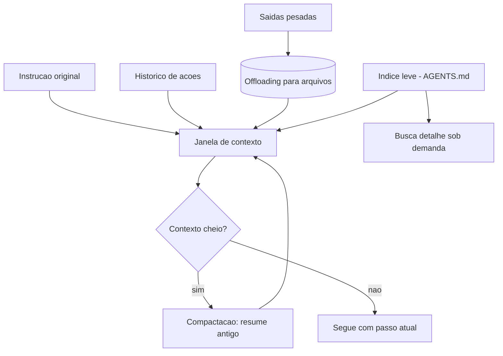

# Capítulo 7: Gestão de Contexto — Combatendo o Context Rot

## 1. Introdução

No Capítulo 6, você isolou a execução do agente: o motor agora roda em um berço de contenção, com permissões mínimas e trilha de auditoria. Mas há um inimigo que a sandbox não bloqueia — porque ele nasce dentro do próprio agente: a **degradação de contexto**. Tarefas longas começam bem e terminam mal, não porque o modelo ficou menos capaz, mas porque o contexto em que ele raciocina se deteriora a cada iteração: ruído se acumula, instruções antigas são esquecidas, decisões contraditórias se somam.

Ao final deste capítulo, você será capaz de manter um agente focado em tarefas de horas — usando compactação, offloading e divulgação progressiva para gerenciar o que entra na janela, e o loop de revisão interna para garantir que a entrega satisfaça critérios objetivos. Você vai entender por que "jogar tudo no prompt" é a causa mais comum de agentes que se perdem no meio da parede.

## 2. Explica

O **contexto** é a janela de atenção do modelo: tudo o que ele "vê" para raciocinar — a instrução, o histórico de ações e observações, os dados das ferramentas. Essa janela é finita e o seu conteúdo compete: cada token novo empurra informação antiga para fora ou a dilui. Em tarefas longas, esse processo tem um nome e uma mecânica bem documentados: **context rot** — a degradação progressiva da qualidade do raciocínio conforme o contexto se enche de ruído, resumos mal feitos e decisões contraditórias [6]. A anatomia do harness de agentes, descrita por engenheiros que constroem esses sistemas, trata a gestão de contexto como uma das camadas centrais — junto com arquivos, sandboxes e memória [6].

Por que o contexto degrada? Três mecanismos se somam. Primeiro, o **ruído cumulativo**: cada observação de ferramenta entra na janela e, mesmo "útil" na hora, vira lixo depois — o agente raciocina sobre o que é relevante agora, mas a janela está cheia do que foi relevante há uma hora. Segundo, a **perda de instrução**: a instrução original, que estava no topo, vai sendo empurrada para baixo por centenas de tokens de histórico — e o agente passa a otimizar o objetivo mais recente em vez do objetivo real. Terceiro, a **contradição acumulada**: decisões intermediárias registradas no contexto podem se contradizer conforme a informação chega, e o agente, sem distinguir o que é definitivo do que é provisório, oscila [6][19].

As três técnicas canônicas de combate formam um sistema: a **compactação** resume o que já foi feito e substitui o histórico bruto por um resumo — o agente mantém a essência sem o ruído; o **offloading** move dados pesados (saídas de ferramentas, arquivos grandes) para o sistema de arquivos, deixando na janela apenas um ponteiro ou um resumo consultável sob demanda; e a **divulgação progressiva** (progressive disclosure) inverte a lógica de "carregar tudo": o agente começa com um índice leve (um arquivo de instruções, um AGENTS.md) e busca os detalhes apenas quando precisa — em vez de injetar manuais gigantescos no início [6][8]. A curadoria da comunidade de harness engineering cataloga essas técnicas como padrões prontos, com implementações de referência [8].

O contexto de longa duração tem um componente adicional: o **estado persistente**. Lembre do Capítulo 2: o agente *stateful* guarda o estado no mundo (arquivos), não só na janela. A gestão de contexto e o estado persistente trabalham juntos — a janela carrega o que é necessário para o passo atual; o mundo carrega o que precisa sobreviver à tarefa inteira [18]. Execuções autônomas de até seis horas, como as relatadas pela equipe da OpenAI, só são possíveis porque o agente não tenta carregar a tarefa inteira na janela — ele carrega o passo, grava o progresso e retoma do arquivo quando precisa [1].

Por fim, o **loop de revisão interna** — o padrão Ralph Wiggum Loop, documentado na prática de produção: o agente revisa o próprio trabalho, submete a revisores (agentes ou humanos) e itera até satisfazer critérios objetivos, em vez de entregar na primeira tentativa [1]. Esse loop é o complemento natural da gestão de contexto: como o contexto é gerenciado, o agente consegue sustentar as iterações de revisão sem perder o fio — e como a revisão tem critérios, a entrega final é verificada, não apenas "completa".

## 3. Ilustra

Na escalada, a gestão de contexto é a **revisão do mapa no posto de avanço**: a cada trecho conquistado, o escalador para, consulta o mapa (estado persistente), anota o progresso e decide o próximo trecho — em vez de tentar decorar a parede inteira de uma vez. O escalador que tenta "carregar a parede toda na cabeça" confunde os trechos, esquece onde ancorou e repete caminhos. O mapa no bolso (arquivos) e a leitura só do trecho atual (janela) são o que tornam a escalada longa possível.

A dupla camada aqui é necessária porque o ponto mais contraintuitivo é a compactação: as pessoas temem que "resumir" o histórico perca informação importante. A segunda analogia — a **prancheta do maestro em uma ópera de quatro horas**: o maestro não lê a partitura inteira a cada compasso — ele tem a partitura completa no púlpito (arquivos), mas os olhos estão no compasso atual (janela). Quando uma cena termina, ele vira a página (compactação): o que importa da cena anterior é a transição, não cada nota. Se o maestro tentasse manter as quatro horas de partitura na memória de trabalho, erraria o compasso presente. O resumo não perde a ópera — perde o que já cumpriu o papel e mantém o que conecta [6][18].



Como Escalador de Harnesses, você já percebe a pergunta de diagnóstico: **o que acontece com o histórico depois de 50 passos?** Se a resposta é "continua tudo na janela" ou "o agente perde a instrução original", a gestão de contexto não existe — e a tarefa longa vai morrer de ruído.

## 4. Técnica

### A Simulação do Context Rot

Vamos tornar o problema visível antes de resolvê-lo. O bloco abaixo simula o crescimento do contexto em uma tarefa longa e mostra como a instrução original perde espaço para o histórico.

```python
"""Simulacao do context rot: a instrucao original afoga no historico."""

from __future__ import annotations

PESO_INSTRUCAO = 40  # tokens da instrucao original
PESO_PASSO = 25      # tokens por observacao


def contexto_apos(n_passos: int, janela: int) -> dict[str, int]:
    """Retorna a composicao do contexto apos n passos."""
    total = PESO_INSTRUCAO + n_passos * PESO_PASSO
    if total > janela:
        # Instrucao e o primeiro a ser empurrado/truncado.
        espaco_instrucao = max(0, janela - n_passos * PESO_PASSO)
        return {"instrucao": espaco_instrucao, "historico": janela - espaco_instrucao}
    return {"instrucao": PESO_INSTRUCAO, "historico": n_passos * PESO_PASSO}


def main() -> None:
    janela = 1_000
    for passos in [10, 20, 38]:
        composicao = contexto_apos(passos, janela)
        fracao_instrucao = composicao["instrucao"] / janela
        print(f"apos {passos:>2} passos: instrucao={composicao['instrucao']:>4} tokens "
              f"({fracao_instrucao:.0%} da janela) | historico={composicao['historico']:>4}")


if __name__ == "__main__":
    main()
```

Execute e observe o padrão: a instrução original encolhe até virar uma fração mínima da janela — o agente continua "vendo" a instrução, mas ela compete com dezenas de observações que já cumpriram o papel. É essa diluição que produz as decisões erradas de final de tarefa [6].

### A Compactação por Resumo de Blocos

A primeira técnica na prática: quando o histórico cresce demais, resuma blocos antigos e substitua o texto bruto pelo resumo — preservando a essência e liberando a janela.

```python
"""Compactacao de contexto: resume blocos antigos do historico."""

from __future__ import annotations


def resumir_bloco(bloco: list[str]) -> str:
    """Resumo deterministico (em producao: chamada ao LLM)."""
    acoes = [linha.split("->")[0].strip() for linha in bloco if "->" in linha]
    return f"[resumo] acoes realizadas: {', '.join(acoes[:3])} (+{max(0, len(acoes)-3)} outras)"


class ContextoGerenciado:
    def __init__(self, janela_max: int = 100) -> None:
        self.janela_max = janela_max
        self.historico: list[str] = []
        self.resumos: list[str] = []

    def adicionar(self, evento: str) -> None:
        self.historico.append(evento)
        if len(self.historico) > self.janela_max:
            bloco = self.historico[: self.janela_max // 2]
            self.resumos.append(resumir_bloco(bloco))
            self.historico = self.historico[self.janela_max // 2:]

    def contexto_atual(self) -> str:
        partes = list(self.resumos) + list(self.historico)
        return "\n".join(partes[-8:])  # janela efetiva de leitura


def main() -> None:
    gestor = ContextoGerenciado(janela_max=6)
    for i in range(1, 21):
        gestor.adicionar(f"acao_{i} -> resultado_{i}")

    print("Contexto composto (resumos + historico recente):")
    print(gestor.contexto_atual())


if __name__ == "__main__":
    main()
```

Observe a arquitetura: os blocos antigos viram resumos (essência preservada), e o contexto de leitura mostra os resumos + o histórico recente — o agente mantém o fio da tarefa sem carregar os 20 passos brutos [6]. Em produção, o resumo é feito pelo próprio LLM, com a mesma estrutura.

### O Offloading e a Divulgação Progressiva

A segunda e a terceira técnicas: mover o pesado para o sistema de arquivos e injetar só o índice. O bloco abaixo combina as duas: saídas grandes de ferramentas vão para arquivos (ponteiro na janela), e a instrução chega como índice leve, com detalhes buscados sob demanda.

```python
"""Offloading de saidas pesadas + divulgacao progressiva do indice."""

from __future__ import annotations

import json
from pathlib import Path


class ContextoComOffloading:
    def __init__(self, diretorio_dados: str) -> None:
        self.dados = Path(diretorio_dados)
        self.dados.mkdir(exist_ok=True)
        self.indice: list[str] = []

    def armazenar(self, nome: str, conteudo: str) -> str:
        caminho = self.dados / f"{nome}.json"
        caminho.write_text(json.dumps({"conteudo": conteudo}, ensure_ascii=False), encoding="utf-8")
        self.indice.append(f"{nome} -> {caminho.name}")
        # O que volta para a janela e o ponteiro, nao o conteudo bruto.
        return f"[dados em {caminho.name}]"

    def buscar(self, nome: str) -> str:
        caminho = self.dados / f"{nome}.json"
        if not caminho.exists():
            return "nao encontrado"
        dados = json.loads(caminho.read_text(encoding="utf-8"))
        return dados.get("conteudo", "")

    def indice_atual(self) -> str:
        return "\n".join(self.indice[-5:])


def main() -> None:
    contexto = ContextoComOffloading("dados_agente")
    contexto.armazenar("relatorio", "conteudo muito longo de 10 mil tokens...")
    contexto.armazenar("logs", "saida bruta de ferramenta...")

    print("Indice na janela (leve):")
    print(contexto.indice_atual())
    print("\nBusca sob demanda:")
    print(contexto.buscar("relatorio")[:40] + "...")


if __name__ == "__main__":
    main()
```

A combinação é o segredo: o conteúdo pesado mora nos arquivos (offloading), a janela carrega ponteiros (índice), e os detalhes entram só quando o agente decide que precisa (divulgação progressiva) — o oposto exato de "jogar tudo no prompt" [6][8].

### O Ralph Wiggum Loop de Revisão Interna

O complemento final: o agente revisa o próprio trabalho até satisfazer critérios objetivos — com limite de iterações para nunca revisar para sempre.

```python
"""Ralph Wiggum Loop: o agente revisa o proprio trabalho ate o criterio."""

from __future__ import annotations

from dataclasses import dataclass


@dataclass
class Criterios:
    minimo_passos: int = 3
    exige_documentacao: bool = True


def executar_tarefa(tentativa: int) -> dict[str, object]:
    """Simula o agente executando a tarefa (qualidade melhora com iteracoes)."""
    return {
        "passos": 1 + tentativa,
        "documentacao": tentativa >= 1,
        "testado": tentativa >= 2,
    }


def revisar(resultado: dict[str, object], criterios: Criterios) -> tuple[bool, list[str]]:
    falhas: list[str] = []
    if resultado["passos"] < criterios.minimo_passos:
        falhas.append(f"passos insuficientes ({resultado['passos']} < {criterios.minimo_passos})")
    if criterios.exige_documentacao and not resultado["documentacao"]:
        falhas.append("documentacao ausente")
    if not resultado["testado"]:
        falhas.append("sem teste executado")
    return (not falhas, falhas)


def loop_de_revisao(max_iteracoes: int = 5) -> tuple[dict[str, object], int]:
    criterios = Criterios()
    for tentativa in range(1, max_iteracoes + 1):
        resultado = executar_tarefa(tentativa)
        aprovado, falhas = revisar(resultado, criterios)
        print(f"  iteracao {tentativa}: {'APROVADO' if aprovado else 'reprovado - ' + ', '.join(falhas)}")
        if aprovado:
            return resultado, tentativa
    raise RuntimeError("limite de revisao atingido — escalar para humano")


def main() -> None:
    try:
        resultado, iteracoes = loop_de_revisao()
        print(f"\nEntrega aprovada na iteracao {iteracoes}: {resultado}")
    except RuntimeError as erro:
        print(f"\n{erro}")


if __name__ == "__main__":
    main()
```

Repare nos critérios objetivos: "passos suficientes", "documentação presente", "teste executado" — nada de "o agente acha que está bom". É esse loop de revisão com critérios que sustenta execuções autônomas longas e confiáveis, como as que rodam por horas em produção [1].

### O Roteiro de Gestão de Contexto

1. **Meça o crescimento**: instrumente o tamanho do contexto por passo e o ponto em que a instrução perde espaço.
2. **Compacte por blocos**: histórico antigo vira resumo; janela preserva essência sem ruído [6].
3. **Faça offloading do pesado**: saídas de ferramentas e arquivos grandes vão para o FS com ponteiro na janela [6][8].
4. **Divulgue progressivamente**: índice leve (AGENTS.md) + busca sob demanda, nunca manuais gigantescos [8].
5. **Feche com revisão por critérios**: o Ralph Wiggum Loop garante que a entrega satisfaça o contrato, com limite de iterações [1].

## 5. Aplica

### A Cena de Contraste: O Agente Que Se Perdeu na Sexta Hora

Você escalou um agente para migrar um relatório financeiro mensal para um novo formato. A tarefa tem 40 etapas: ler cada planilha, transformar, validar, registrar. Nas primeiras duas horas, o agente trabalha impecável. Na quarta hora, ele começa a "esquecer" o formato de destino: usa a estrutura da primeira planilha na vigésima. Na sexta hora, ele repete uma etapa já concluída — e, ao ser questionado, alega que "nunca tinha feito aquela planilha". O agente não ficou burro; ficou cego: a janela estava cheia de 40 observações brutas, a instrução original tinha sido empurrada para fora do campo de atenção e o progresso estava só na memória volátil da conversa.

O diagnóstico, ligando à teoria: contexto sem gestão — sem compactação (histórico bruto inteiro), sem offloading (planilhas carregadas na janela) e sem estado persistente (progresso só na conversa). A correção prática: adicionar compactação por blocos (a cada 10 passos, resumir), offloading das planilhas para arquivos com ponteiros e um arquivo de progresso gravado a cada etapa. Na execução seguinte, o agente trabalhou as seis horas sem perder o formato de destino — porque o contexto de cada passo era limpo e o progresso vivia no mundo, não na janela [1][6][18].

### Armadilhas Comuns na Gestão de Contexto

- **Jogar tudo no prompt**: o antídoto para "contexto pequeno" que envenena o contexto grande; divulgue progressivamente [6].
- **Histórico bruto infinito**: cada observação fica para sempre, e a instrução se afoga; compacte por blocos [6].
- **Estado só na conversa**: sem arquivos de progresso, uma interrupção ou um retry perde tudo; persista o estado [18].
- **Revisão sem critérios**: "o agente disse que terminou" não é entrega verificada; critérios objetivos + loop de revisão [1].
- **Loop de revisão infinito**: revisar sem limite é o novo retry infinito; limite + escalação [1][19].

### Métricas Que Você Deve Acompanhar

| Métrica | Valor de referência | Fonte |
|---|---|---|
| Execuções únicas de longa duração | até 6 horas | OpenAI [1] |
| Latência como barreira de adoção | 20% | LangChain [12] |
| Equipes com observabilidade | 89% | LangChain [12] |

### A Trilha como Evidência: Auditando uma Execução

A trilha estruturada só cumpre seu papel se alguém — humano ou sistema — souber ler o que ela registra. A prática de auditoria de uma execução de agente segue um roteiro fixo, parecido com a leitura de um log de servidor em produção [12]:

1. **Reconstruir o contexto**: qual era a instrução original, qual política de escopo estava ativa, qual versão do harness rodou.
2. **Seguir a sequência de decisões**: cada ação registrada, na ordem, com o raciocínio que a motivou.
3. **Confrontar observações com resultados**: a ferramenta retornou o que a trilha diz que retornou? Há discrepância entre o registrado e o ocorrido?
4. **Identificar o ponto de desvio**: a primeira ação em que o agente saiu do plano — e o que a levou a sair.
5. **Decidir a ação**: ajustar prompt, endurecer guardrail, corrigir ferramenta ou adicionar teste — nunca "orientar o agente a se comportar melhor" sem evidência [12].

```python
"""Auditoria de trilha: reconstrucao de uma execucao suspeita."""

from __future__ import annotations

from dataclasses import dataclass


@dataclass
class Evento:
    passo: int
    decisao: str
    acao: str


def auditar(eventos: list[Evento], acoes_esperadas: set[str]) -> list[str]:
    desvios: list[str] = []
    for evento in eventos:
        if evento.acao not in acoes_esperadas:
            desvios.append(f"passo {evento.passo}: acao fora do plano ({evento.acao})")
    if not desvios:
        desvios.append("execucao dentro do plano")
    return desvios


def main() -> None:
    esperadas = {"buscar", "ler", "escrever"}
    eventos = [
        Evento(1, "prosseguir", "buscar"),
        Evento(2, "prosseguir", "ler"),
        Evento(3, "prosseguir", "apagar"),  # desvio
    ]
    for linha in auditar(eventos, esperadas):
        print(linha)


if __name__ == "__main__":
    main()
```

A auditoria não é um ritual pós-incidente — é o exercício que revela onde o harness está cego. Quando a reconstrução mostra que o agente agiu fora do plano, o problema raramente é o modelo: é a lacuna entre o que o harness registrou, o que permitiu e o que testou. Cada desvio vira candidato a teste no Capítulo 2 e a guardrail no Capítulo 4 — a trilha é o tecido que conecta os capítulos [12][19].

### Exercícios de Fixação

**Exercício 1 — Registro estruturado.** Implemente um logger que registra cada passo do agente em JSON estruturado: ação, observação resumida, custo estimado e decisão. A trilha estruturada é o que torna o agente auditável — sem ela, o pós-incidente depende de memória [12].

```python
"""Exercicio: trilha estruturada de passos do agente."""

from __future__ import annotations

import json
from datetime import datetime, timezone


class Trilha:
    def __init__(self) -> None:
        self.eventos: list[dict] = []

    def registrar(self, passo: str, decisao: str, custo: float) -> dict:
        evento = {
            "ts": datetime.now(timezone.utc).isoformat(),
            "passo": passo,
            "decisao": decisao,
            "custo": custo,
        }
        self.eventos.append(evento)
        return evento

    def resumo(self) -> str:
        total = sum(e["custo"] for e in self.eventos)
        return json.dumps({"eventos": len(self.eventos), "custo_total": round(total, 4)}, ensure_ascii=False)


def main() -> None:
    trilha = Trilha()
    trilha.registrar("buscar fontes", "prosseguir", 0.002)
    trilha.registrar("escrever relatorio", "finalizar", 0.004)
    print(trilha.resumo())


if __name__ == "__main__":
    main()
```

**Exercício 2 — Caça à causa raiz.** Usando a trilha do Exercício 1, simule um incidente: o agente executou um comando inesperado. Percorra os eventos e identifique a sequência exata de decisões que levou ao desvio — e o ponto em que um gate do Capítulo 4 teria parado a execução.

**Exercício 3 — Métricas do arnês.** Defina três métricas para o seu harness (por exemplo: taxa de sucesso por tarefa, custo médio por tarefa, tempo médio de execução). Registre-as por uma semana e apresente a tendência em uma tabela. A métrica só tem valor quando é acompanhada — o que o Estado da Engenharia de Agentes mostra com 89% das equipes priorizando observabilidade [12].

## 6. Conclusão

Você venceu o inimigo silencioso do agente. Recapitulando os três pontos centrais: o **context rot é a degradação progressiva da janela** — ruído acumulado, instrução esquecida, contradições somadas [6][19]; as **três técnicas de gestão — compactação, offloading e divulgação progressiva — mantêm a janela limpa e o fio condutor vivo** [6][8]; e o **loop de revisão por critérios objetivos** transforma a entrega do agente em entrega verificada, sustentando execuções de horas [1].

O desafio para você: pegue a tarefa longa do seu agente (ou a migração de relatório da cena) e implemente as quatro peças — medição, compactação, offloading e revisão por critérios. Depois, rode a tarefa até o fim e observe a diferença. Com o foco sustentado, falta só o último trecho da escalada: no Capítulo 8, você vai levar o harness para produção — observabilidade, evals e o novo papel do engenheiro que desenha ambientes em vez de escrever código.

## 7. Referências Bibliográficas

[1] OPENAI. *Harness engineering: leveraging Codex in an agent-first world*. Disponível em: https://openai.com/index/harness-engineering/. Acesso em: 09 ago. 2026.
[2] JIM, Carlos et al. *SWE-bench: Can Language Models Resolve Real-world GitHub Issues?* Disponível em: https://arxiv.org/abs/2310.06770. Acesso em: 09 ago. 2026.
[3] ALEITHAN, Ali et al. *SWE-Bench+: Enhanced Coding Benchmark for LLMs*. Disponível em: https://arxiv.org/abs/2410.06992. Acesso em: 09 ago. 2026.
[4] YAO, Shunyu et al. *ReAct: Synergizing Reasoning and Acting in Language Models*. Disponível em: https://arxiv.org/abs/2210.03629. Acesso em: 09 ago. 2026.
[5] BÖCKELER, Birgitta. *Harness engineering for coding agent users*. Disponível em: https://martinfowler.com/articles/harness-engineering.html. Acesso em: 09 ago. 2026.
[6] TRIVEDY, Vivek. *The Anatomy of an Agent Harness*. Disponível em: https://www.langchain.com/blog/the-anatomy-of-an-agent-harness. Acesso em: 09 ago. 2026.
[7] DATABRICKS ENGINEERING. *What is an AI Agent Harness?* Disponível em: https://www.databricks.com/blog/ai-harness. Acesso em: 09 ago. 2026.
[8] AI-BOOST. *Awesome Harness Engineering*. Disponível em: https://github.com/ai-boost/awesome-harness-engineering. Acesso em: 09 ago. 2026.
[9] GOOGLE CLOUD / DORA. *Accelerate State of DevOps Report 2024*. Disponível em: https://dora.dev/research/2024/dora-report/. Acesso em: 09 ago. 2026.
[10] GARTNER. *Gartner Predicts Over 40 Percent of Agentic AI Projects Will Be Canceled by End of 2027*. Disponível em: https://www.gartner.com/en/newsroom/press-releases/2025-06-25-gartner-predicts-over-40-percent-of-agentic-ai-projects-will-be-canceled-by-end-of-2027. Acesso em: 09 ago. 2026.
[11] GARTNER. *Gartner Predicts 40 Percent of Enterprise Apps Will Feature Task-Specific AI Agents by 2026*. Disponível em: https://www.gartner.com/en/newsroom/press-releases/2025-08-26-gartner-predicts-40-percent-of-enterprise-apps-will-feature-task-specific-ai-agents-by-2026-up-from-less-than-5-percent-in-2025. Acesso em: 09 ago. 2026.
[12] LANGCHAIN. *State of Agent Engineering 2026*. Disponível em: https://www.langchain.com/state-of-agent-engineering. Acesso em: 09 ago. 2026.
[13] ANTHROPIC. *Introducing the Model Context Protocol*. Disponível em: https://www.anthropic.com/news/model-context-protocol. Acesso em: 09 ago. 2026.
[14] RED HAT PRODUCT SECURITY (CANO GABARDA, F.). *Model Context Protocol (MCP): Understanding security risks and controls*. Disponível em: https://www.redhat.com/en/blog/model-context-protocol-mcp-understanding-security-risks-and-controls. Acesso em: 09 ago. 2026.
[15] EMBRACE THE RED. *MCP: Untrusted Servers and Confused Clients, Plus a Sneaky Exploit*. Disponível em: https://embracethered.com/blog/posts/2025/model-context-protocol-security-risks-and-exploits/. Acesso em: 09 ago. 2026.
[16] UTESVSKY, Roy (Adversa AI). *SymJack: The approval prompt is lying to you*. Disponível em: https://adversa.ai/blog/the-approval-prompt-is-lying-to-you-symlink-rce-in-five-ai-coding-agents-claude-code-cursor-antigravity-copilot-grok-build/. Acesso em: 09 ago. 2026.
[17] LASSO SECURITY (OXENBERG, O.; SUISA, E.). *Claude Code Security: Protect Autonomous Coding Agents*. Disponível em: https://www.lasso.security/blog/claude-code-security. Acesso em: 09 ago. 2026.
[18] NING, X. et al. *Code as Agent Harness: Toward Executable, Verifiable, and Stateful Agent Systems*. Disponível em: https://arxiv.org/html/2605.18747v1. Acesso em: 09 ago. 2026.
[19] HU, W. *Architectural Design Decisions in AI Agent Harnesses*. Disponível em: https://arxiv.org/html/2604.18071v1. Acesso em: 09 ago. 2026.
[20] OWASP FOUNDATION. *OWASP Top 10 for Large Language Model Applications*. Disponível em: https://owasp.org/www-project-top-10-for-large-language-model-applications/. Acesso em: 09 ago. 2026.
