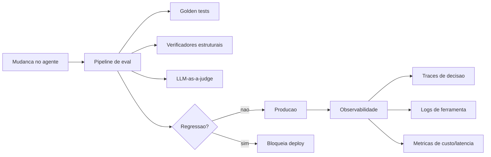

# Capítulo 8: Harness em Produção — Observabilidade, Evals e o Engenheiro Agêntico

## 1. Introdução

Nos sete primeiros capítulos, você escalou a parede inteira: entendeu a equação Agente = Modelo + Harness (Capítulo 1), abriu a anatomia do harness (Capítulo 2), instalou a âncora dos testes (Capítulo 3), o capacete dos guardrails (Capítulo 4), o motor do loop (Capítulo 5), o berço de contenção (Capítulo 6) e a gestão de foco (Capítulo 7). O equipamento está completo — mas equipamento completo não é sistema em produção. Faltam duas coisas: saber o que o agente está fazendo enquanto trabalha e saber se ele está ficando melhor ou pior com o tempo.

Ao final deste capítulo — e da obra — você será capaz de operar um harness em produção: instrumentar o agente com observabilidade, proteger o comportamento com evals que funcionam como testes de regressão e ocupar o novo papel do engenheiro agêntico, que desenha ambientes e especifica intenção em vez de escrever cada linha de código. A escalada termina no cume: você não é mais o escalador que sobe — é o guia que desenha a rota para outros escalarem.

## 2. Explica

Um harness em produção tem uma propriedade que nenhum capítulo anterior entrega isoladamente: **visibilidade contínua**. Durante o desenvolvimento, você testa e observa por amostragem; em produção, o agente trabalha sozinho, em escala, e você só descobre o problema depois que ele custa caro — a menos que o harness esteja instrumentado. A pesquisa de mercado é inequívoca sobre a prioridade: 89% das organizações com agentes em produção já têm observabilidade, e 62% usam tracing detalhado de passos e chamadas de ferramentas [12]. Observabilidade é o item mais adotado da maturidade agêntica — porque é o pré-requisito de todo o resto.

O que se observa em um harness? Três dimensões complementares. **Traces** reconstroem o raciocínio: a sequência de decisões, ações e observações de uma execução — o "porquê" de cada passo. **Logs** registram eventos atômicos: chamadas de ferramenta, arquivos acessados, erros capturados — o "o quê" de cada ação. **Métricas** agregam números: custo por tarefa, latência por passo, taxa de sucesso por tipo de tarefa — o "quanto" do sistema. As três juntas transformam o agente de caixa preta em sistema auditável — a mesma trilha de auditoria do Capítulo 6, elevada a telemetria contínua [12][19].

A segunda fundação da operação é o **eval**: um conjunto de casos de teste com resultado esperado que mede o comportamento do agente de forma determinística — o test harness do Capítulo 3, aplicado em escala e de forma contínua. Enquanto a observabilidade diz "o que está acontecendo", o eval diz "o comportamento está correto?" — e, mais importante, "o comportamento está *ainda* correto depois da minha mudança?". O eval é o **teste de regressão do agente**: você muda o prompt, a ferramenta ou o modelo, roda o eval, e sabe em minutos se a mudança melhorou ou piorou o comportamento [5][12]. A pesquisa mostra que apenas 52% das equipes têm evals formais — um gap enorme, dado que a qualidade dos outputs é a principal barreira de produção (32%) [12].

Os evals usam três mecanismos de verificação, do mais ao menos determinístico. **Golden tests** comparam a saída com uma referência aprovada por humanos (o padrão do Capítulo 3). **Verificadores estruturais** checam propriedades — schema, presença de campos, ausência de proibições. E o **LLM-as-a-judge** usa um segundo modelo para pontuar a qualidade quando não há resposta exata — com o risco conhecido de viés do julgador, que precisa ser calibrado contra avaliações humanas [5][19]. A combinação dos três cobre o espectro: o determinístico para o que é verificável, o estrutural para o que é contratual e o inferencial para o que é qualitativo.

A terceira fundação é o **papel do engenheiro**. A equipe da OpenAI que construiu um produto com cerca de um milhão de linhas de código geradas por agentes descreve a transformação com precisão: quando o código é escrito por agentes, o trabalho do engenheiro deixa de ser escrever código e passa a ser **desenhar ambientes, especificar intenção e construir loops de feedback** que tornam o trabalho dos agentes confiável [1]. Isso não é futurismo — é a descrição de quem já opera assim: a produtividade de 3,5 pull requests por engenheiro por dia não vem do modelo; vem do harness que o engenheiro desenhou [1]. E o paradoxo DORA fecha o argumento: IA sem disciplina de engenharia melhora o indivíduo e piora a entrega; IA dentro de um harness bem desenhado melhora os dois [9].

## 3. Ilustra

Na escalada, a operação em produção é a **central de monitoramento da via**: depois que a rota foi equipada, alguém precisa acompanhar cada escalador em tempo real — onde está, se o equipamento está prendendo, se o tempo está virando. A central (observabilidade) vê os pontos de avanço (traces), recebe os alertas de rádio (logs) e acompanha os números de subidas e quedas (métricas). E, antes de cada temporada, a equipe **treina os guias em via simulada** (evals): novos guias (versões do agente) passam pelos mesmos trechos, e só os que completam com segurança sobem a via real. Nenhuma central séria deixa um guia novo ir direto para a montanha sem o treino medido — e nenhum harness sério deixa uma mudança ir para produção sem o eval.

A dupla camada aqui é necessária porque o ponto mais contraintuitivo é o eval como teste de regressão: as pessoas tratam avaliação de IA como "medir quão inteligente é", algo que se faz uma vez. A segunda analogia — o **check-up periódico do atleta**: o atleta (agente) não faz o check-up para saber "se é bom" — faz para saber se o treino novo (mudança) melhorou ou piorou o desempenho, e para detectar lesões (regressões) antes que virem crônicas. O check-up não é um veredito; é um **monitoramento de tendência**. O eval funciona igual: o número absoluto importa menos que a direção — cada mudança roda o mesmo check-up e a pergunta é sempre "melhorou ou piorou?" [5][12]. O LLM-as-a-judge é o fisioterapeuta experiente que avalia a biomecânica (qualidade subjetiva) — mas só depois que os exames objetivos (golden tests) passaram.



Como Escalador de Harnesses — agora promovido a guia —, você já percebe a pergunta final de operação: **o que acontece quando alguém muda o agente?** Se a resposta é "vai para produção e a gente vê", o harness não está em produção; está em apostas. A resposta certa é: "roda o eval, e só vai se não houver regressão".

## 4. Técnica

### O Emissor de Métricas do Agente

Vamos instrumentar o loop do Capítulo 5. O bloco abaixo adiciona métricas estruturadas por passo — custo, latência e resultado — que alimentam o painel de operação.

```python
"""Telemetria do agente: metricas estruturadas por passo."""

from __future__ import annotations

import json
import time
from dataclasses import asdict, dataclass, field


@dataclass
class MetricaPasso:
    passo: int
    acao: str
    latencia_ms: float
    custo_tokens: int
    resultado: str


class Telemetria:
    def __init__(self) -> None:
        self.metricas: list[MetricaPasso] = []

    def registrar(self, metrica: MetricaPasso) -> None:
        self.metricas.append(metrica)

    def custo_total(self) -> int:
        return sum(m.custo_tokens for m in self.metricas)

    def latencia_media(self) -> float:
        if not self.metricas:
            return 0.0
        return sum(m.latencia_ms for m in self.metricas) / len(self.metricas)

    def exportar(self, caminho: str) -> None:
        with open(caminho, "w", encoding="utf-8") as arquivo:
            json.dump([asdict(m) for m in self.metricas], arquivo, ensure_ascii=False, indent=2)


def main() -> None:
    telemetria = Telemetria()
    for passo, acao in enumerate(["raciocinar", "usar_calculadora", "finalizar"], start=1):
        inicio = time.time()
        time.sleep(0.01)
        telemetria.registrar(MetricaPasso(
            passo=passo,
            acao=acao,
            latencia_ms=round((time.time() - inicio) * 1000, 1),
            custo_tokens=250,
            resultado="ok",
        ))

    print(f"Metricas: custo_total={telemetria.custo_total()} tokens, "
          f"latencia_media={telemetria.latencia_media():.1f} ms")
    print(f"Passos: {len(telemetria.metricas)}")


if __name__ == "__main__":
    main()
```

A telemetria é a trilha de auditoria do Capítulo 6 em formato agregável: cada passo gera um evento estruturado que soma custo e latência — e o painel de operação responde em segundos à pergunta "quanto este agente está custando por tarefa?" [12][19].

### O Eval de Regressão do Comportamento

O teste de regressão do agente: um dataset de casos com resultado esperado, pontuação automática e veredito de regressão. O bloco abaixo implementa o pipeline completo.

```python
"""Eval de regressao: pontua um lote de casos e reporta melhora/piora."""

from __future__ import annotations

from dataclasses import dataclass


@dataclass
class Caso:
    prompt: str
    esperado: str


def resposta_do_agente(prompt: str) -> str:
    """Simula o agente em versao nova (em producao: harness real)."""
    if "resumir" in prompt:
        return "resumo_curto_sem_ponto"
    return "resposta_generica"


def avaliar(caso: Caso) -> bool:
    resposta = resposta_do_agente(caso.prompt)
    return resposta == caso.esperado or caso.esperado in resposta


def rodar_eval(dataset: list[Caso]) -> dict[str, object]:
    acertos = sum(1 for caso in dataset if avaliar(caso))
    return {"acertos": acertos, "total": len(dataset), "taxa": acertos / len(dataset)}


def main() -> None:
    dataset = [
        Caso("resumir relatorio financeiro", "resumo_curto_sem_ponto"),
        Caso("resumir relatorio de vendas", "resumo_curto_sem_ponto"),
        Caso("calcular ticket medio", "resposta_generica"),
    ]
    resultado = rodar_eval(dataset)
    print(f"Eval: {resultado['acertos']}/{resultado['total']} "
          f"({resultado['taxa']:.0%})")

    # Gate de regressao: a nova versao precisa manter a taxa minima.
    if resultado["taxa"] >= 0.66:
        print("Veredito: sem regressao — liberado para producao")
    else:
        print("Veredito: REGRESSAO — bloqueado")


if __name__ == "__main__":
    main()
```

Esse é o ciclo de operação: mudou o agente → rodou o eval → decidiu com número, não com impressão. O gate de regressão (0,66 no exemplo) é o mesmo conceito do gate de CI do Capítulo 3, aplicado ao comportamento [5][12].

### O Manifesto Declarativo do Harness

O engenheiro agêntico desenha ambientes — e o artefato do desenho é um manifesto declarativo: a configuração do harness em um único arquivo, versionável e auditável [18][19].

```python
"""Manifesto declarativo do harness: a configuracao do sistema agêntico."""

from __future__ import annotations

import json


def validar_manifesto(manifesto: dict[str, object]) -> tuple[bool, list[str]]:
    falhas: list[str] = []
    if not manifesto.get("objetivo"):
        falhas.append("objetivo ausente")
    ferramentas = manifesto.get("ferramentas", [])
    if not isinstance(ferramentas, list) or not ferramentas:
        falhas.append("lista de ferramentas vazia")
    if not manifesto.get("guardrails", {}).get("proibidas"):
        falhas.append("guardrails sem acoes proibidas")
    if not manifesto.get("evals"):
        falhas.append("evals ausentes")
    return (not falhas, falhas)


def main() -> None:
    manifesto = {
        "objetivo": "consolidar relatorios mensais",
        "ambiente": "sandbox:workspace-agente",
        "ferramentas": ["ler-arquivo", "api:bi"],
        "guardrails": {"proibidas": ["deletar", "deploy"], "sensiveis": ["escrever-fora"]},
        "evals": ["dataset-relatorios-v3"],
        "limite_custo_por_tarefa_tokens": 5_000,
    }

    valido, falhas = validar_manifesto(manifesto)
    print("Manifesto do harness:")
    print(json.dumps(manifesto, ensure_ascii=False, indent=2))
    print("\nValido:", "SIM" if valido else f"NAO — {', '.join(falhas)}")


if __name__ == "__main__":
    main()
```

O manifesto é o contrato entre o engenheiro e o harness: descreve o objetivo, o ambiente, as ferramentas, os guardrails e os evals — e o harness valida a configuração antes de aceitar o desenho. Esse é o trabalho do engenheiro agêntico: não escrever a tarefa, mas **escrever o sistema que executa a tarefa com segurança** [1][5].

### O Roteiro de Operação em Produção

1. **Instrumente desde o primeiro dia**: traces, logs e métricas no ponto de execução — nunca adicione observabilidade depois do incidente [12].
2. **Construa o dataset de eval**: casos reais com resultado esperado, cobrindo os caminhos críticos da tarefa [5].
3. **Rode o eval a cada mudança**: prompt, ferramenta ou modelo novos passam pelo mesmo check-up; bloqueie regressão [12].
4. **Combine verificadores**: golden tests para o determinístico, estruturais para o contratual, LLM-as-a-judge para o qualitativo — calibrado contra humanos [5][19].
5. **Desenhe por manifesto**: a configuração do harness em arquivo versionável, com gates de validade [1].

## 5. Aplica

### A Cena de Contraste: A Mudança Que Ninguém Mediu

Você mantém um agente de atendimento que responde dúvidas de clientes sobre status de pedidos. Ele funciona bem há meses. Uma sexta-feira, o fornecedor do modelo anuncia uma versão nova "mais rápida"; alguém troca o modelo no arquivo de configuração e faz deploy na mesma tarde. Na segunda-feira, o agente continua respondendo — mas o tom mudou, e três respostas críticas sobre prazos de entrega saíram otimistas demais, gerando reclamações. O agente não "quebrou" — **regrediu silenciosamente**, e ninguém percebeu porque nenhuma medição acompanhava a mudança. O custo não foi a troca do modelo; foi a ausência do eval que teria dito, em minutos, que o comportamento tinha mudado [12].

O diagnóstico, ligando à teoria: faltava o ciclo mudança→eval→decisão. A correção prática: montar o dataset de eval com os casos críticos (prazos, tom, precisão), plugar o gate de regressão no deploy (a nova versão só sobe se mantiver a taxa) e ativar a telemetria de tom/custo por resposta. Na semana seguinte, a mesma troca de modelo foi feita — o eval reprovou, o deploy foi bloqueado e o time decidiu com número, não com pressa [5][12].

### Armadilhas Comuns na Operação do Harness

- **Observabilidade depois do incidente**: instrumentar a caixa preta quando ela já custou caro é o padrão mais caro do mercado; instrumente no primeiro dia [12].
- **Eval de uma vez só**: medir o agente uma vez e nunca mais é tirar foto de quem precisa de exame periódico; eval é monitoramento de tendência [5].
- **LLM-as-a-judge sem calibração**: o julgador tem viés; sem conferência humana periódica, o eval mede o viés do julgador [19].
- **Deploy sem gate de regressão**: mudança que vai para produção sem check-up é aposta; bloqueie a regressão [12].
- **Engenheiro que só escreve código**: no mundo agêntico, quem não desenha ambiente e especifica intenção vira gargalo — o harness é o produto do engenheiro [1].

### Métricas Que Você Deve Acompanhar

| Métrica | Valor de referência | Fonte |
|---|---|---|
| Equipes com observabilidade | 89% | LangChain [12] |
| Equipes com evals formais | 52% | LangChain [12] |
| PRs por engenheiro por dia (equipe agêntica) | 3,5 | OpenAI [1] |
| Qualidade como barreira de produção | 32% | LangChain [12] |

### O Harness como Produto: Ciclo de Vida da Obra em Produção

O harness não é um projeto com fim — é um produto com ciclo de vida. Quando a obra entra em produção, o time passa a operar em iterações curtas de melhoria, e cada iteração segue o mesmo arco de engenharia que você aprendeu nos capítulos anteriores [9][12]:

1. **Observar produção**: a trilha do Capítulo 7 revela onde o agente gasta, erra ou trava.
2. **Formular hipótese**: "a taxa de sucesso cai quando a tarefa exige três ferramentas encadeadas".
3. **Reproduzir em teste**: transformar a observação em caso de teste determinístico (Capítulo 2).
4. **Mudar o harness**: ajustar prompt, ferramenta, guardrail ou política de execução.
5. **Medir o efeito**: rodar o benchmark do Capítulo 3 e comparar antes/depois.
6. **Reverter se piorar**: o rollback da mudança é tão importante quanto a mudança — sem ele, cada iteração arrisca a produção.

```python
"""Ciclo de vida: decidir manter ou reverter uma mudanca de harness."""

from __future__ import annotations

from dataclasses import dataclass


@dataclass
class Experimento:
    nome: str
    antes: float
    depois: float


def decidir(experimento: Experimento, margem_minima: float = 0.02) -> str:
    melhoria = experimento.depois - experimento.antes
    if melhoria >= margem_minima:
        return f"manter {experimento.nome} (melhoria de {melhoria:.0%})"
    return f"reverter {experimento.nome} (melhoria de {melhoria:.0%} abaixo da margem)"


def main() -> None:
    experimentos = [
        Experimento("novo_prompt", 0.71, 0.78),
        Experimento("guardrail_mais_restrito", 0.74, 0.72),
    ]
    for experimento in experimentos:
        print(decidir(experimento))


if __name__ == "__main__":
    main()
```

Esse ciclo é o que separa o harness que melhora com o tempo do harness que envelhece com o tempo. As equipes que prosperam com agentes tratam o harness como um produto — com fila de melhorias, métricas e reuniões de revisão — não como uma tarefa concluída na semana do projeto [9][12]. A disciplina do DORA se aplica aqui integralmente: pequenas mudanças frequentes, feedback rápido e reversão barata são o que permitem evoluir sem medo.

### Exercícios de Fixação

**Exercício 1 — Runbook de incidente.** Escreva um runbook de 10 passos para um incidente de agente em produção: detecção, contenção, diagnóstico, correção e pós-incidente. Inclua o comando de kill-switch (pausar execuções), o acesso à trilha estruturada do Capítulo 7 e o critério de reabertura — a operação de harness é uma disciplina de runbook, não de improviso [12][19].

```python
"""Exercicio: kill-switch para pausar execucoes do agente."""

from __future__ import annotations

from dataclasses import dataclass


@dataclass
class Execucao:
    id: str
    ativa: bool = True


class PainelControle:
    def __init__(self) -> None:
        self.execucoes: list[Execucao] = []
        self.pausado = False

    def registrar(self, execucao: Execucao) -> None:
        self.execucoes.append(execucao)

    def kill_switch(self) -> None:
        self.pausado = True
        for execucao in self.execucoes:
            execucao.ativa = False

    def status(self) -> str:
        ativas = sum(1 for e in self.execucoes if e.ativa)
        return f"pausado={self.pausado} execucoes_ativas={ativas}/{len(self.execucoes)}"


def main() -> None:
    painel = PainelControle()
    painel.registrar(Execucao("run-1"))
    painel.registrar(Execucao("run-2"))
    print("antes:", painel.status())
    painel.kill_switch()
    print("depois:", painel.status())


if __name__ == "__main__":
    main()
```

**Exercício 2 — Custo e aprovação.** Defina o limiar de custo que dispara aprovação humana na sua operação (por exemplo, execução acima de R$ X ou acima de N iterações). Documente o fluxo: quem aprova, com que evidência da trilha e em quanto tempo. O limiar transforma o custo em controle — a recomendação de cancelar projetos sem retorno claro que a Gartner publicou é o avesso dessa disciplina [10].

**Exercício 3 — Plano de rollback.** Liste os artefatos que o agente pode modificar (arquivos, banco, deploys) e, para cada um, o mecanismo de reversão disponível antes de liberar a execução autônoma. Se um artefato não tiver rollback, ele não deveria ser editável por agente sem aprovação humana [19][20].

## 6. Conclusão

Você chegou ao cume. Recapitulando os três pontos centrais deste capítulo — e da obra inteira: a **observabilidade transforma o agente de caixa preta em sistema auditável** — traces, logs e métricas no ponto de execução [12][19]; os **evals são o teste de regressão do comportamento** — cada mudança passa pelo mesmo check-up, e a regressão bloqueia o deploy [5][12]; e o **engenheiro agêntico desenha ambientes e especifica intenção** — o harness é o produto, e o modelo é o executor [1].

A escalada que começou no Capítulo 1 — Agente = Modelo + Harness — termina com você do outro lado da equação: não o escalador que sobe, mas o guia que equipa a via. Recapitulando os oito equipamentos instalados: a equação (1), a anatomia (2), a âncora dos testes (3), o capacete dos guardrails (4), o motor do loop (5), o berço da contenção (6), a gestão de foco (7) e a central de operação (8). O desafio final para você: projete o harness completo do zero para uma tarefa real — manifesto, ferramentas, guardrails, evals e telemetria — e rode-a em produção. O cume não é o fim da rota; é o ponto onde você começa a desenhar as suas próprias.

## 7. Referências Bibliográficas

[1] OPENAI. *Harness engineering: leveraging Codex in an agent-first world*. Disponível em: https://openai.com/index/harness-engineering/. Acesso em: 09 ago. 2026.
[2] JIM, Carlos et al. *SWE-bench: Can Language Models Resolve Real-world GitHub Issues?* Disponível em: https://arxiv.org/abs/2310.06770. Acesso em: 09 ago. 2026.
[3] ALEITHAN, Ali et al. *SWE-Bench+: Enhanced Coding Benchmark for LLMs*. Disponível em: https://arxiv.org/abs/2410.06992. Acesso em: 09 ago. 2026.
[4] YAO, Shunyu et al. *ReAct: Synergizing Reasoning and Acting in Language Models*. Disponível em: https://arxiv.org/abs/2210.03629. Acesso em: 09 ago. 2026.
[5] BÖCKELER, Birgitta. *Harness engineering for coding agent users*. Disponível em: https://martinfowler.com/articles/harness-engineering.html. Acesso em: 09 ago. 2026.
[6] TRIVEDY, Vivek. *The Anatomy of an Agent Harness*. Disponível em: https://www.langchain.com/blog/the-anatomy-of-an-agent-harness. Acesso em: 09 ago. 2026.
[7] DATABRICKS ENGINEERING. *What is an AI Agent Harness?* Disponível em: https://www.databricks.com/blog/ai-harness. Acesso em: 09 ago. 2026.
[8] AI-BOOST. *Awesome Harness Engineering*. Disponível em: https://github.com/ai-boost/awesome-harness-engineering. Acesso em: 09 ago. 2026.
[9] GOOGLE CLOUD / DORA. *Accelerate State of DevOps Report 2024*. Disponível em: https://dora.dev/research/2024/dora-report/. Acesso em: 09 ago. 2026.
[10] GARTNER. *Gartner Predicts Over 40 Percent of Agentic AI Projects Will Be Canceled by End of 2027*. Disponível em: https://www.gartner.com/en/newsroom/press-releases/2025-06-25-gartner-predicts-over-40-percent-of-agentic-ai-projects-will-be-canceled-by-end-of-2027. Acesso em: 09 ago. 2026.
[11] GARTNER. *Gartner Predicts 40 Percent of Enterprise Apps Will Feature Task-Specific AI Agents by 2026*. Disponível em: https://www.gartner.com/en/newsroom/press-releases/2025-08-26-gartner-predicts-40-percent-of-enterprise-apps-will-feature-task-specific-ai-agents-by-2026-up-from-less-than-5-percent-in-2025. Acesso em: 09 ago. 2026.
[12] LANGCHAIN. *State of Agent Engineering 2026*. Disponível em: https://www.langchain.com/state-of-agent-engineering. Acesso em: 09 ago. 2026.
[13] ANTHROPIC. *Introducing the Model Context Protocol*. Disponível em: https://www.anthropic.com/news/model-context-protocol. Acesso em: 09 ago. 2026.
[14] RED HAT PRODUCT SECURITY (CANO GABARDA, F.). *Model Context Protocol (MCP): Understanding security risks and controls*. Disponível em: https://www.redhat.com/en/blog/model-context-protocol-mcp-understanding-security-risks-and-controls. Acesso em: 09 ago. 2026.
[15] EMBRACE THE RED. *MCP: Untrusted Servers and Confused Clients, Plus a Sneaky Exploit*. Disponível em: https://embracethered.com/blog/posts/2025/model-context-protocol-security-risks-and-exploits/. Acesso em: 09 ago. 2026.
[16] UTESVSKY, Roy (Adversa AI). *SymJack: The approval prompt is lying to you*. Disponível em: https://adversa.ai/blog/the-approval-prompt-is-lying-to-you-symlink-rce-in-five-ai-coding-agents-claude-code-cursor-antigravity-copilot-grok-build/. Acesso em: 09 ago. 2026.
[17] LASSO SECURITY (OXENBERG, O.; SUISA, E.). *Claude Code Security: Protect Autonomous Coding Agents*. Disponível em: https://www.lasso.security/blog/claude-code-security. Acesso em: 09 ago. 2026.
[18] NING, X. et al. *Code as Agent Harness: Toward Executable, Verifiable, and Stateful Agent Systems*. Disponível em: https://arxiv.org/html/2605.18747v1. Acesso em: 09 ago. 2026.
[19] HU, W. *Architectural Design Decisions in AI Agent Harnesses*. Disponível em: https://arxiv.org/html/2604.18071v1. Acesso em: 09 ago. 2026.
[20] OWASP FOUNDATION. *OWASP Top 10 for Large Language Model Applications*. Disponível em: https://owasp.org/www-project-top-10-for-large-language-model-applications/. Acesso em: 09 ago. 2026.
