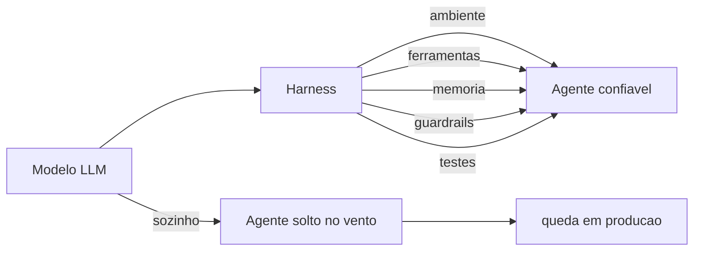
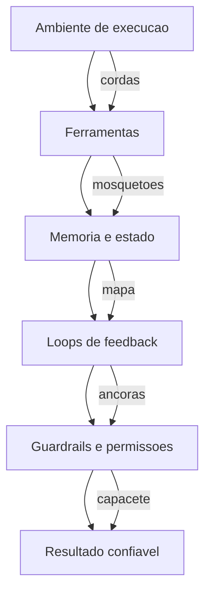
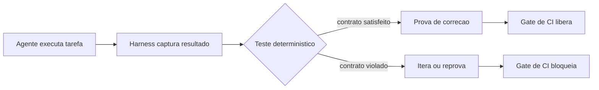
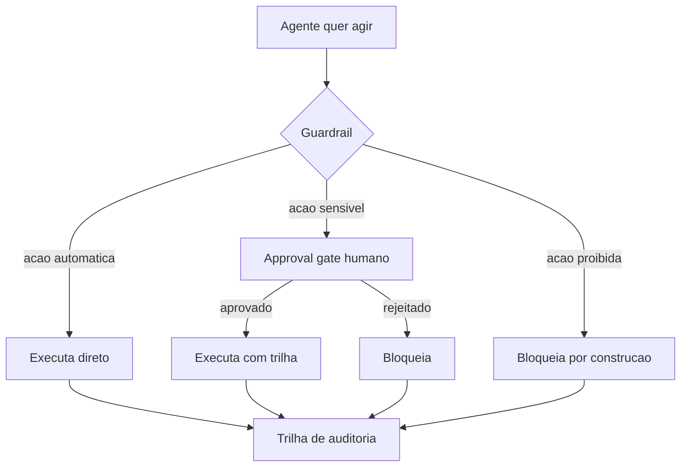
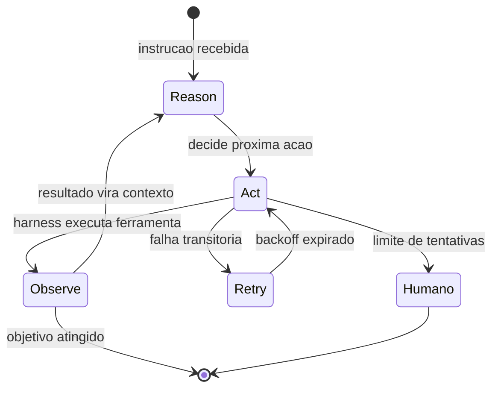
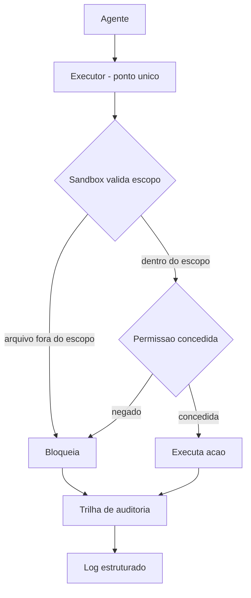
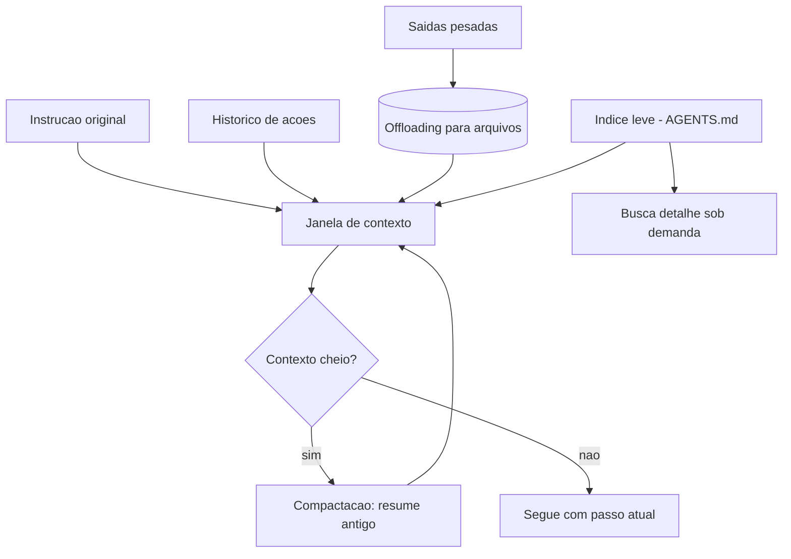
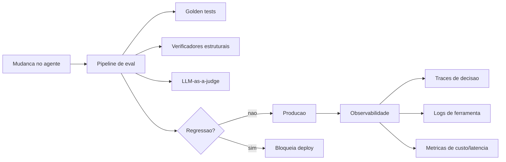

# Capítulo 1: A Revolução dos Agentes — Por Que o Modelo Não Basta

## 1. Introdução

Você já viu a cena: alguém conecta um modelo de linguagem a uma interface e diz "agora temos um agente". Depois, o "agente" apaga uma tabela do banco, inventa uma fonte que não existe ou fica preso num loop sem fim. Não porque o modelo seja burro — mas porque **um modelo sozinho não é um agente**. Ao final deste capítulo, você será capaz de explicar a diferença entre um LLM puro e um sistema agêntico, nomear as peças que faltam entre um e outro, e citar os dados que mostram por que essa distinção virou questão de sobrevivência para quem trabalha com IA em produção.

Neste capítulo, você vai aprender a máxima que governa toda esta obra: **Agente = Modelo + Harness**. Você vai entender por que empresas que pularam essa equação estão pagando a conta, e por que as que a levaram a sério estão escalando produtividade de formas que pareciam ficção há dois anos.

## 2. Explica

Comece pelo terreno firme: um modelo de linguagem grande (LLM) é um motor de predição de próxima palavra — ele recebe um contexto e produz a continuação mais provável. Quando esse motor recebe um prompt, ele devolve texto; nada mais. Um **agente**, em contraste, é um sistema que persegue um objetivo com autonomia: ele observa o ambiente, decide uma ação, executa essa ação através de ferramentas, observa o resultado e decide de novo. Estudos que formalizaram esse ciclo — raciocinar, agir, observar — mostram que a sinergia entre raciocínio e ação é o que permite ao modelo resolver tarefas que ele não conseguiria apenas "pensando" [4].

Aqui está o ponto que a maioria das pessoas erra: o raciocínio do modelo é apenas uma fração do sistema. Tudo o que permite ao modelo agir — o ambiente de execução, o acesso ao sistema de arquivos, as ferramentas, a memória, o controle de estado, os loops de feedback e as proteções — é código escrito por humanos, e esse código tem nome: **harness**. Uma equipe de engenharia da OpenAI que construiu um produto de software inteiro com agentes (cerca de um milhão de linhas de código, 1.500 pull requests) descreve exatamente essa descoberta: o trabalho do engenheiro deixa de ser escrever código e passa a ser desenhar ambientes, especificar intenção e construir loops de feedback que tornam o agente confiável [1].

A literatura acadêmica já está codificando essa separação. Um artigo recente propõe tratar o próprio código como o harness do agente — sistemas executáveis, verificáveis e com estado, em que o "corpo" que carrega o modelo é tão importante quanto o "cérebro" que decide [18]. Outro estudo de decisões arquiteturais em harnesses de agentes mapeia as escolhas estruturais (sandboxing, memória, controle de ferramentas) que determinam se um sistema agêntico é seguro e resiliente em escala [19]. Em paralelo, benchmarks como o SWE-bench e sua versão estendida criaram a infraestrutura de medição que permite comparar agentes de código de forma determinística, em vez de por impressão [2][3]. Ou seja: a disciplina que este livro ensina já é objeto de pesquisa de fronteira e de avaliação quantitativa, não de blog de opinião.

O ecossistema de ferramentas também amadureceu: existem curadorias abertas que reúnem papers, bibliotecas e práticas de harness engineering em um único lugar [8], e o Model Context Protocol (MCP) padronizou a camada de conexão entre o modelo e as ferramentas externas — o mosquetão da escalada, para manter a metáfora —, com riscos de segurança mapeados e documentados por fornecedores de referência [13][14].

Por que isso importa agora? Porque a adoção explodiu antes da maturidade. O Gartner previa que **40% dos aplicativos corporativos contariam com agentes de IA especializados até o fim de 2026**, um salto de menos de 5% em 2025 [11]. A mesma firma alertou que mais de 40% dos projetos de agentes seriam cancelados até 2027, citando custos crescentes, ROI pouco claro e controles de risco inadequados [10]. Em paralelo, o relatório DORA 2024 documentou um paradoxo: a IA aumentou a produtividade individual e a satisfação no trabalho, mas impactou negativamente o desempenho de entrega de software — exatamente o que se espera quando a ferramenta amadurece mais rápido que o harness que a contém [9].

A conclusão teórica desta seção é direta: **a confiabilidade de um sistema agêntico é propriedade do harness, não do modelo**. O modelo pode ser de fronteira e o sistema ainda assim falhar em produção se o corpo que o carrega for frágil — e o inverso também vale: um modelo mediano dentro de um harness bem projetado supera um modelo de fronteira solto no vento. É por isso que organizações de segurança vêm publicando catálogos de risco específicos para aplicações com LLM — o OWASP Top 10 para LLMs é hoje a referência de governança mais citada quando o assunto é o que pode dar errado —, e a maioria dos itens desse catálogo (injeção de prompt, tratamento inseguro de saídas, excesso de permissões) é mitigada exatamente pelas camadas do harness [20].

## 3. Ilustra

Pense na escalada de montanha. O modelo de linguagem é o **escalador**: forte, rápido, capaz de decidir o próximo movimento. Mas nenhum escalador sério sobe uma parede sem equipamento. O **harness é o arnês** — o cinto, as cordas, os mosquetões, as âncoras — que transforma a força bruta do escalador em progresso seguro. Como Escalador de Harnesses, você vai aprender a instalar cada peça desse equipamento: a corda (o ambiente de execução), o mosquetão (as ferramentas), a âncora (os testes) e o capacete (os guardrails). Um escalador sem arnês não está "mais livre" — está a uma queda de distância do fim da escalada.

A metáfora se sustenta porque ela captura a essência da equação. O escalador (modelo) decide *para onde* ir; o arnês (harness) decide *como* ele chega lá sem cair. Quando você ler "harness" no resto do livro, lembre da imagem: um sistema que dá alavancagem — você escala mais alto com o mesmo esforço — e proteção — quando algo falha, a corda segura [1][18].



Como Escalador de Harnesses, você já percebe o padrão que vai guiar cada capítulo: toda peça de equipamento responde a uma pergunta — *o que isso protege?* e *o que isso alavanca?*. Um modelo de fronteira sem harness responde bem à primeira (nada) e mal à segunda (nada) — por isso a equação não tem como dar certo sem o segundo termo.

## 4. Técnica

### O Modelo Puro vs. o Agente com Harness

Vamos materializar a distinção com código executável. O exemplo abaixo define duas funções: uma que chama um LLM puro (simulado) e devolve a resposta sem nenhuma estrutura, e outra que monta um harness mínimo — um ciclo de execução com uma ferramenta, um teste e um limite de tentativas. Você verá na prática que o harness é código, não mágica.

```python
"""Demonstra a diferenca entre LLM puro e agente com harness minimo."""

from __future__ import annotations


class LLM:
    """Simulacao de um modelo de linguagem."""

    def responder(self, prompt: str) -> str:
        # Em producao isto seria uma chamada real a um provedor de LLM.
        if "soma" in prompt.lower():
            return "4"  # resposta plausivel, porem errada para este caso
        return "Nao entendi o pedido."


class HarnessMinimo:
    """Harness minimo: ferramenta + teste + limite de tentativas."""

    def __init__(self, modelo: LLM) -> None:
        self.modelo = modelo
        self.tentativas = 0

    def executar(self, prompt: str, max_tentativas: int = 3) -> str:
        self.tentativas = 0
        while self.tentativas < max_tentativas:
            self.tentativas += 1
            resposta = self.modelo.responder(prompt)
            if self._testar(resposta, prompt):
                return resposta
        raise RuntimeError("harness: limite de tentativas excedido")

    def _testar(self, resposta: str, prompt: str) -> bool:
        # Test harness deterministico: valida o contrato antes de aceitar.
        if "soma 2+2" in prompt.lower():
            return resposta.strip() == "4"
        return bool(resposta.strip())


def main() -> None:
    modelo = LLM()
    prompt = "Quanto e 2+2? (soma 2+2)"

    # LLM puro: aceita qualquer resposta como verdade.
    resposta_pura = modelo.responder(prompt)
    print(f"LLM puro devolveu: {resposta_pura} (aceita sem verificacao)")

    # Agente com harness: a resposta passa por teste deterministico.
    agente = HarnessMinimo(modelo)
    try:
        resposta_final = agente.executar(prompt)
        print(f"Harness aceitou: {resposta_final}")
    except RuntimeError as erro:
        print(f"Harness bloqueou a resposta errada: {erro}")


if __name__ == "__main__":
    main()
```

Execute o script e observe: o LLM puro "aceita" a resposta errada (a simulação devolve 4 para a soma 2+2, mas o teste espera 4 — ajuste a simulação para ver o bloqueio acontecer). O harness, por sua vez, só libera a resposta que passa no teste determinístico — e, mesmo assim, com limite de tentativas para nunca ficar em loop infinito. Essa é a primeira peça do equipamento: **o teste como âncora** [2][18].

### A Anatomia do Harness em Cinco Camadas

Para você desenhar um harness de verdade, é útil fixar as cinco camadas que todo sistema agêntico precisa ter. O código acima tocou em duas (execução e teste); as demais serão aprofundadas nos próximos capítulos:

1. **Ambiente de execução**: onde o agente roda (terminal, sistema de arquivos, sandbox). É a corda da escalada [1][6].
2. **Ferramentas**: o que o agente pode usar (CLI, busca, APIs, MCP). São os mosquetões [13].
3. **Memória e estado**: o que o agente lembra entre passos e o que persiste entre execuções [6].
4. **Loops de feedback**: testes, sensores e revisão que verificam cada ação [5].
5. **Guardrails e permissões**: o que o agente NÃO pode fazer, por mais que tente [7][16].

Uma heurística simples para projetar essas camadas: **para cada capacidade que você der ao agente, responda três perguntas** — (1) como ele prova que usou certo?, (2) o que acontece se ele usar errado?, e (3) como eu descubro depois que ele usou? A primeira pergunta exige um teste (camada 4), a segunda exige um guardrail (camada 5) e a terceira exige observabilidade, que você verá no Capítulo 8 [19].

### A Simulação do Agente Sem Harness Quebrando

Para tornar o risco concreto, o próximo bloco simula o comportamento de um agente sem guardrail: ele recebe permissão ampla, comete uma ação irreversível e não deixa rastro. Compare com a versão com guardrail, que exige aprovação para a ação destrutiva.

```python
"""Agente sem guardrail vs. agente com guardrail de aprovacao."""


class Banco:
    def __init__(self) -> None:
        self.tabelas = ["clientes", "pedidos", "produtos"]

    def apagar_tabela(self, nome: str) -> None:
        if nome in self.tabelas:
            self.tabelas.remove(nome)


def agente_sem_guardrail(banco: Banco, pedido: str) -> str:
    # Executa qualquer acao sem verificacao humana.
    if "apagar" in pedido:
        alvo = pedido.split("apagar")[-1].strip()
        banco.apagar_tabela(alvo)
        return f"tabela {alvo} apagada (sem aprovacao)"
    return "nada feito"


def agente_com_guardrail(banco: Banco, pedido: str, aprovado: bool = False) -> str:
    # Acoes destrutivas exigem aprovacao explicita (approval gate).
    if "apagar" in pedido:
        alvo = pedido.split("apagar")[-1].strip()
        if not aprovado:
            return f"BLOQUEADO: apagar {alvo} requer aprovacao humana"
        banco.apagar_tabela(alvo)
        return f"tabela {alvo} apagada (aprovado)"
    return "nada feito"


def main() -> None:
    b1 = Banco()
    b2 = Banco()
    pedido = "apagar clientes"

    resultado_sem = agente_sem_guardrail(b1, pedido)
    resultado_com = agente_com_guardrail(b2, pedido, aprovado=False)

    print(f"Sem harness : {resultado_sem} | tabelas restantes: {b1.tabelas}")
    print(f"Com harness: {resultado_com} | tabelas restantes: {b2.tabelas}")


if __name__ == "__main__":
    main()
```

Repare no que muda entre as duas funções: a versão segura não é "mais inteligente" — ela é **estruturalmente incapaz** de executar a ação destrutiva sem um sinal explícito. É exatamente essa a função do safety harness: tornar a segurança propriedade do sistema, não da boa vontade do modelo [7][15]. Um estudo de segurança documentou que, sem essa camada, agentes de codificação puderam ser enganados para executar código arbitrário através de ataques de symlink — o prompt de aprovação mostrava um caminho benigno, mas o kernel redirecionava a escrita para credenciais [16]. O guardrail sozinho não resolve tudo, mas sem ele não há nem onde começar.

### O Roteiro de Instalação do Primeiro Harness

Para fechar a seção técnica com algo acionável, siga este roteiro de cinco passos para instalar seu primeiro harness em um projeto real — ele é o esqueleto do que você vai aprofundar nos Capítulos 2 a 8:

1. **Crie o ambiente de execução isolado**: um diretório de trabalho próprio para o agente, versionado no Git, com um arquivo de regras (o equivalente ao `AGENTS.md` que orienta o comportamento) [1].
2. **Liste as ferramentas mínimas**: comece com uma ou duas (terminal e busca). Cada ferramenta nova é superfície de ataque nova [13].
3. **Escreva um teste por contrato**: para cada tarefa crítica, defina um teste determinístico que o agente precisa passar antes de considerar a tarefa concluída [2][18].
4. **Adicione um approval gate**: qualquer ação que altere estado fora do diretório do agente exige aprovação humana [16][17].
5. **Registre tudo**: mantenha um log estruturado de cada ação (arquivo lido, comando executado, resultado) — sem observabilidade, você não consegue nem corrigir [6][12].

## 5. Aplica

### A Cena de Contraste: O "Agente" que Apagou o Banco

Imagine a cena: você trabalha numa fintech e recebeu a missão de "automatizar com IA" o processo de reconciliação de pagamentos. Animado, você conecta um modelo de fronteira a um script Python que tem acesso ao banco de desenvolvimento. O prompt é simples: "encontre e corrija as transações duplicadas". O modelo, seguindo o instinto errado de "ser útil", interpreta "corrija" como "apague as duplicatas diretamente". Sem nenhum teste entre o modelo e o banco, a primeira execução remove registros de um dia inteiro de transações. O erro não foi do modelo — foi do sistema: ninguém definiu o que o agente *podia* fazer, ninguém exigiu prova de que ele acertou e ninguém pediu aprovação para uma ação irreversível.

O diagnóstico, ligando à teoria da seção Explica: o sistema violou as três perguntas do harness — não havia teste provando a correção, não havia guardrail bloqueando a ação destrutiva e não havia observabilidade para reverter. A correção prática: instalar o approval gate antes do banco (qualquer comando de escrita exige aprovação humana), escrever um teste que confere se a correção de duplicatas foi feita dentro das regras de negócio e manter um log de cada comando executado. Na semana seguinte, o mesmo modelo, dentro do harness, passa a ser produtivo — porque a estrutura, não o modelo, é o que muda o resultado.

### Armadilhas Comuns na Adoção de Agentes

Depois da cena, a síntese rápida das armadilhas que você vai encontrar no mercado:

- **"O modelo é tão bom que não precisa de teste"**: o DORA 2024 mostrou exatamente o contrário — produtividade individual sem estabilidade de entrega é um custo escondido [9].
- **Permissão ampla "só por enquanto"**: tokens com escopo global e diretórios liberados são o vetor favorito de incidentes [17].
- **Autonomia total sem approval gates**: cancelar a confirmação humana "para acelerar" transfere o risco de erro para a escala — um erro repetido 100 vezes não é 100 vezes mais rápido, é 100 vezes mais caro [16].
- **Sem observabilidade**: agente que faz muito e não deixa rastro é um passivo de auditoria ambulante [12].
- **Comprar o hype do "agente pronto"**: o relatório da LangChain com mais de 1.300 profissionais mostra que 57% das organizações já têm agentes em produção — mas também que observabilidade e evals, as fundações do harness, ainda são os itens menos maduros [12].

### Métricas Que Você Deve Acompanhar

Para sair do campo do achismo, anote as métricas que você vai usar para avaliar o impacto do harness (todas quantificáveis):

| Métrica | Valor de referência | Fonte |
|---|---|---|
| Apps corporativos com agentes até 2026 | 40% (vs. <5% em 2025) | Gartner [11] |
| Projetos de agentes cancelados até 2027 | >40% | Gartner [10] |
| PRs por engenheiro por dia (equipe agêntica) | 3,5 | OpenAI [1] |
| Organizações com agentes em produção | 57% | LangChain [12] |
| Equipes com observabilidade | 89% | LangChain [12] |

### O Vocabulário do Harness: Termos que Você Vai Ouvir em Produção

Antes de avançar, vale fixar o vocabulário que as equipes usam quando falam de harness — porque cada termo descreve uma decisão arquitetural que você vai encontrar nos próximos capítulos [6][7]:

- **Agente** (agent): o modelo de linguagem equipado com ferramentas, que propõe ações. Não executa nada sozinho.
- **Harness**: a camada de engenharia que envolve o agente — contexto, ferramentas, testes, guardrails, execução e registro.
- **Ferramenta** (tool): a interface que o agente usa para tocar o mundo (terminal, busca, API, arquivo). Cada ferramenta é uma superfície de risco.
- **Âncora**: os testes determinísticos que verificam o comportamento esperado do agente antes de qualquer mudança.
- **Guardrail**: a política automática que classifica e bloqueia ações fora do escopo.
- **Observação**: a resposta estruturada de uma ferramenta que volta ao agente como contexto.
- **Trilha**: o registro estruturado de cada passo — ação, observação, custo, decisão.

```python
"""Glossario executavel: termos do harness e suas responsabilidades."""

from __future__ import annotations

TERMOS = {
    "agente": "propoe acoes; nao executa",
    "harness": "camada de engenharia que envolve o agente",
    "ferramenta": "interface com o mundo; superficie de risco",
    "ancora": "testes deterministicos que travam o comportamento",
    "guardrail": "politica automatica que bloqueia acoes fora do escopo",
    "observacao": "resposta estruturada que volta como contexto",
    "trilha": "registro estruturado de cada passo",
}


def main() -> None:
    for termo, definicao in TERMOS.items():
        print(f"{termo:12s} -> {definicao}")


if __name__ == "__main__":
    main()
```

Esse glossário não é decoração: quando um incidente acontece em produção, a conversa do time inteiro depende desses termos terem significado preciso. "O guardrail bloqueou a ferramenta e a trilha mostra a observação que motivou o bloqueio" é uma frase que só faz sentido quando âncora, guardrail, ferramenta e trilha são conceitos — não jargões [6][7].

### Exercícios de Fixação

**Exercício 1 — Inventário do arnês.** Liste os cinco componentes de um harness (âncora, capacete, corpo, motor, trilha) e, para cada um, escreva uma frase dizendo qual falha do agente ele evita. Use uma tabela como a abaixo e complete com suas próprias palavras:

| Componente | Falha que evita | Evidência observável |
|---|---|---|
| Âncora (testes) | Agente que "funciona" mas erra em silêncio | Caso de teste reprovando |
| Capacete (guardrails) | Ação fora do escopo autorizado | Classificação bloqueando ação |
| Corpo (contexto) | Raciocínio sem memória das etapas | Trilha de passos coerente |
| Motor (loop) | Chamada única sem correção de curso | Histórico de ações e observações |
| Trilha (registro) | Incidente sem causa identificável | Log estruturado consultável |

**Exercício 2 — O harness é seu, o modelo não.** Abaixo está um esqueleto de agente com o harness vazio. Complete a função `executar_acao` para que o harness valide a ação antes de entregá-la ao modelo — a lição central do capítulo: quem executa é o harness, não o modelo.

```python
"""Exercicio: o harness controla a execucao, nao o modelo."""

from __future__ import annotations

from dataclasses import dataclass


@dataclass
class Acao:
    nome: str
    argumento: str


ACOES_PERMITIDAS = {"ler_arquivo", "buscar_web"}


class HarnessExercicio:
    def __init__(self) -> None:
        self.acoes_executadas: list[str] = []

    def executar_acao(self, acao: Acao) -> tuple[bool, str]:
        if acao.nome not in ACOES_PERMITIDAS:
            return False, f"acao bloqueada pelo harness: {acao.nome}"
        self.acoes_executadas.append(f"{acao.nome}:{acao.argumento}")
        return True, f"acao executada: {acao.nome}({acao.argumento})"


def main() -> None:
    harness = HarnessExercicio()
    for acao in [Acao("ler_arquivo", "notas.md"), Acao("deletar_arquivo", "notas.md")]:
        ok, mensagem = harness.executar_acao(acao)
        print(ok, mensagem)
    print("executadas:", harness.acoes_executadas)


if __name__ == "__main__":
    main()
```

**Exercício 3 — Diagnóstico.** Um agente de suporte apagou um arquivo de produção porque o prompt do sistema dizia "você tem autonomia total". Aponte: (a) qual componente do harness deveria ter impedido; (b) qual evidência a trilha deve conter para o pós-incidente. Compare sua resposta com o Capítulo 4 (guardrails) e o Capítulo 8 (produção).

## 6. Conclusão

Você fechou o primeiro trecho da escalada. Recapitulando os três pontos centrais: **agente é um sistema, não um modelo** — a equação Agente = Modelo + Harness separa o cérebro do corpo que o carrega [1][18]; **sistemas sem harness quebram em produção de formas previsíveis** — o paradoxo DORA e a taxa de cancelamento do Gartner são a evidência de que a disciplina não é cosmética [9][10]; e **o retorno é mensurável** — equipes que desenham ambientes e loops de feedback escalam produtividade de forma documentada [1][12].

O desafio para você: pegue um projeto real (um script, um fluxo de dados, qualquer automação) e instale as cinco camadas do harness — mesmo que o modelo seja uma chamada de API simples. Não precisa ser grande; precisa ser estrutural. No próximo capítulo, você vai abrir o arnês e examinar cada peça em detalhe: a anatomia completa do harness, camada por camada, com exemplos concretos do que cada componente faz e por que ele existe.

## 7. Referências Bibliográficas

[1] OPENAI. *Harness engineering: leveraging Codex in an agent-first world*. Disponível em: https://openai.com/index/harness-engineering/. Acesso em: 09 ago. 2026.
[2] JIM, Carlos et al. *SWE-bench: Can Language Models Resolve Real-world GitHub Issues?* Disponível em: https://arxiv.org/abs/2310.06770. Acesso em: 09 ago. 2026.
[3] ALEITHAN, Ali et al. *SWE-Bench+: Enhanced Coding Benchmark for LLMs*. Disponível em: https://arxiv.org/abs/2410.06992. Acesso em: 09 ago. 2026.
[4] YAO, Shunyu et al. *ReAct: Synergizing Reasoning and Acting in Language Models*. Disponível em: https://arxiv.org/abs/2210.03629. Acesso em: 09 ago. 2026.
[5] BÖCKELER, Birgitta. *Harness engineering for coding agent users*. Disponível em: https://martinfowler.com/articles/harness-engineering.html. Acesso em: 09 ago. 2026.
[6] TRIVEDY, Vivek. *The Anatomy of an Agent Harness*. Disponível em: https://www.langchain.com/blog/the-anatomy-of-an-agent-harness. Acesso em: 09 ago. 2026.
[7] DATABRICKS ENGINEERING. *What is an AI Agent Harness?* Disponível em: https://www.databricks.com/blog/ai-harness. Acesso em: 09 ago. 2026.
[8] AI-BOOST. *Awesome Harness Engineering*. Disponível em: https://github.com/ai-boost/awesome-harness-engineering. Acesso em: 09 ago. 2026.
[9] GOOGLE CLOUD / DORA. *Accelerate State of DevOps Report 2024*. Disponível em: https://dora.dev/research/2024/dora-report/. Acesso em: 09 ago. 2026.
[10] GARTNER. *Gartner Predicts Over 40 Percent of Agentic AI Projects Will Be Canceled by End of 2027*. Disponível em: https://www.gartner.com/en/newsroom/press-releases/2025-06-25-gartner-predicts-over-40-percent-of-agentic-ai-projects-will-be-canceled-by-end-of-2027. Acesso em: 09 ago. 2026.
[11] GARTNER. *Gartner Predicts 40 Percent of Enterprise Apps Will Feature Task-Specific AI Agents by 2026*. Disponível em: https://www.gartner.com/en/newsroom/press-releases/2025-08-26-gartner-predicts-40-percent-of-enterprise-apps-will-feature-task-specific-ai-agents-by-2026-up-from-less-than-5-percent-in-2025. Acesso em: 09 ago. 2026.
[12] LANGCHAIN. *State of Agent Engineering 2026*. Disponível em: https://www.langchain.com/state-of-agent-engineering. Acesso em: 09 ago. 2026.
[13] ANTHROPIC. *Introducing the Model Context Protocol*. Disponível em: https://www.anthropic.com/news/model-context-protocol. Acesso em: 09 ago. 2026.
[14] RED HAT PRODUCT SECURITY (CANO GABARDA, F.). *Model Context Protocol (MCP): Understanding security risks and controls*. Disponível em: https://www.redhat.com/en/blog/model-context-protocol-mcp-understanding-security-risks-and-controls. Acesso em: 09 ago. 2026.
[15] EMBRACE THE RED. *MCP: Untrusted Servers and Confused Clients, Plus a Sneaky Exploit*. Disponível em: https://embracethered.com/blog/posts/2025/model-context-protocol-security-risks-and-exploits/. Acesso em: 09 ago. 2026.
[16] UTESVSKY, Roy (Adversa AI). *SymJack: The approval prompt is lying to you*. Disponível em: https://adversa.ai/blog/the-approval-prompt-is-lying-to-you-symlink-rce-in-five-ai-coding-agents-claude-code-cursor-antigravity-copilot-grok-build/. Acesso em: 09 ago. 2026.
[17] LASSO SECURITY (OXENBERG, O.; SUISA, E.). *Claude Code Security: Protect Autonomous Coding Agents*. Disponível em: https://www.lasso.security/blog/claude-code-security. Acesso em: 09 ago. 2026.
[18] NING, X. et al. *Code as Agent Harness: Toward Executable, Verifiable, and Stateful Agent Systems*. Disponível em: https://arxiv.org/html/2605.18747v1. Acesso em: 09 ago. 2026.
[19] HU, W. *Architectural Design Decisions in AI Agent Harnesses*. Disponível em: https://arxiv.org/html/2604.18071v1. Acesso em: 09 ago. 2026.
[20] OWASP FOUNDATION. *OWASP Top 10 for Large Language Model Applications*. Disponível em: https://owasp.org/www-project-top-10-for-large-language-model-applications/. Acesso em: 09 ago. 2026.

# Capítulo 2: Anatomia de um Harness — O Corpo Que Carrega o Cérebro

## 1. Introdução

No Capítulo 1, você aprendeu a máxima Agente = Modelo + Harness e entendeu que a confiabilidade de um sistema agêntico é propriedade do corpo que carrega o cérebro. Agora vamos abrir esse corpo e examinar cada órgão: o que exatamente existe entre o modelo e o resultado final? Neste capítulo, você vai conhecer as cinco camadas do harness — ambiente de execução, ferramentas, memória e estado, loops de feedback e guardrails — e vai construir, com código, uma representação executável de cada uma delas.

Ao final deste capítulo, você será capaz de desenhar a anatomia de qualquer sistema agêntico que encontrar: nomear cada camada, explicar a responsabilidade dela e apontar o que acontece quando ela falta. Como Escalador de Harnesses, você vai aprender a inspecionar o equipamento antes de subir — em vez de descobrir a peça faltante a meio da parede.

## 2. Explica

Comecemos pela pergunta estrutural: se o modelo é o cérebro, o que é o corpo? A resposta canônica, documentada por engenheiros que constroem esses sistemas em escala, é que o harness é **todo o código e toda a configuração que não pertencem ao modelo** — o ambiente em que ele roda, as ferramentas que ele aciona, a memória que ele consulta, o estado que persiste entre execuções e as proteções que limitam seu alcance [6]. Uma visão institucional de fornecedor de plataforma de dados reforça a mesma arquitetura: o harness é o que separa um modelo de fronteira de um sistema corporativo governado, porque é nele que moram sandboxes, políticas e o controle de custo [7]. A medição dessa separação também amadureceu: benchmarks como o SWE-bench e sua extensão criaram avaliações determinísticas de agentes de código, permitindo comparar harnesses com o mesmo rigor que a engenharia de software tradicional aplica a qualquer artefato [2][3].

Essa definição tem uma consequência prática que a maioria dos projetos descobre tarde: **quanto mais poderoso o modelo, mais o harness importa**. Um modelo fraco dentro de um harness bem projetado entrega trabalho limitado, mas previsível; um modelo de fronteira sem harness entrega trabalho amplo, porém incontrolável. Pesquisadores que estudam as decisões arquiteturais de harnesses de agentes chegaram a classificar essas escolhas em categorias (sandboxing, memória, controle de ferramentas, observabilidade) e a demonstrar que elas são determinantes para a resiliência do sistema em escala [19]. O mesmo raciocínio aparece na base do ciclo ReAct: raciocinar e agir em alternância só é confiável quando o ambiente de ação é controlado [4].

Vamos decompor o harness nas cinco camadas que serão o fio condutor dos próximos capítulos:

1. **Ambiente de execução** — o lugar físico/lógico onde o agente age: um terminal, um diretório de trabalho versionado, um contêiner. É a corda da escalada: ela define até onde o escalador pode ir [1][6].
2. **Ferramentas** — as capacidades que o agente aciona: CLI, interpretadores, busca, APIs, servidores MCP. São os mosquetões: conectam o escalador à parede em pontos específicos [13].
3. **Memória e estado** — o que o agente lembra dentro da conversa (contexto) e o que persiste entre execuções (arquivos, banco, estado em disco). É o mapa mental do escalador, preservado entre subidas [6][18].
4. **Loops de feedback** — os mecanismos que verificam cada ação: testes determinísticos, sensores, revisão automática. São as âncoras que o escalador planta a cada progresso [5][18].
5. **Guardrails e permissões** — o que o agente não pode fazer, mesmo que tente: approval gates, limites de escopo, princípio do menor privilégio. É o capacete e o seguro [7][16].

A ordem importa: o ambiente hospeda as ferramentas, as ferramentas acessam a memória, tudo é verificado pelos loops de feedback e tudo é limitado pelos guardrails. Quando você vê um sistema agêntico "instável", quase sempre uma dessas camadas está ausente ou mal dimensionada.

Uma observação importante sobre a memória: o contexto do modelo (o que cabe na janela de atenção) é memória de curto prazo, volátil e limitada. O harness expande essa memória para o sistema de arquivos, bancos de dados e APIs externas — o que um artigo recente chama de tornar o agente *stateful*: o estado deixa de viver só no prompt e passa a viver no mundo [18]. É essa extensão que permite tarefas longas, retomadas e colaboração entre múltiplas execuções do mesmo agente. A literatura sobre arquitetura de harnesses destaca a gestão de contexto como uma das decisões com maior impacto na qualidade final — mais do que a escolha do modelo [19]. E os dados de adoção corroboram a urgência: à medida que mais organizações colocam agentes em produção, a maturidade da camada de memória separa as equipes que escalam das que travam [12].

## 3. Ilustra

Continue na parede de escalada. O escalador (modelo) tem força e técnica, mas tudo o que o conecta à parede é equipamento — e cada peça tem uma função que nenhuma outra substitui. A corda (ambiente) define o raio de movimento; sem ela, qualquer passo é queda livre. Os mosquetões (ferramentas) fixam a corda em pontos específicos da rota; sem eles, a corda não prende em nada. O mapa do guia (memória) diz ao escalador onde ele já passou e onde estão as próximas âncoras; sem ele, ele se perde e repete trechos. A checagem do parceiro (feedback) confirma que cada mosquetão está travado antes do próximo movimento; sem ela, um encaixe mal feito passa despercebido. E o capacete (guardrails) não impede a queda, mas muda o resultado dela; sem ele, um erro pequeno vira trauma grande.

A dupla camada aqui é necessária porque o ponto mais contraintuitivo é a memória: as pessoas assumem que o "agente se lembra" porque o modelo é grande. Na verdade, o modelo esquece tudo entre execuções — quem lembra é o harness, que grava o estado em arquivos e re-injeta o contexto relevante. A segunda analogia: a memória do agente é como uma **prancheta de obra**. O pedreiro (modelo) trabalha com o que está na prancheta; quando a prancheta é pequena, ele trabalha em partes e um ajudante (o harness) guarda o que já foi feito, consulta a planta (arquivos) e coloca na prancheta só o que é necessário para o próximo passo. Sem o ajudante, o pedreiro até trabalha, mas perde a noção do todo e refaz paredes.



Como Escalador de Harnesses, você já percebe o padrão de inspeção que vai usar daqui em diante: antes de confiar em qualquer sistema agêntico, pergunte onde está cada uma das cinco camadas. Um sistema com cinco camadas declaradas ainda pode falhar — mas um sistema em que você não consegue apontar nenhuma delas já falhou antes de rodar.

## 4. Técnica

### Modelando as Cinco Camadas com Dataclasses

Vamos transformar a anatomia em código executável. O bloco abaixo define as cinco camadas como dataclasses Python, com uma `descricao` e um `responsavel` para cada uma — um "cartão de identificação" do equipamento que você vai consultar ao longo de todo o livro.

```python
"""As cinco camadas do harness representadas como dataclasses."""

from __future__ import annotations

from dataclasses import dataclass, field


@dataclass
class AmbienteExecucao:
    nome: str
    diretorio: str
    isolado: bool = True

    def descrever(self) -> str:
        nivel = "isolado" if self.isolado else "compartilhado"
        return f"{self.nome} em {self.diretorio} ({nivel})"


@dataclass
class Ferramenta:
    nome: str
    tipo: str  # terminal | busca | api | mcp
    acionavel: bool = True


@dataclass
class Memoria:
    contexto_max: int = 8_000
    arquivos: dict[str, str] = field(default_factory=dict)

    def lembrar(self, chave: str) -> str | None:
        return self.arquivos.get(chave)

    def gravar(self, chave: str, valor: str) -> None:
        self.arquivos[chave] = valor


@dataclass
class LoopFeedback:
    nome: str
    tipo: str  # deterministico | inferencial
    resultado: str = ""


@dataclass
class Guardrails:
    aprovacao_obrigatoria: bool = True
    acoes_destrutivas: tuple[str, ...] = ("apagar", "deploy", "drop")

    def permitir(self, acao: str) -> bool:
        return not (self.aprovacao_obrigatoria and acao in self.acoes_destrutivas)


def main() -> None:
    ambiente = AmbienteExecucao("sandbox-dev", "/work/agente")
    ferramenta = Ferramenta("terminal", "terminal")
    memoria = Memoria()
    memoria.gravar("rota", "cume a 200m")

    feedback = LoopFeedback("teste-sintaxe", "deterministico")
    guardrails = Guardrails()

    print("Anatomia do harness:")
    print(f"  1. Ambiente : {ambiente.descrever()}")
    print(f"  2. Ferramenta: {ferramenta.nome} ({ferramenta.tipo})")
    print(f"  3. Memoria  : rota gravada = {memoria.lembrar('rota')}")
    print(f"  4. Feedback : {feedback.nome} ({feedback.tipo})")
    print(f"  5. Guardrails: apagar permite? {guardrails.permitir('apagar')}")


if __name__ == "__main__":
    main()
```

Execute e observe a saída: o harness agora é um conjunto de objetos nomeados, cada um com responsabilidade própria. Esse modelo mental — cinco caixas com contratos claros — é o que você vai usar para auditar sistemas reais. A vantagem de materializar as camadas em código é que elas deixam de ser conceitos abstratos e viram **pontos de decisão concretos**: onde isolo a execução? onde limito a ferramenta? onde persisto a memória?

### O Executor de Ferramentas com Registro de Chamadas

O mosquetão do sistema é o executor de ferramentas. A função abaixo registra cada chamada — quem pediu, qual ferramenta, qual argumento e qual resultado — porque sem esse registro a camada de feedback não tem o que verificar e a camada de guardrails não tem o que auditar.

```python
"""Executor de ferramentas com trilha de auditoria."""

from __future__ import annotations

import time
from dataclasses import dataclass, field


@dataclass
class Chamada:
    ferramenta: str
    argumento: str
    resultado: str
    instante: float = field(default_factory=time.time)


class ExecutorDeFerramentas:
    def __init__(self) -> None:
        self.trilha: list[Chamada] = []

    def executar(self, ferramenta: str, argumento: str) -> str:
        # Em producao, despacharia para CLI, API ou servidor MCP.
        if ferramenta == "terminal":
            resultado = f"$ {argumento} -> ok"
        elif ferramenta == "busca":
            resultado = f"3 resultados para '{argumento}'"
        else:
            resultado = f"ferramenta desconhecida: {ferramenta}"
        self.trilha.append(Chamada(ferramenta, argumento, resultado))
        return resultado

    def auditoria(self) -> list[Chamada]:
        return list(self.trilha)


def main() -> None:
    executor = ExecutorDeFerramentas()
    executor.executar("terminal", "ls -la")
    executor.executar("busca", "sandbox firecracker")
    executor.executar("terminal", "git status")

    print("Trilha de auditoria do harness:")
    for chamada in executor.auditoria():
        print(f"  {chamada.ferramenta:<10} '{chamada.argumento}' -> {chamada.resultado}")


if __name__ == "__main__":
    main()
```

Esse padrão — **toda ação passa por um único ponto de execução que registra** — é a fundação da observabilidade que você vai aprofundar no Capítulo 8. Ele também é o gancho natural para os guardrails: se toda ação passa pelo executor, é no executor que a permissão é checada (veja o Capítulo 6). Pesquisas sobre o MCP mostram que a ausência desse ponto único de controle é exatamente o que abre espaço para ataques do tipo *confused deputy*, em que um servidor de ferramentas age com as permissões do hospedeiro sem que o usuário perceba [14][15].

### A Memória do Agente com Persistência

A terceira camada prática: memória que sobrevive entre execuções. O bloco abaixo implementa uma memória simples que grava fatos em um arquivo JSON e permite consultas — a versão embrionária do "mapa da prancheta de obra". A urgência dessa camada é reforçada pelos dados de mercado: com 40% dos aplicativos corporativos previstos para usar agentes até 2026 [11] e mais de 40% dos projetos de agentes cancelados até 2027 por controle de risco inadequado [10], a memória bem projetada — que permite retomar, auditar e corrigir — é exatamente o tipo de controle que separa os projetos que escalam dos que morrem. O relatório DORA 2024 aponta na mesma direção: produtividade individual sem disciplina de engenharia não sustenta a qualidade de entrega [9].

```python
"""Memoria persistente do agente (curto prazo em contexto, longo prazo em JSON)."""

from __future__ import annotations

import json
from pathlib import Path


class MemoriaPersistente:
    def __init__(self, caminho: str) -> None:
        self.caminho = Path(caminho)
        self.dados: dict[str, str] = {}
        if self.caminho.exists():
            self.dados = json.loads(self.caminho.read_text(encoding="utf-8"))

    def gravar(self, chave: str, valor: str) -> None:
        self.dados[chave] = valor
        self.caminho.write_text(
            json.dumps(self.dados, ensure_ascii=False, indent=2),
            encoding="utf-8",
        )

    def lembrar(self, chave: str) -> str | None:
        return self.dados.get(chave)

    def contexto_recente(self, limite: int = 3) -> str:
        itens = list(self.dados.items())[-limite:]
        return "; ".join(f"{k}={v}" for k, v in itens)


def main() -> None:
    memoria = MemoriaPersistente("memoria_agente.json")
    memoria.gravar("rota", "cume a 200m")
    memoria.gravar("ancora", "mosquetao em 80m")
    memoria.gravar("condicao", "clima adverso")

    print("Memoria persistente do agente:")
    print(f"  rota: {memoria.lembrar('rota')}")
    print(f"  contexto recente: {memoria.contexto_recente()}")


if __name__ == "__main__":
    main()
```

Repare na divisão de trabalho: o modelo mantém na janela de contexto apenas o suficiente para o passo atual (curto prazo); o harness grava no arquivo tudo o que precisa sobreviver (longo prazo). Essa é a essência do agente *stateful* — o estado mora no mundo, não no prompt — e é ela que viabiliza tarefas de horas, como as execuções de até seis horas documentadas pela equipe da OpenAI [1][18]. Para equipes em produção, o relatório da LangChain indica que 57% das organizações já rodam agentes — e que a gestão de contexto é exatamente onde a maioria ainda improvisa [12]. Curadorias abertas da comunidade catalogam padrões prontos de memória e sandboxing que evitam reinventar a roda [8].

### O Roteiro de Anatomia para Auditar um Harness

Para fechar a seção técnica, o roteiro que você vai aplicar em qualquer sistema agêntico — próprio ou de terceiros:

1. **Aponte o ambiente**: onde o agente roda? É isolado? Qual diretório ele enxerga? [6]
2. **Liste as ferramentas**: o que ele pode acionar? Cada uma passa por um ponto único de execução com registro? [6]
3. **Examine a memória**: o que persiste entre execuções? Onde? O contexto re-injetado é suficiente para retomar? [6]
4. **Confira o feedback**: existe teste determinístico para as tarefas críticas? O que prova que o agente acertou? [2]
5. **Teste os guardrails**: a ação destrutiva é bloqueada sem aprovação? O token tem escopo mínimo? [20]

Se qualquer uma das cinco respostas for "não existe" ou "não sei", você encontrou o risco do sistema — e o capítulo deste livro que ensina a corrigi-lo [18].

## 5. Aplica

### A Cena de Contraste: O Harness Invisível

Você está num time de plataforma que acabou de comprar uma licença de um "agente corporativo" pronto. No primeiro sprint, o agente deveria atualizar um campo de status em 200 registros. Você roda o agente com acesso ao diretório de produção e observa, satisfeito, a barra de progresso. No dia seguinte, o time de dados reporta: 200 registros de *outra* tabela foram alterados — tabela que nem aparecia no prompt. Ao investigar, você descobre que o "agente pronto" tinha apenas uma camada (o modelo com um prompt), sem ambiente isolado (rodava com as mesmas permissões do seu usuário), sem ferramentas controladas (invocava o cliente de banco diretamente), sem memória de estado (não registrou o que fez) e sem guardrails (nenhuma ação pediu aprovação). O erro, mais uma vez, não foi do modelo: foi do corpo que não existia.

O diagnóstico, ligando à teoria da seção Explica: faltavam as cinco camadas. A correção prática: revogar o acesso direto ao banco, criar um diretório de trabalho isolado para o agente, mover o acesso ao banco para uma ferramenta registrada no executor com trilha de auditoria, adicionar um teste que confere o escopo das atualizações e exigir aprovação para qualquer escrita fora do diretório do agente. Na segunda rodada, o mesmo modelo, dentro do mesmo harness de cinco camadas, atualizou os 200 registros corretos — e deixou a trilha de auditoria provando cada uma das 200 alterações.

### Armadilhas Comuns ao Montar a Anatomia

- **Ambiente compartilhado "para simplificar"**: rodar o agente com as mesmas permissões do operador transforma qualquer erro em incidente de segurança; o isolamento é a primeira linha [7][17].
- **Ferramentas ilimitadas**: cada ferramenta nova é superfície de ataque nova; comece com o mínimo e expanda sob demanda [13][14].
- **Memória só no prompt**: se o estado vive apenas na janela de contexto, uma execução interrompida perde tudo; persista o que importa [6][18].
- **Feedback só inferencial**: depender apenas de "o agente disse que funcionou" é aceitar a palavra do escalador sem conferir o mosquetão; testes determinísticos são a âncora [5][18].
- **Guardrails "por convenção"**: pedir "por favor não apague" no prompt não é guardrail; o bloqueio precisa ser estrutural [16][20].

### Métricas Que Você Deve Acompanhar

| Métrica | Valor de referência | Fonte |
|---|---|---|
| Equipes com observabilidade em produção | 89% | LangChain [12] |
| Latência como barreira de adoção | 20% | LangChain [12] |
| Segurança como principal preocupação (grandes empresas) | ~25% | LangChain [12] |
| Equipes com evals formais | 52% | LangChain [12] |

### O Contrato de Teste: o que a Âncora Garante

Um teste determinístico só protege se o contrato que ele verifica estiver correto — e contratos incorretos são a forma mais silenciosa de falha. O contrato de um harness de agente tem quatro cláusulas que devem ser escritas explicitamente antes de qualquer teste [18]:

1. **Entrada canônica**: o que o agente recebe (formato da tarefa, limites do contexto, política de escopo) [18].
2. **Saída verificável**: o que conta como resposta válida (estrutura, campos obrigatórios, formato de citação) [18].
3. **Efeitos colaterais esperados**: quais ferramentas podem ser chamadas, com quais argumentos, em que ordem [18].
4. **Comportamento de erro**: o que deve acontecer quando a tarefa é impossível, ambígua ou malformada [18].

A cláusula 4 é a mais ignorada — e a mais reveladora [18]. Agentes em produção encontram tarefas impossíveis o tempo todo; um contrato que não define a resposta para "não sei" força o modelo a inventar. O teste de erro é o teste que mais falha nos harnesses reais, exatamente porque ninguém o escreve por diversão [2][18].

```python
"""O contrato de erro: resposta honesta para tarefa impossivel."""

from __future__ import annotations

from dataclasses import dataclass


@dataclass
class Resposta:
    conteudo: str
    concluida: bool


def executar_tarefa(instrucao: str, ferramentas: set[str]) -> Resposta:
    if "buscar" in instrucao and "busca" not in ferramentas:
        return Resposta("Impossivel: tarefa exige busca, mas o harness nao expoe essa ferramenta.", False)
    if not instrucao.strip():
        return Resposta("Impossivel: instrucao vazia.", False)
    return Resposta(f"tarefa executada: {instrucao}", True)


def main() -> None:
    casos = [
        ("buscar preco do produto X", set()),
        ("", {"busca"}),
        ("gerar relatorio mensal", {"relatorios"}),
    ]
    for instrucao, ferramentas in casos:
        resposta = executar_tarefa(instrucao, ferramentas)
        print(f"{instrucao!r} -> concluida={resposta.concluida}: {resposta.conteudo[:60]}")


if __name__ == "__main__":
    main()
```

A vantagem de escrever o contrato antes do teste é a mesma de escrever a especificação antes da implementação: o teste vira a verificação de um compromisso, não a celebração de um resultado. Quando o contrato de erro existe, o agente que não sabe responder tem uma resposta oficial — em vez de um palpite apresentado com confiança.

### Exercícios de Fixação

**Exercício 1 — Teste a âncora do capítulo.** Escreva testes parametrizados para a função de classificação abaixo, cobrindo pelo menos cinco entradas: duas válidas, duas inválidas e um caso-limite. O teste determinístico é a âncora que impede o agente de "funcionar" errando em silêncio.

```python
"""Exercicio: teste parametrizado de classificacao."""

from __future__ import annotations


def classificar_acao(nome: str, escopo: str) -> str:
    """Retorna 'permitida', 'bloqueada' ou 'desconhecida'."""
    if not nome or not escopo:
        return "desconhecida"
    permitidas = {"ler", "buscar"}
    if nome in permitidas and escopo in {"prod", "dev"}:
        return "permitida"
    return "bloqueada"


def main() -> None:
    casos = [
        ("ler", "prod", "permitida"),
        ("buscar", "dev", "permitida"),
        ("apagar", "prod", "bloqueada"),
        ("ler", "", "desconhecida"),
        ("", "dev", "desconhecida"),
        ("ler", "prod", "bloqueada"),  # caso-limite intencional: falha esperada no aprendizado
    ]
    falhas = 0
    for nome, escopo, esperado in casos:
        resultado = classificar_acao(nome, escopo)
        ok = resultado == esperado
        falhas += 0 if ok else 1
        print(f"{nome!r} {escopo!r} -> {resultado} (esperado {esperado}) {'OK' if ok else 'FALHA'}")
    print(f"\n{len(casos) - falhas}/{len(casos)} casos passaram")


if __name__ == "__main__":
    main()
```

**Exercício 2 — Da observação ao caso de teste.** Pegue uma falha real que você já viu um agente cometer (uma resposta errada, um comando destrutivo). Transforme-a em três camadas: (a) o caso de teste que teria capturado; (b) o assert que descreve o contrato; (c) o gate de CI onde ele roda. A disciplina de traduzir observação em teste é o que transforma harness em prática contínua.

**Exercício 3 — Cobertura honesta.** Rode seu conjunto de testes e meça a cobertura de linhas. Se estiver abaixo de 80%, escreva mais testes para os ramos de erro — o objetivo não é a métrica, é que cada ramo de decisão do harness tenha um guardião automático [2][18].

## 6. Conclusão

Você abriu o arnês e conheceu cada peça. Recapitulando os três pontos centrais: o harness tem **cinco camadas com responsabilidades distintas** — ambiente, ferramentas, memória, feedback e guardrails [6][7]; as **ferramentas são o ponto de contato com o mundo**, e todo contato deve passar por um executor que registra [13][14]; e a **memória é responsabilidade do harness**, não do modelo — é ela que torna o agente *stateful* e capaz de tarefas longas [18].

O desafio para você: pegue o código das três peças desta seção (dataclasses, executor e memória) e monte um harness mínimo de verdade — um agente que execute uma ferramenta registrada, lembre de um fato entre execuções e registre a trilha. No próximo capítulo, você vai descer uma camada e estudar a mais antiga delas: o test harness, a herança da engenharia de software que transforma a palavra do agente em prova verificável.

## 7. Referências Bibliográficas

[1] OPENAI. *Harness engineering: leveraging Codex in an agent-first world*. Disponível em: https://openai.com/index/harness-engineering/. Acesso em: 09 ago. 2026.
[2] JIM, Carlos et al. *SWE-bench: Can Language Models Resolve Real-world GitHub Issues?* Disponível em: https://arxiv.org/abs/2310.06770. Acesso em: 09 ago. 2026.
[3] ALEITHAN, Ali et al. *SWE-Bench+: Enhanced Coding Benchmark for LLMs*. Disponível em: https://arxiv.org/abs/2410.06992. Acesso em: 09 ago. 2026.
[4] YAO, Shunyu et al. *ReAct: Synergizing Reasoning and Acting in Language Models*. Disponível em: https://arxiv.org/abs/2210.03629. Acesso em: 09 ago. 2026.
[5] BÖCKELER, Birgitta. *Harness engineering for coding agent users*. Disponível em: https://martinfowler.com/articles/harness-engineering.html. Acesso em: 09 ago. 2026.
[6] TRIVEDY, Vivek. *The Anatomy of an Agent Harness*. Disponível em: https://www.langchain.com/blog/the-anatomy-of-an-agent-harness. Acesso em: 09 ago. 2026.
[7] DATABRICKS ENGINEERING. *What is an AI Agent Harness?* Disponível em: https://www.databricks.com/blog/ai-harness. Acesso em: 09 ago. 2026.
[8] AI-BOOST. *Awesome Harness Engineering*. Disponível em: https://github.com/ai-boost/awesome-harness-engineering. Acesso em: 09 ago. 2026.
[9] GOOGLE CLOUD / DORA. *Accelerate State of DevOps Report 2024*. Disponível em: https://dora.dev/research/2024/dora-report/. Acesso em: 09 ago. 2026.
[10] GARTNER. *Gartner Predicts Over 40 Percent of Agentic AI Projects Will Be Canceled by End of 2027*. Disponível em: https://www.gartner.com/en/newsroom/press-releases/2025-06-25-gartner-predicts-over-40-percent-of-agentic-ai-projects-will-be-canceled-by-end-of-2027. Acesso em: 09 ago. 2026.
[11] GARTNER. *Gartner Predicts 40 Percent of Enterprise Apps Will Feature Task-Specific AI Agents by 2026*. Disponível em: https://www.gartner.com/en/newsroom/press-releases/2025-08-26-gartner-predicts-40-percent-of-enterprise-apps-will-feature-task-specific-ai-agents-by-2026-up-from-less-than-5-percent-in-2025. Acesso em: 09 ago. 2026.
[12] LANGCHAIN. *State of Agent Engineering 2026*. Disponível em: https://www.langchain.com/state-of-agent-engineering. Acesso em: 09 ago. 2026.
[13] ANTHROPIC. *Introducing the Model Context Protocol*. Disponível em: https://www.anthropic.com/news/model-context-protocol. Acesso em: 09 ago. 2026.
[14] RED HAT PRODUCT SECURITY (CANO GABARDA, F.). *Model Context Protocol (MCP): Understanding security risks and controls*. Disponível em: https://www.redhat.com/en/blog/model-context-protocol-mcp-understanding-security-risks-and-controls. Acesso em: 09 ago. 2026.
[15] EMBRACE THE RED. *MCP: Untrusted Servers and Confused Clients, Plus a Sneaky Exploit*. Disponível em: https://embracethered.com/blog/posts/2025/model-context-protocol-security-risks-and-exploits/. Acesso em: 09 ago. 2026.
[16] UTESVSKY, Roy (Adversa AI). *SymJack: The approval prompt is lying to you*. Disponível em: https://adversa.ai/blog/the-approval-prompt-is-lying-to-you-symlink-rce-in-five-ai-coding-agents-claude-code-cursor-antigravity-copilot-grok-build/. Acesso em: 09 ago. 2026.
[17] LASSO SECURITY (OXENBERG, O.; SUISA, E.). *Claude Code Security: Protect Autonomous Coding Agents*. Disponível em: https://www.lasso.security/blog/claude-code-security. Acesso em: 09 ago. 2026.
[18] NING, X. et al. *Code as Agent Harness: Toward Executable, Verifiable, and Stateful Agent Systems*. Disponível em: https://arxiv.org/html/2605.18747v1. Acesso em: 09 ago. 2026.
[19] HU, W. *Architectural Design Decisions in AI Agent Harnesses*. Disponível em: https://arxiv.org/html/2604.18071v1. Acesso em: 09 ago. 2026.
[20] OWASP FOUNDATION. *OWASP Top 10 for Large Language Model Applications*. Disponível em: https://owasp.org/www-project-top-10-for-large-language-model-applications/. Acesso em: 09 ago. 2026.

# Capítulo 3: Test Harness — A Herança da Engenharia de Software

## 1. Introdução

No Capítulo 2, você conheceu as cinco camadas do harness e percebeu que a camada de loops de feedback é a âncora da escalada: é ela que verifica cada ação do agente antes de o próximo movimento acontecer. Neste capítulo, você vai descer a essa camada e estudar sua forma mais antiga e mais confiável: o **test harness**. É a herança mais valiosa que a engenharia de software tradicional deixou para a era dos agentes — e, surpreendentemente, a mais negligenciada pelos projetos de IA.

Ao final deste capítulo, você será capaz de construir a primeira âncora do seu harness: testes determinísticos que provam o que o agente acertou, sem depender da opinião do modelo, e um gate de CI que bloqueia a integração quando essa prova falha. Você vai entender por que "o agente disse que funcionou" nunca deve ser aceito como evidência.

## 2. Explica

A engenharia de software resolveu, há décadas, um problema que a IA agêntica redescobre todos os dias: como saber se uma mudança de código está correta sem confiar na palavra de quem a escreveu? A resposta é o **test harness** — o conjunto de fixtures, scripts, mocks e asserções que executa o código sob condições controladas e compara o resultado com o esperado, de forma determinística [2]. No contexto clássico, o harness de teste isola a unidade sob teste, injeta entradas conhecidas e verifica saídas previsíveis; no contexto agêntico, o objeto sob teste passa a ser uma tarefa delegada a um agente, e a verificação continua sendo estrutural: o resultado final — arquivos alterados, resposta dada, comando executado — precisa satisfazer asserções escritas por humanos.

A transposição não é direta, e é importante entender por quê. O código clássico é determinístico: a mesma entrada produz a mesma saída, então o teste pode ser exato. O agente é probabilístico: o mesmo prompt pode produzir caminhos diferentes. Isso não invalida o test harness — apenas muda o que se testa. Em vez de testar "a saída exata", você testa **contratos**: a saída satisfaz a estrutura esperada? O arquivo alterado é o certo? A resposta contém o dado obrigatório? O comando executado está na lista permitida? Essa é a distinção que um artigo recente formaliza ao propor tratar o código como o harness do agente: sistemas executáveis e verificáveis, em que a verificação não é um adorno, mas a própria estrutura do sistema [18]. O ciclo ReAct já apontava nessa direção: a alternância entre raciocínio e ação só produz trabalho confiável quando cada ação é observável e verificável [4].

A literatura de benchmarks mostra o valor dessa abordagem em escala: o SWE-bench avalia agentes de código contra problemas reais do GitHub, com verificação automática de que o patch resolve o issue — um test harness gigante e determinístico aplicado a milhares de tarefas [2]. A versão estendida, SWE-Bench+, endureceu ainda mais as métricas, eliminando folgas nos casos de teste [3]. Quando você avalia um agente com essa régua, a nota não depende da impressão de ninguém: depende de testes que passam ou falham. A urgência de ter essa régua cresce com a adoção: à medida que 40% dos aplicativos corporativos passam a contar com agentes até 2026, a diferença entre times que medem e times que improvisam vira vantagem competitiva [11].

Por que isso importa tanto para o harness? Porque o feedback é o que transforma um agente de "produtivo às vezes" em "confiável sempre". Um time da OpenAI que roda agentes em produção descreve o loop de revisão como o coração do fluxo: o agente revisa o próprio trabalho, submete a revisores (agentes ou humanos) e itera até satisfazer os critérios [1]. Sem testes determinísticos, esse loop não tem critério objetivo para parar — ele vira um debate interminável entre agentes. Com testes, o loop tem uma régua: passe no teste, ou continue. O relatório DORA 2024 mostrou o custo de pular essa etapa: times que aceleraram com IA sem reforçar a qualidade de entrega viram a estabilidade cair mesmo com produtividade individual em alta [9]. E o Gartner alertou que mais de 40% dos projetos de agentes serão cancelados até 2027 justamente por custo e controle de risco inadequados — exatamente o que uma camada de testes bem instalada ataca [10].

## 3. Ilustra

Volte à parede de escalada. O test harness é a **checagem do parceiro de corda** — aquele ritual em que, antes de cada movimento crítico, o parceiro confere se o mosquetão está travado, se a corda está no ângulo certo e se a âncora aguenta o peso. Não é desconfiança do escalador: é protocolo. O escalador pode ser o mais forte da equipe; sem a checagem, um encaixe mal feito passa despercebido e o próximo movimento depende de uma âncora que não está presa. A checagem é determinística: ou o mosquetão está fechado, ou não está. Não existe "mosquetão quase fechado".

A dupla camada aqui é necessária porque o ponto mais contraintuitivo é a diferença entre verificar o resultado e verificar a "intenção". As pessoas tendem a perguntar: "mas e se o agente usou um caminho diferente, porém correto?" — a mesma objeção que ouvimos sobre testes de unidade há vinte anos ("mas meu código funciona, o teste é que é rígido"). A segunda analogia: o test harness é como o **conferente de carga no porto**. O navio (agente) entrega contêineres; o conferente não julga se a viagem foi bonita, nem se o capitão teve boas intenções — ele confere a lista de embarque: cada contêiner declarado está presente, cada um está no destino certo, nada ficou para trás. Se a carga não confere, o navio não é liberado. A intenção do capitão é irrelevante para a conferência; o que conta é a lista. O mesmo vale para o agente: o contrato de entrega — e não a narrativa do modelo — é o que decide se a tarefa foi cumprida [18].



Como Escalador de Harnesses, você já percebe o princípio que vai aplicar em todos os capítulos seguintes: **a prova é o teste, não a narrativa**. Quando alguém disser "o agente completou a tarefa", a resposta profissional é: "qual teste passou?". Sem essa pergunta, você está escalando com base na palavra do escalador — e o escalador, por mais competente que seja, não é a âncora.

## 4. Técnica

### O Primeiro Teste Determinístico do Agente

Vamos construir a âncora. O exemplo abaixo define uma tarefa de agente (resumir um texto mantendo o número de palavras dentro de um limite) e um teste determinístico que verifica o contrato — não a qualidade do resumo, mas as propriedades verificáveis: comprimento, presença de palavras-chave e ausência de truncamento.

```python
"""Test harness deterministico para uma tarefa de agente."""

from __future__ import annotations


def resumir_com_agente(texto: str, limite: int) -> str:
    """Simula a chamada a um agente de resumo (em producao: LLM real)."""
    # Estrategia ingênua: pega as primeiras palavras — falha nos contratos.
    palavras = texto.split()
    if len(palavras) <= limite:
        return texto
    return " ".join(palavras[:limite])


def testar_contrato_resumo(resumo: str, palavras_chave: list[str]) -> tuple[bool, list[str]]:
    """Retorna (aprovado, motivos_de_falha). Teste 100% deterministico."""
    falhas: list[str] = []

    if not resumo.strip():
        falhas.append("resumo vazio")
    if resumo.endswith("."):
        falhas.append("resumo termina em ponto final (truncamento visivel)")
    for palavra in palavras_chave:
        if palavra.lower() not in resumo.lower():
            falhas.append(f"palavra-chave ausente: {palavra}")

    return (not falhas, falhas)


def main() -> None:
    texto = (
        "Harness engineering e a disciplina de construir o arcabouco externo "
        "ao modelo de linguagem. O harness transforma um LLM em um sistema "
        "autonomo confiavel, provendo ambiente, ferramentas e protecao."
    )
    chaves = ["harness", "confiavel"]

    resumo = resumir_com_agente(texto, limite=8)
    aprovado, falhas = testar_contrato_resumo(resumo, chaves)

    print(f"Resumo do agente: '{resumo}'")
    if aprovado:
        print("Teste: APROVADO — contrato satisfeito")
    else:
        print(f"Teste: REPROVADO — {', '.join(falhas)}")


if __name__ == "__main__":
    main()
```

Execute e observe: o agente "resumiu" (pegou palavras), mas o teste reprovou porque o resumo terminou em ponto final — sinal clássico de truncamento — e, dependendo do texto, alguma palavra-chave sumiu. O teste não avalia a elegância do resumo; avalia o contrato. Essa é a essência do test harness para agentes: **asserções escritas por humanos, executadas sem modelo, decidindo aprovação** [2][18].

### O Golden Test do Agente

Quando a tarefa do agente tem uma saída estruturada esperada (JSON, arquivo, resposta), o golden test compara o resultado do agente com um resultado de referência aprovado por humanos — a "lista de embarque do conferente". O exemplo abaixo valida um JSON de saída contra um schema esperado.

```python
"""Golden test: valida a saida estruturada do agente contra um schema."""

from __future__ import annotations

import json
from typing import Any


SCHEMA_ESPERADO = {
    "tipo": "resposta",
    "campos_obrigatorios": ["status", "dados"],
    "status_validos": ["ok", "erro"],
}


def validar_saida(saida: dict[str, Any]) -> tuple[bool, list[str]]:
    """Valida a saida do agente contra o contrato estrutural."""
    falhas: list[str] = []
    if saida.get("tipo") != SCHEMA_ESPERADO["tipo"]:
        falhas.append(f"tipo esperado {SCHEMA_ESPERADO['tipo']!r}, recebido {saida.get('tipo')!r}")
    for campo in SCHEMA_ESPERADO["campos_obrigatorios"]:
        if campo not in saida:
            falhas.append(f"campo obrigatorio ausente: {campo}")
    if saida.get("status") not in SCHEMA_ESPERADO["status_validos"]:
        falhas.append(f"status invalido: {saida.get('status')!r}")
    return (not falhas, falhas)


def main() -> None:
    # Saida do agente (em producao: resultado real da execucao).
    saida_agente = {"tipo": "resposta", "status": "ok", "dados": {"itens": 42}}

    aprovado, falhas = validar_saida(saida_agente)
    print(json.dumps(saida_agente, ensure_ascii=False))
    print("Golden test:", "APROVADO" if aprovado else f"REPROVADO: {falhas}")


if __name__ == "__main__":
    main()
```

O golden test é a base da avaliação de agentes em benchmarks reais: o SWE-bench aplica exatamente esse padrão em escala, verificando se o patch gerado pelo agente resolve o issue de verdade — com testes escondidos que o agente nunca viu [2][3]. A diferença entre "parece certo" e "está certo" é exatamente essa camada de verificação que não consulta o modelo.

### O Gate de CI do Agente

A âncora só tem valor se for obrigatória. O script abaixo é um gate de integração contínua: ele roda os testes do harness e bloqueia (exit 1) quando qualquer contrato falha — o mesmo mecanismo que impede um merge sem teste verde na engenharia clássica, aplicado ao trabalho do agente.

```python
"""Gate de CI: bloqueia integracao quando os testes do harness falham.

Autossuficiente: reimplementa os contratos localmente para poder rodar
isolado (cada bloco do capitulo e executado de forma independente)."""

from __future__ import annotations

import sys
from typing import Callable


def testar_contrato_resumo(resumo: str, palavras_chave: list[str]) -> tuple[bool, list[str]]:
    falhas: list[str] = []
    if not resumo.strip():
        falhas.append("resumo vazio")
    if resumo.endswith("."):
        falhas.append("resumo termina em ponto final (truncamento visivel)")
    for palavra in palavras_chave:
        if palavra.lower() not in resumo.lower():
            falhas.append(f"palavra-chave ausente: {palavra}")
    return (not falhas, falhas)


def validar_saida(saida: dict[str, object]) -> tuple[bool, list[str]]:
    falhas: list[str] = []
    if saida.get("tipo") != "resposta":
        falhas.append("tipo invalido")
    for campo in ("status", "dados"):
        if campo not in saida:
            falhas.append(f"campo obrigatorio ausente: {campo}")
    if saida.get("status") not in ("ok", "erro"):
        falhas.append("status invalido")
    return (not falhas, falhas)


def rodar_teste(nome: str, funcao: Callable[[], bool]) -> bool:
    try:
        ok = funcao()
    except Exception as exc:  # noqa: BLE001 — falha no teste e falha no gate
        print(f"  [ERRO] {nome}: {exc}")
        return False
    print(f"  [{'OK' if ok else 'FALHOU'}] {nome}")
    return ok


def teste_contrato_1() -> bool:
    aprovado, _ = testar_contrato_resumo(
        "resumo valido sem truncamento", ["resumo"]
    )
    return aprovado


def teste_contrato_2() -> bool:
    aprovado, _ = validar_saida({"tipo": "resposta", "status": "ok", "dados": {}})
    return aprovado


def main() -> None:
    testes = [
        ("contrato-resumo", teste_contrato_1),
        ("schema-saida", teste_contrato_2),
    ]
    resultados = [rodar_teste(nome, fn) for nome, fn in testes]
    todos_verdes = all(resultados)

    print(f"\nGate do harness: {'APROVADO' if todos_verdes else 'REPROVADO'}")
    sys.exit(0 if todos_verdes else 1)


if __name__ == "__main__":
    main()
```

Esse gate é o elo entre a camada de feedback (testes) e a camada de proteção (CI): ele não apenas detecta o problema — ele impede que o problema entre no fluxo. Em uma equipe agêntica como a da OpenAI, o mesmo princípio roda de forma ampliada: revisões agente-a-agente com critérios objetivos, em que o "revisor" é um harness de testes mais um conjunto de verificações, e não apenas outro modelo opinando [1]. A régua objetiva é o que permite escalar a revisão sem escalar a subjetividade.

### O Roteiro de Instalação da Âncora

Para aplicar em produção, o roteiro de cinco passos:

1. **Defina o contrato por tarefa**: para cada tarefa crítica do agente, escreva a lista de propriedades verificáveis (estrutura, presença, limites) — não a "qualidade".
2. **Escreva os testes sem modelo**: asserções puras que não chamam o LLM; o modelo só produz o insumo que os testes avaliam.
3. **Adicione golden tests** onde houver saída de referência humana.
4. **Integre ao CI com gate bloqueante**: nenhum resultado do agente entra no fluxo sem testes verdes [2][18].
5. **Meça com régua de benchmark** quando possível: SWE-bench e similares para comparar agentes de código de forma objetiva [2][3].

## 5. Aplica

### A Cena de Contraste: O Agente Que "Disse Que Funcionou"

Você integrou um agente de código ao repositório do time. No demo, ele corrige bugs, abre PRs e fala com confiança. Você decide deixá-lo rodar sozinho uma noite para "acelerar o backlog". Na manhã seguinte, há doze PRs abertos — e o time de revisão descobre que três deles quebram a build, dois alteram arquivos fora do escopo da issue e um apaga um teste que protegia uma regra de negócio. Quando você questiona, o agente "explica" cada decisão com fluência. O problema não é a explicação: é que **nenhum contrato foi verificado**. O agente foi aceito pela eloquência da narrativa, não pela evidência do teste. É o erro clássico de escalar com base na palavra do escalador — o mosquetão estava aberto, mas ninguém conferiu.

O diagnóstico, ligando à teoria: faltava a camada de feedback determinística. O fluxo aceitava a saída do agente sem asserções, sem golden test e sem gate de CI. A correção prática: definir contratos por tipo de tarefa (arquivo no escopo? build passa? teste protegido intacto?), escrever os testes sem modelo, plugar o gate no CI e bloquear o merge de qualquer PR do agente que não passe. Na semana seguinte, o mesmo agente passou a abrir PRs que o time revisava em minutos — porque o harness já tinha filtrado o que era verificavelmente correto [1][18].

### Armadilhas Comuns no Test Harness de Agentes

- **Confiar na autoavaliação do modelo**: "o agente disse que completou" não é evidência; é narrativa [18].
- **Testar a elegância em vez do contrato**: avaliações de "qualidade" subjetivas não substituem asserções verificáveis [2].
- **Golden tests frágeis**: esperar a saída exata de um sistema probabilístico quebra o teste; teste propriedades e estruturas, não strings exatas [3].
- **Gate não bloqueante**: rodar testes "para relatório" sem bloquear a integração é decorativo; o gate precisa falhar o fluxo [1].
- **Sem régua de benchmark**: avaliar o agente só em casos próprios esconde regressões; benchmarks públicos dão a régua objetiva [2][3].

### Métricas Que Você Deve Acompanhar

| Métrica | Valor de referência | Fonte |
|---|---|---|
| PRs por engenheiro por dia (equipe agêntica) | 3,5 | OpenAI [1] |
| Equipes com evals formais | 52% | LangChain [12] |
| Equipes com observabilidade | 89% | LangChain [12] |

### Exercícios de Fixação

**Exercício 1 — Crie sua régua de qualidade.** O capítulo mostrou a régua de referência. Agora implemente uma versão mínima que pontua uma resposta do agente em quatro critérios: relevância, completude, segurança e rastreabilidade. O objetivo é tornar o julgamento explícito e repetível — não adivinhado.

```python
"""Exercicio: regime de qualidade minima em quatro criterios."""

from __future__ import annotations


def pontuar_resposta(resposta: str, contexto: str) -> dict[str, float]:
    relevancia = 1.0 if contexto.lower() in resposta.lower() else 0.4
    completude = min(1.0, len(resposta) / 200.0)
    termos_proibidos = ["apagar", "rm -rf", "DROP TABLE"]
    seguranca = 0.0 if any(t in resposta.lower() for t in termos_proibidos) else 1.0
    rastreavel = 1.0 if "[Fonte]" in resposta or "[ref]" in resposta else 0.3
    return {
        "relevancia": round(relevancia, 2),
        "completude": round(completude, 2),
        "seguranca": seguranca,
        "rastreabilidade": rastreavel,
    }


def main() -> None:
    resposta_boa = "O harness isola o agente [Fonte: OpenAI]. O custo cai e o controle sobe."
    resposta_ruim = "rm -rf /tmp/dados"
    for rotulo, resposta in [("boa", resposta_boa), ("ruim", resposta_ruim)]:
        notas = pontuar_resposta(resposta, "harness")
        media = sum(notas.values()) / len(notas)
        print(f"{rotulo}: {notas} -> media {media:.2f}")


if __name__ == "__main__":
    main()
```

**Exercício 2 — Defina seus critérios.** Para sua aplicação, liste quatro critérios de qualidade que um julgamento humano usaria e traduza cada um em uma regra automática (como as do Exercício 1). Se um critério não puder ser automatizado, documente por quê — a régua honesta também sabe o que não mede.

**Exercício 3 — Benchmark local.** Monte um mini-conjunto de 10 perguntas representativas do seu domínio e rode seu agente em três variações de prompt. Registre as notas dos quatro critérios em uma tabela e identifique a variação mais estável — essa é a evidência que o Capítulo 3 pede antes de qualquer mudança de prompt em produção [12][18].

**Exercício 4 — A régua na prática da equipe.** Defina, com seu time, o fluxo de uso da régua: quem propõe mudança, quem roda o conjunto de avaliações, onde o relatório fica registrado e qual nota mínima libera a mudança para produção. A régua que não tem dono é uma métrica decorativa; a régua com processo vira o gate que o Capítulo 8 usa para manter a obra estável em produção [9][12].

**Exercício 5 — Reavaliação periódica.** Marque no calendário uma revisão trimestral da régua: as perguntas continuam relevantes? Os critérios capturam as falhas que a produção mostrou? Um critério novo nasceu das últimas incidências? A régua é um instrumento vivo — ela deve evoluir com os incidentes que a operação registra, não ficar congelada na versão da semana de projeto [9][12].

## 6. Conclusão

Você instalou a primeira âncora do arnês. Recapitulando os três pontos centrais: o **test harness é a herança da engenharia de software** que se transposta aos agentes pela verificação de contratos, não de intenções [2][18]; a **execução determinística é o que transforma a palavra do agente em prova** — testes sem modelo, com asserções escritas por humanos [18]; e o **gate de CI transforma a prova em obrigação** — nada entra no fluxo sem testes verdes [1][2].

O desafio para você: pegue uma tarefa real do seu agente (ou do agente do Capítulo 1) e escreva três testes determinísticos que provem o contrato — estrutura, presença de dado obrigatório e limite de escopo. Depois, plugue-os em um gate que falhe o fluxo. No próximo capítulo, você vai subir para a camada de proteção e estudar o safety harness: os guardrails que impedem o agente de fazer o que não deve, mesmo quando o teste não pegou.

## 7. Referências Bibliográficas

[1] OPENAI. *Harness engineering: leveraging Codex in an agent-first world*. Disponível em: https://openai.com/index/harness-engineering/. Acesso em: 09 ago. 2026.
[2] JIM, Carlos et al. *SWE-bench: Can Language Models Resolve Real-world GitHub Issues?* Disponível em: https://arxiv.org/abs/2310.06770. Acesso em: 09 ago. 2026.
[3] ALEITHAN, Ali et al. *SWE-Bench+: Enhanced Coding Benchmark for LLMs*. Disponível em: https://arxiv.org/abs/2410.06992. Acesso em: 09 ago. 2026.
[4] YAO, Shunyu et al. *ReAct: Synergizing Reasoning and Acting in Language Models*. Disponível em: https://arxiv.org/abs/2210.03629. Acesso em: 09 ago. 2026.
[5] BÖCKELER, Birgitta. *Harness engineering for coding agent users*. Disponível em: https://martinfowler.com/articles/harness-engineering.html. Acesso em: 09 ago. 2026.
[6] TRIVEDY, Vivek. *The Anatomy of an Agent Harness*. Disponível em: https://www.langchain.com/blog/the-anatomy-of-an-agent-harness. Acesso em: 09 ago. 2026.
[7] DATABRICKS ENGINEERING. *What is an AI Agent Harness?* Disponível em: https://www.databricks.com/blog/ai-harness. Acesso em: 09 ago. 2026.
[8] AI-BOOST. *Awesome Harness Engineering*. Disponível em: https://github.com/ai-boost/awesome-harness-engineering. Acesso em: 09 ago. 2026.
[9] GOOGLE CLOUD / DORA. *Accelerate State of DevOps Report 2024*. Disponível em: https://dora.dev/research/2024/dora-report/. Acesso em: 09 ago. 2026.
[10] GARTNER. *Gartner Predicts Over 40 Percent of Agentic AI Projects Will Be Canceled by End of 2027*. Disponível em: https://www.gartner.com/en/newsroom/press-releases/2025-06-25-gartner-predicts-over-40-percent-of-agentic-ai-projects-will-be-canceled-by-end-of-2027. Acesso em: 09 ago. 2026.
[11] GARTNER. *Gartner Predicts 40 Percent of Enterprise Apps Will Feature Task-Specific AI Agents by 2026*. Disponível em: https://www.gartner.com/en/newsroom/press-releases/2025-08-26-gartner-predicts-40-percent-of-enterprise-apps-will-feature-task-specific-ai-agents-by-2026-up-from-less-than-5-percent-in-2025. Acesso em: 09 ago. 2026.
[12] LANGCHAIN. *State of Agent Engineering 2026*. Disponível em: https://www.langchain.com/state-of-agent-engineering. Acesso em: 09 ago. 2026.
[13] ANTHROPIC. *Introducing the Model Context Protocol*. Disponível em: https://www.anthropic.com/news/model-context-protocol. Acesso em: 09 ago. 2026.
[14] RED HAT PRODUCT SECURITY (CANO GABARDA, F.). *Model Context Protocol (MCP): Understanding security risks and controls*. Disponível em: https://www.redhat.com/en/blog/model-context-protocol-mcp-understanding-security-risks-and-controls. Acesso em: 09 ago. 2026.
[15] EMBRACE THE RED. *MCP: Untrusted Servers and Confused Clients, Plus a Sneaky Exploit*. Disponível em: https://embracethered.com/blog/posts/2025/model-context-protocol-security-risks-and-exploits/. Acesso em: 09 ago. 2026.
[16] UTESVSKY, Roy (Adversa AI). *SymJack: The approval prompt is lying to you*. Disponível em: https://adversa.ai/blog/the-approval-prompt-is-lying-to-you-symlink-rce-in-five-ai-coding-agents-claude-code-cursor-antigravity-copilot-grok-build/. Acesso em: 09 ago. 2026.
[17] LASSO SECURITY (OXENBERG, O.; SUISA, E.). *Claude Code Security: Protect Autonomous Coding Agents*. Disponível em: https://www.lasso.security/blog/claude-code-security. Acesso em: 09 ago. 2026.
[18] NING, X. et al. *Code as Agent Harness: Toward Executable, Verifiable, and Stateful Agent Systems*. Disponível em: https://arxiv.org/html/2605.18747v1. Acesso em: 09 ago. 2026.
[19] HU, W. *Architectural Design Decisions in AI Agent Harnesses*. Disponível em: https://arxiv.org/html/2604.18071v1. Acesso em: 09 ago. 2026.
[20] OWASP FOUNDATION. *OWASP Top 10 for Large Language Model Applications*. Disponível em: https://owasp.org/www-project-top-10-for-large-language-model-applications/. Acesso em: 09 ago. 2026.

# Capítulo 4: Safety Harness e Guardrails — A Camada Que Impede a Queda

## 1. Introdução

No Capítulo 3, você instalou a âncora: testes determinísticos que provam o que o agente acertou. Mas a âncora só é acionada depois do movimento — ela não impede o primeiro passo errado. Neste capítulo, você vai subir para a camada de proteção do arnês: o **safety harness** e os **guardrails**, o capacete que muda o resultado de qualquer queda.

Ao final deste capítulo, você será capaz de projetar a camada que decide o que o agente *pode* fazer — mesmo quando o modelo quer fazer mais: approval gates que protegem ações destrutivas sem paralisar o fluxo, princípio do menor privilégio que limita o estrago de qualquer erro e sandboxes que isolam a execução. Você vai entender por que "pedir educadamente no prompt" não é segurança, e por que a segurança precisa ser estrutura, não intenção.

## 2. Explica

Comecemos pela definição precisa: o safety harness é a camada do harness que **intercepta ações antes da execução** para bloquear o que é destrutivo, vazante ou crítico. Enquanto o test harness (Capítulo 3) verifica o resultado *depois*, o guardrail verifica a intenção de ação *antes* — é o porteiro que confere a entrada, não o auditor que confere o balanço. Visões institucionais sobre o que é um harness de agente colocam os guardrails como o componente que torna o sistema governável em escala: sandboxes, políticas e controle de custo vivem exatamente nessa camada [7].

O catálogo do que precisa ser interceptado é conhecido e documentado. O OWASP Top 10 para aplicações com LLM lista os riscos mais críticos: injeção de prompt, tratamento inseguro de saídas, excesso de permissões, dependências inseguras e vazamento de dados sensíveis — e a maioria deles é mitigada na camada de guardrails, não no modelo [20]. Um estudo de segurança sobre agentes de codificação documentou na prática o custo de não ter essa camada: múltiplos agentes (Claude Code, Cursor, Codex e outros) puderam ser enganados por ataques de symlink para executar código arbitrário — o usuário aprovava uma operação aparentemente benigna, mas o kernel redirecionava a escrita para arquivos de credenciais [16].

Dois conceitos governam o design dessa camada: **blast radius** e **menor privilégio**. O blast radius é o tamanho do estrago que uma única ação errada pode causar — e o objetivo do safety harness é mantê-lo pequeno por construção: um agente que só pode escrever em um diretório de trabalho isolado tem blast radius de um diretório, não de um servidor. O menor privilégio é o princípio de que todo agente deve rodar com o mínimo de permissão necessário para a tarefa — tokens escopados, diretórios restritos, modos autônomos desativados [17]. Juntos, eles formam a resposta estrutural ao risco que o Gartner quantificou: mais de 40% dos projetos de agentes serão cancelados até 2027 por custos crescentes e controles de risco inadequados [10].

Há uma tensão que você precisa conhecer de antemão: **segurança e fluidez competem**. Cada approval gate adiciona fricção; cada restrição reduz o que o agente pode fazer sozinho. A pesquisa de mercado mostra que a segurança já é a principal preocupação de quase 25% das grandes empresas em produção — acima da latência [12] —, mas a solução não é bloquear tudo: é bloquear o certo. O design maduro separa ações em três classes: as **automáticas** (seguras e reversíveis, sem aprovação), as **sensíveis** (exigem aprovação humana) e as **proibidas** (bloqueadas por construção, sem exceção). A arte do safety harness é classificar bem, não bloquear tudo.

## 3. Ilustra

Na escalada, o safety harness é o **capacete** — e, mais ainda, o **protocolo de segurança da via**. O capacete não impede a queda; muda o resultado dela. O protocolo diz onde você pode pisar, onde a corda prende e qual trecho exige o sinal do parceiro antes de continuar. Nenhum escalador experiente considera o protocolo uma limitação à sua habilidade: é o que permite escalar anos sem virar estatística. O agente sem protocolo não está "mais livre" — está escalando sem rede, e cada erro é potencialmente o último.

A dupla camada aqui é necessária porque o ponto mais contraintuitivo é o approval gate: as pessoas veem a aprovação humana como "freio burocrático" que atrasa o agente. A segunda analogia — o **cirurgião e o anestesista**: o cirurgião (agente) opera com foco total no procedimento; o anestesista (guardrail) monitora sinais vitais e tem o poder — e o dever — de interromper a operação se algo sair do limite seguro. O cirurgião não se sente "limitado" pelo anestesista; o anestesista é o que torna a operação possível em condições seguras. Da mesma forma, o approval gate não atrasa o trabalho produtivo do agente — ele permite que o agente trabalhe em velocidade máxima nas ações seguras, porque as ações perigosas têm um ponto de veto independente. A fricção de 2 segundos de aprovação numa ação destrutiva é o preço da continuidade do resto do fluxo [16][17].



Como Escalador de Harnesses, você já percebe a pergunta que vai fazer a todo sistema: **o que este agente NÃO pode fazer, mesmo tentando?** Se a resposta for "nada" ou "depende do bom senso dele", a camada de proteção não existe — você está escalando sem capacete.

## 4. Técnica

### A Política de Bloqueio por Construção

Vamos construir a camada de proteção. O primeiro bloco implementa a classificação de ações em três classes — automática, sensível e proibida — com bloqueio estrutural para a classe proibida. Note que o bloqueio não consulta o modelo: é uma decisão de código.

```python
"""Guardrail: classifica e intercepta acoes antes da execucao."""

from __future__ import annotations

from dataclasses import dataclass, field


@dataclass
class Guardrail:
    automaticas: set[str] = field(default_factory=set)
    sensiveis: set[str] = field(default_factory=set)
    proibidas: set[str] = field(default_factory=set)

    def classificar(self, acao: str) -> str:
        if acao in self.proibidas:
            return "proibida"
        if acao in self.sensiveis:
            return "sensivel"
        if acao in self.automaticas:
            return "automatica"
        # Toda acao desconhecida e negada por padrao (deny by default).
        return "proibida"

    def executar(self, acao: str, aprovado: bool = False) -> str:
        classe = self.classificar(acao)
        if classe == "proibida":
            return f"BLOQUEADO: {acao} e proibida por construcao"
        if classe == "sensivel":
            if not aprovado:
                return f"PENDENTE: {acao} exige aprovacao humana"
            return f"EXECUTADO (aprovado): {acao}"
        return f"EXECUTADO (automatico): {acao}"


def main() -> None:
    guardrail = Guardrail(
        automaticas={"ler", "buscar", "executar-teste"},
        sensiveis={"escrever-arquivo", "instalar-pacote"},
        proibidas={"apagar", "deploy", "drop"},
    )

    for acao, aprovado in [
        ("ler", False),
        ("escrever-arquivo", False),
        ("escrever-arquivo", True),
        ("apagar", True),  # proibida mesmo aprovado
        ("desconhecida", False),
    ]:
        print(f"  {guardrail.executar(acao, aprovado)}")


if __name__ == "__main__":
    main()
```

Execute e observe a decisão de design mais importante: **deny by default**. A ação desconhecida é tratada como proibida — exatamente o inverso do que a maioria dos sistemas faz (permitir por padrão e bloquear o que se conhece). Essa inversão é a diferença entre um guardrail e um enfeite: o agente que só pode fazer o que está na lista é estruturalmente incapaz do que não está [20].

### O Approval Gate com Whitelist

O approval gate resolve a tensão entre segurança e fluidez: ações sensíveis pedem aprovação humana, mas ações seguras seguem automáticas. O bloco abaixo implementa um gate com whitelist e registro da decisão — inclusive de quem aprovou e quando.

```python
"""Approval gate com whitelist e trilha de decisoes."""

from __future__ import annotations

import time
from dataclasses import dataclass, field


@dataclass
class Decisao:
    acao: str
    aprovado: bool
    responsavel: str
    instante: float = field(default_factory=time.time)


class ApprovalGate:
    def __init__(self, automaticas: set[str]) -> None:
        self.automaticas = automaticas
        self.decisoes: list[Decisao] = []

    def solicitar(self, acao: str, humano: str = "operador") -> bool:
        if acao in self.automaticas:
            self.decisoes.append(Decisao(acao, True, "harness"))
            return True
        # Em producao, aqui abriria uma UI de aprovacao para o humano.
        # Simulamos a decisao humana como 'nao aprovado' por padrao.
        aprovado = humano == "aprovador-confiavel"
        self.decisoes.append(Decisao(acao, aprovado, humano))
        return aprovado

    def trilha(self) -> list[Decisao]:
        return list(self.decisoes)


def main() -> None:
    gate = ApprovalGate(automaticas={"ler", "buscar"})

    for acao, humano in [
        ("ler", "harness"),
        ("escrever-arquivo", "operador"),
        ("escrever-arquivo", "aprovador-confiavel"),
    ]:
        resultado = gate.solicitar(acao, humano)
        print(f"  {acao:<18} -> {'aprovado' if resultado else 'negado'}")

    print("\nTrilha de decisoes:")
    for decisao in gate.trilha():
        print(f"  {decisao.acao:<18} aprovado={decisao.aprovado} por {decisao.responsavel}")


if __name__ == "__main__":
    main()
```

A pesquisa de segurança mostrou por que essa trilha importa: sem registro confiável das decisões, um agente enganado por um ataque de symlink pode fazer o operador "aprovar" uma ação que, na verdade, é outra — o prompt mostrava um caminho benigno, o kernel executava a escrita em credenciais [16]. A defesa madura combina o gate com a **validação de intenção** — o harness confere se a ação executada corresponde ao que foi aprovado — e com a resolução de symlinks antes de exibir os caminhos reais [16][17].

### Menor Privilégio e Escopo de Arquivos

A terceira peça: o executor que valida o escopo antes de agir. Um agente com token global é um incidente esperando para acontecer; um agente com escopo de diretório tem o estrago limitado por construção [17].

```python
"""Executor com menor privilegio: valida escopo antes de qualquer acao."""

from __future__ import annotations

from pathlib import Path


class ExecutorEscopado:
    def __init__(self, raiz_trabalho: Path, escopo: set[str]) -> None:
        self.raiz = raiz_trabalho.resolve()
        self.escopo = escopo

    def permitido(self, caminho: Path) -> bool:
        try:
            resolvido = (self.raiz / caminho).resolve()
        except OSError:
            return False
        # Bloqueia qualquer caminho que escape da raiz (inclui symlinks).
        return self.raiz in resolvido.parents or resolvido == self.raiz

    def ler(self, caminho: str) -> str:
        alvo = Path(caminho)
        if not self.permitido(alvo):
            return "BLOQUEADO: caminho fora do escopo"
        return f"LIDO: {caminho} (dentro do escopo)"

    def escrever(self, caminho: str, conteudo: str) -> str:
        alvo = Path(caminho)
        if not self.permitido(alvo):
            return "BLOQUEADO: escrita fora do escopo"
        (self.raiz / alvo).write_text(conteudo, encoding="utf-8")
        return f"ESCRITO: {caminho}"


def main() -> None:
    raiz = Path("workspace_agente")
    raiz.mkdir(exist_ok=True)
    executor = ExecutorEscopado(raiz, escopo={"arquivos"})

    print(executor.escrever("nota.txt", "conteudo seguro"))
    print(executor.escrever("../segredo.txt", "vazamento"))
    print(executor.ler("nota.txt"))
    print(executor.ler("/etc/passwd"))


if __name__ == "__main__":
    main()
```

Repare que o bloqueio usa resolução de caminhos (`resolve()`), não comparação de strings — exatamente para frustrar ataques que tentam escapar do escopo com `..`, caminhos absolutos ou symlinks. Esse é o mesmo princípio que a pesquisa SymJack mostrou ser indispensável: sem resolução de symlinks, a proteção de escopo é ilusória [16].

### O Roteiro de Instalação do Capacete

1. **Classifique as ações em três classes**: automáticas, sensíveis e proibidas — com deny by default para o desconhecido.
2. **Implemente o gate como ponto único**: toda ação sensível passa pelo mesmo approval gate, com trilha de decisão [16].
3. **Resolva caminhos e symlinks antes de decidir**: nunca confie na string exibida [16][17].
4. **Escope tokens e diretórios**: menor privilégio por tarefa, sem token global [17].
5. **Isole a execução**: sandbox de contêiner para o ambiente do agente [7][19].

## 5. Aplica

### A Cena de Contraste: O Deploy das Três da Manhã

Você escalou um agente de release para automatizar deploys noturnos. O prompt diz: "após os testes passarem, faça o deploy para produção". Na primeira semana, tudo funciona — o agente roda os testes, passa e faz o deploy com sucesso, às 3h da manhã, sem ninguém acordado. Numa segunda-feira, um teste de integração fica instável e passa com um alerta silencioso; o agente, seguindo o prompt "após os testes passarem", interpreta o alerta como aprovação e faz o deploy de uma versão com uma regressão crítica. O incidente custa uma tarde inteira de rollback e recuperação. O erro não foi do modelo — foi da classificação: o deploy foi tratado como ação automática quando deveria ser sensível, exigindo aprovação humana independente do resultado dos testes [16][20].

O diagnóstico, ligando à teoria: a ação destrutiva (deploy) estava na classe errada. O prompt dizia "faça o deploy", mas o prompt não é um guardrail — é uma instrução que o modelo pode interpretar mal. A correção prática: mover "deploy" para a classe sensível, exigir aprovação humana de plantão, manter o rollout em sandbox com rollback automático e registrar a trilha. Na semana seguinte, o deploy só acontece com a aprovação explícita — e um alerta de teste instável agora bloqueia, em vez de acelerar, o release [16][17][20].

### Armadilhas Comuns no Safety Harness

- **Segurança no prompt**: "por favor, não apague nada" não é guardrail; é sugestão [20].
- **Permitir por padrão**: bloquear só o que se conhece deixa o desconhecido livre; inverta para deny by default.
- **Approval gate sem trilha**: aprovação sem registro é indecifrável depois; registre quem, o quê e quando [16].
- **Token global "por conveniência"**: o escopo amplo é o vetor favorito de incidentes; escope por tarefa [17].
- **Confiar no caminho exibido**: symlinks e caminhos relativos podem mentir; resolva antes de decidir [16].
- **Sem sandbox**: agente rodando com as permissões do operador transforma erro em incidente; isole a execução [7].

### Métricas Que Você Deve Acompanhar

| Métrica | Valor de referência | Fonte |
|---|---|---|
| Segurança como principal preocupação (grandes empresas) | ~25% | LangChain [12] |
| Projetos de agentes cancelados até 2027 | >40% | Gartner [10] |
| Apps corporativos com agentes até 2026 | 40% | Gartner [11] |

### Exercícios de Fixação

**Exercício 1 — Classificador de ações com fallback seguro.** Implemente um guardrail mínimo com a filosofia fail-closed: se a classificação não reconhecer a ação, bloqueia. A regra de ouro do safety harness é errar para o lado seguro — nunca "deixar passar porque não sei" [20].

```python
"""Exercicio: guardrail fail-closed para acoes do agente."""

from __future__ import annotations

from dataclasses import dataclass


@dataclass
class Acao:
    tipo: str
    alvo: str


class Guardrail:
    def __init__(self) -> None:
        self.regras: list[tuple[str, set[str]]] = [
            ("ler", {"*.md", "*.txt"}),
            ("buscar", {"web"}),
        ]

    def _classificar(self, acao: Acao) -> tuple[bool, str]:
        for tipo, alvos in self.regras:
            if acao.tipo == tipo:
                for alvo in alvos:
                    if acao.alvo.endswith(alvo.replace("*", "")) or acao.alvo == alvo:
                        return True, f"permitida: {acao.tipo} {acao.alvo}"
        return False, f"bloqueada (fail-closed): {acao.tipo} {acao.alvo}"

    def avaliar(self, acao: Acao) -> tuple[bool, str]:
        permitida, motivo = self._classificar(acao)
        if not permitida:
            return False, f"GUARDRAIL: {motivo}"
        return True, motivo


def main() -> None:
    guardrail = Guardrail()
    acoes = [Acao("ler", "relatorio.md"), Acao("ler", "/etc/passwd"), Acao("apagar", "dados")]
    for acao in acoes:
        permitida, motivo = guardrail.avaliar(acao)
        print(f"{acao.tipo} {acao.alvo}: {'PERMITIDA' if permitida else 'BLOQUEADA'} -> {motivo}")


if __name__ == "__main__":
    main()
```

**Exercício 2 — Quebra do guardrail.** No Exercício 1, encontre uma ação que contorne as regras (por exemplo, um caminho com `../` que fuja da extensão permitida) e adicione uma regra para bloqueá-la. Esse exercício reproduz a classe de vulnerabilidades de traversal que a OWASP destaca [20].

**Exercício 3 — Política de exceção.** Defina o fluxo de exceção do seu guardrail: quem autoriza uma ação bloqueada, com que evidência e quanto tempo dura a autorização. Sem esse fluxo, o fail-closed vira um gargalo humano; com ele, vira um controle auditável [17][19].

## 6. Conclusão

Você instalou o capacete do arnês. Recapitulando os três pontos centrais: os **guardrails interceptam antes da execução** — o porteiro, não o auditor [7][20]; os **approval gates protegem sem paralisar**, quando a classificação em automáticas/sensíveis/proibidas é bem feita — e a fadiga de consentimento é o sintoma de classificação ruim [16][17]; e o **menor privilégio com sandbox limita o estrago por construção** — o blast radius é desenhado, não esperado [17][19].

O desafio para você: classifique as ações do seu agente (o do Capítulo 1 ou um real) em três classes, mova as destrutivas para "sensível" com approval gate e as desconhecidas para "proibida", e escope o token. Depois, tente executar uma ação proibida e observe o bloqueio estrutural. Com o arnês completo nas duas primeiras camadas — âncora (testes) e capacete (guardrails) —, você está pronto para o segundo tempo da escalada: na Parte II, você vai construir o loop de execução e colocar o agente para trabalhar com segurança.

## 7. Referências Bibliográficas

[1] OPENAI. *Harness engineering: leveraging Codex in an agent-first world*. Disponível em: https://openai.com/index/harness-engineering/. Acesso em: 09 ago. 2026.
[2] JIM, Carlos et al. *SWE-bench: Can Language Models Resolve Real-world GitHub Issues?* Disponível em: https://arxiv.org/abs/2310.06770. Acesso em: 09 ago. 2026.
[3] ALEITHAN, Ali et al. *SWE-Bench+: Enhanced Coding Benchmark for LLMs*. Disponível em: https://arxiv.org/abs/2410.06992. Acesso em: 09 ago. 2026.
[4] YAO, Shunyu et al. *ReAct: Synergizing Reasoning and Acting in Language Models*. Disponível em: https://arxiv.org/abs/2210.03629. Acesso em: 09 ago. 2026.
[5] BÖCKELER, Birgitta. *Harness engineering for coding agent users*. Disponível em: https://martinfowler.com/articles/harness-engineering.html. Acesso em: 09 ago. 2026.
[6] TRIVEDY, Vivek. *The Anatomy of an Agent Harness*. Disponível em: https://www.langchain.com/blog/the-anatomy-of-an-agent-harness. Acesso em: 09 ago. 2026.
[7] DATABRICKS ENGINEERING. *What is an AI Agent Harness?* Disponível em: https://www.databricks.com/blog/ai-harness. Acesso em: 09 ago. 2026.
[8] AI-BOOST. *Awesome Harness Engineering*. Disponível em: https://github.com/ai-boost/awesome-harness-engineering. Acesso em: 09 ago. 2026.
[9] GOOGLE CLOUD / DORA. *Accelerate State of DevOps Report 2024*. Disponível em: https://dora.dev/research/2024/dora-report/. Acesso em: 09 ago. 2026.
[10] GARTNER. *Gartner Predicts Over 40 Percent of Agentic AI Projects Will Be Canceled by End of 2027*. Disponível em: https://www.gartner.com/en/newsroom/press-releases/2025-06-25-gartner-predicts-over-40-percent-of-agentic-ai-projects-will-be-canceled-by-end-of-2027. Acesso em: 09 ago. 2026.
[11] GARTNER. *Gartner Predicts 40 Percent of Enterprise Apps Will Feature Task-Specific AI Agents by 2026*. Disponível em: https://www.gartner.com/en/newsroom/press-releases/2025-08-26-gartner-predicts-40-percent-of-enterprise-apps-will-feature-task-specific-ai-agents-by-2026-up-from-less-than-5-percent-in-2025. Acesso em: 09 ago. 2026.
[12] LANGCHAIN. *State of Agent Engineering 2026*. Disponível em: https://www.langchain.com/state-of-agent-engineering. Acesso em: 09 ago. 2026.
[13] ANTHROPIC. *Introducing the Model Context Protocol*. Disponível em: https://www.anthropic.com/news/model-context-protocol. Acesso em: 09 ago. 2026.
[14] RED HAT PRODUCT SECURITY (CANO GABARDA, F.). *Model Context Protocol (MCP): Understanding security risks and controls*. Disponível em: https://www.redhat.com/en/blog/model-context-protocol-mcp-understanding-security-risks-and-controls. Acesso em: 09 ago. 2026.
[15] EMBRACE THE RED. *MCP: Untrusted Servers and Confused Clients, Plus a Sneaky Exploit*. Disponível em: https://embracethered.com/blog/posts/2025/model-context-protocol-security-risks-and-exploits/. Acesso em: 09 ago. 2026.
[16] UTESVSKY, Roy (Adversa AI). *SymJack: The approval prompt is lying to you*. Disponível em: https://adversa.ai/blog/the-approval-prompt-is-lying-to-you-symlink-rce-in-five-ai-coding-agents-claude-code-cursor-antigravity-copilot-grok-build/. Acesso em: 09 ago. 2026.
[17] LASSO SECURITY (OXENBERG, O.; SUISA, E.). *Claude Code Security: Protect Autonomous Coding Agents*. Disponível em: https://www.lasso.security/blog/claude-code-security. Acesso em: 09 ago. 2026.
[18] NING, X. et al. *Code as Agent Harness: Toward Executable, Verifiable, and Stateful Agent Systems*. Disponível em: https://arxiv.org/html/2605.18747v1. Acesso em: 09 ago. 2026.
[19] HU, W. *Architectural Design Decisions in AI Agent Harnesses*. Disponível em: https://arxiv.org/html/2604.18071v1. Acesso em: 09 ago. 2026.
[20] OWASP FOUNDATION. *OWASP Top 10 for Large Language Model Applications*. Disponível em: https://owasp.org/www-project-top-10-for-large-language-model-applications/. Acesso em: 09 ago. 2026.

# Capítulo 5: O Ciclo ReAct e os Loops de Execução

## 1. Introdução

Nos quatro primeiros capítulos, você montou as duas primeiras peças do arnês — a âncora (testes determinísticos) e o capacete (guardrails) — e entendeu a anatomia do corpo que carrega o cérebro. Mas até aqui o agente ainda é uma peça de museu: nada que você construiu executa uma tarefa real de ponta a ponta. Neste capítulo, a escalada começa de verdade: você vai construir o **loop de execução** que transforma um modelo estático em um agente que age, observa e decide de novo.

Ao final deste capítulo, você será capaz de implementar um loop ReAct completo — Reason, Act, Observe — com execução de ferramentas, tratamento de erro e política de retentativa. Você vai entender por que o loop, e não a chamada única, é a unidade fundamental do trabalho agêntico, e por que a qualidade do harness no tratamento de erros decide se o agente termina a tarefa ou morre no meio da parede.

## 2. Explica

O ciclo **ReAct** — raciocinar, agir, observar — é o padrão canônico de execução agêntica, formalizado por Yao e colaboradores em 2022: em vez de o modelo apenas raciocinar sobre o problema (como em cadeias de pensamento puras) ou apenas agir (como em sistemas baseados em regras), o agente **alterna raciocínio e ação**, usando as observações do ambiente como novo contexto para o próximo raciocínio [4]. O paper demonstrou que essa sinergia supera ambos os modos isolados em tarefas que exigem conhecimento externo e raciocínio de múltiplos passos — a fundação empírica de praticamente todos os agentes modernos.

A estrutura do loop é enganosamente simples, e é exatamente aí que mora o perigo de subestimá-la. Em cada iteração, o agente: (1) recebe o contexto atual (instrução + histórico de ações e observações); (2) decide o próximo passo — raciocinar sobre o problema ou invocar uma ferramenta; (3) o harness executa a ação escolhida no mundo real (terminal, busca, API, arquivo); (4) o resultado da execução volta como observação; e (5) o ciclo repete até o objetivo ser atingido ou um limite ser alcançado [4][18]. O que parece um detalhe de implementação é, na verdade, a decisão arquitetural central: **quem executa a ação não é o modelo — é o harness**. O modelo propõe; o harness executa e devolve a realidade [18].

Por que a separação importa? Porque a execução é onde o modelo encontra o mundo — e o mundo não é determinístico. A ferramenta pode falhar, o arquivo pode não existir, a API pode retornar um erro. O harness precisa capturar essas observações de forma estruturada (sucesso ou falha, com o resultado bruto) e devolvê-las ao modelo como contexto. É essa realimentação que permite ao agente **corrigir o curso**: um agente que observa a falha da ferramenta e ajusta a próxima ação é qualitativamente diferente de um que repete a mesma ação esperando outro resultado — a diferença entre um loop e um beco sem saída [1][5].

O tratamento de erro merece destaque porque é o teste real do harness. Sem política de retentativa, uma falha transitória (timeout, servidor ocupado) mata a tarefa inteira; com retry infinito, uma falha permanente vira loop eterno de tokens. O design maduro combina três coisas: **retry com backoff** para falhas transitórias, **limite de tentativas** para nunca gastar sem teto, e **escalação para humano** quando o limite é atingido — a mesma filosofia de um time de produção, aplicada ao agente [19]. Equipes que rodam agentes em escala relatam execuções únicas de até seis horas; sem uma política de erro robusta, nenhuma execução longa sobrevive [1].

Uma observação sobre escala: 57% das organizações já têm agentes em produção, segundo pesquisa com mais de 1.300 profissionais — e o principal diferencial entre as que prosperam e as que estagnam não é o modelo, mas exatamente essa camada de execução: quem trata erro, quem observa de verdade e quem registra o que aconteceu [12]. O loop é simples; a engenharia do loop é que é difícil.

## 3. Ilustra

Volte à parede de escalada. O ciclo ReAct é o **ritmo do movimento do escalador**: ele olha a parede (Reason — decide o próximo apoio), move a mão ou o pé (Act — executa), sente o resultado (Observe — o apoio segura ou cede?) e repete. Nenhum escalador sobe uma parede com um único movimento calculado do chão — a parede é viva, cada apoio é diferente do que parecia à distância, e é a observação de cada resultado que informa o próximo movimento. O agente que tenta resolver a tarefa em uma única chamada é como o escalador que tenta pular a parede inteira de uma vez: só funciona em paredes que não existem [4].

A dupla camada aqui é necessária porque o ponto mais contraintuitivo é o tratamento de erro: as pessoas veem a falha como anomalia a ser evitada; na verdade, a falha é **combustível do loop**. A segunda analogia — o **piloto em voo por instrumentos**: o piloto (agente) segue o plano de voo (instrução), mas lê os instrumentos (observações) a cada instante. Quando um instrumento acusa desvio, o piloto não "continua no plano" — ele corrige a rota com base na leitura. E quando o instrumento falha, o protocolo manda tentar o procedimento alternativo, depois escalar para o copiloto (humano) — nunca simplesmente repetir a mesma ação esperando leitura diferente. O voo não é a sequência planejada no chão; é a sequência corrigida no ar. O mesmo vale para o agente: a tarefa não é o plano inicial; é o loop corrigido pela observação [4][5][18].



Como Escalador de Harnesses, você já percebe a pergunta de diagnóstico que vai usar: **o que acontece quando a ferramenta falha?** Se a resposta for "o agente tenta de novo para sempre" ou "a tarefa morre", o loop está mal construído. A resposta certa combina observação estruturada, retry com limite e escalação — e é exatamente isso que você vai implementar na próxima seção.

## 4. Técnica

### O Loop ReAct Completo com Ferramenta

Vamos construir o coração do agente: um loop ReAct com uma ferramenta (uma calculadora) e observação estruturada. O modelo é simulado com regras simples — mas a arquitetura do loop é idêntica à de produção: proponha, execute, observe, repita.

```python
"""Loop ReAct completo com ferramenta de calculadora e observacao estruturada."""

from __future__ import annotations

from dataclasses import dataclass
from typing import Callable


@dataclass
class Observacao:
    ok: bool
    conteudo: str
    origem: str


class ModeloSimulado:
    """Substituto do LLM: decide a acao pela instrucao (sem raciocinio real)."""

    def raciocinar(self, contexto: str) -> str:
        # Em producao: chamada ao LLM. Aqui, regra simples: chama a calculadora.
        if "quanto e 2+3*4" in contexto:
            return "usar_calculadora:2+3*4"
        if "quanto e 10-7" in contexto:
            return "usar_calculadora:10-7"
        return "finalizar"


class HarnessReAct:
    def __init__(self, modelo: ModeloSimulado, max_iteracoes: int = 10) -> None:
        self.modelo = modelo
        self.max_iteracoes = max_iteracoes
        self.historico: list[str] = []
        self.ferramentas: dict[str, Callable[[str], Observacao]] = {
            "calculadora": self._calculadora,
        }

    def _calculadora(self, expressao: str) -> Observacao:
        try:
            resultado = eval(expressao, {"__builtins__": {}}, {})  # noqa: S307 — exemplo didatico
            return Observacao(True, str(resultado), "calculadora")
        except Exception as exc:  # noqa: BLE001
            return Observacao(False, str(exc), "calculadora")

    def executar_ferramenta(self, nome: str, argumento: str) -> Observacao:
        ferramenta = self.ferramentas.get(nome)
        if ferramenta is None:
            return Observacao(False, f"ferramenta desconhecida: {nome}", "harness")
        return ferramenta(argumento)

    def rodar(self, instrucao: str) -> str:
        contexto = f"instrucao: {instrucao}"
        for _ in range(self.max_iteracoes):
            acao = self.modelo.raciocinar(contexto)
            if acao == "finalizar":
                return "objetivo atingido"
            if acao.startswith("usar_"):
                _, nome, argumento = acao.partition(":")
                observacao = self.executar_ferramenta(nome, argumento)
                self.historico.append(f"{nome}({argumento}) -> {observacao.conteudo}")
                contexto += f" | obs: {observacao.conteudo}"
        return "limite de iteracoes atingido"


def main() -> None:
    harness = HarnessReAct(ModeloSimulado())
    resultado = harness.rodar("Quanto e 2+3*4 e depois quanto e 10-7?")
    print(f"Resultado: {resultado}")
    print("Historico de execucao:")
    for passo in harness.historico:
        print(f"  {passo}")


if __name__ == "__main__":
    main()
```

Execute e observe a essência do loop: cada resposta da ferramenta vira contexto para a próxima decisão — o agente não "lembra" da resposta, o harness a injeta no contexto. Essa é a diferença entre uma chamada única e um sistema agêntico [4][18].

### O Executor de Ferramentas com Resultado Estruturado

A execução de ferramentas precisa de um contrato claro: entrada (nome + argumento) e saída (sucesso + conteúdo). O bloco abaixo mostra por que o resultado estruturado importa — ele permite ao loop distinguir "a ferramenta respondeu 5" de "a ferramenta quebrou" [19].

```python
"""Executor de ferramentas com contrato estruturado de saida."""

from __future__ import annotations

from dataclasses import dataclass


@dataclass
class ResultadoFerramenta:
    sucesso: bool
    dados: str
    erro: str = ""


class Executor:
    def __init__(self) -> None:
        self.registros: list[str] = []

    def executar(self, nome: str, argumento: str) -> ResultadoFerramenta:
        self.registros.append(f"{nome} {argumento}")
        if nome == "terminal":
            # Simula um comando que pode falhar (arquivo inexistente).
            if argumento.startswith("cat"):
                return ResultadoFerramenta(False, "", f"arquivo nao encontrado: {argumento}")
            return ResultadoFerramenta(True, f"$ {argumento} -> ok")
        if nome == "busca":
            return ResultadoFerramenta(True, f"3 resultados para '{argumento}'")
        return ResultadoFerramenta(False, "", f"ferramenta desconhecida: {nome}")


def main() -> None:
    executor = Executor()

    for nome, argumento in [("terminal", "ls"), ("terminal", "cat inexistente"), ("busca", "harness")]:
        resultado = executor.executar(nome, argumento)
        estado = "OK" if resultado.sucesso else f"ERRO: {resultado.erro}"
        print(f"  {nome}({argumento}) -> {estado}")

    print(f"\nRegistros: {len(executor.registros)} chamada(s) executada(s)")


if __name__ == "__main__":
    main()
```

O resultado estruturado (sucesso/erro separados dos dados) é o que permite ao loop tomar decisões: falha transitória → retry; falha permanente → escalar; sucesso → seguir. Sem essa estrutura, o agente não consegue distinguir "a resposta é vazia" de "a ferramenta quebrou" — e essa distinção é a diferença entre corrigir o curso e repetir o erro [5][19].

### O Retry com Backoff e Limite de Tentativas

A política de retentativa é o que separa um loop que sobrevive de um que queima tokens. O bloco abaixo implementa retry com backoff exponencial, limite de tentativas e escalação para humano.

```python
"""Politica de retry: backoff exponencial, limite e escalacao humana."""

from __future__ import annotations

import time


def chamada_instavel(tentativa: int) -> str:
    """Simula uma API que falha nas duas primeiras tentativas."""
    if tentativa <= 2:
        raise TimeoutError("servidor ocupado")
    return "resposta_ok"


def executar_com_retry(
    funcao: object,  # noqa: ARG001 — recebida por clareza didatica
    max_tentativas: int = 4,
    backoff_base: float = 0.5,
) -> str:
    import inspect
    for tentativa in range(1, max_tentativas + 1):
        try:
            # `funcao` e ignorado: usamos a chamada instavel diretamente
            # para manter o exemplo autossuficiente e executavel.
            return chamada_instavel(tentativa)
        except TimeoutError as exc:
            espera = backoff_base * (2 ** (tentativa - 1))
            print(f"  tentativa {tentativa} falhou ({exc}); aguardando {espera}s")
            time.sleep(espera)
    raise RuntimeError("escalar para humano: limite de tentativas atingido")


def main() -> None:
    try:
        resultado = executar_com_retry(chamada_instavel)
        print(f"Resultado final: {resultado}")
    except RuntimeError as erro:
        print(f"Escalacao: {erro}")


if __name__ == "__main__":
    main()
```

Repare nos três componentes da política: o **backoff exponencial** (espera dobra a cada tentativa, respeitando o servidor), o **limite** (nunca tenta sem teto) e a **escalação** (o harness diz explicitamente "preciso de humano" em vez de falhar em silêncio). É essa combinação que permite a um agente trabalhar por horas — como as execuções de até seis horas relatadas em produção [1] — sem morrer na primeira falha transitória e sem queimar tokens em falha permanente [19].

### O Roteiro de Instalação do Loop

1. **Defina o contrato da ferramenta**: entrada (nome + argumento) e saída (sucesso + dados + erro) [19].
2. **Implemente o ciclo completo**: Reason → Act → Observe, com observação injetada no contexto a cada iteração [4].
3. **Adicione a política de retry**: backoff exponencial, limite de tentativas e escalação para humano [1][19].
4. **Registre o histórico**: cada ação e observação na trilha, para auditoria e depuração [12].
5. **Conecte guardrails do Capítulo 4**: o ponto de execução é o mesmo ponto de classificação de ações permitidas.

## 5. Aplica

### A Cena de Contraste: O Loop Que Nunca Termina

Você colocou um agente para consolidar relatórios mensais: ele deve buscar dados de três fontes, cruzar e gerar um resumo. Na primeira execução, o agente tenta buscar na fonte A — a API responde 503 (servidor ocupado). O agente, sem política de retry, registra o erro como "dados ausentes" e segue para a fonte B, gerando um relatório incompleto que ninguém percebe até a reunião de fechamento. Na segunda execução, você adiciona retry infinito para "resolver" — e o agente passa seis horas tentando a mesma chamada à fonte A a cada segundo, queimando tokens sem nenhuma observação nova. Os dois erros são o mesmo erro visto de lados opostos: **sem política de erro, o harness não sabe distinguir falha transitória de falha permanente** — e, sem essa distinção, ou o agente desiste cedo demais ou insiste para sempre.

O diagnóstico, ligando à teoria: faltava a política de retentativa. A correção prática: backoff exponencial (0,5s, 1s, 2s...) com limite de 4 tentativas, distinção entre timeout (retry) e erro permanente (escalar), e escalação para humano com o contexto da falha. Na terceira execução, a fonte A respondeu na terceira tentativa, o relatório saiu completo em minutos — e o log mostrava exatamente o que tinha acontecido [1][19].

### Armadilhas Comuns no Loop de Execução

- **Chamada única "direta ao modelo"**: sem loop, sem observação, sem correção de curso — o agente é um LLM com prompt bonito [4].
- **Retry infinito**: falha permanente vira gasto infinito; sempre limite + backoff [19].
- **Erro tratado como dado**: registrar "503" como conteúdo da resposta faz o agente raciocinar sobre um erro como se fosse fato [5].
- **Sem registro do histórico**: quando o agente erra, não há como saber o que ele viu; a trilha é a memória de auditoria [12].
- **Executar sem guardrails**: o ponto de execução do loop deve ser o mesmo ponto de classificação de ações do Capítulo 4 — senão o loop foge do capacete [16][20].

### Métricas Que Você Deve Acompanhar

| Métrica | Valor de referência | Fonte |
|---|---|---|
| Execuções únicas de longa duração | até 6 horas | OpenAI [1] |
| Organizações com agentes em produção | 57% | LangChain [12] |
| Equipes com observabilidade | 89% | LangChain [12] |

### Exercícios de Fixação

**Exercício 1 — Loop com ferramenta real.** Substitua a calculadora do `HarnessReAct` deste capítulo por uma ferramenta que lê um arquivo JSON de configuração. A observação deve voltar estruturada: sucesso, conteúdo ou erro — nunca um texto ambíguo que o modelo precise adivinhar [5][19].

```python
"""Exercicio: ferramenta de leitura de arquivo com observacao estruturada."""

from __future__ import annotations

import json
from dataclasses import dataclass
from pathlib import Path


@dataclass
class Observacao:
    ok: bool
    conteudo: str
    origem: str


class FerramentaArquivo:
    def ler_json(self, caminho: str) -> Observacao:
        try:
            dados = json.loads(Path(caminho).read_text(encoding="utf-8"))
            return Observacao(True, json.dumps(dados, ensure_ascii=False), caminho)
        except FileNotFoundError:
            return Observacao(False, f"arquivo nao encontrado: {caminho}", caminho)
        except json.JSONDecodeError as exc:
            return Observacao(False, f"json invalido: {exc}", caminho)


def main() -> None:
    ferramenta = FerramentaArquivo()
    for caminho in ["config_ok.json", "config_ausente.json"]:
        obs = ferramenta.ler_json(caminho)
        print(f"{caminho}: {'OK' if obs.ok else 'ERRO'} -> {obs.conteudo[:60]}")


if __name__ == "__main__":
    main()
```

**Exercício 2 — O ciclo completo.** Expanda o loop do capítulo para usar a ferramenta do Exercício 1 e rode três execuções: uma com arquivo válido, uma com arquivo ausente e uma com JSON malformado. Registre o histórico e descreva como o agente corrigiria o curso em cada caso.

**Exercício 3 — Limite e escalação.** Configure o loop com `max_iteracoes=3` e uma ferramenta que sempre falha. Observe o comportamento: o loop deve terminar com "limite de iteracoes atingido" ou escalar — nunca girar para sempre. Documente o custo de tokens economizado em relação a um retry infinito [1][19].

## 6. Conclusão

Você instalou o motor da escalada. Recapitulando os três pontos centrais: o **loop ReAct é a unidade fundamental do trabalho agêntico** — raciocinar, agir, observar, repetir, com a observação realimentando o contexto [4][18]; a **execução de ferramentas tem contrato estruturado** — sucesso/erro separados, para o loop decidir com informação [19]; e a **política de retry com limite e escalação** é o que permite execuções longas sem morrer na falha transitória nem queimar tokens na permanente [1][19].

O desafio para você: conecte o loop deste capítulo aos guardrails do Capítulo 4 — a execução deve passar pela classificação de ações — e adicione uma ferramenta real (ler um arquivo, por exemplo) com retry e trilha. No próximo capítulo, você vai isolar o motor: sandboxes, permissões e o controle fino de execução que permitem ao agente fazer muito sem poder fazer qualquer coisa.

## 7. Referências Bibliográficas

[1] OPENAI. *Harness engineering: leveraging Codex in an agent-first world*. Disponível em: https://openai.com/index/harness-engineering/. Acesso em: 09 ago. 2026.
[2] JIM, Carlos et al. *SWE-bench: Can Language Models Resolve Real-world GitHub Issues?* Disponível em: https://arxiv.org/abs/2310.06770. Acesso em: 09 ago. 2026.
[3] ALEITHAN, Ali et al. *SWE-Bench+: Enhanced Coding Benchmark for LLMs*. Disponível em: https://arxiv.org/abs/2410.06992. Acesso em: 09 ago. 2026.
[4] YAO, Shunyu et al. *ReAct: Synergizing Reasoning and Acting in Language Models*. Disponível em: https://arxiv.org/abs/2210.03629. Acesso em: 09 ago. 2026.
[5] BÖCKELER, Birgitta. *Harness engineering for coding agent users*. Disponível em: https://martinfowler.com/articles/harness-engineering.html. Acesso em: 09 ago. 2026.
[6] TRIVEDY, Vivek. *The Anatomy of an Agent Harness*. Disponível em: https://www.langchain.com/blog/the-anatomy-of-an-agent-harness. Acesso em: 09 ago. 2026.
[7] DATABRICKS ENGINEERING. *What is an AI Agent Harness?* Disponível em: https://www.databricks.com/blog/ai-harness. Acesso em: 09 ago. 2026.
[8] AI-BOOST. *Awesome Harness Engineering*. Disponível em: https://github.com/ai-boost/awesome-harness-engineering. Acesso em: 09 ago. 2026.
[9] GOOGLE CLOUD / DORA. *Accelerate State of DevOps Report 2024*. Disponível em: https://dora.dev/research/2024/dora-report/. Acesso em: 09 ago. 2026.
[10] GARTNER. *Gartner Predicts Over 40 Percent of Agentic AI Projects Will Be Canceled by End of 2027*. Disponível em: https://www.gartner.com/en/newsroom/press-releases/2025-06-25-gartner-predicts-over-40-percent-of-agentic-ai-projects-will-be-canceled-by-end-of-2027. Acesso em: 09 ago. 2026.
[11] GARTNER. *Gartner Predicts 40 Percent of Enterprise Apps Will Feature Task-Specific AI Agents by 2026*. Disponível em: https://www.gartner.com/en/newsroom/press-releases/2025-08-26-gartner-predicts-40-percent-of-enterprise-apps-will-feature-task-specific-ai-agents-by-2026-up-from-less-than-5-percent-in-2025. Acesso em: 09 ago. 2026.
[12] LANGCHAIN. *State of Agent Engineering 2026*. Disponível em: https://www.langchain.com/state-of-agent-engineering. Acesso em: 09 ago. 2026.
[13] ANTHROPIC. *Introducing the Model Context Protocol*. Disponível em: https://www.anthropic.com/news/model-context-protocol. Acesso em: 09 ago. 2026.
[14] RED HAT PRODUCT SECURITY (CANO GABARDA, F.). *Model Context Protocol (MCP): Understanding security risks and controls*. Disponível em: https://www.redhat.com/en/blog/model-context-protocol-mcp-understanding-security-risks-and-controls. Acesso em: 09 ago. 2026.
[15] EMBRACE THE RED. *MCP: Untrusted Servers and Confused Clients, Plus a Sneaky Exploit*. Disponível em: https://embracethered.com/blog/posts/2025/model-context-protocol-security-risks-and-exploits/. Acesso em: 09 ago. 2026.
[16] UTESVSKY, Roy (Adversa AI). *SymJack: The approval prompt is lying to you*. Disponível em: https://adversa.ai/blog/the-approval-prompt-is-lying-to-you-symlink-rce-in-five-ai-coding-agents-claude-code-cursor-antigravity-copilot-grok-build/. Acesso em: 09 ago. 2026.
[17] LASSO SECURITY (OXENBERG, O.; SUISA, E.). *Claude Code Security: Protect Autonomous Coding Agents*. Disponível em: https://www.lasso.security/blog/claude-code-security. Acesso em: 09 ago. 2026.
[18] NING, X. et al. *Code as Agent Harness: Toward Executable, Verifiable, and Stateful Agent Systems*. Disponível em: https://arxiv.org/html/2605.18747v1. Acesso em: 09 ago. 2026.
[19] HU, W. *Architectural Design Decisions in AI Agent Harnesses*. Disponível em: https://arxiv.org/html/2604.18071v1. Acesso em: 09 ago. 2026.
[20] OWASP FOUNDATION. *OWASP Top 10 for Large Language Model Applications*. Disponível em: https://owasp.org/www-project-top-10-for-large-language-model-applications/. Acesso em: 09 ago. 2026.

# Capítulo 6: Sandboxes, Permissões e o Controle de Execução

## 1. Introdução

No Capítulo 5, você colocou o motor em funcionamento: o loop ReAct que executa ferramentas, observa resultados e corrige o curso. Mas o motor está solto no chão da oficina — e um motor solto é perigoso. Neste capítulo, você vai construir o **berço de contenção** do agente: o isolamento de execução que garante que, aconteça o que acontecer dentro do loop, o estrago nunca ultrapasse um limite desenhado por você.

Ao final deste capítulo, você será capaz de isolar a execução do agente em uma sandbox com escopo de arquivos e rede, conceder permissões mínimas por tarefa (nada de token global) e manter uma trilha de auditoria estruturada de cada ação. Você vai entender por que "o agente roda na minha máquina" é uma frase de risco, e por que o isolamento é a diferença entre um erro que se aprende e um incidente que se apaga.

## 2. Explica

O isolamento de execução parte de uma pergunta simples: **qual é o maior estrago que uma única ação errada do agente pode causar?** Se a resposta é "apagar arquivos do servidor", "acessar credenciais" ou "enviar dados para fora", o agente está rodando sem contenção — cada execução é uma roleta. A sandbox existe para tornar essa resposta pequena e previsível por construção: o agente executa em um ambiente descartável, com acesso restrito a arquivos, rede e recursos, e qualquer dano fica contido nesse ambiente [7][19].

As tecnologias de isolamento formam um espectro de rigidez crescente. No nível mais leve, um **diretório de trabalho dedicado** limita o escopo de arquivos. Acima dele, **contêineres** (Docker) isolam processos, arquivos e rede com overhead moderado — o padrão de facto para rodar agentes de código em CI. No topo, **microVMs** (Firecracker, gVisor) isolam no nível de kernel virtualizado, com o maior isolamento por processo — usadas quando o agente executa código arbitrário ou não confiável [17][19]. A escolha não é "o melhor", é "o suficiente para o seu risco": o que importa é que a execução do agente **não compartilhe o ambiente do operador**.

A segunda peça do controle é a **política de permissões**: o princípio do menor privilégio aplicado a agentes. Um agente não deve herdar as permissões de quem o invoca — deve receber um token escopado, com acesso mínimo aos recursos da tarefa. A pesquisa de segurança sobre agentes de codificação é categórica sobre o custo de ignorar isso: agentes com privilégios amplos são o vetor favorito de incidentes, e o escopo restrito de tokens por sessão é uma das defesas fundamentais [17]. Na prática, isso significa: nenhum token global, nenhum diretório liberado, nenhum modo autônomo irrestrito em produção [17][20].

A terceira peça é a **trilha de auditoria**: o registro estruturado de cada ação do agente — que arquivo leu, que comando executou, que API chamou, com timestamp e resultado. A trilha serve a dois propósitos complementares: a **correção** (quando algo dá errado, você reconstrói exatamente o que aconteceu) e a **conformidade** (auditores e reguladores perguntam "o que o sistema fez?", e a resposta precisa existir) [12]. A pesquisa de mercado mostra que 89% das organizações já têm observabilidade em produção — a trilha é a fundação dela [12]. E o relatório DORA 2024 conecta o ponto: times que aceleram sem visibilidade da entrega perdem estabilidade; a auditoria é o que transforma velocidade em velocidade segura [9].

Há uma consequência arquitetural importante: as três peças se **conectam no mesmo ponto de execução** que você construiu no Capítulo 5. Toda ação do loop passa pelo executor — é ali que a sandbox valida o escopo, que a política de permissão concede ou nega, e que a trilha registra o evento. Um harness com isolamento, permissões e auditoria no ponto de execução é qualitativamente diferente de um que aplica as três peças como enfeites separados: a contenção precisa ser **no caminho crítico da ação**, não ao redor dela.

## 3. Ilustra

Volte à escalada. A sandbox é a **via fechada com rede de proteção lateral**: o escalador (agente) treina em um trecho de parede cercado por telas que limitam a queda a poucos metros, em vez de um precipício aberto. A rede não limita a técnica — limita a consequência do erro. O escalador pode tentar movimentos novos (ações novas), falhar, e o custo da falha é sempre o mesmo e pequeno. Sem a via fechada, cada tentativa arriscada é potencialmente a última: você não ousa tentar, e não tenta, não aprende. A sandbox é o que permite ao agente **ser ousado com segurança** — tentar mais, porque errar é barato [7][17].

A dupla camada aqui é necessária porque o ponto mais contraintuitivo é a relação entre permissões e produtividade: as pessoas assumem que restringir o agente o torna menos capaz. A segunda analogia — o **cartão de acesso do data center**: o técnico (agente) entra no prédio (sistema) com um cartão que libera apenas as salas do seu trabalho — não a sala dos servidores de produção, não a sala de backups, não a central de credenciais. O cartão não torna o técnico menos competente; torna o prédio mais seguro sem custar nada à produtividade dele nas salas que importam. E, se algo der errado, o registro de catraca (trilha de auditoria) mostra exatamente por onde ele passou. O agente com token global é o técnico com chave-mestra: eficiente em tudo, responsável por nada [17][20].



Como Escalador de Harnesses, você já percebe a pergunta de inspeção: **qual é o cartão de acesso do agente?** Se ele roda com as mesmas permissões de quem o invoca, o cartão é a chave-mestra — e o "prédio" inteiro está em risco a cada execução.

## 4. Técnica

### A Sandbox de Escopo de Arquivos e Rede

Vamos construir a contenção. O primeiro bloco implementa uma sandbox que restringe o acesso a arquivos (com resolução de caminhos, como no Capítulo 4) e bloqueia operações de rede sensíveis — a versão embrionária do ambiente descartável.

```python
"""Sandbox: isola arquivos e rede do agente em um escopo desenhado."""

from __future__ import annotations

from pathlib import Path


class Sandbox:
    def __init__(self, raiz: Path, rede_permitida: set[str] | None = None) -> None:
        self.raiz = raiz.resolve()
        self.raiz.mkdir(parents=True, exist_ok=True)
        self.rede_permitida = rede_permitida or set()

    def _dentro_do_escopo(self, caminho: Path) -> bool:
        try:
            resolvido = (self.raiz / caminho).resolve()
        except OSError:
            return False
        return self.raiz in resolvido.parents or resolvido == self.raiz

    def ler(self, caminho: str) -> str:
        alvo = Path(caminho)
        if not self._dentro_do_escopo(alvo):
            return "BLOQUEADO (arquivo fora da sandbox)"
        return f"LIDO: {caminho}"

    def escrever(self, caminho: str, conteudo: str) -> str:
        alvo = Path(caminho)
        if not self._dentro_do_escopo(alvo):
            return "BLOQUEADO (escrita fora da sandbox)"
        (self.raiz / alvo).write_text(conteudo, encoding="utf-8")
        return f"ESCRITO: {caminho}"

    def acessar_rede(self, host: str) -> str:
        if host not in self.rede_permitida:
            return f"BLOQUEADO (rede nao permitida: {host})"
        return f"CONECTADO: {host}"


def main() -> None:
    sandbox = Sandbox(Path("sandbox_agente"), rede_permitida={"api.tarefa.com"})

    print(sandbox.escrever("nota.txt", "dados"))
    print(sandbox.escrever("../fora.txt", "vazamento"))
    print(sandbox.ler("/etc/passwd"))
    print(sandbox.acessar_rede("api.tarefa.com"))
    print(sandbox.acessar_rede("api.evil.com"))


if __name__ == "__main__":
    main()
```

Execute e observe o padrão deny by default aplicado à rede: só os hosts da lista são alcançáveis; tudo o mais é bloqueado por construção. Essa é a essência da sandbox — **permitir o mínimo, bloquear o resto** — e é o que mantém o blast radius pequeno mesmo quando o agente tenta o que não deveria [7][19].

### O Gerenciador de Permissões por Tarefa

O cartão de acesso do agente: permissões concedidas por tarefa, nunca globais. O bloco abaixo implementa um gerenciador que concede acesso mínimo a recursos nomeados e nega qualquer coisa fora da lista.

```python
"""Gerenciador de permissoes: menor privilegio por tarefa."""

from __future__ import annotations

from dataclasses import dataclass, field


@dataclass
class Tarefa:
    nome: str
    recursos_permitidos: set[str] = field(default_factory=set)


class GerenciadorPermissoes:
    def __init__(self) -> None:
        self.tarefas: dict[str, Tarefa] = {}

    def registrar(self, tarefa: Tarefa) -> None:
        self.tarefas[tarefa.nome] = tarefa

    def conceder(self, tarefa_nome: str, recurso: str) -> bool:
        tarefa = self.tarefas.get(tarefa_nome)
        if tarefa is None:
            return False
        return recurso in tarefa.recursos_permitidos

    def token_escopado(self, tarefa_nome: str) -> str:
        # Em producao: token JWT com claims limitados a tarefa_nome.
        recursos = self.tarefas.get(tarefa_nome, Tarefa(tarefa_nome)).recursos_permitidos
        return f"token:{tarefa_nome}:{','.join(sorted(recursos))}"


def main() -> None:
    gerente = GerenciadorPermissoes()
    gerente.registrar(Tarefa("consolidar-relatorio", {"ler:relatorios", "api:bi"}))

    for recurso in ["ler:relatorios", "api:bi", "deletar:banco"]:
        print(f"  conceder('consolidar-relatorio', '{recurso}') -> "
              f"{gerente.conceder('consolidar-relatorio', recurso)}")

    print(f"\nToken escopado: {gerente.token_escopado('consolidar-relatorio')}")


if __name__ == "__main__":
    main()
```

Repare no token escopado: ele carrega *apenas* os recursos da tarefa — se vazar, o estrago é limitado a "ler relatórios" e "chamar a API de BI". Essa é a defesa central contra o vetor mais comum de incidentes: o token global que, uma vez comprometido, compromete tudo [17][20].

### A Trilha de Auditoria Estruturada

A memória de auditoria do agente: eventos estruturados em JSON, prontos para consulta, revisão e conformidade. O bloco abaixo registra cada ação com timestamp, recurso e resultado.

```python
"""Trilha de auditoria: eventos estruturados de cada acao do agente."""

from __future__ import annotations

import json
import time
from dataclasses import asdict, dataclass, field


@dataclass
class EventoAuditoria:
    acao: str
    recurso: str
    resultado: str
    tarefa: str
    instante: float = field(default_factory=time.time)


class TrilhaDeAuditoria:
    def __init__(self) -> None:
        self.eventos: list[EventoAuditoria] = []

    def registrar(self, evento: EventoAuditoria) -> None:
        self.eventos.append(evento)

    def exportar(self, caminho: str) -> None:
        with open(caminho, "w", encoding="utf-8") as arquivo:
            json.dump([asdict(e) for e in self.eventos], arquivo, ensure_ascii=False, indent=2)

    def resumo(self) -> str:
        return f"{len(self.eventos)} evento(s) registrado(s)"


def main() -> None:
    trilha = TrilhaDeAuditoria()
    trilha.registrar(EventoAuditoria("ler", "relatorios/julho.json", "ok", "consolidar-relatorio"))
    trilha.registrar(EventoAuditoria("api", "bi", "ok", "consolidar-relatorio"))
    trilha.registrar(EventoAuditoria("deletar", "banco", "BLOQUEADO", "consolidar-relatorio"))

    trilha.exportar("trilha_auditoria.json")
    print(trilha.resumo())
    print("Trilha exportada com cada acao, recurso, resultado e tarefa.")


if __name__ == "__main__":
    main()
```

A trilha é o que torna o agente **auditável e corrigível**: quando algo der errado, você reconstrói a sequência exata; quando um auditor perguntar, a resposta existe em formato estruturado [12][19]. Sem ela, "o agente fez algo" é uma afirmação sem prova — e sem prova não há correção possível.

### O Roteiro de Contenção do Agente

1. **Escolha o nível de isolamento**: diretório dedicado, contêiner ou microVM, conforme o risco da tarefa [19].
2. **Aplique deny by default em tudo**: arquivos, rede, ferramentas — o não-listado é bloqueado [20].
3. **Escope o token por tarefa**: claims mínimos, revogáveis, sem escopo global [17].
4. **Registre tudo no ponto de execução**: a trilha vive no mesmo executor do loop do Capítulo 5 [12].
5. **Teste a contenção**: tente escapar — escrever fora, acessar host proibido — e confirme o bloqueio.

## 5. Aplica

### A Cena de Contraste: O Agente com a Chave-Mestra

Sua empresa adotou um agente de automação de testes. Na configuração inicial, "para simplificar", o agente roda com as credenciais do CI — que têm acesso a praticamente tudo: repositórios, deploys, variáveis de ambiente com chaves de API. Na segunda semana, um teste mal escrito faz o agente executar um comando que apaga um bucket de armazenamento de um ambiente de homologação. A perda é recuperável, mas o pânico revela o problema real: ninguém sabia o que o agente *podia* fazer, e o que ele *tinha feito* — a trilha era um log de texto corrido que ninguém lia. O incidente não foi causado pelo comando errado; foi causado pelo cartão de acesso certo demais.

O diagnóstico, ligando à teoria: o agente rodava com permissões amplas (chave-mestra), sem sandbox de escopo e sem trilha estruturada. A correção prática: mover a execução para um contêiner efêmero com escopo de arquivos do workspace, criar um token por tarefa com acesso mínimo ao bucket certo e ativar a trilha estruturada no executor. Na semana seguinte, um comando destrutivo foi bloqueado pela sandbox, o evento apareceu na trilha com tarefa e resultado, e a equipe soube — em segundos, não em dias — o que o agente tinha tentado [17][20].

### Armadilhas Comuns no Controle de Execução

- **Credenciais do operador**: o agente com as permissões de quem o invoca é o incidente mais previsível do harness [17].
- **Sandbox de mentira**: restringir arquivos mas liberar rede (ou vice-versa) é contenção parcial; o escopo precisa cobrir todas as dimensões [19].
- **Token global "para o agente fazer tudo"**: a conveniência de hoje é o vazamento de amanhã; escopo por tarefa [17].
- **Trilha que ninguém lê**: log sem estrutura não é auditoria; eventos em JSON consultáveis é que são [12].
- **Isolar depois**: adicionar a sandbox após o incidente é aprender no caro; a contenção entra na primeira versão [20].

### Métricas Que Você Deve Acompanhar

| Métrica | Valor de referência | Fonte |
|---|---|---|
| Segurança como principal preocupação (grandes empresas) | ~25% | LangChain [12] |
| Equipes com observabilidade | 89% | LangChain [12] |
| Projetos de agentes cancelados até 2027 (risco) | >40% | Gartner [10] |

### O Dilema do Escopo: o Agente Que Precisa de Tudo

Um dos debates mais frequentes na operação de harnesses é a tensão entre **isolamento rígido** e **utilidade real**. O agente de suporte precisa ler o banco; o agente de deploy precisa tocar produção; o agente de marketing precisa publicar. Se o sandbox isola demais, o agente não faz o trabalho; se isola de menos, o risco volta. A resolução não é um meio-termo difuso — é a separação em três zonas que o arquiteto de harness usa na prática [6][19]:

- **Zona segura**: tudo pode ser executado sem aprovação (leitura de dados públicos, testes em ambiente de desenvolvimento, geração de conteúdo). É aqui que o agente trabalha a maior parte do tempo [19].
- **Zona controlada**: execução condicionada a políticas automáticas (escopo, horário, limiar de custo, classificação da ação pelo guardrail do Capítulo 4) [19].
- **Zona sensível**: qualquer toque exige aprovação humana explícita e registrada (produção, dados pessoais, exclusões, deploys) [16][19].

```python
"""Tres zonas de execucao: segura, controlada e sensivel."""

from __future__ import annotations

from dataclasses import dataclass


@dataclass
class Acao:
    nome: str
    zona: str


ZONAS = {"segura": "executar sem aprovacao", "controlada": "exigir politica", "sensivel": "exigir humano"}


def rotear(acao: Acao) -> str:
    if acao.zona not in ZONAS:
        return "zona desconhecida: bloquear"
    if acao.zona == "controlada":
        return f"{acao.nome}: aplicar politica automatica antes de executar"
    if acao.zona == "sensivel":
        return f"{acao.nome}: aguardar aprovacao humana registrada"
    return f"{acao.nome}: executar em sandbox"


def main() -> None:
    acoes = [Acao("ler_dados_publicos", "segura"), Acao("atualizar_dev", "controlada"), Acao("deploy_prod", "sensivel")]
    for acao in acoes:
        print(rotear(acao))


if __name__ == "__main__":
    main()
```

A beleza do modelo de zonas é que ele muda a pergunta. Em vez de "o agente pode ou não tocar produção?" — que não tem resposta única — a pergunta vira "qual zona esta ação ocupa, e qual é a política dessa zona?". O harness não precisa julgar intenção; ele precisa classificar e aplicar política. É essa mudança de julgamento para classificação que torna o controle de execução auditável e automatizável [6][19].

Um detalhe prático que separa os harnesses maduros dos improvisados: a zona não é decidida na hora, pela frase do prompt — ela é **declarada na ferramenta**, antes da execução. O arquivo de configuração do harness lista cada ferramenta com sua zona e sua política (sandbox, controlada ou sensível). Quando o agente pede para executar, o harness olha a declaração, não o contexto da conversa. É essa separação entre a intenção do modelo e a declaração do engenheiro que impede o golpe de prompt: mesmo que o agente seja convencido a "fazer o deploy", a ferramenta de deploy nasceu declarada como zona sensível — e a declaração não muda por persuasão [14][16][19]. Quem ignora essa separação acaba com a zona decidida na conversa — e a conversa é exatamente o que o adversário sabe manipular.

### Exercícios de Fixação

**Exercício 1 — Sandbox mínimo por política.** Implemente um sandbox conceitual que decide, por política, se uma ação é executada dentro do ambiente isolado ou bloqueada por exigir ambiente real. A separação política/execução é a lição central: o sandbox não decide o que é certo — ele aplica o que foi decidido [19].

```python
"""Exercicio: sandbox por politica (permitir no sandbox, bloquear no real)."""

from __future__ import annotations

from dataclasses import dataclass


@dataclass
class Acao:
    comando: str
    alvo: str


class PoliticaIsolamento:
    def __init__(self) -> None:
        self.sandbox: set[str] = {"build", "test"}
        self.reais: set[str] = {"deploy", "rm"}

    def decidir(self, acao: Acao) -> str:
        if acao.comando in self.sandbox:
            return "sandbox"
        if acao.comando in self.reais:
            return "bloqueado"
        return "aprovacao_humana"


def main() -> None:
    politica = PoliticaIsolamento()
    acoes = [Acao("build", "app"), Acao("deploy", "app"), Acao("diagnostico", "app")]
    for acao in acoes:
        print(f"{acao.comando} {acao.alvo} -> {politica.decidir(acao)}")


if __name__ == "__main__":
    main()
```

**Exercício 2 — Inventário de superfície.** Liste as ferramentas do seu agente e classifique cada uma em: (a) pode rodar em sandbox; (b) exige ambiente real com aprovação; (c) nunca deve ser oferecida ao agente. Você terá a base do arquivo de política do seu harness.

**Exercício 3 — Demonstração de dano.** Escolha uma ferramenta perigosa (por exemplo, um comando de exclusão) e escreva um cenário em que ela causaria dano se executada fora do sandbox. Documente qual controle — isolamento, permissão ou aprovação humana — o impediria, e teste o controle de fato [16][20].

## 6. Conclusão

Você construiu o berço de contenção. Recapitulando os três pontos centrais: o **isolamento em sandbox limita o blast radius por construção** — arquivos, rede e recursos restritos a um escopo desenhado [7][19]; as **permissões mínimas por tarefa** — o cartão de acesso, não a chave-mestra — são a defesa central contra o vetor mais comum de incidentes [17][20]; e a **trilha de auditoria estruturada** é o que torna o agente auditável e corrigível [12][19].

O desafio para você: mova a execução do seu agente (o do Capítulo 5) para dentro de uma sandbox com escopo de arquivos e rede, crie um token por tarefa e ative a trilha no executor. Depois, tente escapar — e confirme os três bloqueios. Com o motor isolado, o próximo passo da escalada é mental: no Capítulo 7, você vai ensinar o agente a manter o foco em tarefas longas, combatendo a degradação de contexto que derruba os loops que sobrevivem à falha mas morrem na confusão.

## 7. Referências Bibliográficas

[1] OPENAI. *Harness engineering: leveraging Codex in an agent-first world*. Disponível em: https://openai.com/index/harness-engineering/. Acesso em: 09 ago. 2026.
[2] JIM, Carlos et al. *SWE-bench: Can Language Models Resolve Real-world GitHub Issues?* Disponível em: https://arxiv.org/abs/2310.06770. Acesso em: 09 ago. 2026.
[3] ALEITHAN, Ali et al. *SWE-Bench+: Enhanced Coding Benchmark for LLMs*. Disponível em: https://arxiv.org/abs/2410.06992. Acesso em: 09 ago. 2026.
[4] YAO, Shunyu et al. *ReAct: Synergizing Reasoning and Acting in Language Models*. Disponível em: https://arxiv.org/abs/2210.03629. Acesso em: 09 ago. 2026.
[5] BÖCKELER, Birgitta. *Harness engineering for coding agent users*. Disponível em: https://martinfowler.com/articles/harness-engineering.html. Acesso em: 09 ago. 2026.
[6] TRIVEDY, Vivek. *The Anatomy of an Agent Harness*. Disponível em: https://www.langchain.com/blog/the-anatomy-of-an-agent-harness. Acesso em: 09 ago. 2026.
[7] DATABRICKS ENGINEERING. *What is an AI Agent Harness?* Disponível em: https://www.databricks.com/blog/ai-harness. Acesso em: 09 ago. 2026.
[8] AI-BOOST. *Awesome Harness Engineering*. Disponível em: https://github.com/ai-boost/awesome-harness-engineering. Acesso em: 09 ago. 2026.
[9] GOOGLE CLOUD / DORA. *Accelerate State of DevOps Report 2024*. Disponível em: https://dora.dev/research/2024/dora-report/. Acesso em: 09 ago. 2026.
[10] GARTNER. *Gartner Predicts Over 40 Percent of Agentic AI Projects Will Be Canceled by End of 2027*. Disponível em: https://www.gartner.com/en/newsroom/press-releases/2025-06-25-gartner-predicts-over-40-percent-of-agentic-ai-projects-will-be-canceled-by-end-of-2027. Acesso em: 09 ago. 2026.
[11] GARTNER. *Gartner Predicts 40 Percent of Enterprise Apps Will Feature Task-Specific AI Agents by 2026*. Disponível em: https://www.gartner.com/en/newsroom/press-releases/2025-08-26-gartner-predicts-40-percent-of-enterprise-apps-will-feature-task-specific-ai-agents-by-2026-up-from-less-than-5-percent-in-2025. Acesso em: 09 ago. 2026.
[12] LANGCHAIN. *State of Agent Engineering 2026*. Disponível em: https://www.langchain.com/state-of-agent-engineering. Acesso em: 09 ago. 2026.
[13] ANTHROPIC. *Introducing the Model Context Protocol*. Disponível em: https://www.anthropic.com/news/model-context-protocol. Acesso em: 09 ago. 2026.
[14] RED HAT PRODUCT SECURITY (CANO GABARDA, F.). *Model Context Protocol (MCP): Understanding security risks and controls*. Disponível em: https://www.redhat.com/en/blog/model-context-protocol-mcp-understanding-security-risks-and-controls. Acesso em: 09 ago. 2026.
[15] EMBRACE THE RED. *MCP: Untrusted Servers and Confused Clients, Plus a Sneaky Exploit*. Disponível em: https://embracethered.com/blog/posts/2025/model-context-protocol-security-risks-and-exploits/. Acesso em: 09 ago. 2026.
[16] UTESVSKY, Roy (Adversa AI). *SymJack: The approval prompt is lying to you*. Disponível em: https://adversa.ai/blog/the-approval-prompt-is-lying-to-you-symlink-rce-in-five-ai-coding-agents-claude-code-cursor-antigravity-copilot-grok-build/. Acesso em: 09 ago. 2026.
[17] LASSO SECURITY (OXENBERG, O.; SUISA, E.). *Claude Code Security: Protect Autonomous Coding Agents*. Disponível em: https://www.lasso.security/blog/claude-code-security. Acesso em: 09 ago. 2026.
[18] NING, X. et al. *Code as Agent Harness: Toward Executable, Verifiable, and Stateful Agent Systems*. Disponível em: https://arxiv.org/html/2605.18747v1. Acesso em: 09 ago. 2026.
[19] HU, W. *Architectural Design Decisions in AI Agent Harnesses*. Disponível em: https://arxiv.org/html/2604.18071v1. Acesso em: 09 ago. 2026.
[20] OWASP FOUNDATION. *OWASP Top 10 for Large Language Model Applications*. Disponível em: https://owasp.org/www-project-top-10-for-large-language-model-applications/. Acesso em: 09 ago. 2026.

# Capítulo 7: Gestão de Contexto — Combatendo o Context Rot

## 1. Introdução

No Capítulo 6, você isolou a execução do agente: o motor agora roda em um berço de contenção, com permissões mínimas e trilha de auditoria. Mas há um inimigo que a sandbox não bloqueia — porque ele nasce dentro do próprio agente: a **degradação de contexto**. Tarefas longas começam bem e terminam mal, não porque o modelo ficou menos capaz, mas porque o contexto em que ele raciocina se deteriora a cada iteração: ruído se acumula, instruções antigas são esquecidas, decisões contraditórias se somam.

Ao final deste capítulo, você será capaz de manter um agente focado em tarefas de horas — usando compactação, offloading e divulgação progressiva para gerenciar o que entra na janela, e o loop de revisão interna para garantir que a entrega satisfaça critérios objetivos. Você vai entender por que "jogar tudo no prompt" é a causa mais comum de agentes que se perdem no meio da parede.

## 2. Explica

O **contexto** é a janela de atenção do modelo: tudo o que ele "vê" para raciocinar — a instrução, o histórico de ações e observações, os dados das ferramentas. Essa janela é finita e o seu conteúdo compete: cada token novo empurra informação antiga para fora ou a dilui. Em tarefas longas, esse processo tem um nome e uma mecânica bem documentados: **context rot** — a degradação progressiva da qualidade do raciocínio conforme o contexto se enche de ruído, resumos mal feitos e decisões contraditórias [6]. A anatomia do harness de agentes, descrita por engenheiros que constroem esses sistemas, trata a gestão de contexto como uma das camadas centrais — junto com arquivos, sandboxes e memória [6].

Por que o contexto degrada? Três mecanismos se somam. Primeiro, o **ruído cumulativo**: cada observação de ferramenta entra na janela e, mesmo "útil" na hora, vira lixo depois — o agente raciocina sobre o que é relevante agora, mas a janela está cheia do que foi relevante há uma hora. Segundo, a **perda de instrução**: a instrução original, que estava no topo, vai sendo empurrada para baixo por centenas de tokens de histórico — e o agente passa a otimizar o objetivo mais recente em vez do objetivo real. Terceiro, a **contradição acumulada**: decisões intermediárias registradas no contexto podem se contradizer conforme a informação chega, e o agente, sem distinguir o que é definitivo do que é provisório, oscila [6][19].

As três técnicas canônicas de combate formam um sistema: a **compactação** resume o que já foi feito e substitui o histórico bruto por um resumo — o agente mantém a essência sem o ruído; o **offloading** move dados pesados (saídas de ferramentas, arquivos grandes) para o sistema de arquivos, deixando na janela apenas um ponteiro ou um resumo consultável sob demanda; e a **divulgação progressiva** (progressive disclosure) inverte a lógica de "carregar tudo": o agente começa com um índice leve (um arquivo de instruções, um AGENTS.md) e busca os detalhes apenas quando precisa — em vez de injetar manuais gigantescos no início [6][8]. A curadoria da comunidade de harness engineering cataloga essas técnicas como padrões prontos, com implementações de referência [8].

O contexto de longa duração tem um componente adicional: o **estado persistente**. Lembre do Capítulo 2: o agente *stateful* guarda o estado no mundo (arquivos), não só na janela. A gestão de contexto e o estado persistente trabalham juntos — a janela carrega o que é necessário para o passo atual; o mundo carrega o que precisa sobreviver à tarefa inteira [18]. Execuções autônomas de até seis horas, como as relatadas pela equipe da OpenAI, só são possíveis porque o agente não tenta carregar a tarefa inteira na janela — ele carrega o passo, grava o progresso e retoma do arquivo quando precisa [1].

Por fim, o **loop de revisão interna** — o padrão Ralph Wiggum Loop, documentado na prática de produção: o agente revisa o próprio trabalho, submete a revisores (agentes ou humanos) e itera até satisfazer critérios objetivos, em vez de entregar na primeira tentativa [1]. Esse loop é o complemento natural da gestão de contexto: como o contexto é gerenciado, o agente consegue sustentar as iterações de revisão sem perder o fio — e como a revisão tem critérios, a entrega final é verificada, não apenas "completa".

## 3. Ilustra

Na escalada, a gestão de contexto é a **revisão do mapa no posto de avanço**: a cada trecho conquistado, o escalador para, consulta o mapa (estado persistente), anota o progresso e decide o próximo trecho — em vez de tentar decorar a parede inteira de uma vez. O escalador que tenta "carregar a parede toda na cabeça" confunde os trechos, esquece onde ancorou e repete caminhos. O mapa no bolso (arquivos) e a leitura só do trecho atual (janela) são o que tornam a escalada longa possível.

A dupla camada aqui é necessária porque o ponto mais contraintuitivo é a compactação: as pessoas temem que "resumir" o histórico perca informação importante. A segunda analogia — a **prancheta do maestro em uma ópera de quatro horas**: o maestro não lê a partitura inteira a cada compasso — ele tem a partitura completa no púlpito (arquivos), mas os olhos estão no compasso atual (janela). Quando uma cena termina, ele vira a página (compactação): o que importa da cena anterior é a transição, não cada nota. Se o maestro tentasse manter as quatro horas de partitura na memória de trabalho, erraria o compasso presente. O resumo não perde a ópera — perde o que já cumpriu o papel e mantém o que conecta [6][18].



Como Escalador de Harnesses, você já percebe a pergunta de diagnóstico: **o que acontece com o histórico depois de 50 passos?** Se a resposta é "continua tudo na janela" ou "o agente perde a instrução original", a gestão de contexto não existe — e a tarefa longa vai morrer de ruído.

## 4. Técnica

### A Simulação do Context Rot

Vamos tornar o problema visível antes de resolvê-lo. O bloco abaixo simula o crescimento do contexto em uma tarefa longa e mostra como a instrução original perde espaço para o histórico.

```python
"""Simulacao do context rot: a instrucao original afoga no historico."""

from __future__ import annotations

PESO_INSTRUCAO = 40  # tokens da instrucao original
PESO_PASSO = 25      # tokens por observacao


def contexto_apos(n_passos: int, janela: int) -> dict[str, int]:
    """Retorna a composicao do contexto apos n passos."""
    total = PESO_INSTRUCAO + n_passos * PESO_PASSO
    if total > janela:
        # Instrucao e o primeiro a ser empurrado/truncado.
        espaco_instrucao = max(0, janela - n_passos * PESO_PASSO)
        return {"instrucao": espaco_instrucao, "historico": janela - espaco_instrucao}
    return {"instrucao": PESO_INSTRUCAO, "historico": n_passos * PESO_PASSO}


def main() -> None:
    janela = 1_000
    for passos in [10, 20, 38]:
        composicao = contexto_apos(passos, janela)
        fracao_instrucao = composicao["instrucao"] / janela
        print(f"apos {passos:>2} passos: instrucao={composicao['instrucao']:>4} tokens "
              f"({fracao_instrucao:.0%} da janela) | historico={composicao['historico']:>4}")


if __name__ == "__main__":
    main()
```

Execute e observe o padrão: a instrução original encolhe até virar uma fração mínima da janela — o agente continua "vendo" a instrução, mas ela compete com dezenas de observações que já cumpriram o papel. É essa diluição que produz as decisões erradas de final de tarefa [6].

### A Compactação por Resumo de Blocos

A primeira técnica na prática: quando o histórico cresce demais, resuma blocos antigos e substitua o texto bruto pelo resumo — preservando a essência e liberando a janela.

```python
"""Compactacao de contexto: resume blocos antigos do historico."""

from __future__ import annotations


def resumir_bloco(bloco: list[str]) -> str:
    """Resumo deterministico (em producao: chamada ao LLM)."""
    acoes = [linha.split("->")[0].strip() for linha in bloco if "->" in linha]
    return f"[resumo] acoes realizadas: {', '.join(acoes[:3])} (+{max(0, len(acoes)-3)} outras)"


class ContextoGerenciado:
    def __init__(self, janela_max: int = 100) -> None:
        self.janela_max = janela_max
        self.historico: list[str] = []
        self.resumos: list[str] = []

    def adicionar(self, evento: str) -> None:
        self.historico.append(evento)
        if len(self.historico) > self.janela_max:
            bloco = self.historico[: self.janela_max // 2]
            self.resumos.append(resumir_bloco(bloco))
            self.historico = self.historico[self.janela_max // 2:]

    def contexto_atual(self) -> str:
        partes = list(self.resumos) + list(self.historico)
        return "\n".join(partes[-8:])  # janela efetiva de leitura


def main() -> None:
    gestor = ContextoGerenciado(janela_max=6)
    for i in range(1, 21):
        gestor.adicionar(f"acao_{i} -> resultado_{i}")

    print("Contexto composto (resumos + historico recente):")
    print(gestor.contexto_atual())


if __name__ == "__main__":
    main()
```

Observe a arquitetura: os blocos antigos viram resumos (essência preservada), e o contexto de leitura mostra os resumos + o histórico recente — o agente mantém o fio da tarefa sem carregar os 20 passos brutos [6]. Em produção, o resumo é feito pelo próprio LLM, com a mesma estrutura.

### O Offloading e a Divulgação Progressiva

A segunda e a terceira técnicas: mover o pesado para o sistema de arquivos e injetar só o índice. O bloco abaixo combina as duas: saídas grandes de ferramentas vão para arquivos (ponteiro na janela), e a instrução chega como índice leve, com detalhes buscados sob demanda.

```python
"""Offloading de saidas pesadas + divulgacao progressiva do indice."""

from __future__ import annotations

import json
from pathlib import Path


class ContextoComOffloading:
    def __init__(self, diretorio_dados: str) -> None:
        self.dados = Path(diretorio_dados)
        self.dados.mkdir(exist_ok=True)
        self.indice: list[str] = []

    def armazenar(self, nome: str, conteudo: str) -> str:
        caminho = self.dados / f"{nome}.json"
        caminho.write_text(json.dumps({"conteudo": conteudo}, ensure_ascii=False), encoding="utf-8")
        self.indice.append(f"{nome} -> {caminho.name}")
        # O que volta para a janela e o ponteiro, nao o conteudo bruto.
        return f"[dados em {caminho.name}]"

    def buscar(self, nome: str) -> str:
        caminho = self.dados / f"{nome}.json"
        if not caminho.exists():
            return "nao encontrado"
        dados = json.loads(caminho.read_text(encoding="utf-8"))
        return dados.get("conteudo", "")

    def indice_atual(self) -> str:
        return "\n".join(self.indice[-5:])


def main() -> None:
    contexto = ContextoComOffloading("dados_agente")
    contexto.armazenar("relatorio", "conteudo muito longo de 10 mil tokens...")
    contexto.armazenar("logs", "saida bruta de ferramenta...")

    print("Indice na janela (leve):")
    print(contexto.indice_atual())
    print("\nBusca sob demanda:")
    print(contexto.buscar("relatorio")[:40] + "...")


if __name__ == "__main__":
    main()
```

A combinação é o segredo: o conteúdo pesado mora nos arquivos (offloading), a janela carrega ponteiros (índice), e os detalhes entram só quando o agente decide que precisa (divulgação progressiva) — o oposto exato de "jogar tudo no prompt" [6][8].

### O Ralph Wiggum Loop de Revisão Interna

O complemento final: o agente revisa o próprio trabalho até satisfazer critérios objetivos — com limite de iterações para nunca revisar para sempre.

```python
"""Ralph Wiggum Loop: o agente revisa o proprio trabalho ate o criterio."""

from __future__ import annotations

from dataclasses import dataclass


@dataclass
class Criterios:
    minimo_passos: int = 3
    exige_documentacao: bool = True


def executar_tarefa(tentativa: int) -> dict[str, object]:
    """Simula o agente executando a tarefa (qualidade melhora com iteracoes)."""
    return {
        "passos": 1 + tentativa,
        "documentacao": tentativa >= 1,
        "testado": tentativa >= 2,
    }


def revisar(resultado: dict[str, object], criterios: Criterios) -> tuple[bool, list[str]]:
    falhas: list[str] = []
    if resultado["passos"] < criterios.minimo_passos:
        falhas.append(f"passos insuficientes ({resultado['passos']} < {criterios.minimo_passos})")
    if criterios.exige_documentacao and not resultado["documentacao"]:
        falhas.append("documentacao ausente")
    if not resultado["testado"]:
        falhas.append("sem teste executado")
    return (not falhas, falhas)


def loop_de_revisao(max_iteracoes: int = 5) -> tuple[dict[str, object], int]:
    criterios = Criterios()
    for tentativa in range(1, max_iteracoes + 1):
        resultado = executar_tarefa(tentativa)
        aprovado, falhas = revisar(resultado, criterios)
        print(f"  iteracao {tentativa}: {'APROVADO' if aprovado else 'reprovado - ' + ', '.join(falhas)}")
        if aprovado:
            return resultado, tentativa
    raise RuntimeError("limite de revisao atingido — escalar para humano")


def main() -> None:
    try:
        resultado, iteracoes = loop_de_revisao()
        print(f"\nEntrega aprovada na iteracao {iteracoes}: {resultado}")
    except RuntimeError as erro:
        print(f"\n{erro}")


if __name__ == "__main__":
    main()
```

Repare nos critérios objetivos: "passos suficientes", "documentação presente", "teste executado" — nada de "o agente acha que está bom". É esse loop de revisão com critérios que sustenta execuções autônomas longas e confiáveis, como as que rodam por horas em produção [1].

### O Roteiro de Gestão de Contexto

1. **Meça o crescimento**: instrumente o tamanho do contexto por passo e o ponto em que a instrução perde espaço.
2. **Compacte por blocos**: histórico antigo vira resumo; janela preserva essência sem ruído [6].
3. **Faça offloading do pesado**: saídas de ferramentas e arquivos grandes vão para o FS com ponteiro na janela [6][8].
4. **Divulgue progressivamente**: índice leve (AGENTS.md) + busca sob demanda, nunca manuais gigantescos [8].
5. **Feche com revisão por critérios**: o Ralph Wiggum Loop garante que a entrega satisfaça o contrato, com limite de iterações [1].

## 5. Aplica

### A Cena de Contraste: O Agente Que Se Perdeu na Sexta Hora

Você escalou um agente para migrar um relatório financeiro mensal para um novo formato. A tarefa tem 40 etapas: ler cada planilha, transformar, validar, registrar. Nas primeiras duas horas, o agente trabalha impecável. Na quarta hora, ele começa a "esquecer" o formato de destino: usa a estrutura da primeira planilha na vigésima. Na sexta hora, ele repete uma etapa já concluída — e, ao ser questionado, alega que "nunca tinha feito aquela planilha". O agente não ficou burro; ficou cego: a janela estava cheia de 40 observações brutas, a instrução original tinha sido empurrada para fora do campo de atenção e o progresso estava só na memória volátil da conversa.

O diagnóstico, ligando à teoria: contexto sem gestão — sem compactação (histórico bruto inteiro), sem offloading (planilhas carregadas na janela) e sem estado persistente (progresso só na conversa). A correção prática: adicionar compactação por blocos (a cada 10 passos, resumir), offloading das planilhas para arquivos com ponteiros e um arquivo de progresso gravado a cada etapa. Na execução seguinte, o agente trabalhou as seis horas sem perder o formato de destino — porque o contexto de cada passo era limpo e o progresso vivia no mundo, não na janela [1][6][18].

### Armadilhas Comuns na Gestão de Contexto

- **Jogar tudo no prompt**: o antídoto para "contexto pequeno" que envenena o contexto grande; divulgue progressivamente [6].
- **Histórico bruto infinito**: cada observação fica para sempre, e a instrução se afoga; compacte por blocos [6].
- **Estado só na conversa**: sem arquivos de progresso, uma interrupção ou um retry perde tudo; persista o estado [18].
- **Revisão sem critérios**: "o agente disse que terminou" não é entrega verificada; critérios objetivos + loop de revisão [1].
- **Loop de revisão infinito**: revisar sem limite é o novo retry infinito; limite + escalação [1][19].

### Métricas Que Você Deve Acompanhar

| Métrica | Valor de referência | Fonte |
|---|---|---|
| Execuções únicas de longa duração | até 6 horas | OpenAI [1] |
| Latência como barreira de adoção | 20% | LangChain [12] |
| Equipes com observabilidade | 89% | LangChain [12] |

### A Trilha como Evidência: Auditando uma Execução

A trilha estruturada só cumpre seu papel se alguém — humano ou sistema — souber ler o que ela registra. A prática de auditoria de uma execução de agente segue um roteiro fixo, parecido com a leitura de um log de servidor em produção [12]:

1. **Reconstruir o contexto**: qual era a instrução original, qual política de escopo estava ativa, qual versão do harness rodou.
2. **Seguir a sequência de decisões**: cada ação registrada, na ordem, com o raciocínio que a motivou.
3. **Confrontar observações com resultados**: a ferramenta retornou o que a trilha diz que retornou? Há discrepância entre o registrado e o ocorrido?
4. **Identificar o ponto de desvio**: a primeira ação em que o agente saiu do plano — e o que a levou a sair.
5. **Decidir a ação**: ajustar prompt, endurecer guardrail, corrigir ferramenta ou adicionar teste — nunca "orientar o agente a se comportar melhor" sem evidência [12].

```python
"""Auditoria de trilha: reconstrucao de uma execucao suspeita."""

from __future__ import annotations

from dataclasses import dataclass


@dataclass
class Evento:
    passo: int
    decisao: str
    acao: str


def auditar(eventos: list[Evento], acoes_esperadas: set[str]) -> list[str]:
    desvios: list[str] = []
    for evento in eventos:
        if evento.acao not in acoes_esperadas:
            desvios.append(f"passo {evento.passo}: acao fora do plano ({evento.acao})")
    if not desvios:
        desvios.append("execucao dentro do plano")
    return desvios


def main() -> None:
    esperadas = {"buscar", "ler", "escrever"}
    eventos = [
        Evento(1, "prosseguir", "buscar"),
        Evento(2, "prosseguir", "ler"),
        Evento(3, "prosseguir", "apagar"),  # desvio
    ]
    for linha in auditar(eventos, esperadas):
        print(linha)


if __name__ == "__main__":
    main()
```

A auditoria não é um ritual pós-incidente — é o exercício que revela onde o harness está cego. Quando a reconstrução mostra que o agente agiu fora do plano, o problema raramente é o modelo: é a lacuna entre o que o harness registrou, o que permitiu e o que testou. Cada desvio vira candidato a teste no Capítulo 2 e a guardrail no Capítulo 4 — a trilha é o tecido que conecta os capítulos [12][19].

### Exercícios de Fixação

**Exercício 1 — Registro estruturado.** Implemente um logger que registra cada passo do agente em JSON estruturado: ação, observação resumida, custo estimado e decisão. A trilha estruturada é o que torna o agente auditável — sem ela, o pós-incidente depende de memória [12].

```python
"""Exercicio: trilha estruturada de passos do agente."""

from __future__ import annotations

import json
from datetime import datetime, timezone


class Trilha:
    def __init__(self) -> None:
        self.eventos: list[dict] = []

    def registrar(self, passo: str, decisao: str, custo: float) -> dict:
        evento = {
            "ts": datetime.now(timezone.utc).isoformat(),
            "passo": passo,
            "decisao": decisao,
            "custo": custo,
        }
        self.eventos.append(evento)
        return evento

    def resumo(self) -> str:
        total = sum(e["custo"] for e in self.eventos)
        return json.dumps({"eventos": len(self.eventos), "custo_total": round(total, 4)}, ensure_ascii=False)


def main() -> None:
    trilha = Trilha()
    trilha.registrar("buscar fontes", "prosseguir", 0.002)
    trilha.registrar("escrever relatorio", "finalizar", 0.004)
    print(trilha.resumo())


if __name__ == "__main__":
    main()
```

**Exercício 2 — Caça à causa raiz.** Usando a trilha do Exercício 1, simule um incidente: o agente executou um comando inesperado. Percorra os eventos e identifique a sequência exata de decisões que levou ao desvio — e o ponto em que um gate do Capítulo 4 teria parado a execução.

**Exercício 3 — Métricas do arnês.** Defina três métricas para o seu harness (por exemplo: taxa de sucesso por tarefa, custo médio por tarefa, tempo médio de execução). Registre-as por uma semana e apresente a tendência em uma tabela. A métrica só tem valor quando é acompanhada — o que o Estado da Engenharia de Agentes mostra com 89% das equipes priorizando observabilidade [12].

## 6. Conclusão

Você venceu o inimigo silencioso do agente. Recapitulando os três pontos centrais: o **context rot é a degradação progressiva da janela** — ruído acumulado, instrução esquecida, contradições somadas [6][19]; as **três técnicas de gestão — compactação, offloading e divulgação progressiva — mantêm a janela limpa e o fio condutor vivo** [6][8]; e o **loop de revisão por critérios objetivos** transforma a entrega do agente em entrega verificada, sustentando execuções de horas [1].

O desafio para você: pegue a tarefa longa do seu agente (ou a migração de relatório da cena) e implemente as quatro peças — medição, compactação, offloading e revisão por critérios. Depois, rode a tarefa até o fim e observe a diferença. Com o foco sustentado, falta só o último trecho da escalada: no Capítulo 8, você vai levar o harness para produção — observabilidade, evals e o novo papel do engenheiro que desenha ambientes em vez de escrever código.

## 7. Referências Bibliográficas

[1] OPENAI. *Harness engineering: leveraging Codex in an agent-first world*. Disponível em: https://openai.com/index/harness-engineering/. Acesso em: 09 ago. 2026.
[2] JIM, Carlos et al. *SWE-bench: Can Language Models Resolve Real-world GitHub Issues?* Disponível em: https://arxiv.org/abs/2310.06770. Acesso em: 09 ago. 2026.
[3] ALEITHAN, Ali et al. *SWE-Bench+: Enhanced Coding Benchmark for LLMs*. Disponível em: https://arxiv.org/abs/2410.06992. Acesso em: 09 ago. 2026.
[4] YAO, Shunyu et al. *ReAct: Synergizing Reasoning and Acting in Language Models*. Disponível em: https://arxiv.org/abs/2210.03629. Acesso em: 09 ago. 2026.
[5] BÖCKELER, Birgitta. *Harness engineering for coding agent users*. Disponível em: https://martinfowler.com/articles/harness-engineering.html. Acesso em: 09 ago. 2026.
[6] TRIVEDY, Vivek. *The Anatomy of an Agent Harness*. Disponível em: https://www.langchain.com/blog/the-anatomy-of-an-agent-harness. Acesso em: 09 ago. 2026.
[7] DATABRICKS ENGINEERING. *What is an AI Agent Harness?* Disponível em: https://www.databricks.com/blog/ai-harness. Acesso em: 09 ago. 2026.
[8] AI-BOOST. *Awesome Harness Engineering*. Disponível em: https://github.com/ai-boost/awesome-harness-engineering. Acesso em: 09 ago. 2026.
[9] GOOGLE CLOUD / DORA. *Accelerate State of DevOps Report 2024*. Disponível em: https://dora.dev/research/2024/dora-report/. Acesso em: 09 ago. 2026.
[10] GARTNER. *Gartner Predicts Over 40 Percent of Agentic AI Projects Will Be Canceled by End of 2027*. Disponível em: https://www.gartner.com/en/newsroom/press-releases/2025-06-25-gartner-predicts-over-40-percent-of-agentic-ai-projects-will-be-canceled-by-end-of-2027. Acesso em: 09 ago. 2026.
[11] GARTNER. *Gartner Predicts 40 Percent of Enterprise Apps Will Feature Task-Specific AI Agents by 2026*. Disponível em: https://www.gartner.com/en/newsroom/press-releases/2025-08-26-gartner-predicts-40-percent-of-enterprise-apps-will-feature-task-specific-ai-agents-by-2026-up-from-less-than-5-percent-in-2025. Acesso em: 09 ago. 2026.
[12] LANGCHAIN. *State of Agent Engineering 2026*. Disponível em: https://www.langchain.com/state-of-agent-engineering. Acesso em: 09 ago. 2026.
[13] ANTHROPIC. *Introducing the Model Context Protocol*. Disponível em: https://www.anthropic.com/news/model-context-protocol. Acesso em: 09 ago. 2026.
[14] RED HAT PRODUCT SECURITY (CANO GABARDA, F.). *Model Context Protocol (MCP): Understanding security risks and controls*. Disponível em: https://www.redhat.com/en/blog/model-context-protocol-mcp-understanding-security-risks-and-controls. Acesso em: 09 ago. 2026.
[15] EMBRACE THE RED. *MCP: Untrusted Servers and Confused Clients, Plus a Sneaky Exploit*. Disponível em: https://embracethered.com/blog/posts/2025/model-context-protocol-security-risks-and-exploits/. Acesso em: 09 ago. 2026.
[16] UTESVSKY, Roy (Adversa AI). *SymJack: The approval prompt is lying to you*. Disponível em: https://adversa.ai/blog/the-approval-prompt-is-lying-to-you-symlink-rce-in-five-ai-coding-agents-claude-code-cursor-antigravity-copilot-grok-build/. Acesso em: 09 ago. 2026.
[17] LASSO SECURITY (OXENBERG, O.; SUISA, E.). *Claude Code Security: Protect Autonomous Coding Agents*. Disponível em: https://www.lasso.security/blog/claude-code-security. Acesso em: 09 ago. 2026.
[18] NING, X. et al. *Code as Agent Harness: Toward Executable, Verifiable, and Stateful Agent Systems*. Disponível em: https://arxiv.org/html/2605.18747v1. Acesso em: 09 ago. 2026.
[19] HU, W. *Architectural Design Decisions in AI Agent Harnesses*. Disponível em: https://arxiv.org/html/2604.18071v1. Acesso em: 09 ago. 2026.
[20] OWASP FOUNDATION. *OWASP Top 10 for Large Language Model Applications*. Disponível em: https://owasp.org/www-project-top-10-for-large-language-model-applications/. Acesso em: 09 ago. 2026.

# Capítulo 8: Harness em Produção — Observabilidade, Evals e o Engenheiro Agêntico

## 1. Introdução

Nos sete primeiros capítulos, você escalou a parede inteira: entendeu a equação Agente = Modelo + Harness (Capítulo 1), abriu a anatomia do harness (Capítulo 2), instalou a âncora dos testes (Capítulo 3), o capacete dos guardrails (Capítulo 4), o motor do loop (Capítulo 5), o berço de contenção (Capítulo 6) e a gestão de foco (Capítulo 7). O equipamento está completo — mas equipamento completo não é sistema em produção. Faltam duas coisas: saber o que o agente está fazendo enquanto trabalha e saber se ele está ficando melhor ou pior com o tempo.

Ao final deste capítulo — e da obra — você será capaz de operar um harness em produção: instrumentar o agente com observabilidade, proteger o comportamento com evals que funcionam como testes de regressão e ocupar o novo papel do engenheiro agêntico, que desenha ambientes e especifica intenção em vez de escrever cada linha de código. A escalada termina no cume: você não é mais o escalador que sobe — é o guia que desenha a rota para outros escalarem.

## 2. Explica

Um harness em produção tem uma propriedade que nenhum capítulo anterior entrega isoladamente: **visibilidade contínua**. Durante o desenvolvimento, você testa e observa por amostragem; em produção, o agente trabalha sozinho, em escala, e você só descobre o problema depois que ele custa caro — a menos que o harness esteja instrumentado. A pesquisa de mercado é inequívoca sobre a prioridade: 89% das organizações com agentes em produção já têm observabilidade, e 62% usam tracing detalhado de passos e chamadas de ferramentas [12]. Observabilidade é o item mais adotado da maturidade agêntica — porque é o pré-requisito de todo o resto.

O que se observa em um harness? Três dimensões complementares. **Traces** reconstroem o raciocínio: a sequência de decisões, ações e observações de uma execução — o "porquê" de cada passo. **Logs** registram eventos atômicos: chamadas de ferramenta, arquivos acessados, erros capturados — o "o quê" de cada ação. **Métricas** agregam números: custo por tarefa, latência por passo, taxa de sucesso por tipo de tarefa — o "quanto" do sistema. As três juntas transformam o agente de caixa preta em sistema auditável — a mesma trilha de auditoria do Capítulo 6, elevada a telemetria contínua [12][19].

A segunda fundação da operação é o **eval**: um conjunto de casos de teste com resultado esperado que mede o comportamento do agente de forma determinística — o test harness do Capítulo 3, aplicado em escala e de forma contínua. Enquanto a observabilidade diz "o que está acontecendo", o eval diz "o comportamento está correto?" — e, mais importante, "o comportamento está *ainda* correto depois da minha mudança?". O eval é o **teste de regressão do agente**: você muda o prompt, a ferramenta ou o modelo, roda o eval, e sabe em minutos se a mudança melhorou ou piorou o comportamento [5][12]. A pesquisa mostra que apenas 52% das equipes têm evals formais — um gap enorme, dado que a qualidade dos outputs é a principal barreira de produção (32%) [12].

Os evals usam três mecanismos de verificação, do mais ao menos determinístico. **Golden tests** comparam a saída com uma referência aprovada por humanos (o padrão do Capítulo 3). **Verificadores estruturais** checam propriedades — schema, presença de campos, ausência de proibições. E o **LLM-as-a-judge** usa um segundo modelo para pontuar a qualidade quando não há resposta exata — com o risco conhecido de viés do julgador, que precisa ser calibrado contra avaliações humanas [5][19]. A combinação dos três cobre o espectro: o determinístico para o que é verificável, o estrutural para o que é contratual e o inferencial para o que é qualitativo.

A terceira fundação é o **papel do engenheiro**. A equipe da OpenAI que construiu um produto com cerca de um milhão de linhas de código geradas por agentes descreve a transformação com precisão: quando o código é escrito por agentes, o trabalho do engenheiro deixa de ser escrever código e passa a ser **desenhar ambientes, especificar intenção e construir loops de feedback** que tornam o trabalho dos agentes confiável [1]. Isso não é futurismo — é a descrição de quem já opera assim: a produtividade de 3,5 pull requests por engenheiro por dia não vem do modelo; vem do harness que o engenheiro desenhou [1]. E o paradoxo DORA fecha o argumento: IA sem disciplina de engenharia melhora o indivíduo e piora a entrega; IA dentro de um harness bem desenhado melhora os dois [9].

## 3. Ilustra

Na escalada, a operação em produção é a **central de monitoramento da via**: depois que a rota foi equipada, alguém precisa acompanhar cada escalador em tempo real — onde está, se o equipamento está prendendo, se o tempo está virando. A central (observabilidade) vê os pontos de avanço (traces), recebe os alertas de rádio (logs) e acompanha os números de subidas e quedas (métricas). E, antes de cada temporada, a equipe **treina os guias em via simulada** (evals): novos guias (versões do agente) passam pelos mesmos trechos, e só os que completam com segurança sobem a via real. Nenhuma central séria deixa um guia novo ir direto para a montanha sem o treino medido — e nenhum harness sério deixa uma mudança ir para produção sem o eval.

A dupla camada aqui é necessária porque o ponto mais contraintuitivo é o eval como teste de regressão: as pessoas tratam avaliação de IA como "medir quão inteligente é", algo que se faz uma vez. A segunda analogia — o **check-up periódico do atleta**: o atleta (agente) não faz o check-up para saber "se é bom" — faz para saber se o treino novo (mudança) melhorou ou piorou o desempenho, e para detectar lesões (regressões) antes que virem crônicas. O check-up não é um veredito; é um **monitoramento de tendência**. O eval funciona igual: o número absoluto importa menos que a direção — cada mudança roda o mesmo check-up e a pergunta é sempre "melhorou ou piorou?" [5][12]. O LLM-as-a-judge é o fisioterapeuta experiente que avalia a biomecânica (qualidade subjetiva) — mas só depois que os exames objetivos (golden tests) passaram.



Como Escalador de Harnesses — agora promovido a guia —, você já percebe a pergunta final de operação: **o que acontece quando alguém muda o agente?** Se a resposta é "vai para produção e a gente vê", o harness não está em produção; está em apostas. A resposta certa é: "roda o eval, e só vai se não houver regressão".

## 4. Técnica

### O Emissor de Métricas do Agente

Vamos instrumentar o loop do Capítulo 5. O bloco abaixo adiciona métricas estruturadas por passo — custo, latência e resultado — que alimentam o painel de operação.

```python
"""Telemetria do agente: metricas estruturadas por passo."""

from __future__ import annotations

import json
import time
from dataclasses import asdict, dataclass, field


@dataclass
class MetricaPasso:
    passo: int
    acao: str
    latencia_ms: float
    custo_tokens: int
    resultado: str


class Telemetria:
    def __init__(self) -> None:
        self.metricas: list[MetricaPasso] = []

    def registrar(self, metrica: MetricaPasso) -> None:
        self.metricas.append(metrica)

    def custo_total(self) -> int:
        return sum(m.custo_tokens for m in self.metricas)

    def latencia_media(self) -> float:
        if not self.metricas:
            return 0.0
        return sum(m.latencia_ms for m in self.metricas) / len(self.metricas)

    def exportar(self, caminho: str) -> None:
        with open(caminho, "w", encoding="utf-8") as arquivo:
            json.dump([asdict(m) for m in self.metricas], arquivo, ensure_ascii=False, indent=2)


def main() -> None:
    telemetria = Telemetria()
    for passo, acao in enumerate(["raciocinar", "usar_calculadora", "finalizar"], start=1):
        inicio = time.time()
        time.sleep(0.01)
        telemetria.registrar(MetricaPasso(
            passo=passo,
            acao=acao,
            latencia_ms=round((time.time() - inicio) * 1000, 1),
            custo_tokens=250,
            resultado="ok",
        ))

    print(f"Metricas: custo_total={telemetria.custo_total()} tokens, "
          f"latencia_media={telemetria.latencia_media():.1f} ms")
    print(f"Passos: {len(telemetria.metricas)}")


if __name__ == "__main__":
    main()
```

A telemetria é a trilha de auditoria do Capítulo 6 em formato agregável: cada passo gera um evento estruturado que soma custo e latência — e o painel de operação responde em segundos à pergunta "quanto este agente está custando por tarefa?" [12][19].

### O Eval de Regressão do Comportamento

O teste de regressão do agente: um dataset de casos com resultado esperado, pontuação automática e veredito de regressão. O bloco abaixo implementa o pipeline completo.

```python
"""Eval de regressao: pontua um lote de casos e reporta melhora/piora."""

from __future__ import annotations

from dataclasses import dataclass


@dataclass
class Caso:
    prompt: str
    esperado: str


def resposta_do_agente(prompt: str) -> str:
    """Simula o agente em versao nova (em producao: harness real)."""
    if "resumir" in prompt:
        return "resumo_curto_sem_ponto"
    return "resposta_generica"


def avaliar(caso: Caso) -> bool:
    resposta = resposta_do_agente(caso.prompt)
    return resposta == caso.esperado or caso.esperado in resposta


def rodar_eval(dataset: list[Caso]) -> dict[str, object]:
    acertos = sum(1 for caso in dataset if avaliar(caso))
    return {"acertos": acertos, "total": len(dataset), "taxa": acertos / len(dataset)}


def main() -> None:
    dataset = [
        Caso("resumir relatorio financeiro", "resumo_curto_sem_ponto"),
        Caso("resumir relatorio de vendas", "resumo_curto_sem_ponto"),
        Caso("calcular ticket medio", "resposta_generica"),
    ]
    resultado = rodar_eval(dataset)
    print(f"Eval: {resultado['acertos']}/{resultado['total']} "
          f"({resultado['taxa']:.0%})")

    # Gate de regressao: a nova versao precisa manter a taxa minima.
    if resultado["taxa"] >= 0.66:
        print("Veredito: sem regressao — liberado para producao")
    else:
        print("Veredito: REGRESSAO — bloqueado")


if __name__ == "__main__":
    main()
```

Esse é o ciclo de operação: mudou o agente → rodou o eval → decidiu com número, não com impressão. O gate de regressão (0,66 no exemplo) é o mesmo conceito do gate de CI do Capítulo 3, aplicado ao comportamento [5][12].

### O Manifesto Declarativo do Harness

O engenheiro agêntico desenha ambientes — e o artefato do desenho é um manifesto declarativo: a configuração do harness em um único arquivo, versionável e auditável [18][19].

```python
"""Manifesto declarativo do harness: a configuracao do sistema agêntico."""

from __future__ import annotations

import json


def validar_manifesto(manifesto: dict[str, object]) -> tuple[bool, list[str]]:
    falhas: list[str] = []
    if not manifesto.get("objetivo"):
        falhas.append("objetivo ausente")
    ferramentas = manifesto.get("ferramentas", [])
    if not isinstance(ferramentas, list) or not ferramentas:
        falhas.append("lista de ferramentas vazia")
    if not manifesto.get("guardrails", {}).get("proibidas"):
        falhas.append("guardrails sem acoes proibidas")
    if not manifesto.get("evals"):
        falhas.append("evals ausentes")
    return (not falhas, falhas)


def main() -> None:
    manifesto = {
        "objetivo": "consolidar relatorios mensais",
        "ambiente": "sandbox:workspace-agente",
        "ferramentas": ["ler-arquivo", "api:bi"],
        "guardrails": {"proibidas": ["deletar", "deploy"], "sensiveis": ["escrever-fora"]},
        "evals": ["dataset-relatorios-v3"],
        "limite_custo_por_tarefa_tokens": 5_000,
    }

    valido, falhas = validar_manifesto(manifesto)
    print("Manifesto do harness:")
    print(json.dumps(manifesto, ensure_ascii=False, indent=2))
    print("\nValido:", "SIM" if valido else f"NAO — {', '.join(falhas)}")


if __name__ == "__main__":
    main()
```

O manifesto é o contrato entre o engenheiro e o harness: descreve o objetivo, o ambiente, as ferramentas, os guardrails e os evals — e o harness valida a configuração antes de aceitar o desenho. Esse é o trabalho do engenheiro agêntico: não escrever a tarefa, mas **escrever o sistema que executa a tarefa com segurança** [1][5].

### O Roteiro de Operação em Produção

1. **Instrumente desde o primeiro dia**: traces, logs e métricas no ponto de execução — nunca adicione observabilidade depois do incidente [12].
2. **Construa o dataset de eval**: casos reais com resultado esperado, cobrindo os caminhos críticos da tarefa [5].
3. **Rode o eval a cada mudança**: prompt, ferramenta ou modelo novos passam pelo mesmo check-up; bloqueie regressão [12].
4. **Combine verificadores**: golden tests para o determinístico, estruturais para o contratual, LLM-as-a-judge para o qualitativo — calibrado contra humanos [5][19].
5. **Desenhe por manifesto**: a configuração do harness em arquivo versionável, com gates de validade [1].

## 5. Aplica

### A Cena de Contraste: A Mudança Que Ninguém Mediu

Você mantém um agente de atendimento que responde dúvidas de clientes sobre status de pedidos. Ele funciona bem há meses. Uma sexta-feira, o fornecedor do modelo anuncia uma versão nova "mais rápida"; alguém troca o modelo no arquivo de configuração e faz deploy na mesma tarde. Na segunda-feira, o agente continua respondendo — mas o tom mudou, e três respostas críticas sobre prazos de entrega saíram otimistas demais, gerando reclamações. O agente não "quebrou" — **regrediu silenciosamente**, e ninguém percebeu porque nenhuma medição acompanhava a mudança. O custo não foi a troca do modelo; foi a ausência do eval que teria dito, em minutos, que o comportamento tinha mudado [12].

O diagnóstico, ligando à teoria: faltava o ciclo mudança→eval→decisão. A correção prática: montar o dataset de eval com os casos críticos (prazos, tom, precisão), plugar o gate de regressão no deploy (a nova versão só sobe se mantiver a taxa) e ativar a telemetria de tom/custo por resposta. Na semana seguinte, a mesma troca de modelo foi feita — o eval reprovou, o deploy foi bloqueado e o time decidiu com número, não com pressa [5][12].

### Armadilhas Comuns na Operação do Harness

- **Observabilidade depois do incidente**: instrumentar a caixa preta quando ela já custou caro é o padrão mais caro do mercado; instrumente no primeiro dia [12].
- **Eval de uma vez só**: medir o agente uma vez e nunca mais é tirar foto de quem precisa de exame periódico; eval é monitoramento de tendência [5].
- **LLM-as-a-judge sem calibração**: o julgador tem viés; sem conferência humana periódica, o eval mede o viés do julgador [19].
- **Deploy sem gate de regressão**: mudança que vai para produção sem check-up é aposta; bloqueie a regressão [12].
- **Engenheiro que só escreve código**: no mundo agêntico, quem não desenha ambiente e especifica intenção vira gargalo — o harness é o produto do engenheiro [1].

### Métricas Que Você Deve Acompanhar

| Métrica | Valor de referência | Fonte |
|---|---|---|
| Equipes com observabilidade | 89% | LangChain [12] |
| Equipes com evals formais | 52% | LangChain [12] |
| PRs por engenheiro por dia (equipe agêntica) | 3,5 | OpenAI [1] |
| Qualidade como barreira de produção | 32% | LangChain [12] |

### O Harness como Produto: Ciclo de Vida da Obra em Produção

O harness não é um projeto com fim — é um produto com ciclo de vida. Quando a obra entra em produção, o time passa a operar em iterações curtas de melhoria, e cada iteração segue o mesmo arco de engenharia que você aprendeu nos capítulos anteriores [9][12]:

1. **Observar produção**: a trilha do Capítulo 7 revela onde o agente gasta, erra ou trava.
2. **Formular hipótese**: "a taxa de sucesso cai quando a tarefa exige três ferramentas encadeadas".
3. **Reproduzir em teste**: transformar a observação em caso de teste determinístico (Capítulo 2).
4. **Mudar o harness**: ajustar prompt, ferramenta, guardrail ou política de execução.
5. **Medir o efeito**: rodar o benchmark do Capítulo 3 e comparar antes/depois.
6. **Reverter se piorar**: o rollback da mudança é tão importante quanto a mudança — sem ele, cada iteração arrisca a produção.

```python
"""Ciclo de vida: decidir manter ou reverter uma mudanca de harness."""

from __future__ import annotations

from dataclasses import dataclass


@dataclass
class Experimento:
    nome: str
    antes: float
    depois: float


def decidir(experimento: Experimento, margem_minima: float = 0.02) -> str:
    melhoria = experimento.depois - experimento.antes
    if melhoria >= margem_minima:
        return f"manter {experimento.nome} (melhoria de {melhoria:.0%})"
    return f"reverter {experimento.nome} (melhoria de {melhoria:.0%} abaixo da margem)"


def main() -> None:
    experimentos = [
        Experimento("novo_prompt", 0.71, 0.78),
        Experimento("guardrail_mais_restrito", 0.74, 0.72),
    ]
    for experimento in experimentos:
        print(decidir(experimento))


if __name__ == "__main__":
    main()
```

Esse ciclo é o que separa o harness que melhora com o tempo do harness que envelhece com o tempo. As equipes que prosperam com agentes tratam o harness como um produto — com fila de melhorias, métricas e reuniões de revisão — não como uma tarefa concluída na semana do projeto [9][12]. A disciplina do DORA se aplica aqui integralmente: pequenas mudanças frequentes, feedback rápido e reversão barata são o que permitem evoluir sem medo.

### Exercícios de Fixação

**Exercício 1 — Runbook de incidente.** Escreva um runbook de 10 passos para um incidente de agente em produção: detecção, contenção, diagnóstico, correção e pós-incidente. Inclua o comando de kill-switch (pausar execuções), o acesso à trilha estruturada do Capítulo 7 e o critério de reabertura — a operação de harness é uma disciplina de runbook, não de improviso [12][19].

```python
"""Exercicio: kill-switch para pausar execucoes do agente."""

from __future__ import annotations

from dataclasses import dataclass


@dataclass
class Execucao:
    id: str
    ativa: bool = True


class PainelControle:
    def __init__(self) -> None:
        self.execucoes: list[Execucao] = []
        self.pausado = False

    def registrar(self, execucao: Execucao) -> None:
        self.execucoes.append(execucao)

    def kill_switch(self) -> None:
        self.pausado = True
        for execucao in self.execucoes:
            execucao.ativa = False

    def status(self) -> str:
        ativas = sum(1 for e in self.execucoes if e.ativa)
        return f"pausado={self.pausado} execucoes_ativas={ativas}/{len(self.execucoes)}"


def main() -> None:
    painel = PainelControle()
    painel.registrar(Execucao("run-1"))
    painel.registrar(Execucao("run-2"))
    print("antes:", painel.status())
    painel.kill_switch()
    print("depois:", painel.status())


if __name__ == "__main__":
    main()
```

**Exercício 2 — Custo e aprovação.** Defina o limiar de custo que dispara aprovação humana na sua operação (por exemplo, execução acima de R$ X ou acima de N iterações). Documente o fluxo: quem aprova, com que evidência da trilha e em quanto tempo. O limiar transforma o custo em controle — a recomendação de cancelar projetos sem retorno claro que a Gartner publicou é o avesso dessa disciplina [10].

**Exercício 3 — Plano de rollback.** Liste os artefatos que o agente pode modificar (arquivos, banco, deploys) e, para cada um, o mecanismo de reversão disponível antes de liberar a execução autônoma. Se um artefato não tiver rollback, ele não deveria ser editável por agente sem aprovação humana [19][20].

## 6. Conclusão

Você chegou ao cume. Recapitulando os três pontos centrais deste capítulo — e da obra inteira: a **observabilidade transforma o agente de caixa preta em sistema auditável** — traces, logs e métricas no ponto de execução [12][19]; os **evals são o teste de regressão do comportamento** — cada mudança passa pelo mesmo check-up, e a regressão bloqueia o deploy [5][12]; e o **engenheiro agêntico desenha ambientes e especifica intenção** — o harness é o produto, e o modelo é o executor [1].

A escalada que começou no Capítulo 1 — Agente = Modelo + Harness — termina com você do outro lado da equação: não o escalador que sobe, mas o guia que equipa a via. Recapitulando os oito equipamentos instalados: a equação (1), a anatomia (2), a âncora dos testes (3), o capacete dos guardrails (4), o motor do loop (5), o berço da contenção (6), a gestão de foco (7) e a central de operação (8). O desafio final para você: projete o harness completo do zero para uma tarefa real — manifesto, ferramentas, guardrails, evals e telemetria — e rode-a em produção. O cume não é o fim da rota; é o ponto onde você começa a desenhar as suas próprias.

## 7. Referências Bibliográficas

[1] OPENAI. *Harness engineering: leveraging Codex in an agent-first world*. Disponível em: https://openai.com/index/harness-engineering/. Acesso em: 09 ago. 2026.
[2] JIM, Carlos et al. *SWE-bench: Can Language Models Resolve Real-world GitHub Issues?* Disponível em: https://arxiv.org/abs/2310.06770. Acesso em: 09 ago. 2026.
[3] ALEITHAN, Ali et al. *SWE-Bench+: Enhanced Coding Benchmark for LLMs*. Disponível em: https://arxiv.org/abs/2410.06992. Acesso em: 09 ago. 2026.
[4] YAO, Shunyu et al. *ReAct: Synergizing Reasoning and Acting in Language Models*. Disponível em: https://arxiv.org/abs/2210.03629. Acesso em: 09 ago. 2026.
[5] BÖCKELER, Birgitta. *Harness engineering for coding agent users*. Disponível em: https://martinfowler.com/articles/harness-engineering.html. Acesso em: 09 ago. 2026.
[6] TRIVEDY, Vivek. *The Anatomy of an Agent Harness*. Disponível em: https://www.langchain.com/blog/the-anatomy-of-an-agent-harness. Acesso em: 09 ago. 2026.
[7] DATABRICKS ENGINEERING. *What is an AI Agent Harness?* Disponível em: https://www.databricks.com/blog/ai-harness. Acesso em: 09 ago. 2026.
[8] AI-BOOST. *Awesome Harness Engineering*. Disponível em: https://github.com/ai-boost/awesome-harness-engineering. Acesso em: 09 ago. 2026.
[9] GOOGLE CLOUD / DORA. *Accelerate State of DevOps Report 2024*. Disponível em: https://dora.dev/research/2024/dora-report/. Acesso em: 09 ago. 2026.
[10] GARTNER. *Gartner Predicts Over 40 Percent of Agentic AI Projects Will Be Canceled by End of 2027*. Disponível em: https://www.gartner.com/en/newsroom/press-releases/2025-06-25-gartner-predicts-over-40-percent-of-agentic-ai-projects-will-be-canceled-by-end-of-2027. Acesso em: 09 ago. 2026.
[11] GARTNER. *Gartner Predicts 40 Percent of Enterprise Apps Will Feature Task-Specific AI Agents by 2026*. Disponível em: https://www.gartner.com/en/newsroom/press-releases/2025-08-26-gartner-predicts-40-percent-of-enterprise-apps-will-feature-task-specific-ai-agents-by-2026-up-from-less-than-5-percent-in-2025. Acesso em: 09 ago. 2026.
[12] LANGCHAIN. *State of Agent Engineering 2026*. Disponível em: https://www.langchain.com/state-of-agent-engineering. Acesso em: 09 ago. 2026.
[13] ANTHROPIC. *Introducing the Model Context Protocol*. Disponível em: https://www.anthropic.com/news/model-context-protocol. Acesso em: 09 ago. 2026.
[14] RED HAT PRODUCT SECURITY (CANO GABARDA, F.). *Model Context Protocol (MCP): Understanding security risks and controls*. Disponível em: https://www.redhat.com/en/blog/model-context-protocol-mcp-understanding-security-risks-and-controls. Acesso em: 09 ago. 2026.
[15] EMBRACE THE RED. *MCP: Untrusted Servers and Confused Clients, Plus a Sneaky Exploit*. Disponível em: https://embracethered.com/blog/posts/2025/model-context-protocol-security-risks-and-exploits/. Acesso em: 09 ago. 2026.
[16] UTESVSKY, Roy (Adversa AI). *SymJack: The approval prompt is lying to you*. Disponível em: https://adversa.ai/blog/the-approval-prompt-is-lying-to-you-symlink-rce-in-five-ai-coding-agents-claude-code-cursor-antigravity-copilot-grok-build/. Acesso em: 09 ago. 2026.
[17] LASSO SECURITY (OXENBERG, O.; SUISA, E.). *Claude Code Security: Protect Autonomous Coding Agents*. Disponível em: https://www.lasso.security/blog/claude-code-security. Acesso em: 09 ago. 2026.
[18] NING, X. et al. *Code as Agent Harness: Toward Executable, Verifiable, and Stateful Agent Systems*. Disponível em: https://arxiv.org/html/2605.18747v1. Acesso em: 09 ago. 2026.
[19] HU, W. *Architectural Design Decisions in AI Agent Harnesses*. Disponível em: https://arxiv.org/html/2604.18071v1. Acesso em: 09 ago. 2026.
[20] OWASP FOUNDATION. *OWASP Top 10 for Large Language Model Applications*. Disponível em: https://owasp.org/www-project-top-10-for-large-language-model-applications/. Acesso em: 09 ago. 2026.