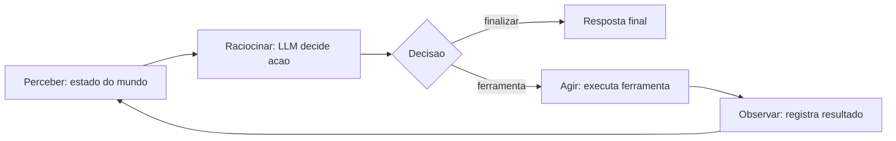

# Capítulo 2: Capítulo 2: O agent loop: perceber, raciocinar, agir

## Introdução

No capítulo anterior você aprendeu a distinguir um sistema genuinamente agêntico de um chatbot disfarçado, e construiu o esqueleto mínimo do agent loop — um laço com ferramentas, memória e limite de passos, mas sem cérebro. Este capítulo coloca o cérebro no lugar: você vai implementar o **agent loop completo com um LLM real**, com protocolo de ferramentas, decisão de término e o ciclo de reflexão que torna a autonomia possível e auditável.

O agent loop — perceber, raciocinar, agir — é o coração de todo sistema de IA agêntico, do mais simples assistente ao orquestrador multiagente mais complexo [2]. A arquitetura orientadora da AWS o descreve com precisão cirúrgica: o agente percebe o estado do mundo, raciocina sobre ele


à luz de objetivos e políticas, age por meio de ferramentas e repete o ciclo observando os efeitos [25]. Compreender esse ciclo em profundidade não é teoria: é a diferença entre um script que chama uma API de LLM e um sistema que resolve problemas com autonomia responsável.

Ao final deste capítulo, você será capaz de implementar o agent loop de ponta a ponta em Python, com decisões de modelo, execução de ferramentas, gestão de erros e encerramento — exatamente a fundação que o OrquestraIA vai estender nos capítulos seguintes. E, mais importante, você entenderá por que cada elemento do loop existe: o limite de passos não é precaução burocrática, é a diferença entre autonomia e deriva.

## Explica

### A Anatomia do Loop

O agent loop é um ciclo de quatro fases que se repete até a tarefa terminar ou o limite ser atingido: **perceber**, **raciocinar**, **agir** e **observar**. A quarta fase — observar — é a que a maioria das implementações iniciantes esquece, e é exatamente ela que fecha o ciclo [25].

**Perceber**: o agente recebe o estado atual do mundo — a mensagem do usuário, o histórico da conversa, o resultado de ações anteriores, o contexto recuperado da memória. Percepção não é apenas "entrada": é a transformação de sinais brutos em contexto estruturado que o modelo pode raciocinar [16].

**Raciocinar**: o agente chama o modelo de linguagem com o contexto de percepção, os objetivos e o catálogo de ferramentas disponíveis. O modelo produz uma decisão: continuar (com uma ação específica) ou finalizar (com uma resposta). Em sistemas modernos, o raciocínio não é um pensamento solto: é uma **decisão estruturada** — o modelo escolhe uma ferramenta e argumentos, ou escolhe terminar [26].

**Agir**: o agente executa a ferramenta escolhida no mundo real — uma API, um banco de dados, uma função de negócio — com validação de entrada, tratamento de erro e registro. A ação é onde o agente sai do mundo das palavras e toca o mundo real [3].

**Observar**: o agente registra o resultado da ação (sucesso, falha, dados retornados) e o devolve ao contexto para a próxima iteração. É aqui que o ciclo se fecha: a observação alimenta a próxima percepção, permitindo que o agente ajuste o curso [26].

### O Contrato de Ferramentas

A ponte entre raciocínio e ação é o **contrato de ferramentas**: uma especificação formal de cada ferramenta — nome, descrição, parâmetros, tipos, retornos. O modelo não "chama" funções Python diretamente; ele produz uma intenção estruturada que o runtime valida e executa. Essa separação é o que torna o sistema seguro: a decisão é probabilística, a execução é determinística [3].

```json
{
  "nome": "consultar_estoque",
  "descricao": "Consulta a quantidade disponivel de um produto no estoque",
  "parametros": {
    "type": "object",
    "properties": {
      "produto": {"type": "string", "description": "SKU ou nome do produto"}
    },
    "required": ["produto"]
  }
}
```

O contrato exige três decisões de design que muitos projetos negligenciam: **descrição rica** (o modelo decide com base na descrição — descrições vagas geram escolhas erradas), **validação rigorosa** (nunca confie na saída do modelo: valide tipos, valores e permissões antes de executar) e **erros estruturados** (a ferramenta deve retornar observações de erro que o modelo possa interpretar e corrigir — um erro sem informação útil quebra o ciclo).

### Decisão de Término

O loop precisa saber quando parar. Existem três condições de término: **término por objetivo** (o modelo decide que a tarefa está resolvida e finaliza com uma resposta), **término por limite** (o número máximo de passos foi atingido — proteção contra loops infinitos) e **término por condição de negócio** (uma política externa, como "toda ação de reembolso exige aprovação humana", interrompe o ciclo). Um loop sem condição de término clara é um risco operacional, não uma liberdade [25].

## Ilustra

### O Cozinheiro que Degusta Próprio Prato

Imagine um cozinheiro profissional cozinhando para um cliente exigente. O cozinheiro **percebe** (lê a comanda, verifica a despensa), **raciocina** (o que preparar? qual a receita? o que falta?), **age** (corta, tempera, cozinha) e — este é o passo que o diferencia — **degusta antes de servir**. Se o


prato está salgado demais, ele ajusta e retoma o ciclo. Só serve quando o paladar confirma. O agente sem o loop é o cozinheiro que prepara pelo receituário cego: segue os passos escritos, serve o que saiu, e só descobre o erro pelo feedback do cliente — tarde demais.

O **observar** é a degustação do agente. Sem ele, o agente age às cegas: executa a ferramenta, recebe o resultado, e... continua como se nada tivesse acontecido. Com ele, o agente usa o resultado da própria ação como insumo da decisão seguinte — o ciclo de reflexão que transforma tentativa em aprendizado [26].



### O Diferencial da Observação

Aqui está o ponto sutil deste capítulo: a maioria dos sistemas que se dizem agentes implementa três fases — recebe entrada, chama o modelo, devolve resposta. É um loop sem fechamento. O agente real é o sistema com o arco completo, em que cada ação produz uma observação que realimenta a percepção. Essa


realimentação é o que permite corrigir rumo em tempo real: a ferramenta falhou? O agente lê o erro, decide uma abordagem alternativa, tenta de novo — dentro do limite. É também o que torna o sistema auditável: cada decisão e cada observação ficam registradas, formando a trilha que a governança vai exigir [4].

## Técnica

### O Agent Loop Completo com LLM

Agora vamos fechar o ciclo do Capítulo 1: o esqueleto ganha um LLM real no lugar da decisão fixa. Usamos a API de chat em sua forma mais portátil (interface OpenAI-compatível), que funciona com a maioria dos provedores — o Capítulo 9 aprofunda a escolha de framework e o Capítulo 17 a gestão de gateways:

```python
# agent_loop.py — o agent loop completo com LLM e ferramentas
import json
import os
from dataclasses import dataclass, field

class LLM:
    """Cliente mínimo OpenAI-compatível (troque pelo SDK do seu provedor)."""
    def __init__(self, modelo: str):
        import openai
        self.client = openai.OpenAI(api_key=os.getenv("LLM_API_KEY"))
        self.modelo = modelo

def chamar(self, mensagens: list, ferramentas: list) -> dict:
        resp = self.client.chat.completions.create(
            model=self.modelo,
            messages=mensagens,
            tools=ferramentas or None,
        )
        return resp.choices[0].message

@dataclass
class Agente:
    """Agente completo: percepção, raciocínio com LLM, ação e observação."""
    nome: str
    modelo: str
    ferramentas: dict = field(default_factory=dict)
    memoria: list = field(default_factory=list)
    limite_passos: int = 5

def __post_init__(self):
        self.llm = LLM(self.modelo)
        # contrato de ferramentas no formato esperado pelo modelo
        self.contrato = [
            {
                "type": "function",
                "function": {
                    "name": nome,
                    "description": fn.__doc__ or f"Executa {nome}",
                    "parameters": {"type": "object",
                                   "properties": {"*": {"type": "string"}}},
                },
            }
            for nome, fn in self.ferramentas.items()
        ]

def perceber(self, mensagem: str) -> list:
        """Percepção: monta o contexto completo para o modelo."""
        historico = [
            {"role": "user" if i % 2 == 0 else "assistant", "content": m}
            for i, m in enumerate(self.memoria[-6:])
        ]
        return historico + [{"role": "user", "content": mensagem}]

def raciocinar(self, contexto: list) -> dict:
        """Raciocínio: o LLM decide agir (com ferramenta) ou finalizar."""
        msg = self.llm.chamar(contexto, self.contrato)
        if getattr(msg, "tool_calls", None):
            chamada = msg.tool_calls[0].function
            return {
                "acao": chamada.name,
                "argumentos": json.loads(chamada.arguments or "{}"),
                "finalizar": False,
            }
        return {"acao": "responder", "argumentos": {"texto": msg.content},
                "finalizar": True}

def agir(self, decisao: dict) -> str:
        """Ação: executa a ferramenta com validação e retorna observação."""
        nome = decisao["acao"]
        if nome == "responder":
            return decisao["argumentos"]["texto"]
        fn = self.ferramentas.get(nome)
        if fn is None:
            return f"ERRO: ferramenta '{nome}' não existe"
        try:
            return str(fn(**decisao.get("argumentos", {})))
        except TypeError as e:
            return f"ERRO de argumentos: {e}"
        except Exception as e:
            return f"ERRO na execução: {e}"

def executar(self, mensagem: str) -> str:
        """O agent loop completo: perceber -> raciocinar -> agir -> observar."""
        observacao_atual = mensagem
        for passo in range(1, self.limite_passos + 1):
            contexto = self.perceber(observacao_atual)
            decisao = self.raciocinar(contexto)
            observacao = self.agir(decisao)
            self.memoria.append(f"passo {passo}: {decisao['acao']} -> {observacao[:80]}")
            if decisao.get("finalizar"):
                return observacao
            # Observação realimenta a próxima percepção — o ciclo se fecha
            observacao_atual = f"Resultado de {decisao['acao']}: {observacao}"
        return "Limite de passos atingido sem concluir a tarefa."

# Ferramentas do domínio (com docstrings que viram descrição do contrato)
def consultar_estoque(produto: str = "") -> str:
    """Consulta o estoque atual de um produto."""
    estoque = {"x-100": 12, "x-200": 0, "x-300": 45}
    qtd = estoque.get(produto.lower(), 0)
    return f"estoque de {produto}: {qtd} unidades"

def registrar_pedido(cliente: str = "", produto: str = "") -> str:
    """Registra um novo pedido para um cliente."""
    return f"pedido de {produto} registrado para {cliente} (id: P-7841)"

agente = Agente(
    nome="atendente",
    modelo=os.getenv("LLM_MODELO", "gpt-4o-mini"),
    ferramentas={"consultar_estoque": consultar_estoque,
                 "registrar_pedido": registrar_pedido},
)
resultado = agente.executar(
    "O cliente Maria quer saber se o produto x-100 está em estoque"
    " e, se estiver, registrar um pedido para ela."
)
print(resultado)
print("TRILHA:", agente.memoria)
```

Repare nos três elementos de engenharia que separam este código de um exemplo didático: **erros estruturados** (a exceção vira observação que o modelo pode interpretar — uma string de erro crua quebraria o loop), **limite de passos** (proteção contra deriva) e **trilha de memória** (cada passo registrado para auditoria). A execução real depende da variável de ambiente `LLM_API_KEY`; o Capítulo 17 mostra como proteger e gerenciar chaves via gateway.

### Lidando com Erros no Loop

O erro não é uma exceção ao ciclo — é parte dele. Quando a ferramenta falha, o agente precisa de informação suficiente na observação de erro para decidir a alternativa certa. A boa prática é o padrão **tente → observe → corrija**: o erro estruturado volta como observação, o modelo interpreta (argumentos inválidos? serviço indisponível? política negada?), e a próxima iteração tenta o caminho correto. Esse padrão reduz drasticamente as falhas de primeira tentativa, mas exige o limite de passos para não virar um loop de tentativas cegas [3].

### Checklist de Implementação

- [ ] Contrato de ferramentas com **descrições ricas** (o modelo decide por elas)
- [ ] Validação de argumentos **antes** da execução (nunca confie na saída do modelo)
- [ ] Erros retornados como **observações estruturadas**, não exceções silenciosas
- [ ] Condição de término clara: objetivo, limite e política de negócio
- [ ] Trilha completa de decisões e observações para auditoria

## Aplica

### O Loop em Produção

O agent loop não é uma abstração acadêmica: é o padrão que sustenta os assistentes de suporte que reduzem tempo de resolução e melhoram a satisfação do cliente, porque cada interação é uma sequência de percepção-ação-observação sobre sistemas reais — CRM, transportadora, catálogo [27]. No OrquestraIA, o mesmo loop aparece três vezes em escalas diferentes: dentro de cada agente especialista (atendimento, vendas, análise), no orquestrador que coordena os agentes (Capítulo 10) e na reflexão pós-tarefa que alimenta a memória (Capítulo 6).

A escolha do escopo do loop é a decisão de arquitetura mais importante dos primeiros projetos. Um loop estreito (uma tarefa, poucas ferramentas, limite baixo) entrega valor rápido e seguro; um loop amplo (missão longa, dezenas de ferramentas, autonomia alta) multiplica risco e custo. A recomendação prática: **comece estreito e alargue com evidência** — cada camada de autonomia deve ser justificada por dados de avaliação, não por otimismo [11].

### Armadilhas Comuns

1. **Loop sem observação**: o agente executa a ferramenta e descarta o resultado — o ciclo não fecha e o sistema vira um chatbot com truques.
2. **Ferramentas com descrições vagas**: "faz coisas com dados" gera escolhas erradas. A descrição é parte da engenharia.
3. **Sem limite de passos**: um agente que não sabe quando parar pode executar ações reais em sequência indefinida — o pior cenário de um sistema autônomo.
4. **Ignorar erros estruturados**: falha retornada como texto solto que o modelo não consegue interpretar.

### Conexão com o OrquestraIA

O `Agente` deste capítulo é o núcleo que o Capítulo 10 vai evoluir para o orquestrador do OrquestraIA: a mesma estrutura de loop, com a adição de agenda de tarefas, roteamento entre especialistas e reflexão pós-tarefa.

### Aprofundamento: O Protocolo de Reflexão Pós-Ação

O loop que implementamos decide o próximo passo com base na observação — mas há um refinamento que separa os sistemas que apenas reagem dos que **refletem**: a reflexão pós-ação. Em vez de apenas alimentar a observação de volta ao contexto, o agente dedica um passo — ou um modelo separado — para avaliar criticamente o que acabou de acontecer antes de decidir o próximo movimento [4][26].

O protocolo tem quatro momentos, aplicados a cada ação: **avaliar** (o resultado confirma a hipótese? o objetivo avançou?), **diagnosticar** (se não avançou, por quê? argumentos errados, ferramenta errada, suposição quebrada?), **corrigir** (o que mudar na próxima tentativa — a mensagem, os argumentos, a abordagem?) e **registrar** (a reflexão entra na trilha e, quando relevante, na memória episódica). A implementação mínima cabe em poucas linhas e é o maior salto de qualidade por linha de código no loop:

```python
# reflexao.py — a reflexao pos-acao dentro do loop
class LoopComReflexao:
    """Loop ReAct com reflexao pos-acao antes da proxima decisao."""
    def __init__(self, llm, ferramentas, limite=6):
        self.llm, self.ferramentas, self.limite = llm, ferramentas, limite
        self.trilha = []

def executar(self, missao: str) -> str: estado = missao for _ in range(self.limite): decisao = self.llm.chamar_simples( f"Ferramentas: {list(self.ferramentas)}. Estado: {estado}\n" "Acao(argumentos) ou FINAL:<resposta>") self.trilha.append(decisao) if decisao.startswith("FINAL:"): return decisao[6:].strip() nome, args = self._parsear(decisao) observacao = self.ferramentas[nome](**args) self.trilha.append(f"OBS: {observacao}") # REFLEXAO: avalia a acao antes de seguir reflexao


= self.llm.chamar_simples( f"A acao {nome}({args}) produziu: {observacao}.\n" "Avalie: avancou o objetivo? Se sim responda SEGUIR; " "se nao, responda CORRIGIR e a correcao.") self.trilha.append(f"REFLEXAO: {reflexao}") if reflexao.upper().startswith("CORRIGIR"): estado = (f"Corrigir: {reflexao[8:].strip()} | " f"ultima observacao: {observacao}") else: estado = f"Observacao de {nome}: {observacao}" return "limite atingido"

def _parsear(self, decisao: str):
        import re
        m = re.match(r"(\w+)\((.+)\)", decisao.strip())
        if not m:
            return "nulo", {}
        args = dict(re.findall(r"(\w+)=([^,]+)", m.group(2)))
        return m.group(1), args
```

O custo da reflexão é uma chamada extra por ação — e o retorno é medido, não presumido: com reflexão, a taxa de sucesso em tarefas de múltiplos passos tende a subir porque o agente corrige o rumo no meio, em vez de acumular erro até o limite. A decisão de usar reflexão em cada passo (caro) ou apenas quando a observação sinaliza falha (barato) é calibrada pelos evals do Capítulo 13 [4].

### A Transição da Reflexão para a Política

A reflexão individual ganha uma segunda vida quando vira **política**: o padrão de correção que a reflexão descobre repetidamente ("argumentos de moeda precisam de validação antes de qualquer ferramenta financeira") vira regra no contexto ou caso no golden set — o mecanismo pelo qual a operação ensina o sistema. É o primeiro elo entre o loop do Capítulo 2 e o ciclo de operação do Capítulo 19: o agente que reflete produz as lições que o sistema aprende [8].

### Aprofundamento: O Loop e a Janela de Contexto — O Trade-off Estrutural

O loop tem uma tensão estrutural que todo engenheiro de sistemas agênticos enfrenta cedo: **cada iteração reenvia o contexto inteiro — e o contexto cresce com a iteração** (o histórico da conversa, as observações acumuladas), fazendo o custo subir a cada passo (Capítulo 16) e a janela apertar. As três respostas ao trade-off: **compactação** (o histórico antigo vira resumo — a memória de curto prazo do Capítulo 6), **seletividade** (apenas as observações relevantes entram no contexto da próxima iteração


— o contexto selecionado do Capítulo 5) e **estado externo** (o que não precisa estar na janela vive no banco — a memória de longo prazo do Capítulo 6). A regra de ouro: **a janela guarda o que a próxima decisão precisa — nada mais** — e o orçamento de contexto (Capítulo 5) é a disciplina que implementa a regra. O loop sem a disciplina da janela é o sistema que funciona na demo e custa caro em produção [16].

### O Loop com Múltiplos Modelos: O Roteamento por Passo

O loop do capítulo usa um modelo — e o refinamento de produção usa **modelos diferentes por tipo de passo**: o passo de decisão (escolher a ferramenta) usa um modelo capaz com function calling; o passo de extração (extrair a entidade do texto) usa um modelo pequeno e barato; o passo de síntese (compor a resposta final) usa o modelo de melhor qualidade. O roteamento por passo é a otimização estrutural mais profunda do custo (Capítulo


16) e é implementada pelo gateway do Capítulo 17 — o loop pede ao gateway o modelo da classe do passo, e o gateway decide o provedor e o modelo (Capítulo 17). A decisão de qual modelo para qual passo é medida: o golden set do Capítulo 13 valida que o modelo pequeno mantém a qualidade da extração antes de ele entrar no fluxo — a otimização sem medida é a degradação com outro nome [4][16].

## Conclusão

Três pontos para levar: **primeiro**, o agent loop é um ciclo de quatro fases — perceber, raciocinar, agir e observar — e a observação é a fase que a maioria das implementações esquece, exatamente a que fecha o ciclo e permite correção de rumo. **Segundo**, a ponte entre o


LLM e o mundo é o contrato de ferramentas: decisão probabilística na escolha, execução determinística e validada no runtime, com erros estruturados que realimentam o ciclo. **Terceiro**, o loop completo cabe em ~80 linhas de Python — e é essa fundação mínima que sustenta todos os sistemas agênticos do mercado.

O próximo capítulo amplia o zoom: das arquiteturas de agente — do agente simples ao sistema multiagente com orquestrador, subagentes e padrões de roteamento — e quando usar cada uma.

**Desafio opcional**: adicione uma ferramenta `calcular_frete(destino, peso)` ao agente do capítulo e faça o loop resolver "quero o frete de um pacote de 2kg para São Paulo, e se for menor que R$ 30, registrar o pedido". Rode sem API, observando a trilha; depois, se tiver chave de API, rode com o LLM e compare os caminhos escolhidos.

## Para se aprofundar

Este capítulo faz parte do e-book **Fundamentos da Autonomia**, extraído da obra completa *IA Agêntica Desbloqueada: Um guia para projetar, construir e implantar sistemas de IA autônomos*. No livro-mãe, você encontra o mesmo conteúdo com aprofundamento técnico adicional: diagramas Mermaid, blocos de código executáveis, referências ABNT verificáveis e a narrativa completa do projeto OrquestraIA — do primeiro agente ao monitoramento em produção.

Se este e-book despertou sua atenção para a construção de sistemas de IA autônomos, o próximo passo natural é levar o aprendizado para o seu próprio contexto: escolha um problema pequeno e bem delimitado, desenhe o agent loop com uma única ferramenta e uma única política de autonomia, e meça o resultado antes de escalar. A autonomia é uma concessão que se conquista com evidência.

**Quer continuar?** Explore os demais e-books da série: *Fundamentos da Autonomia* é apenas uma parte do caminho — os outros volumes cobrem o desenho do sistema, a construção prática, a governança e a operação contínua.
