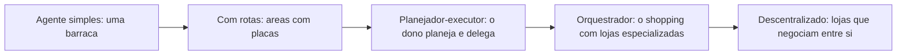

# Capítulo 3: Capítulo 3: Arquiteturas de agente: do simples ao multiagente

## Introdução

O Capítulo 2 entregou o coração do sistema — o agent loop completo com LLM e ferramentas. Este capítulo responde à pergunta seguinte, a mais importante do projeto: **como estruturar agentes em torno de uma tarefa?** A resposta não é única. Existe um espectro de arquiteturas, do agente mais simples — um


loop com uma ou duas ferramentas — até sistemas multiagentes com orquestrador, especialistas, roteamento e colaboração entre agentes [1]. Cada ponto do espectro tem um custo e um benefício, e a escolha errada — um multiagente onde um agente simples bastaria — é uma das fontes mais comuns de sistemas caros e frágeis.

A boa notícia é que as arquiteturas seguem padrões reconhecíveis e bem documentados. A Microsoft documenta os padrões de orquestração de agentes com nomes e critérios de escolha [23]; o Google Cloud cataloga os padrões de design com os trade-offs de cada um [13]; e a pesquisa acadêmica sobre multiagentes mapeia as arquiteturas de coordenação, os protocolos de comunicação e os desafios abertos [1]. Este capítulo organiza esse conhecimento em um mapa prático: quando usar cada arquitetura, como desenhá-la e como migrar de uma para outra conforme a tarefa cresce.

Ao final, você será capaz de escolher a arquitetura certa para um problema dado — e de justificar a escolha com critérios objetivos: acoplamento, custo, latência, observabilidade e tolerância a falhas. Você também implementará os dois extremos do espectro: o agente simples com rotas e o sistema multiagente com orquestrador e subagentes — as duas pontas que o OrquestraIA vai unir.

## Explica

### O Espectro das Arquiteturas

Pense nas arquiteturas como um espectro com cinco pontos principais, cada um com um nível crescente de autonomia, custo e complexidade [13]:

**1. Agente simples (single-step / roteador)**: um loop com um LLM e ferramentas, sem subagentes. Ideal para tarefas bem delimitadas: consultar dados, transformar texto, executar uma operação de negócio. É a arquitetura do Capítulo 2 — e é a resposta certa para a maioria dos problemas do dia a dia.

**2. Agente com rotas (workflow agêntico)**: um fluxo com etapas fixas em que cada etapa é executada por um passo de LLM ou uma chamada de ferramenta. O roteamento decide qual caminho seguir em cada etapa. É determinístico na estrutura e flexível na execução — o padrão recomendado quando o fluxo é conhecido [3].

**3. Agente planejador-executor**: um agente planejador decompoõe a missão em subtarefas e executa cada uma, verificando o resultado — o padrão ReAct ampliado [25]. Útil para tarefas compostas com horizonte médio.

**4. Multiagente com orquestrador**: um orquestrador central coordena agentes especialistas (roteamento, delegação, consolidação). Cada especialista é um loop autônomo com suas próprias ferramentas. É o padrão do OrquestraIA [23].

**5. Multiagente descentralizado**: agentes conversam entre si sem controlador central — discussão, debate, votação (ChatDev, MetaGPT). Poderoso para tarefas criativas e de síntese, mas com custo de tokens alto e latência imprevisível [15][26].

### Os Padrões de Orquestração

Dentro dos sistemas multiagente, a Microsoft e o Google documentam padrões recorrentes que você vai reconhecer em qualquer arquitetura real [23][13]:

- **Orquestrador-empregados (router)**: um agente central decide qual especialista atende cada solicitação. Simples, mas o orquestrador é um gargalo e um ponto único de falha. - **Pipeline**: agentes em sequência, cada um transformando a saída do anterior. Ótimo para fluxos conhecidos (ingestão → análise → relatório), frágil se uma etapa falhar. - **Debate/crítica**: agentes com


perspectivas diferentes discutem uma resposta. Aumenta qualidade de decisões, multiplica custo. - **Hierárquico**: orquestrador que delega a suborquestradores, que coordenam especialistas. Escala bem, exige desenho cuidadoso de escopo. - **Caixa-preta vs. caixa-clara**: em arquiteturas caixa-clara, o fluxo é visível e auditável etapa a etapa; em caixa-preta, agentes delegam com confiança. Para produção regulada, prefira caixa-clara [21].

### Critérios de Escolha

Quatro critérios objetivos decidem o ponto do espectro: **acoplamento à tarefa** (a tarefa é única e bem definida? um agente simples resolve), **custo por interação** (cada agente extra multiplica chamadas de LLM — um multiagente de 5 agentes pode custar 10–30 chamadas por missão), **latência** (agentes em sequência somam


latência — serviços de chat exibem o primeiro token com pressa), e **tolerância a falhas** (mais agentes, mais pontos de falha; cada um precisa de retry e fallback). A regra de ouro é a mais antiga da engenharia: **a arquitetura mais simples que resolve o problema é a correta** [3].

## Ilustra

### Da Barraca Única ao Shopping

Imagine que você está montando uma operação de comércio. No começo, uma barraca única resolve: você atende, vende e entrega — é o **agente simples**. Quando o movimento cresce, você organiza a barraca com áreas: um atendente cuida de informações, outro de pagamentos, e uma placa indica qual fila usar — é o **agente com rotas**: fluxo fixo, decisão local.

Quando o negócio vira um shopping, um administrador central passa a coordenar: cada loja é especializada (sapatos, eletrônicos, alimentação) e o centro de informações do shopping decide para qual loja cada cliente deve ir — é o **orquestrador** com especialistas. O orquestrador não trabalha nas lojas: ele roteia, supervisiona e resolve conflitos [23]. E no modelo mais ousado, as próprias lojas negociam entre si — uma loja recomenda outra, faz parcerias, discute comissões — é o **multiagente descentralizado**: poderoso, mas caótico se não houver regras claras de convivência.



### A Analogia do Hospital

Uma segunda lente: o hospital. O **agente simples** é o clínico geral que resolve o que pode e encaminha o que não pode — um único ponto de decisão. O **multiagente com orquestrador** é o hospital real: a recepção (orquestrador) classifica o paciente, o pronto-socorro estabiliza, o especialista trata, o laboratório processa exames — cada área com suas ferramentas, todos coordenados por um fluxo clínico. O médico


que decide "isso é ortopedia, vou delegar ao ortopedista e depois revisar o laudo" é o padrão hierárquico com revisão humana — o mesmo desenho que a supervisão humana exige em produção [11]. A analogia ilumina a decisão de projeto mais importante: **quando a recepção erra a triagem, o paciente paga** — e no sistema de agentes, o orquestrador que roteia errado multiplica o erro pela cadeia.

## Técnica

### Arquitetura 1: Agente com Rotas (Workflow Agêntico)

Comece pelo padrão mais útil na prática: o fluxo com roteamento. A estrutura é determinística (as etapas são conhecidas) e cada etapa pode ser um passo de LLM ou uma ferramenta. Implementamos um fluxo de atendimento que classifica a intenção e roteia:

```python
# workflow_agenetico.py — fluxo com rotas: classifica e roteia
class WorkflowRoteador:
    """Fluxo fixo com decisões locais em cada etapa."""
    def __init__(self, llm, ferramentas):
        self.llm = llm
        self.ferramentas = ferramentas

def classificar_intencao(self, texto: str) -> str:
        """Etapa 1: decide o caminho (consulta, pedido, reclamacao)."""
        prompt = (
            "Classifique a intencao do cliente em uma de: "
            "consulta_estoque, registrar_pedido, reclamacao.\n"
            f"Texto: {texto}\nResponda apenas com a classe."
        )
        return self.llm.chamar_simples(prompt).strip().lower()

def executar(self, texto: str) -> str:
        """Executa o fluxo com roteamento por intencao."""
        intencao = self.classificar_intencao(texto)
        if intencao == "consulta_estoque":
            # rota A: extrai o produto e consulta
            produto = self.llm.chamar_simples(
                f"Extraia apenas o nome do produto desta frase: {texto}").strip()
            return self.ferramentas["consultar_estoque"](produto)
        if intencao == "registrar_pedido":
            # rota B: extrai cliente/produto e registra
            dados = self.llm.chamar_simples(
                f"Extraia cliente e produto no formato 'cliente|produto': {texto}")
            cliente, produto = dados.split("|")
            return self.ferramentas["registrar_pedido"](cliente, produto)
        # rota C: reclamacao -> escalar para humano
        return "Reclamacao registrada e escalada para um atendente humano."

# Uso (llm.chamar_simples encapsula uma chamada de chat com resposta curta)
# fluxo = WorkflowRoteador(llm, ferramentas)
# print(fluxo.executar("o cliente Maria quer saber se x-100 está em estoque"))
```

O padrão de rota é poderoso porque cada caminho é **testável isoladamente** — você valida cada rota com evidências, sem depender do comportamento probabilístico do roteador em cadeia. A Microsoft o recomenda como o primeiro passo antes de saltar para multiagente [23].

### Arquitetura 2: Orquestrador com Especialistas

O segundo padrão é o que o OrquestraIA usa: um orquestrador que roteia missões para agentes especialistas e consolida resultados:

```python
# orquestrador.py — o padrao orquestrador-empregados
from dataclasses import dataclass, field

@dataclass
class Orquestrador:
    """Central de atendimento do shopping: roteia e consolida."""
    nome: str
    especialistas: dict = field(default_factory=dict)
    limite_tentativas: int = 3

def registrar_especialista(self, nome: str, agente) -> None:
        self.especialistas[nome] = agente

def rotear(self, missao: str, especialista: str) -> str:
        """Delega a missao a um especialista, com tentativas e fallback."""
        if especialista not in self.especialistas:
            return f"Especialista '{especialista}' nao existe"
        agente = self.especialistas[especialista]
        for tentativa in range(1, self.limite_tentativas + 1):
            try:
                return agente.executar(missao)
            except Exception as e:
                if tentativa == self.limite_tentativas:
                    return f"Falha apos {tentativa} tentativas: {e}"
                missao = f"(tentativa {tentativa+1} apos erro {e}) {missao}"
        return "Falha inesperada"

def decidir_especialista(self, missao: str) -> str:
        """Decisao do roteador: qual especialista atende esta missao."""
        # No OrquestraIA real, essa decisao usa um LLM (Cap. 10).
        if any(k in missao.lower() for k in ("estoque", "pedido", "cliente")):
            return "atendimento"
        if "venda" in missao.lower() or "lead" in missao.lower():
            return "vendas"
        return "analise"

def executar(self, missao: str) -> str:
        especialista = self.decidir_especialista(missao)
        print(f"[{self.nome}] roteando para '{especialista}'")
        return self.rotear(missao, especialista)

# Montagem do sistema multiagente (especialistas sao instancias do Cap. 2)
# orquestra = Orquestrador("central")
# orquestra.registrar_especialista("atendimento", agente_atendimento)
# orquestra.registrar_especialista("vendas", agente_vendas)
# orquestra.registrar_especialista("analise", agente_analise)
# print(orquestra.executar("verificar estoque do produto x-200"))
```

Três decisões de engenharia aparecem aqui: **registro explícito de especialistas** (o orquestrador conhece o catálogo — nada de agentes descobertos dinamicamente no começo), **tentativas com backoff e fallback** (a delegação é tolerante a falhas) e **decisão de roteamento isolada** (o critério de roteamento é testável independentemente da execução).

### Checklist de Arquitetura

- [ ] A arquitetura mais simples que resolve o problema foi considerada primeiro?
- [ ] O fluxo é **conhecido**? → rotas. O fluxo é **desconhecido e composto**? → planejador ou multiagente
- [ ] Cada especialista tem **escopo e ferramentas** próprios e testáveis?
- [ ] O orquestrador tem **fallback e tentativas** para cada delegação?
- [ ] O **custo de tokens** e a **latência** da arquitetura foram estimados?

## Aplica

### Quando Cada Arquitetura Ganha o Dia

A escolha da arquitetura é uma decisão de negócio, não apenas técnica. Os dados de adoção de 2026 mostram que a maioria dos sistemas em produção usa as arquiteturas mais simples: agentes com rotas respondem pela maior parte dos casos de suporte e operação, porque os fluxos de negócio são, em sua maioria, conhecidos [8][10]. Os sistemas multiagente, por sua vez, dominam os casos em que a tarefa é composta e exige especialização: pipelines de dados, análise multi-fonte, geração de conteúdo coordenada [1].

O erro mais caro dos iniciantes é o **multiagente prematuro**: orquestrar cinco agentes para uma tarefa que um agente com rotas resolveria com um décimo do custo. O erro inverso — subdimensionar — é mais raro e menos custoso, porque a migração do simples para o complexo é incremental: o agente simples vira um especialista do multiagente quando a necessidade aparece [13].

Na prática, o caminho recomendado é: **comece com rotas, adicione um especialista quando uma rota ficar grande demais, adicione o orquestrador quando houver três ou mais especialistas coordenados, e só então considere colaboração descentralizada** — e apenas para tarefas que realmente exijam síntese multi-perspectiva [3][23].

### Armadilhas Comuns

1. **Multiagente prematuro**: custo multiplicado sem ganho de qualidade. Estime o custo por missão antes de orquestrar.
2. **Orquestrador gargalo**: todo o tráfego passa pelo central; se ele falha, tudo falha. Adicione fallback e fila.
3. **Especialistas sem escopo**: dois agentes com as mesmas ferramentas confundem o roteador e dobram o custo.
4. **Sem observabilidade entre agentes**: quando um agente recebe a saída de outro, quem audita a cadeia? Registre cada transição (Capítulo 16).

### Conexão com o OrquestraIA

O OrquestraIA usará o padrão orquestrador-especialistas (Capítulo 10), com três especialistas iniciais — atendimento, vendas e análise — cada um evoluindo do `Agente` do Capítulo 2, e o roteamento decisório baseado em LLM no lugar do `decidir_especialista` fixo.

### Aprofundamento: A Matriz de Seleção de Arquitetura

Para tomar a decisão de arquitetura com critérios — e não com intuição — use a matriz comparativa que consolida os trade-offs de cada padrão. A matriz cruza as cinco arquiteturas com as dimensões que importam na decisão: custo por missão, latência, testabilidade, ponto de falha e curva de implementação. Os valores são orientativos (a calibração exata vem dos evals do seu domínio — Capítulo 13), mas as ordens de grandeza são estáveis [1][20]:

| Arquitetura | Custo/missão | Latência | Testabilidade | Ponto de falha | Implementação |
|---|---|---|---|---|---|
| Agente simples | Baixo | Baixa | Alta | Nenhum crítico | Muito rápida |
| Com rotas | Baixo-médio | Baixa-média | Alta (por rota) | Roteador | Rápida |
| Planejador-executor | Médio | Média | Média | Planejador | Média |
| Orquestrador | Médio-alto | Média-alta | Média (por especialista) | Orquestrador | Média-alta |
| Descentralizado | Alto | Alta | Baixa | Qualquer agente | Alta |

A leitura da matriz tem duas regras. **Primeira**: suba o espectro apenas quando a tarefa exigir — o custo e a complexidade crescem em cada degrau, e o benefício só aparece quando a capacidade exigida (especialização, verificação independente, coordenação) é real [3]. **Segunda**: ao descer o espectro (de multiagente para rotas), a regressão de qualidade é pequena se o fluxo é conhecido — mas o custo cai drasticamente; a maioria dos sistemas em produção deveria estar nos dois primeiros degraus [8].

A decisão final é documentada num ADR (Architecture Decision Record) — o registro que responde: qual o problema, quais as opções, qual a escolha e por quê, com os dados que a justificam. O ADR do OrquestraIA (Capítulo 9) documentou a escolha do código puro sobre o


LangGraph com três critérios: complexidade do fluxo (conhecida — rotas e orquestração simples), exigências de produção (observabilidade sob medida) e equipe (domínio total do código puro). Quando um dos critérios mudar, o ADR é revisado — a documentação de decisão é um artefato vivo, não um monumento [3][16].

### O Padrão de Migração Incremental

A migração entre arquiteturas não precisa ser uma reescrita: ela segue o padrão incremental que este capítulo defendeu. O agente simples vira a rota de um workflow (adicione o classificador); a rota que cresce vira especialista (promova a rota a agente dedicado); três especialistas viram orquestração (adicione o orquestrador do Capítulo 10); e o


orquestrador que cresce vira hierarquia (adicione suborquestradores — Capítulo 12). Cada migração preserva as ferramentas, a memória e o contexto — o que muda é a coordenação, não o núcleo. Esse padrão é o que torna a decisão de arquitetura reversível: escolha errou? O custo de corrigir é uma migração medida, não uma reconstrução [20].

## Conclusão

Três pontos para levar: **primeiro**, as arquiteturas formam um espectro — do agente simples ao multiagente descentralizado — e a escolha certa é a mais simples que resolve o problema, decidida por critérios objetivos de acoplamento, custo, latência e falhas. **Segundo**, os padrões de orquestração


(roteador, pipeline, hierárquico, debate) são blocos reconhecíveis, documentados pela Microsoft e pelo Google, que você aprende a reconhecer em qualquer arquitetura. **Terceiro**, a migração é incremental: comece com rotas, especialize quando a rota crescer, orquestre quando houver especialistas, e evite o multiagente prematuro a todo custo.

O próximo capítulo mergulha nos fundamentos científicos que sustentam essas arquiteturas: o padrão ReAct (raciocinar e agir de forma intercalada), os modelos de memória e as abordagens de planejamento — a teoria que explica por que os padrões funcionam.

**Desafio opcional**: pegue um fluxo do seu trabalho (atendimento, financeiro, dados) e desenhe-o no espectro: qual arquitetura resolveria? Liste as rotas do fluxo e identifique onde um especialista emergiria. Depois, estime o custo de tokens de cada abordagem para o mesmo volume.

## Para se aprofundar

Este capítulo faz parte do e-book **Fundamentos da Autonomia**, extraído da obra completa *IA Agêntica Desbloqueada: Um guia para projetar, construir e implantar sistemas de IA autônomos*. No livro-mãe, você encontra o mesmo conteúdo com aprofundamento técnico adicional: diagramas Mermaid, blocos de código executáveis, referências ABNT verificáveis e a narrativa completa do projeto OrquestraIA — do primeiro agente ao monitoramento em produção.

Se este e-book despertou sua atenção para a construção de sistemas de IA autônomos, o próximo passo natural é levar o aprendizado para o seu próprio contexto: escolha um problema pequeno e bem delimitado, desenhe o agent loop com uma única ferramenta e uma única política de autonomia, e meça o resultado antes de escalar. A autonomia é uma concessão que se conquista com evidência.

**Quer continuar?** Explore os demais e-books da série: *Fundamentos da Autonomia* é apenas uma parte do caminho — os outros volumes cobrem o desenho do sistema, a construção prática, a governança e a operação contínua.
