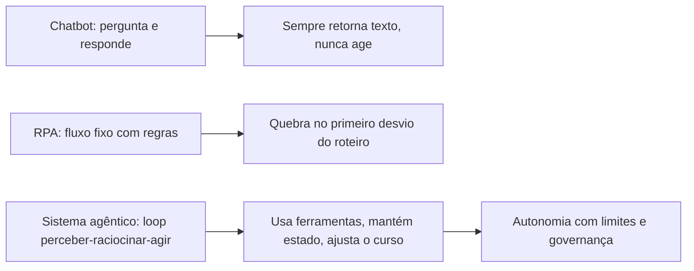
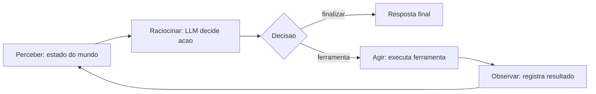
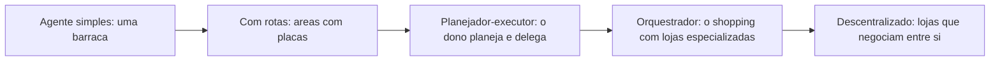
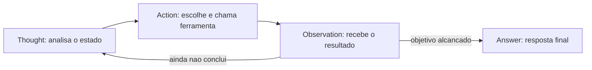

# Fundamentos da Autonomia

# Capítulo 1: Capítulo 1: O que é IA Agêntica (e o que ela não é)

## Introdução

Imagine uma operação de atendimento que não dorme. Às três da manhã, um cliente envia uma mensagem confusa sobre um pedido atrasado; à mesma hora, um sistema analisa o histórico, consulta a transportadora, identifica que o pacote foi extraviado e aciona a reposição — tudo sem que nenhum humano tenha acordado para apertar um botão. Isso


não é automação tradicional, em que cada passo é uma regra escrita por mãos humanas. É um **sistema de IA agêntico**: uma arquitetura em que modelos de linguagem de grande escala (LLMs) deixam de ser meros respondedores de perguntas para se tornarem entidades que percebem, raciocinam e agem de forma autônoma, dentro de limites deliberadamente desenhados [8].

Este livro é um guia prático para projetar, construir e implantar esse tipo de sistema. O fio condutor é o **OrquestraIA**, um sistema de agentes que você vai erguer do zero — da primeira linha de código à operação em produção — integrando suporte ao cliente, vendas e análise de dados em uma única orquestração. Cada capítulo combina fundamento teórico, diagrama, código executável, aplicação real e referências verificáveis, seguindo a metodologia EITA (Introdução, Explica, Ilustra, Técnica, Aplica, Conclusão, Referências).

Este primeiro capítulo define com precisão o que é IA agêntica e, com igual rigor, o que ela **não** é. A distinção importa porque o mercado de 2026 está repleto de produtos que se autodenominam "agentes" sem sê-lo: chatbots com tempero, assistentes com memória de conversa e automações RPA com interface bonita. Compreender


a linha divisória é o que separa quem constrói sistemas que entregam valor real de quem compra jargão. Ao final, você será capaz de explicar — para um cliente, um gestor ou um recrutador — o que torna um sistema genuinamente agêntico, e por que essa definição orienta cada decisão técnica dos capítulos seguintes.

## Explica

Comece pela definição que usaremos em toda a obra: **IA agêntica é a classe de sistemas em que um ou mais modelos de linguagem operam dentro de um loop de perceber–raciocinar–agir — o agent loop — com capacidade de usar ferramentas, manter estado e ajustar seu comportamento com base


nos resultados de suas próprias ações** [25]. Cada elemento dessa definição é um requisito, não um adorno. Sem o loop, você tem um gerador de texto. Sem ferramentas, você tem um conversador. Sem estado, você tem um reinício a cada prompt. Sem auto-ajuste, você tem um script que finge pensar.

A distinção mais importante para quem está começando é entre três classes de software que parecem iguais, mas são profundamente diferentes. A primeira é o **chatbot tradicional**: um sistema que recebe uma mensagem, gera uma resposta e encerra o ciclo. Ele não tem intenção de alterar o mundo — não agenda reuniões, não atualiza bancos de dados, não executa código. A segunda é a **automação dirigida por


regras** (RPA clássica): um sistema que executa um fluxo fixo, com condicionais explícitas escritas por humanos, quebrando quando o mundo se desvia do roteiro. A terceira, e a que este livro constrói, é o **sistema agêntico**: uma entidade que interpreta intenções ambíguas, escolhe entre caminhos possíveis, usa ferramentas para agir sobre o mundo e aprende com o resultado — dentro de limites e políticas definidos por humanos [31].

A hierarquia entre essas classes tem consequências práticas imediatas. Um chatbot pode ser construído com um único prompt e uma API; um sistema agêntico exige orquestração, memória, ferramentas, observabilidade e governança. A pesquisa de adoção confirma a explosão: o Gartner previu que 40% das aplicações empresariais incorporariam agentes de IA específicos de tarefa até 2026, contra menos de 5% em 2025 [12]. Dados compilados do ecossistema mostram que


a maioria das empresas que experimentam agentes ainda está na fase piloto, com uma fração pequena escalando para produção — a lacuna, mais uma vez, não está no modelo, mas no sistema ao redor dele [8]. A McKinsey observa que a confiança — não a capacidade — é o gargalo estrutural da adoção agêntica: empresas confiam em LLMs para gerar texto, mas hesitam em delegar ações com consequências [21].

Pare e reflita sobre o que isso significa para você. Se o gargalo é a confiança e a confiança se constrói com arquitetura, governança e evidência, então o seu trabalho nesta obra é aprender a desenhar sistemas que mereçam confiança. É por isso que o Capítulo 2 apresenta


o agent loop em detalhe, e é por isso que metade deste livro trata de memória, ferramentas, avaliação, segurança e supervisão humana — e não apenas de "como chamar uma API de LLM". O modelo é o motor; a arquitetura é o veículo; a governança é o motorista [32].

Uma ressalva honesta antes de continuar: agentes autônomos baseados em LLM ainda têm limitações estruturais bem documentadas. As pesquisas de levantamento acadêmico mapeiam tanto as capacidades quanto as fragilidades: agentes excelentes em tarefas bem definidas com feedback rápido, e frágeis em horizontes longos com requisitos ambíguos [31]. Erros de planejamento, alucinação de ferramentas e deriva de objetivos são riscos reais que este livro ensina a mitigar — não a negar. A maturidade, portanto, não é uma propriedade da tecnologia: é uma propriedade sua, construída capítulo a capítulo [30].

## Ilustra

### A Fábrica com Gerentes de Verdade

Volte à sua operação de atendimento. Na era do chatbot, a empresa contratou um atendente que só fala: recebe o pedido de informação e devolve uma resposta, sem nunca tocar nos sistemas. Na era da automação dirigida por regras, a empresa contratou um robô de esteira: perfeito enquanto as caixas chegam na ordem prevista, mas paralisa no primeiro desvio — uma caixa invertida, um pedido duplicado, um cliente furioso.

O sistema agêntico é outra coisa: é a fábrica com gerentes de verdade. O **OrquestraIA** não é um atendente nem um robô; é o gerente de operações. Ele percebe (o cliente está insatisfeito e o pedido está atrasado), raciocina (qual é a causa mais provável? qual a política de compensação?), age (consulta a transportadora, atualiza o status, dispara a reposição) e volta a perceber (a reposição foi confirmada? o cliente respondeu?) — repetindo o ciclo até a tarefa estar resolvida ou o limite de autonomia ser atingido.



### A Diferença entre Responder e Agir

Aqui está o ponto mais difícil deste capítulo — e por isso ele merece uma segunda camada de analogia. A primeira camada mostrou a mecânica: chatbot fala, RPA obedece roteiro, agente decide. A segunda camada é sobre o que torna o agente traiçoeiro: a **ilusão de entendimento**.

Imagine um estagiário muito articulado. Ele responde qualquer pergunta com fluência e confiança, mas nunca verifica nada: não abre a planilha, não confere o estoque, não liga para a transportadora. Na maior parte do tempo, ele acerta — porque muita coisa é previsível. Mas, quando acerta por sorte, você não consegue saber se ele acertou por competência. Um sistema agêntico mal projetado é exatamente isso: um falador fluente com as mãos amarradas. A revolução agêntica não está na fala — os


LLMs já falavam bem — está nas **mãos**: a capacidade de usar ferramentas, executar ações e verificar resultados [33]. É o ciclo "observo o efeito da minha ação e uso isso para decidir a próxima" que transforma conversa em operação. Como engenheiro de sistemas agênticos, você vai perceber ao longo desta obra que a pergunta central de todo projeto não é "o que o agente deve dizer?", mas "o que o agente deve **fazer**, e como sabemos que fez certo?" [4].

## Técnica

### O Teste dos Cinco Critérios

A primeira ferramenta técnica deste livro é um instrumento de diagnóstico que você vai aplicar a qualquer sistema que se apresente como "agente": o **Teste dos Cinco Critérios**. Ele responde à pergunta prática: "isso aqui é realmente um sistema agêntico, ou apenas marketing?" Use-o em produtos de fornecedores, em propostas internas e no seu próprio design.

1. **Loop**: o sistema executa múltiplas iterações de perceber–raciocinar–agir, ou apenas uma chamada única ao modelo? 2. **Ferramentas**: o sistema pode alterar o mundo — chamar APIs, executar código, gravar dados — ou apenas produzir texto? 3. **Estado**: o sistema mantém memória entre iterações (conversa, contexto,


resultados anteriores), ou recomeça do zero a cada passo? 4. **Auto-ajuste**: o sistema usa o resultado das próprias ações para decidir o próximo passo, ou segue um roteiro fixo? 5. **Limites**: o sistema opera dentro de políticas explícitas (permissões, escopo, limites de autonomia), ou age sem contenção?

Um sistema que falha em qualquer um dos critérios ainda pode ser útil — mas não é um sistema agêntico no sentido que este livro constrói. O critério 5 é o mais negligenciado e o mais importante: autonomia sem limites não é poder, é irresponsabilidade.

### O Esqueleto Mínimo de um Agente

Vamos transformar o diagnóstico em código. O esqueleto abaixo implementa o agent loop em sua forma mais pura — cerca de 60 linhas de Python, sem framework, para que você veja a mecânica sem a maquiagem. Ele define a estrutura que o OrquestraIA vai crescer para ocupar:

```python
# agente_esqueleto.py — o agent loop puro, sem framework
import json
from dataclasses import dataclass, field

@dataclass
class AgenteBase:
    """Estrutura mínima de um agente: loop perceber-raciocinar-agir."""
    nome: str
    modelo: str
    ferramentas: dict = field(default_factory=dict)
    memoria: list = field(default_factory=list)
    limite_passos: int = 5

def perceber(self, mensagem: str) -> dict:
        """Percepção: converte a entrada do mundo em contexto estruturado."""
        return {"mensagem": mensagem, "historico": self.memoria[-6:]}

def raciocinar(self, percepcao: dict) -> dict:
        """Raciocínio: decide o que fazer (substituído pela chamada ao LLM)."""
        # Na prática: llm.invoke(prompt + percepcao). A estrutura abaixo
        # documenta o contrato que o OrquestraIA vai exigir do modelo.
        return {"acao": "responder", "argumentos": {"texto": "ainda sem LLM"}}

def agir(self, decisao: dict) -> str:
        """Ação: executa a ferramenta escolhida e retorna a observação."""
        nome = decisao["acao"]
        if nome in self.ferramentas:
            return self.ferramentas[nome](**decisao.get("argumentos", {}))
        if nome == "responder":
            return decisao["argumentos"]["texto"]
        return f"ferramenta desconhecida: {nome}"

def executar(self, mensagem: str) -> str:
        """O agent loop completo, com limite de passos."""
        resultado = ""
        for _ in range(self.limite_passos):
            percepcao = self.perceber(mensagem)
            decisao = self.raciocinar(percepcao)
            observacao = self.agir(decisao)
            self.memoria.append(
                {"decisao": decisao, "observacao": observacao}
            )
            if decisao.get("finalizar"):
                return observacao
            resultado = observacao
            mensagem = f"Resultado da ação: {observacao}"
        return resultado

# Exemplo de uso: um agente com uma ferramenta de consulta de estoque
def consultar_estoque(produto: str = "") -> str:
    return f"estoque de {produto}: 12 unidades"

agente = AgenteBase(
    nome="atendente",
    modelo="llm-padrao",
    ferramentas={"consultar_estoque": consultar_estoque},
)
# A saída real exige um LLM conectado — o Capítulo 2 mostra como.
print(agente.executar("o cliente quer saber o estoque do produto X"))
```

Repare no que o esqueleto já garante: o loop (laço `for` com limite de passos), a interface de ferramentas (dicionário de callables), a memória (lista de decisões e observações) e o auto-ajuste (a observação alimenta a próxima iteração). O que falta é o LLM no `raciocinar` — e é exatamente isso que o Capítulo 2 entrega, substituindo a decisão fixa por uma chamada real ao modelo com o protocolo de ferramentas.

### Checklist de Projeto

Antes de seguir, aplique o checklist de sanidade a qualquer desenho de agente:

- [ ] O loop tem **limite de passos** e condição de término explícita?
- [ ] Cada ferramenta tem **contrato de entrada/saída** documentado?
- [ ] O agente registra **decisões e observações** para auditoria?
- [ ] Existe **política de autonomia**: o que o agente pode decidir sozinho e o que exige humano?
- [ ] Existe um **fallback** quando o agente não alcança o objetivo dentro dos limites?

## Aplica

### Onde a IA Agêntica Entrega Valor (e Onde Não)

O teste dos cinco critérios não é acadêmico: ele separa os casos em que a arquitetura agêntica compensa dos casos em que um chatbot ou uma automação tradicional resolve melhor — e mais barato. A regra de ouro: **use agente quando o problema exige interpretação de intenção ambígua, escolha entre caminhos e ação sobre o mundo; use regras quando o fluxo é determinístico e conhecido.**

No suporte ao cliente, a pesquisa é encorajadora: sistemas agênticos de atendimento melhoram a satisfação medida em CSAT, reduzindo simultaneamente o tempo de resolução — o ganho vem exatamente dos casos em que o agente vai além de responder: diagnostica, executa e verifica [27]. Na análise de dados, agentes que exploram bancos de dados, geram consultas e validam resultados entregam relatórios que respondem


a perguntas que o usuário nem formulou explicitamente — mas exigem os mesmos cinco critérios para não "inventar" números. No comércio e vendas, os agentes de qualificação e follow-up já operam com graus variados de autonomia, e a classificação de fornecedores por nível de autonomia revela uma lição central: quanto maior a autonomia, maior o retorno — e maior a exigência de governança [24].

Os riscos são igualmente mapeáveis. Os principais riscos de sistemas de IA em 2026 incluem a dependência excessiva de saídas não verificadas, a falta de rastreabilidade de decisões autônomas e a exposição crescente a ataques de manipulação de contexto [30]. A lição operacional é direta: **autonomia e governança devem crescer juntas.** Um sistema agêntico sem telemetria é um carro sem painel — e a telemetria não é um extra, é parte da arquitetura (aprofundada no Capítulo 16).

### Armadilhas Comuns de Quem Está Começando

1. **Tratar o agente como um chatbot melhor**: conectar um LLM a um prompt mais longo não cria um agente. Sem loop, ferramentas e estado, você tem um conversador eloquente. 2. **Autonomia total desde o primeiro dia**: comece com decisões de baixo impacto e supervisão humana; aumente a autonomia com evidência, não com entusiasmo. 3.


**Ignorar a observabilidade**: um agente que age sem registrar por quê é uma caixa-preta — o Capítulo 16 mostra o modelo de trilhas de decisão. 4. **Subestimar o custo dos tokens**: loops multiplicam chamadas ao modelo; um único fluxo pode custar 5–20 chamadas. O custo é uma decisão de arquitetura, não uma surpresa (Capítulo 16).

### Conexão com o OrquestraIA

No OrquestraIA, os cinco critérios viram decisões concretas de projeto: o loop será o orquestrador (Capítulo 10), as ferramentas serão as integrações com CRM, transportadora e banco (Capítulos 7 e 11), o estado será a memória (Capítulo 6), o auto-ajuste será a reflexão pós-ação (Capítulo 4) e os limites serão as políticas de segurança (Capítulo 14).

### Aprofundamento: O Panorama de Adoção em Números

A definição de IA agêntica ganha escala quando você conhece os números do mercado — e os dados ajudam a separar o fenômeno do modismo. O Gartner projeta que 40% das aplicações empresariais incorporarão agentes de IA específicos de tarefa até 2026, contra menos de 5% em 2025 — um salto de quase dez vezes em um ano [12]. A compilação de dados do ecossistema mostra o padrão de maturidade: a maioria


das empresas está em piloto, uma fração menor em produção, e uma fração menor ainda escalando para múltiplos fluxos — a pirâmide da adoção, com a base larga e o topo estreito [8]. A McKinsey, por sua vez, observa que o gargalo mudou de capacidade para confiança: as empresas confiam em LLMs para gerar texto, mas hesitam em delegar ações com consequência — exatamente o desafio de governança que este livro constrói [21].

Os números do suporte ilustram o retorno: sistemas agênticos de atendimento melhoram a satisfação medida em CSAT e reduzem o tempo de resolução [27], e os estudos de ROI de agentes de suporte documentam a redução de custo por contato [10]. A leitura honesta dos dados: o retorno é real nos fluxos conhecidos e medidos — e ilusório nos fluxos caóticos que a automação apenas amplifica (a mesma lição do Efeito Espelho que a pesquisa DORA documentou no desenvolvimento de software) [9].

### O Glossário do Campo: Termos que Você Vai Encontrar

O vocabulário do campo é a primeira barreira de entrada — e a lista essencial ajuda a navegar qualquer conversa técnica: **agente** (o loop perceber-raciocinar-agir com ferramentas), **agentic** (o adjetivo dos sistemas que agem, em oposição aos que apenas geram), **tool use / function calling** (o mecanismo de executar ferramentas a partir de decisão do modelo), **orquestração** (a coordenação de múltiplos agentes), **contexto** (o que o modelo vê em cada chamada — a


alavanca mais importante de qualidade), **memória** (o estado que persiste entre chamadas), **evals** (os testes sistemáticos de qualidade), **guardrails** (os limites de segurança), **HITL** (human-in-the-loop — a supervisão humana), **RAG** (a recuperação de conhecimento para o contexto) e **MCP** (o protocolo de conexão de ferramentas). Cada termo deste glossário é um capítulo desta obra — e dominar o vocabulário é o primeiro sinal de que você está no campo, não na borda [31][32].

## Conclusão

Você fez o primeiro movimento da jornada. Os três pontos principais deste capítulo: **primeiro**, IA agêntica é a classe de sistemas em que LLMs operam em um loop perceber–raciocinar–agir com ferramentas, estado e auto-ajuste — e essa definição é um contrato, não um slogan. **Segundo**, a distinção operacional que orienta tudo o que vem a seguir: chatbot


responde, RPA executa roteiro, agente decide e age dentro de limites — e o Teste dos Cinco Critérios é o instrumento para classificar qualquer sistema. **Terceiro**, o esqueleto técnico mínimo de um agente é surpreendentemente pequeno — um loop com ferramentas, memória e limite de passos — e é sobre esse esqueleto que o OrquestraIA será construído.

O próximo capítulo aprofunda o coração do sistema: o **agent loop**. Você vai implementar a versão completa com LLM real, protocolo de ferramentas e o ciclo de reflexão — e entender por que "perceber, raciocinar, agir" é mais do que uma frase bonita: é a arquitetura que torna a autonomia possível e auditável.

**Desafio opcional**: aplique o Teste dos Cinco Critérios a três ferramentas que você usa no trabalho ou no estudo. Classifique cada uma como chatbot, RPA ou sistema agêntico — e anote qual critério faltou em cada caso. Esse exercício de 15 minutos treina o olho que você usará em todos os capítulos seguintes.

## Para se aprofundar

Este capítulo faz parte do e-book **Fundamentos da Autonomia**, extraído da obra completa *IA Agêntica Desbloqueada: Um guia para projetar, construir e implantar sistemas de IA autônomos*. No livro-mãe, você encontra o mesmo conteúdo com aprofundamento técnico adicional: diagramas Mermaid, blocos de código executáveis, referências ABNT verificáveis e a narrativa completa do projeto OrquestraIA — do primeiro agente ao monitoramento em produção.

Se este e-book despertou sua atenção para a construção de sistemas de IA autônomos, o próximo passo natural é levar o aprendizado para o seu próprio contexto: escolha um problema pequeno e bem delimitado, desenhe o agent loop com uma única ferramenta e uma única política de autonomia, e meça o resultado antes de escalar. A autonomia é uma concessão que se conquista com evidência.

**Quer continuar?** Explore os demais e-books da série: *Fundamentos da Autonomia* é apenas uma parte do caminho — os outros volumes cobrem o desenho do sistema, a construção prática, a governança e a operação contínua.

# Capítulo 2: Capítulo 2: O agent loop: perceber, raciocinar, agir

## Introdução

No capítulo anterior você aprendeu a distinguir um sistema genuinamente agêntico de um chatbot disfarçado, e construiu o esqueleto mínimo do agent loop — um laço com ferramentas, memória e limite de passos, mas sem cérebro. Este capítulo coloca o cérebro no lugar: você vai implementar o **agent loop completo com um LLM real**, com protocolo de ferramentas, decisão de término e o ciclo de reflexão que torna a autonomia possível e auditável.

O agent loop — perceber, raciocinar, agir — é o coração de todo sistema de IA agêntico, do mais simples assistente ao orquestrador multiagente mais complexo [2]. A arquitetura orientadora da AWS o descreve com precisão cirúrgica: o agente percebe o estado do mundo, raciocina sobre ele


à luz de objetivos e políticas, age por meio de ferramentas e repete o ciclo observando os efeitos [25]. Compreender esse ciclo em profundidade não é teoria: é a diferença entre um script que chama uma API de LLM e um sistema que resolve problemas com autonomia responsável.

Ao final deste capítulo, você será capaz de implementar o agent loop de ponta a ponta em Python, com decisões de modelo, execução de ferramentas, gestão de erros e encerramento — exatamente a fundação que o OrquestraIA vai estender nos capítulos seguintes. E, mais importante, você entenderá por que cada elemento do loop existe: o limite de passos não é precaução burocrática, é a diferença entre autonomia e deriva.

## Explica

### A Anatomia do Loop

O agent loop é um ciclo de quatro fases que se repete até a tarefa terminar ou o limite ser atingido: **perceber**, **raciocinar**, **agir** e **observar**. A quarta fase — observar — é a que a maioria das implementações iniciantes esquece, e é exatamente ela que fecha o ciclo [25].

**Perceber**: o agente recebe o estado atual do mundo — a mensagem do usuário, o histórico da conversa, o resultado de ações anteriores, o contexto recuperado da memória. Percepção não é apenas "entrada": é a transformação de sinais brutos em contexto estruturado que o modelo pode raciocinar [16].

**Raciocinar**: o agente chama o modelo de linguagem com o contexto de percepção, os objetivos e o catálogo de ferramentas disponíveis. O modelo produz uma decisão: continuar (com uma ação específica) ou finalizar (com uma resposta). Em sistemas modernos, o raciocínio não é um pensamento solto: é uma **decisão estruturada** — o modelo escolhe uma ferramenta e argumentos, ou escolhe terminar [26].

**Agir**: o agente executa a ferramenta escolhida no mundo real — uma API, um banco de dados, uma função de negócio — com validação de entrada, tratamento de erro e registro. A ação é onde o agente sai do mundo das palavras e toca o mundo real [3].

**Observar**: o agente registra o resultado da ação (sucesso, falha, dados retornados) e o devolve ao contexto para a próxima iteração. É aqui que o ciclo se fecha: a observação alimenta a próxima percepção, permitindo que o agente ajuste o curso [26].

### O Contrato de Ferramentas

A ponte entre raciocínio e ação é o **contrato de ferramentas**: uma especificação formal de cada ferramenta — nome, descrição, parâmetros, tipos, retornos. O modelo não "chama" funções Python diretamente; ele produz uma intenção estruturada que o runtime valida e executa. Essa separação é o que torna o sistema seguro: a decisão é probabilística, a execução é determinística [3].

```json
{
  "nome": "consultar_estoque",
  "descricao": "Consulta a quantidade disponivel de um produto no estoque",
  "parametros": {
    "type": "object",
    "properties": {
      "produto": {"type": "string", "description": "SKU ou nome do produto"}
    },
    "required": ["produto"]
  }
}
```

O contrato exige três decisões de design que muitos projetos negligenciam: **descrição rica** (o modelo decide com base na descrição — descrições vagas geram escolhas erradas), **validação rigorosa** (nunca confie na saída do modelo: valide tipos, valores e permissões antes de executar) e **erros estruturados** (a ferramenta deve retornar observações de erro que o modelo possa interpretar e corrigir — um erro sem informação útil quebra o ciclo).

### Decisão de Término

O loop precisa saber quando parar. Existem três condições de término: **término por objetivo** (o modelo decide que a tarefa está resolvida e finaliza com uma resposta), **término por limite** (o número máximo de passos foi atingido — proteção contra loops infinitos) e **término por condição de negócio** (uma política externa, como "toda ação de reembolso exige aprovação humana", interrompe o ciclo). Um loop sem condição de término clara é um risco operacional, não uma liberdade [25].

## Ilustra

### O Cozinheiro que Degusta Próprio Prato

Imagine um cozinheiro profissional cozinhando para um cliente exigente. O cozinheiro **percebe** (lê a comanda, verifica a despensa), **raciocina** (o que preparar? qual a receita? o que falta?), **age** (corta, tempera, cozinha) e — este é o passo que o diferencia — **degusta antes de servir**. Se o


prato está salgado demais, ele ajusta e retoma o ciclo. Só serve quando o paladar confirma. O agente sem o loop é o cozinheiro que prepara pelo receituário cego: segue os passos escritos, serve o que saiu, e só descobre o erro pelo feedback do cliente — tarde demais.

O **observar** é a degustação do agente. Sem ele, o agente age às cegas: executa a ferramenta, recebe o resultado, e... continua como se nada tivesse acontecido. Com ele, o agente usa o resultado da própria ação como insumo da decisão seguinte — o ciclo de reflexão que transforma tentativa em aprendizado [26].



### O Diferencial da Observação

Aqui está o ponto sutil deste capítulo: a maioria dos sistemas que se dizem agentes implementa três fases — recebe entrada, chama o modelo, devolve resposta. É um loop sem fechamento. O agente real é o sistema com o arco completo, em que cada ação produz uma observação que realimenta a percepção. Essa


realimentação é o que permite corrigir rumo em tempo real: a ferramenta falhou? O agente lê o erro, decide uma abordagem alternativa, tenta de novo — dentro do limite. É também o que torna o sistema auditável: cada decisão e cada observação ficam registradas, formando a trilha que a governança vai exigir [4].

## Técnica

### O Agent Loop Completo com LLM

Agora vamos fechar o ciclo do Capítulo 1: o esqueleto ganha um LLM real no lugar da decisão fixa. Usamos a API de chat em sua forma mais portátil (interface OpenAI-compatível), que funciona com a maioria dos provedores — o Capítulo 9 aprofunda a escolha de framework e o Capítulo 17 a gestão de gateways:

```python
# agent_loop.py — o agent loop completo com LLM e ferramentas
import json
import os
from dataclasses import dataclass, field

class LLM:
    """Cliente mínimo OpenAI-compatível (troque pelo SDK do seu provedor)."""
    def __init__(self, modelo: str):
        import openai
        self.client = openai.OpenAI(api_key=os.getenv("LLM_API_KEY"))
        self.modelo = modelo

def chamar(self, mensagens: list, ferramentas: list) -> dict:
        resp = self.client.chat.completions.create(
            model=self.modelo,
            messages=mensagens,
            tools=ferramentas or None,
        )
        return resp.choices[0].message

@dataclass
class Agente:
    """Agente completo: percepção, raciocínio com LLM, ação e observação."""
    nome: str
    modelo: str
    ferramentas: dict = field(default_factory=dict)
    memoria: list = field(default_factory=list)
    limite_passos: int = 5

def __post_init__(self):
        self.llm = LLM(self.modelo)
        # contrato de ferramentas no formato esperado pelo modelo
        self.contrato = [
            {
                "type": "function",
                "function": {
                    "name": nome,
                    "description": fn.__doc__ or f"Executa {nome}",
                    "parameters": {"type": "object",
                                   "properties": {"*": {"type": "string"}}},
                },
            }
            for nome, fn in self.ferramentas.items()
        ]

def perceber(self, mensagem: str) -> list:
        """Percepção: monta o contexto completo para o modelo."""
        historico = [
            {"role": "user" if i % 2 == 0 else "assistant", "content": m}
            for i, m in enumerate(self.memoria[-6:])
        ]
        return historico + [{"role": "user", "content": mensagem}]

def raciocinar(self, contexto: list) -> dict:
        """Raciocínio: o LLM decide agir (com ferramenta) ou finalizar."""
        msg = self.llm.chamar(contexto, self.contrato)
        if getattr(msg, "tool_calls", None):
            chamada = msg.tool_calls[0].function
            return {
                "acao": chamada.name,
                "argumentos": json.loads(chamada.arguments or "{}"),
                "finalizar": False,
            }
        return {"acao": "responder", "argumentos": {"texto": msg.content},
                "finalizar": True}

def agir(self, decisao: dict) -> str:
        """Ação: executa a ferramenta com validação e retorna observação."""
        nome = decisao["acao"]
        if nome == "responder":
            return decisao["argumentos"]["texto"]
        fn = self.ferramentas.get(nome)
        if fn is None:
            return f"ERRO: ferramenta '{nome}' não existe"
        try:
            return str(fn(**decisao.get("argumentos", {})))
        except TypeError as e:
            return f"ERRO de argumentos: {e}"
        except Exception as e:
            return f"ERRO na execução: {e}"

def executar(self, mensagem: str) -> str:
        """O agent loop completo: perceber -> raciocinar -> agir -> observar."""
        observacao_atual = mensagem
        for passo in range(1, self.limite_passos + 1):
            contexto = self.perceber(observacao_atual)
            decisao = self.raciocinar(contexto)
            observacao = self.agir(decisao)
            self.memoria.append(f"passo {passo}: {decisao['acao']} -> {observacao[:80]}")
            if decisao.get("finalizar"):
                return observacao
            # Observação realimenta a próxima percepção — o ciclo se fecha
            observacao_atual = f"Resultado de {decisao['acao']}: {observacao}"
        return "Limite de passos atingido sem concluir a tarefa."

# Ferramentas do domínio (com docstrings que viram descrição do contrato)
def consultar_estoque(produto: str = "") -> str:
    """Consulta o estoque atual de um produto."""
    estoque = {"x-100": 12, "x-200": 0, "x-300": 45}
    qtd = estoque.get(produto.lower(), 0)
    return f"estoque de {produto}: {qtd} unidades"

def registrar_pedido(cliente: str = "", produto: str = "") -> str:
    """Registra um novo pedido para um cliente."""
    return f"pedido de {produto} registrado para {cliente} (id: P-7841)"

agente = Agente(
    nome="atendente",
    modelo=os.getenv("LLM_MODELO", "gpt-4o-mini"),
    ferramentas={"consultar_estoque": consultar_estoque,
                 "registrar_pedido": registrar_pedido},
)
resultado = agente.executar(
    "O cliente Maria quer saber se o produto x-100 está em estoque"
    " e, se estiver, registrar um pedido para ela."
)
print(resultado)
print("TRILHA:", agente.memoria)
```

Repare nos três elementos de engenharia que separam este código de um exemplo didático: **erros estruturados** (a exceção vira observação que o modelo pode interpretar — uma string de erro crua quebraria o loop), **limite de passos** (proteção contra deriva) e **trilha de memória** (cada passo registrado para auditoria). A execução real depende da variável de ambiente `LLM_API_KEY`; o Capítulo 17 mostra como proteger e gerenciar chaves via gateway.

### Lidando com Erros no Loop

O erro não é uma exceção ao ciclo — é parte dele. Quando a ferramenta falha, o agente precisa de informação suficiente na observação de erro para decidir a alternativa certa. A boa prática é o padrão **tente → observe → corrija**: o erro estruturado volta como observação, o modelo interpreta (argumentos inválidos? serviço indisponível? política negada?), e a próxima iteração tenta o caminho correto. Esse padrão reduz drasticamente as falhas de primeira tentativa, mas exige o limite de passos para não virar um loop de tentativas cegas [3].

### Checklist de Implementação

- [ ] Contrato de ferramentas com **descrições ricas** (o modelo decide por elas)
- [ ] Validação de argumentos **antes** da execução (nunca confie na saída do modelo)
- [ ] Erros retornados como **observações estruturadas**, não exceções silenciosas
- [ ] Condição de término clara: objetivo, limite e política de negócio
- [ ] Trilha completa de decisões e observações para auditoria

## Aplica

### O Loop em Produção

O agent loop não é uma abstração acadêmica: é o padrão que sustenta os assistentes de suporte que reduzem tempo de resolução e melhoram a satisfação do cliente, porque cada interação é uma sequência de percepção-ação-observação sobre sistemas reais — CRM, transportadora, catálogo [27]. No OrquestraIA, o mesmo loop aparece três vezes em escalas diferentes: dentro de cada agente especialista (atendimento, vendas, análise), no orquestrador que coordena os agentes (Capítulo 10) e na reflexão pós-tarefa que alimenta a memória (Capítulo 6).

A escolha do escopo do loop é a decisão de arquitetura mais importante dos primeiros projetos. Um loop estreito (uma tarefa, poucas ferramentas, limite baixo) entrega valor rápido e seguro; um loop amplo (missão longa, dezenas de ferramentas, autonomia alta) multiplica risco e custo. A recomendação prática: **comece estreito e alargue com evidência** — cada camada de autonomia deve ser justificada por dados de avaliação, não por otimismo [11].

### Armadilhas Comuns

1. **Loop sem observação**: o agente executa a ferramenta e descarta o resultado — o ciclo não fecha e o sistema vira um chatbot com truques.
2. **Ferramentas com descrições vagas**: "faz coisas com dados" gera escolhas erradas. A descrição é parte da engenharia.
3. **Sem limite de passos**: um agente que não sabe quando parar pode executar ações reais em sequência indefinida — o pior cenário de um sistema autônomo.
4. **Ignorar erros estruturados**: falha retornada como texto solto que o modelo não consegue interpretar.

### Conexão com o OrquestraIA

O `Agente` deste capítulo é o núcleo que o Capítulo 10 vai evoluir para o orquestrador do OrquestraIA: a mesma estrutura de loop, com a adição de agenda de tarefas, roteamento entre especialistas e reflexão pós-tarefa.

### Aprofundamento: O Protocolo de Reflexão Pós-Ação

O loop que implementamos decide o próximo passo com base na observação — mas há um refinamento que separa os sistemas que apenas reagem dos que **refletem**: a reflexão pós-ação. Em vez de apenas alimentar a observação de volta ao contexto, o agente dedica um passo — ou um modelo separado — para avaliar criticamente o que acabou de acontecer antes de decidir o próximo movimento [4][26].

O protocolo tem quatro momentos, aplicados a cada ação: **avaliar** (o resultado confirma a hipótese? o objetivo avançou?), **diagnosticar** (se não avançou, por quê? argumentos errados, ferramenta errada, suposição quebrada?), **corrigir** (o que mudar na próxima tentativa — a mensagem, os argumentos, a abordagem?) e **registrar** (a reflexão entra na trilha e, quando relevante, na memória episódica). A implementação mínima cabe em poucas linhas e é o maior salto de qualidade por linha de código no loop:

```python
# reflexao.py — a reflexao pos-acao dentro do loop
class LoopComReflexao:
    """Loop ReAct com reflexao pos-acao antes da proxima decisao."""
    def __init__(self, llm, ferramentas, limite=6):
        self.llm, self.ferramentas, self.limite = llm, ferramentas, limite
        self.trilha = []

def executar(self, missao: str) -> str: estado = missao for _ in range(self.limite): decisao = self.llm.chamar_simples( f"Ferramentas: {list(self.ferramentas)}. Estado: {estado}\n" "Acao(argumentos) ou FINAL:<resposta>") self.trilha.append(decisao) if decisao.startswith("FINAL:"): return decisao[6:].strip() nome, args = self._parsear(decisao) observacao = self.ferramentas[nome](**args) self.trilha.append(f"OBS: {observacao}") # REFLEXAO: avalia a acao antes de seguir reflexao


= self.llm.chamar_simples( f"A acao {nome}({args}) produziu: {observacao}.\n" "Avalie: avancou o objetivo? Se sim responda SEGUIR; " "se nao, responda CORRIGIR e a correcao.") self.trilha.append(f"REFLEXAO: {reflexao}") if reflexao.upper().startswith("CORRIGIR"): estado = (f"Corrigir: {reflexao[8:].strip()} | " f"ultima observacao: {observacao}") else: estado = f"Observacao de {nome}: {observacao}" return "limite atingido"

def _parsear(self, decisao: str):
        import re
        m = re.match(r"(\w+)\((.+)\)", decisao.strip())
        if not m:
            return "nulo", {}
        args = dict(re.findall(r"(\w+)=([^,]+)", m.group(2)))
        return m.group(1), args
```

O custo da reflexão é uma chamada extra por ação — e o retorno é medido, não presumido: com reflexão, a taxa de sucesso em tarefas de múltiplos passos tende a subir porque o agente corrige o rumo no meio, em vez de acumular erro até o limite. A decisão de usar reflexão em cada passo (caro) ou apenas quando a observação sinaliza falha (barato) é calibrada pelos evals do Capítulo 13 [4].

### A Transição da Reflexão para a Política

A reflexão individual ganha uma segunda vida quando vira **política**: o padrão de correção que a reflexão descobre repetidamente ("argumentos de moeda precisam de validação antes de qualquer ferramenta financeira") vira regra no contexto ou caso no golden set — o mecanismo pelo qual a operação ensina o sistema. É o primeiro elo entre o loop do Capítulo 2 e o ciclo de operação do Capítulo 19: o agente que reflete produz as lições que o sistema aprende [8].

### Aprofundamento: O Loop e a Janela de Contexto — O Trade-off Estrutural

O loop tem uma tensão estrutural que todo engenheiro de sistemas agênticos enfrenta cedo: **cada iteração reenvia o contexto inteiro — e o contexto cresce com a iteração** (o histórico da conversa, as observações acumuladas), fazendo o custo subir a cada passo (Capítulo 16) e a janela apertar. As três respostas ao trade-off: **compactação** (o histórico antigo vira resumo — a memória de curto prazo do Capítulo 6), **seletividade** (apenas as observações relevantes entram no contexto da próxima iteração


— o contexto selecionado do Capítulo 5) e **estado externo** (o que não precisa estar na janela vive no banco — a memória de longo prazo do Capítulo 6). A regra de ouro: **a janela guarda o que a próxima decisão precisa — nada mais** — e o orçamento de contexto (Capítulo 5) é a disciplina que implementa a regra. O loop sem a disciplina da janela é o sistema que funciona na demo e custa caro em produção [16].

### O Loop com Múltiplos Modelos: O Roteamento por Passo

O loop do capítulo usa um modelo — e o refinamento de produção usa **modelos diferentes por tipo de passo**: o passo de decisão (escolher a ferramenta) usa um modelo capaz com function calling; o passo de extração (extrair a entidade do texto) usa um modelo pequeno e barato; o passo de síntese (compor a resposta final) usa o modelo de melhor qualidade. O roteamento por passo é a otimização estrutural mais profunda do custo (Capítulo


16) e é implementada pelo gateway do Capítulo 17 — o loop pede ao gateway o modelo da classe do passo, e o gateway decide o provedor e o modelo (Capítulo 17). A decisão de qual modelo para qual passo é medida: o golden set do Capítulo 13 valida que o modelo pequeno mantém a qualidade da extração antes de ele entrar no fluxo — a otimização sem medida é a degradação com outro nome [4][16].

## Conclusão

Três pontos para levar: **primeiro**, o agent loop é um ciclo de quatro fases — perceber, raciocinar, agir e observar — e a observação é a fase que a maioria das implementações esquece, exatamente a que fecha o ciclo e permite correção de rumo. **Segundo**, a ponte entre o


LLM e o mundo é o contrato de ferramentas: decisão probabilística na escolha, execução determinística e validada no runtime, com erros estruturados que realimentam o ciclo. **Terceiro**, o loop completo cabe em ~80 linhas de Python — e é essa fundação mínima que sustenta todos os sistemas agênticos do mercado.

O próximo capítulo amplia o zoom: das arquiteturas de agente — do agente simples ao sistema multiagente com orquestrador, subagentes e padrões de roteamento — e quando usar cada uma.

**Desafio opcional**: adicione uma ferramenta `calcular_frete(destino, peso)` ao agente do capítulo e faça o loop resolver "quero o frete de um pacote de 2kg para São Paulo, e se for menor que R$ 30, registrar o pedido". Rode sem API, observando a trilha; depois, se tiver chave de API, rode com o LLM e compare os caminhos escolhidos.

## Para se aprofundar

Este capítulo faz parte do e-book **Fundamentos da Autonomia**, extraído da obra completa *IA Agêntica Desbloqueada: Um guia para projetar, construir e implantar sistemas de IA autônomos*. No livro-mãe, você encontra o mesmo conteúdo com aprofundamento técnico adicional: diagramas Mermaid, blocos de código executáveis, referências ABNT verificáveis e a narrativa completa do projeto OrquestraIA — do primeiro agente ao monitoramento em produção.

Se este e-book despertou sua atenção para a construção de sistemas de IA autônomos, o próximo passo natural é levar o aprendizado para o seu próprio contexto: escolha um problema pequeno e bem delimitado, desenhe o agent loop com uma única ferramenta e uma única política de autonomia, e meça o resultado antes de escalar. A autonomia é uma concessão que se conquista com evidência.

**Quer continuar?** Explore os demais e-books da série: *Fundamentos da Autonomia* é apenas uma parte do caminho — os outros volumes cobrem o desenho do sistema, a construção prática, a governança e a operação contínua.

# Capítulo 3: Capítulo 3: Arquiteturas de agente: do simples ao multiagente

## Introdução

O Capítulo 2 entregou o coração do sistema — o agent loop completo com LLM e ferramentas. Este capítulo responde à pergunta seguinte, a mais importante do projeto: **como estruturar agentes em torno de uma tarefa?** A resposta não é única. Existe um espectro de arquiteturas, do agente mais simples — um


loop com uma ou duas ferramentas — até sistemas multiagentes com orquestrador, especialistas, roteamento e colaboração entre agentes [1]. Cada ponto do espectro tem um custo e um benefício, e a escolha errada — um multiagente onde um agente simples bastaria — é uma das fontes mais comuns de sistemas caros e frágeis.

A boa notícia é que as arquiteturas seguem padrões reconhecíveis e bem documentados. A Microsoft documenta os padrões de orquestração de agentes com nomes e critérios de escolha [23]; o Google Cloud cataloga os padrões de design com os trade-offs de cada um [13]; e a pesquisa acadêmica sobre multiagentes mapeia as arquiteturas de coordenação, os protocolos de comunicação e os desafios abertos [1]. Este capítulo organiza esse conhecimento em um mapa prático: quando usar cada arquitetura, como desenhá-la e como migrar de uma para outra conforme a tarefa cresce.

Ao final, você será capaz de escolher a arquitetura certa para um problema dado — e de justificar a escolha com critérios objetivos: acoplamento, custo, latência, observabilidade e tolerância a falhas. Você também implementará os dois extremos do espectro: o agente simples com rotas e o sistema multiagente com orquestrador e subagentes — as duas pontas que o OrquestraIA vai unir.

## Explica

### O Espectro das Arquiteturas

Pense nas arquiteturas como um espectro com cinco pontos principais, cada um com um nível crescente de autonomia, custo e complexidade [13]:

**1. Agente simples (single-step / roteador)**: um loop com um LLM e ferramentas, sem subagentes. Ideal para tarefas bem delimitadas: consultar dados, transformar texto, executar uma operação de negócio. É a arquitetura do Capítulo 2 — e é a resposta certa para a maioria dos problemas do dia a dia.

**2. Agente com rotas (workflow agêntico)**: um fluxo com etapas fixas em que cada etapa é executada por um passo de LLM ou uma chamada de ferramenta. O roteamento decide qual caminho seguir em cada etapa. É determinístico na estrutura e flexível na execução — o padrão recomendado quando o fluxo é conhecido [3].

**3. Agente planejador-executor**: um agente planejador decompoõe a missão em subtarefas e executa cada uma, verificando o resultado — o padrão ReAct ampliado [25]. Útil para tarefas compostas com horizonte médio.

**4. Multiagente com orquestrador**: um orquestrador central coordena agentes especialistas (roteamento, delegação, consolidação). Cada especialista é um loop autônomo com suas próprias ferramentas. É o padrão do OrquestraIA [23].

**5. Multiagente descentralizado**: agentes conversam entre si sem controlador central — discussão, debate, votação (ChatDev, MetaGPT). Poderoso para tarefas criativas e de síntese, mas com custo de tokens alto e latência imprevisível [15][26].

### Os Padrões de Orquestração

Dentro dos sistemas multiagente, a Microsoft e o Google documentam padrões recorrentes que você vai reconhecer em qualquer arquitetura real [23][13]:

- **Orquestrador-empregados (router)**: um agente central decide qual especialista atende cada solicitação. Simples, mas o orquestrador é um gargalo e um ponto único de falha. - **Pipeline**: agentes em sequência, cada um transformando a saída do anterior. Ótimo para fluxos conhecidos (ingestão → análise → relatório), frágil se uma etapa falhar. - **Debate/crítica**: agentes com


perspectivas diferentes discutem uma resposta. Aumenta qualidade de decisões, multiplica custo. - **Hierárquico**: orquestrador que delega a suborquestradores, que coordenam especialistas. Escala bem, exige desenho cuidadoso de escopo. - **Caixa-preta vs. caixa-clara**: em arquiteturas caixa-clara, o fluxo é visível e auditável etapa a etapa; em caixa-preta, agentes delegam com confiança. Para produção regulada, prefira caixa-clara [21].

### Critérios de Escolha

Quatro critérios objetivos decidem o ponto do espectro: **acoplamento à tarefa** (a tarefa é única e bem definida? um agente simples resolve), **custo por interação** (cada agente extra multiplica chamadas de LLM — um multiagente de 5 agentes pode custar 10–30 chamadas por missão), **latência** (agentes em sequência somam


latência — serviços de chat exibem o primeiro token com pressa), e **tolerância a falhas** (mais agentes, mais pontos de falha; cada um precisa de retry e fallback). A regra de ouro é a mais antiga da engenharia: **a arquitetura mais simples que resolve o problema é a correta** [3].

## Ilustra

### Da Barraca Única ao Shopping

Imagine que você está montando uma operação de comércio. No começo, uma barraca única resolve: você atende, vende e entrega — é o **agente simples**. Quando o movimento cresce, você organiza a barraca com áreas: um atendente cuida de informações, outro de pagamentos, e uma placa indica qual fila usar — é o **agente com rotas**: fluxo fixo, decisão local.

Quando o negócio vira um shopping, um administrador central passa a coordenar: cada loja é especializada (sapatos, eletrônicos, alimentação) e o centro de informações do shopping decide para qual loja cada cliente deve ir — é o **orquestrador** com especialistas. O orquestrador não trabalha nas lojas: ele roteia, supervisiona e resolve conflitos [23]. E no modelo mais ousado, as próprias lojas negociam entre si — uma loja recomenda outra, faz parcerias, discute comissões — é o **multiagente descentralizado**: poderoso, mas caótico se não houver regras claras de convivência.



### A Analogia do Hospital

Uma segunda lente: o hospital. O **agente simples** é o clínico geral que resolve o que pode e encaminha o que não pode — um único ponto de decisão. O **multiagente com orquestrador** é o hospital real: a recepção (orquestrador) classifica o paciente, o pronto-socorro estabiliza, o especialista trata, o laboratório processa exames — cada área com suas ferramentas, todos coordenados por um fluxo clínico. O médico


que decide "isso é ortopedia, vou delegar ao ortopedista e depois revisar o laudo" é o padrão hierárquico com revisão humana — o mesmo desenho que a supervisão humana exige em produção [11]. A analogia ilumina a decisão de projeto mais importante: **quando a recepção erra a triagem, o paciente paga** — e no sistema de agentes, o orquestrador que roteia errado multiplica o erro pela cadeia.

## Técnica

### Arquitetura 1: Agente com Rotas (Workflow Agêntico)

Comece pelo padrão mais útil na prática: o fluxo com roteamento. A estrutura é determinística (as etapas são conhecidas) e cada etapa pode ser um passo de LLM ou uma ferramenta. Implementamos um fluxo de atendimento que classifica a intenção e roteia:

```python
# workflow_agenetico.py — fluxo com rotas: classifica e roteia
class WorkflowRoteador:
    """Fluxo fixo com decisões locais em cada etapa."""
    def __init__(self, llm, ferramentas):
        self.llm = llm
        self.ferramentas = ferramentas

def classificar_intencao(self, texto: str) -> str:
        """Etapa 1: decide o caminho (consulta, pedido, reclamacao)."""
        prompt = (
            "Classifique a intencao do cliente em uma de: "
            "consulta_estoque, registrar_pedido, reclamacao.\n"
            f"Texto: {texto}\nResponda apenas com a classe."
        )
        return self.llm.chamar_simples(prompt).strip().lower()

def executar(self, texto: str) -> str:
        """Executa o fluxo com roteamento por intencao."""
        intencao = self.classificar_intencao(texto)
        if intencao == "consulta_estoque":
            # rota A: extrai o produto e consulta
            produto = self.llm.chamar_simples(
                f"Extraia apenas o nome do produto desta frase: {texto}").strip()
            return self.ferramentas["consultar_estoque"](produto)
        if intencao == "registrar_pedido":
            # rota B: extrai cliente/produto e registra
            dados = self.llm.chamar_simples(
                f"Extraia cliente e produto no formato 'cliente|produto': {texto}")
            cliente, produto = dados.split("|")
            return self.ferramentas["registrar_pedido"](cliente, produto)
        # rota C: reclamacao -> escalar para humano
        return "Reclamacao registrada e escalada para um atendente humano."

# Uso (llm.chamar_simples encapsula uma chamada de chat com resposta curta)
# fluxo = WorkflowRoteador(llm, ferramentas)
# print(fluxo.executar("o cliente Maria quer saber se x-100 está em estoque"))
```

O padrão de rota é poderoso porque cada caminho é **testável isoladamente** — você valida cada rota com evidências, sem depender do comportamento probabilístico do roteador em cadeia. A Microsoft o recomenda como o primeiro passo antes de saltar para multiagente [23].

### Arquitetura 2: Orquestrador com Especialistas

O segundo padrão é o que o OrquestraIA usa: um orquestrador que roteia missões para agentes especialistas e consolida resultados:

```python
# orquestrador.py — o padrao orquestrador-empregados
from dataclasses import dataclass, field

@dataclass
class Orquestrador:
    """Central de atendimento do shopping: roteia e consolida."""
    nome: str
    especialistas: dict = field(default_factory=dict)
    limite_tentativas: int = 3

def registrar_especialista(self, nome: str, agente) -> None:
        self.especialistas[nome] = agente

def rotear(self, missao: str, especialista: str) -> str:
        """Delega a missao a um especialista, com tentativas e fallback."""
        if especialista not in self.especialistas:
            return f"Especialista '{especialista}' nao existe"
        agente = self.especialistas[especialista]
        for tentativa in range(1, self.limite_tentativas + 1):
            try:
                return agente.executar(missao)
            except Exception as e:
                if tentativa == self.limite_tentativas:
                    return f"Falha apos {tentativa} tentativas: {e}"
                missao = f"(tentativa {tentativa+1} apos erro {e}) {missao}"
        return "Falha inesperada"

def decidir_especialista(self, missao: str) -> str:
        """Decisao do roteador: qual especialista atende esta missao."""
        # No OrquestraIA real, essa decisao usa um LLM (Cap. 10).
        if any(k in missao.lower() for k in ("estoque", "pedido", "cliente")):
            return "atendimento"
        if "venda" in missao.lower() or "lead" in missao.lower():
            return "vendas"
        return "analise"

def executar(self, missao: str) -> str:
        especialista = self.decidir_especialista(missao)
        print(f"[{self.nome}] roteando para '{especialista}'")
        return self.rotear(missao, especialista)

# Montagem do sistema multiagente (especialistas sao instancias do Cap. 2)
# orquestra = Orquestrador("central")
# orquestra.registrar_especialista("atendimento", agente_atendimento)
# orquestra.registrar_especialista("vendas", agente_vendas)
# orquestra.registrar_especialista("analise", agente_analise)
# print(orquestra.executar("verificar estoque do produto x-200"))
```

Três decisões de engenharia aparecem aqui: **registro explícito de especialistas** (o orquestrador conhece o catálogo — nada de agentes descobertos dinamicamente no começo), **tentativas com backoff e fallback** (a delegação é tolerante a falhas) e **decisão de roteamento isolada** (o critério de roteamento é testável independentemente da execução).

### Checklist de Arquitetura

- [ ] A arquitetura mais simples que resolve o problema foi considerada primeiro?
- [ ] O fluxo é **conhecido**? → rotas. O fluxo é **desconhecido e composto**? → planejador ou multiagente
- [ ] Cada especialista tem **escopo e ferramentas** próprios e testáveis?
- [ ] O orquestrador tem **fallback e tentativas** para cada delegação?
- [ ] O **custo de tokens** e a **latência** da arquitetura foram estimados?

## Aplica

### Quando Cada Arquitetura Ganha o Dia

A escolha da arquitetura é uma decisão de negócio, não apenas técnica. Os dados de adoção de 2026 mostram que a maioria dos sistemas em produção usa as arquiteturas mais simples: agentes com rotas respondem pela maior parte dos casos de suporte e operação, porque os fluxos de negócio são, em sua maioria, conhecidos [8][10]. Os sistemas multiagente, por sua vez, dominam os casos em que a tarefa é composta e exige especialização: pipelines de dados, análise multi-fonte, geração de conteúdo coordenada [1].

O erro mais caro dos iniciantes é o **multiagente prematuro**: orquestrar cinco agentes para uma tarefa que um agente com rotas resolveria com um décimo do custo. O erro inverso — subdimensionar — é mais raro e menos custoso, porque a migração do simples para o complexo é incremental: o agente simples vira um especialista do multiagente quando a necessidade aparece [13].

Na prática, o caminho recomendado é: **comece com rotas, adicione um especialista quando uma rota ficar grande demais, adicione o orquestrador quando houver três ou mais especialistas coordenados, e só então considere colaboração descentralizada** — e apenas para tarefas que realmente exijam síntese multi-perspectiva [3][23].

### Armadilhas Comuns

1. **Multiagente prematuro**: custo multiplicado sem ganho de qualidade. Estime o custo por missão antes de orquestrar.
2. **Orquestrador gargalo**: todo o tráfego passa pelo central; se ele falha, tudo falha. Adicione fallback e fila.
3. **Especialistas sem escopo**: dois agentes com as mesmas ferramentas confundem o roteador e dobram o custo.
4. **Sem observabilidade entre agentes**: quando um agente recebe a saída de outro, quem audita a cadeia? Registre cada transição (Capítulo 16).

### Conexão com o OrquestraIA

O OrquestraIA usará o padrão orquestrador-especialistas (Capítulo 10), com três especialistas iniciais — atendimento, vendas e análise — cada um evoluindo do `Agente` do Capítulo 2, e o roteamento decisório baseado em LLM no lugar do `decidir_especialista` fixo.

### Aprofundamento: A Matriz de Seleção de Arquitetura

Para tomar a decisão de arquitetura com critérios — e não com intuição — use a matriz comparativa que consolida os trade-offs de cada padrão. A matriz cruza as cinco arquiteturas com as dimensões que importam na decisão: custo por missão, latência, testabilidade, ponto de falha e curva de implementação. Os valores são orientativos (a calibração exata vem dos evals do seu domínio — Capítulo 13), mas as ordens de grandeza são estáveis [1][20]:

| Arquitetura | Custo/missão | Latência | Testabilidade | Ponto de falha | Implementação |
|---|---|---|---|---|---|
| Agente simples | Baixo | Baixa | Alta | Nenhum crítico | Muito rápida |
| Com rotas | Baixo-médio | Baixa-média | Alta (por rota) | Roteador | Rápida |
| Planejador-executor | Médio | Média | Média | Planejador | Média |
| Orquestrador | Médio-alto | Média-alta | Média (por especialista) | Orquestrador | Média-alta |
| Descentralizado | Alto | Alta | Baixa | Qualquer agente | Alta |

A leitura da matriz tem duas regras. **Primeira**: suba o espectro apenas quando a tarefa exigir — o custo e a complexidade crescem em cada degrau, e o benefício só aparece quando a capacidade exigida (especialização, verificação independente, coordenação) é real [3]. **Segunda**: ao descer o espectro (de multiagente para rotas), a regressão de qualidade é pequena se o fluxo é conhecido — mas o custo cai drasticamente; a maioria dos sistemas em produção deveria estar nos dois primeiros degraus [8].

A decisão final é documentada num ADR (Architecture Decision Record) — o registro que responde: qual o problema, quais as opções, qual a escolha e por quê, com os dados que a justificam. O ADR do OrquestraIA (Capítulo 9) documentou a escolha do código puro sobre o


LangGraph com três critérios: complexidade do fluxo (conhecida — rotas e orquestração simples), exigências de produção (observabilidade sob medida) e equipe (domínio total do código puro). Quando um dos critérios mudar, o ADR é revisado — a documentação de decisão é um artefato vivo, não um monumento [3][16].

### O Padrão de Migração Incremental

A migração entre arquiteturas não precisa ser uma reescrita: ela segue o padrão incremental que este capítulo defendeu. O agente simples vira a rota de um workflow (adicione o classificador); a rota que cresce vira especialista (promova a rota a agente dedicado); três especialistas viram orquestração (adicione o orquestrador do Capítulo 10); e o


orquestrador que cresce vira hierarquia (adicione suborquestradores — Capítulo 12). Cada migração preserva as ferramentas, a memória e o contexto — o que muda é a coordenação, não o núcleo. Esse padrão é o que torna a decisão de arquitetura reversível: escolha errou? O custo de corrigir é uma migração medida, não uma reconstrução [20].

## Conclusão

Três pontos para levar: **primeiro**, as arquiteturas formam um espectro — do agente simples ao multiagente descentralizado — e a escolha certa é a mais simples que resolve o problema, decidida por critérios objetivos de acoplamento, custo, latência e falhas. **Segundo**, os padrões de orquestração


(roteador, pipeline, hierárquico, debate) são blocos reconhecíveis, documentados pela Microsoft e pelo Google, que você aprende a reconhecer em qualquer arquitetura. **Terceiro**, a migração é incremental: comece com rotas, especialize quando a rota crescer, orquestre quando houver especialistas, e evite o multiagente prematuro a todo custo.

O próximo capítulo mergulha nos fundamentos científicos que sustentam essas arquiteturas: o padrão ReAct (raciocinar e agir de forma intercalada), os modelos de memória e as abordagens de planejamento — a teoria que explica por que os padrões funcionam.

**Desafio opcional**: pegue um fluxo do seu trabalho (atendimento, financeiro, dados) e desenhe-o no espectro: qual arquitetura resolveria? Liste as rotas do fluxo e identifique onde um especialista emergiria. Depois, estime o custo de tokens de cada abordagem para o mesmo volume.

## Para se aprofundar

Este capítulo faz parte do e-book **Fundamentos da Autonomia**, extraído da obra completa *IA Agêntica Desbloqueada: Um guia para projetar, construir e implantar sistemas de IA autônomos*. No livro-mãe, você encontra o mesmo conteúdo com aprofundamento técnico adicional: diagramas Mermaid, blocos de código executáveis, referências ABNT verificáveis e a narrativa completa do projeto OrquestraIA — do primeiro agente ao monitoramento em produção.

Se este e-book despertou sua atenção para a construção de sistemas de IA autônomos, o próximo passo natural é levar o aprendizado para o seu próprio contexto: escolha um problema pequeno e bem delimitado, desenhe o agent loop com uma única ferramenta e uma única política de autonomia, e meça o resultado antes de escalar. A autonomia é uma concessão que se conquista com evidência.

**Quer continuar?** Explore os demais e-books da série: *Fundamentos da Autonomia* é apenas uma parte do caminho — os outros volumes cobrem o desenho do sistema, a construção prática, a governança e a operação contínua.

# Capítulo 4: Capítulo 4: Fundamentos científicos: ReAct, memória e planejamento

## Introdução

Os capítulos anteriores ensinaram o *como* — o loop, as arquiteturas. Este capítulo ensina o *porquê*: os fundamentos científicos que explicam por que os padrões funcionam, quais são seus limites documentados e como essa teoria orienta decisões práticas. Você vai conhecer o padrão **ReAct** — raciocínio


e ação intercalados — que é a espinha dorsal de praticamente todos os sistemas de agentes modernos [25], os modelos de **memória** que transformam agentes de conversadores em sistemas que aprendem [22], e as abordagens de **planejamento** que permitem decompor missões complexas em passos executáveis [23].

A pesquisa acadêmica sobre agentes baseados em LLM amadureceu rapidamente. Os levantamentos de Wang et al. e Xi et al. mapeiam o campo em três dimensões — perfil, memória e planejamento — que correspondem exatamente às decisões de arquitetura que você tomou nos capítulos anteriores [23][24]. O padrão ReAct, publicado


por Yao et al., demonstrou que intercalar raciocínio (pensamento) e ação (execução de ferramenta) supera tanto o raciocínio puro quanto a execução pura [25]. E os benchmarks de avaliação — AgentBench e sucessores — mostram que LLMs como agentes ainda têm lacunas estruturais de desempenho que o design compensa [19].

Ao final deste capítulo, você será capaz de explicar por que um agente ReAct funciona, implementar uma memória de curto e longo prazo com embeddings, e aplicar técnicas de planejamento com re-planejamento — e saberá citar a evidência por trás de cada escolha. A teoria não é adorno: é o que permite prever o comportamento do sistema antes de ele falhar em produção.

## Explica

### ReAct: Raciocínio e Ação Intercalados

O padrão ReAct (Reasoning + Acting) nasceu de uma observação empírica: LLMs que apenas raciocinam (chain-of-thought) produzem pensamentos coerentes mas sem contato com o mundo; LLMs que apenas agem (chamadas de ferramenta) agem sem coerência estratégica [25]. O ReAct intercala os dois: o modelo produz um **Thought** (raciocínio sobre o estado atual), uma **Action** (qual ferramenta chamar e com quais argumentos) e, ao receber a **Observation** (resultado da ferramenta), produz o próximo Thought — criando uma trilha de raciocínio ancorada em evidências [25].

Os resultados empíricos são o que importa: no artigo original, ReAct superou significativamente as abordagens anteriores em tarefas de raciocínio com ferramentas e em tarefas de decisão, com a vantagem adicional de produzir trilhas interpretáveis — cada decisão vem acompanhada do raciocínio que a gerou [25]. É essa **interpretabilidade** que faz do ReAct o padrão de produção: a trilha de pensamentos é o material que a auditoria e a depuração vão consumir (Capítulo 16).

### Memória: O Que o Agente Lembra e Por Quanto Tempo

A memória é o que separa o agente que reage do agente que aprende. A taxonomia acadêmica e de mercado convergem em três camadas [23][22]:

**Memória de curto prazo (contexto)**: o conteúdo da janela de contexto da conversa atual. É a memória do loop do Capítulo 2. Barata e imediata, mas limitada pela janela do modelo e custa tokens a cada reenvio.

**Memória de longo prazo (persistente)**: fatos, preferências e resultados que sobrevivem entre sessões — armazenados em banco (vetorial ou relacional). É o que permite ao agente lembrar o cliente que preferiu contato por e-mail ou a política de reembolso que mudou no mês passado [22].

**Memória de trabalho (procedural)**: as "habilidades" — o que o agente aprendeu a fazer. No estado da arte, a memória de longo prazo alimenta o contexto de forma seletiva, e a recuperação é o ponto crítico: recuperar o contexto errado degrada mais do que não recuperar nada [16][22].

### Planejamento: De Missão a Passos

O planejamento é a capacidade de decompor uma missão em uma sequência de passos. Três abordagens dominam [23]:

**Planejamento sem plano explícito (intrínseco)**: o modelo decide o próximo passo a cada iteração, sem plano declarado. Simples, mas sem visão de longo prazo — tende a se perder em missões longas.

**Planejamento com plano explícito**: o modelo escreve um plano de passos antes de executar, e executa um a um. Melhor em missões compostas, mas o plano inicial pode ficar obsoleto.

**Planejamento com re-planejamento**: o modelo escreve o plano, executa, e **revisa o plano** quando as observações divergem do esperado. É o estado da arte: combina a visão do plano com a flexibilidade do ajuste contínuo [23][25].

A escolha entre as três não é estética: é calibrada pela incerteza da tarefa. Tarefas determinísticas merecem plano explícito (ou nem isso); tarefas incertas merecem re-planejamento.

## Ilustra

### O Detetive que Verifica Cada Pista

ReAct é o método do detetive competente. O detetive iniciante escolhe uma hipótese e corre atrás dela — raciocínio sem verificação. O detetive obsessivo verifica tudo antes de pensar — ação sem estratégia. O detetive ReAct faz as duas coisas em alternância: **pensa** ("se o cliente diz que o pedido atrasou, a transportadora é a fonte primária"), **age** (consulta a transportadora), **observa** (o rastreio mostra extravio), **repensa** ("então a política de reembolso se aplica"), **age** (aciona a reposição) e só **conclui** quando a cadeia de evidências fecha [25].



### A Agenda do Executivo Ocupado

O planejamento é a agenda do executivo ocupado. O executivo que decide tudo no momento vive apagando incêndios — é o planejamento intrínseco: funcional, mas sem direção. O executivo que escreve a agenda da semana e a segue cegamente descobre que o imprevisto quebrou a semana — é o plano explícito: estruturado, mas rígido. O executivo competente escreve


a agenda **e a revisa a cada manhã**: o imprevisto entra, a prioridade muda, o plano se adapta sem perder o norte — é o **re-planejamento**: a visão da missão com a flexibilidade da realidade [23]. No OrquestraIA, cada missão recebe um plano, e cada observação divergente dispara uma revisão do plano — a mesma disciplina do executivo.

### A Memória do Bibliotecário

A memória é o bibliotecário ideal. Ele não memoriza todos os livros (janela de contexto): ele cataloga com cuidado (armazenamento) e, quando perguntado, recupera os três livros certos (recuperação seletiva). O mau bibliotecário traz uma pilha de livros aleatórios (recuperação sem seleção — o erro mais comum) ou jura de memória (alucinação). A qualidade da memória não está no tamanho do acervo: está na qualidade da recuperação [22][16].

## Técnica

### Implementando ReAct com Memória de Curto Prazo

A implementação a seguir materializa o ciclo ReAct explicitamente, com trilha de pensamentos — a estrutura que o auditor vai consumir:

```python
# react_agente.py — ciclo ReAct explícito com trilha interpretável
class AgenteReAct:
    """Agente ReAct: pensamento -> acao -> observacao, com trilha."""
    def __init__(self, llm, ferramentas, limite_passos=6):
        self.llm = llm
        self.ferramentas = ferramentas
        self.limite = limite_passos
        self.trilha = []  # interpretabilidade: pensamentos e acoes

def executar(self, missao: str) -> str: estado = missao for _ in range(self.limite): # Thought: o modelo raciocina sobre o estado pensamento = self.llm.chamar_simples( "Pense sobre o estado atual e decida: qual ferramenta usar, " "com quais argumentos, ou responda FINAL:<resposta>.\n" f"Ferramentas: {list(self.ferramentas.keys())}\n" f"Estado: {estado}") self.trilha.append({"tipo": "thought", "conteudo": pensamento}) if pensamento.startswith("FINAL:"): return pensamento[6:].strip() # Action: parseia a decisao (formato acao(arg1=..., arg2=...)) import re m = re.match(r"(\w+)\((.+)\)", pensamento.strip())


if not m: self.trilha.append({"tipo": "erro", "conteudo": "formato invalido"}) estado = f"Erro de formato na resposta do modelo: {pensamento}" continue nome, args_txt = m.group(1), m.group(2) args = dict(re.findall(r"(\w+)=([^,]+)", args_txt)) # Observation: executa e devolve o resultado try: observacao = self.ferramentas[nome](**args) except Exception as e: observacao = f"ERRO: {e}" self.trilha.append({"tipo": "acao", "ferramenta": nome, "args": args, "observacao": observacao[:120]}) estado = f"Observacao de {nome}: {observacao}" return "Limite de passos atingido sem concluir."

# uso (ferramentas do Cap. 2):
# agente = AgenteReAct(llm, {"consultar_estoque": consultar_estoque, ...})
# print(agente.executar("O cliente quer o estoque do x-300"))
# print(agente.trilha)  # a trilha interpretavel para auditoria
```

Repare que a trilha de pensamentos é **parte do contrato**, não um log opcional: ela é o material de auditoria do Capítulo 16 e o insumo dos evals do Capítulo 13.

### Memória de Longo Prazo com Embeddings

A memória persistente usa embeddings: fatos viram vetores num banco vetorial; na recuperação, calcula-se a similaridade entre a consulta e os fatos armazenados, retornando os mais relevantes:

```python
# memoria_longoprazo.py — memória persistente com recuperação vetorial
import sqlite3

class MemoriaLongoPrazo:
    """Memoria persistente com recuperacao por similaridade de texto."""
    def __init__(self, caminho_db: str, gerar_embedding):
        self.con = sqlite3.connect(caminho_db)
        self.con.execute("""
            CREATE TABLE IF NOT EXISTS memorias (
                id INTEGER PRIMARY KEY,
                texto TEXT, chave TEXT, criado_em TEXT DEFAULT CURRENT_TIMESTAMP
            )""")
        self.con.commit()
        self.gerar_embedding = gerar_embedding  # funcao que gera vetores

def lembrar(self, texto: str, chave: str = "") -> None:
        self.con.execute("INSERT INTO memorias (texto, chave) VALUES (?, ?)",
                         (texto, chave))
        self.con.commit()

def recuperar(self, consulta: str, topo: int = 3) -> list:
        """Recuperacao por similaridade (fallback: correspondencia por palavra)."""
        vetor_consulta = self.gerar_embedding(consulta)
        linhas = self.con.execute("SELECT texto FROM memorias").fetchall()
        # Exemplo simplificado: se voce tem vetores, use cosseno.
        # Aqui usamos a contagem de termos comuns como proxy pedagogico.
        def pontuar(texto):
            return sum(1 for t in consulta.lower().split()
                       if t in texto.lower())
        melhores = sorted(linhas, key=lambda r: -pontuar(r[0]))[:topo]
        return [m[0] for m in melhores]

# Uso:
# def embed(t): return t  # no real: sentence-transformers / API de embedding
# memoria = MemoriaLongoPrazo("orquestraia.db", embed)
# memoria.lembrar("Cliente Maria prefere contato por e-mail")
# memoria.lembrar("Politica de reembolso: 30 dias para produtos digitais")
# contexto = memoria.recuperar("como a maria quer ser contatada")
```

A decisão de engenharia central da memória: **o que entra na janela de contexto**. Recuperar demais polui o contexto e custa tokens; recuperar de menos deixa o agente cego. A calibração é empírica — e é exatamente o que os evals do Capítulo 13 medem [22][16].

### Planejamento com Re-Planejamento

O planejador produz um plano, executa-o passo a passo e revisa quando a observação diverge:

```python
# planejador.py — planejamento com re-planejamento
class PlanejadorReplano:
    """Plano explicito com revisao quando a realidade diverge."""
    def __init__(self, llm, agente):
        self.llm = llm
        self.agente = agente

def planejar(self, missao: str) -> list:
        plano = self.llm.chamar_simples(
            "Decomponha a missao em 3-5 passos objetivos, um por linha:\n"
            f"Missao: {missao}")
        return [p.strip() for p in plano.splitlines() if p.strip()]

def executar(self, missao: str) -> str:
        plano = self.planejar(missao)
        resultados = []
        for passo in plano:
            resultado = self.agente.executar(passo)
            resultados.append((passo, resultado))
            # Re-planejamento: pergunta ao modelo se o plano segue valido
            revisar = self.llm.chamar_simples(
                "O plano ainda e o melhor caminho? Se sim responda SIM; "
                "se nao, proponha um novo plano, um passo por linha.\n"
                f"Passo executado: {passo}\nResultado: {resultado}\n"
                f"Plano restante: {plano[plano.index(passo)+1:]}")
            if revisar.strip().upper() != "SIM":
                plano = [p.strip() for p in revisar.splitlines() if p.strip()]
        return "\n".join(f"PASSO: {p}\nRESULTADO: {r}" for p, r in resultados)

# Uso:
# plano = PlanejadorReplano(llm, agente)
# print(plano.executar("Diagnosticar por que o pedido P-7841 atrasou e"
#                      " propor a compensacao ao cliente"))
```

### Checklist Científico

- [ ] O agente intercala **pensamento e ação** (ReAct) com trilha interpretável?
- [ ] A memória de longo prazo tem **recuperação seletiva** — e a seletividade é medida?
- [ ] O planejamento é calibrado à **incerteza da tarefa** (re-planejamento para tarefas incertas)?
- [ ] Cada escolha de design tem **evidência** (paper ou benchmark) citável?

## Aplica

### A Teoria no Chão de Fábrica

A teoria dos fundamentos não fica na academia: ela decide o comportamento em produção. O padrão ReAct explica por que os agentes de suporte melhoram a satisfação: cada interação é uma cadeia de pensamento-ação-observação ancorada em sistemas reais, com trilha auditável — a mesma estrutura que permite melhorar o sistema com base


em evidência [27][10]. A memória de longo prazo é o que permite ao agente lembrar preferências entre sessões — o diferencial que transforma atendimento em relacionamento [22]. E o planejamento com re-planejamento é o que permite missões longas, como o diagnóstico de uma cadeia de falhas, sem que o agente se perca [23].

Os benchmarks ajudam a calibrar expectativas: o AgentBench mostrou que o desempenho de LLMs como agentes varia enormemente entre ambientes e tarefas, e que a robustez é o gargalo — não a capacidade bruta [19]. Na prática, isso significa: meça o seu agente no seu domínio (Capítulo 13), não confie em números gerais.

### Armadilhas Comuns

1. **Agente sem trilha**: um ReAct sem registro de pensamentos é um sistema sem memória de si — impossível de depurar e de auditar.
2. **Memória sem recuperação seletiva**: despejar o acervo inteiro na janela de contexto degrada a qualidade e explode o custo.
3. **Plano rígido em tarefas incertas**: o plano explícito sem revisão quebra quando o mundo diverge — sempre calibre o re-planejamento.
4. **Citar teoria sem medir**: "o ReAct funciona" não substitui a avaliação do seu caso específico — meça antes e depois.

### Conexão com o OrquestraIA

O OrquestraIA incorpora os três fundamentos: cada agente especialista roda o ciclo ReAct com trilha (este capítulo), a memória de longo prazo vira o módulo de memória (Capítulo 6), e o orquestrador usa planejamento com re-planejamento para missões compostas (Capítulo 10).

### Aprofundamento: A Evidência Empírica dos Fundamentos

Os três fundamentos deste capítulo não são crenças — são resultados medidos, e conhecer a evidência ajuda a calibrar as expectativas de cada técnica. O artigo original do ReAct demonstrou o ganho sobre as abordagens anteriores em tarefas de raciocínio com ferramentas e decisão, com a vantagem adicional da trilha interpretável [25]. Os benchmarks de avaliação de agentes — AgentBench e


sucessores — mostraram que o desempenho de LLMs como agentes varia enormemente entre ambientes, e que a robustez é o gargalo estrutural: o modelo que é excelente num ambiente pode ser frágil em outro [17]. A mensagem prática: a evidência da literatura define o que é possível; a evidência do seu domínio (Capítulo 13) define o que é real para você.

A memória tem o mesmo padrão de evidência: os benchmarks de memória de agentes medem a recuperação em cenários progressivos, e a lição central é que a qualidade está na recuperação seletiva, não no acervo [22]. O custo da memória também é medível: cada token de contexto reenviado em cada iteração multiplica o custo do loop — a memória compactada do Capítulo 6 é, além de qualidade, economia (Capítulo 16).

### A Taxonomia Comportamental: O Que a Pesquisa Mapeou

Os levantamentos acadêmicos consolidaram uma taxonomia de comportamento dos agentes que orienta o design: **perfil** (a persona e o papel do agente), **memória** (curto, longo e de trabalho), **planejamento** (intrínseco, explícito, com re-planejamento), **ferramentas** (a interface com o mundo) e **aprendizado** (a capacidade de melhorar com a experiência) [25][23]. Cada elemento da


taxonomia corresponde a um capítulo desta obra — e a lição é que o agente completo é o que cobre os cinco elementos com engenharia, não o que tem o melhor modelo. O modelo é um dos cinco; os outros quatro são decisões de arquitetura que este livro ensinou a construir [3].

### O Padrão de Verificação Cruzada

O último refinamento dos fundamentos é a **verificação cruzada** — a técnica de validar o comportamento do agente por mais de uma via: a trilha (o que ele decidiu), a observação (o que o mundo respondeu) e a avaliação (o que o golden set diz). Quando as três vias concordam, o comportamento é confiável; quando divergem, o


ponto de divergência é o defeito a investigar [4]. O padrão é simples de implementar — basta que o registro (Capítulo 16) capture as três vias da mesma missão — e é o que torna a depuração de agentes possível: em vez de adivinhar por que o sistema errou, você compara as vias e encontra a divergência.

## Conclusão

Três pontos para levar: **primeiro**, o ReAct — intercalar raciocínio e ação — é o padrão científico que sustenta os agentes modernos, com a vantagem decisiva da trilha interpretável para auditoria. **Segundo**, a memória tem três camadas — curto prazo, longo prazo e procedural — e a qualidade do sistema está na recuperação seletiva, não no tamanho do acervo. **Terceiro**, o planejamento deve ser calibrado à incerteza da tarefa, com re-planejamento como estado da arte para missões longas.

O próximo capítulo inicia a Parte II — Projetando o Sistema — com a primeira camada de engenharia: contexto. Você vai aprender a projetar o contexto do agente com instruções, exemplos e recuperação — a base que determina, mais do que qualquer outra escolha, a qualidade do comportamento.

**Desafio opcional**: implemente a memória de longo prazo com um banco vetorial real (ex.: `sqlite-vec` ou `chromadb`) e meça a precisão da recuperação em 20 perguntas sobre 50 fatos. Varie o `topo` (1, 3, 5) e registre onde a qualidade degrada — esse experimento de 30 minutos é a sua primeira lição de evals.

## Para se aprofundar

Este capítulo faz parte do e-book **Fundamentos da Autonomia**, extraído da obra completa *IA Agêntica Desbloqueada: Um guia para projetar, construir e implantar sistemas de IA autônomos*. No livro-mãe, você encontra o mesmo conteúdo com aprofundamento técnico adicional: diagramas Mermaid, blocos de código executáveis, referências ABNT verificáveis e a narrativa completa do projeto OrquestraIA — do primeiro agente ao monitoramento em produção.

Se este e-book despertou sua atenção para a construção de sistemas de IA autônomos, o próximo passo natural é levar o aprendizado para o seu próprio contexto: escolha um problema pequeno e bem delimitado, desenhe o agent loop com uma única ferramenta e uma única política de autonomia, e meça o resultado antes de escalar. A autonomia é uma concessão que se conquista com evidência.

**Quer continuar?** Explore os demais e-books da série: *Fundamentos da Autonomia* é apenas uma parte do caminho — os outros volumes cobrem o desenho do sistema, a construção prática, a governança e a operação contínua.
