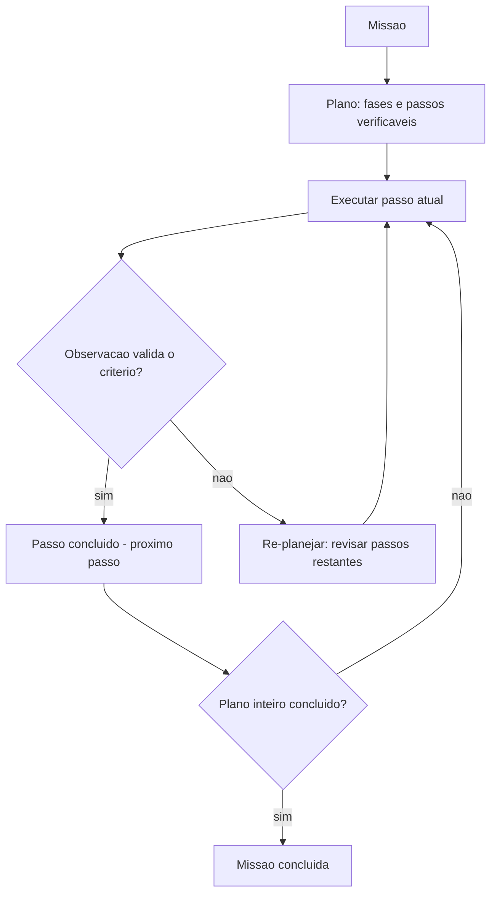

# Capítulo 4: Capítulo 8: Planejamento de tarefas e decomposição

## Introdução

O agente tem cérebro, palco, memória e mãos. Falta a **bússola**: a capacidade de transformar uma missão ampla — "resolver o problema do cliente que está há três dias sem resposta" — em uma sequência de passos executáveis, na ordem certa, com granularidade certa. Este capítulo trata do **planejamento de tarefas e da decomposição**: a disciplina que decide como o agente parte de "o quê" para "como", e como mantém o rumo quando o mundo diverge do plano.

O planejamento é o ponto onde a autonomia se torna perigosa ou valiosa. Um agente sem plano vaga: cada passo decide no improviso, e missões longas terminam em desvios cumulativos. Um agente com plano rígido quebra: o mundo raramente segue o roteiro, e o plano de


ontem não serve para o imprevisto de hoje. A pesquisa acadêmica mostra que o planejamento é uma das capacidades centrais dos agentes baseados em LLM — e uma das mais desafiadoras: decompor, ordenar, executar e re-planejar exige mais do que o modelo oferece por padrão [25][25].

Ao final deste capítulo, você será capaz de implementar o planejador do OrquestraIA: decomposição hierárquica da missão em passos verificáveis, escolha da granularidade por complexidade e risco, execução com validação por passo e o re-planejamento — a revisão do plano quando a observação diverge do esperado. Você aprenderá também a reconhecer quando uma missão nem deveria ser planejada — quando o agente simples ou as rotas resolvem melhor.

## Explica

### O Problema da Decomposição

Planejar é decompor: partir a missão em submissões, cada uma em passos, cada passo em uma ação executável com um critério de sucesso verificável. O problema da decomposição tem três dimensões: **cobertura** (o plano cobre toda a missão? um passo esquecido no início quebra tudo no fim), **ordem** (as dependências estão respeitadas? o diagnóstico vem antes do tratamento, a consulta antes da ação) e **granularidade** (os passos são grandes demais para executar com verificação, ou pequenos demais para valer o custo de cada chamada ao modelo?) [25].

A granularidade é a decisão mais sutil. Passos grandes demais escondem trabalho: o agente "resolve o problema do cliente" em um passo e não há critério verificável no meio. Passos pequenos demais explodem o custo: cada passo é uma chamada ao modelo, e uma missão de 10 minutos vira 40 chamadas. A regra prática: **cada passo deve ser executável com uma ou duas ferramentas e verificável com uma observação clara** — se o passo exige "fazer X e depois Y e conferir Z", ele está grande demais [3][25].

### As Três Abordagens de Planejamento

Como visto no Capítulo 4, o planejamento tem três abordagens, e a escolha é calibrada pela incerteza da tarefa [25]:

**Planejamento intrínseco** (sem plano explícito): o modelo decide cada passo no momento, sem plano declarado. Barato, flexível — e sem visão de longo prazo. Adequado para missões curtas e familiares.

**Plano explícito**: o modelo escreve o plano antes de executar e o segue passo a passo. Estruturado, auditável — e frágil diante do imprevisto. Adequado para missões com fluxo conhecido.

**Plano com re-planejamento**: o modelo escreve, executa e revisa o plano quando as observações divergem. Combina a visão do plano com a flexibilidade do ajuste — o estado da arte para missões longas e incertas [25][25].

### Planejamento Hierárquico

A decomposição hierárquica é a técnica que escala: o plano de missão lista as fases; cada fase tem passos; cada passo tem ações. O benefício é duplo: o contexto de cada nível é pequeno (o modelo vê a fase atual, não o plano inteiro) e a verificação acontece em cada nível (a fase termina quando os passos verificam). É a estrutura que o OrquestraIA usa: missão → fases → passos → ferramentas [25].

### Critérios de Sucesso por Passo

O planejamento sem verificação é uma lista de intenções. Cada passo precisa de um **critério de sucesso verificável**: "consultar o pedido e confirmar status em_transito" — não "verificar o pedido". O critério é o que permite ao agente (e ao auditor) saber se o passo foi cumprido, e é a base do re-planejamento: quando o critério falha, o plano muda [4].

## Ilustra

### O Roteiro da Viagem com Muitas Cidades

Planejar uma missão de agente é planejar uma viagem de muitas cidades. O viajante sem roteiro vaga: decide cada cidade no impulso, gasta o tempo e termina longe do destino — o agente sem plano. O viajante com roteiro rígido quebra no primeiro imprevisto: o voo atrasou, a cidade pulada, o


roteiro inteiro invalido — o plano explícito frágil. O viajante competente planeja a sequência (Brasília → Belo Horizonte → São Paulo), executa por trecho, verifica (chegou? hotel confirmado?) e **re-planeja quando o imprevisto chega**: o voo atrasou, então inverte a ordem e reacomoda os trechos — sem perder o destino final [25].



### A Analogia da Reforma da Casa

Uma segunda lente: a reforma da casa com um mestre de obras competente. Ele não lista "reformar a casa" e começa a bater paredes — ele decompõe em fases (estrutura → elétrica → acabamento), cada fase em passos (rasgar paredes, passar fiação, fechar gesso) e cada passo com critério (elétrica aprovada na vistoria antes do fechamento).


Quando descobre que a parede é de concreto e não de drywall (observação divergente), ele **re-planeja a fase** — troca a ordem, ajusta o prazo — mas não abandona o objetivo. A lição: o mestre de obras nunca confunde o plano com a realidade; o plano é uma hipótese de trabalho que a realidade revisa [3][25].

## Técnica

### O Planejador com Fases, Passos e Verificação

Vamos implementar o planejador do OrquestraIA — decomposição hierárquica com critérios de sucesso e re-planejamento:

```python
# planejador.py — decomposicao hierarquica com verificacao e re-planejamento
from dataclasses import dataclass, field

@dataclass
class Plano:
    """Um plano com fases, passos e criterios de sucesso."""
    missao: str
    fases: list = field(default_factory=list)  # [{nome, passos: [...]}]
    indice_fase: int = 0
    indice_passo: int = 0

def passo_atual(self):
        return self.fases[self.indice_fase]["passos"][self.indice_passo]

def avancar(self) -> bool:
        """Avança para o próximo passo; True se o plano terminou."""
        self.indice_passo += 1
        if self.indice_passo >= len(self.fases[self.indice_fase]["passos"]):
            self.indice_fase += 1
            self.indice_passo = 0
        return self.indice_fase >= len(self.fases)

class Planejador:
    """Converte missao em plano e executa com verificacao e re-planejamento."""
    def __init__(self, llm, agente):
        self.llm = llm
        self.agente = agente

def planejar(self, missao: str) -> Plano:
        """Decomposicao: fases e passos com criterios verificaveis."""
        saida = self.llm.chamar_simples(
            "Decomponha a missao em fases e passos executaveis. "
            "Formato por linha: FASE:<nome> ou PASSO:<acao>|CRITERIO:<verificacao>\n"
            f"Missao: {missao}")
        fases, atual = [], None
        for linha in saida.splitlines():
            linha = linha.strip()
            if linha.startswith("FASE:"):
                atual = {"nome": linha[5:], "passos": []}
                fases.append(atual)
            elif linha.startswith("PASSO:") and atual is not None:
                partes = linha[6:].split("|CRITERIO:")
                atual["passos"].append(
                    {"acao": partes[0].strip(),
                     "criterio": partes[1].strip() if len(partes) > 1 else ""})
        return Plano(missao=missao, fases=fases)

def executar(self, missao: str) -> str: plano = self.planejar(missao) relatorio = [f"MISSAO: {missao}"] while not plano.avancar() if self._passo_valido(plano) else False: passo = plano.passo_atual() relatorio.append(f"PASSO: {passo['acao']} " f"(criterio: {passo['criterio'] or 'n/a'})") resultado = self.agente.executar(passo["acao"]) relatorio.append(f" -> {resultado[:100]}") # Verificacao + re-planejamento if passo["criterio"]: ok = self.llm.chamar_simples( f"O criterio '{passo['criterio']}' foi cumprido com este " f"resultado? Responda SIM ou NAO.\nResultado: {resultado}").strip() if ok.upper() !=


"SIM": revisao = self.llm.chamar_simples( "O plano restante ainda faz sentido? Responda SIM ou " "proponha novos passos no formato PASSO:<acao>|CRITERIO:<v>.\n" f"Resultado divergente: {resultado}") if revisao.strip().upper() != "SIM": # substitui os passos restantes da fase atual novos = [p.strip() for p in revisao.splitlines() if p.strip().startswith("PASSO:")] if novos: plano.fases[plano.indice_fase]["passos"] = novos plano.indice_passo = 0 relatorio.append(" -> RE-PLANEJADO") if plano.avancar(): break relatorio.append("MISSAO CONCLUIDA") return "\n".join(relatorio)

# Uso no OrquestraIA:
# planejador = Planejador(llm, agente)
# print(planejador.executar(
#     "Diagnosticar o atraso do pedido P-7841 e propor a compensacao"))
```

Repare nas decisões de engenharia: **formato de saída estruturado** (FASE/PASSO/CRITERIO — parseável e auditável), **critério de sucesso por passo** (a verificação é separada da execução), **re-planejamento na divergência** (o plano restante é revisado quando o critério falha) e **relatório completo** (o relatório final é o material da auditoria do Capítulo 16).

### Escolhendo a Granularidade Certa

A calibração da granularidade é empírica. A técnica prática: **comece grosso e refine onde falha**. Rode a missão com fases amplas; onde o critério falhar repetidamente ou a observação divergir, refine os passos da fase em questão. A métrica de calibração é o **custo por missão concluída com sucesso**: se a decomposição fina não reduz a taxa de erro o suficiente para pagar o custo extra de tokens, volte para a granularidade maior [4][16].

### Checklist de Planejamento

- [ ] A missão é decomposta em **fases e passos** com critérios verificáveis?
- [ ] A **ordem** respeita dependências (diagnóstico antes de ação)?
- [ ] Cada passo é executável com **1-2 ferramentas** e verificável?
- [ ] O plano prevê **re-planejamento** na divergência?
- [ ] O relatório de execução é **auditável** (missão, passos, resultados)?

## Aplica

### Planejamento no Chão de Fábrica

O planejamento é a diferença entre agentes que resolvem e agentes que parecem ocupados. Os agentes de suporte de alto desempenho não "respondem" — eles **percorrem um plano**: identificar o problema, consultar o histórico, verificar o pedido, aplicar a política, comunicar o cliente, registrar a resolução — cada passo verificado [27]. Os agentes de análise de dados planejam a investigação antes de gerar a consulta final — e re-planejam quando os dados revelam um caminho inesperado [10].

A autonomia crescente do mercado torna o planejamento mais crítico, não menos: quanto mais o sistema decide sozinho, mais o plano precisa ser explícito e auditável — o plano é o contrato de confiança entre o sistema autônomo e o humano supervisor [21][11].

### Armadilhas Comuns

1. **Missão como passo único**: "resolver o problema do cliente" sem decomposição é uma intenção, não um plano — sem critérios verificáveis no meio.
2. **Plano sem verificação**: passos executados sem conferir o critério de sucesso — o agente "conclui" missões que não terminou.
3. **Plano rígido**: nunca re-planejar diante da divergência — o imprevisto quebra a missão inteira.
4. **Granularidade errada**: passos grandes demais (sem verificação) ou pequenos demais (custo explosivo) — calibre com a taxa de sucesso e o custo.

### Conexão com o OrquestraIA

O `Planejador` deste capítulo é o módulo de planejamento do OrquestraIA: o orquestrador (Capítulo 10) planeja missões compostas, delega fases aos especialistas e consolida; o re-planejamento é a mesma disciplina que a supervisão humana exige nas decisões críticas (Capítulo 15).

### Aprofundamento: A Calibração Empírica da Granularidade

A granularidade — o tamanho dos passos do plano — é a decisão mais empírica do planejamento, e a técnica prática é o **método do refinamento medido**. Comece com fases amplas (3–5 passos para a missão inteira) e registre a taxa de sucesso e o custo por missão (Capítulo 16). Depois refine apenas onde


o critério falha ou a observação diverge repetidamente: a fase que erra em 30% dos casos ganha sub-passos; a fase que acerta em 95% mantém a granularidade. A regra de parada é econômica: **refine enquanto a redução de erro pagar o custo dos tokens extras** — a medição do Capítulo 13 é o juiz [4].

O padrão de erro que indica granularidade errada é reconhecível: passos grandes demais produzem observações vagas ("resultado OK" sem detalhe verificável); passos pequenos demais produzem trilhas longas com chamadas redundantes ao mesmo modelo. O sintoma comum das duas falhas é o mesmo — taxa de sucesso estagnada com custo crescente — e o diagnóstico é olhar a trilha: onde o agente repetiu a mesma ação? Onde a observação não permitiu verificar o critério? [4][16].

### O Planejamento em Missões Longas: Checkpoints e Retomada

Missões longas (horizontes de horas ou dias) adicionam um requisito que o planejador simples não cobre: a **retomada**. Se a missão interrompe (timeout, falha de infraestrutura, limite de sessão), o sistema precisa saber onde parou e continuar — não recomeçar. A prática tem três peças: **checkpoint por fase** (o estado de cada fase concluída é persistido — o que já está feito não


refaz), **estado do plano persistido** (fases concluídas, passo atual, observações — o material que o Capítulo 17 exige dos workers) e **validação de retomada** (ao voltar, o sistema verifica se as premissas do plano continuam válidas — o mundo mudou durante a pausa? Se mudou, re-planeja). A retomada é o que transforma o planejador de missões curtas em planejador de missões reais [20][25].

### Aprofundamento: O Plano como Artefato Auditável

O plano que o planejador produz é mais do que uma lista de passos: é um **artefato auditável** — o documento que conecta a intenção (a missão), a estratégia (as fases) e a execução (os passos com resultados). A prática recomendada: o plano é gravado antes da execução (a intenção — o que o sistema pretendia fazer), os resultados de cada passo são anexados à medida que a execução avança (a realidade — o que aconteceu) e o re-planejamento registra


a divergência (o porquê — qual observação invalidou qual passo). O artefato resultante é o material da auditoria (Capítulo 16), da avaliação (Capítulo 13 — os casos de planejamento do golden set) e da operação (Capítulo 19 — as lições de re-planejamento que viram regras). O plano auditável é a diferença entre o sistema que você consegue explicar e o que você adivinha: a pergunta "por que o agente fez isso?" é respondida pelo artefato, não pela reconstrução posterior [4][16].

### O Planejamento em Domínios Regulados

Domínios regulados (saúde, finanças, compliance) impõem requisitos que mudam o desenho do planejamento: **rastreabilidade obrigatória** (cada decisão com seu raciocínio registrado — o plano auditável é pré-requisito, não opção), **passos com limite de autonomia** (certas fases exigem aprovação humana antes de avançar — o elo com o Capítulo 15), **verificação obrigatória por passo** (o critério de sucesso é exigência


regulatória — não se avança sem prova) e **conservação de evidência** (os planos e resultados são retidos pelo período legal — o banco de planos vira ativo de compliance). O planejamento em domínios regulados é o mesmo deste capítulo com a disciplina elevada a obrigação — e é o perfil mais raro e valorizado do mercado (Capítulo 20) [18][24].

## Conclusão

Três pontos para levar: **primeiro**, planejar é decompor com cobertura, ordem e granularidade — e cada passo precisa de um critério de sucesso verificável, que é o que separa plano de intenção. **Segundo**, o planejamento tem três abordagens — intrínseco, plano explícito e re-planejamento —


e a escolha é calibrada pela incerteza da tarefa, com o re-planejamento como estado da arte para missões longas. **Terceiro**, a decomposição hierárquica — missão → fases → passos → ferramentas — escala sem explodir o contexto, com verificação em cada nível e re-planejamento na divergência.

O próximo capítulo abre a Parte III — Construindo o OrquestraIA — com a escolha da fundação: os **frameworks de agentes** — LangGraph, CrewAI e além — comparados em produção, com os critérios para decidir se você precisa de um ou se o código puro dos capítulos anteriores basta.

**Desafio opcional**: planeje uma missão real do seu trabalho com o `Planejador` e registre: quantos passos o modelo gerou, quantos critérios eram verificáveis, e onde o re-planejamento disparou. Depois, refaça com granularidade diferente e compare o custo estimado de tokens das duas versões.

## Para se aprofundar

Este capítulo faz parte do e-book **Projetando o Sistema de IA Agêntica**, extraído da obra completa *IA Agêntica Desbloqueada: Um guia para projetar, construir e implantar sistemas de IA autônomos*. No livro-mãe, você encontra o mesmo conteúdo com aprofundamento técnico adicional: diagramas Mermaid, blocos de código executáveis, referências ABNT verificáveis e a narrativa completa do projeto OrquestraIA — do primeiro agente ao monitoramento em produção.

Se este e-book despertou sua atenção para a construção de sistemas de IA autônomos, o próximo passo natural é levar o aprendizado para o seu próprio contexto: escolha um problema pequeno e bem delimitado, desenhe o agent loop com uma única ferramenta e uma única política de autonomia, e meça o resultado antes de escalar. A autonomia é uma concessão que se conquista com evidência.

**Quer continuar?** Explore os demais e-books da série: *Projetando o Sistema de IA Agêntica* é apenas uma parte do caminho — os outros volumes cobrem o desenho do sistema, a construção prática, a governança e a operação contínua.
