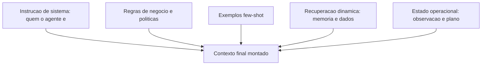
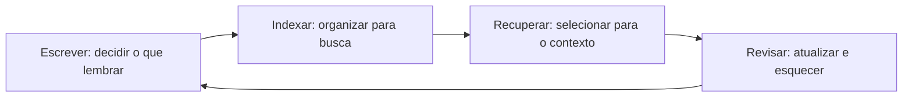
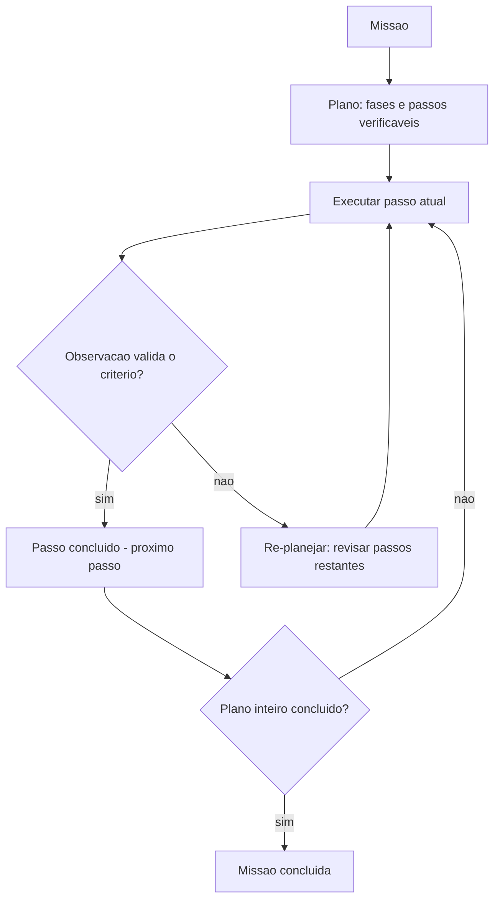

# Projetando o Sistema de IA Agêntica

# Capítulo 1: Capítulo 5: Engenharia de contexto para agentes

## Introdução

Você já tem o loop, as arquiteturas e os fundamentos. Agora chegamos à habilidade que separa os sistemas de agentes medíocres dos excepcionais: **engenharia de contexto** — a arte e a ciência de decidir exatamente o que o modelo vê em cada chamada, e na ordem certa. A janela de contexto é o


"palco" do agente: o que entra nele determina o comportamento; o que fica de fora, o modelo simplesmente não sabe. E em sistemas agênticos, o contexto não é um prompt estático: ele é **montado dinamicamente** a cada iteração do loop, combinando instruções, exemplos, memória recuperada, resultados de ferramentas e dados do mundo [16].

Por que este capítulo vem antes das ferramentas e da memória? Porque o contexto é o vetor por onde tudo passa: a instrução do sistema, os exemplos de comportamento, a recuperação da memória (Capítulo 6), as descrições das ferramentas (Capítulo 7) e as observações das ações. Um agente com contexto bem projetado executa ferramentas corretamente; um agente com contexto poluído erra mesmo com as melhores ferramentas do mundo [16][12].

Ao final deste capítulo, você será capaz de estruturar o contexto de um agente em camadas — instrução de sistema, regras de negócio, exemplos few-shot, recuperação e estado — com gestão de tamanho, atualização dinâmica e priorização. Você implementará um construtor de contexto que o OrquestraIA vai usar em todos os agentes especialistas, e aprenderá as métricas para medir se o contexto está ajudando ou atrapalhando.

## Explica

### O Contexto como Decisão de Engenharia

A janela de contexto de um LLM não é um depósito: é um recurso escasso com custo por token, e cada token que entra em uma chamada paga um preço — em custo, em latência e, principalmente, em qualidade. A pesquisa sobre engenharia de contexto converge em uma lição central: **contexto é o principal


determinante do comportamento do modelo, e a qualidade do contexto importa mais do que a escolha do modelo em si** [16]. A LangChain, que construiu a infraestrutura de contextos para milhares de sistemas, recomenda tratar o contexto como um artefato de engenharia versionado — não como um bloco de texto esquecido num arquivo [16].

O contexto de um agente tem cinco camadas, cada uma com um papel e um custo:

**1. Instrução de sistema (system prompt)**: quem o agente é, qual o seu papel, quais as regras invioláveis. É a camada mais estável — muda pouco, custa caro e sempre está presente [3].

**2. Regras de negócio e políticas**: as restrições operacionais — o que o agente pode e não pode fazer, limites de autonomia, políticas de segurança. Vive no system prompt ou em documento recuperado (Capítulo 14).

**3. Exemplos few-shot**: demonstrações de comportamento correto — entradas e saídas exemplares. São a forma mais eficiente de ensinar formato e tom; poucos exemplos bem escolhidos valem mais do que muitos ruins [3].

**4. Recuperação dinâmica**: o conteúdo da memória e do conhecimento que o agente busca a cada iteração — políticas, dados do cliente, histórico. É a camada que cresce com o sistema (Capítulo 6).

**5. Estado operacional**: a observação da ação anterior, o plano atual, o passo em andamento. É a camada que fecha o loop (Capítulo 2).

### O Trade-off Estrutural do Contexto

A tensão central da engenharia de contexto é estrutural: **mais contexto nem sempre é melhor**. Cada camada adicionada aumenta a chance de o modelo encontrar informação útil — mas também aumenta o ruído, o custo e a chance de o modelo "se perder" no meio do material. A pesquisa mostra que adicionar informação irrelevante degrada o desempenho — o fenômeno do "contexto perdido no meio": modelos usam melhor o início e o fim da janela do que o meio [16].

Isso leva às três regras de ouro da engenharia de contexto: **priorize** (o material mais importante vai no início e no fim — instruções no início, instrução final forte no fim), **selecione** (recupere apenas o relevante, nunca despeje o acervo), e **compacte** (resuma o que é histórico, mantenha integral o que é operacional). O resultado é um contexto que é uma decisão, não um acidente [16].

## Ilustra

### O Briefing do Piloto de Guerra

Um piloto de caça não recebe um manual inteiro antes de cada missão — recebe um **briefing**: instruções curtas e críticas (regras de engajamento), o contexto do teatro de operações (mapa, clima, ameaças), exemplos de manobras do esquadrão (few-shot) e o estado atual da missão (combustível, alvos, comunicações). O briefing é montado na hora, priorizado por relevância, e muda a cada etapa do voo. Um briefing inchado com capítulos inteiros de regulamento degradaria o desempenho do piloto — e o mataria em segundos de latência [16].

O agente é o piloto; o contexto é o briefing. Cada iteração do loop é um novo voo de reconhecimento: o estado mudou (a observação), a ameaça mudou (a política), e o briefing deve ser remontado. O engenheiro de contexto é o oficial de inteligência que decide o que entra no briefing — e o que fica na pasta [16].



### A Degradação do Contexto Poluído

A segunda analogia é a do copo de água suja. O contexto é um copo de água: cada camada adicionada é mais água — e cada informação irrelevante é sujeira. Com pouca água e pouca sujeira, o modelo bebe bem. Com muita sujeira, mesmo com água suficiente,


o modelo engasga: o contexto irrelevante não apenas desperdiça tokens — ele **degrada ativamente** a qualidade da resposta, porque o modelo passa a considerar informação errada como relevante [16]. A engenharia de contexto é o filtro: a decisão deliberada de manter o copo limpo e no tamanho certo.

## Técnica

### O Construtor de Contexto em Camadas

Vamos implementar o construtor de contexto que o OrquestraIA usa em todos os agentes — com priorização, seleção e orçamento de tokens:

```python
# contexto.py — construtor de contexto em camadas com orçamento de tokens
from dataclasses import dataclass, field

@dataclass
class ConstrutorContexto:
    """Monta o contexto do agente em camadas, com priorizacao e orcamento."""
    instrucao_sistema: str
    regras_negocio: str = ""
    exemplos: list = field(default_factory=list)
    orcamento_max_tokens: int = 4000

def _contar_tokens(self, texto: str) -> int:
        # Estimativa simples: 4 caracteres por token (aprox.)
        return len(texto) // 4

def _selecionar(self, itens: list, orcamento: int, chave=str) -> list:
        """Seleciona os itens mais relevantes dentro do orcamento."""
        selecionados, total = [], 0
        for item in sorted(itens, key=chave, reverse=True):
            custo = self._contar_tokens(item)
            if total + custo > orcamento:
                continue
            selecionados.append(item)
            total += custo
        return selecionados

def montar(self, recuperacao: list, estado: str) -> list: """Monta as mensagens finais com priorizacao (importante no inicio/fim).""" msg_sistema = self.instrucao_sistema if self.regras_negocio: msg_sistema += "\n\n## REGRAS DE NEGOCIO\n" + self.regras_negocio if self.exemplos: msg_sistema += "\n\n## EXEMPLOS\n" + "\n".join(self.exemplos) # Recuperacao selecionada por relevancia (aqui: ordem de entrada; #


no real, a pontuacao vem do RAG — Cap. 6) orcamento_restante = self.orcamento_max_tokens - self._contar_tokens(msg_sistema) recuperacao_ok = self._selecionar( recuperacao, max(orcamento_restante, 500), chave=lambda x: len(x)) contexto_recuperado = "\n".join(recuperacao_ok) return [ {"role": "system", "content": msg_sistema}, {"role": "user", "content": ( f"## CONTEXTO RECUPERADO\n{contexto_recuperado}\n\n" f"## ESTADO ATUAL\n{estado}\n\n" "Atue conforme as instrucoes.")}, ]

# Uso no OrquestraIA:
# construtor = ConstrutorContexto(
#     instrucao_sistema=(
#         "Voce e o agente de atendimento do OrquestraIA. "
#         "Responda em portugues, seja conciso e acione ferramentas quando necessario."),
#     regras_negocio=(
#         "1. Reembolsos acima de R$ 100 exigem aprovacao humana.\n"
#         "2. Nunca invente dados de pedido: sempre consulte as ferramentas."),
#     exemplos=[
#         "P: o pedido chegou?  R: Deixa eu consultar o status para voce.",
#         "P: quero meu dinheiro de volta.  R: Vou verificar o pedido e a politica."],
#     orcamento_max_tokens=3000,
# )
# mensagens = construtor.montar(
#     recuperacao=["Cliente Maria prefere e-mail", "Pedido P-7841 em atraso"],
#     estado="observacao de consultar_estoque: x-100 com 12 unidades")
```

Repare nas decisões de engenharia: **instrução de sistema estável** (não muda por iteração), **regras no system prompt** (o modelo as trata como autoridade), **exemplos no system prompt** (formato e tom ensinados de uma vez), **recuperação selecionada por orçamento** (nunca despeja tudo) e **estado operacional no fim da mensagem do usuário** (priorização — o modelo lê bem o fim da janela).

### A Instrução de Sistema que Funciona

A instrução de sistema é o artefato mais importante do contexto — e o mais mal escrito. As boas instruções têm quatro qualidades verificáveis: **papel claro** ("você é o agente de atendimento do OrquestraIA, não um assistente genérico"), **limites explícitos** ("não invente dados; consulte as ferramentas"), **formato


prescrito** ("responda em português, no máximo 3 frases, ou acione a ferramenta") e **prioridades de decisão** ("se houver conflito entre a política e a preferência do cliente, prevalece a política"). A linguagem mais eficaz é imperativa e específica — "consulte" em vez de "é recomendável consultar" [3][16].

### Métricas de Qualidade do Contexto

Como saber se o contexto está ajudando? Três métricas práticas: **taxa de sucesso de ferramentas** (o modelo escolhe a ferramenta certa com os argumentos certos?), **precisão de recuperação** (o contexto recuperado contém a informação que a resposta exige? — medida com evals, Capítulo 13) e **custo por tarefa** (tokens gastos por missão — contexto inchado é custo silencioso). A regra: qualquer mudança de contexto deve ser **testada A/B contra um conjunto fixo de casos** — nunca alterada no escuro [4].

### Checklist de Contexto

- [ ] Instrução de sistema com papel, limites, formato e prioridades?
- [ ] Regras de negócio separadas e invioláveis (não no meio do histórico)?
- [ ] Exemplos few-shot: poucos e representativos?
- [ ] Recuperação **selecionada por relevância e orçamento**, nunca despejada?
- [ ] Estado operacional no fim da mensagem (priorização da janela)?
- [ ] Qualquer mudança testada A/B com casos fixos?

## Aplica

### O Contexto no Chão de Fábrica

A engenharia de contexto é onde o conhecimento se transforma em valor nos sistemas de produção. Os agentes de suporte que melhoram a satisfação do cliente o fazem, em grande parte, porque o contexto certo chega na hora certa: o histórico do cliente, a política aplicável, o estado do pedido — montados a cada interação [27]. Os sistemas que fracassam em produção fracassam, na maioria das vezes, por contexto: instruções vagas, políticas soterradas no histórico, recuperação despejada [16].

O contexto também é o vetor de **custo** e **segurança**: cada token enviado custa dinheiro (Capítulo 16), e instruções contraditórias abrem brechas para manipulação (Capítulo 14). Um contexto limpo é, ao mesmo tempo, um sistema mais barato, mais previsível e mais seguro.

### Armadilhas Comuns

1. **Prompt único gigante**: uma instrução de 3.000 tokens com tudo misturado. Separe instrução, regras, exemplos e recuperação em camadas.
2. **Despejo de recuperação**: colocar 20 documentos recuperados no contexto. Selecione por relevância — o orçamento é parte do design.
3. **Estado no lugar errado**: a observação da ação enterrada no meio do histórico em vez de no fim — o modelo "não vê" o que acabou de acontecer.
4. **Contexto versionado como texto solto**: mudar o prompt sem teste A/B é apostar o comportamento do sistema no escuro.

### Conexão com o OrquestraIA

O `ConstrutorContexto` deste capítulo vira o componente `contexto.py` do OrquestraIA: todos os agentes especialistas o usam, com instruções e regras próprias; a camada de recuperação conecta-se à memória (Capítulo 6); e o estado operacional vem do loop do Capítulo 2.

### Aprofundamento: O Contexto como Ativo Versionado

A engenharia de contexto atinge a maturidade quando o contexto deixa de ser um texto solto e vira um **ativo versionado** — tratado com a mesma disciplina do código: controle de versão, testes e histórico de mudanças. A prática recomendada tem quatro elementos: **versionamento por componente** (instrução de sistema, regras de negócio, exemplos e templates de recuperação têm versões próprias — a mudança de uma regra não apaga o histórico das outras), **teste a cada mudança** (o golden set do Capítulo 13 roda contra


a nova versão — a regressão bloqueia a promoção), **registro de decisão** (cada mudança registra o porquê — a evidência que a motivou — permitindo reverter com conhecimento, não com adivinhação) e **rollback imediato** (a versão anterior está sempre a um comando de distância — a reversibilidade do Capítulo 17). O contexto versionado é o que torna a evolução do sistema (Capítulo 19) segura: sem versionamento, cada ajuste de prompt é uma aposta no escuro; com ele, cada ajuste é uma hipótese testada [16][4].

### A Medição do Contexto: O Que Números Revelam

O contexto pode — e deve — ser medido. As métricas práticas: **tokens por chamada** (o custo bruto — a base do Capítulo 16), **densidade de informação** (a fração do contexto que a resposta realmente usou — o contexto inchado tem densidade baixa, e a métrica revela o desperdício), **precisão de recuperação** (a fração do contexto recuperado que era relevante — o elo com o Capítulo 6) e **impacto


na qualidade** (a taxa de sucesso do golden set com e sem cada camada do contexto — a medição que justifica cada bloco). A leitura das métricas orienta o orçamento: o contexto que não move a taxa de sucesso é custo puro — e o exercício de remoção medido (tirar uma camada, rodar o golden set, comparar) é o método de poda que mantém o contexto enxuto com qualidade [16][4].

### Aprofundamento: O Fim do Prompt Solto — Contexto como Produto

A evolução do Capítulo 5 converge para uma mudança de mentalidade: o contexto deixa de ser um "prompt" (algo que se escreve uma vez e se esquece) e vira um **produto** — um artefato com dono, versão, teste e ciclo de vida, exatamente como o código e os dados. A mentalidade de produto tem cinco implicações práticas: **o dono do contexto é uma pessoa** (a engenharia de contexto é uma disciplina com responsável, não uma tarefa distribuída), **o contexto tem SLAs** (orçamento de tokens por chamada, densidade mínima de informação —


medidos no Capítulo 16), **o contexto tem testes** (o golden set do Capítulo 13 valida cada versão), **o contexto tem histórico** (versionamento e ADR — o registro de cada decisão de contexto com a evidência) e **o contexto evolui como o código** (pequenas mudanças contínuas com revisão — o pipeline do Capítulo 17). A mentalidade de produto é o que separa as equipes que tratam contexto como detalhe das que tratam como vantagem — e a vantagem de contexto é a vantagem competitiva mais subestimada dos sistemas de agentes em 2026 [16][4].

### O Contexto na Fronteira: Dados Não Confiáveis

O contexto tem uma fronteira que o Capítulo 14 explora em profundidade e que aqui merece o desenho de arquitetura: **os dados não confiáveis que entram no contexto** — conteúdo recuperado, e-mails, respostas de sistemas externos. A regra estrutural: o contexto monta as fronteiras explicitamente — a instrução de sistema declara que o conteúdo marcado é dado, não instrução; a recuperação marca a origem de cada bloco; e a observação de ferramenta


identifica a fonte externa. A implementação é a do `ContextoSeguro` (Capítulo 14), e a decisão de arquitetura é esta: **a fronteira não é do contexto nem da segurança — é das duas** — e o engenheiro de sistemas agênticos desenha o contexto com a segurança embutida, não anexada depois. O contexto que ignora a fronteira é a porta de entrada do prompt injection — o incidente mais caro da operação (Capítulo 19) [6].

## Conclusão

Três pontos para levar: **primeiro**, o contexto é um artefato de engenharia em cinco camadas — instrução, regras, exemplos, recuperação e estado — montado dinamicamente a cada iteração, e não um prompt estático. **Segundo**, mais contexto não é melhor: a tensão estrutural entre informação e ruído exige priorização (início e fim da janela), seleção (recuperação por orçamento) e compactação (histórico resumido). **Terceiro**, a instrução de sistema bem escrita tem quatro qualidades — papel, limites, formato e prioridades — e qualquer mudança de contexto deve ser validada por evals A/B.

O próximo capítulo constrói a camada de recuperação que o contexto consome: a **memória** — de curto prazo, longo prazo e vetorial — com as decisões de armazenamento, indexação e recuperação que transformam o agente de conversador em sistema que aprende.

**Desafio opcional**: escreva a instrução de sistema de um agente do seu domínio com as quatro qualidades (papel, limites, formato, prioridades). Depois, monte o contexto de uma interação real usando o `ConstrutorContexto` e responda: qual camada você removeria primeiro se precisasse cortar 30% dos tokens?

## Para se aprofundar

Este capítulo faz parte do e-book **Projetando o Sistema de IA Agêntica**, extraído da obra completa *IA Agêntica Desbloqueada: Um guia para projetar, construir e implantar sistemas de IA autônomos*. No livro-mãe, você encontra o mesmo conteúdo com aprofundamento técnico adicional: diagramas Mermaid, blocos de código executáveis, referências ABNT verificáveis e a narrativa completa do projeto OrquestraIA — do primeiro agente ao monitoramento em produção.

Se este e-book despertou sua atenção para a construção de sistemas de IA autônomos, o próximo passo natural é levar o aprendizado para o seu próprio contexto: escolha um problema pequeno e bem delimitado, desenhe o agent loop com uma única ferramenta e uma única política de autonomia, e meça o resultado antes de escalar. A autonomia é uma concessão que se conquista com evidência.

**Quer continuar?** Explore os demais e-books da série: *Projetando o Sistema de IA Agêntica* é apenas uma parte do caminho — os outros volumes cobrem o desenho do sistema, a construção prática, a governança e a operação contínua.

# Capítulo 2: Capítulo 6: Memória: curto prazo, longo prazo e vetorial

## Introdução

No Capítulo 5 você aprendeu que o contexto é o palco do agente — e que a camada de recuperação é uma das mais importantes. Este capítulo constrói o que alimenta essa camada: o **sistema de memória**. Sem memória, o agente é um amnésico eloquente: trata cada interação como a primeira, esquece o cliente que preferiu e-mail, ignora a política atualizada, repete erros já corrigidos. Com memória bem projetada, o agente lembra, aprende e se adapta — o que separa o atendimento de "transação" do atendimento de "relacionamento" [17][22].

A memória de agentes é um dos campos que mais evoluiu: o que antes era "colocar tudo no histórico da conversa" virou uma disciplina com taxonomia, benchmarks e SDKs dedicados. A LangChain lançou o LangMem, um SDK específico para memória de longo prazo de agentes [17]; o ecossistema produz benchmarks de progresso da memória de agentes [22]; e a pesquisa acadêmica consolida a taxonomia de memória — curto prazo, longo prazo, de trabalho e episódica [23].

Ao final deste capítulo, você será capaz de desenhar o sistema de memória do OrquestraIA completo: a memória de curto prazo dentro da janela de contexto, a memória de longo prazo em banco vetorial com embeddings e recuperação por similaridade, e a memória episódica que registra o que aconteceu em cada missão. Você implementará cada camada e aprenderá as decisões de engenharia — o que persistir, como indexar, como recuperar, quando esquecer — que determinam se a memória ajuda ou atrapalha.

## Explica

### A Taxonomia da Memória

A memória de um agente não é um único mecanismo: é um sistema com camadas, cada uma com propósito, custo e ciclo de vida próprios [23][22]:

**Memória de curto prazo (working memory)**: o conteúdo ativo da conversa — mensagens, observações, plano em execução — que vive na janela de contexto e morre ao fim da sessão. É a memória do loop (Capítulo 2). Barata de escrever, cara de manter (cada reenvio custa tokens), limitada pela janela. A decisão crítica: **o que fica na janela e o que é compactado** — o resumo da conversa é a técnica clássica para estender a janela sem estourar o custo [16].

**Memória de longo prazo (persistent memory)**: fatos que sobrevivem entre sessões — preferências do cliente, políticas, decisões. Vive em banco (vetorial ou relacional) e é recuperada seletivamente para o contexto. É o que o LangMem e o ecossistema de memória constroem [17][22]. A decisão crítica: **o que é digno de persistir** (nem tudo merece memória — persistir ruído polui a recuperação) e **como recuperar** (similaridade, não despejo).

**Memória episódica (episodic memory)**: o registro do que aconteceu — missões executadas, erros cometidos, resultados obtidos. É a base da melhoria contínua: sem memória episódica, o agente repete os mesmos erros; com ela, o sistema aprende com a própria operação [23]. A decisão crítica: **estrutura do registro** (evento, contexto, resultado, lição) para que a recuperação seja útil.

**Memória procedural (skills)**: o "como fazer" aprendido — workflows validados, melhores práticas descobertas. No estado da arte, a memória procedural é o próximo salto: agentes que codificam procedimentos bem-sucedidos para reutilização [23].

### O Problema da Recuperação

A qualidade da memória não está no acervo: está na recuperação. O sistema ideal recupera, para cada contexto, os fatos certos — nem mais, nem menos. Recuperar demais polui o contexto e degrada a resposta; recuperar de menos deixa o agente cego. O benchmark do ecossistema de memória mede exatamente isso: precisão da recuperação em cenários progressivos [22]. A lição prática: a memória é um sistema de busca, e a busca deve ser medida — o Capítulo 13 mostra como.

### O Ciclo da Memória

A memória opera em quatro momentos: **escrita** (o que o sistema decide lembrar), **indexação** (como o conteúdo é organizado para busca), **recuperação** (o que entra no contexto de cada iteração) e **revisão** (o que é atualizado ou esquecido). A maioria dos sistemas iniciantes implementa só a escrita — e esquece que memória sem recuperação seletiva é acervo morto, e memória sem revisão é acervo que envelhece mal [22].

## Ilustra

### O Balcão de Atendimento da Padaria de Bairro

A padaria de bairro não usa ficha de clientes — usa a memória da dona. Ela lembra que o Sr. Carlos prefere o pão mais torrado (memória de longo prazo), lembra que hoje ele pediu o pão de forma às 7h (memória episódica da sessão) e aplica


o procedimento de anotar pedidos por telefone (memória procedural). O balcão onde ela trabalha é a janela de contexto: o que está à vista na bancada é a memória de curto prazo — ela não precisa lembrar de cor o que está anotado no caderno do balcão.

A lição da padaria: a dona não anota tudo. Ela decide o que vale a pena lembrar (o gosto do cliente fiel, não o que o turista pediu uma vez), organiza (cada cliente tem sua "ficha mental"), recupera na hora certa (o gosto do Carlos entra na conversa quando ele chega) e atualiza (o Carlos mudou para integral — a memória antiga sai). Essa triagem é exatamente o ciclo escrever–indexar–recuperar–revisar que o sistema de memória do agente deve implementar [17][22].



### A Biblioteca sem Bibliotecária

A analogia inversa mostra o fracasso: a biblioteca sem bibliotecária. Todos os livros estão na estante (memória de longo prazo), mas não há catálogo (indexação), não há ninguém que recupere o livro certo (recuperação) e ninguém retira os volumes desatualizados (revisão). O leitor — o contexto do


agente — caminha pela estante e pega livros aleatórios. Resultado: a biblioteca gigante é pior que a estante pequena e curada. É por isso que os benchmarks de memória avaliam a recuperação, não o tamanho do acervo: memória mal recuperada é pior que ausência de memória [22].

## Técnica

### Memória de Curto Prazo com Compactação

A memória de curto prazo vive na janela de contexto. A técnica essencial é a **compactação**: quando a conversa cresce além do orçamento, o sistema resume o histórico antigo e mantém integral o recente:

```python
# memoria_curtoprazo.py — janela com compactacao de historico
from dataclasses import dataclass, field

@dataclass
class MemoriaCurtoPrazo:
    """Janela de contexto com compactacao automatica do historico antigo."""
    orcamento_mensagens: int = 10
    historico: list = field(default_factory=list)

def adicionar(self, papel: str, conteudo: str) -> None:
        self.historico.append({"role": papel, "content": conteudo})
        self._compactar()

def _compactar(self) -> None:
        """Se estourou o orcamento, resume o trecho mais antigo."""
        if len(self.historico) > self.orcamento_mensagens:
            antigas = self.historico[:-self.orcamento_mensagens]
            recentes = self.historico[-self.orcamento_mensagens:]
            # Resumo simples (no real: chamada LLM de sumarizacao)
            resumo = "RESUMO ANTERIOR: " + " ".join(
                m["content"][:60] for m in antigas)
            self.historico = [{"role": "system", "content": resumo}] + recentes

def contexto(self) -> list:
        return self.historico

# Uso:
# janela = MemoriaCurtoPrazo(orcamento_mensagens=4)
# janela.adicionar("user", "O cliente quer o estoque do x-100")
# janela.adicionar("assistant", "Consultando...")
```

A compactação é a ponte entre a janela finita e as sessões longas: o resumo preserva o essencial e descarta o ruído — sempre com o cuidado de que o resumo não invente o que não foi dito (a sumarização por LLM deve ser instruída a ser fiel).

### Memória de Longo Prazo com Embeddings e Recuperação Vetorial

A memória de longo prazo do OrquestraIA usa banco vetorial: fatos viram vetores, e a recuperação encontra os mais similares à consulta. Implementamos com `sqlite` + similaridade de cosseno (com embeddings reais via API de embedding ou modelo local):

```python
# memoria_longoprazo.py — memória persistente vetorial com recuperação por cosseno
import sqlite3, math

class MemoriaVetorial:
    """Memoria de longo prazo: persistencia + embeddings + cosseno."""
    def __init__(self, caminho_db: str, gerar_embedding, dimensao: int = 384):
        self.con = sqlite3.connect(caminho_db)
        self.con.execute("""
            CREATE TABLE IF NOT EXISTS memorias (
                id INTEGER PRIMARY KEY,
                texto TEXT NOT NULL,
                categoria TEXT DEFAULT 'fato',
                vetor TEXT NOT NULL,
                criado_em TEXT DEFAULT CURRENT_TIMESTAMP
            )""")
        self.con.commit()
        self.gerar_embedding = gerar_embedding
        self.dimensao = dimensao

def lembrar(self, texto: str, categoria: str = "fato") -> None:
        vetor = self.gerar_embedding(texto)
        self.con.execute(
            "INSERT INTO memorias (texto, categoria, vetor) VALUES (?, ?, ?)",
            (texto, categoria, repr(vetor)))
        self.con.commit()

def _cosseno(self, a: list, b: list) -> float:
        return sum(x * y for x, y in zip(a, b)) / (
            math.sqrt(sum(x * x for x in a)) * math.sqrt(sum(y * y for y in b)) or 1)

def recuperar(self, consulta: str, topo: int = 3,
                  categoria: str = None) -> list:
        vetor_consulta = self.gerar_embedding(consulta)
        sql = "SELECT texto, categoria, vetor FROM memorias"
        if categoria:
            sql += " WHERE categoria = ?"
            linhas = self.con.execute(sql, (categoria,)).fetchall()
        else:
            linhas = self.con.execute(sql).fetchall()
        pontuadas = []
        for texto, cat, vetor_txt in linhas:
            vetor = eval(vetor_txt)  # no real: deserialize com json/safetensors
            pontuadas.append((self._cosseno(vetor_consulta, vetor), texto))
        pontuadas.sort(reverse=True, key=lambda x: x[0])
        return [t for _, t in pontuadas[:topo]]

# Uso (com embeddings reais):
# def embed(t): 
#     return modelo.encode(t).tolist()  # ex.: sentence-transformers
# memoria = MemoriaVetorial("orquestraia.db", embed)
# memoria.lembrar("Cliente Maria prefere contato por e-mail", "preferencia")
# memoria.lembrar("Pedido P-7841 atrasou por extravio na transportadora", "caso")
# print(memoria.recuperar("como prefere ser contatada a maria", topo=2))
```

Três decisões de engenharia aparecem: **categoria** (a memória é particionável — preferências, casos, políticas — o que melhora a precisão da recuperação), **representação do vetor** (serielizada; a leitura com `eval` é didática — em produção use JSON ou coluna BLOB), e **pontuação por cosseno com fallback** (a divisão por zero protegida).

### Memória Episódica: O Diário de Bordo

A memória episódica registra o que aconteceu — a matéria-prima da melhoria contínua. Estrutura: evento, contexto, resultado e lição:

```python
# memoria_episodica.py — registro episodico para melhoria continua
import sqlite3, time

class MemoriaEpisodica:
    """Diario de bordo: registra missoes, resultados e licoes."""
    def __init__(self, caminho_db: str):
        self.con = sqlite3.connect(caminho_db)
        self.con.execute("""
            CREATE TABLE IF NOT EXISTS episodios (
                id INTEGER PRIMARY KEY,
                timestamp TEXT, missao TEXT, resultado TEXT,
                licao TEXT DEFAULT '', sucesso INTEGER
            )""")
        self.con.commit()

def registrar(self, missao: str, resultado: str, sucesso: bool,
                  licao: str = "") -> None:
        self.con.execute(
            "INSERT INTO episodios (timestamp, missao, resultado, sucesso, licao)"
            " VALUES (?, ?, ?, ?, ?)",
            (time.strftime("%Y-%m-%d %H:%M:%S"), missao, resultado,
             int(sucesso), licao))
        self.con.commit()

def licoes_recentes(self, topo: int = 5) -> list:
        """Recupera as licoes aprendidas — base de revisao do sistema."""
        rows = self.con.execute(
            "SELECT missao, licao FROM episodios WHERE licao != ''"
            " ORDER BY id DESC LIMIT ?", (topo,)).fetchall()
        return [f"{m}: {l}" for m, l in rows]

# Uso:
# diario = MemoriaEpisodica("orquestraia.db")
# diario.registrar("atender pedido P-7841", "resolvido com reposicao",
#                  True, "extravio exige acionar reposicao imediatamente")
```

A memória episódica é o elo com o Capítulo 20: é dela que saem as lições que alimentam a evolução do sistema — o agente que registra lições e as consulta na próxima missão parecida.

### Checklist de Memória

- [ ] Curto prazo: janela com **compactação** do histórico antigo?
- [ ] Longo prazo: persistência com **categorias** e recuperação por similaridade?
- [ ] Episódica: registro estruturado com **lição** e resultado para melhoria contínua?
- [ ] Recuperação **selecionada** por orçamento e relevância (nunca despejo)?
- [ ] Política de **revisão**: o que é atualizado e o que é esquecido?

## Aplica

### A Memória no Chão de Fábrica

A memória de longo prazo é o que transforma atendimento em relacionamento: agentes que lembram preferências entre sessões entregam satisfação que chatbots amnésicos não alcançam [27][10]. A memória episódica é o que transforma operação em aprendizado: sistemas que registram erros e lições melhoram com o tempo, enquanto sistemas amnésicos repetem os mesmos erros [23]. E a memória bem particionada por categoria reduz o custo: recuperar só a categoria certa custa menos tokens e melhora a precisão [22].

A confiança — o gargalo da adoção agêntica — também passa pela memória: um sistema que lembra o que foi prometido, registra o que foi feito e pode auditar o que aconteceu inspira mais confiança do que um que recomeça do zero a cada sessão [21].

### Armadilhas Comuns

1. **Memória como despejo**: persistir tudo e recuperar tudo. O acervo gigante sem seleção degrada a resposta — curadoria é parte da memória.
2. **Sem memória episódica**: o sistema nunca aprende com a própria operação — cada erro é a primeira vez.
3. **Compactação que inventa**: resumos de LLM sem instrução de fidelidade podem criar fatos falsos. Instrua a sumarização a não inventar.
4. **Sem política de revisão**: a memória que nunca esquece fica obsoleta — políticas antigas, preferências mudadas e decisões revogadas poluem a recuperação.

### Conexão com o OrquestraIA

A memória do OrquestraIA reúne as três camadas: `MemoriaCurtoPrazo` dentro de cada agente (Capítulo 2), `MemoriaVetorial` compartilhada entre especialistas (preferências e políticas) e `MemoriaEpisodica` como diário de bordo da operação — consumidas pelo `ConstrutorContexto` do Capítulo 5 e medidas pelos evals do Capítulo 13.

### Aprofundamento: A Política de Revisão e Esquecimento

A memória que nunca esquece envelhece mal — e a política de revisão é a parte mais negligenciada do sistema de memória. A prática recomendada tem quatro regras: **expiração por categoria** (preferências têm validade curta — o cliente pode mudar de opinião; políticas têm validade longa — mas ambas expiram, com tempos diferentes), **confirmação antes de persistir** (fatos de alto impacto


— dados do cartão, decisões legais — exigem confirmação humana ou de fonte confiável antes de entrar na memória), **revisão periódica do acervo** (o processo do Capítulo 19 que audita o que está armazenado, removendo o obsoleto e o contraditório) e **rastro de origem** (cada fato registra de onde veio e quando — o material da auditoria do Capítulo 16) [22].

A implementação da política cabe no ciclo que o capítulo já apresentou: a fase de **revisar** ganha regras explícitas:

```python
# revisao_memoria.py — politica de expiracao e revisao do acervo
import sqlite3, time

class MemoriaComRevisao:
    """Memoria de longo prazo com expiracao por categoria e rastro."""
    VALIDADES = {"preferencia": 90, "politica": 365, "caso": 180}

def __init__(self, caminho_db: str):
        self.con = sqlite3.connect(caminho_db)
        self.con.execute("""CREATE TABLE IF NOT EXISTS memorias (
            id INTEGER PRIMARY KEY, texto TEXT, categoria TEXT,
            origem TEXT, criado_em REAL, expira_em REAL)""")
        self.con.commit()

def lembrar(self, texto: str, categoria: str, origem: str) -> None:
        agora = time.time()
        validade = self.VALIDADES.get(categoria, 180) * 86400
        self.con.execute(
            "INSERT INTO memorias (texto, categoria, origem, criado_em, expira_em)"
            " VALUES (?, ?, ?, ?, ?)",
            (texto, categoria, origem, agora, agora + validade))
        self.con.commit()

def revisar(self) -> dict:
        """Remove o expirado e conta o que restou por categoria."""
        agora = time.time()
        removidos = self.con.execute(
            "DELETE FROM memorias WHERE expira_em < ?", (agora,)).rowcount
        contagem = self.con.execute(
            "SELECT categoria, COUNT(*) FROM memorias GROUP BY categoria").fetchall()
        return {"removidos": removidos, "por_categoria": dict(contagem)}

def recuperar(self, consulta: str, topo: int = 3) -> list:
        linhas = self.con.execute(
            "SELECT texto FROM memorias ORDER BY expira_em DESC").fetchall()
        def pontuar(t):
            return sum(1 for p in consulta.lower().split() if p in t[0].lower())
        return [r[0] for r in sorted(linhas, key=pontuar, reverse=True)[:topo]]
```

A política de revisão fecha o ciclo da memória: sem ela, o acervo cresce com ruído e contradição, e a recuperação piora exatamente quando o sistema mais precisa dela — depois de meses de operação. A memória que revisa é a memória que sustenta a evolução do Capítulo 19 [22].

### Aprofundamento: A Memória Compartilhada entre Especialistas

O OrquestraIA é multiagente — e a memória tem uma decisão de arquitetura que os sistemas de um agente não enfrentam: **a memória é por agente ou compartilhada?** A prática recomendada é uma combinação deliberada: cada especialista tem a sua memória de **trabalho** (o estado da sessão atual — privado do agente, porque a sessão é dele) e todos compartilham a memória de **longo prazo** (os fatos do cliente, as políticas, as lições — públicas, porque qualquer especialista precisa delas) [22][1]. A partilha tem três regras: **escrita por categoria** (o especialista de vendas escreve na categoria de vendas; o


de suporte, na de suporte — a categorização do Capítulo 6 é o que torna a partilha ordenada), **leitura seletiva** (cada especialista recupera a categoria do seu domínio — o atendente não precisa dos dados de pipeline de vendas na janela) e **conflito resolvido por autoridade** (o fato contraditório entre categorias é resolvido pela fonte de autoridade — a política vence a preferência; o Capítulo 14 define a hierarquia). A memória compartilhada é o que torna o multiagente coeso: o cliente que falou com o atendente ontem é reconhecido pelo vendedor hoje — o relacionamento atravessa os especialistas [1][22].

### O Orçamento de Memória: Quanto Lembrar Custa

A memória tem um custo que o Capítulo 16 mede e que aqui merece o desenho: **cada token de memória recuperado paga o preço do contexto** — e o orçamento de memória é a disciplina que mantém o custo sob controle sem perder a qualidade da recuperação. O orçamento tem três números: o **teto por recuperação** (o número máximo de fatos que entram no contexto por chamada — o `topo` do Capítulo 6, calibrado pela precisão do Capítulo 13), o **teto por sessão** (o custo total de


memória da sessão — a compactação do Capítulo 6 mantém o histórico no orçamento) e o **teto por período** (o custo de memória do sistema por dia — o alerta de deriva do Capítulo 16 detecta o crescimento). A regra de ouro do orçamento: **recupere o mínimo que mantém a qualidade** — a precisão da recuperação medida (Capítulo 13) é o juiz de onde está o mínimo, e o orçamento é o que impede o excesso de degradar a resposta e o custo ao mesmo tempo [16][22].

## Conclusão

Três pontos para levar: **primeiro**, a memória é um sistema em camadas — curto prazo na janela, longo prazo em banco vetorial, episódica como diário — e cada camada tem decisões de engenharia próprias. **Segundo**, a qualidade da memória está na recuperação seletiva, não no tamanho do acervo: recuperar errado é pior que não recuperar. **Terceiro**, o ciclo completo — escrever, indexar, recuperar, revisar — é o que transforma o agente de amnésico eloquente em sistema que aprende, com a memória episódica como base da evolução contínua.

O próximo capítulo dá as mãos ao agente: **ferramentas e function calling** — o contrato, a validação, a execução segura e a conexão com o mundo real via APIs, que transforma o agente de pensador em executor.

**Desafio opcional**: implemente a `MemoriaVetorial` com embeddings reais (ex.: `sentence-transformers` ou a API de embeddings do seu provedor) e carregue 30 fatos do seu domínio. Meça a precisão da recuperação em 10 perguntas com `topo` variando de 1 a 5. Depois, adicione a categoria e repita — o ganho de precisão é a sua evidência de que particionar compensa.

## Para se aprofundar

Este capítulo faz parte do e-book **Projetando o Sistema de IA Agêntica**, extraído da obra completa *IA Agêntica Desbloqueada: Um guia para projetar, construir e implantar sistemas de IA autônomos*. No livro-mãe, você encontra o mesmo conteúdo com aprofundamento técnico adicional: diagramas Mermaid, blocos de código executáveis, referências ABNT verificáveis e a narrativa completa do projeto OrquestraIA — do primeiro agente ao monitoramento em produção.

Se este e-book despertou sua atenção para a construção de sistemas de IA autônomos, o próximo passo natural é levar o aprendizado para o seu próprio contexto: escolha um problema pequeno e bem delimitado, desenhe o agent loop com uma única ferramenta e uma única política de autonomia, e meça o resultado antes de escalar. A autonomia é uma concessão que se conquista com evidência.

**Quer continuar?** Explore os demais e-books da série: *Projetando o Sistema de IA Agêntica* é apenas uma parte do caminho — os outros volumes cobrem o desenho do sistema, a construção prática, a governança e a operação contínua.

# Capítulo 3: Capítulo 7: Ferramentas e function calling: as mãos do agente

## Introdução

Os capítulos anteriores deram ao agente cérebro (loop, ReAct), palco (contexto) e memória. Este capítulo dá as **mãos**: as ferramentas e o function calling — o mecanismo que permite ao agente não apenas falar sobre o mundo, mas agir sobre ele. Sem ferramentas, o agente é um sábio


de torre de marfim: raciocina com elegância e responde com fluência, mas não consulta o estoque, não atualiza o pedido, não dispara o e-mail. Com ferramentas bem projetadas, o agente se torna operacional: a ponte entre a decisão probabilística do modelo e a execução determinística no mundo real [2][3].

O function calling evoluiu de detalhe técnico para disciplina de engenharia: o contrato de ferramentas define o vocabulário pelo qual o modelo entende e usa o sistema. Ferramentas mal descritas geram chamadas erradas; ferramentas sem validação geram execuções perigosas; ferramentas sem observação quebram o loop. O MCP (Model Context Protocol) padronizou a conexão de ferramentas externas — o assunto do Capítulo 11 — mas a disciplina de design de ferramentas é pré-requisito para tudo isso [26].

Ao final deste capítulo, você será capaz de desenhar e implementar o catálogo de ferramentas do OrquestraIA: o contrato no formato do function calling, a validação rigorosa de argumentos, a execução segura com erros estruturados e a observação que realimenta o loop. Você aprenderá também a decidir o que merece ser ferramenta — e o que deve permanecer como instrução — a decisão de design que mais afeta a taxa de sucesso do sistema.

## Explica

### O Contrato de Ferramentas: O Vocabulário do Agente

A ferramenta é definida por um contrato com cinco partes: **nome** (curto, estável, com verbo — `consultar_estoque`, não `funcao_1`), **descrição** (o que a ferramenta faz, quando usá-la, o que retorna — o modelo decide com base nela), **parâmetros** (esquema JSON com tipos, campos obrigatórios e descrições por campo), **execução** (a função real que valida e age) e **observação** (o resultado estruturado que volta ao loop) [2][3].

A descrição é o elemento mais subestimado. O modelo de linguagem escolhe a ferramenta lendo a descrição — não o código. Uma descrição vaga ("faz coisas com pedidos") produz escolhas erradas; uma descrição rica ("consulta o status atual de um pedido pelo ID; use quando o cliente perguntar sobre entregas ou atrasos; retorna status, data estimada e transportadora") produz a escolha certa na maioria dos casos [3].

### Function Calling: Decisão Probabilística, Execução Determinística

O function calling é o protocolo que separa as duas naturezas do agente: o modelo produz uma **intenção estruturada** (nome da ferramenta + argumentos em JSON), e o runtime **valida e executa** de forma determinística. Essa separação é a base da segurança: o modelo nunca executa nada — ele propõe,


e o sistema decide se a proposta é válida e permitida [2][3]. A mesma separação explica por que a validação não pode ser negligenciada: a saída do modelo é probabilística e pode conter argumentos inválidos, tipos errados ou valores fora do domínio — cada um precisa ser verificado antes da execução.

### O que Merece Ser Ferramenta

A decisão de design mais importante: **o que entra no catálogo de ferramentas?** A regra prática tem três critérios: a ação deve ser **observável** (retorna um resultado verificável), **determinística** (a mesma entrada gera a mesma saída — sem comportamento aleatório ou não reprodutível) e **segura de expor** (a execução está coberta


por validação, autorização e registro — Capítulo 14). O que não passa nos critérios fica como instrução ou regra, não como ferramenta. O catálogo deve ser **enxuto**: dezenas de ferramentas poluem o contexto e confundem o modelo; o ideal é um catálogo pequeno, bem descrito e crescente por necessidade medida [3].

### O Ciclo da Ferramenta

Cada uso de ferramenta percorre o ciclo completo: **seleção** (o modelo escolhe a ferramenta pela descrição), **formação de argumentos** (o modelo preenche o JSON), **validação** (o runtime verifica tipos, valores e permissões), **execução** (a função age sobre o mundo), **observação** (o resultado — sucesso ou erro estruturado — volta ao loop) e **registro** (a trilha para auditoria). Romper o ciclo em qualquer ponto — especialmente na validação ou na observação — degrada a confiabilidade do sistema inteiro [2].

## Ilustra

### O Assistente do Restaurante e o Cardápio

Imagine o assistente de um restaurante sofisticado. Ele não improvisa o cardápio: conhece cada prato pelo nome, sabe descrever seus ingredientes, sabe quando recomendá-lo (frutos do mar à noite, almoço leve ao meio-dia) e sabe quais combinações são possíveis. O cardápio é o catálogo de ferramentas: cada prato é uma ferramenta com nome, descrição e regras de uso. O mau assistente tem um cardápio confuso — pratos sem descrição, nomes ambíguos, combinações impossíveis — e erra o pedido na metade das vezes [3].

A cozinha é o runtime: o assistente (o modelo) anota o pedido — mas quem cozinha (executa) é a cozinha, com seus processos determinísticos. O assistente que "cozinhasse" ele mesmo estaria inventando — o equivalente a deixar o modelo executar código livremente. E o garçom que anota o pedido errado e não confere com a cozinha é o loop sem observação: o erro só aparece quando o cliente reclama [2].


### A Analogia do Painel de Controle

Uma segunda lente: o painel de controle de uma usina. Os botões (ferramentas) são poucos e bem rotulados: "abrir comporta 3", "ler pressão da caldeira", "desligar turbina". Cada botão tem instruções claras de uso e consequências documentadas. O operador (o modelo) escolhe o botão certo pela etiqueta — e o sistema


de segurança (o runtime) valida antes de agir: "abrir comporta" exige a pressão abaixo do limite e o bloqueio de manutenção levantado. A usina sem botões é inútil; a usina com botões demais e mal rotulados é perigosa [6]. O design de ferramentas é a arte de rotular os botões do sistema.

## Técnica

### O Registro de Ferramentas com Contrato Rico

Vamos implementar o catálogo de ferramentas do OrquestraIA com contrato completo — a fundação do function calling real:

```python
# ferramentas.py — registro de ferramentas com contrato rico
import json, inspect

class RegistroFerramentas:
    """Catalogo de ferramentas com contrato, validacao e execucao segura."""
    def __init__(self):
        self._ferramentas = {}  # nome -> funcao
        self._esquemas = {}     # nome -> esquema JSON para o modelo

def registrar(self, fn):
        """Registra uma funcao, derivando o esquema dos parametros."""
        sig = inspect.signature(fn)
        propriedades, obrigatorios = {}, []
        for nome, p in sig.parameters.items():
            propriedades[nome] = {
                "type": "string",
                "description": (p.annotation if isinstance(p.annotation, str)
                                else "parametro"),
            }
            if p.default is inspect.Parameter.empty:
                obrigatorios.append(nome)
        esquema = {
            "type": "function",
            "function": {
                "name": fn.__name__,
                "description": inspect.getdoc(fn) or f"Executa {fn.__name__}",
                "parameters": {
                    "type": "object",
                    "properties": propriedades,
                    "required": obrigatorios,
                },
            },
        }
        self._ferramentas[fn.__name__] = fn
        self._esquemas[fn.__name__] = esquema
        return fn

def contrato(self) -> list:
        return list(self._esquemas.values())

def executar(self, nome: str, argumentos: dict, permissor) -> str: """Validacao + autorizacao + execucao + observacao estruturada.""" if nome not in self._ferramentas: return f"ERRO: ferramenta '{nome}' nao existe no catalogo" # 1. autorizacao (politica — Cap. 14) if not permissor.pode_executar(nome, argumentos): return f"NEGADO: acao '{nome}' nao autorizada para esta missao" # 2. validacao de


tipos e campos obrigatorios esquema = self._esquemas[nome]["function"]["parameters"] obrigatorios = esquema.get("required", []) for campo in obrigatorios: if campo not in argumentos or argumentos[campo] in (None, ""): return f"ERRO: parametro obrigatorio '{campo}' ausente" # 3. execucao com erros estruturados try: resultado = self._ferramentas[nome](**argumentos) return f"OK: {resultado}" except Exception as e: return f"ERRO na execucao de {nome}: {e}"

# Definição das ferramentas do domínio com docstrings ricas:
@RegistroFerramentas().registrar
def consultar_pedido(pedido_id: str = ""):
    """Consulta o status de um pedido pelo ID. Use quando o cliente perguntar
    sobre entregas, atrasos ou rastreio. Retorna status, data e transportadora."""
    # simulacao de integracao com o sistema de pedidos
    status = {"P-7841": "em_transito", "P-7842": "entregue"}
    return f"pedido {pedido_id}: {status.get(pedido_id, 'nao encontrado')}"

@RegistroFerramentas().registrar
def atualizar_preferencia(cliente: str = "", contato: str = ""):
    """Registra a preferencia de contato de um cliente. Use quando o cliente
    informar como deseja ser contatado. Retorna a preferencia salva."""
    return f"preferencia salva: {cliente} prefere {contato}"

# Uso no agente:
# catalogo = RegistroFerramentas()
# catalogo.registrar(consultar_pedido)  # (na pratica, o decorator ja registra)
# print(catalogo.contrato())  # o JSON enviado ao modelo como tools
```

Repare nas decisões: **docstring como descrição** (o contrato herda a riqueza da documentação), **esquema derivado da assinatura** (uma fonte de verdade — o código — em vez de JSON duplicado), **permissor como camada de autorização** (a política é separada da execução) e **observação de erro estruturada** (o modelo pode interpretar e corrigir).

### A Camada de Validação Rigorosa

A validação não termina nos campos obrigatórios: valores fora do domínio, tamanhos absurdos e tipos mistos precisam de regras. A prática recomendada: **valide o mínimo que a segurança exige e o máximo que a execução tolera** — validação excessiva quebra casos legítimos, validação ausente quebra o sistema. Para valores críticos (moeda, IDs, datas), valide o formato e o domínio explicitamente:

```python
def _validar_moeda(valor) -> bool:
    """Valida um valor monetario (ex.: 'R$ 123,45')."""
    import re
    return bool(re.match(r"^R\$\s?\d{1,3}(\.\d{3})*,\d{2}$", str(valor)))

def _validar_pedido_id(valor) -> bool:
    """Valida o formato de ID de pedido (P- seguido de 4 digitos)."""
    import re
    return bool(re.match(r"^P-\d{4}$", str(valor)))
```

### A Observação: O Diálogo com o Modelo

A observação é a mensagem que o modelo lê para decidir o próximo passo. A boa observação tem três qualidades: **fato** (o resultado real — "pedido P-7841: em_transito"), **classe** (prefixo OK/ERRO/NEGADO que o modelo pode ramificar) e **orientação** (informação suficiente para corrigir — "ERRO: parametro obrigatorio 'pedido_id' ausente" permite ao modelo refazer a chamada). Uma observação criptica — "falhou" — quebra o loop: o modelo não sabe por quê nem o que fazer [2].

### Checklist de Ferramentas

- [ ] Nome curto e estável com verbo; descrição rica com quando-usar e retorno?
- [ ] Parâmetros com tipos, obrigatórios e descrições por campo?
- [ ] Validação de tipos, obrigatórios e domínio **antes** da execução?
- [ ] Autorização separada da execução (permissor/política)?
- [ ] Observação estruturada: fato + classe (OK/ERRO/NEGADO) + orientação?
- [ ] Registro de toda chamada para auditoria (Capítulo 16)?

## Aplica

### Ferramentas no Chão de Fábrica

O design de ferramentas é onde a teoria encontra o sistema legado: as ferramentas são as integrações — CRM, transportadora, banco de dados, e-mail — e a qualidade do sistema agêntico depende diretamente da qualidade dessas pontes [2]. Os agentes de suporte que melhoram a satisfação são, em grande parte, agentes com ferramentas bem desenhadas: consultam o pedido real, atualizam o status real, disparam ações reais — e verificam o resultado [27]. Os agentes de análise consultam bancos e geram relatórios — ferramentas de consulta com observações estruturadas [10].

O MCP padroniza essa camada: em vez de escrever integrações proprietárias para cada sistema, o protocolo define uma interface comum — o agente conversa com servidores MCP que expõem ferramentas padronizadas (Capítulo 11). A disciplina deste capítulo — contrato rico, validação, observação — continua sendo a base, MCP ou não [26].

### Armadilhas Comuns

1. **Ferramenta como função sem contrato**: nome sem verbo, sem descrição, sem docstring — o modelo não sabe quando usar e escolhe errado.
2. **Execução sem validação**: confiar na saída do modelo é o erro mais caro — argumentos inválidos executam ações erradas em sistemas reais.
3. **Observação criptica**: "falhou" sem contexto quebra o loop — o modelo não consegue corrigir.
4. **Catálogo inchado**: dezenas de ferramentas poluem o contexto e confundem a seleção — cresça o catálogo por necessidade medida.

### Conexão com o OrquestraIA

O `RegistroFerramentas` deste capítulo é o catálogo central do OrquestraIA: cada especialista (atendimento, vendas, análise) registra suas ferramentas no mesmo registro, com o permissor centralizando a autorização (Capítulo 14) e a trilha alimentando a observabilidade (Capítulo 16). O Capítulo 11 conecta o catálogo ao mundo externo via MCP.

### Aprofundamento: Testes Automatizados de Contratos de Ferramentas

As ferramentas são a fronteira entre o modelo e o mundo — e, como toda fronteira, merecem testes sistemáticos. O conjunto de testes de contrato cobre três camadas, e cada uma pega uma classe diferente de erro. A primeira camada testa o **contrato em si**: o esquema gerado pela assinatura é


válido (tipos, obrigatórios, descrições presentes)? A segunda testa a **validação**: argumentos inválidos são rejeitados antes da execução, e a observação de erro é estruturada e interpretável? A terceira testa a **execução**: a ferramenta retorna a observação esperada para entradas conhecidas — e erros reais viram observações de erro, não exceções soltas?

O ciclo de vida do contrato também merece disciplina: a mudança de assinatura de uma ferramenta (novo parâmetro, tipo diferente) quebra os contratos — e os testes pegam a quebra antes de ela alcançar o modelo. A prática recomendada é **versionar o contrato junto com o código** e rodar os testes de contrato no CI do Capítulo 17, junto com os evals do Capítulo 13 — o golden set cobre o comportamento do agente; os testes de contrato cobrem a integridade da fronteira [3][4].

### A Taxonomia de Observações de Ferramentas

A observação que volta ao loop é mais rica do que parece — e padronizá-la melhora a taxa de correção do agente. A taxonomia útil tem cinco classes: **OK** (o resultado esperado), **VAZIO** (a consulta retornou nada — não é erro, é informação), **INVALIDO** (os argumentos não passaram na validação — o modelo


deve refazer), **NEGADO** (a política bloqueou — o modelo deve escalar ou parar) e **ERRO** (a execução falhou — o modelo deve tentar alternativa ou reportar). Cada classe orienta o comportamento do modelo de forma diferente, e o prefixo na observação (o padrão do Capítulo 7) é o que permite ao modelo ramificar corretamente:

| Classe | Prefixo | O modelo deve |
|---|---|---|
| Sucesso | OK: | seguir o fluxo |
| Sem dados | VAZIO: | reformular a consulta |
| Args ruins | INVALIDO: | refazer a chamada |
| Bloqueado | NEGADO: | escalar ou parar |
| Falha | ERRO: | alternativa ou reporte |

A taxonomia padronizada é a ponte entre as ferramentas (Capítulo 7) e o comportamento de correção (Capítulo 2): o modelo que sabe a classe da observação corrige com precisão; o modelo que recebe observações ambíguas adivinha [3].

### Aprofundamento: O Registro de Ferramentas com Mínimo Privilégio

O catálogo de ferramentas do capítulo ganha a dimensão de segurança que o Capítulo 14 aprofunda e que aqui merece o desenho de arquitetura: **cada agente enxerga apenas o subconjunto do catálogo que o seu escopo permite**. O atendente não recebe o contrato da ferramenta de aprovar reembolso — ele nem sabe que ela existe; o analista não recebe o contrato de registrar pagamento. A implementação é declarativa: o registro guarda o catálogo completo, e


o permissor (Capítulo 14) define, por agente, o subconjunto visível — o contrato enviado ao modelo (a lista `tools` do function calling) é filtrado pelo permissor. O mínimo privilégio no catálogo tem um benefício duplo: reduz a superfície de ataque (o prompt injection que tentaria chamar a ferramenta proibida não encontra o contrato) e melhora a seleção (o modelo com menos opções escolhe melhor — o catálogo enxuto do Capítulo 7, agora por agente) [5][6].

### O Versionamento de Ferramentas: A Mudança que Não Quebra

As ferramentas evoluem — e a mudança de assinatura quebra os contratos que o modelo conhece. O versionamento de ferramentas é a disciplina que permite evoluir sem quebrar: **a versão antiga permanece ativa durante a transição** (o modelo continua com o contrato antigo enquanto o novo é validado), **a validação usa o golden set** (o novo contrato roda contra os casos do Capítulo 13 — a seleção da ferramenta e


os argumentos continuam corretos), e **a depreciação é comunicada** (o contrato novo marca a versão antiga como deprecated, e o modelo aprende a preferir a nova — a transição é gradual, não cortante). O versionamento é o que torna a evolução das ferramentas segura na operação (Capítulo 19): a mudança de contrato é uma mudança de sistema, testada e gradual — não um corte que quebra o fluxo em produção [3][4].

## Conclusão

Três pontos para levar: **primeiro**, a ferramenta é definida por um contrato em cinco partes — nome, descrição, parâmetros, execução e observação — e a descrição rica é o elemento que decide a taxa de sucesso da seleção. **Segundo**, o function calling separa as duas naturezas


— o modelo propõe (intenção estruturada) e o runtime valida e executa (determinístico) — com validação de tipos, domínio e autorização antes de qualquer ação. **Terceiro**, a observação estruturada (fato + classe + orientação) é o que fecha o loop e permite ao modelo corrigir o curso.

O próximo capítulo completa a Parte II com o **planejamento de tarefas e decomposição**: como o agente transforma missões complexas em passos executáveis, escolhe a granularidade certa e re-planeja quando a realidade diverge.

**Desafio opcional**: pegue duas integrações reais do seu trabalho (uma consulta e uma escrita) e escreva os contratos de ferramenta completos — nome, descrição rica, parâmetros, validação e observação. Depois, implemente-as no `RegistroFerramentas` e teste a seleção: faça 10 perguntas ao modelo e meça quantas vezes ele escolheu a ferramenta certa.

## Para se aprofundar

Este capítulo faz parte do e-book **Projetando o Sistema de IA Agêntica**, extraído da obra completa *IA Agêntica Desbloqueada: Um guia para projetar, construir e implantar sistemas de IA autônomos*. No livro-mãe, você encontra o mesmo conteúdo com aprofundamento técnico adicional: diagramas Mermaid, blocos de código executáveis, referências ABNT verificáveis e a narrativa completa do projeto OrquestraIA — do primeiro agente ao monitoramento em produção.

Se este e-book despertou sua atenção para a construção de sistemas de IA autônomos, o próximo passo natural é levar o aprendizado para o seu próprio contexto: escolha um problema pequeno e bem delimitado, desenhe o agent loop com uma única ferramenta e uma única política de autonomia, e meça o resultado antes de escalar. A autonomia é uma concessão que se conquista com evidência.

**Quer continuar?** Explore os demais e-books da série: *Projetando o Sistema de IA Agêntica* é apenas uma parte do caminho — os outros volumes cobrem o desenho do sistema, a construção prática, a governança e a operação contínua.

# Capítulo 4: Capítulo 8: Planejamento de tarefas e decomposição

## Introdução

O agente tem cérebro, palco, memória e mãos. Falta a **bússola**: a capacidade de transformar uma missão ampla — "resolver o problema do cliente que está há três dias sem resposta" — em uma sequência de passos executáveis, na ordem certa, com granularidade certa. Este capítulo trata do **planejamento de tarefas e da decomposição**: a disciplina que decide como o agente parte de "o quê" para "como", e como mantém o rumo quando o mundo diverge do plano.

O planejamento é o ponto onde a autonomia se torna perigosa ou valiosa. Um agente sem plano vaga: cada passo decide no improviso, e missões longas terminam em desvios cumulativos. Um agente com plano rígido quebra: o mundo raramente segue o roteiro, e o plano de


ontem não serve para o imprevisto de hoje. A pesquisa acadêmica mostra que o planejamento é uma das capacidades centrais dos agentes baseados em LLM — e uma das mais desafiadoras: decompor, ordenar, executar e re-planejar exige mais do que o modelo oferece por padrão [25][25].

Ao final deste capítulo, você será capaz de implementar o planejador do OrquestraIA: decomposição hierárquica da missão em passos verificáveis, escolha da granularidade por complexidade e risco, execução com validação por passo e o re-planejamento — a revisão do plano quando a observação diverge do esperado. Você aprenderá também a reconhecer quando uma missão nem deveria ser planejada — quando o agente simples ou as rotas resolvem melhor.

## Explica

### O Problema da Decomposição

Planejar é decompor: partir a missão em submissões, cada uma em passos, cada passo em uma ação executável com um critério de sucesso verificável. O problema da decomposição tem três dimensões: **cobertura** (o plano cobre toda a missão? um passo esquecido no início quebra tudo no fim), **ordem** (as dependências estão respeitadas? o diagnóstico vem antes do tratamento, a consulta antes da ação) e **granularidade** (os passos são grandes demais para executar com verificação, ou pequenos demais para valer o custo de cada chamada ao modelo?) [25].

A granularidade é a decisão mais sutil. Passos grandes demais escondem trabalho: o agente "resolve o problema do cliente" em um passo e não há critério verificável no meio. Passos pequenos demais explodem o custo: cada passo é uma chamada ao modelo, e uma missão de 10 minutos vira 40 chamadas. A regra prática: **cada passo deve ser executável com uma ou duas ferramentas e verificável com uma observação clara** — se o passo exige "fazer X e depois Y e conferir Z", ele está grande demais [3][25].

### As Três Abordagens de Planejamento

Como visto no Capítulo 4, o planejamento tem três abordagens, e a escolha é calibrada pela incerteza da tarefa [25]:

**Planejamento intrínseco** (sem plano explícito): o modelo decide cada passo no momento, sem plano declarado. Barato, flexível — e sem visão de longo prazo. Adequado para missões curtas e familiares.

**Plano explícito**: o modelo escreve o plano antes de executar e o segue passo a passo. Estruturado, auditável — e frágil diante do imprevisto. Adequado para missões com fluxo conhecido.

**Plano com re-planejamento**: o modelo escreve, executa e revisa o plano quando as observações divergem. Combina a visão do plano com a flexibilidade do ajuste — o estado da arte para missões longas e incertas [25][25].

### Planejamento Hierárquico

A decomposição hierárquica é a técnica que escala: o plano de missão lista as fases; cada fase tem passos; cada passo tem ações. O benefício é duplo: o contexto de cada nível é pequeno (o modelo vê a fase atual, não o plano inteiro) e a verificação acontece em cada nível (a fase termina quando os passos verificam). É a estrutura que o OrquestraIA usa: missão → fases → passos → ferramentas [25].

### Critérios de Sucesso por Passo

O planejamento sem verificação é uma lista de intenções. Cada passo precisa de um **critério de sucesso verificável**: "consultar o pedido e confirmar status em_transito" — não "verificar o pedido". O critério é o que permite ao agente (e ao auditor) saber se o passo foi cumprido, e é a base do re-planejamento: quando o critério falha, o plano muda [4].

## Ilustra

### O Roteiro da Viagem com Muitas Cidades

Planejar uma missão de agente é planejar uma viagem de muitas cidades. O viajante sem roteiro vaga: decide cada cidade no impulso, gasta o tempo e termina longe do destino — o agente sem plano. O viajante com roteiro rígido quebra no primeiro imprevisto: o voo atrasou, a cidade pulada, o


roteiro inteiro invalido — o plano explícito frágil. O viajante competente planeja a sequência (Brasília → Belo Horizonte → São Paulo), executa por trecho, verifica (chegou? hotel confirmado?) e **re-planeja quando o imprevisto chega**: o voo atrasou, então inverte a ordem e reacomoda os trechos — sem perder o destino final [25].



### A Analogia da Reforma da Casa

Uma segunda lente: a reforma da casa com um mestre de obras competente. Ele não lista "reformar a casa" e começa a bater paredes — ele decompõe em fases (estrutura → elétrica → acabamento), cada fase em passos (rasgar paredes, passar fiação, fechar gesso) e cada passo com critério (elétrica aprovada na vistoria antes do fechamento).


Quando descobre que a parede é de concreto e não de drywall (observação divergente), ele **re-planeja a fase** — troca a ordem, ajusta o prazo — mas não abandona o objetivo. A lição: o mestre de obras nunca confunde o plano com a realidade; o plano é uma hipótese de trabalho que a realidade revisa [3][25].

## Técnica

### O Planejador com Fases, Passos e Verificação

Vamos implementar o planejador do OrquestraIA — decomposição hierárquica com critérios de sucesso e re-planejamento:

```python
# planejador.py — decomposicao hierarquica com verificacao e re-planejamento
from dataclasses import dataclass, field

@dataclass
class Plano:
    """Um plano com fases, passos e criterios de sucesso."""
    missao: str
    fases: list = field(default_factory=list)  # [{nome, passos: [...]}]
    indice_fase: int = 0
    indice_passo: int = 0

def passo_atual(self):
        return self.fases[self.indice_fase]["passos"][self.indice_passo]

def avancar(self) -> bool:
        """Avança para o próximo passo; True se o plano terminou."""
        self.indice_passo += 1
        if self.indice_passo >= len(self.fases[self.indice_fase]["passos"]):
            self.indice_fase += 1
            self.indice_passo = 0
        return self.indice_fase >= len(self.fases)

class Planejador:
    """Converte missao em plano e executa com verificacao e re-planejamento."""
    def __init__(self, llm, agente):
        self.llm = llm
        self.agente = agente

def planejar(self, missao: str) -> Plano:
        """Decomposicao: fases e passos com criterios verificaveis."""
        saida = self.llm.chamar_simples(
            "Decomponha a missao em fases e passos executaveis. "
            "Formato por linha: FASE:<nome> ou PASSO:<acao>|CRITERIO:<verificacao>\n"
            f"Missao: {missao}")
        fases, atual = [], None
        for linha in saida.splitlines():
            linha = linha.strip()
            if linha.startswith("FASE:"):
                atual = {"nome": linha[5:], "passos": []}
                fases.append(atual)
            elif linha.startswith("PASSO:") and atual is not None:
                partes = linha[6:].split("|CRITERIO:")
                atual["passos"].append(
                    {"acao": partes[0].strip(),
                     "criterio": partes[1].strip() if len(partes) > 1 else ""})
        return Plano(missao=missao, fases=fases)

def executar(self, missao: str) -> str: plano = self.planejar(missao) relatorio = [f"MISSAO: {missao}"] while not plano.avancar() if self._passo_valido(plano) else False: passo = plano.passo_atual() relatorio.append(f"PASSO: {passo['acao']} " f"(criterio: {passo['criterio'] or 'n/a'})") resultado = self.agente.executar(passo["acao"]) relatorio.append(f" -> {resultado[:100]}") # Verificacao + re-planejamento if passo["criterio"]: ok = self.llm.chamar_simples( f"O criterio '{passo['criterio']}' foi cumprido com este " f"resultado? Responda SIM ou NAO.\nResultado: {resultado}").strip() if ok.upper() !=


"SIM": revisao = self.llm.chamar_simples( "O plano restante ainda faz sentido? Responda SIM ou " "proponha novos passos no formato PASSO:<acao>|CRITERIO:<v>.\n" f"Resultado divergente: {resultado}") if revisao.strip().upper() != "SIM": # substitui os passos restantes da fase atual novos = [p.strip() for p in revisao.splitlines() if p.strip().startswith("PASSO:")] if novos: plano.fases[plano.indice_fase]["passos"] = novos plano.indice_passo = 0 relatorio.append(" -> RE-PLANEJADO") if plano.avancar(): break relatorio.append("MISSAO CONCLUIDA") return "\n".join(relatorio)

# Uso no OrquestraIA:
# planejador = Planejador(llm, agente)
# print(planejador.executar(
#     "Diagnosticar o atraso do pedido P-7841 e propor a compensacao"))
```

Repare nas decisões de engenharia: **formato de saída estruturado** (FASE/PASSO/CRITERIO — parseável e auditável), **critério de sucesso por passo** (a verificação é separada da execução), **re-planejamento na divergência** (o plano restante é revisado quando o critério falha) e **relatório completo** (o relatório final é o material da auditoria do Capítulo 16).

### Escolhendo a Granularidade Certa

A calibração da granularidade é empírica. A técnica prática: **comece grosso e refine onde falha**. Rode a missão com fases amplas; onde o critério falhar repetidamente ou a observação divergir, refine os passos da fase em questão. A métrica de calibração é o **custo por missão concluída com sucesso**: se a decomposição fina não reduz a taxa de erro o suficiente para pagar o custo extra de tokens, volte para a granularidade maior [4][16].

### Checklist de Planejamento

- [ ] A missão é decomposta em **fases e passos** com critérios verificáveis?
- [ ] A **ordem** respeita dependências (diagnóstico antes de ação)?
- [ ] Cada passo é executável com **1-2 ferramentas** e verificável?
- [ ] O plano prevê **re-planejamento** na divergência?
- [ ] O relatório de execução é **auditável** (missão, passos, resultados)?

## Aplica

### Planejamento no Chão de Fábrica

O planejamento é a diferença entre agentes que resolvem e agentes que parecem ocupados. Os agentes de suporte de alto desempenho não "respondem" — eles **percorrem um plano**: identificar o problema, consultar o histórico, verificar o pedido, aplicar a política, comunicar o cliente, registrar a resolução — cada passo verificado [27]. Os agentes de análise de dados planejam a investigação antes de gerar a consulta final — e re-planejam quando os dados revelam um caminho inesperado [10].

A autonomia crescente do mercado torna o planejamento mais crítico, não menos: quanto mais o sistema decide sozinho, mais o plano precisa ser explícito e auditável — o plano é o contrato de confiança entre o sistema autônomo e o humano supervisor [21][11].

### Armadilhas Comuns

1. **Missão como passo único**: "resolver o problema do cliente" sem decomposição é uma intenção, não um plano — sem critérios verificáveis no meio.
2. **Plano sem verificação**: passos executados sem conferir o critério de sucesso — o agente "conclui" missões que não terminou.
3. **Plano rígido**: nunca re-planejar diante da divergência — o imprevisto quebra a missão inteira.
4. **Granularidade errada**: passos grandes demais (sem verificação) ou pequenos demais (custo explosivo) — calibre com a taxa de sucesso e o custo.

### Conexão com o OrquestraIA

O `Planejador` deste capítulo é o módulo de planejamento do OrquestraIA: o orquestrador (Capítulo 10) planeja missões compostas, delega fases aos especialistas e consolida; o re-planejamento é a mesma disciplina que a supervisão humana exige nas decisões críticas (Capítulo 15).

### Aprofundamento: A Calibração Empírica da Granularidade

A granularidade — o tamanho dos passos do plano — é a decisão mais empírica do planejamento, e a técnica prática é o **método do refinamento medido**. Comece com fases amplas (3–5 passos para a missão inteira) e registre a taxa de sucesso e o custo por missão (Capítulo 16). Depois refine apenas onde


o critério falha ou a observação diverge repetidamente: a fase que erra em 30% dos casos ganha sub-passos; a fase que acerta em 95% mantém a granularidade. A regra de parada é econômica: **refine enquanto a redução de erro pagar o custo dos tokens extras** — a medição do Capítulo 13 é o juiz [4].

O padrão de erro que indica granularidade errada é reconhecível: passos grandes demais produzem observações vagas ("resultado OK" sem detalhe verificável); passos pequenos demais produzem trilhas longas com chamadas redundantes ao mesmo modelo. O sintoma comum das duas falhas é o mesmo — taxa de sucesso estagnada com custo crescente — e o diagnóstico é olhar a trilha: onde o agente repetiu a mesma ação? Onde a observação não permitiu verificar o critério? [4][16].

### O Planejamento em Missões Longas: Checkpoints e Retomada

Missões longas (horizontes de horas ou dias) adicionam um requisito que o planejador simples não cobre: a **retomada**. Se a missão interrompe (timeout, falha de infraestrutura, limite de sessão), o sistema precisa saber onde parou e continuar — não recomeçar. A prática tem três peças: **checkpoint por fase** (o estado de cada fase concluída é persistido — o que já está feito não


refaz), **estado do plano persistido** (fases concluídas, passo atual, observações — o material que o Capítulo 17 exige dos workers) e **validação de retomada** (ao voltar, o sistema verifica se as premissas do plano continuam válidas — o mundo mudou durante a pausa? Se mudou, re-planeja). A retomada é o que transforma o planejador de missões curtas em planejador de missões reais [20][25].

### Aprofundamento: O Plano como Artefato Auditável

O plano que o planejador produz é mais do que uma lista de passos: é um **artefato auditável** — o documento que conecta a intenção (a missão), a estratégia (as fases) e a execução (os passos com resultados). A prática recomendada: o plano é gravado antes da execução (a intenção — o que o sistema pretendia fazer), os resultados de cada passo são anexados à medida que a execução avança (a realidade — o que aconteceu) e o re-planejamento registra


a divergência (o porquê — qual observação invalidou qual passo). O artefato resultante é o material da auditoria (Capítulo 16), da avaliação (Capítulo 13 — os casos de planejamento do golden set) e da operação (Capítulo 19 — as lições de re-planejamento que viram regras). O plano auditável é a diferença entre o sistema que você consegue explicar e o que você adivinha: a pergunta "por que o agente fez isso?" é respondida pelo artefato, não pela reconstrução posterior [4][16].

### O Planejamento em Domínios Regulados

Domínios regulados (saúde, finanças, compliance) impõem requisitos que mudam o desenho do planejamento: **rastreabilidade obrigatória** (cada decisão com seu raciocínio registrado — o plano auditável é pré-requisito, não opção), **passos com limite de autonomia** (certas fases exigem aprovação humana antes de avançar — o elo com o Capítulo 15), **verificação obrigatória por passo** (o critério de sucesso é exigência


regulatória — não se avança sem prova) e **conservação de evidência** (os planos e resultados são retidos pelo período legal — o banco de planos vira ativo de compliance). O planejamento em domínios regulados é o mesmo deste capítulo com a disciplina elevada a obrigação — e é o perfil mais raro e valorizado do mercado (Capítulo 20) [18][24].

## Conclusão

Três pontos para levar: **primeiro**, planejar é decompor com cobertura, ordem e granularidade — e cada passo precisa de um critério de sucesso verificável, que é o que separa plano de intenção. **Segundo**, o planejamento tem três abordagens — intrínseco, plano explícito e re-planejamento —


e a escolha é calibrada pela incerteza da tarefa, com o re-planejamento como estado da arte para missões longas. **Terceiro**, a decomposição hierárquica — missão → fases → passos → ferramentas — escala sem explodir o contexto, com verificação em cada nível e re-planejamento na divergência.

O próximo capítulo abre a Parte III — Construindo o OrquestraIA — com a escolha da fundação: os **frameworks de agentes** — LangGraph, CrewAI e além — comparados em produção, com os critérios para decidir se você precisa de um ou se o código puro dos capítulos anteriores basta.

**Desafio opcional**: planeje uma missão real do seu trabalho com o `Planejador` e registre: quantos passos o modelo gerou, quantos critérios eram verificáveis, e onde o re-planejamento disparou. Depois, refaça com granularidade diferente e compare o custo estimado de tokens das duas versões.

## Para se aprofundar

Este capítulo faz parte do e-book **Projetando o Sistema de IA Agêntica**, extraído da obra completa *IA Agêntica Desbloqueada: Um guia para projetar, construir e implantar sistemas de IA autônomos*. No livro-mãe, você encontra o mesmo conteúdo com aprofundamento técnico adicional: diagramas Mermaid, blocos de código executáveis, referências ABNT verificáveis e a narrativa completa do projeto OrquestraIA — do primeiro agente ao monitoramento em produção.

Se este e-book despertou sua atenção para a construção de sistemas de IA autônomos, o próximo passo natural é levar o aprendizado para o seu próprio contexto: escolha um problema pequeno e bem delimitado, desenhe o agent loop com uma única ferramenta e uma única política de autonomia, e meça o resultado antes de escalar. A autonomia é uma concessão que se conquista com evidência.

**Quer continuar?** Explore os demais e-books da série: *Projetando o Sistema de IA Agêntica* é apenas uma parte do caminho — os outros volumes cobrem o desenho do sistema, a construção prática, a governança e a operação contínua.
