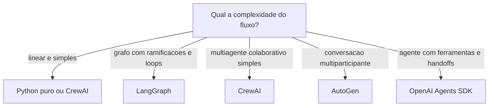

# Capítulo 1: Capítulo 9: Escolhendo o framework: LangGraph, CrewAI e além

## Introdução

Você construiu o loop, o contexto, a memória, as ferramentas e o planejador em Python puro — e isso não foi em vão: agora você entende o que cada framework faz por baixo do capô. Este capítulo responde à pergunta de engenharia que todo projeto encontra: **devo usar um framework


de agentes — LangGraph, CrewAI, AutoGen, OpenAI Agents SDK — ou continuar com código puro?** A resposta não é "sempre use o framework": é uma decisão de arquitetura com critérios objetivos, e escolher errado custa caro — ou em complexidade desnecessária, ou em reescrever tudo no meio do projeto [16][29].

O ecossistema de frameworks amadureceu entre 2024 e 2026: LangGraph consolidou-se como a plataforma de grafos de estado para agentes em produção; CrewAI popularizou o multiagente baseado em "equipes" (crews); AutoGen da Microsoft trouxe o agente conversacional multiparticipante; e o OpenAI Agents SDK simplificou o agente com ferramentas e handoffs [16][29]. Cada um tem filosofia, modelo mental e trade-offs próprios — e nenhum elimina a disciplina que você aprendeu nos capítulos anteriores: contexto, memória, ferramentas e observabilidade continuam sendo suas responsabilidades.

Ao final deste capítulo, você será capaz de decidir — com critérios, não com hype — se o OrquestraIA usa framework ou código puro, e qual framework escolher entre os principais. Você implementará o mesmo agente nas duas formas — código puro e LangGraph — comparando na prática o que o framework adiciona e o que ele esconde, e verá o comparativo de produção que orienta a decisão do projeto.

## Explica

### O Que um Framework de Agentes Resolve

Um framework de agentes resolve quatro problemas recorrentes: **estado do loop** (persistência, checkpointing e retomada do fluxo entre passos), **orquestração declarativa** (descrever o fluxo — nós, arestas, condicionais — em vez de programá-lo imperativamente), **primitivas de agente** (handoffs, subagentes, ferramentas, memória com configuração declarativa) e **observabilidade embutida** (traces, run IDs, logs estruturados). O custo é igualmente claro: **abstração** (o framework decide coisas que você precisará entender quando der errado), **dependência** (a biblioteca evolui, quebra, muda de API) e **custo de aprendizado** (o modelo mental do framework soma-se ao domínio) [16][29].

### O Panorama de 2026

**LangGraph**: a plataforma de grafos de estado da LangChain. O agente é um grafo de nós (LLM, ferramentas, decisões) com um estado tipado que atravessa os nós. Forças: controle fino do fluxo, checkpointing nativo, integração com o ecossistema LangChain, modo de produção robusto (LangGraph Platform). Fraquezas: curva de aprendizado íngreme e mais boilerplate [16].

**CrewAI**: o multiagente como equipes — roles, goals e backstories definem agentes que colaboram em "crews". Forças: simplicidade conceitual para multiagente, onboarding rápido, foco em colaboração (hierarchical e sequential processes). Fraquezas: controle fino menor, abstração que esconde o fluxo [29].

**Microsoft AutoGen**: agentes conversacionais que dialogam — o fluxo emerge da conversa entre participantes. Forças: flexibilidade para padrões de debate e colaboração (pesquisa acadêmica), multiagente nativo. Fraquezas: fluxo menos determinístico, mais difícil de prever [23].

**OpenAI Agents SDK**: agente com ferramentas, guardrails e handoffs, em estilo leve e idiomático. Forças: simplicidade, modelo mental direto, excelente para agentes com ferramentas e subagentes. Fraquezas: ecossistema mais jovem, menos foco em grafos complexos [16].

### O Critério de Decisão

A decisão framework vs. código puro — e qual framework — se resume a três perguntas: **complexidade do fluxo** (grafos com ramificações, loops e condicionais pedem LangGraph; fluxos lineares pedem código puro ou CrewAI), **exigências de produção** (checkpointing, retomada, filas, traces exigem a plataforma do framework) e **tamanho da equipe e da curva** (uma equipe


pequena e experiente em Python puro pode entregar mais rápido sem framework do que aprendendo um; uma equipe que já vive no ecossistema ganha com ele) [3][16]. A regra de ouro continua a mesma: **a ferramenta mais simples que resolve o problema** — e código puro é uma opção legítima, não um atalho de amador.

## Ilustra

### O Restaurante: Cozinha Livre ou Kit de Cozinha?

Escolher um framework de agentes é escolher entre cozinhar em cozinha livre ou comprar um kit de cozinha. A cozinha livre (código puro) dá controle total: você decide cada utensílio, cada técnica, cada detalhe — e paga com trabalho: montar a infraestrutura você mesmo. O kit de cozinha (framework) entrega utensílios prontos e testados: você monta o prato mais rápido, seguindo o manual — e paga com flexibilidade: o que o kit não prevê, você contorna, não controla.

A analogia continua nos tipos de kit. O LangGraph é o kit de cozinha industrial: potente, configurável, exige treinamento — para restaurantes grandes (fluxos complexos em produção). O CrewAI é o kit de jantar em equipe: simples, orientado a papéis, cada um faz seu prato — para equipes


de cozinheiros colaborando. O código puro é a cozinha do chef experiente: sem kit, mas com domínio absoluto. O chef que compra o kit industrial para servir um lanche paga caro pelo que não usa; o chef que cozinha tudo à mão para um banquete corporativo entrega tarde [16][29].



### A Analogia do Transporte

Uma segunda lente: o transporte de carga. O caminhão (código puro) entrega qualquer carga, com a rota que você decide — flexível, mas você dirige. O trem (LangGraph) entrega muito, em trilhos definidos — eficiente em escala, mas só onde há trilho. O entregador de bicicleta (CrewAI)


é ágil para cargas pequenas e próximas — perfeito para fluxos simples. O erro clássico: alugar um trem para entregar uma pizza. O framework certo é o veículo certo para a carga — e o tamanho da carga cresce com a complexidade e as exigências de produção [16].

## Técnica

### O Mesmo Agente em Duas Formas

Vamos comparar na prática: o agente de consulta de pedidos em Python puro (dos capítulos anteriores) e em LangGraph — para que você veja exatamente o que o framework adiciona e o que esconde:

**Versão Python puro (a que você já conhece):**

```python
# agente_puro.py — o loop completo em código puro (recapitulacao)
def executar_agente(missao, llm, ferramentas, limite=5):
    observacao = missao
    trilha = []
    for _ in range(limite):
        decisao = llm.chamar_simples(
            f"Escolha uma ferramenta {list(ferramentas)} com argumentos, "
            f"ou FINAL:<resposta>. Estado: {observacao}")
        trilha.append(decisao)
        if decisao.startswith("FINAL:"):
            return decisao[6:].strip(), trilha
        nome, args = _parsear_decisao(decisao)  # ex.: consultar_pedido(pedido_id=P-7841)
        observacao = ferramentas[nome](**args)
        trilha.append(observacao)
    return "limite atingido", trilha
```

**Versão LangGraph (o grafo de estado):**

```python
# agente_langgraph.py — o mesmo agente como grafo de estado
# Instalacao: pip install langgraph langchain-openai
from typing import TypedDict, Literal
from langgraph.graph import StateGraph, END

class Estado(TypedDict):
    missao: str
    trilha: list
    resposta: str

def no_llm(estado: Estado) -> Estado:
    """No que chama o modelo e decide o proximo no."""
    decisao = chamar_llm_com_ferramentas(estado["missao"])
    estado["trilha"] = estado.get("trilha", []) + [decisao]
    if decisao["tipo"] == "final":
        estado["resposta"] = decisao["texto"]
    else:
        estado["ferramenta_escolhida"] = decisao
    return estado

def no_ferramenta(estado: Estado) -> Estado:
    """No que executa a ferramenta e devolve a observacao."""
    obs = executar(estado["ferramenta_escolhida"])
    estado["trilha"].append(obs)
    estado["missao"] = f"Observacao: {obs}"
    return estado

def rotear(estado: Estado) -> Literal["ferramenta", "fim"]:
    return "fim" if estado.get("resposta") else "ferramenta"

# Monta o grafo: LLM -> (ferramenta | fim)
grafo = StateGraph(Estado)
grafo.add_node("llm", no_llm)
grafo.add_node("ferramenta", no_ferramenta)
grafo.add_edge("llm", "ferramenta")
grafo.add_conditional_edges("llm", rotear, {"ferramenta": "ferramenta", "fim": END})
grafo.set_entry_point("llm")
app = grafo.compile()
resultado = app.invoke({"missao": "consultar o pedido P-7841"})
print(resultado["resposta"])
```

A comparação é instrutiva: o LangGraph **declara o fluxo como grafo** (nós, arestas, roteamento condicional) em vez de programá-lo como laço — o que dá visibilidade e checkpointing; o código puro é **direto e sem dependências** — o que dá controle total e simplicidade. Nenhuma das versões é "melhor" — são decisões de arquitetura [16].

### O Comparativo de Produção

A decisão do OrquestraIA, após a comparação, foi **código puro para os especialistas + orquestrador próprio** (Capítulo 10), por três razões: o fluxo do sistema é conhecido e controlado (rotas + orquestração simples — não exige grafo genérico), a equipe do projeto domina o código puro (curva zero) e a observabilidade é construída sob medida (Capítulo 16). Essa é uma decisão contextual: um projeto com fluxo complexo e imprevisível se beneficiaria do LangGraph, e um time já imerso no ecossistema CrewAI entregaria mais rápido com ele [16][29].

### Checklist de Escolha de Framework

- [ ] A complexidade do fluxo **justifica** o framework (grafos, loops, condicionais)?
- [ ] As exigências de produção (checkpoint, retomada, filas) exigem a plataforma?
- [ ] A curva de aprendizado e o tamanho da equipe foram pesados?
- [ ] O código puro foi considerado como opção legítima — não como atalho?
- [ ] A decisão está documentada com os critérios (ADR — registro de decisão)?

## Aplica

### Framework no Chão de Fábrica

A escolha de framework é uma decisão de arquitetura com impacto de longo prazo — e a pesquisa do mercado mostra um espectro real de adoção: LangGraph domina os casos de produção com fluxos complexos e observabilidade exigente; CrewAI ganha os projetos multiagente de onboarding rápido; o código puro permanece forte onde a equipe já tem a infraestrutura própria [16][29]. Os frameworks não substituem a disciplina: os sistemas que falham em produção falham por contexto, memória e observabilidade — com ou sem framework [8].

A decisão de framework também é uma decisão de **custo de mudança**: migrar de framework no meio do projeto é caro — o modelo mental do time, as integrações e os checkpoints se perdem. Por isso a recomendação prática: **prototipe o mesmo agente nas duas formas (puro e framework) antes de decidir** — como você fez neste capítulo — e documente a decisão num ADR (registro de decisão de arquitetura), com os critérios e o custo estimado de cada opção [3][16].

### Armadilhas Comuns

1. **Framework por hype**: escolher LangGraph porque "todo mundo usa" sem comparar com o código puro — o fluxo simples paga complexidade desnecessária. 2. **Abstração sem entendimento**: usar o framework sem entender o loop por baixo — quando o trace dá errado, não há como depurar (este livro


construiu o entendimento antes do framework, de propósito). 3. **Framework como substituto de disciplina**: o LangGraph não projeta seu contexto nem sua memória — a engenharia dos capítulos 5-8 continua sua responsabilidade. 4. **Migração tardia**: decidir o framework no meio do projeto, quando o custo de mudança já explodiu.

### Conexão com o OrquestraIA

O OrquestraIA fica em código puro pelos critérios deste capítulo — mas a decisão fica documentada e revisável: se o fluxo do sistema crescer para grafos complexos com checkpointing exigente, a migração para LangGraph é o caminho planejado, não uma reação de emergência.

### Aprofundamento: A Avaliação Comparativa de Frameworks em Produção

As comparações de frameworks do mercado convergem em dimensões que a decisão deve considerar além das features de marketing: **estabilidade da API** (a frequência de quebras — um framework jovem muda de API rápido, e cada quebra é custo de migração), **ecossistema** (integrações, modelos, observabilidade — a rede que o framework traz), **modo de produção** (checkpointing, filas, retomada — o que o Capítulo


17 exige, já embutido ou para construir), **licenciamento e custo** (plataformas gerenciadas cobram por execução — o custo por missão do Capítulo 16) e **comunidade e talento** (a facilidade de contratar e manter quem conhece o framework). A avaliação é pontuada com pesos do contexto do projeto — a dimensão que pesa mais para você decide a escolha, não a média cega [16][29].

A comparação mais importante, porém, é a que este capítulo demonstrou: **implementar o mesmo agente nas duas formas** (puro e framework) com o mesmo conjunto de missões de teste — e medir linhas de código, tempo de implementação e facilidade de depuração. A demo do fornecedor mostra o melhor caminho do framework; o seu protótipo mostra o caminho do seu time no seu domínio — e é o segundo que decide [3][16].

### O Modelo Mental por Trás de Cada Framework

Cada framework carrega um modelo mental — e escolher é adotar o modelo: **LangGraph** pensa em grafos (nós, arestas, estado tipado — o fluxo é o artefato), **CrewAI** pensa em equipes (roles, goals, processos — a colaboração é o artefato), **AutoGen** pensa em conversas (participantes que dialogam — o discurso é o artefato) e o **OpenAI Agents SDK** pensa em agentes e ferramentas (handoffs e guardrails — a delegação é o artefato) [16][29]. O modelo mental do framework vira o modelo mental do time: a


equipe que pensa em grafos desenha fluxos como grafos, e a equipe que pensa em equipes desenha colaboração. A escolha do framework é, no fundo, a escolha do modelo mental que a sua equipe adota — e a consistência entre o modelo mental e a natureza do problema é o que determina o sucesso de longo prazo. O código puro não tem modelo mental próprio — e é exatamente isso que o torna a opção neutra quando o problema não casa com nenhum dos modelos [3].

### Aprofundamento: O Híbrido — Framework com Núcleo Próprio

A dicotomia "framework ou código puro" esconde uma terceira opção que muitos sistemas de produção adotam: o **híbrido** — o núcleo crítico em código puro (o loop, a orquestração, os contratos — onde o controle e a observabilidade importam) e o framework nas bordas (conectores, integrações, primitivas prontas — onde o ecossistema agrega). O híbrido aproveita o melhor dos dois mundos: a disciplina do núcleo (testável, auditável, sob seu controle) e a velocidade das bordas


(o framework entrega integrações prontas). O custo é a **fronteira** — a interface entre o núcleo puro e as bordas do framework precisa de contrato estável, ou o acoplamento vaza (o framework dita regras para dentro do núcleo). O OrquestraIA usaria o híbrido assim: o loop e o orquestrador em código puro (Capítulos 2 e 10), e conectores MCP e integrações de modelo via SDKs — a escolha que o Capítulo 17 aprofunda no gateway [16][29].

### A Decisão de Framework como Decisão de Time

A escolha de framework é, no fundo, uma decisão de **time**: o framework que a equipe entende profundamente vale mais do que o tecnicamente superior que ninguém domina. A prática recomendada: a decisão considera a **composição do time** (senioridade, familiaridade com o ecossistema, disposição para a curva), a **contratabilidade** (a facilidade de trazer gente nova que conheça o stack — o


LangGraph é mais contratável que um framework próprio) e a **continuidade** (o que acontece quando o autor principal sai? O framework tem comunidade e documentação; o código puro depende da documentação interna — o ADR do Capítulo 3). A decisão documentada com esses critérios é uma decisão que sobrevive às mudanças de time — e é o que o ADR registra [16][3].

## Conclusão

Três pontos para levar: **primeiro**, um framework de agentes resolve estado, orquestração, primitivas e observabilidade — ao custo de abstração, dependência e curva de aprendizado. **Segundo**, o panorama de 2026 tem perfis claros: LangGraph para grafos de produção, CrewAI para equipes multiagente simples, AutoGen para conversação multiparticipante,


OpenAI Agents SDK para agentes com ferramentas — e código puro como opção legítima. **Terceiro**, a decisão se resume a três critérios — complexidade do fluxo, exigências de produção e equipe — e a melhor evidência é prototipar o mesmo agente nas duas formas antes de escolher.

O próximo capítulo constrói o coração do projeto: o **orquestrador do OrquestraIA** — a central que planeja, roteia, delega e consolida, unindo os especialistas de atendimento, vendas e análise em um sistema coeso.

**Desafio opcional**: implemente o agente de consulta de pedidos nas duas formas (puro e LangGraph) com o mesmo conjunto de 5 missões de teste. Compare: linhas de código, tempo de implementação e facilidade de depurar um erro proposital que você introduzir. A experiência prática vale mais que qualquer benchmark.

## Para se aprofundar

Este capítulo faz parte do e-book **Construindo o OrquestraIA na Prática**, extraído da obra completa *IA Agêntica Desbloqueada: Um guia para projetar, construir e implantar sistemas de IA autônomos*. No livro-mãe, você encontra o mesmo conteúdo com aprofundamento técnico adicional: diagramas Mermaid, blocos de código executáveis, referências ABNT verificáveis e a narrativa completa do projeto OrquestraIA — do primeiro agente ao monitoramento em produção.

Se este e-book despertou sua atenção para a construção de sistemas de IA autônomos, o próximo passo natural é levar o aprendizado para o seu próprio contexto: escolha um problema pequeno e bem delimitado, desenhe o agent loop com uma única ferramenta e uma única política de autonomia, e meça o resultado antes de escalar. A autonomia é uma concessão que se conquista com evidência.

**Quer continuar?** Explore os demais e-books da série: *Construindo o OrquestraIA na Prática* é apenas uma parte do caminho — os outros volumes cobrem o desenho do sistema, a construção prática, a governança e a operação contínua.
