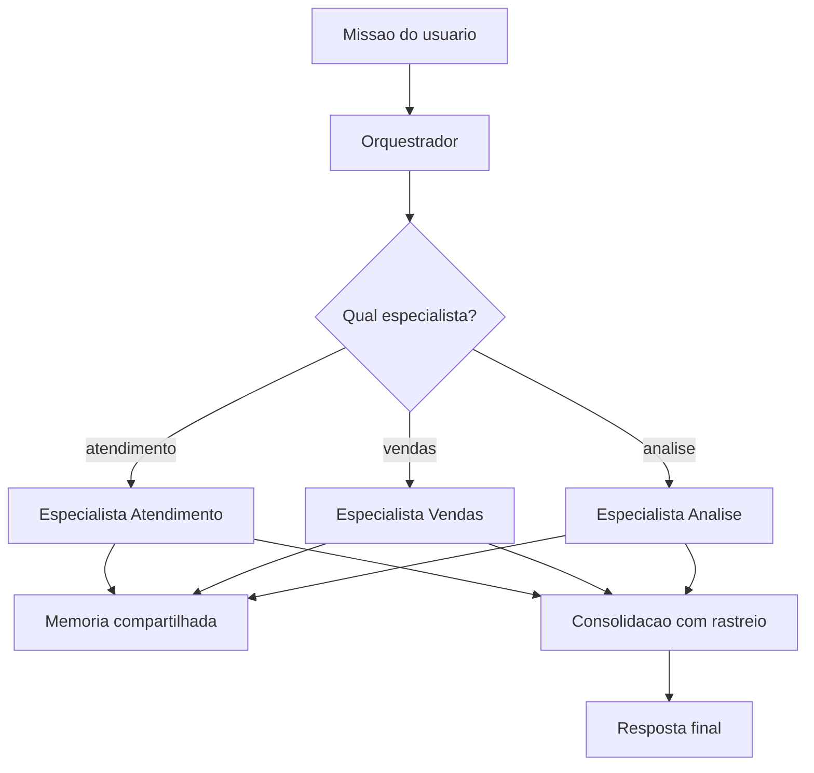

# Capítulo 2: Capítulo 10: O núcleo do OrquestraIA: o orquestrador

## Introdução

Chegou o capítulo que une tudo. Os capítulos anteriores construíram as peças — o loop, o contexto, a memória, as ferramentas, o planejador, a decisão de framework. Este capítulo monta o sistema: o **orquestrador do OrquestraIA**, a central que recebe as missões, planeja, roteia para os especialistas (atendimento, vendas, análise), consolida os resultados e devolve a resposta final. É o padrão orquestrador-empregados do Capítulo 3, agora em código completo de produção [1][20].

O orquestrador é onde a arquitetura multiagente ganha ou perde. Um bom orquestrador é transparente (você sabe o que cada especialista fez), resiliente (um especialista que falha não derruba a missão) e barato (não gasta tokens com roteamentos desnecessários). Um mau orquestrador é um gargalo opaco que multiplica erros: roteia mal, delega sem verificar e devolve respostas sem rastreio. A pesquisa sobre orquestração de sistemas multiagente documenta exatamente esses riscos — e os padrões que os mitigam: roteamento com fallback, delegação verificada e consolidação com auditoria [1][20].

Ao final deste capítulo, você terá o OrquestraIA funcional em sua primeira versão: o orquestrador com catálogo de especialistas, roteamento por LLM, delegação com tentativas, consolidação com relatório e a integração com memória, ferramentas e contexto dos capítulos anteriores. O sistema inteiro que você construiu peça a peça passa a funcionar como um todo — e o Capítulo 12 vai além, com os padrões multiagente avançados (debate, pipeline, hierarquia).

## Explica

### O Papel do Orquestrador

O orquestrador é o padrão central dos sistemas multiagente [1][20]: um componente central recebe a missão, decide o que fazer, delega partes a especialistas e consolida os resultados. O orquestrador não executa o trabalho do especialista — ele **coordena**: entende a missão, escolhe o caminho, supervisiona a execução e garante que o resultado responda à missão original. É o administrador do shopping do Capítulo 3: não vende sapatos — decide para qual loja cada cliente vai e garante que a compra seja concluída [1].

As quatro responsabilidades do orquestrador: **interpretação** (entender a missão e extrair intenção, entidades e requisitos), **planejamento** (decompor a missão em tarefas — o Capítulo 8), **delegação** (rotear cada tarefa ao especialista certo, com tentativas e fallback) e **consolidação** (reunir os resultados, resolver conflitos e compor a resposta final com rastreio) [20].

### O Roteamento: A Decisão Mais Visível

O roteamento é a decisão que o usuário vê: qual especialista atende cada missão. Duas abordagens: **roteamento por regras** (heurísticas determinísticas — palavras-chave, padrões, classificadores — barato, previsível, mas rígido) e **roteamento por LLM** (o modelo decide o destino — flexível, entende intenção ambígua, mas custa tokens


e pode errar). A prática recomendada: **regras primeiro, LLM como refinamento** — o roteador por regras captura os casos claros sem custo, e o LLM decide os ambíguos. O erro de roteamento é o mais caro do sistema: delega ao especialista errado multiplica o erro pela cadeia [1][3].

### Delegação com Verificação

Delegar não é jogar a missão por cima do muro: é **delegar com contrato**. O contrato de delegação tem três partes: **escopo** (o que o especialista deve resolver e o que não deve), **entrada** (o contexto mínimo — missão, entidades, restrições) e **retorno** (o formato do resultado — resposta, dados, rastreio). O orquestrador verifica o retorno contra a missão: o resultado responde à pergunta original? Se não, re-delega ou escala. A delegação sem verificação é a fonte clássica de respostas que "não respondem nada" [1][20].

### Consolidação com Rastreio

A consolidação é o que transforma resultados parciais em resposta final: reúne as saídas dos especialistas, resolve contradições (qual fonte prevalece? — pela política, Capítulo 14) e compõe a resposta com o **rastreio** — quem fez o quê, em que ordem, com quais observações. O rastreio é o material da auditoria (Capítulo 16) e da confiança (Capítulo 15): sem ele, o sistema multiagente é uma caixa-preta com muitos bolsos [21][20].

## Ilustra

### O Centro de Distribuição de uma Operação de Logística

O orquestrador é o centro de distribuição de uma operação logística. Os especialistas são os galpões: um recebe (atendimento), outro expede (vendas), outro analisa rotas (análise). O centro recebe o pedido (missão), decide qual galpão atende (roteamento), envia a ordem de serviço com especificações (delegação com contrato), confere o retorno (verificação) e consolida o resultado para o cliente (consolidação com rastreio).

O centro de distribuição ruim é o gargalo que ninguém entende: envia a ordem errada para o galpão errado, não confere se o retorno respondeu o pedido e devolve respostas sem registro de quem fez o quê. O centro bom é quase invisível: as ordens fluem, os erros são detectados na origem e cada entrega tem rastro completo [1][20].



### A Analogia do Maestro

Uma segunda lente: o maestro de orquestra. O maestro não toca os instrumentos — os músicos tocam (os especialistas). Ele interpreta a partitura (a missão), decide a entrada de cada seção (o roteamento), conduz o andamento (a supervisão) e garante que o conjunto soe como uma obra (a consolidação). O maestro que tentasse tocar todos os


instrumentos seria um músico ruim e um maestro pior — o orquestrador que faz o trabalho dos especialistas é o mesmo erro. E a orquestra sem maestro toca junto no papel, mas desafinada na prática: cada músico no seu tempo, sem unidade. O orquestrador é o que transforma um conjunto de agentes em um **sistema** [1].

## Técnica

### O Orquestrador Completo do OrquestraIA

Vamos montar o núcleo do sistema — o orquestrador que reúne todos os módulos dos capítulos anteriores:

```python
# orquestrador.py — o núcleo do OrquestraIA (v1)
from dataclasses import dataclass, field
import time

@dataclass
class ContratoDelegacao:
    """Contrato de delegacao: escopo, entrada e retorno esperado."""
    especialista: str
    escopo: str
    entrada: dict
    retorno_esperado: str = ""

@dataclass
class Orquestrador:
    """Central do OrquestraIA: planeja, roteia, delega e consolida."""
    nome: str = "orquestraia"
    especialistas: dict = field(default_factory=dict)
    limite_tentativas: int = 3
    rastreio: list = field(default_factory=list)

def registrar(self, nome: str, agente, escopo: str) -> None:
        """Registra um especialista com seu escopo declarado."""
        self.especialistas[nome] = {"agente": agente, "escopo": escopo}

def interpretar(self, missao: str) -> dict:
        """Interpretacao: extrai intencao e entidades da missao."""
        # No sistema real: LLM extrai intencao estruturada.
        # Heuristica didatica: detecta o dominio pela missao.
        if any(k in missao.lower() for k in ("pedido", "estoque", "cliente")):
            return {"dominio": "atendimento", "missao": missao}
        if any(k in missao.lower() for k in ("venda", "lead", "proposta")):
            return {"dominio": "vendas", "missao": missao}
        return {"dominio": "analise", "missao": missao}

def delegar(self, contrato: ContratoDelegacao) -> str:
        """Delegacao com tentativas e fallback."""
        especialista = self.especialistas[contrato.especialista]
        for tentativa in range(1, self.limite_tentativas + 1):
            try:
                resultado = especialista["agente"].executar(
                    contrato.entrada.get("missao", contrato.escopo))
                self.rastreio.append({
                    "tempo": time.strftime("%H:%M:%S"),
                    "especialista": contrato.especialista,
                    "tentativa": tentativa,
                    "resultado": resultado[:120],
                })
                return resultado
            except Exception as e:
                self.rastreio.append({
                    "tempo": time.strftime("%H:%M:%S"),
                    "especialista": contrato.especialista,
                    "tentativa": tentativa,
                    "erro": str(e)[:120],
                })
        return f"[{contrato.especialista}] falhou apos {self.limite_tentativas} tentativas"

def consolidar(self, missao: str, resultados: dict) -> str:
        """Consolidacao: compoe a resposta final com o rastreio."""
        linhas = [f"Resolvido para: {missao}"]
        for especialista, resultado in resultados.items():
            linhas.append(f"- {especialista}: {resultado}")
        linhas.append("Rastreio: " + "; ".join(
            f"{r['especialista']}->{r.get('resultado', r.get('erro', ''))[:40]}"
            for r in self.rastreio[-6:]))
        return "\n".join(linhas)

def executar(self, missao: str) -> str:
        """Fluxo completo: interpretar -> planejar -> delegar -> consolidar."""
        self.rastreio = []
        interpretacao = self.interpretar(missao)
        dominio = interpretacao["dominio"]
        if dominio not in self.especialistas:
            return f"Nenhum especialista cobre '{dominio}'"
        contrato = ContratoDelegacao(
            especialista=dominio, escopo=self.especialistas[dominio]["escopo"],
            entrada=interpretacao)
        resultado = self.delegar(contrato)
        return self.consolidar(missao, {dominio: resultado})

# Uso com os agentes dos capitulos anteriores:
# orquestra = Orquestrador()
# orquestra.registrar("atendimento", agente_atendimento,
#                     "resolver problemas de pedidos, estoque e clientes")
# orquestra.registrar("vendas", agente_vendas,
#                     "qualificar leads e preparar propostas de venda")
# orquestra.registrar("analise", agente_analise,
#                     "responder perguntas sobre dados e gerar relatorios")
# print(orquestra.executar("o cliente quer saber o status do pedido P-7841"))
```

Repare nas decisões de engenharia: **escopo declarado por especialista** (o orquestrador conhece o catálogo — nada de descoberta dinâmica no começo), **rastreio em cada tentativa** (sucesso e erro ficam registrados — o material da observabilidade do Capítulo 16), **delegação com tentativas e fallback** (um especialista que falha não derruba a missão) e **consolidação com rastreio** (a resposta final carrega quem fez o quê).

### O Roteador por LLM (Versão Avançada)

A heurística do `interpretar` resolve os casos claros. Para os ambíguos, o roteador por LLM — o refinamento que reduz o erro de roteamento sem explodir o custo:

```python
# roteador_llm.py — refinamento do roteamento com LLM
class RoteadorLLM:
    """Roteamento: regras primeiro, LLM como refinamento dos ambiguos."""
    def __init__(self, llm):
        self.llm = llm

def rotear(self, missao: str, especialistas: dict) -> str:
        # 1. regras: casos claros sem custo de tokens
        if "estoque" in missao.lower() or "pedido" in missao.lower():
            return "atendimento"
        # 2. LLM: ambiguos decididos pelo modelo
        catalogo = "\n".join(
            f"- {nome}: {info['escopo']}" for nome, info in especialistas.items())
        decisao = self.llm.chamar_simples(
            "Qual especialista atende esta missao? Escolha entre:\n"
            f"{catalogo}\nMissao: {missao}\nResponda apenas com o nome.")
        return decisao.strip().lower() if decisao.strip() in especialistas else "analise"
```

O padrão regras → LLM é a prática recomendada: o determinístico barato captura a maioria, o LLM decide os poucos casos ambíguos — e o orquestrador registra a decisão de roteamento no rastreio, para auditoria [1][3].

### Checklist do Orquestrador

- [ ] Catálogo de especialistas com **escopo declarado** por especialista?
- [ ] **Interpretação** da missão (regras primeiro, LLM como refinamento)?
- [ ] **Delegação com contrato** — escopo, entrada, retorno esperado?
- [ ] Tentativas e **fallback** — um especialista que falha não derruba a missão?
- [ ] **Consolidação com rastreio** — a resposta final carrega quem fez o quê?
- [ ] Custo de roteamento controlado (regras antes de LLM)?

## Aplica

### O Orquestrador no Chão de Fábrica

O padrão orquestrador-empregados é o mais comum em produção porque resolve o problema real de coordenação com o menor custo: cada especialista é testável isoladamente, o roteamento é auditable e o fallback protege a missão [1][20]. Os sistemas de suporte com múltiplos canais (chat, e-mail, WhatsApp) usam o padrão: o orquestrador classifica a entrada, roteia para o canal/especialista certo e consolida [27]. Os sistemas de análise multi-fonte usam o padrão com pipeline: o orquestrador roteia, e cada estágio transforma os dados [10].

A lição de produção mais importante: **o orquestrador deve ser o componente mais testado do sistema**. O roteamento errado multiplica erros; a delegação sem verificação produz respostas vazias; o rastreio ausente impede a correção. Os testes do Capítulo 13 começam pelo orquestrador — e a observabilidade do Capítulo 16 o coloca sob vigilância contínua [1][4].

### Armadilhas Comuns

1. **Orquestrador que executa**: o central faz o trabalho dos especialistas — vira um agente gigante, não um orquestrador. 2. **Roteamento cego**: delegar ao especialista errado multiplica o erro — regras + LLM + rastreio de roteamento. 3. **Delegação sem verificação**: o retorno não é conferido


contra a missão — "respostas" que não respondem nada. 4. **Sem fallback**: um especialista indisponível derruba a missão inteira — tentativas e caminho alternativo obrigatórios. 5. **Rastreio ausente**: sem registro de quem fez o quê, o sistema multiagente é inauditável — e a confiança (Capítulo 15) evapora.

### Conexão com o OrquestraIA

Este capítulo entrega o OrquestraIA v1 funcional: orquestrador + três especialistas (atendimento, vendas, análise), cada um usando o `Agente` (Capítulo 2), o `ConstrutorContexto` (Capítulo 5), a `MemoriaVetorial` (Capítulo 6) e o `RegistroFerramentas` (Capítulo 7). O Capítulo 11 conecta os especialistas ao mundo externo via MCP; o Capítulo 12 adiciona os padrões avançados.

### Aprofundamento: O Contrato de Delegação Completo

O contrato de delegação do capítulo usou uma versão enxuta — especialista, escopo, entrada e retorno esperado. A versão de produção adiciona três campos que evitam as falhas mais caras da orquestração. O **contexto mínimo** define exatamente o que o especialista recebe — a missão, as entidades extraídas, as restrições da política — evitando tanto o contexto pobre (o especialista adivinha) quanto o contexto inchado (o especialista paga tokens pelo


que não usa). O **formato de retorno** define a estrutura do resultado — resposta em linguagem natural, dados estruturados, ou ambos — permitindo que o orquestrador consolide sem parsear adivinhação. E o **critério de aceite** define como o orquestrador verifica o retorno — a resposta contém a entidade? O número bate com a fonte? — o elo com a verificação do Capítulo 8 e os graders do Capítulo 13 [1][20].

O contrato completo transforma a delegação de "jogar a missão por cima do muro" em "delegar com especificação" — e é a diferença entre o orquestrador que consolida e o que apenas concatena. O rastreio do orquestrador (o `rastreio` do capítulo) registra o contrato de cada delegação, fechando o elo com a observabilidade do Capítulo 16: a trilha mostra não apenas o que cada especialista fez, mas o que lhe foi pedido e o que foi aceito como resultado.

### O Orquestrador como Ponto de Teste

O orquestrador é o componente mais testado do sistema — e o golden set do Capítulo 13 tem uma seção dedicada a ele. Os casos de orquestração cobrem as quatro responsabilidades: **interpretação** (a missão ambígua é classificada no domínio certo?), **planejamento** (a missão composta é decomposta com critérios verificáveis?), **delegação** (o contrato chega íntegro ao especialista? o fallback funciona


quando o especialista falha?) e **consolidação** (a resposta final responde à missão original? o rastreio está completo?). Cada responsabilidade tem casos próprios no golden set — porque o orquestrador que falha em qualquer uma delas degrada o sistema inteiro, e a falha do orquestrador é a mais cara de diagnosticar (a resposta parece certa, mas o caminho está errado) [1][4].

## Conclusão

Três pontos para levar: **primeiro**, o orquestrador coordena com quatro responsabilidades — interpretar, planejar, delegar e consolidar — e não executa o trabalho dos especialistas. **Segundo**, a delegação é um contrato (escopo, entrada, retorno) com verificação, tentativas e fallback — delegar sem verificar produz respostas que não respondem nada. **Terceiro**, a consolidação com rastreio é o que torna o sistema multiagente auditável e confiável — quem fez o quê, em que ordem, com quais resultados.

O próximo capítulo conecta o OrquestraIA ao mundo: o **Model Context Protocol (MCP)** e as APIs — a camada padronizada que expõe ferramentas externas aos agentes, com segurança, autorização e os riscos de exposição.

**Desafio opcional**: implemente um segundo domínio no OrquestraIA — um especialista "financeiro" com duas ferramentas (consultar_fatura, registrar_pagamento) — e adicione o roteamento correspondente. Depois, introduza uma falha proposital no especialista de análise e verifique o fallback: o rastreio registra as tentativas? A missão sobrevive?

## Para se aprofundar

Este capítulo faz parte do e-book **Construindo o OrquestraIA na Prática**, extraído da obra completa *IA Agêntica Desbloqueada: Um guia para projetar, construir e implantar sistemas de IA autônomos*. No livro-mãe, você encontra o mesmo conteúdo com aprofundamento técnico adicional: diagramas Mermaid, blocos de código executáveis, referências ABNT verificáveis e a narrativa completa do projeto OrquestraIA — do primeiro agente ao monitoramento em produção.

Se este e-book despertou sua atenção para a construção de sistemas de IA autônomos, o próximo passo natural é levar o aprendizado para o seu próprio contexto: escolha um problema pequeno e bem delimitado, desenhe o agent loop com uma única ferramenta e uma única política de autonomia, e meça o resultado antes de escalar. A autonomia é uma concessão que se conquista com evidência.

**Quer continuar?** Explore os demais e-books da série: *Construindo o OrquestraIA na Prática* é apenas uma parte do caminho — os outros volumes cobrem o desenho do sistema, a construção prática, a governança e a operação contínua.
