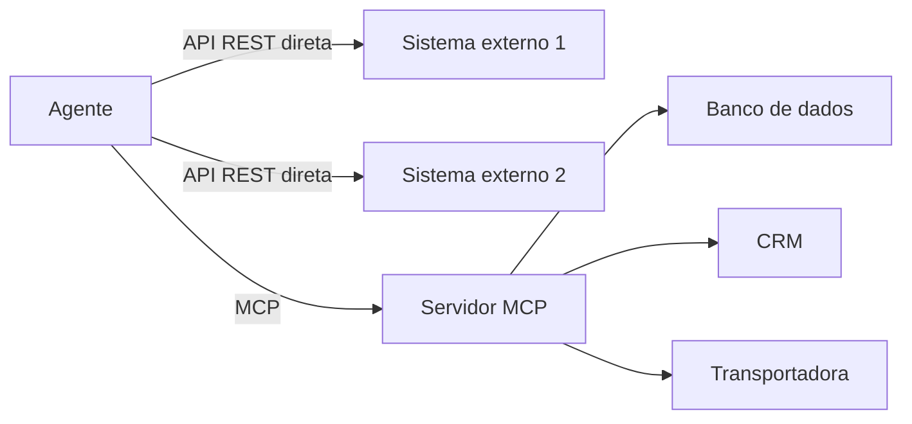

# Capítulo 3: Capítulo 11: Conectando ao mundo: MCP e APIs

## Introdução

O OrquestraIA está montado — mas está preso numa bolha: as ferramentas do Capítulo 7 são funções Python simuladas, e os especialistas do Capítulo 10 conversam entre si dentro do próprio processo. Este capítulo abre a porta: a conexão do sistema ao **mundo externo** — bancos de dados, CRMs, transportadoras, sistemas legados — pela camada padronizada do **Model Context Protocol (MCP)** e pelas APIs tradicionais. É aqui que o agente deixa de brincar de mundo e passa a operar sobre o mundo real [26].

O MCP virou o padrão de facto da conexão de agentes: o protocolo, criado pela Anthropic e adotado pelo ecossistema, define como um agente (host) conversa com servidores de contexto que expõem ferramentas, recursos e prompts de forma padronizada [26]. A adoção foi rápida porque resolve o problema da **fragmentação**: antes, cada integração era proprietária —


agora, um servidor MCP expõe ferramentas com contrato, e qualquer agente compatível as usa. A segurança do MCP, porém, é um tema quente: o protocolo amplia a superfície de ataque, e os guias de segurança da CoSAI e da Cerbos documentam os riscos — autorização, tool poisoning, prompt injection — que o Capítulo 14 aprofunda [5][6].

Ao final deste capítulo, você será capaz de conectar o OrquestraIA ao mundo: consumir uma API REST tradicional com segurança, expor ferramentas via servidor MCP e consumir servidores MCP externos, com a camada de autorização e o tratamento de erros que a produção exige. Você entenderá quando usar MCP e quando a API direta é a escolha certa — a decisão de arquitetura que este capítulo ensina com critérios.

## Explica

### O Model Context Protocol em Essência

O MCP tem três conceitos centrais: **host** (a aplicação de agente que usa o protocolo — o OrquestraIA), **servidor MCP** (o processo que expõe capacidades — ferramentas, recursos, prompts) e **transporte** (a conexão — stdio para processos locais, HTTP/SSE para remotos) [26]. O fluxo: o host conecta ao servidor, recebe o catálogo de ferramentas expostas (com contratos no formato do Capítulo 7), e o agente as usa como se fossem nativas — o runtime do MCP faz a ponte, a validação e o retorno de observações [26].

Os três tipos de primitivas do MCP: **ferramentas** (ações que o agente executa — a analogia direta com o `RegistroFerramentas` do Capítulo 7), **recursos** (dados que o agente pode ler — documentos, esquemas, políticas) e **prompts** (templates de interação definidos pelo servidor). O valor do MCP: uma vez que o servidor expõe, qualquer host compatível usa — o ecossistema de servidores MCP cresceu rápido, cobrindo bancos, CRMs, arquivos, navegadores e dev tools [26][6].

### API Direta vs. MCP: A Decisão

A decisão não é "MCP ou API" — é "quando o MCP agrega". Três critérios: **reuso externo** (a integração será consumida por outros agentes/ferramentas? MCP agrega — uma vez exposto, todos usam), **padronização** (o protocolo padroniza contrato, auth e descoberta — menos código proprietário de integração) e **ecossistema** (existe um servidor MCP pronto para o sistema que


você precisa? usar é mais rápido que construir). O custo: **camada extra** (um processo e um protocolo a mais — para integrações simples internas, a API direta é mais leve), **superfície de ataque** (cada servidor MCP exposto é um alvo — o Capítulo 14) e **abstração** (o fluxo de autorização do protocolo precisa ser entendido, não confiado) [26][6].

### Segurança da Conexão: O Novo Gargalo

Conectar o agente ao mundo é ampliar o alcance — e o risco. O MCP transfere o problema de segurança para a fronteira: cada servidor é um ponto onde um atacante pode injetar instruções (prompt injection), manipular ferramentas (tool poisoning) ou escalar privilégios. Os guias de segurança do setor convergem


em três práticas: **autorização granular** (cada ferramenta exposta tem política — quem pode, quando, com quais parâmetros — o Capítulo 14 implementa), **confiança mínima** (o host não confia no servidor cegamente — valida contratos e resultados) e **registro completo** (toda chamada a servidor é logada — o Capítulo 16) [5][6][7].

## Ilustra

### O Telefone, a Central e a Agenda de Contatos

A conexão do agente ao mundo é a infraestrutura de comunicação de uma empresa. A **API direta** é o telefone dedicado: você tem o número, disca, fala — simples, direto, mas cada destino exige seu próprio número e seu próprio jeito de discar. O **MCP** é a central telefônica com padrão universal: você disca um formato único (o protocolo), a central (o servidor MCP) conecta ao destino certo e devolve a resposta — qualquer empresa que se ligue à central conversa com qualquer destino compatível [26].

A agenda de contatos é a descoberta de capacidades: sem a central, você precisa do número de cada destino (integração proprietária); com a central, você consulta a agenda (o catálogo de ferramentas do servidor) e disca o que precisa. E o segurança da portaria é a autorização: nem todo chamado passa — a política decide quem pode ligar para onde (Capítulo 14) [6].



### A Analogia do Tomada Padrão

Uma segunda lente: o padrão de tomadas e plugues. Antes do padrão, cada fabricante de eletrodoméstico tinha seu plugue — e cada casa, seu tipo de tomada; conectar exigia adaptadores por fabricante (integração proprietária). O padrão universal — tomada e plugue com o mesmo formato —


mudou tudo: qualquer aparelho padrão conecta a qualquer tomada padrão (o MCP). O custo: a tomada padrão não conhece o aparelho — precisa de proteção (a autorização) e de etiquetas claras (o contrato de ferramentas). O MCP é o plugue padrão do mundo dos agentes [26].

## Técnica

### Consumindo uma API REST com Segurança

Antes do MCP, o padrão da conexão: a chamada de API com tratamento de erro, tempo limite e autenticação — o alicerce que todo agente precisa:

```python
# api_cliente.py — consumo de API REST com seguranca e erros estruturados
import os, json, time
import urllib.request, urllib.error

class ApiCliente:
    """Cliente de API REST com auth, timeout e observacao estruturada."""
    def __init__(self, base_url: str, token_env: str):
        self.base_url = base_url.rstrip("/")
        self.token = os.getenv(token_env, "")

def chamar(self, metodo: str, caminho: str, dados: dict = None) -> str:
        """Executa a chamada e devolve observacao estruturada para o agente."""
        url = f"{self.base_url}/{caminho}"
        corpo = json.dumps(dados).encode() if dados else None
        req = urllib.request.Request(
            url, data=corpo, method=metodo,
            headers={"Authorization": f"Bearer {self.token}",
                     "Content-Type": "application/json"})
        try:
            with urllib.request.urlopen(req, timeout=10) as resp:
                payload = resp.read().decode()
                return f"OK({resp.status}): {payload[:300]}"
        except urllib.error.HTTPError as e:
            return f"ERRO HTTP {e.code}: {e.read().decode()[:200]}"
        except urllib.error.URLError as e:
            return f"ERRO de rede: {e.reason}"
        except Exception as e:
            return f"ERRO inesperado: {e}"

# Uso:
# transporte = ApiCliente("https://api.transportadora.com.br/v1", "TRANSP_TOKEN")
# observacao = transporte.chamar("GET", "pedidos/P-7841/rastreio")
```

Repare na observação estruturada — a mesma disciplina do Capítulo 7: a classe de resposta (OK/ERRO) e o detalhe (status, mensagem) que o modelo interpreta para decidir o próximo passo.

### Expondo um Servidor MCP com Ferramentas

Agora o OrquestraIA expõe suas ferramentas como servidor MCP — para que qualquer host compatível as use. Usamos o SDK oficial `mcp` (Python):

```python
# servidor_mcp_orquestraia.py — expoe as ferramentas do OrquestraIA via MCP
# Instalacao: pip install "mcp[cli]"
from mcp.server.fastmcp import FastMCP

mcp = FastMCP("orquestraia")

@mcp.tool()
def consultar_pedido(pedido_id: str) -> str:
    """Consulta o status de um pedido pelo ID. Retorna status, data e
    transportadora. Use quando perguntarem sobre entregas ou rastreio."""
    # a mesma logica do catalogo do Cap. 7
    status = {"P-7841": "em_transito", "P-7842": "entregue"}
    return json.dumps({"pedido": pedido_id,
                       "status": status.get(pedido_id, "nao_encontrado")},
                      ensure_ascii=False)

@mcp.tool()
def registrar_preferencia(cliente: str, contato: str) -> str:
    """Registra a preferencia de contato de um cliente."""
    # persistiria na MemoriaVetorial do Cap. 6
    return json.dumps({"cliente": cliente, "contato": contato},
                      ensure_ascii=False)

if __name__ == "__main__":
    mcp.run()  # transporte stdio por padrao
```

O servidor expõe `consultar_pedido` e `registrar_preferencia` com contratos ricos — qualquer host MCP (o OrquestraIA ou outro) as descobre e as usa.

### Consumindo um Servidor MCP

O OrquestraIA conecta-se ao servidor e usa as ferramentas expostas como se fossem nativas:

```python
# cliente_mcp.py — o OrquestraIA consome um servidor MCP
from mcp import ClientSession, StdioServerParameters
from mcp.client.stdio import stdio_client

async def usar_mcp(caminho_servidor: str, pedido_id: str) -> str:
    """Conecta ao servidor MCP, lista ferramentas e executa uma."""
    params = StdioServerParameters(command="python", args=[caminho_servidor])
    async with stdio_client(params) as (read, write):
        async with ClientSession(read, write) as sessao:
            await sessao.initialize()
            # 1. descoberta: o catalogo de ferramentas expostas
            catalogo = await sessao.list_tools()
            print("Ferramentas expostas:", [t.name for t in catalogo.tools])
            # 2. execucao com contrato
            resultado = await sessao.call_tool(
                "consultar_pedido", {"pedido_id": pedido_id})
            return str(resultado.content[0].text)

# Uso (num script async):
# import asyncio
# resp = asyncio.run(usar_mcp("servidor_mcp_orquestraia.py", "P-7841"))
# print(resp)
```

O fluxo do cliente espelha o contrato do Capítulo 7: **descoberta** (o catálogo vem do servidor), **chamada com argumentos nomeados** e **observação estruturada** — a mesma disciplina, agora através do protocolo [26].

### Checklist de Conexão

- [ ] A decisão API vs. MCP foi tomada com critérios (reuso, padronização, ecossistema)?
- [ ] Autenticação via **variáveis de ambiente** (nunca em código)?
- [ ] Erros de rede/HTTP como **observações estruturadas** (não exceções soltas)?
- [ ] Servidor MCP com **contratos ricos** nas ferramentas expostas?
- [ ] **Autorização** na fronteira: quem pode chamar o quê (Capítulo 14)?
- [ ] Registro de toda chamada externa (Capítulo 16)?

## Aplica

### A Conexão no Chão de Fábrica

A conexão ao mundo é onde os sistemas agênticos entregam valor operacional: consultar o pedido real na transportadora, atualizar o CRM, gravar no banco de dados — cada ferramenta externa é um degrau entre a conversa e a operação [27][10]. O MCP acelera esse caminho: em vez de escrever integrações proprietárias para cada sistema, o ecossistema oferece servidores prontos — e a mesma disciplina de contrato e observação se aplica [26].

A segurança da conexão, porém, é o novo gargalo da produção: o protocolo amplia a superfície de ataque, e os incidentes de segurança de agentes em 2026 documentam exatamente os vetores — prompt injection via dados externos, tool poisoning, abuso de autorização [30]. A lição operacional: **conectar sem proteger é o erro mais caro do sistema agêntico** — a autorização (Capítulo 14) e a observabilidade (Capítulo 16) não são camadas opcionais da conexão: são parte dela [5][6].

### Armadilhas Comuns

1. **MCP por moda**: adotar MCP para uma integração interna simples — a API direta é mais leve. Decida por critérios, não por hype. 2. **Token em código**: credenciais no código-fonte vazam — variáveis de ambiente e cofres (Capítulo 17) são obrigatórios. 3. **Erro sem observação**: exceção solta em vez de observação estruturada — o


agente não sabe o que aconteceu nem o que fazer. 4. **Servidor MCP sem autorização**: expor ferramentas sem política é abrir a porta — cada ferramenta exposta precisa de autorização granular. 5. **Confiança cega no servidor**: confiar no contrato e no resultado do servidor externo sem validação — a fronteira é exatamente onde o atacante age.

### Conexão com o OrquestraIA

O OrquestraIA conecta-se ao mundo em duas camadas: as integrações diretas (transportadora, CRM — via `ApiCliente`) e o ecossistema MCP (servidores de banco, arquivos, dev tools — via `ClientSession`). A autorização da fronteira vem no Capítulo 14; o registro das chamadas, no Capítulo 16.

### Aprofundamento: O MCP na Arquitetura do OrquestraIA

A integração do MCP no OrquestraIA segue o padrão de portas e adaptadores: o núcleo do sistema — orquestrador e especialistas — conversa com uma **interface de ferramentas** (o `RegistroFerramentas` do Capítulo 7), e o MCP é um adaptador que expõe as ferramentas de servidores externos nessa interface. A consequência arquitetural é valiosa: o núcleo não sabe se a ferramenta é uma função local, uma chamada REST ou uma ferramenta MCP — o


contrato é o mesmo, e a troca de implementação não toca o núcleo. O OrquestraIA conecta três classes de servidores: **dados próprios** (banco, memória — expostos como recursos), **integrações de negócio** (CRM, transportadora — como ferramentas com autorização) e **utilitários** (buscador, conversor — como ferramentas de apoio). Cada conexão passa pelo permissor (Capítulo 14) e pelo registro (Capítulo 16) — a fronteira do MCP é tratada como qualquer outra fronteira do sistema [26][6].

### A Lista de Verificação de Segurança do Servidor MCP

Antes de expor ou conectar um servidor MCP, a lista de verificação de segurança fecha a disciplina do capítulo: **quem pode conectar** (o servidor exige autenticação? os tokens são por serviço, não globais?), **quem pode chamar o quê** (cada ferramenta exposta tem política no permissor — o mínimo privilégio do Capítulo 14), **o que o servidor pode ver** (o servidor recebe apenas os dados do escopo


— nada de segredos no contexto), **o que entra no contexto** (as respostas do servidor são marcadas como dados não confiáveis — o `ContextoSeguro` do Capítulo 14) e **o que fica registrado** (toda chamada ao servidor na trilha do Capítulo 16). A lista é o teste de admissão do servidor: o servidor que não passa não entra — ou entra em modo de observação até passar [6][7].

### Aprofundamento: O Tratamento de Erros da Fronteira

A conexão com o mundo externo tem uma disciplina própria de erros que complementa a observação estruturada do capítulo: a **classificação de falhas da fronteira**. As falhas externas dividem-se em quatro classes, cada uma com tratamento diferente: **transitórias** (timeout, sobrecarga — o retry com backoff resolve), **persistentes** (o serviço fora do ar — o fallback do Capítulo 17 resolve), **de contrato** (a resposta não bate com o esperado — a validação detecta e a observação orienta) e **de segurança** (autenticação, autorização


— o permissor do Capítulo 14 bloqueia e o alerta do Capítulo 16 dispara). A classificação é o que permite ao agente responder de forma diferente a cada classe: o retry para a transitória, o fallback para a persistente, a correção para a de contrato e a escalada para a de segurança. A fronteira sem classificação trata todas as falhas como iguais — e o agente repete o retry que não resolve, ou para numa falha que o fallback resolveria [3][6].

### O Teste da Fronteira: Simuladores e Contratos Virtuais

A fronteira externa é o componente mais difícil de testar — o sistema real nem sempre está disponível no CI. A prática recomendada: o **contrato virtual** — o simulador da API externa que reproduz o comportamento esperado (sucesso, erro, timeout, contrato inválido) e permite testar o agente contra a fronteira sem o sistema real. O simulador é construído a partir do contrato da API (o mesmo documento que o Capítulo 7


usa para as ferramentas) e cobre os casos da classificação de falhas. O valor é duplo: o CI (Capítulo 17) roda os testes de fronteira a cada mudança, e o golden set (Capítulo 13) inclui os casos de falha externa — o agente que sabe lidar com o erro simulado está pronto para o erro real. A fronteira testada com contrato virtual é a fronteira em que o sistema confia [4][6].

## Conclusão

Três pontos para levar: **primeiro**, o MCP padroniza a conexão de agentes ao mundo — host, servidor e transporte — expondo ferramentas, recursos e prompts com contrato, e o valor está no reuso e na padronização. **Segundo**, a decisão API vs. MCP tem critérios objetivos — reuso externo, padronização e


ecossistema — e a API direta continua sendo a escolha certa para integrações simples internas. **Terceiro**, a segurança da conexão é o novo gargalo: autorização granular, confiança mínima e registro completo — a fronteira é onde o atacante age, e proteger a fronteira é parte da arquitetura, não um extra.

O próximo capítulo completa a Parte III com os **sistemas multiagentes na prática**: os padrões avançados — pipeline, debate, hierarquia — e quando cada um transforma o OrquestraIA em algo maior, com o custo e a complexidade que cada padrão adiciona.

**Desafio opcional**: exponha as ferramentas do seu domínio como servidor MCP (reuse os contratos do Capítulo 7) e consuma-o de um script cliente. Depois, conecte uma API real de teste (ex.: uma API pública de rastreio ou clima) via `ApiCliente` e meça: quantas vezes a observação de erro foi útil para o modelo corrigir o caminho?

## Para se aprofundar

Este capítulo faz parte do e-book **Construindo o OrquestraIA na Prática**, extraído da obra completa *IA Agêntica Desbloqueada: Um guia para projetar, construir e implantar sistemas de IA autônomos*. No livro-mãe, você encontra o mesmo conteúdo com aprofundamento técnico adicional: diagramas Mermaid, blocos de código executáveis, referências ABNT verificáveis e a narrativa completa do projeto OrquestraIA — do primeiro agente ao monitoramento em produção.

Se este e-book despertou sua atenção para a construção de sistemas de IA autônomos, o próximo passo natural é levar o aprendizado para o seu próprio contexto: escolha um problema pequeno e bem delimitado, desenhe o agent loop com uma única ferramenta e uma única política de autonomia, e meça o resultado antes de escalar. A autonomia é uma concessão que se conquista com evidência.

**Quer continuar?** Explore os demais e-books da série: *Construindo o OrquestraIA na Prática* é apenas uma parte do caminho — os outros volumes cobrem o desenho do sistema, a construção prática, a governança e a operação contínua.
