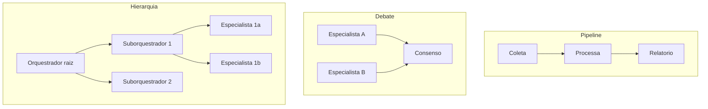

# Capítulo 4: Capítulo 12: Sistemas multiagentes na prática

## Introdução

O OrquestraIA funciona — um orquestrador, três especialistas, integração com o mundo. Este capítulo responde à pergunta que separa os sistemas multiagentes que impressionam dos que entregam: **quando — e como — multiplicar os agentes?** Você vai além do orquestrador simples e explora os padrões avançados de multiagentes: pipeline (agentes em sequência), debate (agentes que criticam), hierarquia (suborquestradores) e colaboração especializada — com os custos, os riscos e os critérios de decisão de cada um [1][20].

A pesquisa acadêmica e o mercado convergem em uma lição dura: **mais agentes não é mais inteligência — é mais coordenação, mais custo e mais pontos de falha**. Os levantamentos de sistemas multiagentes baseados em LLM documentam os padrões de coordenação (orquestração, debate, pipeline), os protocolos de comunicação


e os desafios abertos — e os casos de sucesso são, na maioria, sistemas com poucos agentes e papéis bem definidos, não "sociedades" de dezenas de agentes [1][12]. O custo é o tema transversal: cada agente multiplica chamadas ao modelo, e o retorno marginal da colaboração diminui rapidamente.

Ao final deste capítulo, você será capaz de decidir se o OrquestraIA precisa de mais agentes — e como estruturá-los: o pipeline de análise (coleta → processamento → relatório), o debate de revisão (dois pontos de vista sobre a mesma decisão) e a hierarquia com suborquestradores para domínios que crescem. Você implementará cada padrão e aprenderá a medir o custo por missão — a métrica que decide se a colaboração vale o preço [4][16].

## Explica

### O Espectro da Colaboração

Os sistemas multiagentes colaboram em um espectro de acoplamento [1][12]:

**Pipeline (sequência)**: os agentes executam em cadeia — a saída de um é a entrada do outro. Cada agente transforma o resultado do anterior. Forças: fluxo claro, cada estágio testável isoladamente. Fraquezas: a falha de um estágio interrompe a cadeia; a latência soma. Uso: fluxos de dados e processamento conhecidos.

**Orquestração (hub-and-spoke)**: o orquestrador coordena especialistas em paralelo ou sequência — o padrão do Capítulo 10. Forças: controle central, roteamento, consolidação. Fraquezas: o orquestrador é o gargalo. Uso: a maioria dos sistemas de produção.

**Debate (multi-perspectiva)**: dois ou mais agentes analisam a mesma questão de perspectivas diferentes e criticam as respostas uns dos outros. Forças: qualidade de decisão, detecção de erros, robustez. Fraquezas: custo multiplicado, latência imprevisível. Uso: decisões de alto impacto onde a revisão crítica compensa [13].

**Hierarquia (suborquestradores)**: orquestradores delegam a suborquestradores, que coordenam especialistas — a escalada natural quando um domínio cresce. Forças: escala, isolamento de falhas por domínio. Fraquezas: profundidade de contexto e custo de orquestração. Uso: sistemas grandes com domínios internos complexos [1][20].

### O Custo da Colaboração

A decisão multiagente é, no fundo, uma decisão de **custo-benefício de coordenação**. Cada agente adiciona: custo de tokens (chamadas do agente + comunicação), latência (tempo de execução em cadeia), complexidade (mais pontos de falha, mais superfícies de erro) e contexto (o histórico da colaboração ocupa janela). O benefício aparece quando a tarefa exige **capacidades heterogêneas** (um agente de dados não é um agente de atendimento), **verificação independente** (o debate pega erros que um agente sozinho deixaria passar) ou **especialização** (cada especialista fica melhor no seu domínio) [1][12][3].

A regra de ouro permanece: **adicione um agente apenas quando o benefício medido supera o custo medido** — e a medição é o tema do Capítulo 13. O multiagente por estética — "meu sistema tem 10 agentes" — é o erro mais caro do mercado [3].

### O Padrão do OrquestraIA

O OrquestraIA usa a orquestração como base (Capítulo 10) e adiciona os padrões avançados seletivamente: **pipeline** no domínio de análise (coleta → processamento → relatório — cada estágio um agente), **debate** nas decisões de alto impacto (reembolso acima do limite — dois especialistas avaliam), e **hierarquia** quando um domínio crescer a ponto de ter subespecialidades [1][20].

## Ilustra

### A Fábrica, o Comitê e a Rede de Filiais

Três analogias para três padrões. O **pipeline** é a linha de montagem da fábrica: cada estação (agente) transforma a peça e a passa adiante — pintura, montagem, inspeção. Eficiente, claro, e parado se uma estação quebra. O **debate** é o comitê de revisão do conselho: dois relatores analisam a mesma proposta de ângulos


diferentes, apresentam os riscos e os méritos, e a decisão sai mais sólida — ao custo do tempo e do esforço de ambos [13]. A **hierarquia** é a rede de filiais: a sede (orquestrador raiz) coordena as regionais (suborquestradores), que coordenam as lojas (especialistas) — escala sem que a sede micro-gerencie cada loja [1].



### A Analogia da Equipe de Resposta a Incidentes

Uma segunda lente: a equipe de resposta a incidentes de uma operação crítica. O **orquestrador** é o coordenador de plantão: recebe o alerta, classifica a gravidade e aciona os especialistas — rede, banco, infraestrutura. O **pipeline** é o processo de investigação: coleta de logs → análise → hipóteses → ação corretiva, cada estágio dependendo do anterior. O **debate** é a reunião de consenso antes de


uma ação irreversível: o especialista de rede e o de banco apresentam leituras opostas da mesma evidência — e a ação final sai da síntese, não do primeiro palpite [13]. A equipe que funciona não tem "mais gente": tem papéis certos, coordenador claro e reuniões apenas onde a decisão exige. O multiagente é exatamente isso: papéis certos, coordenação clara e colaboração apenas onde compensa [1].

## Técnica

### Padrão Pipeline: O Fluxo de Análise do OrquestraIA

O pipeline de análise — cada estágio um agente especializado com saída estruturada:

```python
# pipeline_analise.py — o padrao pipeline aplicado a analise de dados
from dataclasses import dataclass, field

@dataclass
class EstagioPipeline:
    """Um estagio do pipeline: transforma a saida do estagio anterior."""
    nome: str
    funcao: callable

class PipelineAnalise:
    """Pipeline de analise: coleta -> processa -> gera relatorio."""
    def __init__(self, estagios: list):
        self.estagios = estagios

def executar(self, entrada: dict) -> dict:
        """Executa os estagios em sequencia, encadeando a saida."""
        dado = entrada
        trilha = []
        for estagio in self.estagios:
            dado = estagio.funcao(dado)  # a saida vira a entrada do proximo
            trilha.append({"estagio": estagio.nome, "saida": str(dado)[:80]})
        return {"resultado": dado, "trilha": trilha}

# Os tres estagios do dominio de analise:
def estagio_coleta(entrada: dict) -> dict:
    """Estagio 1: coleta as fontes de dados da missao."""
    return {"fontes": ["vendas_2026", "suporte_2026"], "filtro": entrada.get("filtro")}

def estagio_processamento(dados: dict) -> dict:
    """Estagio 2: processa e calcula metricas."""
    # simulacao: agregacao de vendas e tickets
    return {"vendas_total": 482000, "tickets_abertos": 127, "fonte": dados["fontes"]}

def estagio_relatorio(metricas: dict) -> dict:
    """Estagio 3: gera o relatorio final em linguagem natural."""
    return {"relatorio": (
        f"As vendas somam R$ {metricas['vendas_total']:,.0f} com "
        f"{metricas['tickets_abertos']} tickets abertos. "
        f"Fontes: {', '.join(metricas['fonte'])}.")}

pipeline = PipelineAnalise([
    EstagioPipeline("coleta", estagio_coleta),
    EstagioPipeline("processamento", estagio_processamento),
    EstagioPipeline("relatorio", estagio_relatorio),
])
resultado = pipeline.executar({"filtro": "2026"})
print(resultado["resultado"]["relatorio"])
```

A virtude do pipeline: cada estágio é **testável isoladamente** (a saída do estágio 1 alimenta o estágio 2 sem LLM no meio — baixo custo, alta previsibilidade) e a **trilha** registra cada transformação (o material da auditoria).

### Padrão Debate: A Revisão Crítica de Decisões de Alto Impacto

O debate para decisões onde o erro é caro — dois especialistas avaliam e a síntese decide:

```python
# debate.py — o padrao debate para decisoes de alto impacto
class DebateDecisao:
    """Dois especialistas avaliam a mesma decisao; a sintese decide."""
    def __init__(self, llm, avaliador_a, avaliador_b, criterio_aprovacao):
        self.llm = llm
        self.avaliadores = [avaliador_a, avaliador_b]
        self.criterio = criterio_aprovacao  # ex.: ambos devem aprovar

def executar(self, decisao_proposta: str, contexto: str) -> dict: """Executa o debate e decide pela sintese.""" pareceres = [] for nome, avaliador in self.avaliadores: parecer = avaliador.executar( f"Avalie criticamente a decisao abaixo. Identifique riscos, " f"pontos cegos e condicoes. Contexto: {contexto}\n" f"Decisao proposta: {decisao_proposta}") pareceres.append((nome, parecer)) # Sintese: o criterio decide


o desfecho aprovacoes = sum(1 for _, p in pareceres if "aprovo" in p.lower()) aprovado = aprovacoes >= self.criterio sintese = self.llm.chamar_simples( f"Sintetize os dois pareceres abaixo em uma recomendacao final " f"('aprovar', 'revisar' ou 'recusar') com justificativa:\n" f"Parecer 1: {pareceres[0][1]}\nParecer 2: {pareceres[1][1]}") return {"aprovado": aprovado, "pareceres": pareceres, "sintese": sintese}

# Uso (decisao de alto impacto — reembolso acima do limite):
# debate = DebateDecisao(llm, avaliador_financeiro, avaliador_atendimento, 2)
# resultado = debate.executar(
#     "aprovar reembolso de R$ 850 para o pedido P-7841 por extravio",
#     "politica: reembolsos acima de R$ 100 exigem aprovacao humana")
```

O debate custa caro (duas análises + síntese) — por isso é reservado às decisões de alto impacto, e a saída (pareceres + síntese + desfecho) alimenta o rastreio e a supervisão humana do Capítulo 15.

### Padrão Hierarquia: Suborquestradores para Domínios em Crescimento

Quando o domínio de vendas cresce — prospecção, qualificação, negociação, pós-venda — um único especialista não basta. A hierarquia organiza:

```python
# hierarquia.py — suborquestrador para o dominio de vendas
class SubOrquestrador:
    """Orquestra um dominio com subespecialidades (padrao hierarquico)."""
    def __init__(self, dominio: str, subespecialistas: dict):
        self.dominio = dominio
        self.subespecialistas = subespecialistas

def rotear(self, missao: str) -> str:
        if "qualifica" in missao.lower() or "lead" in missao.lower():
            return "qualificacao"
        if "negocia" in missao.lower() or "proposta" in missao.lower():
            return "negociacao"
        return "prospeccao"

def executar(self, missao: str) -> str:
        sub = self.rotear(missao)
        if sub not in self.subespecialistas:
            return f"[{self.dominio}] sem subespecialista para '{sub}'"
        return self.subespecialistas[sub].executar(missao)

# O orquestrador raiz passa a ter 'vendas' como suborquestrador:
# vendas = SubOrquestrador("vendas", {
#     "prospeccao": agente_prospeccao,
#     "qualificacao": agente_qualificacao,
#     "negociacao": agente_negociacao,
# })
# orquestra.registrar("vendas", vendas, "ciclo completo de vendas")
```

A hierarquia isola o domínio: o orquestrador raiz não conhece os subespecialistas de vendas — só o suborquestrador. A falha num subespecialista não vaza para os outros domínios [1][20].

### Checklist Multiagente

- [ ] A colaboração adiciona um agente apenas com **benefício medido** sobre o custo?
- [ ] O padrão escolhido (pipeline, debate, hierarquia) combina com a natureza da tarefa?
- [ ] Cada agente tem **papel e escopo** claros (sem sobreposição)?
- [ ] A **trilha de colaboração** registra cada transição entre agentes?
- [ ] O **custo por missão** (tokens, latência) é medido e revisado?

## Aplica

### Multiagente no Chão de Fábrica

Os sistemas multiagente de produção bem-sucedidos são, na maioria, **poucos agentes com papéis bem definidos** — não sociedades grandes [1][12]. Os casos que funcionam têm uma característica comum: a colaboração é desenhada pela natureza da tarefa, não pela estética. O pipeline domina o processamento de dados (cada estágio transforma e valida); o debate aparece nas decisões de alto impacto (aprovação de reembolso, autorização de ação); a hierarquia organiza domínios que crescem em subespecialidades [1][20][13].

O custo é a métrica que separa os sistemas que escalam dos que quebram: cada agente adicionado multiplica o custo por missão, e a colaboração que não paga o próprio preço em qualidade vira dívida operacional. Os benchmarks de avaliação de agentes mostram que o desempenho por agente varia enormemente — medir o custo-benefício no seu domínio é a única forma de decidir [17].

### Armadilhas Comuns

1. **Multiagente por estética**: "meu sistema tem 10 agentes" como objetivo — cada agente deve justificar o custo com benefício medido. 2. **Sobreposição de papéis**: dois agentes com o mesmo escopo confundem o roteamento e dobram o custo — escopo único por agente. 3. **Pipeline sem


trilha**: a cadeia falha sem saber em qual estágio — cada transição registrada. 4. **Debate para tudo**: o debate custa caro — reserve para decisões onde o erro é mais caro que a revisão. 5. **Hierarquia prematura**: suborquestradores antes de o domínio crescer — complexidade sem necessidade.

### Conexão com o OrquestraIA

O OrquestraIA adota os padrões deste capítulo seletivamente: pipeline no domínio de análise, debate nas decisões de alto impacto (com supervisão humana — Capítulo 15) e hierarquia quando um domínio crescer. Cada padrão adicionado entra com medição de custo — o elo com os evals do Capítulo 13.

### Aprofundamento: A Matemática do Custo-Benefício da Colaboração

A decisão de adicionar um agente — ou um padrão de colaboração — pode ser colocada em números, e a formulação ajuda a tirar a decisão do achismo. O custo incremental de um agente numa missão é: o custo das suas chamadas de LLM (entrada + saída), o custo da comunicação (o contexto que o agente recebe do anterior e devolve), o custo da coordenação (o orquestrador que roteia


e consolida) e o custo de falha esperado (a probabilidade de o agente errar vezes o custo do erro). O benefício incremental é: a melhoria de qualidade medida (o quanto a taxa de sucesso sobe com o agente) vezes o valor da qualidade. A regra de decisão: **adicione o agente se benefício esperado > custo esperado** — e a medição é empírica, no seu domínio, com o golden set [4][8].

A formulação revela por que o multiagente prematuro é tão comum: o custo é fácil de ignorar (parece "só mais um agente") e o benefício é fácil de superestimar (na demo, o debate parece brilhante). A medição — custo por missão real, taxa de sucesso no golden set — é o antídoto: os números não têm entusiasmo [8].

### O Protocolo de Comunicação entre Agentes

A colaboração entre agentes precisa de um protocolo de comunicação — o que os agentes dizem uns aos outros e em que formato. A prática recomendada para sistemas de produção: **mensagens estruturadas em vez de linguagem natural livre** — o agente que entrega ao próximo entrega um objeto com campos (tipo, dados, confiança, fonte), não um parágrafo. A mensagem estruturada é mais barata de processar, mais fácil de


validar e mais fácil de registrar na trilha — e o protocolo é versionado, permitindo que agentes de versões diferentes conversem sem quebrar (o mesmo princípio dos contratos do Capítulo 7). A exceção é o debate (Capítulo 12): o debate exige linguagem natural porque o valor está na argumentação — mas mesmo ali, a conclusão de cada parecer é estruturada (aprovo/reviso/recuso) para que a síntese seja decidível [1][20].

## Conclusão

Três pontos para levar: **primeiro**, os padrões multiagente formam um espectro — pipeline, orquestração, debate e hierarquia — cada um com forças, fraquezas e custos próprios. **Segundo**, mais agentes não é mais inteligência: é mais coordenação, custo e pontos de falha — adicione um agente apenas com benefício medido sobre o custo. **Terceiro**, os sistemas que funcionam têm papéis certos e coordenação clara — pipeline onde o fluxo é conhecido, debate onde a decisão é cara, hierarquia onde o domínio cresce.

O próximo capítulo abre a Parte IV — Governança e Qualidade — com a infraestrutura de **avaliação**: os evals e o LLM-as-a-judge, a medida que decide se o sistema é bom o bastante para produção e se cada mudança melhora ou degrada o comportamento.

**Desafio opcional**: implemente o pipeline de análise com um estágio adicional (ex.: previsão com base no histórico) e meça o custo por missão antes e depois. Depois, aplique o debate a uma decisão de reembolso do seu domínio e compare a qualidade da decisão com e sem o debate — registre onde o custo extra se pagou.

## Para se aprofundar

Este capítulo faz parte do e-book **Construindo o OrquestraIA na Prática**, extraído da obra completa *IA Agêntica Desbloqueada: Um guia para projetar, construir e implantar sistemas de IA autônomos*. No livro-mãe, você encontra o mesmo conteúdo com aprofundamento técnico adicional: diagramas Mermaid, blocos de código executáveis, referências ABNT verificáveis e a narrativa completa do projeto OrquestraIA — do primeiro agente ao monitoramento em produção.

Se este e-book despertou sua atenção para a construção de sistemas de IA autônomos, o próximo passo natural é levar o aprendizado para o seu próprio contexto: escolha um problema pequeno e bem delimitado, desenhe o agent loop com uma única ferramenta e uma única política de autonomia, e meça o resultado antes de escalar. A autonomia é uma concessão que se conquista com evidência.

**Quer continuar?** Explore os demais e-books da série: *Construindo o OrquestraIA na Prática* é apenas uma parte do caminho — os outros volumes cobrem o desenho do sistema, a construção prática, a governança e a operação contínua.
