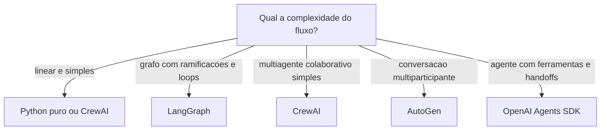
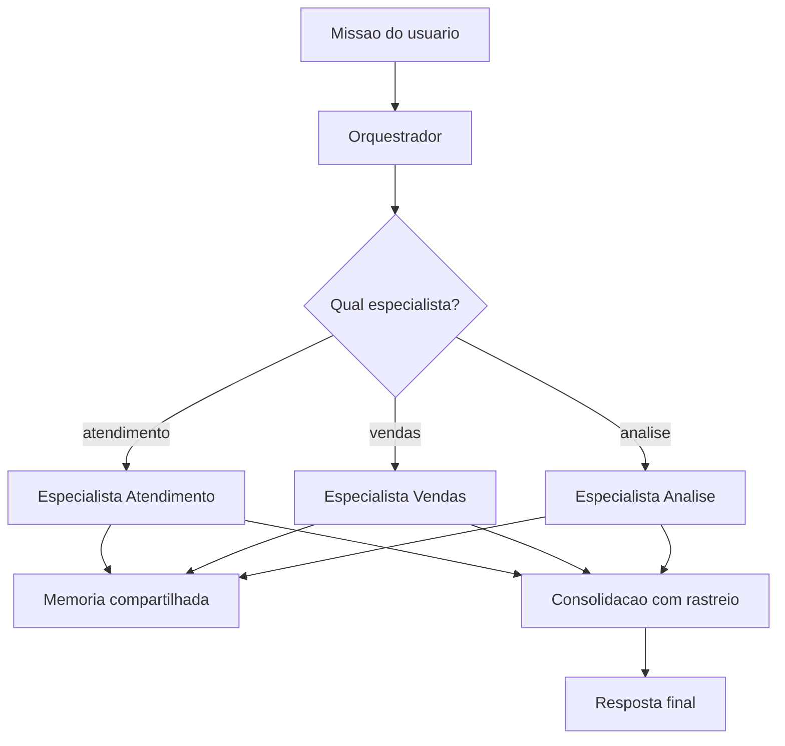
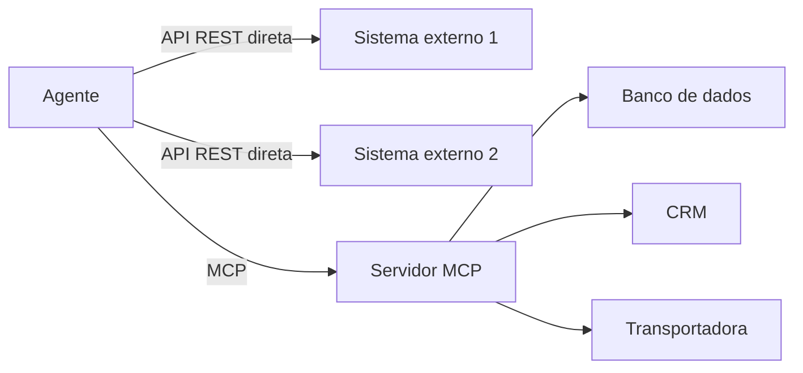
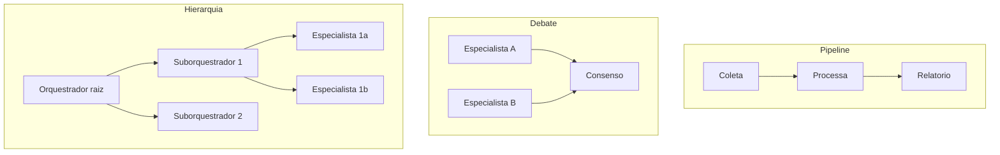

# Construindo o OrquestraIA na Prática

# Capítulo 1: Capítulo 9: Escolhendo o framework: LangGraph, CrewAI e além

## Introdução

Você construiu o loop, o contexto, a memória, as ferramentas e o planejador em Python puro — e isso não foi em vão: agora você entende o que cada framework faz por baixo do capô. Este capítulo responde à pergunta de engenharia que todo projeto encontra: **devo usar um framework


de agentes — LangGraph, CrewAI, AutoGen, OpenAI Agents SDK — ou continuar com código puro?** A resposta não é "sempre use o framework": é uma decisão de arquitetura com critérios objetivos, e escolher errado custa caro — ou em complexidade desnecessária, ou em reescrever tudo no meio do projeto [16][29].

O ecossistema de frameworks amadureceu entre 2024 e 2026: LangGraph consolidou-se como a plataforma de grafos de estado para agentes em produção; CrewAI popularizou o multiagente baseado em "equipes" (crews); AutoGen da Microsoft trouxe o agente conversacional multiparticipante; e o OpenAI Agents SDK simplificou o agente com ferramentas e handoffs [16][29]. Cada um tem filosofia, modelo mental e trade-offs próprios — e nenhum elimina a disciplina que você aprendeu nos capítulos anteriores: contexto, memória, ferramentas e observabilidade continuam sendo suas responsabilidades.

Ao final deste capítulo, você será capaz de decidir — com critérios, não com hype — se o OrquestraIA usa framework ou código puro, e qual framework escolher entre os principais. Você implementará o mesmo agente nas duas formas — código puro e LangGraph — comparando na prática o que o framework adiciona e o que ele esconde, e verá o comparativo de produção que orienta a decisão do projeto.

## Explica

### O Que um Framework de Agentes Resolve

Um framework de agentes resolve quatro problemas recorrentes: **estado do loop** (persistência, checkpointing e retomada do fluxo entre passos), **orquestração declarativa** (descrever o fluxo — nós, arestas, condicionais — em vez de programá-lo imperativamente), **primitivas de agente** (handoffs, subagentes, ferramentas, memória com configuração declarativa) e **observabilidade embutida** (traces, run IDs, logs estruturados). O custo é igualmente claro: **abstração** (o framework decide coisas que você precisará entender quando der errado), **dependência** (a biblioteca evolui, quebra, muda de API) e **custo de aprendizado** (o modelo mental do framework soma-se ao domínio) [16][29].

### O Panorama de 2026

**LangGraph**: a plataforma de grafos de estado da LangChain. O agente é um grafo de nós (LLM, ferramentas, decisões) com um estado tipado que atravessa os nós. Forças: controle fino do fluxo, checkpointing nativo, integração com o ecossistema LangChain, modo de produção robusto (LangGraph Platform). Fraquezas: curva de aprendizado íngreme e mais boilerplate [16].

**CrewAI**: o multiagente como equipes — roles, goals e backstories definem agentes que colaboram em "crews". Forças: simplicidade conceitual para multiagente, onboarding rápido, foco em colaboração (hierarchical e sequential processes). Fraquezas: controle fino menor, abstração que esconde o fluxo [29].

**Microsoft AutoGen**: agentes conversacionais que dialogam — o fluxo emerge da conversa entre participantes. Forças: flexibilidade para padrões de debate e colaboração (pesquisa acadêmica), multiagente nativo. Fraquezas: fluxo menos determinístico, mais difícil de prever [23].

**OpenAI Agents SDK**: agente com ferramentas, guardrails e handoffs, em estilo leve e idiomático. Forças: simplicidade, modelo mental direto, excelente para agentes com ferramentas e subagentes. Fraquezas: ecossistema mais jovem, menos foco em grafos complexos [16].

### O Critério de Decisão

A decisão framework vs. código puro — e qual framework — se resume a três perguntas: **complexidade do fluxo** (grafos com ramificações, loops e condicionais pedem LangGraph; fluxos lineares pedem código puro ou CrewAI), **exigências de produção** (checkpointing, retomada, filas, traces exigem a plataforma do framework) e **tamanho da equipe e da curva** (uma equipe


pequena e experiente em Python puro pode entregar mais rápido sem framework do que aprendendo um; uma equipe que já vive no ecossistema ganha com ele) [3][16]. A regra de ouro continua a mesma: **a ferramenta mais simples que resolve o problema** — e código puro é uma opção legítima, não um atalho de amador.

## Ilustra

### O Restaurante: Cozinha Livre ou Kit de Cozinha?

Escolher um framework de agentes é escolher entre cozinhar em cozinha livre ou comprar um kit de cozinha. A cozinha livre (código puro) dá controle total: você decide cada utensílio, cada técnica, cada detalhe — e paga com trabalho: montar a infraestrutura você mesmo. O kit de cozinha (framework) entrega utensílios prontos e testados: você monta o prato mais rápido, seguindo o manual — e paga com flexibilidade: o que o kit não prevê, você contorna, não controla.

A analogia continua nos tipos de kit. O LangGraph é o kit de cozinha industrial: potente, configurável, exige treinamento — para restaurantes grandes (fluxos complexos em produção). O CrewAI é o kit de jantar em equipe: simples, orientado a papéis, cada um faz seu prato — para equipes


de cozinheiros colaborando. O código puro é a cozinha do chef experiente: sem kit, mas com domínio absoluto. O chef que compra o kit industrial para servir um lanche paga caro pelo que não usa; o chef que cozinha tudo à mão para um banquete corporativo entrega tarde [16][29].



### A Analogia do Transporte

Uma segunda lente: o transporte de carga. O caminhão (código puro) entrega qualquer carga, com a rota que você decide — flexível, mas você dirige. O trem (LangGraph) entrega muito, em trilhos definidos — eficiente em escala, mas só onde há trilho. O entregador de bicicleta (CrewAI)


é ágil para cargas pequenas e próximas — perfeito para fluxos simples. O erro clássico: alugar um trem para entregar uma pizza. O framework certo é o veículo certo para a carga — e o tamanho da carga cresce com a complexidade e as exigências de produção [16].

## Técnica

### O Mesmo Agente em Duas Formas

Vamos comparar na prática: o agente de consulta de pedidos em Python puro (dos capítulos anteriores) e em LangGraph — para que você veja exatamente o que o framework adiciona e o que esconde:

**Versão Python puro (a que você já conhece):**

```python
# agente_puro.py — o loop completo em código puro (recapitulacao)
def executar_agente(missao, llm, ferramentas, limite=5):
    observacao = missao
    trilha = []
    for _ in range(limite):
        decisao = llm.chamar_simples(
            f"Escolha uma ferramenta {list(ferramentas)} com argumentos, "
            f"ou FINAL:<resposta>. Estado: {observacao}")
        trilha.append(decisao)
        if decisao.startswith("FINAL:"):
            return decisao[6:].strip(), trilha
        nome, args = _parsear_decisao(decisao)  # ex.: consultar_pedido(pedido_id=P-7841)
        observacao = ferramentas[nome](**args)
        trilha.append(observacao)
    return "limite atingido", trilha
```

**Versão LangGraph (o grafo de estado):**

```python
# agente_langgraph.py — o mesmo agente como grafo de estado
# Instalacao: pip install langgraph langchain-openai
from typing import TypedDict, Literal
from langgraph.graph import StateGraph, END

class Estado(TypedDict):
    missao: str
    trilha: list
    resposta: str

def no_llm(estado: Estado) -> Estado:
    """No que chama o modelo e decide o proximo no."""
    decisao = chamar_llm_com_ferramentas(estado["missao"])
    estado["trilha"] = estado.get("trilha", []) + [decisao]
    if decisao["tipo"] == "final":
        estado["resposta"] = decisao["texto"]
    else:
        estado["ferramenta_escolhida"] = decisao
    return estado

def no_ferramenta(estado: Estado) -> Estado:
    """No que executa a ferramenta e devolve a observacao."""
    obs = executar(estado["ferramenta_escolhida"])
    estado["trilha"].append(obs)
    estado["missao"] = f"Observacao: {obs}"
    return estado

def rotear(estado: Estado) -> Literal["ferramenta", "fim"]:
    return "fim" if estado.get("resposta") else "ferramenta"

# Monta o grafo: LLM -> (ferramenta | fim)
grafo = StateGraph(Estado)
grafo.add_node("llm", no_llm)
grafo.add_node("ferramenta", no_ferramenta)
grafo.add_edge("llm", "ferramenta")
grafo.add_conditional_edges("llm", rotear, {"ferramenta": "ferramenta", "fim": END})
grafo.set_entry_point("llm")
app = grafo.compile()
resultado = app.invoke({"missao": "consultar o pedido P-7841"})
print(resultado["resposta"])
```

A comparação é instrutiva: o LangGraph **declara o fluxo como grafo** (nós, arestas, roteamento condicional) em vez de programá-lo como laço — o que dá visibilidade e checkpointing; o código puro é **direto e sem dependências** — o que dá controle total e simplicidade. Nenhuma das versões é "melhor" — são decisões de arquitetura [16].

### O Comparativo de Produção

A decisão do OrquestraIA, após a comparação, foi **código puro para os especialistas + orquestrador próprio** (Capítulo 10), por três razões: o fluxo do sistema é conhecido e controlado (rotas + orquestração simples — não exige grafo genérico), a equipe do projeto domina o código puro (curva zero) e a observabilidade é construída sob medida (Capítulo 16). Essa é uma decisão contextual: um projeto com fluxo complexo e imprevisível se beneficiaria do LangGraph, e um time já imerso no ecossistema CrewAI entregaria mais rápido com ele [16][29].

### Checklist de Escolha de Framework

- [ ] A complexidade do fluxo **justifica** o framework (grafos, loops, condicionais)?
- [ ] As exigências de produção (checkpoint, retomada, filas) exigem a plataforma?
- [ ] A curva de aprendizado e o tamanho da equipe foram pesados?
- [ ] O código puro foi considerado como opção legítima — não como atalho?
- [ ] A decisão está documentada com os critérios (ADR — registro de decisão)?

## Aplica

### Framework no Chão de Fábrica

A escolha de framework é uma decisão de arquitetura com impacto de longo prazo — e a pesquisa do mercado mostra um espectro real de adoção: LangGraph domina os casos de produção com fluxos complexos e observabilidade exigente; CrewAI ganha os projetos multiagente de onboarding rápido; o código puro permanece forte onde a equipe já tem a infraestrutura própria [16][29]. Os frameworks não substituem a disciplina: os sistemas que falham em produção falham por contexto, memória e observabilidade — com ou sem framework [8].

A decisão de framework também é uma decisão de **custo de mudança**: migrar de framework no meio do projeto é caro — o modelo mental do time, as integrações e os checkpoints se perdem. Por isso a recomendação prática: **prototipe o mesmo agente nas duas formas (puro e framework) antes de decidir** — como você fez neste capítulo — e documente a decisão num ADR (registro de decisão de arquitetura), com os critérios e o custo estimado de cada opção [3][16].

### Armadilhas Comuns

1. **Framework por hype**: escolher LangGraph porque "todo mundo usa" sem comparar com o código puro — o fluxo simples paga complexidade desnecessária. 2. **Abstração sem entendimento**: usar o framework sem entender o loop por baixo — quando o trace dá errado, não há como depurar (este livro


construiu o entendimento antes do framework, de propósito). 3. **Framework como substituto de disciplina**: o LangGraph não projeta seu contexto nem sua memória — a engenharia dos capítulos 5-8 continua sua responsabilidade. 4. **Migração tardia**: decidir o framework no meio do projeto, quando o custo de mudança já explodiu.

### Conexão com o OrquestraIA

O OrquestraIA fica em código puro pelos critérios deste capítulo — mas a decisão fica documentada e revisável: se o fluxo do sistema crescer para grafos complexos com checkpointing exigente, a migração para LangGraph é o caminho planejado, não uma reação de emergência.

### Aprofundamento: A Avaliação Comparativa de Frameworks em Produção

As comparações de frameworks do mercado convergem em dimensões que a decisão deve considerar além das features de marketing: **estabilidade da API** (a frequência de quebras — um framework jovem muda de API rápido, e cada quebra é custo de migração), **ecossistema** (integrações, modelos, observabilidade — a rede que o framework traz), **modo de produção** (checkpointing, filas, retomada — o que o Capítulo


17 exige, já embutido ou para construir), **licenciamento e custo** (plataformas gerenciadas cobram por execução — o custo por missão do Capítulo 16) e **comunidade e talento** (a facilidade de contratar e manter quem conhece o framework). A avaliação é pontuada com pesos do contexto do projeto — a dimensão que pesa mais para você decide a escolha, não a média cega [16][29].

A comparação mais importante, porém, é a que este capítulo demonstrou: **implementar o mesmo agente nas duas formas** (puro e framework) com o mesmo conjunto de missões de teste — e medir linhas de código, tempo de implementação e facilidade de depuração. A demo do fornecedor mostra o melhor caminho do framework; o seu protótipo mostra o caminho do seu time no seu domínio — e é o segundo que decide [3][16].

### O Modelo Mental por Trás de Cada Framework

Cada framework carrega um modelo mental — e escolher é adotar o modelo: **LangGraph** pensa em grafos (nós, arestas, estado tipado — o fluxo é o artefato), **CrewAI** pensa em equipes (roles, goals, processos — a colaboração é o artefato), **AutoGen** pensa em conversas (participantes que dialogam — o discurso é o artefato) e o **OpenAI Agents SDK** pensa em agentes e ferramentas (handoffs e guardrails — a delegação é o artefato) [16][29]. O modelo mental do framework vira o modelo mental do time: a


equipe que pensa em grafos desenha fluxos como grafos, e a equipe que pensa em equipes desenha colaboração. A escolha do framework é, no fundo, a escolha do modelo mental que a sua equipe adota — e a consistência entre o modelo mental e a natureza do problema é o que determina o sucesso de longo prazo. O código puro não tem modelo mental próprio — e é exatamente isso que o torna a opção neutra quando o problema não casa com nenhum dos modelos [3].

### Aprofundamento: O Híbrido — Framework com Núcleo Próprio

A dicotomia "framework ou código puro" esconde uma terceira opção que muitos sistemas de produção adotam: o **híbrido** — o núcleo crítico em código puro (o loop, a orquestração, os contratos — onde o controle e a observabilidade importam) e o framework nas bordas (conectores, integrações, primitivas prontas — onde o ecossistema agrega). O híbrido aproveita o melhor dos dois mundos: a disciplina do núcleo (testável, auditável, sob seu controle) e a velocidade das bordas


(o framework entrega integrações prontas). O custo é a **fronteira** — a interface entre o núcleo puro e as bordas do framework precisa de contrato estável, ou o acoplamento vaza (o framework dita regras para dentro do núcleo). O OrquestraIA usaria o híbrido assim: o loop e o orquestrador em código puro (Capítulos 2 e 10), e conectores MCP e integrações de modelo via SDKs — a escolha que o Capítulo 17 aprofunda no gateway [16][29].

### A Decisão de Framework como Decisão de Time

A escolha de framework é, no fundo, uma decisão de **time**: o framework que a equipe entende profundamente vale mais do que o tecnicamente superior que ninguém domina. A prática recomendada: a decisão considera a **composição do time** (senioridade, familiaridade com o ecossistema, disposição para a curva), a **contratabilidade** (a facilidade de trazer gente nova que conheça o stack — o


LangGraph é mais contratável que um framework próprio) e a **continuidade** (o que acontece quando o autor principal sai? O framework tem comunidade e documentação; o código puro depende da documentação interna — o ADR do Capítulo 3). A decisão documentada com esses critérios é uma decisão que sobrevive às mudanças de time — e é o que o ADR registra [16][3].

## Conclusão

Três pontos para levar: **primeiro**, um framework de agentes resolve estado, orquestração, primitivas e observabilidade — ao custo de abstração, dependência e curva de aprendizado. **Segundo**, o panorama de 2026 tem perfis claros: LangGraph para grafos de produção, CrewAI para equipes multiagente simples, AutoGen para conversação multiparticipante,


OpenAI Agents SDK para agentes com ferramentas — e código puro como opção legítima. **Terceiro**, a decisão se resume a três critérios — complexidade do fluxo, exigências de produção e equipe — e a melhor evidência é prototipar o mesmo agente nas duas formas antes de escolher.

O próximo capítulo constrói o coração do projeto: o **orquestrador do OrquestraIA** — a central que planeja, roteia, delega e consolida, unindo os especialistas de atendimento, vendas e análise em um sistema coeso.

**Desafio opcional**: implemente o agente de consulta de pedidos nas duas formas (puro e LangGraph) com o mesmo conjunto de 5 missões de teste. Compare: linhas de código, tempo de implementação e facilidade de depurar um erro proposital que você introduzir. A experiência prática vale mais que qualquer benchmark.

## Para se aprofundar

Este capítulo faz parte do e-book **Construindo o OrquestraIA na Prática**, extraído da obra completa *IA Agêntica Desbloqueada: Um guia para projetar, construir e implantar sistemas de IA autônomos*. No livro-mãe, você encontra o mesmo conteúdo com aprofundamento técnico adicional: diagramas Mermaid, blocos de código executáveis, referências ABNT verificáveis e a narrativa completa do projeto OrquestraIA — do primeiro agente ao monitoramento em produção.

Se este e-book despertou sua atenção para a construção de sistemas de IA autônomos, o próximo passo natural é levar o aprendizado para o seu próprio contexto: escolha um problema pequeno e bem delimitado, desenhe o agent loop com uma única ferramenta e uma única política de autonomia, e meça o resultado antes de escalar. A autonomia é uma concessão que se conquista com evidência.

**Quer continuar?** Explore os demais e-books da série: *Construindo o OrquestraIA na Prática* é apenas uma parte do caminho — os outros volumes cobrem o desenho do sistema, a construção prática, a governança e a operação contínua.

# Capítulo 2: Capítulo 10: O núcleo do OrquestraIA: o orquestrador

## Introdução

Chegou o capítulo que une tudo. Os capítulos anteriores construíram as peças — o loop, o contexto, a memória, as ferramentas, o planejador, a decisão de framework. Este capítulo monta o sistema: o **orquestrador do OrquestraIA**, a central que recebe as missões, planeja, roteia para os especialistas (atendimento, vendas, análise), consolida os resultados e devolve a resposta final. É o padrão orquestrador-empregados do Capítulo 3, agora em código completo de produção [1][20].

O orquestrador é onde a arquitetura multiagente ganha ou perde. Um bom orquestrador é transparente (você sabe o que cada especialista fez), resiliente (um especialista que falha não derruba a missão) e barato (não gasta tokens com roteamentos desnecessários). Um mau orquestrador é um gargalo opaco que multiplica erros: roteia mal, delega sem verificar e devolve respostas sem rastreio. A pesquisa sobre orquestração de sistemas multiagente documenta exatamente esses riscos — e os padrões que os mitigam: roteamento com fallback, delegação verificada e consolidação com auditoria [1][20].

Ao final deste capítulo, você terá o OrquestraIA funcional em sua primeira versão: o orquestrador com catálogo de especialistas, roteamento por LLM, delegação com tentativas, consolidação com relatório e a integração com memória, ferramentas e contexto dos capítulos anteriores. O sistema inteiro que você construiu peça a peça passa a funcionar como um todo — e o Capítulo 12 vai além, com os padrões multiagente avançados (debate, pipeline, hierarquia).

## Explica

### O Papel do Orquestrador

O orquestrador é o padrão central dos sistemas multiagente [1][20]: um componente central recebe a missão, decide o que fazer, delega partes a especialistas e consolida os resultados. O orquestrador não executa o trabalho do especialista — ele **coordena**: entende a missão, escolhe o caminho, supervisiona a execução e garante que o resultado responda à missão original. É o administrador do shopping do Capítulo 3: não vende sapatos — decide para qual loja cada cliente vai e garante que a compra seja concluída [1].

As quatro responsabilidades do orquestrador: **interpretação** (entender a missão e extrair intenção, entidades e requisitos), **planejamento** (decompor a missão em tarefas — o Capítulo 8), **delegação** (rotear cada tarefa ao especialista certo, com tentativas e fallback) e **consolidação** (reunir os resultados, resolver conflitos e compor a resposta final com rastreio) [20].

### O Roteamento: A Decisão Mais Visível

O roteamento é a decisão que o usuário vê: qual especialista atende cada missão. Duas abordagens: **roteamento por regras** (heurísticas determinísticas — palavras-chave, padrões, classificadores — barato, previsível, mas rígido) e **roteamento por LLM** (o modelo decide o destino — flexível, entende intenção ambígua, mas custa tokens


e pode errar). A prática recomendada: **regras primeiro, LLM como refinamento** — o roteador por regras captura os casos claros sem custo, e o LLM decide os ambíguos. O erro de roteamento é o mais caro do sistema: delega ao especialista errado multiplica o erro pela cadeia [1][3].

### Delegação com Verificação

Delegar não é jogar a missão por cima do muro: é **delegar com contrato**. O contrato de delegação tem três partes: **escopo** (o que o especialista deve resolver e o que não deve), **entrada** (o contexto mínimo — missão, entidades, restrições) e **retorno** (o formato do resultado — resposta, dados, rastreio). O orquestrador verifica o retorno contra a missão: o resultado responde à pergunta original? Se não, re-delega ou escala. A delegação sem verificação é a fonte clássica de respostas que "não respondem nada" [1][20].

### Consolidação com Rastreio

A consolidação é o que transforma resultados parciais em resposta final: reúne as saídas dos especialistas, resolve contradições (qual fonte prevalece? — pela política, Capítulo 14) e compõe a resposta com o **rastreio** — quem fez o quê, em que ordem, com quais observações. O rastreio é o material da auditoria (Capítulo 16) e da confiança (Capítulo 15): sem ele, o sistema multiagente é uma caixa-preta com muitos bolsos [21][20].

## Ilustra

### O Centro de Distribuição de uma Operação de Logística

O orquestrador é o centro de distribuição de uma operação logística. Os especialistas são os galpões: um recebe (atendimento), outro expede (vendas), outro analisa rotas (análise). O centro recebe o pedido (missão), decide qual galpão atende (roteamento), envia a ordem de serviço com especificações (delegação com contrato), confere o retorno (verificação) e consolida o resultado para o cliente (consolidação com rastreio).

O centro de distribuição ruim é o gargalo que ninguém entende: envia a ordem errada para o galpão errado, não confere se o retorno respondeu o pedido e devolve respostas sem registro de quem fez o quê. O centro bom é quase invisível: as ordens fluem, os erros são detectados na origem e cada entrega tem rastro completo [1][20].



### A Analogia do Maestro

Uma segunda lente: o maestro de orquestra. O maestro não toca os instrumentos — os músicos tocam (os especialistas). Ele interpreta a partitura (a missão), decide a entrada de cada seção (o roteamento), conduz o andamento (a supervisão) e garante que o conjunto soe como uma obra (a consolidação). O maestro que tentasse tocar todos os


instrumentos seria um músico ruim e um maestro pior — o orquestrador que faz o trabalho dos especialistas é o mesmo erro. E a orquestra sem maestro toca junto no papel, mas desafinada na prática: cada músico no seu tempo, sem unidade. O orquestrador é o que transforma um conjunto de agentes em um **sistema** [1].

## Técnica

### O Orquestrador Completo do OrquestraIA

Vamos montar o núcleo do sistema — o orquestrador que reúne todos os módulos dos capítulos anteriores:

```python
# orquestrador.py — o núcleo do OrquestraIA (v1)
from dataclasses import dataclass, field
import time

@dataclass
class ContratoDelegacao:
    """Contrato de delegacao: escopo, entrada e retorno esperado."""
    especialista: str
    escopo: str
    entrada: dict
    retorno_esperado: str = ""

@dataclass
class Orquestrador:
    """Central do OrquestraIA: planeja, roteia, delega e consolida."""
    nome: str = "orquestraia"
    especialistas: dict = field(default_factory=dict)
    limite_tentativas: int = 3
    rastreio: list = field(default_factory=list)

def registrar(self, nome: str, agente, escopo: str) -> None:
        """Registra um especialista com seu escopo declarado."""
        self.especialistas[nome] = {"agente": agente, "escopo": escopo}

def interpretar(self, missao: str) -> dict:
        """Interpretacao: extrai intencao e entidades da missao."""
        # No sistema real: LLM extrai intencao estruturada.
        # Heuristica didatica: detecta o dominio pela missao.
        if any(k in missao.lower() for k in ("pedido", "estoque", "cliente")):
            return {"dominio": "atendimento", "missao": missao}
        if any(k in missao.lower() for k in ("venda", "lead", "proposta")):
            return {"dominio": "vendas", "missao": missao}
        return {"dominio": "analise", "missao": missao}

def delegar(self, contrato: ContratoDelegacao) -> str:
        """Delegacao com tentativas e fallback."""
        especialista = self.especialistas[contrato.especialista]
        for tentativa in range(1, self.limite_tentativas + 1):
            try:
                resultado = especialista["agente"].executar(
                    contrato.entrada.get("missao", contrato.escopo))
                self.rastreio.append({
                    "tempo": time.strftime("%H:%M:%S"),
                    "especialista": contrato.especialista,
                    "tentativa": tentativa,
                    "resultado": resultado[:120],
                })
                return resultado
            except Exception as e:
                self.rastreio.append({
                    "tempo": time.strftime("%H:%M:%S"),
                    "especialista": contrato.especialista,
                    "tentativa": tentativa,
                    "erro": str(e)[:120],
                })
        return f"[{contrato.especialista}] falhou apos {self.limite_tentativas} tentativas"

def consolidar(self, missao: str, resultados: dict) -> str:
        """Consolidacao: compoe a resposta final com o rastreio."""
        linhas = [f"Resolvido para: {missao}"]
        for especialista, resultado in resultados.items():
            linhas.append(f"- {especialista}: {resultado}")
        linhas.append("Rastreio: " + "; ".join(
            f"{r['especialista']}->{r.get('resultado', r.get('erro', ''))[:40]}"
            for r in self.rastreio[-6:]))
        return "\n".join(linhas)

def executar(self, missao: str) -> str:
        """Fluxo completo: interpretar -> planejar -> delegar -> consolidar."""
        self.rastreio = []
        interpretacao = self.interpretar(missao)
        dominio = interpretacao["dominio"]
        if dominio not in self.especialistas:
            return f"Nenhum especialista cobre '{dominio}'"
        contrato = ContratoDelegacao(
            especialista=dominio, escopo=self.especialistas[dominio]["escopo"],
            entrada=interpretacao)
        resultado = self.delegar(contrato)
        return self.consolidar(missao, {dominio: resultado})

# Uso com os agentes dos capitulos anteriores:
# orquestra = Orquestrador()
# orquestra.registrar("atendimento", agente_atendimento,
#                     "resolver problemas de pedidos, estoque e clientes")
# orquestra.registrar("vendas", agente_vendas,
#                     "qualificar leads e preparar propostas de venda")
# orquestra.registrar("analise", agente_analise,
#                     "responder perguntas sobre dados e gerar relatorios")
# print(orquestra.executar("o cliente quer saber o status do pedido P-7841"))
```

Repare nas decisões de engenharia: **escopo declarado por especialista** (o orquestrador conhece o catálogo — nada de descoberta dinâmica no começo), **rastreio em cada tentativa** (sucesso e erro ficam registrados — o material da observabilidade do Capítulo 16), **delegação com tentativas e fallback** (um especialista que falha não derruba a missão) e **consolidação com rastreio** (a resposta final carrega quem fez o quê).

### O Roteador por LLM (Versão Avançada)

A heurística do `interpretar` resolve os casos claros. Para os ambíguos, o roteador por LLM — o refinamento que reduz o erro de roteamento sem explodir o custo:

```python
# roteador_llm.py — refinamento do roteamento com LLM
class RoteadorLLM:
    """Roteamento: regras primeiro, LLM como refinamento dos ambiguos."""
    def __init__(self, llm):
        self.llm = llm

def rotear(self, missao: str, especialistas: dict) -> str:
        # 1. regras: casos claros sem custo de tokens
        if "estoque" in missao.lower() or "pedido" in missao.lower():
            return "atendimento"
        # 2. LLM: ambiguos decididos pelo modelo
        catalogo = "\n".join(
            f"- {nome}: {info['escopo']}" for nome, info in especialistas.items())
        decisao = self.llm.chamar_simples(
            "Qual especialista atende esta missao? Escolha entre:\n"
            f"{catalogo}\nMissao: {missao}\nResponda apenas com o nome.")
        return decisao.strip().lower() if decisao.strip() in especialistas else "analise"
```

O padrão regras → LLM é a prática recomendada: o determinístico barato captura a maioria, o LLM decide os poucos casos ambíguos — e o orquestrador registra a decisão de roteamento no rastreio, para auditoria [1][3].

### Checklist do Orquestrador

- [ ] Catálogo de especialistas com **escopo declarado** por especialista?
- [ ] **Interpretação** da missão (regras primeiro, LLM como refinamento)?
- [ ] **Delegação com contrato** — escopo, entrada, retorno esperado?
- [ ] Tentativas e **fallback** — um especialista que falha não derruba a missão?
- [ ] **Consolidação com rastreio** — a resposta final carrega quem fez o quê?
- [ ] Custo de roteamento controlado (regras antes de LLM)?

## Aplica

### O Orquestrador no Chão de Fábrica

O padrão orquestrador-empregados é o mais comum em produção porque resolve o problema real de coordenação com o menor custo: cada especialista é testável isoladamente, o roteamento é auditable e o fallback protege a missão [1][20]. Os sistemas de suporte com múltiplos canais (chat, e-mail, WhatsApp) usam o padrão: o orquestrador classifica a entrada, roteia para o canal/especialista certo e consolida [27]. Os sistemas de análise multi-fonte usam o padrão com pipeline: o orquestrador roteia, e cada estágio transforma os dados [10].

A lição de produção mais importante: **o orquestrador deve ser o componente mais testado do sistema**. O roteamento errado multiplica erros; a delegação sem verificação produz respostas vazias; o rastreio ausente impede a correção. Os testes do Capítulo 13 começam pelo orquestrador — e a observabilidade do Capítulo 16 o coloca sob vigilância contínua [1][4].

### Armadilhas Comuns

1. **Orquestrador que executa**: o central faz o trabalho dos especialistas — vira um agente gigante, não um orquestrador. 2. **Roteamento cego**: delegar ao especialista errado multiplica o erro — regras + LLM + rastreio de roteamento. 3. **Delegação sem verificação**: o retorno não é conferido


contra a missão — "respostas" que não respondem nada. 4. **Sem fallback**: um especialista indisponível derruba a missão inteira — tentativas e caminho alternativo obrigatórios. 5. **Rastreio ausente**: sem registro de quem fez o quê, o sistema multiagente é inauditável — e a confiança (Capítulo 15) evapora.

### Conexão com o OrquestraIA

Este capítulo entrega o OrquestraIA v1 funcional: orquestrador + três especialistas (atendimento, vendas, análise), cada um usando o `Agente` (Capítulo 2), o `ConstrutorContexto` (Capítulo 5), a `MemoriaVetorial` (Capítulo 6) e o `RegistroFerramentas` (Capítulo 7). O Capítulo 11 conecta os especialistas ao mundo externo via MCP; o Capítulo 12 adiciona os padrões avançados.

### Aprofundamento: O Contrato de Delegação Completo

O contrato de delegação do capítulo usou uma versão enxuta — especialista, escopo, entrada e retorno esperado. A versão de produção adiciona três campos que evitam as falhas mais caras da orquestração. O **contexto mínimo** define exatamente o que o especialista recebe — a missão, as entidades extraídas, as restrições da política — evitando tanto o contexto pobre (o especialista adivinha) quanto o contexto inchado (o especialista paga tokens pelo


que não usa). O **formato de retorno** define a estrutura do resultado — resposta em linguagem natural, dados estruturados, ou ambos — permitindo que o orquestrador consolide sem parsear adivinhação. E o **critério de aceite** define como o orquestrador verifica o retorno — a resposta contém a entidade? O número bate com a fonte? — o elo com a verificação do Capítulo 8 e os graders do Capítulo 13 [1][20].

O contrato completo transforma a delegação de "jogar a missão por cima do muro" em "delegar com especificação" — e é a diferença entre o orquestrador que consolida e o que apenas concatena. O rastreio do orquestrador (o `rastreio` do capítulo) registra o contrato de cada delegação, fechando o elo com a observabilidade do Capítulo 16: a trilha mostra não apenas o que cada especialista fez, mas o que lhe foi pedido e o que foi aceito como resultado.

### O Orquestrador como Ponto de Teste

O orquestrador é o componente mais testado do sistema — e o golden set do Capítulo 13 tem uma seção dedicada a ele. Os casos de orquestração cobrem as quatro responsabilidades: **interpretação** (a missão ambígua é classificada no domínio certo?), **planejamento** (a missão composta é decomposta com critérios verificáveis?), **delegação** (o contrato chega íntegro ao especialista? o fallback funciona


quando o especialista falha?) e **consolidação** (a resposta final responde à missão original? o rastreio está completo?). Cada responsabilidade tem casos próprios no golden set — porque o orquestrador que falha em qualquer uma delas degrada o sistema inteiro, e a falha do orquestrador é a mais cara de diagnosticar (a resposta parece certa, mas o caminho está errado) [1][4].

## Conclusão

Três pontos para levar: **primeiro**, o orquestrador coordena com quatro responsabilidades — interpretar, planejar, delegar e consolidar — e não executa o trabalho dos especialistas. **Segundo**, a delegação é um contrato (escopo, entrada, retorno) com verificação, tentativas e fallback — delegar sem verificar produz respostas que não respondem nada. **Terceiro**, a consolidação com rastreio é o que torna o sistema multiagente auditável e confiável — quem fez o quê, em que ordem, com quais resultados.

O próximo capítulo conecta o OrquestraIA ao mundo: o **Model Context Protocol (MCP)** e as APIs — a camada padronizada que expõe ferramentas externas aos agentes, com segurança, autorização e os riscos de exposição.

**Desafio opcional**: implemente um segundo domínio no OrquestraIA — um especialista "financeiro" com duas ferramentas (consultar_fatura, registrar_pagamento) — e adicione o roteamento correspondente. Depois, introduza uma falha proposital no especialista de análise e verifique o fallback: o rastreio registra as tentativas? A missão sobrevive?

## Para se aprofundar

Este capítulo faz parte do e-book **Construindo o OrquestraIA na Prática**, extraído da obra completa *IA Agêntica Desbloqueada: Um guia para projetar, construir e implantar sistemas de IA autônomos*. No livro-mãe, você encontra o mesmo conteúdo com aprofundamento técnico adicional: diagramas Mermaid, blocos de código executáveis, referências ABNT verificáveis e a narrativa completa do projeto OrquestraIA — do primeiro agente ao monitoramento em produção.

Se este e-book despertou sua atenção para a construção de sistemas de IA autônomos, o próximo passo natural é levar o aprendizado para o seu próprio contexto: escolha um problema pequeno e bem delimitado, desenhe o agent loop com uma única ferramenta e uma única política de autonomia, e meça o resultado antes de escalar. A autonomia é uma concessão que se conquista com evidência.

**Quer continuar?** Explore os demais e-books da série: *Construindo o OrquestraIA na Prática* é apenas uma parte do caminho — os outros volumes cobrem o desenho do sistema, a construção prática, a governança e a operação contínua.

# Capítulo 3: Capítulo 11: Conectando ao mundo: MCP e APIs

## Introdução

O OrquestraIA está montado — mas está preso numa bolha: as ferramentas do Capítulo 7 são funções Python simuladas, e os especialistas do Capítulo 10 conversam entre si dentro do próprio processo. Este capítulo abre a porta: a conexão do sistema ao **mundo externo** — bancos de dados, CRMs, transportadoras, sistemas legados — pela camada padronizada do **Model Context Protocol (MCP)** e pelas APIs tradicionais. É aqui que o agente deixa de brincar de mundo e passa a operar sobre o mundo real [26].

O MCP virou o padrão de facto da conexão de agentes: o protocolo, criado pela Anthropic e adotado pelo ecossistema, define como um agente (host) conversa com servidores de contexto que expõem ferramentas, recursos e prompts de forma padronizada [26]. A adoção foi rápida porque resolve o problema da **fragmentação**: antes, cada integração era proprietária —


agora, um servidor MCP expõe ferramentas com contrato, e qualquer agente compatível as usa. A segurança do MCP, porém, é um tema quente: o protocolo amplia a superfície de ataque, e os guias de segurança da CoSAI e da Cerbos documentam os riscos — autorização, tool poisoning, prompt injection — que o Capítulo 14 aprofunda [5][6].

Ao final deste capítulo, você será capaz de conectar o OrquestraIA ao mundo: consumir uma API REST tradicional com segurança, expor ferramentas via servidor MCP e consumir servidores MCP externos, com a camada de autorização e o tratamento de erros que a produção exige. Você entenderá quando usar MCP e quando a API direta é a escolha certa — a decisão de arquitetura que este capítulo ensina com critérios.

## Explica

### O Model Context Protocol em Essência

O MCP tem três conceitos centrais: **host** (a aplicação de agente que usa o protocolo — o OrquestraIA), **servidor MCP** (o processo que expõe capacidades — ferramentas, recursos, prompts) e **transporte** (a conexão — stdio para processos locais, HTTP/SSE para remotos) [26]. O fluxo: o host conecta ao servidor, recebe o catálogo de ferramentas expostas (com contratos no formato do Capítulo 7), e o agente as usa como se fossem nativas — o runtime do MCP faz a ponte, a validação e o retorno de observações [26].

Os três tipos de primitivas do MCP: **ferramentas** (ações que o agente executa — a analogia direta com o `RegistroFerramentas` do Capítulo 7), **recursos** (dados que o agente pode ler — documentos, esquemas, políticas) e **prompts** (templates de interação definidos pelo servidor). O valor do MCP: uma vez que o servidor expõe, qualquer host compatível usa — o ecossistema de servidores MCP cresceu rápido, cobrindo bancos, CRMs, arquivos, navegadores e dev tools [26][6].

### API Direta vs. MCP: A Decisão

A decisão não é "MCP ou API" — é "quando o MCP agrega". Três critérios: **reuso externo** (a integração será consumida por outros agentes/ferramentas? MCP agrega — uma vez exposto, todos usam), **padronização** (o protocolo padroniza contrato, auth e descoberta — menos código proprietário de integração) e **ecossistema** (existe um servidor MCP pronto para o sistema que


você precisa? usar é mais rápido que construir). O custo: **camada extra** (um processo e um protocolo a mais — para integrações simples internas, a API direta é mais leve), **superfície de ataque** (cada servidor MCP exposto é um alvo — o Capítulo 14) e **abstração** (o fluxo de autorização do protocolo precisa ser entendido, não confiado) [26][6].

### Segurança da Conexão: O Novo Gargalo

Conectar o agente ao mundo é ampliar o alcance — e o risco. O MCP transfere o problema de segurança para a fronteira: cada servidor é um ponto onde um atacante pode injetar instruções (prompt injection), manipular ferramentas (tool poisoning) ou escalar privilégios. Os guias de segurança do setor convergem


em três práticas: **autorização granular** (cada ferramenta exposta tem política — quem pode, quando, com quais parâmetros — o Capítulo 14 implementa), **confiança mínima** (o host não confia no servidor cegamente — valida contratos e resultados) e **registro completo** (toda chamada a servidor é logada — o Capítulo 16) [5][6][7].

## Ilustra

### O Telefone, a Central e a Agenda de Contatos

A conexão do agente ao mundo é a infraestrutura de comunicação de uma empresa. A **API direta** é o telefone dedicado: você tem o número, disca, fala — simples, direto, mas cada destino exige seu próprio número e seu próprio jeito de discar. O **MCP** é a central telefônica com padrão universal: você disca um formato único (o protocolo), a central (o servidor MCP) conecta ao destino certo e devolve a resposta — qualquer empresa que se ligue à central conversa com qualquer destino compatível [26].

A agenda de contatos é a descoberta de capacidades: sem a central, você precisa do número de cada destino (integração proprietária); com a central, você consulta a agenda (o catálogo de ferramentas do servidor) e disca o que precisa. E o segurança da portaria é a autorização: nem todo chamado passa — a política decide quem pode ligar para onde (Capítulo 14) [6].



### A Analogia do Tomada Padrão

Uma segunda lente: o padrão de tomadas e plugues. Antes do padrão, cada fabricante de eletrodoméstico tinha seu plugue — e cada casa, seu tipo de tomada; conectar exigia adaptadores por fabricante (integração proprietária). O padrão universal — tomada e plugue com o mesmo formato —


mudou tudo: qualquer aparelho padrão conecta a qualquer tomada padrão (o MCP). O custo: a tomada padrão não conhece o aparelho — precisa de proteção (a autorização) e de etiquetas claras (o contrato de ferramentas). O MCP é o plugue padrão do mundo dos agentes [26].

## Técnica

### Consumindo uma API REST com Segurança

Antes do MCP, o padrão da conexão: a chamada de API com tratamento de erro, tempo limite e autenticação — o alicerce que todo agente precisa:

```python
# api_cliente.py — consumo de API REST com seguranca e erros estruturados
import os, json, time
import urllib.request, urllib.error

class ApiCliente:
    """Cliente de API REST com auth, timeout e observacao estruturada."""
    def __init__(self, base_url: str, token_env: str):
        self.base_url = base_url.rstrip("/")
        self.token = os.getenv(token_env, "")

def chamar(self, metodo: str, caminho: str, dados: dict = None) -> str:
        """Executa a chamada e devolve observacao estruturada para o agente."""
        url = f"{self.base_url}/{caminho}"
        corpo = json.dumps(dados).encode() if dados else None
        req = urllib.request.Request(
            url, data=corpo, method=metodo,
            headers={"Authorization": f"Bearer {self.token}",
                     "Content-Type": "application/json"})
        try:
            with urllib.request.urlopen(req, timeout=10) as resp:
                payload = resp.read().decode()
                return f"OK({resp.status}): {payload[:300]}"
        except urllib.error.HTTPError as e:
            return f"ERRO HTTP {e.code}: {e.read().decode()[:200]}"
        except urllib.error.URLError as e:
            return f"ERRO de rede: {e.reason}"
        except Exception as e:
            return f"ERRO inesperado: {e}"

# Uso:
# transporte = ApiCliente("https://api.transportadora.com.br/v1", "TRANSP_TOKEN")
# observacao = transporte.chamar("GET", "pedidos/P-7841/rastreio")
```

Repare na observação estruturada — a mesma disciplina do Capítulo 7: a classe de resposta (OK/ERRO) e o detalhe (status, mensagem) que o modelo interpreta para decidir o próximo passo.

### Expondo um Servidor MCP com Ferramentas

Agora o OrquestraIA expõe suas ferramentas como servidor MCP — para que qualquer host compatível as use. Usamos o SDK oficial `mcp` (Python):

```python
# servidor_mcp_orquestraia.py — expoe as ferramentas do OrquestraIA via MCP
# Instalacao: pip install "mcp[cli]"
from mcp.server.fastmcp import FastMCP

mcp = FastMCP("orquestraia")

@mcp.tool()
def consultar_pedido(pedido_id: str) -> str:
    """Consulta o status de um pedido pelo ID. Retorna status, data e
    transportadora. Use quando perguntarem sobre entregas ou rastreio."""
    # a mesma logica do catalogo do Cap. 7
    status = {"P-7841": "em_transito", "P-7842": "entregue"}
    return json.dumps({"pedido": pedido_id,
                       "status": status.get(pedido_id, "nao_encontrado")},
                      ensure_ascii=False)

@mcp.tool()
def registrar_preferencia(cliente: str, contato: str) -> str:
    """Registra a preferencia de contato de um cliente."""
    # persistiria na MemoriaVetorial do Cap. 6
    return json.dumps({"cliente": cliente, "contato": contato},
                      ensure_ascii=False)

if __name__ == "__main__":
    mcp.run()  # transporte stdio por padrao
```

O servidor expõe `consultar_pedido` e `registrar_preferencia` com contratos ricos — qualquer host MCP (o OrquestraIA ou outro) as descobre e as usa.

### Consumindo um Servidor MCP

O OrquestraIA conecta-se ao servidor e usa as ferramentas expostas como se fossem nativas:

```python
# cliente_mcp.py — o OrquestraIA consome um servidor MCP
from mcp import ClientSession, StdioServerParameters
from mcp.client.stdio import stdio_client

async def usar_mcp(caminho_servidor: str, pedido_id: str) -> str:
    """Conecta ao servidor MCP, lista ferramentas e executa uma."""
    params = StdioServerParameters(command="python", args=[caminho_servidor])
    async with stdio_client(params) as (read, write):
        async with ClientSession(read, write) as sessao:
            await sessao.initialize()
            # 1. descoberta: o catalogo de ferramentas expostas
            catalogo = await sessao.list_tools()
            print("Ferramentas expostas:", [t.name for t in catalogo.tools])
            # 2. execucao com contrato
            resultado = await sessao.call_tool(
                "consultar_pedido", {"pedido_id": pedido_id})
            return str(resultado.content[0].text)

# Uso (num script async):
# import asyncio
# resp = asyncio.run(usar_mcp("servidor_mcp_orquestraia.py", "P-7841"))
# print(resp)
```

O fluxo do cliente espelha o contrato do Capítulo 7: **descoberta** (o catálogo vem do servidor), **chamada com argumentos nomeados** e **observação estruturada** — a mesma disciplina, agora através do protocolo [26].

### Checklist de Conexão

- [ ] A decisão API vs. MCP foi tomada com critérios (reuso, padronização, ecossistema)?
- [ ] Autenticação via **variáveis de ambiente** (nunca em código)?
- [ ] Erros de rede/HTTP como **observações estruturadas** (não exceções soltas)?
- [ ] Servidor MCP com **contratos ricos** nas ferramentas expostas?
- [ ] **Autorização** na fronteira: quem pode chamar o quê (Capítulo 14)?
- [ ] Registro de toda chamada externa (Capítulo 16)?

## Aplica

### A Conexão no Chão de Fábrica

A conexão ao mundo é onde os sistemas agênticos entregam valor operacional: consultar o pedido real na transportadora, atualizar o CRM, gravar no banco de dados — cada ferramenta externa é um degrau entre a conversa e a operação [27][10]. O MCP acelera esse caminho: em vez de escrever integrações proprietárias para cada sistema, o ecossistema oferece servidores prontos — e a mesma disciplina de contrato e observação se aplica [26].

A segurança da conexão, porém, é o novo gargalo da produção: o protocolo amplia a superfície de ataque, e os incidentes de segurança de agentes em 2026 documentam exatamente os vetores — prompt injection via dados externos, tool poisoning, abuso de autorização [30]. A lição operacional: **conectar sem proteger é o erro mais caro do sistema agêntico** — a autorização (Capítulo 14) e a observabilidade (Capítulo 16) não são camadas opcionais da conexão: são parte dela [5][6].

### Armadilhas Comuns

1. **MCP por moda**: adotar MCP para uma integração interna simples — a API direta é mais leve. Decida por critérios, não por hype. 2. **Token em código**: credenciais no código-fonte vazam — variáveis de ambiente e cofres (Capítulo 17) são obrigatórios. 3. **Erro sem observação**: exceção solta em vez de observação estruturada — o


agente não sabe o que aconteceu nem o que fazer. 4. **Servidor MCP sem autorização**: expor ferramentas sem política é abrir a porta — cada ferramenta exposta precisa de autorização granular. 5. **Confiança cega no servidor**: confiar no contrato e no resultado do servidor externo sem validação — a fronteira é exatamente onde o atacante age.

### Conexão com o OrquestraIA

O OrquestraIA conecta-se ao mundo em duas camadas: as integrações diretas (transportadora, CRM — via `ApiCliente`) e o ecossistema MCP (servidores de banco, arquivos, dev tools — via `ClientSession`). A autorização da fronteira vem no Capítulo 14; o registro das chamadas, no Capítulo 16.

### Aprofundamento: O MCP na Arquitetura do OrquestraIA

A integração do MCP no OrquestraIA segue o padrão de portas e adaptadores: o núcleo do sistema — orquestrador e especialistas — conversa com uma **interface de ferramentas** (o `RegistroFerramentas` do Capítulo 7), e o MCP é um adaptador que expõe as ferramentas de servidores externos nessa interface. A consequência arquitetural é valiosa: o núcleo não sabe se a ferramenta é uma função local, uma chamada REST ou uma ferramenta MCP — o


contrato é o mesmo, e a troca de implementação não toca o núcleo. O OrquestraIA conecta três classes de servidores: **dados próprios** (banco, memória — expostos como recursos), **integrações de negócio** (CRM, transportadora — como ferramentas com autorização) e **utilitários** (buscador, conversor — como ferramentas de apoio). Cada conexão passa pelo permissor (Capítulo 14) e pelo registro (Capítulo 16) — a fronteira do MCP é tratada como qualquer outra fronteira do sistema [26][6].

### A Lista de Verificação de Segurança do Servidor MCP

Antes de expor ou conectar um servidor MCP, a lista de verificação de segurança fecha a disciplina do capítulo: **quem pode conectar** (o servidor exige autenticação? os tokens são por serviço, não globais?), **quem pode chamar o quê** (cada ferramenta exposta tem política no permissor — o mínimo privilégio do Capítulo 14), **o que o servidor pode ver** (o servidor recebe apenas os dados do escopo


— nada de segredos no contexto), **o que entra no contexto** (as respostas do servidor são marcadas como dados não confiáveis — o `ContextoSeguro` do Capítulo 14) e **o que fica registrado** (toda chamada ao servidor na trilha do Capítulo 16). A lista é o teste de admissão do servidor: o servidor que não passa não entra — ou entra em modo de observação até passar [6][7].

### Aprofundamento: O Tratamento de Erros da Fronteira

A conexão com o mundo externo tem uma disciplina própria de erros que complementa a observação estruturada do capítulo: a **classificação de falhas da fronteira**. As falhas externas dividem-se em quatro classes, cada uma com tratamento diferente: **transitórias** (timeout, sobrecarga — o retry com backoff resolve), **persistentes** (o serviço fora do ar — o fallback do Capítulo 17 resolve), **de contrato** (a resposta não bate com o esperado — a validação detecta e a observação orienta) e **de segurança** (autenticação, autorização


— o permissor do Capítulo 14 bloqueia e o alerta do Capítulo 16 dispara). A classificação é o que permite ao agente responder de forma diferente a cada classe: o retry para a transitória, o fallback para a persistente, a correção para a de contrato e a escalada para a de segurança. A fronteira sem classificação trata todas as falhas como iguais — e o agente repete o retry que não resolve, ou para numa falha que o fallback resolveria [3][6].

### O Teste da Fronteira: Simuladores e Contratos Virtuais

A fronteira externa é o componente mais difícil de testar — o sistema real nem sempre está disponível no CI. A prática recomendada: o **contrato virtual** — o simulador da API externa que reproduz o comportamento esperado (sucesso, erro, timeout, contrato inválido) e permite testar o agente contra a fronteira sem o sistema real. O simulador é construído a partir do contrato da API (o mesmo documento que o Capítulo 7


usa para as ferramentas) e cobre os casos da classificação de falhas. O valor é duplo: o CI (Capítulo 17) roda os testes de fronteira a cada mudança, e o golden set (Capítulo 13) inclui os casos de falha externa — o agente que sabe lidar com o erro simulado está pronto para o erro real. A fronteira testada com contrato virtual é a fronteira em que o sistema confia [4][6].

## Conclusão

Três pontos para levar: **primeiro**, o MCP padroniza a conexão de agentes ao mundo — host, servidor e transporte — expondo ferramentas, recursos e prompts com contrato, e o valor está no reuso e na padronização. **Segundo**, a decisão API vs. MCP tem critérios objetivos — reuso externo, padronização e


ecossistema — e a API direta continua sendo a escolha certa para integrações simples internas. **Terceiro**, a segurança da conexão é o novo gargalo: autorização granular, confiança mínima e registro completo — a fronteira é onde o atacante age, e proteger a fronteira é parte da arquitetura, não um extra.

O próximo capítulo completa a Parte III com os **sistemas multiagentes na prática**: os padrões avançados — pipeline, debate, hierarquia — e quando cada um transforma o OrquestraIA em algo maior, com o custo e a complexidade que cada padrão adiciona.

**Desafio opcional**: exponha as ferramentas do seu domínio como servidor MCP (reuse os contratos do Capítulo 7) e consuma-o de um script cliente. Depois, conecte uma API real de teste (ex.: uma API pública de rastreio ou clima) via `ApiCliente` e meça: quantas vezes a observação de erro foi útil para o modelo corrigir o caminho?

## Para se aprofundar

Este capítulo faz parte do e-book **Construindo o OrquestraIA na Prática**, extraído da obra completa *IA Agêntica Desbloqueada: Um guia para projetar, construir e implantar sistemas de IA autônomos*. No livro-mãe, você encontra o mesmo conteúdo com aprofundamento técnico adicional: diagramas Mermaid, blocos de código executáveis, referências ABNT verificáveis e a narrativa completa do projeto OrquestraIA — do primeiro agente ao monitoramento em produção.

Se este e-book despertou sua atenção para a construção de sistemas de IA autônomos, o próximo passo natural é levar o aprendizado para o seu próprio contexto: escolha um problema pequeno e bem delimitado, desenhe o agent loop com uma única ferramenta e uma única política de autonomia, e meça o resultado antes de escalar. A autonomia é uma concessão que se conquista com evidência.

**Quer continuar?** Explore os demais e-books da série: *Construindo o OrquestraIA na Prática* é apenas uma parte do caminho — os outros volumes cobrem o desenho do sistema, a construção prática, a governança e a operação contínua.

# Capítulo 4: Capítulo 12: Sistemas multiagentes na prática

## Introdução

O OrquestraIA funciona — um orquestrador, três especialistas, integração com o mundo. Este capítulo responde à pergunta que separa os sistemas multiagentes que impressionam dos que entregam: **quando — e como — multiplicar os agentes?** Você vai além do orquestrador simples e explora os padrões avançados de multiagentes: pipeline (agentes em sequência), debate (agentes que criticam), hierarquia (suborquestradores) e colaboração especializada — com os custos, os riscos e os critérios de decisão de cada um [1][20].

A pesquisa acadêmica e o mercado convergem em uma lição dura: **mais agentes não é mais inteligência — é mais coordenação, mais custo e mais pontos de falha**. Os levantamentos de sistemas multiagentes baseados em LLM documentam os padrões de coordenação (orquestração, debate, pipeline), os protocolos de comunicação


e os desafios abertos — e os casos de sucesso são, na maioria, sistemas com poucos agentes e papéis bem definidos, não "sociedades" de dezenas de agentes [1][12]. O custo é o tema transversal: cada agente multiplica chamadas ao modelo, e o retorno marginal da colaboração diminui rapidamente.

Ao final deste capítulo, você será capaz de decidir se o OrquestraIA precisa de mais agentes — e como estruturá-los: o pipeline de análise (coleta → processamento → relatório), o debate de revisão (dois pontos de vista sobre a mesma decisão) e a hierarquia com suborquestradores para domínios que crescem. Você implementará cada padrão e aprenderá a medir o custo por missão — a métrica que decide se a colaboração vale o preço [4][16].

## Explica

### O Espectro da Colaboração

Os sistemas multiagentes colaboram em um espectro de acoplamento [1][12]:

**Pipeline (sequência)**: os agentes executam em cadeia — a saída de um é a entrada do outro. Cada agente transforma o resultado do anterior. Forças: fluxo claro, cada estágio testável isoladamente. Fraquezas: a falha de um estágio interrompe a cadeia; a latência soma. Uso: fluxos de dados e processamento conhecidos.

**Orquestração (hub-and-spoke)**: o orquestrador coordena especialistas em paralelo ou sequência — o padrão do Capítulo 10. Forças: controle central, roteamento, consolidação. Fraquezas: o orquestrador é o gargalo. Uso: a maioria dos sistemas de produção.

**Debate (multi-perspectiva)**: dois ou mais agentes analisam a mesma questão de perspectivas diferentes e criticam as respostas uns dos outros. Forças: qualidade de decisão, detecção de erros, robustez. Fraquezas: custo multiplicado, latência imprevisível. Uso: decisões de alto impacto onde a revisão crítica compensa [13].

**Hierarquia (suborquestradores)**: orquestradores delegam a suborquestradores, que coordenam especialistas — a escalada natural quando um domínio cresce. Forças: escala, isolamento de falhas por domínio. Fraquezas: profundidade de contexto e custo de orquestração. Uso: sistemas grandes com domínios internos complexos [1][20].

### O Custo da Colaboração

A decisão multiagente é, no fundo, uma decisão de **custo-benefício de coordenação**. Cada agente adiciona: custo de tokens (chamadas do agente + comunicação), latência (tempo de execução em cadeia), complexidade (mais pontos de falha, mais superfícies de erro) e contexto (o histórico da colaboração ocupa janela). O benefício aparece quando a tarefa exige **capacidades heterogêneas** (um agente de dados não é um agente de atendimento), **verificação independente** (o debate pega erros que um agente sozinho deixaria passar) ou **especialização** (cada especialista fica melhor no seu domínio) [1][12][3].

A regra de ouro permanece: **adicione um agente apenas quando o benefício medido supera o custo medido** — e a medição é o tema do Capítulo 13. O multiagente por estética — "meu sistema tem 10 agentes" — é o erro mais caro do mercado [3].

### O Padrão do OrquestraIA

O OrquestraIA usa a orquestração como base (Capítulo 10) e adiciona os padrões avançados seletivamente: **pipeline** no domínio de análise (coleta → processamento → relatório — cada estágio um agente), **debate** nas decisões de alto impacto (reembolso acima do limite — dois especialistas avaliam), e **hierarquia** quando um domínio crescer a ponto de ter subespecialidades [1][20].

## Ilustra

### A Fábrica, o Comitê e a Rede de Filiais

Três analogias para três padrões. O **pipeline** é a linha de montagem da fábrica: cada estação (agente) transforma a peça e a passa adiante — pintura, montagem, inspeção. Eficiente, claro, e parado se uma estação quebra. O **debate** é o comitê de revisão do conselho: dois relatores analisam a mesma proposta de ângulos


diferentes, apresentam os riscos e os méritos, e a decisão sai mais sólida — ao custo do tempo e do esforço de ambos [13]. A **hierarquia** é a rede de filiais: a sede (orquestrador raiz) coordena as regionais (suborquestradores), que coordenam as lojas (especialistas) — escala sem que a sede micro-gerencie cada loja [1].



### A Analogia da Equipe de Resposta a Incidentes

Uma segunda lente: a equipe de resposta a incidentes de uma operação crítica. O **orquestrador** é o coordenador de plantão: recebe o alerta, classifica a gravidade e aciona os especialistas — rede, banco, infraestrutura. O **pipeline** é o processo de investigação: coleta de logs → análise → hipóteses → ação corretiva, cada estágio dependendo do anterior. O **debate** é a reunião de consenso antes de


uma ação irreversível: o especialista de rede e o de banco apresentam leituras opostas da mesma evidência — e a ação final sai da síntese, não do primeiro palpite [13]. A equipe que funciona não tem "mais gente": tem papéis certos, coordenador claro e reuniões apenas onde a decisão exige. O multiagente é exatamente isso: papéis certos, coordenação clara e colaboração apenas onde compensa [1].

## Técnica

### Padrão Pipeline: O Fluxo de Análise do OrquestraIA

O pipeline de análise — cada estágio um agente especializado com saída estruturada:

```python
# pipeline_analise.py — o padrao pipeline aplicado a analise de dados
from dataclasses import dataclass, field

@dataclass
class EstagioPipeline:
    """Um estagio do pipeline: transforma a saida do estagio anterior."""
    nome: str
    funcao: callable

class PipelineAnalise:
    """Pipeline de analise: coleta -> processa -> gera relatorio."""
    def __init__(self, estagios: list):
        self.estagios = estagios

def executar(self, entrada: dict) -> dict:
        """Executa os estagios em sequencia, encadeando a saida."""
        dado = entrada
        trilha = []
        for estagio in self.estagios:
            dado = estagio.funcao(dado)  # a saida vira a entrada do proximo
            trilha.append({"estagio": estagio.nome, "saida": str(dado)[:80]})
        return {"resultado": dado, "trilha": trilha}

# Os tres estagios do dominio de analise:
def estagio_coleta(entrada: dict) -> dict:
    """Estagio 1: coleta as fontes de dados da missao."""
    return {"fontes": ["vendas_2026", "suporte_2026"], "filtro": entrada.get("filtro")}

def estagio_processamento(dados: dict) -> dict:
    """Estagio 2: processa e calcula metricas."""
    # simulacao: agregacao de vendas e tickets
    return {"vendas_total": 482000, "tickets_abertos": 127, "fonte": dados["fontes"]}

def estagio_relatorio(metricas: dict) -> dict:
    """Estagio 3: gera o relatorio final em linguagem natural."""
    return {"relatorio": (
        f"As vendas somam R$ {metricas['vendas_total']:,.0f} com "
        f"{metricas['tickets_abertos']} tickets abertos. "
        f"Fontes: {', '.join(metricas['fonte'])}.")}

pipeline = PipelineAnalise([
    EstagioPipeline("coleta", estagio_coleta),
    EstagioPipeline("processamento", estagio_processamento),
    EstagioPipeline("relatorio", estagio_relatorio),
])
resultado = pipeline.executar({"filtro": "2026"})
print(resultado["resultado"]["relatorio"])
```

A virtude do pipeline: cada estágio é **testável isoladamente** (a saída do estágio 1 alimenta o estágio 2 sem LLM no meio — baixo custo, alta previsibilidade) e a **trilha** registra cada transformação (o material da auditoria).

### Padrão Debate: A Revisão Crítica de Decisões de Alto Impacto

O debate para decisões onde o erro é caro — dois especialistas avaliam e a síntese decide:

```python
# debate.py — o padrao debate para decisoes de alto impacto
class DebateDecisao:
    """Dois especialistas avaliam a mesma decisao; a sintese decide."""
    def __init__(self, llm, avaliador_a, avaliador_b, criterio_aprovacao):
        self.llm = llm
        self.avaliadores = [avaliador_a, avaliador_b]
        self.criterio = criterio_aprovacao  # ex.: ambos devem aprovar

def executar(self, decisao_proposta: str, contexto: str) -> dict: """Executa o debate e decide pela sintese.""" pareceres = [] for nome, avaliador in self.avaliadores: parecer = avaliador.executar( f"Avalie criticamente a decisao abaixo. Identifique riscos, " f"pontos cegos e condicoes. Contexto: {contexto}\n" f"Decisao proposta: {decisao_proposta}") pareceres.append((nome, parecer)) # Sintese: o criterio decide


o desfecho aprovacoes = sum(1 for _, p in pareceres if "aprovo" in p.lower()) aprovado = aprovacoes >= self.criterio sintese = self.llm.chamar_simples( f"Sintetize os dois pareceres abaixo em uma recomendacao final " f"('aprovar', 'revisar' ou 'recusar') com justificativa:\n" f"Parecer 1: {pareceres[0][1]}\nParecer 2: {pareceres[1][1]}") return {"aprovado": aprovado, "pareceres": pareceres, "sintese": sintese}

# Uso (decisao de alto impacto — reembolso acima do limite):
# debate = DebateDecisao(llm, avaliador_financeiro, avaliador_atendimento, 2)
# resultado = debate.executar(
#     "aprovar reembolso de R$ 850 para o pedido P-7841 por extravio",
#     "politica: reembolsos acima de R$ 100 exigem aprovacao humana")
```

O debate custa caro (duas análises + síntese) — por isso é reservado às decisões de alto impacto, e a saída (pareceres + síntese + desfecho) alimenta o rastreio e a supervisão humana do Capítulo 15.

### Padrão Hierarquia: Suborquestradores para Domínios em Crescimento

Quando o domínio de vendas cresce — prospecção, qualificação, negociação, pós-venda — um único especialista não basta. A hierarquia organiza:

```python
# hierarquia.py — suborquestrador para o dominio de vendas
class SubOrquestrador:
    """Orquestra um dominio com subespecialidades (padrao hierarquico)."""
    def __init__(self, dominio: str, subespecialistas: dict):
        self.dominio = dominio
        self.subespecialistas = subespecialistas

def rotear(self, missao: str) -> str:
        if "qualifica" in missao.lower() or "lead" in missao.lower():
            return "qualificacao"
        if "negocia" in missao.lower() or "proposta" in missao.lower():
            return "negociacao"
        return "prospeccao"

def executar(self, missao: str) -> str:
        sub = self.rotear(missao)
        if sub not in self.subespecialistas:
            return f"[{self.dominio}] sem subespecialista para '{sub}'"
        return self.subespecialistas[sub].executar(missao)

# O orquestrador raiz passa a ter 'vendas' como suborquestrador:
# vendas = SubOrquestrador("vendas", {
#     "prospeccao": agente_prospeccao,
#     "qualificacao": agente_qualificacao,
#     "negociacao": agente_negociacao,
# })
# orquestra.registrar("vendas", vendas, "ciclo completo de vendas")
```

A hierarquia isola o domínio: o orquestrador raiz não conhece os subespecialistas de vendas — só o suborquestrador. A falha num subespecialista não vaza para os outros domínios [1][20].

### Checklist Multiagente

- [ ] A colaboração adiciona um agente apenas com **benefício medido** sobre o custo?
- [ ] O padrão escolhido (pipeline, debate, hierarquia) combina com a natureza da tarefa?
- [ ] Cada agente tem **papel e escopo** claros (sem sobreposição)?
- [ ] A **trilha de colaboração** registra cada transição entre agentes?
- [ ] O **custo por missão** (tokens, latência) é medido e revisado?

## Aplica

### Multiagente no Chão de Fábrica

Os sistemas multiagente de produção bem-sucedidos são, na maioria, **poucos agentes com papéis bem definidos** — não sociedades grandes [1][12]. Os casos que funcionam têm uma característica comum: a colaboração é desenhada pela natureza da tarefa, não pela estética. O pipeline domina o processamento de dados (cada estágio transforma e valida); o debate aparece nas decisões de alto impacto (aprovação de reembolso, autorização de ação); a hierarquia organiza domínios que crescem em subespecialidades [1][20][13].

O custo é a métrica que separa os sistemas que escalam dos que quebram: cada agente adicionado multiplica o custo por missão, e a colaboração que não paga o próprio preço em qualidade vira dívida operacional. Os benchmarks de avaliação de agentes mostram que o desempenho por agente varia enormemente — medir o custo-benefício no seu domínio é a única forma de decidir [17].

### Armadilhas Comuns

1. **Multiagente por estética**: "meu sistema tem 10 agentes" como objetivo — cada agente deve justificar o custo com benefício medido. 2. **Sobreposição de papéis**: dois agentes com o mesmo escopo confundem o roteamento e dobram o custo — escopo único por agente. 3. **Pipeline sem


trilha**: a cadeia falha sem saber em qual estágio — cada transição registrada. 4. **Debate para tudo**: o debate custa caro — reserve para decisões onde o erro é mais caro que a revisão. 5. **Hierarquia prematura**: suborquestradores antes de o domínio crescer — complexidade sem necessidade.

### Conexão com o OrquestraIA

O OrquestraIA adota os padrões deste capítulo seletivamente: pipeline no domínio de análise, debate nas decisões de alto impacto (com supervisão humana — Capítulo 15) e hierarquia quando um domínio crescer. Cada padrão adicionado entra com medição de custo — o elo com os evals do Capítulo 13.

### Aprofundamento: A Matemática do Custo-Benefício da Colaboração

A decisão de adicionar um agente — ou um padrão de colaboração — pode ser colocada em números, e a formulação ajuda a tirar a decisão do achismo. O custo incremental de um agente numa missão é: o custo das suas chamadas de LLM (entrada + saída), o custo da comunicação (o contexto que o agente recebe do anterior e devolve), o custo da coordenação (o orquestrador que roteia


e consolida) e o custo de falha esperado (a probabilidade de o agente errar vezes o custo do erro). O benefício incremental é: a melhoria de qualidade medida (o quanto a taxa de sucesso sobe com o agente) vezes o valor da qualidade. A regra de decisão: **adicione o agente se benefício esperado > custo esperado** — e a medição é empírica, no seu domínio, com o golden set [4][8].

A formulação revela por que o multiagente prematuro é tão comum: o custo é fácil de ignorar (parece "só mais um agente") e o benefício é fácil de superestimar (na demo, o debate parece brilhante). A medição — custo por missão real, taxa de sucesso no golden set — é o antídoto: os números não têm entusiasmo [8].

### O Protocolo de Comunicação entre Agentes

A colaboração entre agentes precisa de um protocolo de comunicação — o que os agentes dizem uns aos outros e em que formato. A prática recomendada para sistemas de produção: **mensagens estruturadas em vez de linguagem natural livre** — o agente que entrega ao próximo entrega um objeto com campos (tipo, dados, confiança, fonte), não um parágrafo. A mensagem estruturada é mais barata de processar, mais fácil de


validar e mais fácil de registrar na trilha — e o protocolo é versionado, permitindo que agentes de versões diferentes conversem sem quebrar (o mesmo princípio dos contratos do Capítulo 7). A exceção é o debate (Capítulo 12): o debate exige linguagem natural porque o valor está na argumentação — mas mesmo ali, a conclusão de cada parecer é estruturada (aprovo/reviso/recuso) para que a síntese seja decidível [1][20].

## Conclusão

Três pontos para levar: **primeiro**, os padrões multiagente formam um espectro — pipeline, orquestração, debate e hierarquia — cada um com forças, fraquezas e custos próprios. **Segundo**, mais agentes não é mais inteligência: é mais coordenação, custo e pontos de falha — adicione um agente apenas com benefício medido sobre o custo. **Terceiro**, os sistemas que funcionam têm papéis certos e coordenação clara — pipeline onde o fluxo é conhecido, debate onde a decisão é cara, hierarquia onde o domínio cresce.

O próximo capítulo abre a Parte IV — Governança e Qualidade — com a infraestrutura de **avaliação**: os evals e o LLM-as-a-judge, a medida que decide se o sistema é bom o bastante para produção e se cada mudança melhora ou degrada o comportamento.

**Desafio opcional**: implemente o pipeline de análise com um estágio adicional (ex.: previsão com base no histórico) e meça o custo por missão antes e depois. Depois, aplique o debate a uma decisão de reembolso do seu domínio e compare a qualidade da decisão com e sem o debate — registre onde o custo extra se pagou.

## Para se aprofundar

Este capítulo faz parte do e-book **Construindo o OrquestraIA na Prática**, extraído da obra completa *IA Agêntica Desbloqueada: Um guia para projetar, construir e implantar sistemas de IA autônomos*. No livro-mãe, você encontra o mesmo conteúdo com aprofundamento técnico adicional: diagramas Mermaid, blocos de código executáveis, referências ABNT verificáveis e a narrativa completa do projeto OrquestraIA — do primeiro agente ao monitoramento em produção.

Se este e-book despertou sua atenção para a construção de sistemas de IA autônomos, o próximo passo natural é levar o aprendizado para o seu próprio contexto: escolha um problema pequeno e bem delimitado, desenhe o agent loop com uma única ferramenta e uma única política de autonomia, e meça o resultado antes de escalar. A autonomia é uma concessão que se conquista com evidência.

**Quer continuar?** Explore os demais e-books da série: *Construindo o OrquestraIA na Prática* é apenas uma parte do caminho — os outros volumes cobrem o desenho do sistema, a construção prática, a governança e a operação contínua.
