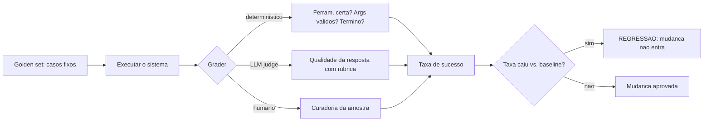

# Capítulo 1: Capítulo 13: Avaliando agentes: evals e LLM-as-a-judge

## Introdução

O OrquestraIA funciona — mas "funciona" é uma afirmação vaga. Funciona em quais casos? Funciona o bastante para produção? Uma mudança no contexto melhorou ou piorou o comportamento? Este capítulo constrói a resposta: a **infraestrutura de avaliação** — os evals (testes sistemáticos de qualidade) e o LLM-as-a-judge (o modelo como avaliador) — a disciplina que separa os sistemas de agentes que amadurecem dos que estagnam na primeira impressão [4].

A avaliação de agentes é diferente da avaliação de LLMs em chat: o agente executa ações, usa ferramentas, percorre loops — e a qualidade não está apenas na resposta final, mas no **caminho**: a ferramenta certa foi escolhida? Os argumentos estavam certos? O loop parou na hora? A observação foi usada? A Anthropic, que


publicou guias de evals para agentes, resume a mudança: avaliar agente é avaliar o comportamento completo, não a última mensagem [4]. E os benchmarks acadêmicos — AgentBench e sucessores — mostram por que a avaliação é urgente: o desempenho de LLMs como agentes varia enormemente entre ambientes, e a robustez é o gargalo [17].

Ao final deste capítulo, você será capaz de construir o sistema de evals do OrquestraIA completo: o conjunto de casos de teste (golden set), os graders determinísticos (ferramenta certa, argumentos certos, término correto), o LLM-as-a-judge com rubrica, a avaliação de recuperação da memória e o painel de regressão — a medida que decide cada mudança do sistema, do prompt ao orquestrador.

## Explica

### Por que Avaliar Agentes é Diferente

Avaliar um chatbot é comparar respostas; avaliar um agente é avaliar um **processo com consequências**. Quatro dimensões separam os evals de agentes [4]:

**1. Seleção de ferramenta**: o agente escolheu a ferramenta certa para a tarefa? Errar a ferramenta é um erro de comportamento que nenhuma resposta bonita conserta.

**2. Qualidade dos argumentos**: os argumentos passados à ferramenta estavam completos e válidos? Argumentos errados executam ações erradas — o erro mais caro do sistema.

**3. Comportamento do loop**: o agente parou no momento certo? Parou cedo demais (missão incompleta)? Parou tarde (tokens desperdiçados)? Caiu em loop?

**4. Resposta final**: a resposta final responde à missão original, é factual e está no tom certo? — a dimensão compartilhada com os LLMs em chat [4].

### Os Três Tipos de Graders

Os graders (avaliadores) formam a hierarquia dos evals [4]:

**Graders determinísticos**: regras exatas — "a ferramenta chamada foi `consultar_pedido`?", "o argumento `pedido_id` estava presente?". Baratos, rápidos, sem ambiguidade. Avaliam as dimensões estruturais (1–3).

**Graders de modelo (LLM-as-a-judge)**: um LLM avalia a qualidade com uma rubrica — "a resposta é factual segundo o contexto?", "o tom é adequado?", "o plano foi cumprido?". Custo maior, mas capturam o que regras não capturam. A confiabilidade do judge precisa ser validada — o judge concorda com o julgamento humano? [4].

**Graders humanos**: a curadoria final — revisores humanos validam uma amostra e alimentam o golden set. Caros, mas insubstituíveis para calibrar os judges [4].

### O Golden Set e a Regressão

O coração dos evals é o **golden set**: um conjunto fixo de casos — missões, entradas, ferramentas esperadas, respostas de referência — que nunca muda sem revisão explícita. Cada mudança no sistema (prompt, contexto, memória, orquestrador) roda contra o golden set: se a taxa de sucesso cai, é **regressão** — a mudança não entra. O golden set é o porquê de o sistema amadurecer sem piorar: o que não pode ser medido não pode ser protegido [4].

## Ilustra

### O Exame de Direção e o Instrutor

Avaliar um agente é avaliar um motorista na prova de direção — e o LLM-as-a-judge é o instrutor que acompanha a prova. A prova não é só o destino: é o **comportamento no caminho**. O candidato (o agente) fez a sinalização certa (seleção de ferramenta)? Usou a marcha certa na hora certa (argumentos corretos)? Parou no sinal vermelho (término no momento certo)? Chegou ao destino com segurança (resposta final)? — o exame é o golden set: as mesmas provas, o mesmo critério, aplicados a cada candidato, sempre.

O instrutor (o judge) não é infalível: um instrutor que aprova todo mundo (judge leniente) não testa nada; um que reprova todo mundo (judge severo) também não. A calibração — o instrutor concorda com o comitê humano nas provas difíceis? — é o que valida o próprio instrutor. E a prova de direção não é feita uma vez: a cada mudança no carro (o sistema), a prova é repetida — se o carro novo freia pior, a mudança não entra (regressão) [4].



### A Analogia do Controle de Qualidade da Fábrica

Uma segunda lente: o controle de qualidade da fábrica. Cada produto (missão resolvida) passa pela inspeção — não uma vez, mas em etapas: a inspeção dimensional (graders determinísticos — a peça tem as medidas certas?), a inspeção funcional (LLM judge — a peça funciona no uso real?) e a auditoria do


comitê (humano — a amostra que calibra as outras). A fábrica que não inspeciona entrega lotes defeituosos e descobre tarde demais; a fábrica que inspeciona protege a marca. O sistema de agentes sem evals é a fábrica sem inspeção — e o Capítulo 18 mostra o custo de descobrir tarde demais [8].

## Técnica

### O Golden Set do OrquestraIA

O golden set é a primeira construção — casos com o resultado esperado e os graders que os verificam:

```python
# golden_set.py — o conjunto de casos de teste do OrquestraIA
GOLDEN_SET = [
    {
        "id": "g-001",
        "missao": "O cliente quer saber o status do pedido P-7841",
        "dominio_esperado": "atendimento",
        "ferramenta_esperada": "consultar_pedido",
        "args_esperados": {"pedido_id": "P-7841"},
        "resposta_contem": ["em_transito"],  # fato que a resposta deve conter
    },
    {
        "id": "g-002",
        "missao": "Registrar preferencia de contato do cliente Maria por e-mail",
        "dominio_esperado": "atendimento",
        "ferramenta_esperada": "registrar_preferencia",
        "args_esperados": {"cliente": "Maria", "contato": "e-mail"},
        "resposta_contem": ["Maria", "e-mail"],
    },
    {
        "id": "g-003",
        "missao": "Qual a tendencia de vendas deste trimestre comparada ao passado?",
        "dominio_esperado": "analise",
        "ferramenta_esperada": None,  # pode nao exigir ferramenta
        "args_esperados": {},
        "resposta_contem": ["R$", "tendencia"],  # exige numeros e contexto
    },
]
```

### O Runner de Evals com Graders Determinísticos

O runner executa cada caso e aplica os graders determinísticos — a camada barata e exata:

```python
# evals_runner.py — executa o golden set com graders deterministicos
class EvalsRunner:
    """Roda o golden set e aplica graders deterministicos e de modelo."""
    def __init__(self, orquestrador, golden_set, llm_judge=None):
        self.orquestrador = orquestrador
        self.golden = golden_set
        self.llm_judge = llm_judge  # opcional: LLM-as-a-judge

def _grader_ferramenta(self, caso, rastreio) -> bool:
        """O agente chamou a ferramenta esperada?"""
        if not caso["ferramenta_esperada"]:
            return True  # caso sem ferramenta esperada passa
        return any(caso["ferramenta_esperada"] in str(r) for r in rastreio)

def _grader_resposta(self, caso, resposta) -> bool:
        """A resposta contem os fatos exigidos?"""
        return all(fato.lower() in resposta.lower()
                   for fato in caso["resposta_contem"])

def _grader_judge(self, caso, resposta) -> bool:
        """LLM-as-a-judge: qualidade da resposta com rubrica."""
        if not self.llm_judge:
            return True
        parecer = self.llm_judge.chamar_simples(
            "Avalie a resposta abaixo para a missao. Responda APROVADA ou "
            "REPROVADA, com a justificativa.\n"
            f"Missao: {caso['missao']}\nResposta: {resposta}\n"
            "Rubrica: resposta factual, completa, tom adequado, "
            "sem inventar dados.")
        return parecer.strip().upper().startswith("APROVADA")

def executar(self) -> dict:
        """Executa todos os casos e compila a taxa de sucesso."""
        resultados = []
        for caso in self.golden:
            saida = self.orquestrador.executar(caso["missao"])
            resposta = saida if isinstance(saida, str) else str(saida)
            rastreio = getattr(self.orquestrador, "rastreio", [])
            resultado = {
                "id": caso["id"],
                "ferramenta_ok": self._grader_ferramenta(caso, rastreio),
                "resposta_ok": self._grader_resposta(caso, resposta),
                "judge_ok": self._grader_judge(caso, resposta),
            }
            resultado["aprovado"] = all(
                v is True for k, v in resultado.items() if k.endswith("_ok"))
            resultados.append(resultado)
        taxa = sum(1 for r in resultados if r["aprovado"]) / len(resultados)
        return {"resultados": resultados, "taxa_sucesso": round(taxa, 3),
                "aprovado": taxa >= 0.9}

# Uso:
# evals = EvalsRunner(orquestra, GOLDEN_SET, llm_judge=judge)
# relatorio = evals.executar()
# print("taxa de sucesso:", relatorio["taxa_sucesso"])
```

Três decisões de engenharia: **graders ortogonais** (ferramenta, resposta, judge — cada dimensão mede uma coisa; a aprovação exige todas), **baseline de aprovação explícito** (90% no exemplo — o limiar é uma decisão de negócio documentada) e **rastreio como insumo do grader** (a dimensão de comportamento vem do rastreio, não da resposta final).

### Avaliando a Recuperação da Memória

A memória do Capítulo 6 precisa do próprio eval: para cada consulta do golden set, a recuperação deve trazer o fato certo:

```python
# eval_memoria.py — avalia a qualidade da recuperacao da memoria
class EvalMemoria:
    """Mede se a recuperacao traz os fatos certos para cada consulta."""
    def __init__(self, memoria, casos):
        self.memoria = memoria
        self.casos = casos  # [(consulta, fato_esperado), ...]

def executar(self) -> dict:
        acertos = 0
        detalhes = []
        for consulta, fato_esperado in self.casos:
            recuperados = self.memoria.recuperar(consulta, topo=3)
            acertou = any(fato_esperado.lower() in r.lower()
                          for r in recuperados)
            acertos += int(acertou)
            detalhes.append({"consulta": consulta, "acertou": acertou,
                             "recuperados": [r[:50] for r in recuperados]})
        return {"precisao": round(acertos / len(self.casos), 3),
                "detalhes": detalhes}

# Uso:
# casos = [("como a maria prefere contato", "Cliente Maria prefere e-mail"),
#          ("politica de reembolso", "Reembolso: 30 dias produtos digitais")]
# print(EvalMemoria(memoria, casos).executar()["precisao"])
```

A precisão da recuperação é a métrica que calibra o `topo` e a categorização do Capítulo 6: se a precisão cai com mais recuperados, o despejo está prejudicando.

### Checklist de Evals

- [ ] Golden set fixo e revisado — casos com ferramenta, argumentos e fatos esperados?
- [ ] Graders **determinísticos** para as dimensões estruturais (ferramenta, args, término)?
- [ ] LLM-as-a-judge com **rubrica** e **calibração** contra o julgamento humano?
- [ ] **Baseline de aprovação** explícito e documentado (ex.: ≥90%)?
- [ ] Toda mudança roda contra o golden set — **regressão bloqueia a mudança**?

## Aplica

### Evals no Chão de Fábrica

A avaliação é o que transforma um sistema de agentes de protótipo em produção. Os dados do mercado mostram que a maioria das empresas está em piloto justamente porque falta a infraestrutura de medição que permite confiar — e escalar — o sistema [8][18]. Os evals são a ponte entre a experimentação e a operação: com golden set e regressão, cada mudança é uma decisão medida; sem eles, cada mudança é uma aposta [4].

O LLM-as-a-judge, em particular, democratizou a avaliação de qualidade: em vez de revisão humana em cada caso, o judge avalia com rubrica e a amostra humana calibra o judge. A confiabilidade do judge — a concordância com o humano — é a métrica que valida o próprio judge, e a prática recomendada é medir essa concordância antes de confiar no judge em escala [4][17].

### Armadilhas Comuns

1. **Avaliar só a resposta final**: o agente que erra a ferramenta mas escreve bem "passa" — os evals de agente avaliam o caminho, não só o destino. 2. **Golden set que muda o tempo todo**: sem conjunto fixo não há regressão — as mudanças entram sem saber se pioraram. 3. **Judge não calibrado**:


um LLM judge sem validação contra o humano pode ser sistematicamente leniente ou severo. 4. **Baseline vago**: "quase sempre funciona" não é limiar — defina e documente a taxa de aprovação. 5. **Evals que nunca rodam**: a infraestrutura de evals que não é executada a cada mudança é decoração — integre ao pipeline (Capítulo 18).

### Conexão com o OrquestraIA

Os evals deste capítulo viram o portão de qualidade do OrquestraIA: o `EvalsRunner` roda o golden set a cada mudança de prompt, contexto ou orquestrador; a precisão da memória é medida pelo `EvalMemoria`; e os resultados alimentam o painel de observabilidade (Capítulo 16) e o CI/CD de agentes (Capítulo 18).

### Aprofundamento: A Calibração do LLM-as-a-Judge

O LLM-as-a-judge é poderoso — e perigosamente fácil de confiar sem validar. A calibração é o processo que mede a concordância entre o judge e o julgamento humano: pegue uma amostra de respostas (30–50 casos), peça ao judge para avaliar e peça a revisores humanos para avaliar as mesmas respostas, e compare. As métricas de concordância — acurácia,


precisão e recall do judge contra o humano — revelam o viés: um judge leniente aprova demais (falsos positivos), um severo reprova demais (falsos negativos), e um inconsistente varia sem padrão. A prática recomendada: **o judge entra em produção apenas com concordância medida** — e a calibração é repetida quando o judge muda (novo modelo, nova rubrica) [4][17].

A rubrica — o critério explícito do judge — é a alavanca da calibração: rubricas vagas ("avalie a qualidade") produzem judges instáveis; rubricas específicas ("a resposta contém o fato X citado? o tom é profissional? não inventa dados?") produzem judges reproduzíveis. A rubrica é testada junto


com o judge: se dois juízes com a mesma rubrica divergem, a rubrica é ambígua e deve ser refinada. O golden set do capítulo já contém a semente da calibração — os casos com resposta de referência — e a amostra humana amplia o conjunto [4].

### A Hierarquia de Medição: Do Determinístico ao Humano

A hierarquia de graders do capítulo forma uma pirâmide de custo e precisão que orienta o desenho dos evals: a base — muitos casos com graders determinísticos (baratos, exatos) — sustenta o volume; o meio — casos com LLM judge (custo moderado, qualitativo) — cobre a qualidade; e o topo — poucos casos com revisão humana (caros, definitivos) — calibra os dois. A regra de alocação: **o determinístico


cobre tudo que é regra; o judge cobre o que é qualidade; o humano cobre o que decide** — e cada camada alimenta a seguinte (a amostra humana calibra o judge, que cobre casos que a regra não alcança). A pirâmide é o que torna os evals sustentáveis em escala: sem a base determinística, o custo do judge explode; sem o topo humano, o judge navega sem bússola [4].

### Aprofundamento: A Matriz de Cobertura dos Evals

O golden set não cobre o universo de casos — e saber o que ele **não** cobre é tão importante quanto o que cobre. A matriz de cobertura ajuda a enxergar as lacunas: cruze os **domínios** (suporte, vendas, análise — ou os seus) com os **tipos de caso** (feliz, borda, erro, segurança, ambiguidade) e marque a densidade de casos em cada célula. A matriz madura tem células densas nos fluxos principais (o


caso feliz do suporte), células razoáveis nas bordas (o pedido inexistente) e células explicitamente pequenas nos casos raros (o ataque sofisticado — coberto pelo red teaming do Capítulo 14). A leitura da matriz orienta a evolução do golden set: o caso que a operação (Capítulo 19) revelou e a matriz não cobre entra como caso novo — o golden set cresce com a operação, e a matriz é o mapa do crescimento [4].

### A Avaliação de Rastreabilidade: O Golden Set do Caminho

Os evals deste capítulo avaliam o resultado — e o refinamento maduro avalia o **caminho**: o conjunto de casos que verifica não apenas se a resposta final é boa, mas se o percurso até ela foi o certo. Os casos de rastreabilidade fixam o caminho esperado: a ferramenta certa na ordem certa, os passos de verificação executados, o re-planejamento na divergência — e o grader compara o rastreio real (Capítulo 16) com o esperado.


O valor é duplo: o caminho errado com resposta certa é uma bomba-relógio (funciona hoje, quebra amanhã — o custo escondido do Capítulo 16), e o caminho certo com resposta errada é o sintoma de um problema localizável (a ferramenta, o contexto, o modelo — não o sistema inteiro). A avaliação de rastreabilidade é o elo entre os evals (Capítulo 13) e a observabilidade (Capítulo 16): o mesmo rastreio que audita também avalia [4][16].

## Conclusão

Três pontos para levar: **primeiro**, avaliar agentes é avaliar o processo — seleção de ferramenta, argumentos, comportamento do loop e resposta final — não apenas a última mensagem. **Segundo**, a hierarquia de graders — determinístico, LLM judge e humano — cobre do exato ao qualitativo, com o judge calibrado contra o humano. **Terceiro**, o golden set fixo com baseline explícito é o coração da regressão: a mudança que piora o sistema não entra — é isso que permite amadurecer sem quebrar.

O próximo capítulo trata do tema mais urgente dos sistemas agênticos em 2026: a **segurança** — prompt injection, tool poisoning e os guardrails que protegem o sistema contra o mundo hostil que ele agora toca.

**Desafio opcional**: monte um golden set de 10 casos do seu domínio (com ferramenta, argumentos e fatos esperados) e rode o `EvalsRunner` no seu agente. Depois, introduza uma mudança proposital no contexto — uma instrução ambígua — e verifique: a regressão foi detectada? Essa é a demonstração do valor do golden set.

## Para se aprofundar

Este capítulo faz parte do e-book **Governança e Qualidade para Agentes**, extraído da obra completa *IA Agêntica Desbloqueada: Um guia para projetar, construir e implantar sistemas de IA autônomos*. No livro-mãe, você encontra o mesmo conteúdo com aprofundamento técnico adicional: diagramas Mermaid, blocos de código executáveis, referências ABNT verificáveis e a narrativa completa do projeto OrquestraIA — do primeiro agente ao monitoramento em produção.

Se este e-book despertou sua atenção para a construção de sistemas de IA autônomos, o próximo passo natural é levar o aprendizado para o seu próprio contexto: escolha um problema pequeno e bem delimitado, desenhe o agent loop com uma única ferramenta e uma única política de autonomia, e meça o resultado antes de escalar. A autonomia é uma concessão que se conquista com evidência.

**Quer continuar?** Explore os demais e-books da série: *Governança e Qualidade para Agentes* é apenas uma parte do caminho — os outros volumes cobrem o desenho do sistema, a construção prática, a governança e a operação contínua.
