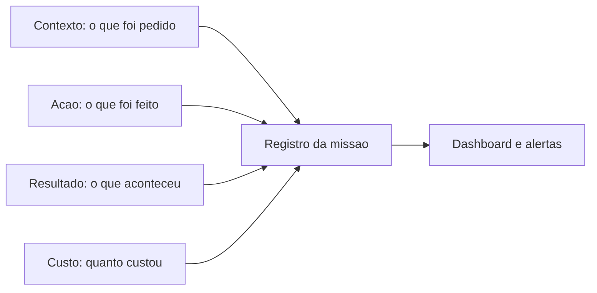

# Capítulo 4: Capítulo 16: Observabilidade e custos de tokens

## Introdução

O OrquestraIA está completo em capacidades — e este capítulo trata do que decide se ele é **operável**: a observabilidade (saber o que o sistema está fazendo, por que está fazendo e quando deu errado) e os **custos de tokens** (a economia que decide se o sistema


é sustentável). Um sistema de agentes sem observabilidade é um carro sem painel: anda, mas você não sabe a velocidade, o combustível nem o que está prestes a quebrar. E um sistema sem controle de custo é um carro que você dirige sem olhar o tanque [16][20].

Os capítulos anteriores plantaram as sementes da observabilidade: o rastreio do orquestrador (Capítulo 10), a trilha do ReAct (Capítulo 4), a auditoria da supervisão (Capítulo 15). Este capítulo as colhe: o **design de trilhas** — o que registrar em cada decisão — o **painel de operação** — as métricas que resumem a saúde do sistema — e a **economia de tokens** — como medir, orçar e reduzir o custo por missão sem degradar a qualidade [16][20].

Ao final deste capítulo, você será capaz de construir o painel do OrquestraIA: o registro estruturado de cada missão (missão, roteamento, ações, custo, resultado), as métricas de saúde (taxa de sucesso, custo por missão, latência, incidentes), os alertas de anomalia e o orçamento de tokens com os pontos de otimização — o que torna o sistema visível, controlável e sustentável.

## Explica

### Por que Observabilidade é Diferente em Agentes

Observabilidade em agentes é mais exigente que em software tradicional, por três razões [16][20]: **o comportamento é probabilístico** — o mesmo input pode gerar caminhos diferentes a cada vez, e entender o "porquê" exige registrar o caminho, não só o resultado; **as decisões têm consequências** — saber que


uma ação foi tomada sem saber por que foi tomada é metade da história, e a auditoria (Capítulos 14-15) exige a outra metade; e **a cadeia é multiagente** — no OrquestraIA, o rastreio atravessa orquestrador, especialistas e ferramentas, e a falha pode estar em qualquer elo (Capítulo 12).

A prática recomendada: **trilha de decisão** — o registro estruturado de cada passo (quem decidiu, com base em quê, que ação tomou, que resultado observou) — o material que o ReAct já produzia (Capítulo 4), agora elevado a padrão do sistema [4][16].

### As Quatro Dimensões do Registro

Cada missão registrada tem quatro dimensões: **contexto** (a missão, o domínio, o roteamento — o que foi pedido), **ação** (as ferramentas chamadas, os argumentos, a ordem — o que foi feito), **resultado** (as observações, o sucesso, a resposta — o que aconteceu) e **custo** (tokens, latência, moeda — o preço). As quatro juntas permitem responder: "o que o sistema fez, por quê, deu certo e quanto custou?" [16].

### A Economia de Tokens

O custo de tokens é o custo variável dominante do sistema agêntico — e é uma **decisão de arquitetura**, não uma surpresa da conta. Cada chamada ao modelo custa; loops multiplicam; contexto inchado cobra em cada reenvio; multiagente multiplica por agente (Capítulo 12). A gestão tem três tempos: **medir** (custo


por missão por tipo — a métrica que revela onde o dinheiro vai), **orçar** (limites por missão e por período — o teto que impede o descontrole) e **otimizar** (contexto selecionado — Capítulo 5 —, memória compactada — Capítulo 6 —, modelo certo para o trabalho — Capítulo 17) [16][20].

## Ilustra

### O Painel de Controle da Usina

A observabilidade é o painel de controle da usina. Os operadores não assistem à usina inteira — assistem ao painel: os medidores (métricas), os alarmes (alertas) e os registros (trilhas). O bom painel responde em segundos: "a turbina 3 está acima da temperatura" (métrica), "há um padrão anômalo de consumo" (alerta) e "o que aconteceu às 14h37 na turbina 3?" (trilha). A usina sem painel não está operando: está torcendo [16].



### A Analogia do Tanque de Combustível

A economia de tokens é o tanque de combustível da viagem. O motorista que nunca olha o tanque descobre o zero na estrada (o sistema que estoura o orçamento na semana crítica). O motorista que mede a cada trecho sabe o consumo por quilômetro (o custo


por missão), sabe onde o consumo dispara (a rota multiagente, o contexto inchado) e ajusta o percurso (a otimização). E o teto do tanque (o orçamento) é o que impede o desastre — não para limitar, mas para forçar a decisão consciente de onde gastar [16].

## Técnica

### O Registro Estruturado de Missão

Vamos implementar a trilha do OrquestraIA — o registro de cada missão com as quatro dimensões:

```python
# observabilidade.py — trilha estruturada e metricas de saude
import time, json

class RegistroMissao:
    """Registra cada missao com contexto, acao, resultado e custo."""
    def __init__(self):
        self.missoes = []

def registrar(self, missao: str, dominio: str, acoes: list,
                  resultado: str, tokens: int, latencia_ms: float) -> dict:
        """Registra a missao e retorna o registro (para auditoria)."""
        reg = {
            "timestamp": time.strftime("%Y-%m-%d %H:%M:%S"),
            "missao": missao[:120],
            "dominio": dominio,
            "acoes": [{"ferramenta": a.get("ferramenta"),
                       "argumentos": str(a.get("argumentos", ""))[:60]}
                      for a in acoes],
            "resultado": resultado[:120],
            "sucesso": not resultado.startswith(("ERRO", "NEGADO", "Falha")),
            "tokens": tokens,
            "latencia_ms": round(latencia_ms, 1),
            "custo_estimado": round(tokens * 0.000004, 4),  # ex.: $4/1M tokens
        }
        self.missoes.append(reg)
        return reg

def resumo(self) -> dict:
        """Metricas de saude do periodo registrado."""
        n = len(self.missoes)
        if n == 0:
            return {"missoes": 0}
        sucessos = sum(1 for m in self.missoes if m["sucesso"])
        return {
            "missoes": n,
            "taxa_sucesso": round(sucessos / n, 3),
            "custo_total": round(sum(m["custo_estimado"] for m in self.missoes), 4),
            "custo_medio_por_missao": round(
                sum(m["custo_estimado"] for m in self.missoes) / n, 4),
            "tokens_totais": sum(m["tokens"] for m in self.missoes),
            "latencia_media_ms": round(
                sum(m["latencia_ms"] for m in self.missoes) / n, 1),
        }

# Uso:
# trilha = RegistroMissao()
# trilha.registrar("consultar pedido P-7841", "atendimento",
#                  [{"ferramenta": "consultar_pedido", "argumentos": {"pedido_id": "P-7841"}}],
#                  "pedido em transito", 850, 320)
# print(trilha.resumo())
```

A métrica de custo estimado usa uma constante didática (US$ 4 por milhão de tokens de entrada); na produção, o preço real do modelo vem do gateway (Capítulo 17).

### O Painel de Saúde com Alertas

O painel monitora as métricas e sinaliza anomalias — o fechamento do ciclo de observação:

```python
# painel.py — metricas de saude e alertas de anomalia
class PainelOperacao:
    """Resume a saude do sistema e dispara alertas."""
    def __init__(self, registro, limites: dict = None):
        self.registro = registro
        self.limites = limites or {
            "taxa_sucesso_min": 0.85,
            "custo_max_por_missao": 0.02,   # US$ 0,02 por missao
            "latencia_max_ms": 5000,
        }

def alertas(self) -> list:
        """Retorna os alertas ativos segundo os limites."""
        resumo = self.registro.resumo()
        alertas = []
        if resumo["missoes"] == 0:
            return ["sem missoes registradas"]
        if resumo["taxa_sucesso"] < self.limites["taxa_sucesso_min"]:
            alertas.append(
                f"taxa de sucesso {resumo['taxa_sucesso']} abaixo do limite "
                f"{self.limites['taxa_sucesso_min']}")
        if resumo["custo_medio_por_missao"] > self.limites["custo_max_por_missao"]:
            alertas.append(
                f"custo por missao {resumo['custo_medio_por_missao']} acima "
                f"do limite {self.limites['custo_max_por_missao']}")
        if resumo["latencia_media_ms"] > self.limites["latencia_max_ms"]:
            alertas.append(
                f"latencia media {resumo['latencia_media_ms']}ms acima do "
                f"limite {self.limites['latencia_max_ms']}ms")
        return alertas

# Uso:
# painel = PainelOperacao(trilha)
# print(painel.alertas())
```

### Otimização de Tokens: Os Três Pontos de Alavanca

A otimização do custo tem três alavancas, em ordem de retorno: **contexto selecionado** (Capítulo 5 — recuperação por orçamento, sem despejo — o corte mais rápido), **memória compactada** (Capítulo 6 — resumo do histórico antigo, integral apenas o recente) e **modelo por tarefa** (Capítulo 17 — o modelo pequeno para tarefas simples, o grande para as complexas — o corte estrutural mais profundo):

```python
# otimizacao_custo.py — medir o impacto das otimizacoes
def custo_por_missao(registro, tipo: str) -> float:
    """Custo medio por missao de um tipo de dominio."""
    missoes = [m for m in registro.missoes if m["dominio"] == tipo]
    if not missoes:
        return 0.0
    return round(sum(m["custo_estimado"] for m in missoes) / len(missoes), 4)

# Exemplo de leitura:
# antes = custo_por_missao(registro, "analise")   # com contexto despejado
# depois = custo_por_missao(registro_otimizado, "analise")  # com selecao
# print("economia:", antes - depois)
```

### Checklist de Observabilidade

- [ ] Cada missão registra as **quatro dimensões** — contexto, ação, resultado, custo?
- [ ] As **trilhas de decisão** (quem, por quê, o quê, resultado) são completas?
- [ ] O painel resume **taxa de sucesso, custo, latência e incidentes**?
- [ ] **Alertas** ativos com limites explícitos e revisáveis?
- [ ] O **custo por missão** é medido por tipo e a otimização é medida (antes/depois)?

## Aplica

### Observabilidade no Chão de Fábrica

A observabilidade é o que separa os sistemas que operam dos que "funcionam na demo". Os dados do mercado mostram que a maioria dos sistemas em piloto não escala, em grande parte, por falta de medição: sem trilha e painel, não há como saber o que funciona, o que


custa e o que quebra — e a confiança (Capítulo 15) não tem material para crescer [18][8]. Os sistemas que escalam têm painel desde o primeiro dia: a taxa de sucesso decide a calibração de autonomia, o custo por missão decide a otimização e a trilha decide a auditoria [16].

A economia de tokens, especificamente, é uma vantagem competitiva: o sistema que entrega o mesmo resultado com metade do custo por missão escala com orçamento menor — e os guias de gateway e gestão de custo mostram que a otimização sistemática (contexto, memória, modelo) reduz o custo sem degradar a qualidade [20][16].

### Armadilhas Comuns

1. **Logar sem estruturar**: linhas de log soltas sem as quatro dimensões — impossível resumir, comparar e alertar. 2. **Painel sem trilha**: métricas agregadas sem o detalhe de cada missão — o painel diz que algo está errado, a trilha diz o quê. 3. **Custo como surpresa**: descobrir o


custo na fatura — o custo é arquitetura, medida por missão desde o início. 4. **Alertas que ninguém lê**: alertas sem ação — cada alerta deve ter um dono e um procedimento. 5. **Otimização sem medida**: reduzir contexto "por intuição" — toda otimização mede antes e depois (Capítulo 13).

### Conexão com o OrquestraIA

A observabilidade do OrquestraIA consolida tudo: o `RegistroMissao` coleta o rastreio do orquestrador (Capítulo 10), a trilha do ReAct (Capítulo 4), as decisões da supervisão (Capítulo 15) e os evals (Capítulo 13); o `PainelOperacao` alimenta os alertas e a revisão da autonomia; e o custo por missão decide a otimização do gateway (Capítulo 17) e o orçamento do deploy (Capítulo 18).

### Aprofundamento: O Dashboard com Tendências e o Alerta de Degradação

O painel do capítulo mede o valor de hoje — mas a degradação silenciosa (Capítulo 19) se esconde na **tendência**. O dashboard maduro adiciona duas leituras temporais: a **comparação com a janela anterior** (a taxa de sucesso desta semana contra a da semana passada — não apenas o valor, mas a direção) e o **alerta de deriva** (quando a tendência de 7 dias piora além de um limiar


— mesmo que o valor de hoje ainda esteja dentro do limite). O alerta de deriva é o que detecta o problema antes do incidente: o custo por missão subindo 3% ao dia não dispara o alerta de valor (ainda está abaixo do teto), mas dispara o alerta de tendência — e a equipe investiga a causa (contexto inchado? modelo mais caro?) antes de o teto ser atingido [8][16].

A implementação do alerta de tendência é simples — a regressão linear da métrica na janela, ou a comparação de médias móveis:

```python
# tendencia.py — alerta de deriva por media movel
class AlertaDeriva:
    """Detecta degradacao silenciosa pela tendencia, nao so pelo valor."""
    def __init__(self, historico: list, janela: int = 7, limite_deriva: float = 0.05):
        self.historico = historico  # lista de medias diarias da metrica
        self.janela = janela
        self.limite = limite_deriva

def media_movel(self, dias: int) -> float:
        recentes = self.historico[-dias:]
        return sum(recentes) / len(recentes) if recentes else 0.0

def avaliar(self) -> list:
        """Retorna os sinais de deriva na janela."""
        if len(self.historico) < self.janela:
            return []
        base = self.media_movel(self.janela)
        anterior = self.media_movel(self.janela * 2)
        if anterior <= 0:
            return []
        variacao = (base - anterior) / anterior
        if variacao > self.limite:
            return [f"deriva de {variacao:.1%} na janela — investigar"]
        return []

# Uso: deriva = AlertaDeriva(medias_diarias, janela=7, limite_deriva=0.05)
# print(deriva.avaliar())
```

O alerta de deriva fecha a observabilidade com a operação (Capítulo 19): o painel não apenas mostra o estado — ele sinaliza a direção, e a direção é o que permite agir antes do incidente.

### A Trilha como Contrato entre Sistemas

A trilha do agente é consumida por mais do que o painel: a auditoria (Capítulos 14-15), os evals (Capítulo 13) e o ciclo de operação (Capítulo 19) leem o mesmo registro — o que faz da trilha um **contrato entre sistemas**. A prática recomendada é estabilizar o formato do registro (os campos, os tipos, a semântica de sucesso) como um


contrato versionado: mudanças de formato são mudanças de contrato, testadas no CI e compatibilizadas com os consumidores. A trilha que muda de formato sem aviso quebra a auditoria e os evals silenciosamente — o pior tipo de quebra, porque aparece muito depois da causa. O contrato de trilha é a peça que conecta a observabilidade à governança do sistema inteiro [16][20].

### Aprofundamento: O Orçamento de Tokens como Política

A economia de tokens do capítulo ganha força quando vira **política** — o orçamento documentado com dono, limites e fluxo de exceção. A política de tokens tem três camadas: o **orçamento por missão** (o teto por missão por domínio — a análise pode gastar mais que a consulta rápida do suporte; o teto é por domínio, não global), o **orçamento por período** (o teto diário/semanal do sistema — o alarme do Capítulo 16 monitora) e o **fluxo de


exceção** (quando o teto é insuficiente — a missão complexa que precisa de mais — o fluxo é documentado: quem aprova a exceção, com que justificativa, e o caso vira lição no Capítulo 19). A política é o que transforma o custo de reativo (a conta do fim do mês) em proativo (a decisão antes da missão): o sistema que estoura o orçamento dispara o alerta e o fluxo de exceção — não a surpresa da fatura [16][20].

### A Otimização de Custo por Domínio: O Caso da Análise

A otimização de custo não é genérica — é **por domínio**, e o caso da análise ilustra o método que se aplica a qualquer domínio. O pipeline de análise (Capítulo 12) é o maior consumidor de tokens do OrquestraIA: múltiplos estágios, múltiplas chamadas, contexto de dados. A otimização segue o método medido: **medir** (o custo por relatório — a base), **identificar** (o estágio mais caro — geralmente o de processamento com contexto grande), **otimizar** (as alavancas:


contexto selecionado do Capítulo 5, memória compactada do Capítulo 6, cache semântico do Capítulo 17, modelo por estágio — o estágio de coleta usa modelo pequeno, o de síntese usa o grande) e **medir de novo** (a economia real — o antes e o depois do Capítulo 13). O caso da análise mostra o padrão universal da otimização: ela é medida, por domínio e contínua — não um evento único, mas parte da operação (Capítulo 19) [16].

## Conclusão

Três pontos para levar: **primeiro**, observabilidade em agentes é registrar o caminho, não só o destino — a trilha de decisão com contexto, ação, resultado e custo é o material de auditoria, depuração e confiança. **Segundo**, o painel de operação resume a saúde — taxa de sucesso, custo, latência, incidentes — com alertas de limites explícitos que têm dono e ação. **Terceiro**, o custo de tokens é uma decisão de arquitetura medida por missão — medir, orçar e otimizar (contexto, memória, modelo) é o que torna o sistema sustentável.

O próximo capítulo abre a Parte V — Implantação e Operação — com o **deploy do OrquestraIA em produção**: os LLM gateways, o fallback, a escalabilidade e o CI/CD de agentes.

**Desafio opcional**: instrumente o seu agente com o `RegistroMissao` e rode 20 missões reais. Depois, leia o resumo: qual domínio tem o maior custo por missão? Qual a taxa de sucesso real? Implemente uma otimização (contexto selecionado ou modelo menor) e compare o custo antes e depois — a sua primeira decisão de operação baseada em dados.

## Para se aprofundar

Este capítulo faz parte do e-book **Governança e Qualidade para Agentes**, extraído da obra completa *IA Agêntica Desbloqueada: Um guia para projetar, construir e implantar sistemas de IA autônomos*. No livro-mãe, você encontra o mesmo conteúdo com aprofundamento técnico adicional: diagramas Mermaid, blocos de código executáveis, referências ABNT verificáveis e a narrativa completa do projeto OrquestraIA — do primeiro agente ao monitoramento em produção.

Se este e-book despertou sua atenção para a construção de sistemas de IA autônomos, o próximo passo natural é levar o aprendizado para o seu próprio contexto: escolha um problema pequeno e bem delimitado, desenhe o agent loop com uma única ferramenta e uma única política de autonomia, e meça o resultado antes de escalar. A autonomia é uma concessão que se conquista com evidência.

**Quer continuar?** Explore os demais e-books da série: *Governança e Qualidade para Agentes* é apenas uma parte do caminho — os outros volumes cobrem o desenho do sistema, a construção prática, a governança e a operação contínua.
