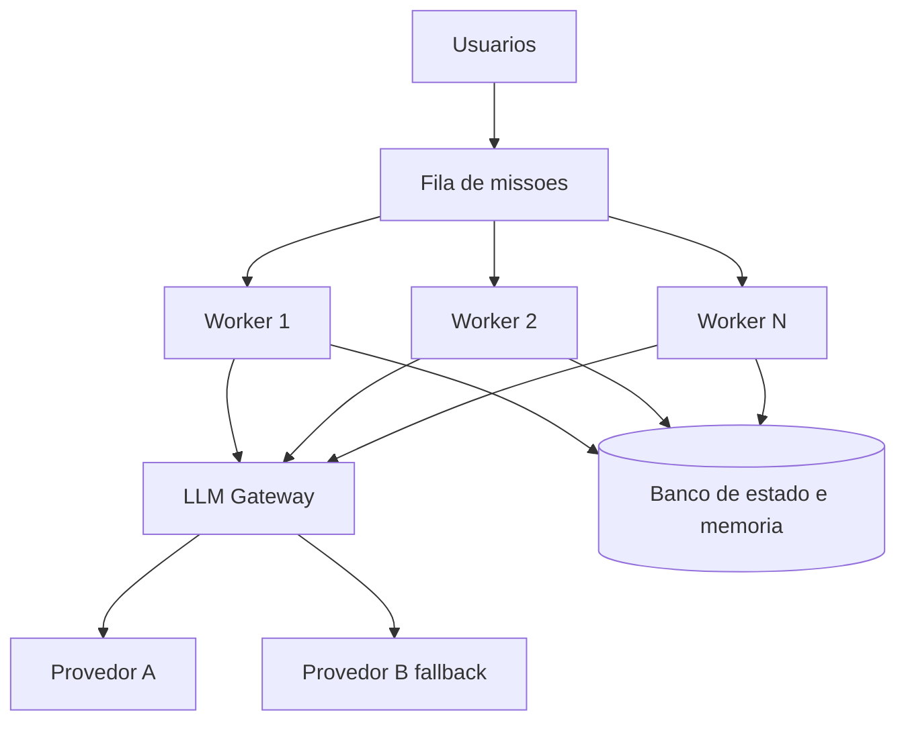

# Capítulo 1: Capítulo 17: Implantando o OrquestraIA em produção

## Introdução

O OrquestraIA está completo: loop, contexto, memória, ferramentas, orquestrador, evals, segurança, supervisão e observabilidade. Este capítulo cruza a fronteira que separa o protótipo do sistema: a **implantação em produção** — os LLM gateways, o fallback, a escalabilidade, o gerenciamento de segredos e o CI/CD de agentes. É aqui que o sistema deixa de rodar na sua máquina e passa a atender tráfego real, com disponibilidade, custo controlado e capacidade de voltar atrás quando algo der errado [20][31].

A infraestrutura de produção de agentes amadureceu: os **LLM gateways** — a camada que centraliza as chamadas aos modelos com roteamento, fallback, cache, rate limiting e observação de custo — viraram peça padrão da arquitetura, com comparativos dedicados no mercado [31][32][20]. O CI/CD de agentes — o pipeline que roda os


evals, valida os prompts e promove as mudanças — é a prática que conecta a disciplina de avaliação do Capítulo 13 ao fluxo de implantação [4]. E a escalabilidade — filas, workers, estado distribuído — é o que transforma um agente que atende um cliente em um que atende milhares [20].

Ao final deste capítulo, você será capaz de implantar o OrquestraIA em produção: configurar o gateway com roteamento e fallback de modelos, proteger os segredos, escalar o serviço com filas e workers, e montar o pipeline de CI/CD que roda os evals e promove as mudanças com segurança — o fechamento da jornada que culmina no deploy do Capítulo 18.

## Explica

### O LLM Gateway: A Camada Central das Chamadas

O gateway de LLM é o ponto único por onde passam todas as chamadas aos modelos — e por isso é o lugar certo para a infraestrutura transversal [31][32][20]: **roteamento** (qual modelo atende qual chamada — o modelo pequeno para tarefas simples, o grande para as complexas, o Capítulo 16), **fallback** (se o provedor principal falha ou


degrada, a chamada vai para o alternativo — a disponibilidade), **cache** (respostas repetidas não pagam duas vezes — a economia), **rate limiting e orçamento** (o teto por cliente, por período — o controle), **observação** (tokens, custo, latência por chamada — o Capítulo 16) e **segurança** (a chave única no gateway, nunca nos clientes — o Capítulo 11).

Os comparativos de gateway mostram o espectro: de soluções leves a plataformas completas, a escolha depende do tamanho do sistema e das exigências — mas a decisão de **ter um gateway** é menos discutível que a de qual: a centralização da camada de LLM é o padrão recomendado para qualquer sistema em produção [31][32][20].

### Fallback: A Disponibilidade do Sistema

O fallback é a resposta à pergunta "e se o provedor cair?" — e em sistemas agênticos a resposta é mais crítica que em chatbots: a missão em andamento depende da chamada seguinte, e uma falha no meio do loop é uma missão interrompida [31][20]. As três camadas do fallback: **modelo alternativo**


(o provedor B assume a chamada que o A não atendeu), **modo degradado** (a tarefa continua com capacidades reduzidas — o agente informa que está em modo limitado), e **fila e retry** (a missão entra na fila e tenta de novo com backoff — a disciplina do Capítulo 2 aplicada à infraestrutura).

### Escalabilidade: De Um Cliente a Milhares

A escalabilidade do agente tem dois eixos [20]: **concorrência** (muitas missões ao mesmo tempo — o serviço precisa de workers paralelos, e o LLM é o gargalo: a fila equilibra a carga e o cache reduz as chamadas repetidas) e **estado distribuído** (a memória e o rastreio deixam de ser locais — o banco compartilhado do Capítulo 6 vira a memória do sistema inteiro). A prática recomendada: **stateless no worker, stateful no banco** — os workers não guardam estado; o estado vive no banco e na memória compartilhada.

### CI/CD de Agentes: O Pipeline de Mudanças

O CI/CD de agentes é o pipeline que torna cada mudança uma decisão medida [4]: o **CI** roda os evals (Capítulo 13) a cada mudança de prompt, contexto ou código — a regressão bloqueia o merge; o **CD** promove a mudança com deploy gradual — primeiro um percentual


pequeno do tráfego, com monitoramento (Capítulo 16), depois o total, com rollback automático se as métricas degradam. A diferença do CI/CD tradicional: o artefato não é só código — é **configuração de agente** (prompts, contratos, políticas), e o teste não é só unitário — é o golden set [4].

## Ilustra

### A Cozinha Industrial e o Fornecedor de Ingredientes

O gateway de LLM é a cozinha industrial com contrato único de fornecedor. A cozinha não negocia com cada mercado (cada provedor) — ela tem **um ponto de compra** (o gateway): o chef pede "2 kg de tomate" (a chamada), e a cozinha decide de qual


fornecedor comprar hoje, com preço, entrega e qualidade (o roteamento e o fallback). Se o fornecedor principal falha, a cozinha troca na hora sem interromper o serviço (o fallback). E o estoque (o cache) evita comprar o mesmo ingrediente duas vezes para o mesmo prato [31][32].



### A Analogia do Restaurante com Reservas

Uma segunda lente: o restaurante popular com fila de reservas. Sem a fila (a fila de missões), os clientes disputam as mesas na chegada — o caos com pico de demanda (a concorrência). Com a fila, cada cliente espera sua vez, as mesas (os workers) trabalham o tempo todo, e o cardápio (o cache) acelera os pedidos repetidos. E o


gerente (o gateway) negocia com os fornecedores (os provedores) para manter o preço e a qualidade — se um fornecedor falha, o outro assume o cardápio do dia. O restaurante que escala não é o que tem mais mesas: é o que tem fila, gerência de fornecedores e processo — a mesma lição do sistema de agentes em produção [20].

## Técnica

### O Gateway com Roteamento e Fallback

Vamos implementar o gateway do OrquestraIA — a camada central com roteamento, fallback e medição de custo:

```python
# gateway_llm.py — roteamento, fallback, cache e medicao
import os, time, hashlib

class GatewayLLM:
    """Ponto unico de chamadas ao LLM: roteia, cai para fallback, cacheia."""
    def __init__(self, provedores: dict, cache: dict = None):
        self.provedores = provedores  # {nome: {"client": callable, "modelo": str}}
        self.cache = cache or {}      # cache simples chave -> resposta
        self.metricas = {"chamadas": 0, "fallbacks": 0, "cache_hits": 0,
                         "tokens_total": 0}

def _chave_cache(self, modelo: str, mensagens: list) -> str:
        return hashlib.md5((modelo + str(mensagens)).encode()).hexdigest()

def chamar(self, mensagens: list, modelo: str = "", tarefa: str = "padrao") -> str: """Chama com roteamento por tarefa e fallback automatico.""" rota = self.provedores.get(tarefa, self.provedores.get("padrao")) modelo_alvo = modelo or rota["modelo"] chave = self._chave_cache(modelo_alvo, mensagens) if chave in self.cache: self.metricas["cache_hits"] += 1 return self.cache[chave] # tentativa principal + fallback ordem = [rota] + [p for


n, p in self.provedores.items() if n != tarefa and n != "padrao"] for provedor in ordem[:2]: # principal e um fallback try: resposta = provedor["client"](modelo_alvo, mensagens) self.metricas["chamadas"] += 1 self.metricas["tokens_total"] += len(str(mensagens)) // 4 self.cache[chave] = resposta return resposta except Exception as e: self.metricas["fallbacks"] += 1 ultimo_erro = str(e) return f"ERRO: todos os provedores falharam ({ultimo_erro[:80]})"

# Uso (provedores como callables — adapte ao SDK do seu provedor):
# gateway = GatewayLLM({
#     "padrao": {"client": chamar_openai, "modelo": "gpt-4o-mini"},
#     "complexo": {"client": chamar_anthropic, "modelo": "claude-sonnet-4"},
# })
# resposta = gateway.chamar([{"role": "user", "content": "..."}], tarefa="complexo")
```

Três decisões: **roteamento por tarefa** (o orquestrador marca a tarefa — o gateway escolhe o modelo certo), **fallback na ordem** (principal → alternativo, com registro de fallbacks nas métricas) e **cache por conteúdo** (missões repetidas não pagam duas vezes).

### Protegendo Segredos e Configuração

A segurança da configuração — a disciplina do Capítulo 11 elevada a padrão:

```python
# config_segura.py — segredos fora do codigo
import os

class ConfigProducao:
    """Configuracao de producao: segredos de ambiente, nunca no codigo."""
    OBRIGATORIOS = ["LLM_API_KEY", "LLM_API_KEY_FALLBACK", "DB_URL"]

@classmethod
    def validar(cls) -> list:
        """Retorna os segredos ausentes (para falhar cedo no deploy)."""
        return [k for k in cls.OBRIGATORIOS if not os.getenv(k)]

@classmethod
    def chave(cls, nome: str) -> str:
        """Le o segredo do ambiente (produção: cofre de segredos)."""
        valor = os.getenv(nome, "")
        if not valor:
            raise RuntimeError(f"segredo '{nome}' ausente no ambiente")
        return valor

# No pipeline de deploy:
# ausentes = ConfigProducao.validar()
# if ausentes:
#     raise SystemExit(f"deploy bloqueado: segredos ausentes: {ausentes}")
```

O padrão: segredos no ambiente ou no cofre (em produção, um vault), nunca no repositório — e o deploy **falha cedo** se a configuração está incompleta.

### O Worker com Fila de Missões

O worker consome missões da fila, executa o OrquestraIA e registra o resultado — a concorrência com estado no banco:

```python
# worker.py — consumidor de missoes com estado no banco
import time, json

class FilaMissao:
    """Fila simples de missoes (produção: Redis/SQS)."""
    def __init__(self):
        self._itens = []

def enfileirar(self, missao: str) -> int:
        self._itens.append({"missao": missao, "status": "pendente"})
        return len(self._itens) - 1

def obter_pendente(self):
        for item in self._itens:
            if item["status"] == "pendente":
                item["status"] = "em_execucao"
                return item
        return None

class Worker:
    """Executa missoes da fila usando o OrquestraIA."""
    def __init__(self, orquestrador, fila, registro, nome="worker-1"):
        self.orquestrador = orquestrador
        self.fila = fila
        self.registro = registro
        self.nome = nome

def processar_uma(self) -> bool:
        """Processa uma missao; True se havia missao."""
        item = self.fila.obter_pendente()
        if item is None:
            return False
        inicio = time.time()
        resultado = self.orquestrador.executar(item["missao"])
        item["status"] = "concluido"
        self.registro.registrar(
            missao=item["missao"], dominio="desconhecido",
            acoes=getattr(self.orquestrador, "rastreio", []) or [],
            resultado=resultado, tokens=0,  # contagem real vem do gateway
            latencia_ms=(time.time() - inicio) * 1000)
        return True

def loop(self, max_iteracoes: int = 100) -> None:
        """Loop de processamento do worker."""
        for _ in range(max_iteracoes):
            if not self.processar_uma():
                time.sleep(0.5)  # fila vazia: aguarda

# Uso:
# fila = FilaMissao(); fila.enfileirar("consultar pedido P-7841")
# worker = Worker(orquestra, fila, trilha)
# worker.loop()
```

A separação worker × banco é a chave da escala: N workers consomem a mesma fila e gravam no mesmo banco — a concorrência sem conflito de estado [20].

### O Pipeline de CI/CD de Agentes

O pipeline que conecta os evals à promoção — o fechamento da disciplina:

```python
# cicd_agentes.py — o pipeline de CI/CD de agentes (logica essencial)
class PipelineAgentes:
    """CI: evals bloqueiam. CD: deploy gradual com rollback."""
    def __init__(self, evals, painel, passo_deploy=0.1):
        self.evals = evals
        self.painel = painel
        self.passo = passo_deploy

def ci(self, mudanca: str) -> bool:
        """CI: roda os evals; a regressao bloqueia o merge."""
        print(f"[CI] testando mudanca: {mudanca[:60]}")
        relatorio = self.evals.executar()
        if not relatorio["aprovado"]:
            print(f"[CI] BLOQUEADO: taxa {relatorio['taxa_sucesso']} < limite")
            return False
        print(f"[CI] aprovado: taxa {relatorio['taxa_sucesso']}")
        return True

def cd(self, tráfego: int = 100) -> None:
        """CD: deploy gradual, monitorando as metricas."""
        for percentual in range(0, tráfego, int(self.passo * 100) or 1):
            print(f"[CD] promovendo {percentual}% do trafego")
            alertas = self.painel.alertas()
            if alertas:
                print(f"[CD] ROLLBACK: {alertas[0]}")
                return
        print("[CD] deploy completo")

# Uso no pipeline:
# pipe = PipelineAgentes(evals_runner, painel)
# if pipe.ci("contexto de atendimento v2"):
#     pipe.cd()
```

O CD gradual com monitoramento é o que torna a mudança reversível: cada passo observa as métricas antes de avançar — e o rollback é automático quando os alertas disparam [4].

### Checklist de Produção

- [ ] **Gateway** central com roteamento por tarefa, fallback e cache?
- [ ] **Segredos** no ambiente/cofre — deploy falha cedo se ausentes?
- [ ] **Fila + workers** com estado no banco (concorrência sem conflito)?
- [ ] **CI**: evals rodam a cada mudança — regressão bloqueia o merge?
- [ ] **CD**: deploy gradual com monitoramento e rollback automático?

## Aplica

### Produção no Chão de Fábrica

A infraestrutura de produção é o que separa os sistemas que escalam dos que colapsam sob demanda. Os gateways resolveram um problema real — roteamento, fallback, cache e observação centralizados — e os comparativos do mercado mostram a adoção generalizada da camada [31][32][20]. O CI/CD de agentes, por


sua vez, é a prática que torna a evolução segura: o golden set (Capítulo 13) rodando a cada mudança, o deploy gradual com monitoramento (Capítulo 16) e o rollback automático — a mesma disciplina que a engenharia de software tradicional construiu, aplicada ao artefato novo (o agente) [4].

A lição de produção mais importante: **a implantação não é o fim — é o começo da operação**. O sistema em produção acumula dados (Capítulo 16), erros (Capítulo 13) e lições (Capítulo 6) — e o ciclo do Capítulo 20 transforma operação em evolução.

### Armadilhas Comuns

1. **Sem gateway**: chamadas diretas aos provedores espalhadas — sem fallback, sem cache, sem observação de custo. 2. **Segredo no código**: a chave no repositório é a primeira vulnerabilidade que um atacante procura — ambiente/cofre sempre. 3. **Worker com estado local**: cada worker com sua memória — os clientes


falam com "diferentes" sistemas — o estado vive no banco compartilhado. 4. **Deploy sem evals**: promovem mudança de prompt sem rodar o golden set — a regressão chega em produção. 5. **Deploy all-at-once**: 100% do tráfego de uma vez — o rollback vira guerra; o gradual é o padrão.

### Conexão com o OrquestraIA

O OrquestraIA em produção: `GatewayLLM` roteia e cai para fallback (este capítulo), `ConfigProducao` protege os segredos, `Worker` + `FilaMissao` escalam a concorrência com estado no banco, e `PipelineAgentes` conecta os evals (Capítulo 13) ao deploy gradual — tudo monitorado pelo painel (Capítulo 16).

### Aprofundamento: O Cache Semântico — Economia com Qualidade

O cache do gateway do capítulo guarda a resposta exata para a entrada exata — o que funciona para missões idênticas, mas perde as variações. O refinamento é o **cache semântico**: guardar as respostas com o vetor da pergunta (Capítulo 6) e, na chegada, comparar a pergunta nova com as armazenadas por similaridade — se uma pergunta quase igual já foi respondida, devolve a resposta com a economia de uma chamada inteira. O cuidado


é duplo: o limiar de similaridade calibrado (muito alto, não cacheia nada; muito baixo, devolve respostas erradas para perguntas apenas parecidas — o risco do cache) e a invalidação (o cache expira com a política — a resposta de ontem pode não valer para a política de hoje). O cache semântico é uma das otimizações de maior retorno do Capítulo 16 — missões de suporte repetem padrões, e a economia se acumula em volume [16][20].

### O Deploy com Canary e a Matriz de Risco

O deploy gradual do capítulo pode ser refinado com o padrão **canary**: promover a mudança para um percentual pequeno do tráfego real — o canário — com monitoramento próximo das métricas (Capítulo 16) e evals (Capítulo 13) antes de expandir. O canary é a ponte entre o golden set (sintético) e a produção (real): o golden set pega as regressões conhecidas; o canary pega as regressões que o golden set não previu —


o comportamento real do tráfego real. A matriz de risco orienta o tamanho e a velocidade do canary: mudanças de alto risco (novo modelo, novo orquestrador) começam com canários menores e janelas de observação mais longas; mudanças de baixo risco (ajuste de texto de contexto) avançam mais rápido. O padrão canary é a prática que torna o CI/CD de agentes (Capítulo 17) um processo seguro de evolução — não um salto de fé [4][20].

## Conclusão

Três pontos para levar: **primeiro**, o gateway de LLM é a camada central da produção — roteamento por tarefa, fallback, cache, rate limiting, observação e segurança das chaves em um único ponto. **Segundo**, a escalabilidade é fila + workers com estado no banco — stateless


no worker, stateful no banco — e o fallback é a disponibilidade: modelo alternativo, modo degradado e retry. **Terceiro**, o CI/CD de agentes roda os evals a cada mudança (a regressão bloqueia) e promove com deploy gradual e rollback automático — a evolução segura do sistema.

O próximo capítulo entrega o resultado final da jornada: os **casos de uso reais** — suporte, vendas e análise — com o OrquestraIA resolvendo problemas do mundo real, as métricas de retorno e as lições de cada implantação.

**Desafio opcional**: configure um gateway com dois provedores (pode ser o mesmo SDK com modelos diferentes) e simule a falha do principal — o fallback assume? Depois, monte o `PipelineAgentes` com o seu golden set e introduza uma mudança de prompt que piora os evals: o CI bloqueia? O CD faz rollback?

## Para se aprofundar

Este capítulo faz parte do e-book **Implantação e Operação Contínua**, extraído da obra completa *IA Agêntica Desbloqueada: Um guia para projetar, construir e implantar sistemas de IA autônomos*. No livro-mãe, você encontra o mesmo conteúdo com aprofundamento técnico adicional: diagramas Mermaid, blocos de código executáveis, referências ABNT verificáveis e a narrativa completa do projeto OrquestraIA — do primeiro agente ao monitoramento em produção.

Se este e-book despertou sua atenção para a construção de sistemas de IA autônomos, o próximo passo natural é levar o aprendizado para o seu próprio contexto: escolha um problema pequeno e bem delimitado, desenhe o agent loop com uma única ferramenta e uma única política de autonomia, e meça o resultado antes de escalar. A autonomia é uma concessão que se conquista com evidência.

**Quer continuar?** Explore os demais e-books da série: *Implantação e Operação Contínua* é apenas uma parte do caminho — os outros volumes cobrem o desenho do sistema, a construção prática, a governança e a operação contínua.
