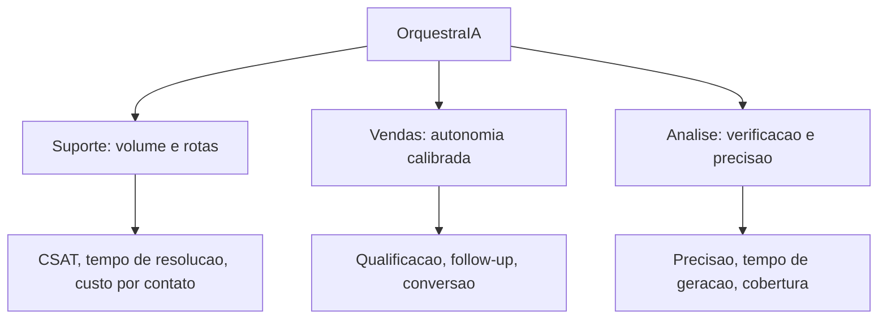

# Capítulo 2: Capítulo 18: Casos de uso reais: suporte, vendas e análise

## Introdução

O OrquestraIA está pronto e em produção — mas um sistema não prova nada até resolver problemas reais. Este capítulo faz a prova: os **três casos de uso que o OrquestraIA foi construído para atender** — suporte ao cliente, vendas e análise de dados — com as missões reais, as arquiteturas específicas de cada domínio, as métricas de retorno e as lições de cada implantação. É o capítulo em que a jornada técnica vira entrega de valor [8][24][27].

Cada domínio tem personalidade própria, e o OrquestraIA a respeita. O **suporte** é o caso de maior volume e maior retorno documentado: agentes de atendimento melhoram a satisfação e reduzem o custo por contato, porque o fluxo é conhecido (rotas + especialistas) e a supervisão cobre as exceções [27][8]. As **vendas** são o caso da autonomia


calibrada: agentes de qualificação e follow-up operam com graus variados de autonomia, e o ROI aparece onde a autonomia é medida e ajustada [24]. A **análise** é o caso da verificação: agentes que exploram dados, geram consultas e validam resultados — onde o erro custa decisão errada, e a validação é a metade do trabalho [10][16].

Ao final deste capítulo, você verá o OrquestraIA completo em ação nos três domínios: as missões reais de cada um, o desenho específico de cada especialista, as métricas que provam o valor (tempo de resolução, satisfação, qualificação, precisão de relatório) e as lições — o que deu certo, o que deu errado e o que mudar — que alimentam o ciclo de evolução do Capítulo 20.

## Explica

### Suporte: O Caso de Maior Volume e Retorno Documentado

O suporte é o caso de uso com a evidência mais forte do mercado: a Salesforce documenta que agentes de serviço melhoram a satisfação do cliente (CSAT), e os estudos de ROI de agentes de suporte mostram redução de custo por contato e de tempo de resolução [27][8]. A razão estrutural: o fluxo de suporte é, na maioria, **conhecido** — consultar pedido, verificar status, aplicar política, comunicar — o que combina com rotas e especialistas (Capítulo 3), com supervisão nas exceções (Capítulo 15) [27].

O desenho do suporte no OrquestraIA: o **atendente** com as ferramentas de consulta (pedido, estoque, histórico), a **memória** do cliente (Capítulo 6 — preferências entre sessões), o **roteamento** por intenção (Capítulo 10) e a **supervisão** nos reembolsos acima do limite (Capítulo 15). As métricas: **CSAT** (a satisfação pós-contato), **tempo de resolução** (do contato à solução) e **custo por contato** (o custo do agente por interação — o Capítulo 16) [27][8].

### Vendas: A Autonomia Calibrada

As vendas são o caso da autonomia como decisão de negócio: os classificadores de agentes de vendas por nível de autonomia mostram o espectro — do agente que só qualifica leads (autonomia baixa) ao que negocia e fecha (autonomia alta) — e a lição é que o ROI cresce com a autonomia, mas exige governança na mesma proporção [24]. O desenho de


vendas no OrquestraIA: o **especialista de vendas** com o pipeline de qualificação (Capítulo 12), a **memória do lead** (histórico de contatos e preferências) e a **supervisão** nas propostas (valores e condições com aprovação — Capítulo 15). As métricas: **taxa de qualificação** (leads qualificados por total), **tempo de follow-up** (da chegada do lead ao primeiro contato) e **conversão** (de qualificado a negócio) [24].

### Análise: A Verificação Como Metade do Trabalho

A análise é o caso em que o erro é mais caro: um relatório errado é uma decisão errada — e o valor do agente de análise está tanto na geração quanto na **validação** [10][16]. O desenho da análise no OrquestraIA: o **pipeline de análise** (coleta → processamento → relatório — Capítulo 12), a **verificação** em cada estágio (o


critério de sucesso do Capítulo 8) e o **rastreio de fontes** (o relatório cita de onde veio cada número — Capítulo 16). As métricas: **precisão dos relatórios** (comparada com a verdade conhecida — o golden set do Capítulo 13), **tempo de geração** (da pergunta ao relatório) e **cobertura de perguntas** (quantas perguntas do domínio o agente responde corretamente) [10][16].

### O Padrão Comum dos Três Casos

Apesar das diferenças, os três casos compartilham o padrão que este livro construiu: **loop com verificação** (Capítulo 2), **contexto selecionado** (Capítulo 5), **memória persistente** (Capítulo 6), **ferramentas com contrato** (Capítulo 7), **evals contínuos** (Capítulo 13), **segurança e supervisão** (Capítulos 14-15) e **observabilidade** (Capítulo 16). A diferença entre os domínios está na ênfase, não na estrutura: suporte enfatiza volume e rotas; vendas enfatiza autonomia e governança; análise enfatiza verificação e precisão [3][8].

## Ilustra

### As Três Loja do Shopping OrquestraIA

Os três casos de uso são as três lojas-âncora do shopping OrquestraIA (a analogia do Capítulo 3, agora completa). A **loja de suporte** é a mais movimentada: fila constante, fluxo conhecido, cada cliente atendido com processo (rotas), e as exceções — reembolso, reclamação grave — sobem ao gerente (supervisão). A **loja de vendas**


tem o vendedor mais autônomo: qualifica visitantes, faz follow-up, prepara propostas — mas o fechamento de valores altos passa pelo gerente (autonomia calibrada). E a **loja de análise** é a do consultor que responde perguntas sobre o negócio: ele não chuta — ele mostra os números e a fonte de cada um (verificação) [27][24].



### A Analogia do Hospital com Três Departamentos

Uma segunda lente: o hospital com três departamentos que o Capítulo 3 já visitou. O **pronto-socorro** (suporte) recebe o maior volume, com triagem por protocolo (rotas) e médicos de plantão para as exceções (supervisão). O **ambulatório** (vendas) faz o acompanhamento do paciente (follow-up) — o médico conduz, o sistema apoia (autonomia


medida). E o **laboratório** (análise) produz os exames — e nenhum resultado sai sem controle de qualidade (verificação). O hospital que funciona não é o que tem o departamento mais bonito: é o que cada departamento tem o processo certo para o seu caso — a mesma lição do OrquestraIA [3][8].

## Técnica

### O Especialista de Suporte Completo

Vamos ver o atendente do OrquestraIA resolvendo a missão real do suporte — o fluxo completo com loop, memória e supervisão:

```python
# especialista_suporte.py — o caso de suporte em acao
from dataclasses import dataclass, field

@dataclass
class Atendente:
    """O especialista de suporte: consulta, diagnostica e resolve."""
    memoria: object = None   # MemoriaVetorial do Cap. 6
    permissor: object = None  # Permissor do Cap. 14
    supervisao: object = None  # SupervisaoHumana do Cap. 15
    historico: list = field(default_factory=list)

def consultar_pedido(self, pedido_id: str) -> str:
        """Consulta o status real do pedido (simulacao de integracao)."""
        status = {"P-7841": "em_transito", "P-7842": "entregue",
                  "P-7843": "extraviado"}
        return f"pedido {pedido_id}: {status.get(pedido_id, 'nao encontrado')}"

def resolver(self, missao: str) -> str: """Fluxo de suporte: contexto -> consulta -> resposta -> registro.""" # 1. recupera a memoria do cliente (contexto selecionado) contexto_memoria = self.memoria.recuperar(missao, topo=2) if self.memoria else [] self.historico.append({"passo": "memoria", "dados": contexto_memoria}) # 2. extrai o pedido (no real: LLM; aqui: heuristica didatica) import re pedido = re.search(r"(P-\d{4})", missao) if not pedido: return "nao identifiquei o pedido. Poderia informar o codigo?" pedido_id = pedido.group(1) # 3. consulta com permissao ok, motivo =


self.permissor.pode_executar("consultar_pedido", {"pedido_id": pedido_id}) if not ok: return f"nao autorizado: {motivo}" status = self.consultar_pedido(pedido_id) self.historico.append({"passo": "consulta", "status": status}) # 4. responde conforme o status (rotas do fluxo conhecido) if "extraviado" in status: # excecao: reembolso/reposicao exige supervisao (Cap. 15) if self.supervisao: return self.supervisao.executar_acao( "aprovar_reembolso", {"valor": 120, "pedido": pedido_id}, executor=lambda a, k: "reposicao acionada") return f"{status}. Pedido extraviado: acionando reposicao." return f"{status}. O cliente pode acompanhar pelo rastreio." # 5. (no sistema real) registra o episodio na memoria (Cap. 6)

# Uso:
# atendente = Atendente(memoria, permissor, supervisao)
# print(atendente.resolver("o cliente quer saber o status do pedido P-7843"))
```

Repare no fluxo real do suporte: **memória antes da resposta** (o contexto do cliente chega primeiro), **permissão antes da consulta** (Capítulo 14), **rotas por status** (o fluxo conhecido do Capítulo 3) e **supervisão na exceção** (o extravio dispara a ação que exige humano — Capítulo 15).

### O Especialista de Vendas com Autonomia Calibrada

O vendedor do OrquestraIA com o pipeline de qualificação e a autonomia medida:

```python
# especialista_vendas.py — o caso de vendas com autonomia calibrada
class VendedorAutonomo:
    """Qualifica leads, faz follow-up e prepara propostas — com niveis."""
    def __init__(self, memoria, supervisao, limiar_autonomia: float = 0.8):
        self.memoria = memoria
        self.supervisao = supervisao
        self.limiar = limiar_autonomia  # taxa de acerto que libera autonomia

def qualificar(self, lead: dict) -> dict:
        """Qualifica o lead pela pontuacao (budget, autoridade, urgencia)."""
        pontos = 0
        if lead.get("budget") == "alto": pontos += 3
        if lead.get("autoridade") == "sim": pontos += 3
        if lead.get("urgencia") == "alta": pontos += 2
        if lead.get("necessidade", ""): pontos += 2
        return {"lead": lead["nome"], "pontuacao": pontos,
                "qualificado": pontos >= 6}

def follow_up(self, lead_nome: str) -> str:
        """Follow-up automatico (autonomia: acao de baixo impacto)."""
        return f"follow-up enviado para {lead_nome} com a proposta resumida"

def preparar_proposta(self, lead: dict, valor: float) -> str:
        """Proposta: autonomia ate o limiar, supervisao acima dele."""
        if valor <= self.limiar * 1000:  # valores baixos: autonomia
            return f"proposta de R$ {valor:,.0f} para {lead['nome']} preparada"
        # valores altos: supervisao (Cap. 15)
        return self.supervisao.executar_acao(
            "aprovar_proposta", {"lead": lead["nome"], "valor": valor},
            executor=lambda a, k: f"proposta R$ {valor:,.0f} enviada")

# Uso:
# vendedor = VendedorAutonomo(memoria, supervisao, limiar_autonomia=0.8)
# lead = {"nome": "Empresa X", "budget": "alto", "autoridade": "sim",
#         "urgencia": "alta", "necessidade": "CRM"}
# q = vendedor.qualificar(lead)
# print(q)  # qualificado se pontuacao >= 6
# print(vendedor.preparar_proposta(lead, 500))    # autonomia
# print(vendedor.preparar_proposta(lead, 50000))  # supervisao
```

A autonomia calibrada é a essência do caso de vendas: o limiar separa o que o agente decide (proposta pequena, follow-up) do que exige humano (proposta grande) — a mesma matriz de impacto do Capítulo 15 aplicada ao domínio [24].

### O Especialista de Análise com Verificação

O analista do OrquestraIA com o pipeline e a verificação de cada estágio:

```python
# especialista_analise.py — o caso de analise com verificacao
class AnalistaVerificado:
    """Gera relatorios com verificacao em cada estagio do pipeline."""
    def __init__(self, pipeline, golden):
        self.pipeline = pipeline
        self.golden = golden  # fatos conhecidos para verificar (Cap. 13)

def responder(self, pergunta: str) -> dict: """Pipeline de analise com verificacao do resultado.""" # 1. coleta (estagio 1 do pipeline — Cap. 12) fontes = {"vendas_2026": 482000, "suporte_2026": 127} # 2. processa e gera o relatorio relatorio = self.pipeline.executar({"filtro": pergunta}) texto = relatorio["resultado"].get("relatorio", str(relatorio["resultado"])) # 3. verificacao: confere


os numeros citados contra a fonte verificacao = [] for numero_chave, valor in fontes.items(): # no real: extrai o numero do relatorio e compara com a fonte if str(valor) in texto: verificacao.append(f"{numero_chave}: OK") else: verificacao.append(f"{numero_chave}: numero ausente/incompativel") return {"relatorio": texto, "verificacao": verificacao, "confiavel": all(v.endswith("OK") for v in verificacao)}

# Uso:
# analista = AnalistaVerificado(pipeline_analise, golden)
# r = analista.responder("resuma as vendas e os tickets do ano")
# print(r["relatorio"])
# print("verificacao:", r["verificacao"])
# print("confiavel:", r["confiavel"])
```

A verificação é a metade do trabalho da análise: cada número do relatório é conferido contra a fonte — e o resultado carrega a marca de confiabilidade que o consumidor da decisão exige [10][16].

### Checklist dos Casos de Uso

- [ ] O **suporte** usa rotas + memória + supervisão nas exceções?
- [ ] As métricas de suporte (CSAT, tempo, custo) são medidas?
- [ ] A **vendas** calibra a autonomia com limiar medido (evals)?
- [ ] As métricas de vendas (qualificação, follow-up, conversão) são medidas?
- [ ] A **análise** verifica cada número contra a fonte?
- [ ] As métricas de análise (precisão, tempo, cobertura) são medidas?

## Aplica

### Os Casos no Chão de Fábrica

Os três casos de uso não são capítulos de livro: são os três maiores mercados de agentes em 2026, com evidência de retorno em cada um. O suporte tem a evidência mais forte — satisfação e custo documentados [27][8]. As vendas mostram o espectro de autonomia e o ROI da


calibração [24]. A análise mostra o valor da verificação num mundo onde o erro de dados decide negócio [10]. E os três compartilham a estrutura que este livro construiu — o que significa que a habilidade que você aprendeu é **portátil entre domínios**: a arquitetura não muda; o domínio muda [3].

A lição de mercado mais importante: os sistemas que entregam valor real são os que **medem** — cada caso de uso tem as suas métricas (CSAT, qualificação, precisão), e a medição é o que permite melhorar (Capítulo 20). O sistema que não mede não sabe se entrega [8][18].

### Armadilhas Comuns

1. **Mesmo agente para todos os domínios**: tratar suporte, vendas e análise com o mesmo desenho — cada domínio tem ênfase própria (rotas, autonomia, verificação). 2. **Suporte sem memória**: atender sem lembrar o cliente — o CSAT de relacionamento exige memória entre sessões. 3. **Vendas com autonomia cega**: autonomia


sem limiar medido — o ROI vira risco; a calibração é evidência, não intuição. 4. **Análise sem verificação**: relatório gerado sem conferir os números — o erro de dados decide negócio errado. 5. **Métricas ausentes**: implantar sem medir CSAT, qualificação e precisão — sem métrica não há evolução (Capítulo 20).

### Conexão com o OrquestraIA

Os três especialistas completam o OrquestraIA: o `Atendente` (rotas + memória + supervisão), o `VendedorAutonomo` (autonomia calibrada) e o `AnalistaVerificado` (pipeline + verificação) — cada um medido pelos evals (Capítulo 13), protegido pela segurança (Capítulo 14), supervisionado (Capítulo 15) e observado (Capítulo 16).

### Aprofundamento: As Métricas de Cada Domínio em Detalhe

As métricas dos três casos de uso merecem precisão, porque são elas que o painel (Capítulo 16) e a operação (Capítulo 19) consomem. No **suporte**, as três métricas de ouro são: **CSAT pós-agente** (a satisfação medida após a interação com o agente — comparada com o CSAT do canal humano para saber se o agente melhora ou degrada), **tempo de resolução** (do contato à solução — o ganho mais visível da automação quando o fluxo é conhecido) e **custo por contato** (o custo total da missão — tokens, ferramentas, supervisão — dividido pelos contatos, o elo direto com o Capítulo 16) [27][8]. Nas **vendas**, as métricas


são: **taxa de qualificação** (leads qualificados por total recebido — mede a precisão do filtro do agente), **tempo de follow-up** (da chegada do lead ao primeiro contato — a velocidade que o agente traz) e **conversão por lead qualificado** (a prova final do valor — sem ela, a qualificação é atividade, não resultado) [24]. Na **análise**, as métricas são: **precisão factual dos relatórios** (os números do relatório conferem com a fonte — o golden set do Capítulo 13), **tempo de geração** (da pergunta ao relatório) e **cobertura de perguntas** (a fração das perguntas do domínio respondida corretamente — a métrica que cresce com os evals) [10][16].

A regra transversal das métricas: **cada métrica tem dono e alvo** — o dono é quem age quando o valor desvia (Capítulo 19) e o alvo é o número que define o sucesso do domínio (ex.: CSAT ≥ 85, precisão ≥ 95%). A métrica sem alvo é medida; a métrica com alvo e dono é governança [8].

### O Padrão de Adoção: Como um Domínio se Torna Produtivo

Os três casos de uso revelam um padrão de adoção comum que orienta novos domínios: **comece com o fluxo mais conhecido** (no suporte, a consulta de status — não a reclamação complexa), **meça o ganho sobre o processo atual** (CSAT e tempo antes e depois do agente — a evidência que justifica a expansão) e **expanda por evidência** (a autonomia cresce com


a taxa de sucesso — Capítulo 15 — e os casos novos entram no golden set — Capítulo 13). O padrão explica por que o suporte lidera a adoção do mercado: é o domínio com o fluxo mais conhecido e a métrica mais clara — a receita da adoção é a mesma para qualquer domínio novo: fluxo conhecido, métrica clara, evidência medida [8][27].

## Conclusão

Três pontos para levar: **primeiro**, o suporte é o caso de maior volume e retorno documentado — rotas conhecidas, memória do cliente e supervisão nas exceções, medido por CSAT, tempo e custo. **Segundo**, as vendas são o caso da autonomia calibrada — o limiar medido separa o que o agente decide do que exige humano, e o ROI cresce com a autonomia governada. **Terceiro**, a análise é o caso da verificação — cada número conferido contra a fonte, porque o erro de dados decide negócio.

O próximo capítulo fecha a operação: a **operação contínua** — iteração, feedback e evolução — o ciclo que transforma o sistema em produção em um sistema que melhora com o tempo, usando os dados da operação, as lições da memória episódica e a revisão sistemática.

**Desafio opcional**: escolha o seu domínio (ou um dos três) e implemente o especialista correspondente com as métricas próprias do caso. Rode 20 missões reais e meça: qual a sua taxa de sucesso? Qual a autonomia que o seu sistema pode suportar com segurança? Essa é a sua primeira implantação de domínio — o Capítulo 20 mostra como evoluí-la.

## Para se aprofundar

Este capítulo faz parte do e-book **Implantação e Operação Contínua**, extraído da obra completa *IA Agêntica Desbloqueada: Um guia para projetar, construir e implantar sistemas de IA autônomos*. No livro-mãe, você encontra o mesmo conteúdo com aprofundamento técnico adicional: diagramas Mermaid, blocos de código executáveis, referências ABNT verificáveis e a narrativa completa do projeto OrquestraIA — do primeiro agente ao monitoramento em produção.

Se este e-book despertou sua atenção para a construção de sistemas de IA autônomos, o próximo passo natural é levar o aprendizado para o seu próprio contexto: escolha um problema pequeno e bem delimitado, desenhe o agent loop com uma única ferramenta e uma única política de autonomia, e meça o resultado antes de escalar. A autonomia é uma concessão que se conquista com evidência.

**Quer continuar?** Explore os demais e-books da série: *Implantação e Operação Contínua* é apenas uma parte do caminho — os outros volumes cobrem o desenho do sistema, a construção prática, a governança e a operação contínua.
