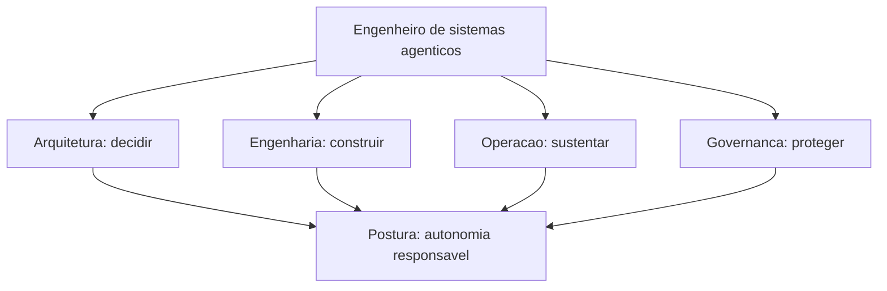

# Capítulo 4: Capítulo 20: O engenheiro de sistemas agênticos

## Introdução

Você construiu o OrquestraIA — do primeiro loop ao ciclo de operação contínua. Este capítulo final muda o foco do sistema para o **profissional** que o construiu: o engenheiro de sistemas agênticos — a habilidade, o perfil e a carreira de quem projeta, constrói e opera sistemas como o que você acabou de erguer [18][31]. A jornada de vinte capítulos não foi só técnica: foi a formação de uma mentalidade — a disciplina de autonomia responsável que este capítulo consolida.

O engenheiro de sistemas agênticos é um perfil novo e em alta: os dados do mercado mostram a adoção explosiva de agentes e o gargalo estrutural — a falta de profissionais que sabem projetar sistemas autônomos com governança [8][18]. O Gartner projeta que 40% das aplicações empresariais terão agentes até 2026 [12]; a McKinsey aponta a confiança — não a capacidade — como o gargalo da escala [18]. O resultado: quem sabe construir sistemas que merecem confiança tem o mercado aberto.

Ao final deste capítulo — e da obra — você terá o mapa do profissional: o **T-shaped engineer** (a profundidade no núcleo técnico e a largura no ecossistema), as competências em quatro dimensões (arquitetura, engenharia, operação e governança), o portfólio que prova a habilidade (o OrquestraIA é o seu), o roteiro de evolução e a postura — a ética e a responsabilidade do construtor de sistemas autônomos. O capítulo fecha a obra com o chamado: você não aprendeu a usar ferramentas — você aprendeu a construir sistemas que merecem confiança.

## Explica

### O Perfil T-Shaped

O engenheiro de sistemas agênticos é um perfil **T-shaped**: a barra vertical — a profundidade — é o núcleo técnico que este livro construiu: o loop, o contexto, a memória, as ferramentas, o orquestrador, os evals, a segurança, a supervisão, a observabilidade e a operação. A barra horizontal


— a largura — é o ecossistema: LLMs e APIs, bancos e vetores, MCP, frameworks, infraestrutura de produção, produto e negócio [18][31]. A profundidade é o que permite construir; a largura é o que permite escolher — e a escolha, como você viu, é a maior parte do trabalho.

O T-shaped não nasce pronto: nasce com a profundidade (os capítulos 1–10) e cresce com a largura (os capítulos 11–19 e a prática). A profundidade é o seu diferencial de empregabilidade — o mercado está cheio de "prompt engineers"; está vazio de engenheiros que entendem o loop por baixo, a segurança na fronteira e a operação contínua [8].

### As Quatro Dimensões de Competência

O perfil completo tem quatro dimensões [3][8][18]:

**Arquitetura**: desenhar sistemas — o espectro de arquiteturas (Capítulo 3), o padrão de orquestração (Capítulo 10), a decisão de framework (Capítulo 9), a escolha de padrões multiagente (Capítulo 12). A competência de decidir com critérios — a arquitetura mais simples que resolve o problema.

**Engenharia**: construir — o loop (Capítulo 2), o contexto (Capítulo 5), a memória (Capítulo 6), as ferramentas (Capítulo 7), o planejamento (Capítulo 8). A competência de implementar com contrato, validação e observação.

**Operação**: sustentar — o deploy (Capítulo 17), os casos de uso (Capítulo 18), o ciclo de operação (Capítulo 19), os custos (Capítulo 16). A competência de medir, aprender e melhorar.

**Governança**: proteger e responsabilizar — os evals (Capítulo 13), a segurança (Capítulo 14), a supervisão humana (Capítulo 15). A competência que o mercado mais valoriza e menos possui: a autonomia responsável [18].

### A Postura: O Construtor de Sistemas que Merecem Confiança

A postura é a quinta competência, a que atravessa as outras quatro: **o engenheiro de sistemas agênticos constrói sistemas que merecem confiança** — e a confiança se constrói com evidência (evals), limites (segurança e supervisão), visibilidade (observabilidade) e responsabilidade (operação contínua). A postura tem três hábitos: **medir antes de afirmar** (a evidência decide, não a intuição — Capítulo 13), **limitar antes de soltar** (a autonomia é uma concessão medida — Capítulo 15) e **aprender com o erro** (o erro é inevitável; a repetição é inaceitável — Capítulo 19) [8][18].

## Ilustra

### O Mestre de Obras que Entregou as Chaves

Volte à analogia com que este livro poderia ter começado — o engenheiro como mestre de obras que entrega as chaves do prédio. O construtor amador entrega o prédio que ficou de pé na vistoria; o mestre entrega o prédio que **funciona ao longo dos anos**:


fundação calculada (arquitetura), paredes inspecionadas (engenharia com verificação), manutenção prevista (operação) e normas respeitadas (governança). O OrquestraIA é o seu prédio — e este capítulo é a cerimônia de entrega das chaves: não do projeto, mas do **sistema vivo** que você saberá operar e evoluir [8].



### A Analogia do Piloto de Testes

Uma segunda lente: o piloto de testes da aviação. Ele não pilota aviões prontos — ele voa protótipos, encontra os limites, documenta o comportamento e devolve o avião melhor para a engenharia. O engenheiro de sistemas agênticos é o piloto de testes dos sistemas autônomos: constrói o sistema


(arquitetura e engenharia), voa em produção (operação), encontra os limites com segurança (governança) e devolve o sistema melhor a cada ciclo (Capítulo 19). A habilidade central não é pilotar — é **entender o sistema por dentro o suficiente para encontrar os limites antes de eles encontrarem você** [18].

## Técnica

### O Portfólio que Prova a Habilidade

O OrquestraIA é o seu portfólio — mas um portfólio não é um repositório: é uma **demonstração de competência com evidência**. O portfólio do engenheiro de sistemas agênticos deve mostrar as quatro dimensões com artefatos verificáveis:

```python
# portfolio.py — a estrutura do portfolio do engenheiro de sistemas agenticos
PORTFOLIO_ENGENHEIRO = {
    "arquitetura": [
        "diagrama do OrquestraIA (orquestrador + especialistas)",
        "ADR da decisao de framework (por que codigo puro, nao LangGraph)",
        "matriz de padroes multiagente por caso de uso",
    ],
    "engenharia": [
        "repo do OrquestraIA (loop, contexto, memoria, ferramentas)",
        "contratos de ferramentas com validacao e observacao",
        "pipeline de analise com verificacao em cada estagio",
    ],
    "operacao": [
        "dashboard com metricas reais (taxa de sucesso, custo por missao)",
        "ciclo de operacao: licoes de 30 dias de operacao",
        "otimizacao de custo medida (antes/depois)",
    ],
    "governanca": [
        "golden set com 20+ casos e taxa de regressao",
        "matriz de autonomia com niveis HITL por acao",
        "post-mortem de incidente com licao e correcao",
    ],
}

def resumo_portfolio() -> str:
    """O pitch de uma frase: o que o portfolio prova."""
    return ("Construi, implantei e operei um sistema multiagente (OrquestraIA) "
            "com orquestracao, memoria, ferramentas, evals, seguranca, "
            "supervisao humana e operacao continua — medindo custo, "
            "qualidade e autonomia com evidencia.")
```

A regra do portfólio: **cada item prova uma competência com um artefato** — sem artefato, é currículo; com artefato e métrica, é evidência [18].

### O Roteiro de Evolução

A carreira do engenheiro de sistemas agênticos é um roteiro de aprofundamento contínuo — os três próximos saltos depois desta obra:

```python
# roteiro.py — os proximos passos de evolucao
ROTEIRO_EVOLUCAO = [
    {
        "salto": "Producao real",
        "acao": "Implantar o OrquestraIA com um provedor real (LLM gateway, "
                "fila, banco) e operar 30 dias com metricas.",
        "competencias": ["operacao", "engenharia"],
    },
    {
        "salto": "Multiagente avancado",
        "acao": "Explorar debate e hierarquia em um dominio com subespecialidades "
                "— medindo o custo-beneficio de cada padrao.",
        "competencias": ["arquitetura"],
    },
    {
        "salto": "Governanca em escala",
        "acao": "Projetar a matriz de autonomia e o HITL de um sistema com "
                "regulacao (financeiro, saude) — o perfil mais raro e valorizado.",
        "competencias": ["governanca"],
    },
]

def proximo_salto(indice: int = 0) -> str:
    """O proximo passo concreto do roteiro."""
    s = ROTEIRO_EVOLUCAO[indice]
    return f"{s['salto']}: {s['acao']}"
```

O roteiro não é uma lista de cursos: é uma sequência de **sistemas reais** — cada salto é um sistema a mais construído e operado, porque a competência do perfil se prova com sistemas, não com certificados [18].

### A Postura na Prática: O Código de Conduta

A postura vira código de conduta — as regras que o engenheiro de sistemas agênticos aplica em todo projeto:

1. **Evidência antes de afirmação**: toda mudança roda contra o golden set; toda autonomia tem limiar medido.
2. **Limites antes de autonomia**: o permissor e a supervisão nascem com o sistema, não depois.
3. **Dado é dado, instrução é instrução**: a fronteira do contexto é tratada como requisito de segurança.
4. **O erro vira lição, a lição vira caso**: a operação alimenta o golden set, que alimenta a melhoria.
5. **O humano decide o que importa**: a supervisão não é burocracia — é a responsabilidade que a autonomia exige.

### Checklist do Profissional

- [ ] **Profundidade**: o núcleo técnico (loop, contexto, memória, ferramentas, orquestração) é dominado?
- [ ] **Largura**: o ecossistema (LLMs, MCP, bancos, frameworks, infra) é conhecido?
- [ ] **Quatro dimensões**: arquitetura, engenharia, operação e governança com artefatos?
- [ ] **Portfólio**: cada competência provada com um sistema real e uma métrica?
- [ ] **Postura**: evidência, limites, aprendizado e responsabilidade na prática?

## Aplica

### O Profissional no Chão de Fábrica

O engenheiro de sistemas agênticos é o profissional que o mercado de 2026 procura: o Gartner projeta 40% das aplicações com agentes [12]; a McKinsey aponta a confiança como o gargalo da escala [18]; e os dados de adoção mostram a maioria ainda em piloto por falta de quem construa com governança [8]. O perfil que entrega valor não é o que "sabe prompts" — é o que constrói sistemas completos com medição, segurança e operação: exatamente o que o OrquestraIA te ensinou.

A aplicação do perfil tem três frentes: **produto** (construir agentes que resolvem problemas de negócio — os casos de uso do Capítulo 18), **plataforma** (construir a infraestrutura que outros times usam — gateways, evals, observabilidade — os Capítulos 13, 16 e 17) e **governança** (definir as políticas que toda a organização segue — segurança, supervisão e autonomia — os Capítulos 14 e 15). O profissional completo transita entre as três frentes — e o OrquestraIA te deu as ferramentas das três [3][18].

### Armadilhas Comuns

1. **Ficar na superfície**: dominar prompts e demos sem o núcleo técnico — o mercado paga pela profundidade, não pela superfície.
2. **Construir sem medir**: sistemas sem evals e painel — protótipos, não produtos.
3. **Autonomia sem governança**: sistemas que agem sem limites e supervisão — a falha mais previsível do mercado.
4. **Portfólio sem evidência**: listas de cursos sem sistemas reais — o portfólio prova com artefatos e métricas.
5. **Parar no deploy**: entregar o sistema e abandonar a operação — o valor está na operação contínua (Capítulo 19).

### Conexão com o OrquestraIA

O OrquestraIA é a sua tese de mestrado prática: vinte capítulos, um sistema completo — do primeiro loop ao ciclo de operação. Cada componente do portfólio do profissional já existe no seu projeto: a arquitetura (Capítulos 3, 9, 10, 12), a engenharia (Capítulos 2, 5, 6, 7, 8), a operação (Capítulos 16, 17, 18, 19) e a governança (Capítulos 13, 14, 15). O que falta não é aprender: é **construir o próximo sistema** — e o roteiro deste capítulo mostra o caminho.

### Aprofundamento: O Mercado de Trabalho do Campo

O mercado de sistemas agênticos em 2026 tem um contorno claro para quem olha os dados: a demanda por construtores cresce com a adoção — o Gartner projeta 40% das aplicações com agentes [10] — e o gargalo não é a oferta de modelos, é a oferta de **profissionais que constroem com governança** [18]. O perfil valorizado não é o "prompt engineer" (a superfície, que o mercado já aprendeu a não pagar


caro) — é o engenheiro de sistemas: quem projeta a arquitetura, constrói o loop, mede com evals, protege com segurança, supervisiona com HITL e opera com ciclo contínuo. As quatro dimensões deste capítulo são exatamente os quatro pilares que os processos seletivos de 2026 avaliam — e o portfólio do capítulo é o material de resposta: cada pergunta de entrevista é respondida com um artefato do OrquestraIA e uma métrica real [8][18].

### O Roteiro de Aprendizado Contínuo

O campo evolui em ciclos de meses — e o engenheiro de sistemas agênticos tem um roteiro de aprendizado contínuo que acompanha o movimento: **acompanhar as fontes primárias** (os blogs de engenharia dos provedores e as publicações acadêmicas — a evidência da mudança vem da fonte, não do resumo de terceiros), **reproduzir as novidades** (cada técnica nova é implementada no seu laboratório — o OrquestraIA é o laboratório — com o golden set


medindo o ganho), **ensinar o que aprendeu** (a transmissão é a prova do domínio — o desafio final do capítulo) e **manter o portfólio vivo** (cada sistema novo entra no portfólio com as métricas — o portfólio é um organismo, não um arquivo). O aprendizado contínuo é a quinta postura do engenheiro: o campo muda, e a habilidade central — construir sistemas que merecem confiança — é a constante que atravessa as mudanças [8][18].

### Aprofundamento: A Ética do Construtor de Sistemas Autônomos

A postura do engenheiro de sistemas agênticos tem uma dimensão que transcende a técnica: a **ética do construtor** — a responsabilidade sobre os sistemas que ganham autonomia sobre decisões que afetam pessoas. Três princípios orientam a prática: **transparência de autonomia** (o usuário sabe quando está falando com um agente e qual o nível de autonomia da ação — a confiança que o Capítulo 15 constrói começa na honestidade), **responsabilidade de decisão** (o humano é responsável pelas decisões de alto impacto


— a supervisão do Capítulo 15 não é burocracia, é responsabilidade distribuída) e **aprendizado contínuo com os erros** (o sistema que erra, registra a lição e melhora — o Capítulo 19 — é o sistema que merece continuar operando). A ética do construtor é a aplicação, no nível profissional, dos princípios que atravessam esta obra: autonomia com limites, decisão com supervisão, erro com aprendizado — e o engenheiro que os pratica é o que o mercado de 2026 procura [18][24].

### O Legado: O Sistema como Contribuição ao Campo

A jornada do engenheiro de sistemas agênticos termina numa contribuição que transcende o próprio projeto: o sistema construído — o OrquestraIA ou o seu — é uma **contribuição ao campo** quando documenta o que funcionou, o que falhou e o que foi aprendido. A prática recomendada: o relatório pós-projeto (o que o sistema provou, com as métricas), o repositório aberto (o código com a documentação de decisão — os ADRs do


Capítulo 9), os artigos e palestras (a transmissão que o desafio final deste capítulo pede) e as lições compartilhadas (a memória episódica do Capítulo 6, agora pública). O campo avança quando os construtores compartilham — e a sua contribuição é a sua assinatura: o sistema que você construiu, operou e documentou é a prova de que você domina a disciplina — e a semente do próximo construtor que ela inspira [8][18].

## Conclusão

Três pontos para levar: **primeiro**, o engenheiro de sistemas agênticos é um perfil T-shaped — profundidade no núcleo técnico (o loop, o contexto, a memória, as ferramentas, a orquestração) e largura no ecossistema — com quatro dimensões de competência: arquitetura, engenharia, operação e governança. **Segundo**, a postura é a quinta competência — construir


sistemas que merecem confiança: evidência antes de afirmação, limites antes de autonomia, dado separado de instrução, erro que vira lição e o humano que decide o que importa. **Terceiro**, o portfólio prova com sistemas reais e métricas — e o OrquestraIA é o seu primeiro sistema completo, a base do roteiro de evolução.

Esta obra termina onde o seu trabalho começa. Você não aprendeu a usar agentes — você aprendeu a **construir, implantar e operar sistemas de IA autônomos** com arquitetura, engenharia, governança e operação. O OrquestraIA está pronto; as chaves são suas. Construa o próximo sistema — e o próximo — porque o mercado de 2026 não procura quem fala sobre agentes: procura quem os constrói com responsabilidade [8][18].

**Desafio final**: monte o seu portfólio com os artefatos das quatro dimensões (o OrquestraIA fornece todos), escreva o pitch de uma frase (o `resumo_portfolio` do capítulo) e escolha o seu próximo salto do roteiro. Depois, ensine o que você aprendeu a uma pessoa — a melhor prova de domínio é a transmissão. Bem-vindo à profissão.

## Para se aprofundar

Este capítulo faz parte do e-book **Implantação e Operação Contínua**, extraído da obra completa *IA Agêntica Desbloqueada: Um guia para projetar, construir e implantar sistemas de IA autônomos*. No livro-mãe, você encontra o mesmo conteúdo com aprofundamento técnico adicional: diagramas Mermaid, blocos de código executáveis, referências ABNT verificáveis e a narrativa completa do projeto OrquestraIA — do primeiro agente ao monitoramento em produção.

Se este e-book despertou sua atenção para a construção de sistemas de IA autônomos, o próximo passo natural é levar o aprendizado para o seu próprio contexto: escolha um problema pequeno e bem delimitado, desenhe o agent loop com uma única ferramenta e uma única política de autonomia, e meça o resultado antes de escalar. A autonomia é uma concessão que se conquista com evidência.

**Quer continuar?** Explore os demais e-books da série: *Implantação e Operação Contínua* é apenas uma parte do caminho — os outros volumes cobrem o desenho do sistema, a construção prática, a governança e a operação contínua.
